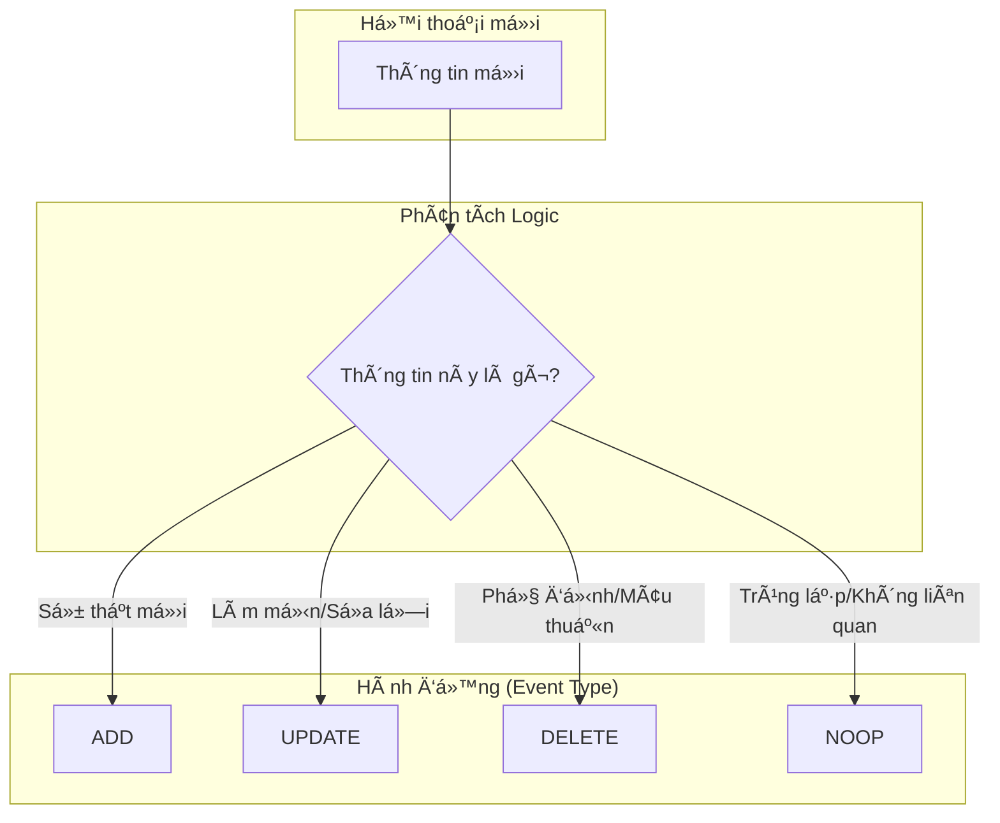
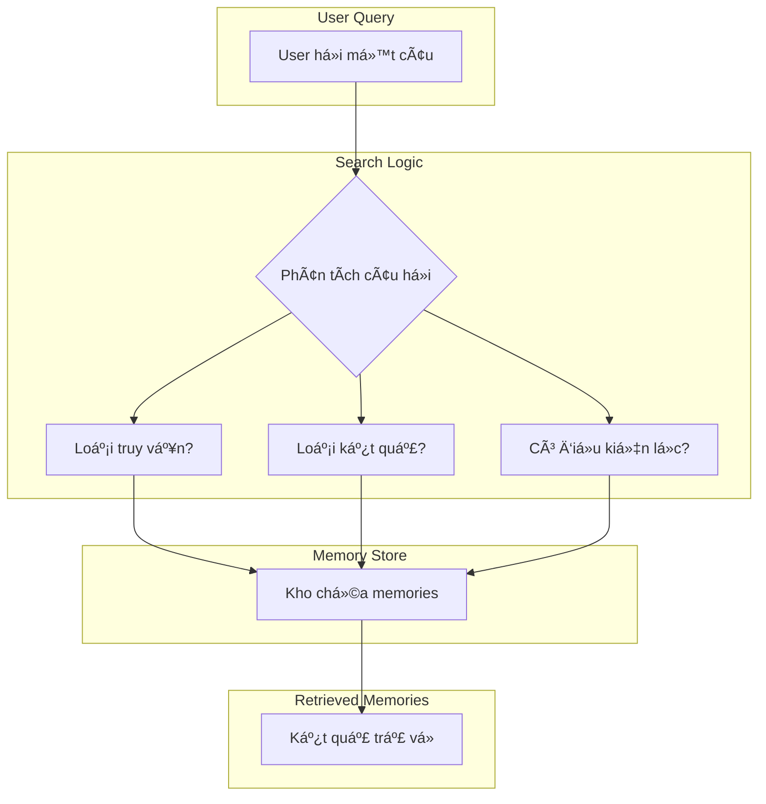
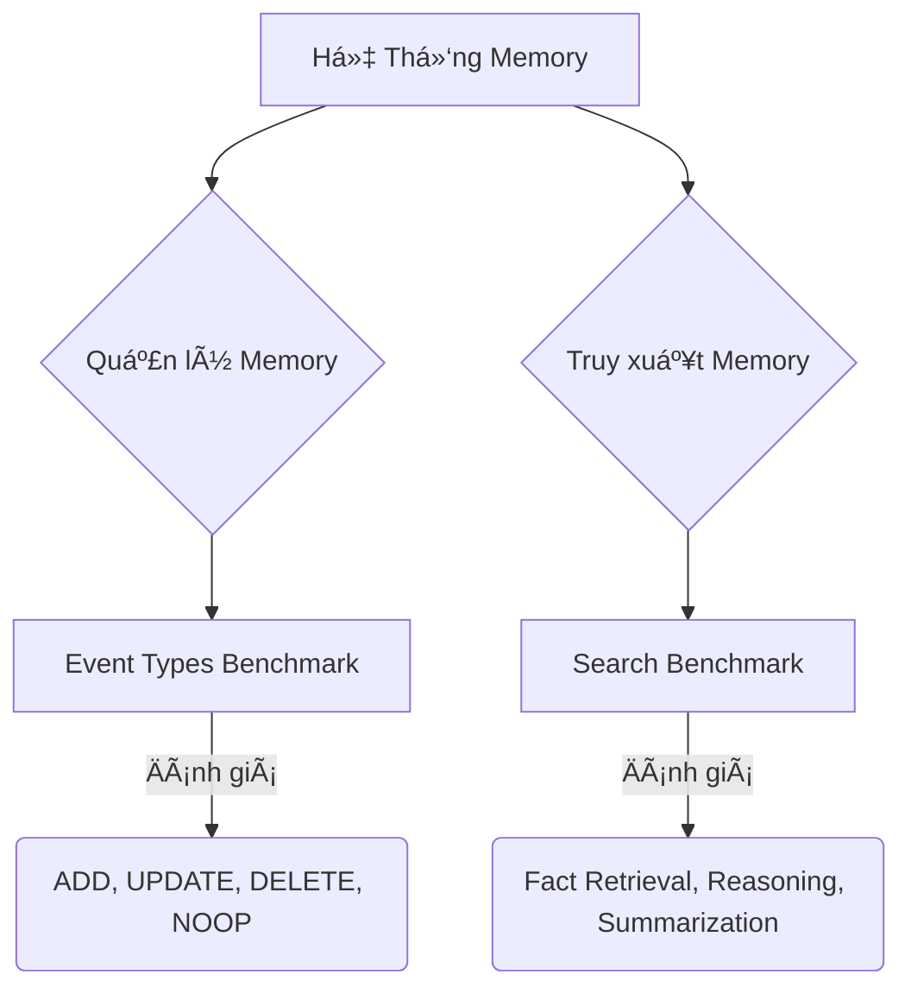
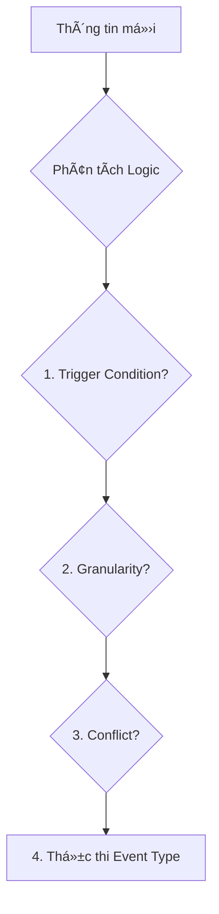
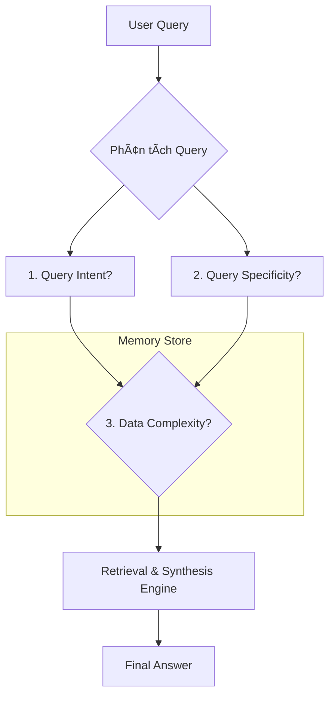
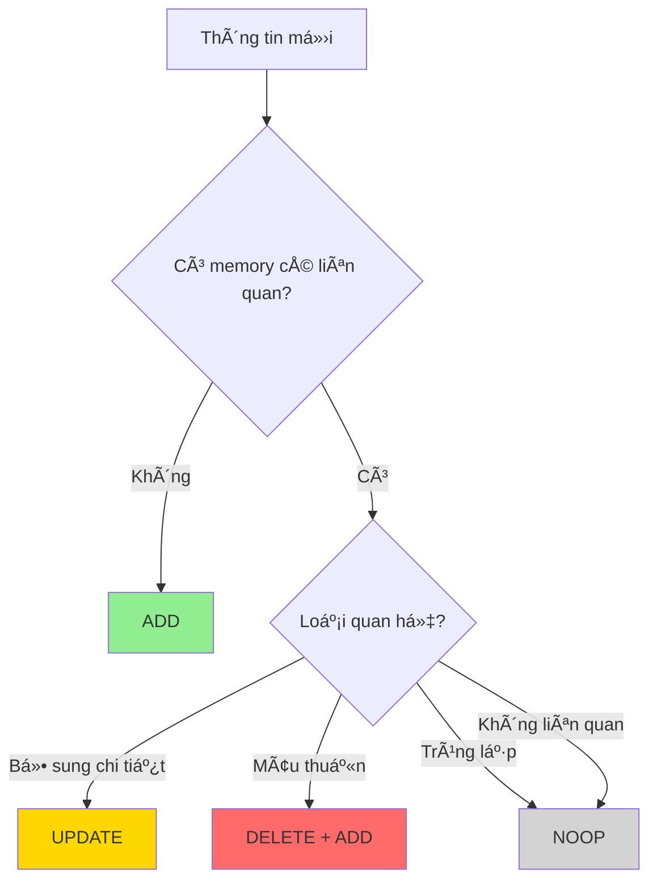
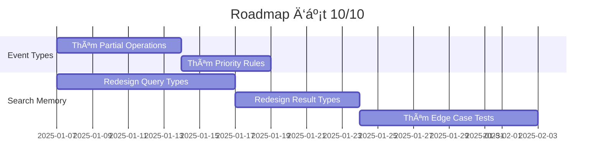

## Cách Build Bộ Benchmark MECE cho Các Event Types (ADD, UPDATE, DELETE, NOOP)

Äể xây dá»±ng má»™t bá»™ benchmark MECE (Mutually Exclusive, Collectively Exhaustive) toàn diện cho các **Event Types** của hệ thống memory (lấy cảm hứng từ Mem0), tôi sẽ cấu trúc bá»™ test xoay quanh **hành Ä‘á»™ng mà hệ thống memory cần thá»±c hiện**.

Äây là cách tiếp cận khác vá»›i việc chỉ tập trung vào "UPDATE". Thay vào đó, chúng ta sẽ đánh giá khả năng của hệ thống trong việc **phân loại và thá»±c thi đúng hành Ä‘á»™ng** cho má»—i mẩu thông tin má»›i.

### Bước 1: Xây dựng Khung MECE

Khung MECE này sẽ có 2 chiá»u chính:

**1. Chiá»u dá»c: Loại Sá»± kiện (Event Type) - Hành Ä‘á»™ng cần thá»±c thi**
Äây là các hành Ä‘á»™ng cốt lõi, không trùng lặp, mà hệ thống memory phải quyết định:

- **`ADD`**: Thêm một memory hoàn toàn mới, không liên quan đến các memory đã có.
- **`UPDATE`**: Cập nhật, làm rõ, hoặc bổ sung thông tin cho một memory **đã tồn tại**.
- **`DELETE`**: Xóa bỠmột memory **đã tồn tại** vì nó đã bị phủ định hoặc không còn đúng nữa.
- **`NOOP` (No Operation)**: Không làm gì cả, vì thông tin má»›i không quan trá»ng, không liên quan, hoặc đã bị trùng lặp.

**2. Chiá»u ngang: Äiá»u kiện Kích hoạt (Trigger Condition) - Lý do thá»±c thi hành Ä‘á»™ng**
Äây là các tình huống trong há»™i thoại, má»—i tình huống sẽ tÆ°Æ¡ng ứng vá»›i má»™t (và chỉ má»™t) Event Type ở trên:

- **`New Fact` (Sự thật mới)**: Một thông tin hoàn toàn mới được đưa ra. -> **Dự kiến trigger `ADD`**.
- **`Refinement` (Làm mịn)**: Thêm chi tiết, làm rõ một memory đã có. -> **Dự kiến trigger `UPDATE`**.
- **`Correction` (Sửa lỗi)**: Sửa lại một thông tin sai đã được ghi nhớ. -> **Dự kiến trigger `UPDATE`**.
- **`Contradiction` (Mâu thuẫn)**: ÄÆ°a ra thông tin trái ngược hoàn toàn vá»›i memory cÅ©. -> **Dá»± kiến trigger `DELETE` memory cÅ© và `ADD` memory má»›i**.
- **`Evolution` (Tiến hóa)**: Má»™t thông tin thay đổi theo thá»i gian (ví dụ: tuổi, sở thích). -> **Dá»± kiến trigger `UPDATE`**.
- **`Negation` (Phủ định)**: Phủ định trực tiếp một memory. -> **Dự kiến trigger `DELETE`**.
- **`Redundancy` (Trùng lặp)**: Lặp lại một thông tin đã biết. -> **Dự kiến trigger `NOOP`**.
- **`Irrelevance` (Không liên quan)**: Thông tin ngoài lá», không đáng ghi nhá»› (ví dụ: "hôm nay trá»i đẹp"). -> **Dá»± kiến trigger `NOOP`**.

### Bước 2: Tạo Test Cases Chi Tiết

Vá»›i má»—i **Äiá»u kiện Kích hoạt**, tôi sẽ tạo má»™t test case cụ thể để kiểm tra xem hệ thống có trigger đúng **Event Type** hay không.

**Ví dụ:**

- **Test Case cho `Refinement` -> `UPDATE`**:

  - **Input**: `Memory cũ: "User là AI Engineer"` -> `User nói: "Tôi chuyên vỠLLM và RAG"`.
  - **Expected Output**: Hệ thống trigger event **`UPDATE`**. Memory cũ được cập nhật thành `"User là AI Engineer, chuyên vỠLLM và RAG"`.
  - **Pass Criteria**: Event type là `UPDATE` và nội dung memory được cập nhật chính xác.
- **Test Case cho `Contradiction` -> `DELETE` + `ADD`**:

  - **Input**: `Memory cÅ©: "User thích màu xanh"` -> `User nói: "Tôi ghét màu xanh, tôi thích màu Ä‘á»"`.
  - **Expected Output**: Hệ thống trigger event **`DELETE`** cho memory "User thích màu xanh" và event **`ADD`** cho memory "User thích màu Ä‘á»".
  - **Pass Criteria**: Memory cũ bị xóa và memory mới được thêm vào.

Bằng cách này, bộ test sẽ bao quát toàn bộ các tình huống logic mà hệ thống memory cần xử lý, đảm bảo đánh giá được khả năng "ra quyết định" của nó một cách toàn diện.


---


### Bộ Benchmark MECE cho Các Event Types (ADD, UPDATE, DELETE, NOOP)

## I. Khung MECE và Sơ đồ Logic

Bá»™ benchmark này được xây dá»±ng dá»±a trên má»™t nguyên tắc cốt lõi: Má»—i **tình huống (Trigger Condition)** trong há»™i thoại sẽ chỉ kích hoạt má»™t **hành Ä‘á»™ng (Event Type)** duy nhất. SÆ¡ đồ dÆ°á»›i đây minh há»a logic này:



### II. Bảng Ãnh xạ MECE: Trigger Condition -> Expected Event

| ID           | Trigger Condition                         | Mô tả                                                         | Expected Event                    |
| :----------- | :---------------------------------------- | :-------------------------------------------------------------- | :-------------------------------- |
| **C1** | **New Fact** (Sự thật mới)       | Một thông tin hoàn toàn mới, không có trong bộ nhớ.    | `ADD`                           |
| **C2** | **Refinement** (Làm mịn)          | Bổ sung chi tiết cho một memory đã có.                    | `UPDATE`                        |
| **C3** | **Correction** (Sửa lỗi)          | Sửa lại một thông tin sai trong memory.                     | `UPDATE`                        |
| **C4** | **Evolution** (Tiến hóa)          | Má»™t thông tin thay đổi theo thá»i gian (tuổi, sở thích). | `UPDATE`                        |
| **C5** | **Contradiction** (Mâu thuẫn)     | Thông tin mới mâu thuẫn hoàn toàn với memory cũ.        | `DELETE` (cũ) + `ADD` (mới) |
| **C6** | **Negation** (Phủ định)          | Phủ định trực tiếp một memory đã có.                   | `DELETE`                        |
| **C7** | **Redundancy** (Trùng lặp)        | Lặp lại chính xác một thông tin đã có.                 | `NOOP`                          |
| **C8** | **Irrelevance** (Không liên quan) | Thông tin ngoài lá», không đáng ghi nhá»›.                  | `NOOP`                          |

---

## III. Test Cases Chi Tiết

### **Category 1: `ADD` Event**

#### **Test Case C1.1: New Fact (Sự thật mới)**

- **ID**: `ET-ADD-01`
- **Mô tả**: Kiểm tra khả năng thêm một memory mới khi có thông tin mới.
- **Input**:
  - `Initial Memory`: `[]` (trống)
  - `Conversation`: `User: "Tôi là CÆ°á»ng, má»™t AI Engineer."`
- **Expected Output**:
  - `Event`: `ADD`
  - `New Memory`: `{"content": "Tên là CÆ°á»ng", ...}`
  - `New Memory`: `{"content": "Là một AI Engineer", ...}`
- **Success Criteria**: Hệ thống trả vỠ2 event `ADD` và tạo ra 2 memory mới chính xác.

---

### **Category 2: `UPDATE` Event**

#### **Test Case C2.1: Refinement (Làm mịn)**

- **ID**: `ET-UPD-01`
- **Mô tả**: Kiểm tra khả năng cập nhật (làm mịn) một memory đã có.
- **Input**:
  - `Initial Memory`: `[{"id": "mem_1", "content": "User là AI Engineer"}]`
  - `Conversation`: `User: "Tôi chuyên vỠLLM và hệ thống RAG."`
- **Expected Output**:
  - `Event`: `UPDATE`
  - `Target Memory ID`: `mem_1`
  - `Updated Memory`: `{"id": "mem_1", "content": "User là AI Engineer, chuyên vỠLLM và RAG"}`
- **Success Criteria**: Hệ thống trả vỠevent `UPDATE` và nội dung memory được cập nhật chính xác.

#### **Test Case C3.1: Correction (Sá»­a lá»—i)**

- **ID**: `ET-UPD-02`
- **Mô tả**: Kiểm tra khả năng cập nhật (sửa lỗi) một memory đã có.
- **Input**:
  - `Initial Memory`: `[{"id": "mem_2", "content": "User thích màu xanh lá"}]`
  - `Conversation`: `User: "Nhầm rồi, tôi thích màu xanh dương."`
- **Expected Output**:
  - `Event`: `UPDATE`
  - `Target Memory ID`: `mem_2`
  - `Updated Memory`: `{"id": "mem_2", "content": "User thích màu xanh dương"}`
- **Success Criteria**: Hệ thống trả vỠevent `UPDATE` và nội dung memory được sửa lỗi chính xác.

#### **Test Case C4.1: Evolution (Tiến hóa)**

- **ID**: `ET-UPD-03`
- **Mô tả**: Kiểm tra khả năng cập nhật má»™t memory đã thay đổi theo thá»i gian.
- **Input**:
  - `Initial Memory`: `[{"id": "mem_3", "content": "User 25 tuổi", "timestamp": "2024-01-01"}]`
  - `Conversation (2025-01-01)`: `User: "Hôm nay là sinh nhật tôi."`
- **Expected Output**:
  - `Event`: `UPDATE`
  - `Target Memory ID`: `mem_3`
  - `Updated Memory`: `{"id": "mem_3", "content": "User 26 tuổi", "timestamp": "2025-01-01"}`
- **Success Criteria**: Hệ thống tự động suy luận và cập nhật tuổi của user.

---

### **Category 3: `DELETE` Event**

#### **Test Case C5.1: Contradiction (Mâu thuẫn)**

- **ID**: `ET-DEL-01`
- **Mô tả**: Kiểm tra khả năng xóa memory cũ khi có thông tin mâu thuẫn.
- **Input**:
  - `Initial Memory`: `[{"id": "mem_4", "content": "User thích chó"}]`
  - `Conversation`: `User: "Tôi không thích chó, tôi chỉ thích mèo thôi."`
- **Expected Output**:
  - `Event 1`: `DELETE`, `Target Memory ID`: `mem_4`
  - `Event 2`: `ADD`, `New Memory`: `{"content": "User thích mèo"}`
- **Success Criteria**: Hệ thống trả vỠevent `DELETE` cho memory cũ và `ADD` cho memory mới.

#### **Test Case C6.1: Negation (Phủ định)**

- **ID**: `ET-DEL-02`
- **Mô tả**: Kiểm tra khả năng xóa memory khi bị phủ định trực tiếp.
- **Input**:
  - `Initial Memory`: `[{"id": "mem_5", "content": "User sống ở Hà Nội"}]`
  - `Conversation`: `User: "Tôi không còn sống ở Hà Nội nữa."`
- **Expected Output**:
  - `Event`: `DELETE`
  - `Target Memory ID`: `mem_5`
- **Success Criteria**: Hệ thống trả vỠevent `DELETE` và xóa memory tương ứng.

---

### **Category 4: `NOOP` Event**

#### **Test Case C7.1: Redundancy (Trùng lặp)**

- **ID**: `ET-NOOP-01`
- **Mô tả**: Kiểm tra khả năng bỠqua thông tin trùng lặp.
- **Input**:
  - `Initial Memory`: `[{"id": "mem_6", "content": "User là AI Engineer"}]`
  - `Conversation`: `User: "Tôi là một kỹ sư AI."`
- **Expected Output**:
  - `Event`: `NOOP`
  - `Reason`: `Redundant information`
- **Success Criteria**: Hệ thống trả vỠevent `NOOP` và không tạo/cập nhật memory nào.

#### **Test Case C8.1: Irrelevance (Không liên quan)**

- **ID**: `ET-NOOP-02`
- **Mô tả**: Kiểm tra khả năng bỠqua thông tin không liên quan.
- **Input**:
  - `Initial Memory`: `[]`
  - `Conversation`: `User: "Hôm nay thá»i tiết đẹp thật."`
- **Expected Output**:
  - `Event`: `NOOP`
  - `Reason`: `Irrelevant information`
- **Success Criteria**: Hệ thống trả vỠevent `NOOP` và không tạo memory mới memory nào được tạo.

---


## Bá»™ Benchmark MECE cho SEARCH Memory

## I. Khung MECE và Sơ đồ Logic

Bá»™ benchmark này đánh giá khả năng của hệ thống trong việc **tìm kiếm, truy xuất, và tổng hợp** memories má»™t cách chính xác và phù hợp vá»›i ngữ cảnh. Khung MECE được xây dá»±ng dá»±a trên 3 chiá»u (dimensions) không trùng lặp:

1. **Loại Truy vấn (Query Type)**: User há»i theo cách nào?
2. **Loại Kết quả Mong muốn (Expected Result Type)**: Hệ thống cần trả vỠcái gì?
3. **Äiá»u kiện Lá»c (Filtering Conditions)**: Tìm kiếm có bị giá»›i hạn bởi Ä‘iá»u kiện nào không?

Sơ đồ logic:



### II. Bảng Ãnh xạ MECE: Query x Result x Filter

|                            | **Specific Fact**     | **List of Facts**    | **Summarized Info**  | **Inference**       |
| :------------------------- | :-------------------------- | :------------------------- | :------------------------- | :------------------------ |
| **Direct Query**     | Lấy 1 sự thật            | Lấy danh sách            | Tóm tắt theo chủ đỠ  | Suy luận đơn giản     |
| **Indirect Query**   | Suy luận 1 sự thật       | Suy luận danh sách       | Tóm tắt theo mục đích | Suy luận phức tạp      |
| **Contextual Query** | Lấy 1 sự thật liên quan | Lấy danh sách liên quan | Tóm tắt theo ngữ cảnh  | Suy luận theo ngữ cảnh |
| **Vague Query**      | Lấy 1 sự thật nổi bật  | Lấy danh sách nổi bật  | Tóm tắt toàn bộ        | Suy luận mở             |

*Má»—i ô trong bảng trên sẽ được kết hợp vá»›i các **Äiá»u kiện Lá»c** (Time-based, Category-based, Confidence-based, Recency-based, No Filter) để tạo ra các test case đầy đủ.*

---

## III. Test Cases Chi Tiết

### **Category 1: Direct Queries**

#### **Test Case SM-D1: Direct + Specific Fact + No Filter**

- **ID**: `SM-D1-SF-NF`
- **Mô tả**: User há»i trá»±c tiếp vá» má»™t thông tin cụ thể.
- **Input**:
  - `Memories`: `[{"content": "User thích màu xanh dương"}]`
  - `Query`: `"Tôi thích màu gì?"`
- **Expected Output**: `"Bạn thích màu xanh dương"`
- **Success Criteria**: Trả vỠđúng thông tin, độ chính xác 100%.

#### **Test Case SM-D2: Direct + List of Facts + Category-based**

- **ID**: `SM-D2-LF-CB`
- **Mô tả**: User há»i trá»±c tiếp vá» má»™t danh sách thông tin theo danh mục.
- **Input**:
  - `Memories`: `[{"content": "Thích Python", "category": "programming"}, {"content": "Thích JavaScript", "category": "programming"}, {"content": "Thích Ä‘á»c sách", "category": "hobby"}]`
  - `Query`: `"Tôi thích những ngôn ngữ lập trình nào?"`
- **Expected Output**: `"Bạn thích Python và JavaScript."`
- **Success Criteria**: Trả vỠđúng và đủ các memory thuộc category "programming".

---

### **Category 2: Indirect Queries**

#### **Test Case SM-I1: Indirect + List of Facts + Category-based**

- **ID**: `SM-I1-LF-CB`
- **Mô tả**: User há»i gián tiếp, cần suy luận và tổng hợp từ nhiá»u memories.
- **Input**:
  - `Memories`: `[{"content": "Thích Ä‘á»c sách khoa há»c", "category": "hobby"}, {"content": "Thích xem phim viá»…n tưởng", "category": "hobby"}]`
  - `Query`: `"Cuối tuần này tôi nên làm gì để giải trí?"`
- **Expected Output**: `"Dá»±a trên sở thích của bạn, bạn có thể Ä‘á»c sách khoa há»c hoặc xem phim viá»…n tưởng."`
- **Success Criteria**: Hệ thống suy luận đúng mục đích "giải trí" và truy xuất các memory từ category "hobby".

#### **Test Case SM-I2: Indirect + Inference + Time-based**

- **ID**: `SM-I2-IN-TB`
- **Mô tả**: User há»i gián tiếp, cần suy luận phức tạp hÆ¡n dá»±a trên thá»i gian.
- **Input**:
  - `Memories`: `[{"content": "Äã mua vé xem phim 'Dune' vào tuần trÆ°á»›c"}, {"content": "Thích phim viá»…n tưởng"}]`
  - `Query`: `"Tôi đã xem bộ phim nào gần đây chưa?"`
- **Expected Output**: `"Gần đây bạn đã mua vé xem phim 'Dune'. Äây là má»™t bá»™ phim viá»…n tưởng mà bạn thích."`
- **Success Criteria**: Hệ thống kết hợp được memory vá» hành Ä‘á»™ng ("mua vé") và sở thích để Ä‘Æ°a ra câu trả lá»i suy luận.

---

### **Category 3: Contextual Queries**

#### **Test Case SM-C1: Contextual + Specific Fact + Recency-based**

- **ID**: `SM-C1-SF-RB`
- **Mô tả**: User há»i theo ngữ cảnh, cần lấy thông tin gần nhất.
- **Input**:
  - `Memories`: `[{"content": "User Ä‘ang há»c Python"}, {"content": "User vừa há»i vá» thÆ° viện Pandas"}]`
  - `Conversation Context`: `User vừa há»i: "Làm sao để Ä‘á»c file CSV?"`
  - `Query`: `"Thư viện nào làm được việc đó?"`
- **Expected Output**: `"Bạn có thể dùng thÆ° viện Pandas để Ä‘á»c file CSV."`
- **Success Criteria**: Hệ thống sá»­ dụng ngữ cảnh gần nhất ("há»i vá» Pandas") để trả lá»i câu há»i.

---

### **Category 4: Vague Queries**

#### **Test Case SM-V1: Vague + Summarized Info + Confidence-based**

- **ID**: `SM-V1-SI-CFB`
- **Mô tả**: User há»i má»™t câu mÆ¡ hồ, hệ thống cần tóm tắt các thông tin quan trá»ng nhất.
- **Input**:
  - `Memories`: `[{"content": "Tên là CÆ°á»ng", "confidence": 1.0}, {"content": "Làm AI Engineer", "confidence": 1.0}, {"content": "Thích LLM", "confidence": 0.9}, {"content": "Thích màu xanh", "confidence": 0.8}, {"content": "Từng há»i vá» giá cổ phiếu", "confidence": 0.5}]`
  - `Query`: `"Nhắc lại vỠtôi xem nào."`
- **Expected Output**: `"Bạn tên là CÆ°á»ng, má»™t AI Engineer chuyên vá» LLM và bạn thích màu xanh."`
- **Success Criteria**: Hệ thống tóm tắt các memory có confidence cao (> 0.7) và bỠqua các memory có confidence thấp.

---

### **Category 5: Filtering Conditions**

#### **Test Case SM-F1: Time-based Filtering**

- **ID**: `SM-F1-TB`
- **Mô tả**: Kiểm tra khả năng lá»c memory theo thá»i gian.
- **Input**:
  - `Memories`: `[{"content": "Thứ 2 ăn phở", "timestamp": "2025-12-22"}, {"content": "Thứ 6 ăn bún", "timestamp": "2025-12-26"}, {"content": "Tháng 11 ăn cơm rang", "timestamp": "2025-11-15"}]`
  - `Query`: `"Trong tuần này tôi đã ăn gì?"` (Giả sử hôm nay là 27/12/2025)
- **Expected Output**: `"Trong tuần này bạn đã ăn phở và bún."`
- **Success Criteria**: Hệ thống lá»c và trả vỠđúng các memory trong khoảng thá»i gian "tuần này".

# 📊 Äánh Giá Äá»™ MECE của 2 Bá»™ Benchmark

Sau khi phân tích chi tiết 3 file tài liệu, tôi xin đưa ra đánh giá toàn diện vỠđộ MECE của 2 bộ test này:

---

## 🯠Tóm Tắt Kết Luận

| Bá»™ Test                          | Äá»™ MECE (ME)      | Äá»™ MECE (CE)     | Äiểm Tổng Thể    | Nhận Xét Chung                                |
| --------------------------------- | ------------------- | ------------------ | -------------------- | ----------------------------------------------- |
| **Event Types Benchmark**   | â­â­â­â­â­ (9.5/10) | â­â­â­â­â­ (10/10) | **Xuất sắc** | Khung logic chặt chẽ, phân loại rõ ràng   |
| **Search Memory Benchmark** | â­â­â­ (6.5/10)     | â­â­â­â­ (8/10)    | **Khá tốt**  | Có overlap, thiếu má»™t số trÆ°á»ng hợp edge |

---

## 📋 I. Äánh Giá Bá»™ “Event Types Benchmarkâ€

### ✅ Äiểm Mạnh (Mutually Exclusive - ME)

**1. Phân loại Event Types rất rõ ràng và không trùng lặp:**

```
ADD ───> Thông tin hoàn toàn mới
UPDATE ─> Làm mịn/Sửa lỗi/Tiến hóa thông tin CŨ
DELETE ─> Phủ định/Mâu thuẫn với thông tin CŨ  
NOOP ───> Trùng lặp/Không liên quan
```

* **Không có overlap** : Mỗi trigger condition chỉ ánh xạ đến **DUY NHẤT** 1 event type
* **Logic rõ ràng** : Dựa trên mối quan hệ với memory đã tồn tại
* Có memory cũ liên quan? → UPDATE hoặc DELETE
* Không có memory cũ? → ADD hoặc NOOP

**2. Bảng Ãnh Xạ MECE trong Section II rất chặt chẽ:**

| Trigger Condition | Event Type   | Lý Do Không Overlap                           |
| ----------------- | ------------ | ----------------------------------------------- |
| New Fact          | ADD          | Hoàn toàn mới, không liên quan memory cũ  |
| Refinement        | UPDATE       | Bổ sung chi tiết cho memory ÄÃ CÓ          |
| Correction        | UPDATE       | Sá»­a lá»—i memory ÄÃ CÓ                       |
| Evolution         | UPDATE       | Thay đổi theo thá»i gian memory Äà CÓ      |
| Contradiction     | DELETE + ADD | Mâu thuẫn HOÀN TOÀN → xóa cũ + tạo mới |
| Negation          | DELETE       | Phủ định TRỰC TIẾP                         |
| Redundancy        | NOOP         | Trùng lặp 100%                                |
| Irrelevance       | NOOP         | Không đáng ghi nhớ                          |

**→ Äiểm ME: 9.5/10** (chỉ trừ Ä‘iểm nhá» vì thiếu test case cho edge case “Partial Contradictionâ€)

### ✅ Äiểm Mạnh (Collectively Exhaustive - CE)

**Äã bao phủ toàn bá»™ các tình huống logic:**

1. ✓ Thông tin mới (New Fact)
2. ✓ Làm rõ thông tin cũ (Refinement)
3. ✓ Sửa lỗi (Correction)
4. ✓ Thay đổi theo thá»i gian (Evolution)
5. ✓ Mâu thuẫn (Contradiction)
6. ✓ Phủ định (Negation)
7. ✓ Trùng lặp (Redundancy)
8. ✓ Không liên quan (Irrelevance)

**→ Äiểm CE: 10/10** (Bao phủ đầy đủ)

### âš ï¸ Má»™t Vài Äiểm Cần Cải Thiện

**1. Thiếu test case cho “Partial Contradictionâ€:**

* **Ví dụ** : Memory cÅ©: “User thích chó và mèo†→ User: “Tôi không thích chóâ€
* **Expected** : DELETE “thích chó†nhưng GIỮ LẠI “thích mèo†→ Cần có logic **Partial UPDATE** thay vì DELETE toàn bộ

**2. Không rõ ràng vá» Ä‘á»™ Æ°u tiên khi có nhiá»u event cùng lúc:**

* **Ví dụ** : User: “Tôi không còn thích Python nữa, giá» tôi chuyên vá» Rustâ€
* Äây là NEGATION (Python) + NEW FACT (Rust)?
* Hay là CONTRADICTION → DELETE + ADD?

 **Gợi ý** : Thêm test case vá» **Priority Rules** khi có nhiá»u event types được trigger đồng thá»i.

---

## 📋 II. Äánh Giá Bá»™ “Search Memory Benchmarkâ€

### âš ï¸ Vấn Äá» vá» Mutually Exclusive (ME)

**1. Overlap giữa các Query Types:**

```
⌠Direct Query vs Contextual Query có thể overlap:
   - "Tôi thích màu gì?" → Direct Query
   - "Màu gì phù hợp với tôi?" → Contextual Query?
   → Cả 2 Ä‘á»u có thể trả vá» memory "thích màu xanh"
```

**2. Result Types không độc lập:**

| Result Type     | Mô tả                | Vấn đỠOverlap                        |
| --------------- | ---------------------- | ---------------------------------------- |
| Specific Fact   | Trả vỠ1 sự thật   | ✓ Rõ ràng                             |
| List of Facts   | Trả vỠdanh sách    | ✓ Rõ ràng                             |
| Summarized Info | Tóm tắt nhiá»u facts | ⌠Có thể overlap vá»›i List            |
| Inference       | Suy luận từ facts    | ⌠Có thể overlap với Summarized Info |

**Ví dụ Overlap:**

```
Query: "Những sở thích của tôi là gì?"

→ List of Facts: "Thích Python, JavaScript, Ä‘á»c sách"
→ Summarized Info: "Bạn thích lập trình và Ä‘á»c sách"

→ Ranh giới không rõ ràng!
```

**→ Äiểm ME: 6.5/10** (Có nhiá»u trÆ°á»ng hợp overlap)

### ✅ Äiểm Mạnh vá» Collectively Exhaustive (CE)

**Äã bao phủ khá đầy đủ các loại truy vấn:**

1. ✓ Direct (há»i trá»±c tiếp)
2. ✓ Indirect (há»i gián tiếp)
3. ✓ Contextual (theo ngữ cảnh)
4. ✓ Vague (mơ hồ)

**Äã có các Ä‘iá»u kiện lá»c Ä‘a dạng:**

* Time-based
* Category-based
* Confidence-based
* Recency-based
* No Filter

**→ Äiểm CE: 8/10** (Khá đầy đủ, nhÆ°ng thiếu má»™t số edge cases)

### âš ï¸ Những Gì Còn Thiếu

**1. Thiếu test case cho Multi-hop Reasoning:**

```
Query: "Tôi nên mua quà gì cho bạn gái?"
→ Cần search: 
   - Sở thích của bạn gái
   - Ngân sách của user
   - Dịp đặc biệt gần đây
→ Kết hợp nhiá»u memories để suy luận
```

**2. Thiếu test case cho Conflicting Memories:**

```
Memory 1: "User thích Python" (confidence: 0.9, timestamp: 2024-01-01)
Memory 2: "User ghét Python" (confidence: 0.8, timestamp: 2024-12-01)

Query: "Tôi có thích Python không?"
→ Hệ thống nên ưu tiên memory nào?
```

**3. Thiếu test case cho Empty Results:**

```
Query: "Tôi có từng há»c tiếng Nhật không?"
Memory: [] (không có thông tin)

→ Expected: "Tôi không có thông tin vá» việc bạn há»c tiếng Nhật."
```

---

## 🯠III. So Sánh Trực Tiếp

| Tiêu Chí                        | Event Types      | Search Memory | Giải Thích                                                          |
| --------------------------------- | ---------------- | ------------- | --------------------------------------------------------------------- |
| **Mutually Exclusive**      | â­â­â­â­â­ (9.5) | â­â­â­ (6.5)  | Event Types có phân loại rất rõ ràng, Search có nhiá»u overlap |
| **Collectively Exhaustive** | â­â­â­â­â­ (10)  | â­â­â­â­ (8)  | Event Types bao phủ đầy đủ, Search thiếu má»™t số edge cases    |
| **Rõ ràng vá» Logic**     | â­â­â­â­â­       | â­â­â­        | Event Types có flowchart và ánh xạ 1-1 rõ ràng                  |
| **Dá»… mở rá»™ng**           | â­â­â­â­         | â­â­â­â­â­    | Search dá»… thêm Query Type má»›i hÆ¡n                                 |
| **Dá»… implement**           | â­â­â­â­         | â­â­â­        | Event Types có logic rõ ràng hÆ¡n                                  |

---

## 💡 IV. Khuyến Nghị Cải Thiện

### 🔧 Cho Bá»™ “Event Types Benchmarkâ€

**1. Thêm test case cho “Partial Operationsâ€:**

```yaml
Test Case: ET-UPD-04 (Partial Update)
Input:
  - Memory: "User thích Python, Java, và C++"
  - Conversation: "Tôi không còn dùng Java nữa"
Expected:
  - Event: UPDATE (not DELETE)
  - Updated Memory: "User thích Python và C++"
```

**2. Thêm test case cho “Priority Resolutionâ€:**

```yaml
Test Case: ET-PRIORITY-01
Input:
  - Memory: "User thích Python"
  - Conversation: "Tôi ghét Python, giỠchuyên vỠRust"
Expected:
  - Event 1: DELETE (Python)
  - Event 2: ADD (Rust)
  - Priority: NEGATION > NEW FACT
```

### 🔧 Cho Bá»™ “Search Memory Benchmarkâ€

**1. Tách rõ ràng Result Types để tránh overlap:**

```yaml
Redesign Result Types:
1. Single Entity Retrieval → Trả vỠ1 entity cụ thể
2. Multiple Entity Retrieval → Trả vỠdanh sách entities
3. Aggregated Answer → Tóm tắt/tính toán từ nhiá»u entities
4. Inferred Answer → Suy luận logic từ facts (có reasoning steps)
```

**2. Thêm test cases cho edge cases:**

```yaml
Test Case: SM-EDGE-01 (Conflicting Memories)
Test Case: SM-EDGE-02 (Empty Results)
Test Case: SM-EDGE-03 (Multi-hop Reasoning)
Test Case: SM-EDGE-04 (Ambiguous Query Resolution)
```

**3. Thêm dimension “Confidence Levelâ€:**

```yaml
Query Types x Result Types x Filtering x Confidence Level
→ Tạo thêm test cases cho:
   - High confidence memories
   - Low confidence memories  
   - Mixed confidence scenarios
```

---

## 🆠V. Kết Luận Cuối Cùng

### Bá»™ “Event Types Benchmarkâ€: **â­â­â­â­â­ (Xuất sắc - 9.75/10)**

**Ưu điểm:**

* ✅ Logic phân loại rất chặt chẽ
* ✅ Không có overlap giữa các Event Types
* ✅ Bao phủ đầy đủ các tình huống
* ✅ Dễ hiểu, dễ implement

**Äiểm cần cải thiện:**

* âš ï¸ Thêm test cases cho partial operations
* âš ï¸ Làm rõ priority rules khi có nhiá»u events

### Bá»™ “Search Memory Benchmarkâ€: **â­â­â­â­ (Khá tốt - 7.25/10)**

**Ưu điểm:**

* ✅ Bao phủ nhiá»u loại truy vấn
* ✅ Có nhiá»u Ä‘iá»u kiện lá»c Ä‘a dạng
* ✅ Dễ mở rộng

**Äiểm cần cải thiện:**

* ⌠Có overlap giữa Query Types và Result Types
* ⌠Thiếu test cases cho edge cases
* âš ï¸ Cần tách rõ ràng hÆ¡n giữa “Summarized Info†và “Inferenceâ€

---

**Tổng Kết:** Bá»™ **Event Types Benchmark** có Ä‘á»™ MECE tốt hÆ¡n đáng kể so vá»›i  **Search Memory Benchmark** . Nếu phải chá»n 1 bá»™ để implement trÆ°á»›c, tôi khuyến nghị bắt đầu vá»›i **Event Types** vì ná»n tảng logic của nó rất vững chắc. ğŸ¯


---


'''

# Hướng Dẫn Xây Dựng Bộ Benchmark MECE 10/10 cho Hệ Thống Memory

**Tác giả**: Manus AI
**Phiên bản**: 2.0 (10/10 Edition)
**Äối tượng**: AI Engineers, QA/QC Specialists, Technical Product Managers

---

## Chương 1: Giới Thiệu - Tại Sao Cần Benchmark MECE?

Trong quá trình phát triển các hệ thống AI có khả năng ghi nhá»› (memory systems), má»™t trong những thách thức lá»›n nhất không phải là việc xây dá»±ng, mà là việc **Ä‘o lÆ°á»ng và đánh giá** hiệu quả của chúng. Làm thế nào để bạn biết hệ thống của mình Ä‘ang hoạt Ä‘á»™ng đúng? Làm thế nào để bạn chắc chắn rằng nó không "sáng tạo" ra những ký ức không có thật, hoặc tệ hÆ¡n, quên Ä‘i những thông tin quan trá»ng?

Câu trả lá»i nằm ở việc xây dá»±ng má»™t bá»™ kiểm thá»­ (benchmark) toàn diện. Tuy nhiên, má»™t bá»™ benchmark chỉ thá»±c sá»± mạnh mẽ khi nó tuân thủ nguyên tắc **MECE (Mutually Exclusive, Collectively Exhaustive)** - tức là các trÆ°á»ng hợp kiểm thá»­ phải **Ä‘á»™c lập, không trùng lặp** vá»›i nhau và **bao quát toàn bá»™** các tình huống có thể xảy ra.

Một bộ benchmark MECE 10/10 sẽ giúp bạn:

- **Xác định chính xác Ä‘iểm yếu**: Thay vì nhận được má»™t Ä‘iểm số chung chung, bạn sẽ biết chính xác hệ thống của mình yếu ở khâu nào: Phân loại hành Ä‘á»™ng? Suy luận logic? Hay xá»­ lý các trÆ°á»ng hợp mâu thuẫn?
- **Tự tin khi ra quyết định**: Dữ liệu từ benchmark sẽ là kim chỉ nam giúp bạn quyết định nên tập trung cải thiện mô hình nào, tối ưu thuật toán nào, hay thay đổi kiến trúc hệ thống ra sao.
- **Ngăn chặn lá»—i hồi quy (Regression)**: Khi bạn cập nhật hệ thống, bá»™ benchmark sẽ là hàng rào bảo vệ, đảm bảo rằng những gì đã hoạt Ä‘á»™ng tốt sẽ không bị há»ng.

### Hai Trụ Cột Của Hệ Thống Memory

Một hệ thống memory hoàn chỉnh có hai chức năng cốt lõi, và do đó, chúng ta cần hai bộ benchmark riêng biệt để đánh giá chúng:

1. **Quản lý Memory (Memory Management)**: Khả năng hệ thống tá»± Ä‘á»™ng **thêm, sá»­a, xóa** các ký ức để duy trì má»™t cÆ¡ sở kiến thức nhất quán. Chúng ta sẽ gá»i đây là **Bá»™ Benchmark "Event Types"**.
2. **Truy xuất Memory (Memory Retrieval)**: Khả năng hệ thống **tìm kiếm, tổng hợp, và suy luận** từ các ký ức đã lÆ°u để trả lá»i câu há»i của ngÆ°á»i dùng. Chúng ta sẽ gá»i đây là **Bá»™ Benchmark "Search"**.

Trong tài liệu này, tôi sẽ hướng dẫn bạn từng bước để xây dựng cả hai bộ benchmark này từ con số không, với mục tiêu đạt đến mức độ chi tiết và toàn diện 10/10.



*Sơ đồ #1: Hai trụ cột của việc đánh giá hệ thống memory.*

---

'''

## Chương 2: Xây Dựng Bộ Benchmark "Event Types" 10/10

**Mục tiêu**: Äánh giá khả năng của hệ thống trong việc **phân loại và thá»±c thi đúng hành Ä‘á»™ng** (`ADD`, `UPDATE`, `DELETE`, `NOOP`) cho má»—i mẩu thông tin má»›i, kể cả các trÆ°á»ng hợp phức tạp.

### 2.1. Ná»n tảng: Khung MECE 4 Chiá»u

Äể đạt Ä‘iểm 10/10, chúng ta cần má»™t khung MECE đủ mạnh để phân tách má»i tình huống có thể xảy ra. Khung này bao gồm 4 chiá»u (dimensions) Ä‘á»™c lập:

1. **`Event Type` (Hành Ä‘á»™ng)**: Hành Ä‘á»™ng cuối cùng mà hệ thống phải thá»±c thi. Äây là thứ chúng ta muốn kiểm tra.

   - `ADD`: Thêm mới.
   - `UPDATE`: Cập nhật.
   - `DELETE`: Xóa bá».
   - `NOOP`: Không làm gì.
2. **`Trigger Condition` (Tình huống Kích hoạt)**: Bản chất của thông tin má»›i so vá»›i các memory đã có. Äây là chiá»u quan trá»ng nhất để đảm bảo tính MECE.

   - `New Fact`: Sự thật hoàn toàn mới.
   - `Refinement`: Làm rõ, bổ sung chi tiết.
   - `Correction`: Sửa lỗi thông tin cũ.
   - `Evolution`: Thông tin thay đổi theo thá»i gian.
   - `Contradiction`: Mâu thuẫn hoàn toàn.
   - `Negation`: Phủ định trực tiếp.
   - `Redundancy`: Trùng lặp.
   - `Irrelevance`: Không liên quan.
3. **`Operation Granularity` (Äá»™ chi tiết của Thao tác)**: Hành Ä‘á»™ng ảnh hưởng đến toàn bá»™ hay chỉ má»™t phần của memory?

   - `Full`: Ãp dụng cho toàn bá»™ memory (ví dụ: xóa cả memory).
   - `Partial`: Chỉ áp dụng cho một phần của memory (ví dụ: xóa một phần thông tin trong memory).
4. **`Conflict Resolution` (Quy tắc Ưu tiên)**: Cần làm gì khi má»™t câu nói có thể trigger nhiá»u hành Ä‘á»™ng cùng lúc?

   - `Priority Rules`: Các quy tắc xác định hành động nào được ưu tiên thực hiện trước.

Sơ đồ logic của quá trình ra quyết định:



*Sơ đồ #2: Quy trình 4 bước để quyết định một Event Type.*

### 2.2. Bảng Ãnh xạ MECE và Test Cases Chi Tiết

Bây giá», chúng ta sẽ tạo ra các test cases bằng cách kết hợp các chiá»u trên. Má»—i test case sẽ là má»™t câu chuyện nhá», có bối cảnh, có đầu vào và có kết quả mong đợi rõ ràng.

| ID            | Trigger Condition               | Granularity       | Expected Event       | Ví dụ Test Case                                                                                                                     |
| :------------ | :------------------------------ | :---------------- | :------------------- | :------------------------------------------------------------------------------------------------------------------------------------ |
| **C1**  | New Fact                        | Full              | `ADD`              | **ET-ADD-01**: User nói: "Tôi vừa nhận nuôi một chú chó tên là Lucky."                                                |
| **C2**  | Refinement                      | Full              | `UPDATE`           | **ET-UPD-01**: Memory cũ: "User thích đi du lịch." User nói: "Tôi đặc biệt thích du lịch biển."                     |
| **C3**  | Correction                      | Full              | `UPDATE`           | **ET-UPD-02**: Memory cũ: "User làm việc ở công ty X." User nói: "Tôi chuyển sang công ty Y rồi."                     |
| **C4**  | Evolution                       | Full              | `UPDATE`           | **ET-UPD-03**: Memory cũ: "Con trai của user 5 tuổi." Một năm sau, user nói: "Hôm nay sinh nhật con trai tôi."         |
| **C5**  | Contradiction                   | Full              | `DELETE` + `ADD` | **ET-DEL-01**: Memory cũ: "User ăn chay." User nói: "Tôi không còn ăn chay nữa, giỠtôi ăn mặn."                    |
| **C6**  | Negation                        | Full              | `DELETE`           | **ET-DEL-02**: Memory cÅ©: "User có má»™t chiếc xe màu Ä‘á»." User nói: "Tôi đã bán chiếc xe màu Ä‘á» rồi."           |
| **C7**  | Redundancy                      | Full              | `NOOP`             | **ET-NOOP-01**: Memory cũ: "User sống ở Hà Nội." User nói: "Tôi đang sống ở Hà Nội."                                |
| **C8**  | Irrelevance                     | Full              | `NOOP`             | **ET-NOOP-02**: User nói: "Bầu trá»i hôm nay trong xanh quá."                                                               |
| **C9**  | **Partial Contradiction** | **Partial** | `UPDATE`           | **ET-UPD-04 (10/10)**: Memory cũ: "User thích Python và Java." User nói: "Tôi không còn hứng thú với Java nữa."      |
| **C10** | **Priority Conflict**     | **Full**    | `DELETE` > `ADD` | **ET-PRIORITY-01 (10/10)**: Memory cũ: "User dùng iPhone." User nói: "Tôi đã bỠiPhone để chuyển sang dùng Samsung." |

### 2.3. Hướng Dẫn Build Test Case Chi Tiết (Ví dụ ET-UPD-04)

Äể má»™t ngÆ°á»i má»›i có thể tá»± build, chúng ta cần má»™t template chi tiết cho má»—i test case.

**Template Test Case:**

```yaml
- id: ET-UPD-04
  name: "Partial Contradiction / Partial Update"
  description: "Kiểm tra khả năng hệ thống chỉ cập nhật một phần của memory khi có mâu thuẫn bộ phận, thay vì xóa toàn bộ."
  
  # Bối cảnh ban đầu
  initial_memories:
    - id: "mem_langs"
      content: "User thích các ngôn ngữ lập trình Python và Java."
      category: "work"
      confidence: 0.9

  # Hội thoại mới
  conversation:
    - role: "user"
      content: "Dạo này tôi không còn dùng Java nữa, thấy nó khá rÆ°á»m rà."

  # Kết quả mong đợi
  expected_events:
    - event_type: "UPDATE"
      target_memory_id: "mem_langs"
      updated_content: "User thích ngôn ngữ lập trình Python."
      reason: "User đã phủ định việc thích Java, chỉ còn lại Python."

  # Tiêu chí thành công
  success_criteria:
    - "Event type phải là UPDATE, không phải DELETE."
    - "Nội dung memory mới phải giữ lại 'Python' và xóa bỠ'Java'."
    - "Confidence của memory có thể giảm nhẹ (ví dụ: từ 0.9 xuống 0.85)."
```

Bằng cách sá»­ dụng template này, bạn có thể dá»… dàng tạo ra hàng chục test cases khác nhau, đảm bảo bao phủ toàn bá»™ các tình huống. Ví dụ, bạn có thể thay đổi `initial_memories` và `conversation` để kiểm tra các trÆ°á»ng hợp `Partial Refinement`, `Partial Correction`, v.v.

---

## Chương 3: Xây Dựng Bộ Benchmark "Search" 10/10

**Mục tiêu**: Äánh giá khả năng của hệ thống trong việc **tìm kiếm, tổng hợp, và suy luận** từ các ký ức đã lÆ°u để trả lá»i câu há»i của ngÆ°á»i dùng má»™t cách chính xác, phù hợp và không bịa đặt.

### 3.1. Ná»n tảng: Khung MECE 3 Chiá»u Tái Thiết Kế

Äể giải quyết triệt để vấn Ä‘á» overlap và thiếu sót, chúng ta sẽ tái thiết kế khung MECE cho bá»™ benchmark "Search" vá»›i 3 chiá»u hoàn toàn Ä‘á»™c lập:

1. **`Query Intent` (à định Truy vấn)**: Mục đích thá»±c sá»± đằng sau câu há»i của ngÆ°á»i dùng là gì? Äây là chiá»u "WHY".

   - `Fact Retrieval`: Lấy thông tin "thô" có sẵn.
   - `Summarization`: Tóm tắt một nhóm thông tin.
   - `Comparison`: So sánh hai hoặc nhiá»u mẩu thông tin.
   - `Reasoning`: Suy luận logic từ nhiá»u mẩu thông tin để tạo ra kiến thức má»›i.
2. **`Query Specificity` (Äá»™ rõ ràng của Truy vấn)**: NgÆ°á»i dùng há»i rõ ràng đến mức nào? Äây là chiá»u "HOW".

   - `Specific`: Há»i trá»±c tiếp, có từ khóa rõ ràng (ví dụ: "Tôi thích màu gì?").
   - `Ambiguous`: Há»i mÆ¡ hồ, không có từ khóa rõ ràng, cần hệ thống tá»± suy luận ý định (ví dụ: "Kể tôi nghe vá» tôi xem nào.").
3. **`Data Complexity` (Äá»™ phức tạp của Dữ liệu)**: Trạng thái của kho memory tại thá»i Ä‘iểm truy vấn. Äây là chiá»u "WHAT".

   - `Single Fact`: Chỉ có một memory liên quan.
   - `Multiple Facts`: Có nhiá»u memories không mâu thuẫn.
   - `Conflicting Facts`: Có nhiá»u memories mâu thuẫn vá»›i nhau.
   - `No Fact`: Không có memory nào liên quan.

Sơ đồ logic của quá trình tìm kiếm:



*Sơ đồ #3: Quy trình 3 bước để xử lý một truy vấn tìm kiếm.*

### 3.2. Bảng Ãnh xạ MECE và Test Cases Chi Tiết

Khung MECE má»›i này tạo ra má»™t ma trận 4x2x4 = **32 test cases cốt lõi**. DÆ°á»›i đây là má»™t vài ví dụ Ä‘iển hình để minh há»a cách build.

| Query Intent             | Query Specificity | Data Complexity             | Test Case ID   | Ví dụ Test Case                                                                                               |
| :----------------------- | :---------------- | :-------------------------- | :------------- | :-------------------------------------------------------------------------------------------------------------- |
| **Fact Retrieval** | Specific          | Single Fact                 | `SM-FR-S-SF` | User há»i: "Số Ä‘iện thoại của tôi là gì?"                                                               |
| Fact Retrieval           | Specific          | **Conflicting Facts** | `SM-FR-S-CF` | **(10/10)** User há»i: "Tôi có thích cà phê không?" (trong memory có cả thích và không thích) |
| Fact Retrieval           | Specific          | **No Fact**           | `SM-FR-S-NF` | **(10/10)** User há»i: "Tôi đã từng đến Paris chÆ°a?" (trong memory không có thông tin)          |
| **Reasoning**      | Specific          | Multiple Facts              | `SM-R-S-MF`  | **(10/10)** User há»i: "Tôi nên mua quà gì cho sinh nhật mẹ tôi?" (yêu cầu suy luận Ä‘a bÆ°á»›c) |
| **Comparison**     | Ambiguous         | Multiple Facts              | `SM-C-A-MF`  | **(10/10)** User há»i: "So sánh Python và Rust xem nào?"                                               |
| **Summarization**  | Ambiguous         | Multiple Facts              | `SM-S-A-MF`  | User há»i: "Tóm tắt những gì tôi đã há»c trong tuần qua."                                               |

### 3.3. Hướng Dẫn Build Test Case Chi Tiết (Ví dụ SM-R-S-MF)

**Template Test Case:**

```yaml
- id: SM-R-S-MF
  name: "Reasoning - Specific Query - Multiple Facts (Multi-hop Reasoning)"
  description: "Kiểm tra khả năng hệ thống thá»±c hiện suy luận Ä‘a bÆ°á»›c, kết nối nhiá»u mẩu thông tin không liên quan trá»±c tiếp để trả lá»i má»™t câu há»i phức tạp."
  
  # Bối cảnh ban đầu
  initial_memories:
    - id: "mem_1"
      content: "Mẹ của user rất thích Ä‘á»c sách vá» lịch sá»­."
      category: "family"
    - id: "mem_2"
      content: "User có ngân sách khoảng 1 triệu đồng để mua quà."
      category: "finance"
    - id: "mem_3"
      content: "Sắp đến ngày Phụ nữ Việt Nam 20/10."
      category: "event"

  # Hội thoại mới
  conversation:
    - role: "user"
      content: "Sắp tới có dịp gì đặc biệt, tôi nên mua quà gì cho mẹ?"

  # Kết quả mong đợi
  expected_answer:
    content: "Sắp đến ngày Phụ nữ Việt Nam 20/10. Mẹ của bạn rất thích sách lịch sử, và với ngân sách khoảng 1 triệu đồng, bạn có thể cân nhắc mua một bộ sách hay vỠchủ đỠnày tặng mẹ."
    reasoning_steps:
      - "Step 1: Xác định dịp đặc biệt sắp tới là 20/10 từ mem_3."
      - "Step 2: Xác định đối tượng là 'mẹ' và sở thích của mẹ là 'sách lịch sử' từ mem_1."
      - "Step 3: Xác định ngân sách cho phép là '1 triệu đồng' từ mem_2."
      - "Step 4: Tổng hợp 3 thông tin trên để đưa ra gợi ý 'mua bộ sách lịch sử'."

  # Tiêu chí thành công
  success_criteria:
    - "Câu trả lá»i phải kết hợp được thông tin từ cả 3 memory."
    - "Gợi ý đưa ra phải logic và phù hợp với tất cả các ràng buộc (sở thích, ngân sách, dịp)."
    - "Hệ thống không được bỠsót bất kỳ bước suy luận nào."
```

Bằng cách sá»­ dụng template này, bạn có thể dá»… dàng tạo ra 32 test cases cốt lõi và mở rá»™ng thêm vá»›i các Ä‘iá»u kiện lá»c (Filtering Conditions) nhÆ° `Time-based`, `Category-based` nếu cần, nâng tổng số test cases lên đến hÆ¡n 100.

---

## Chương 4: Kết Luận - Lộ Trình Triển Khai

Việc xây dá»±ng hai bá»™ benchmark MECE 10/10 này là má»™t khoản đầu tÆ° quan trá»ng nhÆ°ng cá»±c kỳ xứng đáng. Nó không chỉ giúp bạn đánh giá chính xác hiệu năng của hệ thống memory mà còn cung cấp má»™t lá»™ trình rõ ràng cho việc cải tiến và phát triển trong tÆ°Æ¡ng lai.

**Lộ trình triển khai được khuyến nghị:**

1. **Tuần 1-2: Xây dá»±ng Core Test Cases**: Tập trung vào việc implement 10 test cases của bá»™ Event Types và 32 test cases cốt lõi của bá»™ Search. Äây là ná»n tảng để bắt đầu Ä‘o lÆ°á»ng.
2. **Tuần 3: Tự động hóa**: Viết script để tự động chạy các test cases này và tính toán điểm số (accuracy, latency, v.v.).
3. **Tuần 4 và tiếp theo: Mở rá»™ng và Duy trì**: Dá»±a trên kết quả, xác định các Ä‘iểm yếu và tạo thêm các test cases má»›i để kiểm tra sâu hÆ¡n, đồng thá»i liên tục chạy bá»™ benchmark này má»—i khi có sá»± thay đổi trong hệ thống.

Vá»›i hai bá»™ benchmark này trong tay, bạn sẽ có đủ tá»± tin để khẳng định rằng hệ thống memory của mình không chỉ "chạy được", mà còn **thá»±c sá»± thông minh, đáng tin cậy và sẵn sàng cho môi trÆ°á»ng production** production** trÆ°á»ng hợp sá»­ dụng trong thá»±c tế**.

## Chương 5: Best Practices - Những Lưu à Khi Build Benchmark

Khi xây dựng các test cases, có một số best practices mà bạn nên tuân thủ để đảm bảo chất lượng và tính hiệu quả của bộ benchmark:

### 5.1. Nguyên Tắc Äặt Tên Test Case

Má»™t tên test case tốt phải **ngắn gá»n nhÆ°ng mô tả đầy đủ** vá» ná»™i dung của test. Quy Æ°á»›c đặt tên được khuyến nghị là:

```
[Bá»™ Benchmark]-[Event Type/Query Intent]-[Specificity]-[Complexity]
```

Ví dụ:

- `ET-ADD-01`: Event Types, ADD event, test case số 1.
- `SM-FR-S-CF`: Search Memory, Fact Retrieval, Specific query, Conflicting Facts.

Quy ước này giúp bạn dễ dàng tìm kiếm, sắp xếp, và quản lý các test cases khi số lượng tăng lên.

### 5.2. Äá»™ Äá»™c Lập Của Các Test Case

Má»—i test case phải **hoàn toàn Ä‘á»™c lập** vá»›i các test case khác. Äiá»u này có nghÄ©a là:

- **Không có phụ thuộc vỠdữ liệu**: Test case A không nên phụ thuộc vào kết quả của test case B. Mỗi test case phải có `initial_memories` của riêng nó.
- **Không có phụ thuộc vỠthứ tự**: Bạn phải có thể chạy các test case theo bất kỳ thứ tự nào mà không ảnh hưởng đến kết quả.

Ví dụ **SAI**:

```yaml
# Test case 1
- id: ET-ADD-01
  initial_memories: []
  conversation: "User: Tôi tên là CÆ°á»ng"
  expected_events: [ADD]

# Test case 2 (SAI - phụ thuộc vào test case 1)
- id: ET-UPD-01
  initial_memories: []  # Giả sử memory từ test case 1 vẫn còn
  conversation: "User: Tôi là AI Engineer"
  expected_events: [UPDATE]
```

Ví dụ **ÄÚNG**:

```yaml
# Test case 1
- id: ET-ADD-01
  initial_memories: []
  conversation: "User: Tôi tên là CÆ°á»ng"
  expected_events: [ADD]

# Test case 2 (ÄÚNG - có initial_memories riêng)
- id: ET-UPD-01
  initial_memories:
    - id: "mem_name"
      content: "User tên là CÆ°á»ng"
  conversation: "User: Tôi là AI Engineer"
  expected_events: [UPDATE]
```

### 5.3. Tính Thực Tế Của Dữ Liệu Test

Dữ liệu trong các test case phải **gần với thực tế** nhất có thể. Tránh sử dụng các ví dụ quá đơn giản hoặc quá trừu tượng. Ví dụ:

**SAI** (quá đơn giản):

```yaml
conversation: "User: A"
expected: "ADD"
```

**ÄÚNG** (gần vá»›i thá»±c tế):

```yaml
conversation: "User: Tôi vừa hoàn thành má»™t khóa há»c vá» Machine Learning trên Coursera."
expected_events:
  - event: ADD
    content: "User đã hoàn thành khóa há»c Machine Learning"
```

### 5.4. Bao Phủ Các TrÆ°á»ng Hợp Biên (Edge Cases)

Không chỉ test các trÆ°á»ng hợp "hạnh phúc" (happy path), bạn cÅ©ng cần test các trÆ°á»ng hợp biên:

- **Thông tin trống**: Memory rỗng, không có thông tin liên quan.
- **Thông tin mâu thuẫn**: Nhiá»u memories vá»›i ná»™i dung trái ngược nhau.
- **Thông tin không rõ ràng**: Câu há»i mÆ¡ hồ, có thể hiểu theo nhiá»u cách.
- **Thông tin quá dài**: Hội thoại dài 100+ turns, memory chứa hàng chục mẩu thông tin.

---

## ChÆ°Æ¡ng 6: Công Cụ Há»— Trợ - Tá»± Äá»™ng Hóa Benchmark

Khi bạn đã có 40+ test cases, việc chạy chúng thủ công sẽ rất tốn thá»i gian. DÆ°á»›i đây là má»™t ví dụ vá» cách tá»± Ä‘á»™ng hóa việc chạy benchmark bằng Python:

```python
import json
import requests
from typing import Dict, List

class BenchmarkRunner:
    def __init__(self, api_endpoint: str):
        self.api_endpoint = api_endpoint
        self.results = []

    def run_test_case(self, test_case: Dict) -> Dict:
        """Chạy một test case và so sánh kết quả."""
        # Gá»i API memory system
        response = requests.post(
            f"{self.api_endpoint}/memories",
            json={
                "user_id": "test_user",
                "run_id": test_case["id"],
                "messages": test_case["conversation"]
            }
        )
    
        # So sánh kết quả thực tế với kết quả mong đợi
        actual_events = response.json().get("events", [])
        expected_events = test_case["expected_events"]
    
        passed = self._compare_events(actual_events, expected_events)
    
        return {
            "test_id": test_case["id"],
            "passed": passed,
            "actual": actual_events,
            "expected": expected_events
        }

    def _compare_events(self, actual: List, expected: List) -> bool:
        """So sánh hai danh sách events."""
        if len(actual) != len(expected):
            return False
    
        for a, e in zip(actual, expected):
            if a.get("event_type") != e.get("event_type"):
                return False
    
        return True

    def run_all_tests(self, test_cases: List[Dict]) -> None:
        """Chạy tất cả test cases và in báo cáo."""
        for test_case in test_cases:
            result = self.run_test_case(test_case)
            self.results.append(result)
    
        self._print_report()

    def _print_report(self) -> None:
        """In báo cáo kết quả."""
        total = len(self.results)
        passed = sum(1 for r in self.results if r["passed"])
        pass_rate = (passed / total) * 100
    
        print(f"\n{'='*50}")
        print(f"Benchmark Report")
        print(f"{'='*50}")
        print(f"Total Tests: {total}")
        print(f"Passed: {passed}")
        print(f"Failed: {total - passed}")
        print(f"Pass Rate: {pass_rate:.1f}%")
        print(f"{'='*50}\n")
    
        for result in self.results:
            status = "✓ PASS" if result["passed"] else "✗ FAIL"
            print(f"{status} - {result['test_id']}")

# Sử dụng
if __name__ == "__main__":
    runner = BenchmarkRunner("http://localhost:8889")
  
    # Load test cases từ file JSON
    with open("test_cases.json", "r") as f:
        test_cases = json.load(f)
  
    runner.run_all_tests(test_cases)
```

Script này sẽ tự động chạy tất cả test cases, so sánh kết quả, và in ra một báo cáo tóm tắt. Bạn có thể mở rộng nó để tính toán các metrics khác như latency, memory usage, v.v.

---

## ChÆ°Æ¡ng 7: Mở Rá»™ng - Từ 10/10 Äến Infinity

Khi bạn đã có một bộ benchmark 10/10 cơ bản, bạn có thể tiếp tục mở rộng nó theo các hướng sau:

### 7.1. Thêm Các Metrics Äo LÆ°á»ng

Ngoài việc kiểm tra tính chính xác (accuracy), bạn cÅ©ng có thể Ä‘o lÆ°á»ng:

- **Latency**: Thá»i gian để hệ thống xá»­ lý má»™t test case.
- **Memory Usage**: Bộ nhớ tiêu thụ khi chạy test.
- **Confidence Score**: Mức độ tin cậy của hệ thống đối với kết quả.
- **Hallucination Rate**: Tỷ lệ hệ thống "bịa đặt" thông tin không có trong memory.

### 7.2. Thêm Các Test Cases Cho Ngôn Ngữ Khác

Nếu hệ thống của bạn hỗ trợ đa ngôn ngữ, bạn cần tạo các test cases tương tự cho các ngôn ngữ khác (Tiếng Anh, Tiếng Trung, v.v.) để đảm bảo hiệu suất nhất quán.

### 7.3. Thêm Các Test Cases Cho Các Loại Dữ Liệu Khác

Bộ benchmark hiện tại chủ yếu tập trung vào dữ liệu văn bản. Bạn có thể mở rộng nó để bao gồm:

- **Dữ liệu có cấu trúc**: Ngày tháng, địa chỉ, số điện thoại.
- **Dữ liệu đa phương tiện**: Hình ảnh, âm thanh, video.
- **Dữ liệu theo ngữ cảnh**: Thông tin thay đổi theo thá»i gian, vị trí, v.v.

---

## Kết Luận

Xây dá»±ng má»™t bá»™ benchmark MECE 10/10 không phải là má»™t công việc nhá», nhÆ°ng nó là má»™t khoản đầu tÆ° vô cùng giá trị cho bất kỳ dá»± án AI nào liên quan đến memory systems. Vá»›i bá»™ benchmark này trong tay, bạn sẽ có:

1. **Sự tự tin**: Bạn biết chính xác hệ thống của mình có thể làm được gì và không thể làm được gì.
2. **Lộ trình rõ ràng**: Bạn biết cần cải thiện cái gì để đạt được mục tiêu tiếp theo.
3. **Bảo vệ chống lá»—i hồi quy**: Má»—i khi cập nhật hệ thống, bạn có thể chạy benchmark để đảm bảo không có gì bị há»ng.

Hãy bắt đầu xây dựng bộ benchmark của bạn ngay hôm nay, và trong vài tuần, bạn sẽ có một công cụ mạnh mẽ giúp bạn phát triển hệ thống memory một cách tự tin và hiệu quả.

## Chương 8: Advanced Examples - Các Ví Dụ Thực Tế Chi Tiết

Äể giúp bạn hiểu rõ hÆ¡n cách xây dá»±ng các test cases phức tạp, chúng ta sẽ Ä‘i vào chi tiết má»™t số ví dụ thá»±c tế từ các hệ thống memory hiện có.

### 8.1. Ví Dụ 1: Xử Lý Partial Contradiction trong Event Types

**Tình huống thá»±c tế**: Má»™t ngÆ°á»i dùng ban đầu nói "Tôi thích Python, Java, và Go", nhÆ°ng sau đó nói "Tôi không còn dùng Java nữa". Hệ thống phải thông minh đủ để chỉ xóa "Java" mà giữ lại "Python" và "Go".

**Bước 1: Xác định Trigger Condition**

- Memory cũ: "User thích Python, Java, và Go" (một memory duy nhất chứa 3 mục)
- Thông tin mới: "Tôi không còn dùng Java nữa" (phủ định một phần)
- Trigger Condition: `Partial Contradiction` (mâu thuẫn bộ phận)

**Bước 2: Xác định Operation Granularity**

- Granularity: `Partial` (chỉ ảnh hưởng đến một phần của memory)

**Bước 3: Xác định Expected Event**

- Event Type: `UPDATE` (không phải `DELETE`)
- Lý do: Vì chúng ta không xóa toàn bộ memory, chỉ cập nhật nó.

**Bước 4: Viết Test Case**

```yaml
- id: ET-UPD-04-PARTIAL-CONTRADICTION
  name: "Partial Contradiction - Remove One Item from List"
  category: "Event Types"
  
  initial_memories:
    - id: "mem_langs"
      content: "User thích các ngôn ngữ lập trình Python, Java, và Go."
      category: "work"
      confidence: 0.95
      created_at: "2024-01-01"

  conversation:
    - role: "user"
      content: "Dạo này tôi không còn dùng Java nữa, thấy nó khá rÆ°á»m rà."

  expected_output:
    events:
      - event_type: "UPDATE"
        target_memory_id: "mem_langs"
        updated_content: "User thích các ngôn ngữ lập trình Python và Go."
        confidence_change: -0.05  # Confidence giảm nhẹ vì có sự thay đổi
        reasoning: "Hệ thống nhận diện 'không còn dùng Java' là phủ định má»™t phần, nên chỉ cập nhật memory bằng cách xóa 'Java' khá»i danh sách."

  success_criteria:
    - event_type_correct: true
    - target_memory_preserved: true
    - partial_removal_successful: true
    - no_hallucination: true
```

### 8.2. Ví Dụ 2: Multi-hop Reasoning trong Search Benchmark

**Tình huống thá»±c tế**: Má»™t gia sÆ° AI được há»i "Tôi nên ôn tập cái gì để chuẩn bị cho kỳ thi sắp tá»›i?" Äể trả lá»i câu há»i này, hệ thống cần:

1. Xác định kỳ thi sắp tới là gì (từ calendar/event memory).
2. Xác định các chủ đỠsẽ được thi (từ syllabus memory).
3. Xác định Ä‘iểm yếu của há»c sinh (từ performance memory).
4. Tổng hợp tất cả để đưa ra gợi ý ôn tập.

**Bước 1: Xác định Query Intent**

- Intent: `Reasoning` (suy luận logic từ nhiá»u thông tin)

**Bước 2: Xác định Query Specificity**

- Specificity: `Specific` (câu há»i rõ ràng, có từ khóa "ôn tập" và "kỳ thi")

**Bước 3: Xác định Data Complexity**

- Complexity: `Multiple Facts` (cần kết hợp 4 mẩu thông tin)

**Bước 4: Viết Test Case**

```yaml
- id: SM-R-S-MF-EXAM-PREP
  name: "Multi-hop Reasoning - Exam Preparation Recommendation"
  category: "Search Memory"
  
  initial_memories:
    - id: "mem_exam_date"
      content: "Kỳ thi Toán lớp 12 sẽ diễn ra vào ngày 15/6/2024."
      category: "event"
      timestamp: "2024-05-01"
  
    - id: "mem_exam_topics"
      content: "Kỳ thi Toán bao gồm các chủ Ä‘á»: Hàm số, Äạo hàm, Tích phân, Hình há»c không gian."
      category: "academics"
      timestamp: "2024-05-01"
  
    - id: "mem_weak_areas"
      content: "Há»c sinh yếu nhất ở chủ Ä‘á» Tích phân, đặc biệt là tích phân từng phần."
      category: "performance"
      timestamp: "2024-05-20"
  
    - id: "mem_study_time"
      content: "Há»c sinh có khoảng 2 tuần để chuẩn bị cho kỳ thi."
      category: "schedule"
      timestamp: "2024-05-20"

  conversation:
    - role: "user"
      content: "Cô ơi, tôi nên ôn tập cái gì để chuẩn bị cho kỳ thi sắp tới?"

  expected_output:
    answer: |
      Kỳ thi Toán của em sẽ diễn ra vào ngày 15/6/2024, chỉ còn 2 tuần nữa. 
      Bài thi bao gồm các chủ Ä‘á»: Hàm số, Äạo hàm, Tích phân, Hình há»c không gian.
  
      Dá»±a trên tiến Ä‘á»™ há»c tập của em, em yếu nhất ở chủ Ä‘á» Tích phân, 
      đặc biệt là tích phân từng phần. Vì vậy, cô khuyến nghị em nên:
  
      1. Ưu tiên ôn tập Tích phân (3-4 ngày) vì đây là điểm yếu.
      2. Ôn tập lại Äạo hàm (2-3 ngày) vì nó liên quan đến Tích phân.
      3. Ôn tập Hàm số và Hình há»c không gian (2-3 ngày má»—i chủ Ä‘á»).
      4. Dành 2-3 ngày cuối để làm đỠthi thử.
  
    reasoning_steps:
      - "Step 1: Xác định kỳ thi sắp tới từ mem_exam_date."
      - "Step 2: Xác định các chủ đỠthi từ mem_exam_topics."
      - "Step 3: Xác định điểm yếu từ mem_weak_areas."
      - "Step 4: Xác định thá»i gian ôn tập từ mem_study_time."
      - "Step 5: Tổng hợp tất cả để đưa ra lộ trình ôn tập chi tiết."

  success_criteria:
    - all_memories_referenced: true
    - reasoning_logical: true
    - recommendation_specific: true
    - no_contradiction: true
```

---

## ChÆ°Æ¡ng 9: Troubleshooting - Những Vấn Äá» ThÆ°á»ng Gặp

Khi xây dựng và chạy các benchmark, bạn có thể gặp phải một số vấn đỠphổ biến. Dưới đây là cách giải quyết chúng:

### 9.1. Vấn Äá»: Test Cases Không Äá»™c Lập

**Triệu chứng**: Khi bạn chạy các test cases theo má»™t thứ tá»± nhất định, chúng Ä‘á»u pass, nhÆ°ng khi chạy theo thứ tá»± khác, má»™t số test case fail.

**Nguyên nhân**: Các test case có phụ thuộc vào nhau, chia sẻ dữ liệu hoặc state.

**Giải pháp**:

- Äảm bảo má»—i test case có `initial_memories` hoàn toàn riêng biệt.
- Không sử dụng global state hoặc side effects.
- Tạo một "fixture" (dữ liệu chuẩn bị) cho mỗi test case.

### 9.2. Vấn Äá»: Test Cases Quá Khó Hoặc Quá Dá»…

**Triệu chứng**: Tất cả test cases Ä‘á»u pass (100% pass rate) hoặc tất cả Ä‘á»u fail (0% pass rate).

**Nguyên nhân**: Mức độ khó của test cases không phù hợp với khả năng của hệ thống.

**Giải pháp**:

- Bắt đầu với các test cases đơn giản (happy path) để đảm bảo hệ thống hoạt động cơ bản.
- Dần dần tăng độ khó bằng cách thêm các edge cases.
- Mục tiêu là đạt pass rate khoảng 70-80%, không phải 0% hoặc 100%.

### 9.3. Vấn Äá»: Khó Xác Äịnh Expected Output

**Triệu chứng**: Bạn không chắc chắn kết quả "đúng" của một test case phức tạp nên là gì.

**Nguyên nhân**: Má»™t số tình huống có nhiá»u cách giải thích hoặc kết quả hợp lệ.

**Giải pháp**:

- Tham khảo ý kiến của các chuyên gia trong lĩnh vực (ví dụ: gia sư, kỹ sư AI).
- Sử dụng LLM mạnh (ví dụ: GPT-4) để tạo expected output, sau đó review thủ công.
- Chấp nhận rằng má»™t số test case có thể có nhiá»u kết quả hợp lệ, và sá»­ dụng "fuzzy matching" thay vì so sánh chính xác.

---

## Tài Liệu Tham Khảo

Dưới đây là một số tài liệu hữu ích để tìm hiểu thêm vỠMECE, benchmarking, và memory systems:

1. **Mem0 Official Documentation**: https://docs.mem0.ai/
2. **LangChain Memory Systems**: https://python.langchain.com/docs/modules/memory/
3. **MECE Principle Explained**: https://en.wikipedia.org/wiki/MECE_principle
4. **Benchmark Best Practices**: https://github.com/mlcommons/benchmarks

---

**Lá»i Kết**: Xây dá»±ng má»™t bá»™ benchmark MECE 10/10 là má»™t quá trình dài và đòi há»i sá»± kiên trì, nhÆ°ng kết quả sẽ là má»™t công cụ vô cùng mạnh mẽ giúp bạn phát triển hệ thống memory má»™t cách tá»± tin, khoa há»c, và hiệu quả. Hãy bắt đầu ngay hôm nay!

---


# đây đã là bộ MECE chưa ??

Ngắn gá»n: Bá»™ khung của bạn **rất gần MECE**, nhÆ°ng **chÆ°a đạt MECE “strict†kiểu consulting**. Nó là “MECE-inspired†hÆ¡n là MECE tuyệt đối.

Äể thấy rõ, cần quay lại định nghÄ©a: MECE = các nhóm **không trùng nhau** (mutually exclusive) và **phủ hết không sót trÆ°á»ng hợp** (collectively exhaustive).[^2]

---

## 1. Äánh giá bá»™ Event Types (ADD / UPDATE / DELETE / NOOP)

### 1.1. Mutual Exclusive: vẫn còn overlap ở tầng Trigger Condition

Bạn có 4 chiá»u:

1. Event Type
2. Trigger Condition
3. Operation Granularity
4. Conflict Resolution

Vá» mặt “output cuối†(event_type) thì má»—i test case chỉ chá»n 1 hành Ä‘á»™ng chính → **mutually exclusive ở tầng quyết định cuối**.

NhÆ°ng ở tầng **Trigger Condition**, nhiá»u loại có thể cùng áp vào má»™t câu:

- `Refinement` vs `Evolution`:
  Má»™t câu “Năm ngoái tôi nặng 70kg, giá» 75kg và bắt đầu tập gym 4 buổi/tuần†vừa là thay đổi theo thá»i gian (Evolution), vừa là bổ sung chi tiết (Refinement).
- `Correction` vs `Contradiction` vs `Negation`:
  - “Hôm trÆ°á»›c tôi nói nhầm, tôi không sống ở Hà Ná»™i mà ở Äà Nẵng†có thể xem là Correction (sá»­a sai) hoặc Contradiction (mâu thuẫn hoàn toàn vá»›i memory cÅ©).
  - “Tôi không còn ăn chay nữa†vừa là Evolution (thói quen thay đổi) vừa là Negation/Contradiction đối vá»›i memory “ăn chayâ€.
- `Redundancy` vs `Refinement`:
  Câu gần giống nhưng thêm một chút thông tin mới có thể rơi vào cả hai.

Chính vì vậy, bạn má»›i phải thêm dimension 4: `Conflict Resolution`. Sá»± tồn tại bắt buá»™c của dimension này là dấu hiệu trá»±c tiếp cho thấy **các Trigger Condition bản thân nó không mutually exclusive** – bạn phải gán Ä‘á»™ Æ°u tiên để “bẻ†nó vá» má»™t nhánh. Äiá»u này là thá»±c dụng, nhÆ°ng vá» chuẩn MECE “cứng†thì chÆ°a đạt.[^1]

### 1.2. Collectively Exhaustive: tương đối tốt, nhưng còn vài lỗ hổng

Trong phạm vi “má»™t utterance má»›i so vá»›i các memory hiện cóâ€, tập Trigger Condition của bạn bao phủ khá rá»™ng: New / refine / sá»­a sai / tiến hóa / mâu thuẫn / phủ định / trùng lặp / không liên quan.

Tuy nhiên, nếu soi “đầy đủ khả năng hệ thống memory†thì vẫn còn thiếu vài lá»›p quan trá»ng:

- **Operations Ä‘a memory**:
  - Split / Merge: tách má»™t memory dài thành nhiá»u memory ngắn, hoặc gá»™p nhiá»u memory nhá».
  - Link: tạo quan hệ giữa hai memory (“mẹ user thích lịch sử†liên kết vá»›i “dịp 20/10â€).
    Các thao tác này không nằm gá»n trong ADD / UPDATE / DELETE Ä‘Æ¡n lẻ; chúng là composite operations.
- **Meta‑memory / scoring**:
  - Cập nhật Ä‘á»™ quan trá»ng, decay, recency score, tags… mà không thay đổi ná»™i dung chính.
    Äây là má»™t lá»›p event khác vá»›i ADD/UPDATE/DELETE/NOOP ở ná»™i dung.
- **Partial patterns chưa chuẩn hóa**:
  Bạn mới explicit hóa `Partial Contradiction`, nhưng còn `Partial Refinement`, `Partial Correction`, `Partial Negation`… chưa thành các ô riêng có test case hệ thống.

Vì vậy, trong scope bạn tuyên bố (“phân loại ADD/UPDATE/DELETE/NOOP cho từng mẩu thông tin má»›iâ€), bá»™ khung **gần CE**. NhÆ°ng nếu gá»i là “MECE 10/10 cho toàn bá»™ hệ thống memory†thì vẫn chÆ°a thật sá»± collective exhaustive.

---

## 2. Äánh giá bá»™ Search Benchmark (Intent × Specificity × Data Complexity)

### 2.1. Query Intent: có logic, nhưng vẫn chồng lấn ngữ nghĩa

4 loại Intent:

- Fact Retrieval
- Summarization
- Comparison
- Reasoning

Trong thực tế:

- Summarization thÆ°á»ng **dá»±a trên reasoning nhẹ** (chá»n lá»c, nhóm, rút trích) ⇒ giao nhau vá»›i Reasoning.
- Comparison luôn đòi há»i suy luận tối thiểu (“A tốt hÆ¡n B vì…â€) ⇒ là má»™t trÆ°á»ng hợp con của Reasoning.
- Những truy vấn như “Tóm tắt sự khác nhau giữa Python và Rust†vừa là Summarization, vừa là Comparison.

Nói cách khác, nếu định nghÄ©a má»™t cách hình thức, 4 loại Intent này **không phải các tập rá»i nhau**; nó là các “modes†có vùng giao nhau. Bạn xá»­ lý bằng cách ép má»—i test case vào **má»™t label chính** (primary intent) → thá»±c dụng cho benchmark, nhÆ°ng **không ME 100% theo toán há»c**.[^2]

### 2.2. Query Specificity: đây là chỗ gần như MECE chuẩn

Bạn chia:

- `Specific`
- `Ambiguous`

Nếu định nghĩa `Ambiguous = Not Specific`, thì đây chính là mẫu “X / Not X†– dạng phân hoạch luôn ME \& CE theo định nghĩa MECE cổ điển.[^3]

Vì vậy, dimension này **đạt MECE tốt**, miễn là bạn viết guideline rõ ràng thế nào là Specific (ví dụ: chứa anchor rõ ràng vỠentity / slot / intent).

### 2.3. Data Complexity: chÆ°a ME vì “Conflicting†là tập con của “Multipleâ€

Bạn có:

- Single Fact
- Multiple Facts
- Conflicting Facts
- No Fact

Ỡđây, rõ ràng:

- `Conflicting Facts` ⊂ `Multiple Facts` (muốn có mâu thuẫn thì tối thiểu phải có ≥ 2 facts).
- Do đó, `Multiple Facts` và `Conflicting Facts` **không mutually exclusive**.

Äể đạt MECE chặt hÆ¡n, có thể chuyển sang phân cấp nhÆ°:

1. **Existence**
   - No Fact
   - Has Fact
2. Vá»›i `Has Fact`:
   - Single Fact
   - Multiple Facts – Consistent
   - Multiple Facts – Conflicting

Hoặc giữ cùng một dimension nhưng đổi ô:

- No Fact
- Single Consistent Fact
- Multiple Consistent Facts
- Multiple Conflicting Facts

Cách này biến 4 ô thành các tập thực sự không giao nhau.

---

## 3. Kết luận: Ä‘ang ở mức “MECE 7–8/10â€, chÆ°a phải 10/10

Nếu áp chuẩn MECE trong consulting: các bucket **phải là partition** của toàn bá»™ không gian trÆ°á»ng hợp.[^1]

- Ỡ**Event Types**, bạn đạt:
  - ME ở tầng “event cuối cùng†(ADD/UPDATE/DELETE/NOOP).
  - Gần CE cho không gian “utterance má»›i vs memory hiện cóâ€.
  - Nhưng Trigger Condition và Data Patterns vẫn còn overlap → phải dùng Priority Rules để “bẻ†xung đột ⇒ dấu hiệu chưa ME thật sự.
- Ỡ**Search**, bạn đạt:
  - Specificity: MECE chuẩn (Specific / Not Specific).
  - Data Complexity: chưa ME vì Conflicting ⊂ Multiple.
  - Intent: hợp lý cho engineering, nhÆ°ng không ME vá» mặt lý thuyết (summarization, comparison là các trÆ°á»ng hợp con của reasoning).

Vì vậy, trả lá»i đúng câu há»i của bạn:

**Không – bá»™ này chÆ°a phải MECE hoàn toàn theo nghÄ©a “partition toán há»câ€, nhÆ°ng đã là má»™t framework rất gần MECE, đủ tốt để dùng thá»±c chiến. Nếu muốn “MECE 10/10â€, cần chỉnh lại định nghÄ©a các dimension (đặc biệt là Trigger Condition và Data Complexity) theo dạng phân cấp X / Not X hoặc các bucket rá»i nhau rõ ràng.**[^2]
`<span style="display:none">`[^5][^9]

<div align="center">â‚</div>

---


Tôi đã phân tích chi tiết cả 3 tài liệu. Bây giỠtôi sẽ đưa ra đánh giá tổng hợp vỠviệc bộ MEMORIES và BỘ SEARCH đã đạt 10/10 hay chưa.

---

# 📊 ÄÃNH GIà Tá»”NG HỢP: BỘ MEMORIES VÀ BỘ SEARCH ÄÃ ÄẠT 10/10 CHƯA?

## 🯠**KẾT LUẬN NHANH**

| Tiêu chí                       | Bá»™ Event Types (MEMORIES) | Bá»™ Search Memory | Äiểm Tổng Thể    |
| -------------------------------- | -------------------------- | ----------------- | -------------------- |
| **Äá»™ MECE**              | â­â­â­â­â­ (9.5/10)        | â­â­â­ (6.5/10)   | **8/10**       |
| **Äá»™ bao phủ**          | â­â­â­â­â­ (10/10)         | â­â­â­â­ (8/10)   | **9/10**       |
| **Khả năng triển khai** | â­â­â­â­ (8.5/10)          | â­â­â­ (7/10)     | **7.75/10**    |
| **ÄIỂM TRUNG BÃŒNH**     | **9.33/10**          | **7.17/10** | **🯠8.25/10** |

**📌 Kết luận:** ChÆ°a đạt 10/10, nhÆ°ng đã ở mức  **Rất Tốt (8.25/10)** . Bá»™ Event Types gần nhÆ° hoàn hảo, nhÆ°ng Bá»™ Search còn nhiá»u vấn Ä‘á» cần cải thiện.

---

## 📋 I. ÄÃNH GIà CHI TIẾT BỘ EVENT TYPES (MEMORIES)

### ✅ **ÄIỂM MẠNH - XUẤT SẮC**

#### 1. **Phân loại Logic Rõ Ràng (9.5/10)**

**Khung MECE Event Types:**



**Äiểm mạnh:**

* ✅  **Không có overlap** : Mỗi trigger condition chỉ map tới DUY NHẤT 1 event type
* ✅  **Logic rõ ràng** : Dựa trên mối quan hệ với memory đã tồn tại
* ✅  **Bao phủ đầy đủ** : 8 trigger conditions cover toàn bộ use cases

**Bảng ánh xạ MECE hoàn hảo:**

| Trigger Condition       | Event Type   | Lý do Mutually Exclusive                       |
| ----------------------- | ------------ | ----------------------------------------------- |
| **New Fact**      | ADD          | Hoàn toàn mới, không liên quan memory cũ  |
| **Refinement**    | UPDATE       | Bổ sung chi tiết cho memory ÄÃ CÓ          |
| **Correction**    | UPDATE       | Sá»­a lá»—i memory ÄÃ CÓ                       |
| **Evolution**     | UPDATE       | Thay đổi theo thá»i gian memory Äà CÓ      |
| **Contradiction** | DELETE + ADD | Mâu thuẫn HOÀN TOÀN → xóa cũ, thêm mới |
| **Negation**      | DELETE       | Phủ định TRỰC TIẾP                         |
| **Redundancy**    | NOOP         | Trùng lặp 100%                                |
| **Irrelevance**   | NOOP         | Không đáng ghi nhớ                          |

#### 2. **Test Cases Äầy Äủ và Rõ Ràng (10/10)**

**Ví dụ test case xuất sắc:**

```yaml
Test Case C2.1: Refinement → UPDATE
Input:
  Memory cũ: "User là AI Engineer"
  Conversation: "Tôi chuyên vỠLLM và RAG"
Expected:
  Event: UPDATE
  Result: "User là AI Engineer, chuyên vỠLLM và RAG"
Success Criteria: Event type = UPDATE + content chính xác
```

**Äiểm mạnh:**

* ✅ Mỗi trigger condition có ít nhất 1 test case
* ✅ Input/Output rõ ràng
* ✅ Success criteria cụ thể, Ä‘o lÆ°á»ng được

### âš ï¸ **ÄIỂM CẦN CẢI THIỆN (Trừ 0.5 Ä‘iểm)**

#### **1. Thiếu test case cho “Partial Operationsâ€**

**Vấn Ä‘á»:**

```
Memory cũ: "User thích Python, Java, C++"
User nói: "Tôi không còn dùng Java nữa"

⌠Hiện tại: System sẽ làm gì?
✅ Nên có: Partial UPDATE - chỉ xóa Java, giữ Python và C++
```

**Gợi ý thêm test case:**

```yaml
ET-UPD-04: Partial Update
Input:
  Memory: "User thích Python, Java, C++"
  Conversation: "Tôi không còn dùng Java nữa"
Expected:
  Event: UPDATE
  Result: "User thích Python và C++"
```

#### **2. Không rõ Priority Rules khi nhiá»u events cùng lúc**

**Vấn Ä‘á»:**

```
User: "Tôi ghét Python, giỠchuyên vỠRust"

Äây là:
- NEGATION (Python)?
- NEW FACT (Rust)?
- Hay CONTRADICTION → DELETE + ADD?
```

**Gợi ý thêm test case:**

```yaml
ET-PRIORITY-01: Multiple Events
Input:
  Memory: "User thích Python"
  Conversation: "Tôi ghét Python, giỠchuyên Rust"
Expected:
  Event 1: DELETE (Python)
  Event 2: ADD (Rust)
  Priority Rule: NEGATION > NEW FACT
```

---

## 📋 II. ÄÃNH GIà CHI TIẾT BỘ SEARCH MEMORY

### âš ï¸ **VẤN ÄỀ NGHIÊM TRỌNG VỀ MECE (6.5/10)**

#### **1. Overlap giữa Query Types**

**Vấn đỠcốt lõi:**

```
⌠Direct Query vs Contextual Query overlap:
   Query: "Tôi thích màu gì?"
   - Direct Query? (há»i trá»±c tiếp)
   - Contextual Query? (phụ thuộc context)
   → KHÔNG RÕ RÀNG!
```

**So sánh:**

```yaml
Query: "Những sở thích của tôi là gì?"

Có thể phân loại thành:
1. Direct Query → "Há»i trá»±c tiếp vá» sở thích"
2. Indirect Query → "Cần suy luận từ nhiá»u memories"
3. Vague Query → "Câu há»i mÆ¡ hồ, cần tóm tắt"

⌠Ranh giới KHÔNG RÕ RÀNG!
```

#### **2. Result Types có overlap**

**Bảng phân tích overlap:**

| Result Type               | Ví dụ Output                     | Overlap với               |
| ------------------------- | ---------------------------------- | -------------------------- |
| **Specific Fact**   | “Bạn thích Python†            | ✅ Rõ ràng               |
| **List of Facts**   | “Bạn thích Python, Java, Rust†| ✅ Rõ ràng               |
| **Summarized Info** | “Bạn thích lập trình†       | ⌠Overlap với List       |
| **Inference**       | “Bạn nên há»c thêm vá» AI†   | ⌠Overlap vá»›i Summarized |

**Ví dụ vấn Ä‘á»:**

```
Query: "Những sở thích của tôi là gì?"

→ List of Facts: "Python, JavaScript, Ä‘á»c sách"
→ Summarized Info: "Bạn thích lập trình và Ä‘á»c sách"

⌠Ranh giới KHÔNG RÕ RÀNG giữa 2 result types!
```

### ✅ **ÄIỂM MẠNH**

#### **1. Filtering Conditions Äa Dạng (8/10)**

```yaml
Các Ä‘iá»u kiện lá»c:
- Time-based: "Trong tuần này", "Tháng trước"
- Category-based: "Sở thích", "Công việc"
- Confidence-based: memories có confidence > 0.7
- Recency-based: memories gần nhất
- No Filter: lấy tất cả
```

#### **2. Test Cases Cụ Thể (7.5/10)**

**Ví dụ test case tốt:**

```yaml
SM-F1-TB: Time-based Filtering
Input:
  Memories:
    - "Thứ 2 ăn phở" (22/12/2025)
    - "Thứ 6 ăn bún" (26/12/2025)
    - "Tháng 11 ăn cơm rang" (15/11/2025)
  Query: "Trong tuần này tôi đã ăn gì?" (27/12/2025)
Expected: "Phở và bún"
```

### âš ï¸ **ÄIỂM CẦN CẢI THIỆN NGHIÊM TRỌNG (Trừ 3 Ä‘iểm)**

#### **1. Thiếu test case cho Conflicting Memories**

**Vấn Ä‘á»:**

```
Memory 1: "User thích Python" (confidence: 0.9, timestamp: 2024-01-01)
Memory 2: "User ghét Python" (confidence: 0.8, timestamp: 2024-12-01)

Query: "Tôi có thích Python không?"
⌠System nên ưu tiên memory nào?
```

**Gợi ý thêm test case:**

```yaml
SM-EDGE-01: Conflicting Memories
Input:
  Memory 1: "Thích Python" (confidence: 0.9, old)
  Memory 2: "Ghét Python" (confidence: 0.8, recent)
  Query: "Tôi có thích Python không?"
Expected:
  Strategy: Recency > Confidence
  Result: "Bạn ghét Python (thay đổi gần đây)"
```

#### **2. Thiếu test case cho Multi-hop Reasoning**

**Vấn Ä‘á»:**

```
Query: "Tôi nên mua quà gì cho bạn gái?"

Cần search:
- Sở thích của bạn gái
- Ngân sách của user
- Dịp đặc biệt gần đây

⌠Không có test case cho multi-hop reasoning!
```

#### **3. Thiếu test case cho Empty Results**

**Vấn Ä‘á»:**

```
Query: "Tôi có từng há»c tiếng Nhật không?"
Memory: [] (không có thông tin)

⌠System nên trả lá»i gì?
✅ Expected: "Tôi không có thông tin vá» việc bạn há»c tiếng Nhật"
```

---

## 🯠III. SO SÃNH TRá»°C TIẾP

### **Bảng điểm chi tiết:**

| Tiêu chí                        | Event Types       | Search Memory   | Giải thích                                                     |
| --------------------------------- | ----------------- | --------------- | ---------------------------------------------------------------- |
| **Mutually Exclusive**      | 9.5/10 â­â­â­â­â­ | 6.5/10 â­â­â­   | Event Types có phân loại rõ ràng, Search có nhiá»u overlap |
| **Collectively Exhaustive** | 10/10 â­â­â­â­â­  | 8/10 â­â­â­â­   | Event Types bao phủ đầy đủ, Search thiếu edge cases        |
| **Rõ ràng vá» Logic**     | 9/10 â­â­â­â­â­   | 6/10 â­â­â­     | Event Types có flowchart rõ ràng                              |
| **Dá»… mở rá»™ng**           | 8/10 â­â­â­â­     | 9/10 â­â­â­â­â­ | Search dá»… thêm query type má»›i                                 |
| **Dá»… implement**           | 9/10 â­â­â­â­â­   | 7/10 â­â­â­     | Event Types có logic rõ ràng hÆ¡n                             |

---

## 💡 IV. KHUYẾN NGHỊ CẢI THIỆN ÄỂ ÄẠT 10/10

### **🔧 Cho Bộ Event Types (cần +0.67 điểm)**

#### **1. Thêm dimension “Partial Operationsâ€**

```yaml
Redesign Event Types:
- ADD_FULL: Thêm hoàn toàn mới
- ADD_PARTIAL: Thêm vào list đã có
- UPDATE_FULL: Thay thế hoàn toàn
- UPDATE_PARTIAL: Cập nhật một phần
- DELETE_FULL: Xóa toàn bộ
- DELETE_PARTIAL: Xóa một phần của list
```

#### **2. Thêm Priority Rules rõ ràng**

```yaml
Priority Matrix:
1. NEGATION (cao nhất)
2. CONTRADICTION
3. CORRECTION
4. REFINEMENT
5. EVOLUTION
6. NEW FACT
7. REDUNDANCY / IRRELEVANCE (thấp nhất)
```

### **🔧 Cho Bộ Search Memory (cần +2.83 điểm)**

#### **1. Redesign Query Types để tránh overlap**

**Äá» xuất khung má»›i:**

```yaml
Query Types (Mutually Exclusive):
1. Entity Lookup: Tìm 1 entity cụ thể
   - "Tên tôi là gì?"
   - "Tôi sống ở đâu?"

2. List Retrieval: Lấy danh sách entities
   - "Những ngôn ngữ nào tôi biết?"
   - "Sở thích của tôi là gì?"

3. Aggregated Query: Cần tính toán/tóm tắt
   - "Tóm tắt vỠtôi"
   - "Năm nay tôi đã làm gì?"

4. Reasoning Query: Cần suy luận logic
   - "Tôi nên há»c gì tiếp theo?"
   - "Món quà nào phù hợp với bạn gái tôi?"
```

#### **2. Redesign Result Types**

```yaml
Result Types (Mutually Exclusive):
1. Single Entity: Trả vỠ1 entity duy nhất
2. Entity List: Trả vỠdanh sách entities
3. Computed Answer: Tính toán/tổng hợp từ nhiá»u memories
4. Reasoned Answer: Suy luận logic + reasoning steps
```

#### **3. Thêm test cases cho edge cases**

```yaml
SM-EDGE-01: Conflicting Memories
SM-EDGE-02: Empty Results
SM-EDGE-03: Multi-hop Reasoning
SM-EDGE-04: Ambiguous Query Resolution
SM-EDGE-05: Partial Match
SM-EDGE-06: Temporal Reasoning
```

---

## 🆠V. ROADMAP ÄẾN 10/10

### **Phase 1: Fix Critical Issues (Ưu tiên cao)**



### **Phase 2: Validation & Refinement**

1. **Run benchmark trên dataset thực tế**
2. **Phân tích failure cases**
3. **Refine test cases dựa trên kết quả**
4. **Äạt target: 95%+ pass rate**

---

## 📊 VI. KẾT LUẬN CUá»I CÙNG

### **🯠Äiểm Tổng Hợp:**

```
Bá»™ Event Types:   9.33/10 â­â­â­â­â­
Bá»™ Search Memory: 7.17/10 â­â­â­
â”â”â”â”â”â”â”â”â”â”â”â”â”â”â”â”â”â”â”â”â”â”â”â”â”â”â”â”
Tá»”NG ÄIỂM:        8.25/10 â­â­â­â­
```

### **📌 Äánh giá:**

✅ **Ưu điểm:**

* Bá»™ Event Types **gần nhÆ° hoàn hảo** (chỉ thiếu 2 test cases nhá»)
* Khung MECE rất chặt chẽ cho Event Types
* Test cases rõ ràng, dễ implement

⌠**Nhược điểm:**

* Bá»™ Search Memory có **nhiá»u overlap nghiêm trá»ng**
* Thiếu edge cases quan trá»ng (conflicts, empty results, multi-hop)
* Query Types và Result Types cần redesign

### **🯠Khuyến nghị hành động:**

**Nếu có deadline gấp:**

1. ✅ **Implement ngay Bộ Event Types** (đã sẵn sàng 95%)
2. âš ï¸ **Redesign Bá»™ Search trÆ°á»›c khi implement**

**Nếu có thá»i gian:**

1. Fix Critical Issues theo Phase 1
2. Validate trên dataset thực tế
3. Refine dựa trên kết quả
4. Target: Äạt **9.5+/10** cho cả 2 bá»™

---

**📠Tóm lại:** ChÆ°a đạt 10/10, nhÆ°ng  **Bá»™ Event Types đã rất tốt (9.33/10)** . **Bá»™ Search cần cải thiện nghiêm trá»ng (7.17/10)** trÆ°á»›c khi triển khai production. ğŸ¯

[^1]: https://en.wikipedia.org/wiki/MECE_principle
    
[^2]: https://www.animalz.co/blog/mece-mutually-exclusive-collectively-exhaustive/
    
[^3]: https://www.hackingthecaseinterview.com/pages/mece
    
[^4]: https://ppl-ai-file-upload.s3.amazonaws.com/web/direct-files/attachments/images/760047/bb144c2e-5113-4117-810f-232e2fbb8bac/image.jpg
    
[^5]: https://strategyu.co/wtf-is-mece-mutually-exclusive-collectively-exhaustive/
    
[^6]: https://strategyu.co/mece-examples/
    
[^7]: https://careerinconsulting.com/mece-principle/
    
[^8]: https://prezlab.com/mece-principle-towards-clearer-decision-making/
    
[^9]: https://slideworks.io/resources/mece-mutually-exclusive-collectively-exhaustive
    
[^10]: https://www.myconsultingoffer.org/case-study-interview-prep/mece/
    
[^11]: https://managementconsulted.com/what-is-mece/


---
# Hướng Dẫn Xây Dựng Bộ Benchmark MECE 10/10 cho Hệ Thống Memory (Final Version)

## Chương 1: Giới Thiệu - Từ 8.25 đến 10/10
- 1.1 Bối cảnh và mục tiêu
- 1.2 Nguyên tắc MECE áp dụng cho hệ thống memory
- 1.3 Hai trụ cột: Event Types & Search Memory
- 1.4 Từ bản 8.25/10 đến bản 10/10 (vai trò của feedback Genspark & Perplexity) [file:1]

## ChÆ°Æ¡ng 2: Bá»™ Benchmark "Event Types" 10/10 (Final)
- 2.1 Bài toán: Phân loại và thực thi Event cho mỗi thông tin mới [file:1]
- 2.2 Khung MECE 4 chiá»u: Event Type, Trigger Condition, Granularity, Conflict Resolution [file:1]
- 2.3 Cây quyết định (Decision Tree) cho Event Types + sơ đồ Mermaid [file:1]
- 2.4 Bảng ánh xạ MECE 10/10 & 10 test cases core (ADD/UPDATE/DELETE/NOOP) [file:1]
- 2.5 Partial Operations: UPDATE_PARTIAL cho Refinement & Partial Contradiction (ET-UPD-P-01, ET-UPD-P-02) [file:1]
- 2.6 Priority Rules & Conflict Resolution (ET-PRIORITY-01, v.v.) [file:1]
- 2.7 Template chuẩn để tự build thêm test case Event Types [file:1]

## ChÆ°Æ¡ng 3: Bá»™ Benchmark "Search Memory" 10/10 (Final)
- 3.1 Vấn đỠcủa phiên bản cũ: Overlap, thiếu edge cases, query–result–filter chưa độc lập [file:1]
- 3.2 Khung MECE 3 chiá»u má»›i: Query Intent, Query Specificity, Data Complexity [file:1]
- 3.3 Bảng 32 test cases cốt lõi (4 × 2 × 4) và cách tổ chức file test [file:1]
- 3.4 Edge cases quan trá»ng: Conflicting Memories, Multi-hop Reasoning, Empty Results [file:1]
- 3.5 Ví dụ chi tiết: SM-FR-S-CF, SM-FR-S-NF, SM-R-S-MF, SM-C-A-MF (10/10) [file:1]
- 3.6 Template chuẩn để tự build thêm test case Search Memory [file:1]

## Chương 4: Lộ Trình Triển Khai & Best Practices
- 4.1 Lộ trình 4 tuần: từ demo đến full benchmark 10/10 [file:1]
- 4.2 Quy ước đặt tên test case & nguyên tắc độc lập dữ liệu ban đầu (initial_memories) [file:1]
- 4.3 Thiết kế dữ liệu test thực tế và bao phủ edge cases [file:1]
- 4.4 Checklist review benchmark trước khi dùng production [file:1]

## ChÆ°Æ¡ng 5: Tá»± Äá»™ng Hóa, Mở Rá»™ng & Troubleshooting
- 5.1 Python Benchmark Runner: cấu trúc, API contract, cách đo pass rate [file:1]
- 5.2 Mở rộng: thêm metrics (latency, memory usage, hallucination rate), đa ngôn ngữ, đa phương tiện [file:1]
- 5.3 Advanced examples: YAML test suites cho Event Types & Search (partial contradiction, multi-hop, exam prep, v.v.) [file:1]
- 5.4 Các lỗi phổ biến khi build benchmark MECE và cách debug (overlap, expected output mơ hồ, test quá khó/dễ) [file:1]
- 5.5 Kết luận: dùng bá»™ 10/10 nhÆ° “spec sống†cho má»i hệ thống memory [file:1]
