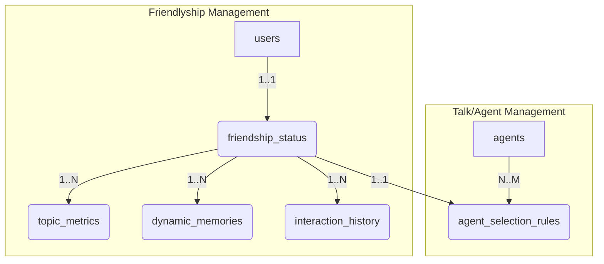

# Tài liệu Thiết kế Database PostgreSQL: Context Handling

**Version:** 1.0  
**Date:** 25/11/2025  
**Author:** Manus AI

## 1. Tổng quan

Tài liệu này mô tả chi tiết thiết kế cơ sở dữ liệu (CSDL) PostgreSQL cho module **Context Handling**, bao gồm hai thành phần chính:

1.  **Friendlyship Management:** Quản lý tất cả các dữ liệu liên quan đến trạng thái tình bạn của người dùng, bao gồm điểm số, cấp độ, lịch sử tương tác, và các ký ức chung.
2.  **Talk/Agent Management:** Quản lý kho các Agent (Greeting, Talk, Game) và các quy tắc để lựa chọn Agent dựa trên trạng thái tình bạn của người dùng.

CSDL được thiết kế theo mô hình quan hệ để đảm bảo tính toàn vẹn dữ liệu, hiệu suất truy vấn và khả năng mở rộng.

## 2. Sơ đồ Quan hệ Thực thể (ERD - Entity-Relationship Diagram)



**Diễn giải:**

-   Mỗi `user` có một và chỉ một bản ghi `friendship_status`.
-   Mỗi `friendship_status` có thể có nhiều `topic_metrics`, `dynamic_memories`, và `interaction_history`.
-   Bảng `agent_selection_rules` là cầu nối logic giữa `friendship_status` (cụ thể là `friendship_level` hoặc `phase`) và kho `agents`, xác định Agent nào có thể được chọn ở mỗi giai đoạn tình bạn.

## 3. Thiết kế Chi tiết các Bảng (Table Schema)

### 3.1. Bảng `users`

Lưu thông tin cơ bản của người dùng.

```sql
CREATE TABLE users (
    user_id VARCHAR(255) PRIMARY KEY,
    username VARCHAR(100) UNIQUE,
    email VARCHAR(255) UNIQUE,
    full_name VARCHAR(255),
    date_of_birth DATE,
    created_at TIMESTAMP WITH TIME ZONE DEFAULT CURRENT_TIMESTAMP,
    updated_at TIMESTAMP WITH TIME ZONE DEFAULT CURRENT_TIMESTAMP
);
```

### 3.2. Bảng `friendship_status` (Friendlyship Management)

Bảng trung tâm, lưu trữ trạng thái tình bạn hiện tại của người dùng.

```sql
CREATE TABLE friendship_status (
    user_id VARCHAR(255) PRIMARY KEY REFERENCES users(user_id) ON DELETE CASCADE,
    friendship_score FLOAT DEFAULT 0.0 NOT NULL,
    friendship_level VARCHAR(50) DEFAULT 'STRANGER' NOT NULL, -- STRANGER, ACQUAINTANCE, FRIEND
    phase VARCHAR(50) DEFAULT 'PHASE_1' NOT NULL, -- PHASE_1, PHASE_2, PHASE_3
    last_interaction_date TIMESTAMP WITH TIME ZONE,
    streak_day INTEGER DEFAULT 0 NOT NULL,
    created_at TIMESTAMP WITH TIME ZONE DEFAULT CURRENT_TIMESTAMP,
    updated_at TIMESTAMP WITH TIME ZONE DEFAULT CURRENT_TIMESTAMP
);

-- Indexes
CREATE INDEX idx_friendship_status_score ON friendship_status(friendship_score);
CREATE INDEX idx_friendship_status_level ON friendship_status(friendship_level);
CREATE INDEX idx_friendship_status_phase ON friendship_status(phase);
```

| Tên cột                 | Mô tả                                       | Lý do thiết kế                                                                                                           |
| :---------------------- | :------------------------------------------ | :----------------------------------------------------------------------------------------------------------------------- |
| `user_id`               | Khóa ngoại, liên kết 1-1 với bảng `users`.  | Đảm bảo mỗi user chỉ có một trạng thái tình bạn. `ON DELETE CASCADE` để tự động xóa status khi user bị xóa.              |
| `friendship_score`      | Điểm số tình bạn.                           | Chỉ số cốt lõi để đo lường mức độ thân thiết.                                                                            |
| `friendship_level`      | Cấp độ tình bạn (dạng text).                | Dùng để hệ thống nhanh chóng xác định hành vi, giọng điệu.                                                               |
| `phase`                 | Giai đoạn tình bạn (dùng để lọc kho Agent). | Tách biệt logic chọn Agent khỏi `friendship_level`, giúp dễ dàng thay đổi quy tắc mà không ảnh hưởng đến các logic khác. |
| `last_interaction_date` | Thời điểm tương tác cuối cùng.              | Dùng để tính `streak_day` và các kịch bản vắng mặt.                                                                      |
| `streak_day`            | Số ngày tương tác liên tiếp.                | Ghi nhận sự cam kết của người dùng.                                                                                      |

### 3.3. Bảng `topic_metrics` (Friendlyship Management)

Lưu trữ mức độ quan tâm của người dùng đối với từng chủ đề.

```sql
CREATE TABLE topic_metrics (
    id SERIAL PRIMARY KEY,
    user_id VARCHAR(255) NOT NULL REFERENCES friendship_status(user_id) ON DELETE CASCADE,
    topic_id VARCHAR(255) NOT NULL, -- Ví dụ: "agent_movie", "agent_animal"
    topic_score FLOAT DEFAULT 0.0 NOT NULL,
    total_turns INTEGER DEFAULT 0 NOT NULL,
    last_talked_date TIMESTAMP WITH TIME ZONE,
    created_at TIMESTAMP WITH TIME ZONE DEFAULT CURRENT_TIMESTAMP,
    updated_at TIMESTAMP WITH TIME ZONE DEFAULT CURRENT_TIMESTAMP,
    UNIQUE(user_id, topic_id)
);

-- Indexes
CREATE INDEX idx_topic_metrics_user_score ON topic_metrics(user_id, topic_score DESC);
CREATE INDEX idx_topic_metrics_user_turns ON topic_metrics(user_id, total_turns ASC);
```

| Tên cột | Mô tả | Lý do thiết kế |
| :--- | :--- | :--- |
| `user_id`, `topic_id` | Cặp khóa ngoại và định danh chủ đề. | `UNIQUE(user_id, topic_id)` đảm bảo mỗi user chỉ có một bản ghi cho mỗi chủ đề. |
| `topic_score` | Điểm yêu thích chủ đề. | Giúp xác định sở thích của người dùng. |
| `total_turns` | Tổng số lượt nói về chủ đề này. | Giúp xác định các chủ đề ít được khám phá. |
| `last_talked_date` | Lần cuối nói về chủ đề này. | Dùng cho logic gợi ý lại chủ đề cũ. |

### 3.4. Bảng `dynamic_memories` (Friendlyship Management)

Lưu trữ các "ký ức chung" giữa người dùng và Pika.

```sql
CREATE TABLE dynamic_memories (
    memory_id VARCHAR(255) PRIMARY KEY,
    user_id VARCHAR(255) NOT NULL REFERENCES friendship_status(user_id) ON DELETE CASCADE,
    content TEXT NOT NULL,
    related_topic VARCHAR(255),
    timestamp TIMESTAMP WITH TIME ZONE DEFAULT CURRENT_TIMESTAMP,
    created_at TIMESTAMP WITH TIME ZONE DEFAULT CURRENT_TIMESTAMP
);

-- Indexes
CREATE INDEX idx_dynamic_memories_user_timestamp ON dynamic_memories(user_id, timestamp DESC);
```

| Tên cột         | Mô tả                  | Lý do thiết kế                                      |
| :-------------- | :--------------------- | :-------------------------------------------------- |
| `memory_id`     | ID duy nhất của ký ức. | Dùng để tham chiếu và quản lý.                      |
| `content`       | Nội dung ký ức.        | Vũ khí tối thượng để tạo ra các khoảnh khắc "Aha!". |
| `related_topic` | Chủ đề liên quan.      | Giúp gợi lại ký ức khi nói về chủ đề tương ứng.     |

### 3.5. Bảng `interaction_history` (Friendlyship Management)

Lưu lại lịch sử các phiên tương tác để phân tích và tính điểm.

```sql
CREATE TABLE interaction_history (
    interaction_id SERIAL PRIMARY KEY,
    user_id VARCHAR(255) NOT NULL REFERENCES friendship_status(user_id) ON DELETE CASCADE,
    session_start_time TIMESTAMP WITH TIME ZONE NOT NULL,
    session_end_time TIMESTAMP WITH TIME ZONE NOT NULL,
    total_turns INTEGER NOT NULL,
    session_emotion VARCHAR(50),
    new_memories_count INTEGER DEFAULT 0,
    friendship_score_change FLOAT NOT NULL,
    conversation_log JSONB -- Lưu log chi tiết của cuộc hội thoại
);

-- Indexes
CREATE INDEX idx_interaction_history_user_end_time ON interaction_history(user_id, session_end_time DESC);
```

| Tên cột | Mô tả | Lý do thiết kế |
| :--- | :--- | :--- |
| `session_emotion` | Cảm xúc chủ đạo của phiên. | Dùng để tính bonus điểm và chọn Agent cho lần sau. |
| `friendship_score_change` | Mức độ thay đổi điểm sau phiên. | Giúp theo dõi hiệu quả của các cuộc trò chuyện. |
| `conversation_log` | Log chi tiết dạng JSONB. | `JSONB` cho phép truy vấn sâu vào nội dung log nếu cần, nhưng chủ yếu để lưu trữ và kiểm tra lại. |

### 3.6. Bảng `agents` (Talk/Agent Management)

Kho chứa tất cả các Agent có thể được sử dụng.

```sql
CREATE TABLE agents (
    agent_id VARCHAR(255) PRIMARY KEY,
    agent_name VARCHAR(255) NOT NULL,
    agent_type VARCHAR(50) NOT NULL, -- 'GREETING', 'TALK', 'GAME'
    description TEXT,
    is_active BOOLEAN DEFAULT TRUE,
    created_at TIMESTAMP WITH TIME ZONE DEFAULT CURRENT_TIMESTAMP,
    updated_at TIMESTAMP WITH TIME ZONE DEFAULT CURRENT_TIMESTAMP
);

-- Indexes
CREATE INDEX idx_agents_type ON agents(agent_type);
CREATE INDEX idx_agents_active ON agents(is_active);
```

### 3.7. Bảng `agent_selection_rules` (Talk/Agent Management)

Bảng quy tắc, xác định Agent nào được phép sử dụng ở mỗi `phase`.

```sql
CREATE TABLE agent_selection_rules (
    rule_id SERIAL PRIMARY KEY,
    agent_id VARCHAR(255) NOT NULL REFERENCES agents(agent_id) ON DELETE CASCADE,
    required_phase VARCHAR(50) NOT NULL, -- PHASE_1, PHASE_2, PHASE_3
    weight FLOAT DEFAULT 1.0, -- Trọng số ưu tiên
    UNIQUE(agent_id, required_phase)
);

-- Indexes
CREATE INDEX idx_agent_selection_rules_phase ON agent_selection_rules(required_phase);
```

| Tên cột | Mô tả | Lý do thiết kế |
| :--- | :--- | :--- |
| `agent_id`, `required_phase` | Cặp khóa xác định quy tắc. | Một Agent có thể xuất hiện ở nhiều phase với các trọng số khác nhau. |
| `weight` | Trọng số ưu tiên. | Giúp tăng/giảm khả năng được chọn của một Agent trong cùng một phase. |

## 4. Tự động cập nhật `updated_at`

Sử dụng trigger để tự động cập nhật trường `updated_at` mỗi khi có thay đổi trên một hàng.

```sql
-- 1. Tạo function
CREATE OR REPLACE FUNCTION update_updated_at_column()
RETURNS TRIGGER AS $$
BEGIN
    NEW.updated_at = CURRENT_TIMESTAMP;
    RETURN NEW;
END;
$$ LANGUAGE plpgsql;

-- 2. Áp dụng trigger cho các bảng cần thiết
CREATE TRIGGER update_users_updated_at BEFORE UPDATE ON users FOR EACH ROW EXECUTE FUNCTION update_updated_at_column();
CREATE TRIGGER update_friendship_status_updated_at BEFORE UPDATE ON friendship_status FOR EACH ROW EXECUTE FUNCTION update_updated_at_column();
CREATE TRIGGER update_topic_metrics_updated_at BEFORE UPDATE ON topic_metrics FOR EACH ROW EXECUTE FUNCTION update_updated_at_column();
CREATE TRIGGER update_agents_updated_at BEFORE UPDATE ON agents FOR EACH ROW EXECUTE FUNCTION update_updated_at_column();
```

## 5. Kết luận

Thiết kế này cung cấp một nền tảng CSDL vững chắc, có cấu trúc rõ ràng cho module Context Handling. Việc tách bạch giữa **Friendlyship Management** và **Talk/Agent Management** thông qua các bảng riêng biệt và bảng `agent_selection_rules` giúp hệ thống trở nên linh hoạt, dễ bảo trì và mở rộng trong tương lai. Các `indexes` được định nghĩa một cách chiến lược để tối ưu hóa các truy vấn thường xuyên, đảm bảo hiệu suất cao khi vận hành.
