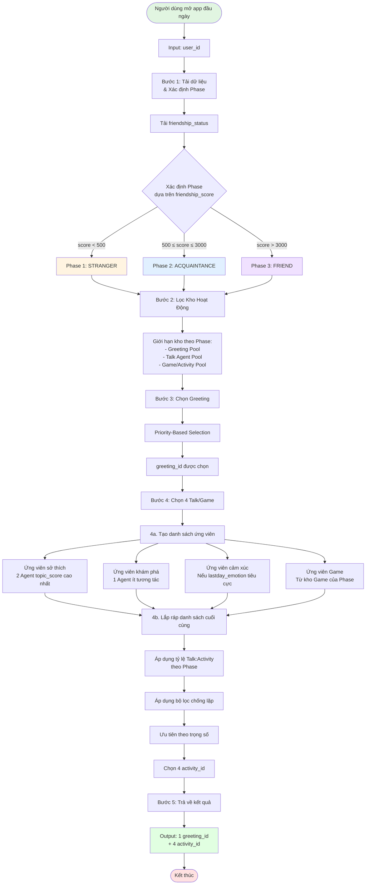
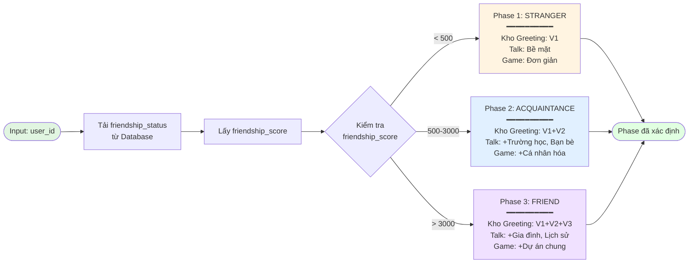
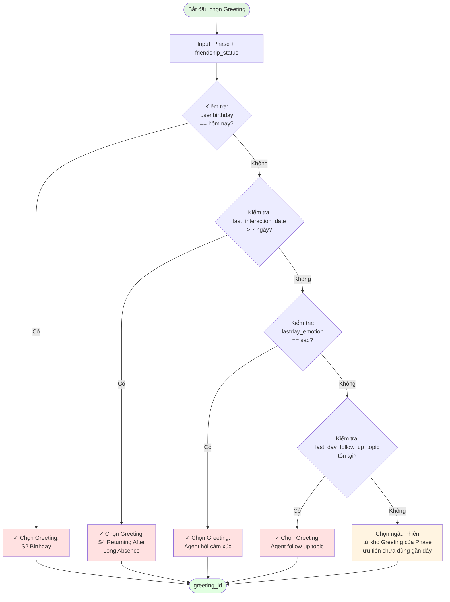
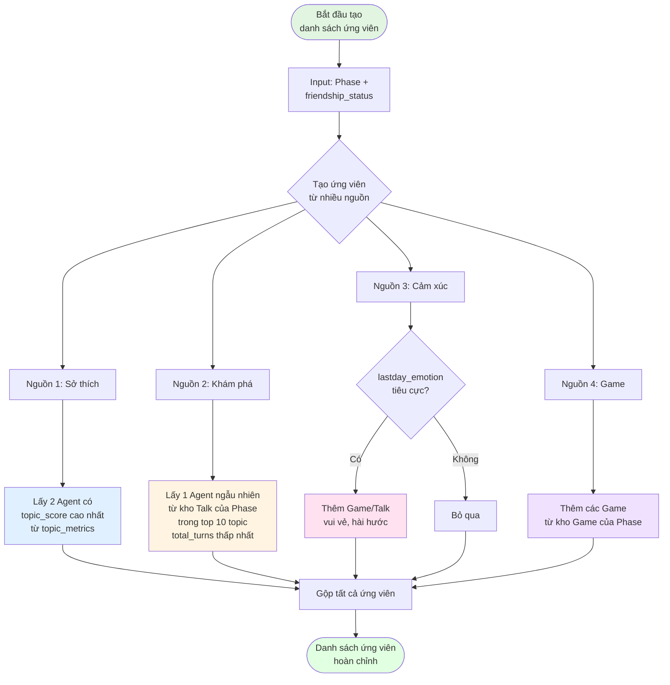
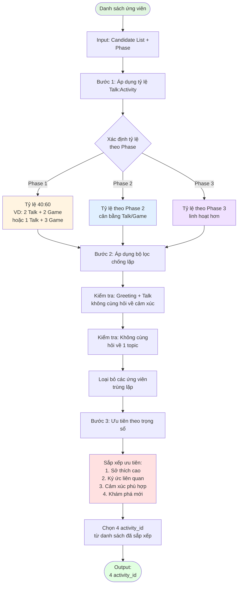
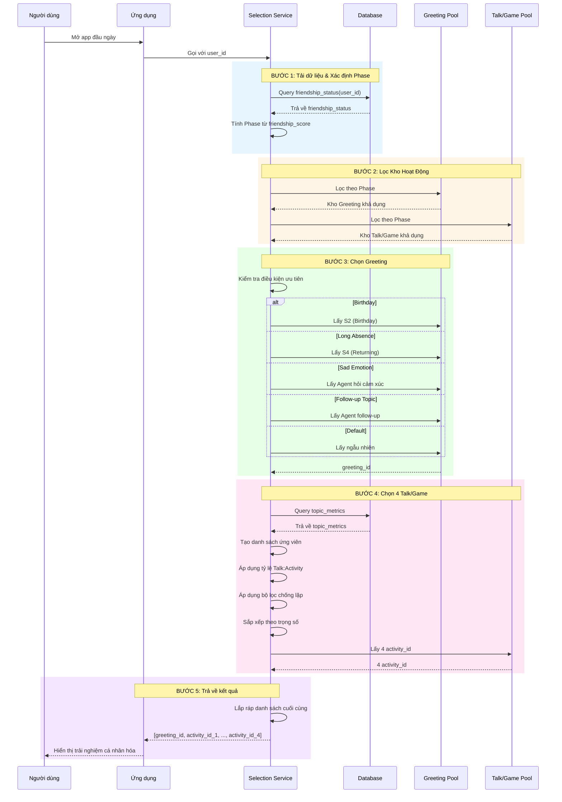
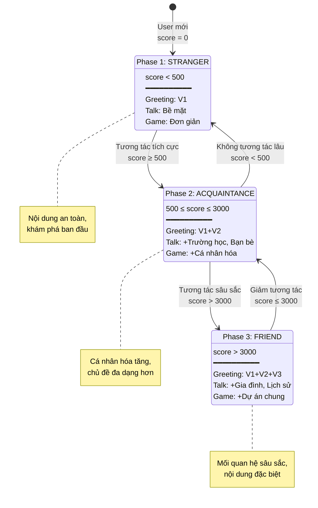
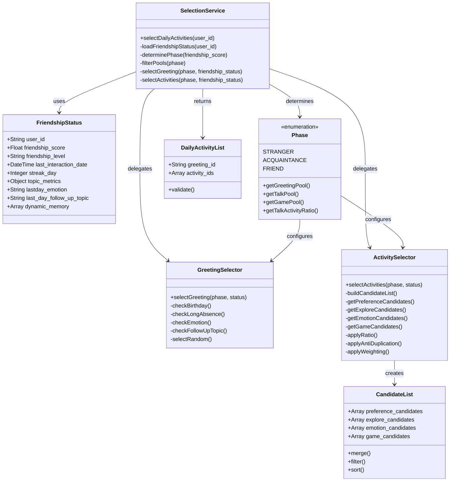

# Mermaid Diagrams: Logic Chọn Talk/Game-Agent Đầu Ngày

## 1. Flowchart Tổng Quan - Quy Trình Lựa Chọn Hoàn Chỉnh

---

## 2. Flowchart Chi Tiết - Xác Định Phase

---

## 3. Flowchart Chi Tiết - Chọn Greeting (Priority-Based)

---

## 4. Flowchart Chi Tiết - Tạo Danh Sách Ứng Viên

---

## 5. Flowchart Chi Tiết - Lắp Ráp Danh Sách Cuối Cùng

---

## 6. Sequence Diagram - Toàn Bộ Quy Trình

---

## 7. State Diagram - Trạng Thái Phase Progression

---

## 8. Class Diagram - Cấu Trúc Dữ Liệu

---

## Tổng Kết

Các diagram trên mô tả toàn bộ logic chọn Talk/Game-Agent đầu ngày từ nhiều góc độ:

1. **Flowchart tổng quan**: Cái nhìn toàn cảnh về 5 bước chính
2. **Flowchart xác định Phase**: Chi tiết cách phân loại người dùng
3. **Flowchart chọn Greeting**: Logic ưu tiên dựa trên điều kiện đặc biệt
4. **Flowchart tạo ứng viên**: Cách xây dựng danh sách từ nhiều nguồn
5. **Flowchart lắp ráp**: Quy trình lọc và chọn cuối cùng
6. **Sequence diagram**: Tương tác giữa các thành phần theo thời gian
7. **State diagram**: Sự chuyển đổi giữa các Phase
8. **Class diagram**: Cấu trúc dữ liệu và quan hệ giữa các class
