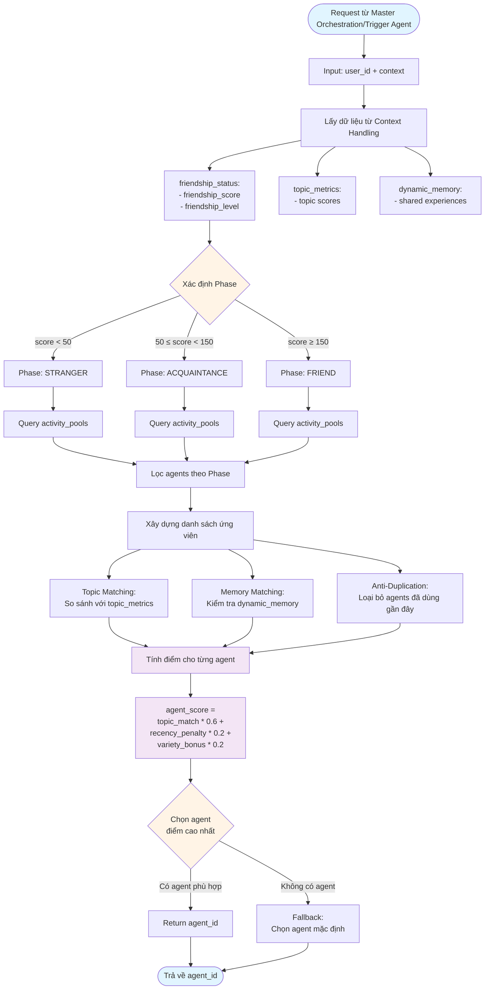
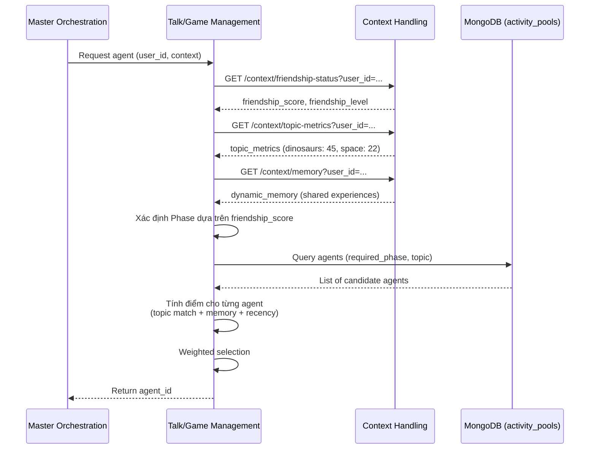
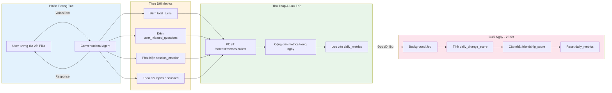
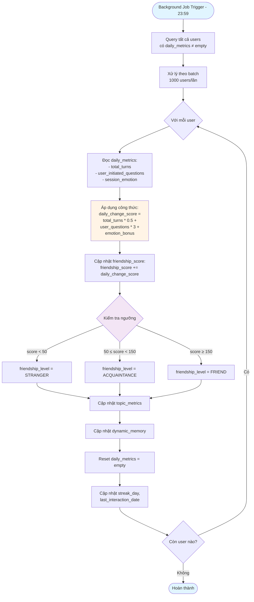
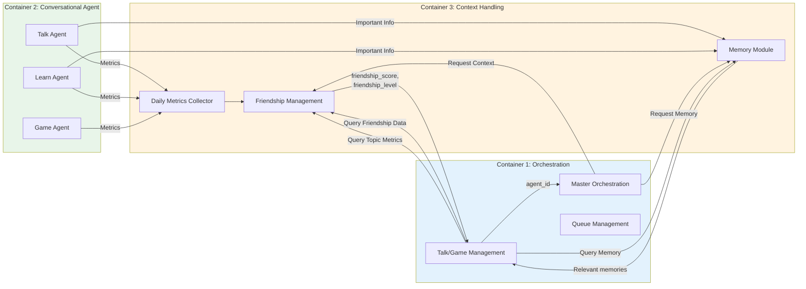

# Sơ Đồ Chi Tiết: Talk/Game Management & Context Handling

## 1. Talk/Game Management - Flowchart Chi Tiết



## 2. Talk/Game Management - Sequence Diagram



## 3. Context Handling - Architecture Diagram

```mermaid
graph TB
    subgraph Container3[Container 3: Context Handling]
        subgraph MemoryModule[Memory Module - Mem0]
            StoreMemory[Store Memory<br/>LLM auto-detect important info]
            StructureMemory[Structure Memory<br/>Schema-based storage]
            RetrieveMemory[Retrieve Memory<br/>Context-aware search]
            
            StoreMemory --> StructureMemory
            StructureMemory --> RetrieveMemory
        end
        
        subgraph FriendshipModule[Friendship Status Management]
            DailyCollector[Daily Metrics Collector<br/>Thu thập: total_turns,<br/>user_questions, emotion]
            FriendshipCalc[Friendship Score Calculator<br/>Tính daily_change_score]
            TopicTracker[Topic Metrics Tracker<br/>Cập nhật topic_score]
            DynamicMemory[Dynamic Memory Manager<br/>Quản lý ký ức chung]
            
            DailyCollector --> FriendshipCalc
            DailyCollector --> TopicTracker
            DailyCollector --> DynamicMemory
        end
        
        subgraph BackgroundJob[Daily Background Job - 23:59]
            Trigger[Scheduler Trigger]
            Calculate[Calculate daily_change_score<br/>từ daily_metrics]
            Update[Update friendship_score,<br/>topic_metrics, dynamic_memory]
            Cleanup[Reset daily_metrics = empty]
            
            Trigger --> Calculate
            Calculate --> Update
            Update --> Cleanup
        end
    end
    
    subgraph Database[(MongoDB)]
        FS[friendship_status collection]
        TM[topic_metrics collection]
        MEM[memories collection]
    end
    
    ConvAgent[Conversational Agent<br/>Container 2] -->|Send metrics| DailyCollector
    
    FriendshipCalc --> FS
    TopicTracker --> TM
    StoreMemory --> MEM
    
    Calculate --> FS
    Calculate --> TM
    
    Orchestration[Orchestration System<br/>Container 1] -->|Request context| RetrieveMemory
    Orchestration -->|Request friendship data| FS
    
    style MemoryModule fill:#e8f5e9
    style FriendshipModule fill:#fff3e0
    style BackgroundJob fill:#fce4ec
    style Database fill:#e3f2fd
```

## 4. Context Handling - Daily Metrics Collection Flow



## 5. Context Handling - Friendship Score Calculation



## 6. Data Flow Between Modules



## 7. Database Schema Visualization

```mermaid
erDiagram
    FRIENDSHIP_STATUS {
        string user_id PK
        int friendship_score
        string friendship_level
        int streak_day
        date last_interaction_date
        object daily_metrics
        object topic_metrics
    }
    
    TOPIC_METRICS {
        string user_id FK
        string topic_name
        float topic_score
        int total_turns
        date last_discussed
    }
    
    MEMORIES {
        string memory_id PK
        string user_id FK
        string content
        string type
        date created_at
        object metadata
    }
    
    ACTIVITY_POOLS {
        string agent_id PK
        string type
        string required_phase
        string topic
        string difficulty
        timestamp last_used_timestamp
        int last_used_count
    }
    
    FRIENDSHIP_STATUS ||--o{ TOPIC_METRICS : has
    FRIENDSHIP_STATUS ||--o{ MEMORIES : has
```


