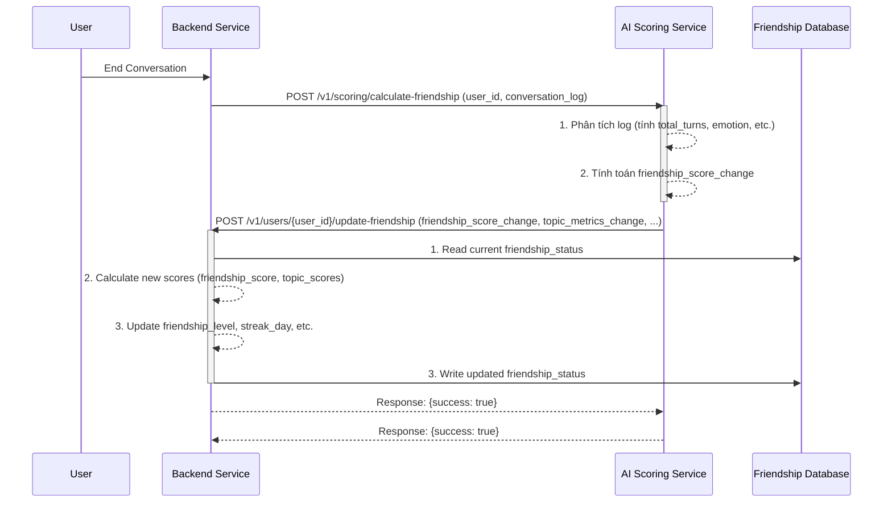
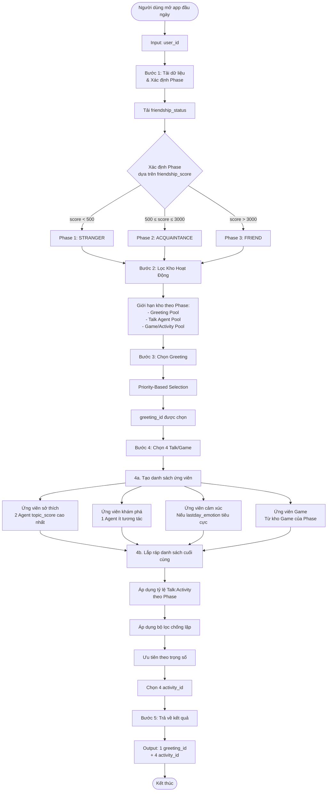
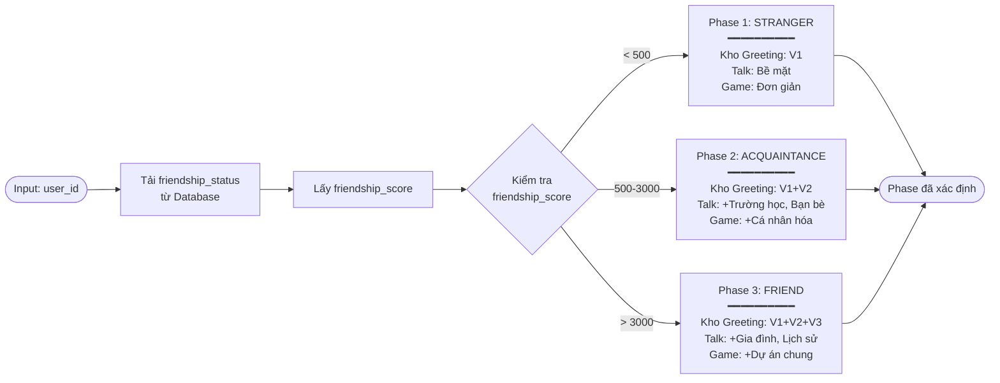
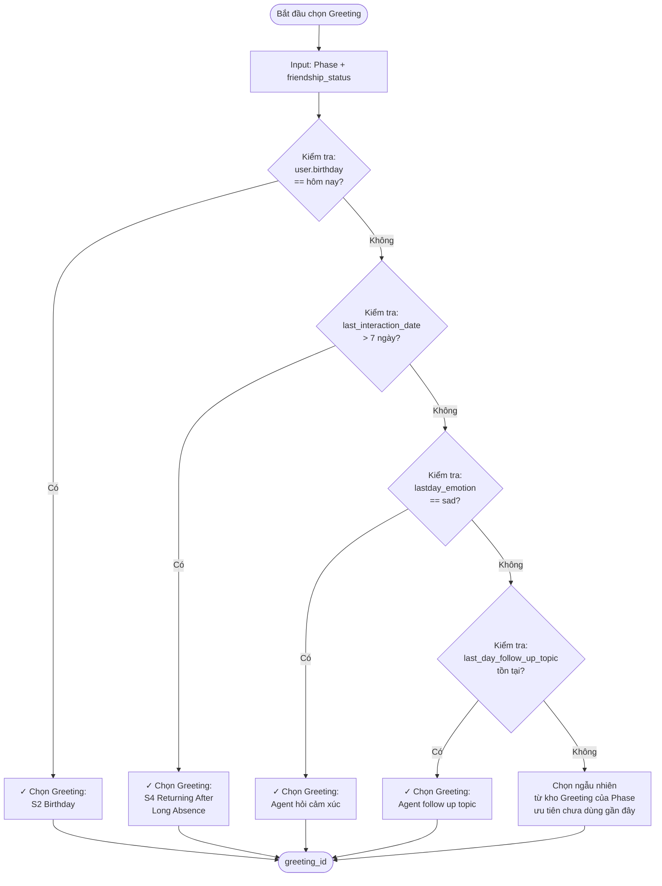
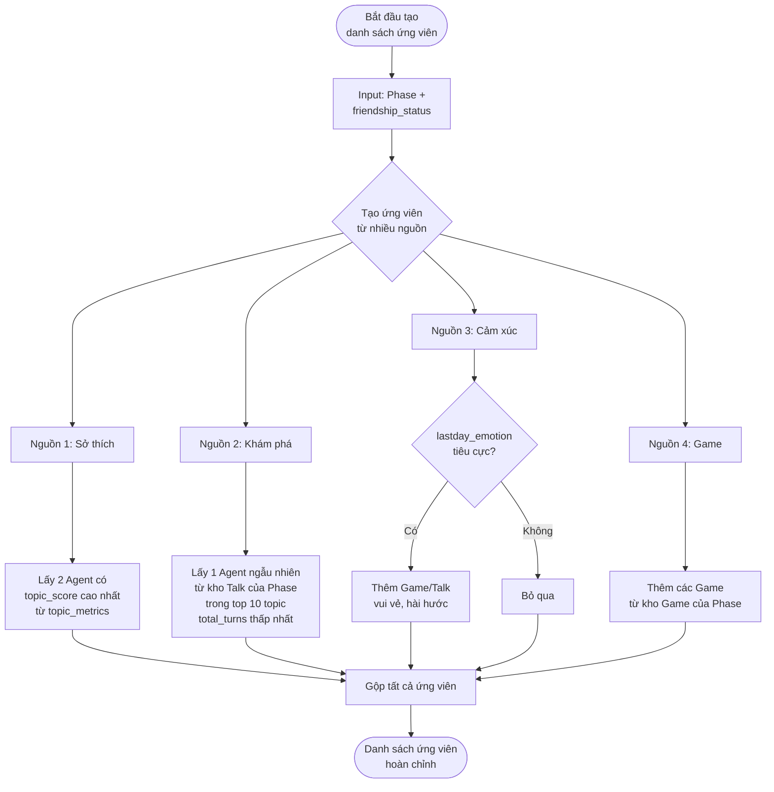
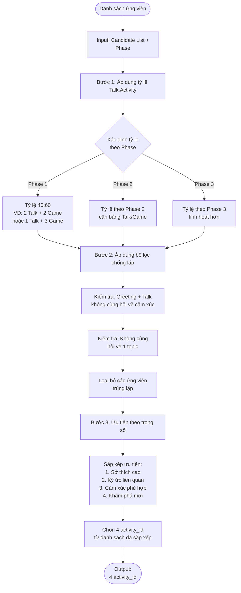
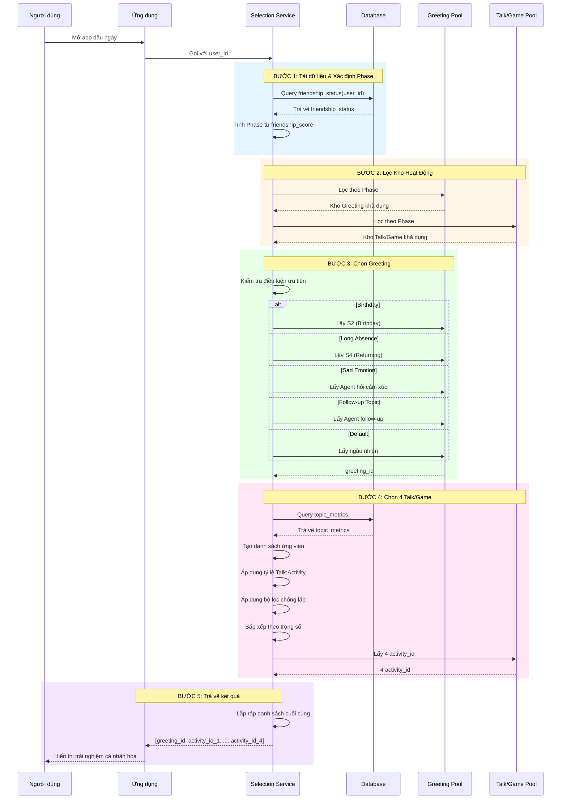
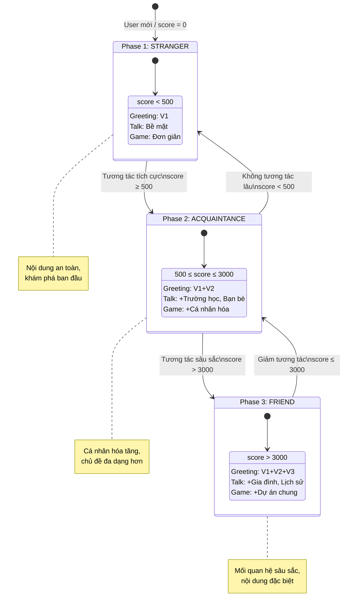
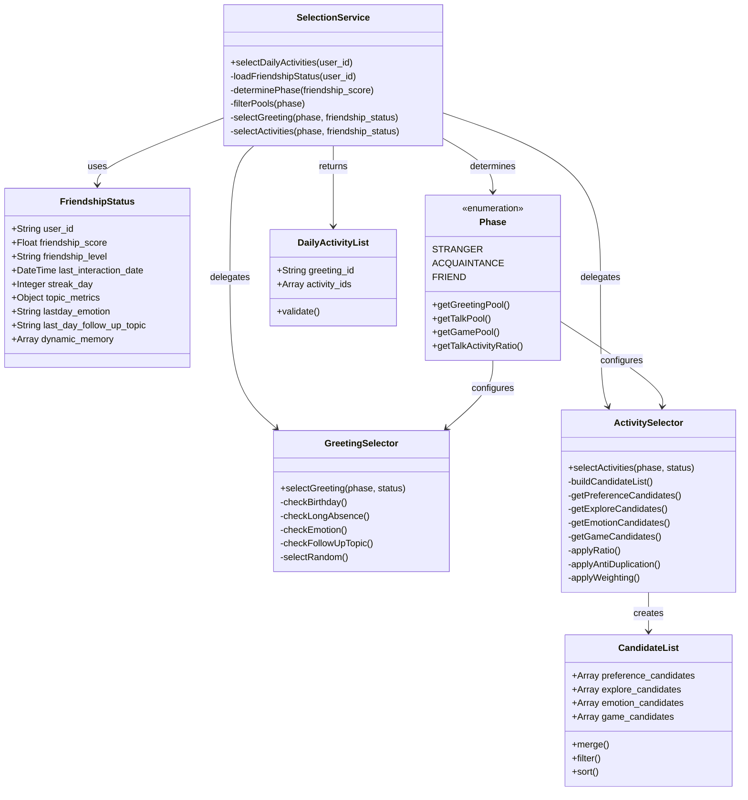

# Tài liệu Triển khai Kỹ thuật: Module Context Handling - Friendlyship Management

**Version:** 1.0
**Date:** 25/11/2025
**Author:** Manus AI

## 1. Tổng quan và Bối cảnh (Overview and Context)

Tài liệu này đặc tả chi tiết về mặt kỹ thuật cho việc xây dựng và tích hợp module **Context Handling**, với trọng tâm là quản lý trạng thái tình bạn (Friendship) và lựa chọn Agent (Talk/Game/Greeting) trong hệ sinh thái sản phẩm Pika. Module này là một phần của **Container 3: Context Handling** trong kiến trúc tổng thể, chịu trách nhiệm thu thập, xử lý, và duy trì tất cả dữ liệu liên quan đến người dùng và mối quan hệ của họ với Pika.

### 1.1. Mục tiêu Product

- **Tăng Retention và Engagement:** Tạo ra một mối quan hệ cá nhân hóa, sâu sắc và lâu dài giữa người dùng và Pika, khiến người dùng cảm thấy được thấu hiểu và quay trở lại thường xuyên.
- **Cá nhân hóa Trải nghiệm:** Chuyển đổi từ trải nghiệm "một cho tất cả" sang "một cho mỗi người", nơi các hoạt động, lời chào và chủ đề trò chuyện được điều chỉnh dựa trên lịch sử tương tác và mức độ thân thiết.
- **Tạo ra các khoảnh khắc "Aha!":** Khiến người dùng bất ngờ và thích thú khi Pika "nhớ" lại các chi tiết, sở thích, hoặc các sự kiện trong quá khứ, tạo ra một kết nối cảm xúc thực sự.

### 1.2. Thay đổi so với Thiết kế ban đầu

Dựa trên yêu cầu mới, luồng cập nhật điểm tình bạn (`friendship_score`) sẽ được thay đổi từ mô hình xử lý hàng loạt cuối ngày (batch processing) sang **mô hình xử lý theo thời gian thực (real-time processing)**. 

> **Yêu cầu cốt lõi:** *"Sau khi kết thúc 1 cuộc hội thoại phía BE gửi user_id kèm log cho phía AI. Phía AI xử lý log luôn và tính điểm daily_score và code API phía BE để update điểm friendlyship_score."*

Điều này có nghĩa là `friendship_score` sẽ được cập nhật liên tục sau mỗi phiên tương tác, mang lại phản hồi tức thì về mức độ thân thiết và cho phép hệ thống điều phối (Orchestration) có được dữ liệu mới nhất để ra quyết định.

## 2. Thiết kế Kiến trúc Module

Để đáp ứng yêu cầu xử lý real-time, kiến trúc của module sẽ bao gồm ba thành phần chính: **Backend (BE) Service**, **AI Scoring Service**, và **Friendship Database**.


*Sơ đồ 1: Luồng cập nhật Friendship Score theo thời gian thực*

### Luồng hoạt động:
1.  **Kết thúc hội thoại:** Người dùng hoàn thành một phiên trò chuyện.
2.  **BE gửi yêu cầu:** Backend Service gửi một yêu cầu (POST) đến AI Scoring Service, đính kèm `user_id` và toàn bộ `conversation_log` của phiên vừa kết thúc.
3.  **AI tính toán:** AI Scoring Service nhận log, phân tích và tính toán ra một "điểm thay đổi" (`friendship_score_change`) cùng các chỉ số liên quan khác (ví dụ: sự thay đổi của `topic_score`).
4.  **AI gọi BE để cập nhật:** AI Service gọi một API do BE cung cấp để gửi "điểm thay đổi" này.
5.  **BE cập nhật vào DB:** BE nhận điểm thay đổi, đọc bản ghi `friendship_status` hiện tại từ Database, tính toán các giá trị mới, và ghi đè bản ghi đã cập nhật trở lại vào Database.

## 3. Định nghĩa Database Schema và Data Structure

Cấu trúc dữ liệu sẽ được lưu trong một cơ sở dữ liệu SQL (Postgress). Cấu trúc này dựa trên `Tài liệu 1` nhưng có điều chỉnh để phù hợp với logic cập nhật real-time.

**Collection/Table:** `friendship_status`

| Tên trường              | Kiểu dữ liệu       | Mô tả                                                  | Ghi chú                                       |     |
| :---------------------- | :----------------- | :----------------------------------------------------- | :-------------------------------------------- | --- |
| `user_id`               | String             | (Primary Key) Mã định danh duy nhất của người dùng.    | Bắt buộc.                                     |     |
| `friendship_score`      | Float              | Điểm số tổng thể đo lường mức độ thân thiết.           | Cập nhật sau mỗi phiên.                       |     |
| `friendship_level`      | String             | Cấp độ tình bạn: `STRANGER`, `ACQUAINTANCE`, `FRIEND`. | Tự động cập nhật dựa trên `friendship_score`. |     |
| `last_interaction_date` | ISO 8601 Timestamp | Dấu thời gian của lần tương tác cuối cùng.             | Cập nhật sau mỗi phiên.                       |     |
| `streak_day`            | Integer            | Số ngày tương tác liên tiếp.                           | Cập nhật sau mỗi phiên.                       |     |
| `topic_metrics`         | Object / Map       | Lưu trữ điểm và lịch sử tương tác cho từng chủ đề.     | Cập nhật sau mỗi phiên.                       |     |
| `dynamic_memory`        | Array of Objects   | Danh sách các "ký ức chung" giữa Pika và người dùng.   | Thêm mới khi có sự kiện đáng nhớ.             |     |

**Lưu ý:** Trường `daily_metrics` trong thiết kế ban đầu sẽ không còn cần thiết, vì các chỉ số giờ đây được xử lý và tích luỹ trực tiếp vào các trường chính sau mỗi phiên, thay vì được thu thập tạm thời và xử lý cuối ngày.

### Ví dụ bản ghi:

```json
{
  "user_id": "user_123",
  "friendship_score": 785.5, // Đã được cập nhật sau phiên gần nhất
  "friendship_level": "ACQUAINTANCE",
  "last_interaction_date": "2025-11-25T18:30:00Z",
  "streak_day": 6, // Tăng lên vì hôm qua cũng tương tác
  "topic_metrics": {
    "agent_movie": {
      "topic_score": 52.0, // Đã tăng sau phiên nói về phim
      "total_turns": 65,
      "last_talked_date": "2025-11-25T18:25:00Z"
    }
  },
  "dynamic_memory": [
    {
      "memory_id": "mem_003",
      "content": "Thích xem phim của đạo diễn Hayao Miyazaki.",
      "related_topic": "agent_movie",
      "timestamp": "2025-11-25T18:28:00Z"
    }
  ]
}
```

## 4. Thiết kế API Endpoints

Sẽ có 2 API chính được định nghĩa để phục vụ cho module này.

### 4.1. API 1: Tính toán Friendship Score (BE -> AI)


>    **a. Thu thập các chỉ số từ `daily_metrics`:**
    *   `total_turns`: Tổng số lượt trò chuyện trong ngày.
    *   `user_initiated_questions`: Số lần người dùng chủ động hỏi Pika.
    *   `followup_topics_count`: Tên chủ đề mới do người dùng gợi ý.
    *   `session_emotion`: Cảm xúc chủ đạo trong ngày ('interesting', 'boring', 'neutral', 'angry', 'happy','sad').
    *   `new_memories_count`: Số ký ức mới được tạo. 
    *   `topic_details`: Chi tiết tương tác cho từng topic (số turn, số câu hỏi).

> Logic Mapping Friendship vs Kho


API này cho phép BE yêu cầu AI phân tích một cuộc hội thoại và trả về các điểm số cần cập nhật.

- **Endpoint:** `POST /v1/scoring/calculate-friendship`
- **Service:** AI Scoring Service
- **Mô tả:** Nhận log hội thoại, tính toán và trả về các thay đổi về điểm tình bạn và các chỉ số liên quan.
- **Request Body:**

  ```json
  {
    "user_id": "user_123",
    "conversation_log": [
      {"speaker": "user", "turn_id": 1, "text": "Hello Pika!"},
      {"speaker": "pika", "turn_id": 2, "text": "Hi there! How are you?"},
      // ... thêm các turn khác
    ],
    "session_metadata": {
        "emotion": "interesting", // Do AI tự phân tích hoặc BE gửi sang
        "new_memories_created": 2
    }
  }
  ```

- **Response Body (Success 200):**

  ```json
  {
    "friendship_score_change": 35.0,
    "topic_metrics_update": {
        "agent_movie": {
            "score_change": 7.0,
            "turns_increment": 15
        }
    },
    "new_memories": [
        {
          "content": "Thích xem phim của đạo diễn Hayao Miyazaki.",
          "related_topic": "agent_movie"
        }
    ]
  }
  ```

### 4.2. API 2: Cập nhật Friendship Status (AI -> BE)

API này cho phép AI gửi các điểm số đã tính toán để BE cập nhật vào cơ sở dữ liệu.

- **Endpoint:** `POST /v1/users/update-friendship` 
- **Service:** Backend Service
- **Mô tả:** Nhận các thay đổi về điểm số và chỉ số từ AI, sau đó cập nhật vào bản ghi `friendship_status` của người dùng trong DB.
- **Path Parameter:** `user_id` (String, required)
- **Request Body:** (Giống hệt Response Body của API 1)

- **Response Body (Success 200):**

  ```json
  {
    "success": true,
    "message": "Friendship status updated successfully."
  }
  ```

### 4.3. API 3: Lấy danh sách Agent đề xuất (BE -> AI/Orchestration)

API này phục vụ cho việc lấy danh sách các hoạt động (Greeting, Talk, Game) được cá nhân hóa cho người dùng khi bắt đầu một phiên mới.

- **Endpoint:** `GET /v1/users/suggested-activities`
- **Service:** AI Orchestration Service (hoặc một service riêng cho việc lựa chọn)
- **Mô tả:** Dựa trên `friendship_status` của người dùng, chọn ra một danh sách các hoạt động phù hợp.
- **Query Parameters:**
   - truyền vào user_id
  - `type`: (String, optional) Loại agent cần lấy, ví dụ: `greeting`, `talk`, `game`. Nếu không có, trả về cả gói.
  - `count`: (Integer, optional) Số lượng cần lấy.
- **Response Body (Success 200):**

  ```json
  {
    "greeting_agent": {
        "agent_id": "greeting_streak_milestone_5_days",
        "type": "greeting"
    },
    "suggested_agents": [
        {"agent_id": "talk_agent_movie_preference", "type": "talk"},
        {"agent_id": "game_agent_drawing_challenge", "type": "game"},
        {"agent_id": "talk_agent_school_life", "type": "talk"},
        {"agent_id": "talk_agent_follow_up_pet_milu", "type": "talk"}
    ]
  }
  ```

## 5. Logic Xử lý Scoring và Selection

### 5.1. Logic tính điểm (Scoring Logic - Real-time)

Logic này được thực thi trong **AI Scoring Service** sau mỗi cuộc hội thoại, dựa trên `Tài liệu 2` nhưng được điều chỉnh cho phù hợp.

1.  **Thu thập chỉ số từ `conversation_log`:**
    *   `total_turns`: Tổng số lượt trò chuyện trong phiên.
    *   `user_initiated_questions`: Số lần người dùng chủ động hỏi Pika.
    *   `session_emotion`: Cảm xúc chủ đạo của phiên (ví dụ: 'interesting', 'boring').
    *   `new_memories_count`: Số ký ức mới được tạo trong phiên.
    *   `topic_details`: Chi tiết tương tác cho từng topic (số turn, số câu hỏi).

2.  **Tính toán `friendship_score_change`:**
    *   `base_score = total_turns * 0.5`
    *   `engagement_bonus = (user_initiated_questions * 3)`
    *   `emotion_bonus`: +15 cho 'interesting', -15 cho 'boring'.
    *   `memory_bonus = new_memories_count * 5`
    *   **`friendship_score_change`** = `base_score + engagement_bonus + emotion_bonus + memory_bonus`

3.  **Tính toán `topic_metrics_update`:**
    *   Với mỗi topic trong `topic_details`, tính `score_change` = (`turns` * 0.5 + `user_questions` * 3) và `turns_increment` = `turns`.

### 5.2. Logic lựa chọn Agent (Selection Logic)

Logic này được thực thi trong **AI Orchestration Service** (API 3) và tuân thủ chặt chẽ theo `Tài liệu 3`.

1.  **Tải dữ liệu và Xác định Phase:** Lấy `friendship_status` mới nhất của user, xác định `Phase` (Stranger, Acquaintance, Friend) từ `friendship_score`.
2.  **Lọc Kho Hoạt động:** Giới hạn các kho Greeting, Talk, Game dựa trên `Phase`.
3.  **Chọn Greeting:** Dựa trên các quy tắc ưu tiên (sinh nhật, quay lại sau thời gian dài, cảm xúc phiên trước, v.v.).
4.  **Chọn 4 Talk/Game:** Sử dụng phương pháp `Weighted Candidate Selection`:
    *   Tạo danh sách ứng viên từ sở thích (`topic_score` cao), khám phá (ít tương tác), cảm xúc, và game.
    *   Lắp ráp danh sách cuối cùng, cân bằng tỷ lệ Talk:Game, và chống lặp.
5.  **Trả về kết quả:** Gửi danh sách `agent_id` đã được lựa chọn.

### 5.3 Visulize Logic Chọn lựa Agent 

#### Mermaid Diagrams: Logic Chọn Talk/Game-Agent Đầu Ngày

######## 1. Flowchart Tổng Quan - Quy Trình Lựa Chọn Hoàn Chỉnh



---

######## 2. Flowchart Chi Tiết - Xác Định Phase



---

######## 3. Flowchart Chi Tiết - Chọn Greeting (Priority-Based)



---

######## 4. Flowchart Chi Tiết - Tạo Danh Sách Ứng Viên



---

######## 5. Flowchart Chi Tiết - Lắp Ráp Danh Sách Cuối Cùng



---

######## 6. Sequence Diagram - Toàn Bộ Quy Trình



---

######## 7. State Diagram - Trạng Thái Phase Progression



---

######## 8. Class Diagram - Cấu Trúc Dữ Liệu



---

######## Tổng Kết

Các diagram trên mô tả toàn bộ logic chọn Talk/Game-Agent đầu ngày từ nhiều góc độ:

1. **Flowchart tổng quan**: Cái nhìn toàn cảnh về 5 bước chính
2. **Flowchart xác định Phase**: Chi tiết cách phân loại người dùng
3. **Flowchart chọn Greeting**: Logic ưu tiên dựa trên điều kiện đặc biệt
4. **Flowchart tạo ứng viên**: Cách xây dựng danh sách từ nhiều nguồn
5. **Flowchart lắp ráp**: Quy trình lọc và chọn cuối cùng
6. **Sequence diagram**: Tương tác giữa các thành phần theo thời gian
7. **State diagram**: Sự chuyển đổi giữa các Phase
8. **Class diagram**: Cấu trúc dữ liệu và quan hệ giữa các class


## 6. Integration Flow và Workflow

Sự tích hợp của module này vào hệ thống lớn được thể hiện qua hai luồng chính.

### 6.1. Luồng Cập nhật Trạng thái (Status Update Flow)

Đây là luồng chạy ngầm sau mỗi tương tác của người dùng, đảm bảo dữ liệu `friendship_status` luôn được cập nhật.

1.  **Trigger:** `Conversation_End` event.
2.  **BE:** Gói `user_id` và `log`.
3.  **BE -> AI:** Gọi `POST /v1/scoring/calculate-friendship`.
4.  **AI:** Xử lý và tính toán điểm thay đổi.
5.  **AI -> BE:** Gọi `POST /v1/users/{user_id}/update-friendship`.
6.  **BE:** Cập nhật `friendship_status` trong **Friendship Database**.

### 6.2. Luồng Lựa chọn Hoạt động (Activity Selection Flow)

Đây là luồng được kích hoạt khi người dùng bắt đầu một phiên mới, quyết định "hôm nay Pika sẽ nói gì?"

1.  **Trigger:** `Session_Start` event (người dùng mở app).
2.  **BE:** Nhận diện `user_id`.
3.  **BE -> AI Orchestration:** Gọi `GET /v1/users/{user_id}/suggested-activities`.
4.  **AI Orchestration:**
    a. Đọc `friendship_status` từ **Friendship Database**.
    b. Thực thi **Selection Logic**.
    c. Trả về danh sách `agent_id`.
5.  **BE:** Nhận danh sách, lấy nội dung chi tiết của các Agent từ kho và hiển thị cho người dùng, bắt đầu với Greeting Agent.


## 7. Thiết kế DB 

Bảng friendship of user : user_id, friendship_score, friendship_level, last_interaction_date, streak_day, topic_metrics

Bảng friendship map with agent (3 loại: Gretting, Talk, Game/ACtivitity, )


Database Schema (2 Bảng)

### 7.1. Bảng `friendship_status`

Lưu trạng thái tình bạn của user.

```sql
CREATE TABLE friendship_status (
    user_id VARCHAR(255) PRIMARY KEY,
    friendship_score FLOAT DEFAULT 0.0 NOT NULL,
    friendship_level VARCHAR(50) DEFAULT 'STRANGER' NOT NULL,
    -- STRANGER (0-99), ACQUAINTANCE (100-499), FRIEND (500+)
    last_interaction_date TIMESTAMP WITH TIME ZONE,
    streak_day INTEGER DEFAULT 0 NOT NULL,
    topic_metrics JSONB DEFAULT '{}' NOT NULL,
    -- {
    --   "agent_movie": { "score": 52.0, "turns": 65, "last_date": "..." },
    --   "agent_animal": { "score": 28.5, "turns": 32, "last_date": "..." }
    -- }
    created_at TIMESTAMP WITH TIME ZONE DEFAULT CURRENT_TIMESTAMP,
    updated_at TIMESTAMP WITH TIME ZONE DEFAULT CURRENT_TIMESTAMP
);

-- Indexes
CREATE INDEX idx_friendship_score ON friendship_status(friendship_score);
CREATE INDEX idx_friendship_level ON friendship_status(friendship_level);
CREATE INDEX idx_updated_at ON friendship_status(updated_at DESC);
```

| Cột | Kiểu | Mô tả |
| :--- | :--- | :--- |
| `user_id` | VARCHAR(255) | Primary key, định danh duy nhất của user |
| `friendship_score` | FLOAT | Điểm tình bạn (cập nhật sau mỗi phiên) |
| `friendship_level` | VARCHAR(50) | STRANGER / ACQUAINTANCE / FRIEND |
| `last_interaction_date` | TIMESTAMP | Lần tương tác cuối cùng |
| `streak_day` | INTEGER | Số ngày tương tác liên tiếp |
| `topic_metrics` | JSONB | Điểm và lịch sử tương tác cho mỗi topic |
| `created_at` | TIMESTAMP | Thời điểm tạo record |
| `updated_at` | TIMESTAMP | Thời điểm cập nhật cuối cùng |

**Ví dụ dữ liệu:**

```json
{
  "user_id": "user_123",
  "friendship_score": 785.5,
  "friendship_level": "ACQUAINTANCE",
  "last_interaction_date": "2025-11-25T18:30:00Z",
  "streak_day": 6,
  "topic_metrics": {
    "agent_movie": {
      "score": 52.0,
      "turns": 65,
      "last_date": "2025-11-25T18:25:00Z"
    },
    "agent_animal": {
      "score": 28.5,
      "turns": 32,
      "last_date": "2025-11-24T14:10:00Z"
    }
  }
}
```

### 7.2. Bảng `friendship_agent_mapping`

Mapping giữa `friendship_level` và các Agent theo loại.

```sql
CREATE TABLE friendship_agent_mapping (
    id SERIAL PRIMARY KEY,
    friendship_level VARCHAR(50) NOT NULL,
    -- STRANGER, ACQUAINTANCE, FRIEND
    agent_type VARCHAR(50) NOT NULL,
    -- GREETING, TALK, GAME_ACTIVITY
    agent_id VARCHAR(255) NOT NULL,
    agent_name VARCHAR(255) NOT NULL,
    agent_description TEXT,
    weight FLOAT DEFAULT 1.0,
    -- Trọng số ưu tiên (cao hơn = được chọn nhiều hơn)
    is_active BOOLEAN DEFAULT TRUE,
    created_at TIMESTAMP WITH TIME ZONE DEFAULT CURRENT_TIMESTAMP,
    updated_at TIMESTAMP WITH TIME ZONE DEFAULT CURRENT_TIMESTAMP,
    UNIQUE(friendship_level, agent_type, agent_id)
);

-- Indexes
CREATE INDEX idx_mapping_level_type ON friendship_agent_mapping(friendship_level, agent_type);
CREATE INDEX idx_mapping_active ON friendship_agent_mapping(is_active);
```

| Cột | Kiểu | Mô tả |
| :--- | :--- | :--- |
| `id` | SERIAL | Primary key |
| `friendship_level` | VARCHAR(50) | STRANGER / ACQUAINTANCE / FRIEND |
| `agent_type` | VARCHAR(50) | GREETING / TALK / GAME_ACTIVITY |
| `agent_id` | VARCHAR(255) | ID duy nhất của agent |
| `agent_name` | VARCHAR(255) | Tên agent (hiển thị cho user) |
| `agent_description` | TEXT | Mô tả chi tiết |
| `weight` | FLOAT | Trọng số ưu tiên (1.0 = bình thường, 2.0 = ưu tiên cao) |
| `is_active` | BOOLEAN | Có hoạt động hay không |
| `created_at` | TIMESTAMP | Thời điểm tạo |
| `updated_at` | TIMESTAMP | Thời điểm cập nhật |

**Ví dụ dữ liệu:**

```sql
-- Greeting agents cho STRANGER
INSERT INTO friendship_agent_mapping (friendship_level, agent_type, agent_id, agent_name, agent_description, weight, is_active)
VALUES 
('STRANGER', 'GREETING', 'greeting_welcome', 'Welcome Greeting', 'Chào mừng người dùng mới', 1.0, TRUE),
('STRANGER', 'GREETING', 'greeting_intro', 'Introduce Pika', 'Giới thiệu về Pika', 1.5, TRUE);

-- Talk agents cho STRANGER
INSERT INTO friendship_agent_mapping (friendship_level, agent_type, agent_id, agent_name, agent_description, weight, is_active)
VALUES 
('STRANGER', 'TALK', 'talk_hobbies', 'Hobbies Talk', 'Nói về sở thích', 1.0, TRUE),
('STRANGER', 'TALK', 'talk_school', 'School Life Talk', 'Nói về học tập', 1.0, TRUE),
('STRANGER', 'TALK', 'talk_pets', 'Pets Talk', 'Nói về thú cưng', 0.8, TRUE);

-- Game agents cho STRANGER
INSERT INTO friendship_agent_mapping (friendship_level, agent_type, agent_id, agent_name, agent_description, weight, is_active)
VALUES 
('STRANGER', 'GAME_ACTIVITY', 'game_drawing', 'Drawing Game', 'Trò chơi vẽ', 1.0, TRUE),
('STRANGER', 'GAME_ACTIVITY', 'game_riddle', 'Riddle Game', 'Trò chơi đố', 0.9, TRUE);

-- Greeting agents cho ACQUAINTANCE
INSERT INTO friendship_agent_mapping (friendship_level, agent_type, agent_id, agent_name, agent_description, weight, is_active)
VALUES 
('ACQUAINTANCE', 'GREETING', 'greeting_streak_5days', 'Streak 5 Days', 'Chúc mừng 5 ngày liên tiếp', 1.5, TRUE),
('ACQUAINTANCE', 'GREETING', 'greeting_memory_recall', 'Memory Recall', 'Nhắc lại ký ức chung', 2.0, TRUE);

-- Talk agents cho ACQUAINTANCE
INSERT INTO friendship_agent_mapping (friendship_level, agent_type, agent_id, agent_name, agent_description, weight, is_active)
VALUES 
('ACQUAINTANCE', 'TALK', 'talk_movie_preference', 'Movie Preference', 'Nói về phim yêu thích', 1.2, TRUE),
('ACQUAINTANCE', 'TALK', 'talk_dreams', 'Dreams Talk', 'Nói về ước mơ', 1.0, TRUE);

-- Game agents cho ACQUAINTANCE
INSERT INTO friendship_agent_mapping (friendship_level, agent_type, agent_id, agent_name, agent_description, weight, is_active)
VALUES 
('ACQUAINTANCE', 'GAME_ACTIVITY', 'game_20questions', '20 Questions', 'Trò chơi 20 câu hỏi', 1.0, TRUE),
('ACQUAINTANCE', 'GAME_ACTIVITY', 'game_story_building', 'Story Building', 'Xây dựng câu chuyện chung', 1.5, TRUE);

-- Greeting agents cho FRIEND
INSERT INTO friendship_agent_mapping (friendship_level, agent_type, agent_id, agent_name, agent_description, weight, is_active)
VALUES 
('FRIEND', 'GREETING', 'greeting_special_moment', 'Special Moment', 'Khoảnh khắc đặc biệt', 2.0, TRUE),
('FRIEND', 'GREETING', 'greeting_anniversary', 'Anniversary', 'Kỷ niệm ngày gặp nhau', 2.5, TRUE);

-- Talk agents cho FRIEND
INSERT INTO friendship_agent_mapping (friendship_level, agent_type, agent_id, agent_name, agent_description, weight, is_active)
VALUES 
('FRIEND', 'TALK', 'talk_deep_conversation', 'Deep Conversation', 'Cuộc trò chuyện sâu sắc', 1.5, TRUE),
('FRIEND', 'TALK', 'talk_future_plans', 'Future Plans', 'Nói về kế hoạch tương lai', 1.3, TRUE);

-- Game agents cho FRIEND
INSERT INTO friendship_agent_mapping (friendship_level, agent_type, agent_id, agent_name, agent_description, weight, is_active)
VALUES 
('FRIEND', 'GAME_ACTIVITY', 'game_adventure', 'Adventure Quest', 'Cuộc phiêu lưu chung', 1.5, TRUE),
('FRIEND', 'GAME_ACTIVITY', 'game_collaborative_art', 'Collaborative Art', 'Tạo tác phẩm nghệ thuật chung', 2.0, TRUE);
```

---
## 8. Define Folder Structure SOLID (Đơn giản nhưng Mạnh)

### 8.1. Cấu trúc Tổng thể

```
context-handling-service/
│
├── README.md
├── .env.example
├── requirements.txt
├── Dockerfile
├── docker-compose.yml
├── pyproject.toml
│
├── app/
│   ├── __init__.py
│   │
│   ├── core/                          # Cấu hình, constants, exceptions
│   │   ├── __init__.py
│   │   ├── config.py                  # Settings, environment variables
│   │   ├── constants.py               # Constants, enums
│   │   └── exceptions.py              # Custom exceptions
│   │
│   ├── models/                        # Database models (SQLAlchemy)
│   │   ├── __init__.py
│   │   ├── base.py                    # Base model class
│   │   ├── friendship.py              # FriendshipStatus model
│   │   └── agent.py                   # FriendshipAgentMapping model
│   │
│   ├── schemas/                       # Pydantic schemas (request/response)
│   │   ├── __init__.py
│   │   ├── friendship.py              # Friendship schemas
│   │   ├── agent.py                   # Agent schemas
│   │   └── common.py                  # Common schemas
│   │
│   ├── db/                            # Database layer
│   │   ├── __init__.py
│   │   ├── database.py                # Database connection, session
│   │   └── base_repository.py         # Base repository class
│   │
│   ├── repositories/                  # Data access layer (Repository pattern)
│   │   ├── __init__.py
│   │   ├── friendship_repository.py   # Friendship data access
│   │   └── agent_repository.py        # Agent mapping data access
│   │
│   ├── services/                      # Business logic layer
│   │   ├── __init__.py
│   │   ├── friendship_service.py      # Friendship logic
│   │   └── selection_service.py       # Agent selection logic
│   │
│   ├── api/                           # API routes
│   │   ├── __init__.py
│   │   ├── deps.py                    # Dependency injection
│   │   └── v1/
│   │       ├── __init__.py
│   │       ├── endpoints/
│   │       │   ├── __init__.py
│   │       │   ├── friendship.py      # Friendship endpoints
│   │       │   ├── agents.py          # Agent endpoints
│   │       │   └── health.py          # Health check
│   │       └── router.py              # API router
│   │
│   ├── utils/                         # Utility functions
│   │   ├── __init__.py
│   │   ├── logger.py                  # Logging setup
│   │   ├── validators.py              # Input validators
│   │   └── helpers.py                 # Helper functions
│   │
│   └── main.py                        # FastAPI app entry point
│
├── migrations/                        # Alembic migrations
│   ├── env.py
│   ├── script.py.mako
│   └── versions/
│       ├── 001_create_friendship_status_table.py
│       └── 002_create_friendship_agent_mapping_table.py
│
├── scripts/                           # Utility scripts
│   ├── __init__.py
│   ├── seed_agents.py                 # Seed agent data
│   └── init_db.py                     # Initialize database
│
├── tests/                             # Tests
│   ├── __init__.py
│   ├── conftest.py                    # Pytest configuration
│   ├── unit/
│   │   ├── __init__.py
│   │   ├── test_friendship_service.py
│   │   └── test_selection_service.py
│   └── integration/
│       ├── __init__.py
│       ├── test_friendship_api.py
│       └── test_agent_api.py
│
└── logs/
    └── .gitkeep
```

### 8.2. Giải thích Chi tiết

#### **`app/core/`** - Cấu hình & Constants

Tập trung tất cả cấu hình, constants, exceptions.

```python
# app/core/config.py
from pydantic_settings import BaseSettings

class Settings(BaseSettings):
    DATABASE_URL: str
    API_HOST: str = "0.0.0.0"
    API_PORT: int = 8000
    ENVIRONMENT: str = "development"
    LOG_LEVEL: str = "INFO"
    
    class Config:
        env_file = ".env"

settings = Settings()
```

```python
# app/core/constants.py
from enum import Enum

class FriendshipLevel(str, Enum):
    STRANGER = "STRANGER"
    ACQUAINTANCE = "ACQUAINTANCE"
    FRIEND = "FRIEND"

class AgentType(str, Enum):
    GREETING = "GREETING"
    TALK = "TALK"
    GAME_ACTIVITY = "GAME_ACTIVITY"

# Score thresholds
FRIENDSHIP_SCORE_THRESHOLDS = {
    FriendshipLevel.STRANGER: (0, 100),
    FriendshipLevel.ACQUAINTANCE: (100, 500),
    FriendshipLevel.FRIEND: (500, float('inf'))
}
```

```python
# app/core/exceptions.py
class AppException(Exception):
    """Base exception"""
    pass

class FriendshipNotFoundError(AppException):
    """Raised when friendship status not found"""
    pass

class InvalidScoreError(AppException):
    """Raised when score calculation fails"""
    pass

class AgentSelectionError(AppException):
    """Raised when agent selection fails"""
    pass
```

#### **`app/models/`** - ORM Models

Tách models thành các file nhỏ theo domain.

```python
# app/models/base.py
from sqlalchemy.ext.declarative import declarative_base
from sqlalchemy import Column, DateTime
from datetime import datetime

Base = declarative_base()

class BaseModel(Base):
    """Base model with common fields"""
    __abstract__ = True
    created_at = Column(DateTime, default=datetime.utcnow)
    updated_at = Column(DateTime, default=datetime.utcnow, onupdate=datetime.utcnow)
```

```python
# app/models/friendship.py
from sqlalchemy import Column, String, Float, Integer, DateTime, JSONB
from app.models.base import BaseModel

class FriendshipStatus(BaseModel):
    __tablename__ = "friendship_status"
    user_id = Column(String, primary_key=True)
    friendship_score = Column(Float, default=0.0, nullable=False)
    friendship_level = Column(String, default="STRANGER", nullable=False)
    last_interaction_date = Column(DateTime, nullable=True)
    streak_day = Column(Integer, default=0, nullable=False)
    topic_metrics = Column(JSONB, default={}, nullable=False)
```

#### **`app/schemas/`** - Pydantic Schemas

Tách schemas theo domain.

```python
# app/schemas/friendship.py
from pydantic import BaseModel
from typing import Optional, Dict
from datetime import datetime

class FriendshipStatusResponse(BaseModel):
    user_id: str
    friendship_score: float
    friendship_level: str
    last_interaction_date: Optional[datetime]
    streak_day: int
    topic_metrics: Dict

    class Config:
        from_attributes = True
```

#### **`app/repositories/`** - Data Access Layer

Repository pattern cho data access.

```python
# app/repositories/base_repository.py
from sqlalchemy.orm import Session
from typing import TypeVar, Generic, Type

T = TypeVar('T')

class BaseRepository(Generic[T]):
    def __init__(self, db: Session, model: Type[T]):
        self.db = db
        self.model = model
    
    def get_by_id(self, id: any):
        return self.db.query(self.model).filter(self.model.id == id).first()
    
    def create(self, obj_in):
        db_obj = self.model(**obj_in.dict())
        self.db.add(db_obj)
        self.db.commit()
        self.db.refresh(db_obj)
        return db_obj
```

```python
# app/repositories/friendship_repository.py
from sqlalchemy.orm import Session
from app.models import FriendshipStatus
from app.repositories.base_repository import BaseRepository

class FriendshipRepository(BaseRepository[FriendshipStatus]):
    def __init__(self, db: Session):
        super().__init__(db, FriendshipStatus)
    
    def get_by_user_id(self, user_id: str):
        return self.db.query(FriendshipStatus).filter(
            FriendshipStatus.user_id == user_id
        ).first()
    
    def update_score(self, user_id: str, score_change: float):
        status = self.get_by_user_id(user_id)
        if status:
            status.friendship_score += score_change
            self.db.commit()
            self.db.refresh(status)
        return status
```

#### **`app/services/`** - Business Logic

Service layer chứa business logic.

```python
# app/services/friendship_service.py
from sqlalchemy.orm import Session
from app.repositories import FriendshipRepository
from app.schemas import CalculateFriendshipResponse
from app.core.exceptions import FriendshipNotFoundError

class FriendshipService:
    def __init__(self, db: Session):
        self.repository = FriendshipRepository(db)
    
    def calculate_score(self, request) -> CalculateFriendshipResponse:
        """Tính toán điểm từ log"""
        total_turns = len(request.conversation_log)
        user_initiated = sum(1 for msg in request.conversation_log if msg.speaker == "user")
        
        base_score = total_turns * 0.5
        engagement_bonus = user_initiated * 3
        
        return CalculateFriendshipResponse(
            friendship_score_change=base_score + engagement_bonus
        )
    
    def update_status(self, user_id: str, score_change: float):
        """Cập nhật trạng thái"""
        status = self.repository.update_score(user_id, score_change)
        if not status:
            raise FriendshipNotFoundError(f"User {user_id} not found")
        return status
```

#### **`app/api/v1/endpoints/`** - API Routes

Tách routes theo domain.

```python
# app/api/v1/endpoints/friendship.py
from fastapi import APIRouter, Depends
from sqlalchemy.orm import Session
from app.api.deps import get_db
from app.schemas import CalculateFriendshipRequest, CalculateFriendshipResponse
from app.services import FriendshipService

router = APIRouter(prefix="/scoring", tags=["friendship"])

@router.post("/calculate-friendship", response_model=CalculateFriendshipResponse)
def calculate_friendship(
    request: CalculateFriendshipRequest,
    db: Session = Depends(get_db)
):
    """Tính toán điểm tình bạn"""
    service = FriendshipService(db)
    return service.calculate_score(request)
```

#### **`app/api/deps.py`** - Dependency Injection

Centralized dependency injection.

```python
# app/api/deps.py
from sqlalchemy.orm import Session
from app.db.database import SessionLocal

def get_db():
    db = SessionLocal()
    try:
        yield db
    finally:
        db.close()
```

#### **`app/utils/logger.py`** - Logging

Structured logging setup.

```python
# app/utils/logger.py
import logging
import json
from app.core.config import settings

def get_logger(name: str):
    logger = logging.getLogger(name)
    handler = logging.StreamHandler()
    
    if settings.ENVIRONMENT == "production":
        formatter = logging.Formatter(
            '{"timestamp": "%(asctime)s", "level": "%(levelname)s", "message": "%(message)s"}'
        )
    else:
        formatter = logging.Formatter(
            '%(asctime)s - %(name)s - %(levelname)s - %(message)s'
        )
    
    handler.setFormatter(formatter)
    logger.addHandler(handler)
    logger.setLevel(settings.LOG_LEVEL)
    
    return logger
```

---

### 8.3. SOLID Principles Áp dụng

| Principle | Cách Áp dụng | Lợi ích |
| :--- | :--- | :--- |
| **S - Single Responsibility** | Mỗi file có 1 trách nhiệm duy nhất (models, schemas, services, repositories) | Dễ test, dễ bảo trì |
| **O - Open/Closed** | Dùng BaseRepository, BaseModel → dễ extend | Dễ thêm feature mới |
| **L - Liskov Substitution** | Repository, Service có interface rõ ràng | Dễ mock, dễ test |
| **I - Interface Segregation** | Tách schemas, models theo domain | Không phụ thuộc vào những gì không cần |
| **D - Dependency Inversion** | Dùng dependency injection (get_db, services) | Loose coupling, dễ test |

---


---


---

**Kết luận:** Tài liệu này cung cấp một kế hoạch triển khai kỹ thuật toàn diện cho module **Context Handling - Friendlyship Management**, chuyển đổi hệ thống sang mô hình cập nhật thời gian thực để tạo ra một trải nghiệm người dùng linh hoạt và cá nhân hóa hơn. Các API và cấu trúc dữ liệu được định nghĩa rõ ràng để đảm bảo sự phối hợp nhịp nhàng giữa Backend, AI và Database. 


