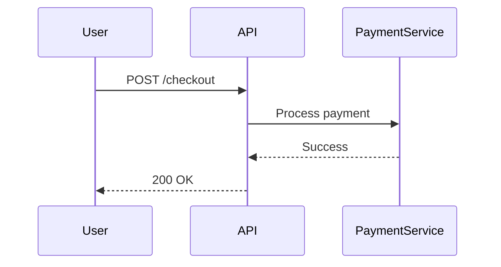

# Check xem ?

1. Dùng được cho mọi dự án BE, FE , AI rồi chứ
2. deep research để tận dụng bộ não của các nhà thiết kế hệ thống chuyên nghiệp họ sử dụng gì ? => update vào templte của chúng ta

Dựa trên nghiên cứu sâu về framework của **Google, Facebook, AWS, Abnormal AI, Microsoft Azure AI**, tôi đã tổng hợp và **nâng cấp** template hiện tại lên phiên bản **Universal Pro** - áp dụng được cho **Backend, Frontend, AI/ML** và tuân theo tiêu chuẩn Big Tech.

***

# TECHNICAL DEEP-DIVE SPECIFICATION (TDD)

**Version 3.0 - Universal Pro Edition**
*Áp dụng cho: Backend, Frontend, AI/ML Systems*

***

## 📋 **METADATA (Document Header)**

*Thêm vào đầu mọi tài liệu để track version và ownership*

```yaml
Title: [Module/System Name]
Author: [Primary Engineer/Architect]
Reviewers: [Tech Lead, Product Manager, Security]
Status: [Draft | In Review | Approved | Implemented | Deprecated]
Created: [YYYY-MM-DD]
Last Updated: [YYYY-MM-DD]
Version: [Semantic versioning: 1.0, 1.1, 2.0]
Related Docs: [Links to related design docs, ADRs, PRDs]
```

**Nguồn:** Google Design Docs, Microsoft Azure Architecture[^1][^2]

***

## 1. OVERVIEW \& CONTEXT

*Tổng quan ngắn gọn về vấn đề và giải pháp đề xuất*

### 1.1. Executive Summary (TL;DR)

- **Problem Statement:** Vấn đề gì đang được giải quyết? (1-2 câu)
- **Proposed Solution:** Giải pháp tóm gọn (1-2 câu)
- **Impact:** Business value (VD: Tăng MAU 20%, giảm latency 50%)


### 1.2. Background \& Motivation

- **Why now?** Tại sao timing này quan trọng?
- **Current Pain Points:** Vấn đề hiện tại với hệ thống cũ (nếu có)
- **Alternatives Considered:** Các phương án khác đã cân nhắc và lý do loại bỏ


### 1.3. Success Criteria

- Định nghĩa "Definition of Done"
- Key metrics để đo lường thành công

**Best Practice:** Giữ section này dưới 1 trang A4[^1]

***

## 2. GOALS / SCOPE / NON-GOALS / ASSUMPTIONS

*Định nghĩa biên giới rõ ràng*

### 2.1. Goals (Mục tiêu)

- **Business Goals:** Quantifiable (VD: Reduce churn by 15%)
- **Technical Goals:** Measurable (VD: p95 latency < 200ms, 99.9% uptime)
- **User Experience Goals:** (VD: Time-to-first-value < 30s)


### 2.2. In-Scope (Làm)

Liệt kê tính năng/component nằm trong phạm vi MVP

### 2.3. Out-of-Scope / Non-Goals (KHÔNG làm)

*"Non-goals are as important as goals"* - Google[^1]

- Tường minh các feature KHÔNG làm (VD: Multi-language support, Mobile app)


### 2.4. Assumptions

- Điều kiện giả định đúng (VD: Có API Gateway, Redis cluster sẵn)


### 2.5. Constraints

- Technical constraints (VD: Must use Python 3.11+, Deploy on AWS)
- Business constraints (VD: Budget < \$50K, Launch before Q2)
- Compliance (VD: GDPR-compliant, No PII in logs)


### 2.6. Dependencies

- External services/APIs phụ thuộc
- Team dependencies (cần support từ team nào?)

**Nguồn:** Google Design Docs, AWS Best Practices[^3][^1]

***

## 3. USER STORIES / USE CASES

*Mô tả hành vi người dùng*

### 3.1. Primary Actors

- Ai là người dùng hệ thống? (End-user, Internal service, Admin)


### 3.2. User Stories (Format chuẩn)

```
As a [role]
I want to [action]
So that [benefit]

Acceptance Criteria:
- [ ] Given... When... Then...
```


### 3.3. User Flows / Journey Maps

- Sơ đồ luồng tương tác (dùng Mermaid hoặc Figma)


### 3.4. Edge Cases \& Error Scenarios

- Kịch bản ngoại lệ (timeout, invalid input, concurrent requests)

**Frontend-specific:** Wireframes, Mockups, Interaction states[^4][^5]
**AI/ML-specific:** Inference scenarios, Model failure modes[^6][^3]

***

## 4. API CONTRACT \& INTERFACES

*Đặc tả giao tiếp giữa components*

### 4.1. API Design Principles

- REST/GraphQL/gRPC? Versioning strategy (`/v1/`, `/v2/`)
- Authentication (JWT, OAuth2, API Key)
- Rate limiting policy


### 4.2. Endpoint Specifications

**Cho mỗi endpoint:**

```yaml
Method: POST
Path: /v1/resource
Auth: Required (JWT Bearer)
Request:
  headers: {Content-Type, X-Request-ID}
  body: {field1: string, field2: number}
Response:
  200: {data: {...}, meta: {...}}
  400: {error: {code, message, details}}
Status Codes: 200, 201, 400, 401, 404, 429, 500, 503
```


### 4.3. Data Models (Request/Response Schemas)

- JSON Schema, Protobuf, TypeScript types
- **Idempotency:** Nếu cần (Idempotency-Key header)


### 4.4. Error Handling Standards

```json
{
  "error": {
    "code": "RESOURCE_NOT_FOUND",
    "message": "User with ID 123 not found",
    "details": {...},
    "trace_id": "abc-123"
  }
}
```

**Frontend-specific:** Component API props, Events, Callbacks[^7][^4]
**AI/ML-specific:** Model input/output schema, Feature schemas[^6][^3]

**Nguồn:** Google API Design Guide, OpenAPI Spec[^8][^9]

***

## 5. DATA MODEL \& STORAGE DESIGN

*Thiết kế lưu trữ dữ liệu*

### 5.1. Entity Relationship Diagram (ERD)

- Vẽ sơ đồ quan hệ (dùng dbdiagram.io, Mermaid)


### 5.2. Schema Definition

**Cho mỗi table/collection:**

```sql
CREATE TABLE users (
  id UUID PRIMARY KEY,
  email VARCHAR(255) UNIQUE NOT NULL,
  created_at TIMESTAMP DEFAULT NOW(),
  INDEX idx_email (email)
);
```


### 5.3. Indexing Strategy

- Primary keys, Foreign keys
- Secondary indexes (B-tree, Hash, Full-text)
- Query optimization


### 5.4. Data Versioning \& Migration

- Schema versioning (VD: Alembic, Flyway)
- Rollback plan, Zero-downtime migration


### 5.5. Caching Strategy

- What to cache? (Redis: User sessions, API responses)
- Cache invalidation policy, TTL


### 5.6. Data Retention \& Archival

- Soft delete vs Hard delete
- GDPR compliance (Right to be forgotten)

**Frontend-specific:** State management (Redux, Zustand), Local storage[^10][^7]
**AI/ML-specific:** Feature store, Model versioning, Dataset lineage[^11][^3][^6]

**Nguồn:** AWS RDS Best Practices, Stripe API Design[^12][^13]

***

## 6. SYSTEM ARCHITECTURE \& FLOW

*Kiến trúc tổng thể và luồng dữ liệu*

### 6.1. High-Level Architecture (C4 Model)

**Level 1 - Context Diagram:**
System boundary và external actors (User, External APIs)

**Level 2 - Container Diagram:**
Các service chính (API Gateway, Backend, Database, Cache, Queue)

### 6.2. Component Diagram (C4 Level 3)

- Phân rã các container thành modules
- Dependency graph


### 6.3. Data Flow Diagram

- Input → Processing → Output
- Data transformation pipeline


### 6.4. Sequence Diagrams (Critical Paths)




### 6.5. State Machine (Nếu có)

- VD: Order states: Pending → Processing → Completed → Cancelled

**Frontend-specific:** Component tree, Routing architecture[^4][^7][^10]
**AI/ML-specific:** Training pipeline, Inference architecture, MLOps workflow[^3][^11][^6]

**Nguồn:** C4 Model (Simon Brown), AWS Well-Architected Framework[^14][^1]

***

## 7. IMPLEMENTATION DETAILS (Deep-Dive)

*Chi tiết thuật toán và logic xử lý*

### 7.1. Processing Pipeline Overview

- Step-by-step breakdown (VD: Ingest → Validate → Transform → Store)


### 7.2. Per-Module Specification

**Cho mỗi module/component:**

- **Responsibility:** Làm gì?
- **Input:** Nhận gì?
- **Output:** Trả về gì?
- **Algorithm/Pseudocode:** Logic xử lý
- **Dependencies:** Phụ thuộc gì?


### 7.3. Business Logic Rules

- Quy tắc tính toán (VD: Discount = Price * 0.1 if quantity > 10)


### 7.4. Integration Points

- External API calls (Retry, Timeout, Circuit breaker)
- Message queue (Publish/Subscribe patterns)


### 7.5. Code Organization (Folder Structure)

```
src/
├── core/         # Config, constants, exceptions
├── models/       # Data models (ORM)
├── services/     # Business logic
├── api/          # API routes
├── repositories/ # Data access layer
└── utils/        # Helper functions
```

**Frontend-specific:** Component hierarchy, State management flow[^15][^7][^10][^4]
**AI/ML-specific:** Feature engineering, Model training loop, Hyperparameter tuning[^16][^6][^3]

**Nguồn:** Clean Architecture (Uncle Bob), Google Style Guides[^17][^1]


#### UNIVERSAL FOLDER STRUCTURE
**Áp dụng cho:** Backend (Node.js, Python, Go), Frontend (React, Vue, Angular), AI/ML Projects

---

##### 📁 PROJECT ROOT STRUCTURE (Cho mọi loại dự án)

```
project-root/
├── docs/                          # 📚 Tài liệu dự án
│   ├── README.md                 # Overview dự án
│   ├── ARCHITECTURE.md           # Sơ đồ kiến trúc
│   ├── API.md                    # API Documentation
│   ├── DEPLOYMENT.md             # Hướng dẫn deploy
│   ├── tdd/                      # Technical Deep Dive Documents
│   │   ├── TDD-System-Overview.md
│   │   ├── TDD-Auth-Service.md
│   │   └── TDD-[Module-Name].md
│   ├── adr/                      # Architecture Decision Records
│   │   ├── ADR-001-use-postgres.md
│   │   └── ADR-[NUMBER]-[DECISION].md
│   ├── database/                 # Schema & Migration
│   │   ├── schema.sql
│   │   └── migrations/
│   └── images/                   # Diagrams & Screenshots
│       ├── architecture.png
│       └── dataflow.png
│
├── src/                          # 💻 SOURCE CODE (Tùy loại dự án)
│   ├── (See Backend/Frontend sections below)
│
├── tests/                        # ✅ TEST FILES
│   ├── unit/                     # Unit tests
│   ├── integration/              # Integration tests
│   ├── e2e/                      # End-to-end tests
│   ├── fixtures/                 # Test data
│   └── conftest.py              # Pytest config (Python)
│
├── .github/                      # 🔄 CI/CD & Automation
│   ├── workflows/
│   │   ├── ci.yml               # Build & Test
│   │   ├── security-scan.yml    # Security checks
│   │   └── deploy.yml           # Deployment
│   └── ISSUE_TEMPLATE/
│
├── config/                       # ⚙️ Configuration
│   ├── development.yaml
│   ├── staging.yaml
│   ├── production.yaml
│   └── secret-template.env      # Template (NO REAL SECRETS!)
│
├── docker/                       # 🐳 Docker
│   ├── Dockerfile
│   ├── Dockerfile.prod          # Production build
│   └── docker-compose.yml
│   └── docker-compose.prod.yml
│
├── kubernetes/                   # ☸️ K8s Manifests (if applicable)
│   ├── deployment.yaml
│   ├── service.yaml
│   ├── configmap.yaml
│   ├── secret-template.yaml
│   └── kustomization.yaml
│
├── scripts/                      # 🛠️ Utility Scripts
│   ├── install.sh               # Setup local environment
│   ├── seed-db.sh               # DB seeding
│   ├── migrate.sh               # Migration script
│   └── lint.sh                  # Code formatting
│
├── .gitignore                    # Git ignore rules
├── .env.example                  # Example env variables
├── .editorconfig                 # Code style across IDEs
├── README.md                     # Project overview
├── LICENSE                       # License file
├── CONTRIBUTING.md              # Contribution guidelines
└── [Language-specific files]
    ├── package.json             # Node.js
    ├── requirements.txt/pyproject.toml         # Python
    ├── go.mod                   # Go
    ├── Cargo.toml              # Rust
    ├── pom.xml                 # Java
    └── Gemfile                 # Ruby

```

---

##### 📂 BACKEND FOLDER STRUCTURE (Python, Node.js, Go)

###### Option 1: Feature-Based (Recommended for Microservices)
```
src/
├── auth/                        # Feature: Authentication
│   ├── __init__.py
│   ├── models.py               # Data models
│   ├── schemas.py              # Request/Response schemas
│   ├── service.py              # Business logic
│   ├── repository.py           # DB access
│   ├── routes.py               # API endpoints
│   ├── dependencies.py         # Dependency injection
│   └── tests/
│       ├── test_models.py
│       ├── test_service.py
│       └── test_routes.py
│
├── users/                       # Feature: User Management
│   ├── __init__.py
│   ├── models.py
│   ├── schemas.py
│   ├── service.py
│   ├── repository.py
│   ├── routes.py
│   └── tests/
│
├── context/                     # Feature: Context Engine
│   ├── __init__.py
│   ├── models.py
│   ├── schemas.py
│   ├── service.py
│   ├── repository.py
│   ├── routes.py
│   ├── algorithms.py           # Scoring logic
│   └── tests/
│
├── core/                        # Shared across all modules
│   ├── __init__.py
│   ├── config.py               # Configuration management
│   ├── constants.py            # Constants
│   ├── exceptions.py           # Custom exceptions
│   ├── logging.py              # Logging setup
│   ├── security.py             # JWT, encryption
│   └── database.py             # DB connection setup
│
├── common/                      # Shared utilities
│   ├── __init__.py
│   ├── pagination.py           # Pagination logic
│   ├── response.py             # Standard response format
│   ├── validators.py           # Input validators
│   ├── decorators.py           # Custom decorators
│   └── helpers.py              # Helper functions
│
├── integrations/               # External service integrations
│   ├── __init__.py
│   ├── openai_client.py        # OpenAI API
│   ├── stripe_client.py        # Stripe payment
│   ├── email_service.py        # Email provider
│   └── slack_notifier.py       # Slack alerts
│
├── workers/                    # Background jobs / Async workers
│   ├── __init__.py
│   ├── celery_config.py        # Celery setup
│   ├── scoring_worker.py       # Async scoring
│   ├── email_worker.py         # Async email
│   └── cleanup_worker.py       # Cleanup tasks
│
├── migrations/                 # Database migrations
│   ├── versions/
│   │   ├── 001_initial_schema.py
│   │   └── 002_add_user_table.py
│   └── env.py
│
├── main.py                     # Application entry point
├── wsgi.py                     # WSGI entry (production)
└── requirements.txt
```

###### Option 2: Layer-Based (Traditional Monolith)
```
src/
├── models/                     # Data models / Entities
│   ├── user.py
│   ├── context.py
│   └── __init__.py
│
├── schemas/                    # Request/Response DTOs
│   ├── user_schema.py
│   ├── context_schema.py
│   └── __init__.py
│
├── services/                   # Business logic
│   ├── auth_service.py
│   ├── user_service.py
│   ├── context_service.py
│   └── __init__.py
│
├── repositories/               # Data access layer
│   ├── user_repository.py
│   ├── context_repository.py
│   └── __init__.py
│
├── api/                        # API routes/handlers
│   ├── routers/
│   │   ├── auth.py
│   │   ├── users.py
│   │   ├── context.py
│   │   └── __init__.py
│   ├── middleware/
│   │   ├── auth_middleware.py
│   │   ├── error_handler.py
│   │   └── __init__.py
│   └── __init__.py
│
├── core/                       # Shared configuration
│   ├── config.py
│   ├── constants.py
│   ├── exceptions.py
│   ├── logging.py
│   ├── security.py
│   └── __init__.py
│
├── migrations/
├── main.py
└── requirements.txt
```

---

##### 📂 FRONTEND FOLDER STRUCTURE (React, Vue, Angular)

###### Option 1: Feature-Based (Recommended for Large Apps)
```
src/
├── features/                   # Feature modules
│   ├── auth/
│   │   ├── components/
│   │   │   ├── LoginForm.jsx
│   │   │   ├── SignupForm.jsx
│   │   │   └── index.js
│   │   ├── pages/
│   │   │   ├── LoginPage.jsx
│   │   │   └── SignupPage.jsx
│   │   ├── hooks/
│   │   │   ├── useAuth.js
│   │   │   └── useLogin.js
│   │   ├── services/
│   │   │   └── authService.js
│   │   ├── store/              # Redux/Zustand
│   │   │   ├── authSlice.js
│   │   │   └── selectors.js
│   │   ├── types/
│   │   │   └── auth.ts         # TypeScript types
│   │   ├── constants.js
│   │   └── index.js
│   │
│   ├── users/
│   │   ├── components/
│   │   ├── pages/
│   │   ├── hooks/
│   │   ├── services/
│   │   ├── store/
│   │   └── index.js
│   │
│   └── dashboard/
│       ├── components/
│       ├── pages/
│       ├── hooks/
│       ├── services/
│       ├── store/
│       └── index.js
│
├── shared/                     # Reusable components & utilities
│   ├── components/
│   │   ├── Button.jsx
│   │   ├── Modal.jsx
│   │   ├── Card.jsx
│   │   └── index.js
│   ├── hooks/
│   │   ├── useApi.js
│   │   ├── useLocalStorage.js
│   │   └── index.js
│   ├── services/
│   │   ├── api.js              # API client (axios/fetch)
│   │   └── localStorage.js
│   ├── utils/
│   │   ├── formatters.js
│   │   ├── validators.js
│   │   └── helpers.js
│   ├── styles/
│   │   ├── global.css
│   │   ├── variables.css
│   │   └── themes.css
│   └── types/
│       └── index.ts
│
├── store/                      # Global state (Redux, Zustand, Pinia)
│   ├── slices/
│   │   ├── authSlice.js
│   │   ├── userSlice.js
│   │   └── uiSlice.js
│   ├── actions/
│   │   ├── authActions.js
│   │   └── userActions.js
│   ├── selectors/
│   │   ├── authSelectors.js
│   │   └── userSelectors.js
│   ├── thunks/
│   ├── middleware/
│   └── index.js
│
├── layouts/                    # Layout components
│   ├── MainLayout.jsx
│   ├── AuthLayout.jsx
│   └── AdminLayout.jsx
│
├── config/                     # Configuration
│   ├── api.config.js           # API endpoints
│   ├── routes.config.js        # Route definitions
│   └── theme.config.js         # Theme config
│
├── constants/
│   ├── api.constants.js
│   ├── error.constants.js
│   └── ui.constants.js
│
├── App.jsx
├── index.js
└── index.css
```

###### Option 2: Structure-Based (Monolithic)
```
src/
├── components/                 # All UI components
│   ├── auth/
│   │   ├── LoginForm.jsx
│   │   └── SignupForm.jsx
│   ├── common/
│   │   ├── Button.jsx
│   │   ├── Modal.jsx
│   │   └── Header.jsx
│   ├── dashboard/
│   │   ├── DashboardWidget.jsx
│   │   └── Stats.jsx
│   └── index.js
│
├── pages/                      # Page components
│   ├── LoginPage.jsx
│   ├── DashboardPage.jsx
│   └── NotFoundPage.jsx
│
├── hooks/
│   ├── useAuth.js
│   ├── useApi.js
│   └── useForm.js
│
├── services/
│   ├── authService.js
│   ├── apiClient.js
│   └── storageService.js
│
├── store/                      # Redux / Zustand
│   ├── slices/
│   ├── actions/
│   └── index.js
│
├── styles/
│   ├── global.css
│   ├── variables.css
│   └── themes.css
│
├── utils/
│   ├── formatters.js
│   ├── validators.js
│   └── helpers.js
│
├── types/
│   └── index.ts
│
├── config/
│   └── api.config.js
│
├── App.jsx
└── index.js
```

---

##### 📂 AI/ML PROJECT FOLDER STRUCTURE

```
ml-project/
├── docs/                       # 📚 Documentation
│   ├── README.md
│   ├── DATA.md                # Data documentation
│   ├── MODEL.md               # Model documentation
│   ├── EXPERIMENTS.md         # Experiment results
│   └── tdd/
│       └── TDD-ML-System.md
│
├── data/                       # 📊 Data files
│   ├── raw/                   # Original raw data
│   │   └── dataset_v1.csv
│   ├── processed/             # Cleaned data
│   │   └── dataset_v1_processed.csv
│   ├── train/                 # Training split
│   ├── test/                  # Test split
│   ├── val/                   # Validation split
│   └── external/              # External datasets
│
├── notebooks/                 # 📓 Jupyter notebooks
│   ├── 01_eda.ipynb          # Exploratory Data Analysis
│   ├── 02_feature_engineering.ipynb
│   ├── 03_model_training.ipynb
│   └── 04_evaluation.ipynb
│
├── src/                       # 💻 Source code
│   ├── data/
│   │   ├── __init__.py
│   │   ├── loader.py          # Data loading
│   │   ├── preprocessor.py    # Data cleaning
│   │   └── augmentation.py    # Data augmentation
│   │
│   ├── features/
│   │   ├── __init__.py
│   │   ├── engineering.py     # Feature engineering
│   │   ├── selection.py       # Feature selection
│   │   └── scaling.py         # Feature scaling
│   │
│   ├── models/
│   │   ├── __init__.py
│   │   ├── base_model.py      # Base class
│   │   ├── xgboost_model.py
│   │   ├── neural_net.py
│   │   └── ensemble.py
│   │
│   ├── training/
│   │   ├── __init__.py
│   │   ├── trainer.py         # Training loop
│   │   ├── callbacks.py       # Training callbacks
│   │   ├── hyperparameters.py # Hyperparameter configs
│   │   └── early_stopping.py
│   │
│   ├── evaluation/
│   │   ├── __init__.py
│   │   ├── metrics.py         # Metrics computation
│   │   ├── validation.py      # Cross-validation
│   │   └── visualization.py   # Plots
│   │
│   ├── inference/
│   │   ├── __init__.py
│   │   ├── predictor.py       # Batch prediction
│   │   ├── api.py             # REST API for inference
│   │   └── latency_optimizer.py
│   │
│   ├── utils/
│   │   ├── __init__.py
│   │   ├── logger.py
│   │   ├── config.py
│   │   └── helpers.py
│   │
│   ├── mlops/
│   │   ├── __init__.py
│   │   ├── experiment_tracker.py  # MLflow
│   │   ├── model_registry.py      # Model versioning
│   │   └── deployment.py          # Model deployment
│   │
│   └── main.py
│
├── models/                    # 🤖 Trained models
│   ├── xgboost_v1.pkl
│   ├── neural_net_v1.h5
│   ├── scaler.pkl             # Feature scaler
│   └── label_encoder.pkl
│
├── mlruns/                    # 📊 MLflow tracking
│   ├── experiments/
│   └── artifacts/
│
├── experiments/               # 🧪 Experiment logs
│   ├── exp_001_baseline.json
│   ├── exp_002_feature_v2.json
│   └── exp_003_ensemble.json
│
├── configs/                   # ⚙️ Configuration files
│   ├── data_config.yaml
│   ├── model_config.yaml
│   ├── training_config.yaml
│   └── inference_config.yaml
│
├── tests/                     # ✅ Tests
│   ├── unit/
│   │   ├── test_preprocessing.py
│   │   ├── test_features.py
│   │   └── test_models.py
│   ├── integration/
│   │   └── test_pipeline.py
│   └── data/
│       └── test_data_quality.py
│
├── scripts/                   # 🛠️ Scripts
│   ├── train.py              # Training entry point
│   ├── evaluate.py           # Evaluation script
│   ├── predict.py            # Batch prediction
│   ├── register_model.py     # Register model in registry
│   └── serve.py              # Serve model (Flask/FastAPI)
│
├── api/                       # 🌐 REST API (if applicable)
│   ├── main.py               # FastAPI app
│   ├── routes/
│   │   ├── predict.py
│   │   └── health.py
│   └── requirements.txt
│
├── docker/
│   ├── Dockerfile.train      # Training container
│   ├── Dockerfile.inference  # Inference container
│   └── docker-compose.yml
│
├── requirements.txt          # Python dependencies
├── setup.py                  # Package setup
├── Makefile                  # Common commands
├── .gitignore
└── README.md
```

---

##### 🔧 ADDITIONAL COMMON STRUCTURES

###### Database Migrations (Alembic / Flyway format)
```
migrations/
├── versions/
│   ├── 001_initial_schema.py
│   ├── 002_add_user_table.py
│   ├── 003_create_indexes.py
│   └── [timestamp]_[description].py
├── env.py
├── script.py.mako
└── alembic.ini
```

###### Tests Structure
```
tests/
├── unit/
│   ├── test_auth_service.py
│   ├── test_user_service.py
│   └── test_models.py
├── integration/
│   ├── test_api_routes.py
│   ├── test_database.py
│   └── test_third_party_apis.py
├── e2e/
│   ├── test_auth_flow.py
│   ├── test_user_signup.py
│   └── test_payment_flow.py
├── fixtures/
│   ├── user_fixtures.py
│   ├── db_fixtures.py
│   └── mock_data.json
├── conftest.py
└── pytest.ini
```

###### CI/CD Workflows
```
.github/workflows/
├── ci.yml                   # Build & Test on PR
├── security-scan.yml        # SAST (Snyk, Sonarqube)
├── deploy-dev.yml           # Deploy to Dev
├── deploy-staging.yml       # Deploy to Staging
├── deploy-prod.yml          # Deploy to Production (Manual)
└── performance-test.yml     # Load & Performance tests
```

---

##### 📋 NAMING CONVENTIONS

###### File Names
| Type | Convention | Example |
|:---:|:---|:---|
| Components | PascalCase | `UserProfile.jsx`, `AuthForm.jsx` |
| Utilities | camelCase | `formatDate.js`, `validateEmail.js` |
| Constants | UPPER_SNAKE_CASE | `API_ENDPOINTS.js`, `ERROR_CODES.js` |
| Tests | `test_*.py` or `*.test.js` | `test_auth.py`, `auth.test.js` |
| Config | kebab-case | `database.config.js`, `app.config.yaml` |

###### Folder Names
| Type | Convention | Example |
|:---:|:---|:---|
| Folders | lowercase | `components/`, `services/`, `utils/` |
| Feature folders | lowercase | `auth/`, `users/`, `dashboard/` |

###### Database
| Type | Convention | Example |
|:---:|:---|:---|
| Tables | plural, snake_case | `users`, `api_tokens`, `user_sessions` |
| Columns | snake_case | `created_at`, `user_id`, `is_active` |
| Indexes | `idx_[table]_[column]` | `idx_users_email`, `idx_posts_user_id` |

---

##### 🎯 CHOOSING YOUR STRUCTURE

| Project Type | Recommended | Reason |
|:---|:---|:---|
| **Backend Microservice** | Feature-Based | Easy to scale, single-responsibility |
| **Backend Monolith** | Layer-Based | Clear separation of concerns |
| **Frontend SPA** | Feature-Based | Scales well with many features |
| **AI/ML Project** | Custom ML-focused | Data-heavy, experiment-centric |

---

###### Example 1 - Context Handling Service

```bash
context-handling-service/
│
├── README.md                                    # Tài liệu chính của project
├── .env.example                                 # Template environment variables
├── .gitignore                                   # Git ignore file
├── requirements.txt                             # Python dependencies
├── pyproject.toml                               # Project configuration
├── Dockerfile                                   # Docker image definition
├── docker-compose.yml                           # Docker compose for local dev
│
├── app/                                         # Main application package
│   ├── __init__.py
│   │
│   ├── core/                                    # Core configuration & constants
│   │   ├── __init__.py
│   │   ├── config_settings.py                   # ✅ Settings & environment variables
│   │   ├── constants_enums.py                   # ✅ Constants & enums (FriendshipLevel, AgentType, etc.)
│   │   ├── exceptions_custom.py                 # ✅ Custom exceptions (FriendshipNotFoundError, etc.)
│   │   └── status_codes.py                      # ✅ HTTP status codes & error messages
│   │
│   ├── models/                                  # SQLAlchemy ORM models
│   │   ├── __init__.py
│   │   ├── base_model.py                        # ✅ Base model class with common fields
│   │   ├── friendship_status_model.py           # ✅ FriendshipStatus table model
│   │   ├── friendship_agent_mapping_model.py    # ✅ FriendshipAgentMapping table model
│   │   └── conversation_model.py                # ✅ Conversation table model (if needed)
│   │
│   ├── schemas/                                 # Pydantic request/response schemas
│   │   ├── __init__.py
│   │   ├── friendship_status_schemas.py         # ✅ FriendshipStatus request/response
│   │   ├── friendship_agent_mapping_schemas.py  # ✅ AgentMapping request/response
│   │   ├── activity_suggestion_schemas.py       # ✅ Activity suggestion request/response
│   │   ├── conversation_end_schemas.py          # ✅ Conversation end event schema
│   │   └── common_schemas.py                    # ✅ Common schemas (error responses, etc.)
│   │
│   ├── db/                                      # Database layer
│   │   ├── __init__.py
│   │   ├── database_connection.py               # ✅ Database connection & SessionLocal
│   │   ├── base_repository.py                   # ✅ Base repository class (generic CRUD)
│   │   └── database_migrations.py               # ✅ Migration utilities
│   │
│   ├── repositories/                            # Data access layer (Repository pattern)
│   │   ├── __init__.py
│   │   ├── friendship_status_repository.py      # ✅ FriendshipStatus CRUD operations
│   │   ├── friendship_agent_mapping_repository.py # ✅ AgentMapping CRUD operations
│   │   └── conversation_repository.py           # ✅ Conversation lookup operations
│   │
│   ├── services/                                # Business logic layer
│   │   ├── __init__.py
│   │   ├── friendship_score_calculation_service.py  # ✅ Calculate friendship score change
│   │   ├── friendship_status_update_service.py      # ✅ Update friendship status in DB
│   │   ├── topic_metrics_update_service.py          # ✅ Update topic metrics
│   │   ├── agent_selection_algorithm_service.py     # ✅ Select agents (greeting, talk, game)
│   │   ├── activity_suggestion_service.py           # ✅ Suggest activities for user
│   │   └── conversation_data_fetch_service.py       # ✅ Fetch conversation data by ID
│   │
│   ├── tasks/                                   # Background tasks & async jobs
│   │   ├── __init__.py
│   │   ├── process_conversation_end_task.py     # ✅ Background task: process conversation end
│   │   ├── batch_recompute_candidates_task.py   # ✅ Scheduled task: batch recompute (6h)
│   │   └── retry_failed_processing_task.py      # ✅ Retry mechanism for failed tasks
│   │
│   ├── cache/                                   # Caching layer
│   │   ├── __init__.py
│   │   ├── redis_cache_manager.py               # ✅ Redis cache operations
│   │   ├── cache_keys_builder.py                # ✅ Build cache keys (candidates:{user_id})
│   │   └── cache_invalidation_handler.py        # ✅ Invalidate cache when needed
│   │
│   ├── api/                                     # API routes & endpoints
│   │   ├── __init__.py
│   │   ├── dependency_injection.py              # ✅ Dependency injection setup
│   │   │
│   │   └── v1/                                  # API v1
│   │       ├── __init__.py
│   │       ├── router_v1_main.py                # ✅ Main router for v1
│   │       │
│   │       └── endpoints/
│   │           ├── __init__.py
│   │           ├── endpoint_conversations_end.py        # ✅ POST /conversations/end
│   │           ├── endpoint_conversations_get.py        # ✅ GET /conversations/{id}
│   │           ├── endpoint_friendship_status.py        # ✅ POST /friendship/status
│   │           ├── endpoint_friendship_update.py        # ✅ POST /friendship/update
│   │           ├── endpoint_activities_suggest.py       # ✅ POST /activities/suggest
│   │           ├── endpoint_agent_mappings_list.py      # ✅ GET /agent-mappings
│   │           ├── endpoint_agent_mappings_create.py    # ✅ POST /agent-mappings
│   │           ├── endpoint_agent_mappings_update.py    # ✅ PUT /agent-mappings/{id}
│   │           ├── endpoint_agent_mappings_delete.py    # ✅ DELETE /agent-mappings/{id}
│   │           └── endpoint_health_check.py             # ✅ GET /health
│   │
│   ├── utils/                                   # Utility functions & helpers
│   │   ├── __init__.py
│   │   ├── logger_setup.py                      # ✅ Logging configuration & setup
│   │   ├── input_validators.py                  # ✅ Input validation functions
│   │   ├── helper_functions.py                  # ✅ General helper functions
│   │   ├── weighted_random_selection.py         # ✅ Weighted random selection algorithm
│   │   └── datetime_utilities.py                # ✅ DateTime utilities
│   │
│   └── main_app.py                              # ✅ FastAPI app entry point
│
├── migrations/                                  # Alembic database migrations
│   ├── env.py                                   # ✅ Alembic environment config
│   ├── script.py.mako                           # ✅ Migration template
│   │
│   └── versions/
│       ├── __init__.py
│       ├── 001_create_friendship_status_table.py        # ✅ Migration: Create friendship_status
│       ├── 002_create_friendship_agent_mapping_table.py # ✅ Migration: Create agent_mapping
│       └── 003_add_indexes_and_constraints.py           # ✅ Migration: Add indexes
│
├── scripts/                                     # Utility scripts
│   ├── __init__.py
│   ├── script_seed_agent_data.py                # ✅ Seed initial agent data
│   ├── script_initialize_database.py            # ✅ Initialize database (create tables, seed)
│   ├── script_reset_database.py                 # ✅ Reset database (drop all tables)
│   └── script_generate_sample_data.py           # ✅ Generate sample data for testing
│
├── tests/                                       # Test suite
│   ├── __init__.py
│   ├── conftest_pytest_config.py                # ✅ Pytest configuration & fixtures
│   │
│   ├── unit/                                    # Unit tests
│   │   ├── __init__.py
│   │   ├── test_friendship_score_calculation.py # ✅ Test score calculation algorithm
│   │   ├── test_topic_metrics_update.py         # ✅ Test topic metrics update
│   │   ├── test_agent_selection_algorithm.py    # ✅ Test agent selection algorithm
│   │   ├── test_friendship_status_repository.py # ✅ Test repository methods
│   │   └── test_input_validators.py             # ✅ Test input validation
│   │
│   ├── integration/                             # Integration tests
│   │   ├── __init__.py
│   │   ├── test_api_conversations_end.py        # ✅ Test POST /conversations/end
│   │   ├── test_api_friendship_status.py        # ✅ Test POST /friendship/status
│   │   ├── test_api_activities_suggest.py       # ✅ Test POST /activities/suggest
│   │   ├── test_api_agent_mappings_crud.py      # ✅ Test agent mappings CRUD
│   │   └── test_end_to_end_flow.py              # ✅ Test complete flow
│   │
│   └── fixtures/                                # Test fixtures & sample data
│       ├── __init__.py
│       ├── fixture_friendship_data.py           # ✅ Friendship test data
│       ├── fixture_agent_data.py                # ✅ Agent test data
│       └── fixture_conversation_data.py         # ✅ Conversation test data
│
├── logs/                                        # Application logs
│   └── .gitkeep
│
├── docs/                                        # Documentation
│   ├── API_SPECIFICATION.md                     # ✅ API specification
│   ├── DATABASE_SCHEMA.md                       # ✅ Database schema documentation
│   ├── ARCHITECTURE.md                          # ✅ Architecture documentation
│   ├── SETUP_GUIDE.md                           # ✅ Setup & installation guide
│   └── DEPLOYMENT_GUIDE.md                      # ✅ Deployment guide
│
└── config/                                      # Configuration files
    ├── logging_config.yaml                      # ✅ Logging configuration
    ├── database_config.yaml                     # ✅ Database configuration
    └── cache_config.yaml                        # ✅ Cache configuration
```


###### Example 2 - FinAI

```
comet-ai-browser/
│
├── 📁 docs/
│   ├── README.md                           # Main project documentation
│   ├── ARCHITECTURE.md                     # System architecture overview
│   ├── API.md                              # API specifications (endpoints, schemas)
│   ├── THREAT-MODEL.md                     # Security threat model & mitigations
│   ├── RUNBOOK.md                          # Operations & troubleshooting guide
│   ├── ROADMAP.md                          # Future features & milestones
│   └── GLOSSARY.md                         # Terminology & definitions
│
├── 📁 packages/
│   └── shared/
│       ├── tsconfig.json
│       ├── package.json
│       └── src/
│           ├── types/                      # Shared TypeScript types
│           │   ├── common.ts               # RawRequest, NormalizedInput
│           │   ├── task-spec.ts            # TaskSpecV1, ActionPlan
│           │   ├── evidence.ts             # EvidencePack, EvidenceItem
│           │   ├── answer.ts               # AnswerSkeleton, FinalAnswer
│           │   └── errors.ts               # Error types, exception classes
│           ├── schemas/                    # Validation schemas & serializers
│           │   ├── input.schema.ts         # RawRequestV1 validation
│           │   ├── task.schema.ts          # TaskSpecV1 validation
│           │   ├── evidence.schema.ts      # EvidencePack validation
│           │   ├── answer.schema.ts        # FinalAnswer validation
│           │   └── api.schema.ts           # API response/request schemas
│           └── utils/
│               ├── logger.ts               # Structured logging setup
│               ├── tracer.ts               # OpenTelemetry tracing
│               ├── hashing.ts              # SHA256, payload hashing
│               ├── url-parser.ts           # URL parsing & validation
│               ├── validators.ts           # Common validators
│               └── constants.ts            # Global constants, limits
│
├── 📁 services/
│   │
│   ├── 🔷 STAGE-1-unified-input-core/
│   │   ├── Dockerfile
│   │   ├── docker-compose.yml
│   │   ├── .env.example
│   │   ├── tsconfig.json
│   │   ├── package.json
│   │   ├── README.md
│   │   └── src/
│   │       ├── index.ts                    # Service entrypoint
│   │       ├── config.ts                   # Configuration & env vars
│   │       ├── constants.ts                # Local constants (MAX_INPUT_LENGTH, etc.)
│   │       ├── exceptions.ts               # Custom exception classes
│   │       ├── api/
│   │       │   ├── routes.ts               # FastAPI/Express route handlers
│   │       │   ├── handlers.ts             # Request/response handlers
│   │       │   ├── middleware.ts           # Auth, CORS, logging middleware
│   │       │   └── schemas.ts              # API request/response schemas
│   │       ├── stages/
│   │       │   └── stage1/                 # Stage 1 pipeline logic
│   │       │       ├── validator.ts        # 1.1 validateRawRequest
│   │       │       ├── env-builder.ts      # 1.2 buildEnv
│   │       │       ├── envelope.ts         # 1.3 initEnvelope
│   │       │       ├── classifier.ts       # 1.4 runInputClassifier
│   │       │       ├── normalizer.ts       # 1.5 runTextNormalizer
│   │       │       ├── context.ts          # 1.6 attachPageContext
│   │       │       ├── safety.ts           # 1.7 computeSafetyFlags
│   │       │       └── telemetry.ts        # 1.8 buildTelemetry
│   │       ├── modules/
│   │       │   ├── input-adapter.ts        # InputAdapter component
│   │       │   ├── context-collector.ts    # ContextCollector component
│   │       │   └── normalizer.ts           # Normalizer component
│   │       ├── integrations/
│   │       │   ├── redis.ts                # Redis client for idempotency
│   │       │   ├── cache.ts                # Caching layer
│   │       │   └── vault.ts                # Secrets management
│   │       └── observability/
│   │           ├── logging.ts              # Structured JSON logging
│   │           ├── metrics.ts              # Prometheus metrics
│   │           └── tracing.ts              # OpenTelemetry spans
│   │   └── tests/
│   │       ├── unit/
│   │       │   ├── normalizer.test.ts
│   │       │   ├── classifier.test.ts
│   │       │   ├── safety.test.ts
│   │       │   └── validator.test.ts
│   │       ├── integration/
│   │       │   ├── api.test.ts
│   │       │   ├── redis.test.ts
│   │       │   └── pipeline.test.ts
│   │       └── e2e/
│   │           ├── full-flow.test.ts
│   │           └── idempotency.test.ts
│   │
│   ├── 🔷 STAGE-2-query-understanding/
│   │   ├── Dockerfile
│   │   ├── docker-compose.yml
│   │   ├── .env.example
│   │   ├── tsconfig.json
│   │   ├── package.json
│   │   ├── README.md
│   │   └── src/
│   │       ├── index.ts
│   │       ├── config.ts
│   │       ├── constants.ts
│   │       ├── exceptions.ts
│   │       ├── api/
│   │       │   ├── routes.ts
│   │       │   ├── handlers.ts
│   │       │   └── schemas.ts
│   │       ├── stages/
│   │       │   └── stage2/
│   │       │       ├── orchestrator.ts     # runQueryUnderstanding entrypoint
│   │       │       ├── rule-engine.ts      # 2.1 Rule-based classification (A, B, C, D)
│   │       │       ├── intent-extractor.ts # Intent & Slot extraction
│   │       │       ├── entity-parser.ts    # Parse budget, time, travel, quantity
│   │       │       ├── policy-engine.ts    # 2.2 Policy overrides & safety checks
│   │       │       └── slm-module.ts       # 2.3 SLM call for slow path
│   │       ├── modules/
│   │       │   ├── policy-classifier.ts    # Toxicity, PII, injection detection
│   │       │   └── embedding-prep.ts       # Query embedding generation
│   │       ├── rules/
│   │       │   ├── intent-rules.ts         # Intent classification rules
│   │       │   ├── entity-rules.ts         # Entity extraction rules
│   │       │   └── policy-rules.ts         # Policy & safety rules
│   │       ├── integrations/
│   │       │   ├── model-gateway.ts        # SLM model calls
│   │       │   └── embeddings.ts           # Embedding service
│   │       └── observability/
│   │           ├── logging.ts
│   │           ├── metrics.ts
│   │           └── tracing.ts
│   │   └── tests/
│   │       ├── unit/
│   │       │   ├── rule-engine.test.ts
│   │       │   ├── entity-parser.test.ts
│   │       │   └── policy-engine.test.ts
│   │       ├── integration/
│   │       │   ├── slm-call.test.ts
│   │       │   └── end-to-end.test.ts
│   │       └── golden/
│   │           └── golden-tests.ts         # Deterministic outputs
│   │
│   ├── 🔷 STAGE-3-router-planner/
│   │   ├── Dockerfile
│   │   ├── docker-compose.yml
│   │   ├── .env.example
│   │   ├── tsconfig.json
│   │   ├── package.json
│   │   ├── README.md
│   │   └── src/
│   │       ├── index.ts
│   │       ├── config.ts
│   │       ├── constants.ts
│   │       ├── exceptions.ts
│   │       ├── api/
│   │       │   ├── routes.ts
│   │       │   ├── handlers.ts
│   │       │   └── schemas.ts
│   │       ├── stages/
│   │       │   └── stage3/
│   │       │       ├── orchestrator.ts     # Main Stage 3 orchestrator
│   │       │       ├── signal-extractor.ts # 3.1 Extract routing signals
│   │       │       ├── mode-selector.ts    # 3.2 Mode selection (A, B, C, D)
│   │       │       ├── plan-builder.ts     # 3.3 PlanBuilder (Planner LLM)
│   │       │       ├── plan-validator.ts   # 3.4 PlanValidator
│   │       │       ├── budget-manager.ts   # 3.5 BudgetManager
│   │       │       ├── state-manager.ts    # 3.6 StateManager & task FSM
│   │       │       └── step-executor.ts    # 3.7 Runtime step execution
│   │       ├── modules/
│   │       │   ├── plan-generator.ts       # ActionPlan generation
│   │       │   ├── policy-enforcer.ts      # Policy constraints enforcement
│   │       │   └── personalization.ts      # User preference adjustments
│   │       ├── integrations/
│   │       │   ├── model-gateway.ts        # LLM/Planner calls
│   │       │   ├── state-store.ts          # Redis/DB state persistence
│   │       │   └── tool-registry.ts        # Capability registry
│   │       └── observability/
│   │           ├── logging.ts
│   │           ├── metrics.ts
│   │           └── tracing.ts
│   │   └── tests/
│   │       ├── unit/
│   │       │   ├── plan-validator.test.ts
│   │       │   ├── budget-manager.test.ts
│   │       │   └── state-manager.test.ts
│   │       ├── integration/
│   │       │   ├── mode-selection.test.ts
│   │       │   └── plan-generation.test.ts
│   │       └── scenario/
│   │           ├── mode-a.scenario.ts
│   │           ├── mode-b.scenario.ts
│   │           ├── mode-c.scenario.ts
│   │           └── mode-d.scenario.ts
│   │
│   ├── 🔷 STAGE-4-unified-executor/
│   │   ├── Dockerfile
│   │   ├── docker-compose.yml
│   │   ├── .env.example
│   │   ├── tsconfig.json
│   │   ├── package.json
│   │   ├── README.md
│   │   └── src/
│   │       ├── index.ts
│   │       ├── config.ts
│   │       ├── constants.ts
│   │       ├── exceptions.ts
│   │       ├── api/
│   │       │   ├── routes.ts
│   │       │   ├── handlers.ts
│   │       │   └── schemas.ts
│   │       ├── stages/
│   │       │   └── stage4/
│   │       │       ├── orchestrator.ts     # Stage 4 main executor
│   │       │       ├── 4.1-retrieval.ts    # 4.1 RetrievalEngine
│   │       │       ├── 4.2-fetch.ts        # 4.2 WebFetch & SSRF Guard
│   │       │       ├── 4.3-extract.ts      # 4.3 DOM parsing & extraction
│   │       │       ├── 4.4-action.ts       # 4.4 Action execution
│   │       │       └── evidence-builder.ts # EvidenceBuilder & packaging
│   │       ├── modules/
│   │       │   ├── retrieval-engine.ts     # Hybrid search (BM25 + vector)
│   │       │   ├── reranker.ts             # Cross-encoder reranking
│   │       │   ├── web-fetch.ts            # HTTP client with retries
│   │       │   ├── ssrf-guard.ts           # SSRF protection
│   │       │   ├── dom-parser.ts           # HTML parsing & extraction
│   │       │   ├── table-extractor.ts      # Table structure extraction
│   │       │   ├── content-extractor.ts    # Main content extraction
│   │       │   ├── tool-sandbox.ts         # Tool execution sandbox
│   │       │   ├── action-policy.ts        # Action allowlisting
│   │       │   └── execution-trace.ts      # Trace collection
│   │       ├── integrations/
│   │       │   ├── model-gateway.ts        # VLM/OCR calls
│   │       │   ├── vector-store.ts         # Embedding search
│   │       │   ├── search-provider.ts      # External search API (optional)
│   │       │   ├── headless-browser.ts     # Playwright/Puppeteer
│   │       │   └── http-client.ts          # HTTP fetching
│   │       └── observability/
│   │           ├── logging.ts
│   │           ├── metrics.ts
│   │           └── tracing.ts
│   │   └── tests/
│   │       ├── unit/
│   │       │   ├── ssrf-guard.test.ts
│   │       │   ├── dom-parser.test.ts
│   │       │   └── retrieval.test.ts
│   │       ├── integration/
│   │       │   ├── web-fetch.test.ts
│   │       │   ├── action-execution.test.ts
│   │       │   └── end-to-end.test.ts
│   │       └── security/
│   │           ├── ssrf.test.ts
│   │           └── injection.test.ts
│   │
│   ├── 🔷 STAGE-5-reasoning/
│   │   ├── Dockerfile
│   │   ├── docker-compose.yml
│   │   ├── .env.example
│   │   ├── tsconfig.json
│   │   ├── package.json
│   │   ├── README.md
│   │   └── src/
│   │       ├── index.ts
│   │       ├── config.ts
│   │       ├── constants.ts
│   │       ├── exceptions.ts
│   │       ├── api/
│   │       │   ├── routes.ts
│   │       │   ├── handlers.ts
│   │       │   └── schemas.ts
│   │       ├── stages/
│   │       │   └── stage5/
│   │       │       ├── orchestrator.ts     # Stage 5 reasoning orchestrator
│   │       │       ├── 5.1-summarizer.ts   # 5.1 EvidenceSummarizer
│   │       │       ├── 5.2-reasoning.ts    # 5.2 ReasoningCore (Reasoning LLM)
│   │       │       ├── 5.3-citation.ts     # 5.3 CitationMapper
│   │       │       └── 5.4-safety.ts       # 5.4 OutputSafetyCheck
│   │       ├── modules/
│   │       │   ├── evidence-summarizer.ts  # Token reduction & compression
│   │       │   ├── claim-extractor.ts      # Atomic claim extraction
│   │       │   ├── citation-mapper.ts      # Claim-to-evidence mapping
│   │       │   ├── contradiction-resolver.ts # Handle conflicting sources
│   │       │   └── safety-checker.ts       # Output safety validation
│   │       ├── integrations/
│   │       │   ├── model-gateway.ts        # Reasoning LLM calls
│   │       │   └── state-store.ts          # Evidence retrieval
│   │       └── observability/
│   │           ├── logging.ts
│   │           ├── metrics.ts
│   │           └── tracing.ts
│   │   └── tests/
│   │       ├── unit/
│   │       │   ├── claim-extractor.test.ts
│   │       │   └── citation-mapper.test.ts
│   │       ├── integration/
│   │       │   ├── reasoning-flow.test.ts
│   │       │   └── safety-check.test.ts
│   │       └── quality/
│   │           └── citation-quality.test.ts
│   │
│   ├── 🔷 STAGE-6-answer-synthesis/
│   │   ├── Dockerfile
│   │   ├── docker-compose.yml
│   │   ├── .env.example
│   │   ├── tsconfig.json
│   │   ├── package.json
│   │   ├── README.md
│   │   └── src/
│   │       ├── index.ts
│   │       ├── config.ts
│   │       ├── constants.ts
│   │       ├── exceptions.ts
│   │       ├── api/
│   │       │   ├── routes.ts
│   │       │   ├── handlers.ts
│   │       │   └── schemas.ts
│   │       ├── stages/
│   │       │   └── stage6/
│   │       │       ├── orchestrator.ts     # Stage 6 main orchestrator
│   │       │       ├── 6.1-composer.ts     # 6.1 SynthesisComposer (LLM)
│   │       │       ├── 6.2-quick.ts        # 6.2 QuickPathSynth (SLM)
│   │       │       ├── 6.3-format.ts       # 6.3 PersonalizationFormatter
│   │       │       ├── 6.4-postproc.ts     # 6.4 PostProcessor
│   │       │       └── 6.5-package.ts      # 6.5 ResponsePackaging
│   │       ├── modules/
│   │       │   ├── composer.ts             # Answer composition
│   │       │   ├── formatter.ts            # Markdown/block formatting
│   │       │   ├── personalizer.ts         # User preference application
│   │       │   ├── post-processor.ts       # Cleanup & validation
│   │       │   └── response-builder.ts     # API response construction
│   │       ├── templates/
│   │       │   ├── answer-template.ts      # Answer structure templates
│   │       │   ├── citation-format.ts      # Citation rendering
│   │       │   └── error-messages.ts       # Standard error responses
│   │       ├── integrations/
│   │       │   ├── model-gateway.ts        # LLM calls (composer)
│   │       │   └── state-store.ts          # Evidence & skeleton retrieval
│   │       └── observability/
│   │           ├── logging.ts
│   │           ├── metrics.ts
│   │           └── tracing.ts
│   │   └── tests/
│   │       ├── unit/
│   │       │   ├── composer.test.ts
│   │       │   ├── formatter.test.ts
│   │       │   └── post-processor.test.ts
│   │       ├── integration/
│   │       │   ├── synthesis-flow.test.ts
│   │       │   └── response-build.test.ts
│   │       └── output-quality/
│   │           ├── citation-format.test.ts
│   │           └── markdown-validity.test.ts
│   │
│   ├── 🔷 model-gateway/
│   │   ├── Dockerfile
│   │   ├── docker-compose.yml
│   │   ├── .env.example
│   │   ├── tsconfig.json
│   │   ├── package.json
│   │   ├── README.md
│   │   └── src/
│   │       ├── index.ts
│   │       ├── config.ts
│   │       ├── adapters/
│   │       │   ├── llm-adapter.ts          # LLM (GPT-4, Claude, etc.)
│   │       │   ├── slm-adapter.ts          # Small LM (Llama, Phi, etc.)
│   │       │   ├── embeddings-adapter.ts   # Embeddings (OpenAI, local)
│   │       │   ├── reranker-adapter.ts     # Cross-encoder reranking
│   │       │   └── vlm-adapter.ts          # Vision-Language Model
│   │       ├── policies/
│   │       │   ├── retry-policy.ts         # Exponential backoff
│   │       │   ├── budget-policy.ts        # Token/cost enforcement
│   │       │   ├── timeout-policy.ts       # Request timeouts
│   │       │   └── fallback-policy.ts      # Model fallback chains
│   │       ├── cache/
│   │       │   ├── embedding-cache.ts
│   │       │   ├── model-response-cache.ts
│   │       │   └── cache-invalidation.ts
│   │       └── observability/
│   │           ├── logging.ts
│   │           ├── metrics.ts
│   │           └── cost-tracking.ts
│   │   └── tests/
│   │       ├── unit/
│   │       └── integration/
│   │
│   ├── 🔷 retrieval-service/
│   │   ├── Dockerfile
│   │   ├── docker-compose.yml
│   │   ├── .env.example
│   │   ├── tsconfig.json
│   │   ├── package.json
│   │   ├── README.md
│   │   └── src/
│   │       ├── index.ts
│   │       ├── config.ts
│   │       ├── hybrid/
│   │       │   ├── hybrid-search.ts        # BM25 + Vector hybrid
│   │       │   ├── bm25-engine.ts
│   │       │   └── vector-engine.ts
│   │       ├── rerank/
│   │       │   ├── cross-encoder.ts
│   │       │   └── diversity-ranker.ts
│   │       ├── cache/
│   │       │   ├── session-cache.ts        # Session-based caching
│   │       │   └── result-cache.ts
│   │       ├── dedup/
│   │       │   ├── url-dedup.ts
│   │       │   └── content-dedup.ts
│   │       └── observability/
│   │           ├── logging.ts
│   │           └── metrics.ts
│   │   └── tests/
│   │
│   └── 🔷 web-worker/
│       ├── Dockerfile
│       ├── docker-compose.yml
│       ├── .env.example
│       ├── tsconfig.json
│       ├── package.json
│       ├── README.md
│       └── src/
│           ├── index.ts
│           ├── config.ts
│           ├── fetch/
│           │   ├── http-client.ts          # HTTP fetching with retries
│           │   ├── ssrf-guard.ts           # SSRF protection
│           │   └── robots-checker.ts       # robots.txt compliance
│           ├── extract/
│           │   ├── dom-parser.ts           # HTML parsing
│           │   ├── content-extractor.ts    # Main content extraction
│           │   ├── table-extractor.ts      # Table structure extraction
│           │   └── metadata-extractor.ts   # Title, author, date, etc.
│           ├── sanitize/
│           │   ├── html-sanitizer.ts       # XSS protection
│           │   ├── pii-redactor.ts         # PII redaction
│           │   └── injection-filter.ts     # Prompt injection filtering
│           ├── sandbox/
│           │   ├── action-sandbox.ts       # Action execution sandbox
│           │   ├── allowlist-manager.ts    # Tool/domain allowlisting
│           │   └── approval-handler.ts     # Human approval workflow
│           ├── headless/
│           │   ├── browser-pool.ts         # Playwright/Puppeteer pool
│           │   ├── screenshot-engine.ts    # Screenshot capture
│           │   └── interaction-handler.ts  # Click, type, fill, submit
│           └── observability/
│               ├── logging.ts
│               └── metrics.ts
│       └── tests/
│
├── 📁 apps/
│   │
│   ├── extension/
│   │   ├── manifest.json
│   │   ├── package.json
│   │   ├── src/
│   │   │   ├── popup.html / popup.ts
│   │   │   ├── background.ts               # Service worker
│   │   │   ├── content-script.ts           # Page context capture
│   │   │   └── api-client.ts               # Backend API calls
│   │   └── tests/
│   │
│   └── web-ui/
│       ├── package.json
│       ├── vite.config.ts / next.config.js # Build config
│       ├── public/
│       ├── src/
│       │   ├── pages/
│       │   │   ├── home.tsx
│       │   │   ├── chat.tsx
│       │   │   └── results.tsx
│       │   ├── components/
│       │   │   ├── query-input.tsx
│       │   │   ├── answer-display.tsx
│       │   │   ├── citations.tsx
│       │   │   └── progress.tsx
│       │   ├── api-client.ts
│       │   └── styles/
│       └── tests/
│
├── 📁 infra/
│   ├── k8s/
│   │   ├── namespace.yaml
│   │   ├── stage1-deployment.yaml
│   │   ├── stage2-deployment.yaml
│   │   ├── stage3-deployment.yaml
│   │   ├── stage4-deployment.yaml
│   │   ├── stage5-deployment.yaml
│   │   ├── stage6-deployment.yaml
│   │   ├── model-gateway-deployment.yaml
│   │   ├── retrieval-deployment.yaml
│   │   ├── web-worker-deployment.yaml
│   │   ├── services/
│   │   │   └── *.yaml
│   │   ├── configmaps/
│   │   │   └── *.yaml
│   │   ├── secrets/
│   │   │   └── *.yaml
│   │   └── ingress/
│   │       └── *.yaml
│   ├── terraform/
│   │   ├── main.tf
│   │   ├── variables.tf
│   │   ├── outputs.tf
│   │   ├── redis.tf                       # Redis infrastructure
│   │   ├── postgres.tf                    # PostgreSQL for artifacts
│   │   ├── kubernetes.tf                  # K8s cluster
│   │   └── monitoring.tf                  # Prometheus, Grafana
│   ├── docker-compose.yml                 # Local development
│   ├── .env.example
│   └── ci/
│       ├── .github/
│       │   └── workflows/
│       │       ├── test.yml               # Unit & integration tests
│       │       ├── lint.yml               # Code quality checks
│       │       ├── security.yml           # Security scanning
│       │       └── deploy.yml             # CD pipeline
│       └── gitlab-ci.yml                  # Alternative CI/CD
│
├── 📄 .gitignore
├── 📄 .env.example
├── 📄 docker-compose.yml                  # Full stack local dev
├── 📄 package.json                        # Root monorepo config
├── 📄 pnpm-workspace.yaml                 # pnpm monorepo setup
├── 📄 tsconfig.json                       # Root TS config
├── 📄 README.md                           # Project overview
├── 📄 CONTRIBUTING.md                     # Development guidelines
├── 📄 LICENSE                             # License file
└── 📄 CHANGELOG.md                        # Version history


```

***

## 8. SECURITY \& COMPLIANCE

*Bảo mật hệ thống*

### 8.1. Authentication \& Authorization

- Method: JWT/OAuth2/SSO
- RBAC/ABAC policies


### 8.2. Data Security

- **Encryption at rest:** AES-256 for PII columns
- **Encryption in transit:** TLS 1.3 mandatory
- **Secret management:** AWS Secrets Manager / Vault


### 8.3. API Security

- Input validation (prevent SQL injection, XSS)
- Rate limiting (per user, per IP)
- CORS policy


### 8.4. Compliance

- GDPR, HIPAA, PCI-DSS (nếu áp dụng)
- Audit logs (who did what when)


### 8.5. Threat Model (STRIDE)

- Spoofing, Tampering, Repudiation, Information Disclosure, DoS, Elevation of Privilege

**Frontend-specific:** CSP headers, XSS prevention, Secure cookies[^5][^4]
**AI/ML-specific:** Model adversarial attacks, Data poisoning, Privacy (Differential Privacy)[^2][^11][^6]

**Nguồn:** OWASP Top 10, NIST Cybersecurity Framework[^18][^8]

***

## 9. NON-FUNCTIONAL REQUIREMENTS (NFR)

*Performance, Scalability, Reliability*

### 9.1. Performance Targets

- **Latency:** p50 < 100ms, p95 < 200ms, p99 < 500ms
- **Throughput:** Support 1000 req/s


### 9.2. Scalability

- Horizontal scaling strategy (Kubernetes HPA)
- Load balancing (Round-robin, Least connections)
- Database sharding (if needed)


### 9.3. Reliability \& Availability

- **SLA:** 99.9% uptime (8.76h downtime/year)
- **RTO/RPO:** Recovery Time Objective < 1h, Recovery Point Objective < 15min
- Multi-AZ deployment


### 9.4. Capacity Planning

- Estimate concurrent users, Storage growth (1TB/month)

**Frontend-specific:** Core Web Vitals (LCP, FID, CLS), Bundle size < 200KB[^7][^10][^4]
**AI/ML-specific:** Inference latency < 100ms, Model size constraints, GPU utilization[^11][^6][^3]

**Nguồn:** Google SRE Book, AWS Well-Architected[^8][^1]

***

## 10. OBSERVABILITY (Logs/Metrics/Traces)

*Giám sát và debugging*

### 10.1. Logging Strategy

- **Format:** Structured JSON logs
- **Levels:** DEBUG, INFO, WARN, ERROR
- **PII masking:** Never log passwords, credit cards
- **Tool:** ELK Stack / Datadog / CloudWatch


### 10.2. Metrics (Golden Signals)

- **Latency:** Request duration
- **Traffic:** Requests per second
- **Errors:** Error rate (4xx, 5xx)
- **Saturation:** CPU, Memory, Disk usage
- **Tool:** Prometheus + Grafana


### 10.3. Distributed Tracing

- **Trace ID propagation** across services
- **Tool:** OpenTelemetry, Jaeger, Zipkin


### 10.4. Alerting

- **Threshold alerts:** CPU > 80% for 5min
- **Anomaly detection:** ML-based alerts
- **Notification:** PagerDuty, Slack, Email

**Frontend-specific:** RUM (Real User Monitoring), Error tracking (Sentry)[^10][^4]
**AI/ML-specific:** Model drift detection, Data quality monitoring, A/B test metrics[^2][^6][^3][^11]

**Nguồn:** Google SRE Book, Datadog Best Practices[^1]

***

## 11. FAILURE MODES \& RESILIENCE

*Xử lý lỗi và khôi phục*

### 11.1. Failure Mode Analysis (FMEA)

| Failure Scenario | Impact | Mitigation |
| :-- | :-- | :-- |
| DB connection lost | Critical | Connection pool retry + Circuit breaker |
| External API timeout | High | Fallback to cached data |
| Disk full | Medium | Auto-scaling storage + Alerts |

### 11.2. Retry Strategy

- **Exponential backoff:** 1s, 2s, 4s, 8s...
- **Max retries:** 3 attempts
- **Idempotency:** Ensure safe to retry


### 11.3. Circuit Breaker Pattern

- **Open:** Stop calling failed service after 5 consecutive failures
- **Half-open:** Retry 1 request after 30s
- **Closed:** Resume normal operation if success


### 11.4. Graceful Degradation

- **Fallback:** Return cached data if live data unavailable
- **Feature flags:** Disable non-critical features under load


### 11.5. Timeout Configuration

- Connection timeout: 5s
- Request timeout: 30s
- Gateway timeout: 60s

**Frontend-specific:** Offline mode, Skeleton loaders, Error boundaries (React)[^4][^7][^10]
**AI/ML-specific:** Model fallback (use previous version), Default predictions[^6][^3][^11]

**Nguồn:** Netflix Hystrix, AWS Reliability Pillar[^8]

***

## 12. TESTING STRATEGY

*Chiến lược đảm bảo chất lượng*

### 12.1. Test Pyramid

```
       /\
      /E2E\      <- 10% (Integration tests)
     /------\
    /  API  \    <- 20% (Integration tests)
   /--------\
  /   UNIT   \   <- 70% (Unit tests)
 /____________\
```


### 12.2. Unit Testing

- **Coverage target:** 80%+
- **Framework:** pytest (Python), Jest (JS)
- **Mocking:** Mock external dependencies


### 12.3. Integration Testing

- **API contract testing:** Postman/Newman
- **Database integration:** Test with real DB (Docker)


### 12.4. End-to-End Testing

- **Tool:** Selenium, Playwright, Cypress
- **Scenarios:** Critical user flows


### 12.5. Performance Testing

- **Load test:** 1000 concurrent users (JMeter, k6, Locust)
- **Stress test:** Find breaking point
- **Spike test:** Sudden traffic surge


### 12.6. Security Testing

- **OWASP Top 10 checklist**
- **Penetration testing:** Annual


### 12.7. Acceptance Criteria (Definition of Done)

- [ ] All tests pass (Unit, Integration, E2E)
- [ ] Code review approved
- [ ] Security scan clean
- [ ] Docs updated

**Frontend-specific:** Visual regression tests (Percy), Accessibility tests (Axe)[^7][^10][^4]
**AI/ML-specific:** Model validation (accuracy, precision, recall), Data quality tests, Bias testing[^16][^3][^11][^6]

**Nguồn:** Google Testing Blog, Stripe Test Strategy[^8][^1]

***

## 13. DEPLOYMENT \& OPERATIONS

*Triển khai và vận hành*

### 13.1. Deployment Strategy

- **Blue-Green:** Deploy new version alongside old, switch traffic
- **Canary:** Gradually roll out to 5% → 50% → 100%
- **Rolling:** Update instances one-by-one


### 13.2. CI/CD Pipeline

```yaml
stages:
  - build:      # Compile code, build Docker image
  - test:       # Run unit + integration tests
  - scan:       # Security scan (Snyk, Trivy)
  - deploy-dev: # Auto-deploy to Dev environment
  - deploy-prod:# Manual approval → Prod
```


### 13.3. Infrastructure as Code (IaC)

- **Tool:** Terraform / CloudFormation / Pulumi
- **Version control:** Git-managed infrastructure


### 13.4. Runbooks (Operational Procedures)

- How to start/stop service
- How to scale up/down
- How to rollback deployment


### 13.5. Disaster Recovery Plan

- **Backup frequency:** Daily incremental, Weekly full
- **Restore procedure:** Step-by-step guide

**Frontend-specific:** CDN deployment (Cloudflare, Fastly), Asset versioning[^10][^4]
**AI/ML-specific:** Model deployment (SageMaker, Vertex AI), A/B testing infrastructure[^3][^11][^2][^6]

**Nguồn:** AWS DevOps, Google SRE[^1]

***

## 14. TRADE-OFFS \& ALTERNATIVES

*"Design is about trade-offs" - Google*[^1]

### 14.1. Alternatives Considered

| Option | Pros | Cons | Why Not Chosen |
| :-- | :-- | :-- | :-- |
| PostgreSQL | ACID, Mature | Vertical scaling limit | Chose MongoDB for schema flexibility |
| Kafka | High throughput | Complex ops | RabbitMQ simpler for our use case |

### 14.2. Design Decisions (ADR Format)

```markdown
**Decision:** Use Redis for session storage
**Context:** Need fast session lookup (<10ms)
**Consequences:** Added dependency, Need Redis cluster for HA
**Alternatives:** PostgreSQL (too slow), Memcached (no persistence)
```

**Nguồn:** Architecture Decision Records (ADR)[^19][^20][^21][^22]

***

## 15. GLOSSARY \& REFERENCES

*Thuật ngữ và tài liệu tham khảo*

### 15.1. Glossary

- **CRUD:** Create, Read, Update, Delete
- **ACID:** Atomicity, Consistency, Isolation, Durability
- **CAP:** Consistency, Availability, Partition Tolerance


### 15.2. External References

- [Link to Product Requirements Doc]
- [Link to Related Design Docs]
- [Link to API Documentation]

***

## 16. APPENDICES

*Phụ lục chi tiết*

### 16.1. Configuration Templates

```bash
# .env.example
DATABASE_URL=postgresql://localhost:5432/db
REDIS_HOST=localhost
API_KEY=xxx
```


### 16.2. Folder Structure (Code Organization)

*(Đã cover ở mục 7.5)*

### 16.3. Deployment Artifacts

- `Dockerfile`
- `docker-compose.yml`
- `kubernetes/` (manifests)

***

## 17. CHANGE LOG

*Lịch sử thay đổi*

```markdown
## [2.0.0] - 2025-12-10
### Added
- Multi-region deployment support
- Redis caching layer

### Changed
- Migrated from REST to gRPC for internal services
- Database schema v2 (breaking change)

### Deprecated
- Legacy API v1 endpoints (sunset date: 2026-01-01)

### Fixed
- Race condition in payment processing
```

**Nguồn:** Semantic Versioning, Keep a Changelog[^23]

***

## 🎯 CHECKLIST HOÀN CHỈNH TÀI LIỆU

```markdown
✅ Metadata: Title, Author, Status, Version
✅ 1. Overview: Problem + Solution + Impact (< 1 page)
✅ 2. Goals/Scope: In-scope, Out-of-scope, Assumptions, Constraints
✅ 3. User Stories: 3-5 primary stories với Acceptance Criteria
✅ 4. API Contract: Đầy đủ Request/Response cho mọi endpoint
✅ 5. Data Model: ERD + Schema SQL/NoSQL + Indexing
✅ 6. Architecture: High-level diagram + Sequence diagram
✅ 7. Implementation: Per-module logic + Pseudocode + Folder structure
✅ 8. Security: AuthN/AuthZ + Encryption + Compliance
✅ 9. NFR: Latency/Throughput/SLA targets
✅ 10. Observability: Logging/Metrics/Tracing stack
✅ 11. Failure Modes: FMEA + Retry logic + Circuit breaker
✅ 12. Testing: Unit/Integration/E2E/Load tests
✅ 13. Deployment: CI/CD + IaC + Runbooks
✅ 14. Trade-offs: Alternatives + Design decisions (ADR)
✅ 15. Glossary: Thuật ngữ + References
✅ 16. Appendices: Config + Docker + K8s
✅ 17. Change Log: Version history
```


***

## 🚀 **BONUS: Specialized Sections**

### For **FRONTEND** Projects (Thêm vào)

- **Component Library:** Design system (Storybook)
- **State Management:** Redux/Zustand/Context API architecture
- **Routing Strategy:** Client-side vs Server-side routing
- **Performance Optimization:** Code splitting, Lazy loading, CDN
- **Accessibility:** WCAG compliance checklist

**Nguồn:**[^24][^25][^5][^15][^4][^7][^10]

### For **AI/ML** Projects (Thêm vào)

- **Problem Framing:** Classification/Regression/Ranking/Generation
- **Dataset:** Data sources, Labeling strategy, Train/Val/Test split
- **Feature Engineering:** Feature selection, Normalization
- **Model Selection:** Algorithm choice + Justification
- **Training Infrastructure:** GPU/TPU setup, Distributed training
- **Evaluation Metrics:** Accuracy, Precision, Recall, F1, AUC-ROC
- **MLOps:** Experiment tracking (MLflow), Model registry, CI/CD for ML
- **Monitoring:** Data drift, Model drift, Performance degradation

**Nguồn:**[^11][^2][^16][^6][^3]

***

## 📊 **Kết luận:**

Template này đã được **MECE** hoàn toàn và **tích hợp best practices** từ:

- ✅ **Google** (Design Docs culture)[^1]
- ✅ **AWS** (Well-Architected Framework)
- ✅ **Microsoft Azure** (AI Architecture)[^2]
- ✅ **Facebook/Meta** (Production Engineering)
- ✅ **Abnormal AI** (ML Design Docs)[^6]
- ✅ **Stripe** (API Design excellence)

Anh có thể **copy template này làm base**, sau đó:

1. **Remove** các section không áp dụng (VD: AI project không cần Component Library)
2. **Expand** các section quan trọng với context cụ thể
3. **Version** cho từng loại dự án (Backend-focused, Frontend-focused, AI-focused)
<span style="display:none">[^26][^27][^28][^29][^30][^31][^32][^33][^34][^35][^36][^37][^38][^39]</span>

<div align="center">⁂</div>

[^1]: https://www.industrialempathy.com/posts/design-docs-at-google/

[^2]: https://learn.microsoft.com/en-us/azure/architecture/ai-ml/

[^3]: https://applyingml.com/resources/ml-design-docs/

[^4]: https://www.maibornwolff.de/en/know-how/good-frontend-architecture/

[^5]: https://www.mindinventory.com/blog/front-end-architecture-and-its-design/

[^6]: https://abnormal.ai/blog/how-you-should-design-ml-engineering-projects

[^7]: https://dev.to/alisamir/modern-frontend-architecture-a-definitive-guide-for-scalable-web-applications-2mj3

[^8]: https://www.timelytext.com/technical-specification-document-2/

[^9]: https://document360.com/blog/technical-specification-document/

[^10]: https://www.simform.com/blog/frontend-architecture/

[^11]: https://www.linkedin.com/pulse/solution-design-template-ai-initiatives-sreekanth-iyer-xd6nc

[^12]: https://www.cms.gov/Research-Statistics-Data-and-Systems/CMS-Information-Technology/TLC/Downloads/System-Design-Document.docx

[^13]: https://engstandards.lanl.gov/esm/software/SWDD-template.docx

[^14]: https://www.multiplayer.app/system-architecture/software-design-document-template/

[^15]: https://blog.logrocket.com/guide-modern-frontend-architecture-patterns/

[^16]: https://github.com/eugeneyan/ml-design-docs

[^17]: https://www.cs.fsu.edu/~lacher/courses/COP3331/sdd.html

[^18]: https://klariti.com/software-development-lifecycle-templates/system-design-document/

[^19]: https://github.com/pmerson/ADR-template

[^20]: https://ozimmer.ch/practices/2022/11/22/MADRTemplatePrimer.html

[^21]: https://github.com/phillduffy/architecture_decision_record

[^22]: https://github.com/joelparkerhenderson/architecture-decision-record

[^23]: https://beamdocs.fnal.gov/AD/DocDB/0027/002775/001/A Software Design Specification Template.doc

[^24]: https://namastedev.com/blog/frontend-system-design-best-practices/

[^25]: https://www.greatfrontend.com/front-end-system-design-playbook

[^26]: https://bit.ai/templates/software-design-document-template

[^27]: https://www.atlassian.com/work-management/knowledge-sharing/documentation/software-design-document

[^28]: https://monday.com/blog/rnd/technical-specification/

[^29]: https://blog.invgate.com/technical-documentation

[^30]: https://documentero.com/templates/it-engineering/document/system-design-document/

[^31]: https://www.reddit.com/r/SoftwareEngineering/comments/10jp77i/software_design_document_lite/

[^32]: https://scribe.com/library/technical-documentation-best-practices

[^33]: https://endjin.com/blog/2023/07/architecture-decision-records

[^34]: https://www.voa.va.gov/DocumentView.aspx?DocumentID=197

[^35]: https://www.freecodecamp.org/news/system-architecture-documentation-best-practices-and-tools/

[^36]: https://www.lodely.com/blog/design-docs-at-google

[^37]: https://clickup.com/blog/design-document-templates/

[^38]: https://www.youtube.com/watch?v=bgHL41e7vgI

[^39]: https://www.reddit.com/r/technicalwriting/comments/113mh5p/technical_documentation_templatessamplesexamples/

