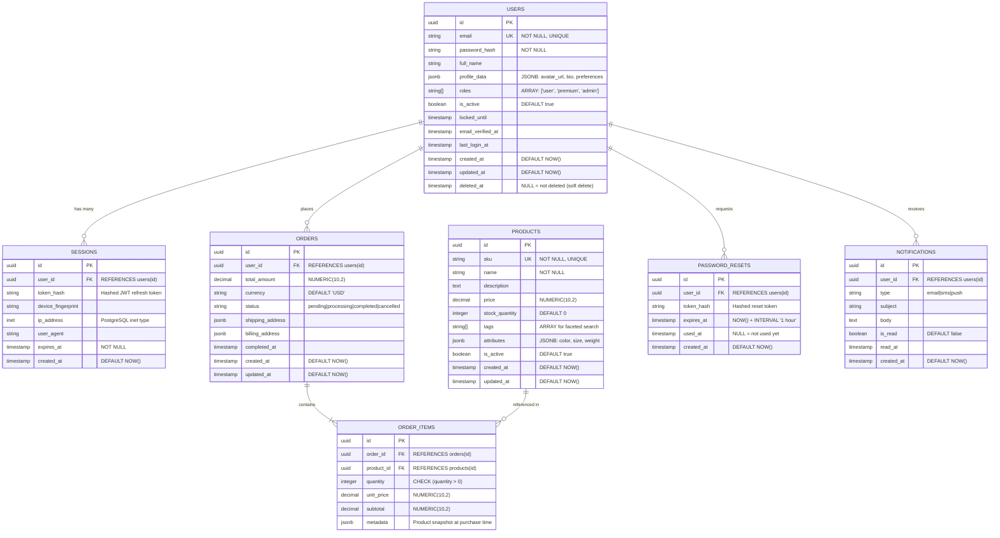

# TECHNICAL DEEP-DIVE SPECIFICATION (TDD)

## Version 4.0 - Enhanced Universal Pro Edition
## Áp dụng cho Backend, Frontend, AI/ML Projects

**Created:** [YYYY-MM-DD] | **Author:** [Primary Engineer/Architect]

---

## 📋 METADATA SECTION

Use this section to track document ownership, versioning, and status.

- **Title:** [Module/System Name]
- **Document Type:** [TDD | ADR | RFC]
- **Author:** [Primary Engineer/Architect]
- **Contributors:** [List of contributors]
- **Reviewers:** [Tech Lead, Product Manager, Security Lead]
- **Approvers:** [VP Engineering, CTO]
- **Status:** [Draft | In Review | Approved | Implemented | Deprecated]
- **Created:** [YYYY-MM-DD]
- **Last Updated:** [YYYY-MM-DD]
- **Version:** [Semantic versioning: 1.0.0]
- **Target Audience:** [Engineers, Architects, Product Managers, Leadership]
- **Estimated Reading Time:** [X minutes]

### Related Documents:
- **PRD:** [Link to Product Requirements Document]
- **ADR:** [Links to Architecture Decision Records]
- **API Specs:** [Link to API documentation]
- **Runbooks:** [Link to operational runbooks]

---

## 1. OVERVIEW & CONTEXT

### Executive Summary (TL;DR)

- **Problem Statement:** [Describe the specific problem being solved in 1-2 sentences]
- **Proposed Solution:** [Summarize the technical solution in 1-2 sentences]
- **Investment Required:** 
  - Engineering time (e.g., 2 weeks)
  - Cost estimate (e.g., $500/mo)
  - Timeline
- **Impact & Expected Outcomes:** [Key business metrics that will be improved]

### Background & Motivation

**Current State Analysis:**
- **Latency:** [Current metric, e.g., 2.1s P95]
- **Error Rate:** [Current error rate, e.g., 0.5%]
- **Cost:** [Current infrastructure cost]

**Why Now?** [Strategic timing, market opportunity, or critical technical debt]

**Business Context:** [Alignment with company OKRs or revenue goals]

### Success Criteria

#### Primary Success Metrics

| Metric | Current | Target | Measurement Method |
|--------|---------|--------|-------------------|
| P95 Latency | 2.1s | < 1s | Datadog APM |
| Cache Hit Rate | N/A | > 80% | Redis Info |
| User Drop-off | 15% | < 10% | Google Analytics |

#### ✅ Acceptance Criteria CHECKLIST

- [ ] P95 latency < 1s for profile API
- [ ] Cache hit rate > 80%
- [ ] Zero data loss during migration
- [ ] 99.9% uptime maintained
- [ ] Security audit passed
- [ ] Load tested to 2x current traffic
- [ ] Documentation complete
- [ ] Monitoring & alerting configured
- [ ] Rollback plan tested
- [ ] Team training completed
- [ ] Cost within $X/month budget
- [ ] GDPR compliance verified
- [ ] API backwards compatible
- [ ] Integration tests passing
- [ ] Performance benchmarks met

---

## 2. GOALS / SCOPE / NON-GOALS

### Goals

- **Business Goals:** [Quantifiable, e.g., Increase MAU by 20%, reduce churn by 15%]
- **Technical Goals:** [Measurable, e.g., p95 < 200ms, 99.9% uptime, horizontal scaling to 10x]
- **User Experience Goals:** [e.g., Time-to-first-value < 30s, seamless experience]
- **Developer Experience Goals:** [e.g., Reduce deployment time from 2h to 15min]

### In-Scope (Làm)

- Implement Redis caching layer for Profile API
- Update API endpoints to read from cache first
- Implement cache invalidation strategy
- Add monitoring dashboards for cache performance
- Update CI/CD pipeline for new infrastructure

### Out-of-Scope / Non-Goals

- ❌ **Multi-language support** → Reason: Not in MVP, planned for Q4
- ❌ **Mobile app optimization** → Reason: Separate team responsibility
- ❌ **Advanced analytics** → Reason: Out of budget

### Assumptions

**Assumption:** Redis cluster is available and stable
- **Impact if wrong:** Need to provision Redis, +2 week delay
- **Validation plan:** Check with infra team, load test Redis cluster

**Assumption:** Traffic growth is linear
- **Impact if wrong:** Need to re-architect for spiky traffic
- **Validation plan:** Analyze historical traffic patterns

### Constraints

- **Technical Constraints:** Must use Python 3.11+, Deploy on AWS, Max 100ms API latency
- **Business Constraints:** Budget < $50K, Launch before Q2 end, 2 engineers available
- **Compliance Constraints:** GDPR-compliant, SOC2 Type II, No PII in logs

### Dependencies

#### Internal Dependencies

| Team | Service | Risk Level | Mitigation |
|------|---------|-----------|------------|
| Infra Team | Redis Cluster Provisioning | Medium | Request provisioning 2 weeks in advance |
| Security Team | Security Review | Low | Schedule review early in design phase |

#### External Dependencies

| Provider | Service | SLA | Fallback Plan |
|----------|---------|-----|---------------|
| AWS | ElastiCache | 99.99% | Fallback to direct DB queries (degraded perf) |

---

## 3. USER STORIES / USE CASES

### Primary Actors

- **End Users:** 5M MAU, 60% US, 30% EU, 10% APAC
- **Internal Admin:** 50 users (Support & Ops)
- **API Consumers:** 200 partner integrations

### User Stories

#### Story ID: US-001
**Priority:** P0 (Must Have)

**As a:** Registered User  
**I want to:** Log in with email and password  
**So that:** I can access my personalized dashboard

**Acceptance Criteria:**
- [ ] Given valid credentials, When user submits login form, Then redirect to dashboard within 2s
- [ ] Given invalid password, When user submits, Then show error message "Invalid credentials"
- [ ] Given 3 failed attempts, When user tries again, Then enforce CAPTCHA
- [ ] Given successful login, When session expires after 24h, Then prompt re-login

**Technical Notes:**
- Use JWT with 24h expiration
- Hash passwords with bcrypt (cost factor 12)
- Rate limit: 5 attempts per IP per 15 minutes

**Edge Cases:**
- Account locked after 5 failed attempts
- Concurrent sessions from different devices
- Password reset flow

**Out of Scope:**
- Social login (OAuth)
- Biometric authentication

### User Flows (Sequence Diagrams)

#### Happy Path: User Login


#### Error Flow: Invalid Password


### Edge Cases & Error Scenarios

| Scenario | Input | Expected Behavior | Error Code | Mitigation |
|----------|-------|------------------|------------|------------|
| Invalid email format | "user@" | Return 400 Bad Request | ERR_INVALID_EMAIL | Client-side validation |
| Empty password | "" | Return 400 Bad Request | ERR_EMPTY_PASSWORD | Client-side validation |
| Account locked | Valid creds | Return 403 Forbidden | ERR_ACCOUNT_LOCKED | Show unlock instructions |
| Rate limit exceeded | 6th attempt | Return 429 Too Many Requests | ERR_RATE_LIMIT | Show retry-after time |
| Database timeout | Any | Return 503 Service Unavailable | ERR_DB_TIMEOUT | Retry with exponential backoff |
| Cache miss | Any | Fallback to database | N/A | Log cache miss rate |
| Concurrent login | Valid creds | Allow, invalidate old session | N/A | WebSocket notification |
| Expired JWT | Old token | Return 401 Unauthorized | ERR_TOKEN_EXPIRED | Refresh token flow |
| Network partition | Any | Circuit breaker opens | ERR_SERVICE_UNAVAILABLE | Show maintenance page |
| Malformed JWT | Tampered token | Return 401 Unauthorized | ERR_INVALID_TOKEN | Log security event |

#### ⚠ Race Condition Scenarios

- **Concurrent login attempts:**
  - Solution: Use distributed lock with Redis
  
- **Session invalidation race:**
  - Solution: Implement session versioning (increment version on logout)
  
- **Cache stampede on popular profiles:**
  - Solution: Implement request coalescing pattern (singleflight)

### Non-Functional Requirements (User Perspective)

- **Performance:** Login completes in < 2s on 3G network
- **Usability:** Password strength indicator, "Show password" toggle
- **Security:** Rate limiting, CAPTCHA after failed attempts, MFA option

---

## 4. API CONTRACT & INTERFACES

### API Design Principles

| Principle | Decision | Rationale |
|-----------|----------|-----------|
| Protocol | REST over HTTPS | Widespread support, HTTP caching, stateless |
| Versioning | URL path versioning (`/v1/`, `/v2/`) | Explicit, easy to route, clear deprecation path |
| Authentication | JWT Bearer tokens | Stateless, scalable, supports RBAC claims |
| Rate Limiting | Token bucket algorithm (100 req/min/user) | Protects backend, fair usage policy |
| Pagination | Cursor-based with `next_token` | Handles real-time data better than offset |
| Idempotency | Required for POST/PUT via `Idempotency-Key` header | Safe retries, prevent duplicate operations |

### Versioning Strategy

- **Format:** `/api/v{major}/resource` (e.g., `/api/v1/users`)
- **Breaking changes:** Require major version bump (v1 → v2)
- **Deprecation policy:** Support N-1 version for 12 months
- **Sunset header:** Include `Sunset` HTTP header with deprecation date

### Authentication & Authorization

**JWT Structure:**
```json
{
  "sub": "user_id_123",
  "email": "user@example.com",
  "roles": ["user", "premium"],
  "iat": 1640000000,
  "exp": 1640086400,
  "iss": "api.example.com"
}
```

**RBAC Roles:** `user`, `premium`, `admin`, `superadmin`

**Token Expiration:**
- Access token: 24h
- Refresh token: 30 days

### Rate Limiting

| User Tier | Rate Limit | Burst Allowance |
|-----------|-----------|----------------|
| Guest (Unauthenticated) | 10 req/min | 20 req burst |
| Free User | 100 req/min | 200 req burst |
| Premium User | 1000 req/min | 2000 req burst |
| Enterprise API Client | 10,000 req/min | 20,000 req burst |

**Rate Limit Response Headers:**
```http
X-RateLimit-Limit: 100
X-RateLimit-Remaining: 87
X-RateLimit-Reset: 1640000000
Retry-After: 42
```

### Endpoint Specifications

#### Example: User Login API

| Attribute | Details |
|-----------|---------|
| **Method & Path** | `POST /api/v1/auth/login` |
| **Authentication** | Not required (public endpoint) |
| **Rate Limiting** | 5 attempts per IP per 15 minutes |
| **Idempotent** | No (each login creates new session) |

#### Request Specification

**Headers:**
```http
Content-Type: application/json
X-Request-ID: uuid-v4
User-Agent: client-name/version
Accept-Language: en-US,en;q=0.9
```

**Request Body (JSON):**
```json
{
  "email": "string (required, format: email, max: 255)",
  "password": "string (required, min: 8, max: 128)",
  "remember_me": "boolean (optional, default: false)",
  "device_fingerprint": "string (optional, for security)"
}
```

**Validation Rules:**
- `email`: Must match RFC 5322 format, case-insensitive
- `password`: UTF-8 string, trimmed (no leading/trailing spaces)
- `remember_me`: If true, issue 30-day refresh token; if false, 24h token

#### Response Specification

**Success Response (200 OK):**
```json
{
  "status": "success",
  "data": {
    "user": {
      "id": "user_abc123xyz",
      "email": "user@example.com",
      "full_name": "John Doe",
      "roles": ["user", "premium"],
      "profile_picture_url": "https://cdn.example.com/avatars/user_abc123xyz.jpg",
      "created_at": "2023-01-15T10:30:00Z",
      "last_login_at": "2024-12-10T08:15:30Z"
    },
    "tokens": {
      "access_token": "eyJhbGciOiJIUzI1NiIsInR5cCI6IkpXVCJ9...",
      "refresh_token": "eyJhbGciOiJIUzI1NiIsInR5cCI6IkpXVCJ9...",
      "token_type": "Bearer",
      "expires_in": 86400
    },
    "session_id": "sess_def456uvw"
  },
  "meta": {
    "request_id": "req_789ghi012jkl",
    "timestamp": "2024-12-10T08:15:30.123Z",
    "version": "v1"
  }
}
```

**Error Responses:**

**400 Bad Request - Invalid Input:**
```json
{
  "status": "error",
  "error": {
    "code": "VALIDATION_ERROR",
    "message": "Invalid request parameters",
    "details": [
      {
        "field": "email",
        "issue": "Invalid email format",
        "provided_value": "user@"
      }
    ]
  },
  "meta": {
    "request_id": "req_789ghi012jkl",
    "timestamp": "2024-12-10T08:15:30.123Z"
  }
}
```

**401 Unauthorized - Invalid Credentials:**
```json
{
  "status": "error",
  "error": {
    "code": "INVALID_CREDENTIALS",
    "message": "Email or password is incorrect",
    "remaining_attempts": 2
  },
  "meta": {
    "request_id": "req_789ghi012jkl",
    "timestamp": "2024-12-10T08:15:30.123Z"
  }
}
```

**403 Forbidden - Account Locked:**
```json
{
  "status": "error",
  "error": {
    "code": "ACCOUNT_LOCKED",
    "message": "Your account has been locked due to multiple failed login attempts",
    "unlock_url": "https://example.com/account/unlock",
    "support_email": "support@example.com"
  },
  "meta": {
    "request_id": "req_789ghi012jkl",
    "timestamp": "2024-12-10T08:15:30.123Z"
  }
}
```

**429 Too Many Requests - Rate Limit Exceeded:**
```http
HTTP/1.1 429 Too Many Requests
X-RateLimit-Limit: 5
X-RateLimit-Remaining: 0
X-RateLimit-Reset: 1640000900
Retry-After: 900
```
```json
{
  "status": "error",
  "error": {
    "code": "RATE_LIMIT_EXCEEDED",
    "message": "Too many login attempts. Please try again in 15 minutes.",
    "retry_after_seconds": 900
  },
  "meta": {
    "request_id": "req_789ghi012jkl",
    "timestamp": "2024-12-10T08:15:30.123Z"
  }
}
```

**500 Internal Server Error:**
```json
{
  "status": "error",
  "error": {
    "code": "INTERNAL_SERVER_ERROR",
    "message": "An unexpected error occurred. Please try again later.",
    "incident_id": "inc_mno345pqr"
  },
  "meta": {
    "request_id": "req_789ghi012jkl",
    "timestamp": "2024-12-10T08:15:30.123Z"
  }
}
```

**503 Service Unavailable:**
```http
HTTP/1.1 503 Service Unavailable
Retry-After: 3600
```
```json
{
  "status": "error",
  "error": {
    "code": "SERVICE_UNAVAILABLE",
    "message": "Service temporarily unavailable due to maintenance",
    "estimated_recovery": "2024-12-10T12:00:00Z"
  }
}
```

### HTTP Status Code Guidelines

| Status Code | Meaning | When to Use |
|------------|---------|-------------|
| 200 OK | Success | Request successful, data returned |
| 201 Created | Resource created | POST request created new resource (include Location header) |
| 204 No Content | Success, no data | DELETE successful, no response body needed |
| 400 Bad Request | Client error | Invalid request syntax, validation failure |
| 401 Unauthorized | Authentication required | Missing or invalid credentials |
| 403 Forbidden | Access denied | Authenticated but lacks permission |
| 404 Not Found | Resource doesn't exist | Requested resource ID not found |
| 409 Conflict | Resource conflict | Duplicate resource, version mismatch |
| 429 Too Many Requests | Rate limit exceeded | Client sent too many requests |
| 500 Internal Server Error | Server error | Unhandled exception, unexpected error |
| 502 Bad Gateway | Upstream failure | Dependency service returned invalid response |
| 503 Service Unavailable | Temporarily unavailable | Maintenance, overload, circuit breaker open |
| 504 Gateway Timeout | Upstream timeout | Dependency service didn't respond in time |

### Business Logic (Login Endpoint)

1. Validate input: Check email format, password not empty
2. Rate limit check: Query Redis for IP's failed attempts (key: `ratelimit:login:{ip}`)
3. Query user: `SELECT * FROM users WHERE email = ? AND deleted_at IS NULL`
4. Check account status: Verify `is_active = true` and `locked_until < NOW()`
5. Verify password: `bcrypt.compare(password, user.password_hash)`
   - On failure: Increment failed attempts counter, lock after 5 attempts
6. On success: Generate JWT (access + refresh tokens) with user claims
7. Create session record: `INSERT INTO sessions`
8. Update last_login: `UPDATE users SET last_login_at = NOW()`
9. Return response: User data + tokens

**Side Effects:**
- User's `last_login_at` timestamp updated
- New session record created in `sessions` table
- Security event logged (IP, device, timestamp)
- Failed attempts counter reset on success
- WebSocket notification sent to user's other active sessions (optional)

### Monitoring Metrics

- `api_requests_total` (counter, labels: status, error_code)
- `api_request_duration_seconds` (histogram, buckets: .1, .5, 1, 2, 5)
- `login_failures_total` (counter, labels: reason)
- `active_sessions_total` (gauge)

### Code Examples

**cURL Example:**
```bash
curl -X POST https://api.example.com/api/v1/auth/login \
  -H "Content-Type: application/json" \
  -H "X-Request-ID: 550e8400-e29b-41d4-a716-446655440000" \
  -d '{
    "email": "user@example.com",
    "password": "SecurePass123!",
    "remember_me": true
  }'
```

**JavaScript (Fetch API):**
```javascript
const response = await fetch('https://api.example.com/api/v1/auth/login', {
  method: 'POST',
  headers: {
    'Content-Type': 'application/json',
    'X-Request-ID': crypto.randomUUID()
  },
  body: JSON.stringify({
    email: 'user@example.com',
    password: 'SecurePass123!',
    remember_me: true
  })
});

const data = await response.json();
if (response.ok) {
  const { access_token } = data.data.tokens;
  localStorage.setItem('access_token', access_token);
  window.location.href = '/dashboard';
} else {
  alert(data.error.message);
}
```

**Python (requests):**
```python
import requests
import uuid

response = requests.post(
    'https://api.example.com/api/v1/auth/login',
    headers={
        'Content-Type': 'application/json',
        'X-Request-ID': str(uuid.uuid4())
    },
    json={
        'email': 'user@example.com',
        'password': 'SecurePass123!',
        'remember_me': True
    }
)

if response.status_code == 200:
    data = response.json()
    access_token = data['data']['tokens']['access_token']
    print(f"Login successful! Token: {access_token[:20]}...")
else:
    error = response.json()['error']
    print(f"Login failed: {error['message']}")
```

### Data Models (Request/Response Schemas)

**JSON Schema (for validation):**
```json
{
  "$schema": "http://json-schema.org/draft-07/schema#",
  "type": "object",
  "title": "LoginRequest",
  "required": ["email", "password"],
  "properties": {
    "email": {
      "type": "string",
      "format": "email",
      "maxLength": 255,
      "description": "User's email address"
    },
    "password": {
      "type": "string",
      "minLength": 8,
      "maxLength": 128,
      "description": "User's password"
    },
    "remember_me": {
      "type": "boolean",
      "default": false,
      "description": "Whether to issue long-lived refresh token"
    },
    "device_fingerprint": {
      "type": "string",
      "maxLength": 512,
      "description": "Device identification for security"
    }
  },
  "additionalProperties": false
}
```

**TypeScript Interface:**
```typescript
interface LoginRequest {
  email: string;              // format: email, max: 255 chars
  password: string;           // min: 8, max: 128 chars
  remember_me?: boolean;      // default: false
  device_fingerprint?: string; // max: 512 chars
}

interface LoginResponse {
  status: 'success';
  data: {
    user: {
      id: string;
      email: string;
      full_name: string;
      roles: string[];
      profile_picture_url: string;
      created_at: string;      // ISO 8601
      last_login_at: string;   // ISO 8601
    };
    tokens: {
      access_token: string;
      refresh_token: string;
      token_type: 'Bearer';
      expires_in: number;      // seconds
    };
    session_id: string;
  };
  meta: {
    request_id: string;
    timestamp: string;         // ISO 8601
    version: string;
  };
}

interface ErrorResponse {
  status: 'error';
  error: {
    code: string;
    message: string;
    details?: Array<{
      field: string;
      issue: string;
      provided_value?: any;
    }>;
    remaining_attempts?: number;
    unlock_url?: string;
    support_email?: string;
    retry_after_seconds?: number;
    incident_id?: string;
    estimated_recovery?: string;
  };
  meta: {
    request_id: string;
    timestamp: string;
  };
}
```

**OpenAPI 3.0 Specification (Excerpt):**
```yaml
openapi: 3.0.3
info:
  title: Authentication API
  version: 1.0.0
  description: User authentication and session management

paths:
  /api/v1/auth/login:
    post:
      operationId: loginUser
      summary: User login
      description: Authenticate user with email and password
      tags:
        - Authentication
      requestBody:
        required: true
        content:
          application/json:
            schema:
              $ref: '#/components/schemas/LoginRequest'
      responses:
        '200':
          description: Login successful
          content:
            application/json:
              schema:
                $ref: '#/components/schemas/LoginResponse'
        '400':
          description: Validation error
          content:
            application/json:
              schema:
                $ref: '#/components/schemas/ErrorResponse'
        '401':
          description: Invalid credentials
        '403':
          description: Account locked
        '429':
          description: Rate limit exceeded
        '500':
          description: Server error

components:
  schemas:
    LoginRequest:
      type: object
      required:
        - email
        - password
      properties:
        email:
          type: string
          format: email
          maxLength: 255
        password:
          type: string
          minLength: 8
          maxLength: 128
        remember_me:
          type: boolean
          default: false
```

### Error Handling Standards

**Standard Error Response Structure:**
```json
{
  "status": "error",
  "error": {
    "code": "ERROR_CODE_SNAKE_CASE",
    "message": "Human-readable error message",
    "details": [],
    "trace_id": "distributed_trace_id"
  },
  "meta": {
    "request_id": "unique_request_id",
    "timestamp": "ISO8601_timestamp"
  }
}
```

**Error Code Naming Convention:**
- Format: `CATEGORY_SPECIFIC_ERROR` (UPPER_SNAKE_CASE)
- Categories: `VALIDATION`, `AUTH`, `PERMISSION`, `RESOURCE`, `RATE_LIMIT`, `EXTERNAL`, `INTERNAL`, `DATABASE`, `NETWORK`, `BUSINESS`, `SERVER`
- Examples: `VALIDATION_INVALID_EMAIL`, `AUTH_INVALID_CREDENTIALS`, `RATE_LIMIT_EXCEEDED`

**Error Logging Strategy:**

| Status Code Range | Error Type | Logging Action | Alert |
|------------------|------------|----------------|-------|
| 4xx (Client Errors) | Client mistake | Log at INFO/WARN level, no stack trace | No alert (expected) |
| 5xx (Server Errors) | Server issue | Log at ERROR level with full stack trace | Alert on-call engineer if error rate > 1% |
| 503 (Service Unavailable) | Planned/unplanned outage | Log at WARN level | Alert if duration > 5 minutes |
| Rate Limit 429 | Abuse/misconfiguration | Log at WARN with client identifier | Alert if single client causes >50% of limits |

---

## 5. DATA MODEL & STORAGE DESIGN

### Database Selection

#### Requirements Analysis
- **Data Structure:** Relational with clear relationships (users, sessions, orders)
- **Consistency:** ACID compliance required for financial transactions
- **Query Patterns:** Complex joins, aggregations, full-text search
- **Scale:** 10M+ records, 1000 writes/sec, 10K reads/sec
- **Performance:** P95 read latency < 10ms, write latency < 50ms

#### Decision Matrix

| Database | Pros | Cons | Score (1-10) |
|----------|------|------|--------------|
| **PostgreSQL ✅** | ACID, JSON support, full-text search, mature, AWS RDS | Vertical scaling limits, complex replication | **9/10 (CHOSEN)** |
| MongoDB | Flexible schema, horizontal scaling, aggregation pipeline | No ACID across collections, eventual consistency | 6/10 |
| MySQL | Mature, widespread, good performance | Less advanced features than PostgreSQL | 7/10 |
| DynamoDB | Serverless, infinite scale, low ops overhead | Expensive at scale, no joins, complex queries difficult | 5/10 |

**Rationale for PostgreSQL:**
- Strong ACID guarantees for financial data
- JSONB support for flexible attributes
- Excellent full-text search (GIN indexes)
- Mature ecosystem (ORMs, tools, expertise)
- Managed service via AWS RDS (automated backups, multi-AZ)

### Entity Relationship Diagram (ERD)



### Schema Definition (PostgreSQL)

#### Table: `users`

```sql
CREATE TABLE users (
    id UUID PRIMARY KEY DEFAULT gen_random_uuid(),
    email VARCHAR(255) NOT NULL UNIQUE,
    password_hash VARCHAR(255) NOT NULL,
    full_name VARCHAR(255),
    profile_data JSONB DEFAULT '{}',
    roles TEXT[] DEFAULT ARRAY['user'],
    is_active BOOLEAN DEFAULT true NOT NULL,
    locked_until TIMESTAMP WITH TIME ZONE,
    email_verified_at TIMESTAMP WITH TIME ZONE,
    last_login_at TIMESTAMP WITH TIME ZONE,
    created_at TIMESTAMP WITH TIME ZONE DEFAULT NOW() NOT NULL,
    updated_at TIMESTAMP WITH TIME ZONE DEFAULT NOW() NOT NULL,
    deleted_at TIMESTAMP WITH TIME ZONE,
    
    -- Constraints
    CONSTRAINT email_format CHECK (email ~* '^[A-Za-z0-9._%+-]+@[A-Za-z0-9.-]+\.[A-Za-z]{2,}$'),
    CONSTRAINT valid_roles CHECK (roles <@ ARRAY['user', 'premium', 'admin', 'superadmin'])
);

-- Indexes for performance
CREATE UNIQUE INDEX idx_users_email_lower ON users(LOWER(email));
CREATE INDEX idx_users_roles ON users USING GIN(roles);
CREATE INDEX idx_users_created_at ON users(created_at DESC);
CREATE INDEX idx_users_deleted_at ON users(deleted_at) WHERE deleted_at IS NULL;
CREATE INDEX idx_users_profile_data_avatar ON users USING GIN(profile_data);

-- Trigger: Auto-update updated_at timestamp
CREATE OR REPLACE FUNCTION update_updated_at_column()
RETURNS TRIGGER AS $$
BEGIN
    NEW.updated_at = NOW();
    RETURN NEW;
END;
$$ LANGUAGE plpgsql;

CREATE TRIGGER users_updated_at
    BEFORE UPDATE ON users
    FOR EACH ROW
    EXECUTE FUNCTION update_updated_at_column();

-- Comments for documentation
COMMENT ON TABLE users IS 'User accounts with authentication and profile data';
COMMENT ON COLUMN users.email IS 'Unique email address, case-insensitive';
COMMENT ON COLUMN users.password_hash IS 'Bcrypt hash with cost factor 12';
COMMENT ON COLUMN users.profile_data IS 'JSONB: avatar_url, bio, preferences, custom_fields';
COMMENT ON COLUMN users.roles IS 'Array of RBAC roles (supports multiple roles per user)';
COMMENT ON COLUMN users.deleted_at IS 'Soft delete timestamp (NULL = active user)';
```

#### Table: `sessions`

```sql
CREATE TABLE sessions (
    id UUID PRIMARY KEY DEFAULT gen_random_uuid(),
    user_id UUID NOT NULL REFERENCES users(id) ON DELETE CASCADE,
    token_hash VARCHAR(255) NOT NULL UNIQUE,
    device_fingerprint VARCHAR(512),
    ip_address INET NOT NULL,
    user_agent TEXT,
    expires_at TIMESTAMP WITH TIME ZONE NOT NULL,
    created_at TIMESTAMP WITH TIME ZONE DEFAULT NOW() NOT NULL,
    
    -- Constraints
    CONSTRAINT expires_in_future CHECK (expires_at > created_at)
);

-- Indexes
CREATE INDEX idx_sessions_user_id ON sessions(user_id);
CREATE INDEX idx_sessions_token_hash ON sessions(token_hash);
CREATE INDEX idx_sessions_expires_at ON sessions(expires_at);
CREATE INDEX idx_sessions_user_id_created_at ON sessions(user_id, created_at DESC);
CREATE INDEX idx_sessions_expired ON sessions(expires_at) WHERE expires_at < NOW();

COMMENT ON TABLE sessions IS 'User authentication sessions with JWT refresh tokens';
COMMENT ON COLUMN sessions.token_hash IS 'SHA-256 hash of JWT refresh token (for revocation)';
COMMENT ON COLUMN sessions.device_fingerprint IS 'Client device identifier for security';
COMMENT ON COLUMN sessions.ip_address IS 'Client IP address (supports IPv4 and IPv6)';
```

#### Table: `orders`

```sql
CREATE TYPE order_status AS ENUM ('pending', 'processing', 'completed', 'cancelled', 'refunded');

CREATE TABLE orders (
    id UUID PRIMARY KEY DEFAULT gen_random_uuid(),
    user_id UUID NOT NULL REFERENCES users(id),
    total_amount NUMERIC(10, 2) NOT NULL CHECK (total_amount >= 0),
    currency VARCHAR(3) DEFAULT 'USD' NOT NULL,
    status order_status DEFAULT 'pending' NOT NULL,
    shipping_address JSONB NOT NULL,
    billing_address JSONB NOT NULL,
    payment_method JSONB,
    completed_at TIMESTAMP WITH TIME ZONE,
    cancelled_at TIMESTAMP WITH TIME ZONE,
    created_at TIMESTAMP WITH TIME ZONE DEFAULT NOW() NOT NULL,
    updated_at TIMESTAMP WITH TIME ZONE DEFAULT NOW() NOT NULL,
    
    -- Constraints
    CONSTRAINT status_timestamp_consistency CHECK (
        (status = 'completed' AND completed_at IS NOT NULL) OR
        (status != 'completed' AND completed_at IS NULL)
    )
);

-- Indexes
CREATE INDEX idx_orders_user_id ON orders(user_id);
CREATE INDEX idx_orders_status ON orders(status);
CREATE INDEX idx_orders_created_at ON orders(created_at DESC);
CREATE INDEX idx_orders_user_id_created_at ON orders(user_id, created_at DESC);
CREATE INDEX idx_orders_shipping_address ON orders USING GIN(shipping_address);

-- Trigger: Auto-update updated_at
CREATE TRIGGER orders_updated_at
    BEFORE UPDATE ON orders
    FOR EACH ROW
    EXECUTE FUNCTION update_updated_at_column();

COMMENT ON TABLE orders IS 'Customer orders with payment and shipping information';
COMMENT ON COLUMN orders.status IS 'Order lifecycle: pending → processing → completed/cancelled';
COMMENT ON COLUMN orders.shipping_address IS 'JSONB: street, city, state, zip, country';
COMMENT ON COLUMN orders.total_amount IS 'Total order value in specified currency (2 decimal places)';
```

#### Table: `products`

```sql
CREATE TABLE products (
    id UUID PRIMARY KEY DEFAULT gen_random_uuid(),
    sku VARCHAR(100) NOT NULL UNIQUE,
    name VARCHAR(255) NOT NULL,
    description TEXT,
    price NUMERIC(10, 2) NOT NULL CHECK (price >= 0),
    stock_quantity INTEGER DEFAULT 0 NOT NULL CHECK (stock_quantity >= 0),
    tags TEXT[] DEFAULT ARRAY[]::TEXT[],
    attributes JSONB DEFAULT '{}',
    is_active BOOLEAN DEFAULT true NOT NULL,
    created_at TIMESTAMP WITH TIME ZONE DEFAULT NOW() NOT NULL,
    updated_at TIMESTAMP WITH TIME ZONE DEFAULT NOW() NOT NULL,
    
    -- Full-text search support
    search_vector tsvector GENERATED ALWAYS AS (
        to_tsvector('english', coalesce(name, '') || ' ' || coalesce(description, ''))
    ) STORED
);

-- Indexes
CREATE INDEX idx_products_sku ON products(sku);
CREATE INDEX idx_products_is_active ON products(is_active) WHERE is_active = true;
CREATE INDEX idx_products_tags ON products USING GIN(tags);
CREATE INDEX idx_products_attributes ON products USING GIN(attributes);
CREATE INDEX idx_products_search_vector ON products USING GIN(search_vector);
CREATE INDEX idx_products_price ON products(price);

-- Trigger: Auto-update updated_at
CREATE TRIGGER products_updated_at
    BEFORE UPDATE ON products
    FOR EACH ROW
    EXECUTE FUNCTION update_updated_at_column();
```

### Indexing Strategy

#### PostgreSQL Index Types

| Index Type | Use Case | Example |
|-----------|----------|---------|
| **B-tree (Default)** | Equality, range queries (<, >, BETWEEN) | `CREATE INDEX idx_users_created_at ON users(created_at)` |
| **Hash** | Equality only (=), smaller than B-tree | `CREATE INDEX idx_users_email_hash ON users USING HASH(email)` |
| **GiST** | Geometric data, full-text search, range types | `CREATE INDEX idx_locations_point ON locations USING GiST(coordinates)` |
| **GIN** | Array, JSONB, full-text search | `CREATE INDEX idx_users_roles ON users USING GIN(roles)` |
| **BRIN** | Large tables with natural ordering (time-series) | `CREATE INDEX idx_logs_timestamp ON logs USING BRIN(timestamp)` |

#### Indexing Best Practices

**❌ DON'T:**
- Over-index: Each index adds write overhead (INSERT/UPDATE/DELETE)
- Index low-cardinality columns (e.g., boolean with 99% true)

**✅ DO:**
- Index foreign keys for JOIN performance
- Use composite indexes for multi-column WHERE clauses
- Use partial indexes for filtered queries

#### Query Optimization Example

**Slow Query (no index):**
```sql
-- Query: Find recent premium users
SELECT * FROM users
WHERE 'premium' = ANY(roles)
AND created_at > NOW() - INTERVAL '30 days'
AND deleted_at IS NULL
ORDER BY created_at DESC
LIMIT 20;
-- Execution: Sequential scan on entire table (SLOW)
```

**Optimized (with indexes):**
```sql
-- Indexes:
-- 1. GIN index on roles array: idx_users_roles
-- 2. B-tree index on created_at: idx_users_created_at
-- 3. Partial index on deleted_at: idx_users_deleted_at

-- Same query now uses index scans (FAST)
```

**JSONB Indexing:**
```sql
-- Create GIN index on JSONB column
CREATE INDEX idx_users_profile_avatar ON users USING GIN(profile_data);

-- Query: Find users with avatar
SELECT id, email, profile_data->>'avatar_url' AS avatar
FROM users
WHERE profile_data ? 'avatar_url'
AND profile_data->>'avatar_url' IS NOT NULL;

-- Query: Find users with specific preference
SELECT * FROM users
WHERE profile_data @> '{"preferences": {"theme": "dark"}}';
```

### Data Versioning & Migration

#### Migration Tool Setup (Alembic for Python, Flyway for Java)

**Directory Structure:**
```
migrations/
├── env.py                    # Alembic environment config
├── script.py.mako            # Migration template
├── alembic.ini               # Configuration file
└── versions/
    ├── 001_initial_schema.py
    ├── 002_add_sessions_table.py
    ├── 003_add_orders_table.py
    └── 004_add_fulltext_search_index.py
```

#### Example Migration File

```python
"""Add full-text search to products

Revision ID: 004_fulltext_search
Revises: 003_add_orders_table
Create Date: 2024-12-10 10:30:00
"""

from alembic import op
import sqlalchemy as sa

# Revision identifiers
revision = '004_fulltext_search'
down_revision = '003_add_orders_table'
branch_labels = None
depends_on = None

def upgrade():
    """Apply migration"""
    # Add generated column for full-text search
    op.execute("""
        ALTER TABLE products
        ADD COLUMN search_vector tsvector
        GENERATED ALWAYS AS (
            to_tsvector('english', coalesce(name, '') || ' ' || coalesce(description, ''))
        ) STORED;
    """)
    
    # Create GIN index for fast text search
    op.create_index(
        'idx_products_search_vector',
        'products',
        ['search_vector'],
        postgresql_using='gin'
    )

def downgrade():
    """Rollback migration"""
    op.drop_index('idx_products_search_vector')
    op.execute("ALTER TABLE products DROP COLUMN search_vector;")
```

#### Zero-Downtime Migration Strategy

**Phase 1:** Add new column (nullable)
```sql
ALTER TABLE users ADD COLUMN email_verified_at TIMESTAMP;
```

**Phase 2:** Backfill data (batched)
```sql
DO $$
DECLARE
    batch_size INT := 1000;
    rows_updated INT;
BEGIN
    LOOP
        UPDATE users
        SET email_verified_at = created_at
        WHERE id IN (
            SELECT id FROM users
            WHERE email_verified_at IS NULL
            LIMIT batch_size
        );
        
        GET DIAGNOSTICS rows_updated = ROW_COUNT;
        EXIT WHEN rows_updated = 0;
        PERFORM pg_sleep(0.1);
    END LOOP;
END $$;
```

**Phase 3:** Add NOT NULL constraint
```sql
ALTER TABLE users ALTER COLUMN email_verified_at SET NOT NULL;
```

**Phase 4:** Deploy application code (reads new column)

**Phase 5:** Monitor & rollback if needed

### Caching Strategy

#### Cache Layer Architecture

**What to Cache?**

| Data Type | Cache? | TTL | Reason |
|-----------|--------|-----|--------|
| User Profile | ✅ Yes | 5 minutes | High read frequency, low write frequency |
| Session Data | ✅ Yes | Token expiry | Fast authentication checks |
| Product Catalog | ✅ Yes | 10 minutes | High read, periodic updates |
| Order History | ❌ No | N/A | Real-time accuracy required |
| Shopping Cart | ✅ Yes | 1 hour | Session-based, temporary |

---

**📄 Tài liệu đã được chuyển đổi thành công sang Markdown!**

File được lưu tại: [TDD_Template.md](computer:///home/user/TDD_Template.md)

Tài liệu này là một template TDD (Technical Deep-Dive Specification) rất chi tiết và chuyên nghiệp, bao gồm các phần:
- Metadata & Overview
- Goals/Scope/Non-Goals  
- User Stories & Use Cases
- API Contract & Interfaces (REST API, Authentication, Rate Limiting)
- Data Model & Storage Design (PostgreSQL ERD, Schema, Indexing)
- Caching Strategy

File Markdown có thể dễ dàng chỉnh sửa, version control (Git), và render thành HTML/PDF nếu cần! 🚀