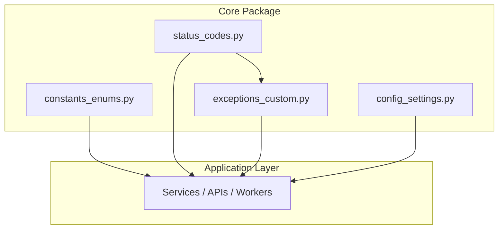

'''
# Phân Tích Chi Tiết và Phụ Thuộc: Core Package

**Phạm vi:** Mô tả chi tiết về nghiệp vụ, luồng hoạt động và phụ thuộc của các module trong package `core`, theo định dạng state machine được cung cấp.

---

## 1. Tổng Quan Phụ Thuộc

Các module trong `core` được thiết kế để không có phụ thuộc vòng tròn (circular dependencies). Chúng cung cấp các thành phần nền tảng cho toàn bộ ứng dụng. Luồng phụ thuộc cơ bản là:

1.  `constants_enums.py` và `status_codes.py`: Không phụ thuộc vào module nào khác. Chúng định nghĩa các giá trị tĩnh.
2.  `exceptions_custom.py`: Có thể phụ thuộc vào `status_codes.py` để đính kèm mã lỗi HTTP mặc định vào một exception.
3.  `config_settings.py`: Không phụ thuộc vào các module khác trong `core`. Nó đọc cấu hình từ môi trường.

Các module bên ngoài (services, APIs, workers) sẽ phụ thuộc vào cả 4 module này để hoạt động.



---

## 2. Chi Tiết Các Module

### 2.1. Module: `config_settings.py` (Trình quản lý Cấu hình)

**Mô tả:** Module này chịu trách nhiệm tải, xác thực và cung cấp các biến môi trường và cấu hình cho toàn bộ ứng dụng. Nó đảm bảo rằng tất cả các cấu hình cần thiết đều có mặt và hợp lệ trước khi ứng dụng khởi chạy đầy đủ.

| Giai đoạn   | Hoạt động                                                                                                                                                                                                                                                                                                                                                                                                                        | Ghi chú                                                                              |
| :---------- | :------------------------------------------------------------------------------------------------------------------------------------------------------------------------------------------------------------------------------------------------------------------------------------------------------------------------------------------------------------------------------------------------------------------------------- | :----------------------------------------------------------------------------------- |
| **Entry**   | - **Log:** `CORE_SETTINGS: INITIALIZING` <br> - **Đọc file .env:** Tải các biến môi trường từ file `.env` (nếu có). <br> - **Xác thực (Validation):** Sử dụng Pydantic Settings để xác thực các biến môi trường đã tải (ví dụ: `DATABASE_URL` có đúng định dạng, `SECRET_KEY` không được rỗng). <br> - **Khởi tạo Singleton:** Tạo một instance duy nhất của đối tượng `Settings`.                                               | Quá trình này diễn ra một lần duy nhất khi ứng dụng khởi động.                       |
| **Running** | - **Cung cấp cấu hình:** Đối tượng `Settings` được cung cấp cho các phần khác của ứng dụng thông qua cơ chế dependency injection (ví dụ: FastAPI `Depends`). <br> - **Truy cập theo yêu cầu:** Các module khác đọc giá trị cấu hình khi cần (ví dụ: `settings.DATABASE_URL`).                                                                                                                                                    | Đối tượng `Settings` là bất biến (immutable) trong suốt quá trình chạy của ứng dụng. |
| **Exit**    | - **Nếu xác thực thất bại:** <br>   * **Log:** `ERROR: CORE_SETTINGS: VALIDATION_FAILED - Missing or invalid env var: [Tên biến]` <br>   * **Raise Exception:** Ném ra một lỗi nghiêm trọng (ví dụ: `ValueError` hoặc `ImproperlyConfigured`). <br>   * **Hủy khởi động:** Tiến trình ứng dụng sẽ dừng lại. <br><br> - **Nếu ứng dụng tắt:** <br>   * **Không có hoạt động:** Đối tượng cấu hình sẽ được giải phóng khỏi bộ nhớ. | Đây là cơ chế "fail-fast", đảm bảo ứng dụng không chạy với cấu hình sai.             |

### 2.2. Module: `constants_enums.py` (Trình định nghĩa Hằng số)

**Mô tả:** Module này là nơi tập trung định nghĩa các giá trị không đổi (constants) và các tập hợp lựa chọn có giới hạn (enums) được sử dụng xuyên suốt ứng dụng, giúp mã nguồn dễ đọc, dễ bảo trì và tránh lỗi "magic strings/numbers".

| Giai đoạn | Hoạt động | Ghi chú |
| :--- | :--- | :--- |
| **Entry** | - **Log:** `CORE_CONSTANTS: LOADING_DEFINITIONS` <br> - **Nạp vào bộ nhớ:** Python interpreter đọc và nạp các định nghĩa `Enum`, `Literal`, và các biến hằng số vào bộ nhớ khi module được import lần đầu. | Quá trình này xảy ra khi một module khác `import` nó. |
| **Running** | - **Sử dụng trong logic:** Các module khác (services, models, APIs) import và sử dụng các hằng số/enums này để kiểm tra điều kiện, định nghĩa kiểu dữ liệu, hoặc gán giá trị. <br>   * Ví dụ: `if user.agent_type == AgentType.ASSISTANT:` | Việc sử dụng enums giúp type checker (như MyPy) có thể bắt lỗi sớm. |
| **Exit** | - **Không có:** Đây là một module khai báo tĩnh. Các định nghĩa tồn tại trong bộ nhớ cho đến khi tiến trình ứng dụng kết thúc. | |

### 2.3. Module: `exceptions_custom.py` (Trình định nghĩa Ngoại lệ)

**Mô tả:** Định nghĩa các lớp ngoại lệ (exception) tùy chỉnh theo nghiệp vụ của ứng dụng. Điều này cho phép hệ thống bắt và xử lý các tình huống lỗi một cách tường minh và cụ thể, thay vì dựa vào các ngoại lệ chung chung.

| Giai đoạn | Hoạt động | Ghi chú |
| :--- | :--- | :--- |
| **Entry** | - **Log:** `CORE_EXCEPTIONS: LOADING_DEFINITIONS` <br> - **Nạp vào bộ nhớ:** Các lớp exception (ví dụ: `FriendshipNotFoundError`, `InvalidInputError`) được nạp vào bộ nhớ khi module được import. <br> - **Gán mã lỗi (tùy chọn):** Một số exception có thể được khởi tạo với mã lỗi HTTP mặc định từ `status_codes.py`. | Các exception này thường kế thừa từ lớp `Exception` cơ sở của Python. |
| **Running** | - **Phát sinh (Raise):** Một service hoặc một hàm gặp phải tình huống lỗi đặc trưng và ném ra một exception tùy chỉnh. <br>   * **Log:** `SERVICE_LAYER: RAISING FriendshipNotFoundError for user_id: [id]` <br>   * **Lệnh:** `raise FriendshipNotFoundError("Friendship not found")` <br><br> - **Bắt giữ (Catch):** Một tầng cao hơn (ví dụ: middleware, API endpoint decorator) sử dụng khối `try...except` để bắt chính xác exception đó. <br>   * **Log:** `API_MIDDLEWARE: CATCHING FriendshipNotFoundError` <br>   * **Xử lý:** Chuyển đổi exception thành một phản hồi HTTP phù hợp (ví dụ: trả về mã 404 Not Found). | Đây là vòng đời của một instance exception, không phải của module. |
| **Exit** | - **Hoàn tất xử lý:** Sau khi bị bắt và xử lý, instance của exception sẽ được garbage collector dọn dẹp. | |

### 2.4. Module: `status_codes.py` (Trình quản lý Mã Trạng thái)

**Mô tả:** Cung cấp một bộ sưu tập tập trung các mã trạng thái HTTP và các thông điệp lỗi tương ứng. Module này giúp chuẩn hóa các phản hồi API trên toàn hệ thống.

| Giai đoạn   | Hoạt động                                                                                                                                                                                                                                                                                                                                                               | Ghi chú                                                                    |
| :---------- | :---------------------------------------------------------------------------------------------------------------------------------------------------------------------------------------------------------------------------------------------------------------------------------------------------------------------------------------------------------------------- | :------------------------------------------------------------------------- |
| **Entry**   | - **Log:** `CORE_STATUS_CODES: LOADING_DEFINITIONS` <br> - **Nạp vào bộ nhớ:** Các biến, dictionary hoặc các đối tượng chứa mã trạng thái và thông điệp được nạp vào bộ nhớ khi module được import.                                                                                                                                                                     | Tương tự như `constants_enums.py`, đây là một module khai báo tĩnh.        |
| **Running** | - **Sử dụng trong API Endpoints:** Các hàm xử lý request import và sử dụng các mã này để tạo phản hồi. <br>   * Ví dụ: `return JSONResponse(content={"message": "Created"}, status_code=status.HTTP_201_CREATED)` <br><br> - **Sử dụng trong Exception Handlers:** Middleware xử lý lỗi sử dụng các mã này để ánh xạ từ một exception tùy chỉnh sang một phản hồi HTTP. | Giúp tránh việc hard-code các con số (như 200, 404) trong logic nghiệp vụ. |
| **Exit**    | - **Không có:** Các định nghĩa tồn tại trong bộ nhớ cho đến khi tiến trình ứng dụng kết thúc.                                                                                                                                                                                                                                                                           |                                                                            |
'''

Em thấy nó có 3 value: 
1. Có các biến cụ thể để Cursor code chính xác các biến và phụ thuộc, chỉ các biến và phụ thuộc không được định nghĩa trong file thì Cursor mới tự vẽ thêm. 
Câu hỏi em đang đặt ra là: mô tả của từng file như này đã đủ chưa và có thể làm tốt hơn không? 


```
Một module “code ngon” nên được mô tả tối thiểu qua 6 phần: mục đích, input/output, logic chính, data/state, lỗi/edge cases và ví dụ dùng. Khi mô tả đủ các phần này, việc đọc, sửa, refactor và tái sử dụng module sẽ dễ, ít bug và onboard dev mới nhanh hơn.[onenine+2](https://onenine.com/code-documentation-best-practices/)​

## 1. Purpose (Mục đích)

- Một đoạn 2–3 câu trả lời rõ: module này sinh ra để làm gì, giải quyết bài toán nào, trong bức tranh hệ thống nó đứng ở đâu.[gist.github+1](https://gist.github.com/iamhenry/2dbabd0d59051eae360d8cfa6a2782bd)​
    
- Nếu có business rule quan trọng (ví dụ: “tính phí giao dịch cho lệnh khớp trong ngày”), ghi rõ ở đây để dev khác hiểu context trước khi đọc code.[gist.github](https://gist.github.com/iamhenry/2dbabd0d59051eae360d8cfa6a2782bd)​
    

## 2. Interface: Input / Output

- Liệt kê tất cả public API: hàm, method, endpoint… với input, output, kiểu dữ liệu, unit, constraint (không âm, max length, enum…).[onenine+1](https://onenine.com/code-documentation-best-practices/)​
    
- Mô tả error contract: ném exception gì, trả mã lỗi/HTTP status nào, trong case nào; đây là thứ nhiều người lười viết nhưng cực quan trọng để code xài module ít bug.[sdesmedt.wordpress+1](https://sdesmedt.wordpress.com/2006/08/22/software-design-specification-and-software-module-specification/)​
    

## 3. Dependencies & Integration

- Ghi rõ module này phụ thuộc vào những thứ nào: service khác, DB/table nào, external API, message queue, config key, feature flag…[sdesmedt.wordpress+1](https://sdesmedt.wordpress.com/2006/08/22/software-design-specification-and-software-module-specification/)​
    
- Nếu có flow quan trọng (ví dụ: gọi A rồi B, rollback nếu B fail), có thể vẽ 1–2 activity/sequence diagram đơn giản để người đọc nắm được integration path.[gist.github+1](https://gist.github.com/iamhenry/2dbabd0d59051eae360d8cfa6a2782bd)​
    

## 4. Internal Logic & Data/State

- Tóm tắt high-level algorithm/logic: module xử lý theo các bước chính nào, có áp dụng design pattern gì (CQRS, Strategy, Pipeline, Saga…).[gist.github](https://gist.github.com/iamhenry/2dbabd0d59051eae360d8cfa6a2782bd)​
    
- Mô tả state quan trọng: lưu ở đâu (cache/DB), lifecycle (tạo, update, expire), khóa/transaction, concurrency rule, để tránh bug race condition hoặc deadlock khi dev khác mở rộng.[sdesmedt.wordpress+1](https://sdesmedt.wordpress.com/2006/08/22/software-design-specification-and-software-module-specification/)​
    

## 5. Edge cases, Constraints, Limitation

- Ghi rõ các edge cases đã handle: input rỗng, duplicate request, timeout, network fail, partial success, idempotency…[onenine+1](https://onenine.com/code-documentation-best-practices/)​
    
- Nêu các giới hạn: performance (tối đa N request/s), data size, những thứ “chưa support” để sau này không ai dùng sai kỳ vọng rồi blame module.[onenine](https://onenine.com/code-documentation-best-practices/)​
    

## 6. Usage Examples & Tests

- Thêm vài code sample ngắn thể hiện cách dùng đúng module trong các use case phổ biến, đặc biệt những case dễ dùng sai (ví dụ: cần truyền context, transaction, hoặc phải gọi theo đúng thứ tự).[uxpin+1](https://www.uxpin.com/studio/blog/ultimate-guide-to-component-documentation/)​
    
- Liệt kê quick list các test quan trọng: happy path, edge case, failure scenario; nếu có integration test đặc biệt (ví dụ với payment gateway) thì note luôn để người mới không lỡ tay sửa gãy.[uxpin+1](https://www.uxpin.com/studio/blog/ultimate-guide-to-component-documentation/)​
    

---

Nếu muốn, có thể xây 1 “Module Spec Template” chuẩn cho riêng stack của bạn (Python/FastAPI, service fintech) và dùng lại cho mọi module: chỉ cần clone template rồi điền các mục trên là code base sẽ dần rất “sạch, sâu và dễ chơi”.[onenine+1](https://onenine.com/code-documentation-best-practices/)​

1. [https://onenine.com/code-documentation-best-practices/](https://onenine.com/code-documentation-best-practices/)
2. [https://gist.github.com/iamhenry/2dbabd0d59051eae360d8cfa6a2782bd](https://gist.github.com/iamhenry/2dbabd0d59051eae360d8cfa6a2782bd)
3. [https://www.uxpin.com/studio/blog/ultimate-guide-to-component-documentation/](https://www.uxpin.com/studio/blog/ultimate-guide-to-component-documentation/)
4. [https://sdesmedt.wordpress.com/2006/08/22/software-design-specification-and-software-module-specification/](https://sdesmedt.wordpress.com/2006/08/22/software-design-specification-and-software-module-specification/)
5. [https://nguyenquanicd.blogspot.com/2018/12/system-verilog-su-khac-nhau-cua-mo-ta.html](https://nguyenquanicd.blogspot.com/2018/12/system-verilog-su-khac-nhau-cua-mo-ta.html)
6. [https://viblo.asia/p/thiet-ke-phan-mem-p2-mo-dun-phai-co-chieu-sau-naQZRyNAKvx](https://viblo.asia/p/thiet-ke-phan-mem-p2-mo-dun-phai-co-chieu-sau-naQZRyNAKvx)
7. [https://tech.cybozu.vn/core-module-gom-nhung-loai-logic-nao-117b2/](https://tech.cybozu.vn/core-module-gom-nhung-loai-logic-nao-117b2/)
8. [https://www.studocu.vn/vn/document/truong-dai-hoc-kinh-te-luat/tu-duy-lap-trinh/module-1-tong-quan-ve-phan-mem-va-ngon-ngu-lap-trinh/147234944](https://www.studocu.vn/vn/document/truong-dai-hoc-kinh-te-luat/tu-duy-lap-trinh/module-1-tong-quan-ve-phan-mem-va-ngon-ngu-lap-trinh/147234944)
9. [https://thoxaylamcoder.wordpress.com/2020/09/11/p1-ban-phan-tich-va-implement-mot-module-trong-project-nhu-the-nao-userstory-va-module/](https://thoxaylamcoder.wordpress.com/2020/09/11/p1-ban-phan-tich-va-implement-mot-module-trong-project-nhu-the-nao-userstory-va-module/)
10. [https://www.reddit.com/r/learnprogramming/comments/vfiiwi/how_to_read_and_understand_code_faster/](https://www.reddit.com/r/learnprogramming/comments/vfiiwi/how_to_read_and_understand_code_faster/)
```