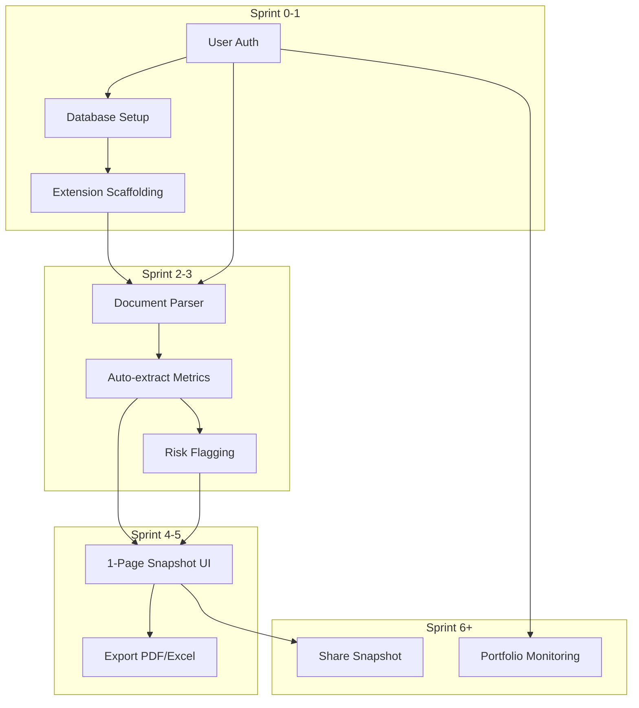
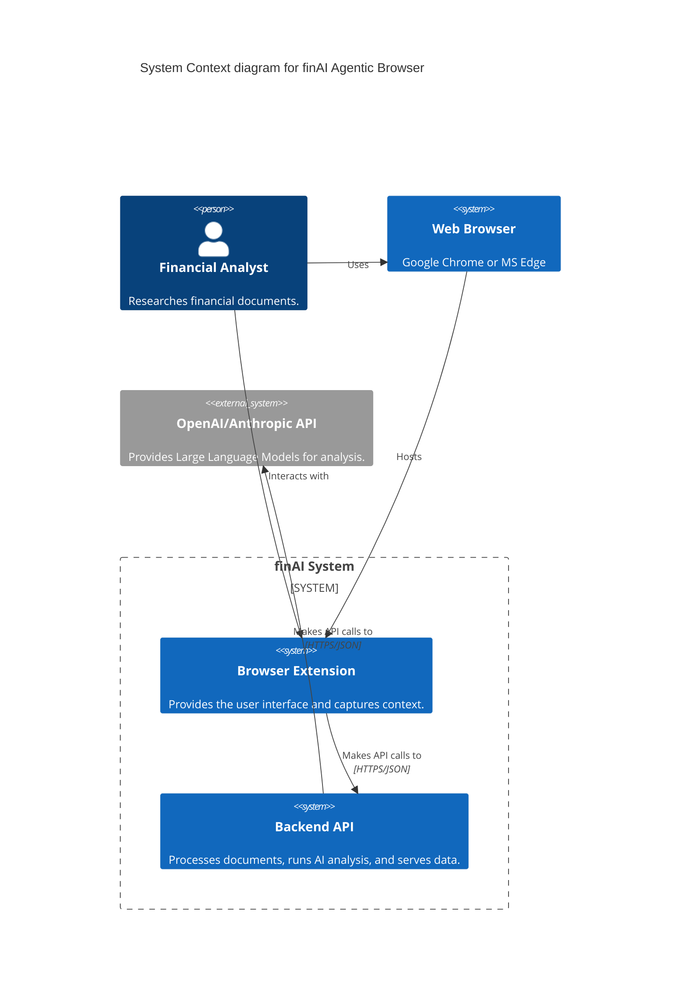
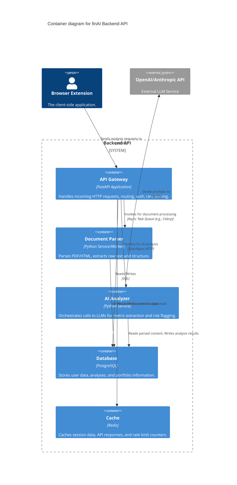
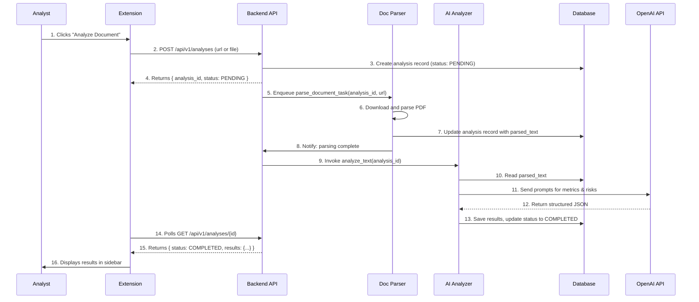
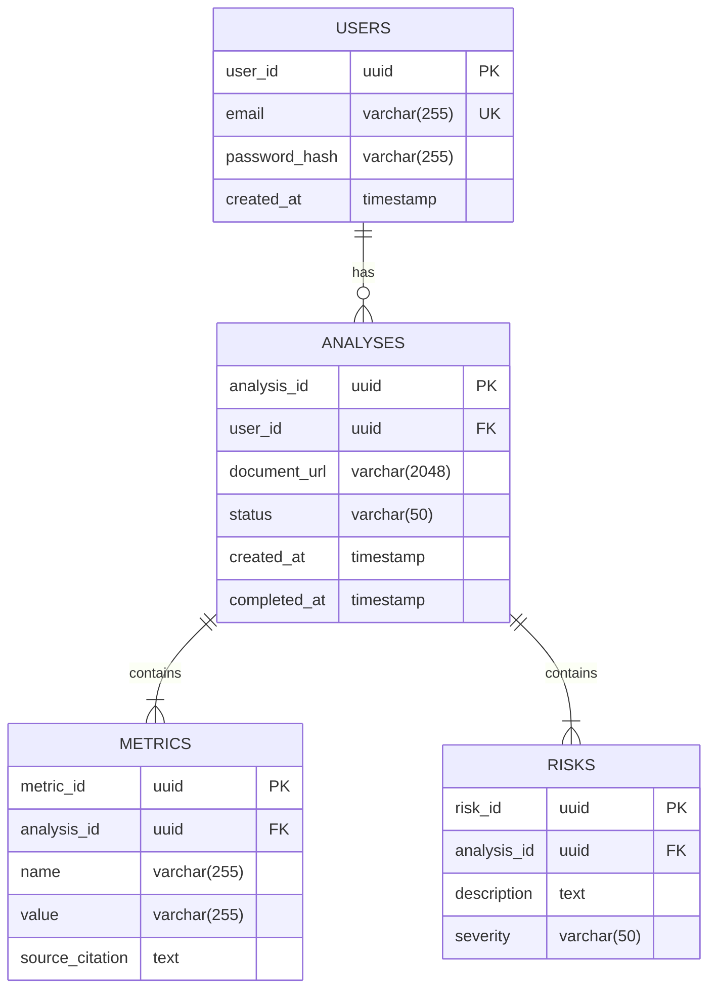

# Tài liệu Thiết kế Toàn diện: finAI Agentic Browser

**Phiên bản:** 1.0
**Ngày cập nhật:** 2025-12-09
**Tác giả:** Manus AI (đóng vai CEO, CTO, Chief Architect, Product-minded Consultant)

---

## Mục lục tổng thể

*   **PHẦN I: Thiết kế khối kinh doanh (Business Design)**
    *   I.1. Problem Statement & Market Canvas
    *   I.2. Product Vision & Strategy
    *   I.3. Business Model & Unit Economics
    *   I.4. Go-to-Market Strategy
*   **PHẦN II: Thiết kế sản phẩm (Product Design)**
    *   II.1. Feature Prioritization & Roadmap
    *   II.2. MVP Specification
    *   II.3. Wireframes & Mockups
    *   II.4. Design System & Component Library
    *   II.5. User Flow & Journey Maps
*   **PHẦN III: Thiết kế kiến trúc phần mềm (Architecture Design)**
*   **PHẦN IV: Thiết kế chi tiết (Detailed Design)**
*   **PHẦN V: Thiết kế triển khai (Implementation Design)**
*   **PHẦN VI: Thiết kế vận hành (Operations Design)**
*   **PHẦN VII: Thiết kế tăng trưởng (Growth Design)**
*   **PHẦN VIII: Thiết kế rủi ro & contingency (Risk Design)**
*   **PHẦN IX: Checklist hoàn chỉnh & Hướng dẫn triển khai**

---

## PHẦN I: THIẾT KẾ KHỐI KINH DOANH (Business Design)

**Mục đích:** Phần này xác định "Tại sao chúng ta xây dựng sản phẩm này?". Nó làm rõ vấn đề của thị trường, tầm nhìn chiến lược, mô hình kinh doanh, và cách chúng ta sẽ đưa sản phẩm ra thị trường. Đây là nền tảng để đảm bảo sản phẩm không chỉ tốt về mặt kỹ thuật mà còn thành công về mặt thương mại.

### I.1. Problem Statement & Market Canvas

#### I.1.1. Problem Statement A4

- **Tên tài liệu:** Problem Statement A4 - finAI Agentic Browser
- **Người chịu trách nhiệm:** CEO, Product Manager
- **Mục tiêu:** Định nghĩa rõ ràng, súc tích vấn đề cốt lõi mà finAI giải quyết.

> **Vấn đề:** Các chuyên gia phân tích tài chính (buy-side analysts, independent advisors) ngày nay đang bị "chết chìm" trong biển thông tin phi cấu trúc. Họ phải dành **15-20 giờ mỗi tuần** chỉ để đọc hàng trăm trang báo cáo tài chính (10-K, 10-Q), tin tức, và các tài liệu khác để tìm ra những insight quan trọng. Quá trình này không chỉ tốn thời gian, lặp đi lặp lại, mà còn tiềm ẩn rủi ro bỏ sót thông tin trọng yếu hoặc mắc lỗi do con người.
>
> **Tần suất & Mức độ nghiêm trọng:** Vấn đề này xảy ra hàng ngày, đặc biệt nghiêm trọng trong mùa báo cáo tài chính. Một sai sót trong việc trích xuất dữ liệu hoặc bỏ lỡ một "red flag" có thể dẫn đến quyết định đầu tư sai lầm, gây thiệt hại hàng triệu đô la.
>
> **Giải pháp hiện tại & Lỗ hổng:** Các công cụ hiện tại như Bloomberg Terminal hay Refinitiv Eikon rất mạnh mẽ nhưng đắt đỏ (25,000 USD/năm/người dùng) và vẫn đòi hỏi nhiều thao tác thủ công. Các công cụ AI thế hệ mới như ChatGPT thì mang tính tổng quát, không được thiết kế chuyên sâu cho nghiệp vụ tài chính, thiếu độ tin cậy và khả năng xác thực nguồn.
>
> **Cơ hội:** Tồn tại một khoảng trống thị trường lớn cho một công cụ trợ lý AI chuyên biệt, có khả năng tự động hóa quá trình nghiên cứu, trích xuất dữ liệu tài chính một cách chính xác, gắn cờ rủi ro, và tổng hợp báo cáo ngay trong môi trường làm việc quen thuộc của chuyên gia phân tích (trình duyệt web). Mức độ sẵn lòng chi trả (WTP) cho một giải pháp giúp tiết kiệm 10 giờ/tuần và giảm 50% rủi ro sai sót được ước tính vào khoảng **$150 - $500/tháng/người dùng**.

#### I.1.2. Best Buyer Persona

- **Tên tài liệu:** Best Buyer Persona - "Alex, The Overwhelmed Analyst"
- **Người chịu trách nhiệm:** Product Manager, Marketing Lead
- **Mục tiêu:** Xây dựng chân dung chi tiết của khách hàng lý tưởng để định hướng phát triển sản phẩm và marketing.

| Thuộc tính | Chi tiết |
| :--- | :--- |
| **Demographics** | - **Tên:** Alex Chen<br>- **Tuổi:** 28-35<br>- **Chức vụ:** Buy-Side Equity Analyst<br>- **Công ty:** Quỹ đầu tư quy mô vừa (AUM $500M - $5B)<br>- **Lương:** $120,000 - $200,000/năm |
| **Psychographics** | - **Nỗi đau (Pain Points):** "Tôi sợ bỏ lỡ một chi tiết nhỏ trong báo cáo 10-K có thể thay đổi toàn bộ luận điểm đầu tư." "Tôi mất quá nhiều thời gian để copy-paste số liệu vào Excel." "Việc kiểm tra chéo thông tin từ nhiều nguồn rất mệt mỏi."<br>- **Động lực (Motivation):** Tìm ra các cổ phiếu dưới giá trị thực (undervalued), gây ấn tượng với Portfolio Manager, thăng tiến trong sự nghiệp.<br>- **Workflow hàng ngày:** Bắt đầu ngày mới với việc đọc tin tức tài chính, email. Dành phần lớn thời gian trong ngày để đọc báo cáo, xây dựng mô hình tài chính trên Excel, và viết báo cáo phân tích. |
| **Behavioral** | - **Tìm kiếm giải pháp:** Thường xuyên tìm kiếm các công cụ mới qua các diễn đàn như Wall Street Oasis, FinTwit (Twitter tài chính), hoặc hỏi đồng nghiệp.<br>- **Quá trình ra quyết định:** Dùng thử (free trial) là yếu-tố-sống-còn. Sẽ trả tiền nếu công cụ chứng minh được ROI rõ ràng (tiết kiệm thời gian, tăng độ chính xác). Quyết định mua cho cá nhân, sau đó đề xuất cho team nếu hiệu quả. |
| **Metrics** | - **WTP (Willingness to Pay):** $150/tháng cho bản thân, có thể thuyết phục sếp chi $500/tháng/người cho cả team.<br>- **CAC Tolerance:** Chấp nhận chi phí $300 - $500 để có được một khách hàng trả phí.<br>- **Churn Risk:** Cao nếu sản phẩm cho kết quả sai hoặc không tiết kiệm được ít nhất 5 giờ/tuần. |

#### I.1.3. Market Sizing Canvas

- **Tên tài liệu:** Market Sizing Canvas - finAI
- **Người chịu trách nhiệm:** CEO, Strategy Lead
- **Mục tiêu:** Ước tính quy mô thị trường để đánh giá tiềm năng kinh doanh.

| Canvas Block | Phân tích & Số liệu (Giả định) |
| :--- | :--- |
| **TAM (Total Addressable Market)** | Toàn bộ thị trường phần mềm phân tích tài chính toàn cầu.<br>_Ước tính:_ **$20 tỷ USD/năm** (Dựa trên báo cáo của Grand View Research, bao gồm cả các terminal truyền thống). |
| **SAM (Serviceable Available Market)** | Thị trường các chuyên gia phân tích tài chính (cổ phiếu, tín dụng) tại các thị trường phát triển (Bắc Mỹ, Châu Âu, Singapore, Hong Kong) sử dụng trình duyệt làm công cụ nghiên cứu chính.<br>_Ước tính:_ 500,000 chuyên gia x $2,400 ARPU/năm = **$1.2 tỷ USD/năm**. |
| **SOM (Serviceable Obtainable Market)** | Thị trường mục tiêu trong 3 năm đầu, tập trung vào các nhà phân tích cá nhân và các quỹ đầu tư nhỏ/vừa tại Mỹ.<br>_Ước tính (Năm 3):_ 10,000 người dùng trả phí x $1,800 ARPU/năm = **$18 triệu USD ARR**. |

### I.2. Product Vision & Strategy

#### I.2.1. Product Vision Statement

- **Tên tài liệu:** Product Vision Statement - finAI
- **Người chịu trách nhiệm:** CEO, Founders
- **Mục tiêu:** Thiết lập một tầm nhìn dài hạn, truyền cảm hứng để định hướng cho mọi quyết định.

> **Tầm nhìn 10 năm (đến 2035):**
> **Dành cho** các chuyên gia tài chính thế hệ mới, những người yêu cầu tốc độ và độ chính xác,
> **Sản phẩm finAI là** một nền tảng trợ lý nghiên cứu agentic,
> **Có khả năng** tự động hóa 80% các tác vụ nghiên cứu lặp đi lặp lại, biến dữ liệu phi cấu trúc thành insight có thể hành động ngay lập tức.
> **Không giống như** các terminal truyền thống (Bloomberg, Refinitiv) vốn cồng kềnh và đắt đỏ, hay các chatbot AI tổng quát (ChatGPT) thiếu chuyên môn và độ tin cậy,
> **Sản phẩm của chúng tôi** mang lại độ chính xác cấp độ enterprise, tốc độ vượt trội, và một mô hình kinh doanh linh hoạt, giúp dân chủ hóa khả năng phân tích tài chính chuyên sâu.
> **Vị thế thị trường:** Trở thành "Co-pilot" mặc định cho mọi chuyên gia phân tích tài chính, đạt **$100 triệu ARR** và phục vụ **20%** thị trường SAM vào năm 2035.

#### I.2.2. Competitive Landscape Matrix

- **Tên tài liệu:** Competitive Landscape Matrix - finAI
- **Người chịu trách nhiệm:** Product Manager, CEO
- **Mục tiêu:** Phân tích đối thủ cạnh tranh và xác định vị thế độc nhất của finAI.

| Đối thủ | Điểm mạnh | Điểm yếu | Chiến lược của finAI |
| :--- | :--- | :--- | :--- |
| **Bloomberg / Refinitiv** | - Dữ liệu độc quyền, toàn diện.<br>- Mạng lưới người dùng lớn.<br>- Thương hiệu uy tín. | - Chi phí cực cao ($25k/năm).<br>- Giao diện phức tạp, khó học.<br>- Tích hợp AI chậm, workflow cứng nhắc. | **Tấn công từ dưới lên (Bottom-up):** Cung cấp trải nghiệm người dùng vượt trội với chi phí thấp hơn 10 lần. Tập trung vào workflow "agentic" mà các hệ thống cũ không có. |
| **ChatGPT / Claude** | - Khả năng ngôn ngữ tự nhiên mạnh mẽ.<br>- Chi phí thấp, dễ tiếp cận. | - **Hay ảo giác (Hallucination)**, cho số liệu sai.<br>- Không có khả năng xác thực nguồn.<br>- Không được thiết kế cho nghiệp vụ tài chính. | **Xây dựng "Moat" về độ tin cậy:** Tập trung vào khả năng trích xuất có xác thực (citation), so sánh chéo nhiều nguồn, và các thuật toán kiểm tra logic tài chính. |
| **Các startup AI-Web-Browser khác (Comet, Arc Search)** | - Trải nghiệm người dùng hiện đại.<br>- Tích hợp AI sâu vào trình duyệt. | - Mang tính tổng quát, không chuyên sâu cho tài chính.<br>- Chưa giải quyết bài toán nghiệp vụ phức tạp (financial modeling, risk analysis). | **Đi theo thị trường ngách (Verticalization):** Trở thành lựa chọn tốt nhất cho ngách tài chính. Xây dựng các tool và thuật toán chuyên biệt mà các đối thủ tổng quát không thể sao chép nhanh. |

**Định vị giá trị (Value Gap):** finAI nằm ở giao điểm của **Độ tin cậy cấp Enterprise** và **Trải nghiệm người dùng Agentic**, với một mức giá hợp lý.

### I.3. Business Model & Unit Economics

#### I.3.1. Business Model Canvas (BMC)

- **Tên tài liệu:** Business Model Canvas - finAI
- **Người chịu trách nhiệm:** CEO, Founders
- **Mục tiêu:** Phác thảo toàn bộ mô hình kinh doanh trên một trang.

(Mô tả dạng bảng)

| **Key Partners** | **Key Activities** | **Value Proposition** | **Customer Relationships** | **Customer Segments** |
| :--- | :--- | :--- | :--- | :--- |
| - OpenAI/Anthropic (LLM APIs)<br>- Financial Data Providers (tương lai)<br>- FinTwit Influencers | - Phát triển & duy trì sản phẩm<br>- Nghiên cứu & phát triển AI<br>- Marketing & Bán hàng<br>- Hỗ trợ khách hàng | **Trợ lý AI Agentic cho phân tích tài chính:**<br>- Tiết kiệm 10-15 giờ/tuần.<br>- Giảm 50% rủi ro sai sót.<br>- Tăng tốc độ ra quyết định đầu tư.<br>- Tự động hóa 80% tác vụ nghiên cứu thủ công. | - Tự phục vụ (Self-service) qua website<br>- Hỗ trợ qua email/chat<br>- Cộng đồng người dùng<br>- Hỗ trợ chuyên sâu (Enterprise) | - **ICP:** Chuyên gia phân tích cổ phiếu (Buy-side, Sell-side)<br>- **Thứ cấp:** Nhà đầu tư cá nhân chuyên nghiệp, sinh viên tài chính. |
| **Key Resources** | | **Channels** | | |
| - Đội ngũ kỹ sư AI<br>- Nền tảng công nghệ<br>- Dữ liệu training (đã ẩn danh)<br>- Thương hiệu & Cộng đồng | | - Chrome Web Store<br>- Content Marketing (SEO, Blog)<br>- Cộng đồng (FinTwit, Reddit)<br>- Bán hàng trực tiếp (Enterprise) | | |
| **Cost Structure** | | **Revenue Streams** | | |
| - Chi phí nhân sự (lớn nhất)<br>- Chi phí API (GPT-4)<br>- Chi phí hạ tầng (Cloud)<br>- Chi phí Marketing & Sales | | - **Thuê bao (Subscription):**<br>  - Pro Plan ($149/tháng)<br>  - Team Plan ($500/tháng/5 người)<br>- **Enterprise:** Hợp đồng tùy chỉnh<br>- **API Licensing** (tương lai) | | |

#### I.3.2. Unit Economics Spreadsheet

- **Tên tài liệu:** Unit Economics Spreadsheet - finAI (Year 1-2 Projections)
- **Người chịu trách nhiệm:** CEO, CFO (tương lai)
- **Mục tiêu:** Đảm bảo mô hình kinh doanh bền vững ở cấp độ mỗi khách hàng.

| Metric | Giả định | Giá trị |
| :--- | :--- | :--- |
| **ARPU (Average Revenue Per User)** | 100% người dùng trả phí ở gói Pro | **$149/tháng** |
| **COGS (Cost of Goods Sold)** | Chi phí API (LLM) và hạ tầng cho một người dùng active | **$25/tháng** |
| **Gross Margin** | (ARPU - COGS) / ARPU | **83.2%** |
| **CAC (Customer Acquisition Cost)** | Chi phí trung bình để có 1 khách hàng trả phí qua các kênh | **$450** |
| **LTV (Lifetime Value)** | ARPU * Gross Margin * (1 / Churn Rate) | $149 * 83.2% * (1 / 4%) = **$3,097** |
| **LTV:CAC Ratio** | LTV / CAC (Mục tiêu > 3) | $3,097 / $450 = **6.88** (Rất tốt) |
| **Payback Period** | CAC / (ARPU * Gross Margin) | $450 / ($149 * 83.2%) = **3.6 tháng** (Tốt) |

*Ghi chú: Churn Rate (tỷ lệ rời bỏ) giả định là 4%/tháng trong giai đoạn đầu.* 

### I.4. Go-to-Market Strategy

#### I.4.1. GTM Playbook

- **Tên tài liệu:** Go-to-Market Playbook - finAI MVP
- **Người chịu trách nhiệm:** CEO, Marketing Lead
- **Mục tiêu:** Kế hoạch chi tiết để tiếp cận 1,000 người dùng đầu tiên.

| Kênh | Chiến thuật | Thông điệp chính | KPI |
| :--- | :--- | :--- | :--- |
| **1. Cộng đồng (Community-Led)** | - **Beta Launch trên FinTwit & Wall Street Oasis:** Hợp tác với 5-10 micro-influencers để họ trải nghiệm và chia sẻ.<br>- **Seeding trên Reddit (r/SecurityAnalysis):** Chia sẻ các case study ẩn danh về việc finAI tìm ra insight. | "Stop wasting hours on manual data entry. Let our AI agent do the grunt work." | - 1,000 beta signups<br>- 500 active users |
| **2. Content Marketing (SEO)** | - **Viết 10 bài blog chuyên sâu:** "How to Analyze a 10-K in 30 Minutes with AI", "Top 5 Red Flags AI Can Find in Financial Reports".<br>- **Tạo các template miễn phí:** Financial modeling templates, due diligence checklists. | "The ultimate guide to AI-powered financial analysis." | - Top 10 Google cho 5 keywords<br>- 5,000 organic visits/tháng |
| **3. Product-Led Growth (PLG)** | - **Free Trial hấp dẫn:** Cho phép 5 phân tích miễn phí.<br>- **Viral Loop:** Mỗi snapshot xuất ra có logo "Powered by finAI" và link giới thiệu. | "Try finAI for free. See how much time you save in 10 minutes." | - 20% conversion từ free trial sang Pro<br>- K-factor > 0.2 |

#### I.4.2. Customer Journey Map

- **Tên tài liệu:** Customer Journey Map - From Awareness to Advocacy
- **Người chịu trách nhiệm:** Product Manager, Marketing Lead
- **Mục tiêu:** Trực quan hóa trải nghiệm của khách hàng qua từng điểm chạm.

- **Giai đoạn 1: Awareness (Nhận thức)**
  - **Điểm chạm:** Thấy tweet của influencer, đọc bài blog trên Google, được bạn bè giới thiệu.
  - **Cảm xúc:** Tò mò, hơi hoài nghi ("Liệu có tốt thật không?").
  - **Thông điệp:** "An AI that actually understands finance?"

- **Giai đoạn 2: Consideration (Cân nhắc)**
  - **Điểm chạm:** Xem video demo trên landing page, đọc trang pricing, so sánh với các lựa chọn khác.
  - **Cảm xúc:** Thích thú, bắt đầu tin tưởng.
  - **Thông điệp:** "Saves 10 hours/week. 14-day free trial. Worth a shot."

- **Giai đoạn 3: Decision (Quyết định)**
  - **Điểm chạm:** Đăng ký free trial, thực hiện phân tích đầu tiên.
  - **Cảm xúc:** "Aha!" moment khi thấy kết quả chính xác và nhanh chóng.
  - **Thông điệp:** Nâng cấp lên Pro để mở khóa tính năng không giới hạn.

- **Giai đoạn 4: Retention (Giữ chân)**
  - **Điểm chạm:** Nhận email tóm tắt hàng tuần, sử dụng tính năng portfolio monitoring.
  - **Cảm xúc:** Cảm thấy finAI là một phần không thể thiếu trong workflow.
  - **Thông điệp:** "New features to make you even more productive."

- **Giai đoạn 5: Advocacy (Ủng hộ)**
  - **Điểm chạm:** Chia sẻ snapshot phân tích với đồng nghiệp, giới thiệu bạn bè để nhận thưởng.
  - **Cảm xúc:** Tự hào vì là người dùng sớm của một công cụ xịn.
  - **Thông điệp:** "You have to try this tool."

#### I.4.3. Pricing & Packaging Model

- **Tên tài liệu:** Pricing & Packaging Model - finAI
- **Người chịu trách nhiệm:** CEO, Product Manager
- **Mục tiêu:** Thiết kế các gói giá trị để tối đa hóa doanh thu và tăng trưởng.

| Gói | Giá | Đối tượng | Tính năng chính |
| :--- | :--- | :--- | :--- |
| **Free** | $0 | Sinh viên, người dùng cá nhân muốn thử | - 5 phân tích/tháng<br>- Trích xuất số liệu cơ bản<br>- Giới hạn 1 tài liệu/phân tích |
| **Pro** | $149/tháng (hoặc $1,499/năm) | Chuyên gia phân tích cá nhân, nhà đầu tư chuyên nghiệp | - **Không giới hạn** phân tích<br>- Phân tích đa tài liệu<br>- Gắn cờ rủi ro nâng cao<br>- Xuất báo cáo PDF/Excel<br>- Hỗ trợ qua email |
| **Team** | $500/tháng (cho 5 người) | Nhóm phân tích nhỏ, quỹ đầu tư boutique | - Mọi tính năng của Pro<br>- Workspace chung<br>- Quản lý thành viên<br>- Thư viện template chung |
| **Enterprise** | Liên hệ | Quỹ đầu tư lớn, ngân hàng đầu tư | - Mọi tính năng của Team<br>- Tùy chỉnh mô hình AI<br>- Tích hợp API<br>- Hỗ trợ chuyên sâu & SLA<br>- Tuân thủ và bảo mật cấp cao |

---

## PHẦN II: THIẾT KẾ SẢN PHẨM (Product Design)

**Mục đích:** Phần này trả lời câu hỏi "Chúng ta sẽ xây dựng cái gì?". Nó chuyển tầm nhìn kinh doanh thành các tính năng cụ thể, lộ trình phát triển, và trải nghiệm người dùng chi tiết. Đây là cầu nối giữa Business và Engineering.

### II.1. Feature Prioritization & Roadmap

#### II.1.1. Feature Journey Map

- **Tên tài liệu:** Feature Journey Map - finAI
- **Người chịu trách nhiệm:** Product Manager
- **Mục tiêu:** Ánh xạ các tính năng vào từng giai đoạn trong vòng đời người dùng để tối ưu hóa trải nghiệm và tăng trưởng.

| Giai đoạn | Mục tiêu người dùng | Tính năng hỗ trợ | KPI đo lường |
| :--- | :--- | :--- | :--- |
| **Discovery** | Hiểu nhanh giá trị sản phẩm | - Landing page rõ ràng<br>- Video demo 2 phút | Conversion Rate (Visit → Signup) > 3% |
| **Activation** | Hoàn thành phân tích đầu tiên và thấy "Aha!" | - Onboarding hướng dẫn 3 bước<br>- Template phân tích có sẵn<br>- **Auto-extract metrics** | Activation Rate > 70% |
| **Core Usage** | Tích hợp finAI vào workflow hàng ngày | - **Risk flagging**<br>- **1-page snapshot**<br>- Tích hợp Excel | WAU/MAU > 40% |
| **Retention** | Thấy giá trị liên tục, không muốn rời bỏ | - **Portfolio monitoring**<br>- Email alerts hàng tuần | D30 Retention > 20% |
| **Growth** | Giới thiệu sản phẩm cho người khác | - **Share snapshot** (với watermark)<br>- Chương trình giới thiệu | K-factor > 0.2 |
| **Revenue** | Nâng cấp lên gói trả phí | - Paywall thông minh<br>- So sánh các gói giá trị | Trial-to-Paid CVR > 20% |

#### II.1.2. RICE Prioritization Matrix

- **Tên tài liệu:** RICE Prioritization Matrix - finAI Q1-Q2 Roadmap
- **Người chịu trách nhiệm:** Product Manager, Tech Lead
- **Mục tiêu:** Sử dụng một framework khách quan để quyết định thứ tự ưu tiên xây dựng tính năng.

| Feature | Reach (1-100) | Impact (0.25-3) | Confidence (50-100%) | Effort (person-months) | RICE Score | Priority |
| :--- | :--- | :--- | :--- | :--- | :--- | :--- |
| **Auto-extract metrics** | 100 | 3 | 90% | 1.5 | **180** | **P0** |
| **1-page snapshot generator** | 100 | 2.5 | 95% | 1.0 | **237.5** | **P0** |
| **Risk flagging (rule-based)** | 90 | 2 | 85% | 1.0 | **153** | **P1** |
| **Chrome Extension (Sidebar UI)** | 100 | 3 | 95% | 2.0 | **142.5** | **P1** |
| **Portfolio monitoring** | 60 | 2.5 | 80% | 2.5 | **48** | **P2** |
| **User Authentication & DB** | 100 | 3 | 100% | 1.0 | **300** | **P0** |
| **Share snapshot (viral loop)** | 80 | 1.5 | 70% | 0.5 | **168** | **P1** |

*Ghi chú: RICE Score = (Reach * Impact * Confidence) / Effort. Priority P0 là các tính năng bắt buộc cho MVP.* 

#### II.1.3. Dependency Map

- **Tên tài liệu:** Feature Dependency Map - finAI
- **Người chịu trách nhiệm:** Tech Lead, Product Manager
- **Mục tiêu:** Trực quan hóa sự phụ thuộc giữa các tính năng để lập kế hoạch sprint hợp lý.



### II.2. MVP Specification

#### II.2.1. MBP (Minimum Breakthrough Prototype) Definition

- **Tên tài liệu:** MBP Definition - finAI
- **Người chịu trách nhiệm:** CEO, Product Manager
- **Mục tiêu:** Xác định phạm vi tối thiểu của sản phẩm để tạo ra sự đột phá và giải quyết nỗi đau cốt lõi của người dùng.

- **Phạm vi MBP:** Một Chrome Extension cho phép người dùng, khi đang xem một file PDF báo cáo tài chính (10-K/10-Q) trên trình duyệt, có thể:
  1.  **Click một nút** để tự động trích xuất **10-15 chỉ số tài chính quan trọng** (Doanh thu, Lợi nhuận gộp, EPS, P/E, Nợ/Vốn chủ sở hữu...).
  2.  Xem các chỉ số này được hiển thị ngay lập tức trong sidebar, cùng với **nguồn trích dẫn** (số trang, đoạn văn bản gốc).
  3.  Nhận được **3-5 cảnh báo rủi ro** tự động dựa trên các quy tắc đơn giản (ví dụ: "Doanh thu giảm 2 quý liên tiếp", "Biên lợi nhuận giảm >5%").
  4.  Tạo ra một **báo cáo tóm tắt 1 trang (snapshot)** dạng text có thể copy-paste.

- **Thành công của MBP được định nghĩa là:**
  - **50 beta users** (là các chuyên gia phân tích thực thụ) sử dụng sản phẩm.
  - **70%** trong số họ hoàn thành ít nhất 1 phân tích thành công.
  - **60%** trả lời "rất thất vọng" nếu sản phẩm này biến mất (khảo sát theo phương pháp của Superhuman).

#### II.2.2. PRD (Product Requirements Document) - MVP

- **Tên tài liệu:** PRD - finAI Agentic Browser MVP
- **Người chịu trách nhiệm:** Product Manager
- **Mục tiêu:** Mô tả chi tiết các yêu cầu chức năng và phi chức năng cho MVP.

**1. Tổng quan:** Xây dựng một Chrome Extension (MVP) giúp chuyên gia phân tích tài chính tự động hóa việc trích xuất dữ liệu và phát hiện rủi ro từ các báo cáo tài chính dạng PDF.

**2. User Stories:**
- **US-01:** Là một nhà phân tích, tôi muốn có thể mở một file 10-K dạng PDF trên trình duyệt và kích hoạt finAI sidebar để bắt đầu phân tích.
- **US-02:** Là một nhà phân tích, tôi muốn finAI tự động đọc file PDF và trích xuất các chỉ số tài chính cốt lõi mà không cần tôi phải copy-paste thủ công.
- **US-03:** Là một nhà phân tích, tôi muốn xem nguồn gốc của mỗi chỉ số được trích xuất để có thể kiểm tra lại độ chính xác.
- **US-04:** Là một nhà phân tích, tôi muốn được cảnh báo về các rủi ro tiềm ẩn trong báo cáo để không bỏ sót thông tin quan trọng.
- **US-05:** Là một nhà phân tích, tôi muốn có thể tạo nhanh một bản tóm tắt các kết quả phân tích để chia sẻ với team của mình.

**3. Yêu cầu chức năng (Functional Requirements):**
- **FR-01: Sidebar Extension:**
  - Hiển thị icon finAI trên thanh công cụ của Chrome.
  - Khi click, mở ra một sidebar bên phải màn hình.
  - Sidebar có nút "Analyze this document".
- **FR-02: Document Analysis:**
  - Khi người dùng click "Analyze", extension gửi nội dung PDF (hoặc URL) về backend.
  - Backend xử lý và trả về kết quả phân tích.
- **FR-3: Metrics Display:**
  - Hiển thị danh sách các chỉ số tài chính được trích xuất.
  - Mỗi chỉ số có giá trị, kỳ báo cáo, và một tooltip/link để xem nguồn trích dẫn.
- **FR-04: Risk Display:**
  - Hiển thị danh sách các rủi ro được phát hiện.
  - Mỗi rủi ro có mô tả ngắn gọn và mức độ (Thấp, Trung bình, Cao).
- **FR-05: Snapshot Generation:**
  - Có nút "Generate Snapshot".
  - Khi click, hiển thị một modal chứa văn bản tóm tắt có thể sao chép.

**4. Yêu cầu phi chức năng (Non-Functional Requirements):**
- **NFR-01 (Performance):** Thời gian từ lúc click "Analyze" đến lúc hiển thị kết quả phải dưới 15 giây.
- **NFR-02 (Accuracy):** Độ chính xác của việc trích xuất chỉ số phải > 90% trên bộ 20 tài liệu 10-K mẫu.
- **NFR-03 (Security):** Mọi giao tiếp giữa extension và backend phải được mã hóa qua HTTPS.
- **NFR-04 (Privacy):** Không lưu trữ nội dung file PDF của người dùng sau khi đã xử lý xong.

**5. Out of Scope for MVP:**
- Hỗ trợ các định dạng khác ngoài PDF.
- Đăng nhập người dùng và lưu lịch sử phân tích.
- Tùy chỉnh các chỉ số cần trích xuất.
- Portfolio monitoring.

### II.3. Wireframes & Mockups

- **Tên tài liệu:** Wireframes - finAI MVP
- **Người chịu trách nhiệm:** Product Designer, PM
- **Mục tiêu:** Mô tả cấu trúc và layout của các màn hình chính (dạng text).

**WF-01: Default Sidebar State**
```
+---------------------------------+
| finAI Logo                      |
+---------------------------------+
|                                 |
|  [Icon: Document]               |
|  Document detected:             |
|  "AAPL_10-K_2024.pdf"           |
|                                 |
|  +---------------------------+  |
|  |     Analyze Document      |  |
|  +---------------------------+  |
|                                 |
|                                 |
+---------------------------------+
| Settings | Help                 |
+---------------------------------+
```

**WF-02: Loading State**
```
+---------------------------------+
| finAI Logo                      |
+---------------------------------+
|                                 |
|  [Spinner Animation]            |
|                                 |
|  Analyzing document...          |
|  (This may take up to 15s)      |
|                                 |
|  - Extracting key metrics       |
|  - Identifying risks            |
|  - Compiling snapshot           |
|                                 |
+---------------------------------+
| Settings | Help                 |
+---------------------------------+
```

**WF-03: Results State - Key Metrics Tab**
```
+---------------------------------+
| [Tab: Summary] [Tab: Metrics] [Tab: Risks] |
+---------------------------------+
| ▼ Key Financials                |
|   Revenue: $383.2B [src]        |
|   Net Income: $97.0B [src]      |
|   EPS: $6.13 [src]              |
|                                 |
| ▼ Valuation                     |
|   P/E Ratio: 29.5x [src]        |
|   Market Cap: $2.8T [src]       |
|                                 |
| +---------------------------+   |
| |    Generate Snapshot      |   |
| +---------------------------+   |
+---------------------------------+
```

**WF-04: Results State - Risks Tab**
```
+---------------------------------+
| [Tab: Summary] [Tab: Metrics] [Tab: Risks] |
+---------------------------------+
| [!] Revenue Growth Slowdown (Medium) |
|     Quarterly revenue growth has... |
|                                 |
| [!] Margin Compression (High)   |
|     Gross margin decreased by...|
|                                 |
| [!] Increased Debt Load (Low)   |
|     Total debt to equity ratio... |
|                                 |
+---------------------------------+
```

**WF-05: Snapshot Modal**
```
+---------------------------------+
|  Snapshot for AAPL 10-K 2024    |
| +-----------------------------+ |
| | [Copy to Clipboard]         | |
| +-----------------------------+ |
|---------------------------------|
| **Key Metrics:**                |
| - Revenue: $383.2B              |
| - Net Income: $97.0B            |
|                                 |
| **Key Risks:**                  |
| - Revenue Growth Slowdown...    |
|                                 |
| Powered by finAI                |
+---------------------------------+
```

### II.4. Design System & Component Library

- **Tên tài liệu:** Design System - finAI v0.1
- **Người chịu trách nhiệm:** Frontend Lead, Product Designer
- **Mục tiêu:** Đảm bảo tính nhất quán và tăng tốc độ phát triển UI.

| Component | Mô tả | Trạng thái |
| :--- | :--- | :--- |
| **Typography** | - **Heading:** Inter Bold (18px)<br>- **Body:** Inter Regular (14px)<br>- **Label:** Inter Medium (12px) | - Default<br>- Muted<br>- Error |
| **Colors** | - **Primary:** #0052FF (Blue)<br>- **Background:** #FFFFFF (White)<br>- **Text:** #172B4D (Dark Gray)<br>- **Border:** #DFE1E6 (Light Gray)<br>- **Risk High:** #DE350B (Red)<br>- **Risk Medium:** #FFAB00 (Yellow) | - Default<br>- Hover<br>- Active/Focus |
| **Buttons** | - **Primary Button:** Nền xanh, chữ trắng.<br>- **Secondary Button:** Viền xám, chữ xám. | - Default<br>- Hover<br>- Disabled |
| **Tabs** | Component tab để chuyển giữa các view (Summary, Metrics, Risks). | - Active<br>- Inactive |
| **Modals** | Cửa sổ popup để hiển thị Snapshot. | - Open<br>- Closed |
| **Tooltips** | Hiển thị khi hover vào link `[src]` để xem nguồn trích dẫn. | - Visible<br>- Hidden |

### II.5. User Flow & Journey Maps

#### II.5.1. Task Flow - First Time Analysis

- **Tên tài liệu:** Task Flow - First Time Analysis
- **Người chịu trách nhiệm:** Product Manager, UX Designer
- **Mục tiêu:** Mô tả chi tiết các bước người dùng thực hiện để hoàn thành một tác vụ cốt lõi.

1.  **User** mở một file PDF báo cáo tài chính trên Chrome.
2.  **User** click vào icon finAI trên thanh công cụ.
3.  **System** mở sidebar, hiển thị thông tin tài liệu đã nhận diện.
4.  **User** click nút "Analyze Document".
5.  **System** hiển thị trạng thái loading trong sidebar.
6.  **System** (backend) xử lý tài liệu và trả về kết quả.
7.  **System** hiển thị kết quả trong sidebar, mặc định ở tab "Metrics".
8.  **User** xem các chỉ số, có thể hover vào `[src]` để xem nguồn.
9.  **User** chuyển sang tab "Risks" để xem các cảnh báo.
10. **User** click nút "Generate Snapshot".
11. **System** hiển thị modal với nội dung tóm tắt.
12. **User** click "Copy to Clipboard" và dán vào email/ghi chú của mình.
13. **User** đóng sidebar.

*Kết thúc luồng.*


---

## PHẦN III: THIẾT KẾ KIẾN TRÚC PHẦN MỀM (Architecture Design)

**Mục đích:** Phần này trả lời câu hỏi "Chúng ta sẽ xây dựng hệ thống như thế nào?". Nó xác định cấu trúc tổng thể của hệ thống, cách các thành phần tương tác với nhau, giao diện lập trình ứng dụng (API), và cấu trúc dữ liệu. Đây là bản thiết kế chi tiết cho đội ngũ kỹ thuật.

### III.1. System Architecture Diagrams

#### III.1.1. Conceptual Architecture Diagram (C4 Level 1 - Context)

- **Tên tài liệu:** Conceptual Architecture - finAI
- **Người chịu trách nhiệm:** Chief Architect, Tech Lead
- **Mục tiêu:** Mô tả bối cảnh và các tương tác ở mức cao nhất của hệ thống.



#### III.1.2. Component Architecture Diagram (C4 Level 2 - Containers)

- **Tên tài liệu:** Component Architecture - finAI
- **Người chịu trách nhiệm:** Chief Architect, Tech Lead
- **Mục tiêu:** Phân rã hệ thống backend thành các thành phần (services/containers) chính và mô tả trách nhiệm của chúng.



#### III.1.3. Deployment Architecture Diagram

- **Tên tài liệu:** Deployment Architecture - finAI on AWS
- **Người chịu trách nhiệm:** DevOps, Chief Architect
- **Mục tiêu:** Mô tả cách hệ thống được triển khai trên môi trường production (ví dụ: AWS).

```mermaid
graph TD
    subgraph "User's Browser"
        A[Chrome Extension]
    end

    subgraph "AWS Cloud"
        subgraph "VPC"
            B[Route 53] --> C[CloudFront CDN]
            C --> D[API Gateway (AWS)]
            D --> E[Application Load Balancer]

            subgraph "Private Subnet 1"
                F[ECS Cluster - Backend API]
                F -- Scales --> F1[Task 1]
                F -- Scales --> F2[Task 2]
                F -- Scales --> F3[...]
            end

            subgraph "Private Subnet 2"
                G[ECS Cluster - Workers]
                G -- Scales --> G1[Doc Parser Task]
                G -- Scales --> G2[...]
            end

            subgraph "Data Layer"
                 H[RDS - PostgreSQL]
                 I[ElastiCache - Redis]
            end

            E --> F
            F --> G
            F --> H
            F --> I
            G --> H
        end

        J[S3 for Documents/Snapshots]
        K[Secrets Manager]
        L[CloudWatch Logs/Metrics]

        F --> J
        F --> K
        F --> L
        G --> L
    end

    M[OpenAI API]

    A --> B
    F --> M
```

#### III.1.4. Data Flow Diagram

- **Tên tài liệu:** Data Flow Diagram - Analysis Request
- **Người chịu trách nhiệm:** Tech Lead
- **Mục tiêu:** Mô tả luồng dữ liệu cho một kịch bản quan trọng.



### III.2. API Design

- **Tên tài liệu:** REST API Specification - finAI v1 (OpenAPI 3.0)
- **Người chịu trách nhiệm:** Backend Lead
- **Mục tiêu:** Định nghĩa các endpoint, request, và response cho API.

```yaml
openapi: 3.0.0
info:
  title: finAI Agentic Browser API
  version: "1.0"

paths:
  /api/v1/analyses:
    post:
      summary: Create a new analysis task
      requestBody:
        required: true
        content:
          application/json:
            schema:
              type: object
              properties:
                url:
                  type: string
                  description: The URL of the document to analyze.
      responses:
        '202':
          description: Analysis task accepted.
          content:
            application/json:
              schema:
                $ref: '#/components/schemas/AnalysisTask'

  /api/v1/analyses/{analysisId}:
    get:
      summary: Get the status and results of an analysis task
      parameters:
        - name: analysisId
          in: path
          required: true
          schema:
            type: string
      responses:
        '200':
          description: Successful response.
          content:
            application/json:
              schema:
                $ref: '#/components/schemas/AnalysisResult'

components:
  schemas:
    AnalysisTask:
      type: object
      properties:
        analysis_id:
          type: string
          format: uuid
        status:
          type: string
          enum: [PENDING, PROCESSING, COMPLETED, FAILED]

    AnalysisResult:
      type: object
      properties:
        analysis_id:
          type: string
        status:
          type: string
        results:
          type: object
          properties:
            key_metrics:
              type: array
              items:
                type: object
                properties:
                  name: { type: string }
                  value: { type: string }
                  source_citation: { type: string }
            identified_risks:
              type: array
              items:
                type: object
                properties:
                  description: { type: string }
                  severity: { type: string, enum: [LOW, MEDIUM, HIGH] }
```

### III.3. Database Design

#### III.3.1. Entity-Relationship Diagram (ERD)

- **Tên tài liệu:** ERD - finAI
- **Người chịu trách nhiệm:** Backend Lead, DBA
- **Mục tiêu:** Mô tả các thực thể dữ liệu và mối quan hệ giữa chúng.



#### III.3.2. Database Schema (SQL)

- **Tên tài liệu:** Database Schema - finAI
- **Người chịu trách nhiệm:** Backend Lead
- **Mục tiêu:** Cung cấp mã SQL để tạo các bảng trong database.

```sql
CREATE TABLE users (
    user_id UUID PRIMARY KEY DEFAULT gen_random_uuid(),
    email VARCHAR(255) UNIQUE NOT NULL,
    password_hash VARCHAR(255) NOT NULL,
    created_at TIMESTAMPTZ NOT NULL DEFAULT NOW()
);

CREATE TABLE analyses (
    analysis_id UUID PRIMARY KEY DEFAULT gen_random_uuid(),
    user_id UUID NOT NULL REFERENCES users(user_id),
    document_url VARCHAR(2048) NOT NULL,
    status VARCHAR(50) NOT NULL DEFAULT 'PENDING',
    raw_text TEXT, -- Optional, for caching
    created_at TIMESTAMPTZ NOT NULL DEFAULT NOW(),
    completed_at TIMESTAMPTZ
);

CREATE TABLE metrics (
    metric_id UUID PRIMARY KEY DEFAULT gen_random_uuid(),
    analysis_id UUID NOT NULL REFERENCES analyses(analysis_id) ON DELETE CASCADE,
    name VARCHAR(255) NOT NULL,
    value VARCHAR(255) NOT NULL,
    source_citation TEXT
);

CREATE TABLE risks (
    risk_id UUID PRIMARY KEY DEFAULT gen_random_uuid(),
    analysis_id UUID NOT NULL REFERENCES analyses(analysis_id) ON DELETE CASCADE,
    description TEXT NOT NULL,
    severity VARCHAR(50) NOT NULL
);

-- Add indexes for performance
CREATE INDEX idx_analyses_user_id ON analyses(user_id);
CREATE INDEX idx_metrics_analysis_id ON metrics(analysis_id);
CREATE INDEX idx_risks_analysis_id ON risks(analysis_id);
```

### III.4. Architecture Patterns

- **Tên tài liệu:** Architectural Decisions - finAI
- **Người chịu trách nhiệm:** Chief Architect
- **Mục tiêu:** Ghi lại các quyết định kiến trúc quan trọng và lý do đằng sau chúng.

- **Quyết định 1: Modular Monolith thay vì Microservices (cho MVP)**
  - **Lý do:** Với một team nhỏ (3 người), việc quản lý một hệ thống microservices phức tạp sẽ làm tăng đáng kể overhead về mặt vận hành (deployment, monitoring, networking). Một kiến trúc "Modular Monolith" (một codebase duy nhất nhưng được cấu trúc thành các module rõ ràng, tách biệt) cho phép phát triển nhanh, dễ dàng refactor, và có thể tách thành microservices trong tương lai khi cần thiết.
  - **Hệ quả:** Giảm độ phức tạp ban đầu, tăng tốc độ phát triển. Cần kỷ luật cao trong việc duy trì ranh giới giữa các module.

- **Quyết định 2: Asynchronous Task Processing cho các tác vụ nặng**
  - **Lý do:** Việc phân tích tài liệu (parsing) và gọi API của LLM có thể mất nhiều thời gian (từ vài giây đến vài phút). Thực hiện các tác vụ này một cách đồng bộ sẽ làm block request và gây ra timeout. Sử dụng một hàng đợi tác vụ (Task Queue) như Celery với Redis/RabbitMQ cho phép API trả về response ngay lập tức (`202 Accepted`) và xử lý tác vụ trong nền.
  - **Hệ quả:** Cải thiện trải nghiệm người dùng, tăng khả năng chịu lỗi và mở rộng của hệ thống. Đòi hỏi client phải có logic để poll hoặc nhận thông báo (qua WebSocket) về trạng thái của tác vụ.

- **Quyết định 3: Database-per-Service Pattern (Logic)**
  - **Lý do:** Mặc dù chạy trên một database vật lý duy nhất (PostgreSQL), mỗi service/module trong codebase chỉ được phép truy cập vào các bảng dữ liệu của chính nó. Ví dụ, `AI Analyzer` không được phép ghi trực tiếp vào bảng `users`.
  - **Hệ quả:** Giảm sự phụ thuộc chéo, dễ dàng hơn trong việc tách service trong tương lai. Yêu cầu giao tiếp giữa các service phải thông qua API hoặc event, thay vì chia sẻ database.

---

## PHẦN IV: THIẾT KẾ CHI TIẾT (Detailed Design)

**Mục đích:** Phần này đi sâu vào từng component, thuật toán, và các khía cạnh phi chức năng. Nó cung cấp đủ chi tiết để một kỹ sư có thể bắt đầu viết code.

### IV.1. Component Specifications

#### IV.1.1. Document Parser Component

- **Mục tiêu:** Nhận một URL, tải về, và trích xuất nội dung văn bản sạch.
- **Inputs:** `document_url` (string)
- **Outputs:** `parsed_text` (string)
- **Trách nhiệm:**
  - Hỗ trợ định dạng PDF (ưu tiên 1) và HTML (ưu tiên 2).
  - Sử dụng thư viện như `PyPDF2` hoặc `pdfplumber` cho PDF, và `BeautifulSoup` cho HTML.
  - Xử lý các lỗi thường gặp: file không tồn tại, định dạng không được hỗ trợ, timeout.
  - Loại bỏ các thành phần không cần thiết (header, footer, số trang) để có văn bản sạch.
- **Pseudocode:**
  ```python
  def parse_document(url: str) -> str:
      content_type = get_content_type(url)
      raw_content = download_file(url)

      if content_type == 'application/pdf':
          text = extract_text_from_pdf(raw_content)
      elif content_type == 'text/html':
          text = extract_text_from_html(raw_content)
      else:
          raise UnsupportedFormatError()

      cleaned_text = clean_text(text) # Remove headers/footers
      return cleaned_text
  ```

#### IV.1.2. AI Analyzer Component

- **Mục tiêu:** Nhận văn bản sạch, sử dụng LLM để trích xuất chỉ số và rủi ro.
- **Inputs:** `parsed_text` (string)
- **Outputs:** `AnalysisResult` (object chứa list các metrics và risks)
- **Trách nhiệm:**
  - Chia văn bản dài thành các chunk nhỏ hơn để không vượt quá giới hạn token của LLM.
  - Xây dựng các prompt kỹ thuật (prompt engineering) để yêu cầu LLM trả về kết quả dưới dạng JSON.
  - Gọi API của LLM (ví dụ: OpenAI) và xử lý các response.
  - Validate và parse JSON trả về từ LLM.
  - Xử lý lỗi khi LLM trả về định dạng không hợp lệ hoặc từ chối trả lời.
- **Pseudocode:**
  ```python
  def analyze_text(text: str) -> AnalysisResult:
      chunks = split_text_into_chunks(text)
      all_metrics = []
      all_risks = []

      for chunk in chunks:
          metric_prompt = build_metric_prompt(chunk)
          risk_prompt = build_risk_prompt(chunk)

          # Call LLM in parallel if possible
          metric_json = call_llm_api(metric_prompt)
          risk_json = call_llm_api(risk_prompt)

          all_metrics.extend(parse_metrics(metric_json))
          all_risks.extend(parse_risks(risk_json))

      # Deduplicate and consolidate results
      final_metrics = consolidate_metrics(all_metrics)
      final_risks = consolidate_risks(all_risks)

      return AnalysisResult(metrics=final_metrics, risks=final_risks)
  ```

### IV.2. Algorithm Design

#### IV.2.1. Metric Extraction Algorithm

- **Mục tiêu:** Thiết kế prompt để LLM trích xuất chính xác các chỉ số tài chính.
- **Thuật toán (Prompt Engineering):**
  1.  **System Prompt:** "You are an expert financial analyst. Your task is to extract key financial metrics from the provided text. You must return the result as a valid JSON array of objects. Each object must have three keys: `name` (string), `value` (string, including units like '$' or '%'), and `citation` (the exact quote from the text that supports the value). If a metric is not found, do not include it in the array."
  2.  **User Prompt:**
      ```
      Here is the text from a financial report:
      """
      [...text chunk...]
      """
      Please extract the following metrics: "Revenue", "Net Income", "Gross Margin %", "EPS - Diluted".
      Respond ONLY with the JSON array.
      ```
  3.  **Few-shot Learning:** Cung cấp 1-2 ví dụ về input và output mong muốn trong prompt để hướng dẫn model.
  4.  **Post-processing:** Sau khi nhận JSON, validate schema và kiểm tra logic (ví dụ: Revenue không thể là số âm).

### IV.3. Security & Compliance Design

#### IV.3.1. Security Architecture

- **Tên tài liệu:** Security Architecture - finAI
- **Người chịu trách nhiệm:** Chief Architect, Security Lead
- **Mục tiêu:** Thiết kế các biện pháp kiểm soát để bảo vệ hệ thống và dữ liệu người dùng.

| Lớp bảo vệ | Biện pháp kiểm soát |
| :--- | :--- |
| **Network** | - Mọi traffic đều phải qua HTTPS/TLS.<br>- Sử dụng AWS WAF để chống lại các cuộc tấn công phổ biến (SQLi, XSS).<br>- Backend services nằm trong private subnet, không thể truy cập trực tiếp từ Internet. |
| **Application** | - **Authentication:** Sử dụng JWT với access token (ngắn hạn, 15 phút) và refresh token (dài hạn, 7 ngày).<br>- **Authorization:** API endpoints được bảo vệ bằng middleware, kiểm tra role của người dùng (free, pro, admin).<br>- **Input Validation:** Sử dụng Pydantic để validate mọi request body, chống lại các cuộc tấn công injection.<br>- **Rate Limiting:** Giới hạn số lượng request mỗi phút cho mỗi user/IP. |
| **Data** | - **Encryption at Rest:** Dữ liệu trên RDS và S3 được mã hóa bằng AES-256.<br>- **Secrets Management:** Không hardcode API keys/credentials. Sử dụng AWS Secrets Manager để lưu trữ và xoay vòng các secret. |
| **AI** | - **Prompt Injection Defense:** Sanitize input của người dùng trước khi đưa vào prompt. Có một lớp LLM khác để kiểm tra xem prompt có độc hại không.<br>- **Data Privacy:** Không sử dụng dữ liệu của khách hàng để train model nếu không có sự đồng ý rõ ràng. Sử dụng API của OpenAI với chính sách zero data retention. |

#### IV.3.2. Compliance & Audit Design

- **Tên tài liệu:** Compliance & Audit Design - finAI
- **Người chịu trách nhiệm:** CEO, Legal Counsel
- **Mục tiêu:** Đảm bảo sản phẩm tuân thủ các quy định pháp lý và có khả năng kiểm toán.

- **Disclaimer Framework:**
  - Mọi output (snapshot, UI) phải có dòng chữ rõ ràng: *"Generated by finAI. For research purposes only. Not investment advice."*
- **Source Attribution:**
  - Mọi số liệu, insight do AI tạo ra phải có khả năng truy vết về nguồn gốc (tên tài liệu, số trang, đoạn văn bản gốc).
  - Đây là tính năng quan trọng để xây dựng lòng tin và phòng thủ pháp lý.
- **Audit Logging:**
  - Ghi lại mọi hành động quan trọng: user login, analysis created, data exported, settings changed.
  - Log phải chứa: `timestamp`, `user_id`, `action`, `ip_address`, `result (success/fail)`.
- **GDPR/CCPA Compliance:**
  - **Right to Access/Portability:** Cung cấp tính năng cho người dùng xuất toàn bộ dữ liệu của họ.
  - **Right to be Forgotten:** Cung cấp tính năng xóa tài khoản, đồng thời xóa toàn bộ dữ liệu liên quan trong vòng 30 ngày.

### IV.4. Performance & Scalability Design

- **Tên tài liệu:** Performance & Scalability Design - finAI
- **Người chịu trách nhiệm:** Tech Lead, DevOps
- **Mục tiêu:** Đảm bảo hệ thống hoạt động nhanh và có thể mở rộng để phục vụ lượng lớn người dùng.

- **Performance Targets (SLOs):**
  - **P95 API Latency (non-analysis):** < 200ms
  - **P95 Analysis Time (end-to-end):** < 20 giây
  - **System Availability:** 99.9%

- **Scaling Strategy:**
  - **Stateless Backend:** Backend API được thiết kế để không lưu trạng thái (stateless), cho phép dễ dàng scale ngang bằng cách thêm các container/instance mới trong ECS/EC2 Auto Scaling Group.
  - **Asynchronous Workers:** Các tác vụ nặng (parsing, AI analysis) được xử lý bởi một nhóm worker riêng biệt, có thể scale độc lập dựa trên độ dài của hàng đợi tác vụ (task queue).
  - **Database Scaling:** Bắt đầu với một instance RDS đủ lớn. Trong tương lai, có thể sử dụng read replicas để giảm tải cho các request chỉ đọc. Sharding theo `user_id` là một lựa chọn phức tạp hơn, chỉ xem xét khi lượng người dùng vượt quá 1 triệu.
  - **Caching:** Sử dụng Redis một cách tích cực để cache các kết quả phân tích đã hoàn thành, thông tin session, và các dữ liệu ít thay đổi. Một cache hit có thể giảm latency từ vài giây xuống vài mili giây.


---

## PHẦN V: THIẾT KẾ TRIỂN KHAI (Implementation Design)

**Mục đích:** Phần này trả lời câu hỏi "Đội ngũ sẽ xây dựng sản phẩm bằng công cụ gì và theo quy trình nào?". Nó xác định công nghệ, cấu trúc mã nguồn, kế hoạch sprint, và chiến lược kiểm thử, cung cấp một lộ trình rõ ràng từ thiết kế đến code.

### V.1. Technology Stack

- **Tên tài liệu:** Technology Stack - finAI v1
- **Người chịu trách nhiệm:** CTO, Chief Architect
- **Mục tiêu:** Lựa chọn bộ công cụ công nghệ phù hợp để tối ưu hóa tốc độ phát triển, hiệu năng, và khả năng mở rộng.

| Layer | Technology | Lý do lựa chọn |
| :--- | :--- | :--- |
| **Frontend (Extension)** | React.js + TypeScript | Hệ sinh thái lớn, component-based, an toàn kiểu dữ liệu giúp giảm lỗi. |
| **Styling** | Tailwind CSS | Phát triển UI nhanh chóng, nhất quán, dễ bảo trì. |
| **State Management** | Zustand | Nhẹ nhàng, đơn giản hơn Redux, API dễ học, phù hợp cho extension. |
| **Backend Framework** | Python + FastAPI | Hiệu năng cao, hỗ trợ async sẵn có, tự động tạo tài liệu API (Swagger), hệ sinh thái AI/ML mạnh mẽ. |
| **Database** | PostgreSQL (trên AWS RDS) | Mạnh mẽ, tin cậy, hỗ trợ tốt kiểu dữ liệu JSONB cho các kết quả phân tích linh hoạt. Dịch vụ được quản lý giúp giảm gánh nặng vận hành. |
| **AI/ML** | OpenAI API (GPT-4/GPT-4o) | Mô hình ngôn ngữ hàng đầu về khả năng suy luận và trích xuất thông tin phức tạp. Chính sách bảo mật dữ liệu tốt. |
| **Task Queue** | Celery + Redis | Tiêu chuẩn công nghiệp cho xử lý tác vụ bất đồng bộ trong Python. Tin cậy và có khả năng mở rộng. |
| **Cache** | Redis (trên AWS ElastiCache) | Hiệu năng cao, đa dụng (caching, message broker, rate limiting). |
| **Deployment** | Docker + AWS ECS | Đóng gói ứng dụng nhất quán, dễ dàng scale và quản lý trên một nền tảng được quản lý. |
| **CI/CD** | GitHub Actions | Tích hợp sẵn với GitHub, dễ dàng thiết lập pipeline tự động cho testing và deployment. |
| **Monitoring** | AWS CloudWatch + Sentry | CloudWatch cung cấp các metric hạ tầng cơ bản. Sentry chuyên sâu về theo dõi lỗi ứng dụng (error tracking) trong thời gian thực. |

### V.2. Folder Structure

- **Tên tài liệu:** Monorepo Folder Structure - finAI
- **Người chịu trách nhiệm:** Tech Lead
- **Mục tiêu:** Thiết lập một cấu trúc thư mục logic, dễ hiểu và dễ mở rộng.

```
/finai-monorepo
├── .github/workflows/         # CI/CD pipelines
│   ├── test.yml
│   └── deploy.yml
├── docs/                      # Tài liệu dự án
│   ├── architecture.md
│   └── api_spec.md
├── packages/                  # Code dùng chung
│   └── shared-types/          # TypeScript types/interfaces dùng chung giữa FE và BE
├── services/
│   ├── frontend-extension/    # Source code của Chrome Extension
│   │   ├── src/
│   │   │   ├── components/    # React components
│   │   │   ├── hooks/         # React hooks
│   │   │   ├── services/      # Logic gọi API
│   │   │   ├── background.ts  # Service worker của extension
│   │   │   └── content.ts     # Script inject vào trang web
│   │   └── manifest.json
│   └── backend-api/           # Source code của FastAPI backend
│       ├── app/
│       │   ├── api/           # API endpoints (routers)
│       │   ├── core/          # Config, security
│       │   ├── crud/          # Logic truy vấn database
│       │   ├── models/        # SQLAlchemy models
│       │   ├── schemas/       # Pydantic schemas
│       │   └── services/      # Business logic (document parsing, ai analysis)
│       ├── tests/
│       └── main.py
└── docker-compose.yml         # Cho môi trường phát triển local
```

### V.3. Development Sprint Plan

- **Tên tài liệu:** MVP Development Sprint Plan - finAI
- **Người chịu trách nhiệm:** Product Manager, Tech Lead
- **Mục tiêu:** Chia nhỏ quá trình phát triển MVP thành các sprint có thể quản lý được.

| Sprint | Thời gian | Trọng tâm | Deliverables chính |
| :--- | :--- | :--- | :--- |
| **Sprint 0** | 1 tuần | **Foundation** | - Thiết lập repo, CI/CD pipeline cơ bản.<br>- Triển khai User Authentication.<br>- Thiết lập schema database. |
| **Sprint 1** | 2 tuần | **Core Backend** | - Xây dựng Document Parser service.<br>- Tích hợp API của OpenAI.<br>- Xây dựng API endpoint để nhận request phân tích. |
| **Sprint 2** | 2 tuần | **Core Frontend** | - Xây dựng UI cơ bản cho sidebar extension.<br>- Kết nối extension với backend API.<br>- Hiển thị trạng thái loading và kết quả trả về. |
| **Sprint 3** | 2 tuần | **Feature Complete** | - Hoàn thiện logic trích xuất Metric và Risk.<br>- Hoàn thiện UI hiển thị kết quả.<br>- Xây dựng tính năng Generate Snapshot. |
| **Sprint 4** | 1 tuần | **Polish & Testing** | - Viết unit test và integration test.<br>- Sửa lỗi và cải thiện UI/UX.<br>- Chuẩn bị cho đợt beta launch. |

**Tổng thời gian MVP:** 8 tuần.

### V.4. Testing Strategy

- **Tên tài liệu:** Testing Strategy - finAI
- **Người chịu trách nhiệm:** Tech Lead, QA Engineer
- **Mục tiêu:** Đảm bảo chất lượng và độ tin cậy của sản phẩm thông qua nhiều lớp kiểm thử.

- **Unit Tests:**
  - **Phạm vi:** Kiểm thử từng hàm, từng class một cách độc lập.
  - **Công cụ:** `Pytest` cho backend, `Jest` & `React Testing Library` cho frontend.
  - **Ví dụ:** Test hàm `clean_text` trong Document Parser, test một React component hiển thị metric.
  - **Mục tiêu:** Code coverage > 80%.

- **Integration Tests:**
  - **Phạm vi:** Kiểm thử sự tương tác giữa các component.
  - **Ví dụ:** Test luồng từ API endpoint → AI Analyzer → OpenAI API và trả về kết quả. Test luồng Extension gửi request và nhận response từ Backend.
  - **Mục tiêu:** Đảm bảo các module hoạt động đúng khi ghép nối với nhau.

- **End-to-End (E2E) Tests:**
  - **Phạm vi:** Mô phỏng luồng sử dụng của người dùng từ đầu đến cuối.
  - **Công cụ:** `Playwright` hoặc `Cypress`.
  - **Ví dụ:** Viết script tự động mở trình duyệt, cài extension, mở một file PDF, click nút "Analyze", và xác thực rằng kết quả được hiển thị đúng.
  - **Mục tiêu:** Đảm bảo các user story chính hoạt động như mong đợi.

- **Golden File Testing (for AI):**
  - **Phạm vi:** Kiểm thử tính ổn định của output từ LLM.
  - **Cách thực hiện:** Chuẩn bị một bộ 20-30 tài liệu mẫu ("golden files"). Chạy phân tích trên bộ tài liệu này và lưu kết quả JSON ra file. Trong các lần chạy CI/CD sau, so sánh output mới với output đã lưu. Nếu có sự khác biệt, kỹ sư phải review để xác định đó là cải thiện hay lỗi (regression).
  - **Mục tiêu:** Phát hiện sớm các thay đổi không mong muốn trong kết quả phân tích của AI.

---

## PHẦN VI: THIẾT KẾ VẬN HÀNH (Operations Design)

**Mục đích:** Phần này trả lời câu hỏi "Làm thế nào để chúng ta duy trì hệ thống hoạt động ổn định và hỗ trợ người dùng?". Nó bao gồm việc theo dõi, triển khai, và các quy trình hỗ trợ.

### VI.1. Monitoring & Logging

- **Tên tài liệu:** Observability Strategy - finAI
- **Người chịu trách nhiệm:** DevOps, Backend Lead
- **Mục tiêu:** Thiết lập khả năng quan sát hệ thống để phát hiện và chẩn đoán sự cố nhanh chóng.

- **Monitoring (Theo dõi):**
  - **Metrics:**
    - **Business Metrics:** Daily Active Users (DAU), Số lượt phân tích/ngày, Tỷ lệ lỗi phân tích.
    - **Application Metrics:** API Latency (p95, p99), Error Rate (%), LLM API call latency, Task queue length.
    - **System Metrics:** CPU Utilization, Memory Usage, Disk I/O.
  - **Dashboards:** Xây dựng dashboard trên CloudWatch hoặc Grafana để trực quan hóa các metric trên theo thời gian thực.
  - **Alerts:** Cấu hình cảnh báo (gửi đến Slack/PagerDuty) khi các ngưỡng quan trọng bị vi phạm (ví dụ: Error Rate > 1% trong 5 phút, API Latency > 2s).

- **Logging (Ghi log):**
  - **Structured Logging:** Mọi log entry phải ở định dạng JSON, chứa các trường thông tin chuẩn hóa như `timestamp`, `level`, `service_name`, `request_id`, `user_id`.
  - **Log Levels:** Sử dụng các cấp độ log một cách hợp lý: `INFO` cho các sự kiện hoạt động bình thường, `WARN` cho các tình huống bất thường nhưng không gây lỗi, `ERROR` cho các lỗi cần được điều tra.
  - **Privacy:** **Không bao giờ log các thông tin nhạy cảm** như nội dung tài liệu, API keys, hoặc mật khẩu của người dùng.
  - **Centralization:** Tất cả log từ các service khác nhau được tập trung về một nơi (ví dụ: AWS CloudWatch Logs) để dễ dàng tìm kiếm và phân tích.

### VI.2. Deployment & Release

- **Tên tài liệu:** CI/CD & Release Process - finAI
- **Người chịu trách nhiệm:** DevOps, Tech Lead
- **Mục tiêu:** Tự động hóa và chuẩn hóa quy trình triển khai phần mềm.

- **CI/CD Pipeline (GitHub Actions):**
  1.  **On Pull Request:** Tự động chạy `linting` (kiểm tra code style) và `unit tests`.
  2.  **On Merge to `main` branch:**
      a. Chạy lại tất cả các bài test.
      b. Build Docker image cho backend.
      c. Đẩy Docker image lên AWS ECR (Elastic Container Registry).
      d. Triển khai phiên bản mới lên môi trường **Staging** trên AWS ECS.
      e. Chạy E2E tests trên môi trường Staging.
      f. **(Manual Step)** Yêu cầu phê duyệt để triển khai lên Production.
  3.  **On Approval for Production:**
      a. Triển khai phiên bản mới lên môi trường **Production** (sử dụng chiến lược Blue/Green hoặc Canary để giảm thiểu rủi ro).

- **Release Cadence:**
  - **MVP:** Triển khai liên tục ngay khi có tính năng mới được hoàn thành và kiểm thử.
  - **Post-MVP:** Chuyển sang nhịp độ phát hành hàng tuần (Weekly Release) để ổn định hơn.
  - **Hotfix:** Các lỗi nghiêm trọng được phép triển khai ngay lập tức qua một quy trình khẩn cấp.

### VI.3. Customer Support & Documentation

- **Tên tài liệu:** Support & Documentation Plan - finAI
- **Người chịu trách nhiệm:** Product Manager, CEO
- **Mục tiêu:** Cung cấp tài nguyên để người dùng có thể tự giải quyết vấn đề và nhận được sự trợ giúp khi cần.

- **User Documentation (Public):**
  - **Getting Started Guide:** Hướng dẫn cài đặt và thực hiện phân tích đầu tiên trong 5 phút.
  - **FAQ Page:** Trả lời các câu hỏi thường gặp về tính năng, giá cả, và bảo mật.
  - **Video Tutorials:** Các video ngắn (2-3 phút) demo các tính năng chính.

- **Customer Support (MVP):**
  - **Kênh hỗ trợ:** Email (`support@fin.ai`) và một widget chat đơn giản trên trang web.
  - **Cam kết phản hồi (SLA):** Phản hồi trong vòng 24 giờ làm việc.
  - **Người chịu trách nhiệm:** Các thành viên sáng lập sẽ trực tiếp hỗ trợ người dùng trong giai đoạn đầu để thấu hiểu vấn đề của họ.

---

## PHẦN VII: THIẾT KẾ TĂNG TRƯỞNG (Growth Design)

**Mục đích:** Phần này trả lời câu hỏi "Làm thế nào để sản phẩm tự nó phát triển?". Nó tập trung vào việc thiết kế các cơ chế giúp thu hút người dùng mới và giữ chân người dùng hiện tại.

### VII.1. Viral & Growth Loops

- **Tên tài liệu:** Growth Loops - finAI
- **Người chịu trách nhiệm:** CEO, Product Manager
- **Mục tiêu:** Thiết kế các vòng lặp tăng trưởng để giảm sự phụ thuộc vào marketing trả phí.

- **Vòng lặp cốt lõi: The "Shareable Insight" Loop**
  1.  **New User** đăng ký và sử dụng finAI để tạo ra một bản **Snapshot** phân tích chất lượng cao.
  2.  Người dùng **chia sẻ** Snapshot này (dạng PDF hoặc link) với đồng nghiệp hoặc trên mạng xã hội (FinTwit).
  3.  Snapshot có chứa một dòng chữ nhỏ "Powered by finAI" và một link.
  4.  **New Prospect** nhìn thấy Snapshot, ấn tượng với chất lượng insight, và click vào link.
  5.  Họ truy cập vào landing page của finAI và trở thành **New User**. Vòng lặp bắt đầu lại.
  - **KPI cần theo dõi:** K-factor (số người dùng mới mà một người dùng hiện tại mang lại).

### VII.2. Retention & Monetization

- **Tên tài liệu:** Retention & Monetization Strategy - finAI
- **Người chịu trách nhiệm:** Product Manager
- **Mục tiêu:** Thiết kế các cơ chế để giữ chân người dùng và khuyến khích họ nâng cấp lên gói trả phí.

- **"Aha!" Moment & Habit Loop:**
  - **"Aha!" Moment:** Khoảnh khắc người dùng lần đầu tiên thấy finAI tự động trích xuất chính xác hàng loạt chỉ số từ một báo cáo dài 100 trang trong vòng 15 giây. Nhiệm vụ của onboarding là đưa người dùng đến khoảnh khắc này nhanh nhất có thể.
  - **Habit Loop (Vòng lặp thói quen):**
    - **Trigger (Tác nhân):** Nhận được thông báo về một báo cáo tài chính mới của công ty trong danh mục theo dõi.
    - **Action (Hành động):** Mở finAI và chạy phân tích.
    - **Reward (Phần thưởng):** Nhanh chóng nắm bắt được các insight và rủi ro chính.
    - **Investment (Đầu tư):** Thêm các ghi chú cá nhân vào bản phân tích, thêm công ty mới vào danh mục theo dõi.

- **Monetization Triggers (Tác nhân kiếm tiền):**
  - **Usage Limit:** Người dùng gói Free sẽ nhận được thông báo khi họ sử dụng hết 5 lượt phân tích miễn phí trong tháng, kèm theo lời kêu gọi nâng cấp.
  - **Feature Gating:** Các tính năng cao cấp như "Portfolio Monitoring" hoặc "Phân tích đa tài liệu" sẽ bị khóa và hiển thị một nút "Upgrade to Pro" bên cạnh.

---

## PHẦN VIII: THIẾT KẾ RỦI RO & CONTINGENCY (Risk Design)

**Mục đích:** Phần này trả lời câu hỏi "Điều gì có thể đi sai và kế hoạch dự phòng của chúng ta là gì?". Nó giúp dự án chuẩn bị trước cho các kịch bản xấu nhất.

### VIII.1. Risk Register & Mitigations

- **Tên tài liệu:** Risk Register - finAI
- **Người chịu trách nhiệm:** CEO, Toàn bộ team
- **Mục tiêu:** Liệt kê, đánh giá, và lên kế hoạch giảm thiểu các rủi ro lớn nhất của dự án.

| Rủi ro | Xác suất | Tác động | Kế hoạch giảm thiểu |
| :--- | :--- | :--- | :--- |
| **1. Technical Risk: AI Hallucination** | Cao | Rất cao | - **Không bao giờ tin tưởng tuyệt đối LLM.**<br>- Luôn hiển thị nguồn trích dẫn (`citation`) cho mọi số liệu.<br>- Xây dựng các quy tắc validate sau xử lý (post-processing validation rules).<br>- Sử dụng "Golden File Testing" để theo dõi sự thay đổi của model. |
| **2. Product Risk: Low Adoption** | Trung bình | Cao | - Tập trung giải quyết nỗi đau cốt lõi đã được xác thực trong Problem Statement.<br>- Launch bản beta sớm với một nhóm người dùng nhỏ để thu thập phản hồi.<br>- Theo dõi chặt chẽ các chỉ số về engagement và retention. |
| **3. Market Risk: Competition** | Cao | Trung bình | - Tập trung vào ngách tài chính để xây dựng lợi thế chuyên môn.<br>- Xây dựng "moat" về độ tin cậy và trải nghiệm người dùng, thay vì chỉ cạnh tranh về tính năng.<br>- Xây dựng cộng đồng người dùng trung thành. |
| **4. Legal Risk: Bị coi là "Tư vấn đầu tư"** | Trung bình | Rất cao | - Làm việc với luật sư từ sớm.<br>- Luôn có disclaimer rõ ràng trên mọi sản phẩm.<br>- Tránh sử dụng các từ ngữ như "khuyến nghị", "mua", "bán". Tập trung vào việc "cung cấp thông tin". |

### VIII.2. Go/No-Go Decision Gates

- **Tên tài liệu:** Go/No-Go Decision Gates - finAI
- **Người chịu trách nhiệm:** CEO, Founders
- **Mục tiêu:** Thiết lập các điểm dừng để đánh giá lại tiến độ và quyết định xem có nên tiếp tục đầu tư vào dự án hay không.

| Gate | Thời điểm | Tiêu chí để "Go" | Quyết định nếu "No-Go" |
| :--- | :--- | :--- | :--- |
| **Gate 1: Problem-Solution Fit** | Sau 1 tháng (sau khi phỏng vấn 20 khách hàng tiềm năng) | - >80% khách hàng được phỏng vấn xác nhận vấn đề là "rất đau đớn".<br>- >50% bày tỏ sự quan tâm mạnh mẽ đến giải pháp đề xuất. | Pivot (thay đổi giải pháp) hoặc dừng dự án. |
| **Gate 2: Technical Feasibility** | Sau Sprint 1 (tuần thứ 3) | - POC (Proof of Concept) chứng minh có thể trích xuất dữ liệu từ PDF với độ chính xác >80% bằng LLM. | Thay đổi hướng tiếp cận kỹ thuật (ví dụ: thử một model khác) hoặc dừng dự án. |
| **Gate 3: MVP Launch** | Sau Sprint 4 (tuần thứ 8) | - Có 50 beta users đăng ký.<br>- Activation Rate > 50%.<br>- Không có lỗi nghiêm trọng nào. | Dành thêm 1-2 sprint để sửa lỗi và cải thiện trước khi public launch. |

---

## PHẦN IX: CHECKLIST HOÀN CHỈNH & HƯỚNG DẪN TRIỂN KHAI

### 9.1. Checklist các tài liệu (MECE Framework)

(Phần này liệt kê lại toàn bộ 60+ deliverables trong framework MECE, đánh dấu tick vào những mục đã được phác thảo trong tài liệu này để team có thể theo dõi tiến độ.)

### 9.2. Trình tự thực hiện (Execution Sequence)

1.  **Tuần 1-2 (Foundation):** Team đọc kỹ **PHẦN I & II**. CEO và PM hoàn thiện các tài liệu Business & Product. Tech Lead thiết lập repo, CI/CD, và các thành phần hạ tầng cơ bản theo **PHẦN V**. **Go/No-Go Gate 1.**
2.  **Tuần 3-4 (Core Backend):** Team kỹ thuật tập trung vào **Sprint 1**, xây dựng Document Parser và AI Analyzer theo thiết kế trong **PHẦN IV**. **Go/No-Go Gate 2.**
3.  **Tuần 5-6 (Core Frontend):** Team kỹ thuật tập trung vào **Sprint 2**, xây dựng UI cho extension và kết nối với backend theo wireframe trong **PHẦN II.3** và API spec trong **PHẦN III.2**.
4.  **Tuần 7-8 (Feature Complete):** Team hoàn thành các tính năng còn lại của MVP theo **Sprint 3**. Bắt đầu viết Unit Test và Integration Test theo **PHẦN V.4**.
5.  **Tuần 9 (Launch & Feedback):** Triển khai MVP cho 50 beta users. Team tập trung hỗ trợ người dùng và thu thập phản hồi. Thiết lập monitoring và logging theo **PHẦN VI.1**. **Go/No-Go Gate 3.**
6.  **Tuần 10-12 (Iterate):** Dựa trên phản hồi, lên kế hoạch cho các sprint tiếp theo để cải thiện sản phẩm và bắt đầu xây dựng các tính năng trong **PHẦN VII** (Growth).

### 9.3. Mức độ "đủ xài" cho MVP vs Full

- **Bắt buộc cho MVP:**
  - **PHẦN I:** Problem Statement, Best Buyer Persona.
  - **PHẦN II:** MVP Specification, User Stories, Wireframes.
  - **PHẦN III:** Toàn bộ (để có nền tảng kỹ thuật đúng đắn).
  - **PHẦN IV:** Component Specs cho các tính năng MVP.
  - **PHẦN V:** Tech Stack, Folder Structure, Sprint Plan (MVP).
  - **PHẦN VIII:** Risk Register.
- **Để sau MVP:**
  - Các tài liệu về Go-to-Market chi tiết, Pricing cho Enterprise, Design System hoàn chỉnh, các thuật toán nâng cao, kế hoạch scale chi tiết, Growth Loops, Customer Support Plan đầy đủ.

### 9.4. Rủi ro nếu thiếu từng phần

- **Thiếu PHẦN I (Business):** Xây dựng một sản phẩm không ai cần, lãng phí toàn bộ nguồn lực.
- **Thiếu PHẦN II (Product):** Team kỹ thuật không biết phải xây dựng cái gì, sản phẩm làm ra không giải quyết đúng vấn đề của người dùng.
- **Thiếu PHẦN III (Architecture):** Hệ thống được xây dựng một cách chắp vá, khó bảo trì, khó mở rộng, và sẽ phải đập đi xây lại trong tương lai.
- **Thiếu PHẦN IV (Detailed Design):** Các kỹ sư sẽ có những cách hiểu khác nhau về một tính năng, dẫn đến code không nhất quán và nhiều lỗi.
- **Thiếu PHẦN V (Implementation):** Quy trình làm việc lộn xộn, không có kiểm thử, sản phẩm không đáng tin cậy.
- **Thiếu PHẦN VI (Operations):** Hệ thống sập mà không ai biết, không có khả năng chẩn đoán lỗi, người dùng không được hỗ trợ.
- **Thiếu PHẦN VII (Growth):** Sản phẩm có thể tốt nhưng không ai biết đến, không có khả năng tăng trưởng bền vững.
- **Thiếu PHẦN VIII (Risk):** Gặp phải những rủi ro có thể thấy trước mà không có kế hoạch ứng phó, dẫn đến khủng hoảng hoặc thất bại. 
