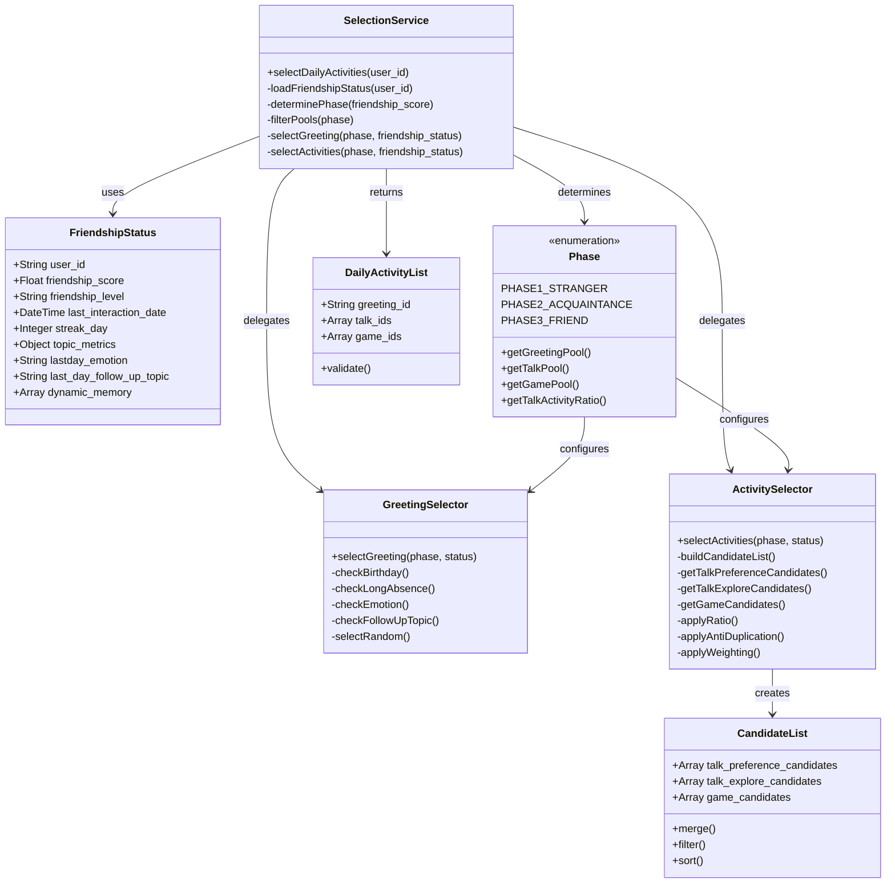

> 		Tài liệu Triển khai Kỹ thuật: Module Context Handling - Friendlyship Management


# 1. Tổng quan và Bối cảnh (Overview and Context)

Tài liệu này đặc tả chi tiết về mặt kỹ thuật cho việc xây dựng và tích hợp module **Context Handling**, với trọng tâm là quản lý trạng thái tình bạn (Friendship) và lựa chọn Agent (Talk/Game/Greeting) trong hệ sinh thái sản phẩm Pika. Module này là một phần của **Container 3: Context Handling** trong kiến trúc tổng thể, chịu trách nhiệm thu thập, xử lý, và duy trì tất cả dữ liệu liên quan đến người dùng và mối quan hệ của họ với Pika.

## 1.1. Mục tiêu Product

- **Tăng Retention và Engagement:** Tạo ra một mối quan hệ cá nhân hóa, sâu sắc và lâu dài giữa người dùng và Pika, khiến người dùng cảm thấy được thấu hiểu và quay trở lại thường xuyên.
- **Cá nhân hóa Trải nghiệm:** Chuyển đổi từ trải nghiệm "một cho tất cả" sang "một cho mỗi người", nơi các hoạt động, lời chào và chủ đề trò chuyện được điều chỉnh dựa trên lịch sử tương tác và mức độ thân thiết.
- **Tạo ra các khoảnh khắc "Aha!":** Khiến người dùng bất ngờ và thích thú khi Pika "nhớ" lại các chi tiết, sở thích, hoặc các sự kiện trong quá khứ, tạo ra một kết nối cảm xúc thực sự.

## 1.2. Thay đổi so với Thiết kế ban đầu

Dựa trên yêu cầu mới, luồng cập nhật điểm tình bạn (`friendship_score`) sẽ được thay đổi từ mô hình xử lý hàng loạt cuối ngày (batch processing) sang **mô hình xử lý theo thời gian thực (real-time processing)**.

> **Yêu cầu cốt lõi:** *"Sau khi kết thúc 1 cuộc hội thoại phía BE gửi user_id kèm log cho phía AI. Phía AI xử lý log luôn và tính điểm daily_score và code API phía BE để update điểm friendlyship_score."*

Điều này có nghĩa là `friendship_score` sẽ được cập nhật liên tục sau mỗi phiên tương tác, mang lại phản hồi tức thì về mức độ thân thiết và cho phép hệ thống điều phối (Orchestration) có được dữ liệu mới nhất để ra quyết định.

# 2. Thiết kế Kiến trúc Module và luồng giao tiếp với BE và AI khác

Để đáp ứng yêu cầu xử lý real-time, kiến trúc của module sẽ bao gồm ba thành phần chính: **Backend (BE) Service**, **AI Scoring Service**, và **Friendship Database**.

```mermaid
sequenceDiagram
    participant User as User
    participant BE as Backend Service
    participant AI as AI Scoring Service
    participant DB as Friendship Database

    User->>BE: End Conversation
    BE->>AI: POST /v1/scoring/calculate-friendship (user_id, conversation_log)
    activate AI
    AI-->>AI: 1. Phân tích log (tính total_turns, emotion, etc.)
    AI-->>AI: 2. Tính toán friendship_score_change
    deactivate AI
    AI->>BE: POST /v1/users/{user_id}/update-friendship (friendship_score_change, topic_metrics_change, ...)
    activate BE
    BE->>DB: 1. Read current friendship_status
    BE-->>BE: 2. Calculate new scores (friendship_score, topic_scores)
    BE-->>BE: 3. Update friendship_level, streak_day, etc.
    BE->>DB: 3. Write updated friendship_status
    deactivate BE
    BE-->>AI: Response: {success: true}
    AI-->>BE: Response: {success: true}

```



*Sơ đồ 1: Luồng cập nhật Friendship Score theo thời gian thực*

## 2.1 Luồng hoạt động:

1. **Kết thúc hội thoại:** Người dùng hoàn thành một phiên trò chuyện.
2. **BE gửi yêu cầu:** Backend Service gửi một yêu cầu (POST) đến AI Scoring Service, đính kèm `user_id` và toàn bộ `conversation_log` của phiên vừa kết thúc.
3. **AI tính toán:** AI Scoring Service nhận log, phân tích và tính toán ra một "điểm thay đổi" (`friendship_score_change`) cùng các chỉ số liên quan khác (ví dụ: sự thay đổi của `topic_score`).
4. **AI gọi BE để cập nhật:** AI Service gọi một API do BE cung cấp để gửi "điểm thay đổi" này.
5. **BE cập nhật vào DB:** BE nhận điểm thay đổi, đọc bản ghi `friendship_status` hiện tại từ Database, tính toán các giá trị mới, và ghi đè bản ghi đã cập nhật trở lại vào Database.


```
┌─────────────────────────────────────────────────────────────┐
│                    User Interaction                          │
└──────────────────────┬──────────────────────────────────────┘
                       │
                       ▼
        ┌──────────────────────────────┐
        │   Backend Service (BE)       │
        │  - Manage conversations      │
        │  - Trigger events            │
        └──────────────┬───────────────┘
                       │
                       ▼ POST /conversations/end
        ┌──────────────────────────────┐
        │   Event Queue (RabbitMQ)     │
        │  - Message persistence       │
        │  - Retry mechanism           │
        └──────────────┬───────────────┘
                       │
                       ▼
        ┌──────────────────────────────┐
        │   Background Worker          │
        │  - Consume events            │
        │  - Calculate scores          │
        │  - Update DB                 │
        │  - Cache candidates          │
        └──────────────┬───────────────┘
                       │
        ┌──────────────┴──────────────┐
        │                             │
        ▼                             ▼
┌──────────────────┐      ┌──────────────────┐
│  PostgreSQL DB   │      │   Redis Cache    │
│  - Friendship    │      │  - Candidates    │
│  - Agents        │      │  - TTL: 12h      │
└──────────────────┘      └──────────────────┘
```

Chi tiết hơn 
```
┌─────────────────────────────────────────────────────────┐
│ 1. POST /conversations/end                              │
│    - Frontend/Backend gửi request                       │
│    - Body: conversation_id, user_id, conversation_log   │
└──────────────────┬──────────────────────────────────────┘
                   │
                   ▼
┌─────────────────────────────────────────────────────────┐
│ 2. Save vào DB (conversation_events table)             │
│    - Status = PENDING                                   │
│    - Lưu conversation_log vào cột JSONB                │
└──────────────────┬──────────────────────────────────────┘
                   │
                   ▼
┌─────────────────────────────────────────────────────────┐
│ 3. Publish vào RabbitMQ Queue                          │
│    Message: {                                           │
│      conversation_id,                                   │
│      user_id,                                           │
│      bot_id,                                            │
│      conversation_log,  ← Có trong message             │
│      enqueued_at                                        │
│    }                                                    │
└──────────────────┬──────────────────────────────────────┘
                   │
                   ▼
┌─────────────────────────────────────────────────────────┐
│ 4. Return 202 Accepted                                 │
│    (Không đợi processing)                              │
└─────────────────────────────────────────────────────────┘

                   ═══════════════════════════════════

┌─────────────────────────────────────────────────────────┐
│ 5. Worker nhận message từ queue                        │
│    - Parse JSON → lấy conversation_id                   │
│    - conversation_log trong message KHÔNG được dùng    │
└──────────────────┬──────────────────────────────────────┘
                   │
                   ▼
┌─────────────────────────────────────────────────────────┐
│ 6. Query DB để lấy Event object                        │
│    - repo.get_by_conversation_id(conversation_id)      │
│    - Lấy event.id, status, metadata...                 │
└──────────────────┬──────────────────────────────────────┘
                   │
                   ▼
┌─────────────────────────────────────────────────────────┐
│ 7. Fetch conversation_log từ DB                        │
│    - ConversationDataFetchService.fetch_by_id()        │
│    - Lấy conversation_log từ cột JSONB trong DB        │
│    - conversation_log từ message BỊ BỎ QUA             │
└──────────────────┬──────────────────────────────────────┘
                   │
                   ▼
┌─────────────────────────────────────────────────────────┐
│ 8. Process scoring                                     │
│    - Tính friendship_score_change                      │
│    - Update friendship_status                           │
│    - Mark status = PROCESSED                           │
└─────────────────────────────────────────────────────────┘
```
## 2.2 Data Flow (5 Steps)

```
STEP 1: User ends conversation
  ↓
STEP 2: BE publishes event to RabbitMQ
  ↓
STEP 3: Worker consumes event
  ├─ Fetch conversation data
  ├─ Calculate friendship_score_change
  ├─ Update friendship_status in DB
  ├─ Update topic_metrics
  └─ Cache agent candidates (12h TTL)
  ↓
STEP 4: BE queries for suggested activities
  ├─ Check Redis cache
  ├─ Return cached candidates (< 100ms)
  └─ If miss, trigger recalculation
  ↓
STEP 5: User sees personalized activities
```


# 3. Thiết kế DB

Bảng friendship of user : user_id, friendship_score, friendship_level, last_interaction_date, streak_day, topic_metrics

Bảng friendship map with agent (3 loại: Gretting, Talk, Game/ACtivitity, )

Database Schema (3 Bảng)

## 7.1. Bảng chính 1: `friendship_status`

Lưu trạng thái tình bạn của user.

```sql
  

--- friendship_status

  

CREATE TABLE friendship_status (

    user_id VARCHAR(255) PRIMARY KEY,

    friendship_score FLOAT DEFAULT 0.0 NOT NULL,

    friendship_level VARCHAR(50) DEFAULT 'PHASE1_STRANGER' NOT NULL,

    -- PHASE1_STRANGER (0-99), PHASE2_ACQUAINTANCE (100-499), PHASE3_FRIEND (500+)

    last_interaction_date TIMESTAMP WITH TIME ZONE,
    
    birthday TIMESTAMP() WITH TIME ZONE,

    streak_day INTEGER DEFAULT 0 NOT NULL,
    
    last_emotion VARCHAR(50) NOT NULL,
    
    last_followup_topic VARCHAR(200) NOT NULL,

    topic_metrics JSONB DEFAULT '{}' NOT NULL,

    -- {

    --   "agent_movie": { "score": 52.0, "turns": 65, "last_date": "..." },

    --   "agent_animal": { "score": 28.5, "turns": 32, "last_date": "..." }

    -- }

    created_at TIMESTAMP WITH TIME ZONE DEFAULT CURRENT_TIMESTAMP,

    updated_at TIMESTAMP WITH TIME ZONE DEFAULT CURRENT_TIMESTAMP

);

  

-- Indexes

CREATE INDEX idx_friendship_score ON friendship_status(friendship_score);

CREATE INDEX idx_friendship_level ON friendship_status(friendship_level);

CREATE INDEX idx_updated_at ON friendship_status(updated_at DESC);
```

| Cột                     | Kiểu         | Mô tả                                                 |
| :---------------------- | :----------- | :---------------------------------------------------- |
| `user_id`               | VARCHAR(255) | Primary key, định danh duy nhất của user              |
| `friendship_score`      | FLOAT        | Điểm tình bạn (cập nhật sau mỗi phiên)                |
| `friendship_level`      | VARCHAR(50)  | PHASE1_STRANGER / PHASE2_ACQUAINTANCE / PHASE3_FRIEND |
| `last_interaction_date` | TIMESTAMP    | Lần tương tác cuối cùng                               |
| `streak_day`            | INTEGER      | Số ngày tương tác liên tiếp                           |
| `topic_metrics`         | JSONB        | Điểm và lịch sử tương tác cho mỗi topic               |
| `created_at`            | TIMESTAMP    | Thời điểm tạo record                                  |
| `updated_at`            | TIMESTAMP    | Thời điểm cập nhật cuối cùng                          |

**Ví dụ dữ liệu:**

```json
{
  "user_id": "user_123",
  "friendship_score": 785.5,
  "friendship_level": "PHASE2_ACQUAINTANCE",
  "last_interaction_date": "2025-11-25T18:30:00Z",
  "streak_day": 6,
  "topic_metrics": {
    "movie_talk": {
      "score": 1631.0,
      "turns": 105,
      "last_date": "2025-11-28T05:07:21.028732Z",
      "agents_used": [
        "agent_movie_talk_1"
      ],
      "friendship_topic_level": "PHASE1_STRANGER",
      "list_topic_type": [
        "TALK"
      ]
    },
    "puzzle_game": {
      "score": 100.0,
      "turns": 10,
      "last_date": "2025-11-28T08:35:20.583763Z",
      "agents_used": [
        "agent_puzzle_game_1"
      ],
      "friendship_topic_level": "PHASE1_STRANGER",
      "list_topic_type": [
        "GAME"
      ]
    },
    "movie_game": {
      "score": 50.0,
      "turns": 5,
      "last_date": "2025-11-28T10:00:00Z",
      "agents_used": [
        "agent_movie_game_1"
      ],
      "friendship_topic_level": "PHASE1_STRANGER",
      "list_topic_type": [
        "TALK",
        "GAME"
      ]
    }
  }
}
```

Dùng để: 
**Friendship Level Mapping:**

| Friendship Level    | Score Range | Description                           |
| :------------------ | :---------- | :------------------------------------ |
| PHASE1_STRANGER     | 0-499       | Just met, basic interaction           |
| PHASE2_ACQUAINTANCE | 500-2999    | Getting to know, moderate interaction |
| PHASE3_FRIEND       | 3000+       | Close friend, deep interaction        |

**Topic Level Mapping:**

| Topic Level         | Score Range | Condition                                   |
| :------------------ | :---------- | :------------------------------------------ |
| PHASE1_STRANGER     | < 50        | New topic                                   |
| PHASE2_ACQUAINTANCE | 50-149      | user_level >= PHASE2 AND topic_score >= 50  |
| PHASE3_FRIEND       | >= 150      | user_level >= PHASE3 AND topic_score >= 150 |


## 7.2. Bảng chính 2 : `agenda_agent_prompting`

Mapping giữa `friendship_level` và các Agent theo loại.

```sql
  
CREATE TABLE agenda_agent_prompting (
    id SERIAL PRIMARY KEY,

    topic_id VARCHAR(100) NOT NULL,
    -- Ví dụ: 'toy', 'school', 'special_day'

    agent_id VARCHAR(255) NOT NULL,
    -- Nên map với agent_prompting.agent_id (nếu đã có bảng đó)

    friendship_level VARCHAR(50) NOT NULL
        CHECK (friendship_level IN ('STRANGER', 'ACQUAINTANCE', 'FRIEND')),
    -- Phase quan hệ: STRANGER, ACQUAINTANCE, FRIEND

    talking_agenda TEXT,
    -- Nội dung agenda / note cho cách nói chuyện, có thể để NULL

    agent_tag VARCHAR(50) NOT NULL
        CHECK (agent_tag IN ('TALK', 'GAME', 'GREETING')),
    -- Loại agent: TALK / GAME / GREETING

    created_at TIMESTAMPTZ DEFAULT CURRENT_TIMESTAMP,
    updated_at TIMESTAMPTZ DEFAULT CURRENT_TIMESTAMP
);

-- Indexes hỗ trợ query
CREATE INDEX idx_agenda_topic
ON agenda_agent_prompting(topic_id);

CREATE INDEX idx_agenda_phase_type
ON agenda_agent_prompting(friendship_level, agent_tag);

CREATE INDEX idx_agenda_agent_id
ON agenda_agent_prompting(agent_id);


INSERT INTO agenda_agent_prompting (topic_id, agent_id, talking_agenda, friendship_level, agent_tag)
VALUES
('toy', 'agent_toy_1', NULL, 'STRANGER', 'TALK'),
('toy', 'agent_toy_2', NULL, 'ACQUAINTANCE', 'TALK'),
('toy', 'agent_toy_3', NULL, 'FRIEND', 'TALK'),
('school', 'agent_school_1', NULL, 'ACQUAINTANCE', 'GAME'),
('special_day', 'greeting_special_day_1', NULL, 'ACQUAINTANCE', 'GREETING');
```
  


## 7.4 Bảng phụ 2: conversation_events - để hứng conversation from BE send to

```sql

CREATE TABLE conversation_events (

-- Primary Key

id SERIAL PRIMARY KEY,

-- Identifiers

conversation_id VARCHAR(255) NOT NULL UNIQUE,

user_id VARCHAR(255) NOT NULL,

-- Bot Information

bot_type VARCHAR(50) NOT NULL

bot_id VARCHAR(255) NOT NULL,

bot_name VARCHAR(255) NOT NULL,

agent_tag VARCHAR(255) NULL,

-- Conversation Timing

start_time TIMESTAMP NOT NULL,

end_time TIMESTAMP NOT NULL,

duration_seconds INTEGER GENERATED ALWAYS AS (

EXTRACT(EPOCH FROM (end_time - start_time))::INTEGER

) STORED,

-- Processing results

friendship_score_change FLOAT,

new_friendship_level VARCHAR(50),

-- Add comment to document the structure
ADD COLUMN score_calculation_details JSONB NULL;

COMMENT ON COLUMN conversation_events.score_calculation_details IS

'JSONB storing detailed breakdown of friendship score cal.';

-- Conversation Data

conversation_log JSONB NOT NULL DEFAULT '[]',
raw_conversation_log JSONB NOT NULL DEFAULT '[]',

-- Status tracking

status VARCHAR(50) NOT NULL DEFAULT 'PENDING'

CHECK (status IN ('PENDING', 'PROCESSING', 'PROCESSED', 'FAILED', 'SKIPPED')),

attempt_count INTEGER NOT NULL DEFAULT 0,

-- Timing for processing

created_at TIMESTAMP NOT NULL DEFAULT CURRENT_TIMESTAMP,

next_attempt_at TIMESTAMP NOT NULL DEFAULT CURRENT_TIMESTAMP + INTERVAL '6 hours',

processed_at TIMESTAMP,

-- Error tracking (only when FAILED)

error_code VARCHAR(50),

error_details TEXT,


-- Timestamps

updated_at TIMESTAMP NOT NULL DEFAULT CURRENT_TIMESTAMP

);

  

-- Indexes for efficient querying

CREATE INDEX idx_conversation_events_status ON conversation_events(status);

CREATE INDEX idx_conversation_events_next_attempt ON conversation_events(next_attempt_at);

CREATE INDEX idx_conversation_events_user_id ON conversation_events(user_id);

CREATE INDEX idx_conversation_events_created_at ON conversation_events(created_at);

CREATE INDEX idx_conversation_events_bot_type ON conversation_events(bot_type);

CREATE INDEX idx_conversation_events_bot_id ON conversation_events(bot_id);

  

-- Composite index for common queries

CREATE INDEX idx_conversation_events_status_next_attempt

ON conversation_events(status, next_attempt_at);

  

-- GIN index for JSONB queries

CREATE INDEX idx_conversation_events_log_gin

ON conversation_events USING GIN (conversation_log);

  

```

### Columns Chi Tiết

| Column                      | Type         | Mô Tả                                             | Ghi Chú                 |
| :-------------------------- | :----------- | :-------------------------------------------------- | :----------------------- |
| `id`                      | SERIAL       | Primary key                                         | Auto-increment           |
| `conversation_id`         | VARCHAR(255) | ID conversation                                     | UNIQUE, required         |
| `user_id`                 | VARCHAR(255) | ID user                                             | Required, indexed        |
| `bot_type`                | VARCHAR(50)  | GREETING / TALK / GAME_ACTIVITY                     | Required, checked        |
| `bot_id`                  | VARCHAR(255) | ID của bot                                         | Required                 |
| `bot_name`                | VARCHAR(255) | Tên của bot                                       | Required                 |
| `start_time`              | TIMESTAMP    | Thời điểm bắt đầu                             | Required                 |
| `end_time`                | TIMESTAMP    | Thời điểm kết thúc                             | Required                 |
| `duration_seconds`        | INTEGER      | Thời lượng (giây)                               | Generated, calculated    |
| `conversation_log`        | JSONB        | Toàn bộ log conversation                          | Required, default: []    |
| `status`                  | VARCHAR(50)  | PENDING / PROCESSING / PROCESSED / FAILED / SKIPPED | Default: PENDING         |
| `attempt_count`           | INTEGER      | Số lần đã xử lý                               | Default: 0, max: 5       |
| `created_at`              | TIMESTAMP    | Khi được lưu                                    | Auto                     |
| `next_attempt_at`         | TIMESTAMP    | Thời điểm xử lý tiếp theo                     | Default: created_at + 6h |
| `processed_at`            | TIMESTAMP    | Khi xử lý thành công                            | Null nếu chưa          |
| `error_code`              | VARCHAR(50)  | Code lỗi                                           | Null nếu thành công   |
| `error_details`           | TEXT         | Chi tiết lỗi                                      | Null nếu thành công   |
| `friendship_score_change` | FLOAT        | Điểm thay đổi                                   | Null nếu chưa xử lý  |
| `new_friendship_level`    | VARCHAR(50)  | Level mới                                          | Null nếu chưa xử lý  |
| `updated_at`              | TIMESTAMP    | Cập nhật lần cuối                               | Auto                     |

```
## Ví dụ 1: PENDING Status

```json
{
  "id": 1,
  "conversation_id": "conv_abc123xyz",
  "user_id": "user_123",
  "bot_type": "TALK",
  "bot_id": "talk_movie_preference",
  "bot_name": "Movie Preference",
  "start_time": "2025-11-25T18:00:00Z",
  "end_time": "2025-11-25T18:20:00Z",
  "duration_seconds": 1200,
  "conversation_log": [
    {
      "turn_id": 1,
      "speaker": "bot",
      "text": "What's your favorite movie genre?",
      "timestamp": "2025-11-25T18:00:05Z"
    },
    {
      "turn_id": 2,
      "speaker": "user",
      "text": "I love anime, especially Studio Ghibli",
      "timestamp": "2025-11-25T18:00:15Z"
    },
    {
      "turn_id": 3,
      "speaker": "bot",
      "text": "Oh, Studio Ghibli is amazing! Have you seen Spirited Away?",
      "timestamp": "2025-11-25T18:00:25Z"
    }
  ],
  "status": "PENDING",
  "attempt_count": 0,
  "created_at": "2025-11-25T18:30:00Z",
  "next_attempt_at": "2025-11-26T00:30:00Z",
  "processed_at": null,
  "error_code": null,
  "error_details": null,
  "friendship_score_change": null,
  "new_friendship_level": null,
  "updated_at": "2025-11-25T18:30:00Z"
}
```


Logic mới sẽ là: 
1. Dựa vào level của bảng: `friendship_status` + Check xem ngày hôm đó có gì đặc biệt không: => Vào bảng `agenda_agent_prompting` để lấy GREETING tương ứng. 
   
2. Sau đó vẫn giữ logic cũ : dựa vào check điểm trong bảng `friendship_status` => để tính toán các bài TALK, GAME như logic cũ 


# 4. Thiết kế API SPECIFICATIONS

## 4.1 API 1: Notify Conversation End (BE → Context Service)

**Endpoint:** `POST /v1/conversations/end`

**Request:**
```json
{
  "user_id": "user_123",
  "conversation_id": "conv_abc123xyz",
  "bot_id": "agent_movie_talk_1",
  "bot_type": "TALK",
  "bot_name": "Movie Preference Talk",
  "start_time": "2025-11-26T10:00:00Z",
  "end_time": "2025-11-26T10:20:00Z",
  "conversation_log": [
    {
      "character": "USER",
      "content": "I like action movies"
    },
    {
      "character": "BOT",
      "content": "That's cool! What about..."
    }
  ]
}
```

**Response (202 Accepted):**
```json
{
  "status": "accepted",
  "message": "Conversation event queued for processing",
  "conversation_id": "conv_abc123xyz",
  "next_attempt_at": "2025-11-26T16:20:00Z"
}
```

---

## 4.2 API 2: Get Friendship Status

**Endpoint:** `POST /v1/friendship/status`

**Request:**
```json
{
  "user_id": "user_123"
}
```

**Response (200 OK):**
```json
{
  "user_id": "user_123",
  "friendship_score": 785.5,
  "friendship_level": "PHASE2_ACQUAINTANCE",
  "last_interaction_date": "2025-11-26T10:20:00Z",
  "streak_day": 6,
  "topic_metrics": { ... }
}
```

---

## 4.3 API 3: Suggest Activities (BE → Context Service)

**Endpoint:** `POST /v1/activities/suggest`

**Request:**
```json
{
  "user_id": "user_123"
}
```

**Response (200 OK):**
```json
{
  "greeting_agent": {
    "agent_id": "greeting_normal_1",
    "agent_tag": "GREETING"
  },
  "talk_agents": [
    {
      "topic_id": "movie_talk",
      "agent_id": "agent_movie_talk_1",
      "agent_tag": "TALK",
      "friendship_topic_level": "PHASE1_STRANGER"
    },
    { ... },
    { ... }
  ],
  "game_agents": [
    {
      "topic_id": "puzzle_game",
      "agent_id": "agent_puzzle_game_1",
      "agent_tag": "GAME_ACTIVITY",
      "friendship_topic_level": "PHASE1_STRANGER"
    },
    { ... }
  ],
  "total_agents": 6,
  "cached_at": "2025-11-26T10:20:00Z",
  "cache_ttl_seconds": 43200
}
```


## 4.4 API Detail Implementation 

| API                                                            | Ai gọi | Khi nào                     | Mục đích chính                                       |
| -------------------------------------------------------------- | ------ | --------------------------- | ---------------------------------------------------- |
| `GET /v1/health`                                               | BE     | Khởi động, monitoring       | Kiểm tra service sống                                |
| `POST /v1/conversations/end`                                   | BE     | Kết thúc mỗi cuộc hội thoại | Gửi log để AI chấm điểm & cập nhật friendship        |
| `POST /v1/activities/suggest`                                  | BE     | Bắt đầu phiên mới           | Lấy danh sách agent (Greeting/Talk/Game) cá nhân hoá |
| `GET /v1/conversations/{id}`                                   | Dev/QA | Debug                       | Xem log hội thoại                                    |
| `POST /v1/friendship_status/calculate-score/{conversation_id}` | Dev/QA | Debug                       | Tính thử score 1 cuộc hội thoại                      |
| `POST /v1/friendship_status/calculate-score-and-update`        | Dev/QA | Debug/manual                | Tính & update friendship cho 1 user + conversation   |

### 1. Health check

```
curl -X 'GET' \
  'http://localhost:30020/v1/health' \
  -H 'accept: application/json'
```


### 2. From conversation_id -> calculate score -> update friendship_status:

```
#### 2.1 Test GET conversation
curl -X GET "http://localhost:8000/v1/conversations/conv_id_2003doanngoccuong" \
  -H "Content-Type: application/json"

#### 2.2 Test POST calculate score
curl -X POST "http://localhost:8000/v1/friendship_status/calculate-score/conv_id_2003doanngoccuong" \
  -H "Content-Type: application/json"

#### 2.3 Test POST update friendship_status
curl -X POST "http://localhost:8000/v1/friendship_status/calculate-score-and-update" \
  -H "Content-Type: application/json" \
  -d '{
    "user_id": "user_doanngoccuong",
    "conversation_id": "conv_id_2003doanngoccuong"
  }'
```

### 3. From user_id -> get suggested activities:

1. Với 2 dạng này => Ko lưu vào DB luôn.
	- bot_type = null, agent_tag=null
	- bot_type=NEXT_LESSON

2. Logic mới chỉ xử lý Scoring với 
	- Chỉ xử lý scoring: bot_type = AGENT_GREETING or có  agent_tag
	- Bỏ logic NEXT_LESSON cũ 


```
curl -X POST "http://localhost:8000/v1/activities/suggest" \
  -H "Content-Type: application/json" \
  -d '{
    "user_id": "user_doanngoccuong"
  }'
```

```
{
  "success": true,
  "data": {
    "user_id": "user_doanngoccuong",
    "friendship_level": "PHASE1_STRANGER",
    "greeting_agent": {
      "agent_id": "general_greeting",
      "agent_name": "General Greeting",
      "agent_tag": "GREETING",
      "agent_description": "{{CURRENT_EVENT}}",
      "final_prompt": "",
      "reason": "Phase default greeting",
      "metadata": {
        "topic_id": "general_greeting"
      }
    },
    "talk_agents": [
      {
        "agent_id": "agent_daily_routine",
        "agent_name": "Agent Daily Routine",
        "agent_tag": "TALK",
        "agent_description": "\"4. OPENING GUIDE (DAILY ROUTINE)",
        "final_prompt": "",
        "reason": "Phase fallback",
        "metadata": {
          "topic_id": "Daily_Routine "
        }
      },
      {
        "agent_id": "agent_game",
        "agent_name": "Agent Game",
        "agent_tag": "TALK",
        "agent_description": "4. OPENING GUIDE (HOBBY)",
        "final_prompt": "",
        "reason": "Phase fallback",
        "metadata": {
          "topic_id": "Game"
        }
      },
      {
        "agent_id": "agent_hobby_general ",
        "agent_name": "Agent Hobby General ",
        "agent_tag": "TALK",
        "agent_description": "4. OPENING GUIDE (HOBBY)",
        "final_prompt": "",
        "reason": "Phase fallback",
        "metadata": {
          "topic_id": "Hobby General"
        }
      }
    ],
    "game_agents": [
      {
        "agent_id": "agent_story_telling",
        "agent_name": "Agent Story Telling",
        "agent_tag": "GAME",
        "agent_description": "4. LỘ TRÌNH TRÒ CHUYỆN HÔM NAY (TODAY'S TALKING AGENDA): GAME \"CÙNG NHAU SÁNG TẠO CÂU CHUYỆN\"",
        "final_prompt": "",
        "reason": "Phase activity",
        "metadata": {
          "topic_id": "story"
        }
      },
      {
        "agent_id": "agent_play_game",
        "agent_name": "Agent Play Game",
        "agent_tag": "GAME",
        "agent_description": "4. TODAY'S TALKING AGENDA): GAME \"ĐỐ BIẾT TỪ GÌ\"",
        "final_prompt": "",
        "reason": "Phase activity",
        "metadata": {
          "topic_id": "trò đố từ"
        }
      }
    ]
  },
  "message": "Activities suggested successfully"
}
```
### 4. Trigger conversation_events:

```bash
curl --location 'http://localhost:30080/v1/conversations/end' \
--header 'accept: application/json' \
--header 'Content-Type: application/json' \
--data '{
  "conversation_id": "convc_1cxxcc23__",
  "user_id": "user_doanngoccuong",      
  "bot_id": "agent_pet",
  "bot_name": "Movie Preference Talk",
  "bot_type": "dd",
  "conversation_logs": [
    {
      "character": "BOT_RESPONSE_CONVERSATION",
      "content": ""
    },
    {
      "character": "BOT_RESPONSE_CONVERSATION",
      "content": "BEEP BEEP! Đã đến Trái Đất!"
    },
    {
      "character": "BOT_RESPONSE_CONVERSATION",
      "content": ""
    },
    {
      "character": "BOT_RESPONSE_CONVERSATION",
      "content": "Quả là một hành trình thú vị từ sao Hỏa."
    }
  ],
  "end_time": "2025-11-26T10:20:00Z",
  "start_time": "2025-11-26T10:00:00Z",
  "status": "PENDING"
}'
```

```bash
{

    "success": true,

    "message": "Conversation event accepted for processing",

    "data": {

        "id": 117,

        "conversation_id": "convc_1cxxcc23__",

        "user_id": "user_doanngoccuong",

        "bot_type": "dd",

        "bot_id": "agent_pet",

        "bot_name": "Movie Preference Talk",

        "start_time": "2025-11-26T10:00:00",

        "end_time": "2025-11-26T10:20:00",

        "duration_seconds": 1200,

        "conversation_log": [

            {

                "text": "BEEP BEEP! Đã đến Trái Đất!",

                "speaker": "pika",

                "turn_id": 1,

                "timestamp": "2025-11-26T10:05:00+00:00Z"

            },

            {

                "text": "Quả là một hành trình thú vị từ sao Hỏa.",

                "speaker": "pika",

                "turn_id": 2,

                "timestamp": "2025-11-26T10:15:00+00:00Z"

            }

        ],

        "raw_conversation_log": [

            {

                "content": "",

                "character": "BOT_RESPONSE_CONVERSATION"

            },

            {

                "content": "BEEP BEEP! Đã đến Trái Đất!",

                "character": "BOT_RESPONSE_CONVERSATION"

            },

            {

                "content": "",

                "character": "BOT_RESPONSE_CONVERSATION"

            },

            {

                "content": "Quả là một hành trình thú vị từ sao Hỏa.",

                "character": "BOT_RESPONSE_CONVERSATION"

            }

        ],

        "status": "PROCESSED",

        "attempt_count": 1,

        "created_at": "2025-11-27T17:22:15.224609",

        "next_attempt_at": "2025-11-27T17:22:17.488880",

        "processed_at": "2025-11-27T17:22:17.488880",

        "error_code": null,

        "error_details": null,

        "friendship_score_change": 0.5,

        "new_friendship_level": "PHASE1_STRANGER",

        "updated_at": "2025-11-27T17:22:17.488880"

    }

}
```


---
# 5. Logic Xử lý Scoring và Selection

## 5.1 Visulize: Mermaid Diagrams: Logic Chọn Talk/Game-Agent Đầu Ngày


#### 1️⃣ Flowchart Tổng Quan - Quy Trình Lựa Chọn Hoàn Chỉnh

```mermaid
flowchart TD
    Start([Người dùng mở app đầu ngày]) --> Input[Input: user_id]
    Input --> Step1[Bước 1: Tải dữ liệu<br/>& Xác định Phase]
  
    Step1 --> LoadData[Tải friendship_status<br/>từ DB]
    LoadData --> DeterminePhase{Xác định Phase<br/>dựa trên friendship_score}
  
    DeterminePhase -->|score < 500| Phase1[Phase 1: PHASE1_STRANGER]
    DeterminePhase -->|500 ≤ score ≤ 3000| Phase2[Phase 2: PHASE2_ACQUAINTANCE]
    DeterminePhase -->|score > 3000| Phase3[Phase 3: PHASE3_FRIEND]
  
    Phase1 --> Step2[Bước 2: Lọc Kho Hoạt Động]
    Phase2 --> Step2
    Phase3 --> Step2
  
    Step2 --> FilterPools[Giới hạn kho theo Phase:<br/>- Greeting Pool<br/>- Talk Agent Pool<br/>- Game/Activity Pool]
  
    FilterPools --> Step3[Bước 3: Chọn 1 Greeting]
    Step3 --> GreetingLogic[Priority-Based Selection<br/>Birthday → Long Absence → Emotion → Follow-up → Random]
    GreetingLogic --> GreetingSelected[greeting_id được chọn]
  
    GreetingSelected --> Step4[Bước 4: Chọn 3 Talk + 2 Game]
    Step4 --> BuildCandidates[4a. Tạo danh sách ứng viên]
  
    BuildCandidates --> Pref[Ứng viên sở thích<br/>2 Talk: topic_score cao nhất]
    BuildCandidates --> Explore[Ứng viên khám phá<br/>1 Talk: total_turns thấp nhất]
    BuildCandidates --> Game[Ứng viên Game<br/>1 Game: topic_score cao nhất<br/>1 Game: total_turns thấp nhất]
  
    Pref --> Assemble[4b. Lắp ráp danh sách cuối cùng]
    Explore --> Assemble
    Game --> Assemble
  
    Assemble --> ApplyRatio[Áp dụng tỷ lệ Talk:Game<br/>60:40 (3 Talk + 2 Game)]
    ApplyRatio --> AntiDup[Áp dụng bộ lọc chống lặp]
    AntiDup --> WeightPriority[Ưu tiên theo trọng số]
  
    WeightPriority --> Select5[Chọn 5 activity_id<br/>3 Talk + 2 Game]
  
    Select5 --> Step5[Bước 5: Trả về kết quả]
    Step5 --> Output[Output: 1 greeting_id<br/>+ 3 talk_id<br/>+ 2 game_id<br/>Tổng: 6 agents]
    Output --> End([Kết thúc])
  
    style Start fill:#e1f5e1
    style End fill:#ffe1e1
    style Phase1 fill:#fff4e1
    style Phase2 fill:#e1f0ff
    style Phase3 fill:#f0e1ff
    style Output fill:#e1ffe1
```

---

#### 2️⃣ Flowchart Chi Tiết - Xác Định Phase

```mermaid
flowchart LR
    Start([Input: user_id]) --> Load[Tải friendship_status<br/>từ Database]
    Load --> GetScore[Lấy friendship_score]
  
    GetScore --> Check{Kiểm tra<br/>friendship_score}
  
    Check -->|< 500| P1["<b>Phase 1: PHASE1_STRANGER</b><br/>━━━━━━━━━━<br/>Kho Greeting: V1<br/>Talk: Bề mặt<br/>Game: Đơn giản<br/>Tỷ lệ Talk:Game = 60:40"]
    Check -->|500-3000| P2["<b>Phase 2: PHASE2_ACQUAINTANCE</b><br/>━━━━━━━━━━<br/>Kho Greeting: V1+V2<br/>Talk: +Trường học, Bạn bè<br/>Game: +Cá nhân hóa<br/>Tỷ lệ Talk:Game = 60:40"]
    Check -->|> 3000| P3["<b>Phase 3: PHASE3_FRIEND</b><br/>━━━━━━━━━━<br/>Kho Greeting: V1+V2+V3<br/>Talk: +Gia đình, Lịch sử<br/>Game: +Dự án chung<br/>Tỷ lệ Talk:Game = 60:40"]
  
    P1 --> Output([Phase đã xác định])
    P2 --> Output
    P3 --> Output
  
    style Start fill:#e1f5e1
    style Output fill:#e1ffe1
    style P1 fill:#fff4e1
    style P2 fill:#e1f0ff
    style P3 fill:#f0e1ff
```



---

#### 3️⃣ Flowchart Chi Tiết - Chọn Greeting (Priority-Based)

```mermaid
flowchart TD
    Start([Bắt đầu chọn Greeting]) --> Input[Input: Phase + friendship_status]
  
    Input --> Check1{Kiểm tra:<br/>user.birthday<br/>== hôm nay?}
  
    Check1 -->|Có| G1["✓ Chọn Greeting:<br/>S2 Birthday<br/>(Mừng sinh nhật)"]
    Check1 -->|Không| Check2{Kiểm tra:<br/>last_interaction_date<br/>cách đây > 7 ngày?}
  
    Check2 -->|Có| G2["✓ Chọn Greeting:<br/>S4 Returning After<br/>Long Absence<br/>(Chào mừng quay lại)"]
    Check2 -->|Không| Check3{Kiểm tra:<br/>lastday_emotion<br/>== sad?}
  
    Check3 -->|Có| G3["✓ Chọn Greeting:<br/>Agent hỏi cảm xúc<br/>(Quan tâm đến cảm xúc)"]
    Check3 -->|Không| Check4{Kiểm tra:<br/>last_day_follow_up_topic<br/>tồn tại?}
  
    Check4 -->|Có| G4["✓ Chọn Greeting:<br/>Agent follow up topic<br/>(Tiếp tục chủ đề hôm trước)"]
    Check4 -->|Không| Default["Chọn ngẫu nhiên<br/>từ kho Greeting của Phase<br/>ưu tiên chưa dùng gần đây"]
  
    G1 --> Output([greeting_id])
    G2 --> Output
    G3 --> Output
    G4 --> Output
    Default --> Output
  
    style Start fill:#e1f5e1
    style Output fill:#e1ffe1
    style G1 fill:#ffe1e1
    style G2 fill:#ffe1e1
    style G3 fill:#ffe1e1
    style G4 fill:#ffe1e1
    style Default fill:#fff4e1
```



---

#### 4️⃣ Flowchart Chi Tiết - Tạo Danh Sách Ứng Viên

```mermaid
flowchart TD
    Start([Bắt đầu tạo<br/>danh sách ứng viên]) --> Input[Input: Phase +<br/>friendship_status +<br/>topic_metrics]
  
    Input --> Parallel{Tạo ứng viên<br/>từ 3 nguồn chính}
  
    Parallel --> Source1[Nguồn 1: Talk Sở thích]
    Parallel --> Source2[Nguồn 2: Talk Khám phá]
    Parallel --> Source3[Nguồn 3: Game]
  
    Source1 --> S1Process["Lấy 2 Talk Agent có<br/>topic_score cao nhất<br/>từ topic_metrics<br/>━━━━━━━━━━<br/>Ví dụ: movie(120), school(80)<br/>→ Chọn: movie, school"]
  
    Source2 --> S2Process["Lấy 1 Talk Agent có<br/>total_turns thấp nhất<br/>từ kho Talk của Phase<br/>━━━━━━━━━━<br/>Ví dụ: toy(0 turns)<br/>→ Chọn: toy"]
  
    Source3 --> S3Process["Lấy 2 Game Agent:<br/>1 Game: topic_score cao nhất<br/>1 Game: total_turns thấp nhất<br/>━━━━━━━━━━<br/>Ví dụ: puzzle(50), drawing(0)<br/>→ Chọn: puzzle, drawing"]
  
    S1Process --> Merge[Gộp tất cả ứng viên]
    S2Process --> Merge
    S3Process --> Merge
  
    Merge --> CandidateList(["Danh sách ứng viên<br/>hoàn chỉnh<br/>━━━━━━━━━━<br/>3 Talk + 2 Game<br/>Tổng: 5 agents"])
  
    style Start fill:#e1f5e1
    style CandidateList fill:#e1ffe1
    style S1Process fill:#e1f0ff
    style S2Process fill:#fff4e1
    style S3Process fill:#f0e1ff
```



---


#### 6️⃣ Sequence Diagram - Toàn Bộ Quy Trình

```mermaid
sequenceDiagram
    participant User as Người dùng
    participant App as Ứng dụng
    participant Service as Selection Service
    participant DB as Database
    participant GreetingPool as Greeting Pool
    participant ActivityPool as Talk/Game Pool
  
    User->>App: Mở app đầu ngày
    App->>Service: Gọi với user_id
  
    rect rgb(230, 245, 255)
        Note over Service,DB: BƯỚC 1: Tải dữ liệu & Xác định Phase
        Service->>DB: Query friendship_status(user_id)
        DB-->>Service: Trả về friendship_status
        Service->>Service: Tính Phase từ friendship_score
    end
  
    rect rgb(255, 245, 230)
        Note over Service,ActivityPool: BƯỚC 2: Lọc Kho Hoạt Động
        Service->>GreetingPool: Lọc theo Phase
        GreetingPool-->>Service: Kho Greeting khả dụng
        Service->>ActivityPool: Lọc theo Phase
        ActivityPool-->>Service: Kho Talk/Game khả dụng
    end
  
    rect rgb(230, 255, 230)
        Note over Service,GreetingPool: BƯỚC 3: Chọn 1 Greeting
        Service->>Service: Kiểm tra điều kiện ưu tiên
        alt Birthday
            Service->>GreetingPool: Lấy S2 (Birthday)
        else Long Absence
            Service->>GreetingPool: Lấy S4 (Returning)
        else Sad Emotion
            Service->>GreetingPool: Lấy Agent hỏi cảm xúc
        else Follow-up Topic
            Service->>GreetingPool: Lấy Agent follow-up
        else Default
            Service->>GreetingPool: Lấy ngẫu nhiên
        end
        GreetingPool-->>Service: greeting_id
    end
  
    rect rgb(255, 230, 245)
        Note over Service,ActivityPool: BƯỚC 4: Chọn 3 Talk + 2 Game
        Service->>DB: Query topic_metrics
        DB-->>Service: Trả về topic_metrics
        Service->>Service: Tạo danh sách ứng viên (3 Talk + 2 Game)
        Service->>Service: Áp dụng tỷ lệ Talk:Game
        Service->>Service: Áp dụng bộ lọc chống lặp
        Service->>Service: Sắp xếp theo trọng số
        Service->>ActivityPool: Lấy 5 activity_id
        ActivityPool-->>Service: 5 activity_id (3 Talk + 2 Game)
    end
  
    rect rgb(245, 230, 255)
        Note over Service,App: BƯỚC 5: Trả về kết quả
        Service->>Service: Lắp ráp danh sách cuối cùng
        Service-->>App: [greeting_id, talk_id_1, talk_id_2, talk_id_3, game_id_1, game_id_2]
        App-->>User: Hiển thị trải nghiệm cá nhân hóa
    end
```



---


---

#### 8️⃣ Class Diagram - Cấu Trúc Dữ Liệu



---

#### 📊 TOPIC LEVEL MAPPING

```mermaid
graph TD
    A["Topic Score Level"] --> B["PHASE1_STRANGER<br/>topic_score < 50"]
    A --> C["PHASE2_ACQUAINTANCE<br/>50 ≤ topic_score < 150"]
    A --> D["PHASE3_FRIEND<br/>topic_score ≥ 150"]
    
    E["Điều kiện nâng cấp"] --> F["Topic → PHASE2:<br/>topic_score ≥ 50<br/>AND user_level ≥ PHASE2"]
    E --> G["Topic → PHASE3:<br/>topic_score ≥ 150<br/>AND user_level ≥ PHASE3"]
    
    style B fill:#fff4e1
    style C fill:#e1f0ff
    style D fill:#f0e1ff
    style F fill:#ffe1e1
    style G fill:#ffe1e1
```



---


## 5.2. Logic tính điểm (Scoring Logic - Real-time)

Logic này được thực thi trong **AI Scoring Service** sau mỗi cuộc hội thoại, dựa trên `Tài liệu 2` nhưng được điều chỉnh cho phù hợp.

1. **Thu thập chỉ số từ `conversation_log`:**

   * `total_turns`: Tổng số lượt trò chuyện trong phiên. = Logic đếm tổng số turn của user và pika / 2 => `base_score = total_turns * 0.5`
   * Dùng 2 llms + 1 API extract memory có sẵn => chạy 3 cái song song để tính : 
	   * `user_initiated_questions`: Số lần người dùng chủ động hỏi Pika. =>  `engagement_bonus = (user_initiated_questions * 3)`  => * `emotion_bonus`: +15 cho 'interesting', -15 cho 'boring'.
	   * `session_emotion`: Cảm xúc chủ đạo của phiên (ví dụ: 'interesting', 'boring').
	   * `new_memories_count`: Số ký ức mới được tạo trong phiên. =>    * `memory_bonus = new_memories_count * 5`  
   Sử dụng API extract từ phía Memory Mem0 
   	     

=>   * **`friendship_score_change`** = `base_score + engagement_bonus + emotion_bonus + memory_bonus`

   * `topic_details`: Chi tiết tương tác cho từng topic (số turn, số câu hỏi). 
=> check xem agent_id đang sử dụng thuộc topic nào => sử dụng chỉ số total_turns và score vừa tính được để cộng cho topic_total_turns và topic_score của topic đó. 

```
friendship_score_change = 
    base_score 
    + (total_turns * 0.5)
    + (user_initiated_questions * 3)
    + emotion_bonus  // +15 for 'interesting', -15 for 'boring'
    + (new_memories_count * 5)
```

```
Conversation logs:
- 4 BOT_RESPONSE (pika)
- 3 USER_RESPONSE (user)
- Total content length: 250 characters
- Bot type: TALK
- Emotion: interesting

Tính toán:
- Base score: 15
- Turn bonus (4 × 0.5): 2
- User questions bonus (3 × 3): 9
- Emotion bonus: 15
- Length bonus (250 / 100): 2.5
- Total: 15 + 2 + 9 + 15 + 2.5 = 43.5 điểm
```

API extract memory 
```
curl --location 'http://103.253.20.30:6699/extract_facts' \
--header 'accept: application/json' \
--header 'Content-Type: application/json' \
--data '{
  "user_id": "user_test_1",
  "conversation_id": "1",
  "conversation": [
  {
    "role": "assistant",
    "content": "Chàooo cậu! Pika nhớ cậu lắm đó! Cậu giới thiệu về bản thân đi"
  },
  {
    "role": "user",
    "content": "Tên tôi là Đào Minh Đức và hiện tôi đang học lớp 4. Tôi rất thích chơi bóng đá, thường chơi trong một đội có nhiều bạn bè, và tôi cũng cực kỳ thích những chuyến đi dài. Về phim ảnh, hãy nhớ rằng tôi là fan của Kung Fu Panda và đặc biệt thích nhân vật Po.Về các trải nghiệm và hoạt động, tôi đã từng đi du lịch Nha Trang, từng chơi một trò chơi khó đến nỗi suýt nản, và có một trải nghiệm là không thể nhìn thấy cá. Hiện tại, tôi đang tham gia một hoạt động học tập và đang lên kế hoạch tổ chức một buổi tiệc nướng BBQ với gia đình. Ngoài ra, hãy lưu ý các kiến thức mà tôi quan tâm: tôi biết rằng thiên hà Andromeda đang lao vào dải Ngân Hà và thiên hà lớn nhất là IC 1101. Hãy lưu lại tất cả những điều này vào bộ nhớ giúp tôi."
  }
]}'
```

```
{

    "status": "ok",

    "count": 3,

    "facts": [

        {

            "id": "f7acc070-9069-4dae-8277-976ce323d461",

            "user_id": "user_test_1",

            "source": "conversation",

            "fact_type": null,

            "fact_value": "Đào Minh Đức loves playing football",

            "metadata": {},

            "operation": "ADD",

            "score": 0.0

        },

        {

            "id": "f680f7ed-0542-40ae-841f-2837dd2b882d",

            "user_id": "user_test_1",

            "source": "conversation",

            "fact_type": null,

            "fact_value": "Đào Minh Đức is a fan of Kung Fu Panda and especially likes the character Po.",

            "metadata": {},

            "operation": "ADD",

            "score": 0.0

        },

        {

            "id": "32690682-049d-4e67-bf48-fb4d02effe84",

            "user_id": "user_test_1",

            "source": "conversation",

            "fact_type": null,

            "fact_value": "Đào Minh Đức knows that the Andromeda galaxy is moving towards the Milky Way and that the largest galaxy is IC 1101.",

            "metadata": {},

            "operation": "ADD",

            "score": 0.0

        }

    ]

}
```


```python
# Parallel processing: Run 3 LLMs + 1 API simultaneously

1. Total Turns
   - Đếm tổng số lượt trò chuyện: (BOT_RESPONSE + USER_RESPONSE) / 2
   - base_score = total_turns × 0.5

2. User Initiated Questions (LLM 1)
   - Số lần user chủ động hỏi Pika
   - engagement_bonus = user_initiated_questions × 3

3. Session Emotion (LLM 2)
   - Cảm xúc chủ đạo của phiên: 'interesting', 'boring', 'neutral'
   - emotion_bonus = +15 (interesting) or -15 (boring) or 0 (neutral)

4. New Memories (API: Mem0 extract_facts)
   - Số ký ức mới được tạo trong phiên
   - memory_bonus = new_memories_count × 5
```

##### Friendship Score Change Formula

```
friendship_score_change = 
    base_score(agent_tag)
    + (total_turns × 0.5)
    + (user_initiated_questions × 3)
    + emotion_bonus  // +15 for 'interesting', -15 for 'boring'
    + (new_memories_count × 5)
```

**Detailed Breakdown:**

| Component | Formula | Example |
| :--- | :--- | :--- |
| Base Score | TALK: 15, GAME: 20, GREETING: 5 | TALK = 15 |
| Turn Bonus | total_turns × 0.5 | 4 turns × 0.5 = 2 |
| Engagement | user_initiated_questions × 3 | 3 questions × 3 = 9 |
| Emotion | +15 (interesting), -15 (boring), 0 (neutral) | interesting = +15 |
| Memory | new_memories_count × 5 | 0 memories × 5 = 0 |
| **Total** | **Sum of all** | **15 + 2 + 9 + 15 + 0 = 41** |

**Example Calculation:**
```
Conversation logs:
- 4 BOT_RESPONSE (Pika)
- 3 USER_RESPONSE (User)
- Bot type: TALK
- Emotion: interesting
- New memories: 0

Calculation:
- Base score: 15
- Turn bonus (4 × 0.5): 2
- User questions bonus (3 × 3): 9
- Emotion bonus: 15
- Memory bonus (0 × 5): 0
- Total: 15 + 2 + 9 + 15 + 0 = 41 điểm
```

#### Extract Memory API (Mem0)

```bash
curl -X POST 'http://mem0-api:6699/extract_facts' \
  -H 'Content-Type: application/json' \
  -d '{
    "user_id": "user_123",
    "conversation_id": "conv_abc123xyz",
    "conversation": [
      {"role": "assistant", "content": "..."},
      {"role": "user", "content": "..."}
    ]
  }'
```

**Response:**
```json
{
  "status": "ok",
  "count": 3,
  "facts": [
    {
      "id": "f7acc070-9069-4dae-8277-976ce323d461",
      "user_id": "user_123",
      "fact_value": "User loves playing football",
      "operation": "ADD",
      "score": 0.0
    },
    ...
  ]
}
```

### 5.1.1: Cập nhật topic_metrics 
#### Step 1: Sau khi tính điểm => Xác Định Topic Của Bot
**Logic:**

```python
def get_topic_from_bot_id(bot_id):
    """
    Query bảng agenda_agent_prompting
    để tìm topic_id của bot_id
    """
    
    # Query
    agent = db.query(AgendaAgentPrompting).filter(
        AgendaAgentPrompting.agent_id == bot_id
    ).first()
    
    if agent:
        return agent.topic_id
    else:
        return None
```

**Ví dụ:**
```
bot_id: "talk_movie_preference"

Query bảng agenda_agent_prompting:
├─ agent_id: "talk_movie_preference"
├─ topic_id: "movie"
├─ talking_agenda: "..."
└─ friendship_phase: "PHASE1_STRANGER"

Kết quả: topic_id = "movie"
```

---

#### Step 2 Sau đó Cập Nhật Topic Metrics - Bảng friendship_status

**Bảng: friendship_status**

```sql
CREATE TABLE friendship_status (
    user_id VARCHAR(255) PRIMARY KEY,
    friendship_score FLOAT DEFAULT 0.0 NOT NULL,
    friendship_level VARCHAR(50) DEFAULT 'PHASE1_STRANGER' NOT NULL
        CHECK (friendship_level IN ('PHASE1_STRANGER', 'PHASE2_ACQUAINTANCE', 'PHASE3_FRIEND')),
    
    last_interaction_date TIMESTAMP WITH TIME ZONE,
    streak_day INTEGER DEFAULT 0 NOT NULL,
    
    -- JSONB: topic_metrics
    topic_metrics JSONB DEFAULT '{}' NOT NULL,
    
    created_at TIMESTAMP WITH TIME ZONE DEFAULT CURRENT_TIMESTAMP,
    updated_at TIMESTAMP WITH TIME ZONE DEFAULT CURRENT_TIMESTAMP
);

-- Indexes
CREATE INDEX idx_friendship_score ON friendship_status(friendship_score);
CREATE INDEX idx_friendship_level ON friendship_status(friendship_level);
CREATE INDEX idx_updated_at ON friendship_status(updated_at DESC);
```

**Logic cập nhật:**


```python
def update_topic_metrics(
    user_id: str,
    topic_id: str,
    score_change: float,
    bot_id: str,
    turns_change: int = 1
) -> dict:
    """
    Cập nhật topic_metrics trong bảng friendship_status
    """
    
    # Lấy friendship_status hiện tại
    friendship = db.query(FriendshipStatus).filter(
        FriendshipStatus.user_id == user_id
    ).first()
    
    if not friendship:
        friendship = FriendshipStatus(user_id=user_id)
        db.add(friendship)
    
    # Lấy topic_metrics JSONB
    topic_metrics = friendship.topic_metrics or {}
    
    # Nếu topic chưa tồn tại, tạo mới
    if topic_id not in topic_metrics:
        topic_metrics[topic_id] = {
            "score": 0.0,
            "turns": 0,
            "friendship_topic_level": "PHASE1_STRANGER",
            "last_date": None,
            "agents_used": [],
            "list_topic_type": []  # Will be populated from DB
        }
    
    # Cập nhật score và turns
    topic_metrics[topic_id]["score"] += score_change
    topic_metrics[topic_id]["turns"] += turns_change
    topic_metrics[topic_id]["last_date"] = datetime.utcnow().isoformat()
    
    # Thêm bot_id vào agents_used (nếu chưa có)
    if bot_id not in topic_metrics[topic_id]["agents_used"]:
        topic_metrics[topic_id]["agents_used"].append(bot_id)
    
    # Cập nhật friendship_score chung
    friendship.friendship_score += score_change
    friendship.topic_metrics = topic_metrics
    friendship.updated_at = datetime.utcnow()
    friendship.last_interaction_date = datetime.utcnow()
    
    db.commit()
    
    return topic_metrics[topic_id]
```

**Example Before Update:**
```json
{
  "user_id": "user_123",
  "friendship_score": 20.0,
  "friendship_level": "PHASE1_STRANGER",
  "topic_metrics": {
    "movie_talk": {
      "score": 120.0,
      "turns": 150,
      "friendship_topic_level": "PHASE2_ACQUAINTANCE",
      "last_date": "2025-11-25T18:00:00Z",
      "agents_used": ["talk_movie_preference"],
      "list_topic_type": ["TALK"]
    }
  }
}
```

**Update Parameters:**
- `bot_id`: "talk_movie_preference"
- `topic_id`: "movie_talk"
- `score_change`: 41.0
- `turns_change`: 1

**Example After Update:**
```json
{
  "user_id": "user_123",
  "friendship_score": 61.0,  // 20.0 + 41.0
  "friendship_level": "PHASE1_STRANGER",
  "topic_metrics": {
    "movie_talk": {
      "score": 161.0,  // 120.0 + 41.0
      "turns": 151,  // 150 + 1
      "friendship_topic_level": "PHASE2_ACQUAINTANCE",  // Check upgrade
      "last_date": "2025-11-26T10:20:00Z",  // Updated
      "agents_used": ["talk_movie_preference"],
      "list_topic_type": ["TALK"]
    }
  }
}
```

#### Step 3: Nâng cấp level của topic - Logic nâng cấp Level 

| Tiêu chí                               | User Friendship Level     | Topic Level                                    |
| -------------------------------------- | ------------------------- | ---------------------------------------------- |
| Dựa trên                               | `friendship_score` (tổng) | `topic_score` + `user_friendship_level`        |
| Threshold PHASE2                       | `score >= 500`            | `topic_score >= 50` và `user_level >= PHASE2`  |
| Threshold PHASE3                       | `score >= 3000`           | `topic_score >= 150` và `user_level >= PHASE3` |
| Số điều kiện                           | 1 (chỉ score)             | 2 (score + user level)                         |
| Có thể lên PHASE2 khi user còn PHASE1? | Có (nếu score >= 500)     | Không (cần user >= PHASE2)                     |
| Có thể lên PHASE3 khi user còn PHASE2? | Có (nếu score >= 3000)    | Không (cần user >= PHASE3)                     |
**Mapping:**

| User Level | Score Range | Topic Level | Topic Score Range | Condition |
| :--- | :--- | :--- | :--- | :--- |
| PHASE1_STRANGER | 0-499 | PHASE1_STRANGER | < 50 | Always |
| PHASE2_ACQUAINTANCE | 500-2999 | PHASE2_ACQUAINTANCE | 50-149 | user_level >= PHASE2 AND topic_score >= 50 |
| PHASE3_FRIEND | 3000+ | PHASE3_FRIEND | >= 150 | user_level >= PHASE3 AND topic_score >= 150 |

**Logic:**

```python
def check_and_upgrade_topic_level(
    user_id: str,
    topic_id: str,
    friendship: FriendshipStatus
) -> str:
    """
    Kiểm tra và nâng cấp friendship_topic_level của topic
    """
    
    topic_metrics = friendship.topic_metrics
    topic_data = topic_metrics.get(topic_id, {})
    topic_score = topic_data.get("score", 0.0)
    user_level = friendship.friendship_level
    
    # Determine new topic level
    if user_level == "PHASE3_FRIEND" and topic_score >= 150:
        new_level = "PHASE3_FRIEND"
    elif user_level >= "PHASE2_ACQUAINTANCE" and topic_score >= 50:
        new_level = "PHASE2_ACQUAINTANCE"
    else:
        new_level = "PHASE1_STRANGER"
    
    # Update if changed
    if topic_data.get("friendship_topic_level") != new_level:
        topic_metrics[topic_id]["friendship_topic_level"] = new_level
        friendship.topic_metrics = topic_metrics
        db.commit()
    
    return new_level
```

**Example Upgrade Scenario:**

```
Before:
- user_level: PHASE1_STRANGER (score: 20)
- topic_score: 45
- friendship_topic_level: PHASE1_STRANGER

After conversation (+41 score):
- user_level: PHASE1_STRANGER (score: 61)
- topic_score: 161
- friendship_topic_level: PHASE1_STRANGER  (No upgrade, user_level too low)

After user reaches PHASE2 (+500 score):
- user_level: PHASE2_ACQUAINTANCE (score: 561)
- topic_score: 161
- friendship_topic_level: PHASE2_ACQUAINTANCE  (Upgraded!)
```


---


### 5.1.2 :  Và cập nhật cả - Bảng friendship_status ở last_emotion, last_....


## 5.3. Logic lựa chọn Agent (Selection Logic)

Logic này được thực thi trong **AI Orchestration Service** (API 3) và tuân thủ chặt chẽ theo `Tài liệu 3`.

1. **Tải dữ liệu và Xác định Phase:** Lấy `friendship_status` mới nhất của user, xác định `Phase` (Stranger, Acquaintance, Friend) từ `friendship_score`.
2. **Lọc Kho Hoạt động:** Giới hạn các kho Greeting, Talk, Game dựa trên `Phase`.
3. **Chọn Greeting:** Dựa trên các quy tắc ưu tiên (sinh nhật, quay lại sau thời gian dài, cảm xúc phiên trước, v.v.).
4. **Chọn 3 Talk - 2Game:**
5. **Trả về kết quả:** Gửi danh sách `agent_id` đã được lựa chọn.
6. **Bước 1: Tải dữ liệu và Xác định Phase**

   * Tải bản ghi `friendship_status` mới nhất của người dùng.
   * Xác định `Phase` dựa trên `friendship_score`:
     * **Phase 1 (Stranger):** `friendship_score` < 500
     * **Phase 2 (Acquaintance):** 500 ≤ `friendship_score` ≤ 3000
     * **Phase 3 (Friend):** `friendship_score` > 3000
7. **Bước 2: Lọc các Kho Hoạt động (Pool Filtering)**

   * Dựa vào `Phase` đã xác định, hệ thống sẽ giới hạn các kho được phép truy cập:
     * **Kho Greeting:** V1 (Phase 1), V1+V2 (Phase 2), V1+V2+V3 (Phase 3).
     * **Kho Talk (Agent):** Các agent "Bề mặt" (Phase 1), mở khóa agent "Trường học", "Bạn bè" (Phase 2), mở khóa agent "Gia đình", "Lịch sử chung" (Phase 3).
     * **Kho Game/Activity:** Các game đơn giản (Phase 1), game cá nhân hóa (Phase 2), game dự án chung (Phase 3).
8. **Bước 3: Chọn 1 Greeting (Priority-Based Selection)**

   * Hệ thống kiểm tra các điều kiện đặc biệt theo thứ tự ưu tiên nghiêm ngặt, tùy thuộc vào `Phase`.
   * **Ví dụ cho Phase 3 (Bạn Thân):**
     1. Kiểm tra `user.birthday` == hôm nay -> **Chọn `S2 (Birthday)`**.
     2. Kiểm tra `last_interaction_date` cách đây > 7 ngày -> **Chọn `S4 (Returning After Long Absence)`**.
     3. Kiểm tra `lastday_emotion` -> Nếu có cảm xúc sad sẽ dùng Agent greeting hỏi cảm xúc.
     4. Kiểm tra `last_day_follow_up_topic` -> Nếu có sẽ chọn Agent greeting follow up topic hôm trước.
   * Nếu không có điều kiện nào thỏa mãn, chọn ngẫu nhiên một Greeting từ kho Greeting của `Phase` đó (ưu tiên những Greeting chưa được sử dụng gần đây).
9. **Bước 4: Chọn 3 Talk - 2 Game (Weighted Candidate Selection)**

   * **a. Tạo danh sách ứng viên (Candidate List):**
     * Talk sở thích:** Lấy 2 Agent có `topic_score` cao nhất từ `topic_metrics`.
     * **Talk khám phá:** Lấy 1 Agent có `total_turns` thấp nhất.
     * ** Game: Lấy 1 Game có topic_score cao nhất, 1 game có total_turns thấp nhất

### 5.2.1 Overview

**Output:** 1 Greeting + 3 Talk + 2 Game = 6 agents total

### 5.2.2 Greeting Agent Selection (1 slot)

**Priority-Based Selection:**

```
1. IF user.birthday == TODAY
   → greeting_birthday_agent
2. ELSE IF (NOW - last_interaction_date) > 7 days
   → greeting_returning_agent
3. ELSE IF user.last_emotion IN ['sad', 'angry']
   → greeting_emotion_check_agent
4. ELSE IF user.last_followup_topic EXISTS
   → greeting_followup_agent
5. ELSE
   → greeting_random_agent (prefer recently unused)
```

### 5.2.3 Talk Agent Selection (3 slots)

**Step 1: Filter TALK Topics**

```python
talk_topics = [
    t for t in topic_metrics.items()
    if 'TALK' in t['list_topic_type']
]
```

**Step 2: Sort by Score (Descending)**

```python
sorted_talk = sorted(talk_topics, key=lambda t: t['score'], reverse=True)
```

**Step 3: Select Talk 1 & 2 (Top 2 Score)**

```python
IF len(sorted_talk) >= 2:
    talk1 = sorted_talk[0]
    talk2 = sorted_talk[1]
ELSE IF len(sorted_talk) == 1:
    talk1 = sorted_talk[0]
    talk2 = random_from_pool(default_talk_topics)
ELSE:
    talk1 = random_from_pool(default_talk_topics)
    talk2 = random_from_pool(default_talk_topics)
```

**Step 4: Select Talk 3 (Random from Remaining)**

```python
remaining = [t for t in talk_topics if t not in [talk1, talk2]]
IF remaining:
    talk3 = random.choice(remaining)
ELSE:
    talk3 = random_from_pool(default_talk_topics)
```

### 5.2.4 Game Agent Selection (2 slots)

**Step 1: Filter GAME Topics**

```python
game_topics = [
    t for t in topic_metrics.items()
    if 'GAME' in t['list_topic_type']
]
```

**Step 2: Exclude Talk Topics**

```python
game_candidates = [t for t in game_topics if t not in [talk1, talk2, talk3]]
```

**Step 3: Select Game 1 (Top Score from Remaining)**

```python
IF game_candidates:
    game1 = max(game_candidates, key=lambda t: t['score'])
ELSE:
    game1 = max(game_topics, key=lambda t: t['score'])
```

**Step 4: Select Game 2 (Random from Remaining)**

```python
remaining = [t for t in game_topics if t != game1]
IF remaining:
    game2 = random.choice(remaining)
ELSE:
    game2 = random.choice(game_topics)
```

### 5.2.5 Topic → Agent Mapping (Final Step)

```python
def map_topic_to_agent(topic_id, friendship_topic_level, agent_tag):
    agent = query_db(
        table="agenda_agent_prompting",
        where={
            "topic_id": topic_id,
            "friendship_level": friendship_topic_level,
            "agent_tag": agent_tag
        }
    )
    
    IF agent:
        RETURN agent['agent_id']
    ELSE:
        # Fallback to PHASE1_STRANGER
        agent = query_db(..., where={..., "friendship_level": "PHASE1_STRANGER"})
        IF agent:
            RETURN agent['agent_id']
        ELSE:
            RETURN get_default_agent(agent_tag)
```

Chú ý cơ chế topic_level và user_level đã được define bên trên 

| Tiêu chí                               | User Friendship Level     | Topic Level                                    |
| -------------------------------------- | ------------------------- | ---------------------------------------------- |
| Dựa trên                               | `friendship_score` (tổng) | `topic_score` + `user_friendship_level`        |
| Threshold PHASE2                       | `score >= 500`            | `topic_score >= 50` và `user_level >= PHASE2`  |
| Threshold PHASE3                       | `score >= 3000`           | `topic_score >= 150` và `user_level >= PHASE3` |
| Số điều kiện                           | 1 (chỉ score)             | 2 (score + user level)                         |
| Có thể lên PHASE2 khi user còn PHASE1? | Có (nếu score >= 500)     | Không (cần user >= PHASE2)                     |
| Có thể lên PHASE3 khi user còn PHASE2? | Có (nếu score >= 3000)    | Không (cần user >= PHASE3)                     |


## 5.4 Logic Ghép Prompt Agent sau khi chọn Agent 

### Công Thức Ghép Prompt

```
FINAL PROMPT = 
  persona_by_phase.context_style_guideline
  + persona_by_phase.user_profile
  + prompt_template_for_level_friendship.talking_agenda
```

### Code Implementation

```python
def build_final_prompt(user_id, topic_id, agent_id):
    """
    Ghép prompt cuối cùng
    """
    
    # Bước 1: Lấy friendship_status
    friendship_status = db.query(FriendshipStatus).filter(
        FriendshipStatus.user_id == user_id
    ).first()
    
    friendship_level = friendship_status.friendship_level
    
    # Bước 2: Lấy context_style_guideline + user_profile
    persona = db.query(PromptTemplateForLevelFriend).filter(
        PromptTemplateForLevelFriend.friendship_level == friendship_level
    ).first()
    
    context_style = persona.context_style_guideline
    user_profile = persona.user_profile
    
    # Replace user_profile variables
    user_profile = user_profile.replace("{{name}}", friendship_status.user_name)
    user_profile = user_profile.replace("{{age}}", str(friendship_status.user_age))
    # ... more replacements
    
    # Bước 3: Lấy talking_agenda
    prompt_guide = db.query(PromptGuideByTopic).filter(
        PromptGuideByTopic.topic_id == topic_id,
        PromptGuideByTopic.agent_id == agent_id,
        PromptGuideByTopic.friendship_level == friendship_level
    ).first()
    
    talking_agenda = prompt_guide.talking_agenda
    
    # Replace talking_agenda variables
    talking_agenda = talking_agenda.replace(
        "{{current_date_time}}",
        datetime.now().isoformat()
    )
    # ... more replacements
    
    # Bước 4: Ghép prompt cuối cùng
    final_prompt = f"{context_style}\n\n{user_profile}\n\n{talking_agenda}"
    
    return final_prompt
```

---


# 6. Integration Flow và Workflow

Sự tích hợp của module này vào hệ thống lớn được thể hiện qua hai luồng chính.

```bash
┌─────────────────────────────────────────────────────────────┐
│ 1. API Endpoint: POST /v1/conversations/end                  │
│    - Nhận request từ Backend                                 │
│    - Validate và lưu vào DB (status=PENDING)                │
│    - Publish message vào RabbitMQ queue                      │
│    - Return 202 Accepted (ngay lập tức, không chờ xử lý)    │
└──────────────────────────┬──────────────────────────────────┘
                           ↓
┌─────────────────────────────────────────────────────────────┐
│ 2. RabbitMQ Queue: conversation_events_processing           │
│    - Queue durable, persistent                              │
│    - TTL: 24 hours                                          │
│    - Max length: 100k messages                               │
└──────────────────────────┬──────────────────────────────────┘
                           ↓
┌─────────────────────────────────────────────────────────────┐
│ 3. Worker (rabbitmq_consumer.py)                            │
│    - Consume messages từ queue                              │
│    - QoS: prefetch_count=1 (xử lý 1 message tại một thời điểm)│
│    - Manual acknowledgment                                  │
└──────────────────────────┬──────────────────────────────────┘
                           ↓
┌─────────────────────────────────────────────────────────────┐
│ 4. Callback Handler (rabbitmq_consumer.py::callback)        │
│    a. Parse JSON message → conversation_id                   │
│    b. Tạo DB session MỚI cho mỗi message                    │
│    c. Lấy event từ DB bằng conversation_id                   │
│    d. Setup services:                                        │
│       - ConversationDataFetchService                        │
│       - FriendshipScoreCalculationService                   │
│       - FriendshipStatusUpdateService                       │
│    e. Gọi ConversationEventProcessingService                 │
└──────────────────────────┬──────────────────────────────────┘
                           ↓
┌─────────────────────────────────────────────────────────────┐
│ 5. Processing (conversation_event_processing_service.py)     │
│    a. Mark status=PROCESSING                                 │
│    b. Fetch conversation data                                │
│    c. Calculate friendship score                             │
│    d. Get topic_id từ agent_tag (hoặc bot_id)               │
│    e. Update topic_metrics (nếu có topic_id)                │
│    f. Update friendship_status                               │
│    g. Mark status=PROCESSED                                   │
└──────────────────────────┬──────────────────────────────────┘
                           ↓
┌─────────────────────────────────────────────────────────────┐
│ 6. Acknowledge Message                                       │
│    - Thành công: ch.basic_ack() → Message bị xóa khỏi queue│
│    - Lỗi: ch.basic_nack(requeue=True) → Retry sau          │
│    - LUÔN close DB session trong finally                     │
└─────────────────────────────────────────────────────────────┘
```
## 6.1. Luồng Cập nhật Trạng thái (Status Update Flow)


# 8. Define Folder Structure SOLID (Đơn giản nhưng Mạnh)

## 8.1. Cấu trúc Tổng thể

```
context-handling-service/
│
├── README.md                                    # Tài liệu chính của project
├── .env.example                                 # Template environment variables
├── .gitignore                                   # Git ignore file
├── requirements.txt                             # Python dependencies
├── pyproject.toml                               # Project configuration
├── Dockerfile                                   # Docker image definition
├── docker-compose.yml                           # Docker compose for local dev
│
├── app/                                         # Main application package
│   ├── __init__.py
│   │
│   ├── core/                                    # Core configuration & constants
│   │   ├── __init__.py
│   │   ├── config_settings.py                   # ✅ Settings & environment variables
│   │   ├── constants_enums.py                   # ✅ Constants & enums (FriendshipLevel, AgentType, etc.)
│   │   ├── exceptions_custom.py                 # ✅ Custom exceptions (FriendshipNotFoundError, etc.)
│   │   └── status_codes.py                      # ✅ HTTP status codes & error messages
│   │
│   ├── models/                                  # SQLAlchemy ORM models
│   │   ├── __init__.py
│   │   ├── base_model.py                        # ✅ Base model class with common fields
│   │   ├── friendship_status_model.py           # ✅ FriendshipStatus table model
│   │   ├── friendship_agent_mapping_model.py    # ✅ FriendshipAgentMapping table model
│   │   └── conversation_model.py                # ✅ Conversation table model (if needed)
│   │
│   ├── schemas/                                 # Pydantic request/response schemas
│   │   ├── __init__.py
│   │   ├── friendship_status_schemas.py         # ✅ FriendshipStatus request/response
│   │   ├── friendship_agent_mapping_schemas.py  # ✅ AgentMapping request/response
│   │   ├── activity_suggestion_schemas.py       # ✅ Activity suggestion request/response
│   │   ├── conversation_end_schemas.py          # ✅ Conversation end event schema
│   │   └── common_schemas.py                    # ✅ Common schemas (error responses, etc.)
│   │
│   ├── db/                                      # Database layer
│   │   ├── __init__.py
│   │   ├── database_connection.py               # ✅ Database connection & SessionLocal
│   │   ├── base_repository.py                   # ✅ Base repository class (generic CRUD)
│   │   └── database_migrations.py               # ✅ Migration utilities
│   │
│   ├── repositories/                            # Data access layer (Repository pattern)
│   │   ├── __init__.py
│   │   ├── friendship_status_repository.py      # ✅ FriendshipStatus CRUD operations
│   │   ├── friendship_agent_mapping_repository.py # ✅ AgentMapping CRUD operations
│   │   └── conversation_repository.py           # ✅ Conversation lookup operations
│   │
│   ├── services/                                # Business logic layer
│   │   ├── __init__.py
│   │   ├── friendship_score_calculation_service.py  # ✅ Calculate friendship score change
│   │   ├── friendship_status_update_service.py      # ✅ Update friendship status in DB
│   │   ├── topic_metrics_update_service.py          # ✅ Update topic metrics
│   │   ├── agent_selection_algorithm_service.py     # ✅ Select agents (greeting, talk, game)
│   │   ├── activity_suggestion_service.py           # ✅ Suggest activities for user
│   │   └── conversation_data_fetch_service.py       # ✅ Fetch conversation data by ID
│   │
│   ├── tasks/                                   # Background tasks & async jobs
│   │   ├── __init__.py
│   │   ├── process_conversation_end_task.py     # ✅ Background task: process conversation end
│   │   ├── batch_recompute_candidates_task.py   # ✅ Scheduled task: batch recompute (6h)
│   │   └── retry_failed_processing_task.py      # ✅ Retry mechanism for failed tasks
│   │
│   ├── cache/                                   # Caching layer
│   │   ├── __init__.py
│   │   ├── redis_cache_manager.py               # ✅ Redis cache operations
│   │   ├── cache_keys_builder.py                # ✅ Build cache keys (candidates:{user_id})
│   │   └── cache_invalidation_handler.py        # ✅ Invalidate cache when needed
│   │
│   ├── api/                                     # API routes & endpoints
│   │   ├── __init__.py
│   │   ├── dependency_injection.py              # ✅ Dependency injection setup
│   │   │
│   │   └── v1/                                  # API v1
│   │       ├── __init__.py
│   │       ├── router_v1_main.py                # ✅ Main router for v1
│   │       │
│   │       └── endpoints/
│   │           ├── __init__.py
│   │           ├── endpoint_conversations_end.py        # ✅ POST /conversations/end
│   │           ├── endpoint_conversations_get.py        # ✅ GET /conversations/{id}
│   │           ├── endpoint_friendship_status.py        # ✅ POST /friendship/status
│   │           ├── endpoint_friendship_update.py        # ✅ POST /friendship/update
│   │           ├── endpoint_activities_suggest.py       # ✅ POST /activities/suggest
│   │           ├── endpoint_agent_mappings_list.py      # ✅ GET /agent-mappings
│   │           ├── endpoint_agent_mappings_create.py    # ✅ POST /agent-mappings
│   │           ├── endpoint_agent_mappings_update.py    # ✅ PUT /agent-mappings/{id}
│   │           ├── endpoint_agent_mappings_delete.py    # ✅ DELETE /agent-mappings/{id}
│   │           └── endpoint_health_check.py             # ✅ GET /health
│   │
│   ├── utils/                                   # Utility functions & helpers
│   │   ├── __init__.py
│   │   ├── logger_setup.py                      # ✅ Logging configuration & setup
│   │   ├── input_validators.py                  # ✅ Input validation functions
│   │   ├── helper_functions.py                  # ✅ General helper functions
│   │   ├── weighted_random_selection.py         # ✅ Weighted random selection algorithm
│   │   └── datetime_utilities.py                # ✅ DateTime utilities
│   │
│   └── main_app.py                              # ✅ FastAPI app entry point
│
├── migrations/                                  # Alembic database migrations
│   ├── env.py                                   # ✅ Alembic environment config
│   ├── script.py.mako                           # ✅ Migration template
│   │
│   └── versions/
│       ├── __init__.py
│       ├── 001_create_friendship_status_table.py        # ✅ Migration: Create friendship_status
│       ├── 002_create_friendship_agent_mapping_table.py # ✅ Migration: Create agent_mapping
│       └── 003_add_indexes_and_constraints.py           # ✅ Migration: Add indexes
│
├── scripts/                                     # Utility scripts
│   ├── __init__.py
│   ├── script_seed_agent_data.py                # ✅ Seed initial agent data
│   ├── script_initialize_database.py            # ✅ Initialize database (create tables, seed)
│   ├── script_reset_database.py                 # ✅ Reset database (drop all tables)
│   └── script_generate_sample_data.py           # ✅ Generate sample data for testing
│
├── tests/                                       # Test suite
│   ├── __init__.py
│   ├── conftest_pytest_config.py                # ✅ Pytest configuration & fixtures
│   │
│   ├── unit/                                    # Unit tests
│   │   ├── __init__.py
│   │   ├── test_friendship_score_calculation.py # ✅ Test score calculation algorithm
│   │   ├── test_topic_metrics_update.py         # ✅ Test topic metrics update
│   │   ├── test_agent_selection_algorithm.py    # ✅ Test agent selection algorithm
│   │   ├── test_friendship_status_repository.py # ✅ Test repository methods
│   │   └── test_input_validators.py             # ✅ Test input validation
│   │
│   ├── integration/                             # Integration tests
│   │   ├── __init__.py
│   │   ├── test_api_conversations_end.py        # ✅ Test POST /conversations/end
│   │   ├── test_api_friendship_status.py        # ✅ Test POST /friendship/status
│   │   ├── test_api_activities_suggest.py       # ✅ Test POST /activities/suggest
│   │   ├── test_api_agent_mappings_crud.py      # ✅ Test agent mappings CRUD
│   │   └── test_end_to_end_flow.py              # ✅ Test complete flow
│   │
│   └── fixtures/                                # Test fixtures & sample data
│       ├── __init__.py
│       ├── fixture_friendship_data.py           # ✅ Friendship test data
│       ├── fixture_agent_data.py                # ✅ Agent test data
│       └── fixture_conversation_data.py         # ✅ Conversation test data
│
├── logs/                                        # Application logs
│   └── .gitkeep
│
├── docs/                                        # Documentation
│   ├── API_SPECIFICATION.md                     # ✅ API specification
│   ├── DATABASE_SCHEMA.md                       # ✅ Database schema documentation
│   ├── ARCHITECTURE.md                          # ✅ Architecture documentation
│   ├── SETUP_GUIDE.md                           # ✅ Setup & installation guide
│   └── DEPLOYMENT_GUIDE.md                      # ✅ Deployment guide
│
└── config/                                      # Configuration files
    ├── logging_config.yaml                      # ✅ Logging configuration
    ├── database_config.yaml                     # ✅ Database configuration
    └── cache_config.yaml                        # ✅ Cache configuration

```

## 8.2. Giải thích Chi tiết

## **`app/core/`** - Cấu hình & Constants

Tập trung tất cả cấu hình, constants, exceptions.

```python
# app/core/config.py
from pydantic_settings import BaseSettings

class Settings(BaseSettings):
    DATABASE_URL: str
    API_HOST: str = "0.0.0.0"
    API_PORT: int = 8000
    ENVIRONMENT: str = "development"
    LOG_LEVEL: str = "INFO"
  
    class Config:
        env_file = ".env"

settings = Settings()
```

```python
# app/core/constants.py
from enum import Enum

class FriendshipLevel(str, Enum):
    PHASE1_STRANGER = "PHASE1_STRANGER"
    PHASE2_ACQUAINTANCE = "PHASE2_ACQUAINTANCE"
    PHASE3_FRIEND = "PHASE3_FRIEND"

class AgentType(str, Enum):
    GREETING = "GREETING"
    TALK = "TALK"
    GAME_ACTIVITY = "GAME_ACTIVITY"

# Score thresholds
PHASE3_FRIENDSHIP_SCORE_THRESHOLDS = {
    FriendshipLevel.PHASE1_STRANGER: (0, 100),
    FriendshipLevel.PHASE2_ACQUAINTANCE: (100, 500),
    FriendshipLevel.PHASE3_FRIEND: (500, float('inf'))
}
```

```python
# app/core/exceptions.py
class AppException(Exception):
    """Base exception"""
    pass

class FriendshipNotFoundError(AppException):
    """Raised when friendship status not found"""
    pass

class InvalidScoreError(AppException):
    """Raised when score calculation fails"""
    pass

class AgentSelectionError(AppException):
    """Raised when agent selection fails"""
    pass
```

## **`app/models/`** - ORM Models

Tách models thành các file nhỏ theo domain.

```python
# app/models/base.py
from sqlalchemy.ext.declarative import declarative_base
from sqlalchemy import Column, DateTime
from datetime import datetime

Base = declarative_base()

class BaseModel(Base):
    """Base model with common fields"""
    __abstract__ = True
    created_at = Column(DateTime, default=datetime.utcnow)
    updated_at = Column(DateTime, default=datetime.utcnow, onupdate=datetime.utcnow)
```

```python
# app/models/friendship.py
from sqlalchemy import Column, String, Float, Integer, DateTime, JSONB
from app.models.base import BaseModel

class FriendshipStatus(BaseModel):
    __tablename__ = "friendship_status"
    user_id = Column(String, primary_key=True)
    friendship_score = Column(Float, default=0.0, nullable=False)
    friendship_level = Column(String, default="PHASE1_STRANGER", nullable=False)
    last_interaction_date = Column(DateTime, nullable=True)
    streak_day = Column(Integer, default=0, nullable=False)
    topic_metrics = Column(JSONB, default={}, nullable=False)
```

## **`app/schemas/`** - Pydantic Schemas

Tách schemas theo domain.

```python
# app/schemas/friendship.py
from pydantic import BaseModel
from typing import Optional, Dict
from datetime import datetime

class FriendshipStatusResponse(BaseModel):
    user_id: str
    friendship_score: float
    friendship_level: str
    last_interaction_date: Optional[datetime]
    streak_day: int
    topic_metrics: Dict

    class Config:
        from_attributes = True
```

## **`app/repositories/`** - Data Access Layer

Repository pattern cho data access.

```python
# app/repositories/base_repository.py
from sqlalchemy.orm import Session
from typing import TypeVar, Generic, Type

T = TypeVar('T')

class BaseRepository(Generic[T]):
    def __init__(self, db: Session, model: Type[T]):
        self.db = db
        self.model = model
  
    def get_by_id(self, id: any):
        return self.db.query(self.model).filter(self.model.id == id).first()
  
    def create(self, obj_in):
        db_obj = self.model(**obj_in.dict())
        self.db.add(db_obj)
        self.db.commit()
        self.db.refresh(db_obj)
        return db_obj
```

```python
# app/repositories/friendship_repository.py
from sqlalchemy.orm import Session
from app.models import FriendshipStatus
from app.repositories.base_repository import BaseRepository

class FriendshipRepository(BaseRepository[FriendshipStatus]):
    def __init__(self, db: Session):
        super().__init__(db, FriendshipStatus)
  
    def get_by_user_id(self, user_id: str):
        return self.db.query(FriendshipStatus).filter(
            FriendshipStatus.user_id == user_id
        ).first()
  
    def update_score(self, user_id: str, score_change: float):
        status = self.get_by_user_id(user_id)
        if status:
            status.friendship_score += score_change
            self.db.commit()
            self.db.refresh(status)
        return status
```

## **`app/services/`** - Business Logic

Service layer chứa business logic.

```python
# app/services/friendship_service.py
from sqlalchemy.orm import Session
from app.repositories import FriendshipRepository
from app.schemas import CalculateFriendshipResponse
from app.core.exceptions import FriendshipNotFoundError

class FriendshipService:
    def __init__(self, db: Session):
        self.repository = FriendshipRepository(db)
  
    def calculate_score(self, request) -> CalculateFriendshipResponse:
        """Tính toán điểm từ log"""
        total_turns = len(request.conversation_log)
        user_initiated = sum(1 for msg in request.conversation_log if msg.speaker == "user")
    
        base_score = total_turns * 0.5
        engagement_bonus = user_initiated * 3
    
        return CalculateFriendshipResponse(
            friendship_score_change=base_score + engagement_bonus
        )
  
    def update_status(self, user_id: str, score_change: float):
        """Cập nhật trạng thái"""
        status = self.repository.update_score(user_id, score_change)
        if not status:
            raise FriendshipNotFoundError(f"User {user_id} not found")
        return status
```

## **`app/api/v1/endpoints/`** - API Routes

Tách routes theo domain.

```python
# app/api/v1/endpoints/friendship.py
from fastapi import APIRouter, Depends
from sqlalchemy.orm import Session
from app.api.deps import get_db
from app.schemas import CalculateFriendshipRequest, CalculateFriendshipResponse
from app.services import FriendshipService

router = APIRouter(prefix="/scoring", tags=["friendship"])

@router.post("/calculate-friendship", response_model=CalculateFriendshipResponse)
def calculate_friendship(
    request: CalculateFriendshipRequest,
    db: Session = Depends(get_db)
):
    """Tính toán điểm tình bạn"""
    service = FriendshipService(db)
    return service.calculate_score(request)
```

## **`app/api/deps.py`** - Dependency Injection

Centralized dependency injection.

```python
# app/api/deps.py
from sqlalchemy.orm import Session
from app.db.database import SessionLocal

def get_db():
    db = SessionLocal()
    try:
        yield db
    finally:
        db.close()
```

## **`app/utils/logger.py`** - Logging

Structured logging setup.

```python
# app/utils/logger.py
import logging
import json
from app.core.config import settings

def get_logger(name: str):
    logger = logging.getLogger(name)
    handler = logging.StreamHandler()
  
    if settings.ENVIRONMENT == "production":
        formatter = logging.Formatter(
            '{"timestamp": "%(asctime)s", "level": "%(levelname)s", "message": "%(message)s"}'
        )
    else:
        formatter = logging.Formatter(
            '%(asctime)s - %(name)s - %(levelname)s - %(message)s'
        )
  
    handler.setFormatter(formatter)
    logger.addHandler(handler)
    logger.setLevel(settings.LOG_LEVEL)
  
    return logger
```

---

## 8.3. SOLID Principles Áp dụng

| Principle                     | Cách Áp dụng                                                                 | Lợi ích                                |
| :---------------------------- | :--------------------------------------------------------------------------- | :------------------------------------- |
| **S - Single Responsibility** | Mỗi file có 1 trách nhiệm duy nhất (models, schemas, services, repositories) | Dễ test, dễ bảo trì                    |
| **O - Open/Closed**           | Dùng BaseRepository, BaseModel → dễ extend                                   | Dễ thêm feature mới                    |
| **L - Liskov Substitution**   | Repository, Service có interface rõ ràng                                     | Dễ mock, dễ test                       |
| **I - Interface Segregation** | Tách schemas, models theo domain                                             | Không phụ thuộc vào những gì không cần |
| **D - Dependency Inversion**  | Dùng dependency injection (get_db, services)                                 | Loose coupling, dễ test                |

---

# 9. EVENT-DRIVEN PROCESSING

## 9.1 Architecture: Hybrid Approach

**Primary Path (99.9%):** Real-time event processing  
**Fallback Path (0.1%):** Periodic check every 6 hours

## 9.2 Processing Flow

```
STEP 1: BE publishes event to RabbitMQ
  ↓
STEP 2: Worker consumes event (< 5s latency)
  ├─ Fetch conversation data
  ├─ Calculate friendship_score_change
  ├─ Update friendship_status (atomic JSONB update)
  ├─ Update topic_metrics
  ├─ Check and upgrade friendship_level
  ├─ Select agent candidates
  ├─ No Cache candidates 
  └─ Mark event as PROCESSED
  ↓
STEP 3: Fallback job (every 6h)
  ├─ Query PENDING, FAIL events
  ├─ Reprocess if needed
  └─ Ensure 100% delivery
```

## 9.3 Worker Configuration

```yaml
# docker-compose.yml
services:
  worker:
    image: context-handling:latest
    deploy:
      replicas: 10  # Adjust based on load
    environment:
      PREFETCH_COUNT: 10  # Messages per worker
      MAX_RETRIES: 5
      RETRY_BACKOFF: exponential
      RABBITMQ_URL: amqp://rabbitmq:5672
```


# 10. Async Processing & Queue (RabbitMQ Worker) - Thiết Kế Concurrency & Worker Cho RabbitMQ

**Phiên bản:** 1.0  
**Ngày:** 27/11/2025  
**Module:** Context Handling – Friendship Management  
**Phạm vi:** Thiết kế cơ chế xử lý nền (background processing) dùng RabbitMQ, tối ưu concurrency theo CPU/IO và cấu hình triển khai (dev/prod).

---

## 10.1. Mục tiêu

- Chuyển từ xử lý **synchronous** trong API sang **asynchronous** qua RabbitMQ.
    
- Thiết kế cơ chế **concurrency rõ ràng, đo được**:
    
    - Bao nhiêu message có thể được xử lý đồng thời?
        
    - Mối quan hệ giữa: số worker process, số thread mỗi worker, `prefetch_count`.
        
- Tối ưu sử dụng tài nguyên (CPU, RAM, DB connection) trên server nhiều core (96 cores).
    
- Dễ cấu hình qua biến môi trường (`.env`), không hard-code trong code.
    

---

## 10.2. Bối cảnh & Vấn đề ban đầu

### 10.2.1. Trạng thái ban đầu

- API `/conversations/end`:
    
    - Nhận request → validate → lưu DB → **xử lý ngay** → trả response.
        
    - Thời gian xử lý có thể 5–10 giây (LLM + DB + logic).
        
- Nhược điểm:
    
    - API chậm, khó scale khi số phiên tăng.
        
    - Không tận dụng được việc xử lý nền, retry, queue.
        

### 10.2.2. Chuyển sang mô hình mới

Luồng mới:

```text
Client → FastAPI:
  POST /conversations/end
    ├─ Validate + lưu event vào DB (status=PENDING)
    ├─ Publish message lên RabbitMQ queue
    └─ Trả về 202 Accepted ngay (<100ms)

Worker → RabbitMQ:
  Consume message
    ├─ Lấy event từ DB
    ├─ Tính friendship_score_change
    ├─ Update friendship_status + topic_metrics
    └─ Cập nhật event status = PROCESSED
```

=> Vấn đề tiếp theo: **tối ưu số lượng message xử lý đồng thời** (concurrency).

---

## 10.3. Cơ chế QoS và vì sao code ban đầu vẫn “tuần tự”

### 10.3.1. `prefetch_count` là gì?

Trong consumer:

```python
self.channel.basic_qos(prefetch_count=1)
```

- `prefetch_count=1` = một worker chỉ **giữ 1 message** trong buffer và chỉ nhận thêm message khi đã `ACK` message hiện tại.
    
- Đảm bảo:
    
    - Không dồn quá nhiều message cho 1 consumer.
        
    - An toàn, dễ hiểu.
        

### 10.3.2. Dùng `BlockingConnection` + callback sync

Consumer hiện tại dùng:

```python
connection = pika.BlockingConnection(...)
channel.start_consuming()
```

Và callback dạng:

```python
def callback(ch, method, properties, body):
    # Parse message
    # Tạo DB session
    # Xử lý event (process_single_event)
    # ACK/NACK
```

Đặc điểm:

- `start_consuming()` chạy vòng lặp vô hạn, mỗi lần chỉ gọi **1 callback**.
    
- Callback xử lý **blocking** (DB, tính score, update DB…).
    
- Không dùng thread/async.
    

### 10.3.3. Hệ quả

- Với `prefetch_count=1`:
    
    - Worker nhận 1 message → xử lý xong → `ACK` → mới nhận message tiếp theo.
        
- Nếu đổi `prefetch_count=10` nhưng vẫn **không dùng thread**:
    
    - Worker sẽ **nhận 10 message vào buffer**, nhưng callback vẫn xử lý **từng cái một**.
        
    - Tổng thời gian cho 10 message gần như **không thay đổi**, chỉ khác là message đã được “giữ chỗ” trong worker.
        

Tóm lại:

> **Tăng `prefetch_count` ≠ tăng xử lý song song** nếu callback vẫn chạy blocking trên 1 thread.

---

## 10.4. Hai hướng mở rộng concurrency

Có 2 đòn bẩy chính:

### 10.4.1. Scale theo **process** (nhiều worker processes)

- Mỗi worker là **một process độc lập**, chạy `python src/worker.py`.
    
- RabbitMQ phân phối message theo kiểu round-robin giữa các worker.
    
- Ưu điểm:
    
    - Tận dụng tốt multi-core CPU.
        
    - Isolation tốt: 1 worker crash không kéo toàn bộ hệ thống.
        
- Nhược điểm:
    
    - Tốn RAM (mỗi process load Python + libs riêng).
        
    - Nhiều process → context switch nhiều hơn.
        

### 10.4.2. Scale theo **thread** trong 1 worker (ThreadPool)

- Một worker process chạy nhiều thread song song.
    
- Mỗi thread xử lý một message:
    
    - Parse JSON
        
    - Tạo DB session riêng
        
    - Chạy `process_single_event`
        
    - ACK/NACK message
        
- Ưu điểm:
    
    - Tiết kiệm RAM (threads share memory trong 1 process).
        
    - Phù hợp với tác vụ **I/O-bound** (DB, network).
        
- Nhược điểm:
    
    - Bị ảnh hưởng bởi GIL nếu logic CPU-bound nặng (ở đây chủ yếu I/O + CPU nhẹ → ổn).
        

### 10.4.3. Công thức tổng concurrency

Gọi:

- `W` = số worker process.
    
- `T` = số thread mỗi worker (`max_workers` trong `ThreadPoolExecutor`).
    
- `C` = `prefetch_count` (số message một worker được phép giữ trước).
    

Khi cấu hình hợp lý (thường `C ≈ T`):

> **Tổng concurrency ≈ W × T**

Ví dụ:

- `W = 10`, `T = 10` → tổng concurrency ≈ **100 message**.
    
- `W = 20`, `T = 30` → tổng concurrency ≈ **600 message**.
    

---

## 10.5. Phân tích theo phần cứng (96 cores)

Server hiện tại:

```bash
CPU(s): 96
Core(s) per socket: 24
Socket(s): 2
Thread(s) per core: 2
Model name: Intel(R) Xeon(R) Platinum 8163 CPU @ 2.50GHz
```

### 10.5.1. Quy tắc kinh điển

Với N = 96 cores:

|Loại tác vụ|Quy tắc|Worker gợi ý (W)|
|---|---|---|
|CPU-bound|W ≈ N|≈ 96|
|I/O-bound|W ≈ 2N + 1|≈ 193|
|Hybrid (CPU+I/O)|W ≈ N → 2N|96 → 192|

Tác vụ `Context Handling`:

- Query DB (Postgres) → **I/O-bound**.
    
- Tính score (base_score, bonus, update JSON) → **CPU nhẹ**.
    
- Gọi thêm LLM/mem service (nếu có) → **network I/O**.
    

→ Có thể coi là **Hybrid nhưng nghiêng về I/O-bound**.  
Không cần đẩy đến 192 worker, nhưng có **room** để scale nếu cần.

### 10.5.2. Một số cấu hình tham chiếu

|Mục tiêu|W (workers)|T (threads)|Tổng concurrency (≈ W×T)|
|---|--:|--:|--:|
|Dev (debug)|1|1|1|
|Dev (stress nhẹ)|2–4|5–10|10–40|
|Staging|10|10|100|
|Prod conservative|20|20|400|
|Prod aggressive|30–40|30–40|900–1600|

Gợi ý:

- Bắt đầu với **Staging**: `W=10`, `T=10` → 100 concurrent.
    
- Sau khi benchmark → tăng dần nếu cần.
    

---

## 10.6. Thiết kế cấu hình runtime (env-driven)

### 10.6.1. Biến môi trường

Trong `.env`:

```env
# Số thread xử lý song song trong 1 worker
MESSAGE_CONCURRENCY_PER_WORKER=10

# Số bản sao worker process (Khi chạy Docker Swarm/K8s)
WORKER_REPLICAS=10
```

### 10.6.2. Đọc config trong code (`config_settings.py`)

```python
# Ví dụ trong app/core/config_settings.py

from pydantic_settings import BaseSettings

class Settings(BaseSettings):
    # ...
    MESSAGE_CONCURRENCY_PER_WORKER: int = 10
    WORKER_REPLICAS: int = 1
    # ...

settings = Settings()
```

---

## 10.7. Thiết kế RabbitMQ Consumer & Thread Pool

### 10.7.1. Cấu hình RabbitMQ

```python
class RabbitMQConfig:
    HOST = settings.RABBITMQ_HOST
    PORT = settings.RABBITMQ_PORT
    USERNAME = settings.RABBITMQ_USER
    PASSWORD = settings.RABBITMQ_PASSWORD

    QUEUE_NAME = settings.RABBITMQ_QUEUE_NAME
    CONCURRENCY_PER_WORKER = settings.MESSAGE_CONCURRENCY_PER_WORKER
```

### 10.7.2. Khởi tạo ThreadPool & QoS

```python
from concurrent.futures import ThreadPoolExecutor

class RabbitMQConsumer:
    """RabbitMQ consumer for conversation events."""

    def __init__(self, max_workers: int | None = None):
        self.connection = None
        self.channel = None

        # Lấy số thread từ config
        workers = max_workers or RabbitMQConfig.CONCURRENCY_PER_WORKER
        self.executor = ThreadPoolExecutor(max_workers=workers)

        self._connect()

    def _connect(self):
        # ... kết nối BlockingConnection như hiện tại ...
        self.channel.basic_qos(
            prefetch_count=RabbitMQConfig.CONCURRENCY_PER_WORKER
        )
        # basic_consume, v.v.
```

### 10.7.3. Tách callback và xử lý thực

```python
    def callback(self, ch, method, properties, body):
        """
        Callback từ RabbitMQ.
        Chỉ submit vào thread pool và return ngay.
        """
        self.executor.submit(
            self._process_message,
            ch, method, properties, body
        )

    def _process_message(self, ch, method, properties, body):
        """
        Logic xử lý 1 message – chạy trong thread riêng.
        (Code gần giống callback cũ)
        """
        conversation_id = None
        db = None
        try:
            message = json.loads(body)
            conversation_id = message.get("conversation_id")

            db = SessionLocal()
            repo = ConversationEventRepository(db)
            event = repo.get_by_conversation_id(conversation_id)

            if not event:
                # log + ack
                ch.basic_ack(delivery_tag=method.delivery_tag)
                return

            # Setup services
            conversation_fetch_service = ConversationDataFetchService(
                conversation_repository=repo,
                external_api_client=None
            )
            score_service = FriendshipScoreCalculationService(
                conversation_fetch_service=conversation_fetch_service
            )
            status_service = FriendshipStatusUpdateService(db)

            processor = ConversationEventProcessingService(
                db=db,
                score_service=score_service,
                status_update_service=status_service,
            )

            result = processor.process_single_event(event.id)
            # log kết quả

            ch.basic_ack(delivery_tag=method.delivery_tag)

        except Exception as e:
            # rollback + nack (requeue)
            if db:
                db.rollback()
            ch.basic_nack(delivery_tag=method.delivery_tag, requeue=True)

        finally:
            if db:
                db.close()
```

### 10.7.4. Đóng worker & ThreadPool

```python
    def close(self):
        try:
            if self.channel:
                self.channel.stop_consuming()
            if self.connection and not self.connection.is_closed:
                self.connection.close()
            self.executor.shutdown(wait=True, timeout=30)
        except Exception as e:
            logger.warning(f"Error closing RabbitMQ consumer: {e}")
```

---

## 10.8. Cấu hình Docker / Triển khai

### 10.8.1. Worker chạy độc lập

File `src/worker.py`:

```python
from app.background.rabbitmq_consumer import RabbitMQConsumer

def start_consumer():
    consumer = RabbitMQConsumer()
    consumer.start_consuming()

if __name__ == "__main__":
    start_consumer()
```

### 10.8.2. Docker Compose (ví dụ riêng cho worker)

```yaml
# docker-compose.worker.yml

version: '3.8'

services:
  worker:
    build: .
    environment:
      DATABASE_URL: ${DATABASE_URL}
      RABBITMQ_HOST: ${RABBITMQ_HOST}
      RABBITMQ_PORT: ${RABBITMQ_PORT}
      RABBITMQ_USER: ${RABBITMQ_USER}
      RABBITMQ_PASSWORD: ${RABBITMQ_PASSWORD}
      MESSAGE_CONCURRENCY_PER_WORKER: ${MESSAGE_CONCURRENCY_PER_WORKER}
    depends_on:
      - rabbitmq
      - postgres
    command: python src/worker.py
    deploy:
      replicas: ${WORKER_REPLICAS}
    volumes:
      - .:/app
```

---

## 10.9. Cách tính và kiểm tra concurrency thực tế

### 10.9.1. Flow từ config → concurrency

```text
1. .env:
   MESSAGE_CONCURRENCY_PER_WORKER=10
   WORKER_REPLICAS=10

2. settings (Pydantic):
   settings.MESSAGE_CONCURRENCY_PER_WORKER = 10

3. RabbitMQConsumer:
   ThreadPoolExecutor(max_workers=10)
   basic_qos(prefetch_count=10)

4. Docker:
   replicas = 10 worker processes

=> Tổng concurrency ≈ 10 workers × 10 threads = 100 messages đồng thời
```

### 10.9.2. Quy trình test đơn giản

1. Set:
    
    ```env
    MESSAGE_CONCURRENCY_PER_WORKER=10
    WORKER_REPLICAS=10
    ```
    
2. Chạy worker (local):
    
    ```bash
    python src/worker.py
    ```
    
3. Gửi 100 messages vào queue (100 conversation events).
    
4. Kiểm tra:
    
    - Logs: 10–20 messages được log là “Processing…” gần như cùng lúc.
        
    - RabbitMQ Management UI:
        
        - Queue length giảm theo cụm, không từng cái một.
            
    - DB:
        
        - `conversation_events` cho nhiều conversation được PROCESSED trong cùng khoảng thời gian.
            
5. Đo performance:
    
    - 100 messages, mỗi message ~5s xử lý:
        
        - Trước (1 worker, 1 thread): ~500s.
            
        - Sau (10 workers × 10 threads): ~5–10s.
            

---

## 10.10. Khuyến nghị vận hành

### 10.10.1. Dev

- `MESSAGE_CONCURRENCY_PER_WORKER = 1–2`
    
- `WORKER_REPLICAS = 1`
    
- Mục tiêu:
    
    - Dễ debug (xử lý gần như tuần tự).
        
    - Giảm độ phức tạp khi phát triển.
        

### 10.10.2. Staging

- `MESSAGE_CONCURRENCY_PER_WORKER = 5–10`
    
- `WORKER_REPLICAS = 5–10`
    
- Dùng để:
    
    - Test với 100–500 messages.
        
    - Đo CPU, RAM, DB connections.
        

### 10.10.3. Production (với 96 cores)

- Bắt đầu:
    
    - `MESSAGE_CONCURRENCY_PER_WORKER = 10–20`
        
    - `WORKER_REPLICAS = 10–20`
        
    - Tổng concurrency ≈ 100–400.
        
- Nếu:
    
    - CPU < 70%, queue còn dài → tăng `WORKER_REPLICAS`.
        
    - CPU > 90% liên tục → giảm `MESSAGE_CONCURRENCY_PER_WORKER` hoặc `WORKER_REPLICAS`.
        

---

## 10.11. Tóm tắt

- **Vấn đề gốc:** consumer dùng `BlockingConnection` + callback sync → xử lý tuần tự, `prefetch_count` không giúp song song.
    
- **Giải pháp:**
    
    - Scale **theo process** (nhiều worker) + **theo thread** (ThreadPoolExecutor trong 1 worker).
        
    - `prefetch_count` = số thread/worker để tận dụng buffer.
        
- **Công thức:**
    
    - **Tổng concurrency ≈ Worker Replicas × Threads per Worker**
        
- **Triển khai:**
    
    - Điều khiển bằng `.env`: `MESSAGE_CONCURRENCY_PER_WORKER`, `WORKER_REPLICAS`.
        
    - Code consumer đọc từ `settings`, set `ThreadPoolExecutor` + `basic_qos`.
        
- **Kết quả:**
    
    - Đi từ “1 message/lần” → “100–400+ messages đồng thời” một cách có kiểm soát, đo lường được.
        

---

Nếu anh muốn, bước tiếp theo em có thể viết thêm **một mục nhỏ “Benchmark Plan”** (locust script + cách đọc số liệu) để bỏ vào cùng file docs này luôn.

---

