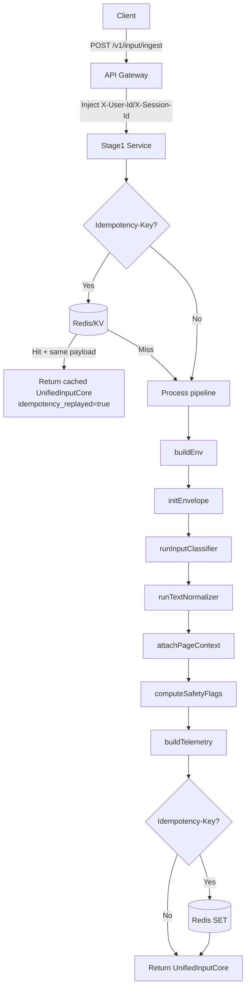
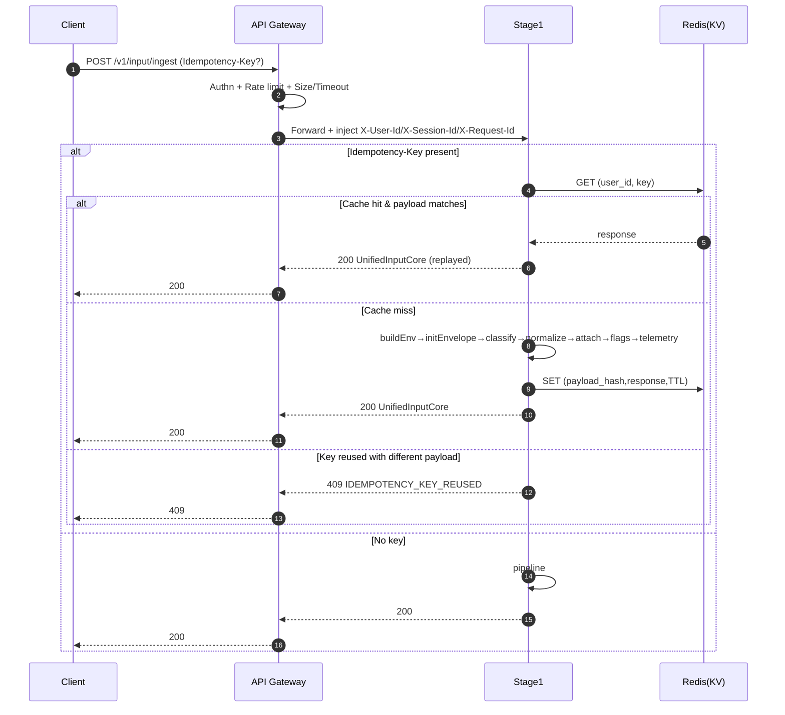

# Stage 1 – Input & Ingestion (CORE, MVP) – Enterprise Spec v2.2
**Status:** Draft (implementation-ready)  
**API Version:** v1  
**Schema Version (I/O):** 1.0  
**Last updated:** 2025-12-08 (Asia/Bangkok)  
**Owner:** Platform/Backend

---

## Table of contents
1. Overview  
2. Goal / Scope / Assumptions / Out-of-scope  
3. User stories / Use-cases  
4. API contract  
5. Data model & validation (incl. versioning + idempotency)  
6. Architecture & Flow (diagrams)  
7. Pipeline & Modules (deep-dive, implementation-ready)  
8. Security  
9. NFR (SLO/SLA, scaling, reliability)  
10. Observability (logs/metrics/traces)  
11. Failure modes / retries / timeouts  
12. Testing strategy + acceptance criteria  
13. Appendices (config, folder skeleton)  
14. Change log (v1 → v2.2)

---

## 1) Overview

Stage 1 là service backend nhận input thô từ client (browser/app) và trả ra **một JSON chuẩn** gọi là `UnifiedInputCore` để Stage 2 (Query Understanding) tiêu thụ.

**Stage 1 chỉ làm “kỹ thuật hoá input”**: validate, normalize, classify (TEXT/URL/MIXED), trích URL, gắn cờ safety kỹ thuật, telemetry.

---

## 2) Goal / Scope / Assumptions / Out-of-scope

### 2.1 Goals
- Nhận input từ client:
  - `raw_input` (text user gõ / dán URL)
  - `page_context` (URL tab đang mở, title, selection_text)
  - `env_meta` (session/locale/timezone/device…)
- Chuẩn hoá & trả `UnifiedInputCore` **đồng bộ** (sync response).
- Cực kỳ rõ ràng về contract + validation + error codes để team dev implement ít hỏi lại.
- Tạo nền tảng mở rộng Stage 1 (voice/video) ở tương lai mà không phá vỡ contract.

### 2.2 In-scope (Stage 1 chịu trách nhiệm)
- JSON parse + schema validation + defaulting.
- `buildEnv`: chuẩn hoá `env_meta` + identity (từ gateway headers).
- `initEnvelope`: tạo `UnifiedInputCore` khung.
- `runInputClassifier`: phân loại TEXT/URL/MIXED + extract URLs từ text.
- `runTextNormalizer`: normalize text + detect language (heuristic).
- `attachPageContext`: copy page context vào output.
- `computeSafetyFlags`: cờ kỹ thuật (dài quá/URL quá nhiều/URL invalid…).
- `buildTelemetry`: latency per-module + input length + url_count.
- **Idempotency** cho endpoint ingest (để retry an toàn) thông qua `Idempotency-Key` (khuyến nghị mạnh).

### 2.3 Out-of-scope (KHÔNG làm ở Stage 1)
- ❌ Không fetch URL, không crawl/parse HTML, không động vào DOM.
- ❌ Không gọi LLM, không hiểu intent, không sinh `TaskSpec`.
- ❌ Không chấm điểm, không RAG, không “thông minh ngữ nghĩa”.
- ❌ Không xử lý audio/video (MVP chỉ text + page_context metadata).

### 2.4 Assumptions / Dependencies
- Có **API Gateway** phía trước:
  - TLS termination (HTTPS), authn, rate limit, request size limit, timeout.
- Redis/KV store **khuyến nghị** để implement idempotency cache (TTL).  
  - Nếu không có Redis, Stage 1 vẫn chạy nhưng idempotency degrade (xem Failure modes).

---

## 3) User stories / Use-cases

### UC1 – Text thuần
User gõ câu hỏi → Stage 1 normalize + detect lang + (nếu có) extract URL → trả `UnifiedInputCore`.

### UC2 – Dán URL
User dán URL vào `raw_input` → Stage 1 set `input_type="URL"` + `urls_in_text=[...]`, **không fetch**.

### UC3 – Text + Page context
User hỏi “tóm tắt đoạn bôi đen” + có `selection_text` + `active_url` → Stage 1 đóng gói đủ context cho Stage 2.

### UC4 – Retry an toàn
Client retry do timeout/network → gửi lại cùng `Idempotency-Key` → Stage 1 trả **y hệt** response trước (request_id giữ nguyên).

---

## 4) Architecture & Flow (diagrams)

### 6.1 Component boundaries
- **Client (Browser/App)**: gom dữ liệu (raw_input, page_context), gửi JSON.
- **API Gateway**: TLS, authn, rate-limit, request-size limit, timeout, inject headers.
- **Stage 1 Service**: normalize + classify + telemetry + safety flags + (optional) idempotency cache.
- **Stage 2**: Query Understanding (ngoài scope).

### 6.2 Pipeline overview (ASCII – chi tiết hơn)
```text
Client
  |
  | POST /v1/input/ingest
  |  - raw_input
  |  - env_meta (fallback)
  |  - page_context
  v
API Gateway
  - HTTPS / Authn / Rate limit / Size limit / Timeout
  - inject X-User-Id / X-Session-Id / X-Request-Id
  |
  v
Stage 1 – Input & Ingestion
  (0) [optional] idempotencyCheck(Idempotency-Key)
  (1) buildEnv(headers, env_meta)
  (2) initEnvelope(raw_input, env, defaults)
  (3) runInputClassifier(text_raw) -> input_type + urls_in_text
  (4) runTextNormalizer(text_raw)  -> text_normalized + detected_lang
  (5) attachPageContext(page_context)
  (6) computeSafetyFlags(length/url_count/invalid_url)
  (7) buildTelemetry(total_ms, modules_ms)
  (8) [optional] idempotencyStore(response)
  |
  v
Response: UnifiedInputCoreV1 (JSON)
  - url_context/doc_context/media_context = null (placeholder)
  - telemetry + safety_flags
  |
  v
Stage 2 – Query Understanding (out-of-scope)
```

### 6.3 Flowchart (Mermaid)


### 6.4 Sequence diagram (Mermaid)


---


## 5) API contract

### 4.1 Endpoint inventory

| Endpoint | Method | Auth | Purpose |
|---|---:|---|---|
| `/v1/input/ingest` | POST | Required | Nhận input thô và trả `UnifiedInputCore` |
| `/v1/healthz` | GET | Optional (internal) | Liveness |
| `/v1/readyz` | GET | Optional (internal) | Readiness (dependency check tối thiểu) |

### 4.2 Authentication & identity (enterprise MVP, chốt để implement)
**Nguyên tắc:** Stage 1 tin identity **từ Gateway**, không tin identity trong body.

- Gateway inject:
  - `X-User-Id` (required in prod)
  - `X-Session-Id` (required in prod)
- Stage 1 có thể chạy local/dev không gateway:
  - `AUTH_MODE=local_dev` cho phép thiếu headers và fallback sang `env_meta` (không dùng cho prod).

Nếu thiếu identity trong prod → `401 Unauthorized`.

### 4.3 Request headers
Required:
- `Content-Type: application/json`
- `X-User-Id: <string>` (prod)
- `X-Session-Id: <string>` (prod)

Recommended:
- `Idempotency-Key: <string>` (để retry)
- `X-Request-Id: <string>` (nếu gateway không gắn, Stage 1 tạo)
- `Traceparent: <w3c traceparent>` (nếu dùng OpenTelemetry)

### 4.4 Request body (JSON): `RawRequestV1`

> **Compat note:** Nếu `schema_version` không có, Stage 1 assume `"1.0"`.

```ts
type RawRequestV1 = {
  schema_version?: "1.0";              // optional (default "1.0")

  raw_input: string;                    // required (có thể là "" nếu user chỉ dùng selection_text)

  env_meta?: {
    // body identity chỉ là fallback cho local_dev; prod ưu tiên headers
    user_id?: string;
    session_id?: string;

    timezone?: string;                  // default: "Asia/Bangkok"
    locale?: string;                    // default: "vi-VN"

    client?: {
      device?: string;
      browser?: string;
      os?: string;
      user_agent?: string;
    };
  };

  page_context?: {
    active_url?: string;                // http/https
    active_title?: string;
    selection_text?: string | null;
  };
};
```

### 4.5 Validation rules (P0)
- Parse JSON phải thành công, Content-Type đúng.
- “Effective input” phải có ít nhất một trong:
  - `raw_input.trim().length > 0`
  - `page_context.selection_text.trim().length > 0`
  - `page_context.active_url` là URL hợp lệ (http/https)
- Giới hạn:
  - `raw_input.length <= MAX_RAW_INPUT_LENGTH` (default 20_000)
  - `url_count <= MAX_URL_COUNT` (default 10)  
    - nếu vượt: truncate list + set flag `too_many_urls=true`
- `active_url` nếu có phải bắt đầu bằng `http://` hoặc `https://`

### 4.6 Response body: `UnifiedInputCoreV1`
Stage 1 trả trực tiếp object `UnifiedInputCoreV1` (không bọc thêm envelope ngoài).

```ts
type UnifiedInputCoreV1 = {
  schema_version: "1.0";

  // correlation
  request_id: string;                   // UUID, stable for idempotency replay
  idempotency_replayed?: boolean;       // optional

  input_id: string;                     // UUID (có thể = request_id)
  received_at: string;                  // ISO-8601 UTC

  input_type: "TEXT" | "URL" | "MIXED";

  query: {
    text_raw: string;
    text_normalized: string;
    detected_lang: "vi" | "en" | "unknown";
    urls_in_text: string[];             // URLs extracted from text_raw + optional active_url (policy below)
  };

  env: {
    user_id: string;
    session_id: string;
    timezone: string;                   // default Asia/Bangkok
    locale: string;                     // default vi-VN
    client?: {
      device?: string;
      browser?: string;
      os?: string;
      user_agent?: string;
    };
  };

  page_context?: {
    active_url?: string;
    active_title?: string;
    selection_text?: string | null;
  };

  // placeholders for later stages (Stage 1 does not fill them)
  url_context: null;
  doc_context: null;
  media_context: null;

  telemetry: {
    stage1_total_latency_ms: number;
    modules: Record<string, number>;    // ms per module: { buildEnv: 1, ... }
    raw_input_length: number;
    url_count: number;
  };

  safety_flags: {
    empty_effective_input?: boolean;
    raw_input_too_long?: boolean;
    too_many_urls?: boolean;
    invalid_url_present?: boolean;
  };

  warnings?: Array<{ code: string; message: string }>;
};
```

**URL policy (P0):**
- `urls_in_text` chứa các URL trích từ `raw_input`.
- Nếu `page_context.active_url` hợp lệ và chưa nằm trong list → append vào cuối (tính vào `url_count`).
- URL invalid bị drop + set `invalid_url_present=true` + warning `INVALID_URL_DROPPED`.

### 4.7 Status codes & error model

Success:
- `200 OK` → body là `UnifiedInputCoreV1`

Client errors:
- `400 Bad Request` → validation fail
- `401 Unauthorized` → thiếu identity headers (prod) / auth fail ở gateway
- `409 Conflict` → `Idempotency-Key` bị reuse với payload khác
- `413 Payload Too Large` → vượt size/length policy
- `415 Unsupported Media Type` → không phải JSON

Server errors:
- `500 Internal Server Error`
- `503 Service Unavailable` → dependency critical fail (tuỳ policy)
- `504 Gateway Timeout` → timeout ở gateway

Error body:

```ts
type ErrorResponse = {
  request_id?: string;   // nếu đã tạo được correlation
  error: {
    code: "VALIDATION_ERROR" | "UNAUTHORIZED" | "IDEMPOTENCY_KEY_REUSED" | "PAYLOAD_TOO_LARGE" | "INTERNAL_ERROR";
    message: string;
    details?: any;
  };
};
```

### 4.8 Examples (I/O)

#### Example A – Text + URL (MIXED)
Request:
```json
{
  "schema_version": "1.0",
  "raw_input": "Tóm tắt giúp tớ bài này: https://example.com/abc",
  "env_meta": { "session_id": "s_456", "locale": "vi-VN" }
}
```

Response (rút gọn):
```json
{
  "schema_version": "1.0",
  "request_id": "8b9b7f5c-0d7a-4b8b-9c6d-6c1d1a0b2f1a",
  "input_id": "8b9b7f5c-0d7a-4b8b-9c6d-6c1d1a0b2f1a",
  "received_at": "2025-12-08T12:30:00.000Z",
  "input_type": "MIXED",
  "query": {
    "text_raw": "Tóm tắt giúp tớ bài này: https://example.com/abc",
    "text_normalized": "Tóm tắt giúp tớ bài này: https://example.com/abc",
    "detected_lang": "vi",
    "urls_in_text": ["https://example.com/abc"]
  },
  "env": { "user_id": "u_123", "session_id": "s_456", "timezone": "Asia/Bangkok", "locale": "vi-VN" },
  "page_context": {},
  "url_context": null,
  "doc_context": null,
  "media_context": null,
  "telemetry": { "stage1_total_latency_ms": 18, "modules": { "buildEnv": 1 }, "raw_input_length": 47, "url_count": 1 },
  "safety_flags": {},
  "warnings": []
}
```

---

## 6) Data model & validation (incl. versioning + idempotency)

### 5.1 Versioning rules
- API version nằm ở path: `/v1/...`
- Schema version nằm trong body (`schema_version`) và trong response (`schema_version`)
- Backward compatible:
  - Thêm field mới (optional) → OK
  - Đổi type/meaning của field → bump major (`2.0`) + `/v2/`

### 5.2 Idempotency (P0)
**Header:** `Idempotency-Key: <string>`

**Semantics:**
- Cache scope: `(user_id, idempotency_key)`
- Lần 1: xử lý → store `(payload_hash, response)` với TTL `IDEMPOTENCY_TTL_SEC` (default 24h)
- Lần N:
  - Nếu `payload_hash` giống → trả response cũ + `idempotency_replayed=true`
  - Nếu khác → `409 Conflict` (`IDEMPOTENCY_KEY_REUSED`)

**Payload hash (canonical):**
- `payload_hash = sha256(canonical_json(RawRequestV1) + "|" + user_id + "|" + session_id)`

### 5.3 Validation matrix (P0)
| Rule                  | When                      | Outcome                                                     |
| --------------------- | ------------------------- | ----------------------------------------------------------- |
| JSON parse fail       | any                       | 400 VALIDATION_ERROR                                        |
| Effective input empty | any                       | 400 VALIDATION_ERROR + `details.empty_effective_input=true` |
| raw_input too long    | raw_input.length > MAX    | 413 PAYLOAD_TOO_LARGE                                       |
| too many URLs         | url_count > MAX_URL_COUNT | 200 OK + truncate + flag `too_many_urls=true`               |
| invalid URLs present  | URL parse fail            | 200 OK + drop invalid + flag + warning                      |

---

## 7) Pipeline & Modules (deep-dive)

```bash
stage1-service/
├── app/
│   ├── core/
│   │   ├── config.py          # Settings + centralized config
│   │   ├── constants.py       # Error codes, patterns, module names
│   │   └── exceptions.py      # Custom exceptions (400/401/409/413/500)
│   ├── api/
│   │   ├── schemas.py         # Pydantic models (RawRequestV1, UnifiedInputCoreV1)
│   │   ├── handlers.py        # Main ingest() pipeline orchestrator
│   │   └── routes.py          # FastAPI routes (/ingest, /healthz, /readyz, /metrics)
│   ├── services/
│   │   ├── validator.py       # validateRawRequest
│   │   ├── env.py             # buildEnv
│   │   ├── envelope.py        # initEnvelope
│   │   ├── classifier.py      # runInputClassifier (TEXT/URL/MIXED)
│   │   ├── normalizer.py      # runTextNormalizer + detectLanguage
│   │   ├── page_context.py    # attachPageContext
│   │   ├── safety.py          # computeSafetyFlags
│   │   └── telemetry.py       # buildTelemetry
│   ├── integrations/
│   │   └── redis.py           # Idempotency cache (hash_payload, get/set)
│   ├── observability/
│   │   ├── logging.py         # Structured logs (structlog)
│   │   ├── metrics.py         # Prometheus metrics
│   │   └── tracing.py         # OpenTelemetry traces
│   └── main.py                # FastAPI app + lifespan
├── tests/
│   ├── unit/                  # test_normalizer.py, test_classifier.py
│   ├── integration/           # test_api.py
│   ├── contract/
│   └── e2e/
├── pyproject.toml             # Dependencies + pytest config
├── Dockerfile
├── docker-compose.yml
├── .env.example
└── README.md


```


> Mục tiêu phần này: dev có thể implement từng module như “lego”, ít tranh cãi trách nhiệm.

### 7.1 Entrypoint: `ingest(raw: RawRequestV1, headers): UnifiedInputCoreV1`

```ts
async function ingest(raw: RawRequestV1, headers: Record<string,string>): Promise<UnifiedInputCoreV1> {
  const t0 = nowMs();
  const modulesLatency: Record<string, number> = {};
  const warnings: Array<{code:string; message:string}> = [];

  // (0) parse/validate
  const t_val0 = nowMs();
  const validated = validateRawRequest(raw);
  modulesLatency["validateRawRequest"] = nowMs() - t_val0;

  // (optional) idempotency GET
  const idemKey = headers["Idempotency-Key"];
  const userId = headers["X-User-Id"] ?? "";
  const sessionId = headers["X-Session-Id"] ?? "";

  if (idemKey) {
    const payloadHash = hashPayload(validated, userId, sessionId);
    const cached = await idemGet(userId, idemKey);
    if (cached) {
      if (cached.payloadHash !== payloadHash) throw idemConflictError();
      return { ...cached.response, idempotency_replayed: true };
    }
  }

  // (1) buildEnv
  const t_env0 = nowMs();
  const env = buildEnv(validated, headers, warnings);
  modulesLatency["buildEnv"] = nowMs() - t_env0;

  // (2) initEnvelope
  const t_init0 = nowMs();
  let envelope = initEnvelope(validated, env, warnings);
  modulesLatency["initEnvelope"] = nowMs() - t_init0;

  // (3) classify input + extract urls
  const t_cls0 = nowMs();
  envelope = runInputClassifier(envelope, warnings);
  modulesLatency["runInputClassifier"] = nowMs() - t_cls0;

  // (4) normalize + detect language
  const t_norm0 = nowMs();
  envelope = runTextNormalizer(envelope, warnings);
  modulesLatency["runTextNormalizer"] = nowMs() - t_norm0;

  // (5) attach page context
  const t_pc0 = nowMs();
  envelope = attachPageContext(envelope, validated, warnings);
  modulesLatency["attachPageContext"] = nowMs() - t_pc0;

  // (6) safety flags
  const t_sf0 = nowMs();
  envelope.safety_flags = computeSafetyFlags(envelope, warnings);
  modulesLatency["computeSafetyFlags"] = nowMs() - t_sf0;

  // (7) telemetry
  const totalMs = nowMs() - t0;
  envelope.telemetry = buildTelemetry(totalMs, modulesLatency, envelope);
  envelope.warnings = warnings;

  // (optional) idempotency SET
  if (idemKey) {
    const payloadHash = hashPayload(validated, env.user_id, env.session_id);
    await idemSet(env.user_id, idemKey, payloadHash, envelope);
  }

  return envelope;
}
```

### 7.2 Module: `validateRawRequest`
**Purpose:** enforce schema rules (effective input, limits) trước khi pipeline chạy.

**Key checks:**
- effective input non-empty
- raw_input length <= MAX_RAW_INPUT_LENGTH (else 413)
- content-type & JSON parse (đã ở HTTP layer)
- schema_version defaulting

**Output:** RawRequestV1 canonicalized (default fields set)

### 7.3 Module: `buildEnv`
**Purpose:** chuẩn hoá env, ưu tiên headers do gateway inject.

**Inputs:**
- headers `X-User-Id`, `X-Session-Id`
- `raw.env_meta` (fallback)

**Rules (P0):**
- `user_id` = header `X-User-Id` (prod) else fallback env_meta.user_id else `"unknown_user"`
- `session_id` = header `X-Session-Id` (prod) else fallback env_meta.session_id else `"unknown_session"`
- default:
  - timezone `"Asia/Bangkok"`
  - locale `"vi-VN"`

```ts
function buildEnv(raw: RawRequestV1, headers: Record<string,string>, warnings): UnifiedInputCoreV1["env"] {
  const m = raw.env_meta ?? {};
  const user_id = headers["X-User-Id"] ?? m.user_id ?? "unknown_user";
  const session_id = headers["X-Session-Id"] ?? m.session_id ?? "unknown_session";
  return {
    user_id,
    session_id,
    timezone: m.timezone ?? "Asia/Bangkok",
    locale: m.locale ?? "vi-VN",
    client: m.client
  };
}
```

### 7.4 Module: `initEnvelope`
**Purpose:** tạo khung `UnifiedInputCoreV1` + placeholders.

```ts
function initEnvelope(raw: RawRequestV1, env, warnings): UnifiedInputCoreV1 {
  const rawText = raw.raw_input ?? "";
  const request_id = uuidv4();
  return {
    schema_version: "1.0",
    request_id,
    input_id: request_id,
    received_at: new Date().toISOString(),

    input_type: "TEXT",
    query: {
      text_raw: rawText,
      text_normalized: rawText,
      detected_lang: "unknown",
      urls_in_text: []
    },

    env,
    page_context: {},

    url_context: null,
    doc_context: null,
    media_context: null,

    telemetry: {
      stage1_total_latency_ms: 0,
      modules: {},
      raw_input_length: rawText.length,
      url_count: 0
    },

    safety_flags: {},
    warnings: []
  };
}
```

### 7.5 Module: `runInputClassifier`
**Purpose:** phân loại kỹ thuật TEXT/URL/MIXED và extract URL từ text.

**Logic (P0):**
- URL regex: `/(https?:\/\/[^\s]+)/gi`
- `input_type`:
  - TEXT: không có URL
  - URL: đúng 1 URL và toàn bộ text_raw == URL đó
  - MIXED: còn lại

```ts
function runInputClassifier(envelope: UnifiedInputCoreV1, warnings): UnifiedInputCoreV1 {
  const raw = envelope.query.text_raw || "";
  const urls = (raw.match(/(https?:\/\/[^\s]+)/gi) || []).map(u => u.trim());

  let inputType: "TEXT" | "URL" | "MIXED" = "TEXT";
  if (urls.length === 0) inputType = "TEXT";
  else if (urls.length === 1 && raw.trim() === urls[0]) inputType = "URL";
  else inputType = "MIXED";

  envelope.input_type = inputType;
  envelope.query.urls_in_text = urls;
  envelope.telemetry.url_count = urls.length;
  return envelope;
}
```

### 7.6 Module: `runTextNormalizer`
**Purpose:** normalize whitespace/newlines + detect language (heuristic).

```ts
function normalizeText(s: string): string {
  return (s || "")
    .replace(/\r\n/g, "\n")
    .replace(/[ \t]+/g, " ")
    .replace(/\n{3,}/g, "\n\n")
    .trim();
}

function detectLanguage(s: string): "vi" | "en" | "unknown" {
  const t = (s || "").toLowerCase();
  // heuristic: presence of Vietnamese diacritics
  if (/[àáạảãâầấậẩẫăằắặẳẵđèéẹẻẽêềếệểễìíịỉĩòóọỏõôồốộổỗơờớợởỡùúụủũưừứựửữỳýỵỷỹ]/.test(t)) return "vi";
  // heuristic: many ASCII words
  if (/[a-z]/.test(t) && !/[àáạảãâăđèéêìíòóôơùúưỳý]/.test(t)) return "en";
  return "unknown";
}

function runTextNormalizer(envelope: UnifiedInputCoreV1, warnings): UnifiedInputCoreV1 {
  const raw = envelope.query.text_raw || "";
  const norm = normalizeText(raw);
  const lang = detectLanguage(norm);

  envelope.query.text_normalized = norm;
  envelope.query.detected_lang = lang;
  return envelope;
}
```

### 7.7 Module: `attachPageContext`
**Purpose:** copy `page_context` vào envelope + merge `active_url` vào urls list theo policy.

```ts
function attachPageContext(envelope: UnifiedInputCoreV1, raw: RawRequestV1, warnings): UnifiedInputCoreV1 {
  const pc = raw.page_context ?? {};
  envelope.page_context = pc;

  const active = pc.active_url?.trim();
  if (active) {
    const valid = /^https?:\/\/.+/i.test(active);
    if (!valid) {
      envelope.safety_flags.invalid_url_present = true;
      warnings.push({ code: "INVALID_ACTIVE_URL", message: "active_url is not a valid http/https URL; dropped" });
    } else if (!envelope.query.urls_in_text.includes(active)) {
      envelope.query.urls_in_text.push(active);
    }
  }

  envelope.telemetry.url_count = envelope.query.urls_in_text.length;
  return envelope;
}
```

### 7.8 Module: `computeSafetyFlags`
**Purpose:** set cờ safety kỹ thuật + produce warnings.

```ts
function computeSafetyFlags(envelope: UnifiedInputCoreV1, warnings): UnifiedInputCoreV1["safety_flags"] {
  const flags: UnifiedInputCoreV1["safety_flags"] = {};

  const effective =
    (envelope.query.text_normalized || "").trim().length > 0 ||
    ((envelope.page_context?.selection_text || "").trim().length > 0) ||
    !!envelope.page_context?.active_url;

  if (!effective) {
    flags.empty_effective_input = true;
    warnings.push({ code: "EMPTY_EFFECTIVE_INPUT", message: "No usable input found (raw_input/selection_text/active_url)" });
  }

  if (envelope.telemetry.raw_input_length > MAX_RAW_INPUT_LENGTH) {
    flags.raw_input_too_long = true;
  }

  const urlCount = (envelope.query.urls_in_text || []).length;
  if (urlCount > MAX_URL_COUNT) {
    flags.too_many_urls = true;
    envelope.query.urls_in_text = envelope.query.urls_in_text.slice(0, MAX_URL_COUNT);
    warnings.push({ code: "URLS_TRUNCATED", message: "Too many URLs; truncated to MAX_URL_COUNT" });
  }

  return flags;
}
```

### 7.9 Module: `buildTelemetry`
**Purpose:** capture total + per-module latencies.

```ts
function buildTelemetry(totalMs: number, modulesLatency: Record<string, number>, envelope: UnifiedInputCoreV1): UnifiedInputCoreV1["telemetry"] {
  return {
    stage1_total_latency_ms: totalMs,
    modules: modulesLatency,
    raw_input_length: envelope.query.text_raw.length,
    url_count: (envelope.query.urls_in_text || []).length
  };
}
```

---

## 8) Security (enterprise MVP)

### 8.1 Authn/Authz
- Authn thực thi ở Gateway (JWT/OAuth2/API key).
- Stage 1 chỉ tin `X-User-Id`, `X-Session-Id` do gateway inject (prod).
- Local dev: `AUTH_MODE=local_dev` → cho phép fallback.

### 8.2 Rate limit (defaults – configurable)
- Per user: 60 req/min (burst 10)
- Per IP: 300 req/min
- Thực thi ở Gateway; Stage 1 chỉ return 429 nếu gateway pass-through.

### 8.3 Secrets
- Secrets qua env vars/Vault/KMS.
- Không log token/secret, không echo Authorization back.

### 8.4 PII handling & logging privacy
- Không log full `raw_input`/`selection_text` ở INFO.
- INFO logs chỉ ghi: lengths, counts, ids, flags, latency.
- DEBUG (staging only) có thể log truncated (ví dụ 200 chars) **có redaction**.
- Retention theo policy (xoá log sau N ngày nếu yêu cầu).

### 8.5 Minimal threat model (MVP)
| Threat | Vector | Mitigation |
|---|---|---|
| Header spoofing | Client tự set X-User-Id | Block direct access; trust gateway only |
| Payload bombing | raw_input cực dài | Gateway size limit + MAX_RAW_INPUT_LENGTH + 413 |
| URL spam | quá nhiều URL | MAX_URL_COUNT + truncate + flag + warning |
| PII leakage via logs | log raw text | Structured logs + redaction policy |
| Replay/duplicate | retry | Idempotency-Key semantics |

---

## 9) NFR (SLO/SLA, scaling, reliability)

### 9.1 Latency SLO (per request)
- TEXT-only: p95 ≤ 50ms
- MIXED (URL extract + lang detect): p95 ≤ 100ms
- Soft internal budget: 200ms (vượt → warning `SLOW_PATH`)

### 9.2 Throughput & scaling
- Baseline target: 200 RPS / replica (CPU-bound nhẹ).
- Horizontal autoscaling theo:
  - CPU utilization
  - p95 latency
- Stateless (ngoại trừ Redis idempotency).

### 9.3 Availability
- MVP target: 99.5% (hướng tới 99.9% khi ổn định)

---

## 10) Observability (logs/metrics/traces + correlation id)

### 10.1 Correlation id
- `request_id` luôn có (UUID).  
- Nếu gateway có `X-Request-Id`, Stage 1 có thể dùng nó làm `request_id` (policy tuỳ team).

### 10.2 Structured logs (JSON)
Required fields:
- timestamp, level, request_id, path, method, status, latency_ms
- user_id_hash, session_id_hash
- raw_input_length, url_count
- safety_flags, error_code (nếu có)

### 10.3 Metrics (minimum)
- `requests_total{status}`
- `request_latency_ms` (histogram)
- `validation_errors_total{code}`
- `idempotency_replay_total`
- `redis_up` (gauge)

### 10.4 Traces (OpenTelemetry)
- root span: `stage1.ingest`
- child spans: validate, buildEnv, initEnvelope, classify, normalize, attachPageContext, computeSafetyFlags, buildTelemetry, redis_get/set

---

## 11) Failure modes / retries / timeouts

### 11.1 Client retry
- Retry ONLY khi:
  - network error / timeout / 5xx / 503
- Retry SHOULD kèm `Idempotency-Key` để tránh duplicate.
- Không retry cho 4xx (trừ 429 theo backoff).

### 11.2 Redis/KV down
**MVP policy (availability-first):**
- Nếu Redis down:
  - Stage 1 vẫn process pipeline, nhưng add warning `IDEMPOTENCY_UNAVAILABLE`.
  - Không set `idempotency_replayed`.
- Nếu team muốn strict idempotency: đổi policy thành `503` khi idemKey present.

### 11.3 Timeouts
- Gateway timeout đề xuất: 2s
- Internal soft budget: 200ms (log warning)

---

## 12) Testing strategy + acceptance criteria

### 12.1 Test layers
- Unit:
  - normalizeText, detectLanguage, extractUrls/classify, computeSafetyFlags
- Contract:
  - JSON schema validation request/response
- Integration:
  - Redis idempotency hit/miss/conflict
- E2E:
  - run behind gateway simulation (missing headers in prod → 401)

### 12.2 Acceptance criteria (P0)
- AC1: effective input empty → 400 VALIDATION_ERROR
- AC2: raw_input > MAX → 413 PAYLOAD_TOO_LARGE
- AC3: URL count > MAX_URL_COUNT → 200 + truncate + `too_many_urls=true` + warning `URLS_TRUNCATED`
- AC4: Idempotency replay same payload → 200 + same request_id + `idempotency_replayed=true`
- AC5: Idempotency key reused different payload → 409 IDEMPOTENCY_KEY_REUSED
- AC6: Logs must NOT contain raw_input at INFO (log-scan test)

### 12.3 Manual smoke (curl)
- `GET /v1/healthz` → 200
- `GET /v1/readyz` → 200 (hoặc 503 nếu dependency fail theo policy)
- `POST /v1/input/ingest` với headers identity + JSON body → 200

---

## 13) Appendices

### Appendix A – Centralized config (defaults)
| Key | Default | Notes |
|---|---:|---|
| MAX_RAW_INPUT_LENGTH | 20000 | chars |
| MAX_URL_COUNT | 10 | truncate |
| IDEMPOTENCY_TTL_SEC | 86400 | 24h |
| AUTH_MODE | gateway | gateway / local_dev |

### Appendix B – Suggested folder skeleton (optional)
stage1-service/
- app/
  - core/ (config, constants, exceptions)
  - api/ (routes, schemas, handlers)
  - services/ (modules: env, classify, normalize, safety, telemetry)
  - integrations/ (redis)
  - observability/ (logging, metrics, tracing)
- tests/
  - unit/
  - contract/
  - integration/
  - e2e/

---

## 14) Change log (v1 → v2.2)

### Borrowed from B
- Thêm endpoint inventory + health/ready endpoints.
- Thêm flowchart/sequence diagrams nhiều lớp.
- Thêm centralized config table + acceptance criteria/test strategy structure.

### Clarified
- Chốt boundary identity: headers (gateway) là source of truth.
- Làm rõ effective-input validation và URL merge policy.
- Chuẩn hoá correlation id + error model.

### Added
- Schema versioning in/out.
- Idempotency semantics (replay/conflict) + Redis policy.
- Observability chuẩn: metrics + traces + log fields.

### Removed / Not added (giữ scope Stage 1)
- Không đưa worker/event-driven/RabbitMQ/fetch HTML/LLM vì ngoài scope Stage 1.
