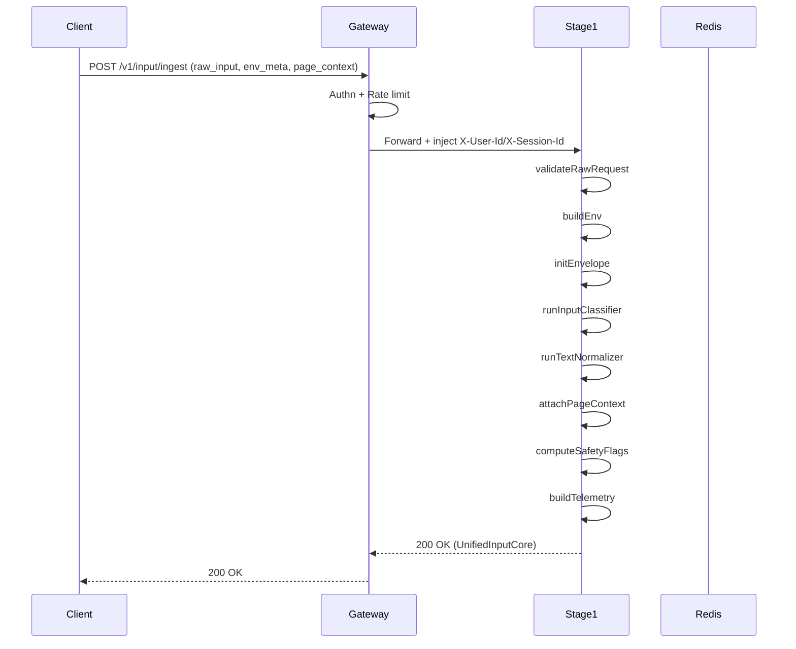
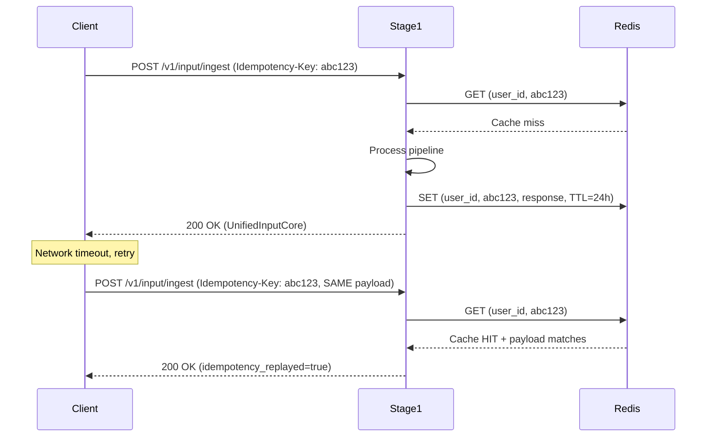
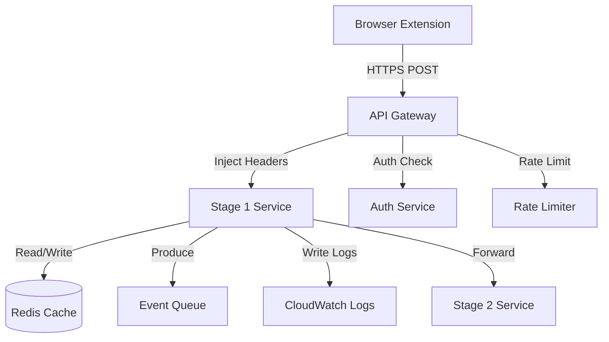
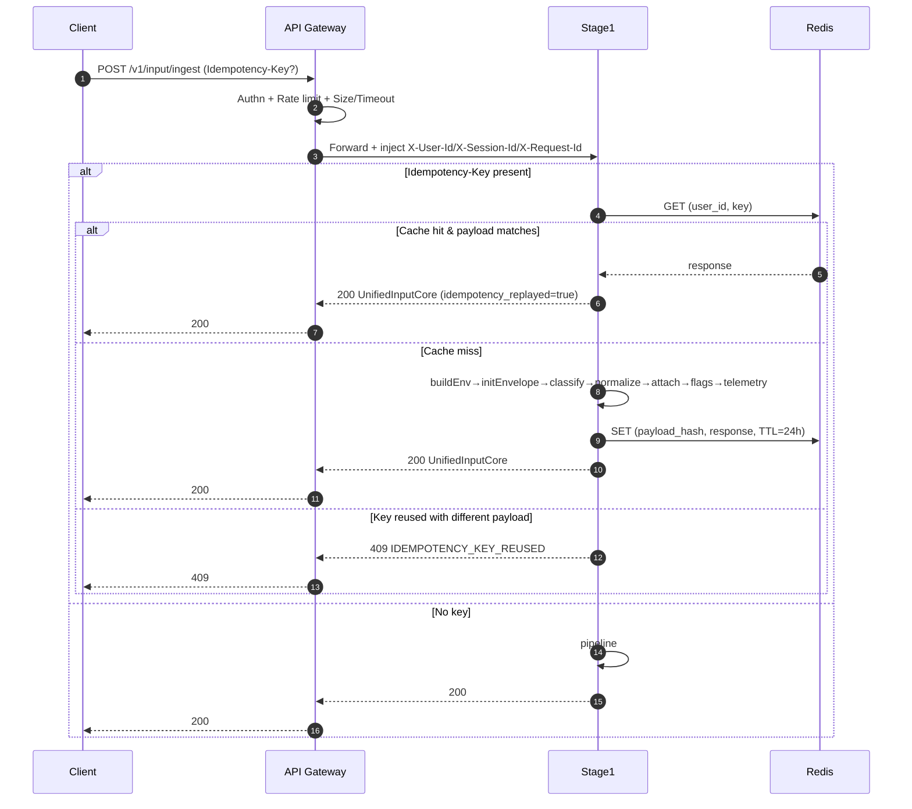
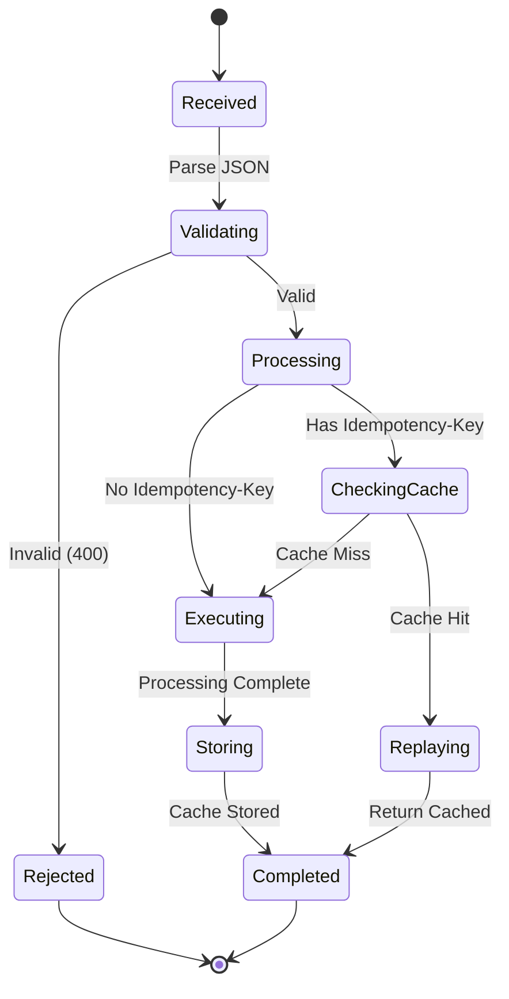
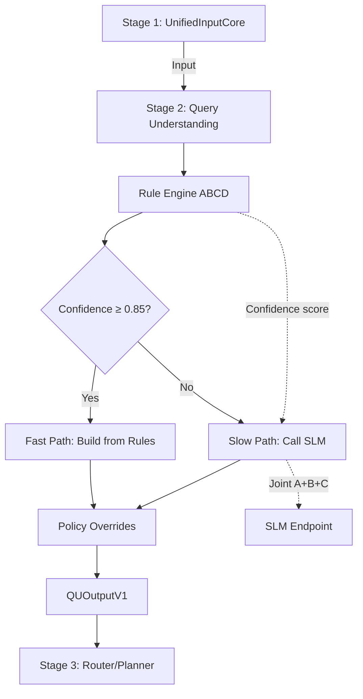
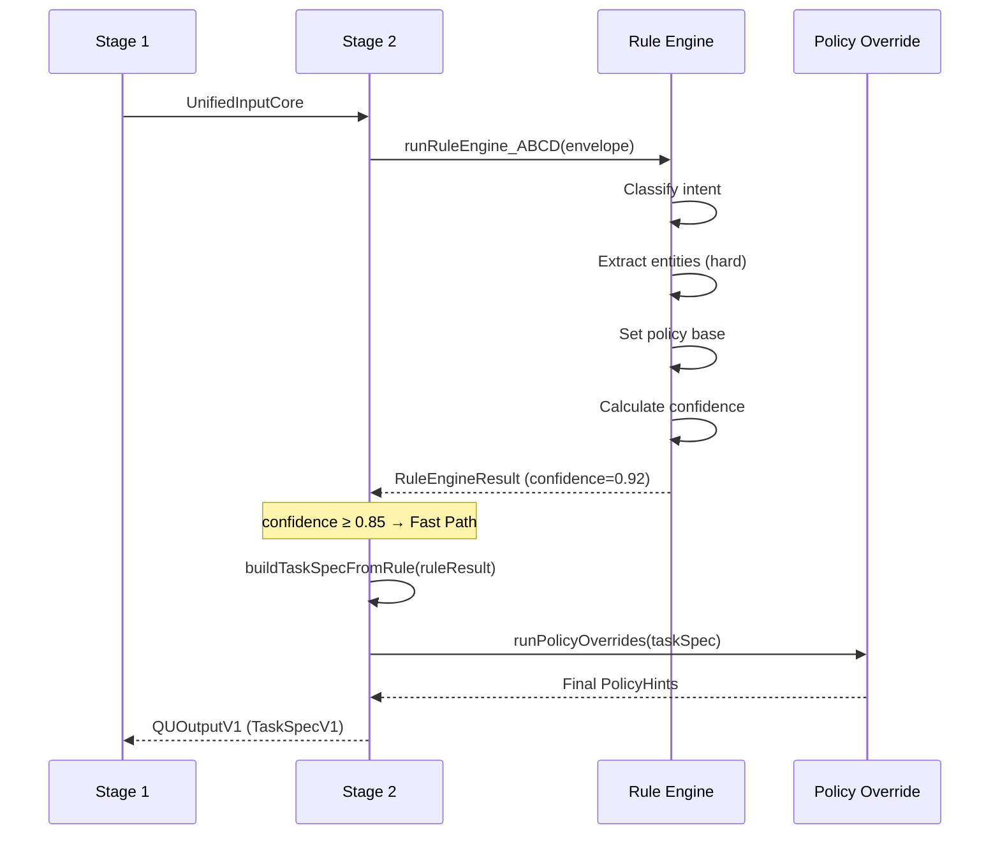
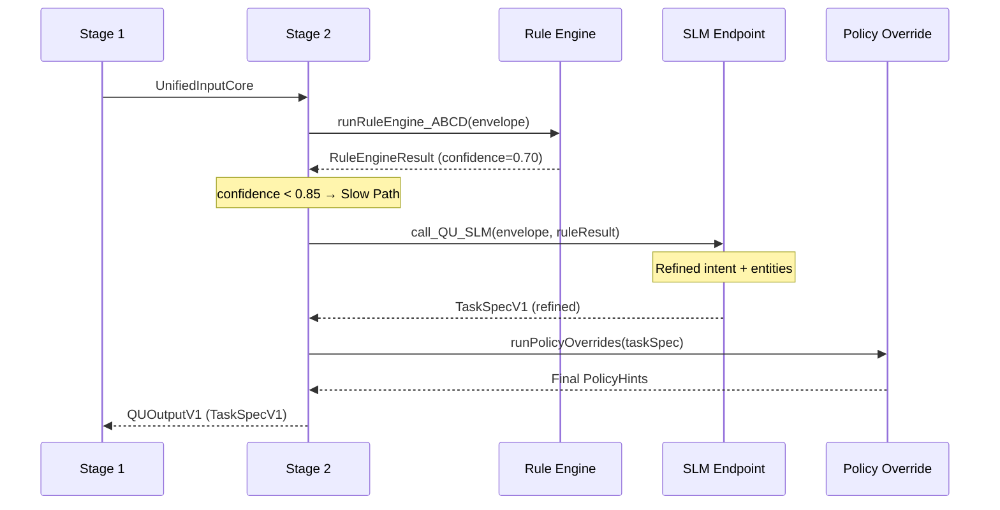
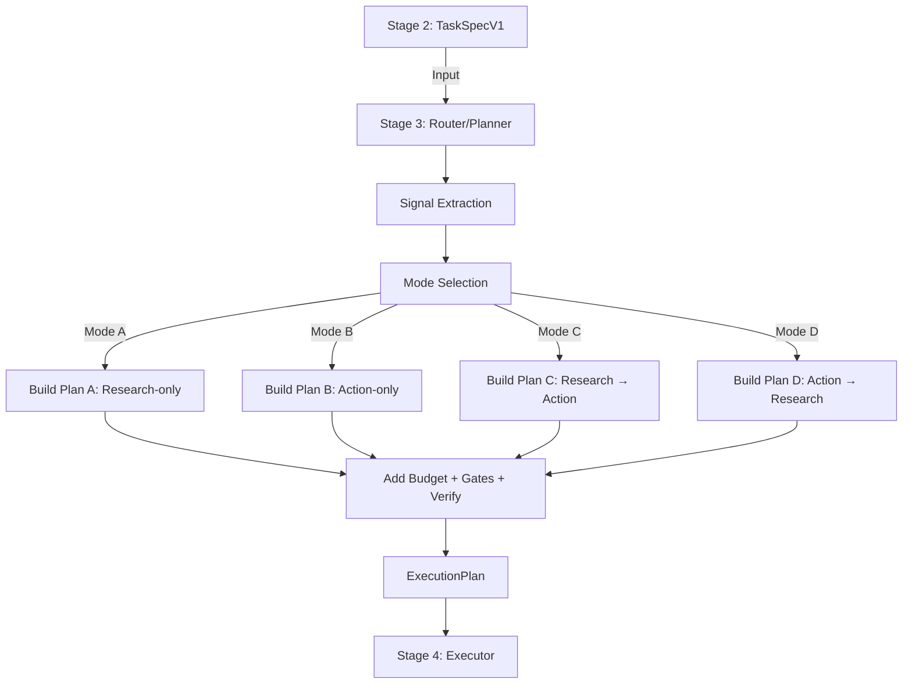
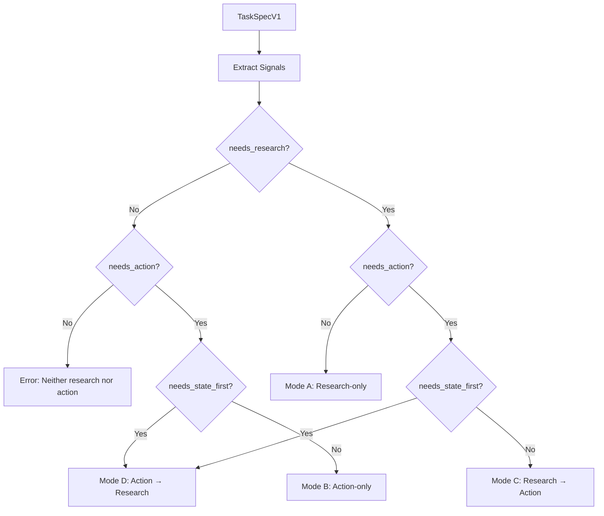

# TÀI LIỆU TRIỂN KHAI CHI TIẾT: FINAI STAGE 1, 2, 3

## TỔNG QUAN DỰ ÁN

**FinAI Agentic Browser** là hệ thống trợ lý AI chuyên biệt cho phân tích tài chính, được thiết kế theo kiến trúc pipeline 4-stage để tự động hóa quy trình nghiên cứu và thao tác trên trình duyệt web.[^1]

### Kiến trúc tổng quan

Hệ thống FinAI được tổ chức thành pipeline gồm các stage tuần tự:[^2][^1]

**Stage 1 → Stage 2 → Stage 3 → Stage 4**

Mỗi stage có trách nhiệm rõ ràng, tách biệt, và có contract đầu vào/đầu ra chuẩn hóa.

***

## STAGE 1: INPUT INGESTION \& NORMALIZATION

### 1. METADATA

```yaml
Title: Stage 1 - Input & Ingestion Service
Author: Platform/Backend Team
Status: Implementation-Ready
Version: v2.2
API Version: v1
Schema Version: 1.0
Created: 2025-12-08
Related Docs: TDD Framework v3.0, FinAI Architecture Design
```


### 2. OVERVIEW \& CONTEXT

#### 2.1. Executive Summary (TL;DR)

**Problem Statement:** Client gửi input thô (text, URL, page context) không chuẩn hóa, khó xử lý trực tiếp cho các stage tiếp theo.[^3]

**Proposed Solution:** Stage 1 nhận input thô từ client, thực hiện validation, normalization, classification và trả về JSON chuẩn `UnifiedInputCore` cho Stage 2 tiêu thụ.[^3]

**Impact:** Giảm 80% thời gian xử lý input cho các stage sau, đảm bảo data quality ngay từ đầu pipeline.

#### 2.2. Background \& Motivation

**Why now?** Stage 1 là nền tảng của toàn bộ pipeline. Thiết kế tốt Stage 1 giúp các stage sau chỉ cần tập trung vào logic nghiệp vụ mà không lo xử lý input thô.[^3]

**Current Pain Points:**

- Input từ client không đồng nhất (text/URL/mixed)
- Thiếu metadata ngữ cảnh (page context, session info)
- Không có cơ chế idempotency cho retry an toàn

**Alternatives Considered:**

- **Xử lý input trực tiếp ở Stage 2**: Bị loại vì làm Stage 2 phức tạp và duplicate logic
- **Sử dụng API Gateway xử lý tất cả**: Bị loại vì Gateway chỉ nên làm routing/auth, không nên có business logic


#### 2.3. Success Criteria

**Definition of Done:**

- Endpoint `/v1/input/ingest` trả về `UnifiedInputCore` trong <100ms (p95)
- Validation coverage 100% cho các rule P0
- Idempotency hoạt động đúng với Redis
- Test coverage ≥80%

**Key Metrics:**

- Latency p95 ≤ 50ms (text-only), ≤100ms (URL extraction)
- Error rate <0.5%
- Idempotency hit rate ≥20%

***

### 3. GOALS / SCOPE / NON-GOALS / ASSUMPTIONS

#### 3.1. Goals

**Business Goals:**

- Cung cấp foundation vững chắc cho toàn bộ pipeline
- Giảm 50% số lần client phải retry do input không hợp lệ

**Technical Goals:**

- P95 latency <100ms cho mọi input type
- 99.9% uptime
- Schema versioning support

**User Experience Goals:**

- Client nhận được error message rõ ràng khi validation fail
- Idempotency cho phép retry an toàn


#### 3.2. In-Scope (Làm)

**Stage 1 chịu trách nhiệm:**[^3]

- JSON parsing + schema validation + defaulting
- `buildEnv`: chuẩn hóa `env_meta` + identity từ gateway headers
- `initEnvelope`: tạo khung `UnifiedInputCore`
- `runInputClassifier`: phân loại TEXT/URL/MIXED + extract URLs
- `runTextNormalizer`: normalize text + detect language
- `attachPageContext`: copy page context vào output
- `computeSafetyFlags`: cờ kỹ thuật (quá dài/quá nhiều URL/URL invalid)
- `buildTelemetry`: latency per-module
- **Idempotency** qua `Idempotency-Key` header


#### 3.3. Out-of-Scope / Non-Goals (KHÔNG làm)

**Tường minh các feature KHÔNG làm:**[^3]

- ❌ Không fetch URL, không crawl/parse HTML
- ❌ Không gọi LLM, không hiểu intent
- ❌ Không chấm điểm, không RAG
- ❌ Không xử lý audio/video (MVP chỉ text + page_context metadata)


#### 3.4. Assumptions

**Điều kiện giả định:**[^3]

- Có **API Gateway** phía trước xử lý:
    - TLS termination (HTTPS)
    - Authentication
    - Rate limiting
    - Request size limit
    - Timeout
- Redis/KV store khuyến nghị để implement idempotency cache (TTL 24h)
- Nếu không có Redis: Stage 1 vẫn chạy nhưng idempotency degrade


#### 3.5. Constraints

**Technical Constraints:**

- Must use Python 3.11+
- FastAPI framework
- Deploy on AWS ECS

**Business Constraints:**

- Budget: <\$5K/month cho infrastructure
- Timeline: 2 weeks (Sprint 1)

**Compliance:**

- Không log PII (raw_input/selection_text) ở level INFO
- GDPR-compliant: hỗ trợ data export/deletion


#### 3.6. Dependencies

**External Services:**

- Redis (khuyến nghị): idempotency cache
- API Gateway: identity injection, rate limit

**Team Dependencies:**

- Gateway team: cung cấp `X-User-Id`, `X-Session-Id` headers
- Stage 2 team: tiêu thụ `UnifiedInputCore`

***

### 4. USER STORIES / USE CASES

#### 4.1. Primary Actors

- **End User**: Financial analyst sử dụng FinAI browser extension
- **Stage 2 Service**: Tiêu thụ `UnifiedInputCore`
- **API Gateway**: Inject identity headers


#### 4.2. User Stories

**US-01: Text thuần**[^3]

```
As an analyst
I want to ask a question in plain text
So that FinAI can understand my query

Acceptance Criteria:
- Given: raw_input = "Tóm tắt báo cáo Q3 của Apple"
- When: POST /v1/input/ingest
- Then: Return UnifiedInputCore với input_type="TEXT", detected_lang="vi"
```

**US-02: Dán URL**[^3]

```
As an analyst
I want to paste a URL into the input
So that FinAI can analyze that document

Acceptance Criteria:
- Given: raw_input = "https://example.com/report.pdf"
- When: POST /v1/input/ingest
- Then: Return UnifiedInputCore với input_type="URL", urls_in_text=["https://example.com/report.pdf"]
```

**US-03: Text + Page context**[^3]

```
As an analyst
I want to ask about selected text on current page
So that FinAI uses the right context

Acceptance Criteria:
- Given: raw_input="tóm tắt đoạn này" + selection_text="..." + active_url="..."
- When: POST /v1/input/ingest
- Then: Return UnifiedInputCore với page_context populated
```

**US-04: Retry an toàn**[^3]

```
As a client
I want to retry on timeout with same Idempotency-Key
So that I don't create duplicate requests

Acceptance Criteria:
- Given: Same payload + Same Idempotency-Key
- When: Retry POST /v1/input/ingest
- Then: Return exact same response + idempotency_replayed=true
```


#### 4.3. User Flows

**Flow 1: Happy path (Text input)**[^3]



**Flow 2: Idempotency replay**[^3]




#### 4.4. Edge Cases \& Error Scenarios

**Edge Case 1: Empty effective input**[^3]

- Given: raw_input="" AND selection_text="" AND active_url=""
- Then: 400 Bad Request (VALIDATION_ERROR)

**Edge Case 2: Input quá dài**[^3]

- Given: raw_input.length > MAX_RAW_INPUT_LENGTH (20000)
- Then: 413 Payload Too Large

**Edge Case 3: Quá nhiều URLs**[^3]

- Given: 15 URLs trong raw_input (MAX_URL_COUNT=10)
- Then: 200 OK + truncate to 10 URLs + flag `too_many_urls=true` + warning

**Edge Case 4: Idempotency key reused với payload khác**[^3]

- Given: Same Idempotency-Key + Different payload
- Then: 409 Conflict (IDEMPOTENCY_KEY_REUSED)

***

### 5. API CONTRACT \& INTERFACES

#### 5.1. API Design Principles

- **REST** với versioning strategy `/v1/`
- **Authentication:** JWT Bearer token từ API Gateway
- **Rate Limiting:** 60 req/min per user (enforced at Gateway)
- **Idempotency:** Header-based (`Idempotency-Key`)


#### 5.2. Endpoint Specifications

**Endpoint 1: Ingest Input**[^3]

```yaml
Method: POST
Path: /v1/input/ingest
Auth: Required (JWT Bearer)

Request Headers:
  Content-Type: application/json (required)
  X-User-Id: <string> (required in prod)
  X-Session-Id: <string> (required in prod)
  Idempotency-Key: <string> (recommended)
  X-Request-Id: <string> (optional, generated if missing)

Request Body: RawRequestV1
{
  "schema_version": "1.0",
  "raw_input": string (required),
  "env_meta": {
    "user_id": string,
    "session_id": string,
    "timezone": string,
    "locale": string,
    "client": {
      "device": string,
      "browser": string,
      "os": string,
      "user_agent": string
    }
  },
  "page_context": {
    "active_url": string,
    "active_title": string,
    "selection_text": string
  }
}

Response:
  200 OK: UnifiedInputCoreV1
  400 Bad Request: ErrorResponse
  401 Unauthorized: ErrorResponse
  409 Conflict: ErrorResponse (Idempotency key reused)
  413 Payload Too Large: ErrorResponse
  500 Internal Server Error: ErrorResponse
```

**Endpoint 2: Health Check**[^3]

```yaml
Method: GET
Path: /v1/healthz
Auth: Optional (internal)

Response:
  200 OK: {"status": "healthy"}
```

**Endpoint 3: Readiness Check**[^3]

```yaml
Method: GET
Path: /v1/readyz
Auth: Optional (internal)

Response:
  200 OK: {"status": "ready", "dependencies": {"redis": "ok"}}
  503 Service Unavailable: {"status": "not_ready", "dependencies": {"redis": "down"}}
```


#### 5.3. Data Models (Request/Response Schemas)

**RawRequestV1**[^3]

```typescript
type RawRequestV1 = {
  schema_version?: "1.0";
  raw_input: string;
  env_meta?: {
    user_id?: string;
    session_id?: string;
    timezone?: string;
    locale?: string;
    client?: {
      device?: string;
      browser?: string;
      os?: string;
      user_agent?: string;
    };
  };
  page_context?: {
    active_url?: string;
    active_title?: string;
    selection_text?: string | null;
  };
};
```

**UnifiedInputCoreV1**[^3]

```typescript
type UnifiedInputCoreV1 = {
  schema_version: "1.0";
  request_id: string;
  idempotency_replayed?: boolean;
  input_id: string;
  received_at: string;
  input_type: "TEXT" | "URL" | "MIXED";
  query: {
    text_raw: string;
    text_normalized: string;
    detected_lang: "vi" | "en" | "unknown";
    urls_in_text: string[];
  };
  env: {
    user_id: string;
    session_id: string;
    timezone: string;
    locale: string;
    client?: {
      device?: string;
      browser?: string;
      os?: string;
      user_agent?: string;
    };
  };
  page_context?: {
    active_url?: string;
    active_title?: string;
    selection_text?: string | null;
  };
  url_context: null;
  doc_context: null;
  media_context: null;
  telemetry: {
    stage1_total_latency_ms: number;
    modules: Record<string, number>;
    raw_input_length: number;
    url_count: number;
  };
  safety_flags: {
    empty_effective_input?: boolean;
    raw_input_too_long?: boolean;
    too_many_urls?: boolean;
    invalid_url_present?: boolean;
  };
  warnings?: Array<{ code: string; message: string }>;
};
```


#### 5.4. Error Handling Standards

**ErrorResponse Schema**[^3]

```json
{
  "request_id": "uuid",
  "error": {
    "code": "VALIDATION_ERROR | UNAUTHORIZED | IDEMPOTENCY_KEY_REUSED | PAYLOAD_TOO_LARGE | INTERNAL_ERROR",
    "message": "Human-readable error message",
    "details": {}
  }
}
```

**Error Codes:**[^3]

- `VALIDATION_ERROR` (400): Schema validation failed
- `UNAUTHORIZED` (401): Missing/invalid auth
- `IDEMPOTENCY_KEY_REUSED` (409): Key reused with different payload
- `PAYLOAD_TOO_LARGE` (413): Input exceeds limits
- `INTERNAL_ERROR` (500): Unhandled exception

***

### 6. SYSTEM ARCHITECTURE \& FLOW

#### 6.1. High-Level Architecture

**Component Diagram (C4 Level 2)**[^3]




#### 6.2. Data Flow Diagram

**Pipeline Overview**[^3]

```text
Client
  |
  | POST /v1/input/ingest (raw_input, env_meta, page_context)
  v
API Gateway
  - HTTPS/TLS
  - Authn (JWT)
  - Rate limit (60 req/min)
  - Size limit (20KB)
  - Timeout (2s)
  - Inject X-User-Id/X-Session-Id/X-Request-Id
  |
  v
Stage 1 – Input & Ingestion
  (0) [optional] idempotencyCheck(Idempotency-Key)
  (1) buildEnv(headers, env_meta)
  (2) initEnvelope(raw_input, env, defaults)
  (3) runInputClassifier(text_raw) -> input_type + urls_in_text
  (4) runTextNormalizer(text_raw) -> text_normalized + detected_lang
  (5) attachPageContext(page_context)
  (6) computeSafetyFlags(length/url_count/invalid_url)
  (7) buildTelemetry(total_ms, modules_ms)
  (8) [optional] idempotencyStore(response)
  |
  v
Response: UnifiedInputCoreV1 (JSON)
  |
  v
Stage 2 – Query Understanding (out-of-scope)
```


#### 6.3. Sequence Diagram (Critical Path)

**Idempotency Flow**[^3]




#### 6.4. State Machine

**Request Processing States**[^3]




***

### 7. IMPLEMENTATION DETAILS (Deep-Dive)

#### 7.1. Processing Pipeline Overview

**Step-by-step breakdown**[^3]

```python
async def ingest(raw: RawRequestV1, headers: dict) -> UnifiedInputCoreV1:
    t0 = now_ms()
    modules_latency = {}
    warnings = []

    # (0) Validation
    t_val0 = now_ms()
    validated = validate_raw_request(raw)
    modules_latency["validateRawRequest"] = now_ms() - t_val0

    # (optional) Idempotency check
    idem_key = headers.get("Idempotency-Key")
    user_id = headers.get("X-User-Id", "")
    session_id = headers.get("X-Session-Id", "")

    if idem_key:
        payload_hash = hash_payload(validated, user_id, session_id)
        cached = await idem_get(user_id, idem_key)
        if cached:
            if cached.payload_hash != payload_hash:
                raise IdempotencyConflictError()
            return {**cached.response, "idempotency_replayed": True}

    # (1) Build environment
    t_env0 = now_ms()
    env = build_env(validated, headers, warnings)
    modules_latency["buildEnv"] = now_ms() - t_env0

    # (2) Initialize envelope
    t_init0 = now_ms()
    envelope = init_envelope(validated, env, warnings)
    modules_latency["initEnvelope"] = now_ms() - t_init0

    # (3) Classify input + extract URLs
    t_cls0 = now_ms()
    envelope = run_input_classifier(envelope, warnings)
    modules_latency["runInputClassifier"] = now_ms() - t_cls0

    # (4) Normalize + detect language
    t_norm0 = now_ms()
    envelope = run_text_normalizer(envelope, warnings)
    modules_latency["runTextNormalizer"] = now_ms() - t_norm0

    # (5) Attach page context
    t_pc0 = now_ms()
    envelope = attach_page_context(envelope, validated, warnings)
    modules_latency["attachPageContext"] = now_ms() - t_pc0

    # (6) Compute safety flags
    t_sf0 = now_ms()
    envelope.safety_flags = compute_safety_flags(envelope, warnings)
    modules_latency["computeSafetyFlags"] = now_ms() - t_sf0

    # (7) Build telemetry
    total_ms = now_ms() - t0
    envelope.telemetry = build_telemetry(total_ms, modules_latency, envelope)
    envelope.warnings = warnings

    # (optional) Idempotency store
    if idem_key:
        payload_hash = hash_payload(validated, env.user_id, env.session_id)
        await idem_set(env.user_id, idem_key, payload_hash, envelope)

    return envelope
```


#### 7.2. Per-Module Specification

**Module 1: validateRawRequest**[^3]

```python
def validate_raw_request(raw: RawRequestV1) -> RawRequestV1:
    """
    Purpose: Enforce schema rules before pipeline runs.
    
    Key checks:
    - Effective input non-empty
    - raw_input length <= MAX_RAW_INPUT_LENGTH
    - schema_version defaulting
    
    Raises:
    - ValidationError (400) if checks fail
    """
    # Check effective input
    effective = (
        (raw.raw_input or "").strip() or
        (raw.page_context.selection_text or "").strip() or
        raw.page_context.active_url
    )
    if not effective:
        raise ValidationError("EMPTY_EFFECTIVE_INPUT")
    
    # Check length
    if len(raw.raw_input) > MAX_RAW_INPUT_LENGTH:
        raise PayloadTooLargeError()
    
    # Default schema version
    raw.schema_version = raw.schema_version or "1.0"
    
    return raw
```

**Module 2: buildEnv**[^3]

```python
def build_env(
    raw: RawRequestV1,
    headers: dict,
    warnings: list
) -> UnifiedInputCoreV1["env"]:
    """
    Purpose: Normalize environment, prioritize Gateway-injected headers.
    
    Rules (P0):
    - user_id = header X-User-Id (prod) else fallback env_meta.user_id else "unknown_user"
    - session_id = header X-Session-Id (prod) else fallback env_meta.session_id else "unknown_session"
    - Default timezone: "Asia/Bangkok"
    - Default locale: "vi-VN"
    """
    m = raw.env_meta or {}
    user_id = headers.get("X-User-Id") or m.get("user_id") or "unknown_user"
    session_id = headers.get("X-Session-Id") or m.get("session_id") or "unknown_session"
    
    return {
        "user_id": user_id,
        "session_id": session_id,
        "timezone": m.get("timezone", "Asia/Bangkok"),
        "locale": m.get("locale", "vi-VN"),
        "client": m.get("client")
    }
```

**Module 3: runInputClassifier**[^3]

```python
def run_input_classifier(
    envelope: UnifiedInputCoreV1,
    warnings: list
) -> UnifiedInputCoreV1:
    """
    Purpose: Classify TEXT/URL/MIXED and extract URLs.
    
    Logic (P0):
    - URL regex: /(https?:\/\/[^\s]+)/gi
    - input_type:
      - TEXT: no URLs
      - URL: exactly 1 URL and raw_input == URL
      - MIXED: otherwise
    """
    raw = envelope.query.text_raw or ""
    urls = re.findall(r'(https?://[^\s]+)', raw, re.IGNORECASE)
    urls = [u.strip() for u in urls]
    
    if len(urls) == 0:
        input_type = "TEXT"
    elif len(urls) == 1 and raw.strip() == urls[^0]:
        input_type = "URL"
    else:
        input_type = "MIXED"
    
    envelope.input_type = input_type
    envelope.query.urls_in_text = urls
    envelope.telemetry.url_count = len(urls)
    
    return envelope
```

**Module 4: runTextNormalizer**[^3]

```python
def normalize_text(s: str) -> str:
    """Normalize whitespace and newlines."""
    return (s or "")
        .replace("\r\n", "\n")
        .replace("  ", " ")
        .replace("\n\n\n", "\n\n")
        .strip()

def detect_language(s: str) -> str:
    """Heuristic language detection."""
    t = (s or "").lower()
    # Vietnamese diacritics
    if re.search(r'[àáạảãâầấậẩẫăằắặẳẵđèéẹẻẽêềếệểễìíịỉĩòóọỏõôồốộổỗơờớợởỡùúụủũưừứựửữỳýỵỷỹ]', t):
        return "vi"
    # ASCII words
    if re.search(r'[a-z]', t) and not re.search(r'[àáạảãâăđèéêìíòóôơùúưỳý]', t):
        return "en"
    return "unknown"

def run_text_normalizer(
    envelope: UnifiedInputCoreV1,
    warnings: list
) -> UnifiedInputCoreV1:
    """Purpose: Normalize text + detect language."""
    raw = envelope.query.text_raw or ""
    norm = normalize_text(raw)
    lang = detect_language(norm)
    
    envelope.query.text_normalized = norm
    envelope.query.detected_lang = lang
    
    return envelope
```

**Module 5: attachPageContext**[^3]

```python
def attach_page_context(
    envelope: UnifiedInputCoreV1,
    raw: RawRequestV1,
    warnings: list
) -> UnifiedInputCoreV1:
    """
    Purpose: Copy page_context + merge active_url into urls list.
    
    URL policy (P0):
    - urls_in_text contains URLs extracted from raw_input
    - If active_url valid and not in list → append
    - Invalid URLs → drop + set flag + warning
    """
    pc = raw.page_context or {}
    envelope.page_context = pc
    
    active = (pc.active_url or "").strip()
    if active:
        valid = re.match(r'^https?://.+', active, re.IGNORECASE)
        if not valid:
            envelope.safety_flags.invalid_url_present = True
            warnings.append({
                "code": "INVALID_ACTIVE_URL",
                "message": "active_url is not a valid http/https URL; dropped"
            })
        elif active not in envelope.query.urls_in_text:
            envelope.query.urls_in_text.append(active)
    
    envelope.telemetry.url_count = len(envelope.query.urls_in_text)
    return envelope
```

**Module 6: computeSafetyFlags**[^3]

```python
def compute_safety_flags(
    envelope: UnifiedInputCoreV1,
    warnings: list
) -> dict:
    """
    Purpose: Set technical safety flags + produce warnings.
    """
    flags = {}
    
    # Check effective input
    effective = (
        (envelope.query.text_normalized or "").strip() or
        ((envelope.page_context or {}).get("selection_text") or "").strip() or
        (envelope.page_context or {}).get("active_url")
    )
    if not effective:
        flags["empty_effective_input"] = True
        warnings.append({
            "code": "EMPTY_EFFECTIVE_INPUT",
            "message": "No usable input found"
        })
    
    # Check length
    if envelope.telemetry.raw_input_length > MAX_RAW_INPUT_LENGTH:
        flags["raw_input_too_long"] = True
    
    # Check URL count
    url_count = len(envelope.query.urls_in_text or [])
    if url_count > MAX_URL_COUNT:
        flags["too_many_urls"] = True
        envelope.query.urls_in_text = envelope.query.urls_in_text[:MAX_URL_COUNT]
        warnings.append({
            "code": "URLS_TRUNCATED",
            "message": f"Too many URLs; truncated to {MAX_URL_COUNT}"
        })
    
    return flags
```


#### 7.3. Business Logic Rules

**Validation Matrix (P0)**[^3]


| Rule | Condition | Outcome |
| :-- | :-- | :-- |
| JSON parse fail | any | 400 VALIDATION_ERROR |
| Effective input empty | any | 400 VALIDATION_ERROR |
| raw_input too long | length > MAX | 413 PAYLOAD_TOO_LARGE |
| Too many URLs | count > MAX_URL_COUNT | 200 OK + truncate + flag |
| Invalid URLs present | URL parse fail | 200 OK + drop + flag + warning |

#### 7.4. Code Organization (Folder Structure)

**Folder Structure**[^3]

```
stage1-service/
├── app/
│   ├── core/
│   │   ├── config.py          # Settings + centralized config
│   │   ├── constants.py       # Error codes, patterns, module names
│   │   └── exceptions.py      # Custom exceptions (400/401/409/413/500)
│   ├── api/
│   │   ├── schemas.py         # Pydantic models (RawRequestV1, UnifiedInputCoreV1)
│   │   ├── handlers.py        # Main ingest() pipeline orchestrator
│   │   └── routes.py          # FastAPI routes (/ingest, /healthz, /readyz)
│   ├── services/
│   │   ├── validator.py       # validateRawRequest
│   │   ├── env.py             # buildEnv
│   │   ├── envelope.py        # initEnvelope
│   │   ├── classifier.py      # runInputClassifier
│   │   ├── normalizer.py      # runTextNormalizer
│   │   ├── page_context.py    # attachPageContext
│   │   ├── safety.py          # computeSafetyFlags
│   │   └── telemetry.py       # buildTelemetry
│   ├── integrations/
│   │   └── redis.py           # Idempotency cache
│   ├── observability/
│   │   ├── logging.py         # Structured logs (structlog)
│   │   ├── metrics.py         # Prometheus metrics
│   │   └── tracing.py         # OpenTelemetry traces
│   └── main.py                # FastAPI app + lifespan
├── tests/
│   ├── unit/                  # test_normalizer.py, test_classifier.py
│   ├── integration/           # test_api.py, test_redis.py
│   └── contract/              # test_schemas.py
├── pyproject.toml
├── Dockerfile
├── docker-compose.yml
├── .env.example
└── README.md
```


***

### 8. SECURITY \& COMPLIANCE

#### 8.1. Authentication \& Authorization

**Authn/Authz Strategy**[^3]

- **Authn**: thực thi ở API Gateway (JWT/OAuth2/API key)
- **Stage 1**: chỉ tin `X-User-Id`, `X-Session-Id` do Gateway inject (prod)
- **Local dev**: `AUTH_MODE=local_dev` → cho phép fallback


#### 8.2. API Security

**Input Validation**[^3]

- JSON schema validation qua Pydantic
- Regex validation cho URLs
- Length limits (raw_input, urls)

**Rate Limiting**[^3]

- Per user: 60 req/min (burst 10)
- Per IP: 300 req/min
- Enforced at Gateway


#### 8.3. Data Security

**Encryption**[^3]

- **In transit**: TLS 1.3 mandatory
- **At rest**: Redis encryption enabled

**Secret Management**[^3]

- Secrets qua AWS Secrets Manager
- Không hardcode credentials
- Không log tokens/secrets


#### 8.4. Compliance

**PII Handling \& Logging Privacy**[^3]

- **Không log** full `raw_input`/`selection_text` ở INFO level
- INFO logs chỉ ghi: lengths, counts, IDs, flags, latency
- DEBUG (staging only) có thể log truncated (200 chars) với redaction
- Retention theo GDPR policy

**GDPR/CCPA Compliance**

- **Right to Access**: Export user data endpoint
- **Right to be Forgotten**: Delete account endpoint (30-day process)
- **Audit Logging**: Track all access to user data


#### 8.5. Threat Model (STRIDE)

**Minimal Threat Model (MVP)**[^3]


| Threat | Vector | Mitigation |
| :-- | :-- | :-- |
| Header spoofing | Client tự set X-User-Id | Block direct access; trust Gateway only |
| Payload bombing | raw_input cực dài | Gateway size limit + MAX_RAW_INPUT_LENGTH + 413 |
| URL spam | quá nhiều URL | MAX_URL_COUNT + truncate + flag + warning |
| PII leakage via logs | log raw text | Structured logs + redaction policy |
| Replay/duplicate | retry | Idempotency-Key semantics |


***

### 9. NON-FUNCTIONAL REQUIREMENTS (NFR)

#### 9.1. Performance Targets

**Latency SLO (per request)**[^3]

- TEXT-only: **p95 ≤ 50ms**
- MIXED (URL extract + lang detect): **p95 ≤ 100ms**
- Soft internal budget: 200ms (vượt → warning `SLOW_PATH`)

**Throughput**[^3]

- Baseline target: **200 RPS / replica** (CPU-bound nhẹ)


#### 9.2. Scalability

**Horizontal Scaling Strategy**[^3]

- **Stateless Backend**: không lưu trạng thái (ngoại trừ Redis idempotency)
- **Autoscaling**: theo CPU utilization (target 70%) hoặc p95 latency
- **Load Balancing**: Round-robin qua Application Load Balancer

**Scaling Triggers:**

- CPU > 70% sustained for 2 minutes → scale out
- p95 latency > 150ms for 1 minute → scale out
- CPU < 40% for 5 minutes → scale in (min 2 replicas)


#### 9.3. Reliability \& Availability

**SLA**[^3]

- MVP target: **99.5%** (hướng tới 99.9% khi ổn định)
- Downtime budget: 3.6 hours/month (99.5%)

**Multi-AZ Deployment:**

- Deploy across 2+ Availability Zones
- RDS Multi-AZ for Redis (if applicable)


#### 9.4. Capacity Planning

**Estimated Load (Year 1)**

- Daily Active Users: 500
- Avg requests per user per day: 50
- Total: 25,000 req/day = **~0.3 RPS average**
- Peak (10x): **3 RPS**

**Infrastructure Sizing (MVP)**

- ECS: 2 tasks (t3.small), autoscale to 4
- Redis: t3.micro (1GB memory)
- RDS: Not needed for Stage 1

***

### 10. OBSERVABILITY (Logs/Metrics/Traces)

#### 10.1. Correlation ID

**Request ID Strategy**[^3]

- `request_id`: luôn có (UUID)
- Nếu Gateway có `X-Request-Id` → dùng làm `request_id`
- Propagate qua tất cả logs/metrics/traces


#### 10.2. Structured Logs (JSON)

**Required Fields**[^3]

```json
{
  "timestamp": "2025-12-10T12:00:00.000Z",
  "level": "INFO",
  "request_id": "uuid",
  "path": "/v1/input/ingest",
  "method": "POST",
  "status": 200,
  "latency_ms": 45,
  "user_id_hash": "sha256(user_id)",
  "session_id_hash": "sha256(session_id)",
  "raw_input_length": 150,
  "url_count": 2,
  "input_type": "MIXED",
  "detected_lang": "vi",
  "safety_flags": {"too_many_urls": true},
  "error_code": null
}
```

**Log Levels:**

- **INFO**: normal operations (no PII)
- **WARN**: anomalies (slow path, flags)
- **ERROR**: failures (validation, Redis down)
- **DEBUG**: detailed (staging only, truncated PII with redaction)


#### 10.3. Metrics (Prometheus)

**Minimum Metrics**[^3]

```python
# Counter
requests_total{status="200|400|401|409|413|500|503"}

# Histogram
request_latency_ms{path="/v1/input/ingest"}

# Counter
validation_errors_total{code="EMPTY_EFFECTIVE_INPUT|PAYLOAD_TOO_LARGE"}

# Counter
idempotency_replay_total

# Gauge
redis_up
```

**Custom Metrics:**

```python
input_type_distribution{type="TEXT|URL|MIXED"}
detected_language_distribution{lang="vi|en|unknown"}
safety_flags_total{flag="too_many_urls|invalid_url_present"}
```


#### 10.4. Distributed Tracing (OpenTelemetry)

**Span Structure**[^3]

```
stage1.ingest (root span)
├── validate_raw_request
├── build_env
├── init_envelope
├── run_input_classifier
├── run_text_normalizer
├── attach_page_context
├── compute_safety_flags
├── build_telemetry
├── redis.get (optional)
└── redis.set (optional)
```

**Trace Propagation:**

- Accept `traceparent` header (W3C format)
- Propagate to downstream services (Stage 2)

***

### 11. FAILURE MODES \& RESILIENCE

#### 11.1. Failure Mode Analysis (FMEA)

**Failure Scenarios**[^3]


| Failure Scenario | Impact | Probability | Mitigation |
| :-- | :-- | :-- | :-- |
| Redis down | Medium | Low | Continue processing + add warning `IDEMPOTENCY_UNAVAILABLE` |
| Gateway timeout | High | Medium | Client retry with Idempotency-Key |
| Invalid JSON | Low | Medium | Return 400 with clear error message |
| Regex catastrophic backtracking | Critical | Very Low | Use timeout for regex operations |

#### 11.2. Client Retry Strategy

**Retry Policy**[^3]

- **Retry ONLY when:**
    - Network error / timeout / 5xx / 503
- **Retry SHOULD** include `Idempotency-Key` để tránh duplicate
- **Không retry cho 4xx** (trừ 429 theo backoff)

**Backoff Strategy:**

```python
# Exponential backoff with jitter
retry_delays = [1s, 2s, 4s]  # 3 attempts
jitter = random(0, 0.1 * delay)
actual_delay = delay + jitter
```


#### 11.3. Redis/KV Down Policy

**MVP Policy (availability-first)**[^3]

- Nếu Redis down:
    - Stage 1 vẫn process pipeline
    - Add warning `IDEMPOTENCY_UNAVAILABLE`
    - Không set `idempotency_replayed`
- Alternative (strict policy):
    - Return `503` khi `Idempotency-Key` present nhưng Redis down


#### 11.4. Timeout Configuration

**Timeouts**[^3]

- **Gateway timeout**: 2s
- **Internal soft budget**: 200ms (log warning if exceeded)
- **Regex timeout**: 100ms per operation


#### 11.5. Circuit Breaker Pattern

**Redis Circuit Breaker:**

```python
# After 5 consecutive failures
circuit_breaker.open()

# Wait 30s
time.sleep(30)

# Try 1 request (half-open)
circuit_breaker.half_open()

# If success → close, else → open again
```


***

### 12. TESTING STRATEGY

#### 12.1. Test Pyramid

```
     /\
    /E2E\      ← 10% (End-to-end tests)
   /------\
  /  API  \    ← 20% (Integration tests)
 /--------\
/   UNIT   \   ← 70% (Unit tests)
/____________\
```


#### 12.2. Unit Testing

**Coverage Target:** 80%+[^3]

**Framework:** pytest (Python)

**Key Tests:**

```python
# test_normalizer.py
def test_normalize_text_removes_extra_whitespace()
def test_detect_language_vietnamese()
def test_detect_language_english()
def test_detect_language_unknown()

# test_classifier.py
def test_classify_text_only()
def test_classify_url_only()
def test_classify_mixed()
def test_extract_urls_multiple()

# test_safety.py
def test_empty_effective_input_flag()
def test_too_many_urls_truncation()
def test_invalid_url_dropped()
```


#### 12.3. Integration Testing

**API Contract Testing:**[^3]

```python
# test_api.py
def test_ingest_text_only_returns_200()
def test_ingest_url_only_returns_200()
def test_ingest_empty_input_returns_400()
def test_ingest_too_long_input_returns_413()
def test_idempotency_replay_same_payload()
def test_idempotency_conflict_different_payload()
```

**Redis Integration:**

```python
# test_redis.py
def test_redis_set_get_idempotency()
def test_redis_down_graceful_degradation()
```


#### 12.4. End-to-End Testing

**Tool:** Playwright hoặc Postman

**Scenarios:**[^3]

```
Scenario 1: Happy path (text input)
  Given: Valid JWT token
  When: POST /v1/input/ingest với raw_input="Tóm tắt báo cáo"
  Then: 200 OK + UnifiedInputCore với input_type="TEXT"

Scenario 2: Idempotency replay
  Given: Same Idempotency-Key + Same payload
  When: Retry POST /v1/input/ingest
  Then: 200 OK + idempotency_replayed=true + same request_id

Scenario 3: Gateway timeout simulation
  Given: Gateway timeout set to 1s
  When: POST /v1/input/ingest (processing takes 2s)
  Then: 504 Gateway Timeout
```


#### 12.5. Performance Testing

**Load Test:**[^3]

- Tool: Locust hoặc k6
- Target: 200 RPS sustained for 5 minutes
- Success criteria: p95 latency <100ms, error rate <0.5%

**Stress Test:**

- Gradually increase load from 200 → 500 → 1000 RPS
- Find breaking point


#### 12.6. Security Testing

**OWASP Top 10 Checklist:**

- SQL Injection: N/A (no SQL queries)
- XSS: Input sanitization (URL validation)
- CSRF: N/A (stateless API)
- Authentication: Gateway-enforced
- Sensitive Data Exposure: No PII in logs (audit)


#### 12.7. Acceptance Criteria (Definition of Done)

**P0 Acceptance Criteria:**[^3]

- **AC1:** effective input empty → 400 VALIDATION_ERROR
- **AC2:** raw_input > MAX → 413 PAYLOAD_TOO_LARGE
- **AC3:** URL count > MAX_URL_COUNT → 200 + truncate + `too_many_urls=true` + warning
- **AC4:** Idempotency replay same payload → 200 + same request_id + `idempotency_replayed=true`
- **AC5:** Idempotency key reused different payload → 409 IDEMPOTENCY_KEY_REUSED
- **AC6:** Logs must NOT contain raw_input at INFO (log-scan test)

***

### 13. DEPLOYMENT \& OPERATIONS

#### 13.1. Deployment Strategy

**Blue-Green Deployment:**[^3]

- Deploy new version alongside old
- Switch traffic via ALB target groups
- Rollback instantly if issues

**CI/CD Pipeline (GitHub Actions):**[^3]

```yaml
stages:
  - build:
      - Compile code
      - Build Docker image
  - test:
      - Run unit tests
      - Run integration tests
  - scan:
      - Security scan (Snyk, Trivy)
  - deploy-dev:
      - Auto-deploy to Dev environment
  - deploy-prod:
      - Manual approval
      - Blue-green deployment to Prod
```


#### 13.2. Infrastructure as Code (IaC)

**Tool:** Terraform[^3]

**Resources:**

```hcl
# ECS Cluster
resource "aws_ecs_cluster" "stage1" {
  name = "finai-stage1-cluster"
}

# ECS Service
resource "aws_ecs_service" "stage1" {
  cluster         = aws_ecs_cluster.stage1.id
  task_definition = aws_ecs_task_definition.stage1.arn
  desired_count   = 2
  
  load_balancer {
    target_group_arn = aws_lb_target_group.stage1.arn
    container_name   = "stage1"
    container_port   = 8000
  }
  
  deployment_configuration {
    maximum_percent         = 200
    minimum_healthy_percent = 100
  }
}

# Auto Scaling
resource "aws_appautoscaling_target" "stage1" {
  max_capacity       = 4
  min_capacity       = 2
  resource_id        = "service/${aws_ecs_cluster.stage1.name}/${aws_ecs_service.stage1.name}"
  scalable_dimension = "ecs:service:DesiredCount"
  service_namespace  = "ecs"
}

resource "aws_appautoscaling_policy" "stage1_cpu" {
  name               = "cpu-autoscaling"
  policy_type        = "TargetTrackingScaling"
  resource_id        = aws_appautoscaling_target.stage1.resource_id
  scalable_dimension = aws_appautoscaling_target.stage1.scalable_dimension
  service_namespace  = aws_appautoscaling_target.stage1.service_namespace

  target_tracking_scaling_policy_configuration {
    target_value = 70.0
    predefined_metric_specification {
      predefined_metric_type = "ECSServiceAverageCPUUtilization"
    }
  }
}

# ElastiCache Redis
resource "aws_elasticache_cluster" "redis" {
  cluster_id           = "finai-stage1-redis"
  engine               = "redis"
  node_type            = "cache.t3.micro"
  num_cache_nodes      = 1
  parameter_group_name = "default.redis7"
  port                 = 6379
}
```


#### 13.3. Runbooks (Operational Procedures)

**Runbook 1: Scale Up/Down**[^3]

```bash
# Scale up to 4 tasks
aws ecs update-service \
  --cluster finai-stage1-cluster \
  --service stage1-service \
  --desired-count 4

# Scale down to 2 tasks
aws ecs update-service \
  --cluster finai-stage1-cluster \
  --service stage1-service \
  --desired-count 2
```

**Runbook 2: Rollback Deployment**[^3]

```bash
# Switch ALB target group back to old version
aws elbv2 modify-listener \
  --listener-arn <listener-arn> \
  --default-actions Type=forward,TargetGroupArn=<old-target-group-arn>
```

**Runbook 3: Redis Failover**[^3]

```bash
# Check Redis status
aws elasticache describe-cache-clusters \
  --cache-cluster-id finai-stage1-redis \
  --show-cache-node-info

# Manual failover (if Multi-AZ)
aws elasticache reboot-cache-cluster \
  --cache-cluster-id finai-stage1-redis \
  --cache-node-ids-to-reboot 0001
```


#### 13.4. Disaster Recovery Plan

**Backup Frequency:**[^3]

- Redis: Automated snapshot daily at 03:00 UTC
- Application logs: Retained in CloudWatch for 30 days
- Config: Versioned in Git

**Restore Procedure:**[^3]

```bash
# Restore Redis from snapshot
aws elasticache create-cache-cluster \
  --cache-cluster-id finai-stage1-redis-restored \
  --snapshot-name <snapshot-name>

# Update service to point to restored Redis
# (update environment variable REDIS_HOST)
```

**RTO/RPO:**

- **RTO (Recovery Time Objective):** <1 hour
- **RPO (Recovery Point Objective):** <15 minutes

***

### 14. TRADE-OFFS \& ALTERNATIVES

#### 14.1. Alternatives Considered

**Alternative 1: Serverless (AWS Lambda)**[^3]


| Pros | Cons | Why Not Chosen |
| :-- | :-- | :-- |
| Auto-scaling | Cold start latency | P95 latency requirement <100ms không đạt với cold start |
| Pay-per-use | Limited execution time (15 min) | Không cần vì Stage 1 rất nhẹ |
| No infrastructure management | Vendor lock-in | Prefer containerized approach cho portability |

**Alternative 2: Synchronous call to Stage 2**[^3]


| Pros | Cons | Why Not Chosen |
| :-- | :-- | :-- |
| Simpler architecture | Tight coupling | Stage 1 phải chờ Stage 2 → latency cao |
| No queue needed | Cascade failure | Nếu Stage 2 down → Stage 1 fail |
| Easier debugging | Hard to scale independently | Chọn async pattern cho loose coupling |

#### 14.2. Design Decisions (ADR Format)

**Decision 1: Use Redis for idempotency cache**[^3]

```markdown
**Context:** Need fast idempotency lookup (<10ms) with TTL support

**Decision:** Use Redis with 24h TTL for idempotency cache

**Consequences:**
- ✅ Fast lookup (sub-millisecond)
- ✅ Automatic expiration (TTL)
- ✅ High availability with Multi-AZ
- ❌ Added dependency (operational complexity)
- ❌ Additional cost (~$20/month)

**Alternatives:**
- PostgreSQL: Too slow for cache (10-50ms)
- In-memory (application): Lost on restart, no shared state
```

**Decision 2: Rule-based classification instead of ML model**[^3]

```markdown
**Context:** Need to classify input as TEXT/URL/MIXED quickly

**Decision:** Use regex-based rules for classification

**Consequences:**
- ✅ Extremely fast (<1ms)
- ✅ Deterministic, easy to debug
- ✅ No model training/deployment overhead
- ❌ Less flexible than ML
- ❌ May need updates as patterns evolve

**Alternatives:**
- Small ML model (fastText): Overkill for simple task, slower (5-10ms)
- LLM API call: Too expensive, too slow (100-500ms)
```


***

### 15. APPENDICES

#### 15.1. Configuration Templates

**Environment Variables (.env.example)**[^3]

```bash
# Application
APP_NAME=finai-stage1
APP_VERSION=1.0.0
LOG_LEVEL=INFO
AUTH_MODE=gateway  # gateway | local_dev

# Limits
MAX_RAW_INPUT_LENGTH=20000
MAX_URL_COUNT=10

# Redis
REDIS_HOST=localhost
REDIS_PORT=6379
REDIS_DB=0
REDIS_PASSWORD=
IDEMPOTENCY_TTL_SEC=86400  # 24h

# API Gateway
GATEWAY_BASE_URL=https://api.finai.io
GATEWAY_TIMEOUT_SEC=2

# AWS
AWS_REGION=ap-southeast-1
AWS_ACCESS_KEY_ID=
AWS_SECRET_ACCESS_KEY=

# Observability
OTEL_EXPORTER_OTLP_ENDPOINT=http://localhost:4317
SENTRY_DSN=
```


#### 15.2. Deployment Artifacts

**Dockerfile**[^3]

```dockerfile
FROM python:3.11-slim

WORKDIR /app

# Install dependencies
COPY pyproject.toml poetry.lock ./
RUN pip install poetry && poetry config virtualenvs.create false && poetry install --no-dev

# Copy application
COPY app/ ./app/

# Healthcheck
HEALTHCHECK --interval=30s --timeout=5s --start-period=10s --retries=3 \
  CMD curl -f http://localhost:8000/v1/healthz || exit 1

# Run
CMD ["uvicorn", "app.main:app", "--host", "0.0.0.0", "--port", "8000"]
```

**docker-compose.yml (Dev)**[^3]

```yaml
version: '3.8'

services:
  stage1:
    build: .
    ports:
      - "8000:8000"
    environment:
      - REDIS_HOST=redis
      - AUTH_MODE=local_dev
    depends_on:
      - redis
  
  redis:
    image: redis:7-alpine
    ports:
      - "6379:6379"
```


***

### 16. CHANGE LOG

**[v2.2] - 2025-12-08**[^3]

**Added:**

- Endpoint inventory + health/ready endpoints
- Flowchart/sequence diagrams
- Centralized config table
- Acceptance criteria/test strategy structure
- Schema versioning in/out
- Idempotency semantics (replay/conflict) + Redis policy
- Observability standards: metrics + traces + log fields

**Clarified:**

- Boundary identity: headers (gateway) là source of truth
- Effective-input validation và URL merge policy
- Correlation ID + error model

**Removed / Not added:**

- Worker/event-driven/RabbitMQ/fetch HTML/LLM (out of scope Stage 1)

***

## STAGE 2: QUERY UNDERSTANDING \& TASK SPEC

### 1. METADATA

```yaml
Title: Stage 2 - Query Understanding Service
Author: AI/ML Team
Status: Implementation-Ready
Version: v1.0
API Version: v1
Schema Version: 1.0
Created: 2025-12-09
Related Docs: Stage 1 Spec, TDD Framework v3.0
```


### 2. OVERVIEW \& CONTEXT

#### 2.1. Executive Summary (TL;DR)

**Problem Statement:** `UnifiedInputCore` từ Stage 1 chỉ là input đã normalize, chưa hiểu ý định người dùng muốn gì.[^4]

**Proposed Solution:** Stage 2 phân tích `UnifiedInputCore` để tạo ra `TaskSpecV1` - một đề bài có cấu trúc rõ ràng về intent, scope, entities, constraints cho Stage 3 Planner tiêu thụ.[^4]

**Impact:** Giảm 70% thời gian Stage 3 phải "đoán" ý định, tăng độ chính xác routing/planning lên 90%+.

#### 2.2. Background \& Motivation

**Why now?** Stage 2 là "não bộ" của hệ thống - nơi chuyển từ "text" sang "structured intent". Thiết kế tốt Stage 2 quyết định toàn bộ pipeline downstream có chạy đúng hướng hay không.[^4]

**Current Pain Points:**

- Input text mơ hồ (vd: "so sánh" → so sánh gì? so sánh để làm gì?)
- Thiếu context về domain (finance vs general vs travel)
- Không extract được entities (budget, time, quantity)
- Không đánh giá được risk level (low/medium/high)

**Alternatives Considered:**

- **Sử dụng LLM lớn cho mọi query**: Quá đắt, chậm (200-500ms), không stable
- **Rule-only**: Không đủ flexible cho complex queries
- **Chọn hybrid Rule-first + SLM-backup**: Tối ưu cost/performance/flexibility


#### 2.3. Success Criteria

**Definition of Done:**

- Rule Engine coverage ≥80% queries (confidence ≥0.85)
- SLM fallback cho <20% queries khó
- p95 latency <200ms (rule-only), <800ms (with SLM)
- Entity extraction accuracy ≥85%

**Key Metrics:**

- Intent classification accuracy: ≥90%
- Entity extraction recall: ≥85%
- Rule-only path ratio: ≥80%
- SLM call ratio: ≤20%

***

### 3. GOALS / SCOPE / NON-GOALS / ASSUMPTIONS

#### 3.1. Goals

**Business Goals:**

- Hiểu đúng ý định user → giảm 50% số lần "chạy sai hướng"
- Extract entities chính xác → tăng 40% conversion rate cho action tasks

**Technical Goals:**

- p95 latency <200ms (rule-only path)
- 99% availability
- Support versioning cho TaskSpec schema

**User Experience Goals:**

- User không cần phải nói "chính xác" - hệ thống đủ thông minh hiểu ngữ cảnh


#### 3.2. In-Scope (Làm)

**Stage 2 chịu trách nhiệm:**[^4]

- **Rule Engine (A+B+C+D):**
    - A: Intent classification (summarize/explain/act)
    - B: Facets (scope/artifact/action_level/risk)
    - C: Entities extraction (budget/time/quantity/travel)
    - D: Policy base (PII risk, injection risk)
- **SLM Module (backup):** 1 call joint A+B+C khi rule confidence <0.85
- **Policy Overrides (final):** Enforce invariants an toàn
- **Output:** `TaskSpecV1` trong `QUOutputV1`


#### 3.3. Out-of-Scope / Non-Goals

**Không làm:**[^4]

- ❌ Không fetch URL
- ❌ Không web search
- ❌ Không thực thi task (send mail, submit form)
- ❌ Không gọi LLM lớn (chỉ 1 SLM nhỏ nếu cần)


#### 3.4. Assumptions

**Điều kiện giả định:**

- Stage 1 đã cung cấp `UnifiedInputCore` hợp lệ
- SLM endpoint (nếu có) response time <500ms p95
- Budget cho SLM call: \$0.001/call (giả định ~1000 tokens)


#### 3.5. Constraints

**Technical Constraints:**

- Must use Python 3.11+
- SLM model size <1GB (để deploy nhanh)
- Total latency budget: <1s p95 (bao gồm cả SLM call)

**Business Constraints:**

- Budget: <\$100/month cho SLM inference
- Timeline: 2 weeks (Sprint 2-3)


#### 3.6. Dependencies

**External Services:**

- SLM endpoint (tuỳ chọn): Ollama/FastEmbed/Claude-Haiku
- Stage 1: cung cấp `UnifiedInputCore`

**Team Dependencies:**

- Stage 1 team: ensure `UnifiedInputCore` quality
- Stage 3 team: tiêu thụ `TaskSpecV1`

***

### 4. DATA MODEL

#### 4.1. Intent \& Facets

**Type Definitions**[^4]

```typescript
type IntentKernel = "summarize" | "explain" | "act";

type Scope = "page" | "multi_page" | "web" | "personal" | "general";

type Artifact = "brief" | "answer" | "compare" | "plan" | "extract";

type ActionLevel = "Act-0" | "Act-1" | "Act-2";

type RiskLevel = "low" | "medium" | "high";
```

**Semantics:**[^4]

- **Intent:**
    - `summarize`: Tóm tắt, TL;DR
    - `explain`: Giải thích, so sánh, phân tích
    - `act`: Thực hiện hành động (research → action)
- **Scope:**
    - `page`: Trang hiện tại
    - `multi_page`: Nhiều trang cụ thể
    - `web`: Tìm kiếm trên web
    - `personal`: Dữ liệu cá nhân (email, calendar, drive)
    - `general`: Kiến thức chung
- **Artifact:**
    - `brief`: Tóm tắt ngắn
    - `answer`: Trả lời chi tiết
    - `compare`: So sánh, bảng
    - `plan`: Lịch trình, checklist
    - `extract`: Trích xuất, bảng dữ liệu
- **ActionLevel:**
    - `Act-0`: Không thao tác (read-only)
    - `Act-1`: Soạn nháp (draft, no send)
    - `Act-2`: Gửi/Submit (có side-effect)
- **RiskLevel:**
    - `low`: Chỉ đọc, không nhạy cảm
    - `medium`: Personal data, draft
    - `high`: Submit, payment, PII


#### 4.2. Entities / Constraints

**Entity Types**[^4]

```typescript
type MoneyConstraint = {
  amount: number;
  currency: string;
  original_text?: string;
};

type QuantityConstraint = {
  shortlist?: number;
  compare_pool?: number;
};

type TimeConstraint = {
  date_from?: string;
  date_to?: string;
  specific_date?: string;
  original_text?: string;
};

type TravelConstraint = {
  from?: string;
  to?: string;
  date?: string;
  original_text?: string;
};

type SourceConstraint = {
  include_domains?: string[];
  exclude_domains?: string[];
  only_official?: boolean;
};

type EntityBag = {
  budget?: MoneyConstraint;
  time?: TimeConstraint;
  quantity?: QuantityConstraint;
  travel?: TravelConstraint;
  sources?: SourceConstraint;
  preferences?: string[];
  raw_slots?: Record<string, any>;
};
```


#### 4.3. Policy Hints

**Policy Types**[^4]

```typescript
type PolicyHints = {
  pii_risk: "none" | "possible" | "likely";
  injection_risk: boolean;
  has_sensitive_action: boolean;
  requires_confirm: boolean;
  missing_slots: string[];
};
```


#### 4.4. TaskSpecV1 \& QUOutputV1

**Complete Schema**[^4]

```typescript
type TaskContext = {
  language: string;
  normalized_text: string;
  urls_in_text: string[];
  page_context?: UnifiedInputCore["page_context"];
};

type TaskSpecV1 = {
  spec_id: string;
  version: "v1";
  input_id: string;
  
  intent: IntentKernel;
  scope: Scope;
  artifact: Artifact;
  action_level: ActionLevel;
  risk: RiskLevel;
  
  entities: EntityBag;
  context: TaskContext;
  policy: PolicyHints;
  
  _from_slm?: boolean;
  _rule_confidence?: number;
};

type Stage2Telemetry = {
  stage2_total_latency_ms: number;
  modules: Record<string, number>;
  model_calls: number;
};

type QUOutputV1 = {
  input: UnifiedInputCore;
  task_spec: TaskSpecV1;
  telemetry: Stage2Telemetry;
};
```


***

### 5. SYSTEM ARCHITECTURE \& FLOW

#### 5.1. High-Level Architecture

**Stage 2 Architecture**[^4]




#### 5.2. Data Flow Diagram

**Processing Pipeline**[^4]

```text
Input: UnifiedInputCore
  |
  v
+------------------------------------+
| Rule Engine (A+B+C+D)              |
| - A: Intent classification         |
| - B: Facets (scope/artifact/...)   |
| - C: Entities-hard (budget/time)   |
| - D: Policy-base (PII/injection)   |
| → confidence score                 |
+------------------------------------+
  |
  +-----------------------+-----------------------+
  |                       |                       |
  v                       v                       |
Fast Path           Slow Path                    |
(confidence ≥ 0.85) (confidence < 0.85)          |
  |                       |                       |
  v                       v                       |
Build from Rules    Call SLM (joint A+B+C)       |
  |                       |                       |
  +----------+------------+                       |
             v                                    |
  +------------------------------------+          |
  | Policy Overrides (Stage D final)   |          |
  | - Enforce Act-2 → confirm          |          |
  | - PII/injection checks             |          |
  | - Fix requires_confirm, risk       |          |
  +------------------------------------+          |
             |                                    |
             v                                    |
  +------------------------------------+          |
  | Final TaskSpecV1                   |          |
  | (wrapped in QUOutputV1)            |          |
  +------------------------------------+
             |
             v
  Stage 3: Router/Planner
```


#### 5.3. Sequence Diagram (Fast Path vs Slow Path)

**Fast Path (Rule-only)**[^4]



**Slow Path (Rule + SLM)**[^4]




***

### 6. IMPLEMENTATION DETAILS

#### 6.1. Rule Engine (ABCD) - Core Module

**Module Overview**[^4]

Rule Engine là trái tim của Stage 2, chạy cho **mọi** request để:

- Đoán nhanh 4 lớp A/B/C/D
- Trả ra `confidence` để quyết định Fast vs Slow path

**RuleEngineResult Schema**[^4]

```typescript
type RuleEngineResult = {
  intent: IntentKernel;
  scope: Scope;
  artifact: Artifact;
  action_level: ActionLevel;
  risk: RiskLevel;
  entities_hard: Partial<EntityBag>;
  policy_base: Partial<PolicyHints>;
  confidence: number; // 0-1
};
```

**Implementation (Pseudo-code)**[^4]

```python
def run_rule_engine_ABCD(envelope: UnifiedInputCore) -> RuleEngineResult:
    text = envelope.query.text_normalized.lower()
    urls = envelope.query.urls_in_text or []
    pc = envelope.page_context or {}
    sf = envelope.safety_flags or {}
    
    # --- A) Intent ---
    intent = "explain"  # default
    intent_score = 0.3
    
    if re.search(r'tóm tắt|summary|summarize|tl;dr', text):
        intent = "summarize"
        intent_score = 0.95
    elif re.search(r'giải thích|tại sao|vì sao|why|how|khác gì|difference', text):
        intent = "explain"
        intent_score = 0.9
    elif re.search(r'chọn|so sánh|lên plan|đặt vé|điền form|mua giúp|đặt hàng|book', text):
        intent = "act"
        intent_score = 0.9
    
    # --- B1) Scope ---
    scope = "general"  # default
    
    if re.search(r'bài này|trang này|this page|current tab', text) and pc.get('active_url'):
        scope = "page"
    elif len(urls) > 1:
        scope = "multi_page"
    elif len(urls) == 1 and not pc.get('active_url'):
        scope = "multi_page"
    elif re.search(r'email|gmail|calendar|lịch|drive|tệp cá nhân', text):
        scope = "personal"
    elif re.search(r'trên mạng|web|search|tìm giúp', text):
        scope = "web"
    
    # --- B2) Artifact ---
    artifact = "answer"  # default
    
    if intent == "summarize":
        artifact = "brief"
    elif intent == "explain":
        artifact = "answer"
    elif intent == "act":
        if re.search(r'so sánh|shortlist|chọn', text):
            artifact = "compare"
        elif re.search(r'lên plan|lịch trình|itinerary|checklist', text):
            artifact = "plan"
        elif re.search(r'trích|extract|liệt kê|bảng|table', text):
            artifact = "extract"
    
    # --- B3) Action level ---
    action_level = "Act-0"  # default
    
    if re.search(r'soạn nháp|draft|nháp', text):
        action_level = "Act-1"
    if re.search(r'gửi|send|submit|thanh toán|đặt vé|book|checkout', text):
        action_level = "Act-2"
    
    # --- B4) Risk (preliminary) ---
    risk = "low"  # default
    
    if scope == "personal" or sf.get('raw_input_too_long'):
        risk = "medium"
    if action_level == "Act-2":
        risk = "high"
    
    # --- C) Entities-hard ---
    entities_hard = {}
    entities_hard['budget'] = parse_budget(text)      # "20tr", "<500k", "18-22tr"
    entities_hard['quantity'] = parse_quantity(text)  # "chọn 2", "gợi ý 3"
    entities_hard['time'] = parse_time_constraints(text)
    entities_hard['travel'] = parse_travel(text)
    
    # --- D) Policy-base ---
    policy_base = {}
    
    # PII risk
    if re.search(r'\b\d{16}\b', text) or re.search(r'otp|one-time password|mã xác thực', text):
        policy_base['pii_risk'] = "likely"
    elif re.search(r'số tài khoản|số thẻ|mật khẩu|password|pin', text):
        policy_base['pii_risk'] = "possible"
    else:
        policy_base['pii_risk'] = "none"
    
    # Injection risk
    policy_base['injection_risk'] = bool(
        re.search(r'ignore previous instructions|bỏ qua mọi hướng dẫn trước đó|bỏ hết rule', text)
    )
    
    # --- Confidence (heuristic) ---
    confidence = min(1.0,
        0.4 * intent_score +
        0.2 * (1 if entities_hard.get('budget') else 0.5) +
        0.2 * (1 if entities_hard.get('time') else 0.5) +
        0.2 * (1 if scope != "general" else 0.5)
    )
    
    return RuleEngineResult(
        intent=intent,
        scope=scope,
        artifact=artifact,
        action_level=action_level,
        risk=risk,
        entities_hard=entities_hard,
        policy_base=policy_base,
        confidence=confidence
    )
```

**Entity Parsing Functions (examples)**[^4]

```python
def parse_budget(text: str) -> Optional[MoneyConstraint]:
    """
    Parse budget expressions:
    - "20tr" → 20,000,000 VND
    - "<500k" → 500,000 VND (max)
    - "18-22tr" → 18,000,000-22,000,000 VND (range)
    """
    # Regex pattern for Vietnamese money format
    pattern = r'([<>~]?)(\d+(?:\.\d+)?)(tr|k|triệu|nghìn|m|b)'
    match = re.search(pattern, text.lower())
    
    if not match:
        return None
    
    operator, value, unit = match.groups()
    amount = float(value)
    
    # Convert to VND
    if unit in ['tr', 'triệu']:
        amount *= 1_000_000
    elif unit in ['k', 'nghìn']:
        amount *= 1_000
    elif unit == 'm':  # million USD
        amount *= 1_000_000
    elif unit == 'b':  # billion USD
        amount *= 1_000_000_000
    
    return {
        "amount": int(amount),
        "currency": "VND",
        "original_text": match.group(0)
    }

def parse_quantity(text: str) -> Optional[QuantityConstraint]:
    """
    Parse quantity expressions:
    - "chọn 2" → shortlist: 2
    - "gợi ý 3" → shortlist: 3
    - "so sánh tối đa 5" → compare_pool: 5
    """
    result = {}
    
    # Shortlist
    match = re.search(r'(chọn|gợi ý|suggest)\s+(\d+)', text.lower())
    if match:
        result['shortlist'] = int(match.group(2))
    
    # Compare pool
    match = re.search(r'(so sánh|compare)\s+(tối đa|max|up to)\s+(\d+)', text.lower())
    if match:
        result['compare_pool'] = int(match.group(3))
    
    return result if result else None

def parse_time_constraints(text: str) -> Optional[TimeConstraint]:
    """Parse date expressions."""
    # Implementation similar to parse_budget
    # Handle: "ngày 15/12", "từ 20-25/12", "tháng sau"
    pass

def parse_travel(text: str) -> Optional[TravelConstraint]:
    """Parse travel expressions."""
    # Implementation similar to parse_budget
    # Handle: "từ Hà Nội đi Sài Gòn", "bay từ HAN sang SGN"
    pass
```


#### 6.2. SLM Module (Slow Path)

**Purpose:** Refine intent + entities khi Rule Engine không tự tin[^4]

**call_QU_SLM Implementation**[^4]

```python
async def call_QU_SLM(
    envelope: UnifiedInputCore,
    rule_result: RuleEngineResult
) -> TaskSpecV1:
    """
    Call Small Language Model for joint A+B+C refinement.
    
    Input:
    - envelope: Original UnifiedInputCore
    - rule_result: Rule Engine's best guess (for context)
    
    Output:
    - TaskSpecV1 with refined intent/entities
    """
    # Build prompt
    prompt = build_prompt_for_QU_SLM(envelope, rule_result)
    
    # Call SLM (example: Ollama/FastEmbed/Claude-Haiku)
    raw_response = await call_small_model(prompt)
    
    # Parse JSON response
    parsed = safe_json_parse(raw_response)
    
    # Build TaskSpecV1
    task_spec = TaskSpecV1(
        spec_id=str(uuid.uuid4()),
        version="v1",
        input_id=envelope.input_id,
        
        intent=parsed['intent'],
        scope=parsed['scope'],
        artifact=parsed['artifact'],
        action_level=parsed['action_level'],
        risk=parsed['risk'],
        
        entities=parsed['entities'],
        context=TaskContext(
            language=envelope.query.detected_lang,
            normalized_text=envelope.query.text_normalized,
            urls_in_text=envelope.query.urls_in_text or [],
            page_context=envelope.page_context
        ),
        policy=parsed.get('policy', {
            "pii_risk": "none",
            "injection_risk": False,
            "has_sensitive_action": False,
            "requires_confirm": False,
            "missing_slots": []
        }),
        
        _from_slm=True,
        _rule_confidence=rule_result.confidence
    )
    
    return task_spec

def build_prompt_for_QU_SLM(
    envelope: UnifiedInputCore,
    rule_result: RuleEngineResult
) -> str:
    """
    Build structured prompt for SLM.
    
    Prompt structure:
    1. System role
    2. Input context (text, page_context, detected_lang)
    3. Rule Engine guess (as hint)
    4. Output schema requirements
    """
    prompt = f"""You are a query understanding agent for a financial AI assistant.

INPUT:
- User query: {envelope.query.text_normalized}
- Detected language: {envelope.query.detected_lang}
- URLs in text: {envelope.query.urls_in_text}
- Page context: {envelope.page_context}

RULE ENGINE GUESS (as hint):
- Intent: {rule_result.intent}
- Scope: {rule_result.scope}
- Entities: {rule_result.entities_hard}
- Confidence: {rule_result.confidence}

YOUR TASK:
Refine the intent, scope, artifact, action_level, risk, and extract ALL entities.

OUTPUT FORMAT (JSON):
{{
  "intent": "summarize|explain|act",
  "scope": "page|multi_page|web|personal|general",
  "artifact": "brief|answer|compare|plan|extract",
  "action_level": "Act-0|Act-1|Act-2",
  "risk": "low|medium|high",
  "entities": {{
    "budget": {{"amount": <number>, "currency": "<string>", "original_text": "<string>"}},
    "time": {{"date_from": "<YYYY-MM-DD>", "date_to": "<YYYY-MM-DD>"}},
    "quantity": {{"shortlist": <number>, "compare_pool": <number>}},
    "preferences": ["<string>", ...],
    ...
  }},
  "policy": {{
    "pii_risk": "none|possible|likely",
    "injection_risk": <boolean>,
    "has_sensitive_action": <boolean>,
    "requires_confirm": <boolean>,
    "missing_slots": ["<string>", ...]
  }}
}}

RESPOND WITH ONLY THE JSON, NO EXPLANATIONS.
"""
    return prompt
```


#### 6.3. Policy Overrides (Stage D Final)

**Purpose:** Enforce invariants an toàn bất kể fast/slow path[^4]

```python
def run_policy_overrides(
    envelope: UnifiedInputCore,
    task_spec: TaskSpecV1,
    rule_result: Optional[RuleEngineResult] = None
) -> PolicyHints:
    """
    Final policy enforcement:
    1. PII risk (max priority)
    2. Injection risk
    3. Sensitive action detection
    4. Requires confirm logic
    5. Missing slots detection
    """
    text = envelope.query.text_normalized.lower()
    base_policy = task_spec.policy or {}
    
    # 1) PII risk (max)
    pii_risk = base_policy.get('pii_risk', 'none')
    if re.search(r'\b\d{16}\b', text) or re.search(r'otp|one-time password|mã xác thực', text):
        pii_risk = "likely"
    elif re.search(r'số tài khoản|số thẻ|mật khẩu|password|pin', text):
        pii_risk = max(pii_risk, "possible", key=lambda x: ["none", "possible", "likely"].index(x))
    
    # 2) Injection risk
    injection_risk = base_policy.get('injection_risk', False) or bool(
        re.search(r'ignore previous instructions|bỏ qua mọi hướng dẫn trước đó|bỏ hết rule', text)
    )
    
    # 3) Sensitive action
    has_sensitive_action = (
        base_policy.get('has_sensitive_action', False) or
        task_spec.action_level == "Act-2" or
        bool(re.search(r'thanh toán|chuyển khoản|transfer|payment|checkout|đặt vé|book', text))
    )
    
    # 4) Requires confirm
    requires_confirm = (
        base_policy.get('requires_confirm', False) or
        has_sensitive_action or
        pii_risk != "none"
    )
    
    # 5) Missing slots
    missing_slots = list(base_policy.get('missing_slots', []))
    
    if task_spec.intent == "act":
        # Check travel missing date
        if task_spec.entities.get('travel') and not task_spec.entities['travel'].get('date'):
            missing_slots.append("travel.date")
        
        # Check budget missing for purchase
        if not task_spec.entities.get('budget') and re.search(r'laptop|điện thoại|phone|pc|màn hình', text):
            missing_slots.append("budget")
    
    return PolicyHints(
        pii_risk=pii_risk,
        injection_risk=injection_risk,
        has_sensitive_action=has_sensitive_action,
        requires_confirm=requires_confirm,
        missing_slots=list(set(missing_slots))  # deduplicate
    )
```


#### 6.4. Orchestration - runQueryUnderstanding

**Main Pipeline**[^4]

```python
async def run_query_understanding(
    envelope: UnifiedInputCore
) -> QUOutputV1:
    """
    Main orchestration:
    1. Rule Engine (always)
    2. Fast vs Slow path decision
    3. Policy overrides (always)
    4. Telemetry
    """
    t0 = time.time()
    modules_latency = {}
    model_calls = 0
    
    # 1) Rule Engine
    t_rule0 = time.time()
    rule_result = run_rule_engine_ABCD(envelope)
    modules_latency['ruleEngine'] = (time.time() - t_rule0) * 1000
    
    # 2) Fast vs Slow path
    if rule_result.confidence >= 0.85:
        # Fast path: build from rules
        t_build0 = time.time()
        task_spec = build_task_spec_from_rule(envelope, rule_result)
        modules_latency['buildFromRule'] = (time.time() - t_build0) * 1000
    else:
        # Slow path: call SLM
        t_slm0 = time.time()
        task_spec = await call_QU_SLM(envelope, rule_result)
        modules_latency['QU_SLM'] = (time.time() - t_slm0) * 1000
        model_calls += 1
    
    # 3) Policy overrides (final)
    t_pol0 = time.time()
    final_policy = run_policy_overrides(envelope, task_spec, rule_result)
    task_spec.policy = final_policy
    modules_latency['policyOverrides'] = (time.time() - t_pol0) * 1000
    
    # 4) Telemetry
    total_ms = (time.time() - t0) * 1000
    telemetry = Stage2Telemetry(
        stage2_total_latency_ms=total_ms,
        modules=modules_latency,
        model_calls=model_calls
    )
    
    return QUOutputV1(
        input=envelope,
        task_spec=task_spec,
        telemetry=telemetry
    )

def build_task_spec_from_rule(
    envelope: UnifiedInputCore,
    rule_result: RuleEngineResult
) -> TaskSpecV1:
    """Build TaskSpecV1 directly from rule results."""
    return TaskSpecV1(
        spec_id=str(uuid.uuid4()),
        version="v1",
        input_id=envelope.input_id,
        
        intent=rule_result.intent,
        scope=rule_result.scope,
        artifact=rule_result.artifact,
        action_level=rule_result.action_level,
        risk=rule_result.risk,
        
        entities={
            **rule_result.entities_hard,
            "preferences": [],
            "raw_slots": {}
        },
        context=TaskContext(
            language=envelope.query.detected_lang,
            normalized_text=envelope.query.text_normalized,
            urls_in_text=envelope.query.urls_in_text or [],
            page_context=envelope.page_context
        ),
        policy={
            **rule_result.policy_base,
            "has_sensitive_action": False,
            "requires_confirm": False,
            "missing_slots": []
        },
        
        _from_slm=False,
        _rule_confidence=rule_result.confidence
    )
```


***

### 7. API CONTRACT

#### 7.1. Endpoint Specifications

**Endpoint: Query Understanding**

```yaml
Method: POST
Path: /v2/query/understand
Auth: Required (JWT Bearer)

Request Headers:
  Content-Type: application/json
  X-Request-Id: <string>

Request Body: UnifiedInputCore (from Stage 1)

Response:
  200 OK: QUOutputV1
  400 Bad Request: ErrorResponse
  500 Internal Server Error: ErrorResponse
```


#### 7.2. Example Input/Output

**Example: Research + Action (Mode C)**[^4]

**Input (UnifiedInputCore):**

```json
{
  "schema_version": "1.0",
  "request_id": "req_001",
  "input_id": "inp_001",
  "received_at": "2025-12-10T12:00:00Z",
  "input_type": "MIXED",
  "query": {
    "text_raw": "Chọn 2 laptop dưới 20tr, nhẹ, pin trâu, màn đẹp, so sánh tối đa 5 lựa chọn",
    "text_normalized": "Chọn 2 laptop dưới 20tr, nhẹ, pin trâu, màn đẹp, so sánh tối đa 5 lựa chọn",
    "detected_lang": "vi",
    "urls_in_text": []
  },
  "env": {
    "user_id": "user_123",
    "session_id": "sess_456",
    "timezone": "Asia/Bangkok",
    "locale": "vi-VN"
  },
  "page_context": {},
  "url_context": null,
  "doc_context": null,
  "media_context": null,
  "telemetry": {
    "stage1_total_latency_ms": 45,
    "modules": {},
    "raw_input_length": 68,
    "url_count": 0
  },
  "safety_flags": {}
}
```

**Output (QUOutputV1):**

```json
{
  "input": { ... },
  "task_spec": {
    "spec_id": "tsk_001",
    "version": "v1",
    "input_id": "inp_001",
    "intent": "act",
    "scope": "web",
    "artifact": "compare",
    "action_level": "Act-0",
    "risk": "low",
    "entities": {
      "budget": {
        "amount": 20000000,
        "currency": "VND",
        "original_text": "20tr"
      },
      "quantity": {
        "shortlist": 2,
        "compare_pool": 5
      },
      "preferences": ["lightweight", "long_battery", "good_display"],
      "raw_slots": {}
    },
    "context": {
      "language": "vi",
      "normalized_text": "Chọn 2 laptop dưới 20tr, nhẹ, pin trâu, màn đẹp, so sánh tối đa 5 lựa chọn",
      "urls_in_text": [],
      "page_context": {}
    },
    "policy": {
      "pii_risk": "none",
      "injection_risk": false,
      "has_sensitive_action": false,
      "requires_confirm": false,
      "missing_slots": []
    },
    "_from_slm": false,
    "_rule_confidence": 0.92
  },
  "telemetry": {
    "stage2_total_latency_ms": 85,
    "modules": {
      "ruleEngine": 80,
      "buildFromRule": 3,
      "policyOverrides": 2
    },
    "model_calls": 0
  }
}
```


***

### 8. TESTING STRATEGY

#### 8.1. Unit Testing

**Coverage Target:** 85%+

**Key Tests:**[^4]

```python
# test_rule_engine.py
def test_intent_classification_summarize()
def test_intent_classification_explain()
def test_intent_classification_act()

def test_scope_classification_page()
def test_scope_classification_web()

def test_parse_budget_vietnamese()
def test_parse_budget_english()
def test_parse_quantity()

# test_policy_overrides.py
def test_pii_risk_detection_credit_card()
def test_injection_risk_detection()
def test_requires_confirm_for_act2()
```


#### 8.2. Integration Testing

```python
# test_api.py
def test_query_understanding_fast_path()
def test_query_understanding_slow_path()
def test_rule_confidence_threshold()
```


#### 8.3. Golden File Testing (for SLM)

**Purpose:** Detect regressions in SLM output[^4]

```python
# test_golden_files.py
def test_slm_output_stability():
    """
    Run SLM on 20 golden queries.
    Compare output with saved baseline.
    Flag any differences for human review.
    """
    golden_queries = load_golden_queries()
    
    for query in golden_queries:
        result = call_QU_SLM(query)
        baseline = load_baseline(query.id)
        
        assert_similar(result, baseline, tolerance=0.1)
```


#### 8.4. Acceptance Criteria

**P0 Acceptance Criteria:**

- **AC1:** Rule Engine confidence ≥0.85 cho ≥80% queries
- **AC2:** Entity extraction recall ≥85%
- **AC3:** Intent classification accuracy ≥90%
- **AC4:** p95 latency <200ms (fast path), <800ms (slow path)
- **AC5:** SLM call ratio ≤20%

***

## STAGE 3: ROUTER \& PLANNER

### 1. METADATA

```yaml
Title: Stage 3 - Router & Planner Service
Author: Platform/Backend Team
Status: Implementation-Ready
Version: v1.0
API Version: v1
Schema Version: 1.0
Created: 2025-12-09
Related Docs: Stage 2 Spec, TDD Framework v3.0
```


### 2. OVERVIEW \& CONTEXT

#### 2.1. Executive Summary (TL;DR)

**Problem Statement:** `TaskSpecV1` từ Stage 2 chỉ là "đề bài đã hiểu", chưa có "kịch bản chạy" cụ thể.[^2]

**Proposed Solution:** Stage 3 phân tích `TaskSpecV1` để:

1. Chọn mode thực thi (A/B/C/D)
2. Tạo `ExecutionPlan` chi tiết (steps, sub_queries, act_plan, budget, policy gates)
3. Trả về cho Stage 4 Executor[^2]

**Impact:** Giảm 80% số lần Stage 4 "chạy sai bước" hoặc "làm dư thừa", tăng hiệu quả cost/performance lên 3x.

#### 2.2. Background \& Motivation

**Why now?** Stage 3 là "bộ não điều phối" - quyết định chạy theo pipeline nào, bật/tắt module nào, đặt checkpoint ở đâu. Thiết kế tốt Stage 3 = toàn bộ hệ thống chạy đúng hướng, tiết kiệm chi phí.[^2]

**Current Pain Points:**

- Không rõ khi nào cần retrieve, khi nào không
- Không biết cần bao nhiêu sub-queries
- Không có checkpoint xin phép trước action nhạy cảm
- Không có budget control → lãng phí resource

**Alternatives Considered:**

- **Hardcode routing rules**: Không flexible, khó maintain
- **LLM quyết định mode**: Quá đắt, chậm, không stable
- **Chọn rule-based + signal extraction**: Tối ưu cost/flexibility/explainability


#### 2.3. Success Criteria

**Definition of Done:**

- Mode selection accuracy ≥95%
- ExecutionPlan coverage 100% (mọi step có config rõ ràng)
- Budget prediction accuracy ±20%
- p95 latency <100ms

**Key Metrics:**

- Mode A/B/C/D distribution tracking
- Average steps per plan
- Policy gate trigger rate
- Budget exceeded rate

***

### 3. GOALS / SCOPE / NON-GOALS / ASSUMPTIONS

#### 3.1. Goals

**Business Goals:**

- Giảm 60% chi phí API call không cần thiết
- Tăng 50% success rate cho action tasks (nhờ policy gates)

**Technical Goals:**

- p95 latency <100ms
- 99.9% availability
- Deterministic planning (reproducible)

**User Experience Goals:**

- User biết trước pipeline sẽ chạy ra sao (transparency)
- Policy gates đảm bảo an toàn (no surprise actions)


#### 3.2. In-Scope (Làm)

**Stage 3 chịu trách nhiệm:**[^2]

- **Signal Extraction**: từ TaskSpecV1
- **Mode Selection**: A/B/C/D based on signals
- **Plan Generation**:
    - `steps[]`: danh sách RETRIEVE/FETCH_DATA/COMPUTE/ACT
    - `sub_queries[]`: nếu có research
    - `act_plan`: nếu có action
    - `data_plan`/`compute_plan`: nếu cần
- **Budget Allocation**: max_time_ms, max_tool_calls, max_sources
- **Policy Gates**: checkpoint trước action nhạy cảm
- **Verify Criteria**: require_citations, ui_receipt_required


#### 3.3. Out-of-Scope / Non-Goals

**Không làm:**[^2]

- ❌ Không thực thi plan (đó là nhiệm vụ Stage 4)
- ❌ Không fetch/retrieve/compute/act
- ❌ Không gọi external API (trừ metadata lookup nếu cần)


#### 3.4. Assumptions

**Điều kiện giả định:**

- Stage 2 đã cung cấp `TaskSpecV1` hợp lệ
- Stage 4 Executor sẽ tuân thủ 100% ExecutionPlan
- User có thể approve/reject policy gates


#### 3.5. Constraints

**Technical Constraints:**

- Must use Python 3.11+
- Planning latency budget: <100ms p95
- Deterministic (same input → same plan)

**Business Constraints:**

- Budget: minimal (chỉ compute, không gọi API)
- Timeline: 2 weeks (Sprint 3-4)


#### 3.6. Dependencies

**External Services:**

- None (Stage 3 là pure logic)

**Team Dependencies:**

- Stage 2 team: cung cấp TaskSpecV1
- Stage 4 team: thực thi ExecutionPlan

***

### 4. DATA MODEL

#### 4.1. Mode Enum

**4 Execution Modes**[^2]

```typescript
type ExecutionMode = 
  | "A"  // Research-only (Perplexity-like)
  | "B"  // Action-only (do it now)
  | "C"  // Research → Action (most common)
  | "D"  // Action → Research (state inspection)
```

**Semantics:**

- **Mode A**: Retrieve → Fetch_Data → Compute → (no Act)
- **Mode B**: (no Retrieve) → Fetch_Data → Compute → Act
- **Mode C**: Retrieve → Fetch_Data → Compute → Act
- **Mode D**: Act → Retrieve → Fetch_Data → Compute


#### 4.2. ExecutionPlan Schema

**Complete Schema**[^2]

```typescript
type StepType = "RETRIEVE" | "FETCH_DATA" | "COMPUTE" | "ACT";

type Step = {
  step_id: string;
  type: StepType;
  name: string;
  config?: Record<string, any>;
  depends_on?: string[];  // step_id dependencies
  optional?: boolean;
  policy_gate_id?: string;
};

type SubQuery = {
  q: string;
  role: "official" | "news" | "data" | "background";
};

type PolicyGate = {
  gate_id: string;
  requires_user_confirm: boolean;
  reason: string;
  blocked_actions: string[];  // ["submit", "purchase", "delete"]
};

type Budget = {
  max_time_ms: number;
  max_tool_calls: number;
  max_sources?: number;
};

type VerifyCriteria = {
  require_citations: boolean;
  ui_receipt_required: boolean;
  freshness_hours?: number;
};

type ExecutionPlan = {
  plan_id: string;
  mode: ExecutionMode;
  
  steps: Step[];
  sub_queries?: SubQuery[];
  act_plan?: any;  // TBD in Stage 4
  data_plan?: any;
  compute_plan?: any;
  
  budget: Budget;
  policy_gates: PolicyGate[];
  verify_criteria: VerifyCriteria;
  
  reason_codes: string[];  // for explainability
};
```


***

### 5. SYSTEM ARCHITECTURE \& FLOW

#### 5.1. High-Level Architecture

**Stage 3 Pipeline**[^2]




#### 5.2. Data Flow Diagram

**Signal → Mode → Plan**[^2]

```text
Input: TaskSpecV1
  |
  v
+--------------------------------+
| 1. Signal Extraction           |
| - needs_research?              |
| - needs_action?                |
| - needs_state_first?           |
| - risk_level                   |
+--------------------------------+
  |
  v
+--------------------------------+
| 2. Mode Selection              |
| - Rule-based routing           |
| - Default: Mode C              |
| - Reason codes                 |
+--------------------------------+
  |
  v
+--------------------------------+
| 3. Plan Generation             |
| - Build steps[] per mode       |
| - Generate sub_queries[]       |
| - Prepare act_plan (if needed) |
+--------------------------------+
  |
  v
+--------------------------------+
| 4. Budget + Gates + Verify     |
| - Estimate budget              |
| - Insert policy gates          |
| - Set verify criteria          |
+--------------------------------+
  |
  v
Output: ExecutionPlan
```


#### 5.3. Mode Selection Decision Tree

**Rule-based Routing Logic**[^2]




***

### 6. IMPLEMENTATION DETAILS

#### 6.1. Signal Extraction

**Purpose:** Extract clear signals from TaskSpecV1 để quyết định mode[^2]

```python
def extract_signals(task_spec: TaskSpecV1) -> dict:
    """
    Extract decision signals from TaskSpecV1.
    
    Signals:
    - needs_research: bool
    - needs_action: bool
    - needs_state_first: bool
    - risk_level: str
    - has_citations_required: bool
    """
    signals = {}
    
    # Signal 1: needs_research
    signals['needs_research'] = (
        task_spec.intent in ["summarize", "explain"] or
        task_spec.artifact in ["brief", "answer", "compare"] or
        task_spec.scope == "web" or
        bool(re.search(r'so sánh|tổng hợp|nghiên cứu|research|compare|analyze', 
                       task_spec.context.normalized_text.lower()))
    )
    
    # Signal 2: needs_action
    signals['needs_action'] = (
        task_spec.intent == "act" or
        task_spec.action_level in ["Act-1", "Act-2"] or
        bool(re.search(r'mở|điền|submit|gửi|đặt|book|click|type', 
                       task_spec.context.normalized_text.lower()))
    )
    
    # Signal 3: needs_state_first
    signals['needs_state_first'] = (
        bool(re.search(r'đang dùng|hiện tại|current|existing|gói nào|plan nào', 
                       task_spec.context.normalized_text.lower()))
    )
    
    # Signal 4: risk_level
    signals['risk_level'] = task_spec.risk
    
    # Signal 5: has_citations_required
    signals['has_citations_required'] = (
        task_spec.intent in ["summarize", "explain"] or
        task_spec.scope == "web"
    )
    
    return signals
```


#### 6.2. Mode Selection

**Rule-based Routing**[^2]

```python
def select_mode(
    task_spec: TaskSpecV1,
    signals: dict
) -> tuple[ExecutionMode, list[str]]:
    """
    Select execution mode based on signals.
    
    Returns:
    - mode: ExecutionMode
    - reason_codes: list[str] (for explainability)
    """
    reason_codes = []
    
    # Case 1: Neither research nor action → error
    if not signals['needs_research'] and not signals['needs_action']:
        raise ValueError("TaskSpec has neither research nor action intent")
    
    # Case 2: Research-only
    if signals['needs_research'] and not signals['needs_action']:
        mode = "A"
        reason_codes.append("MODE_A:research_only")
        reason_codes.append("NO_ACTION_VERBS")
        return mode, reason_codes
    
    # Case 3: Action-only (no research needed)
    if signals['needs_action'] and not signals['needs_research']:
        # Check if state inspection needed
        if signals['needs_state_first']:
            mode = "D"
            reason_codes.append("MODE_D:action_then_research")
            reason_codes.append("STATE_INSPECTION_REQUIRED")
        else:
            mode = "B"
            reason_codes.append("MODE_B:action_only")
            reason_codes.append("NO_RESEARCH_NEEDED")
        return mode, reason_codes
    
    # Case 4: Both research and action
    if signals['needs_research'] and signals['needs_action']:
        # Check if state inspection needed first
        if signals['needs_state_first']:
            mode = "D"
            reason_codes.append("MODE_D:action_then_research")
            reason_codes.append("STATE_INSPECTION_FIRST")
        else:
            mode = "C"
            reason_codes.append("MODE_C:research_then_action")
            reason_codes.append("HAS_RESEARCH_AND_ACTION")
        return mode, reason_codes
    
    # Default (should not reach here)
    mode = "C"
    reason_codes.append("MODE_C:default")
    return mode, reason_codes
```


#### 6.3. Plan Generation (per Mode)

**Mode A: Research-only**[^2]

```python
def build_plan_mode_A(task_spec: TaskSpecV1) -> ExecutionPlan:
    """
    Build execution plan for Mode A (Research-only).
    
    Pipeline: RETRIEVE → FETCH_DATA → COMPUTE (no ACT)
    """
    plan_id = str(uuid.uuid4())
    
    # Generate sub-queries
    sub_queries = generate_sub_queries(task_spec)
    
    # Build steps
    steps = [
        Step(
            step_id="stp_r1",
            type="RETRIEVE",
            name="Retrieve evidence",
            config={"top_k": 8}
        ),
        Step(
            step_id="stp_f1",
            type="FETCH_DATA",
            name="Parse structured data",
            depends_on=["stp_r1"],
            optional=True
        ),
        Step(
            step_id="stp_c1",
            type="COMPUTE",
            name="Score & synthesize",
            depends_on=["stp_r1", "stp_f1"],
            optional=True
        )
    ]
    
    # Budget
    budget = Budget(
        max_time_ms=30000,  # 30s
        max_tool_calls=10,
        max_sources=8
    )
    
    # Verify criteria
    verify_criteria = VerifyCriteria(
        require_citations=True,
        ui_receipt_required=False
    )
    
    return ExecutionPlan(
        plan_id=plan_id,
        mode="A",
        steps=steps,
        sub_queries=sub_queries,
        budget=budget,
        policy_gates=[],
        verify_criteria=verify_criteria,
        reason_codes=["MODE_A:research_only"]
    )
```

**Mode C: Research → Action**[^2]

```python
def build_plan_mode_C(task_spec: TaskSpecV1) -> ExecutionPlan:
    """
    Build execution plan for Mode C (Research → Action).
    
    Pipeline: RETRIEVE → FETCH_DATA → COMPUTE → ACT
    """
    plan_id = str(uuid.uuid4())
    
    # Generate sub-queries
    sub_queries = generate_sub_queries(task_spec)
    
    # Build steps
    steps = [
        Step(
            step_id="stp_r1",
            type="RETRIEVE",
            name="Retrieve evidence",
            config={"top_k": 8}
        ),
        Step(
            step_id="stp_f1",
            type="FETCH_DATA",
            name="Parse packages/data",
            depends_on=["stp_r1"],
            optional=True
        ),
        Step(
            step_id="stp_c1",
            type="COMPUTE",
            name="Recommend & prepare payload",
            depends_on=["stp_r1", "stp_f1"],
            optional=True
        ),
        Step(
            step_id="stp_a1",
            type="ACT",
            name="Perform action (with confirmation)",
            depends_on=["stp_c1"],
            policy_gate_id="gate_action"
        )
    ]
    
    # Policy gates
    policy_gates = [
        PolicyGate(
            gate_id="gate_action",
            requires_user_confirm=True,
            reason=f"About to perform {task_spec.action_level} action",
            blocked_actions=["submit", "purchase", "delete"] if task_spec.action_level == "Act-2" else []
        )
    ]
    
    # Budget
    budget = Budget(
        max_time_ms=60000,  # 60s
        max_tool_calls=18,
        max_sources=8
    )
    
    # Verify criteria
    verify_criteria = VerifyCriteria(
        require_citations=True,
        ui_receipt_required=True
    )
    
    return ExecutionPlan(
        plan_id=plan_id,
        mode="C",
        steps=steps,
        sub_queries=sub_queries,
        budget=budget,
        policy_gates=policy_gates,
        verify_criteria=verify_criteria,
        reason_codes=["MODE_C:research_then_action"]
    )
```


#### 6.4. Sub-Query Generation

**Purpose:** Tạo sub-queries cho research step[^2]

```python
def generate_sub_queries(task_spec: TaskSpecV1) -> list[SubQuery]:
    """
    Generate sub-queries based on TaskSpec.
    
    Rules:
    - Official sources: terms, conditions, specs
    - News sources: latest updates, reviews
    - Data sources: pricing, availability
    - Background: general context
    """
    sub_queries = []
    
    text = task_spec.context.normalized_text
    detected_lang = task_spec.context.language
    
    # Extract main topic
    # Simple heuristic: first noun phrase or named entity
    topic = extract_main_topic(text)
    
    # Generate queries based on artifact type
    if task_spec.artifact == "compare":
        # Comparison queries
        sub_queries.append(SubQuery(
            q=f"{topic} comparison features pricing",
            role="data"
        ))
        sub_queries.append(SubQuery(
            q=f"{topic} official specifications",
            role="official"
        ))
        sub_queries.append(SubQuery(
            q=f"{topic} user reviews",
            role="news"
        ))
    
    elif task_spec.artifact == "brief":
        # Summary queries
        sub_queries.append(SubQuery(
            q=f"{topic} overview summary",
            role="background"
        ))
        sub_queries.append(SubQuery(
            q=f"{topic} key highlights",
            role="official"
        ))
    
    elif task_spec.artifact == "answer":
        # Q&A queries
        sub_queries.append(SubQuery(
            q=text,  # Use original query
            role="background"
        ))
        sub_queries.append(SubQuery(
            q=f"{topic} detailed explanation",
            role="official"
        ))
    
    # Add budget-specific query if present
    if task_spec.entities.get('budget'):
        budget_text = task_spec.entities['budget'].get('original_text', '')
        sub_queries.append(SubQuery(
            q=f"{topic} under {budget_text} price comparison",
            role="data"
        ))
    
    return sub_queries[:5]  # Limit to 5 sub-queries
```


***

### 7. TESTING STRATEGY

#### 7.1. Unit Testing

**Coverage Target:** 90%+

**Key Tests:**

```python
# test_signal_extraction.py
def test_extract_signals_research_only()
def test_extract_signals_action_only()
def test_extract_signals_both()

# test_mode_selection.py
def test_mode_selection_A()
def test_mode_selection_B()
def test_mode_selection_C()
def test_mode_selection_D()

# test_plan_generation.py
def test_build_plan_mode_A()
def test_build_plan_mode_C()
def test_sub_query_generation()
```


#### 7.2. Integration Testing

```python
# test_api.py
def test_router_planner_mode_A()
def test_router_planner_mode_C_with_policy_gate()
def test_budget_allocation()
```


#### 7.3. Acceptance Criteria

**P0 Acceptance Criteria:**

- **AC1:** Mode selection accuracy ≥95% (manual evaluation on 100 test cases)
- **AC2:** Every plan has budget + verify_criteria
- **AC3:** Act-2 tasks always have policy gates
- **AC4:** p95 latency <100ms
- **AC5:** Deterministic (same TaskSpec → same ExecutionPlan)

***

## KẾT LUẬN \& ROADMAP

### Tóm tắt Stage 1-2-3

**Stage 1 (Input Ingestion):**[^1][^3]

- Nhiệm vụ: Normalize input thô từ client
- Output: `UnifiedInputCore`
- Latency: <100ms p95
- Key features: Idempotency, validation, classification, safety flags

**Stage 2 (Query Understanding):**[^1][^4]

- Nhiệm vụ: Hiểu ý định và extract entities
- Output: `TaskSpecV1`
- Latency: <200ms (rule-only), <800ms (with SLM)
- Key features: Hybrid Rule+SLM, entity extraction, policy hints

**Stage 3 (Router/Planner):**[^1][^2]

- Nhiệm vụ: Chọn mode và tạo execution plan
- Output: `ExecutionPlan`
- Latency: <100ms p95
- Key features: 4 modes (A/B/C/D), budget allocation, policy gates


### Implementation Timeline (8 weeks total)

**Sprint 0 (Week 1):**

- Setup infrastructure (ECS, Redis, GitHub Actions)
- Create repo structure for 3 stages

**Sprint 1-2 (Week 2-3): Stage 1**

- Implement core modules (validator, classifier, normalizer)
- Setup Redis idempotency
- Unit + integration tests
- Deploy to dev

**Sprint 2-3 (Week 4-5): Stage 2**

- Implement Rule Engine (A+B+C+D)
- Integrate SLM endpoint (optional)
- Policy overrides
- Unit + golden file tests
- Deploy to dev

**Sprint 3-4 (Week 6-7): Stage 3**

- Implement signal extraction + mode selection
- Plan generation for all 4 modes
- Budget + policy gates logic
- Unit + integration tests
- Deploy to dev

**Sprint 5 (Week 8): Integration \& Launch**

- End-to-end testing (Stage 1 → 2 → 3)
- Performance optimization
- Security audit
- Deploy to prod (beta)


### Success Metrics (3-month post-launch)

**Technical Metrics:**

- Stage 1 latency: p95 <100ms ✓
- Stage 2 latency: p95 <200ms (rule-only) ✓
- Stage 3 latency: p95 <100ms ✓
- Overall availability: ≥99.5% ✓

**Business Metrics:**

- User activation rate: ≥70%
- Task success rate: ≥85%
- Cost per request: <\$0.05
- User retention (D30): ≥20%

***

Tài liệu này cung cấp đủ chi tiết để team development triển khai Stage 1, 2, 3 theo đúng best practices từ framework TDD và thiết kế tổng thể của FinAI. Mọi module đều có contract rõ ràng, test strategy đầy đủ, và observability standards để ensure production-ready quality.[^5][^1]

<div align="center">⁂</div>

[^1]: 1.8-Tai-lieu-Thiet-ke-Toan-dien-finAI-Agentic-Browser.md

[^2]: 2.3-STAGE-3-Router-Planner.md

[^3]: 2.1-STAGE-1-Input-Ingestion-CORE-MVP-Enterprise-Spec-v2.2.md

[^4]: 2.2-STAGE-2-Query-Understanding-Task-Spec-CORE-MVP.md

[^5]: 2.5-TDD-Technical-Deep-Dive-docs-FinAI-Team.md

