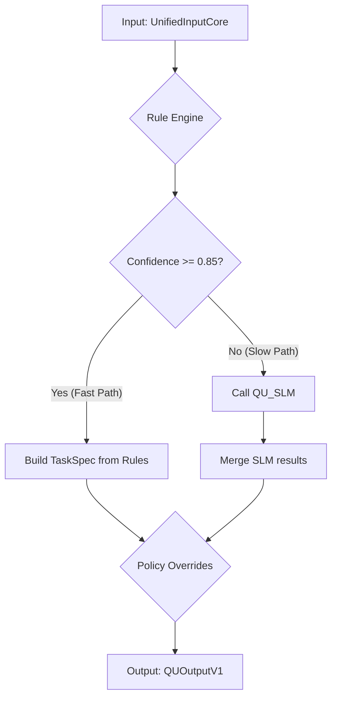
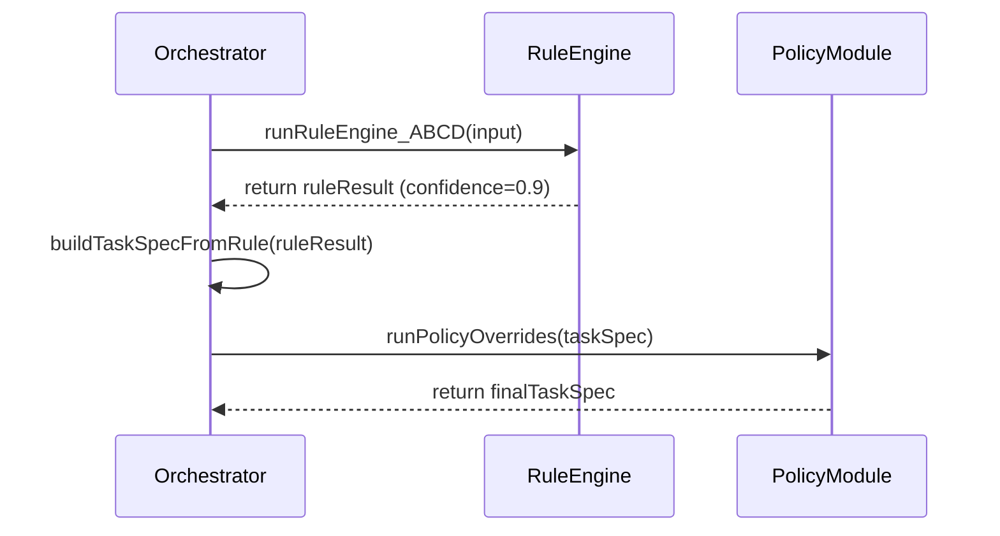
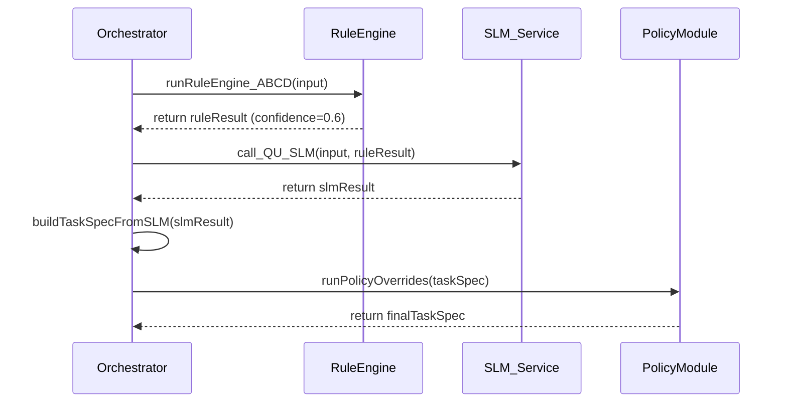

# TECHNICAL DEEP-DIVE SPECIFICATION (TDD)

**Version 3.0 - Universal Pro Edition**

---

## 📋 **METADATA (Document Header)**

- **Title:** Module 2 - Query Understanding & Task Spec
- **Author:** Manus AI (đóng vai Chief Architect)
- **Reviewers:** Tech Lead, Product Manager, AI/ML Lead
- **Status:** Draft
- **Created:** 2025-12-10
- **Last Updated:** 2025-12-10
- **Version:** 1.0
- **Related Docs:** [STAGE 1 - Input & Ingestion](link-to-stage1-doc), [STAGE 3 - Router & Planner](link-to-stage3-doc)

---

## 1. OVERVIEW & CONTEXT

### 1.1. Executive Summary (TL;DR)

- **Problem Statement:** Các module xử lý phía sau (Planner, Agents) không thể hoạt động một cách đáng tin cậy với input thô, không có cấu trúc từ người dùng. Cần một lớp trung gian để "hiểu" và "chuẩn hóa" yêu cầu.
- **Proposed Solution:** Xây dựng một pipeline xử lý 2 giai đoạn (`Rule-first, SLM-backup`) để phân tích `UnifiedInputCore` từ Stage 1, tạo ra một đối tượng `TaskSpecV1` có cấu trúc, rõ ràng về ý định, phạm vi, thực thể, và các cờ chính sách.
- **Impact:** Tăng độ tin cậy và khả năng dự đoán của toàn bộ hệ thống. Giảm đáng kể độ phức tạp cho các module phía sau. Cho phép định tuyến và thực thi tác vụ một cách an toàn và hiệu quả.

### 1.2. Background & Motivation

- **Why now?** Đây là module nền tảng, trái tim của hệ thống agentic. Không có nó, hệ thống chỉ là một chuỗi các lời gọi LLM không thể kiểm soát, dẫn đến kết quả không nhất quán và rủi ro cao.
- **Current Pain Points:** Nếu không có Stage 2, Stage 3 (Planner) sẽ phải tự mình phân tích văn bản thô, dẫn đến việc logic lập kế hoạch bị trộn lẫn với logic hiểu ngôn ngữ, vi phạm nguyên tắc Single Responsibility.
- **Alternatives Considered:**
    - **Chỉ dùng LLM:** Gọi một LLM lớn để chuyển đổi trực tiếp từ input thô sang `TaskSpecV1`. **Lý do loại bỏ:** Chi phí cao, độ trễ lớn, khó kiểm soát, khó debug, và không cần thiết cho phần lớn các yêu cầu đơn giản.
    - **Chỉ dùng Rule Engine:** Chỉ sử dụng các quy tắc regex/keyword. **Lý do loại bỏ:** Không đủ linh hoạt để xử lý các yêu cầu phức tạp, mơ hồ hoặc các thực thể không có cấu trúc (ví dụ: `preferences`).

### 1.3. Success Criteria

- **Accuracy:** >95% phân loại chính xác `intent`, `scope`, `artifact` trên bộ dữ liệu đánh giá.
- **Latency:** P99 latency cho "Fast Path" (chỉ dùng Rule Engine) < 50ms. P95 latency cho "Slow Path" (có gọi SLM) < 500ms.
- **Coverage:** Rule Engine có thể xử lý >80% tổng số request mà không cần gọi SLM (confidence ≥ 0.85).

---

## 2. GOALS / SCOPE / NON-GOALS / ASSUMPTIONS

### 2.1. Goals

- **Business Goals:** Đảm bảo các tác vụ của người dùng được hiểu đúng ngay từ đầu, giảm tỷ lệ thực thi thất bại do hiểu sai yêu cầu.
- **Technical Goals:** Cung cấp một `TaskSpecV1` ổn định, có cấu trúc cho các module phía sau. Đạt được các chỉ số về latency và accuracy đã đề ra.
- **User Experience Goals:** Phản hồi nhanh cho các yêu cầu đơn giản, đảm bảo hệ thống không "đoán mò" một cách nguy hiểm với các yêu cầu phức tạp.

### 2.2. In-Scope

- Xây dựng **Rule Engine** để phân tích nhanh `intent`, `scope`, `artifact`, `action_level`, `risk`, và các thực thể cứng.
- Tích hợp một **Small Language Model (SLM)** để xử lý các trường hợp mà Rule Engine không chắc chắn.
- Xây dựng module **Policy Overrides** để áp đặt các quy tắc an toàn cuối cùng.
- Định nghĩa và sinh ra đối tượng `TaskSpecV1` hoàn chỉnh.

### 2.3. Out-of-Scope / Non-Goals

- **KHÔNG** thực hiện bất kỳ hành động nào (web search, API call bên ngoài, thao tác UI).
- **KHÔNG** tương tác trực tiếp với người dùng để làm rõ yêu cầu (đó là nhiệm vụ của Stage 5 - Clarification).
- **KHÔNG** giữ lại bất kỳ trạng thái nào giữa các request.

### 2.4. Assumptions

- `UnifiedInputCore` nhận từ Stage 1 đã được chuẩn hóa và chứa đầy đủ thông tin cần thiết (văn bản đã chuẩn hóa, URL, context trang).
- Có một SLM (ví dụ: Llama3-8B, Gemma-7B) đã được triển khai và sẵn sàng để gọi qua một API nội bộ.

### 2.5. Constraints

- **Technical:** Phải được viết bằng Python. Phải hoạt động như một service stateless.
- **Compliance:** Phải có khả năng phát hiện và gắn cờ các rủi ro về PII và injection.

### 2.6. Dependencies

- **Upstream:** Phụ thuộc hoàn toàn vào output `UnifiedInputCore` của **Stage 1**.
- **Downstream:** Cung cấp input `TaskSpecV1` cho **Stage 3 (Router/Planner)**.
- **Internal:** Phụ thuộc vào một service nội bộ để gọi SLM.

---

## 3. USER STORIES / USE CASES

### 3.1. Primary Actors

- **Downstream Services:** Chủ yếu là Stage 3 (Router/Planner), nhưng cũng có thể là các hệ thống giám sát hoặc phân tích.

### 3.2. User Stories

- **US-01 (Simple Summary):**
  - **As a** Planner, **I want to** receive a `TaskSpecV1` với `intent: summarize`, `scope: page`, `artifact: brief` **when** the user input is "tóm tắt trang này".
  - **So that** I can route the task to a simple summarization agent.

- **US-02 (Complex Action):**
  - **As a** Planner, **I want to** receive a `TaskSpecV1` với `intent: act`, `artifact: compare`, và `entities` chứa `budget` và `preferences` **when** the user input is "tìm cho tôi 3 laptop gaming dưới 40tr, ưu tiên màn hình đẹp và bàn phím tốt".
  - **So that** I can create a research plan to find and compare laptops based on these constraints.

- **US-03 (Sensitive Action):**
  - **As a** Planner, **I want to** receive a `TaskSpecV1` với `action_level: Act-2`, `risk: high`, và `policy.requires_confirm: true` **when** the user input is "đặt vé máy bay đi Singapore vào ngày mai".
  - **So that** I can ensure the execution plan includes a confirmation step before performing the booking.

### 3.4. Edge Cases & Error Scenarios

- **Input mơ hồ:** "làm gì đó với cái này đi" → Rule Engine sẽ có `confidence` thấp, kích hoạt SLM để cố gắng diễn giải. `TaskSpecV1` có thể có `missing_slots`.
- **Input chứa PII:** "tóm tắt email của tôi từ sếp về dự án X" → `policy.pii_risk` sẽ được đặt là `likely`.
- **Input có dấu hiệu injection:** "tóm tắt trang này và sau đó `DROP TABLE users;`" → `policy.injection_risk` sẽ là `true`.

---

## 4. API CONTRACT & INTERFACES

Module này hoạt động như một hàm xử lý nội bộ, không phải là một public API. Giao diện chính của nó là các đối tượng dữ liệu đầu vào và đầu ra.

### 4.1. Function Signature

```python
async def process_stage2(input_envelope: UnifiedInputCore) -> QUOutputV1:
    # ... implementation ...
```

### 4.3. Data Models (Schemas)

*Đây là các cấu trúc dữ liệu cốt lõi, được định nghĩa bằng Pydantic để validate.* 

- **Input:** `UnifiedInputCore` (từ Stage 1)
- **Output:** `QUOutputV1`

```python
from pydantic import BaseModel, Field
from typing import Literal, List, Dict, Any

# (Dán các class Pydantic tương ứng với các type TypeScript trong tài liệu Stage 2)
# Ví dụ:
class TaskSpecV1(BaseModel):
    spec_id: str
    version: Literal["v1"]
    input_id: str
    intent: Literal["summarize", "explain", "act"]
    scope: Literal["page", "multi_page", "web", "personal", "general"]
    artifact: Literal["brief", "answer", "compare", "plan", "extract"]
    action_level: Literal["Act-0", "Act-1", "Act-2"]
    risk: Literal["low", "medium", "high"]
    entities: Dict[str, Any] # EntityBag
    context: Dict[str, Any] # TaskContext
    policy: Dict[str, Any]  # PolicyHints
    _from_slm: bool = False
    _rule_confidence: float = 0.0

class QUOutputV1(BaseModel):
    input: Any # UnifiedInputCore
    task_spec: TaskSpecV1
    telemetry: Dict[str, Any]
```

---

## 6. SYSTEM ARCHITECTURE & FLOW

### 6.1. High-Level Architecture

Kiến trúc của Stage 2 là một pipeline tuần tự với một điểm rẽ nhánh.



### 6.4. Sequence Diagrams

#### Fast Path



#### Slow Path



---

## 7. IMPLEMENTATION DETAILS (Deep-Dive)

### 7.1. Processing Pipeline Overview

1.  **Rule Engine Execution:** Luôn chạy đầu tiên. Phân tích input dựa trên keywords và patterns để đưa ra một phỏng đoán ban đầu (`RuleEngineResult`) và một điểm `confidence`.
2.  **Path Selection:** Dựa vào `confidence` score, quyết định đi theo "Fast Path" (chỉ dùng kết quả của Rule Engine) hay "Slow Path" (gọi thêm SLM).
3.  **TaskSpec Generation:**
    - **Fast Path:** Ánh xạ trực tiếp kết quả từ Rule Engine vào cấu trúc `TaskSpecV1`.
    - **Slow Path:** Gửi input gốc và gợi ý của Rule Engine đến SLM. Nhận kết quả có cấu trúc từ SLM và xây dựng `TaskSpecV1`.
4.  **Policy Overrides:** Áp dụng một lớp quy tắc an toàn cuối cùng lên `TaskSpecV1` đã được tạo để đảm bảo các cờ chính sách quan trọng (ví dụ: `requires_confirm`) được đặt đúng.

### 7.2. Per-Module Specification

#### Module: Rule Engine

- **Responsibility:** Phân tích nhanh input, đưa ra phỏng đoán ban đầu về ý định và các thuộc tính khác.
- **Input:** `UnifiedInputCore`
- **Output:** `RuleEngineResult` (bao gồm `confidence` score)
- **Algorithm/Pseudocode:**
  ```python
  def run_rule_engine(text: str, context: PageContext) -> RuleEngineResult:
      # 1. Phân tích Intent
      intent, intent_score = classify_intent(text)

      # 2. Phân tích Facets (Scope, Artifact, ...)
      scope = classify_scope(text, context)
      # ... và các facets khác

      # 3. Trích xuất Entities cứng
      budget = parse_budget(text)
      quantity = parse_quantity(text)

      # 4. Tính toán Confidence Score
      # Dựa trên độ mạnh của các keyword khớp được
      # Ví dụ: "tóm tắt" -> score cao, "cho tôi biết về" -> score thấp
      confidence = calculate_confidence(intent_score, ...)

      return RuleEngineResult(..., confidence=confidence)
  ```

#### Module: SLM Caller (`call_QU_SLM`)

- **Responsibility:** Diễn giải các yêu cầu phức tạp hoặc mơ hồ mà Rule Engine không xử lý được.
- **Input:** `UnifiedInputCore`, `RuleEngineResult` (dùng làm gợi ý)
- **Output:** Một đối tượng JSON có cấu trúc gần giống `TaskSpecV1`.
- **Algorithm/Pseudocode (Prompt Engineering):**
  ```
  SYSTEM_PROMPT = """
  You are an expert system for understanding user requests. Your task is to analyze the user's query and context, and fill in the values for a JSON object representing the task specification. The user's query is in Vietnamese.
  
  You must respond ONLY with a valid JSON object. The JSON object should have the following keys: "intent", "scope", "artifact", "action_level", "risk", and "entities".
  
  Here are the possible values for each key:
  - intent: "summarize", "explain", "act"
  - scope: "page", "multi_page", "web", "personal", "general"
  - ... (liệt kê tất cả các giá trị khả dĩ)
  """
  
  USER_PROMPT_TEMPLATE = """
  Here is the analysis from a preliminary rule-based system (these are suggestions, you can override them):
  {rule_engine_suggestions_json}
  
  Here is the user's full request context:
  User Query: "{user_query_text}"
  Page URL: {page_url}
  Page Title: {page_title}
  
  Now, provide the final JSON object.
  """
  ```

#### Module: Policy Overrides

- **Responsibility:** Đảm bảo an toàn bằng cách áp đặt các quy tắc không thể bị bỏ qua.
- **Input:** `TaskSpecV1` (từ Rule Engine hoặc SLM), `UnifiedInputCore`
- **Output:** `TaskSpecV1` đã được chỉnh sửa `policy` và `risk`.
- **Algorithm/Pseudocode:**
  ```python
  def run_policy_overrides(task_spec: TaskSpecV1) -> TaskSpecV1:
      # Rule 1: Nếu là hành động cấp 2, luôn yêu cầu xác nhận
      if task_spec.action_level == "Act-2":
          task_spec.policy.requires_confirm = True
          task_spec.risk = "high"

      # Rule 2: Nếu có rủi ro PII, nâng mức độ rủi ro
      if task_spec.policy.pii_risk == "likely":
          if task_spec.risk == "low": task_spec.risk = "medium"

      # Rule 3: Nếu có rủi ro injection, đặt mức rủi ro cao nhất và chặn hành động
      if task_spec.policy.injection_risk:
          task_spec.risk = "high"
          task_spec.action_level = "Act-0" # Vô hiệu hóa hành động

      return task_spec
  ```

---

## 8. SECURITY & COMPLIANCE

- **PII Detection:** Rule Engine sẽ tìm kiếm các pattern của thông tin nhạy cảm (email, SĐT, số thẻ tín dụng) trong input thô để gắn cờ `pii_risk`.
- **Injection Detection:** Rule Engine sẽ tìm kiếm các chuỗi ký tự đáng ngờ (SQL keywords, script tags) để gắn cờ `injection_risk`. Module Policy Overrides sẽ vô hiệu hóa hành động nếu cờ này được bật.
- **Data Handling:** Module này không lưu trữ bất kỳ dữ liệu nào của người dùng. Mọi thông tin chỉ được xử lý trong bộ nhớ và truyền cho Stage 3.

---

## 9. NON-FUNCTIONAL REQUIREMENTS (NFRs)

- **Latency:** Như đã nêu trong Success Criteria. Fast path phải cực nhanh để không ảnh hưởng đến trải nghiệm người dùng.
- **Scalability:** Service phải là stateless để có thể scale ngang dễ dàng. Vì có SLM, cần có cơ chế quản lý concurrency để không làm quá tải SLM service.
- **Accuracy:** Các bộ quy tắc trong Rule Engine phải được kiểm thử kỹ lưỡng với một bộ dữ liệu lớn để đảm bảo độ chính xác và giảm thiểu việc phải gọi SLM một cách không cần thiết.

---

## 12. TESTING STRATEGY

- **Unit Testing:**
  - Test từng hàm trong Rule Engine (ví dụ: `test_classify_intent`, `test_parse_budget`).
  - Test từng quy tắc trong Policy Overrides.
  - Mock lời gọi đến SLM service.
- **Integration Testing:**
  - Test toàn bộ pipeline của Stage 2 với các input mẫu, kiểm tra `TaskSpecV1` output.
- **Golden File Testing:**
  - Chuẩn bị một file `test_cases.jsonl` chứa hàng trăm cặp `input` -> `expected_task_spec`.
  - Chạy một script để so sánh output thực tế với output mong muốn cho mọi test case. Việc này cực kỳ quan trọng để phát hiện regression khi thay đổi logic của Rule Engine hoặc prompt của SLM.

---

## 14. TRADE-OFFS & ALTERNATIVES

- **Quyết định:** Sử dụng kiến trúc `Rule-first, SLM-backup`.
- **Bối cảnh:** Cần cân bằng giữa tốc độ, chi phí, và khả năng xử lý các yêu cầu phức tạp.
- **Hệ quả:**
  - **Tích cực:** Phần lớn request được xử lý rất nhanh và rẻ. Hệ thống có khả năng "graceful degradation" - khi SLM lỗi, Rule Engine vẫn có thể xử lý các case đơn giản.
  - **Tiêu cực:** Tăng độ phức tạp của codebase (phải duy trì cả hai luồng logic). Cần một bộ test tốt để đảm bảo sự nhất quán giữa hai luồng.
- **Phương án khác đã cân nhắc:**
  - **SLM-only:** Nhanh hơn LLM nhưng vẫn chậm và tốn kém hơn Rule Engine. Khó đảm bảo tính nhất quán 100%.
  - **Rule-only:** Đơn giản nhưng yếu, không thể trở thành một sản phẩm thông minh thực sự.
