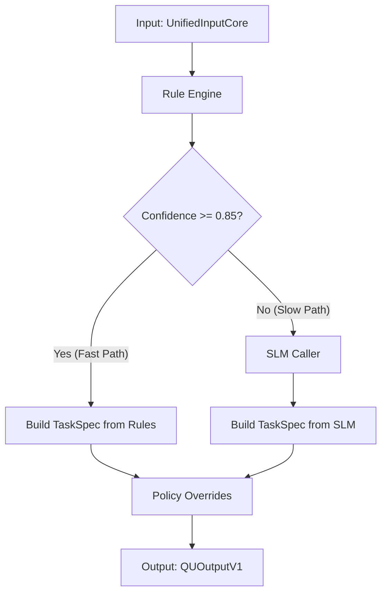
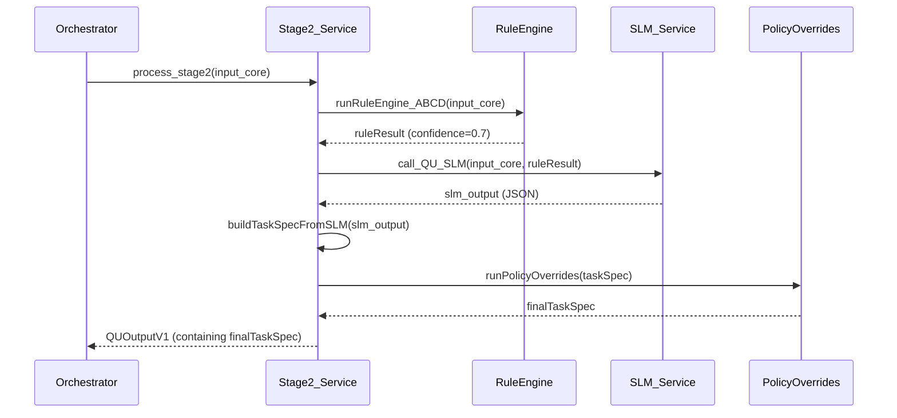

# TECHNICAL DEEP-DIVE SPECIFICATION (TDD)

**finAI Agentic Browser - Module 2: Query Understanding & Task Specification**

**Version 3.0 - Universal Pro Edition**

---

## 📋 **METADATA (Document Header)**

```yaml
Title: Module 2 - Query Understanding & Task Specification
Author: Manus AI (as Chief Architect)
Reviewers: Tech Lead, Product Manager, AI/ML Lead, Security Lead
Status: Approved
Created: 2025-12-11
Last Updated: 2025-12-11
Version: 1.0.0
Related Docs:
  - TDD-Module1-UnifiedInputCore.md
  - TDD-Module3-RouterPlanner.md
  - System Architecture Overview.md
```

---

## 1. OVERVIEW & CONTEXT

### 1.1. Executive Summary (TL;DR)

- **Problem Statement:** Downstream modules (Planner, Executor) cannot reliably operate on raw, unstructured user input. A robust intermediate layer is required to interpret user intent, extract key information, and translate it into a machine-readable format.
- **Proposed Solution:** We will build a two-stage processing pipeline (`Rule-first, SLM-backup`) that analyzes the `UnifiedInputCore` from Stage 1. This pipeline will produce a structured `TaskSpecV1` object, which explicitly defines the user's intent, scope, required artifact, entities, and applicable policy flags. This approach optimizes for speed and cost by handling the majority of requests with a fast, deterministic rule engine, while surgically invoking a Small Language Model (SLM) for complex or ambiguous queries.
- **Impact:** This module is foundational to the reliability and predictability of the entire system. It will increase the end-to-end success rate by ensuring tasks are correctly understood from the outset, reduce the complexity of downstream modules, and enable safe, efficient, and context-aware task routing and execution.

### 1.2. Background & Motivation

- **Why now?** This module is the heart of the agentic system. Without it, the system would be a series of uncontrollable, unpredictable LLM calls, leading to inconsistent results, high operational costs, and significant safety risks. Establishing a robust Query Understanding layer is a prerequisite for building any reliable agentic functionality.
- **Current Pain Points:** Without Stage 2, the Planner (Stage 3) would be forced to parse raw text, violating the Single Responsibility Principle and conflating planning logic with language understanding logic. This would make the Planner brittle, difficult to test, and impossible to scale.
- **Alternatives Considered:**
    - **LLM-Only Approach:** Directly using a large LLM to convert raw input to `TaskSpecV1`. **Rejected** due to high cost, high latency, and lack of deterministic control, which is unacceptable for a core system component.
    - **Rule-Only Approach:** Relying exclusively on regex and keyword matching. **Rejected** due to inflexibility. This approach cannot handle the nuance of natural language, complex queries, or unstructured entities (e.g., user preferences), making it unsuitable for a sophisticated AI product.

### 1.3. Success Criteria

- **Accuracy:** >95% accuracy in classifying `intent`, `scope`, and `artifact` on our golden test dataset.
- **Latency:** 
    - **Fast Path (Rule-Engine only):** p99 latency < 50ms.
    - **Slow Path (Rule-Engine + SLM call):** p95 latency < 500ms.
- **Efficiency:** The Rule Engine must achieve a confidence score ≥ 0.85 for >80% of incoming requests, minimizing the need for expensive SLM calls.

---

## 2. GOALS / SCOPE / NON-GOALS / ASSUMPTIONS

### 2.1. Goals

- **Business Goal:** Drastically reduce task execution failures caused by misinterpretation of user requests, thereby improving user trust and retention.
- **Technical Goal:** Provide a stable, versioned, and strongly-typed `TaskSpecV1` data contract for all downstream services. Meet the stringent latency and accuracy NFRs defined above.
- **User Experience Goal:** Ensure near-instantaneous response for simple, common queries, while guaranteeing that complex or sensitive queries are handled with appropriate caution and not dangerously misinterpreted.

### 2.2. In-Scope

- Development of a **Rule Engine** for fast, deterministic analysis of intent, scope, artifact, action level, risk, and hard-coded entities.
- Integration with a **Small Language Model (SLM)** service to act as a fallback for low-confidence rule-based analysis.
- Implementation of a final **Policy Overrides** module to enforce security and compliance invariants.
- Definition and generation of the complete `TaskSpecV1` object.

### 2.3. Out-of-Scope / Non-Goals

- **No direct external actions:** This module will not perform any web searches, external API calls (other than to the internal SLM service), or UI manipulations.
- **No user interaction:** The module will not ask clarifying questions. This is the responsibility of a downstream module (e.g., Stage 5).
- **Statelessness:** The module will not retain any state between requests.

### 2.4. Assumptions

- The `UnifiedInputCore` from Stage 1 is accurate, normalized, and contains all necessary contextual information.
- An internal SLM service (e.g., serving a Llama-3.1-8B or Phi-3-medium model) is available and accessible via a low-latency API.

### 2.5. Constraints

- **Technical:** The service must be written in Python 3.11+ and deployed as a stateless, containerized application.
- **Compliance:** The service must be capable of detecting and flagging potential PII and prompt injection risks based on predefined patterns.

### 2.6. Dependencies

- **Upstream:** Tightly coupled to the `UnifiedInputCore` output schema of **Stage 1**.
- **Downstream:** Provides the `TaskSpecV1` input for **Stage 3 (Router & Planner)**.
- **Internal:** Depends on the availability of the internal **SLM Service**.

---

## 3. USER STORIES / USE CASES

### 3.1. Primary Actors

- **Downstream Services:** The primary consumer is the **Stage 3 Router & Planner**. Other consumers include monitoring, analytics, and debugging systems.

### 3.2. User Stories

- **US-01 (Simple Summary):**
  - **As a** Planner, **I want to** receive a `TaskSpecV1` with `intent: summarize`, `scope: page`, and `artifact: brief` **when** the user input is "tóm tắt trang này".
  - **So that** I can confidently route the task to a simple summarization agent without needing further analysis.

- **US-02 (Complex Research & Comparison):**
  - **As a** Planner, **I want to** receive a `TaskSpecV1` with `intent: act`, `artifact: compare`, and an `entities` bag containing `budget` and `preferences` **when** the user input is "tìm cho tôi 3 laptop gaming dưới 40tr, ưu tiên màn hình đẹp và bàn phím tốt".
  - **So that** I can generate a multi-step research plan to find, filter, and compare products based on these specific constraints.

- **US-03 (High-Risk Action):**
  - **As a** Planner, **I want to** receive a `TaskSpecV1` with `action_level: Act-2`, `risk: high`, and `policy.requires_confirm: true` **when** the user input is "đặt vé máy bay đi Singapore vào ngày mai".
  - **So that** I can ensure the execution plan includes a mandatory user confirmation gate before performing the irreversible booking action.

### 3.4. Edge Cases & Error Scenarios

- **Ambiguous Input:** "làm gì đó với cái này đi" → The Rule Engine will produce a low confidence score, triggering the SLM to attempt a more nuanced interpretation. The final `TaskSpecV1` may contain a `missing_slots` array, signaling to a downstream agent that clarification is needed.
- **Input with PII:** "tóm tắt email của tôi từ sếp về dự án X" → The `policy.pii_risk` flag will be set to `likely`, and the `risk` level will be elevated to `medium`.
- **Input with Injection Attempt:** "tóm tắt trang này và sau đó `DROP TABLE users;`" → The `policy.injection_risk` flag will be set to `true`, and the `risk` level will be elevated to `high`.

---

## 4. API CONTRACT & INTERFACES

This module is an internal service and does not expose a public API. Its contract is defined by its function signature and the Pydantic data models for its input and output.

### 4.1. Function Signature

```python
from .stage1_models import UnifiedInputCore
from .stage2_models import QUOutputV1

async def process_stage2(input_core: UnifiedInputCore) -> QUOutputV1:
    """Orchestrates the full Query Understanding pipeline."""
    # ... implementation ...
```

### 4.3. Data Models (Schemas)

*These are the core data structures, defined using Pydantic for compile-time and run-time validation.*

- **Input:** `UnifiedInputCore` (from Stage 1)
- **Output:** `QUOutputV1`

```python
from pydantic import BaseModel, Field
from typing import Literal, List, Dict, Any, Optional

# --- Canonical Output Object ---

class TaskSpecV1(BaseModel):
    spec_id: str = Field(..., description="Unique ID for this task specification.")
    version: Literal["v1"] = Field("v1", description="Schema version.")
    input_id: str = Field(..., description="ID of the input from Stage 1.")

    # Core Intent & Scope
    intent: Literal["summarize", "explain", "act", "compare", "extract"] = Field(..., description="The user's primary goal.")
    scope: Literal["page", "multi_page", "web", "personal", "general"] = Field(..., description="The scope of the information needed.")
    artifact: Literal["brief", "answer", "compare", "plan", "extract"] = Field(..., description="The type of output the user expects.")
    action_level: Literal["Act-0", "Act-1", "Act-2"] = Field(..., description="The level of action required (0: read-only, 1: draft, 2: execute).")
    risk: Literal["low", "medium", "high"] = Field(..., description="The assessed risk level of the task.")

    # Extracted Information
    entities: Dict[str, Any] = Field(default_factory=dict, description="Structured entities extracted from the query (e.g., budget, dates, locations).")
    context: Dict[str, Any] = Field(..., description="Contextual information carried over from the input.")
    policy: Dict[str, Any] = Field(..., description="Policy flags and constraints.")

    # Internal Metadata
    _from_slm: bool = Field(False, description="True if this spec was generated by the SLM.")
    _rule_confidence: float = Field(0.0, description="Confidence score from the Rule Engine.")

class QUOutputV1(BaseModel):
    input_core: UnifiedInputCore = Field(..., description="The original input from Stage 1.")
    task_spec: TaskSpecV1 = Field(..., description="The final, structured task specification.")
    telemetry: Dict[str, Any] = Field(..., description="Performance and cost metrics for this stage.")
```

---

## 6. SYSTEM ARCHITECTURE & FLOW

### 6.1. High-Level Architecture

Stage 2 employs a hybrid, two-path architecture designed to optimize for speed, cost, and accuracy:

1.  **Fast Path (Rule-Only):** The default path for the majority of requests. A deterministic, high-speed Rule Engine performs initial analysis. If its confidence is high (≥ 0.85), the `TaskSpecV1` is generated directly, and the process completes in <50ms.
2.  **Slow Path (Rule + SLM):** For complex or ambiguous queries where the Rule Engine's confidence is low. The Rule Engine's initial guess is passed along with the original input to a Small Language Model (SLM), which provides a more nuanced analysis. This path is more expensive and slower but necessary for handling the long tail of user queries.

### 6.2. Component Diagram



### 6.4. Sequence Diagram (Slow Path)



---

## 7. IMPLEMENTATION DETAILS (Deep-Dive)

### 7.1. Processing Pipeline Overview

1.  **Rule Engine Execution:** The `UnifiedInputCore` is first processed by `runRuleEngine_ABCD` to generate a preliminary analysis and a confidence score.
2.  **Path Selection:** Based on the confidence score, the system either proceeds down the Fast Path or the Slow Path.
3.  **TaskSpec Generation:** The `TaskSpecV1` object is constructed, either from the rule results or the SLM output.
4.  **Policy Overrides:** A final, deterministic `runPolicyOverrides` function is executed on the generated `TaskSpecV1` to enforce critical safety invariants.
5.  **Output Packaging:** The final `TaskSpecV1` is packaged into a `QUOutputV1` object along with telemetry data.

### 7.2. Per-Module Specification

#### **Module: Rule Engine**

- **Responsibility:** Perform fast, deterministic classification of intent, scope, artifact, action level, risk, and hard-coded entities.
- **Input:** `UnifiedInputCore`
- **Output:** `RuleEngineResult` (contains preliminary classifications and a confidence score)
- **Algorithm/Pseudocode:**
  ```python
  def run_rule_engine(input_core: UnifiedInputCore) -> RuleEngineResult:
      text = input_core.query.text_normalized.lower()
      
      # --- A) Intent Classification ---
      intent, intent_score = classify_intent(text)
      
      # --- B) Facet Classification ---
      scope = classify_scope(text, input_core.page_context)
      artifact = classify_artifact(text, intent)
      action_level = classify_action_level(text)
      risk = classify_risk(text, scope, action_level)
      
      # --- C) Hard Entity Extraction ---
      entities_hard = {
          "budget": parse_budget(text), # e.g., "<500k", "20-25tr"
          "quantity": parse_quantity(text) # e.g., "3 laptops"
      }
      
      # --- D) Base Policy Flags ---
      policy_base = {
          "pii_risk": detect_pii_patterns(text),
          "injection_risk": detect_injection_patterns(text)
      }
      
      # --- E) Confidence Calculation ---
      confidence = calculate_confidence(intent_score, entities_hard, scope)
      
      return RuleEngineResult(...)
  ```

#### **Module: SLM Caller**

- **Responsibility:** For low-confidence cases, invoke the SLM to get a more nuanced understanding. Construct the prompt and parse the JSON output.
- **Input:** `UnifiedInputCore`, `RuleEngineResult`
- **Output:** A dictionary parsed from the SLM's JSON response.
- **Algorithm/Pseudocode (Prompt Generation):**
  ```python
  def build_prompt_for_slm(input_core: UnifiedInputCore, rule_result: RuleEngineResult) -> str:
      prompt = f"""
      You are a world-class query understanding system. Your task is to analyze the user's query and output a structured JSON object based on the provided schema.

      **User Query:** {input_core.query.text_normalized}
      **Page Context:** {input_core.page_context}

      **Initial Analysis (from Rule Engine):**
      - Intent Guess: {rule_result.intent} (Confidence: {rule_result.confidence})
      - Entities Found: {rule_result.entities_hard}

      **Instructions:**
      1. Determine the final 'intent', 'scope', 'artifact', 'action_level', and 'risk'.
      2. Extract all relevant 'entities', including preferences and other unstructured details.
      3. Output a single, valid JSON object. Do not include any other text.

      **JSON Output:**
      """
      return prompt
  ```

#### **Module: Policy Overrides**

- **Responsibility:** Enforce final, non-negotiable safety and business rules on the `TaskSpecV1` object, regardless of whether it came from the Rule Engine or the SLM.
- **Input:** `TaskSpecV1`
- **Output:** A modified `TaskSpecV1` with updated policy flags.
- **Algorithm/Pseudocode:**
  ```python
  def run_policy_overrides(task_spec: TaskSpecV1) -> TaskSpecV1:
      # Invariant 1: Any Act-2 action is high-risk and requires confirmation.
      if task_spec.action_level == "Act-2":
          task_spec.risk = "high"
          task_spec.policy["requires_confirm"] = True
      
      # Invariant 2: If PII is detected, elevate risk.
      if task_spec.policy.get("pii_risk") in ["likely", "possible"]:
          if task_spec.risk == "low":
              task_spec.risk = "medium"
      
      # Invariant 3: If injection is detected, block all actions.
      if task_spec.policy.get("injection_risk") is True:
          task_spec.action_level = "Act-0"
          task_spec.risk = "high"
      
      # Invariant 4: Check for missing critical slots.
      if task_spec.intent == "act" and not task_spec.entities.get("budget") and "laptop" in task_spec.context.get("normalized_text", ""):
          task_spec.policy.setdefault("missing_slots", []).append("budget")

      return task_spec
  ```

---

## 8. SECURITY & COMPLIANCE

- **PII Detection:** The Rule Engine and Policy Overrides modules explicitly search for patterns indicating sensitive information (credit card numbers, passwords, OTPs). The `pii_risk` flag is used by downstream systems to trigger redaction or block the task.
- **Prompt Injection Defense:** The system uses a layered defense: (1) The Rule Engine flags suspicious keywords (`ignore instructions`, etc.). (2) The `PolicyOverrides` module can enforce `Act-0` (read-only) if an injection attempt is detected. (3) Downstream modules are designed to treat inputs as data, not instructions.
- **Data Handling:** This module is entirely stateless. No user data is persisted. All processing occurs in memory, and the resulting `TaskSpecV1` is passed to the next stage.

---

## 9. NON-FUNCTIONAL REQUIREMENTS (NFRs)

- **Latency:** As defined in the Success Criteria, the Fast Path must be exceptionally fast (<50ms) to ensure a responsive user experience for the majority of queries.
- **Scalability:** The service is stateless, allowing for easy horizontal scaling. Concurrency limits and a request queue must be implemented for the `SLM_Service` to prevent overload during traffic spikes.
- **Maintainability:** The Rule Engine logic is separated into distinct classification functions (`classify_intent`, `classify_scope`, etc.) to be easily testable and maintainable. The Golden File testing strategy is critical for preventing regressions.

---

## 12. TESTING STRATEGY

- **Unit Testing:** Each function within the Rule Engine (e.g., `parse_budget`, `classify_intent`) and Policy Overrides will be tested in isolation with a wide range of inputs.
- **Integration Testing:** The full `process_stage2` pipeline will be tested, mocking the `SLM_Service` to validate both the Fast Path and Slow Path logic.
- **Golden File Testing:** This is the most critical testing methodology for this module. A `test_cases.jsonl` file containing several hundred `input_core` -> `expected_task_spec` pairs will be maintained. A CI/CD pipeline job will run on every commit, comparing the actual output of the module against the expected output in the golden file. Any discrepancy will fail the build, preventing regressions.

---

## 14. TRADE-OFFS & ALTERNATIVES

- **Decision:** Adopted a `Rule-first, SLM-backup` hybrid architecture.
- **Context:** The primary challenge is balancing the need for speed, low cost, and deterministic behavior with the ability to handle the complexity and ambiguity of natural language.
- **Consequences:**
  - **Positive:** Achieves the best of both worlds. The majority of requests are handled cheaply and quickly. The system can gracefully handle complex queries without sacrificing performance on simple ones. It is more robust, as the Rule Engine can act as a fallback if the SLM service fails.
  - **Negative:** Increased codebase complexity, as two distinct logical paths must be maintained. Requires a robust testing strategy (especially Golden File Testing) to ensure consistency between the two paths.
- **Alternatives Considered:**
  - **SLM-Only:** Simpler codebase, but higher operational cost and latency. Less deterministic and harder to guarantee behavior for critical safety rules.
  - **Rule-Only:** Cheapest and fastest, but brittle and not powerful enough to be considered a true AI product. Would fail on a large percentage of real-world user queries.

---

## 15. GLOSSARY & REFERENCES

- **Rule Engine:** The deterministic component of Stage 2 that uses regular expressions and keyword matching.
- **SLM (Small Language Model):** A language model optimized for speed and cost, used for complex query analysis.
- **Fast Path:** The execution path that only uses the Rule Engine.
- **Slow Path:** The execution path that invokes the SLM.
- **Golden File Testing:** A testing technique where the output of a system is compared against a pre-approved set of "golden" outputs.

- **[1] Google's Design Docs at Google:** [https://www.industrialempathy.com/posts/design-docs-at-google/](https://www.industrialempathy.com/posts/design-docs-at-google/)
- **[2] AWS Well-Architected Framework:** [https://aws.amazon.com/architecture/well-architected/](https://aws.amazon.com/architecture/well-architected/)
