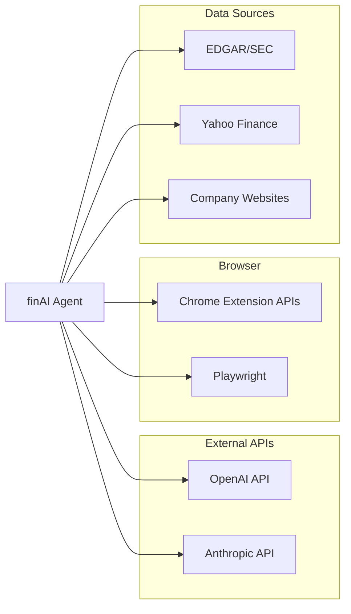

# FinAI Multi-Agent Architecture (Sử dụng kiến trúc Q4 để về sau dễ mở rộng. Vì Q4 khi bật tuyến tính thì sẽ giống Q3)


# SOFTWARE DESIGN DOCUMENT (SDD)

## finAI Finance Agent Web Browser

**Production Quality Standard | Version 1.0**

> 🎯 **Tài liệu này kết hợp 100% best practices từ:**
> 
> - IEEE 1016-2009 Standard
> - Google Design Docs & SRE Book
> - AWS Well-Architected Framework
> - Netflix/Stripe/Meta Production Standards
> - LangGraph Agent Architecture Best Practices
> - MLOps Best Practices cho Financial AI

---

#### 📋 DOCUMENT METADATA

```yaml
## ============================================
## DOCUMENT INFORMATION
## ============================================
Title: "finAI Finance Agent Web Browser - Software Design Document"
Document_ID: "SDD-FINAI-BROWSER-AGENT-V1.0"

## Ownership
Author: "finAI Architecture Team"
Co_Authors: 
  - "Backend Engineering Team"
  - "AI/ML Engineering Team"
  - "Frontend Engineering Team"

## Review & Approval
Reviewers:
  Technical_Lead: "TBD"
  Product_Manager: "TBD"
  Security_Engineer: "TBD"
  QA_Lead: "TBD"
  ML_Engineer: "TBD"
Approved_By: "TBD"

## Status Tracking
Status: "Draft"
Priority: "P0-Critical"

## Timeline
Created_Date: "2025-01-15"
Last_Updated: "2025-01-15"
Target_Release: "2025-Q2 (MVP)"
Review_Deadline: "2025-02-01"

## Versioning (Semantic: X.Y.Z)
Version: "1.0.0"

## Related Documents
Related_Docs:
  PRD: "[Link to PRD]"
  API_Spec: "[Link to OpenAPI Spec]"
  UI_Design: "[Link to Figma]"
  Test_Plan: "[Link to Test Plan]"
  Runbook: "[Link to Runbook]"
  Postmortem_Template: "[Link to Template]"
```

---

#### 📖 MỤC LỤC

###### Part I: Foundation & Architecture

1. [Executive Summary (TL;DR)](https://claude.ai/chat/1177dce0-dde3-4063-8851-e55fb8225fb0##1-executive-summary-tldr)
2. [Introduction](https://claude.ai/chat/1177dce0-dde3-4063-8851-e55fb8225fb0##2-introduction)
3. [Goals, Scope & Constraints](https://claude.ai/chat/1177dce0-dde3-4063-8851-e55fb8225fb0##3-goals-scope--constraints)
4. [System Overview](https://claude.ai/chat/1177dce0-dde3-4063-8851-e55fb8225fb0##4-system-overview)
5. [High-Level Design (HLD)](https://claude.ai/chat/1177dce0-dde3-4063-8851-e55fb8225fb0##5-high-level-design-hld)
6. [Low-Level Design (LLD)](https://claude.ai/chat/1177dce0-dde3-4063-8851-e55fb8225fb0##6-low-level-design-lld)

###### Part II: Implementation Details

7. [API Design & Contracts](https://claude.ai/chat/1177dce0-dde3-4063-8851-e55fb8225fb0##7-api-design--contracts)
8. [Data Design](https://claude.ai/chat/1177dce0-dde3-4063-8851-e55fb8225fb0##8-data-design)
9. [Security Design](https://claude.ai/chat/1177dce0-dde3-4063-8851-e55fb8225fb0##9-security-design)

###### Part III: Production Readiness

10. [Resilience & Reliability](https://claude.ai/chat/1177dce0-dde3-4063-8851-e55fb8225fb0##10-resilience--reliability)
11. [Observability & Monitoring](https://claude.ai/chat/1177dce0-dde3-4063-8851-e55fb8225fb0##11-observability--monitoring)
12. [Deployment & Operations](https://claude.ai/chat/1177dce0-dde3-4063-8851-e55fb8225fb0##12-deployment--operations)
13. [Testing Strategy](https://claude.ai/chat/1177dce0-dde3-4063-8851-e55fb8225fb0##13-testing-strategy)

###### Part IV: Quality & Governance

14. [Non-Functional Requirements (NFR)](https://claude.ai/chat/1177dce0-dde3-4063-8851-e55fb8225fb0##14-non-functional-requirements-nfr)
15. [Performance & Capacity Planning](https://claude.ai/chat/1177dce0-dde3-4063-8851-e55fb8225fb0##15-performance--capacity-planning)
16. [Cost Optimization](https://claude.ai/chat/1177dce0-dde3-4063-8851-e55fb8225fb0##16-cost-optimization)
17. [Trade-offs & Architecture Decisions](https://claude.ai/chat/1177dce0-dde3-4063-8851-e55fb8225fb0##17-trade-offs--architecture-decisions)

###### Part V: Operations & MLOps

18. [Incident Response & Runbooks](https://claude.ai/chat/1177dce0-dde3-4063-8851-e55fb8225fb0##18-incident-response--runbooks)
19. [MLOps (Machine Learning Operations)](https://claude.ai/chat/1177dce0-dde3-4063-8851-e55fb8225fb0##19-mlops-machine-learning-operations)

###### Part VI: Launch & Beyond

20. [Implementation Roadmap](https://claude.ai/chat/1177dce0-dde3-4063-8851-e55fb8225fb0##20-implementation-roadmap)
21. [Production Readiness Checklist](https://claude.ai/chat/1177dce0-dde3-4063-8851-e55fb8225fb0##21-production-readiness-checklist)
22. [Common Mistakes & Anti-Patterns](https://claude.ai/chat/1177dce0-dde3-4063-8851-e55fb8225fb0##22-common-mistakes--anti-patterns)
23. [Tool Recommendations](https://claude.ai/chat/1177dce0-dde3-4063-8851-e55fb8225fb0##23-tool-recommendations)
24. [Appendices](https://claude.ai/chat/1177dce0-dde3-4063-8851-e55fb8225fb0##24-appendices)

---

#### PART I: FOUNDATION & ARCHITECTURE

---

## 1. EXECUTIVE SUMMARY (TL;DR)

> 💡 **Mục đích**: Tóm tắt toàn bộ document trong 1 trang

#### 1.1 Summary Table

|Aspect|Details|
|---|---|
|**Problem Statement**|Financial professionals (analysts, advisors) dành 5-10 giờ/ngày cho research thủ công: mở 10-50 tabs, copy-paste, tổng hợp data từ EDGAR/10-K/earnings calls. Cực kỳ inefficient và error-prone.|
|**Proposed Solution**|finAI Finance Agent Web Browser - AI-native browser extension sử dụng LangGraph để tự động hóa financial research workflow: đọc documents, trích xuất metrics, flagging risks, tạo investment snapshot trong <60 giây.|
|**Business Impact**|Giảm 80% thời gian research (từ 5h xuống 1h), tăng accuracy 95%+, tiết kiệm $50K-200K/year per analyst|
|**Technical Impact**|Latency P95 <3s per action, Accuracy 90%+ extraction, 99.9% uptime, cost <$0.10/task|
|**Key Technology**|Python 3.11+, FastAPI, LangGraph, Playwright, PostgreSQL, Redis, Kafka, Kubernetes|
|**Estimated Effort**|8 người × 4 sprints = 64 man-weeks (MVP), 16 sprints (Production)|
|**Risk Level**|Medium - AI hallucination risk, regulatory compliance, competitive pressure|
|**Timeline**|MVP: Q2 2025, Production: Q4 2025, Scale: 2026|
|**Key Stakeholders**|Product, Engineering, Compliance, Finance Operations|
|**Total Cost (Year 1)**|$150K infrastructure + $500K development = $650K|

#### 1.2 Architecture Overview (4-Layer MECE Framework)

```
┌─────────────────────────────────────────────────────────────────────────┐
│                    finAI FINANCE AGENT WEB BROWSER                       │
├─────────────────────────────────────────────────────────────────────────┤
│                                                                          │
│  ┌─────────────────────────────────────────────────────────────────────┐│
│  │ LAYER 4: GOVERNANCE (Safety & Human Control)                        ││
│  │ • Guardrails: URL whitelist, PII detection, Cost limits             ││
│  │ • HITL: Approval gates, Visual feedback, Take control               ││
│  │ • Compliance: Finance regulations, Audit logs                       ││
│  └─────────────────────────────────────────────────────────────────────┘│
│                              ↓                                           │
│  ┌─────────────────────────────────────────────────────────────────────┐│
│  │ LAYER 3: ACTION (Browser Control & Execution)                       ││
│  │ • Tool Registry: navigate, click, fill, extract, screenshot         ││
│  │ • Playwright Controller + Error Handler + Result Parser             ││
│  │ • Financial Tools: extract_financial_data, compare_metrics          ││
│  └─────────────────────────────────────────────────────────────────────┘│
│                              ↓                                           │
│  ┌─────────────────────────────────────────────────────────────────────┐│
│  │ LAYER 2: COGNITION (Agent Brain - LangGraph Core)                   ││
│  │ • Nodes: Planner → Executor → Verifier → Replan (ReAct Loop)        ││
│  │ • Memory: Redis (short-term) + Pinecone (long-term RAG)             ││
│  │ • LLM: GPT-4o (complex) + Gemini Flash (simple) routing             ││
│  └─────────────────────────────────────────────────────────────────────┘│
│                              ↓                                           │
│  ┌─────────────────────────────────────────────────────────────────────┐│
│  │ LAYER 1: PERCEPTION (Browser State Awareness)                       ││
│  │ • Input: Natural language goal + Context                            ││
│  │ • Hybrid Perception: A11y Tree (90%) + Vision (10% fallback)        ││
│  │ • Change Detection: DOM mutations, Network events                   ││
│  └─────────────────────────────────────────────────────────────────────┘│
│                                                                          │
│  ┌─────────────────────────────────────────────────────────────────────┐│
│  │ EXTERNAL SERVICES                                                   ││
│  │ LLM APIs (OpenAI, Anthropic) │ PostgreSQL │ Redis │ Kafka │ S3     ││
│  └─────────────────────────────────────────────────────────────────────┘│
│                                                                          │
└─────────────────────────────────────────────────────────────────────────┘
```

#### 1.3 Key Metrics & Success Criteria

|KPI|Current (Manual)|Target (finAI MVP)|Target (Production)|Measurement Method|
|---|---|---|---|---|
|**Research Time**|5-10 hours|<1 hour|<30 min|User tracking|
|**Response Time (P95)**|N/A|<5s|<3s|Datadog APM|
|**Extraction Accuracy**|70% (manual)|90%+|95%+|Validation tests|
|**Error Rate**|10%+|<5%|<1%|Prometheus|
|**Throughput**|2-3 stocks/day|20 stocks/day|50+ stocks/day|User metrics|
|**Cost per Task**|$50+ (analyst time)|<$0.50|<$0.10|Cloud billing|
|**Uptime SLA**|N/A|99%|99.9%|StatusPage|
|**User NPS**|N/A|>40|>50|Survey|

#### 1.4 Risk Summary

|Risk|Probability|Impact|Mitigation|
|---|---|---|---|
|**AI Hallucination**|High|Critical|Human-in-loop verification, confidence scores, source attribution|
|**Regulatory (SEC)**|Medium|Critical|"Research tool" positioning, no investment advice, legal review|
|**Competitive (Bloomberg/Microsoft)**|Very High|High|Speed to moat (Year 1-2), vertical depth, community|
|**Technical (Scale)**|Low|Medium|Proven stack (Playwright, LangGraph, K8s)|
|**Data Privacy**|Medium|High|Encryption, local processing, GDPR compliance|

---

## 2. INTRODUCTION

#### 2.1 Document Purpose

Tài liệu này cung cấp **bản thiết kế production-ready** cho **finAI Finance Agent Web Browser**:

- **HLD (High-Level Design)**: Kiến trúc tổng thể 4-Layer với LangGraph core
- **LLD (Low-Level Design)**: Chi tiết implementation từng module, class, function
- **Production Standards**: Security, Observability, Reliability theo Netflix/Google standards
- **MLOps**: LLM integration, model routing, monitoring
- **Operations**: Runbooks, Incident Response, DR procedures

###### Tại sao cần finAI?

**First Principles Analysis:**

1. **Financial workflows ≠ Consumer workflows**
    
    - Trình duyệt hiện tại (Chrome, Safari) thiết kế cho consumer: 1 page ≈ 1 task
    - Financial research: 1 idea = 10-50 tabs (10-K, earnings call, news, screener, broker report)
    - Browsing hiện tại: mở tab → copy-paste → Excel/Notion → tự tổng hợp = **Cực kỳ inefficient**
2. **Accuracy + Provenance = Table stakes cho finance**
    
    - Consumer AI: 95% accuracy có thể accept
    - Finance: 1 sai số = trust destroyed, deal loss, fiduciary liability
    - Mỗi kết luận phải có **source + reasoning + confidence score**
3. **Agentic browsers hiện tại đều generic**
    
    - Comet, Atlas, Dia: tối ưu cho shopping, travel, general research
    - Không hiểu finance semantics, không integrate broker, không có compliance framework

#### 2.2 Target Audience

|Audience|Primary Use|Key Sections|
|---|---|---|
|**Backend Engineers**|Implementation|5-8, 10-13|
|**AI/ML Engineers**|LangGraph, LLM integration|5.4, 6, 19|
|**Frontend Engineers**|Extension UI|7, UI/UX sections|
|**DevOps/SRE**|Operations, Monitoring|10-12, 18|
|**QA Engineers**|Test Strategy|13|
|**Product Managers**|Scope/Timeline|1, 3, 20|
|**Security Team**|Security Review|9|
|**Compliance**|Regulatory|3.5, 9.6|
|**Architects**|Architecture Review|5, 17|

#### 2.3 Definitions & Acronyms

|Term|Definition|
|---|---|
|**finAI**|Financial Intelligence AI - Tên dự án|
|**A11y Tree**|Accessibility Tree - Cấu trúc ngữ nghĩa của trang web|
|**LangGraph**|Framework để xây dựng stateful AI agents|
|**ReAct**|Reasoning + Acting - Pattern cho AI agents|
|**HITL**|Human-in-the-Loop - Con người can thiệp vào quyết định của AI|
|**10-K**|Báo cáo thường niên SEC của công ty Mỹ|
|**EDGAR**|Electronic Data Gathering, Analysis, and Retrieval - Hệ thống SEC|
|**SDD**|Software Design Document|
|**HLD/LLD**|High/Low-Level Design|
|**NFR**|Non-Functional Requirement|
|**SLA/SLO/SLI**|Service Level Agreement/Objective/Indicator|
|**ADR**|Architecture Decision Record|
|**RPO/RTO**|Recovery Point/Time Objective|
|**MTBF/MTTR**|Mean Time Between Failures / To Repair|
|**CoT**|Chain-of-Thought - Kỹ thuật prompting|
|**ICP**|Ideal Customer Profile|
|**AUM**|Assets Under Management|
|**RIA**|Registered Investment Advisor|

#### 2.4 Document Standards

This document follows:

- **IEEE 1016-2009**: Software Design Descriptions
- **C4 Model**: Architecture visualization (Context, Container, Component, Code)
- **OpenAPI 3.0**: API specifications
- **ADR Format**: Architecture decisions
- **LangGraph Patterns**: Agent architecture best practices

---

## 3. GOALS, SCOPE & CONSTRAINTS

#### 3.1 Goals

###### Business Goals (10-Year Vision)

| Goal                  | Metric                                                | Target                      | Timeline |
| --------------------- | ----------------------------------------------------- | --------------------------- | -------- |
| **Market Leadership** | Market share in financial research tools              | 30-50% of buy-side analysts | 2035     |
| **Revenue**           | ARR                                                   | $100M+                      | 2035     |
| **User Base**         | Paid users                                            | 50K-100K professionals      | 2035     |
| **Category Creation** | "Financial Intelligence Browser" category recognition | Industry standard term      | 2030     |

###### Business Goals (18-Month MVP)

|Goal|Metric|Target|Timeline|
|---|---|---|---|
|**User Acquisition**|Paid users|1,000|Month 18|
|**Revenue**|MRR|$10K|Month 18|
|**Retention**|Monthly churn|<10%|Month 12+|
|**Product-Market Fit**|NPS|>40|Month 18|
|**Word-of-Mouth**|Referral rate|30%+|Month 18|

###### Technical Goals

|Goal|Metric|Target|Timeline|
|---|---|---|---|
|**Performance**|P95 Latency per action|<3s|Sprint 5|
|**Accuracy**|Financial data extraction|90%+ (obvious), 75%+ (complex)|Sprint 6|
|**Reliability**|Uptime|99.9%|Production|
|**Scalability**|Concurrent users|10K|Q4 2025|
|**Security**|Vulnerability|Zero Critical|Ongoing|
|**Cost Efficiency**|Cost per task|<$0.10|Q4 2025|

#### 3.2 In-Scope ✅

###### MVP (Must Have) - Phase 1 (Months 1-18)

**finAI Research Agent Chrome Extension:**

|Feature|Description|Priority|
|---|---|---|
|✅ **Document Understanding**|User opens 10-K/earnings/news → finAI auto-analyze, show sidebar with summary|P0|
|✅ **Metric Extraction**|Extract: Revenue, EBITDA, Margin, Debt, Guidance, YoY change|P0|
|✅ **Risk Flagging**|Auto-detect: covenant breach risk, leverage spike, guidance miss, concentration|P0|
|✅ **1-Page Snapshot**|Summary card: thesis, key metrics, risks, next steps (exportable)|P0|
|✅ **Source Attribution**|Every number + quote from source document; confidence score|P0|
|✅ **Portfolio Context**|If user has portfolio linked → highlight positions, sector exposure|P1|
|✅ **Version History**|Track changes to analysis as new info emerges|P1|

###### Phase 2 (Should Have) - Months 12-36

|Feature|Description|Priority|
|---|---|---|
|📋 **Portfolio Monitoring**|Monitor user portfolio, news about holdings, risk alerts, sector trends|P1|
|📋 **Multi-document Synthesis**|Compare multiple 10-Ks, earnings across quarters|P1|
|📋 **Enterprise Tier**|Multi-seat licenses, admin dashboard, compliance monitoring|P2|
|📋 **Broker Integrations**|Connect to Schwab, Fidelity, E*TRADE|P2|

###### Phase 3 (Nice to Have) - Months 24-60

|Feature|Description|Priority|
|---|---|---|
|💡 **Agent Marketplace**|API for third-party agents (credit analyst, macro agent, ESG)|P3|
|💡 **Trading Copilot**|"Here's the 5 best trades for your mandate" (recommend, not execute)|P3|
|💡 **Financial Intelligence OS**|Unified layer on top of all financial systems|P3|

#### 3.3 Out-of-Scope / Non-Goals ❌

> ⚠️ **Critical**: Prevent scope creep

|Non-Goal|Reason|Future Phase?|
|---|---|---|
|❌ **Investment Advice**|Regulatory (SEC), Fiduciary liability|Never (positioning)|
|❌ **Auto-Execute Trades**|High risk, liability|Phase 3 (beta only)|
|❌ **Mobile App**|Different team, complexity|Parallel track|
|❌ **Multi-language**|English-first for US market|Phase 2|
|❌ **Real-time Trading**|Latency requirements different|Separate product|
|❌ **Custom LLM Training**|Cost, complexity, time|Phase 3|
|❌ **Earnings Call Transcription**|Exists elsewhere, commoditized|v2|
|❌ **Team Collaboration**|Enterprise feature|Phase 2|

#### 3.4 Assumptions

|ID|Assumption|Impact if Wrong|Validation|
|---|---|---|---|
|A1|LLM APIs (OpenAI, Anthropic) available 99.9%+|High - core dependency|Monitor, multi-provider fallback|
|A2|Chrome Extension APIs stable|Medium - UI changes|Abstract extension layer|
|A3|Financial websites (EDGAR, Yahoo Finance) accessible|High - core data source|Monitor, fallback sources|
|A4|Users willing to pay $100-200/month|Critical - business model|Customer interviews (80%+ validation)|
|A5|90%+ extraction accuracy achievable|High - value proposition|POC testing with 20 documents|
|A6|Team can hire 3-5 engineers in 3 months|Medium - timeline|Parallel recruiting|
|A7|AWS/GCP infrastructure available|Low - commodity|Multi-cloud capable|

#### 3.5 Constraints

###### Technical Constraints

|Constraint|Reason|Workaround|
|---|---|---|
|Python 3.11+|LangGraph, FastAPI requirements|N/A|
|Playwright|Best browser automation library|N/A|
|PostgreSQL|ACID compliance for financial data|N/A|
|Chrome/Edge only (MVP)|Market share, extension APIs|Firefox in Phase 2|
|US Financial Sites only (MVP)|Scope, regulatory|International in Phase 2|

###### Business Constraints

|Constraint|Impact|Mitigation|
|---|---|---|
|Budget <$500K Year 1|Limited team, infra|Lean MVP, reserved instances|
|Launch Q2 2025|Tight timeline|Reduce MVP scope|
|5-person team (start)|Limited bandwidth|Prioritize ruthlessly|

###### Compliance & Regulatory

|Regulation|Requirement|Implementation|
|---|---|---|
|**SEC**|Not registered investment advisor|"Research tool" positioning, disclaimers|
|**GDPR**|EU data protection|Data masking, encryption, EU storage option|
|**SOC2**|Security controls|Audit logging, access controls|
|**FINRA**|Broker-dealer rules (if applicable)|Legal review, no advice positioning|

**Legal Positioning (Day 1):**

- Clear "research tool" vs "investment advisor" positioning
- No "buy/sell" recommendations - only "research snapshot" + "scenario analysis"
- Clear disclaimers in every output
- Errors & Omissions insurance coverage
- Partnership with RIA to review product positioning

#### 3.6 Dependencies



|Dependency|Owner|Risk Level|Fallback|
|---|---|---|---|
|OpenAI GPT-4o|External|Medium|Claude, Gemini|
|Anthropic Claude|External|Medium|GPT-4o, Gemini|
|Chrome Extension APIs|Google|Low|Firefox WebExtensions|
|Playwright|Microsoft|Low|Puppeteer|
|EDGAR/SEC|Government|Low|Manual fetch|
|Financial Data APIs|Various|Medium|Multiple providers|

---

## 4. SYSTEM OVERVIEW

#### 4.1 Business Context

###### Problem Statement

**Current State (Manual Research):**

```
1. Analyst receives request: "Analyze Tesla Q3 earnings"
2. Opens 10+ tabs: EDGAR, Yahoo Finance, company IR, news, competitors
3. Downloads 10-K (200+ pages), earnings call transcript
4. Manually reads, highlights, extracts key metrics
5. Copies data to Excel, calculates ratios
6. Writes investment memo in Word/Notion
7. Time: 5-10 hours per stock
8. Error rate: 10%+ (typos, missed info, calculation errors)
```

**Target State (finAI):**

```
1. Analyst opens finAI, types: "Analyze Tesla Q3 earnings"
2. Agent automatically:
   - Navigates to EDGAR, downloads 10-K
   - Extracts key metrics: Revenue, EBITDA, Margins, Guidance
   - Flags risks: Debt covenants, competition, regulatory
   - Creates 1-page investment snapshot
3. Analyst reviews, edits, exports
4. Time: <1 hour per stock
5. Error rate: <5% (verified extraction)
```

###### Value Proposition

**For Buy-side Equity Analysts:**

- Save 4+ hours/day on routine research
- Reduce error rate from 10% to <5%
- Focus on high-value analysis instead of data gathering
- Always have source attribution for compliance

**For Independent Financial Advisors:**

- Deep research for every client without extra time
- Professional-grade analysis at scale
- Client-ready reports in minutes

###### TAM/SAM/SOM Analysis

|Market|Size|Description|
|---|---|---|
|**TAM**|$240B|Global financial research & analytics market|
|**SAM**|$24B|Digital/AI-powered research tools|
|**SOM (Year 5)**|$100M|finAI addressable (50K users × $2K/year)|

#### 4.2 Stakeholders

|Stakeholder|Interest|Communication|
|---|---|---|
|**Executive Team**|ROI, Timeline, Competitive positioning|Monthly report|
|**Product**|Features, User feedback, Roadmap|Weekly sync|
|**Engineering**|Architecture, Tech debt, Quality|Sprint review|
|**Operations/SRE**|Uptime, Incidents, Scaling|Daily standup|
|**Compliance**|Regulatory risk, Disclaimers|Bi-weekly review|
|**Users (Analysts)**|Time savings, Accuracy|Continuous feedback|
|**Investors**|Growth, Metrics, Moat|Quarterly update|

#### 4.3 Functional Requirements

|ID|Module|Description|Priority|Acceptance Criteria|
|---|---|---|---|---|
|FR-001|Perception|Receive natural language goal from user|P0|Parse goal in <1s, extract entities|
|FR-002|Perception|Extract A11y Tree from web page|P0|95%+ pages extracted successfully|
|FR-003|Perception|Capture screenshot for Vision fallback|P1|<500ms capture time|
|FR-004|Cognition|Plan multi-step action sequence|P0|Generate valid plan 90%+|
|FR-005|Cognition|Execute ReAct loop (Reason-Act-Observe)|P0|Complete loop <5s per step|
|FR-006|Cognition|Re-plan on failure|P0|80%+ recovery rate|
|FR-007|Action|Navigate to URL|P0|<3s load time|
|FR-008|Action|Click element|P0|95%+ success rate|
|FR-009|Action|Fill form field|P0|95%+ success rate|
|FR-010|Action|Extract text from page|P0|99%+ accuracy|
|FR-011|Action|Extract table data|P0|90%+ accuracy|
|FR-012|Governance|Check URL whitelist|P0|100% enforcement|
|FR-013|Governance|Detect PII in data|P0|99%+ detection rate|
|FR-014|Governance|Request human approval for sensitive actions|P0|100% enforcement|
|FR-015|Output|Generate 1-page investment snapshot|P0|Complete in <60s|
|FR-016|Output|Provide source attribution|P0|100% claims cited|
|FR-017|Output|Calculate confidence score|P0|Calibrated scores|

#### 4.4 User Stories (Gherkin)

###### Core User Stories

```gherkin
Feature: Financial Document Analysis
  As a buy-side equity analyst
  I want to automatically analyze financial documents
  So that I can make faster, more informed investment decisions

  Scenario: Analyze 10-K Report
    Given I am logged into finAI extension
    And I have opened a company's 10-K report on EDGAR
    When I click "Analyze Document"
    Then the agent should extract key financial metrics
    And display Revenue, EBITDA, Margin, Debt, YoY changes
    And flag any risk factors detected
    And provide source page numbers for each metric
    And generate a 1-page investment snapshot
    And complete analysis in less than 60 seconds
    
  Scenario: Compare Multiple Companies
    Given I have analyzed 3 companies in the same sector
    When I select "Compare Companies"
    Then the agent should create a comparison table
    And highlight relative strengths and weaknesses
    And provide exportable format (PDF, Excel)

  Scenario: Risk Detection
    Given I am analyzing a company's financial documents
    When the agent detects a potential risk
    Then it should flag the risk prominently
    And provide specific evidence from the document
    And suggest related areas to investigate
    And assign a severity level (High/Medium/Low)

  Scenario: Portfolio Context Integration
    Given I have linked my brokerage account
    And I am analyzing a stock in my portfolio
    When the analysis completes
    Then it should show my current position
    And highlight how new information affects my thesis
    And suggest rebalancing considerations (not advice)
```

###### Edge Cases & Error Handling

```gherkin
  Scenario: Document Load Failure
    Given I am analyzing a document
    When the EDGAR website is unavailable
    Then the agent should retry 3 times with exponential backoff
    And if still failing, show a clear error message
    And suggest alternative data sources
    And log the error for debugging

  Scenario: Low Confidence Extraction
    Given the agent is extracting financial metrics
    When confidence score is below 70%
    Then the metric should be flagged for human review
    And show the original text for verification
    And allow user to correct the value

  Scenario: Sensitive Action Detection
    Given I have asked the agent to fill a form
    When the form contains financial data fields
    Then the agent should pause and request confirmation
    And show exactly what will be filled
    And require explicit user approval before proceeding
```

#### 4.5 Competitive Landscape

###### Direct Competitors (Agentic Browsers)

|Competitor|Strengths|Weaknesses|finAI Advantage|
|---|---|---|---|
|**Perplexity Comet**|AI-native, fast, general research|Generic, no finance features|Vertical specialization|
|**OpenAI Operator**|Vision-based, powerful LLM|Expensive, high latency|Cost efficiency, speed|
|**Adept ACT-1**|SaaS automation|Enterprise focus, expensive|Consumer focus|
|**Browser Use**|Open-source, flexible|Basic, no production features|Production quality|

###### Indirect Competitors (Traditional)

|Competitor|Cost|What it does|finAI Advantage|
|---|---|---|---|
|**Bloomberg Terminal**|$2K-5K/mo|Integrated data, research|AI-native, 10x cheaper|
|**FactSet**|$2K-10K/mo|Multi-source data, charting|Self-service, faster|
|**ChatGPT**|$20/mo|General Q&A|Finance-tuned, no hallucination|
|**Manual Research**|Time cost|Read, copy-paste|10x faster|

###### Competitive Moat Strategy

|Year|Moat Layer|Action|Defensibility|
|---|---|---|---|
|Y1|Data + Compliance|Build proprietary financial doc parsing, 1K+ users|6/10|
|Y2|Compliance + Brand|Exclusive broker integrations, zero incidents|7/10|
|Y3|Network Effects|10K users, portfolio intelligence, peer insights|8/10|
|Y4-5|All 3 layers|Adjacent expansion, 50K users|9/10|

---


## 1. HIGH LEVEL ARCHITECTURE

### 1.1. So sánh với ReAct Pattern hiện tại

#### ReAct Pattern (Cũ):

```
User Request 
    ↓
[Layer 1: Perception] → Parse query
    ↓
[Layer 2: Cognition - SEQUENTIAL NODES]
    perceive_node
        ↓
    plan_navigation_node
        ↓
    navigate_browser_node
        ↓
    extract_data_node
        ↓
    verify_data_node
        ↓ (conditional)
    renavigate_node OR synthesize_node
    ↓
[Layer 3: Action] → Tools (browser, extractors)
    ↓
Final Report
```

**Vấn đề:**

- Linear flow, không linh hoạt
- Một "brain" quyết định tất cả
- Khó scale và mở rộng
- Khó test từng phần độc lập

#### Multi-Agent Pattern (Mới):

```
User Request
    ↓
[Layer 1: Perception] → Parse query
    ↓
[Layer 2: Cognition - MULTI-AGENTS VIA MESSAGE BUS]
    
    Chief Agent (Coordinator)
        ↓ broadcast "task_available"
        ├─→ Planner Agent
        │       ↓ publishes "plan_ready"
        ├─→ Navigator Agent (subscribes to "plan_ready")
        │       ↓ publishes "page_ready"
        ├─→ Extractor Agent (subscribes to "page_ready")
        │       ↓ publishes "data_extracted"
        ├─→ Verifier Agent (subscribes to "data_extracted")
        │       ↓ publishes "verification_done"
        │       ↓ (if needs_renavigation) publishes "renavigate_request"
        └─→ Synthesizer Agent (subscribes to "verification_done")
                ↓ publishes "final_report"
    
    All agents communicate via MessageBus (Redis PubSub)
    ↓
[Layer 3: Action] → Tools shared by agents
    ↓
Final Report
```

**Ưu điểm:**

- Mỗi agent độc lập, có trách nhiệm riêng
- Parallel processing có thể xảy ra
- Dễ test, debug từng agent
- Dễ mở rộng thêm agents mới (e.g., CacheAgent, ValidatorAgent)
- Có thể competitive mode cho một số agents

---

## 2. AGENTS DEFINITION

### 2.1. Chief Agent (Điều phối)

**Responsibilities:**

- Nhận user request từ Layer 1
- Broadcast task lên MessageBus
- Thu thập kết quả từ các agents
- Quyết định khi nào synthesize final report
- Không micromanage, chỉ điều phối

**Subscribed Topics:**

- `plan_ready`
- `verification_done`
- `final_report`

**Published Topics:**

- `task_available`

---

### 2.2. Planner Agent (Lập kế hoạch)

**Responsibilities:**

- Nhận task từ Chief
- Phân tích financial query
- Tạo navigation plan (URLs, steps, metrics to extract)
- Publish plan lên bus

**Subscribed Topics:**

- `task_available`
- `renavigate_request` (từ Verifier nếu cần re-plan)

**Published Topics:**

- `plan_ready`

**Analogy:**

- Giống như node `plan_navigation_node` cũ
- Nhưng bây giờ là agent độc lập với LLM reasoning

---

### 2.3. Navigator Agent (Điều khiển trình duyệt)

**Responsibilities:**

- Nhận plan từ Planner
- Điều khiển Playwright browser
- Navigate đến URLs
- Capture screenshots, HTML, accessibility tree
- Publish page content lên bus

**Subscribed Topics:**

- `plan_ready`

**Published Topics:**

- `page_ready` (chứa URL, HTML, screenshots)

**Tools Used:**

- `PlaywrightController`
- `BrowserPool`

**Analogy:**

- Giống như node `navigate_browser_node` cũ

---

### 2.4. Extractor Agent (Trích xuất dữ liệu)

**Responsibilities:**

- Nhận page content từ Navigator
- Extract financial metrics (price, revenue, ratios, tables)
- Sử dụng LLM hoặc structured extractors
- Publish extracted data lên bus

**Subscribed Topics:**

- `page_ready`

**Published Topics:**

- `data_extracted`

**Tools Used:**

- `FinancialDataExtractor`
- LLM với structured output

**Analogy:**

- Giống như node `extract_data_node` cũ

---

### 2.5. Verifier Agent (Xác thực dữ liệu)

**Responsibilities:**

- Nhận extracted data từ Extractor
- Verify accuracy, completeness, confidence
- Quyết định:
    - Nếu đủ tốt → publish `verification_done`
    - Nếu chưa đủ → publish `renavigate_request` (quay lại Planner)

**Subscribed Topics:**

- `data_extracted`

**Published Topics:**

- `verification_done`
- `renavigate_request` (nếu cần)

**Analogy:**

- Giống như node `verify_data_node` cũ
- Nhưng có khả năng request re-navigation

---

### 2.6. Synthesizer Agent (Tổng hợp báo cáo)

**Responsibilities:**

- Nhận verified data từ Verifier
- Tổng hợp thành final report
- Add source attribution
- Publish final report lên bus cho Chief

**Subscribed Topics:**

- `verification_done`

**Published Topics:**

- `final_report`

**Analogy:**

- Giống như node `synthesize_node` cũ

---

## 3. MESSAGE BUS & COMMUNICATION

### 3.1. MessageBus (Redis PubSub)

```python
class MessageBus:
    - subscribers: Dict[str, List[Callable]]
    - message_history: List[Message]
    - action_logs: List[Dict]
    
    Methods:
    - subscribe(topic, callback)
    - publish(message)
    - get_history(topic)
    - add_action_log(agent_name, action, details)
```

### 3.2. Message Schema

```python
@dataclass
class Message:
    from_agent: str
    to_agent: str  # "broadcast" or agent name
    topic: str
    payload: Dict[str, Any]
    timestamp: float
    message_id: str
```

### 3.3. Topics Flow

```
task_available
    ↓
plan_ready
    ↓
page_ready
    ↓
data_extracted
    ↓
verification_done → final_report
    ↑
renavigate_request (optional)
```

---

## 4. FOLDER STRUCTURE (MỚI)

```
app/module/finai_agent/
├── __init__.py
├── agent_entrypoint.py          # Entry point chính
├── IMPLEMENTATION_STATUS.md
│
├── core/                         # Giữ nguyên core config
│   ├── __init__.py
│   ├── agent_config.py
│   └── base_extractor.py
│
├── interfaces/                   # Giữ nguyên interfaces
│   ├── __init__.py
│   ├── financial_interface.py
│   └── generic_browser_interface.py
│
├── layer_0_governance/          # Giữ nguyên governance
│   ├── __init__.py
│   ├── phase_1_input_gate/
│   ├── phase_2_in_flight_guards/
│   └── phase_3_output_gate/
│
├── layer_1_perception/          # Giữ nguyên perception (input processing)
│   ├── __init__.py
│   ├── context_builder.py
│   ├── entity_extractor.py
│   ├── input_processor.py
│   └── models.py
│
├── layer_2_cognition/           # ⭐ THAY ĐỔI HOÀN TOÀN
│   ├── __init__.py
│   │
│   ├── message_bus.py          # MessageBus implementation (copy từ demo_cursor_agent)
│   ├── base_agent.py           # P2PAgent base class (copy từ demo_cursor_agent)
│   │
│   ├── agent_chat_run.py       # LLM helper với Langfuse (copy từ demo_cursor_agent)
│   ├── agent_prompt_config.py  # Prompt config từ Langfuse (copy từ demo_cursor_agent)
│   ├── agent_prompt_service.py # Prompt service (copy từ demo_cursor_agent)
│   │
│   ├── chief_agent/            # Chief Agent
│   │   ├── __init__.py
│   │   └── chief.py            # ChiefAgent class
│   │
│   ├── planner_agent/          # Planner Agent
│   │   ├── __init__.py
│   │   └── planner.py          # PlannerAgent class
│   │
│   ├── navigator_agent/        # Navigator Agent
│   │   ├── __init__.py
│   │   └── navigator.py        # NavigatorAgent class
│   │
│   ├── extractor_agent/        # Extractor Agent
│   │   ├── __init__.py
│   │   └── extractor.py        # ExtractorAgent class
│   │
│   ├── verifier_agent/         # Verifier Agent
│   │   ├── __init__.py
│   │   └── verifier.py         # VerifierAgent class
│   │
│   └── synthesizer_agent/      # Synthesizer Agent
│       ├── __init__.py
│       └── synthesizer.py      # SynthesizerAgent class
│
├── layer_3_action/              # Giữ nguyên tools (shared by agents)
│   ├── __init__.py
│   ├── tool_registry.py
│   ├── browser/
│   │   ├── __init__.py
│   │   ├── browser_pool.py
│   │   └── playwright_controller.py
│   └── tools/
│       ├── __init__.py
│       ├── base_tool.py
│       ├── browser_tools.py
│       └── financial_data_extractor.py
│
├── repositories/                # Giữ nguyên repositories
│   ├── __init__.py
│   └── query_repository.py
│
└── migrations/                  # Giữ nguyên migrations
    └── 001_create_tables.sql
```

---

## 5. DATA FLOW DIAGRAM

### 5.1. Happy Path Flow

```
[User Request]
    ↓
[Layer 1: Perception]
    input_processor → entity_extractor → context_builder
    ↓ (FinancialQuery + Context)
    
[Layer 2: Multi-Agent Orchestration]
    ↓
Chief Agent
    │ broadcast("task_available", {query, context})
    ↓
Planner Agent (receives task)
    │ → Analyze query
    │ → Create navigation plan
    │ publish("plan_ready", {navigation_plan})
    ↓
Navigator Agent (receives plan)
    │ → Navigate to URLs
    │ → Capture page content
    │ publish("page_ready", {url, html, screenshot})
    ↓
Extractor Agent (receives page)
    │ → Extract financial metrics
    │ → Parse tables/data
    │ publish("data_extracted", {metrics, tables})
    ↓
Verifier Agent (receives data)
    │ → Verify accuracy
    │ → Check confidence
    │ publish("verification_done", {verified_data, confidence})
    ↓
Synthesizer Agent (receives verified data)
    │ → Generate final report
    │ → Add source attribution
    │ publish("final_report", {report, sources})
    ↓
Chief Agent (receives final report)
    │ → Collect results
    │ → Return to user
    ↓
[Layer 0: Output Gate]
    result_validator
    ↓
[Final Response to User]
```

### 5.2. Re-navigation Flow (khi data không đủ)

```
Verifier Agent
    │ (data confidence < threshold)
    │ publish("renavigate_request", {reason, missing_metrics})
    ↓
Planner Agent (receives renavigate_request)
    │ → Adjust plan
    │ → Add alternative URLs
    │ publish("plan_ready", {adjusted_plan})
    ↓
Navigator Agent → ... (tiếp tục flow)
```

---

## 6. STATE MANAGEMENT

### 6.1. Shared State (via MessageBus history)

- Mỗi agent không giữ shared state
- Tất cả communication qua messages
- MessageBus lưu message_history để debug

### 6.2. Agent-specific State

Mỗi agent có state riêng:

```python
class PlannerAgent(P2PAgent):
    current_plan: Optional[Dict]
    retry_count: int = 0
    max_retries: int = 3
```

### 6.3. FinAIState (Optional - for backward compatibility)

Có thể giữ `FinAIState` nhưng không bắt buộc, chỉ để:

- Logging
- Debugging
- Compatibility với old code

---

## 7. IMPLEMENTATION STEPS

### Phase 1: Setup Infrastructure

1. Copy `message_bus.py` từ demo_cursor_agent
2. Copy `base_agent.py` (P2PAgent)
3. Copy `agent_chat_run.py`, `agent_prompt_*` (LLM helpers)

### Phase 2: Implement Agents (theo thứ tự)

1. **Chief Agent** - Điều phối chính
2. **Planner Agent** - Migrate logic từ `plan_navigation_node`
3. **Navigator Agent** - Migrate logic từ `navigate_browser_node`
4. **Extractor Agent** - Migrate logic từ `extract_data_node`
5. **Verifier Agent** - Migrate logic từ `verify_data_node`
6. **Synthesizer Agent** - Migrate logic từ `synthesize_node`

### Phase 3: Integration & Testing

1. Update `agent_entrypoint.py` để khởi tạo multi-agent system
2. Test từng agent độc lập
3. Test flow end-to-end
4. Performance tuning

### Phase 4: Cleanup

1. Xóa hoặc archive old `layer_2_cognition/nodes/`
2. Xóa hoặc archive old `layer_2_cognition/graph.py`
3. Update documentation

---

## 8. KEY DIFFERENCES vs ReAct Pattern

|Aspect|ReAct Pattern (Cũ)|Multi-Agent (Mới)|
|---|---|---|
|**Architecture**|Linear Graph (LangGraph)|Message Bus (Redis PubSub)|
|**Decision Making**|One "brain" decides all|Each agent decides independently|
|**Flow**|Sequential nodes|Asynchronous P2P messages|
|**State**|Shared `FinAIState` passed through nodes|Messages on bus, agent-specific state|
|**Testing**|Hard to test individual nodes|Easy to test each agent|
|**Scalability**|Limited, linear|High, can add agents easily|
|**Parallelism**|No (sequential)|Yes (agents can work concurrently)|
|**Competitive Mode**|Not supported|Supported (like Cursor demo)|
|**Debugging**|Hard, need to trace entire graph|Easy, message history + action logs|

---

## 9. BENEFITS

### 9.1. Separation of Concerns

- Mỗi agent chỉ lo một việc
- Dễ maintain, dễ đọc code

### 9.2. Testability

- Test từng agent độc lập
- Mock messages dễ dàng

### 9.3. Scalability

- Add agent mới không ảnh hưởng code cũ
- Ví dụ: thêm `CacheAgent`, `RateLimiterAgent`, `RetryAgent`

### 9.4. Observability

- Action logs cho UI
- Message history for debugging
- Langfuse tracking per agent

### 9.5. Flexibility

- Agents có thể work parallel (nếu muốn)
- Competitive mode giữa agents
- Dynamic routing via topics

---

## 10. MIGRATION STRATEGY

### 10.1. Backward Compatibility

- Giữ `layer_1_perception/` nguyên
- Giữ `layer_3_action/` nguyên
- Chỉ thay `layer_2_cognition/`

### 10.2. Gradual Migration

- Có thể chạy song song cả 2 architectures
- Old: `finai_agent/layer_2_cognition/graph.py`
- New: `finai_agent/layer_2_cognition/chief_agent/chief.py`

### 10.3. Rollback Plan

- Nếu có issues, rollback về ReAct pattern
- Đã có code cũ làm reference

---

## 11. EXAMPLE: Simple Query Flow

**Query:** "What is Apple's current stock price?"

### Messages Flow:

```python
1. Chief → "task_available"
   {
       "goal": "Get Apple stock price",
       "query": {
           "company": "Apple",
           "ticker": "AAPL",
           "metrics": ["current_price"]
       }
   }

2. Planner → "plan_ready"
   {
       "plan": [
           {
               "step": 1,
               "url": "https://finance.yahoo.com/quote/AAPL",
               "extract": ["current_price"]
           }
       ]
   }

3. Navigator → "page_ready"
   {
       "url": "https://finance.yahoo.com/quote/AAPL",
       "html": "<html>...",
       "screenshot": "base64...",
       "status": "success"
   }

4. Extractor → "data_extracted"
   {
       "metrics": {
           "current_price": "$150.25"
       },
       "confidence": 0.95
   }

5. Verifier → "verification_done"
   {
       "verified_data": {
           "current_price": "$150.25"
       },
       "confidence": 0.95,
       "needs_renavigation": false
   }

6. Synthesizer → "final_report"
   {
       "report": "Apple (AAPL) stock price is currently $150.25",
       "sources": ["https://finance.yahoo.com/quote/AAPL"],
       "timestamp": "2025-12-18T13:45:00Z"
   }

7. Chief receives final_report → Return to user
```

---

## 12. NEXT STEPS

1. Review và approve architecture
2. Implement Phase 1 (Infrastructure)
3. Implement Phase 2 (Agents) - có thể parallel
4. Testing & Integration
5. Deploy & Monitor

---

**Author:** Claude  
**Date:** 2025-12-18  
**Version:** 1.0  
**Status:** Design Phase


# FinAI Layer 2 Multi-Agent System - Low Level Design

**Version**: 1.0  
**Date**: 2025-12-18  
**Author**: Claude  

---

## TABLE OF CONTENTS

1. [Architecture Overview](#1-architecture-overview)
2. [Infrastructure Components](#2-infrastructure-components)
3. [Agent Implementations](#3-agent-implementations)
4. [Message Flow & Topics](#4-message-flow--topics)
5. [Integration Guide](#5-integration-guide)
6. [Testing Strategy](#6-testing-strategy)

---

## 1. ARCHITECTURE OVERVIEW

### 1.1 System Architecture

```
┌─────────────────────────────────────────────────────────────┐
│                     Layer 1: Perception                      │
│            (input_processor → entity_extractor)              │
└──────────────────────┬──────────────────────────────────────┘
                       │ financial_query
                       ↓
┌─────────────────────────────────────────────────────────────┐
│              Layer 2: Multi-Agent Cognition                  │
│                                                               │
│    ┌──────────────────────────────────────────────┐          │
│    │           MessageBus (Redis PubSub)          │          │
│    └──────────────────────────────────────────────┘          │
│                          ↕                                    │
│    ┌──────────┐  ┌──────────┐  ┌──────────┐                │
│    │  Chief   │  │ Planner  │  │Navigator │                │
│    └──────────┘  └──────────┘  └──────────┘                │
│                          ↕                                    │
│    ┌──────────┐  ┌──────────┐  ┌──────────┐                │
│    │Extractor │  │ Verifier │  │Synthesizer│               │
│    └──────────┘  └──────────┘  └──────────┘                │
└──────────────────────┬──────────────────────────────────────┘
                       │ final_report
                       ↓
┌─────────────────────────────────────────────────────────────┐
│                Layer 3: Action (Tools)                       │
│     (PlaywrightController, FinancialDataExtractor)          │
└─────────────────────────────────────────────────────────────┘
```

### 1.2 Design Principles

- **Autonomous Agents**: Each agent makes independent decisions
- **Message-Driven**: All communication via MessageBus (no shared state)
- **Asynchronous**: Agents work concurrently via async/await
- **Observable**: Langfuse integration for tracing, action logs for UI
- **Fault-Tolerant**: Agents handle errors gracefully
- **Testable**: Each agent can be tested independently

### 1.3 Key Components

| Component | Purpose | LOC |
|-----------|---------|-----|
| MessageBus | Redis PubSub messaging | ~500 |
| P2PAgent | Base agent class | ~200 |
| ChiefAgent | Coordinator | ~160 |
| PlannerAgent | Navigation planning | ~190 |
| NavigatorAgent | Browser control | ~210 |
| ExtractorAgent | Data extraction | ~170 |
| VerifierAgent | Data verification | ~180 |
| SynthesizerAgent | Report generation | ~230 |

---

## 2. INFRASTRUCTURE COMPONENTS

### 2.1 MessageBus (message_bus.py)

**Purpose**: Central message broker using Redis PubSub for agent communication.

**Key Features**:
- Async publish/subscribe pattern
- Message history for debugging
- Action logs for UI display
- Topic-based routing
- Fallback to in-memory if Redis unavailable

**Core Data Structures**:

```python
@dataclass
class Message:
    """Message passed between agents."""
    from_agent: str
    to_agent: str  # "broadcast" or specific agent name
    topic: str
    payload: Dict[str, Any]
    timestamp: float
    message_id: str
```

**Main Methods**:

```python
class MessageBus:
    async def publish(self, message: Message) -> None:
        """Publish message to a topic."""
        
    def subscribe(self, topic: str, callback: Callable) -> None:
        """Subscribe to a topic with callback."""
        
    def get_history(self, topic: Optional[str] = None) -> List[Message]:
        """Get message history for debugging."""
        
    def add_action_log(self, agent_name: str, action: str, details: str, metadata: Dict = None):
        """Add action log for UI display."""
```

**Location**: `/app/module/finai_agent/layer_2_cognition/message_bus.py`

**Note**: Full implementation copied from demo_cursor_agent (~500 lines)

---

### 2.2 P2PAgent Base Class (base_agent.py)

**Purpose**: Base class for all agents, provides common message handling logic.

**Key Features**:
- Subscribe/publish abstraction
- Agent loop with decide_next_action pattern
- Error handling
- Langfuse integration

**Core Structure**:

```python
class P2PAgent:
    def __init__(self, name: str, subscribed_topics: List[str], bus: MessageBus = None):
        self.name = name
        self.subscribed_topics = subscribed_topics
        self.bus = bus or MessageBus()
        
        # Subscribe to topics
        for topic in subscribed_topics:
            self.bus.subscribe(topic, self._handle_message)
    
    async def _handle_message(self, msg: Message):
        """Handle incoming message."""
        action = await self.decide_next_action(msg)
        await self.execute_action(action, msg)
    
    @abstractmethod
    async def decide_next_action(self, msg: Message) -> str:
        """Decide what action to take based on message."""
        pass
    
    @abstractmethod
    async def execute_action(self, action: str, msg: Message):
        """Execute the decided action."""
        pass
    
    async def send(self, to_agent: str, topic: str, payload: Dict[str, Any]):
        """Send message to another agent or broadcast."""
        message = Message(
            from_agent=self.name,
            to_agent=to_agent,
            topic=topic,
            payload=payload,
            timestamp=time.time(),
            message_id=str(uuid.uuid4())
        )
        await self.bus.publish(message)
```

**Location**: `/app/module/finai_agent/layer_2_cognition/base_agent.py`

---

## 3. AGENT IMPLEMENTATIONS

### 3.1 Chief Agent (Coordinator)

**File**: `chief_agent/chief.py`

**Purpose**: Coordinates the entire workflow, receives financial query and returns final report.

**Subscribed Topics**:
- `plan_ready` (from Planner)
- `verification_done` (from Verifier)
- `final_report` (from Synthesizer)

**Published Topics**:
- `task_available`

**Full Implementation**:

```python
"""
Chief Agent - Coordinator for FinAI Multi-Agent System.

Chief Agent responsibilities:
1. Receive financial query from Layer 1 (Perception)
2. Broadcast task to MessageBus for other agents
3. Collect results from agents (Planner, Verifier, Synthesizer)
4. Decide when to return final report to user
5. Monitor overall agent workflow
"""

from typing import Dict, Any, List, Optional
from app.module.finai_agent.layer_2_cognition.base_agent import P2PAgent
from app.module.finai_agent.layer_2_cognition.message_bus import Message
from app.module.finai_agent.layer_2_cognition.agent_chat_run import AgentChatRun
from app.common.log import setup_logger
from langfuse import observe

logger = setup_logger(__name__)


class ChiefAgent(P2PAgent):
    """
    Chief Agent: Coordinator for FinAI agent workflow.
    
    Workflow:
    1. Receive financial query → Analyze
    2. Broadcast task_available → Wait for results
    3. Monitor verification_done and final_report → Return to user
    """
    
    def __init__(self, **kwargs):
        super().__init__(
            name="FinAI_Chief",
            subscribed_topics=[
                "plan_ready",          # From Planner
                "verification_done",   # From Verifier
                "final_report",        # From Synthesizer
            ],
            **kwargs
        )
        self.results_collected: List[Message] = []
        self.current_task: Optional[Dict[str, Any]] = None
        self._report_received: bool = False  # Flag to prevent multiple responses
        
    @observe(name="FinAI Chief Decide Action")
    async def decide_next_action(self, msg: Message) -> str:
        """Chief decides action based on received message."""
        
        # If already received final report, stop the agent
        if self._report_received:
            logger.info(f"[{self.name}] ✅ Already received final report, stopping agent")
            return "STOP"
        
        # If received final_report from Synthesizer → can return to user
        if msg.topic == "final_report":
            # Check if we already have this message (prevent duplicates)
            if msg.message_id not in [m.message_id for m in self.results_collected]:
                self.results_collected.append(msg)
            return "return_to_user"
            
        # If received plan_ready or verification_done → log and wait
        if msg.topic in ["plan_ready", "verification_done"]:
            # Check if we already have this message (prevent duplicates)
            if msg.message_id not in [m.message_id for m in self.results_collected]:
                self.results_collected.append(msg)
            logger.info(f"[{self.name}] 📥 Received {msg.topic} from {msg.from_agent}")
            return "wait"
            
        return "wait"
        
    async def execute_action(self, action: str, msg: Message):
        """Execute Chief's actions."""
        
        if action == "return_to_user":
            # Double check to prevent multiple returns
            if not self._report_received:
                await self._return_final_report(msg)
            else:
                logger.warning(f"[{self.name}] ⚠️ Already returned final report, skipping")
            
        elif action == "wait":
            logger.debug(f"[{self.name}] Waiting for more results...")
            
    @observe(name="FinAI Chief Return Final Report")
    async def _return_final_report(self, msg: Message):
        """Return final report to user."""
        logger.info(f"[{self.name}] 📊 Returning final report to user...")
        
        # Add action log for UI display
        self.bus.add_action_log(
            agent_name=self.name,
            action="Returning Final Report",
            details=f"Returning final report to user",
            metadata={"message_id": msg.message_id}
        )
        
        # Extract final report from message
        final_report = msg.payload.get("report", "")
        sources = msg.payload.get("sources", [])
        verified_data = msg.payload.get("verified_data", {})
        
        logger.info(f"[{self.name}] Final Report:\n{final_report}")
        logger.info(f"[{self.name}] Sources: {sources}")
        
        # Mark as report received to prevent multiple returns
        self._report_received = True
        
        # Clear state
        self.results_collected.clear()
        self.current_task = None
        
        # Stop the agent loop after returning report
        logger.info(f"[{self.name}] ✅ Task completed, stopping agent loop")
        
    @observe(name="FinAI Chief Broadcast Task")
    async def broadcast_task(self, financial_query: Dict[str, Any], context: Dict[str, Any] = None):
        """
        Entry point: Broadcast financial task on bus for agents.
        
        Args:
            financial_query: Financial query from Layer 1 (Perception)
                {
                    "company": "Apple",
                    "ticker_symbol": "AAPL",
                    "metrics": ["current_price", "market_cap"],
                    "intent": "get_stock_price",
                    ...
                }
            context: Additional context (optional)
        """
        self.current_task = {
            "financial_query": financial_query,
            "context": context or {}
        }
        
        logger.info(f"[{self.name}] 📣 Broadcasting financial task: {financial_query.get('intent', 'unknown')}")
        
        # Add action log for UI display
        self.bus.add_action_log(
            agent_name=self.name,
            action="Broadcasting Task",
            details=f"Broadcasting task: {financial_query.get('intent', 'unknown')}",
            metadata={
                "company": financial_query.get("company"),
                "ticker": financial_query.get("ticker_symbol"),
                "metrics": financial_query.get("metrics", [])
            }
        )
        
        await self.send(
            to_agent="broadcast",
            topic="task_available",
            payload={
                "financial_query": financial_query,
                "context": context or {},
            },
        )
```

**Key Decisions**:
- Uses flag `_report_received` to prevent multiple returns
- Collects all messages for debugging
- Simple "wait or return" decision logic

---

### 3.2 Planner Agent (Navigation Planning)

**File**: `planner_agent/planner.py`

**Purpose**: Creates navigation plans (URLs, metrics to extract) and handles re-navigation requests.

**Subscribed Topics**:
- `task_available` (from Chief)
- `renavigate_request` (from Verifier)

**Published Topics**:
- `plan_ready`

**Full Implementation**:

```python
"""
Planner Agent - Navigation Planning for FinAI Multi-Agent System.

Planner Agent responsibilities:
1. Receive task from Chief via "task_available" topic
2. Analyze financial query to create navigation plan
3. Determine URLs to visit and metrics to extract
4. Publish navigation plan via "plan_ready" topic
5. Handle re-navigation requests from Verifier if needed
"""

from typing import Dict, Any, List, Optional
from app.module.finai_agent.layer_2_cognition.base_agent import P2PAgent
from app.module.finai_agent.layer_2_cognition.message_bus import Message
from app.module.finai_agent.layer_2_cognition.agent_chat_run import AgentChatRun
from app.common.log import setup_logger
from langfuse import observe

logger = setup_logger(__name__)


class PlannerAgent(P2PAgent):
    """
    Planner Agent: Creates navigation plans for financial data extraction.
    
    Workflow:
    1. Receive task_available → Analyze financial query
    2. Create navigation plan (URLs, metrics to extract)
    3. Publish plan_ready → Navigator will execute
    4. Handle renavigate_request if Verifier needs more data
    """
    
    def __init__(self, **kwargs):
        super().__init__(
            name="FinAI_Planner",
            subscribed_topics=[
                "task_available",        # From Chief
                "renavigate_request",    # From Verifier
            ],
            **kwargs
        )
        self.current_plan: Optional[List[Dict[str, Any]]] = None
        self.retry_count: int = 0
        self.max_retries: int = 3
        self.current_query: Optional[Dict[str, Any]] = None
        
    @observe(name="FinAI Planner Decide Action")
    async def decide_next_action(self, msg: Message) -> str:
        """Planner decides action based on received message."""
        
        if msg.topic == "task_available":
            return "create_plan"
            
        elif msg.topic == "renavigate_request":
            # Check retry limit
            if self.retry_count >= self.max_retries:
                logger.warning(f"[{self.name}] ⚠️ Max retries ({self.max_retries}) reached")
                return "STOP"
            return "adjust_plan"
            
        return "wait"
        
    async def execute_action(self, action: str, msg: Message):
        """Execute Planner's actions."""
        
        if action == "create_plan":
            await self._create_navigation_plan(msg)
            
        elif action == "adjust_plan":
            await self._adjust_navigation_plan(msg)
            
        elif action == "wait":
            logger.debug(f"[{self.name}] Waiting...")
            
    @observe(name="FinAI Planner Create Plan")
    async def _create_navigation_plan(self, msg: Message):
        """Create navigation plan based on financial query."""
        logger.info(f"[{self.name}] 📝 Creating navigation plan...")
        
        # Extract financial query from message
        financial_query = msg.payload.get("financial_query", {})
        self.current_query = financial_query
        
        # Add action log for UI display
        self.bus.add_action_log(
            agent_name=self.name,
            action="Creating Plan",
            details=f"Planning navigation for {financial_query.get('company', 'unknown')}",
            metadata={"financial_query": financial_query}
        )
        
        # Simple planning logic (migrate from plan_navigation_node)
        ticker = financial_query.get("ticker_symbol") or financial_query.get("company") or "UNKNOWN"
        ticker_safe = ticker.replace(" ", "")
        metrics = financial_query.get("metrics", ["current_price"])
        
        plan: List[Dict[str, Any]] = []
        
        # Step 1: Yahoo Finance quote page
        plan.append({
            "step": 1,
            "action": "navigate",
            "url": f"https://finance.yahoo.com/quote/{ticker_safe}",
            "extract": metrics,
            "reasoning": "Primary quote page on Yahoo Finance",
        })
        
        # For future: can use LLM to create more sophisticated plans
        # For now, keep it simple like the original node
        
        self.current_plan = plan
        
        logger.info(f"[{self.name}] ✅ Created plan with {len(plan)} step(s)")
        
        # Publish plan_ready
        await self.send(
            to_agent="broadcast",
            topic="plan_ready",
            payload={
                "plan": plan,
                "financial_query": financial_query,
            }
        )
        
    @observe(name="FinAI Planner Adjust Plan")
    async def _adjust_navigation_plan(self, msg: Message):
        """Adjust navigation plan based on Verifier feedback."""
        self.retry_count += 1
        
        logger.info(f"[{self.name}] 🔄 Adjusting navigation plan (retry {self.retry_count}/{self.max_retries})...")
        
        # Extract feedback from Verifier
        reason = msg.payload.get("reason", "")
        missing_metrics = msg.payload.get("missing_metrics", [])
        
        # Add action log for UI display
        self.bus.add_action_log(
            agent_name=self.name,
            action="Adjusting Plan",
            details=f"Re-planning due to: {reason}",
            metadata={
                "reason": reason,
                "missing_metrics": missing_metrics,
                "retry_count": self.retry_count
            }
        )
        
        # Simple adjustment: try alternative sources
        # For now, we'll just try the same source again (can be improved with LLM)
        ticker = self.current_query.get("ticker_symbol") or self.current_query.get("company") or "UNKNOWN"
        ticker_safe = ticker.replace(" ", "")
        
        adjusted_plan: List[Dict[str, Any]] = []
        
        # Try statistics page if main page failed
        adjusted_plan.append({
            "step": 1,
            "action": "navigate",
            "url": f"https://finance.yahoo.com/quote/{ticker_safe}/key-statistics",
            "extract": missing_metrics or self.current_query.get("metrics", ["current_price"]),
            "reasoning": "Alternative: Key statistics page",
        })
        
        self.current_plan = adjusted_plan
        
        logger.info(f"[{self.name}] ✅ Adjusted plan with {len(adjusted_plan)} step(s)")
        
        # Publish plan_ready again
        await self.send(
            to_agent="broadcast",
            topic="plan_ready",
            payload={
                "plan": adjusted_plan,
                "financial_query": self.current_query,
                "is_retry": True,
                "retry_count": self.retry_count,
            }
        )
```

**Key Logic**:
- Simple URL planning: Yahoo Finance as primary source
- Retry mechanism with max 3 retries
- Alternative URL if re-navigation needed (key-statistics page)
- Can be enhanced with LLM for smarter planning

---

### 3.3 Navigator Agent (Browser Control)

**File**: `navigator_agent/navigator.py`

**Purpose**: Controls Playwright browser to execute navigation and capture page content.

**Subscribed Topics**:
- `plan_ready` (from Planner)

**Published Topics**:
- `page_ready`
- `navigation_error`

**Full Implementation**:

```python
"""
Navigator Agent - Browser Control for FinAI Multi-Agent System.

Navigator Agent responsibilities:
1. Receive navigation plan from Planner via "plan_ready" topic
2. Control Playwright browser to execute navigation steps
3. Navigate to URLs, capture screenshots, HTML, accessibility tree
4. Publish page content via "page_ready" topic for Extractor
5. Handle browser guards and safety checks
"""

from typing import Dict, Any, List, Optional
from app.module.finai_agent.layer_2_cognition.base_agent import P2PAgent
from app.module.finai_agent.layer_2_cognition.message_bus import Message
from app.module.finai_agent.layer_3_action.browser.playwright_controller import PlaywrightController
from app.module.finai_agent.layer_0_governance.phase_2_in_flight_guards.browser_guards import BrowserGuards
from app.common.log import setup_logger
from langfuse import observe

logger = setup_logger(__name__)


class NavigatorAgent(P2PAgent):
    """
    Navigator Agent: Controls browser to navigate and capture page content.
    
    Workflow:
    1. Receive plan_ready → Get navigation plan
    2. Execute each navigation step (navigate, search, click)
    3. Capture page content (HTML, screenshot, a11y tree)
    4. Publish page_ready → Extractor will extract data
    """
    
    def __init__(self, **kwargs):
        super().__init__(
            name="FinAI_Navigator",
            subscribed_topics=[
                "plan_ready",  # From Planner
            ],
            **kwargs
        )
        self.current_plan: Optional[List[Dict[str, Any]]] = None
        self.current_step: int = 0
        self.browser: Optional[PlaywrightController] = None
        
    @observe(name="FinAI Navigator Decide Action")
    async def decide_next_action(self, msg: Message) -> str:
        """Navigator decides action based on received message."""
        
        if msg.topic == "plan_ready":
            return "execute_navigation"
            
        return "wait"
        
    async def execute_action(self, action: str, msg: Message):
        """Execute Navigator's actions."""
        
        if action == "execute_navigation":
            await self._execute_navigation_plan(msg)
            
        elif action == "wait":
            logger.debug(f"[{self.name}] Waiting...")
            
    @observe(name="FinAI Navigator Execute Navigation")
    async def _execute_navigation_plan(self, msg: Message):
        """Execute navigation plan step by step."""
        logger.info(f"[{self.name}] 🌐 Starting navigation...")
        
        # Extract navigation plan from message
        self.current_plan = msg.payload.get("plan", [])
        financial_query = msg.payload.get("financial_query", {})
        
        if not self.current_plan:
            logger.warning(f"[{self.name}] ⚠️ No navigation plan provided")
            return
        
        # Add action log for UI display
        self.bus.add_action_log(
            agent_name=self.name,
            action="Executing Navigation",
            details=f"Navigating {len(self.current_plan)} step(s)",
            metadata={"plan_length": len(self.current_plan)}
        )
        
        # Execute each step in the plan
        for step_idx, step in enumerate(self.current_plan):
            self.current_step = step_idx
            
            url = step.get("url")
            action_type = step.get("action", "navigate")
            
            if not url:
                logger.warning(f"[{self.name}] ⚠️ Step {step_idx + 1} missing URL, skipping")
                continue
            
            # Initialize browser guards
            guards = BrowserGuards(domain="financial")
            
            # Check guard before navigation
            guard_result = await guards.monitor_browser_action(
                action=action_type,
                url=url,
                state=None,  # Can pass state if needed
            )
            
            if guard_result.should_block:
                error_msg = f"Browser action blocked: {guard_result.reason}"
                logger.error(f"[{self.name}] ❌ {error_msg}")
                
                # Publish error and skip
                await self.send(
                    to_agent="broadcast",
                    topic="navigation_error",
                    payload={
                        "error": error_msg,
                        "step": step_idx + 1,
                        "url": url,
                        "severity": guard_result.severity,
                    }
                )
                continue
            
            # Initialize browser if not already initialized
            if not self.browser:
                self.browser = PlaywrightController()
                await self.browser.initialize(headless=True)
            
            try:
                # Execute action based on type
                if action_type == "navigate":
                    logger.info(f"[{self.name}] 📍 Step {step_idx + 1}: Navigating to {url}")
                    await self.browser.navigate(url)
                    
                elif action_type == "search":
                    query = step.get("query", "")
                    logger.info(f"[{self.name}] 🔍 Step {step_idx + 1}: Searching for {query}")
                    await self.browser.search(query)
                    
                elif action_type == "click":
                    selector = step.get("selector", "")
                    logger.info(f"[{self.name}] 👆 Step {step_idx + 1}: Clicking {selector}")
                    await self.browser.click(selector)
                
                # Capture page state
                screenshot = await self.browser.screenshot()
                a11y_tree = await self.browser.get_a11y_tree()
                page_html = await self.browser.extract_html()
                current_url = await self.browser.get_current_url()
                
                logger.info(f"[{self.name}] ✅ Step {step_idx + 1} completed successfully")
                
                # Publish page_ready for each step
                await self.send(
                    to_agent="broadcast",
                    topic="page_ready",
                    payload={
                        "step": step_idx + 1,
                        "url": current_url,
                        "original_url": url,
                        "html": page_html,
                        "screenshot": screenshot,  # base64 encoded
                        "a11y_tree": a11y_tree,
                        "extract": step.get("extract", []),
                        "financial_query": financial_query,
                    }
                )
                
            except Exception as e:
                error_msg = f"Navigation failed at step {step_idx + 1}: {str(e)}"
                logger.error(f"[{self.name}] ❌ {error_msg}")
                
                # Publish error
                await self.send(
                    to_agent="broadcast",
                    topic="navigation_error",
                    payload={
                        "error": error_msg,
                        "step": step_idx + 1,
                        "url": url,
                    }
                )
        
        # Close browser after all steps
        if self.browser:
            await self.browser.close()
            self.browser = None
        
        logger.info(f"[{self.name}] ✅ Navigation plan completed")
```

**Key Logic**:
- Uses Layer 0 BrowserGuards for safety checks
- Uses Layer 3 PlaywrightController for browser control
- Publishes page_ready for EACH navigation step
- Captures HTML, screenshot, a11y tree
- Handles errors gracefully per step

---

### 3.4 Extractor Agent (Data Extraction)

**File**: `extractor_agent/extractor.py`

**Purpose**: Extracts financial metrics from page content using FinancialDataExtractor.

**Subscribed Topics**:
- `page_ready` (from Navigator)

**Published Topics**:
- `data_extracted`
- `extraction_error`

**Full Implementation**:

```python
"""
Extractor Agent - Data Extraction for FinAI Multi-Agent System.

Extractor Agent responsibilities:
1. Receive page content from Navigator via "page_ready" topic
2. Extract financial metrics from HTML, accessibility tree
3. Parse financial data (prices, ratios, tables)
4. Publish extracted data via "data_extracted" topic for Verifier
5. Use FinancialDataExtractor tool from Layer 3
"""

from typing import Dict, Any, List, Optional
from app.module.finai_agent.layer_2_cognition.base_agent import P2PAgent
from app.module.finai_agent.layer_2_cognition.message_bus import Message
from app.module.finai_agent.layer_3_action.tools.financial_data_extractor import FinancialDataExtractor
from app.common.log import setup_logger
from langfuse import observe

logger = setup_logger(__name__)


class ExtractorAgent(P2PAgent):
    """
    Extractor Agent: Extracts financial data from page content.
    
    Workflow:
    1. Receive page_ready → Get page content (HTML, a11y tree)
    2. Extract financial metrics using FinancialDataExtractor
    3. Parse and structure extracted data
    4. Publish data_extracted → Verifier will verify
    """
    
    def __init__(self, **kwargs):
        super().__init__(
            name="FinAI_Extractor",
            subscribed_topics=[
                "page_ready",  # From Navigator
            ],
            **kwargs
        )
        self.extracted_metrics: Dict[str, Any] = {}
        self.extracted_tables: List[Dict[str, Any]] = []
        self.extractor: Optional[FinancialDataExtractor] = None
        
    @observe(name="FinAI Extractor Decide Action")
    async def decide_next_action(self, msg: Message) -> str:
        """Extractor decides action based on received message."""
        
        if msg.topic == "page_ready":
            return "extract_data"
            
        return "wait"
        
    async def execute_action(self, action: str, msg: Message):
        """Execute Extractor's actions."""
        
        if action == "extract_data":
            await self._extract_financial_data(msg)
            
        elif action == "wait":
            logger.debug(f"[{self.name}] Waiting...")
            
    @observe(name="FinAI Extractor Extract Data")
    async def _extract_financial_data(self, msg: Message):
        """Extract financial data from page content."""
        logger.info(f"[{self.name}] 📊 Extracting financial data...")
        
        # Extract page content from message
        page_html = msg.payload.get("html", "")
        a11y_tree = msg.payload.get("a11y_tree", "")
        url = msg.payload.get("url", "")
        metrics_to_extract = msg.payload.get("extract", [])
        financial_query = msg.payload.get("financial_query", {})
        step = msg.payload.get("step", 1)
        
        # Add action log for UI display
        self.bus.add_action_log(
            agent_name=self.name,
            action="Extracting Data",
            details=f"Extracting metrics from step {step}",
            metadata={
                "url": url,
                "metrics": metrics_to_extract,
                "step": step
            }
        )
        
        # If no metrics specified, use query metrics
        if not metrics_to_extract and financial_query:
            metrics_to_extract = financial_query.get("metrics", [])
        
        # Initialize extractor if not already initialized
        if not self.extractor:
            self.extractor = FinancialDataExtractor()
        
        try:
            # Extract financial data
            extracted = await self.extractor.extract(
                a11y_tree=a11y_tree,
                html=page_html,
                url=url,
                metrics=metrics_to_extract,
            )
            
            # Get extracted metrics and tables
            metrics = extracted.get("metrics", {})
            tables = extracted.get("tables", [])
            
            # Merge into agent state
            self.extracted_metrics.update(metrics)
            self.extracted_tables.extend(tables)
            
            logger.info(f"[{self.name}] ✅ Extracted {len(metrics)} metrics, {len(tables)} tables")
            
            # Calculate confidence score
            # Simple heuristic: if we extracted all requested metrics, confidence is high
            requested_count = len(metrics_to_extract)
            extracted_count = len([m for m in metrics_to_extract if m in metrics])
            confidence = extracted_count / requested_count if requested_count > 0 else 0.0
            
            logger.info(f"[{self.name}] 📈 Confidence: {confidence:.2f} ({extracted_count}/{requested_count} metrics)")
            
            # Publish data_extracted
            await self.send(
                to_agent="broadcast",
                topic="data_extracted",
                payload={
                    "step": step,
                    "url": url,
                    "metrics": metrics,
                    "tables": tables,
                    "confidence": confidence,
                    "extracted_count": extracted_count,
                    "requested_count": requested_count,
                    "financial_query": financial_query,
                }
            )
            
        except Exception as e:
            error_msg = f"Extraction failed: {str(e)}"
            logger.error(f"[{self.name}] ❌ {error_msg}")
            
            # Publish error
            await self.send(
                to_agent="broadcast",
                topic="extraction_error",
                payload={
                    "error": error_msg,
                    "step": step,
                    "url": url,
                }
            )
```

**Key Logic**:
- Uses Layer 3 FinancialDataExtractor
- Accumulates metrics across multiple steps
- Calculates confidence: extracted_count / requested_count
- Publishes both metrics and tables

---

### 3.5 Verifier Agent (Data Verification)

**File**: `verifier_agent/verifier.py`

**Purpose**: Verifies data quality and decides if re-navigation is needed.

**Subscribed Topics**:
- `data_extracted` (from Extractor)

**Published Topics**:
- `verification_done` (if data is good)
- `renavigate_request` (if needs more data)

**Full Implementation**:

```python
"""
Verifier Agent - Data Verification for FinAI Multi-Agent System.

Verifier Agent responsibilities:
1. Receive extracted data from Extractor via "data_extracted" topic
2. Verify data accuracy, completeness, and confidence
3. Decide if data is sufficient or if re-navigation is needed
4. Publish "verification_done" if data is good OR "renavigate_request" if needs more data
5. Calculate confidence scores and completeness metrics
"""

from typing import Dict, Any, List, Optional
from app.module.finai_agent.layer_2_cognition.base_agent import P2PAgent
from app.module.finai_agent.layer_2_cognition.message_bus import Message
from app.common.log import setup_logger
from langfuse import observe

logger = setup_logger(__name__)


class VerifierAgent(P2PAgent):
    """
    Verifier Agent: Verifies extracted financial data quality.
    
    Workflow:
    1. Receive data_extracted → Get extracted metrics
    2. Verify completeness (requested vs extracted metrics)
    3. Calculate confidence score
    4. Decide: verification_done OR renavigate_request
    """
    
    def __init__(self, **kwargs):
        super().__init__(
            name="FinAI_Verifier",
            subscribed_topics=[
                "data_extracted",  # From Extractor
            ],
            **kwargs
        )
        self.accumulated_metrics: Dict[str, Any] = {}
        self.accumulated_tables: List[Dict[str, Any]] = []
        self.confidence_threshold: float = 0.5  # Minimum confidence to pass verification
        
    @observe(name="FinAI Verifier Decide Action")
    async def decide_next_action(self, msg: Message) -> str:
        """Verifier decides action based on received message."""
        
        if msg.topic == "data_extracted":
            return "verify_data"
            
        return "wait"
        
    async def execute_action(self, action: str, msg: Message):
        """Execute Verifier's actions."""
        
        if action == "verify_data":
            await self._verify_extracted_data(msg)
            
        elif action == "wait":
            logger.debug(f"[{self.name}] Waiting...")
            
    @observe(name="FinAI Verifier Verify Data")
    async def _verify_extracted_data(self, msg: Message):
        """Verify extracted data quality and completeness."""
        logger.info(f"[{self.name}] ✅ Verifying extracted data...")
        
        # Extract data from message
        metrics = msg.payload.get("metrics", {})
        tables = msg.payload.get("tables", [])
        confidence = msg.payload.get("confidence", 0.0)
        financial_query = msg.payload.get("financial_query", {})
        step = msg.payload.get("step", 1)
        url = msg.payload.get("url", "")
        
        # Add action log for UI display
        self.bus.add_action_log(
            agent_name=self.name,
            action="Verifying Data",
            details=f"Verifying data from step {step}",
            metadata={
                "url": url,
                "metrics_count": len(metrics),
                "confidence": confidence,
                "step": step
            }
        )
        
        # Accumulate metrics from multiple steps
        self.accumulated_metrics.update(metrics)
        self.accumulated_tables.extend(tables)
        
        # Get requested metrics from query
        requested_metrics = financial_query.get("metrics", [])
        requested_set = set(requested_metrics)
        extracted_set = set(self.accumulated_metrics.keys())
        
        # Calculate completeness
        if len(requested_set) > 0:
            completeness = len(extracted_set & requested_set) / len(requested_set)
        else:
            completeness = 0.0
        
        # Calculate missing metrics
        missing_metrics = list(requested_set - extracted_set)
        
        # Calculate overall confidence
        # Simple heuristic: weighted average of completeness and extraction confidence
        overall_confidence = (completeness * 0.7) + (confidence * 0.3)
        
        logger.info(f"[{self.name}] 📊 Verification metrics:")
        logger.info(f"  - Completeness: {completeness:.2f} ({len(extracted_set)}/{len(requested_set)} metrics)")
        logger.info(f"  - Confidence: {overall_confidence:.2f}")
        logger.info(f"  - Missing metrics: {missing_metrics}")
        
        # Decide if re-navigation is needed
        needs_renavigation = (completeness < self.confidence_threshold) and len(requested_set) > 0
        
        if needs_renavigation:
            logger.warning(f"[{self.name}] ⚠️ Data insufficient, requesting re-navigation")
            
            # Publish renavigate_request
            await self.send(
                to_agent="broadcast",
                topic="renavigate_request",
                payload={
                    "reason": f"Completeness too low: {completeness:.2f} < {self.confidence_threshold}",
                    "missing_metrics": missing_metrics,
                    "current_completeness": completeness,
                    "financial_query": financial_query,
                }
            )
            
        else:
            logger.info(f"[{self.name}] ✅ Data verification passed")
            
            # Publish verification_done
            await self.send(
                to_agent="broadcast",
                topic="verification_done",
                payload={
                    "verified_data": {
                        "metrics": self.accumulated_metrics,
                        "tables": self.accumulated_tables,
                    },
                    "completeness": completeness,
                    "confidence": overall_confidence,
                    "needs_renavigation": False,
                    "requested_metrics": requested_metrics,
                    "extracted_metrics": list(extracted_set),
                    "missing_metrics": missing_metrics,
                    "financial_query": financial_query,
                }
            )
            
            # Reset accumulated data after verification
            self.accumulated_metrics = {}
            self.accumulated_tables = []
```

**Key Logic**:
- Accumulates metrics from multiple steps
- Completeness = (extracted ∩ requested) / requested
- Confidence = 0.7 * completeness + 0.3 * extraction_confidence
- Threshold: 0.5 (50% completeness required)
- Decision: if completeness < 0.5 → renavigate_request, else → verification_done

---

### 3.6 Synthesizer Agent (Report Generation)

**File**: `synthesizer_agent/synthesizer.py`

**Purpose**: Generates comprehensive final financial report using LLM.

**Subscribed Topics**:
- `verification_done` (from Verifier)

**Published Topics**:
- `final_report`

**Full Implementation**:

```python
"""
Synthesizer Agent - Report Generation for FinAI Multi-Agent System.

Synthesizer Agent responsibilities:
1. Receive verified data from Verifier via "verification_done" topic
2. Generate comprehensive final financial report
3. Add source attribution and metadata
4. Publish final report via "final_report" topic for Chief
5. Use LLM to create professional, formatted reports
"""

from typing import Dict, Any, List, Optional
from datetime import datetime
import json

from app.module.finai_agent.layer_2_cognition.base_agent import P2PAgent
from app.module.finai_agent.layer_2_cognition.message_bus import Message
from app.module.finai_agent.layer_2_cognition.agent_chat_run import AgentChatRun
from app.common.log import setup_logger
from langfuse import observe

logger = setup_logger(__name__)


class SynthesizerAgent(P2PAgent):
    """
    Synthesizer Agent: Generates final financial reports.
    
    Workflow:
    1. Receive verification_done → Get verified data
    2. Generate comprehensive financial report using LLM
    3. Add source attribution and metadata
    4. Publish final_report → Chief will return to user
    """
    
    def __init__(self, **kwargs):
        super().__init__(
            name="FinAI_Synthesizer",
            subscribed_topics=[
                "verification_done",  # From Verifier
            ],
            **kwargs
        )
        self.navigation_history: List[str] = []
        
    @observe(name="FinAI Synthesizer Decide Action")
    async def decide_next_action(self, msg: Message) -> str:
        """Synthesizer decides action based on received message."""
        
        if msg.topic == "verification_done":
            return "generate_report"
            
        return "wait"
        
    async def execute_action(self, action: str, msg: Message):
        """Execute Synthesizer's actions."""
        
        if action == "generate_report":
            await self._generate_final_report(msg)
            
        elif action == "wait":
            logger.debug(f"[{self.name}] Waiting...")
            
    @observe(name="FinAI Synthesizer Generate Report")
    async def _generate_final_report(self, msg: Message):
        """Generate comprehensive final financial report."""
        logger.info(f"[{self.name}] 📝 Generating final financial report...")
        
        # Extract verified data from message
        verified_data = msg.payload.get("verified_data", {})
        metrics = verified_data.get("metrics", {})
        tables = verified_data.get("tables", [])
        completeness = msg.payload.get("completeness", 0.0)
        confidence = msg.payload.get("confidence", 0.0)
        financial_query = msg.payload.get("financial_query", {})
        missing_metrics = msg.payload.get("missing_metrics", [])
        
        # Add action log for UI display
        self.bus.add_action_log(
            agent_name=self.name,
            action="Generating Report",
            details=f"Creating final report with {len(metrics)} metrics",
            metadata={
                "metrics_count": len(metrics),
                "confidence": confidence,
                "completeness": completeness
            }
        )
        
        # Build synthesis prompt
        company = financial_query.get("company", "Unknown Company")
        ticker = financial_query.get("ticker_symbol", "N/A")
        requested_metrics = financial_query.get("metrics", [])
        
        # Get navigation history from message bus
        # In a real implementation, we would collect this from Navigator messages
        # For now, we'll construct a simple list
        sources = [f"https://finance.yahoo.com/quote/{ticker}"] if ticker != "N/A" else []
        
        user_prompt = f"""
Generate a comprehensive financial analysis report.

Company: {company}
Ticker: {ticker}
Analysis Date: {datetime.now().strftime('%Y-%m-%d')}

Requested Metrics: {', '.join(requested_metrics) if requested_metrics else 'N/A'}

Extracted Data:
{json.dumps(metrics, indent=2)}

Data Quality:
- Completeness: {completeness:.0%}
- Confidence: {confidence:.0%}
- Missing Metrics: {', '.join(missing_metrics) if missing_metrics else 'None'}

Sources Consulted:
{chr(10).join(f"- {url}" for url in sources)}

Generate a professional report with:

1. EXECUTIVE SUMMARY
   - Key findings in 2-3 sentences
   - Overall financial health assessment

2. FINANCIAL METRICS
   - Display each extracted metric with value
   - Include context and interpretation
   - Note any missing metrics

3. ANALYSIS & INSIGHTS
   - Trends and patterns
   - Comparisons to industry benchmarks (if available)
   - Notable observations

4. DATA SOURCES
   - List all sources with timestamps
   - Confidence level: {confidence:.0%}

5. LIMITATIONS
   - Any missing data
   - Any warnings

Format the report professionally and clearly.
"""
        
        try:
            # Use AgentChatRun to get prompt from Langfuse and call LLM
            context_variables = {
                "company": company,
                "ticker": ticker,
                "metrics": metrics,
                "completeness": completeness,
                "confidence": confidence,
                "missing_metrics": missing_metrics,
            }
            
            chain = AgentChatRun(
                agent_name="Synthesizer",
                action="generate_financial_report",
                user_prompt=user_prompt,
                context_variables=context_variables
            )
            
            final_report = await chain.run(provider="openai")
            logger.info(f"[{self.name}] ✅ Generated LLM report with AgentChatRun")
            
        except Exception as e:
            logger.error(f"[{self.name}] LLM synthesis failed: {e}")
            # Fallback to simple report
            final_report = self._generate_simple_report(
                company=company,
                ticker=ticker,
                metrics=metrics,
                confidence=confidence,
                sources=sources,
                missing_metrics=missing_metrics
            )
        
        logger.info(f"[{self.name}] 📄 Final Report Generated")
        
        # Build source attribution
        source_attribution = [
            {
                "url": url,
                "timestamp": datetime.now().isoformat(),
                "domain": url.split("/")[2] if "/" in url else url,
            }
            for url in sources
        ]
        
        # Build metadata
        metadata = {
            "company": company,
            "ticker": ticker,
            "metrics_requested": len(requested_metrics),
            "metrics_extracted": len(metrics),
            "sources_consulted": len(sources),
            "data_confidence": confidence,
            "completeness": completeness,
        }
        
        # Publish final_report
        await self.send(
            to_agent="broadcast",
            topic="final_report",
            payload={
                "report": final_report,
                "verified_data": verified_data,
                "sources": source_attribution,
                "metadata": metadata,
                "financial_query": financial_query,
            }
        )
        
    def _generate_simple_report(
        self,
        company: str,
        ticker: str,
        metrics: Dict[str, Any],
        confidence: float,
        sources: List[str],
        missing_metrics: List[str]
    ) -> str:
        """Generate simple fallback report."""
        
        report_lines = [
            f"# Financial Analysis Report - {company} ({ticker})",
            f"Generated at: {datetime.now().isoformat()}",
            "",
            "## Extracted Metrics:",
        ]
        
        if metrics:
            for metric_name, value in metrics.items():
                report_lines.append(f"- **{metric_name}**: {value}")
        else:
            report_lines.append("- No metrics extracted.")
        
        if missing_metrics:
            report_lines.extend([
                "",
                "## Missing Metrics:",
            ])
            for metric in missing_metrics:
                report_lines.append(f"- {metric}")
        
        report_lines.extend([
            "",
            "## Sources:",
        ])
        
        if sources:
            for url in sources:
                report_lines.append(f"- {url}")
        else:
            report_lines.append("- No sources visited.")
        
        report_lines.extend([
            "",
            f"## Data Confidence: {confidence:.0%}",
        ])
        
        return "\n".join(report_lines)
```

**Key Logic**:
- Uses AgentChatRun for LLM integration with Langfuse
- Generates professional report with sections
- Fallback to simple report if LLM fails
- Includes source attribution and metadata
- Confidence and completeness metrics

---

## 4. MESSAGE FLOW & TOPICS

### 4.1 Complete Message Flow

```
┌─────────────────────────────────────────────────────────────┐
│                    USER REQUEST                              │
└──────────────────────┬──────────────────────────────────────┘
                       │
                       ↓
┌─────────────────────────────────────────────────────────────┐
│         Layer 1: Perception (Input Processing)               │
│    financial_query = {                                       │
│        "company": "Apple",                                   │
│        "ticker_symbol": "AAPL",                              │
│        "metrics": ["current_price", "market_cap"],           │
│        "intent": "get_stock_price"                           │
│    }                                                         │
└──────────────────────┬──────────────────────────────────────┘
                       │
                       ↓
┌─────────────────────────────────────────────────────────────┐
│  Chief Agent: broadcast_task(financial_query)                │
│  ├─ Topic: "task_available"                                 │
│  └─ Payload: {financial_query, context}                     │
└──────────────────────┬──────────────────────────────────────┘
                       │
                       ↓
┌─────────────────────────────────────────────────────────────┐
│  Planner Agent: _create_navigation_plan()                    │
│  ├─ Receives: "task_available"                              │
│  ├─ Creates plan: [{url, extract, action}]                  │
│  ├─ Topic: "plan_ready"                                     │
│  └─ Payload: {plan, financial_query}                        │
└──────────────────────┬──────────────────────────────────────┘
                       │
                       ↓
┌─────────────────────────────────────────────────────────────┐
│  Navigator Agent: _execute_navigation_plan()                 │
│  ├─ Receives: "plan_ready"                                  │
│  ├─ Executes browser navigation                             │
│  ├─ Captures: HTML, screenshot, a11y_tree                   │
│  ├─ Topic: "page_ready"                                     │
│  └─ Payload: {url, html, screenshot, a11y_tree, extract}    │
└──────────────────────┬──────────────────────────────────────┘
                       │
                       ↓
┌─────────────────────────────────────────────────────────────┐
│  Extractor Agent: _extract_financial_data()                  │
│  ├─ Receives: "page_ready"                                  │
│  ├─ Extracts metrics using FinancialDataExtractor           │
│  ├─ Calculates confidence                                   │
│  ├─ Topic: "data_extracted"                                 │
│  └─ Payload: {metrics, tables, confidence, step}            │
└──────────────────────┬──────────────────────────────────────┘
                       │
                       ↓
┌─────────────────────────────────────────────────────────────┐
│  Verifier Agent: _verify_extracted_data()                    │
│  ├─ Receives: "data_extracted"                              │
│  ├─ Calculates completeness & confidence                    │
│  ├─ Decision:                                               │
│  │   ├─ IF completeness < 0.5:                              │
│  │   │   ├─ Topic: "renavigate_request"                     │
│  │   │   └─ Back to Planner Agent ──┐                       │
│  │   │                               │                       │
│  │   └─ ELSE:                        │                       │
│  │       ├─ Topic: "verification_done"                      │
│  │       └─ Payload: {verified_data, confidence}            │
└──────────────────────┬──────────────────────────────────────┘
                       │                │
                       ↓                │ (re-navigation loop)
┌─────────────────────────────────────────────────────────────┐
│  Synthesizer Agent: _generate_final_report()                 │
│  ├─ Receives: "verification_done"                           │
│  ├─ Generates report using LLM (AgentChatRun)               │
│  ├─ Adds source attribution                                 │
│  ├─ Topic: "final_report"                                   │
│  └─ Payload: {report, sources, metadata}                    │
└──────────────────────┬──────────────────────────────────────┘
                       │
                       ↓
┌─────────────────────────────────────────────────────────────┐
│  Chief Agent: _return_final_report()                         │
│  ├─ Receives: "final_report"                                │
│  ├─ Extracts report from payload                            │
│  └─ Returns to user                                         │
└──────────────────────┬──────────────────────────────────────┘
                       │
                       ↓
┌─────────────────────────────────────────────────────────────┐
│                 FINAL REPORT TO USER                         │
└─────────────────────────────────────────────────────────────┘
```

### 4.2 Topics Reference

| Topic | Publisher | Subscriber | Payload |
|-------|-----------|------------|---------|
| `task_available` | Chief | Planner | `{financial_query, context}` |
| `plan_ready` | Planner | Navigator | `{plan, financial_query}` |
| `page_ready` | Navigator | Extractor | `{url, html, screenshot, a11y_tree, extract}` |
| `data_extracted` | Extractor | Verifier | `{metrics, tables, confidence, step}` |
| `verification_done` | Verifier | Synthesizer | `{verified_data, confidence, completeness}` |
| `renavigate_request` | Verifier | Planner | `{reason, missing_metrics, completeness}` |
| `final_report` | Synthesizer | Chief | `{report, sources, metadata}` |
| `navigation_error` | Navigator | (logged) | `{error, step, url}` |
| `extraction_error` | Extractor | (logged) | `{error, step, url}` |

---

## 5. INTEGRATION GUIDE

### 5.1 Setup Infrastructure

**Step 1**: Ensure Redis is running (for MessageBus)

```bash
# Check Redis connection
redis-cli ping
# Expected: PONG
```

**Step 2**: Import required modules

```python
from app.module.finai_agent.layer_2_cognition.message_bus import MessageBus
from app.module.finai_agent.layer_2_cognition.chief_agent import ChiefAgent
from app.module.finai_agent.layer_2_cognition.planner_agent import PlannerAgent
from app.module.finai_agent.layer_2_cognition.navigator_agent import NavigatorAgent
from app.module.finai_agent.layer_2_cognition.extractor_agent import ExtractorAgent
from app.module.finai_agent.layer_2_cognition.verifier_agent import VerifierAgent
from app.module.finai_agent.layer_2_cognition.synthesizer_agent import SynthesizerAgent
```

### 5.2 Initialize Multi-Agent System

**Option A: Simple Initialization (for testing)**

```python
import asyncio
from app.module.finai_agent.layer_2_cognition.message_bus import MessageBus
from app.module.finai_agent.layer_2_cognition.chief_agent import ChiefAgent
from app.module.finai_agent.layer_2_cognition.planner_agent import PlannerAgent
from app.module.finai_agent.layer_2_cognition.navigator_agent import NavigatorAgent
from app.module.finai_agent.layer_2_cognition.extractor_agent import ExtractorAgent
from app.module.finai_agent.layer_2_cognition.verifier_agent import VerifierAgent
from app.module.finai_agent.layer_2_cognition.synthesizer_agent import SynthesizerAgent

async def run_finai_multi_agent(financial_query: dict):
    """
    Simple orchestrator for FinAI multi-agent system.
    
    Args:
        financial_query: Financial query from Layer 1
            {
                "company": "Apple",
                "ticker_symbol": "AAPL",
                "metrics": ["current_price", "market_cap"],
                "intent": "get_stock_price"
            }
    """
    
    # 1. Initialize MessageBus
    bus = MessageBus()
    
    # 2. Initialize all agents
    chief = ChiefAgent(bus=bus)
    planner = PlannerAgent(bus=bus)
    navigator = NavigatorAgent(bus=bus)
    extractor = ExtractorAgent(bus=bus)
    verifier = VerifierAgent(bus=bus)
    synthesizer = SynthesizerAgent(bus=bus)
    
    # 3. Start agent loops (they will listen for messages)
    agent_tasks = [
        asyncio.create_task(chief.run()),
        asyncio.create_task(planner.run()),
        asyncio.create_task(navigator.run()),
        asyncio.create_task(extractor.run()),
        asyncio.create_task(verifier.run()),
        asyncio.create_task(synthesizer.run()),
    ]
    
    # 4. Chief broadcasts task to start workflow
    await chief.broadcast_task(financial_query)
    
    # 5. Wait for all agents to complete
    await asyncio.gather(*agent_tasks)
    
    # 6. Get final report from message bus history
    final_reports = bus.get_history(topic="final_report")
    if final_reports:
        return final_reports[-1].payload.get("report")
    
    return None

# Usage
if __name__ == "__main__":
    query = {
        "company": "Apple",
        "ticker_symbol": "AAPL",
        "metrics": ["current_price", "market_cap"],
        "intent": "get_stock_price"
    }
    
    result = asyncio.run(run_finai_multi_agent(query))
    print(result)
```

**Option B: Production Initialization (agent_entrypoint.py)**

```python
"""
FinAI Agent Entrypoint - Multi-Agent Version

This replaces the old graph-based execution with multi-agent orchestration.
"""

from typing import Dict, Any
import asyncio
from app.common.log import setup_logger
from app.module.finai_agent.layer_1_perception.input_processor import InputProcessor
from app.module.finai_agent.layer_2_cognition.message_bus import MessageBus
from app.module.finai_agent.layer_2_cognition.chief_agent import ChiefAgent
from app.module.finai_agent.layer_2_cognition.planner_agent import PlannerAgent
from app.module.finai_agent.layer_2_cognition.navigator_agent import NavigatorAgent
from app.module.finai_agent.layer_2_cognition.extractor_agent import ExtractorAgent
from app.module.finai_agent.layer_2_cognition.verifier_agent import VerifierAgent
from app.module.finai_agent.layer_2_cognition.synthesizer_agent import SynthesizerAgent

logger = setup_logger(__name__)


class FinAIMultiAgentOrchestrator:
    """
    Orchestrator for FinAI Multi-Agent System.
    
    Manages lifecycle of all 6 agents and MessageBus.
    """
    
    def __init__(self, redis_url: str = None):
        """
        Initialize orchestrator.
        
        Args:
            redis_url: Redis connection URL (optional, uses default if None)
        """
        # Initialize MessageBus
        self.bus = MessageBus(redis_url=redis_url)
        
        # Initialize all agents
        self.chief = ChiefAgent(bus=self.bus)
        self.planner = PlannerAgent(bus=self.bus)
        self.navigator = NavigatorAgent(bus=self.bus)
        self.extractor = ExtractorAgent(bus=self.bus)
        self.verifier = VerifierAgent(bus=self.bus)
        self.synthesizer = SynthesizerAgent(bus=self.bus)
        
        logger.info("[FinAI Orchestrator] Initialized all 6 agents")
        
    async def run(self, user_query: str, context: Dict[str, Any] = None) -> str:
        """
        Main entry point for FinAI agent.
        
        Args:
            user_query: User's natural language query
            context: Additional context (optional)
            
        Returns:
            Final financial report as string
        """
        logger.info(f"[FinAI Orchestrator] Processing query: {user_query}")
        
        # Layer 1: Perception - Process input
        processor = InputProcessor()
        financial_query = await processor.process(user_query)
        
        logger.info(f"[FinAI Orchestrator] Parsed query: {financial_query}")
        
        # Layer 2: Multi-Agent Cognition
        # Start all agent loops
        agent_tasks = [
            asyncio.create_task(self.chief.run()),
            asyncio.create_task(self.planner.run()),
            asyncio.create_task(self.navigator.run()),
            asyncio.create_task(self.extractor.run()),
            asyncio.create_task(self.verifier.run()),
            asyncio.create_task(self.synthesizer.run()),
        ]
        
        # Chief broadcasts task to start workflow
        await self.chief.broadcast_task(financial_query, context)
        
        # Wait for workflow to complete
        # Agents will stop themselves when done
        await asyncio.gather(*agent_tasks, return_exceptions=True)
        
        # Get final report from message bus
        final_reports = self.bus.get_history(topic="final_report")
        
        if final_reports:
            final_report = final_reports[-1].payload.get("report", "")
            logger.info("[FinAI Orchestrator] ✅ Workflow completed successfully")
            return final_report
        else:
            logger.error("[FinAI Orchestrator] ❌ No final report generated")
            return "Error: No final report generated"


# Singleton instance
_orchestrator = None


def get_orchestrator() -> FinAIMultiAgentOrchestrator:
    """Get singleton orchestrator instance."""
    global _orchestrator
    if _orchestrator is None:
        _orchestrator = FinAIMultiAgentOrchestrator()
    return _orchestrator


async def run_finai_agent(user_query: str, context: Dict[str, Any] = None) -> str:
    """
    Public API for running FinAI agent.
    
    Args:
        user_query: User's natural language query
        context: Additional context (optional)
        
    Returns:
        Final financial report as string
    """
    orchestrator = get_orchestrator()
    return await orchestrator.run(user_query, context)
```

### 5.3 API Integration Example

```python
from fastapi import APIRouter, HTTPException
from pydantic import BaseModel
from app.module.finai_agent.agent_entrypoint import run_finai_agent

router = APIRouter(prefix="/finai", tags=["finai"])


class FinAIRequest(BaseModel):
    query: str
    context: dict = {}


class FinAIResponse(BaseModel):
    report: str
    success: bool
    error: str = None


@router.post("/analyze", response_model=FinAIResponse)
async def analyze_financial_query(request: FinAIRequest):
    """
    Analyze financial query using multi-agent system.
    
    Example request:
    {
        "query": "What is Apple's current stock price?",
        "context": {}
    }
    """
    try:
        report = await run_finai_agent(request.query, request.context)
        return FinAIResponse(
            report=report,
            success=True
        )
    except Exception as e:
        raise HTTPException(
            status_code=500,
            detail=f"Error processing query: {str(e)}"
        )
```

---

## 6. TESTING STRATEGY

### 6.1 Unit Testing (Individual Agents)

**Test ChiefAgent**:

```python
import pytest
from app.module.finai_agent.layer_2_cognition.message_bus import MessageBus, Message
from app.module.finai_agent.layer_2_cognition.chief_agent import ChiefAgent

@pytest.mark.asyncio
async def test_chief_agent_decides_return_on_final_report():
    """Test Chief Agent decides to return when receiving final_report."""
    
    # Setup
    bus = MessageBus()
    chief = ChiefAgent(bus=bus)
    
    # Create mock final_report message
    msg = Message(
        from_agent="Synthesizer",
        to_agent="broadcast",
        topic="final_report",
        payload={
            "report": "Test report",
            "sources": [],
            "metadata": {}
        },
        timestamp=time.time(),
        message_id="test-123"
    )
    
    # Test decide_next_action
    action = await chief.decide_next_action(msg)
    
    # Assert
    assert action == "return_to_user"

@pytest.mark.asyncio
async def test_chief_agent_waits_for_plan_ready():
    """Test Chief Agent waits when receiving plan_ready."""
    
    # Setup
    bus = MessageBus()
    chief = ChiefAgent(bus=bus)
    
    # Create mock plan_ready message
    msg = Message(
        from_agent="Planner",
        to_agent="broadcast",
        topic="plan_ready",
        payload={"plan": []},
        timestamp=time.time(),
        message_id="test-456"
    )
    
    # Test decide_next_action
    action = await chief.decide_next_action(msg)
    
    # Assert
    assert action == "wait"
```

**Test PlannerAgent**:

```python
@pytest.mark.asyncio
async def test_planner_creates_plan():
    """Test Planner Agent creates navigation plan."""
    
    # Setup
    bus = MessageBus()
    planner = PlannerAgent(bus=bus)
    
    # Create mock task_available message
    msg = Message(
        from_agent="Chief",
        to_agent="broadcast",
        topic="task_available",
        payload={
            "financial_query": {
                "company": "Apple",
                "ticker_symbol": "AAPL",
                "metrics": ["current_price"]
            }
        },
        timestamp=time.time(),
        message_id="test-789"
    )
    
    # Test _create_navigation_plan
    await planner._create_navigation_plan(msg)
    
    # Assert plan was created
    assert planner.current_plan is not None
    assert len(planner.current_plan) > 0
    assert "url" in planner.current_plan[0]
    
    # Assert plan_ready was published
    history = bus.get_history(topic="plan_ready")
    assert len(history) == 1
```

### 6.2 Integration Testing (Multi-Agent Flow)

```python
@pytest.mark.asyncio
async def test_end_to_end_simple_query():
    """Test complete workflow from query to final report."""
    
    # Setup
    bus = MessageBus()
    
    chief = ChiefAgent(bus=bus)
    planner = PlannerAgent(bus=bus)
    navigator = NavigatorAgent(bus=bus)
    extractor = ExtractorAgent(bus=bus)
    verifier = VerifierAgent(bus=bus)
    synthesizer = SynthesizerAgent(bus=bus)
    
    # Start agent loops
    agent_tasks = [
        asyncio.create_task(chief.run()),
        asyncio.create_task(planner.run()),
        asyncio.create_task(navigator.run()),
        asyncio.create_task(extractor.run()),
        asyncio.create_task(verifier.run()),
        asyncio.create_task(synthesizer.run()),
    ]
    
    # Test query
    financial_query = {
        "company": "Apple",
        "ticker_symbol": "AAPL",
        "metrics": ["current_price"],
        "intent": "get_stock_price"
    }
    
    # Start workflow
    await chief.broadcast_task(financial_query)
    
    # Wait for completion (with timeout)
    await asyncio.wait_for(
        asyncio.gather(*agent_tasks, return_exceptions=True),
        timeout=60.0
    )
    
    # Assert final report was generated
    final_reports = bus.get_history(topic="final_report")
    assert len(final_reports) > 0
    assert "report" in final_reports[-1].payload
    
    # Get action logs
    action_logs = bus.get_action_logs()
    assert len(action_logs) >= 6  # At least one per agent
```

### 6.3 Performance Testing

```python
@pytest.mark.asyncio
async def test_workflow_performance():
    """Test workflow completes within acceptable time."""
    
    import time
    
    start_time = time.time()
    
    # Run workflow
    result = await run_finai_multi_agent({
        "company": "Apple",
        "ticker_symbol": "AAPL",
        "metrics": ["current_price"]
    })
    
    end_time = time.time()
    duration = end_time - start_time
    
    # Assert performance
    assert result is not None
    assert duration < 30.0  # Should complete in under 30 seconds
```

---

## APPENDIX

### A. File Locations

```
/app/module/finai_agent/layer_2_cognition/
├── message_bus.py                  # MessageBus (Redis PubSub)
├── base_agent.py                   # P2PAgent base class
├── agent_chat_run.py               # LLM helper with Langfuse
├── agent_prompt_config.py          # Prompt config
├── agent_prompt_service.py         # Prompt service
│
├── chief_agent/
│   ├── __init__.py
│   └── chief.py                    # Chief Agent
│
├── planner_agent/
│   ├── __init__.py
│   └── planner.py                  # Planner Agent
│
├── navigator_agent/
│   ├── __init__.py
│   └── navigator.py                # Navigator Agent
│
├── extractor_agent/
│   ├── __init__.py
│   └── extractor.py                # Extractor Agent
│
├── verifier_agent/
│   ├── __init__.py
│   └── verifier.py                 # Verifier Agent
│
└── synthesizer_agent/
    ├── __init__.py
    └── synthesizer.py              # Synthesizer Agent
```

### B. Dependencies

```python
# Core
asyncio
typing
dataclasses
uuid
time
json
datetime

# External
redis  # For MessageBus
langfuse  # For observability
langchain_openai  # For LLM calls
playwright  # For browser control (via Layer 3)

# Internal
app.common.log  # Logging
app.module.finai_agent.layer_0_governance  # Guards
app.module.finai_agent.layer_1_perception  # Input processing
app.module.finai_agent.layer_3_action  # Tools (browser, extractors)
```

### C. Configuration

```python
# MessageBus
REDIS_URL = "redis://localhost:6379/0"
MESSAGE_HISTORY_LIMIT = 1000

# Verifier
CONFIDENCE_THRESHOLD = 0.5  # Minimum 50% completeness
MAX_RETRIES = 3

# Browser
HEADLESS = True
TIMEOUT = 30_000  # 30 seconds

# LLM
OPENAI_MODEL = "gpt-4"
TEMPERATURE = 0.3
MAX_TOKENS = 2000
```

---

## END OF DOCUMENT

**Total Lines of Code**: ~1,800 (excluding infrastructure from demo_cursor_agent)  
**Implementation Status**: Phase 1 & 2 Complete (Infrastructure + All 6 Agents)  
**Next Steps**: Phase 3 (Integration & Testing), Phase 4 (Cleanup)

---

**Document prepared by**: Claude  
**Date**: 2025-12-18  
**Version**: 1.0


---
# Phần 2: FinAI Agent - MCP Server Integration Guide

**Version:** 1.0  
**Date:** 19/12/2025  
**Author:** Claude (AI Assistant)  
**Status:** Implementation Guide

---

## Table of Contents

1. [Introduction to MCP](#1-introduction-to-mcp)
2. [Architecture Overview](#2-architecture-overview)
3. [Prerequisites](#3-prerequisites)
4. [Project Structure](#4-project-structure)
5. [Implementation Guide](#5-implementation-guide)
6. [Tool Definitions](#6-tool-definitions)
7. [Resource Definitions](#7-resource-definitions)
8. [Prompt Templates](#8-prompt-templates)
9. [Configuration](#9-configuration)
10. [Testing Guide](#10-testing-guide)
11. [Deployment Guide](#11-deployment-guide)
12. [Troubleshooting](#12-troubleshooting)
13. [Security Considerations](#13-security-considerations)
14. [Appendix](#appendix)

---

## 1. Introduction to MCP

### 1.1 What is MCP?

**Model Context Protocol (MCP)** là một giao thức mở được phát triển bởi Anthropic, cho phép các ứng dụng AI (như Claude) kết nối với các data sources và tools bên ngoài một cách an toàn và chuẩn hóa.

```
┌─────────────────┐         ┌─────────────────┐
│   AI Client     │◄───────►│   MCP Server    │
│  (Claude, etc)  │   MCP   │  (FinAI Agent)  │
└─────────────────┘ Protocol└─────────────────┘
```

### 1.2 Why MCP for FinAI?

| Benefit | Description |
|---------|-------------|
| **Standardization** | Giao thức chuẩn, dễ integrate với nhiều AI clients |
| **Security** | Built-in security model với permission controls |
| **Discoverability** | AI clients tự động discover available tools |
| **Bi-directional** | Server có thể request thêm context từ client |
| **Extensibility** | Dễ thêm tools/resources mới |

### 1.3 MCP Core Concepts

```
┌─────────────────────────────────────────────────────────────┐
│                    MCP SERVER COMPONENTS                     │
├─────────────────────────────────────────────────────────────┤
│                                                              │
│  ┌─────────────┐  ┌─────────────┐  ┌─────────────┐         │
│  │   TOOLS     │  │  RESOURCES  │  │   PROMPTS   │         │
│  │             │  │             │  │             │         │
│  │ - Functions │  │ - Data URIs │  │ - Templates │         │
│  │ - Actions   │  │ - Files     │  │ - Workflows │         │
│  │ - APIs      │  │ - Contexts  │  │             │         │
│  └─────────────┘  └─────────────┘  └─────────────┘         │
│                                                              │
│  ┌─────────────────────────────────────────────────────┐    │
│  │                    TRANSPORT LAYER                   │    │
│  │    stdio  |  HTTP/SSE  |  WebSocket  |  Custom      │    │
│  └─────────────────────────────────────────────────────┘    │
│                                                              │
└─────────────────────────────────────────────────────────────┘
```

---

## 2. Architecture Overview

### 2.1 Integration Architecture

```
┌─────────────────────────────────────────────────────────────────────┐
│                         EXTERNAL CLIENTS                             │
│   ┌───────────┐  ┌───────────┐  ┌───────────┐  ┌───────────┐       │
│   │  Claude   │  │  Claude   │  │   Other   │  │   Custom  │       │
│   │  Desktop  │  │    CLI    │  │ AI Clients│  │   Apps    │       │
│   └─────┬─────┘  └─────┬─────┘  └─────┬─────┘  └─────┬─────┘       │
└─────────┼───────────────┼───────────────┼───────────────┼───────────┘
          │               │               │               │
          └───────────────┴───────┬───────┴───────────────┘
                                  │ MCP Protocol
                                  │ (JSON-RPC 2.0)
                                  ▼
┌─────────────────────────────────────────────────────────────────────┐
│                       MCP SERVER LAYER                               │
│  ┌─────────────────────────────────────────────────────────────┐    │
│  │                    FinAI MCP Server                          │    │
│  │  ┌─────────────┐  ┌─────────────┐  ┌─────────────┐          │    │
│  │  │   Tools     │  │  Resources  │  │   Prompts   │          │    │
│  │  │ Handler     │  │  Handler    │  │  Handler    │          │    │
│  │  └──────┬──────┘  └──────┬──────┘  └──────┬──────┘          │    │
│  │         │                │                │                  │    │
│  │         └────────────────┼────────────────┘                  │    │
│  │                          │                                   │    │
│  │                          ▼                                   │    │
│  │  ┌─────────────────────────────────────────────────────┐    │    │
│  │  │              FinAI Service Adapter                   │    │    │
│  │  │   - Request validation                               │    │    │
│  │  │   - Response formatting                              │    │    │
│  │  │   - Error handling                                   │    │    │
│  │  └──────────────────────┬──────────────────────────────┘    │    │
│  └─────────────────────────┼────────────────────────────────────┘    │
└────────────────────────────┼────────────────────────────────────────┘
                             │
                             ▼
┌─────────────────────────────────────────────────────────────────────┐
│                    FINAI MULTI-AGENT SYSTEM                          │
│  ┌──────────────────────────────────────────────────────────────┐   │
│  │                      MessageBus (Redis)                       │   │
│  └──────────────────────────────────────────────────────────────┘   │
│       ↕            ↕            ↕            ↕            ↕         │
│  ┌────────┐  ┌─────────┐  ┌──────────┐  ┌─────────┐  ┌──────────┐  │
│  │ Chief  │  │ Planner │  │Navigator │  │Extractor│  │Synthesizer│  │
│  └────────┘  └─────────┘  └──────────┘  └─────────┘  └──────────┘  │
└─────────────────────────────────────────────────────────────────────┘
```

### 2.2 Communication Flow

```
┌──────────┐                  ┌──────────┐                  ┌──────────┐
│  Client  │                  │   MCP    │                  │  FinAI   │
│ (Claude) │                  │  Server  │                  │  System  │
└────┬─────┘                  └────┬─────┘                  └────┬─────┘
     │                             │                             │
     │  1. Initialize Connection   │                             │
     │────────────────────────────>│                             │
     │                             │                             │
     │  2. List Tools              │                             │
     │────────────────────────────>│                             │
     │                             │                             │
     │  3. Tools Response          │                             │
     │<────────────────────────────│                             │
     │                             │                             │
     │  4. Call Tool (finai_analyze)                             │
     │────────────────────────────>│                             │
     │                             │                             │
     │                             │  5. Execute Query           │
     │                             │────────────────────────────>│
     │                             │                             │
     │                             │  6. Multi-Agent Processing  │
     │                             │                             │
     │                             │  7. Return Report           │
     │                             │<────────────────────────────│
     │                             │                             │
     │  8. Tool Result             │                             │
     │<────────────────────────────│                             │
     │                             │                             │
```

### 2.3 Transport Options

| Transport | Use Case | Pros | Cons |
|-----------|----------|------|------|
| **stdio** | Local CLI, Desktop apps | Simple, secure | Single client |
| **HTTP/SSE** | Web apps, APIs | Scalable, REST-like | Needs HTTPS |
| **WebSocket** | Real-time apps | Bi-directional, low latency | Complex setup |

**Recommendation:** Implement **stdio** first (for Claude Desktop), then add **HTTP/SSE** for web integration.

---

## 3. Prerequisites

### 3.1 System Requirements

```bash
# Python version
Python >= 3.10

# Node.js (optional, for testing with MCP Inspector)
Node.js >= 18.0

# Redis (for FinAI MessageBus)
Redis >= 6.0
```

### 3.2 Dependencies

```bash
# Core MCP dependencies
pip install mcp>=1.0.0

# Additional dependencies
pip install pydantic>=2.0
pip install aiohttp>=3.9.0
pip install python-dotenv>=1.0.0

# For HTTP transport (optional)
pip install uvicorn>=0.25.0
pip install starlette>=0.35.0
```

### 3.3 Install MCP SDK

```bash
# Install MCP Python SDK
pip install mcp

# Verify installation
python -c "import mcp; print(mcp.__version__)"
```

---

## 4. Project Structure

### 4.1 New Folder Structure

```
app/module/finai_agent/
├── __init__.py
├── agent_entrypoint.py
│
├── mcp/                                 # 🆕 NEW: MCP Server Module
│   ├── __init__.py                      # Module init with exports
│   ├── server.py                        # Main MCP Server entry point
│   ├── config.py                        # MCP configuration
│   │
│   ├── tools/                           # Tool implementations
│   │   ├── __init__.py
│   │   ├── base_tool.py                 # Base tool class
│   │   ├── analyze_tool.py              # finai_analyze tool
│   │   ├── price_tool.py                # finai_get_price tool
│   │   ├── extract_tool.py              # finai_extract tool
│   │   ├── compare_tool.py              # finai_compare tool
│   │   └── report_tool.py               # finai_report tool
│   │
│   ├── resources/                       # Resource implementations
│   │   ├── __init__.py
│   │   ├── base_resource.py             # Base resource class
│   │   ├── market_data_resource.py      # Market data resource
│   │   ├── company_info_resource.py     # Company info resource
│   │   └── historical_data_resource.py  # Historical data resource
│   │
│   ├── prompts/                         # Prompt templates
│   │   ├── __init__.py
│   │   ├── analysis_prompts.py          # Analysis prompt templates
│   │   └── report_prompts.py            # Report prompt templates
│   │
│   ├── handlers/                        # Request handlers
│   │   ├── __init__.py
│   │   ├── tool_handler.py              # Tool request handler
│   │   ├── resource_handler.py          # Resource request handler
│   │   └── prompt_handler.py            # Prompt request handler
│   │
│   ├── adapters/                        # Service adapters
│   │   ├── __init__.py
│   │   └── finai_adapter.py             # Adapter to FinAI system
│   │
│   ├── transports/                      # Transport implementations
│   │   ├── __init__.py
│   │   ├── stdio_transport.py           # stdio transport
│   │   └── http_transport.py            # HTTP/SSE transport
│   │
│   └── utils/                           # Utilities
│       ├── __init__.py
│       ├── validators.py                # Input validators
│       ├── formatters.py                # Output formatters
│       └── errors.py                    # Custom error classes
│
├── core/
├── interfaces/
├── layer_0_governance/
├── layer_1_perception/
├── layer_2_cognition/
├── layer_3_action/
├── repositories/
└── migrations/
```

### 4.2 File Descriptions

| File | Purpose | LOC (est.) |
|------|---------|------------|
| `server.py` | Main MCP Server entry point | ~150 |
| `config.py` | Configuration management | ~80 |
| `tools/*.py` | Tool implementations | ~400 |
| `resources/*.py` | Resource implementations | ~300 |
| `prompts/*.py` | Prompt templates | ~150 |
| `handlers/*.py` | Request handlers | ~250 |
| `adapters/finai_adapter.py` | Bridge to FinAI system | ~200 |
| **Total** | | **~1,530** |

---

## 5. Implementation Guide

### 5.1 Step 1: Create MCP Configuration

**File:** `app/module/finai_agent/mcp/config.py`

```python
"""
MCP Server Configuration for FinAI Agent.

This module contains all configuration settings for the MCP server,
including server metadata, tool settings, and transport configuration.
"""

from dataclasses import dataclass, field
from typing import List, Dict, Any, Optional
from enum import Enum
import os


class TransportType(Enum):
    """Supported transport types."""
    STDIO = "stdio"
    HTTP = "http"
    WEBSOCKET = "websocket"


class LogLevel(Enum):
    """Logging levels."""
    DEBUG = "debug"
    INFO = "info"
    WARNING = "warning"
    ERROR = "error"


@dataclass
class ServerConfig:
    """MCP Server configuration."""
    
    # Server metadata
    name: str = "finai-mcp-server"
    version: str = "1.0.0"
    description: str = "FinAI Agent MCP Server - Financial data analysis and extraction"
    
    # Transport settings
    transport: TransportType = TransportType.STDIO
    host: str = "localhost"
    port: int = 8765
    
    # Timeouts (in seconds)
    request_timeout: int = 120
    tool_execution_timeout: int = 300
    
    # Logging
    log_level: LogLevel = LogLevel.INFO
    log_file: Optional[str] = None
    
    # Feature flags
    enable_resources: bool = True
    enable_prompts: bool = True
    enable_sampling: bool = False
    
    # Security
    require_auth: bool = False
    allowed_origins: List[str] = field(default_factory=lambda: ["*"])
    
    @classmethod
    def from_env(cls) -> "ServerConfig":
        """Load configuration from environment variables."""
        return cls(
            name=os.getenv("MCP_SERVER_NAME", "finai-mcp-server"),
            version=os.getenv("MCP_SERVER_VERSION", "1.0.0"),
            transport=TransportType(os.getenv("MCP_TRANSPORT", "stdio")),
            host=os.getenv("MCP_HOST", "localhost"),
            port=int(os.getenv("MCP_PORT", "8765")),
            request_timeout=int(os.getenv("MCP_REQUEST_TIMEOUT", "120")),
            tool_execution_timeout=int(os.getenv("MCP_TOOL_TIMEOUT", "300")),
            log_level=LogLevel(os.getenv("MCP_LOG_LEVEL", "info")),
            require_auth=os.getenv("MCP_REQUIRE_AUTH", "false").lower() == "true",
        )


@dataclass
class ToolConfig:
    """Tool-specific configuration."""
    
    # Analysis tool
    default_metrics: List[str] = field(default_factory=lambda: [
        "current_price",
        "market_cap",
        "pe_ratio",
        "volume"
    ])
    
    # Rate limiting
    max_requests_per_minute: int = 30
    
    # Cache settings
    cache_ttl_seconds: int = 300  # 5 minutes
    enable_cache: bool = True


@dataclass
class MCPConfig:
    """Complete MCP configuration."""
    server: ServerConfig = field(default_factory=ServerConfig)
    tools: ToolConfig = field(default_factory=ToolConfig)
    
    @classmethod
    def load(cls) -> "MCPConfig":
        """Load complete configuration."""
        return cls(
            server=ServerConfig.from_env(),
            tools=ToolConfig()
        )


# Global config instance
_config: Optional[MCPConfig] = None


def get_config() -> MCPConfig:
    """Get global configuration instance."""
    global _config
    if _config is None:
        _config = MCPConfig.load()
    return _config
```

### 5.2 Step 2: Create Base Tool Class

**File:** `app/module/finai_agent/mcp/tools/base_tool.py`

```python
"""
Base Tool Class for MCP Tools.

Provides common functionality for all MCP tools including:
- Input validation
- Error handling
- Logging
- Metrics collection
"""

from abc import ABC, abstractmethod
from dataclasses import dataclass
from typing import Dict, Any, List, Optional, Type
from datetime import datetime
import logging
import asyncio

from pydantic import BaseModel, ValidationError
from mcp.types import Tool, TextContent, ImageContent, EmbeddedResource

logger = logging.getLogger(__name__)


@dataclass
class ToolResult:
    """Result from tool execution."""
    success: bool
    content: List[TextContent | ImageContent | EmbeddedResource]
    error: Optional[str] = None
    execution_time_ms: float = 0
    metadata: Dict[str, Any] = None
    
    def __post_init__(self):
        if self.metadata is None:
            self.metadata = {}


class BaseTool(ABC):
    """
    Base class for all MCP tools.
    
    Subclasses must implement:
    - name: Tool name
    - description: Tool description
    - input_schema: Pydantic model for input validation
    - _execute: Actual tool execution logic
    """
    
    # Tool metadata (must be overridden)
    name: str = "base_tool"
    description: str = "Base tool description"
    
    # Input schema class (Pydantic model)
    input_schema: Type[BaseModel] = None
    
    def __init__(self):
        """Initialize the tool."""
        self.logger = logging.getLogger(f"{__name__}.{self.name}")
        self._execution_count = 0
        self._total_execution_time = 0
        
    def get_tool_definition(self) -> Tool:
        """
        Get MCP Tool definition.
        
        Returns:
            Tool object for MCP registration
        """
        schema = {}
        if self.input_schema:
            schema = self.input_schema.model_json_schema()
        
        return Tool(
            name=self.name,
            description=self.description,
            inputSchema=schema
        )
    
    async def execute(self, arguments: Dict[str, Any]) -> ToolResult:
        """
        Execute the tool with validation and error handling.
        
        Args:
            arguments: Tool arguments from MCP request
            
        Returns:
            ToolResult with execution results
        """
        start_time = datetime.now()
        
        try:
            # Validate input
            validated_input = self._validate_input(arguments)
            
            # Execute tool
            self.logger.info(f"Executing tool: {self.name}")
            result = await self._execute(validated_input)
            
            # Calculate execution time
            execution_time = (datetime.now() - start_time).total_seconds() * 1000
            
            # Update metrics
            self._execution_count += 1
            self._total_execution_time += execution_time
            
            result.execution_time_ms = execution_time
            result.metadata["execution_count"] = self._execution_count
            
            self.logger.info(f"Tool {self.name} completed in {execution_time:.2f}ms")
            
            return result
            
        except ValidationError as e:
            self.logger.error(f"Validation error in {self.name}: {e}")
            return ToolResult(
                success=False,
                content=[TextContent(type="text", text=f"Validation error: {str(e)}")],
                error=str(e)
            )
            
        except asyncio.TimeoutError:
            self.logger.error(f"Timeout in {self.name}")
            return ToolResult(
                success=False,
                content=[TextContent(type="text", text="Tool execution timed out")],
                error="Timeout"
            )
            
        except Exception as e:
            self.logger.exception(f"Error in {self.name}: {e}")
            return ToolResult(
                success=False,
                content=[TextContent(type="text", text=f"Error: {str(e)}")],
                error=str(e)
            )
    
    def _validate_input(self, arguments: Dict[str, Any]) -> BaseModel:
        """
        Validate input arguments using Pydantic schema.
        
        Args:
            arguments: Raw arguments from MCP request
            
        Returns:
            Validated Pydantic model instance
            
        Raises:
            ValidationError: If validation fails
        """
        if self.input_schema is None:
            return arguments
        
        return self.input_schema(**arguments)
    
    @abstractmethod
    async def _execute(self, validated_input: BaseModel) -> ToolResult:
        """
        Execute the tool logic.
        
        Must be implemented by subclasses.
        
        Args:
            validated_input: Validated input model
            
        Returns:
            ToolResult with execution results
        """
        raise NotImplementedError("Subclasses must implement _execute")
    
    def get_metrics(self) -> Dict[str, Any]:
        """Get tool execution metrics."""
        avg_time = 0
        if self._execution_count > 0:
            avg_time = self._total_execution_time / self._execution_count
            
        return {
            "name": self.name,
            "execution_count": self._execution_count,
            "total_execution_time_ms": self._total_execution_time,
            "average_execution_time_ms": avg_time
        }
```

### 5.3 Step 3: Implement FinAI Analyze Tool

**File:** `app/module/finai_agent/mcp/tools/analyze_tool.py`

```python
"""
FinAI Analyze Tool - Main financial analysis tool.

This tool provides comprehensive financial analysis for companies,
including stock prices, financial metrics, and market data.
"""

from typing import Dict, Any, List, Optional
from pydantic import BaseModel, Field
from mcp.types import TextContent

from app.module.finai_agent.mcp.tools.base_tool import BaseTool, ToolResult
from app.module.finai_agent.mcp.adapters.finai_adapter import FinAIAdapter


class AnalyzeInput(BaseModel):
    """Input schema for finai_analyze tool."""
    
    query: str = Field(
        ...,
        description="Natural language financial query (e.g., 'What is Apple's stock price?')",
        min_length=3,
        max_length=500
    )
    
    company: Optional[str] = Field(
        None,
        description="Company name (optional, will be extracted from query if not provided)"
    )
    
    ticker: Optional[str] = Field(
        None,
        description="Stock ticker symbol (e.g., AAPL, GOOGL)",
        pattern=r"^[A-Z]{1,5}$"
    )
    
    metrics: Optional[List[str]] = Field(
        None,
        description="Specific metrics to extract (e.g., ['current_price', 'market_cap', 'pe_ratio'])"
    )
    
    include_analysis: bool = Field(
        True,
        description="Include AI-generated analysis in the report"
    )
    
    output_format: str = Field(
        "markdown",
        description="Output format: 'markdown', 'json', or 'text'",
        pattern=r"^(markdown|json|text)$"
    )


class AnalyzeTool(BaseTool):
    """
    Financial analysis tool using FinAI multi-agent system.
    
    This tool orchestrates the FinAI agents to:
    1. Parse the financial query
    2. Navigate to financial data sources
    3. Extract relevant metrics
    4. Verify data accuracy
    5. Synthesize a comprehensive report
    """
    
    name = "finai_analyze"
    description = """Analyze financial data for a company or stock.

This tool provides comprehensive financial analysis including:
- Current stock price and market data
- Financial ratios (P/E, P/B, etc.)
- Company metrics (market cap, revenue, etc.)
- AI-generated insights and analysis

Examples:
- "What is Apple's current stock price?"
- "Give me a financial overview of Tesla"
- "Compare Microsoft and Google market caps"
- "What are the key financial metrics for Amazon?"

The tool returns a detailed report with data from Yahoo Finance and other sources."""

    input_schema = AnalyzeInput
    
    def __init__(self):
        super().__init__()
        self.adapter = FinAIAdapter()
    
    async def _execute(self, validated_input: AnalyzeInput) -> ToolResult:
        """
        Execute financial analysis.
        
        Args:
            validated_input: Validated AnalyzeInput
            
        Returns:
            ToolResult with financial analysis report
        """
        self.logger.info(f"Analyzing: {validated_input.query}")
        
        # Build context for FinAI
        context = {
            "company": validated_input.company,
            "ticker": validated_input.ticker,
            "metrics": validated_input.metrics,
            "include_analysis": validated_input.include_analysis,
            "output_format": validated_input.output_format,
        }
        
        # Execute analysis via FinAI adapter
        result = await self.adapter.analyze(
            query=validated_input.query,
            context=context
        )
        
        if result.success:
            # Format output based on requested format
            formatted_output = self._format_output(
                result.data,
                validated_input.output_format
            )
            
            return ToolResult(
                success=True,
                content=[TextContent(type="text", text=formatted_output)],
                metadata={
                    "company": result.data.get("company"),
                    "ticker": result.data.get("ticker"),
                    "metrics_extracted": len(result.data.get("metrics", {})),
                    "sources": result.data.get("sources", []),
                    "confidence": result.data.get("confidence", 0)
                }
            )
        else:
            return ToolResult(
                success=False,
                content=[TextContent(type="text", text=f"Analysis failed: {result.error}")],
                error=result.error
            )
    
    def _format_output(self, data: Dict[str, Any], format: str) -> str:
        """Format output based on requested format."""
        
        if format == "json":
            import json
            return json.dumps(data, indent=2, ensure_ascii=False)
        
        elif format == "text":
            return self._format_as_text(data)
        
        else:  # markdown (default)
            return data.get("report", self._format_as_markdown(data))
    
    def _format_as_markdown(self, data: Dict[str, Any]) -> str:
        """Format data as markdown."""
        lines = [
            f"# Financial Analysis: {data.get('company', 'Unknown')} ({data.get('ticker', 'N/A')})",
            "",
            "## Key Metrics",
            ""
        ]
        
        metrics = data.get("metrics", {})
        for key, value in metrics.items():
            lines.append(f"- **{key.replace('_', ' ').title()}**: {value}")
        
        if data.get("analysis"):
            lines.extend([
                "",
                "## Analysis",
                "",
                data.get("analysis")
            ])
        
        lines.extend([
            "",
            "---",
            f"*Data confidence: {data.get('confidence', 0):.0%}*",
            f"*Sources: {', '.join(data.get('sources', []))}*"
        ])
        
        return "\n".join(lines)
    
    def _format_as_text(self, data: Dict[str, Any]) -> str:
        """Format data as plain text."""
        lines = [
            f"Financial Analysis: {data.get('company', 'Unknown')} ({data.get('ticker', 'N/A')})",
            "",
            "Key Metrics:"
        ]
        
        metrics = data.get("metrics", {})
        for key, value in metrics.items():
            lines.append(f"  {key.replace('_', ' ').title()}: {value}")
        
        return "\n".join(lines)
```

### 5.4 Step 4: Implement FinAI Adapter

**File:** `app/module/finai_agent/mcp/adapters/finai_adapter.py`

```python
"""
FinAI Adapter - Bridge between MCP Server and FinAI Multi-Agent System.

This adapter translates MCP tool requests into FinAI agent executions
and handles the conversion of responses back to MCP format.
"""

from dataclasses import dataclass
from typing import Dict, Any, Optional
import asyncio
import logging

from app.module.finai_agent.agent_entrypoint import run_finai_agent
from app.module.finai_agent.layer_1_perception.input_processor import InputProcessor
from app.module.finai_agent.layer_2_cognition.message_bus import MessageBus

logger = logging.getLogger(__name__)


@dataclass
class AdapterResult:
    """Result from FinAI adapter."""
    success: bool
    data: Optional[Dict[str, Any]] = None
    error: Optional[str] = None


class FinAIAdapter:
    """
    Adapter to interface with FinAI Multi-Agent System.
    
    Responsibilities:
    1. Convert MCP requests to FinAI format
    2. Execute FinAI multi-agent workflow
    3. Convert FinAI responses to MCP format
    4. Handle timeouts and errors
    """
    
    def __init__(self, timeout: int = 120):
        """
        Initialize adapter.
        
        Args:
            timeout: Execution timeout in seconds
        """
        self.timeout = timeout
        self.input_processor = InputProcessor()
        self._bus: Optional[MessageBus] = None
        
    async def analyze(
        self,
        query: str,
        context: Optional[Dict[str, Any]] = None
    ) -> AdapterResult:
        """
        Execute financial analysis using FinAI system.
        
        Args:
            query: Natural language financial query
            context: Additional context (company, ticker, metrics, etc.)
            
        Returns:
            AdapterResult with analysis data or error
        """
        logger.info(f"[FinAI Adapter] Starting analysis: {query[:50]}...")
        
        try:
            # Execute with timeout
            result = await asyncio.wait_for(
                self._execute_analysis(query, context),
                timeout=self.timeout
            )
            
            return AdapterResult(
                success=True,
                data=result
            )
            
        except asyncio.TimeoutError:
            logger.error(f"[FinAI Adapter] Analysis timed out after {self.timeout}s")
            return AdapterResult(
                success=False,
                error=f"Analysis timed out after {self.timeout} seconds"
            )
            
        except Exception as e:
            logger.exception(f"[FinAI Adapter] Analysis failed: {e}")
            return AdapterResult(
                success=False,
                error=str(e)
            )
    
    async def _execute_analysis(
        self,
        query: str,
        context: Optional[Dict[str, Any]] = None
    ) -> Dict[str, Any]:
        """
        Internal method to execute analysis.
        
        Args:
            query: Financial query
            context: Additional context
            
        Returns:
            Analysis results as dictionary
        """
        context = context or {}
        
        # Option 1: Use high-level entrypoint (recommended)
        report = await run_finai_agent(query, context)
        
        # Parse report to extract structured data
        result = self._parse_report(report, context)
        
        return result
    
    def _parse_report(
        self,
        report: str,
        context: Dict[str, Any]
    ) -> Dict[str, Any]:
        """
        Parse FinAI report into structured data.
        
        Args:
            report: Raw report string from FinAI
            context: Original context
            
        Returns:
            Structured data dictionary
        """
        # Extract company/ticker from context or report
        company = context.get("company", "Unknown")
        ticker = context.get("ticker", "N/A")
        
        # Basic parsing (can be enhanced with LLM)
        metrics = {}
        sources = []
        confidence = 0.0
        
        # Simple metric extraction from report
        if "current_price" in report.lower() or "$" in report:
            # Extract price patterns
            import re
            price_match = re.search(r'\$[\d,]+\.?\d*', report)
            if price_match:
                metrics["current_price"] = price_match.group()
        
        # Extract sources
        if "yahoo" in report.lower():
            sources.append("Yahoo Finance")
        if "google" in report.lower():
            sources.append("Google Finance")
        
        # Confidence from report (look for confidence indicators)
        if "confidence" in report.lower():
            conf_match = re.search(r'(\d+)%', report)
            if conf_match:
                confidence = int(conf_match.group(1)) / 100
        
        return {
            "company": company,
            "ticker": ticker,
            "metrics": metrics,
            "report": report,
            "sources": sources,
            "confidence": confidence,
            "raw_report": report
        }
    
    async def get_price(
        self,
        ticker: str,
        include_change: bool = True
    ) -> AdapterResult:
        """
        Get current stock price for a ticker.
        
        Args:
            ticker: Stock ticker symbol
            include_change: Include price change info
            
        Returns:
            AdapterResult with price data
        """
        query = f"What is the current stock price for {ticker}?"
        context = {
            "ticker": ticker,
            "metrics": ["current_price", "change_percent"] if include_change else ["current_price"]
        }
        
        return await self.analyze(query, context)
    
    async def extract_metrics(
        self,
        company: str,
        metrics: list
    ) -> AdapterResult:
        """
        Extract specific financial metrics for a company.
        
        Args:
            company: Company name
            metrics: List of metrics to extract
            
        Returns:
            AdapterResult with extracted metrics
        """
        metrics_str = ", ".join(metrics)
        query = f"Extract the following metrics for {company}: {metrics_str}"
        context = {
            "company": company,
            "metrics": metrics
        }
        
        return await self.analyze(query, context)
    
    async def compare_companies(
        self,
        companies: list,
        metrics: Optional[list] = None
    ) -> AdapterResult:
        """
        Compare multiple companies.
        
        Args:
            companies: List of company names or tickers
            metrics: Metrics to compare (optional)
            
        Returns:
            AdapterResult with comparison data
        """
        companies_str = " and ".join(companies)
        metrics_str = ", ".join(metrics) if metrics else "key financial metrics"
        
        query = f"Compare {companies_str} based on {metrics_str}"
        context = {
            "companies": companies,
            "metrics": metrics or ["current_price", "market_cap", "pe_ratio"]
        }
        
        return await self.analyze(query, context)
    
    def get_bus(self) -> MessageBus:
        """Get or create MessageBus instance."""
        if self._bus is None:
            self._bus = MessageBus()
        return self._bus
```

### 5.5 Step 5: Implement Main MCP Server

**File:** `app/module/finai_agent/mcp/server.py`

```python
"""
FinAI MCP Server - Main Entry Point.

This module implements the MCP server that exposes FinAI capabilities
to external AI clients like Claude Desktop, Claude CLI, etc.

Usage:
    # stdio mode (for Claude Desktop)
    python -m app.module.finai_agent.mcp.server
    
    # HTTP mode
    python -m app.module.finai_agent.mcp.server --transport http --port 8765
"""

import asyncio
import argparse
import logging
from typing import Dict, List, Any

from mcp.server import Server
from mcp.server.stdio import stdio_server
from mcp.types import (
    Tool,
    Resource,
    Prompt,
    TextContent,
    GetPromptResult,
    PromptMessage
)

from app.module.finai_agent.mcp.config import get_config, TransportType
from app.module.finai_agent.mcp.tools.analyze_tool import AnalyzeTool
from app.module.finai_agent.mcp.tools.price_tool import PriceTool
from app.module.finai_agent.mcp.tools.extract_tool import ExtractTool
from app.module.finai_agent.mcp.tools.compare_tool import CompareTool
from app.module.finai_agent.mcp.resources.market_data_resource import MarketDataResource
from app.module.finai_agent.mcp.resources.company_info_resource import CompanyInfoResource

# Setup logging
logging.basicConfig(
    level=logging.INFO,
    format='%(asctime)s - %(name)s - %(levelname)s - %(message)s'
)
logger = logging.getLogger(__name__)


class FinAIMCPServer:
    """
    FinAI MCP Server Implementation.
    
    This server exposes FinAI capabilities via MCP protocol:
    - Tools: finai_analyze, finai_get_price, finai_extract, finai_compare
    - Resources: market_data, company_info, historical_data
    - Prompts: analysis_template, report_template
    """
    
    def __init__(self):
        """Initialize the MCP server."""
        self.config = get_config()
        
        # Create MCP Server instance
        self.server = Server(self.config.server.name)
        
        # Initialize tools
        self.tools: Dict[str, Any] = {}
        self._register_tools()
        
        # Initialize resources
        self.resources: Dict[str, Any] = {}
        self._register_resources()
        
        # Register handlers
        self._register_handlers()
        
        logger.info(f"FinAI MCP Server initialized: {self.config.server.name} v{self.config.server.version}")
    
    def _register_tools(self):
        """Register all available tools."""
        tool_classes = [
            AnalyzeTool,
            PriceTool,
            ExtractTool,
            CompareTool,
        ]
        
        for tool_class in tool_classes:
            tool = tool_class()
            self.tools[tool.name] = tool
            logger.info(f"Registered tool: {tool.name}")
    
    def _register_resources(self):
        """Register all available resources."""
        if not self.config.server.enable_resources:
            logger.info("Resources disabled in config")
            return
        
        resource_classes = [
            MarketDataResource,
            CompanyInfoResource,
        ]
        
        for resource_class in resource_classes:
            resource = resource_class()
            self.resources[resource.uri_scheme] = resource
            logger.info(f"Registered resource: {resource.uri_scheme}")
    
    def _register_handlers(self):
        """Register MCP protocol handlers."""
        
        # List tools handler
        @self.server.list_tools()
        async def list_tools() -> List[Tool]:
            """List all available tools."""
            logger.debug("Listing tools")
            return [tool.get_tool_definition() for tool in self.tools.values()]
        
        # Call tool handler
        @self.server.call_tool()
        async def call_tool(name: str, arguments: Dict[str, Any]) -> List[TextContent]:
            """Execute a tool by name."""
            logger.info(f"Tool call: {name}")
            
            if name not in self.tools:
                logger.error(f"Unknown tool: {name}")
                return [TextContent(type="text", text=f"Error: Unknown tool '{name}'")]
            
            tool = self.tools[name]
            result = await tool.execute(arguments)
            
            return result.content
        
        # List resources handler
        @self.server.list_resources()
        async def list_resources() -> List[Resource]:
            """List all available resources."""
            logger.debug("Listing resources")
            resources = []
            for resource in self.resources.values():
                resources.extend(resource.get_resource_definitions())
            return resources
        
        # Read resource handler
        @self.server.read_resource()
        async def read_resource(uri: str) -> str:
            """Read a resource by URI."""
            logger.info(f"Resource read: {uri}")
            
            # Parse URI scheme
            scheme = uri.split("://")[0] if "://" in uri else None
            
            if scheme not in self.resources:
                return f"Error: Unknown resource scheme '{scheme}'"
            
            resource = self.resources[scheme]
            return await resource.read(uri)
        
        # List prompts handler
        @self.server.list_prompts()
        async def list_prompts() -> List[Prompt]:
            """List all available prompts."""
            logger.debug("Listing prompts")
            return self._get_prompt_definitions()
        
        # Get prompt handler
        @self.server.get_prompt()
        async def get_prompt(name: str, arguments: Dict[str, str] = None) -> GetPromptResult:
            """Get a prompt by name with arguments."""
            logger.info(f"Prompt request: {name}")
            return self._render_prompt(name, arguments or {})
    
    def _get_prompt_definitions(self) -> List[Prompt]:
        """Get all prompt definitions."""
        return [
            Prompt(
                name="financial_analysis",
                description="Generate a comprehensive financial analysis for a company",
                arguments=[
                    {
                        "name": "company",
                        "description": "Company name or ticker symbol",
                        "required": True
                    },
                    {
                        "name": "focus",
                        "description": "Analysis focus (e.g., 'valuation', 'growth', 'risk')",
                        "required": False
                    }
                ]
            ),
            Prompt(
                name="comparison_report",
                description="Generate a comparison report between multiple companies",
                arguments=[
                    {
                        "name": "companies",
                        "description": "Comma-separated list of companies to compare",
                        "required": True
                    },
                    {
                        "name": "metrics",
                        "description": "Comma-separated list of metrics to compare",
                        "required": False
                    }
                ]
            ),
            Prompt(
                name="market_summary",
                description="Generate a market summary for a sector or index",
                arguments=[
                    {
                        "name": "sector",
                        "description": "Market sector (e.g., 'technology', 'healthcare')",
                        "required": True
                    }
                ]
            )
        ]
    
    def _render_prompt(self, name: str, arguments: Dict[str, str]) -> GetPromptResult:
        """Render a prompt with arguments."""
        
        if name == "financial_analysis":
            company = arguments.get("company", "Unknown")
            focus = arguments.get("focus", "comprehensive")
            
            content = f"""Please analyze the financial health of {company}.

Focus area: {focus}

Use the finai_analyze tool to gather data and provide:
1. Current stock price and recent performance
2. Key financial metrics (P/E ratio, market cap, revenue)
3. Analysis of strengths and weaknesses
4. Investment considerations

Please be thorough and cite your data sources."""

            return GetPromptResult(
                description=f"Financial analysis template for {company}",
                messages=[
                    PromptMessage(role="user", content=TextContent(type="text", text=content))
                ]
            )
        
        elif name == "comparison_report":
            companies = arguments.get("companies", "")
            metrics = arguments.get("metrics", "market_cap, pe_ratio, revenue")
            
            content = f"""Please compare the following companies: {companies}

Metrics to compare: {metrics}

Use the finai_compare tool to gather data and provide:
1. Side-by-side comparison of key metrics
2. Relative strengths and weaknesses
3. Investment thesis for each
4. Overall recommendation

Present the data in a clear, tabular format where appropriate."""

            return GetPromptResult(
                description=f"Comparison report for {companies}",
                messages=[
                    PromptMessage(role="user", content=TextContent(type="text", text=content))
                ]
            )
        
        elif name == "market_summary":
            sector = arguments.get("sector", "technology")
            
            content = f"""Please provide a market summary for the {sector} sector.

Include:
1. Top performing stocks in the sector
2. Key sector metrics and trends
3. Recent news and events affecting the sector
4. Outlook and investment considerations

Use available tools to gather current market data."""

            return GetPromptResult(
                description=f"Market summary for {sector} sector",
                messages=[
                    PromptMessage(role="user", content=TextContent(type="text", text=content))
                ]
            )
        
        else:
            return GetPromptResult(
                description=f"Unknown prompt: {name}",
                messages=[
                    PromptMessage(
                        role="user",
                        content=TextContent(type="text", text=f"Error: Unknown prompt '{name}'")
                    )
                ]
            )
    
    async def run_stdio(self):
        """Run server with stdio transport."""
        logger.info("Starting FinAI MCP Server (stdio)")
        
        async with stdio_server() as (read_stream, write_stream):
            await self.server.run(
                read_stream,
                write_stream,
                self.server.create_initialization_options()
            )
    
    async def run_http(self, host: str = "localhost", port: int = 8765):
        """Run server with HTTP/SSE transport."""
        logger.info(f"Starting FinAI MCP Server (HTTP) on {host}:{port}")
        
        # HTTP transport implementation
        from app.module.finai_agent.mcp.transports.http_transport import run_http_server
        await run_http_server(self.server, host, port)


def create_server() -> FinAIMCPServer:
    """Create and return MCP server instance."""
    return FinAIMCPServer()


async def main():
    """Main entry point."""
    parser = argparse.ArgumentParser(description="FinAI MCP Server")
    parser.add_argument(
        "--transport",
        type=str,
        default="stdio",
        choices=["stdio", "http"],
        help="Transport type (default: stdio)"
    )
    parser.add_argument(
        "--host",
        type=str,
        default="localhost",
        help="HTTP host (default: localhost)"
    )
    parser.add_argument(
        "--port",
        type=int,
        default=8765,
        help="HTTP port (default: 8765)"
    )
    parser.add_argument(
        "--debug",
        action="store_true",
        help="Enable debug logging"
    )
    
    args = parser.parse_args()
    
    if args.debug:
        logging.getLogger().setLevel(logging.DEBUG)
    
    server = create_server()
    
    if args.transport == "stdio":
        await server.run_stdio()
    else:
        await server.run_http(args.host, args.port)


if __name__ == "__main__":
    asyncio.run(main())
```

### 5.6 Step 6: Additional Tools Implementation

**File:** `app/module/finai_agent/mcp/tools/price_tool.py`

```python
"""
FinAI Price Tool - Quick stock price lookup.
"""

from typing import Optional
from pydantic import BaseModel, Field
from mcp.types import TextContent

from app.module.finai_agent.mcp.tools.base_tool import BaseTool, ToolResult
from app.module.finai_agent.mcp.adapters.finai_adapter import FinAIAdapter


class PriceInput(BaseModel):
    """Input schema for finai_get_price tool."""
    
    ticker: str = Field(
        ...,
        description="Stock ticker symbol (e.g., AAPL, GOOGL, MSFT)",
        pattern=r"^[A-Z]{1,5}$"
    )
    
    include_change: bool = Field(
        True,
        description="Include price change and percentage"
    )
    
    include_volume: bool = Field(
        False,
        description="Include trading volume"
    )


class PriceTool(BaseTool):
    """Quick stock price lookup tool."""
    
    name = "finai_get_price"
    description = """Get current stock price for a ticker symbol.

Returns the current price, change, and optionally volume for a stock.
This is a quick lookup tool - for detailed analysis use finai_analyze.

Examples:
- Get Apple's stock price: {"ticker": "AAPL"}
- Get Tesla price with volume: {"ticker": "TSLA", "include_volume": true}"""

    input_schema = PriceInput
    
    def __init__(self):
        super().__init__()
        self.adapter = FinAIAdapter()
    
    async def _execute(self, validated_input: PriceInput) -> ToolResult:
        """Execute price lookup."""
        
        result = await self.adapter.get_price(
            ticker=validated_input.ticker,
            include_change=validated_input.include_change
        )
        
        if result.success:
            price_data = result.data.get("metrics", {})
            output = f"**{validated_input.ticker}**\n"
            output += f"Current Price: {price_data.get('current_price', 'N/A')}\n"
            
            if validated_input.include_change:
                output += f"Change: {price_data.get('change_percent', 'N/A')}\n"
            
            if validated_input.include_volume:
                output += f"Volume: {price_data.get('volume', 'N/A')}\n"
            
            return ToolResult(
                success=True,
                content=[TextContent(type="text", text=output)],
                metadata={"ticker": validated_input.ticker}
            )
        else:
            return ToolResult(
                success=False,
                content=[TextContent(type="text", text=f"Failed to get price for {validated_input.ticker}: {result.error}")],
                error=result.error
            )
```

**File:** `app/module/finai_agent/mcp/tools/extract_tool.py`

```python
"""
FinAI Extract Tool - Extract specific financial metrics.
"""

from typing import List
from pydantic import BaseModel, Field
from mcp.types import TextContent

from app.module.finai_agent.mcp.tools.base_tool import BaseTool, ToolResult
from app.module.finai_agent.mcp.adapters.finai_adapter import FinAIAdapter


class ExtractInput(BaseModel):
    """Input schema for finai_extract tool."""
    
    company: str = Field(
        ...,
        description="Company name or ticker symbol",
        min_length=1
    )
    
    metrics: List[str] = Field(
        ...,
        description="List of metrics to extract",
        min_length=1
    )


class ExtractTool(BaseTool):
    """Extract specific financial metrics."""
    
    name = "finai_extract"
    description = """Extract specific financial metrics for a company.

Available metrics include:
- current_price: Current stock price
- market_cap: Market capitalization
- pe_ratio: Price to earnings ratio
- pb_ratio: Price to book ratio
- dividend_yield: Dividend yield percentage
- revenue: Annual revenue
- net_income: Net income
- eps: Earnings per share
- debt_to_equity: Debt to equity ratio
- roe: Return on equity

Example: {"company": "Apple", "metrics": ["pe_ratio", "market_cap", "dividend_yield"]}"""

    input_schema = ExtractInput
    
    def __init__(self):
        super().__init__()
        self.adapter = FinAIAdapter()
    
    async def _execute(self, validated_input: ExtractInput) -> ToolResult:
        """Execute metric extraction."""
        
        result = await self.adapter.extract_metrics(
            company=validated_input.company,
            metrics=validated_input.metrics
        )
        
        if result.success:
            metrics = result.data.get("metrics", {})
            
            output_lines = [f"**{validated_input.company} - Financial Metrics**\n"]
            for metric in validated_input.metrics:
                value = metrics.get(metric, "N/A")
                formatted_metric = metric.replace("_", " ").title()
                output_lines.append(f"- {formatted_metric}: {value}")
            
            return ToolResult(
                success=True,
                content=[TextContent(type="text", text="\n".join(output_lines))],
                metadata={
                    "company": validated_input.company,
                    "metrics_requested": validated_input.metrics,
                    "metrics_found": list(metrics.keys())
                }
            )
        else:
            return ToolResult(
                success=False,
                content=[TextContent(type="text", text=f"Extraction failed: {result.error}")],
                error=result.error
            )
```

**File:** `app/module/finai_agent/mcp/tools/compare_tool.py`

```python
"""
FinAI Compare Tool - Compare multiple companies.
"""

from typing import List, Optional
from pydantic import BaseModel, Field
from mcp.types import TextContent

from app.module.finai_agent.mcp.tools.base_tool import BaseTool, ToolResult
from app.module.finai_agent.mcp.adapters.finai_adapter import FinAIAdapter


class CompareInput(BaseModel):
    """Input schema for finai_compare tool."""
    
    companies: List[str] = Field(
        ...,
        description="List of company names or tickers to compare (2-5 companies)",
        min_length=2,
        max_length=5
    )
    
    metrics: Optional[List[str]] = Field(
        None,
        description="Metrics to compare (defaults to key financial metrics)"
    )
    
    output_format: str = Field(
        "table",
        description="Output format: 'table' or 'narrative'",
        pattern=r"^(table|narrative)$"
    )


class CompareTool(BaseTool):
    """Compare multiple companies."""
    
    name = "finai_compare"
    description = """Compare financial metrics across multiple companies.

Compares 2-5 companies on key financial metrics and provides:
- Side-by-side metric comparison
- Relative performance analysis
- Key differences and similarities

Example: {"companies": ["AAPL", "GOOGL", "MSFT"], "metrics": ["pe_ratio", "market_cap"]}"""

    input_schema = CompareInput
    
    def __init__(self):
        super().__init__()
        self.adapter = FinAIAdapter()
    
    async def _execute(self, validated_input: CompareInput) -> ToolResult:
        """Execute company comparison."""
        
        result = await self.adapter.compare_companies(
            companies=validated_input.companies,
            metrics=validated_input.metrics
        )
        
        if result.success:
            if validated_input.output_format == "table":
                output = self._format_as_table(result.data, validated_input)
            else:
                output = result.data.get("report", str(result.data))
            
            return ToolResult(
                success=True,
                content=[TextContent(type="text", text=output)],
                metadata={
                    "companies": validated_input.companies,
                    "metrics": validated_input.metrics
                }
            )
        else:
            return ToolResult(
                success=False,
                content=[TextContent(type="text", text=f"Comparison failed: {result.error}")],
                error=result.error
            )
    
    def _format_as_table(self, data: dict, input: CompareInput) -> str:
        """Format comparison as markdown table."""
        metrics = input.metrics or ["current_price", "market_cap", "pe_ratio"]
        
        # Header
        lines = ["| Metric | " + " | ".join(input.companies) + " |"]
        lines.append("|" + "---|" * (len(input.companies) + 1))
        
        # Rows
        for metric in metrics:
            row = f"| {metric.replace('_', ' ').title()} |"
            for company in input.companies:
                value = data.get(company, {}).get(metric, "N/A")
                row += f" {value} |"
            lines.append(row)
        
        return "\n".join(lines)
```

### 5.7 Step 7: Tools __init__.py

**File:** `app/module/finai_agent/mcp/tools/__init__.py`

```python
"""
FinAI MCP Tools Module.

This module contains all MCP tool implementations for FinAI.
"""

from app.module.finai_agent.mcp.tools.base_tool import BaseTool, ToolResult
from app.module.finai_agent.mcp.tools.analyze_tool import AnalyzeTool
from app.module.finai_agent.mcp.tools.price_tool import PriceTool
from app.module.finai_agent.mcp.tools.extract_tool import ExtractTool
from app.module.finai_agent.mcp.tools.compare_tool import CompareTool

__all__ = [
    "BaseTool",
    "ToolResult",
    "AnalyzeTool",
    "PriceTool",
    "ExtractTool",
    "CompareTool",
]

# Tool registry for easy access
AVAILABLE_TOOLS = {
    "finai_analyze": AnalyzeTool,
    "finai_get_price": PriceTool,
    "finai_extract": ExtractTool,
    "finai_compare": CompareTool,
}


def get_all_tools():
    """Get instances of all available tools."""
    return [tool_class() for tool_class in AVAILABLE_TOOLS.values()]
```

---

## 6. Tool Definitions

### 6.1 Complete Tool Reference

| Tool Name | Purpose | Input Schema | Output |
|-----------|---------|--------------|--------|
| `finai_analyze` | Comprehensive financial analysis | query, company?, ticker?, metrics?, include_analysis?, output_format? | Markdown/JSON report |
| `finai_get_price` | Quick price lookup | ticker, include_change?, include_volume? | Price data |
| `finai_extract` | Extract specific metrics | company, metrics[] | Metric values |
| `finai_compare` | Compare companies | companies[], metrics[]?, output_format? | Comparison table |

### 6.2 Tool Input Schemas

```json
{
  "finai_analyze": {
    "type": "object",
    "properties": {
      "query": {
        "type": "string",
        "description": "Natural language financial query"
      },
      "company": {
        "type": "string",
        "description": "Company name (optional)"
      },
      "ticker": {
        "type": "string",
        "pattern": "^[A-Z]{1,5}$",
        "description": "Stock ticker symbol"
      },
      "metrics": {
        "type": "array",
        "items": {"type": "string"},
        "description": "Specific metrics to extract"
      },
      "include_analysis": {
        "type": "boolean",
        "default": true,
        "description": "Include AI-generated analysis"
      },
      "output_format": {
        "type": "string",
        "enum": ["markdown", "json", "text"],
        "default": "markdown"
      }
    },
    "required": ["query"]
  }
}
```

---

## 7. Resource Definitions

### 7.1 Market Data Resource

**File:** `app/module/finai_agent/mcp/resources/market_data_resource.py`

```python
"""
Market Data Resource - Real-time market data access.
"""

from typing import List
from mcp.types import Resource, TextResourceContents

from app.module.finai_agent.mcp.resources.base_resource import BaseResource


class MarketDataResource(BaseResource):
    """
    Market data resource providing real-time financial data.
    
    URI format: market://ticker/AAPL
    """
    
    uri_scheme = "market"
    
    def get_resource_definitions(self) -> List[Resource]:
        """Get resource definitions."""
        return [
            Resource(
                uri="market://ticker/{symbol}",
                name="Stock Market Data",
                description="Real-time stock market data for a given ticker symbol",
                mimeType="application/json"
            ),
            Resource(
                uri="market://index/{index}",
                name="Market Index Data",
                description="Market index data (e.g., SPY, QQQ, DIA)",
                mimeType="application/json"
            )
        ]
    
    async def read(self, uri: str) -> str:
        """Read market data for a URI."""
        # Parse URI: market://ticker/AAPL
        parts = uri.replace("market://", "").split("/")
        
        if len(parts) < 2:
            return '{"error": "Invalid URI format"}'
        
        resource_type = parts[0]  # ticker or index
        symbol = parts[1].upper()
        
        # Use FinAI adapter to get data
        from app.module.finai_agent.mcp.adapters.finai_adapter import FinAIAdapter
        adapter = FinAIAdapter()
        
        result = await adapter.get_price(ticker=symbol)
        
        if result.success:
            import json
            return json.dumps(result.data, indent=2)
        else:
            return f'{{"error": "{result.error}"}}'
```

### 7.2 Company Info Resource

**File:** `app/module/finai_agent/mcp/resources/company_info_resource.py`

```python
"""
Company Info Resource - Company information and profile data.
"""

from typing import List
from mcp.types import Resource

from app.module.finai_agent.mcp.resources.base_resource import BaseResource


class CompanyInfoResource(BaseResource):
    """
    Company information resource.
    
    URI format: company://profile/AAPL
    """
    
    uri_scheme = "company"
    
    def get_resource_definitions(self) -> List[Resource]:
        """Get resource definitions."""
        return [
            Resource(
                uri="company://profile/{symbol}",
                name="Company Profile",
                description="Company profile and basic information",
                mimeType="application/json"
            ),
            Resource(
                uri="company://financials/{symbol}",
                name="Company Financials",
                description="Company financial statements summary",
                mimeType="application/json"
            )
        ]
    
    async def read(self, uri: str) -> str:
        """Read company info for a URI."""
        parts = uri.replace("company://", "").split("/")
        
        if len(parts) < 2:
            return '{"error": "Invalid URI format"}'
        
        info_type = parts[0]  # profile or financials
        symbol = parts[1].upper()
        
        from app.module.finai_agent.mcp.adapters.finai_adapter import FinAIAdapter
        adapter = FinAIAdapter()
        
        if info_type == "profile":
            metrics = ["company_name", "sector", "industry", "market_cap", "employees"]
        else:
            metrics = ["revenue", "net_income", "eps", "total_debt", "cash"]
        
        result = await adapter.extract_metrics(company=symbol, metrics=metrics)
        
        if result.success:
            import json
            return json.dumps(result.data, indent=2)
        else:
            return f'{{"error": "{result.error}"}}'
```

---

## 8. Prompt Templates

### 8.1 Available Prompts

| Prompt Name | Purpose | Arguments |
|-------------|---------|-----------|
| `financial_analysis` | Generate financial analysis | company (required), focus (optional) |
| `comparison_report` | Compare multiple companies | companies (required), metrics (optional) |
| `market_summary` | Generate market sector summary | sector (required) |

### 8.2 Prompt Usage Examples

```python
# Client calls get_prompt
await client.get_prompt(
    name="financial_analysis",
    arguments={
        "company": "Apple",
        "focus": "valuation"
    }
)

# Server returns prompt template
{
    "description": "Financial analysis template for Apple",
    "messages": [
        {
            "role": "user",
            "content": "Please analyze the financial health of Apple..."
        }
    ]
}
```

---

## 9. Configuration

### 9.1 Environment Variables

```bash
# .env file for MCP Server

# Server settings
MCP_SERVER_NAME=finai-mcp-server
MCP_SERVER_VERSION=1.0.0
MCP_TRANSPORT=stdio
MCP_HOST=localhost
MCP_PORT=8765

# Timeouts
MCP_REQUEST_TIMEOUT=120
MCP_TOOL_TIMEOUT=300

# Logging
MCP_LOG_LEVEL=info

# Security
MCP_REQUIRE_AUTH=false

# FinAI settings
FINAI_REDIS_URL=redis://localhost:6379/0
FINAI_BROWSER_HEADLESS=true

# LLM settings
OPENAI_API_KEY=your-api-key
OPENAI_MODEL=gpt-4
```

### 9.2 Claude Desktop Configuration

Add to `~/Library/Application Support/Claude/claude_desktop_config.json` (macOS) or `%APPDATA%\Claude\claude_desktop_config.json` (Windows):

```json
{
  "mcpServers": {
    "finai": {
      "command": "python",
      "args": [
        "-m",
        "app.module.finai_agent.mcp.server"
      ],
      "cwd": "/path/to/your/project",
      "env": {
        "PYTHONPATH": "/path/to/your/project",
        "OPENAI_API_KEY": "your-api-key"
      }
    }
  }
}
```

### 9.3 Claude CLI Configuration

```bash
# Install Claude CLI
npm install -g @anthropic-ai/claude-cli

# Configure MCP server
claude mcp add finai \
  --command "python -m app.module.finai_agent.mcp.server" \
  --cwd "/path/to/project"

# Test connection
claude mcp test finai
```

---

## 10. Testing Guide

### 10.1 Unit Tests

**File:** `tests/mcp/test_tools.py`

```python
"""
Unit tests for MCP tools.
"""

import pytest
from unittest.mock import AsyncMock, patch

from app.module.finai_agent.mcp.tools.analyze_tool import AnalyzeTool, AnalyzeInput
from app.module.finai_agent.mcp.tools.price_tool import PriceTool, PriceInput


class TestAnalyzeTool:
    """Tests for AnalyzeTool."""
    
    @pytest.fixture
    def tool(self):
        return AnalyzeTool()
    
    def test_tool_definition(self, tool):
        """Test tool definition is correct."""
        definition = tool.get_tool_definition()
        
        assert definition.name == "finai_analyze"
        assert "financial" in definition.description.lower()
        assert "inputSchema" in definition.__dict__ or hasattr(definition, 'inputSchema')
    
    def test_input_validation_valid(self, tool):
        """Test valid input passes validation."""
        input_data = {
            "query": "What is Apple's stock price?",
            "ticker": "AAPL"
        }
        
        validated = tool._validate_input(input_data)
        assert validated.query == input_data["query"]
        assert validated.ticker == input_data["ticker"]
    
    def test_input_validation_invalid_ticker(self, tool):
        """Test invalid ticker fails validation."""
        from pydantic import ValidationError
        
        input_data = {
            "query": "Test query",
            "ticker": "invalid_ticker_123"  # Invalid pattern
        }
        
        with pytest.raises(ValidationError):
            tool._validate_input(input_data)
    
    @pytest.mark.asyncio
    async def test_execute_success(self, tool):
        """Test successful execution."""
        with patch.object(tool.adapter, 'analyze') as mock_analyze:
            mock_analyze.return_value = AsyncMock(
                success=True,
                data={
                    "company": "Apple",
                    "ticker": "AAPL",
                    "metrics": {"current_price": "$150.00"},
                    "report": "Test report",
                    "confidence": 0.95,
                    "sources": ["Yahoo Finance"]
                }
            )()
            
            result = await tool.execute({
                "query": "What is Apple's stock price?"
            })
            
            assert result.success is True
            assert len(result.content) > 0


class TestPriceTool:
    """Tests for PriceTool."""
    
    @pytest.fixture
    def tool(self):
        return PriceTool()
    
    def test_tool_definition(self, tool):
        """Test tool definition."""
        definition = tool.get_tool_definition()
        assert definition.name == "finai_get_price"
    
    @pytest.mark.asyncio
    async def test_execute_with_valid_ticker(self, tool):
        """Test price lookup with valid ticker."""
        with patch.object(tool.adapter, 'get_price') as mock_get_price:
            mock_get_price.return_value = AsyncMock(
                success=True,
                data={
                    "metrics": {
                        "current_price": "$150.25",
                        "change_percent": "+1.5%"
                    }
                }
            )()
            
            result = await tool.execute({
                "ticker": "AAPL",
                "include_change": True
            })
            
            assert result.success is True


# Run tests
if __name__ == "__main__":
    pytest.main([__file__, "-v"])
```

### 10.2 Integration Tests

**File:** `tests/mcp/test_server_integration.py`

```python
"""
Integration tests for MCP Server.
"""

import pytest
import asyncio
from unittest.mock import patch, AsyncMock

from app.module.finai_agent.mcp.server import FinAIMCPServer, create_server


class TestMCPServerIntegration:
    """Integration tests for MCP Server."""
    
    @pytest.fixture
    def server(self):
        return create_server()
    
    def test_server_initialization(self, server):
        """Test server initializes correctly."""
        assert server.server is not None
        assert len(server.tools) > 0
        assert "finai_analyze" in server.tools
    
    def test_all_tools_registered(self, server):
        """Test all expected tools are registered."""
        expected_tools = [
            "finai_analyze",
            "finai_get_price",
            "finai_extract",
            "finai_compare"
        ]
        
        for tool_name in expected_tools:
            assert tool_name in server.tools, f"Tool {tool_name} not registered"
    
    @pytest.mark.asyncio
    async def test_list_tools_handler(self, server):
        """Test list_tools returns all tools."""
        # Get the handler
        tools = await server.server._list_tools_handler()
        
        assert len(tools) >= 4
        tool_names = [t.name for t in tools]
        assert "finai_analyze" in tool_names
    
    @pytest.mark.asyncio
    async def test_call_tool_handler(self, server):
        """Test call_tool executes correctly."""
        with patch.object(
            server.tools["finai_get_price"].adapter,
            "get_price"
        ) as mock:
            mock.return_value = AsyncMock(
                success=True,
                data={"metrics": {"current_price": "$100"}}
            )()
            
            result = await server.server._call_tool_handler(
                "finai_get_price",
                {"ticker": "AAPL"}
            )
            
            assert len(result) > 0
    
    def test_prompt_definitions(self, server):
        """Test prompt definitions are correct."""
        prompts = server._get_prompt_definitions()
        
        assert len(prompts) >= 3
        prompt_names = [p.name for p in prompts]
        assert "financial_analysis" in prompt_names
```

### 10.3 Testing with MCP Inspector

```bash
# Install MCP Inspector
npm install -g @anthropic-ai/mcp-inspector

# Run server in test mode
python -m app.module.finai_agent.mcp.server &

# Connect inspector
mcp-inspector stdio "python -m app.module.finai_agent.mcp.server"

# In inspector:
# 1. List tools → Should show all 4 tools
# 2. Call finai_get_price with {"ticker": "AAPL"}
# 3. List resources → Should show market and company resources
# 4. Get prompt "financial_analysis" with {"company": "Apple"}
```

---

## 11. Deployment Guide

### 11.1 Local Development

```bash
# 1. Install dependencies
pip install -r requirements.txt
pip install mcp

# 2. Set environment variables
export PYTHONPATH=/path/to/project
export OPENAI_API_KEY=your-key

# 3. Run server (stdio mode for Claude Desktop)
python -m app.module.finai_agent.mcp.server

# 4. Or run in HTTP mode for testing
python -m app.module.finai_agent.mcp.server --transport http --port 8765
```

### 11.2 Docker Deployment

**File:** `Dockerfile.mcp`

```dockerfile
FROM python:3.11-slim

WORKDIR /app

# Install system dependencies
RUN apt-get update && apt-get install -y \
    chromium \
    chromium-driver \
    && rm -rf /var/lib/apt/lists/*

# Install Python dependencies
COPY requirements.txt .
RUN pip install --no-cache-dir -r requirements.txt
RUN pip install mcp

# Copy application code
COPY app/ app/

# Set environment variables
ENV PYTHONPATH=/app
ENV PLAYWRIGHT_BROWSERS_PATH=/ms-playwright

# Expose HTTP port (if using HTTP transport)
EXPOSE 8765

# Run server
CMD ["python", "-m", "app.module.finai_agent.mcp.server", "--transport", "http", "--host", "0.0.0.0", "--port", "8765"]
```

**File:** `docker-compose.mcp.yml`

```yaml
version: '3.8'

services:
  finai-mcp:
    build:
      context: .
      dockerfile: Dockerfile.mcp
    ports:
      - "8765:8765"
    environment:
      - OPENAI_API_KEY=${OPENAI_API_KEY}
      - MCP_TRANSPORT=http
      - MCP_HOST=0.0.0.0
      - MCP_PORT=8765
      - FINAI_REDIS_URL=redis://redis:6379/0
    depends_on:
      - redis
    
  redis:
    image: redis:7-alpine
    ports:
      - "6379:6379"
```

### 11.3 Production Checklist

- [ ] Set `MCP_REQUIRE_AUTH=true` và implement authentication
- [ ] Configure HTTPS cho HTTP transport
- [ ] Set up rate limiting
- [ ] Configure logging to external service
- [ ] Set up health checks
- [ ] Configure resource limits
- [ ] Set up monitoring (Prometheus, Grafana)
- [ ] Backup Redis data

---

## 12. Troubleshooting

### 12.1 Common Issues

| Issue | Cause | Solution |
|-------|-------|----------|
| "Connection refused" | Server not running | Start server with `python -m app.module.finai_agent.mcp.server` |
| "Unknown tool" | Tool not registered | Check `tools/__init__.py` exports |
| "Timeout" | FinAI execution too slow | Increase `MCP_TOOL_TIMEOUT` |
| "Validation error" | Invalid input | Check input schema requirements |
| "Redis connection failed" | Redis not running | Start Redis: `redis-server` |

### 12.2 Debug Mode

```bash
# Enable debug logging
python -m app.module.finai_agent.mcp.server --debug

# Or set environment variable
MCP_LOG_LEVEL=debug python -m app.module.finai_agent.mcp.server
```

### 12.3 Testing Connection

```python
# test_connection.py
import asyncio
from mcp.client.stdio import stdio_client
from mcp.client.session import ClientSession

async def test_connection():
    async with stdio_client(
        command="python",
        args=["-m", "app.module.finai_agent.mcp.server"]
    ) as (read, write):
        async with ClientSession(read, write) as session:
            # Initialize
            await session.initialize()
            
            # List tools
            tools = await session.list_tools()
            print(f"Available tools: {[t.name for t in tools]}")
            
            # Call a tool
            result = await session.call_tool(
                "finai_get_price",
                {"ticker": "AAPL"}
            )
            print(f"Result: {result}")

asyncio.run(test_connection())
```

---

## 13. Security Considerations

### 13.1 Authentication

```python
# Implement API key authentication
class AuthenticatedServer(FinAIMCPServer):
    def __init__(self, api_key: str):
        super().__init__()
        self.api_key = api_key
    
    def _verify_request(self, headers: dict) -> bool:
        auth_header = headers.get("Authorization", "")
        return auth_header == f"Bearer {self.api_key}"
```

### 13.2 Input Sanitization

```python
# All inputs are validated via Pydantic schemas
# Additional sanitization for URLs and commands

import re

def sanitize_ticker(ticker: str) -> str:
    """Sanitize ticker symbol."""
    # Only allow uppercase letters
    return re.sub(r'[^A-Z]', '', ticker.upper())[:5]

def sanitize_query(query: str) -> str:
    """Sanitize natural language query."""
    # Remove potential injection patterns
    dangerous_patterns = [
        r'<script.*?>.*?</script>',
        r'javascript:',
        r'on\w+\s*=',
    ]
    
    result = query
    for pattern in dangerous_patterns:
        result = re.sub(pattern, '', result, flags=re.IGNORECASE)
    
    return result[:500]  # Limit length
```

### 13.3 Rate Limiting

```python
from collections import defaultdict
from datetime import datetime, timedelta

class RateLimiter:
    def __init__(self, max_requests: int = 30, window_seconds: int = 60):
        self.max_requests = max_requests
        self.window = timedelta(seconds=window_seconds)
        self.requests = defaultdict(list)
    
    def is_allowed(self, client_id: str) -> bool:
        now = datetime.now()
        cutoff = now - self.window
        
        # Clean old requests
        self.requests[client_id] = [
            r for r in self.requests[client_id] if r > cutoff
        ]
        
        # Check limit
        if len(self.requests[client_id]) >= self.max_requests:
            return False
        
        self.requests[client_id].append(now)
        return True
```

---

## Appendix

### A. Full Requirements

```txt
# requirements-mcp.txt

# MCP SDK
mcp>=1.0.0

# Pydantic for validation
pydantic>=2.0.0

# Async support
aiohttp>=3.9.0

# Environment management
python-dotenv>=1.0.0

# HTTP server (optional)
uvicorn>=0.25.0
starlette>=0.35.0

# Testing
pytest>=7.0.0
pytest-asyncio>=0.21.0
```

### B. API Reference

| Endpoint | Method | Description |
|----------|--------|-------------|
| `tools/list` | GET | List all available tools |
| `tools/call` | POST | Execute a tool |
| `resources/list` | GET | List all resources |
| `resources/read` | POST | Read a resource |
| `prompts/list` | GET | List all prompts |
| `prompts/get` | POST | Get a prompt with arguments |

### C. Changelog

| Version | Date | Changes |
|---------|------|---------|
| 1.0.0 | 2025-12-19 | Initial release with 4 tools |

---

**Document End**

**Author:** Claude (AI Assistant)  
**Last Updated:** 19/12/2025  
**Status:** Ready for Implementation
