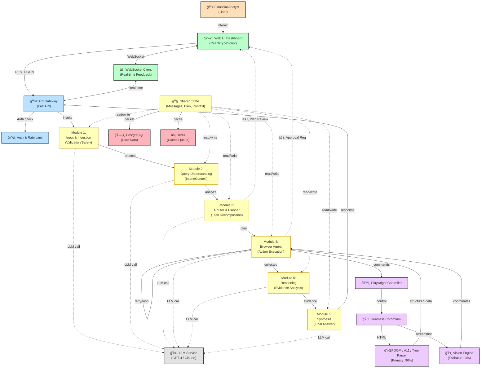
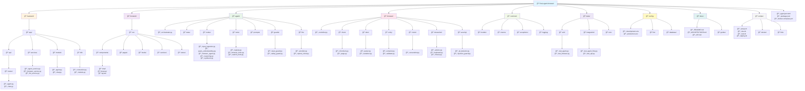
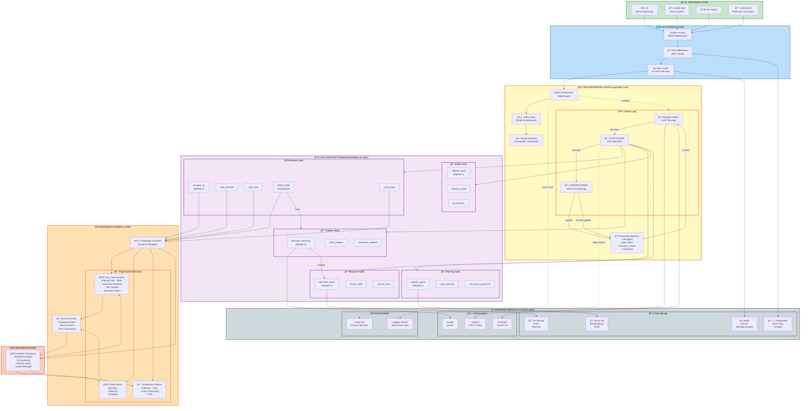

---

```
Vẽ cho tớ Sơ đồ Kiến trúc Tổng thể (High-Level Architecture) và folder structure overview
```

Tôi sẽ vẽ cho bạn:

1. **Sơ đồ Kiến trúc Tổng thể (High-Level Architecture)** - dạng diagram
2. **Folder Structure Overview** - cấu trúc thư mục chi tiết

Tôi sẽ tạo cả hai dưới dạng text/ASCII art và Mermaid diagrams để bạn có thể visualize dễ dàng.

Bắt đầu ngay!

## ✅ Hoàn thành: Sơ đồ Kiến trúc & Folder Structure

Tôi đã tạo tài liệu chi tiết với **894 dòng** bao gồm:

### 📊 Nội dung Tài liệu

#### **1. Sơ đồ Kiến trúc Tổng thể (High-Level Architecture)**

- **ASCII Art Diagram:** Visualization đầy đủ của 7 layers
    
    - Frontend Layer (Web UI, Mobile, API Clients)
    - API Gateway Layer (FastAPI, Auth, Rate Limiter)
    - Orchestration Layer (LangGraph Agent vá»›i 8 tools)
    - Processing Layer (6 Modules)
    - Browser Control Layer (Playwright, A11y Tree, DOM Parser)
    - Browser Engine (Chromium)
    - External Services (OpenAI, Anthropic, LangFuse)
    - Data Layer (PostgreSQL, Redis, S3, Vector DB)
- **Mermaid Diagram:** Interactive diagram có thể render
    

#### **2. Sơ đồ Luồng Dữ liệu (Data Flow Diagram)**

- End-to-end flow từ user query đến final response
- Ví dụ cụ thể: "Find Tesla's latest earnings report"
- Chi tiết từng bước qua 6 modules

#### **3. Sơ đồ Component Chi tiết**

- **LangGraph Agent Architecture:** StateGraph với decision nodes
- **Browser Control Layer:** Playwright Controller + Page Context Extractor

#### **4. Folder Structure Overview**

- **Project Root:** Cấu trúc tổng thể với 10+ top-level directories
    
- **Backend Structure:** Chi tiết từng file và folder
    
    - `src/api/` - FastAPI routes và middleware
    - `src/modules/` - 6 processing modules
    - `src/orchestration/` - LangGraph agent
    - `src/llm/` - LLM integrations
    - `src/database/`, `src/cache/`, `src/storage/`
    - `src/security/`, `src/utils/`
    - `tests/` - Unit, integration, e2e tests
- **Module 2 Detailed:** Cấu trúc chi tiết của Query Understanding module
    
- **Module 4 Detailed:** Cấu trúc chi tiết của Browser Executor module
    

#### **5. Module Dependencies**

- **Dependency Graph:** Mermaid diagram showing module relationships
- **Technology Stack Table:** Technologies cho từng layer

#### **6. Deployment Architecture**

- Production deployment trên AWS
- Load Balancer → API Gateway → Processing Layer → Browser Pool → Data Layer

### 🨠Highlights

**ASCII Art Diagrams:**

- Dá»… Ä‘á»c, không cần tools đặc biệt
- Copy-paste vào bất kỳ text editor nào

**Mermaid Diagrams:**

- Có thể render interactive trong GitHub, VS Code, Notion
- Professional-looking cho presentations

**Folder Structure:**

- Cực kỳ chi tiết, đến từng file
- Mô tả purpose của từng file/folder
- Ready để bắt đầu implementation

### 📠Các File Äã Tạo

1. ✅ **PHASE1_2_Deep_Research_Web_Browser_AI_Agents_50_Pages.md** (2,135 dòng)
2. ✅ **finAI_Architecture_Diagrams_and_Folder_Structure.md** (894 dòng)

Bạn có muốn tôi:

1. Render các Mermaid diagrams thành images (PNG/SVG)?
2. Tạo thêm sơ đồ nào khác?
3. Bắt đầu **PHASE 3** (Viết Tài liệu System Architecture 50 trang cho finAI)?

Vui lòng xác nhận!

finAI_Architecture_Diagrams_and_Folder_Structure

Markdown · 51.36 KB

Xem tất cả tệp trong nhiệm vụ này

# finAI Agentic Browser - Sơ đồ Kiến trúc & Folder Structure

**Tác giả:** AI Architecture Team  
**Ngày:** 14/12/2025  
**Phiên bản:** 1.0

---

## MỤC LỤC

1. [Sơ đồ Kiến trúc Tổng thể (High-Level Architecture)](#1-sơ-đồ-kiến-trúc-tổng-thể)
2. [Sơ đồ Luồng Dữ liệu (Data Flow Diagram)](#2-sơ-đồ-luồng-dữ-liệu)
3. [Sơ đồ Component Chi tiết](#3-sơ-đồ-component-chi-tiết)
4. [Folder Structure Overview](#4-folder-structure-overview)
5. [Module Dependencies](#5-module-dependencies)

---

## 1. Sơ đồ Kiến trúc Tổng thể

### 1.1. High-Level Architecture (ASCII Art)

```
┌─────────────────────────────────────────────────────────────────────────â”
│                          finAI Agentic Browser                          │
│                                                                         │
│  ┌───────────────────────────────────────────────────────────────────┠│
│  │                    FRONTEND LAYER                                 │ │
│  │  ┌─────────────┠ ┌─────────────┠ ┌─────────────┠             │ │
│  │  │   Web UI    │  │   Mobile    │  │     API     │              │ │
│  │  │   (React)   │  │    (RN)     │  │   Clients   │              │ │
│  │  └─────────────┘  └─────────────┘  └─────────────┘              │ │
│  │         │                 │                 │                     │ │
│  │         └─────────────────┴─────────────────┘                     │ │
│  │                           │                                        │ │
│  │                    WebSocket / REST API                            │ │
│  └───────────────────────────┬─────────────────────────────────────┬─┘ │
│                              │                                     │   │
│  ┌───────────────────────────┴─────────────────────────────────────┴─┠│
│  │                    API GATEWAY LAYER                              │ │
│  │  ┌─────────────┠ ┌─────────────┠ ┌─────────────┠             │ │
│  │  │   FastAPI   │  │    Auth     │  │Rate Limiter │              │ │
│  │  │   Router    │  │ Middleware  │  │   & Cache   │              │ │
│  │  └─────────────┘  └─────────────┘  └─────────────┘              │ │
│  └───────────────────────────┬─────────────────────────────────────┬─┘ │
│                              │                                     │   │
│  ┌───────────────────────────┴─────────────────────────────────────┴─┠│
│  │                   ORCHESTRATION LAYER                             │ │
│  │  ┌─────────────────────────────────────────────────────────────┠│ │
│  │  │              LangGraph Agent Orchestrator                   │ │ │
│  │  │  ┌────────────────────────────────────────────────────────┠│ │ │
│  │  │  │  State Management (StateGraph)                         │ │ │ │
│  │  │  │  - Current Page Context                                │ │ │ │
│  │  │  │  - Task Progress                                       │ │ │ │
│  │  │  │  - Extracted Data                                      │ │ │ │
│  │  │  │  - User Preferences                                    │ │ │ │
│  │  │  └────────────────────────────────────────────────────────┘ │ │ │
│  │  │                                                             │ │ │
│  │  │  ┌──────────┠ ┌──────────┠ ┌──────────┠ ┌──────────┠ │ │ │
│  │  │  │ Browser  │  │   Data   │  │ Analysis │  │  Safety  │  │ │ │
│  │  │  │   Tool   │  │ Extract  │  │   Tool   │  │   Gate   │  │ │ │
│  │  │  │          │  │   Tool   │  │          │  │          │  │ │ │
│  │  │  └──────────┘  └──────────┘  └──────────┘  └──────────┘  │ │ │
│  │  │                                                             │ │ │
│  │  │  ┌──────────┠ ┌──────────┠ ┌──────────┠ ┌──────────┠ │ │ │
│  │  │  │Reasoning │  │  Memory  │  │  Human   │  │  Logging │  │ │ │
│  │  │  │   Tool   │  │   Tool   │  │ Approval │  │   Tool   │  │ │ │
│  │  │  └──────────┘  └──────────┘  └──────────┘  └──────────┘  │ │ │
│  │  └─────────────────────────────────────────────────────────┘ │ │
│  └───────────────────────────┬─────────────────────────────────────┬─┘ │
│                              │                                     │   │
│  ┌───────────────────────────┴─────────────────────────────────────┴─┠│
│  │                    PROCESSING LAYER                               │ │
│  │  ┌──────────────────┠ ┌──────────────────┠ ┌────────────────┠│ │
│  │  │  Module 1        │  │  Module 2        │  │  Module 3      │ │ │
│  │  │  Input &         │→ │  Query           │→ │  Router &      │ │ │
│  │  │  Ingestion       │  │  Understanding   │  │  Planner       │ │ │
│  │  └──────────────────┘  └──────────────────┘  └────────────────┘ │ │
│  │                                                                   │ │
│  │  ┌──────────────────┠ ┌──────────────────┠ ┌────────────────┠│ │
│  │  │  Module 4        │  │  Module 5        │  │  Module 6      │ │ │
│  │  │  Browser         │→ │  Reasoning &     │→ │  Synthesis &   │ │ │
│  │  │  Executor        │  │  Analysis        │  │  Response      │ │ │
│  │  └──────────────────┘  └──────────────────┘  └────────────────┘ │ │
│  └───────────────────────────┬─────────────────────────────────────┬─┘ │
│                              │                                     │   │
│  ┌───────────────────────────┴─────────────────────────────────────┴─┠│
│  │                   BROWSER CONTROL LAYER                           │ │
│  │  ┌─────────────┠ ┌─────────────┠ ┌─────────────┠             │ │
│  │  │  Playwright │  │   A11y Tree │  │     DOM     │              │ │
│  │  │  Automation │  │  Extractor  │  │   Parser    │              │ │
│  │  └─────────────┘  └─────────────┘  └─────────────┘              │ │
│  │                                                                   │ │
│  │  ┌─────────────┠ ┌─────────────┠ ┌─────────────┠             │ │
│  │  │ Screenshot  │  │   Element   │  │   Action    │              │ │
│  │  │  Capture    │  │  Selector   │  │  Executor   │              │ │
│  │  └─────────────┘  └─────────────┘  └─────────────┘              │ │
│  └───────────────────────────┬─────────────────────────────────────┬─┘ │
│                              │                                     │   │
│  ┌───────────────────────────┴─────────────────────────────────────┴─┠│
│  │                      BROWSER ENGINE                               │ │
│  │  ┌─────────────────────────────────────────────────────────────┠│ │
│  │  │                  Chromium Browser                           │ │ │
│  │  │  - Rendering Engine                                         │ │ │
│  │  │  - JavaScript Engine (V8)                                   │ │ │
│  │  │  - Network Stack                                            │ │ │
│  │  └─────────────────────────────────────────────────────────────┘ │ │
│  └───────────────────────────────────────────────────────────────────┘ │
│                                                                         │
│  ┌───────────────────────────────────────────────────────────────────┠│
│  │                     EXTERNAL SERVICES                             │ │
│  │  ┌──────────┠ ┌──────────┠ ┌──────────┠ ┌──────────┠        │ │
│  │  │  OpenAI  │  │Anthropic │  │  Google  │  │ LangFuse │         │ │
│  │  │  GPT-4   │  │  Claude  │  │  Gemini  │  │(Observ.) │         │ │
│  │  └──────────┘  └──────────┘  └──────────┘  └──────────┘         │ │
│  └───────────────────────────────────────────────────────────────────┘ │
│                                                                         │
│  ┌───────────────────────────────────────────────────────────────────┠│
│  │                      DATA LAYER                                   │ │
│  │  ┌──────────┠ ┌──────────┠ ┌──────────┠ ┌──────────┠        │ │
│  │  │PostgreSQL│  │  Redis   │  │    S3    │  │  Vector  │         │ │
│  │  │(User DB) │  │ (Cache)  │  │ (Files)  │  │   DB     │         │ │
│  │  └──────────┘  └──────────┘  └──────────┘  └──────────┘         │ │
│  └───────────────────────────────────────────────────────────────────┘ │
└─────────────────────────────────────────────────────────────────────────┘
```

### 1.2. High-Level Architecture (Mermaid Diagram)


---

## 2. Sơ đồ Luồng Dữ liệu

### 2.1. End-to-End Data Flow

```
User Query: "Find Tesla's latest earnings report and summarize key metrics"
    │
    ↓
┌───────────────────────────────────────────────────────────────â”
│ Module 1: Input & Ingestion                                   │
│ - Parse query                                                 │
│ - Detect language, intent                                     │
│ - Extract entities: ["Tesla", "earnings report", "metrics"]   │
└───────────────────────────┬───────────────────────────────────┘
                            ↓
┌───────────────────────────────────────────────────────────────â”
│ Module 2: Query Understanding                                 │
│ - Understand financial context                                │
│ - Identify data sources: [SEC EDGAR, Tesla IR]               │
│ - Generate TaskSpec:                                          │
│   {                                                           │
│     "intent": "research",                                     │
│     "scope": "single_company",                                │
│     "artifact": "earnings_report",                            │
│     "action_level": "read_only"                               │
│   }                                                           │
└───────────────────────────┬───────────────────────────────────┘
                            ↓
┌───────────────────────────────────────────────────────────────â”
│ Module 3: Router & Planner                                    │
│ - Select mode: "single_site"                                  │
│ - Generate ActionPlan:                                        │
│   [                                                           │
│     {action: "navigate", url: "sec.gov/edgar"},              │
│     {action: "search", query: "Tesla 10-Q"},                 │
│     {action: "extract", selector: "table.financials"},       │
│     {action: "analyze", task: "summarize_metrics"}           │
│   ]                                                           │
└───────────────────────────┬───────────────────────────────────┘
                            ↓
┌───────────────────────────────────────────────────────────────â”
│ Module 4: Browser Executor (LangGraph Agent)                  │
│                                                               │
│ Step 1: Navigate to SEC EDGAR                                │
│   - Playwright: page.goto("https://sec.gov/edgar")           │
│   - Extract A11y Tree                                         │
│   - Current State: {url: "sec.gov/edgar", ...}               │
│                                                               │
│ Step 2: Search for Tesla 10-Q                                │
│   - Find search box (via A11y Tree)                           │
│   - Type "Tesla 10-Q"                                         │
│   - Click search button                                       │
│   - Wait for results                                          │
│                                                               │
│ Step 3: Extract financial table                              │
│   - Parse DOM to find table.financials                        │
│   - Extract table data → CSV                                  │
│   - Store in State: {extracted_data: [...]}                  │
│                                                               │
│ Step 4: Verify extraction                                    │
│   - Check if data is complete                                 │
│   - If not, retry with alternative selector                   │
└───────────────────────────┬───────────────────────────────────┘
                            ↓
┌───────────────────────────────────────────────────────────────â”
│ Module 5: Reasoning & Analysis                                │
│ - LLM analyzes extracted data                                 │
│ - Identify key metrics:                                       │
│   - Revenue: $25.2B (↑18% YoY)                               │
│   - Net Income: $1.9B (↑20% YoY)                             │
│   - EPS: $0.62 (↑15% YoY)                                    │
│ - Generate insights                                           │
└───────────────────────────┬───────────────────────────────────┘
                            ↓
┌───────────────────────────────────────────────────────────────â”
│ Module 6: Synthesis & Response                                │
│ - Format results                                              │
│ - Generate natural language summary                           │
│ - Attach source links                                         │
│ - Return to user                                              │
└───────────────────────────┬───────────────────────────────────┘
                            ↓
User receives: "Tesla's Q3 2024 earnings show strong growth:
                Revenue $25.2B (↑18%), Net Income $1.9B (↑20%),
                EPS $0.62 (↑15%). [Source: SEC EDGAR]"
```

---

## 3. Sơ đồ Component Chi tiết

### 3.1. LangGraph Agent Architecture


### 3.2. Browser Control Layer Architecture

```
┌─────────────────────────────────────────────────────────────â”
│              Browser Control Layer                          │
│                                                             │
│  ┌────────────────────────────────────────────────────────â”│
│  │         Playwright Controller                          ││
│  │  ┌──────────────────────────────────────────────────┠││
│  │  │  Browser Context Manager                         │ ││
│  │  │  - Create/destroy browser instances              │ ││
│  │  │  - Manage multiple tabs                          │ ││
│  │  │  - Handle cookies & sessions                     │ ││
│  │  └──────────────────────────────────────────────────┘ ││
│  │                                                        ││
│  │  ┌──────────────┠ ┌──────────────┠ ┌─────────────┠││
│  │  │  Navigation  │  │    Action    │  │   Element   │ ││
│  │  │   Handler    │  │   Executor   │  │   Locator   │ ││
│  │  └──────────────┘  └──────────────┘  └─────────────┘ ││
│  └────────────────────────────────────────────────────────┘│
│                            ↓                                │
│  ┌────────────────────────────────────────────────────────â”│
│  │         Page Context Extractor                         ││
│  │  ┌──────────────┠ ┌──────────────┠ ┌─────────────┠││
│  │  │  A11y Tree   │  │     DOM      │  │ Screenshot  │ ││
│  │  │  Extractor   │  │    Parser    │  │   Capture   │ ││
│  │  └──────────────┘  └──────────────┘  └─────────────┘ ││
│  │         │                  │                 │         ││
│  │         └──────────────────┴─────────────────┘         ││
│  │                            ↓                            ││
│  │  ┌────────────────────────────────────────────────────â”││
│  │  │       Unified Page Context                         │││
│  │  │  {                                                 │││
│  │  │    url: string,                                    │││
│  │  │    title: string,                                  │││
│  │  │    a11y_tree: A11yNode[],                          │││
│  │  │    dom_snapshot: DOMSnapshot,                      │││
│  │  │    screenshot: bytes (optional),                   │││
│  │  │    interactive_elements: Element[]                 │││
│  │  │  }                                                 │││
│  │  └────────────────────────────────────────────────────┘││
│  └────────────────────────────────────────────────────────┘│
└─────────────────────────────────────────────────────────────┘
```

---

## 4. Folder Structure Overview

### 4.1. Project Root Structure

```
finai-agentic-browser/
│
├── README.md
├── LICENSE
├── .gitignore
├── .env.example
├── docker-compose.yml
├── Makefile
│
├── docs/                          # Documentation
│   ├── architecture/
│   │   ├── high-level-design.md
│   │   ├── low-level-design.md
│   │   └── diagrams/
│   ├── api/
│   │   └── openapi.yaml
│   └── user-guide/
│
├── frontend/                      # Frontend applications
│   ├── web/                       # React web app
│   │   ├── src/
│   │   ├── public/
│   │   ├── package.json
│   │   └── tsconfig.json
│   └── mobile/                    # React Native mobile app
│       ├── src/
│       ├── ios/
│       ├── android/
│       └── package.json
│
├── backend/                       # Backend services
│   ├── pyproject.toml
│   ├── poetry.lock
│   ├── requirements.txt
│   │
│   ├── src/
│   │   ├── __init__.py
│   │   │
│   │   ├── api/                   # FastAPI application
│   │   │   ├── __init__.py
│   │   │   ├── main.py            # FastAPI app entry point
│   │   │   ├── dependencies.py
│   │   │   ├── middleware/
│   │   │   │   ├── auth.py
│   │   │   │   ├── rate_limit.py
│   │   │   │   └── logging.py
│   │   │   └── routes/
│   │   │       ├── __init__.py
│   │   │       ├── query.py       # Query endpoints
│   │   │       ├── user.py        # User management
│   │   │       └── health.py      # Health checks
│   │   │
│   │   ├── core/                  # Core business logic
│   │   │   ├── __init__.py
│   │   │   ├── config.py          # Configuration
│   │   │   ├── exceptions.py      # Custom exceptions
│   │   │   └── constants.py       # Constants
│   │   │
│   │   ├── modules/               # 6 Processing Modules
│   │   │   ├── __init__.py
│   │   │   │
│   │   │   ├── module1_input_ingestion/
│   │   │   │   ├── __init__.py
│   │   │   │   ├── models.py      # Pydantic models
│   │   │   │   ├── service.py     # Main logic
│   │   │   │   ├── parsers/
│   │   │   │   │   ├── text_parser.py
│   │   │   │   │   ├── voice_parser.py
│   │   │   │   │   └── file_parser.py
│   │   │   │   └── validators/
│   │   │   │       └── input_validator.py
│   │   │   │
│   │   │   ├── module2_query_understanding/
│   │   │   │   ├── __init__.py
│   │   │   │   ├── models.py
│   │   │   │   ├── service.py
│   │   │   │   ├── rules/         # Rule Engine
│   │   │   │   │   ├── main.py
│   │   │   │   │   ├── intent.py
│   │   │   │   │   ├── facets.py
│   │   │   │   │   ├── entities.py
│   │   │   │   │   └── confidence.py
│   │   │   │   ├── slm/           # SLM Backup
│   │   │   │   │   ├── client.py
│   │   │   │   │   ├── prompts.py
│   │   │   │   │   └── parser.py
│   │   │   │   └── policy/
│   │   │   │       └── overrides.py
│   │   │   │
│   │   │   ├── module3_router_planner/
│   │   │   │   ├── __init__.py
│   │   │   │   ├── models.py
│   │   │   │   ├── service.py
│   │   │   │   ├── router/
│   │   │   │   │   ├── mode_selector.py
│   │   │   │   │   └── complexity_estimator.py
│   │   │   │   └── planner/
│   │   │   │       ├── action_planner.py
│   │   │   │       └── sub_query_generator.py
│   │   │   │
│   │   │   ├── module4_browser_executor/
│   │   │   │   ├── __init__.py
│   │   │   │   ├── models.py
│   │   │   │   ├── service.py
│   │   │   │   ├── agent/         # LangGraph Agent
│   │   │   │   │   ├── graph.py   # StateGraph definition
│   │   │   │   │   ├── nodes.py   # Agent nodes
│   │   │   │   │   └── tools.py   # Agent tools
│   │   │   │   └── browser/       # Browser control
│   │   │   │       ├── controller.py
│   │   │   │       ├── playwright_wrapper.py
│   │   │   │       ├── a11y_extractor.py
│   │   │   │       ├── dom_parser.py
│   │   │   │       └── screenshot_capture.py
│   │   │   │
│   │   │   ├── module5_reasoning_analysis/
│   │   │   │   ├── __init__.py
│   │   │   │   ├── models.py
│   │   │   │   ├── service.py
│   │   │   │   ├── analyzers/
│   │   │   │   │   ├── financial_analyzer.py
│   │   │   │   │   ├── sentiment_analyzer.py
│   │   │   │   │   └── trend_analyzer.py
│   │   │   │   └── reasoners/
│   │   │   │       ├── llm_reasoner.py
│   │   │   │       └── rule_reasoner.py
│   │   │   │
│   │   │   └── module6_synthesis_response/
│   │   │       ├── __init__.py
│   │   │       ├── models.py
│   │   │       ├── service.py
│   │   │       ├── formatters/
│   │   │       │   ├── text_formatter.py
│   │   │       │   ├── table_formatter.py
│   │   │       │   └── chart_formatter.py
│   │   │       └── generators/
│   │   │           └── response_generator.py
│   │   │
│   │   ├── orchestration/         # LangGraph Orchestration
│   │   │   ├── __init__.py
│   │   │   ├── agent.py           # Main agent orchestrator
│   │   │   ├── state.py           # State definitions
│   │   │   ├── tools/             # LangGraph tools
│   │   │   │   ├── browser_tool.py
│   │   │   │   ├── data_extract_tool.py
│   │   │   │   ├── analysis_tool.py
│   │   │   │   └── safety_gate_tool.py
│   │   │   └── callbacks/
│   │   │       └── langfuse_callback.py
│   │   │
│   │   ├── llm/                   # LLM integrations
│   │   │   ├── __init__.py
│   │   │   ├── base.py            # Base LLM interface
│   │   │   ├── openai_client.py
│   │   │   ├── anthropic_client.py
│   │   │   ├── gemini_client.py
│   │   │   └── router.py          # LLM router
│   │   │
│   │   ├── database/              # Database layer
│   │   │   ├── __init__.py
│   │   │   ├── models.py          # SQLAlchemy models
│   │   │   ├── session.py         # DB session
│   │   │   └── repositories/
│   │   │       ├── user_repo.py
│   │   │       ├── query_repo.py
│   │   │       └── cache_repo.py
│   │   │
│   │   ├── cache/                 # Caching layer
│   │   │   ├── __init__.py
│   │   │   ├── redis_client.py
│   │   │   └── cache_manager.py
│   │   │
│   │   ├── storage/               # File storage
│   │   │   ├── __init__.py
│   │   │   ├── s3_client.py
│   │   │   └── file_manager.py
│   │   │
│   │   ├── security/              # Security utilities
│   │   │   ├── __init__.py
│   │   │   ├── auth.py
│   │   │   ├── encryption.py
│   │   │   └── pii_detector.py
│   │   │
│   │   └── utils/                 # Utility functions
│   │       ├── __init__.py
│   │       ├── logger.py
│   │       ├── metrics.py
│   │       └── helpers.py
│   │
│   └── tests/                     # Test suite
│       ├── __init__.py
│       ├── conftest.py            # Pytest fixtures
│       ├── unit/
│       │   ├── test_module1.py
│       │   ├── test_module2.py
│       │   └── ...
│       ├── integration/
│       │   ├── test_api.py
│       │   ├── test_browser.py
│       │   └── ...
│       └── e2e/
│           └── test_workflows.py
│
├── infrastructure/                # Infrastructure as Code
│   ├── terraform/
│   │   ├── main.tf
│   │   ├── variables.tf
│   │   └── outputs.tf
│   ├── kubernetes/
│   │   ├── deployment.yaml
│   │   ├── service.yaml
│   │   └── ingress.yaml
│   └── docker/
│       ├── Dockerfile.backend
│       ├── Dockerfile.frontend
│       └── Dockerfile.browser
│
├── scripts/                       # Utility scripts
│   ├── setup.sh
│   ├── deploy.sh
│   ├── migrate.sh
│   └── seed_data.py
│
└── monitoring/                    # Monitoring configs
    ├── prometheus/
    │   └── prometheus.yml
    ├── grafana/
    │   └── dashboards/
    └── alerts/
        └── alert_rules.yml
```

### 4.2. Module 2 (Query Understanding) Detailed Structure

```
module2_query_understanding/
│
├── __init__.py
│
├── models.py                      # Pydantic models
│   ├── UnifiedInputCore
│   ├── TaskSpecV1
│   ├── RuleEngineResult
│   ├── SLMResult
│   └── PolicyOverride
│
├── service.py                     # Main orchestrator
│   └── run_query_understanding()
│
├── exceptions.py                  # Custom exceptions
│   ├── QueryUnderstandingError
│   ├── RuleEngineError
│   └── SLMError
│
├── rules/                         # Rule Engine (Fast Path)
│   ├── __init__.py
│   ├── main.py                    # Rule engine orchestrator
│   │   └── run_rule_engine()
│   ├── intent.py                  # Intent classification
│   │   └── classify_intent()
│   ├── facets.py                  # Facet classification
│   │   ├── classify_scope()
│   │   ├── classify_artifact()
│   │   ├── classify_action_level()
│   │   └── classify_risk()
│   ├── entities.py                # Entity extraction
│   │   ├── extract_companies()
│   │   ├── extract_dates()
│   │   ├── extract_numbers()
│   │   └── extract_metrics()
│   ├── policy.py                  # Policy checks
│   │   ├── detect_pii()
│   │   └── detect_injection()
│   └── confidence.py              # Confidence scoring
│       └── calculate_confidence()
│
├── slm/                           # SLM Backup (Slow Path)
│   ├── __init__.py
│   ├── client.py                  # SLM client
│   │   └── call_slm()
│   ├── prompts.py                 # Prompt templates
│   │   ├── INTENT_CLASSIFICATION_PROMPT
│   │   ├── FACET_CLASSIFICATION_PROMPT
│   │   └── ENTITY_EXTRACTION_PROMPT
│   └── parser.py                  # Response parser
│       └── parse_slm_response()
│
├── policy/                        # Policy Overrides
│   ├── __init__.py
│   └── overrides.py
│       ├── apply_policy_overrides()
│       └── POLICY_RULES
│
└── tests/                         # Module-specific tests
    ├── test_rules.py
    ├── test_slm.py
    ├── test_policy.py
    └── golden_files/
        ├── query_001.json
        ├── query_002.json
        └── ...
```

### 4.3. Module 4 (Browser Executor) Detailed Structure

```
module4_browser_executor/
│
├── __init__.py
│
├── models.py                      # Pydantic models
│   ├── ActionPlan
│   ├── Action
│   ├── PageContext
│   ├── ExecutionResult
│   └── EvidencePack
│
├── service.py                     # Main orchestrator
│   └── execute_browser_workflow()
│
├── agent/                         # LangGraph Agent
│   ├── __init__.py
│   ├── graph.py                   # StateGraph definition
│   │   ├── create_agent_graph()
│   │   └── compile_graph()
│   ├── state.py                   # State schema
│   │   └── BrowserAgentState
│   ├── nodes.py                   # Agent nodes
│   │   ├── navigate_node()
│   │   ├── extract_node()
│   │   ├── analyze_node()
│   │   ├── verify_node()
│   │   └── retry_node()
│   ├── tools.py                   # LangGraph tools
│   │   ├── BrowserTool
│   │   ├── DataExtractTool
│   │   └── SafetyGateTool
│   └── callbacks.py               # Callbacks
│       └── LangFuseCallback
│
├── browser/                       # Browser Control
│   ├── __init__.py
│   ├── controller.py              # High-level controller
│   │   ├── BrowserController
│   │   ├── navigate()
│   │   ├── click()
│   │   ├── type_text()
│   │   └── extract_data()
│   ├── playwright_wrapper.py      # Playwright wrapper
│   │   ├── PlaywrightManager
│   │   ├── create_browser()
│   │   ├── create_context()
│   │   └── create_page()
│   ├── a11y_extractor.py          # A11y Tree extraction
│   │   ├── extract_a11y_tree()
│   │   └── parse_a11y_node()
│   ├── dom_parser.py              # DOM parsing
│   │   ├── parse_dom()
│   │   ├── extract_text()
│   │   ├── extract_links()
│   │   └── extract_forms()
│   ├── screenshot_capture.py      # Screenshot capture
│   │   ├── capture_screenshot()
│   │   └── capture_element_screenshot()
│   └── element_selector.py        # Element selection
│       ├── find_element()
│       └── generate_selector()
│
└── tests/
    ├── test_agent.py
    ├── test_browser.py
    └── fixtures/
        └── mock_pages/
```

---

## 5. Module Dependencies

### 5.1. Module Dependency Graph


### 5.2. Technology Stack by Layer

| Layer | Technologies |
|-------|-------------|
| **Frontend** | React, TypeScript, TailwindCSS, WebSocket |
| **API Gateway** | FastAPI, Pydantic, JWT, Redis (rate limiting) |
| **Orchestration** | LangChain, LangGraph, Python 3.11+ |
| **Processing** | Python, Pydantic, asyncio |
| **Browser Control** | Playwright, Chromium, CDP (Chrome DevTools Protocol) |
| **LLM** | OpenAI GPT-4, Anthropic Claude, Google Gemini |
| **Database** | PostgreSQL (user data), Redis (cache), S3 (files) |
| **Monitoring** | LangFuse, Sentry, Prometheus, Grafana |
| **Infrastructure** | AWS (ECS, Lambda), Kubernetes, Docker, Terraform |

---

## 6. Deployment Architecture

### 6.1. Production Deployment Diagram

```
┌─────────────────────────────────────────────────────────────â”
│                      AWS Cloud                              │
│                                                             │
│  ┌─────────────────────────────────────────────────────────â”│
│  │              Load Balancer (ALB)                        ││
│  └─────────────────────┬───────────────────────────────────┘│
│                        │                                     │
│  ┌─────────────────────┴───────────────────────────────────â”│
│  │              API Gateway (ECS)                          ││
│  │  ┌──────────┠ ┌──────────┠ ┌──────────┠            ││
│  │  │ Instance │  │ Instance │  │ Instance │             ││
│  │  │    1     │  │    2     │  │    3     │             ││
│  │  └──────────┘  └──────────┘  └──────────┘             ││
│  └─────────────────────┬───────────────────────────────────┘│
│                        │                                     │
│  ┌─────────────────────┴───────────────────────────────────â”│
│  │         Processing Layer (ECS/Lambda)                   ││
│  │  ┌──────────┠ ┌──────────┠ ┌──────────┠            ││
│  │  │ Module 1 │  │ Module 2 │  │ Module 3 │             ││
│  │  └──────────┘  └──────────┘  └──────────┘             ││
│  │  ┌──────────┠ ┌──────────┠ ┌──────────┠            ││
│  │  │ Module 4 │  │ Module 5 │  │ Module 6 │             ││
│  │  └──────────┘  └──────────┘  └──────────┘             ││
│  └─────────────────────┬───────────────────────────────────┘│
│                        │                                     │
│  ┌─────────────────────┴───────────────────────────────────â”│
│  │         Browser Pool (ECS)                              ││
│  │  ┌──────────┠ ┌──────────┠ ┌──────────┠            ││
│  │  │ Browser  │  │ Browser  │  │ Browser  │             ││
│  │  │    1     │  │    2     │  │    3     │             ││
│  │  └──────────┘  └──────────┘  └──────────┘             ││
│  └─────────────────────────────────────────────────────────┘│
│                                                             │
│  ┌─────────────────────────────────────────────────────────â”│
│  │              Data Layer                                 ││
│  │  ┌──────────┠ ┌──────────┠ ┌──────────┠            ││
│  │  │PostgreSQL│  │  Redis   │  │    S3    │             ││
│  │  │   (RDS)  │  │(ElastiC.)│  │ (Bucket) │             ││
│  │  └──────────┘  └──────────┘  └──────────┘             ││
│  └─────────────────────────────────────────────────────────┘│
└─────────────────────────────────────────────────────────────┘
```

---

## KẾT LUẬN

Tài liệu này cung cấp:
1. **Sơ đồ Kiến trúc Tổng thể** - High-level view của toàn bộ hệ thống
2. **Sơ đồ Luồng Dữ liệu** - End-to-end data flow từ user query đến response
3. **Sơ đồ Component Chi tiết** - LangGraph Agent và Browser Control Layer
4. **Folder Structure** - Cấu trúc thư mục chi tiết cho toàn bộ project
5. **Module Dependencies** - Dependency graph và technology stack

Các sơ đồ này sẽ được sử dụng làm reference cho việc implementation trong các phase tiếp theo.

---

**End of Document**


---

## Phân tích và Äánh giá Kiến trúc finAI Agentic Browser

### **1. So sánh Thiết kế Hiện tại của finAI với Framework 4 Quadrant**

Kiến trúc hiện tại của finAI, với 6 stages tuần tự (Input → Query Understanding → Router/Planner → Executor → Reasoning → Synthesis), thuộc vỠ**Quadrant 2: Orchestration**.

**Lý do:**
- **Äiá»u phối tập trung:** Có má»™t luồng chính Ä‘iá»u phối công việc qua các stage.
- **Chuyên môn hóa:** Mỗi stage là một module chuyên biệt (giống như một agent chuyên biệt).
- **Agency thấp:** Các module chỉ thực hiện tác vụ được giao, không tự ra quyết định.

**Äiểm mạnh của thiết kế hiện tại:**
- **Äá»™ tin cậy cao:** Luồng xá»­ lý có thể dá»± Ä‘oán được, dá»… debug.
- **Tối ưu hóa latency:** Rule-first approach trong Module 2 giúp xử lý nhanh các yêu cầu phổ biến.
- **Dễ quản lý:** Tách biệt concerns rõ ràng, dễ dàng phát triển và bảo trì từng module.

**Äiểm yếu của thiết kế hiện tại:**
- **Thiếu linh hoạt:** Khó xử lý các yêu cầu phức tạp, đa bước, hoặc cần feedback loop.
- **Khó mở rộng:** Không dễ dàng thêm các tools hoặc workflows mới mà không thay đổi code của orchestrator.
- **Không có "trí nhá»›":** Khó thá»±c hiện các cuá»™c há»™i thoại dài, nhiá»u lượt.

### **2. Äánh giá Kiến trúc từ góc Ä‘á»™ Master System Architect**

Vá»›i vai trò là má»™t Master System Architect, tôi đánh giá kiến trúc hiện tại của finAI là má»™t **ná»n tảng vững chắc, nhÆ°ng chÆ°a phải là má»™t hệ thống agent thá»±c thụ**.

**Äiểm cá»™ng (+):**
- **Modular & Scalable:** Thiết kế 6 stages là một best practice, cho phép scale từng module độc lập.
- **Focus vào Safety & Reliability:** Rule Engine và Safety Checks là cá»±c kỳ quan trá»ng cho domain tài chính.
- **Tối Æ°u hóa Performance:** Nhận thức được tầm quan trá»ng của latency và có giải pháp (Rule-first).

**Äiểm trừ (-):**
- **Thiếu "Agency":** Hệ thống vẫn đang hoạt động như một pipeline xử lý dữ liệu thông minh, chưa phải là một agent có khả năng tự chủ.
- **Coupling cao:** Các stages vẫn còn phụ thuá»™c nhiá»u vào nhau, khó tái sá»­ dụng hoặc thay đổi thứ tá»±.
- **Khó mở rá»™ng Toolset:** Việc thêm tool má»›i đòi há»i phải thay đổi cả Router, Planner, và Executor.

### **3. Recommendations để Chuyển đổi sang Kiến trúc Agent thực thụ (Quadrant 3: Autonomy)**

Äể Ä‘Æ°a finAI lên má»™t tầm cao má»›i, chúng ta cần chuyển đổi từ **Orchestration (Quadrant 2)** sang **Autonomy (Quadrant 3)**. Äây là các bÆ°á»›c cụ thể:

**Recommendation 1: Ãp dụng LangGraph làm Orchestrator chính**
- Thay thế pipeline 6 stages cứng nhắc bằng một **StateGraph** của LangGraph.
- Mỗi node trong graph sẽ là một module (hoặc một tool).
- Các cạnh (edges) sẽ là các quyết định (do LLM đưa ra) để chuyển từ node này sang node khác.

**Recommendation 2: Biến các Modules thành Tools**
- **Module 2 (Query Understanding):** Vẫn giữ lại, nhưng đóng gói thành một tool `understand_query`.
- **Module 3 (Router/Planner):** BỠđi, vì LangGraph sẽ đảm nhiệm vai trò này.
- **Module 4 (Browser Executor):** Chia nhỠthành các tools cụ thể: `browse_url`, `click_element`, `input_text`, `scroll_page`, etc.
- **Module 5 (Reasoning):** Tích hợp vào agent state của LangGraph.
- **Module 6 (Synthesis):** Giữ lại như một tool `synthesize_answer`.

**Recommendation 3: Thiết kế Agent State (StateGraph)**
- State của LangGraph sẽ chứa toàn bộ context của cuộc hội thoại:
  - `user_query`: Yêu cầu ban đầu
  - `task_spec`: Output từ Module 2
  - `browser_snapshots`: Lịch sử các trang đã xem (A11y Tree)
  - `scratchpad`: Suy nghĩ và quyết định của agent
  - `final_answer`: Câu trả lá»i cuối cùng

**Recommendation 4: Xây dựng một "Master Agent"**
- Master Agent này sẽ là một LangGraph StateGraph.
- Nó sẽ có một bộ tools bao gồm các modules đã được đóng gói lại.
- Luồng hoạt động sẽ là một vòng lặp ReAct (Reason-Act-Observe) được quản lý bởi LangGraph.

### **4. Kiến trúc Äá» xuất (Proposed Architecture)**

```mermaid
flowchart TD
    User --> API_Gateway[API Gateway]
    API_Gateway --> LangGraph_Agent[LangGraph Agent (Master Agent)]

    subgraph LangGraph_Agent
        direction LR
        State[Agent State]
        State --> Router{Router Node}
        Router --> Tool_Executor[Tool Executor Node]
        Tool_Executor --> State
    end

    subgraph Tool_Registry
        direction TB
        Tool1[understand_query]
        Tool2[browse_url]
        Tool3[click_element]
        Tool4[input_text]
        Tool5[synthesize_answer]
    end

    Tool_Executor --> Tool_Registry

    LangGraph_Agent --> Final_Response[Final Response]
    Final_Response --> User
```

### **5. Lợi ích của Kiến trúc Mới**

- **Linh hoạt & Mở rộng:** Dễ dàng thêm tools mới mà không cần thay đổi kiến trúc.
- **Tăng "Agency":** Agent có thể tự quyết định luồng xử lý, thực hiện các tác vụ phức tạp, đa bước.
- **Có "Trí nhá»›":** Agent State cho phép agent nhá»› lại các bÆ°á»›c đã làm và há»c há»i từ đó.
- **Dễ Debug & Observe:** LangFuse có thể tích hợp với LangGraph để visualize từng bước chạy của agent.
- **Tái sử dụng Code:** Các modules hiện tại có thể được tái sử dụng như các tools.

Bằng cách thực hiện các thay đổi này, finAI sẽ chuyển mình từ một hệ thống xử lý dữ liệu thông minh thành một **Web Browser AI Agent thực thụ**, sẵn sàng cạnh tranh với các sản phẩm hàng đầu trên thế giới.


---



