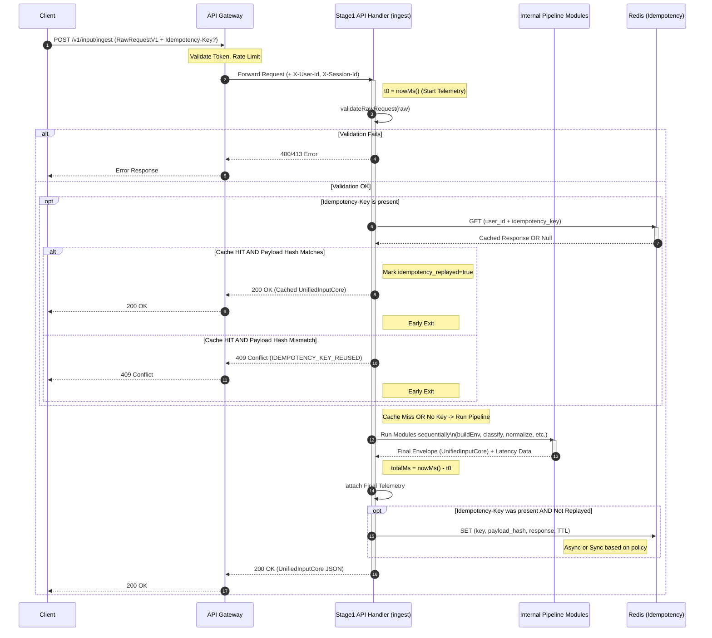

Dựa trên tài liệu đặc tả kỹ thuật "Stage 1 – Input & Ingestion (CORE, MVP) – Enterprise Spec v2.2", dưới đây là bộ các biểu đồ chi tiết nhằm mô tả Module 1 từ góc độ ngữ cảnh hệ thống, quy trình xử lý nội bộ, luồng dữ liệu theo thời gian và cấu trúc mã nguồn.

Các biểu đồ này được thiết kế để đội ngũ phát triển có thể nhìn vào và hiểu ngay lập tức cách triển khai code (implementation-ready).

---

### 1. Biểu đồ Ngữ cảnh Hệ thống (System Context Diagram)

**Mục đích:** Cho thấy vị trí của "Stage 1 Service" trong tổng thể hệ thống, các điểm tiếp xúc (boundaries) với bên ngoài và các phụ thuộc hạ tầng.

**Mô tả:**

- Client không gọi thẳng Stage 1 mà phải qua API Gateway.
    
- API Gateway chịu trách nhiệm xác thực (Authn) và giới hạn tốc độ (Rate Limit), sau đó inject các headers định danh (X-User-Id, X-Session-Id) vào request gửi tới Stage 1.
    
- Stage 1 phụ thuộc vào Redis để thực hiện cơ chế Idempotency (xử lý lặp).
    
- Output của Stage 1 là một JSON chuẩn (`UnifiedInputCore`) được trả về đồng bộ cho Client, để sau đó Client (hoặc một orchestrator khác) dùng làm đầu vào cho Stage 2.
    

Đoạn mã

```mermaid
graph TD
    subgraph External["External World"]
        Client[Client App / Browser]
    end

    subgraph Infrastructure
        Gateway[API Gateway\n(Authn, Rate Limit, TLS termination)]
        Redis[(Redis / Key-Value Store\nIdempotency Cache)]
    end

    subgraph "Backend Services"
        Stage1[Stage 1 Service\n(Input & Ingestion CORE)]
        Stage2[Stage 2 Service\n(Query Understanding - Out of scope)]
    end

    %% Flows
    Client -->|1. POST /v1/input/ingest\n(HTTPS, Raw JSON, Idempotency-Key)| Gateway
    Gateway -->|2. Forward verified Request\n(Inject X-User-Id, X-Session-Id)| Stage1

    Stage1 -.->|3a. Check/Store IdempotencyKey\n(GET/SET)| Redis
    Redis -.->|3b. Cache Hit/Miss| Stage1

    Stage1 -->|4. Sync Response 200 OK\n(UnifiedInputCore JSON)| Gateway
    Gateway -->|5. Return Response| Client

    %% Conceptual flow to next stage
    Client -.-|Future flow| Stage2

    style Stage1 fill:#f9f,stroke:#333,stroke-width:2px,color:#000
    style Gateway fill:#d4e1f5,stroke:#333,color:#000
    style Redis fill:#e1d5e7,stroke:#333,color:#000
```

---

### 2. Biểu đồ Trình tự Xử lý Request (Detailed Sequence Diagram)

**Mục đích:** Mô tả chi tiết dòng thời gian xử lý một request `POST /v1/input/ingest`, tập trung vào logic của `ingest()` handler và sự tương tác với Redis để đảm bảo tính Idempotency (theo mục 5.2 và 7.1 trong spec).

**Mô tả:**

- Thể hiện rõ 3 kịch bản của Idempotency:
    
    1. **No Key:** Chạy pipeline bình thường.
        
    2. **Key Present & Cache Hit:** Trả lại response cũ ngay lập tức.
        
    3. **Key Present & Cache Miss:** Chạy pipeline và lưu kết quả vào Redis.
        
- Thể hiện điểm bắt đầu và kết thúc của việc đo Telemetry (t0 -> totalMs).
    

Đoạn mã



---

### 3. Biểu đồ Luồng Pipeline Nội bộ (Internal Pipeline Flowchart)

**Mục đích:** Trực quan hóa các bước xử lý dữ liệu bên trong "hộp đen" Stage 1, tương ứng chính xác với mục "6.2 Pipeline overview" và "7.1 ingest() entrypoint" trong đặc tả.

**Mô tả:**

- Đây là luồng chạy khi request hợp lệ và không bị chặn bởi idempotency cache hit.
    
- Dữ liệu đầu vào là `RawRequestV1` và được biến đổi dần dần qua các "trạm" (modules) thành `UnifiedInputCoreV1`.
    
- Các bước `(1)` đến `(7)` tương ứng với các module con được định nghĩa trong phần 7 của spec.
    

Đoạn mã

```mermaid
flowchart TD
    Start([Start ingest Request]) --> InputVal{Validate RawRequestV1\n(Schema, Size limits)}

    InputVal -- Fail --> Error4xx[Return 400/413 Error]
    InputVal -- Pass --> BuildEnv[1. buildEnv\n(Extract identity from Headers,\nfallback to body metadata)]

    BuildEnv --> InitEnv[2. initEnvelope\n(Create base UnifiedInputCore struct,\ngenerate request_id)]

    InitEnv --> Classify[3. runInputClassifier\n(Regex extract URLs,\nDetermine type: TEXT/URL/MIXED)]

    Classify --> Normalize[4. runTextNormalizer\n(Trim whitespace, normalize newlines,\ndetect language heuristically)]

    Normalize --> AttachPC[5. attachPageContext\n(Copy page_context data,\nvalidate & merge active_url into url list)]

    AttachPC --> Safety[6. computeSafetyFlags\n(Check empty effective input,\ncheck max URL count, truncate if needed)]

    Safety --> Telemetry[7. buildTelemetry\n(Calculate total & module latency,\ncount final input length & URLs)]

    Telemetry --> Finalize([Finalize UnifiedInputCoreV1 Response])

    style Start fill:#E1F5FE,stroke:#01579B
    style Finalize fill:#E8F5E9,stroke:#1B5E20
    style Error4xx fill:#FFEBEE,stroke:#B71C1C
    
    subgraph "Core Transformation Pipeline (Modules)"
        BuildEnv
        InitEnv
        Classify
        Normalize
        AttachPC
        Safety
        Telemetry
    end
    style BuildEnv fill:#FFF3E0,stroke:#E65100
    style InitEnv fill:#FFF3E0,stroke:#E65100
    style Classify fill:#FFF3E0,stroke:#E65100
    style Normalize fill:#FFF3E0,stroke:#E65100
    style AttachPC fill:#FFF3E0,stroke:#E65100
    style Safety fill:#FFF3E0,stroke:#E65100
    style Telemetry fill:#FFF3E0,stroke:#E65100
```

---

### 4. Biểu đồ Cấu trúc Component (Internal Component / Layer Diagram)

**Mục đích:** Hướng dẫn tổ chức mã nguồn cho lập trình viên, dựa trên gợi ý thư mục trong mục "7. Pipeline & Modules" và "13. Appendices". Nó cho thấy sự phân tách trách nhiệm rõ ràng.

**Mô tả:**

- **API Layer (Presentation):** Chỉ lo việc định nghĩa Route, nhận Request, gọi Service layer và trả Response. Sử dụng Pydantic schemas.
    
- **Service Layer (Application Logic):** Chứa logic chính (`ingest` orchestrator). Nó điều phối việc gọi các module con.
    
- **Core Modules (Domain Logic):** Các hàm thuần túy (pure functions) thực hiện logic nghiệp vụ cụ thể (ví dụ: chuẩn hóa text, phân loại). Chúng độc lập và dễ test unit.
    
- **Infrastructure / Shared:** Các thành phần dùng chung như kết nối Redis, cấu hình, logging.
    

Đoạn mã

```mermaid
classDiagram
    direction TB
    
    %% API Layer
    namespace API_Layer {
        class Routes {
            +POST /ingest
            +GET /healthz
        }
        class Handlers {
            +ingest(RawRequestV1, Headers) UnifiedInputCoreV1
        }
        class Schemas {
            <<Pydantic Models>>
            RawRequestV1
            UnifiedInputCoreV1
        }
    }
    Routes --> Handlers
    Handlers ..> Schemas : uses

    %% Service Layer
    namespace Service_Layer {
        class IngestionPipeline {
            <<Orchestrator>>
            +execute_pipeline(validated_request)
        }
    }
    Handlers --> IngestionPipeline

    %% Core Modules (Domain Logic - Pure Functions preferred)
    namespace Core_Modules {
        class ValidatorService { +validateRawRequest() }
        class EnvService { +buildEnv() }
        class EnvelopeService { +initEnvelope() }
        class ClassifierService { +runInputClassifier() }
        class NormalizerService { +runTextNormalizer() +detectLanguage() }
        class PageContextService { +attachPageContext() }
        class SafetyService { +computeSafetyFlags() }
        class TelemetryService { +buildTelemetry() }
    }
    IngestionPipeline --> ValidatorService
    IngestionPipeline --> EnvService
    IngestionPipeline --> EnvelopeService
    IngestionPipeline --> ClassifierService
    IngestionPipeline --> NormalizerService
    IngestionPipeline --> PageContextService
    IngestionPipeline --> SafetyService
    IngestionPipeline --> TelemetryService

    %% Infrastructure & Shared
    namespace Infrastructure_Shared {
        class RedisClient {
            +get_idempotency_key()
            +set_idempotency_key()
        }
        class Config { +Load settings from ENV }
        class Observability { +StructuredLogger +Metrics +Tracer }
    }
    IngestionPipeline --> RedisClient
    Core_Modules ..> Config : uses defaults
    Handlers ..> Observability : logs/traces
    IngestionPipeline ..> Observability : logs/traces
```