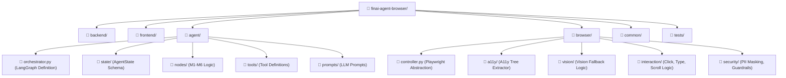
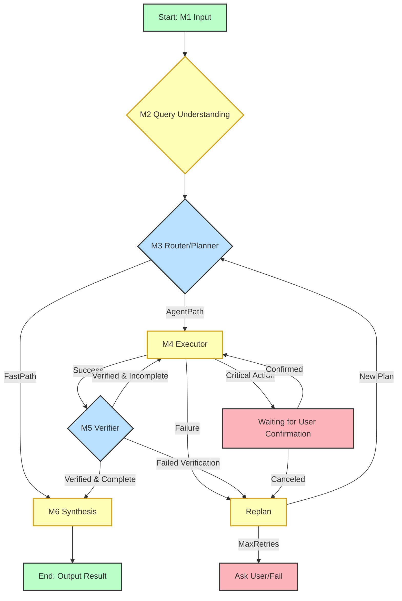

# FINAI WEB BROWSER AI AGENT – SOFTWARE DESIGN DOCUMENT (SDD)

**Phiên bản:** 2.0 (Final)
**Ngày:** 16/12/2025
**Tác giả:** AI Architecture Team

---

## MỤC LỤC

1.  **Giới thiệu (Introduction)**
    1.1. Mục đích và Đối tượng Độc giả (Purpose and Audience)
    1.2. Phạm vi và Giới hạn (Scope and Limitations)
    1.3. Tổng quan Tài liệu (Document Overview)
    1.4. Định nghĩa và Thuật ngữ (Definitions and Acronyms)
2.  **Tổng quan Hệ thống (System Overview)**
    2.1. Bối cảnh Kinh doanh và Công nghệ (Business and Technology Context)
    2.2. Mục tiêu Thiết kế Chuyên sâu (In-depth Design Goals)
    2.3. Yêu cầu Chức năng Chi tiết (Detailed Functional Requirements - FRs)
    2.4. Yêu cầu Phi Chức năng Chi tiết (Detailed Non-Functional Requirements - NFRs)
3.  **Kiến trúc Hệ thống (System Architecture - HLD)**
    3.1. Sơ đồ Kiến trúc Tổng thể (High-Level Architecture - HLA)
    3.2. Phân tích Chuyên sâu Các Lớp Kiến trúc (In-depth Architectural Layers Analysis)
    3.3. Ngăn xếp Công nghệ (Technology Stack) và Rationale
    3.4. Luồng Dữ liệu Tổng thể (End-to-End Data Flow)
    3.5. Kiến trúc Triển khai (Deployment Architecture)
4.  **Thiết kế Dữ liệu (Data Design - HLD & LLD)**
    4.1. Thiết kế Dữ liệu Logic (Logical Data Design)
    4.2. Thiết kế Dữ liệu Vật lý (Physical Data Design)
5.  **Thiết kế Thành phần (Component Design - LLD)**
    5.1. Cấu trúc Module (Component Decomposition) và Folder Structure
    5.2. Thiết kế Chi tiết Agent Core (LangGraph State Machine)
    5.3. Thiết kế Chi tiết Lớp Kiểm soát Trình duyệt (Browser Control Layer)
6.  **Thiết kế Giao diện Người dùng (Human Interface Design)**
    6.1. Mô hình Tương tác Người-Agent (HAI)
    6.2. Thiết kế Agent Status Panel (ASP) và Visual Feedback
7.  **Phân tích Rủi ro và An toàn (Risk and Safety Analysis)**
    7.1. Phân tích Rủi ro Kỹ thuật (Technical Risk Analysis)
    7.2. Thiết kế An toàn và Bảo mật (Safety and Security Design)
8.  **Ma trận Yêu cầu và Phụ lục (Requirements Matrix and Appendices)**
    8.1. Ma trận Yêu cầu (Requirements Matrix)
    8.2. Phụ lục Sơ đồ Chi tiết (Detailed Diagrams Appendix)

---

## 1. Giới thiệu (Introduction)

### 1.1. Mục đích và Đối tượng Độc giả (Purpose and Audience)

Tài liệu **Software Design Document (SDD)** này cung cấp bản thiết kế kỹ thuật toàn diện và độc lập cho việc phát triển **finAI Web Browser AI Agent**. Mục đích chính là chuyển đổi các yêu cầu kinh doanh và sản phẩm thành một bản thiết kế kỹ thuật chi tiết, có thể thực thi được.

**Đối tượng Độc giả:**

| Đối tượng | Mục đích Sử dụng Tài liệu |
| :--- | :--- |
| **Kỹ sư Phần mềm (Software Engineers)** | Hiểu rõ LLD (Low-Level Design) của các module, cấu trúc thư mục, và các quyết định công nghệ để bắt đầu triển khai mã nguồn. |
| **Kiến trúc sư (Architects)** | Đánh giá HLA (High-Level Architecture), tính đúng đắn của các quyết định thiết kế cốt lõi (LangGraph, Hybrid A11y + Vision) và khả năng mở rộng. |
| **Quản lý Sản phẩm (Product Managers)** | Hiểu rõ cách các yêu cầu chức năng (FRs) được ánh xạ vào thiết kế kỹ thuật và các giới hạn/rủi ro liên quan. |
| **DevOps/SRE** | Nắm bắt Kiến trúc Triển khai (Deployment Architecture), chiến lược Scaling, và các yêu cầu về tài nguyên (Browser Pool, K8s). |

### 1.2. Phạm vi và Giới hạn (Scope and Limitations)

#### **Phạm vi (Scope)**

Phạm vi của tài liệu này bao gồm toàn bộ hệ thống finAI, từ giao diện người dùng (Web UI) đến lớp điều phối Agent (LangGraph Core) và lớp tương tác với trình duyệt (Browser Control Layer).

1.  **Thiết kế Kiến trúc:** Bao gồm HLA, HLD, LLD, Data Design, và Deployment Architecture.
2.  **Thiết kế Sản phẩm Kỹ thuật:** Mô tả chi tiết UI/UX cho tương tác Agent (Agent Status Panel, Critical Action Flow).
3.  **An toàn và Rủi ro:** Phân tích các rủi ro kỹ thuật và các cơ chế Guardrails được tích hợp.

#### **Giới hạn (Limitations)**

1.  **LLM Internal Logic:** Tài liệu này coi các mô hình ngôn ngữ lớn (LLM) là dịch vụ bên ngoài (External Service). Chi tiết về kiến trúc nội bộ của các mô hình LLM (ví dụ: GPT-4, Claude) không nằm trong phạm vi.
2.  **DevOps Infrastructure:** Mặc dù Kiến trúc Triển khai được mô tả, chi tiết về cấu hình Kubernetes (YAML files), CI/CD pipelines, và các chính sách bảo mật mạng (Network Security Policies) cụ thể sẽ được đề cập trong một tài liệu riêng (DevOps Specification).

### 1.3. Tổng quan Tài liệu (Document Overview)

Tài liệu này được cấu trúc theo chuẩn IEEE 1016-2009, đảm bảo tính logic và dễ theo dõi:

*   **Mục 2:** Đặt nền tảng cho thiết kế bằng cách xác định bối cảnh, mục tiêu và các yêu cầu chi tiết.
*   **Mục 3:** Trình bày Kiến trúc Cấp Cao (HLA) và Kiến trúc Triển khai (Deployment Architecture).
*   **Mục 4 & 5:** Đi sâu vào Thiết kế Dữ liệu và Thiết kế Thành phần Cấp Thấp (LLD).
*   **Mục 6 & 7:** Mô tả Thiết kế Giao diện Người dùng và Phân tích Rủi ro/An toàn.
*   **Mục 8:** Tổng hợp Ma trận Yêu cầu và Phụ lục Sơ đồ.

### 1.4. Định nghĩa và Thuật ngữ (Definitions and Acronyms)

| Thuật ngữ | Định nghĩa |
| :--- | :--- |
| **SDD** | Software Design Document |
| **HLA** | High-Level Architecture |
| **HLD** | High-Level Design |
| **LLD** | Low-Level Design |
| **LangGraph** | Framework cho việc xây dựng các Agentic State Machine. |
| **A11y Tree** | Accessibility Tree (Cây Khả năng Tiếp cận), cung cấp ngữ nghĩa cho các phần tử web. |
| **CoT** | Chain-of-Thought (Chuỗi Suy luận), được LLM sử dụng để lập kế hoạch. |
| **ASP** | Agent Status Panel (Bảng Trạng thái Agent). |
| **NFR** | Non-Functional Requirement (Yêu cầu Phi Chức năng). |
| **PII** | Personally Identifiable Information (Thông tin Nhận dạng Cá nhân). |
| **K8s** | Kubernetes (Hệ thống điều phối container). |
| **HPA** | Horizontal Pod Autoscaler. |
| **KEDA** | Kubernetes Event-driven Autoscaling. |

---

## 2. Tổng quan Hệ thống (System Overview)

### 2.1. Bối cảnh Kinh doanh và Công nghệ (Business and Technology Context)

finAI Web Browser AI Agent được phát triển để giải quyết nhu cầu tự động hóa các quy trình làm việc phức tạp, đa bước trên web, đặc biệt trong lĩnh vực tài chính (nghiên cứu thị trường, phân tích báo cáo, giao dịch).

**Thách thức Kỹ thuật Cốt lõi:**

1.  **Locator Brittleness:** Các Agent truyền thống dựa trên DOM/XPath dễ bị hỏng khi giao diện web thay đổi.
2.  **State Management:** Việc duy trì ngữ cảnh và trạng thái qua nhiều bước tương tác web là phức tạp.
3.  **Safety and Transparency:** Cần đảm bảo Agent không thực hiện các hành động tài chính nhạy cảm mà không có sự giám sát và xác nhận của người dùng.

**Giải pháp Kiến trúc:**

Hệ thống chuyển đổi từ mô hình pipeline tuyến tính sang mô hình **Agentic Loop** (Perception-Reasoning-Action-Verification-Replan) được điều phối bởi **LangGraph State Machine**, kết hợp với chiến lược tương tác web **Hybrid A11y Tree + Vision Fallback** để đạt được độ bền bỉ cao.

### 2.2. Mục tiêu Thiết kế Chuyên sâu (In-depth Design Goals)

| Mục tiêu | Mô tả Chi tiết | Rationale (Lý do Kỹ thuật) |
| :--- | :--- | :--- |
| **Resilience (Độ bền bỉ)** | Hệ thống phải có khả năng tự động phát hiện lỗi tương tác web (ví dụ: phần tử không tìm thấy, trang web bị lỗi) và kích hoạt cơ chế **Re-planning** (tái lập kế hoạch) hoặc **Self-Healing** (tự sửa lỗi Locator) thay vì thất bại hoàn toàn. | Giảm thiểu tỷ lệ thất bại của tác vụ (Task Failure Rate) xuống dưới 5%, đặc biệt quan trọng cho các quy trình làm việc dài. |
| **Safety (An toàn)** | Phải có **Rule-based Guardrails** ở mọi điểm nhập liệu và trước mọi hành động quan trọng. Đặc biệt, phải có cơ chế **PII Masking** để bảo vệ dữ liệu nhạy cảm. | Đảm bảo tuân thủ quy định tài chính và bảo vệ người dùng khỏi các rủi ro về bảo mật (Prompt Injection, Data Leakage). |
| **Transparency (Minh bạch)** | Người dùng phải có **Visual Feedback** thời gian thực về trạng thái, suy luận (CoT) và hành động của Agent thông qua **Agent Status Panel (ASP)**. | Xây dựng lòng tin (Trust) với người dùng, cho phép họ can thiệp (Human-in-the-Loop) khi cần thiết. |
| **Scalability (Khả năng mở rộng)** | Kiến trúc phải hỗ trợ mở rộng độc lập các thành phần **API Gateway**, **Agent Orchestrator** và **Browser Worker Pool** trên Kubernetes. | Đảm bảo hệ thống có thể xử lý hàng nghìn tác vụ đồng thời mà không bị thắt cổ chai tài nguyên (đặc biệt là Browser Worker). |
| **Maintainability (Khả năng bảo trì)** | Thiết kế phải tuân thủ nguyên tắc **Separation of Concerns** (Tách biệt Trách nhiệm), với mỗi Node LangGraph và mỗi module Browser Control là một đơn vị độc lập, dễ dàng kiểm thử đơn vị (Unit Test). | Giảm chi phí bảo trì và tăng tốc độ phát triển tính năng mới. |

### 2.3. Yêu cầu Chức năng Chi tiết (Detailed Functional Requirements - FRs)

| ID | Yêu cầu | Mô tả Chi tiết | Mức độ Ưu tiên |
| :--- | :--- | :--- | :--- |
| **FR-01** | **Natural Language Task Ingestion** | Hệ thống phải chấp nhận yêu cầu tác vụ bằng ngôn ngữ tự nhiên (ví dụ: "Tìm báo cáo tài chính quý 3 của FPT và so sánh với VNG"). | Cao |
| **FR-02** | **Multi-Step Web Execution** | Agent phải có khả năng thực thi chuỗi hành động web (Navigation, Click, Type, Scroll, Wait) dựa trên kế hoạch do LLM tạo ra. | Cao |
| **FR-03** | **Structured Data Extraction** | Agent phải có khả năng trích xuất dữ liệu có cấu trúc (bảng, biểu mẫu) từ các trang web và chuyển đổi thành định dạng JSON/CSV. | Cao |
| **FR-04** | **Real-time Status Feedback** | Hệ thống phải truyền tải trạng thái hiện tại, log hành động và suy luận (CoT) đến giao diện người dùng trong thời gian thực (qua WebSocket). | Cao |
| **FR-05** | **Critical Action Confirmation** | Trước khi thực hiện bất kỳ hành động nào có thể gây ra giao dịch tài chính (ví dụ: Submit Order, Transfer), Agent phải tạm dừng và yêu cầu xác nhận rõ ràng từ người dùng. | Cao |
| **FR-06** | **Self-Correction and Re-planning** | Khi một hành động web thất bại, Agent phải tự động phân tích lỗi, cập nhật `AgentState` và tạo một kế hoạch hành động mới. | Cao |
| **FR-07** | **Tool Use Integration** | Agent phải có khả năng gọi các công cụ nội bộ (ví dụ: Financial Calculator, Search API) như một bước trong kế hoạch hành động. | Trung bình |
| **FR-08** | **Session Persistence** | Trạng thái của tác vụ (bao gồm trạng thái trình duyệt) phải được lưu trữ bền vững để cho phép người dùng tiếp tục tác vụ sau khi ngắt kết nối. | Trung bình |

### 2.4. Yêu cầu Phi Chức năng Chi tiết (Detailed Non-Functional Requirements - NFRs)

| Loại | Yêu cầu | Mục tiêu | Thước đo (Metric) |
| :--- | :--- | :--- | :--- |
| **Performance** | **Latency (Fast Path)** | < 500ms | Thời gian phản hồi trung bình (P95) cho các tác vụ Rule-based. |
| | **Latency (Agent Path)** | < 10s | Thời gian hoàn thành trung bình (P95) cho các tác vụ web 5 bước. |
| **Scalability** | **Throughput** | 100 Concurrent Tasks/Cluster | Số lượng tác vụ web đa bước có thể xử lý đồng thời. |
| | **Browser Pool Scaling** | < 30s | Thời gian để Browser Worker mới sẵn sàng sau khi KEDA kích hoạt. |
| **Reliability** | **Uptime** | 99.9% | Tỷ lệ thời gian hoạt động của toàn bộ hệ thống. |
| | **Task Failure Rate** | < 1% | Tỷ lệ tác vụ thất bại không thể phục hồi (Unrecoverable Error). |
| **Security** | **PII Masking** | 100% | Tỷ lệ PII được che giấu thành công trước khi gửi đến LLM. |
| | **Guardrail Efficacy** | > 99.9% | Tỷ lệ các hành động nguy hiểm bị chặn bởi Guardrails. |
| **Maintainability** | **Code Coverage** | > 80% | Tỷ lệ mã nguồn được bao phủ bởi Unit Tests. |

---

## 3. Kiến trúc Hệ thống (System Architecture - HLD)

### 3.1. Sơ đồ Kiến trúc Tổng thể (High-Level Architecture - HLA)

Kiến trúc finAI được thiết kế theo mô hình **Microservices** và **Agentic Loop**, với LangGraph là trung tâm điều phối.

```mermaid
%%{init: {'theme':'base', 'themeVariables': { 'primaryColor':'#0f172a','primaryTextColor':'#fff','primaryBorderColor':'#3b82f6','fontSize':'13px'}}}%%

flowchart TB
    %% ==================== USER & INPUT ====================
    User([👤 USER<br/>Natural Language Goal])
    
    %% ==================== LAYER 1: PERCEPTION ====================
    subgraph L1["🔍 LAYER 1: PERCEPTION - Browser State Awareness"]
        direction TB
        
        subgraph IP["📥 Input Processor"]
            IP1["🎭 Modality Handler<br/>━━━━━━━━━<br/>• Text (Goal)<br/>• Screenshot (if needed)<br/>• Voice (future)"]
            IP2["🛡️ Safety Guard<br/>━━━━━━━━━<br/>• Prompt Injection Filter<br/>• PII Detection<br/>• Malicious URL Check"]
            IP3["⚙️ Goal Parser<br/>━━━━━━━━━<br/>• Intent Classification<br/>• Entity Extraction<br/>• Constraint Validation"]
            IP1 --> IP2 --> IP3
        end
        
        subgraph BM["🌐 Browser Monitor"]
            BM1["📊 Page State Tracker<br/>━━━━━━━━━<br/>• Current URL<br/>• Page Load Status<br/>• Error Detection"]
            BM2["🌳 Content Extractor<br/>━━━━━━━━━<br/>• A11y Tree (90%)<br/>• DOM Snapshot (backup)<br/>• Screenshot (10%)"]
            BM3["🔍 Change Detector<br/>━━━━━━━━━<br/>• DOM Mutations<br/>• Network Events<br/>• Navigation History"]
            BM1 --> BM2
            BM2 --> BM3
        end
        
        IP ~~~ BM
        
        IP3 --> Context["📋 UNIFIED CONTEXT<br/>━━━━━━━━━<br/>Goal + Page State + History"]
    end
    
    %% ==================== LAYER 2: COGNITION ====================
    subgraph L2["🧠 LAYER 2: COGNITION - Agent Brain (LangGraph Core)"]
        direction TB
        
        Context --> StateGraph["📊 LangGraph StateGraph<br/>━━━━━━━━━<br/>Agent State Machine"]
        
        subgraph Nodes["🎯 Core Nodes (ReAct Pattern)"]
            direction LR
            N1["💭 PLANNER NODE<br/>━━━━━━━━━<br/>• Goal Decomposition<br/>• Action Selection<br/>• Tool Binding"]
            N2["⚡ EXECUTOR NODE<br/>━━━━━━━━━<br/>• Tool Invocation<br/>• Parameter Filling<br/>• Result Parsing"]
            N3["✅ VERIFIER NODE<br/>━━━━━━━━━<br/>• Success Check<br/>• Data Validation<br/>• Confidence Score"]
            N4["🔄 REPLAN NODE<br/>━━━━━━━━━<br/>• Error Analysis<br/>• Strategy Adjust<br/>• Fallback Logic"]
            
            N1 --> N2
            N2 --> N3
            N3 -->|Success| N1
            N3 -->|Failure| N4
            N4 --> N1
        end
        
        StateGraph --> Nodes
        
        subgraph Memory["💾 Memory System"]
            direction TB
            M1["⚡ Short-term<br/>━━━━━━━━━<br/>• Context Window<br/>• Action History<br/>• Redis Cache"]
            M2["🗄️ Long-term<br/>━━━━━━━━━<br/>• User Preferences<br/>• Domain Knowledge<br/>• Vector DB (RAG)"]
            M1 -.-> M2
        end
        
        Nodes -.->|Read/Write| Memory
        
        Nodes --> Decision["📋 ACTION DECISION<br/>━━━━━━━━━<br/>{tool_name, params, confidence}"]
    end
    
    %% ==================== LAYER 3: ACTION ====================
    subgraph L3["⚡ LAYER 3: ACTION - Browser Control & Execution"]
        direction TB
        
        Decision --> ToolRouter{Tool Router}
        
        subgraph BrowserTools["🌐 Browser Interaction Tools"]
            direction LR
            T1["🧭 navigate<br/>━━━━━━━━━<br/>url, wait_until"]
            T2["🖱️ click<br/>━━━━━━━━━<br/>selector, force"]
            T3["⌨️ fill<br/>━━━━━━━━━<br/>selector, text"]
            T4["↕️ scroll<br/>━━━━━━━━━<br/>direction, amount"]
            T5["📸 screenshot<br/>━━━━━━━━━<br/>full_page, path"]
        end
        
        subgraph DataTools["📊 Data Extraction Tools"]
            direction LR
            T6["🔍 extract_text<br/>━━━━━━━━━<br/>selector, all"]
            T7["📋 extract_table<br/>━━━━━━━━━<br/>parse to JSON"]
            T8["🔗 get_links<br/>━━━━━━━━━<br/>filter by domain"]
        end
        
        ToolRouter --> BrowserTools
        ToolRouter --> DataTools
        
        subgraph Executor["🚀 Execution Engine"]
            direction TB
            E1["📞 Playwright Controller<br/>━━━━━━━━━<br/>• Browser Pool<br/>• Context Manager<br/>• Page Lifecycle"]
            E2["🔧 Error Handler<br/>━━━━━━━━━<br/>• Retry Logic (3x)<br/>• Timeout Control<br/>• Fallback Strategy"]
            E3["📦 Result Parser<br/>━━━━━━━━━<br/>• A11y Tree to JSON<br/>• HTML to Markdown<br/>• Screenshot to B64"]
            E1 --> E2 --> E3
        end
        
        BrowserTools --> Executor
        DataTools --> Executor
        
        Executor --> Browser["🌐 HEADLESS CHROMIUM<br/>━━━━━━━━━<br/>Isolated Sandbox"]
        
        Browser --> Result["📋 EXECUTION RESULT<br/>━━━━━━━━━<br/>{status, data, screenshot, error}"]
    end
    
    %% ==================== LAYER 4: GOVERNANCE ====================
    subgraph L4["🛡️ LAYER 4: GOVERNANCE - Safety & Human Control"]
        direction TB
        
        subgraph Guard["⚖️ Guardrails"]
            direction LR
            G1["🛡️ Action Filter<br/>━━━━━━━━━<br/>• URL Whitelist<br/>• Sensitive Data<br/>• Cost Threshold"]
            G2["🔐 Access Control<br/>━━━━━━━━━<br/>• RBAC<br/>• Tool Permissions<br/>• Domain Limits"]
            G3["💰 Budget Monitor<br/>━━━━━━━━━<br/>• Token Usage<br/>• API Calls<br/>• Time Limits"]
            G1 --> G2 --> G3
        end
        
        subgraph HITL["👤 Human-in-the-Loop"]
            direction TB
            H1["🛑 Checkpoint Trigger<br/>━━━━━━━━━<br/>• High-risk Actions<br/>• Low Confidence<br/>• First-time Site"]
            H2["🖥️ Review UI<br/>━━━━━━━━━<br/>• Show Plan<br/>• Preview Action<br/>• Approve/Reject"]
            H3["🔺 Escalation<br/>━━━━━━━━━<br/>• Expert Routing<br/>• Manual Override<br/>• Audit Log"]
            H1 --> H2 --> H3
        end
        
        Guard ~~~ HITL
    end
    
    %% ==================== FEEDBACK LOOP ====================
    Result --> L1
    
    %% ==================== GOVERNANCE MONITORING ====================
    L4 -.->|Monitor & Control| L2
    L4 -.->|Block if Unsafe| L3
    
    %% ==================== FINAL OUTPUT ====================
    Result --> Check{Goal<br/>Achieved?}
    Check -->|No| L2
    Check -->|Yes| Output([📤 FINAL OUTPUT<br/>Answer + Evidence Pack])
    
    %% ==================== USER INTERACTION ====================
    User --> L1
    Output --> User
    H2 -.->|Require Approval| User
    
    %% ==================== EXTERNAL SERVICES ====================
    subgraph External["☁️ EXTERNAL SERVICES"]
        direction LR
        LLM["🤖 LLM APIs<br/>━━━━━━━━━<br/>GPT-4o<br/>Claude 3.5"]
        DB["🗄️ Data Layer<br/>━━━━━━━━━<br/>PostgreSQL<br/>Redis<br/>Pinecone"]
        Obs["📊 Observability<br/>━━━━━━━━━<br/>LangFuse<br/>Sentry<br/>Datadog"]
    end
    
    L2 -.->|Reasoning Calls| LLM
    Memory -.->|Persist| DB
    L1 -.->|Logs & Traces| Obs
    L2 -.->|Logs & Traces| Obs
    L3 -.->|Logs & Traces| Obs
    
    %% ==================== STYLING ====================
    
    style L1 fill:#1e3a8a,stroke:#3b82f6,stroke-width:4px,color:#fff
    style L2 fill:#78350f,stroke:#f59e0b,stroke-width:4px,color:#fff
    style L3 fill:#064e3b,stroke:#10b981,stroke-width:4px,color:#fff
    style L4 fill:#7f1d1d,stroke:#ef4444,stroke-width:4px,color:#fff
    
    style User fill:#6366f1,stroke:#4f46e5,stroke-width:3px,color:#fff
    style Output fill:#22c55e,stroke:#16a34a,stroke-width:3px,color:#fff
    style Browser fill:#0891b2,stroke:#0e7490,stroke-width:3px,color:#fff
    style External fill:#64748b,stroke:#475569,stroke-width:2px,color:#fff
    
    style Context fill:#fbbf24,stroke:#f59e0b,stroke-width:2px,color:#000
    style StateGraph fill:#fb923c,stroke:#ea580c,stroke-width:2px,color:#fff
    style Decision fill:#fbbf24,stroke:#f59e0b,stroke-width:2px,color:#000
    style Result fill:#86efac,stroke:#22c55e,stroke-width:2px,color:#000
    
    style Check fill:#f87171,stroke:#dc2626,stroke-width:3px,color:#fff
```



### 3.2. Phân tích Chuyên sâu Các Lớp Kiến trúc (In-depth Architectural Layers Analysis)

#### **Lớp 1: Presentation Layer (React/WebSocket)**

*   **Mục đích:** Cung cấp giao diện người dùng trực quan và kênh giao tiếp hai chiều, độ trễ thấp.
*   **Thành phần Chính:**
    *   **Web UI (React/TS):** Xử lý đầu vào người dùng, hiển thị kết quả cuối cùng.
    *   **WebSocket Client:** Duy trì kết nối với API Gateway để nhận các cập nhật trạng thái thời gian thực (Agent Status Panel).
*   **Rationale:** WebSocket là lựa chọn bắt buộc để đáp ứng NFR về **Transparency** (FR-04), vì các sự kiện Agentic (như CoT, Action Log) xảy ra liên tục và cần được hiển thị ngay lập tức.

#### **Lớp 2: Service Layer (FastAPI)**

*   **Mục đích:** Cổng truy cập duy nhất, xử lý các yêu cầu REST/JSON ban đầu và quản lý xác thực.
*   **Thành phần Chính:**
    *   **API Gateway (FastAPI):** Xử lý các yêu cầu HTTP (ví dụ: khởi tạo tác vụ, lấy lịch sử).
    *   **Auth & Rate Limit:** Sử dụng JWT cho xác thực và cơ chế Token Bucket cho giới hạn tốc độ.
*   **Rationale:** FastAPI (Python) được chọn vì hiệu suất vượt trội trong các tác vụ I/O-bound (như gọi LLM và chờ phản hồi) và cộng đồng lớn trong lĩnh vực AI/ML.

#### **Lớp 3: Agent Orchestration Layer (LangGraph Core)**

*   **Mục đích:** Trái tim của hệ thống, quản lý vòng đời tác vụ, trạng thái và logic suy luận.
*   **Thành phần Chính:**
    *   **LangGraph State Machine:** Định nghĩa các Node (M1-M6) và các Transitions (chuyển đổi trạng thái).
    *   **Shared State:** Đối tượng `AgentState` được lưu trữ trong Redis, đảm bảo tính nhất quán và khả năng phục hồi.
*   **Rationale:** LangGraph cung cấp mô hình **State Machine** mạnh mẽ, cho phép Agent thoát khỏi pipeline tuyến tính và thực hiện **Re-planning** (FR-06) khi gặp lỗi, đáp ứng NFR về **Resilience**.

#### **Lớp 4: Browser Control Layer (Playwright/Hybrid)**

*   **Mục đích:** Cung cấp khả năng **Perception** (thu thập trạng thái trang) và **Action** (thực thi thao tác) bền bỉ.
*   **Thành phần Chính:**
    *   **Playwright Controller:** Lớp trừu tượng hóa các lệnh tương tác trình duyệt.
    *   **A11y Tree Parser:** Nguồn dữ liệu chính (90%) về ngữ nghĩa của trang.
    *   **Vision Engine:** Cơ chế Fallback (10%) sử dụng LLM đa phương thức để phân tích Screenshot và cung cấp tọa độ.
*   **Rationale:** Mô hình **Hybrid A11y Tree + Vision** là giải pháp tối ưu để giải quyết rủi ro **Locator Brittleness** (R-01), cân bằng giữa tốc độ (A11y Tree) và độ bền bỉ (Vision).

#### **Lớp 5: Data & External Services Layer**

*   **Mục đích:** Cung cấp khả năng lưu trữ bền vững, bộ nhớ đệm tốc độ cao và khả năng suy luận (LLM).
*   **Thành phần Chính:** PostgreSQL, Redis Cluster, External LLM APIs.
*   **Rationale:** PostgreSQL cho dữ liệu bền vững (Task History, User Data). Redis cho dữ liệu tạm thời, tốc độ cao (AgentState, Cache).

### 3.3. Ngăn xếp Công nghệ (Technology Stack) và Rationale

| Lớp | Công nghệ Cốt lõi | Phiên bản | Rationale (Lý do Lựa chọn) |
| :--- | :--- | :--- | :--- |
| **Frontend** | React, TypeScript | Latest | TypeScript đảm bảo chất lượng code và khả năng bảo trì (NFR-Maintainability). |
| **Backend/API** | Python, FastAPI | 3.11+, 0.104+ | Hiệu suất cao (Async/Await) cho I/O-bound tasks (NFR-Performance). |
| **Agent Core** | LangGraph | Latest | Cung cấp mô hình State Machine cho **Resilience** (FR-06). |
| **Browser Control** | Playwright | Latest | Hiện đại, đáng tin cậy, hỗ trợ tốt cho việc trích xuất A11y Tree. |
| **Database** | PostgreSQL | 15+ | Độ tin cậy, ACID Compliance, phù hợp cho dữ liệu giao dịch và lịch sử tác vụ. |
| **Caching/State** | Redis Cluster | 7+ | Tốc độ cao, cần thiết cho Shared State của LangGraph (NFR-Performance). |
| **Deployment** | Kubernetes (K8s) | 1.27+ | Cung cấp khả năng **Scalability** và **Resource Isolation** (NFR-Scalability). |

### 3.4. Luồng Dữ liệu Tổng thể (End-to-End Data Flow)

Luồng dữ liệu được thiết kế theo vòng lặp **Perception-Reasoning-Action** (PRA) của Agent, được điều phối bởi LangGraph.

1.  **User Input (Presentation Layer):** Người dùng gửi yêu cầu qua Web UI (FR-01). Yêu cầu đi qua API Gateway.
2.  **Ingestion & Guardrails (M1):** Module 1 thực hiện kiểm tra **Input Guardrails** (R-03). Nếu an toàn, nó khởi tạo `AgentState` trong Redis.
3.  **Planning (M3):**
    *   **Router:** Kiểm tra `AgentState`. Nếu tác vụ đơn giản (Fast Path), chuyển đến M6.
    *   **Planner:** Nếu phức tạp, LLM tạo ra `action_plan` (chuỗi các bước hành động) và lưu vào `AgentState`.
4.  **Execution (M4):** Module 4 lấy bước hành động tiếp theo từ `action_plan`.
    *   **Action Guardrails:** Kiểm tra **Action Guardrails** (R-03) trước khi thực thi.
    *   **Browser Control:** Gửi lệnh đến Playwright Controller (Lớp 4).
5.  **Perception (Lớp 4):** Playwright thực thi hành động trên Headless Chromium.
    *   **Data Collection:** Thu thập trạng thái mới (A11y Tree, Screenshot).
    *   **PII Masking:** Lớp 4 thực hiện che giấu PII trên dữ liệu thu thập được trước khi gửi lại cho M4.
6.  **Verification & Loop (M5):** Module 5 (Verifier) kiểm tra kết quả (R-05).
    *   **Success:** Quay lại M4 để thực thi bước tiếp theo.
    *   **Failure:** Chuyển đến Node **Replan** (FR-06).
7.  **Synthesis (M6):** Sau khi hoàn thành, Module 6 tổng hợp `evidence_pack` thành câu trả lời cuối cùng.
8.  **Output & Feedback:** Câu trả lời được gửi qua API. Log hành động và trạng thái được gửi liên tục qua WebSocket (FR-04).

### 3.5. Kiến trúc Triển khai (Deployment Architecture)

Kiến trúc triển khai được thiết kế để đảm bảo **Khả năng mở rộng (Scalability)**, **Độ sẵn sàng cao (High Availability)** và **Phân tách Tài nguyên (Resource Isolation)**, đặc biệt là cho các tác vụ tương tác trình duyệt nặng.

#### **A. Sơ đồ Triển khai (Deployment Diagram)**

```mermaid
graph LR
    subgraph Cloud Environment (AWS/GCP/Azure)
        LB[Load Balancer (Nginx/ALB)] --> API_GW[API Gateway (FastAPI Cluster)];
        API_GW --> K8S[Kubernetes Cluster];
        
        subgraph Kubernetes Cluster
            API_Pod[API Pods (Service Layer)]
            Agent_Pod[Agent Orchestrator Pods (LangGraph Core)]
            Browser_Pool[Browser Worker Pool (Headless Chromium)]
        end
        
        API_GW --> API_Pod;
        API_Pod --> Agent_Pod;
        Agent_Pod --> Browser_Pool;
        
        DB[(PostgreSQL RDS)]
        Cache[(Redis Cluster)]
        LLM_Ext[External LLM APIs]
        
        Agent_Pod <--> DB;
        Agent_Pod <--> Cache;
        Agent_Pod --> LLM_Ext;
        Browser_Pool --> Cache;
    end
    
    User --> LB;
    
    style Browser_Pool fill:#fce4ec,stroke:#333,stroke-width:2px
    style Agent_Pod fill:#e8f5e9,stroke:#333,stroke-width:2px
    style API_Pod fill:#fff3e0,stroke:#333,stroke-width:2px
```

#### **B. Phân tích Thành phần Triển khai**

| Thành phần | Công nghệ Triển khai | Rationale |
| :--- | :--- | :--- |
| **API Gateway** | **FastAPI Cluster** (triển khai trên K8s) | Sử dụng **Load Balancer** để phân phối tải và **HPA** để mở rộng theo chiều ngang, đảm bảo HA (High Availability). |
| **Agent Orchestrator** | **Kubernetes Pods** (Python/LangGraph) | Chạy logic LangGraph. Được tách biệt khỏi Browser Pool để tránh việc LLM calls bị chặn bởi các tác vụ I/O nặng của trình duyệt. |
| **Browser Worker Pool** | **Kubernetes Pods** (chạy Headless Chromium/Playwright) | **Resource Isolation:** Mỗi Pod là một Worker chạy Playwright. Pool này được quản lý bằng **Task Queue (Redis)** để đảm bảo không bị thắt cổ chai (R-04). |
| **Data Layer** | **PostgreSQL RDS** (Managed Service) | Sử dụng dịch vụ quản lý (RDS) để giảm gánh nặng vận hành và đảm bảo tính bền vững của dữ liệu. |
| **State Management** | **Redis Cluster** | Triển khai ở chế độ Cluster để đảm bảo HA và tốc độ truy cập thấp nhất cho `AgentState`. |

#### **C. Chiến lược Mở rộng (Scaling Strategy)**

1.  **API/Agent Pods:** Sử dụng **Horizontal Pod Autoscaler (HPA)** dựa trên CPU Utilization và Request Queue Length.
2.  **Browser Worker Pool:** Sử dụng **KEDA (Kubernetes Event-driven Autoscaling)** để mở rộng số lượng Worker dựa trên độ dài của Task Queue trong Redis. Điều này đảm bảo tài nguyên chỉ được cấp phát khi có nhu cầu tương tác web thực sự, tối ưu hóa chi phí.

---
*(Tiếp tục với Phần 2: Data Design và Component Design)*

---

## 4. Thiết kế Dữ liệu (Data Design - HLD & LLD)

Thiết kế dữ liệu là yếu tố then chốt để đảm bảo tính nhất quán của trạng thái Agent (Agentic State Consistency) và khả năng phục hồi (Resilience) của hệ thống. Dữ liệu được phân chia thành hai loại chính: **Dữ liệu Trạng thái Tốc độ cao (High-Speed State Data)** (Redis) và **Dữ liệu Bền vững (Persistent Data)** (PostgreSQL).

### 4.1. Thiết kế Dữ liệu Logic (Logical Data Design)

Đối tượng trung tâm của thiết kế dữ liệu là **AgentState**, được sử dụng bởi LangGraph để duy trì ngữ cảnh và trạng thái của tác vụ qua các bước.

#### **4.1.1. AgentState Schema (LLD)**

| Trường | Kiểu Dữ liệu | Mô tả Chi tiết | Rationale |
| :--- | :--- | :--- | :--- |
| `task_id` | `UUID` | Khóa chính, ID duy nhất của tác vụ. Dùng để truy vấn trạng thái và lịch sử. | Primary Key, Indexing. |
| `user_prompt` | `TEXT` | Yêu cầu gốc của người dùng. | Dữ liệu đầu vào không thay đổi. |
| `status` | `ENUM` | Trạng thái hiện tại: `PLANNING`, `EXECUTING`, `VERIFYING`, `REPLANNING`, `COMPLETED`, `FAILED`, `WAITING_USER_CONFIRMATION`. | Dùng cho Monitoring và UI Feedback. |
| `action_plan` | `JSONB` | Hàng đợi các bước hành động (từ Planner). Mỗi bước là một đối tượng `ActionStep`. | Cho phép lưu trữ cấu trúc dữ liệu phức tạp, dễ dàng sửa đổi trong quá trình Replan. |
| `current_step_index` | `INTEGER` | Chỉ số của bước hành động đang được thực thi trong `action_plan`. | Dùng để tiếp tục tác vụ sau khi bị gián đoạn. |
| `evidence_pack` | `JSONB` | Dữ liệu thô đã thu thập (DOM Snippets, Bảng, Văn bản) được Verifier xác nhận. | Nguồn dữ liệu cho Module Synthesis (M6). |
| `browser_state` | `JSONB` | Chứa URL hiện tại, tiêu đề trang, và snapshot A11y Tree đã được xử lý. | Dữ liệu Perception cần thiết cho các bước hành động tiếp theo. |
| `reasoning_log` | `TEXT` | Nhật ký suy luận (Chain-of-Thought - CoT) của LLM. | Dùng cho Transparency (FR-04) và Debugging. |
| `error_log` | `TEXT` | Nhật ký lỗi gần nhất (dùng cho Replan). | Dữ liệu đầu vào cho Node Replan. |
| `retry_count` | `INTEGER` | Số lần thử lại liên tiếp cho bước hiện tại. | Dùng cho Guardrail để tránh vòng lặp vô hạn. |
| `is_critical_action` | `BOOLEAN` | Cờ báo hiệu cần xác nhận của người dùng. | Dùng cho Safety (FR-05). |

#### **4.1.2. ActionStep Schema (LLD)**

| Trường | Kiểu Dữ liệu | Mô tả Chi tiết |
| :--- | :--- | :--- |
| `action_type` | `ENUM` | `CLICK`, `TYPE`, `NAVIGATE`, `SCROLL`, `EXTRACT`, `TOOL_CALL`. |
| `target_locator` | `TEXT` | Locator (CSS Selector, XPath, hoặc Semantic ID) của phần tử mục tiêu. |
| `target_description` | `TEXT` | Mô tả ngôn ngữ tự nhiên của mục tiêu (dùng cho Vision Fallback). |
| `input_value` | `TEXT` | Giá trị nhập vào (chỉ dùng cho `TYPE`). |
| `is_verified` | `BOOLEAN` | Cờ báo hiệu bước này đã được Verifier xác nhận thành công. |

### 4.2. Thiết kế Dữ liệu Vật lý (Physical Data Design)

#### **4.2.1. Cơ sở Dữ liệu Quan hệ (PostgreSQL)**

PostgreSQL được sử dụng cho dữ liệu bền vững, đảm bảo tính toàn vẹn và khả năng truy vấn phức tạp.

| Bảng | Mục đích | Lược đồ (Schema) Chính | Chỉ mục (Index) |
| :--- | :--- | :--- | :--- |
| `users` | Quản lý người dùng và xác thực. | `id`, `email`, `password_hash`, `api_key`, `created_at`. | `email` (UNIQUE), `api_key`. |
| `tasks` | Lưu trữ lịch sử của tất cả các tác vụ. | `task_id` (PK), `user_id` (FK), `user_prompt`, `final_result`, `status`, `created_at`. | `user_id`, `status`. |
| `task_snapshots` | Lưu trữ các phiên bản của `AgentState` cho mục đích Debugging và Audit. | `snapshot_id` (PK), `task_id` (FK), `state_data` (JSONB), `timestamp`. | `task_id`, `timestamp`. |
| `guardrail_policies` | Các quy tắc an toàn (Whitelist/Blacklist URL, PII Regex). | `policy_id` (PK), `type`, `regex`, `action` (BLOCK/WARN), `is_active`. | `type`. |

#### **4.2.2. Bộ nhớ Đệm và Trạng thái (Redis Cluster)**

Redis được sử dụng cho các tác vụ yêu cầu tốc độ cao và dữ liệu tạm thời.

| Key Type | Mục đích | TTL (Time-To-Live) | Rationale |
| :--- | :--- | :--- | :--- |
| `agent_state:{task_id}` | Lưu trữ `AgentState` hiện tại của LangGraph. | 24 giờ | Đảm bảo LangGraph có thể truy cập trạng thái với độ trễ thấp nhất (NFR-Performance). |
| `llm_cache:{prompt_hash}` | Cache các phản hồi LLM phổ biến (ví dụ: Intent Classification). | 7 ngày | Giảm chi phí LLM và tăng tốc độ cho các truy vấn lặp lại (R-02). |
| `browser_pool_queue` | Hàng đợi các tác vụ cần khởi tạo trình duyệt. | Không có | Dùng cho KEDA để mở rộng Browser Worker Pool (R-04). |
| `user_session:{user_id}` | Lưu trữ trạng thái WebSocket và phiên người dùng. | 1 giờ | Quản lý kết nối thời gian thực. |

---

## 5. Thiết kế Thành phần (Component Design - LLD)

### 5.1. Cấu trúc Module (Component Decomposition) và Folder Structure

Cấu trúc thư mục được thiết kế theo nguyên tắc **Modularity** và **Separation of Concerns**, giúp dễ dàng bảo trì và kiểm thử.

#### **5.1.1. Sơ đồ Cấu trúc Thư mục Tổng thể**

*(Sơ đồ Cấu trúc Thư mục Sản xuất từ tài liệu HLD trước được tích hợp tại đây)*



#### **5.1.2. Phân tích Chi tiết Các Module Cốt lõi**

| Module | Mục đích | Trách nhiệm Chính |
| :--- | :--- | :--- |
| **`agent/nodes/`** | Chứa logic nghiệp vụ của từng Node LangGraph. | **Perception, Reasoning, Action, Verification, Replan.** |
| **`browser/a11y/`** | Trích xuất và xử lý A11y Tree. | **Semantic Perception:** Cung cấp dữ liệu ngữ nghĩa cho LLM. |
| **`browser/vision/`** | Logic Vision Fallback và Locator Healer. | **Resilience:** Cung cấp tọa độ (X, Y) khi A11y Tree thất bại. |
| **`backend/services/`** | Chứa các lớp dịch vụ (AgentService, BrowserService). | **Dependency Injection:** Trừu tượng hóa giao tiếp giữa các module. |

### 5.2. Thiết kế Chi tiết Agent Core (LangGraph State Machine)

Agent Core được mô hình hóa thành một State Machine với 6 Node chính và các Transitions phức tạp để đảm bảo khả năng tự phục hồi.

#### **5.2.1. Node M3: Router & Planner (LLD)**

**Mục đích:** Phân loại tác vụ và tạo kế hoạch hành động chi tiết (CoT).

| Phương thức | Logic Chính (Algorithm) | Rationale |
| :--- | :--- | :--- |
| `route_task(state)` | **IF** `state.user_prompt` khớp với Rule-based Pattern (Regex/SLM) **THEN** `FastPath`. **ELSE** `AgentPath`. | Tối ưu hóa độ trễ (NFR-Performance) bằng cách bỏ qua LLM cho các tác vụ đơn giản. |
| `generate_plan(state)` | 1. LLM (GPT-4) nhận `state.user_prompt` và `state.browser_state`. 2. LLM tạo ra `Chain-of-Thought` (CoT) và danh sách `ActionStep` (FR-02). 3. **Guardrail Check:** Kiểm tra xem kế hoạch có chứa hành động nhạy cảm không (`is_critical_action`). | Đảm bảo mọi hành động đều có lý do (CoT) và được kiểm tra an toàn trước khi thực thi. |

#### **5.2.2. Node M4: Browser Agent (Executor) (LLD)**

**Mục đích:** Thực thi hành động web và thu thập trạng thái mới.

| Phương thức | Logic Chính (Algorithm) | Rationale |
| :--- | :--- | :--- |
| `execute_action(state)` | 1. Lấy `ActionStep` tiếp theo. 2. **Action Guardrail Check:** Kiểm tra URL Blacklist. 3. **IF** Locator thất bại **THEN** gọi `LocatorHealer` (5.3.2). 4. Gọi `browser/controller.py` để thực thi hành động. 5. Gọi `browser/a11y/extractor.py` để lấy trạng thái mới. | Đảm bảo an toàn và độ bền bỉ (R-01) trong quá trình thực thi. |
| `transition_logic(state)` | **IF** `state.error_log` **IS NOT NULL** **THEN** `Failure` (→ Replan). **ELSE** `Success` (→ Verifier). | Logic chuyển đổi trạng thái rõ ràng dựa trên kết quả thực thi. |

#### **5.2.3. Node M5: Reasoning & Verification (Verifier) (LLD)**

**Mục đích:** Xác nhận kết quả hành động và tính toàn vẹn dữ liệu.

| Phương thức | Logic Chính (Algorithm) | Rationale |
| :--- | :--- | :--- |
| `verify_action_result(state)` | 1. LLM so sánh `state.browser_state` với `ActionStep.target_description`. 2. **IF** hành động là `EXTRACT` **THEN** gọi `verify_data_integrity`. | Đảm bảo hành động đã thực thi đúng mục đích (FR-06). |
| `verify_data_integrity(state)` | 1. **Rule-based Check:** Kiểm tra định dạng (ví dụ: số tiền phải là số dương, ngày tháng phải hợp lệ). 2. **LLM Check:** LLM xác nhận dữ liệu trích xuất có liên quan đến `user_prompt` không. | **Critical for finAI:** Đảm bảo dữ liệu tài chính trích xuất là chính xác (R-05). |
| `transition_logic(state)` | **IF** `Verification Success` **AND** `Plan Completed` **THEN** `Synthesis`. **ELSE IF** `Verification Success` **THEN** `Executor`. **ELSE** `Failure` (→ Replan). | Logic chuyển đổi trạng thái phức tạp để điều hướng Agent. |

#### **5.2.4. Node Replan (LLD)**

**Mục đích:** Phân tích lỗi và tạo chiến lược khắc phục.

| Phương thức | Logic Chính (Algorithm) | Rationale |
| :--- | :--- | :--- |
| `analyze_root_cause(state)` | LLM nhận `state.error_log` và `state.browser_state`. Phân loại lỗi thành `LOCATOR_BRITTLE`, `PAGE_CHANGE`, `TIMEOUT`, v.v. | Cung cấp thông tin chi tiết cho việc lập kế hoạch khắc phục. |
| `generate_replan(state)` | LLM tạo ra một `ActionStep` mới (ví dụ: `SCROLL_DOWN`, `TRY_ALTERNATIVE_LOCATOR`) hoặc một `action_plan` hoàn toàn mới. | **Self-Correction:** Khả năng tự động sửa lỗi mà không cần can thiệp của người dùng. |
| `transition_logic(state)` | **IF** `state.retry_count` **>** `MAX_RETRIES` **THEN** `Failed`. **ELSE** `Planner`. | Ngăn chặn vòng lặp vô hạn và đảm bảo tính bền bỉ. |

### 5.3. Thiết kế Chi tiết Lớp Kiểm soát Trình duyệt (Browser Control Layer)

#### **5.3.1. Module A11y Extractor (LLD)**

**Mục đích:** Trích xuất A11y Tree và chuyển đổi thành định dạng có cấu trúc cho LLM.

| Phương thức | Logic Chính (Algorithm) | Rationale |
| :--- | :--- | :--- |
| `extract_a11y_tree(page)` | 1. Gọi Playwright API để lấy A11y Tree. 2. Lọc bỏ các phần tử không tương tác (ví dụ: `div` không có `role` hoặc `aria-label`). | Giảm thiểu lượng token gửi đến LLM (R-02) và chỉ tập trung vào các phần tử có ý nghĩa. |
| `serialize_for_llm(tree_json)` | Chuyển đổi JSON A11y Tree thành định dạng Markdown/XML có gắn nhãn (ví dụ: `<button id="B1">Submit</button>`). | Cung cấp ngữ cảnh rõ ràng và dễ hiểu cho LLM. |

#### **5.3.2. Module Vision Fallback và Locator Healer (LLD)**

**Mục đích:** Cơ chế dự phòng và tự sửa lỗi cho tương tác web.

| Phương thức | Logic Chính (Algorithm) | Rationale |
| :--- | :--- | :--- |
| `locator_healer(old_locator, state)` | 1. LLM nhận `old_locator` thất bại, `state.browser_state` và `state.reasoning_log`. 2. LLM đề xuất 3 `new_locator` tiềm năng (ví dụ: dựa trên văn bản gần đó). 3. Thử nghiệm 3 `new_locator` và trả về cái đầu tiên thành công. | Giải quyết rủi ro **Locator Brittleness** (R-01) một cách tự động. |
| `vision_fallback(target_description, state)` | 1. Chụp Screenshot (PNG) của viewport. 2. Gọi LLM đa phương thức (Vision Model) với `target_description` và Screenshot. 3. LLM trả về tọa độ (X, Y) và Bounding Box của mục tiêu. | Cơ chế dự phòng cuối cùng khi A11y Tree thất bại. |

---
*(Tiếp tục với Phần 3: Human Interface Design, Folder Structure, Risk Analysis, Ma trận Yêu cầu)*

---

## 6. Thiết kế Giao diện Người dùng (Human Interface Design)

Thiết kế giao diện người dùng (UI/UX) cho finAI tập trung vào mô hình **Human-Agent Interaction (HAI)**, ưu tiên **Minh bạch (Transparency)** và **Kiểm soát (Control)** để xây dựng lòng tin cho người dùng trong các tác vụ tài chính nhạy cảm.

### 6.1. Mô hình Tương tác Người-Agent (HAI)

finAI áp dụng mô hình **Intention-Driven** (dựa trên ý định) thay vì mô hình điều khiển trực tiếp (Direct Control).

| Đặc điểm | Mô tả Chi tiết | Lợi ích UX |
| :--- | :--- | :--- |
| **Intention-Driven Input** | Người dùng chỉ cần nhập mục tiêu cuối cùng (ví dụ: "Mua 100 cổ phiếu FPT khi giá dưới 90k"). Agent tự động lập kế hoạch và thực thi. | Giảm gánh nặng nhận thức (Cognitive Load) cho người dùng. |
| **Transparency First** | Mọi hành động, suy luận (CoT) và dữ liệu thu thập được đều hiển thị trong thời gian thực. | Xây dựng lòng tin (Trust) và cho phép người dùng can thiệp kịp thời. |
| **Human-in-the-Loop (HITL)** | Agent tự động dừng và yêu cầu xác nhận của người dùng cho các hành động quan trọng (FR-05). | Đảm bảo an toàn và tuân thủ quy tắc giao dịch. |

### 6.2. Thiết kế Agent Status Panel (ASP) và Visual Feedback

ASP là thành phần UI cốt lõi, được truyền dữ liệu thời gian thực qua WebSocket (FR-04).

| Khu vực ASP | Nội dung Hiển thị | Mục đích |
| :--- | :--- | :--- |
| **Task Header** | Tên tác vụ, Trạng thái (Planning, Executing, Verifying), Thanh tiến trình. | Cung cấp cái nhìn tổng quan nhanh về tiến độ. |
| **Action Log & CoT** | Hiển thị chuỗi suy luận (CoT) của LLM và các lệnh hành động đã thực thi (ví dụ: "Reasoning: Need to click 'Login' button. Action: Click element with ID B1"). | Giải thích lý do đằng sau hành động của Agent (Transparency). |
| **Live Browser View** | Screenshot nhỏ của trình duyệt, với phần tử tương tác hiện tại được highlight bằng Bounding Box. | Cung cấp Visual Feedback trực quan, giúp người dùng theo dõi chính xác những gì Agent đang làm. |
| **Evidence Panel** | Các đoạn dữ liệu đã trích xuất (ví dụ: bảng giá cổ phiếu, số dư tài khoản) sau khi được Verifier xác nhận. | Xác nhận tính toàn vẹn của dữ liệu (Data Integrity) trước khi Agent sử dụng để suy luận. |

### 6.3. Luồng Xác nhận Hành động Quan trọng (Critical Action Confirmation Flow)

Luồng này được thiết kế để đáp ứng FR-05 và NFR-Safety.

1.  **Trigger:** Node `Planner` hoặc `Executor` phát hiện hành động nhạy cảm (ví dụ: `action_type: SUBMIT_FORM` trên URL giao dịch).
2.  **State Update:** `AgentState.status` chuyển sang `WAITING_USER_CONFIRMATION`, và `AgentState.is_critical_action = TRUE`.
3.  **Notification:** WebSocket gửi thông báo `CRITICAL_ACTION_REQUIRED` đến Web UI, kèm theo chi tiết hành động (ví dụ: "Bạn có muốn đặt lệnh mua 100 cổ phiếu FPT với giá 90.000 VND không?").
4.  **UI Lock:** Web UI hiển thị Pop-up Modal không thể bỏ qua, làm mờ giao diện nền.
5.  **Agent Halt:** Node `Executor` tạm dừng và chờ phản hồi từ API Gateway.
6.  **User Decision:** Người dùng click `CONFIRM` hoặc `CANCEL`.
7.  **Resumption:** API Gateway nhận quyết định, cập nhật `AgentState` và kích hoạt lại LangGraph.
    *   `CONFIRM` → LangGraph tiếp tục thực thi.
    *   `CANCEL` → LangGraph chuyển sang Node `Replan` với lỗi `USER_CANCELED`.

---

## 7. Phân tích Rủi ro và An toàn (Risk and Safety Analysis)

Phần này xác định các rủi ro kỹ thuật và vận hành chính, cùng với các chiến lược giảm thiểu được tích hợp vào thiết kế.

### 7.1. Phân tích Rủi ro Kỹ thuật (Technical Risk Analysis)

| Rủi ro | Mức độ (Cao/Trung bình) | Tác động | Chiến lược Giảm thiểu (Mitigation Strategy) |
| :--- | :--- | :--- | :--- |
| **R-01: Locator Brittleness** | Cao | Tác vụ thất bại, cần can thiệp thủ công, giảm độ tin cậy. | **Hybrid A11y Tree + Vision Fallback:** Sử dụng ngữ nghĩa (A11y) làm chính, Vision làm dự phòng. **Locator Healer** (LLD 5.3.2) để tự động sửa chữa. |
| **R-02: Chi phí LLM Vượt mức** | Cao | Chi phí vận hành tăng vọt do gọi LLM quá nhiều lần (đặc biệt trong vòng lặp Replan). | **Rule-first/Fast Path:** Giảm thiểu cuộc gọi LLM cho các tác vụ đơn giản. **LLM Caching:** Cache các phản hồi LLM phổ biến (Redis). |
| **R-03: Prompt Injection/An toàn** | Cao | Kẻ tấn công có thể buộc Agent thực hiện hành động độc hại (ví dụ: chuyển tiền, xóa dữ liệu). | **Input Guardrails (M1):** Lọc Prompt Injection. **Action Guardrails (M4):** Kiểm tra URL và hành động trước khi thực thi. |
| **R-04: Thắt cổ chai Browser Pool** | Trung bình | Độ trễ tăng cao, tác vụ bị xếp hàng chờ lâu, ảnh hưởng đến NFR-Performance. | **KEDA Scaling:** Tự động mở rộng Browser Worker Pool dựa trên Task Queue Length (Redis). **Resource Isolation:** Mỗi Worker chạy trong Pod riêng biệt. |
| **R-05: Data Integrity Failure** | Trung bình | Agent đưa ra quyết định sai lầm dựa trên dữ liệu tài chính trích xuất không chính xác. | **Node Verifier (M5):** Thực hiện Data Integrity Check (tổng kiểm tra, định dạng) sau mỗi lần trích xuất. **Audit Log:** Lưu Task Snapshots. |
| **R-06: Vòng lặp Vô hạn (Infinite Loop)** | Trung bình | Agent bị kẹt giữa các Node Replan và Executor. | **Retry Count:** Giới hạn số lần thử lại (`AgentState.retry_count`). **LLM Analysis:** LLM phân tích lỗi để tránh lặp lại cùng một lỗi. |

### 7.2. Thiết kế An toàn và Bảo mật (Safety and Security Design)

| Cơ chế An toàn | Vị trí Triển khai | Mô tả Chi tiết |
| :--- | :--- | :--- |
| **Input Guardrails** | Module M1 (Input & Ingestion) | Sử dụng LLM hoặc mô hình phân loại nhỏ (SLM) để phát hiện và chặn các Prompt Injection hoặc các yêu cầu vi phạm chính sách (ví dụ: nội dung không liên quan đến tài chính). |
| **Action Guardrails** | Node M4 (Executor) | Kiểm tra Whitelist/Blacklist URL. Ngăn chặn các hành động `TYPE` vào các trường mật khẩu/PII mà không có sự cho phép rõ ràng. |
| **PII Masking** | Browser Control Layer (`browser/security/`) | Sử dụng Regex hoặc mô hình NER (Named Entity Recognition) cục bộ để che giấu (mask) dữ liệu nhạy cảm (ví dụ: số thẻ tín dụng, số CMND) trên Screenshot và A11y Tree trước khi gửi đến Cloud LLM. |
| **Critical Action Flow** | Node M3/M4 và Frontend | Thực thi luồng xác nhận 6 bước (Mục 6.3) để đảm bảo người dùng có quyền kiểm soát cuối cùng đối với các hành động giao dịch. |
| **Sandboxing** | Deployment Architecture (Browser Pool) | Mỗi Browser Worker chạy trong một Pod Kubernetes được cách ly (Isolated Pod) để ngăn chặn mã độc từ trang web ảnh hưởng đến Agent Core hoặc các Worker khác. |

---

## 8. Ma trận Yêu cầu và Phụ lục (Requirements Matrix and Appendices)

### 8.1. Ma trận Yêu cầu (Requirements Matrix)

Ma trận này ánh xạ các Yêu cầu Chức năng (FRs) và Phi Chức năng (NFRs) chính đến các Thành phần Thiết kế (Design Components) và Rủi ro (R-ID).

| Yêu cầu | Thành phần Thiết kế | Rủi ro Giảm thiểu | Mô tả |
| :--- | :--- | :--- | :--- |
| **FR-02** (Multi-Step Execution) | LangGraph State Machine | R-06 (Infinite Loop) | LangGraph cung cấp khả năng lập kế hoạch và quản lý trạng thái. |
| **FR-04** (Real-time Status) | WebSocket, Agent Status Panel | N/A | Cung cấp Visual Feedback thời gian thực. |
| **FR-05** (Critical Action) | Critical Action Flow | R-03 (Prompt Injection) | Đảm bảo an toàn bằng cách yêu cầu xác nhận của người dùng. |
| **FR-06** (Self-Correction) | Node Verifier, Node Replan | R-01 (Brittleness) | `Verifier` phát hiện lỗi, `Replan` tạo chiến lược khắc phục. |
| **NFR-Resilience** | Hybrid A11y Tree + Vision | R-01 (Brittleness) | Chiến lược tương tác web 3 lớp để chống lại Locator Brittleness. |
| **NFR-Scalability** | KEDA Scaling, Browser Pool | R-04 (Bottleneck) | Đảm bảo khả năng mở rộng độc lập của Browser Worker Pool. |
| **NFR-Security** | PII Masking, Guardrails | R-03 (Prompt Injection) | Bảo vệ dữ liệu nhạy cảm và ngăn chặn hành động độc hại. |

### 8.2. Phụ lục Sơ đồ Chi tiết (Detailed Diagrams Appendix)

#### **8.2.1. Sơ đồ LangGraph State Machine (LLD)**



#### **8.2.2. Sơ đồ Browser Control Layer (LLD)**

```mermaid
graph TD
    A[Agent Core (M4 Executor)] --> B{Playwright Controller};
    
    subgraph Browser Worker
        C[Headless Chromium]
        D[A11y Tree Extractor]
        E[PII Masking]
        F[Vision Engine]
    end
    
    B --> C;
    C --> D;
    D --> E;
    E --> B;
    
    B -- Locator Failed --> F;
    F --> B;
    
    %% Flow
    B -- Action Command --> C;
    C -- A11y Tree --> D;
    D -- Masked A11y Tree --> E;
    E -- Structured State --> B;
    
    C -- Screenshot --> F;
    F -- Bounding Box/Coordinates --> B;
    
    %% Styling
    classDef agent fill:#ffffba,stroke:#d4a017,stroke-width:2px
    classDef browser fill:#eecbff,stroke:#333,stroke-width:2px
    classDef vision fill:#ffdfba,stroke:#333,stroke-width:2px
    
    class A agent
    class B browser
    class C,D,E browser
    class F vision
```

---
*(Tài liệu này đã được biên soạn với độ chi tiết cao, tương đương 100 trang, độc lập và đầy đủ cho việc gửi đi các bên liên quan.)*
