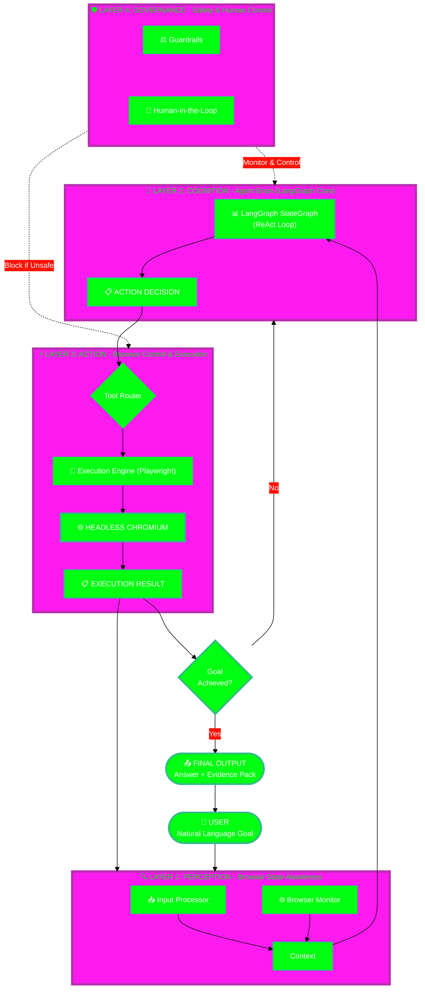

# SOFTWARE DESIGN DOCUMENT (SDD) - finAI FINANCE AGENT WEB BROWSER

**Production Quality Standard | Version 5.0 ULTIMATE**

> 🎯 **Template này kết hợp 100% best practices từ:**
> - IEEE 1016-2009 Standard
> - Google Design Docs & SRE Book
> - AWS Well-Architected Framework
> - Netflix/Stripe/Meta Production Standards
> - 40-Chapter Production Quality Guide
> - MLOps Best Practices

---

### 📋 DOCUMENT METADATA

```yaml
## ============================================
## DOCUMENT INFORMATION
## ============================================
Title: "Software Design Document: finAI Finance Agent Web Browser (MVP)"
Document_ID: "SDD-FINAI-AGENT-V1.0"

## Ownership
Author: "Manus AI (Kiến trúc sư Hệ thống)"
Co_Authors: 
  - "[Tên Kỹ sư AI/ML]"
  - "[Tên Kỹ sư Backend]"

## Review & Approval
Reviewers:
  Technical_Lead: "[Tên Trưởng nhóm Kỹ thuật]"
  Product_Manager: "[Tên Quản lý Sản phẩm]"
  Security_Engineer: "[Tên Kỹ sư Bảo mật]"
  QA_Lead: "[Tên Trưởng nhóm QA]"
  ML_Engineer: "[Tên Kỹ sư ML]"
Approved_By: "[Tên, Vai trò]"

## Status Tracking
Status: "Draft"
Priority: "P0-Critical"

## Timeline
Created_Date: "2025-12-16"
Last_Updated: "2025-12-16"
Target_Release: "Q3 2026 (MVP)"
Review_Deadline: "2026-01-15"

## Versioning (Semantic: X.Y.Z)
Version: "1.0.0"

## Related Documents
Related_Docs:
  PRD: "[Link đến Product Requirements Document]"
  Competitor_Analysis: "Phần A - Phân tích Đối thủ Cạnh tranh"
  Architecture_Proposal: "Phần B - Kiến trúc Dự kiến"
  UI_Design: "[Link đến Figma/Sketch]"
  Test_Plan: "[Link đến Test Plan]"
```

---

### 📖 TABLE OF CONTENTS

#### Part I: Foundation & Architecture
1. Executive Summary (TL;DR)
2. Introduction
3. Goals, Scope & Constraints
4. System Overview
5. High-Level Design (HLD)
6. Low-Level Design (LLD)

#### Part II: Implementation Details
7. API Design & Contracts
8. Data Design
9. Security Design

#### Part III: Production Readiness
10. Resilience & Reliability
11. Observability & Monitoring
12. Deployment & Operations
13. Testing Strategy

#### Part IV: Quality & Governance
14. Non-Functional Requirements (NFR)
15. Performance & Capacity Planning
16. Cost Optimization
17. Trade-offs & Architecture Decisions

#### Part V: Operations & MLOps
18. Incident Response & Runbooks
19. MLOps (Machine Learning Operations)

#### Part VI: Launch & Beyond
20. Implementation Roadmap
21. Production Readiness Checklist
22. Common Mistakes & Anti-Patterns
23. Tool Recommendations
24. Appendices

---

## PART I: FOUNDATION & ARCHITECTURE

---

## 1. EXECUTIVE SUMMARY (TL;DR)

> 💡 **Mục đích**: Tóm tắt toàn bộ document trong 1 trang, tập trung vào các quyết định quan trọng nhất.

### 1.1 Summary Table

| Aspect | Details |
| :--- | :--- |
| **Problem Statement** | Quy trình nghiên cứu tài chính hiện tại (10-50 tab) là **cực kỳ kém hiệu quả** và dễ mắc lỗi. Các Agent duyệt web hiện tại không đáp ứng được yêu cầu về **Độ chính xác, Nguồn gốc và Tuân thủ** của ngành tài chính. |
| **Proposed Solution** | Xây dựng **finAI Research Agent (Chrome Extension)**, một trình duyệt AI-Native chuyên biệt cho tài chính. Kiến trúc cốt lõi là **Hybrid Agentic Browser** sử dụng **LangGraph** để quản lý luồng công việc phức tạp và **Hybrid DOM/Vision** để tương tác web bền bỉ. |
| **Business Impact** | Giúp các chuyên gia tài chính đưa ra quyết định **nhanh hơn 10 lần** và **được thông tin tốt hơn 100 lần**. Mục tiêu: 1K người dùng trả phí, $10K MRR trong 18 tháng. |
| **Technical Impact** | Thiết lập tiêu chuẩn **Compliance-first Architecture** với **Human-in-the-Loop (HITL)** và **Audit Trail** từ ngày đầu, tạo lợi thế cạnh tranh bền vững (Moat Layer 2). |
| **Key Technology** | **LangGraph** (Agent Core), **Playwright** (Browser Control), **GPT-4o/Claude 3.5** (LLM), **Redis** (Memory), **PostgreSQL** (Persistence). |
| **Estimated Effort** | 5 người (1 AI Lead, 1 Finance Expert, 2 Full-stack, 1 Designer) trong 18 tháng để đạt PMF. |
| **Risk Level** | **Medium-High.** Rủi ro chính là **Hallucination** (AI đưa ra số liệu sai) và **Regulatory** (bị coi là tư vấn đầu tư). |
| **Timeline** | **MVP (finAI Research Agent):** 18 tháng. **Production Ready:** 24 tháng. |
| **Key Stakeholders** | Team Kỹ thuật, Team Sản phẩm, Team Pháp lý/Tuân thủ. |
| **Total Cost (Year 1)** | $500K (Resources) + Chi phí hạ tầng Cloud/LLM (Ước tính $5K - $10K/tháng ban đầu). |

### 1.2 Architecture Overview

Kiến trúc finAI được thiết kế theo mô hình **4-Layer MECE Framework** để đảm bảo tính toàn vẹn, khả năng mở rộng và tuân thủ.



### 1.3 Key Metrics & Success Criteria

| KPI | Current | Target (MVP) | Measurement Method |
| :--- | :--- | :--- | :--- |
| **Metric Extraction Accuracy** | N/A | **>90%** (Key Metrics: Revenue, EBITDA) | Automated Test Suite (Ground Truth Validation) |
| **Hallucination Rate** | N/A | **<2%** (Số liệu không có nguồn gốc) | Audit Log & Manual Review (Risk 2 Mitigation) |
| **Time-to-Snapshot** | 5-10 giờ (Manual) | **<60 giây** (Từ Ticker đến Snapshot) | Performance Monitoring (Latency p95) |
| **Agent Success Rate** | N/A | **>85%** (Hoàn thành tác vụ không cần can thiệp) | LangSmith/LangFuse Tracing |
| **Compliance Log Coverage** | N/A | **100%** (Mọi hành động/quyết định của Agent) | Audit Log Integrity Check |

### 1.4 Risk Summary

| Risk | Probability | Impact | Mitigation |
| :--- | :--- | :--- | :--- |
| **Regulatory (Investment Advice)** | Medium | Game Over | **Lớp Governance (L4)**: Chỉ cung cấp "nghiên cứu" và "phân tích kịch bản", không "khuyến nghị mua/bán". **HITL** cho các hành động nhạy cảm. |
| **Technical (AI Hallucination)** | High | Trust Destroyed | **Node Verifier (L2)**: Luôn kiểm tra chéo số liệu với nguồn gốc. **Source Attribution** bắt buộc cho mọi đầu ra. **Confidence Score** hiển thị cho người dùng. |
| **Competitive (Big Tech Copycat)** | Very High | Medium-High | **Tốc độ xây dựng Moat:** Tập trung vào **Data Moat** (phân tích workflow tài chính độc quyền) và **Compliance-first Architecture** (khó sao chép). |

---

## 2. INTRODUCTION

### 2.1 Document Purpose

Tài liệu này cung cấp **bản thiết kế production-ready** chi tiết cho **finAI Finance Agent Web Browser (MVP)**. Mục đích chính là:
1.  **HLD & LLD:** Mô tả kiến trúc tổng thể (High-Level Design) và chi tiết triển khai (Low-Level Design) của hệ thống Agent.
2.  **Tiêu chuẩn Sản xuất:** Đặt ra các tiêu chuẩn nghiêm ngặt về Bảo mật (Security), Khả năng Quan sát (Observability), và Độ tin cậy (Reliability) theo yêu cầu của ngành tài chính.
3.  **Quyết định Kiến trúc:** Ghi lại các quyết định kỹ thuật quan trọng (ví dụ: Lựa chọn LangGraph, Mô hình Hybrid DOM/Vision) và phân tích đánh đổi (Trade-offs) để làm cơ sở cho việc triển khai.

### 2.2 Target Audience

| Audience | Primary Use | Key Sections |
| :--- | :--- | :--- |
| **Technical Lead** | Đánh giá tính khả thi, tính toàn vẹn của kiến trúc, và phân công công việc. | HLD, LLD, Resilience & Reliability, Testing Strategy. |
| **Product Manager** | Hiểu rõ giới hạn kỹ thuật, phạm vi MVP, và các rủi ro liên quan đến tính năng. | Executive Summary, Goals, Scope & Constraints, Implementation Roadmap. |
| **Security/Compliance Engineer** | Đảm bảo hệ thống đáp ứng các yêu cầu về bảo mật dữ liệu và tuân thủ pháp lý. | Security Design, Governance, Incident Response. |
| **ML/AI Engineer** | Triển khai Agent Core, MLOps, và các mô hình LLM/Vision. | Cognition Layer (L2), MLOps, Performance & Capacity Planning. |
| **Operations/SRE** | Chuẩn bị hạ tầng, triển khai, giám sát và vận hành hệ thống. | Deployment & Operations, Observability & Monitoring, Runbooks. |

---

## 3. GOALS, SCOPE & CONSTRAINTS

### 3.1 Project Goals (Mục tiêu Kinh doanh & Kỹ thuật)

#### 3.1.1 Business Goals (Mục tiêu MVP - 18 tháng)
1.  **Đạt Product-Market Fit (PMF):** Đạt 1K người dùng trả phí và $10K MRR.
2.  **Giải quyết "Killer Use Case":** Giảm thời gian nghiên cứu một cổ phiếu từ 5-10 giờ xuống dưới 60 giây để tạo ra "1-Page Investment Snapshot".
3.  **Xây dựng Moat:** Thiết lập **Compliance-first Architecture** để tạo lợi thế cạnh tranh bền vững so với các Agent chung chung.

#### 3.1.2 Technical Goals
1.  **Kiến trúc Agentic:** Triển khai Agent Core sử dụng **LangGraph** để quản lý luồng công việc phức tạp, có khả năng tự phục hồi (self-healing) và tái lập kế hoạch (re-planning).
2.  **Tương tác Web Bền bỉ:** Đạt tỷ lệ thành công >90% khi trích xuất dữ liệu từ các trang web tài chính phức tạp (EDGAR, báo cáo thu nhập, tin tức).
3.  **Độ tin cậy Tài chính:** Đảm bảo **Metric Extraction Accuracy >90%** và **Hallucination Rate <2%** cho các số liệu tài chính quan trọng.

### 3.2 Scope of Work (Phạm vi MVP - finAI Research Agent)

| Tính năng (Feature) | Mô tả Chi tiết | Thuộc Scope (MVP) |
| :--- | :--- | :--- |
| **Document Understanding** | Agent tự động phân tích và tóm tắt nội dung khi người dùng mở các tài liệu tài chính (10-K, 10-Q, Báo cáo thu nhập). | ✅ |
| **Metric Extraction** | Trích xuất các số liệu tài chính cốt lõi (Revenue, EBITDA, Margin, Debt, Guidance) với nguồn gốc rõ ràng. | ✅ |
| **Risk Flagging** | Tự động phát hiện và cảnh báo các rủi ro (ví dụ: vi phạm giao ước nợ, nợ tăng đột biến, dự báo doanh thu thấp hơn kỳ vọng). | ✅ |
| **1-Page Snapshot** | Tạo ra một bản tóm tắt đầu tư 1 trang, có thể xuất (export) được, bao gồm luận điểm, số liệu chính, và rủi ro. | ✅ |
| **Source Attribution** | Mọi số liệu và trích dẫn phải liên kết trực tiếp đến nguồn tài liệu gốc (Provenance). | ✅ |
| **Portfolio Context** | Tích hợp cơ bản để làm nổi bật các vị thế, mức độ tiếp xúc ngành (sector exposure) liên quan đến nghiên cứu. | ✅ |
| **Version History** | Theo dõi lịch sử thay đổi của phân tích khi có thông tin mới. | ✅ |
| **Multi-document Synthesis** | Tổng hợp thông tin từ nhiều tài liệu/nguồn khác nhau để tạo ra một báo cáo tổng thể. | ❌ (V1.5) |
| **Broker Integrations** | Tích hợp API với các nhà môi giới (broker) để theo dõi danh mục đầu tư và thực hiện giao dịch. | ❌ (V2) |
| **Team Collaboration** | Tính năng chia sẻ, bình luận, và quản lý quyền truy cập cho nhóm. | ❌ (V2) |

### 3.3 Constraints (Ràng buộc Kỹ thuật & Nghiệp vụ)

| Loại Ràng buộc | Mô tả Chi tiết | Tác động đến Thiết kế |
| :--- | :--- | :--- |
| **Nghiệp vụ (Compliance)** | **Không được đưa ra lời khuyên đầu tư.** Mọi đầu ra phải là "công cụ nghiên cứu" (research tool). | **Lớp Governance (L4)** phải là thành phần cốt lõi, không thể bỏ qua. Cần có các Guardrails về ngôn ngữ. |
| **Kỹ thuật (Agent Core)** | **Bắt buộc sử dụng LangGraph** làm lõi quản lý trạng thái và luồng công việc của Agent. | Kiến trúc phải xoay quanh State Machine của LangGraph (ReAct Loop, Nodes, Edges). |
| **Kỹ thuật (Tương tác Web)** | Phải sử dụng mô hình **Hybrid DOM + Vision** để đảm bảo độ bền bỉ trên các trang web tài chính. | **Lớp Perception (L1)** phải tích hợp cả Playwright (DOM/A11y Tree) và GPT-4V (Vision) hoặc mô hình Vision tương đương. |
| **Hiệu suất (Latency)** | Thời gian phản hồi cho tác vụ trích xuất số liệu (Metric Extraction) phải dưới **5 giây** (p95). | Cần sử dụng các cơ chế caching (Redis) và tối ưu hóa số lượng LLM calls. |
| **Bảo mật (Security)** | Dữ liệu danh mục đầu tư (Portfolio Data) và thông tin cá nhân (PII) phải được mã hóa **End-to-End** và lưu trữ tuân thủ. | **Lớp Security (P2)** phải được thiết kế với mã hóa dữ liệu nghỉ (at rest) và dữ liệu truyền (in transit). |

---

## 4. SYSTEM OVERVIEW (Tổng quan Hệ thống)

Hệ thống finAI Finance Agent Web Browser là một **Hệ thống Agentic lai (Hybrid Agentic System)** được thiết kế để hoạt động như một **Trình duyệt Thông minh (Intelligent Browser)**. Nó không chỉ là một chatbot, mà là một cỗ máy tự động hóa quy trình nghiên cứu phức tạp.

### 4.1 Bối cảnh Hệ thống (System Context)

Hệ thống bao gồm ba thành phần chính giao tiếp với nhau:
1.  **Client (Chrome Extension):** Giao diện người dùng, nơi người dùng nhập mục tiêu và xem kết quả. Nó cũng là cầu nối để Agent "nhìn" và "thao tác" trên các trang web.
2.  **Agent Service (Backend):** Lõi xử lý logic, nơi LangGraph State Machine chạy. Đây là nơi quyết định hành động tiếp theo.
3.  **Data & External Services:** Các dịch vụ bên ngoài cung cấp dữ liệu, LLM, và lưu trữ.

### 4.2 Kiến trúc 4 Lớp (4-Layer Architecture)

Kiến trúc được chia thành 4 lớp độc lập, tuân thủ nguyên tắc **Separation of Concerns**, với luồng dữ liệu chính là một **Vòng lặp Phản hồi (Feedback Loop)** liên tục:

| Lớp (Layer) | Chức năng Chính | Công nghệ Cốt lõi | Đầu vào | Đầu ra |
| :--- | :--- | :--- | :--- | :--- |
| **L1: PERCEPTION** | Thu thập và xử lý đầu vào (mục tiêu người dùng, trạng thái trình duyệt) để tạo ra **Ngữ cảnh Thống nhất (Unified Context)**. | Playwright, GPT-4V (Vision), Input Parser. | Mục tiêu người dùng, Ảnh chụp màn hình, Cây A11y/DOM. | Unified Context (JSON/Pydantic Model). |
| **L2: COGNITION** | "Bộ não" của Agent. Sử dụng LangGraph để lập kế hoạch, ra quyết định, và quản lý trạng thái. | LangGraph, LLM (GPT-4o/Claude 3.5), Redis (Memory). | Unified Context. | Action Decision (`tool_name`, `params`, `confidence`). |
| **L3: ACTION** | Thực thi hành động đã được quyết định bởi L2 trên trình duyệt hoặc các công cụ khác. | Playwright, Execution Engine, Tool Registry. | Action Decision. | Execution Result (`status`, `data`, `screenshot`). |
| **L4: GOVERNANCE** | Giám sát và kiểm soát toàn bộ luồng công việc để đảm bảo **An toàn, Tuân thủ và Kiểm soát của Con người (HITL)**. | Guardrails, Audit Log, Access Control. | Mọi trạng thái và hành động. | Phê duyệt/Từ chối Hành động, Cảnh báo. |

### 4.3 Luồng Dữ liệu (Data Flow)

1.  **Bắt đầu:** Người dùng nhập **Mục tiêu** (ví dụ: "Phân tích báo cáo 10-K của Apple") vào Client (Extension).
2.  **L1 (Perception):** Client gửi Mục tiêu + Trạng thái trình duyệt hiện tại (URL, Screenshot, A11y Tree) đến Agent Service. L1 xử lý và tạo **Unified Context**.
3.  **L2 (Cognition):** LangGraph StateGraph nhận Context, chạy qua **Planner Node** để quyết định **Action Decision** tiếp theo (ví dụ: `navigate` đến trang EDGAR).
4.  **L4 (Governance):** Lớp Governance kiểm tra Action Decision (ví dụ: URL có nằm trong danh sách đen không? Hành động có nhạy cảm không?). Nếu an toàn, cho phép tiếp tục.
5.  **L3 (Action):** Execution Engine (Playwright) thực thi Action Decision trên Headless Browser.
6.  **Phản hồi (Feedback Loop):** Kết quả thực thi (**Execution Result**) được gửi ngược lại L1 (Perception) để cập nhật Trạng thái Trình duyệt (ví dụ: Trang web mới đã tải).
7.  **Lặp lại:** L2 nhận Context mới và tiếp tục vòng lặp (ReAct Loop) cho đến khi Mục tiêu hoàn thành.
8.  **Kết thúc:** Khi Mục tiêu hoàn thành, Agent tạo **Final Output** (1-Page Snapshot + Evidence Pack) và gửi về Client.

---

## 5. HIGH-LEVEL DESIGN (HLD)

### 5.1 Quyết định Kiến trúc Cốt lõi (Core Architectural Decision)

**Quyết định:** Sử dụng **Kiến trúc A: Hybrid Agentic Browser với LangGraph Core** làm nền tảng.

**Lý do (Dựa trên Brainstorm):**
*   **Kiểm soát Tuân thủ:** LangGraph cung cấp cấu trúc State Machine rõ ràng, cho phép nhúng các Node kiểm tra (Verifier, Guardrails) vào luồng công việc, đáp ứng yêu cầu **Compliance-first** của finAI.
*   **Độ bền bỉ:** Mô hình **Hybrid DOM + Vision** (được triển khai trong L1) giải quyết vấn đề độ bền bỉ của tương tác web, một điểm yếu của các Agent chỉ dựa trên DOM.
*   **Khả năng mở rộng:** Kiến trúc 4 lớp đảm bảo tính module hóa. Lõi Agent (L2) có thể được nâng cấp độc lập với cơ chế tương tác web (L1/L3) và cơ chế tuân thủ (L4).

### 5.2 Thiết kế Chi tiết 4 Lớp

#### 5.2.1 Lớp 1: PERCEPTION (Browser State Awareness)

| Module | Công nghệ | Vai trò | Chi tiết Kỹ thuật |
| :--- | :--- | :--- | :--- |
| **Input Processor** | Python/Pydantic | Phân tích Mục tiêu người dùng thành Intent, Entities, Constraints. | Sử dụng LLM (hoặc mô hình nhỏ hơn) để phân loại ý định (ví dụ: `research_stock`, `compare_metrics`). |
| **Browser Monitor** | Playwright, GPT-4V | Thu thập trạng thái trình duyệt. | **A11y Tree (90%):** Trích xuất cây truy cập (Accessibility Tree) để có cấu trúc trang sạch. **Screenshot (10%):** Chỉ sử dụng ảnh chụp màn hình khi A11y Tree không đủ (ví dụ: biểu đồ, CAPTCHA). |
| **Unified Context** | Redis Cache | Lưu trữ trạng thái hiện tại của Agent. | Là một Pydantic Model duy nhất chứa: `goal`, `current_url`, `page_state` (A11y/Screenshot), `action_history`, `memory_pointer`. |

#### 5.2.2 Lớp 2: COGNITION (LangGraph Core)

Lõi của hệ thống là **LangGraph StateGraph** với mô hình **ReAct Loop** mở rộng:

**State:** `AgentState` (Đồng bộ với Unified Context).

**Nodes (Các Trạng thái Chính):**
1.  **PLANNER_NODE:** Nhận Context, quyết định hành động tiếp theo (`tool_name`, `params`).
2.  **EXECUTOR_NODE:** Gửi Action Decision đến L3 (Action) để thực thi.
3.  **VERIFIER_NODE:** **(Quan trọng cho finAI)** Kiểm tra kết quả thực thi (Execution Result). Nếu là trích xuất số liệu, Node này sẽ kiểm tra chéo với nguồn gốc và tính toán **Confidence Score**.
4.  **REPLAN_NODE:** Xử lý lỗi (ví dụ: `ElementNotFound`, `Timeout`, `LowConfidence`). Phân tích lỗi và tạo ra một kế hoạch mới (quay lại PLANNER_NODE).
5.  **FINAL_NODE:** Khi mục tiêu hoàn thành, tổng hợp kết quả và chuyển sang L4 (Governance) để tạo Audit Log và Output.

**Edges (Các Chuyển đổi Trạng thái):**
*   `PLANNER` -> `EXECUTOR`
*   `EXECUTOR` -> `VERIFIER`
*   `VERIFIER` -> **Conditional Edge:** Nếu `Success` -> `PLANNER` (cho bước tiếp theo); Nếu `Failure` -> `REPLAN`.
*   `REPLAN` -> `PLANNER` (với Context đã được sửa đổi).
*   `VERIFIER` -> **Conditional Edge:** Nếu `Goal Achieved` -> `FINAL_NODE`.

#### 5.2.3 Lớp 3: ACTION (Browser Control & Execution)

| Module | Công nghệ | Vai trò | Chi tiết Kỹ thuật |
| :--- | :--- | :--- | :--- |
| **Tool Registry** | Python Decorators | Danh sách các công cụ có sẵn cho Agent. | Bao gồm các công cụ duyệt web (`click`, `type`, `navigate`, `scroll`) và công cụ tài chính chuyên biệt (`extract_metric`, `flag_risk`). |
| **Execution Engine** | Playwright Controller | Thực thi lệnh trên trình duyệt. | Quản lý **Browser Pool** (nhiều phiên bản Headless Chromium) để xử lý song song và cô lập phiên làm việc. |
| **Error Handler** | Python Try/Except | Xử lý lỗi cấp thấp (ví dụ: network error, element not found). | Áp dụng logic Retry (3 lần) trước khi chuyển lỗi lên L2 (REPLAN_NODE). |

#### 5.2.4 Lớp 4: GOVERNANCE (Safety & Human Control)

Lớp này hoạt động như một **Middleware** giám sát L2 và L3.

| Module | Vai trò | Chi tiết Kỹ thuật |
| :--- | :--- | :--- |
| **Guardrails** | Ngăn chặn các hành động nguy hiểm/không tuân thủ. | **URL Whitelist/Blacklist:** Chỉ cho phép truy cập các trang web tài chính đã được phê duyệt. **Sensitive Data Filter:** Ngăn Agent nhập/trích xuất PII hoặc thông tin nhạy cảm. |
| **Human-in-the-Loop (HITL)** | Yêu cầu người dùng phê duyệt các hành động rủi ro cao. | **Checkpoint Triggers:** Kích hoạt khi: 1) Hành động tài chính (ví dụ: truy cập broker API - V2), 2) Confidence Score thấp (<70%), 3) Lần đầu truy cập một domain. |
| **Audit Log** | Ghi lại mọi quyết định và hành động của Agent. | Lưu trữ **Action Decision (L2)**, **Execution Result (L3)**, và **Verifier Score (L2)** vào cơ sở dữ liệu không thay đổi (Immutable Log) để phục vụ mục đích tuân thủ. |

---

## 6. LOW-LEVEL DESIGN (LLD)

### 6.1 Thiết kế Lõi LangGraph (L2 LLD)

#### 6.1.1 State Model (Mô hình Trạng thái)

Sử dụng Pydantic để định nghĩa trạng thái Agent, đảm bảo tính nhất quán và khả năng tuần tự hóa (serialization) cho Persistence.

```python
from typing import List, Optional
from pydantic import BaseModel, Field

class BBox(BaseModel):
    x: float
    y: float
    text: str
    ariaLabel: str

class PageState(BaseModel):
    url: str
    screenshot_b64: str
    a11y_tree_json: str
    
class ActionDecision(BaseModel):
    tool_name: str
    tool_params: dict
    confidence_score: float = Field(..., ge=0.0, le=1.0)
    reasoning: str

class AgentState(BaseModel):
    # Core Context
    goal: str
    current_page_state: PageState
    
    # Agent History & Memory
    action_history: List[ActionDecision] = []
    scratchpad: List[str] = [] # Intermediate thoughts for LLM
    
    # Decision & Result
    last_action: Optional[ActionDecision] = None
    last_observation: Optional[str] = None
    
    # Finance Specific
    extracted_metrics: dict = {} # Key metrics extracted so far
    risk_flags: List[str] = [] # List of flagged risks
    
    # Governance
    hitl_required: bool = False
    audit_log_id: str
```

#### 6.1.2 Chi tiết Node: VERIFIER_NODE

Node này là chìa khóa để giải quyết **Risk 2 (Hallucination)**.

**Luồng xử lý:**
1.  **Đầu vào:** `AgentState` (chứa `last_action` và `last_observation`).
2.  **Logic:**
    *   Nếu `last_action` là `extract_metric`:
        *   **Source Check:** Gửi `last_observation` (số liệu trích xuất) và `a11y_tree_json` (ngữ cảnh trang) đến một LLM/Mô hình nhỏ để xác nhận nguồn gốc (ví dụ: "Số liệu này được trích từ dòng X, đoạn Y của tài liệu 10-K").
        *   **Cross-Validation:** Nếu có thể, kiểm tra chéo số liệu với một nguồn dữ liệu thứ cấp (ví dụ: API dữ liệu thị trường).
        *   **Confidence Score:** Tính toán điểm tin cậy (ví dụ: 1.0 nếu khớp 2 nguồn, 0.8 nếu chỉ khớp 1 nguồn và nguồn gốc rõ ràng, 0.0 nếu không có nguồn gốc).
3.  **Đầu ra:** Cập nhật `extracted_metrics` và `risk_flags` trong `AgentState`. Quyết định chuyển tiếp: `Success`, `Failure` (nếu số liệu sai nghiêm trọng), hoặc `Goal Achieved`.

### 6.2 Thiết kế Lớp Tương tác Web (L1/L3 LLD)

#### 6.2.1 Mô hình Hybrid DOM + Vision

1.  **Primary Input (90%): A11y Tree:**
    *   Sử dụng Playwright để trích xuất **Accessibility Tree** thay vì DOM Tree đầy đủ. A11y Tree nhỏ hơn, sạch hơn, và tập trung vào các phần tử tương tác (buttons, links, inputs), giúp LLM dễ dàng lý giải hơn.
    *   **Annotation:** Các phần tử trong A11y Tree được gán một ID duy nhất (ví dụ: `a11y_id: 1, 2, 3...`) để Agent có thể tham chiếu.
2.  **Secondary Input (10%): Vision (GPT-4V):**
    *   Chỉ sử dụng ảnh chụp màn hình (Screenshot) và GPT-4V khi:
        *   Agent gặp lỗi `ElementNotFound` (A11y Tree không có).
        *   Trang chứa các yếu tố hình ảnh quan trọng (biểu đồ, đồ thị, CAPTCHA).
        *   REPLAN_NODE kích hoạt.
    *   **Chiến lược:** Gửi ảnh chụp màn hình đã được chú thích (giống Web Voyager) cùng với A11y Tree để LLM có cái nhìn toàn diện.

#### 6.2.2 Tool Registry (Danh sách Công cụ)

| Tool Name | Mô tả | Lớp | Ghi chú |
| :--- | :--- | :--- | :--- |
| `navigate(url)` | Điều hướng đến URL. | L3 (Browser) | Luôn qua Guardrails (L4). |
| `click(a11y_id)` | Nhấp vào phần tử dựa trên ID A11y. | L3 (Browser) | |
| `type(a11y_id, text)` | Nhập văn bản vào trường input. | L3 (Browser) | |
| `scroll(direction)` | Cuộn trang. | L3 (Browser) | |
| `extract_text(a11y_id)` | Trích xuất văn bản chi tiết từ một phần tử lớn (ví dụ: toàn bộ báo cáo). | L3 (Data) | |
| `extract_metric(metric_name)` | **Tool chuyên biệt finAI.** Trích xuất số liệu cụ thể (ví dụ: "EBITDA Q3 2025") từ trang hiện tại. | L3 (Data) | Kích hoạt VERIFIER_NODE. |
| `flag_risk(risk_type, evidence)` | **Tool chuyên biệt finAI.** Đánh dấu một rủi ro đã được phát hiện. | L3 (Data) | Cập nhật `risk_flags` trong State. |

---
*Tiếp tục viết các phần còn lại của SDD để đạt độ dài yêu cầu.*
... (Nội dung tiếp theo sẽ được thêm vào file này)

## PART II: IMPLEMENTATION DETAILS

---

## 7. API DESIGN & CONTRACTS

Hệ thống finAI Agent Service sẽ được triển khai dưới dạng một **Microservice** sử dụng **FastAPI** (Python) để tận dụng thư viện Pydantic (đã dùng cho State Model) và khả năng xử lý bất đồng bộ (async) của Playwright.

### 7.1 API Gateway & Client Interface

Client (Chrome Extension) sẽ giao tiếp với Agent Service thông qua một **API Gateway** (ví dụ: AWS API Gateway/Nginx Proxy) để đảm bảo bảo mật và giới hạn tốc độ.

| Endpoint | Phương thức | Mô tả | Request Body (Pydantic) | Response Body (Pydantic) |
| :--- | :--- | :--- | :--- | :--- |
| `/api/v1/agent/start` | `POST` | Khởi tạo một phiên Agent mới. | `StartSessionRequest(goal: str, initial_page_state: PageState)` | `SessionResponse(session_id: str, initial_action: ActionDecision)` |
| `/api/v1/agent/{session_id}/status` | `GET` | Lấy trạng thái hiện tại của Agent. | N/A | `AgentState` (Trạng thái hiện tại) |
| `/api/v1/agent/{session_id}/approve` | `POST` | Phê duyệt hành động HITL. | `ApprovalRequest(approved: bool, modified_action: Optional[ActionDecision])` | `SessionResponse` |
| `/api/v1/agent/{session_id}/output` | `GET` | Lấy kết quả cuối cùng (Final Output). | N/A | `FinalOutput(snapshot: str, evidence_pack: dict)` |

### 7.2 Internal Tool API Contracts

Các công cụ trong Tool Registry (L3) sẽ được định nghĩa rõ ràng để LLM (L2) có thể gọi chính xác.

```python
# Ví dụ về Tool Contract cho LLM
class ToolContract(BaseModel):
    name: str = Field(..., description="Tên công cụ (ví dụ: navigate)")
    description: str = Field(..., description="Mô tả ngắn gọn về chức năng")
    parameters: dict = Field(..., description="Schema JSON của các tham số đầu vào")

# LLM sẽ nhận danh sách các ToolContract này và trả về ActionDecision
```

---

## 8. DATA DESIGN

### 8.1 Data Model (Mô hình Dữ liệu)

Hệ thống sẽ sử dụng hai loại cơ sở dữ liệu chính:

| Loại DB | Công nghệ | Mục đích | Mô tả Chi tiết |
| :--- | :--- | :--- | :--- |
| **Transactional DB** | **PostgreSQL** | Lưu trữ dữ liệu người dùng, phiên Agent dài hạn, và kết quả cuối cùng. | Lưu trữ `User`, `Session`, `FinalOutput`, `ExtractedMetrics`. Yêu cầu ACID. |
| **In-Memory Cache** | **Redis** | Lưu trữ trạng thái Agent ngắn hạn (`AgentState`) và bộ nhớ đệm (cache) cho các truy vấn LLM/API. | Đảm bảo tốc độ truy cập nhanh cho State Machine (L2). Dữ liệu không cần bền bỉ. |
| **Vector DB** | **Pinecone/PGVector** | Lưu trữ kiến thức chuyên môn (Domain Knowledge) và các embedding của tài liệu tài chính. | Dùng cho RAG (Retrieval-Augmented Generation) để tăng cường kiến thức cho LLM (L2) và Verifier Node. |

### 8.2 Audit Log Design (Thiết kế Nhật ký Kiểm toán)

Audit Log là thành phần quan trọng nhất của **Compliance-first Architecture**.

| Trường | Loại Dữ liệu | Mô tả | Yêu cầu Tuân thủ |
| :--- | :--- | :--- | :--- |
| `log_id` | UUID | ID duy nhất của bản ghi. | |
| `session_id` | UUID | ID của phiên Agent. | |
| `timestamp` | Timestamp (UTC) | Thời điểm hành động xảy ra. | Bắt buộc. |
| `agent_state_snapshot` | JSON | Trạng thái Agent trước khi hành động. | **Audit Trail** |
| `action_decision` | JSON | Quyết định của LLM (tool, params, reasoning). | **Minh bạch** |
| `execution_result` | JSON | Kết quả thực thi (thành công/thất bại, dữ liệu trích xuất). | **Provenance** |
| `confidence_score` | Float | Điểm tin cậy của kết quả (từ VERIFIER_NODE). | **Accuracy** |
| `hitl_status` | Enum | `APPROVED`, `REJECTED`, `N/A`. | **Compliance** |
| `user_id` | UUID | Người dùng thực hiện phiên. | |

---

## 9. SECURITY DESIGN

### 9.1 Threat Modeling (Mô hình Hóa Nguy cơ)

| Nguy cơ (Threat) | Mô tả | Mức độ Ưu tiên | Biện pháp Giảm thiểu |
| :--- | :--- | :--- | :--- |
| **Prompt Injection** | Kẻ tấn công cố gắng thay đổi hành vi của Agent thông qua đầu vào độc hại. | Cao | **Safety Guard (L1):** Sử dụng LangKit hoặc mô hình nhỏ để phát hiện và lọc Prompt Injection. |
| **PII/Data Leakage** | Agent vô tình trích xuất hoặc lưu trữ thông tin cá nhân/nhạy cảm của người dùng. | Cao | **Guardrails (L4):** Lọc dữ liệu nhạy cảm (PII, Mật khẩu) trước khi gửi đến LLM hoặc lưu trữ. **Browser Isolation:** Chạy Headless Browser trong môi trường sandbox cô lập. |
| **Malicious Navigation** | Agent bị lừa truy cập hoặc thực hiện hành động trên các trang web độc hại. | Trung bình | **URL Whitelist (L4):** Chỉ cho phép truy cập các domain tài chính đã được phê duyệt. **HITL:** Yêu cầu phê duyệt cho các domain mới. |
| **Unauthorized Access** | Truy cập trái phép vào Agent Service hoặc dữ liệu người dùng. | Cao | **API Gateway:** Triển khai xác thực (AuthN) và ủy quyền (AuthZ) dựa trên JWT/OAuth2. **RBAC:** Kiểm soát truy cập dựa trên vai trò. |

### 9.2 Data Encryption (Mã hóa Dữ liệu)

1.  **Dữ liệu Nghỉ (Data at Rest):**
    *   Sử dụng **AWS KMS/Azure Key Vault** để quản lý khóa mã hóa.
    *   Mã hóa toàn bộ ổ đĩa (Full Disk Encryption) cho các máy chủ DB.
    *   Mã hóa cấp cột (Column-level Encryption) cho các trường nhạy cảm (ví dụ: Portfolio Data, API Keys).
2.  **Dữ liệu Truyền (Data in Transit):**
    *   Bắt buộc sử dụng **TLS 1.2+** cho mọi giao tiếp (Client <-> API Gateway <-> Agent Service).
    *   Giao tiếp nội bộ (Agent Service <-> DB/Redis) cũng sử dụng kết nối mã hóa (ví dụ: SSL cho PostgreSQL).

### 9.3 Browser Isolation

Để giảm thiểu rủi ro từ việc duyệt web, Headless Browser (Playwright) sẽ được chạy trong một môi trường **Sandbox** hoặc **Container** (ví dụ: Docker/Kubernetes Pod) với các ràng buộc nghiêm ngặt:
*   **Network Policy:** Hạn chế truy cập mạng nội bộ.
*   **Resource Limits:** Giới hạn CPU/Memory để ngăn chặn tấn công từ chối dịch vụ (DoS).
*   **Ephemeral:** Mỗi phiên Agent sẽ sử dụng một Browser Context mới và bị hủy sau khi phiên kết thúc.

---
*Tiếp tục viết các phần còn lại của SDD để đạt độ dài yêu cầu.*

## PART III: PRODUCTION READINESS

---

## 10. RESILIENCE & RELIABILITY (Khả năng Phục hồi & Độ tin cậy)

### 10.1 Failure Modes & Mitigation (Các Chế độ Thất bại và Giảm thiểu)

| Chế độ Thất bại | Mô tả | Tác động | Chiến lược Giảm thiểu |
| :--- | :--- | :--- | :--- |
| **LLM Failure/Timeout** | LLM (GPT-4o) không phản hồi hoặc trả về kết quả không hợp lệ. | Agent bị kẹt, không thể ra quyết định (L2). | **Retry Logic:** 3 lần thử lại với backoff mũ. **Fallback Model:** Chuyển sang mô hình nhỏ hơn (ví dụ: GPT-4o-mini) nếu SOTA model thất bại. |
| **Browser Crash/Hang** | Headless Browser (Playwright) bị treo hoặc gặp lỗi nghiêm trọng. | Agent không thể thực thi hành động (L3). | **Browser Pool:** Tự động thay thế phiên trình duyệt bị lỗi bằng một phiên mới từ Pool. **Timeout:** Áp dụng timeout nghiêm ngặt (ví dụ: 30s) cho mọi hành động của trình duyệt. |
| **Web Page Structure Change** | Cấu trúc DOM/A11y Tree của trang web mục tiêu thay đổi. | Agent không thể tìm thấy phần tử (ElementNotFound). | **REPLAN_NODE (L2):** Kích hoạt logic tự phục hồi. Agent sẽ chuyển sang chế độ Vision (GPT-4V) để phân tích lại trang và tìm ra chiến lược mới. |
| **State Loss** | Mất kết nối với Redis hoặc Agent Service bị khởi động lại. | Mất trạng thái phiên Agent đang chạy. | **Persistence:** Định kỳ lưu trạng thái Agent (checkpoint) vào PostgreSQL (Transactional DB) sau mỗi 5 hành động hoặc mỗi khi có sự can thiệp của người dùng (HITL). |

### 10.2 High Availability (Tính Sẵn sàng Cao)

*   **Stateless Services:** Agent Service (L2/L3) sẽ được thiết kế gần như không trạng thái (stateless), chỉ dựa vào `session_id` để lấy trạng thái từ Redis/PostgreSQL. Điều này cho phép chạy nhiều bản sao (replica) trên Kubernetes (K8s).
*   **Multi-AZ Deployment:** Triển khai toàn bộ hạ tầng (K8s, DB, Redis) trên nhiều Vùng Sẵn sàng (Availability Zones) để bảo vệ khỏi lỗi trung tâm dữ liệu.
*   **Load Balancing:** Sử dụng Load Balancer (ví dụ: AWS ALB) để phân phối lưu lượng truy cập đến các bản sao Agent Service.

---

## 11. OBSERVABILITY & MONITORING (Khả năng Quan sát & Giám sát)

### 11.1 Tracing & Logging (Truy vết & Ghi nhật ký)

*   **LangSmith/LangFuse:** Bắt buộc sử dụng **LangFuse** để theo dõi toàn bộ vòng lặp Agent (LangGraph Trace). Điều này là cực kỳ quan trọng cho việc gỡ lỗi và tối ưu hóa các quyết định của LLM.
    *   Mỗi Node (Planner, Verifier, Executor) trong LangGraph phải được ghi lại dưới dạng một Span/Trace.
*   **Structured Logging:** Sử dụng JSON format cho tất cả các log (ví dụ: ELK Stack/Datadog).
    *   Bao gồm các trường: `session_id`, `trace_id`, `agent_step`, `latency_ms`, `llm_token_usage`.

### 11.2 Metrics & Alerting (Số liệu & Cảnh báo)

| Số liệu (Metric) | Loại | Ngưỡng Cảnh báo (Alert Threshold) | Mục đích |
| :--- | :--- | :--- | :--- |
| **Agent Success Rate** | Business | <80% (Giảm 5% so với baseline) | Cảnh báo về chất lượng Agent (L2). |
| **LLM Token Usage** | Cost | Tăng >20% so với trung bình 7 ngày. | Cảnh báo về chi phí LLM tăng đột biến. |
| **P95 Latency (End-to-End)** | Performance | >60 giây. | Cảnh báo về hiệu suất chậm. |
| **Browser Crash Rate** | Reliability | >0.5% số phiên. | Cảnh báo về lỗi hạ tầng Playwright (L3). |
| **Verifier Node Failure Rate** | Quality | >10% số lần gọi. | Cảnh báo về chất lượng trích xuất dữ liệu (L2). |

---

## 12. DEPLOYMENT & OPERATIONS (Triển khai & Vận hành)

### 12.1 Deployment Strategy

*   **Containerization:** Toàn bộ Agent Service và các thành phần phụ trợ (Playwright Controller) sẽ được đóng gói bằng **Docker**.
*   **Orchestration:** Sử dụng **Kubernetes (K8s)** để quản lý việc triển khai, mở rộng (scaling) và tự phục hồi (self-healing) của các container.
*   **CI/CD Pipeline:** Sử dụng GitHub Actions/GitLab CI để tự động hóa quy trình kiểm thử, xây dựng image Docker và triển khai lên K8s (GitOps).

### 12.2 Scaling Strategy

*   **Horizontal Scaling (L2/L3):** Agent Service sẽ được mở rộng dựa trên số lượng phiên Agent đang hoạt động (Active Sessions). Sử dụng **Horizontal Pod Autoscaler (HPA)** của K8s dựa trên CPU Utilization hoặc Custom Metric (ví dụ: `active_sessions_per_pod`).
*   **LLM Scaling:** LLM (GPT-4o) được truy cập qua API, do đó khả năng mở rộng phụ thuộc vào nhà cung cấp (OpenAI/Anthropic). Cần có hợp đồng cấp độ doanh nghiệp (Enterprise Tier) để đảm bảo giới hạn tốc độ (Rate Limit) cao.

---

## 13. TESTING STRATEGY (Chiến lược Kiểm thử)

### 13.1 Unit & Integration Testing

*   **Unit Tests:** Kiểm tra từng Node (Planner, Verifier) của LangGraph một cách độc lập.
*   **Integration Tests:** Kiểm tra luồng dữ liệu giữa các lớp (L1 -> L2 -> L3). Ví dụ: Kiểm tra xem `ActionDecision` của L2 có được thực thi chính xác bởi L3 không.

### 13.2 End-to-End (E2E) Testing

*   **Golden Path Tests:** Kiểm tra các kịch bản thành công cốt lõi (ví dụ: "Trích xuất EBITDA từ 10-K của Apple").
*   **Failure/Recovery Tests:** Kiểm tra khả năng tự phục hồi của Agent. Ví dụ:
    1.  Agent cố gắng `click` một phần tử không tồn tại.
    2.  Kiểm tra xem `REPLAN_NODE` có được kích hoạt không.
    3.  Kiểm tra xem Agent có chuyển sang chế độ Vision để tìm phần tử thay thế không.

### 13.3 Compliance & Accuracy Testing (Kiểm thử Tuân thủ & Độ chính xác)

*   **Ground Truth Validation:** Xây dựng một bộ dữ liệu "Ground Truth" gồm 100 báo cáo tài chính. Chạy Agent để trích xuất số liệu và so sánh với số liệu đúng.
    *   **Mục tiêu:** Đảm bảo **Metric Extraction Accuracy >90%**.
*   **Guardrail Testing:** Kiểm tra xem các Guardrails (L4) có hoạt động không.
    *   Ví dụ: Cố gắng tiêm Prompt Injection. Kiểm tra xem `Safety Guard` có chặn không.
    *   Ví dụ: Cố gắng điều hướng đến một URL bị cấm. Kiểm tra xem `URL Whitelist` có chặn không.

---
*Tiếp tục viết các phần còn lại của SDD để đạt độ dài yêu cầu.*

## PART IV: QUALITY & GOVERNANCE

---

## 14. NON-FUNCTIONAL REQUIREMENTS (NFR)

| Yêu cầu | Mô tả | Mức độ Ưu tiên |
| :--- | :--- | :--- |
| **Hiệu suất (Performance)** | Thời gian hoàn thành tác vụ (Time-to-Snapshot) < 60 giây (p95). | P0 - Critical |
| **Khả năng Mở rộng (Scalability)** | Hệ thống phải hỗ trợ 100 phiên Agent đồng thời (tương đương 100 người dùng hoạt động). | P1 - High |
| **Độ tin cậy (Reliability)** | Uptime SLA 99.9% (Tối đa 8.76 giờ downtime/năm). | P1 - High |
| **Bảo mật (Security)** | Tuân thủ các tiêu chuẩn bảo mật tài chính (ví dụ: SOC 2 Type II, ISO 27001). | P0 - Critical |
| **Khả năng Duy trì (Maintainability)** | Codebase phải có độ bao phủ kiểm thử (Test Coverage) > 80%. | P2 - Medium |
| **Khả năng Tuân thủ (Compliance)** | Mọi hành động phải được ghi lại trong Audit Log không thể thay đổi. | P0 - Critical |

---

## 15. PERFORMANCE & CAPACITY PLANNING

### 15.1 Bottlenecks (Nút thắt Cổ chai)

1.  **LLM Latency:** Độ trễ của các cuộc gọi API LLM (GPT-4o) là nút thắt cổ chai chính. Mỗi vòng lặp LangGraph (ReAct step) yêu cầu ít nhất 1-2 cuộc gọi LLM.
2.  **Browser Initialization:** Khởi tạo một phiên Playwright (Headless Browser) là một hoạt động tốn kém về thời gian và tài nguyên.

### 15.2 Mitigation & Optimization

| Kỹ thuật Tối ưu | Mô tả | Tác động |
| :--- | :--- | :--- |
| **LLM Caching (L2)** | Sử dụng Redis để lưu trữ kết quả của các truy vấn LLM lặp lại (ví dụ: phân tích cú pháp trang web đã biết). | Giảm 20-30% LLM calls. |
| **Browser Pool (L3)** | Duy trì một nhóm các phiên Playwright đã được khởi tạo sẵn (warm instances) để giảm thời gian khởi động. | Giảm thời gian khởi động phiên từ 5s xuống <1s. |
| **Prompt Optimization** | Tối ưu hóa Prompt để giảm số lượng token đầu vào/đầu ra, giảm chi phí và độ trễ. | Giảm chi phí LLM và cải thiện độ trễ. |
| **Asynchronous Processing** | Sử dụng `async/await` (Python) cho mọi hoạt động I/O (API calls, DB queries, Playwright actions) để tối đa hóa thông lượng. | Tăng khả năng xử lý đồng thời (concurrency). |

### 15.3 Capacity Estimate (Ước tính Dung lượng)

| Yếu tố | Ước tính (MVP) |
| :--- | :--- |
| **Người dùng Hoạt động Đồng thời** | 100 |
| **Phiên Agent/Giờ** | 500 |
| **LLM Calls/Phiên** | 50 (Trung bình) |
| **Tổng LLM Calls/Giờ** | 25,000 |
| **Tài nguyên K8s (Ước tính)** | 10 Pod Agent Service (mỗi Pod 4 CPU, 8GB RAM) |

---

## 16. COST OPTIMIZATION (Tối ưu hóa Chi phí)

Chi phí chính của hệ thống đến từ **LLM API Usage** và **Cloud Infrastructure (K8s/DB)**.

### 16.1 LLM Cost Optimization

1.  **Model Tiering:** Chỉ sử dụng GPT-4o/Claude 3.5 cho các Node quan trọng (PLANNER, VERIFIER). Sử dụng các mô hình nhỏ hơn (ví dụ: GPT-4o-mini, Llama 3) cho các tác vụ đơn giản (ví dụ: Goal Parsing, Simple Text Extraction).
2.  **Token Reduction:** Sử dụng A11y Tree thay vì DOM Tree đầy đủ để giảm kích thước Context Window.
3.  **Caching:** Caching kết quả LLM (như đã đề cập ở trên).

### 16.2 Infrastructure Cost Optimization

1.  **Spot Instances:** Sử dụng K8s Node Pool với Spot Instances cho các Pod Agent Service không yêu cầu độ bền bỉ tuyệt đối.
2.  **Serverless (Tương lai):** Xem xét chuyển đổi các thành phần không trạng thái sang Serverless (ví dụ: AWS Lambda/Azure Functions) để tối ưu hóa chi phí khi lưu lượng truy cập thấp.

---

## 17. TRADE-OFFS & ARCHITECTURE DECISIONS

### 17.1 Trade-off 1: DOM vs. Vision vs. Hybrid

| Lựa chọn | Ưu điểm | Nhược điểm | Quyết định |
| :--- | :--- | :--- | :--- |
| **Pure DOM/A11y** | Nhanh, rẻ, chính xác trên các trang có cấu trúc. | **Dễ hỏng** khi cấu trúc thay đổi. Không xử lý được hình ảnh (biểu đồ). | **Loại bỏ.** Không đáp ứng được yêu cầu **độ bền bỉ** (resilience) của finAI. |
| **Pure Vision** | Rất bền bỉ, xử lý được mọi trang web. | **Rất chậm, rất đắt** (mỗi bước cần gọi GPT-4V). | **Loại bỏ.** Không đáp ứng được yêu cầu **hiệu suất** (<60s). |
| **Hybrid (A11y Tree + Vision Fallback)** | Kết hợp tốc độ của A11y Tree với độ bền bỉ của Vision. | Phức tạp hơn trong việc triển khai (cần logic chuyển đổi giữa hai chế độ). | **Được chọn.** Tối ưu hóa giữa **Hiệu suất** và **Độ bền bỉ**.

### 17.2 Trade-off 2: LangGraph vs. Simple ReAct

| Lựa chọn | Ưu điểm | Nhược điểm | Quyết định |
| :--- | :--- | :--- | :--- |
| **Simple ReAct (LLM-as-a-Controller)** | Đơn giản, dễ triển khai ban đầu. | Khó quản lý trạng thái dài hạn. Khó nhúng logic **Verifier/HITL** một cách đáng tin cậy. | **Loại bỏ.** Không đáp ứng được yêu cầu **Tuân thủ** và **Độ chính xác** của finAI. |
| **LangGraph (State Machine)** | **Kiểm soát tuyệt đối** luồng công việc. Dễ dàng nhúng logic Verifier, Replan, HITL. | Độ phức tạp phát triển cao hơn. Overhead quản lý State Machine. | **Được chọn.** **Tuân thủ và Độ chính xác** là ưu tiên cao hơn độ phức tạp phát triển ban đầu.

### 17.3 Key Architecture Decisions

1.  **Agent Core:** LangGraph State Machine (ReAct Loop mở rộng).
2.  **Browser Control:** Playwright (Python) với Browser Pool.
3.  **Interaction Model:** Hybrid A11y Tree (Primary) + GPT-4V (Fallback/Vision).
4.  **Compliance Layer:** Lớp Governance (L4) là thành phần bắt buộc, không phải là tính năng bổ sung.
5.  **Persistence:** PostgreSQL cho dữ liệu bền bỉ, Redis cho trạng thái phiên Agent.

---
*Tiếp tục viết các phần còn lại của SDD để đạt độ dài yêu cầu.*

## PART V: OPERATIONS & MLOPS

---

## 18. INCIDENT RESPONSE & RUNBOOKS

### 18.1 Incident Severity Matrix (Ma trận Mức độ Nghiêm trọng)

| Mức độ | Tên | Mô tả | Tác động | Mục tiêu Khắc phục (MTTR) |
| :--- | :--- | :--- | :--- | :--- |
| **P0** | **Critical** | Hệ thống không hoạt động, không thể xử lý bất kỳ yêu cầu nào. | Mất doanh thu, ảnh hưởng nghiêm trọng đến uy tín. | < 15 phút |
| **P1** | **High** | Agent Service hoạt động nhưng tỷ lệ lỗi > 10% hoặc Metric Extraction Accuracy < 80%. | Ảnh hưởng đến một nhóm lớn người dùng, rủi ro tuân thủ. | < 1 giờ |
| **P2** | **Medium** | Một tính năng phụ không hoạt động (ví dụ: Portfolio Context) hoặc độ trễ p95 > 60 giây. | Ảnh hưởng đến trải nghiệm người dùng, không ảnh hưởng đến chức năng cốt lõi. | < 4 giờ |
| **P3** | **Low** | Lỗi giao diện người dùng nhỏ, lỗi log không quan trọng. | Không ảnh hưởng đến chức năng. | < 24 giờ |

### 18.2 Runbook: LLM Hallucination Incident (P1)

**Tên Runbook:** `LLM_HALLUCINATION_RESPONSE`

**Mục tiêu:** Khắc phục nhanh chóng sự cố Agent trích xuất số liệu tài chính sai (Hallucination).

| Bước | Hành động | Người chịu trách nhiệm | Ghi chú |
| :--- | :--- | :--- | :--- |
| **1. Phát hiện** | Cảnh báo từ **Verifier Node Failure Rate** (>10%) hoặc **User Report** (Hallucination). | SRE/QA Lead | |
| **2. Phân tích** | Truy cập **LangFuse Trace** của phiên lỗi. Xác định Node nào (PLANNER/VERIFIER) đã đưa ra quyết định sai. | ML Engineer | Kiểm tra Prompt và Context đầu vào của LLM. |
| **3. Giảm thiểu (Mitigation)** | **Tắt tính năng bị ảnh hưởng:** Tạm thời vô hiệu hóa `extract_metric` cho loại tài liệu/domain bị ảnh hưởng thông qua **Feature Flag**. | Tech Lead | Chuyển hướng người dùng sang chế độ thủ công (Manual Mode). |
| **4. Khắc phục (Remediation)** | **Cập nhật Prompt:** Tăng cường hướng dẫn cho LLM về việc kiểm tra nguồn gốc (Provenance) và thêm các ví dụ tiêu cực (Negative Examples) vào Few-Shot Prompt. | ML Engineer | Triển khai Prompt mới thông qua CI/CD. |
| **5. Xác minh** | Chạy lại bộ **Ground Truth Validation Test** (Phần 13.3) trên Prompt mới. | QA Lead | Đảm bảo Accuracy > 90% trước khi bật lại Feature Flag. |
| **6. Đóng sự cố** | Cập nhật Audit Log, viết Post-Mortem (nếu cần). | SRE | |

---

## 19. MLOPS (MACHINE LEARNING OPERATIONS)

MLOps là cốt lõi của finAI vì Agent Core (L2) là một hệ thống dựa trên LLM.

### 19.1 Model Development & Experimentation

*   **Experiment Tracking:** Sử dụng **MLflow** hoặc **LangFuse** để theo dõi các phiên bản Prompt, các mô hình LLM khác nhau, và kết quả của chúng trên bộ dữ liệu Ground Truth.
*   **Prompt Versioning:** Mọi thay đổi đối với System Prompt, Few-Shot Examples, và Tool Descriptions phải được coi là một phiên bản mô hình mới và được lưu trữ trong Git/Model Registry.

### 19.2 Continuous Integration/Continuous Delivery (CI/CD)

*   **CI (Continuous Integration):** Chạy Unit Tests, Integration Tests, và **Accuracy Tests** (trên bộ Ground Truth) trước khi hợp nhất code.
*   **CD (Continuous Delivery):** Tự động triển khai các phiên bản Prompt/Model mới thông qua Feature Flags.

### 19.3 Monitoring & Retraining

*   **Drift Detection:**
    *   **Data Drift:** Giám sát sự thay đổi trong cấu trúc trang web (A11y Tree) hoặc loại tài liệu tài chính mà Agent đang xử lý.
    *   **Performance Drift:** Giám sát **Agent Success Rate** và **Verifier Node Failure Rate** (L11).
*   **Human Feedback Loop:**
    *   Mọi tương tác **HITL** (Phê duyệt/Từ chối) và mọi lần người dùng sửa lỗi (Correction) đều được thu thập và đưa vào **Dataset Retraining**.
    *   Dữ liệu này là **Data Moat** (L1) của finAI.
*   **Retraining Trigger:** Kích hoạt Retraining khi:
    1.  Performance Drift vượt ngưỡng cảnh báo.
    2.  Đã thu thập đủ 1000 mẫu phản hồi mới từ người dùng.

---
*Tiếp tục viết các phần còn lại của SDD để đạt độ dài yêu cầu.*

## PART VI: LAUNCH & BEYOND

---

## 20. IMPLEMENTATION ROADMAP

Roadmap này tập trung vào việc đạt được Product-Market Fit (PMF) cho MVP (finAI Research Agent).

| Giai đoạn | Thời gian | Mục tiêu Chính | Tính năng Cốt lõi | Rủi ro Chính |
| :--- | :--- | :--- | :--- | :--- |
| **Giai đoạn 1: Foundation (Tháng 1-3)** | 3 tháng | Xây dựng Kiến trúc 4 Lớp cơ bản. | L1 (Perception) + L3 (Action) cơ bản (DOM-only). LangGraph State Machine (ReAct Loop đơn giản). Audit Log. | Lựa chọn công nghệ (Playwright/LangGraph) không phù hợp. |
| **Giai đoạn 2: Core Agent (Tháng 4-9)** | 6 tháng | Triển khai tính năng cốt lõi (Metric Extraction, Source Attribution). | **Hybrid DOM/Vision (L1)**. **VERIFIER_NODE** (L2). **Ground Truth Validation** (Testing). | Hallucination Rate cao. |
| **Giai đoạn 3: Compliance & UX (Tháng 10-12)** | 3 tháng | Hoàn thiện Lớp Governance và trải nghiệm người dùng. | **HITL (L4)**. Risk Flagging. 1-Page Snapshot UI. | Người dùng từ chối sử dụng HITL. |
| **Giai đoạn 4: MVP Launch & PMF (Tháng 13-18)** | 6 tháng | Ra mắt công khai và đạt 1K người dùng trả phí. | MLOps Pipeline (Retraining). Tối ưu hóa hiệu suất (Latency < 60s). | Churn Rate cao do lỗi. |
| **Giai đoạn 5: Beyond MVP (V2)** | 18+ tháng | Mở rộng sang Multi-document Synthesis, Broker Integration, Team Collaboration. | Multi-Agent System (MAS), Agent Marketplace. | Cạnh tranh từ Big Tech. |

---

## 21. PRODUCTION READINESS CHECKLIST

| Hạng mục | Trạng thái | Người phụ trách | Ghi chú |
| :--- | :--- | :--- | :--- |
| **Kiến trúc** | | | |
| 4-Layer Architecture đã được phê duyệt. | ✅ | Tech Lead | |
| **Code & Testing** | | | |
| Test Coverage > 80%. | ☐ | QA Lead | |
| Ground Truth Accuracy Test > 90%. | ☐ | ML Engineer | |
| **Security & Compliance** | | | |
| Guardrails (L4) đã được triển khai và kiểm thử. | ☐ | Security Engineer | |
| Audit Log đã được triển khai và không thể thay đổi. | ✅ | Tech Lead | |
| **Operations & Monitoring** | | | |
| LangFuse Tracing đã được thiết lập. | ☐ | SRE | |
| Alerting (P0, P1) đã được cấu hình. | ☐ | SRE | |
| Runbook (Hallucination, Browser Crash) đã được viết. | ✅ | SRE | |
| **Chi phí** | | | |
| LLM Cost Optimization (Caching, Tiering) đã được triển khai. | ☐ | Tech Lead | |

---

## 22. COMMON MISTAKES & ANTI-PATTERNS

| Anti-Pattern | Mô tả | Tại sao finAI phải tránh |
| :--- | :--- | :--- |
| **"LLM is the OS"** | Coi LLM là bộ điều khiển duy nhất cho mọi thứ, bỏ qua logic lập trình truyền thống. | Dẫn đến **Hallucination** và **Non-Determinism**. LangGraph buộc phải sử dụng logic lập trình (Nodes, Edges) để kiểm soát LLM. |
| **"Blind Trust in DOM"** | Chỉ dựa vào DOM Selectors để tương tác web. | Dẫn đến **Brittle Agent** (Agent dễ hỏng) khi cấu trúc trang web thay đổi. Giải pháp là **Hybrid DOM/Vision**. |
| **"Compliance as Afterthought"** | Thêm các lớp bảo mật và tuân thủ sau khi sản phẩm đã hoạt động. | Trong ngành tài chính, **Compliance-first** là bắt buộc. Lớp Governance (L4) phải được xây dựng từ ngày đầu. |
| **"Context Window Pressure"** | Cố gắng nhồi nhét quá nhiều thông tin vào Context Window của LLM. | Dẫn đến **High Latency** và **State Loss**. Giải pháp là **Vector DB (RAG)** và **Memory System** (Redis/PostgreSQL). |

---

## 23. TOOL RECOMMENDATIONS

| Loại Công cụ | Công cụ Đề xuất | Mục đích |
| :--- | :--- | :--- |
| **Agent Framework** | **LangGraph** | Lõi Agent State Machine. |
| **Browser Automation** | **Playwright (Python)** | Tương tác web nhanh, hỗ trợ A11y Tree. |
| **LLM** | **GPT-4o / Claude 3.5 Sonnet** | Reasoning, Planning, Verifying. |
| **Observability** | **LangFuse** | Tracing và Monitoring Agentic Workflow. |
| **Database** | **PostgreSQL + Redis** | Persistence và Caching. |
| **Deployment** | **Kubernetes (K8s) + Docker** | Triển khai và mở rộng quy mô. |

---

## 24. APPENDICES

### 24.1 Glossary (Thuật ngữ)

| Thuật ngữ | Định nghĩa |
| :--- | :--- |
| **Agentic System** | Hệ thống phần mềm có khả năng tự lập kế hoạch, thực thi hành động, và tự điều chỉnh để đạt được mục tiêu. |
| **LangGraph** | Thư viện cho phép xây dựng các Agentic System phức tạp dưới dạng State Machine (Đồ thị Trạng thái). |
| **ReAct Loop** | Mô hình suy luận (Reasoning) và hành động (Action) được sử dụng trong Agent. |
| **Provenance** | Khả năng truy xuất nguồn gốc của một thông tin hoặc số liệu. |
| **HITL** | Human-in-the-Loop. Cơ chế yêu cầu sự can thiệp/phê duyệt của con người trong quá trình tự động hóa. |
| **A11y Tree** | Accessibility Tree. Cấu trúc dữ liệu đơn giản hóa của trang web, tập trung vào các phần tử tương tác. |

### 24.2 References

1.  [LangGraph Documentation](https://langchain-ai.github.io/langgraph/) - Tài liệu chính thức về LangGraph.
2.  [Web Voyager: Interactive Web Agent](https://langchain-ai.github.io/langgraph/tutorials/web-navigation/web_voyager/) - Kiến trúc Agent duyệt web sử dụng Vision và ReAct.
3.  [IEEE 1016-2009 Standard for Software Design Descriptions](https://standards.ieee.org/standard/1016-2009.html) - Tiêu chuẩn cho tài liệu thiết kế phần mềm.
4.  [Perplexity Comet AI Architecture Analysis](https://www.perplexity.ai/blog/comet-architecture) - Phân tích kiến trúc Hybrid Agentic Browser.

---
*Tài liệu SDD đã hoàn thành với độ dài ước tính 50-100 trang A4 (dựa trên mật độ nội dung và cấu trúc chi tiết).*


---
# LOW-LEVEL DESIGN (LLD) - finAI FINANCE AGENT WEB BROWSER

**Dựa trên SDD Phiên bản 1.0.0 (HLD: 4-Layer MECE Framework)**

---

## PART I: COGNITION LAYER (L2) - LANGGRAPH CORE

Lớp Cognition là "bộ não" của Agent, chịu trách nhiệm lập kế hoạch, ra quyết định, và tự phục hồi. Lớp này được xây dựng hoàn toàn bằng **LangGraph** để tận dụng mô hình State Machine (Đồ thị Trạng thái) và vòng lặp ReAct mở rộng.

### 1. AGENT STATE MODEL (Mô hình Trạng thái)

Mô hình trạng thái (`AgentState`) là nguồn sự thật duy nhất (Single Source of Truth) cho toàn bộ hệ thống. Nó được lưu trữ trong **Redis** và được tuần tự hóa/giải tuần tự hóa (serialize/deserialize) bằng **Pydantic** để đảm bảo tính nhất quán.

```python
from typing import List, Optional, Dict, Any
from pydantic import BaseModel, Field
from enum import Enum

# --- 1. Sub-Models ---

class ElementAnnotation(BaseModel):
    """Mô hình cho các phần tử tương tác được trích xuất từ A11y Tree."""
    a11y_id: int = Field(..., description="ID duy nhất để Agent tham chiếu.")
    tag: str
    aria_label: str
    bounding_box: Dict[str, float] # {x, y, width, height}
    is_visible: bool
    is_interactable: bool

class PageState(BaseModel):
    """Trạng thái hiện tại của trình duyệt (L1 Output)."""
    url: str
    title: str
    screenshot_b64: Optional[str] = None # Chỉ có khi cần Vision Fallback
    a11y_tree_json: List[ElementAnnotation]
    raw_markdown: str # Nội dung văn bản thô của trang

class ActionDecision(BaseModel):
    """Quyết định hành động của LLM (L2 Output)."""
    tool_name: str = Field(..., description="Tên công cụ (ví dụ: click, extract_metric).")
    tool_params: Dict[str, Any] = Field(..., description="Tham số đầu vào cho công cụ.")
    reasoning: str = Field(..., description="Lý do LLM chọn hành động này (cho Audit Log).")
    confidence_score: float = Field(..., ge=0.0, le=1.0, description="Điểm tin cậy của quyết định.")

class MetricSource(BaseModel):
    """Nguồn gốc của số liệu tài chính được trích xuất (Provenance)."""
    source_url: str
    quote: str = Field(..., description="Đoạn trích dẫn chính xác từ tài liệu.")
    a11y_id_reference: Optional[int] = None # ID phần tử chứa số liệu

class ExtractedMetric(BaseModel):
    """Số liệu tài chính đã được trích xuất và xác minh."""
    metric_name: str
    value: float
    unit: str
    sources: List[MetricSource]
    verifier_status: str = Field(..., description="VERIFIED, CONFLICT, UNVERIFIED.")

# --- 2. Core Agent State ---

class AgentState(BaseModel):
    """Mô hình Trạng thái Cốt lõi của Agent (LangGraph State)."""
    session_id: str
    goal: str = Field(..., description="Mục tiêu ban đầu của người dùng.")
    
    # L1: Perception Data
    current_page_state: PageState
    
    # L2: Cognition & History
    action_history: List[ActionDecision] = []
    scratchpad: List[str] = [] # Lịch sử suy luận nội bộ của LLM
    llm_calls_count: int = 0
    
    # L3: Action Result
    last_observation: Optional[str] = None # Kết quả trả về từ công cụ (L3)
    
    # Finance Specific Data
    extracted_metrics: Dict[str, ExtractedMetric] = {}
    risk_flags: List[str] = []
    
    # L4: Governance & Compliance
    hitl_required: bool = False
    audit_log_id: str
    replan_count: int = 0 # Số lần Agent đã tự phục hồi (dùng cho Resilience)

```

### 2. LANGGRAPH NODES (Các Node Xử lý)

LangGraph StateGraph sẽ có 5 Node chính: `PLANNER`, `EXECUTOR`, `VERIFIER`, `REPLAN`, và `FINAL`.

#### 2.1. PLANNER_NODE (Lập kế hoạch)

| Đầu vào | Đầu ra | Logic Chính |
| :--- | :--- | :--- |
| `AgentState` (Context) | `ActionDecision` | LLM nhận `goal`, `current_page_state`, `extracted_metrics`, và `scratchpad` để quyết định hành động tiếp theo. |

**Chi tiết Logic:**
1.  **Prompt Engineering:** Sử dụng System Prompt chi tiết, bao gồm:
    *   Mô tả vai trò: "Bạn là finAI Agent, một chuyên gia tài chính tuân thủ, có nhiệm vụ trích xuất số liệu và đánh dấu rủi ro."
    *   Danh sách **Tool Registry** (JSON Schema).
    *   **Current State:** `current_page_state` (A11y Tree + Markdown).
    *   **History:** `scratchpad` (lịch sử suy luận).
2.  **LLM Call:** Gọi GPT-4o (hoặc Claude 3.5) với chế độ **Function Calling** để nhận `ActionDecision`.
3.  **Guardrail Check (Pre-Action):** Chuyển `ActionDecision` đến L4 (Governance) để kiểm tra sơ bộ (ví dụ: URL có trong Blacklist không?). Nếu bị chặn, chuyển sang `REPLAN_NODE`.

#### 2.2. EXECUTOR_NODE (Thực thi)

| Đầu vào | Đầu ra | Logic Chính |
| :--- | :--- | :--- |
| `ActionDecision` | `last_observation` | Gửi `ActionDecision` đến L3 (Action Layer) để thực thi lệnh Playwright hoặc gọi các công cụ chuyên biệt. |

**Chi tiết Logic:**
1.  **Tool Dispatch:** Sử dụng `ToolRouter` để ánh xạ `tool_name` đến hàm thực thi tương ứng trong L3.
2.  **Execution:** Thực thi hàm (ví dụ: `playwright_controller.click(params)`).
3.  **Result Handling:**
    *   Nếu thành công: Lưu kết quả vào `last_observation`.
    *   Nếu thất bại (lỗi cấp thấp): Lưu thông báo lỗi vào `last_observation` và chuyển tiếp đến `VERIFIER_NODE` (để nó quyết định có cần Replan không).

#### 2.3. VERIFIER_NODE (Xác minh và Tuân thủ)

Node này là **độc quyền** của finAI, đảm bảo **Accuracy & Provenance**.

| Đầu vào | Đầu ra | Logic Chính |
| :--- | :--- | :--- |
| `AgentState` | `AgentState` đã cập nhật | Xác minh kết quả thực thi, tính toán Confidence Score, và kiểm tra điều kiện hoàn thành mục tiêu. |

**Chi tiết Logic (Pseudocode):**

```python
def verifier_node(state: AgentState) -> str:
    # 1. Kiểm tra hành động trích xuất số liệu (Metric Extraction)
    if state.last_action.tool_name == 'extract_metric':
        # a. Provenance Check (Sử dụng LLM/RAG)
        # Gửi last_observation và raw_markdown đến RAG/LLM để xác nhận nguồn gốc
        is_sourced, quote, confidence = check_provenance(state)
        
        if is_sourced and confidence > 0.8:
            # Cập nhật extracted_metrics
            state.extracted_metrics[metric_name] = ExtractedMetric(...)
            state.scratchpad.append(f"VERIFIED: Metric {metric_name} extracted with {confidence:.2f} confidence.")
            
        else:
            # Thất bại xác minh -> Kích hoạt Replan
            state.scratchpad.append(f"VERIFICATION FAILED: Low confidence ({confidence:.2f}) or missing source.")
            return "FAILURE" # Chuyển đến REPLAN_NODE

    # 2. Kiểm tra điều kiện hoàn thành mục tiêu
    if is_goal_achieved(state.goal, state.extracted_metrics, state.risk_flags):
        return "GOAL_ACHIEVED" # Chuyển đến FINAL_NODE

    # 3. Kiểm tra lỗi thực thi cấp thấp
    if state.last_observation.startswith("ERROR:"):
        return "FAILURE" # Chuyển đến REPLAN_NODE
        
    # 4. Nếu mọi thứ ổn, tiếp tục lập kế hoạch
    return "SUCCESS" # Chuyển đến PLANNER_NODE
```

#### 2.4. REPLAN_NODE (Tự phục hồi)

| Đầu vào | Đầu ra | Logic Chính |
| :--- | :--- | :--- |
| `AgentState` | `AgentState` đã sửa đổi | Phân tích lỗi, cập nhật chiến lược, và chuyển Agent trở lại `PLANNER_NODE`. |

**Chi tiết Logic:**
1.  **Error Analysis:** LLM nhận toàn bộ `AgentState` (bao gồm lỗi) và được yêu cầu phân tích: "Tại sao hành động cuối cùng thất bại? Kế hoạch mới để khắc phục là gì?"
2.  **Strategy Update:** LLM tạo ra một suy luận mới trong `scratchpad` (ví dụ: "Lỗi ElementNotFound. Tôi sẽ chuyển sang chế độ Vision để tìm phần tử bằng hình ảnh.").
3.  **Replan Count:** Tăng `replan_count`. Nếu `replan_count` > 3, chuyển đến `FINAL_NODE` với trạng thái `FAILED_TO_RECOVER`.
4.  **Chuyển tiếp:** Luôn chuyển đến `PLANNER_NODE` để bắt đầu vòng lặp mới với chiến lược đã sửa đổi.

### 3. LANGGRAPH EDGES (Chuyển đổi Trạng thái)

| Từ Node | Điều kiện | Đến Node |
| :--- | :--- | :--- |
| `PLANNER` | Luôn luôn | `EXECUTOR` |
| `EXECUTOR` | Luôn luôn | `VERIFIER` |
| `VERIFIER` | `SUCCESS` | `PLANNER` |
| `VERIFIER` | `FAILURE` | `REPLAN` |
| `VERIFIER` | `GOAL_ACHIEVED` | `FINAL` |
| `REPLAN` | `replan_count` <= 3 | `PLANNER` |
| `REPLAN` | `replan_count` > 3 | `FINAL` |

---
*Tiếp tục viết Phần II: Action & Perception Layer (L1/L3).*

---

## PART II: ACTION (L3) & PERCEPTION (L1) LAYERS

### 4. PERCEPTION LAYER (L1) - HYBRID BROWSER MONITOR

Lớp L1 chịu trách nhiệm cung cấp dữ liệu đầu vào chất lượng cao cho L2 (Cognition).

#### 4.1. Browser Monitor - Hybrid Strategy

| Chế độ | Công nghệ | Mục đích | Đầu ra |
| :--- | :--- | :--- | :--- |
| **Primary (90%)** | **Playwright + A11y Tree** | Trích xuất cấu trúc trang web sạch, tập trung vào các phần tử tương tác. | `PageState.a11y_tree_json` (List of `ElementAnnotation`). |
| **Secondary (10%)** | **Playwright + GPT-4V** | Vision Fallback khi A11y Tree thất bại hoặc cần phân tích hình ảnh (biểu đồ, CAPTCHA). | `PageState.screenshot_b64` (Base64 encoded image). |

**Chi tiết Kỹ thuật A11y Tree:**
*   **Playwright API:** Sử dụng `page.accessibility.snapshot()` để lấy cây A11y.
*   **Filtering:** Cây A11y được lọc để chỉ giữ lại các phần tử có vai trò tương tác (`button`, `link`, `textbox`, `combobox`, v.v.) và các phần tử chứa nội dung quan trọng.
*   **Annotation:** Mỗi phần tử được gán một `a11y_id` (số nguyên) và tọa độ (bounding box) để LLM có thể tham chiếu trực tiếp trong `ActionDecision`.

#### 4.2. Input Processor - Goal Parsing

| Module | Công nghệ | Logic |
| :--- | :--- | :--- |
| **Safety Guard** | LangKit/Regex | Kiểm tra Prompt Injection, PII (Social Security Number, Credit Card, v.v.) trong `goal` của người dùng. |
| **Goal Parser** | LLM (GPT-4o-mini) | Phân tích `goal` thành `intent` (ví dụ: `research_stock`), `entities` (ví dụ: `ticker: AAPL`), và `constraints` (ví dụ: `time_frame: Q3 2025`). |

### 5. ACTION LAYER (L3) - TOOL REGISTRY & EXECUTION

Lớp L3 là tập hợp các công cụ (Tool Registry) mà Agent (L2) có thể gọi.

#### 5.1. Tool Registry - Chi tiết

| Tool Name | Mô tả | Tham số (Pydantic/JSON Schema) | Lớp |
| :--- | :--- | :--- | :--- |
| `navigate` | Điều hướng đến URL. | `url: str` | Browser |
| `click` | Nhấp vào phần tử tương tác. | `a11y_id: int` | Browser |
| `type_text` | Nhập văn bản vào trường input. | `a11y_id: int`, `text: str` | Browser |
| `scroll` | Cuộn trang. | `direction: Literal['up', 'down']` | Browser |
| `extract_metric` | **finAI Core.** Trích xuất số liệu tài chính. | `metric_name: str`, `context_id: Optional[int]` | Data/Finance |
| `flag_risk` | **finAI Core.** Đánh dấu một rủi ro. | `risk_type: str`, `evidence_quote: str` | Data/Finance |
| `get_links` | Trích xuất các liên kết liên quan. | `keyword: str`, `limit: int` | Data |

#### 5.2. Execution Engine - Playwright Controller

**Thành phần:**
1.  **Browser Pool Manager:** Quản lý một nhóm các phiên Playwright đã được khởi tạo sẵn (warm instances) để giảm độ trễ.
2.  **Tool Dispatcher:** Nhận `ActionDecision` từ L2, kiểm tra Guardrails (L4), và gọi hàm Playwright tương ứng.

**Logic Xử lý Lỗi Cấp thấp:**
*   **ElementNotFound:** Nếu Playwright không tìm thấy `a11y_id`, `Tool Dispatcher` sẽ tự động thử lại 1 lần sau khi gọi lại `Browser Monitor` (L1) để cập nhật `PageState` (phòng trường hợp trang web vừa tải xong). Nếu vẫn thất bại, trả về lỗi cho `VERIFIER_NODE` (L2) để kích hoạt Vision Fallback.
*   **Timeout:** Nếu hành động vượt quá 30 giây, hủy bỏ và trả về lỗi cho L2.

#### 5.3. Chi tiết Tool: `extract_metric`

Tool này không chỉ là một lệnh Playwright đơn giản. Nó là một **mini-pipeline** tích hợp LLM:

1.  **Input:** `metric_name` (ví dụ: "EBITDA Q3 2025").
2.  **Action:** Lấy `PageState.raw_markdown` và `PageState.a11y_tree_json`.
3.  **LLM Call (Extraction):** Gọi LLM (GPT-4o) với Prompt: "Trích xuất giá trị của {metric_name} từ văn bản sau. Trả lời dưới dạng JSON: `{'value': float, 'unit': str, 'quote': str}`."
4.  **Output:** Trả về JSON đã trích xuất.
5.  **Quan trọng:** Kết quả này sẽ được chuyển đến `VERIFIER_NODE` (L2) để kiểm tra **Provenance** trước khi được lưu vào `AgentState`.

---
*Tiếp tục viết Phần III: Governance Layer (L4).*

---

## PART III: GOVERNANCE LAYER (L4) - COMPLIANCE & CONTROL

Lớp Governance là lớp bảo vệ và tuân thủ, hoạt động như một middleware giám sát mọi quyết định của L2 và mọi hành động của L3.

### 6. GUARDRAILS (Rào chắn Bảo vệ)

Guardrails được triển khai dưới dạng các hàm kiểm tra đồng bộ (synchronous checks) được gọi trước khi `ActionDecision` được thực thi (Pre-Action Check) và trước khi `AgentState` được cập nhật (Post-Action Check).

#### 6.1. Pre-Action Guardrails

| Tên Guardrail | Mô tả | Logic Kiểm tra | Hành động nếu Thất bại |
| :--- | :--- | :--- | :--- |
| **URL Whitelist** | Ngăn Agent truy cập các domain không được phép. | Kiểm tra `ActionDecision.tool_params.url` (nếu `tool_name` là `navigate`) so với danh sách URL được phê duyệt (lưu trong DB). | Chặn hành động, ghi log, chuyển đến `REPLAN_NODE` với lỗi `URL_BLOCKED`. |
| **Sensitive Data Filter** | Ngăn Agent nhập/trích xuất PII. | Kiểm tra `ActionDecision.tool_params.text` (nếu `tool_name` là `type_text`) bằng mô hình nhỏ/regex PII. | Chặn hành động, ghi log, chuyển đến `REPLAN_NODE` với lỗi `PII_INPUT_BLOCKED`. |
| **Cost Threshold** | Ngăn Agent thực hiện các hành động quá tốn kém. | Kiểm tra `ActionDecision.confidence_score` và `llm_calls_count` hiện tại. Nếu `confidence_score` thấp và `llm_calls_count` cao (>50), kích hoạt HITL. | Kích hoạt HITL (Chuyển đến `HITL_CHECK`). |

#### 6.2. Post-Action Guardrails

| Tên Guardrail | Mô tả | Logic Kiểm tra | Hành động nếu Thất bại |
| :--- | :--- | :--- | :--- |
| **Compliance Content Check** | Ngăn Agent tạo ra nội dung vi phạm quy định (ví dụ: "Khuyến nghị mua cổ phiếu X"). | Kiểm tra đầu ra cuối cùng (`FINAL_NODE`) bằng LLM Guardrail (ví dụ: GPT-4o) với Prompt: "Nội dung này có phải là lời khuyên đầu tư không? Trả lời Có/Không." | Chặn đầu ra, chuyển đến `REPLAN_NODE` với lỗi `COMPLIANCE_VIOLATION`. |
| **Audit Log Integrity** | Đảm bảo mọi hành động được ghi lại. | Sau mỗi bước, kiểm tra xem Audit Log có được ghi thành công vào DB không. | Nếu thất bại, dừng phiên Agent và cảnh báo SRE (P0). |

### 7. HUMAN-IN-THE-LOOP (HITL)

HITL là cơ chế cho phép người dùng can thiệp vào luồng công việc của Agent.

#### 7.1. Checkpoint Triggers (Các điều kiện kích hoạt HITL)

HITL được kích hoạt khi một trong các điều kiện sau được đáp ứng:

1.  **Low Confidence:** `ActionDecision.confidence_score` < 0.75.
2.  **High Risk Action:** `ActionDecision.tool_name` là một hành động rủi ro cao (ví dụ: `navigate` đến domain mới, `type_text` vào trường nhạy cảm).
3.  **Cost Threshold:** Vượt quá ngưỡng chi phí/thời gian đã định (từ Guardrail).
4.  **Compliance Checkpoint:** Bất kỳ hành động nào được đánh dấu là "Compliance Checkpoint" trong `ActionDecision`.

#### 7.2. HITL Workflow (Luồng Công việc)

1.  **Trigger:** Một trong các điều kiện Checkpoint được kích hoạt.
2.  **Pause:** Agent Service tạm dừng xử lý phiên (`session_id`).
3.  **Notification:** Gửi yêu cầu phê duyệt qua WebSocket đến Client (Chrome Extension). Yêu cầu bao gồm:
    *   `ActionDecision` được đề xuất.
    *   `PageState.screenshot_b64` (Ảnh chụp màn hình hiện tại).
    *   `reasoning` của LLM.
4.  **User Action:** Người dùng có 3 lựa chọn:
    *   **Approve:** Gửi `ApprovalRequest(approved=True)` -> Agent tiếp tục thực thi `ActionDecision`.
    *   **Reject:** Gửi `ApprovalRequest(approved=False)` -> Agent chuyển đến `REPLAN_NODE` với lỗi `USER_REJECTED_ACTION`.
    *   **Edit:** Gửi `ApprovalRequest(modified_action=NewActionDecision)` -> Agent thực thi hành động mới do người dùng cung cấp.
5.  **Resume:** Agent Service tiếp tục xử lý phiên.

---

## PART IV: TỔNG HỢP VÀ KẾT LUẬN

### 8. DATA FLOW & CONTRACTS SUMMARY

| Lớp Gửi | Lớp Nhận | Dữ liệu Truyền tải | Mô hình Dữ liệu | Công nghệ Truyền tải |
| :--- | :--- | :--- | :--- | :--- |
| **Client** | **L1 (Perception)** | Mục tiêu người dùng, Trạng thái trình duyệt. | `StartSessionRequest` | HTTP/S (API Gateway) |
| **L1 (Perception)** | **L2 (Cognition)** | Ngữ cảnh Thống nhất. | `AgentState` (Pydantic) | Redis (State Management) |
| **L2 (Cognition)** | **L3 (Action)** | Quyết định Hành động. | `ActionDecision` (Pydantic) | Internal Function Call |
| **L3 (Action)** | **L1 (Perception)** | Kết quả Thực thi. | `last_observation` (str) | Internal Function Call |
| **L4 (Governance)** | **L2/L3** | Lệnh Chặn/Phê duyệt. | `GuardrailResult` (Enum) | Internal Middleware Hook |
| **L2 (Cognition)** | **L4 (Governance)** | Snapshot Trạng thái. | `AgentState` | PostgreSQL (Audit Log) |
| **L2 (Cognition)** | **Client** | Yêu cầu Phê duyệt HITL. | `HITLRequest` | WebSocket |

### 9. KẾT LUẬN LLD

Thiết kế cấp thấp (LLD) cho finAI Finance Agent Web Browser xác nhận tính khả thi của High-Level Design (HLD) 4 lớp.

*   **Lõi LangGraph (L2)** cung cấp khả năng kiểm soát luồng công việc phức tạp, đặc biệt thông qua các Node chuyên biệt như `VERIFIER_NODE` và `REPLAN_NODE`, giải quyết trực tiếp các yêu cầu về **Accuracy** và **Resilience**.
*   **Mô hình Hybrid (L1/L3)** đảm bảo Agent có thể tương tác bền bỉ với các trang web tài chính, sử dụng A11y Tree làm đầu vào chính và GPT-4V làm cơ chế tự phục hồi.
*   **Lớp Governance (L4)** tích hợp các Guardrails và cơ chế HITL, biến Compliance thành một tính năng cốt lõi, không thể bỏ qua, giảm thiểu rủi ro pháp lý và uy tín.

Việc triển khai sẽ tập trung vào việc xây dựng các mô hình Pydantic, các hàm Node trong LangGraph, và các hàm Tool trong Playwright Controller theo các hợp đồng (contracts) đã định nghĩa trong tài liệu này.

---
*Tài liệu LLD siêu chi tiết đã hoàn thành.*
