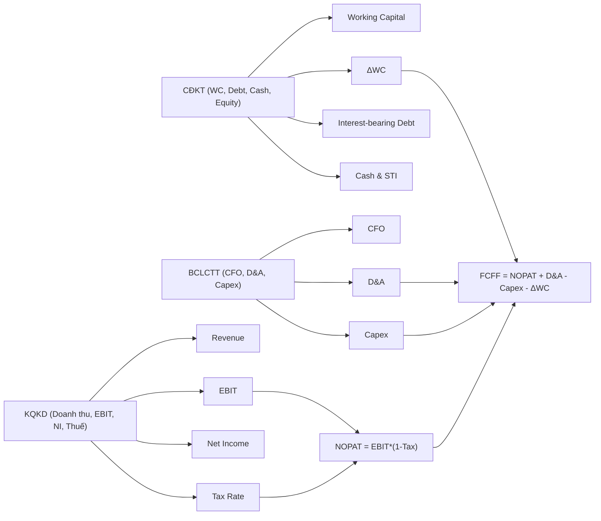
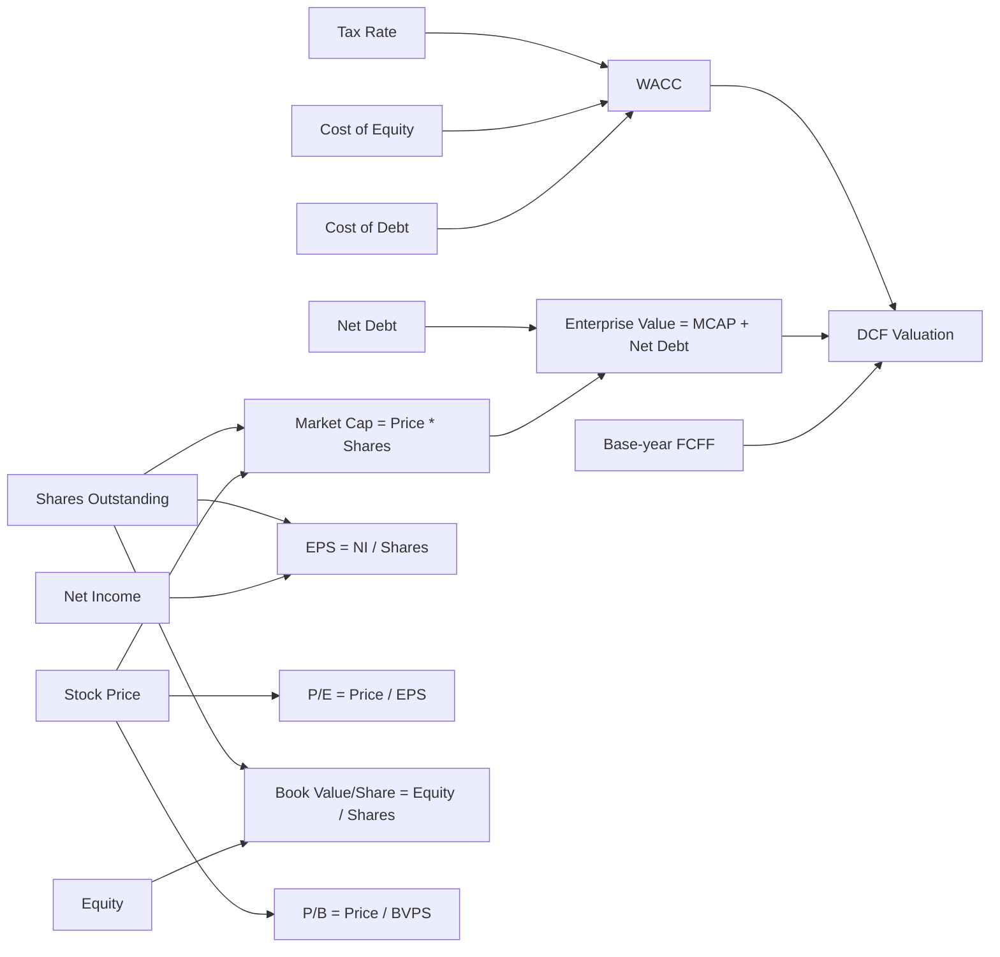
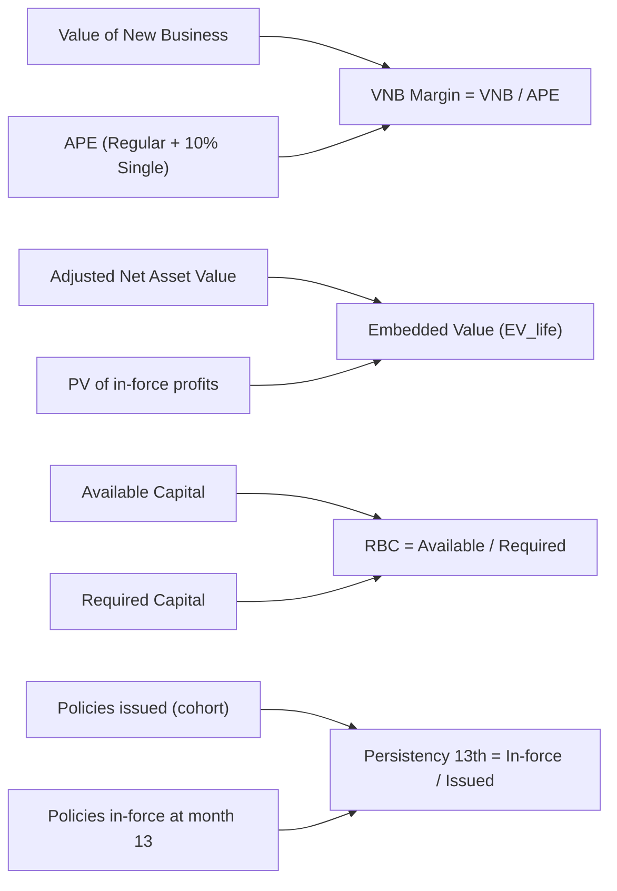

Ok, mình vẽ cho bạn dưới dạng **sơ đồ tầng + cây** nhé.  
Mình sẽ dùng **Mermaid** để bạn có thể copy thẳng vào Notion / Obsidian / VS Code… để xem dưới dạng diagram.

---

## 1. Sơ đồ tổng thể 4 tầng

```mermaid
flowchart TD

%% Layer 0: Inputs
subgraph L0["LAYER 0 - RAW INPUTS"]
    PNL["P&L (KQKD)"]
    BS["Balance Sheet (CĐKT)"]
    CF["Cash Flow (BCLCTT)"]
    MKT["Market Data (Price, Shares...)"]
    LIFE["Life Internal (APE, cashflow, capital...)"]
end

%% Layer 1: Core Accounting
subgraph L1["LAYER 1 - CORE ACCOUNTING"]
    REV["Revenue"]
    GP["Gross Profit"]
    EBIT["EBIT"]
    NI["Net Income"]
    TAX["Effective Tax Rate"]

    TA["Total Assets"]
    EQ["Equity"]
    DEBT["Interest-bearing Debt"]
    CASH["Cash & STI"]
    WC["Working Capital"]
    dWC["ΔWorking Capital"]

    CFO["CFO"]
    DA["D&A"]
    CAPEX["Capex"]
end

%% Layer 2: Derived Metrics
subgraph L2["LAYER 2 - DERIVED METRICS"]
    GM["Gross Margin"]
    EBITDA["EBITDA"]
    NOPAT["NOPAT"]
    gREV["Revenue Growth"]
    gNI["Earnings Growth"]

    ND["Net Debt"]
    FCFF["FCFF (Free Cash Flow to Firm)"]
end

%% Layer 3: Valuation & Cost of Capital
subgraph L3["LAYER 3 - VALUATION & COST OF CAPITAL"]
    MCAP["Market Cap"]
    EV["Enterprise Value"]
    PE["P/E"]
    PB["P/B"]
    EVEBITDA["EV/EBITDA"]
    MULTI5["5Y Mean/Std Multiples"]
    PEER["Peer Multiples & Percentile"]

    CoD["Cost of Debt (CoD)"]
    CoE["Cost of Equity (CoE)"]
    WACC["WACC"]
    FCFF0["Base-year FCFF (t=0)"]
    DCF["DCF Valuation"]
end

%% Layer Life
subgraph LIFE_BLOCK["LIFE INSURANCE BLOCK"]
    EVLIFE["Embedded Value (EV_life)"]
    VNB["Value of New Business (VNB)"]
    VNBM["VNB Margin"]
    RBC["Solvency Ratio (RBC)"]
    PERS13["Persistency 13th month"]
end

%% Connections Layer 0 -> 1
PNL --> REV
PNL --> GP
PNL --> EBIT
PNL --> NI
PNL --> TAX

BS --> TA
BS --> EQ
BS --> DEBT
BS --> CASH
BS --> WC
BS --> dWC

CF --> CFO
CF --> DA
CF --> CAPEX

LIFE --> EVLIFE
LIFE --> VNB
LIFE --> VNBM
LIFE --> RBC
LIFE --> PERS13

%% Layer 1 -> 2
REV --> GM
GP --> GM

REV --> gREV
NI --> gNI

EBIT --> EBITDA
DA --> EBITDA

EBIT --> NOPAT
TAX --> NOPAT

DEBT --> ND
CASH --> ND

NOPAT --> FCFF
DA --> FCFF
dWC --> FCFF
CAPEX --> FCFF

%% Layer 2 -> 3
MKT --> MCAP
MCAP --> EV
ND --> EV

NI --> PE
EQ --> PB
REV --> gREV
EBITDA --> EVEBITDA
MCAP --> PE
MCAP --> PB
EV --> EVEBITDA

PE --> MULTI5
PB --> MULTI5
EVEBITDA --> MULTI5
MULTI5 --> PEER

DEBT --> CoD
PNL --> CoD

MKT --> CoE

CoD --> WACC
CoE --> WACC
TAX --> WACC

FCFF --> FCFF0
FCFF0 --> DCF
WACC --> DCF
EVLIFE --> DCF
```

---

## 2. Cây quan hệ đơn giản hơn (nếu bạn muốn nhìn “flow chính”)

### 2.1. Từ BCTC đến FCFF

### 2.2. Từ FCFF & Thị trường đến định giá

### 2.3. Khối Life Insurance

---

## 3. Bạn dùng sao cho tiện?

- Nếu bạn dùng **Notion / Obsidian / VS Code**:
    
    - Bật hỗ trợ Mermaid → copy block code vào là có sơ đồ.
        
- Nếu bạn làm **slide / báo cáo**:
    
    - Dùng sơ đồ 4 layer làm “overall map”.
        
    - Các cây nhỏ (FCFF, Valuation, Life) làm **sub-chart** ở các slide sau.
        

Nếu bạn cho mình biết bạn đang dùng tool gì (Excel, Power BI, Notion, Miro, Figma…), mình có thể **tinh chỉnh lại sơ đồ** đúng format bạn cần (ví dụ: list node + edge để import sang draw.io/Mermaid live editor).