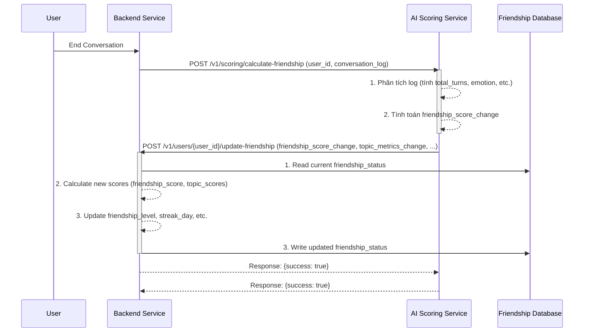
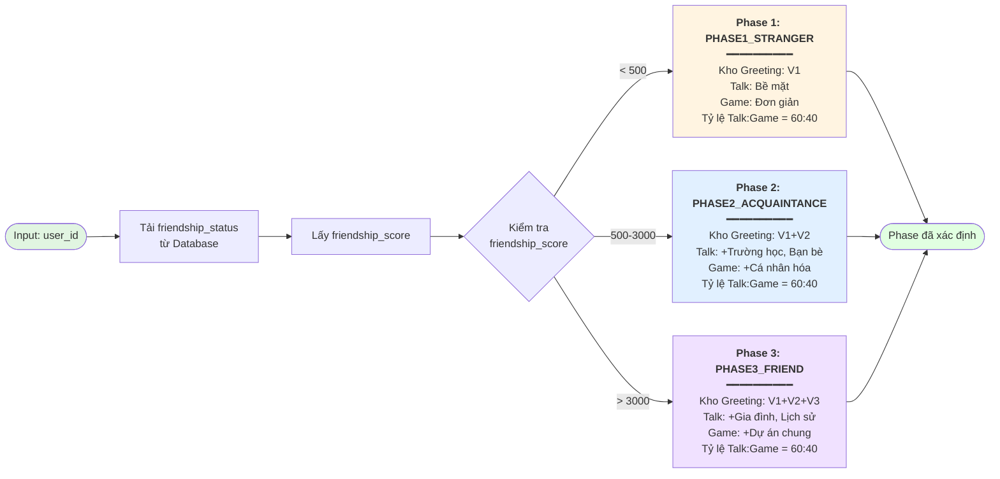
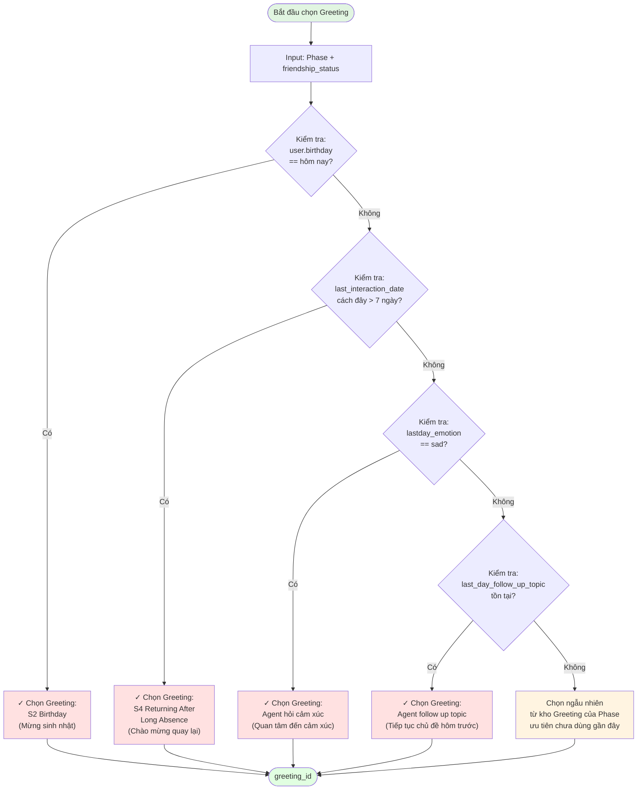
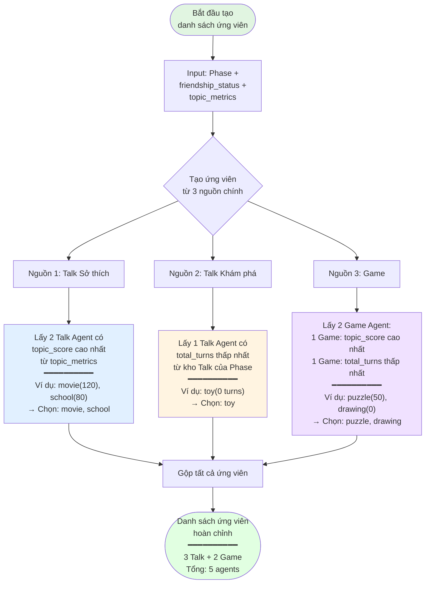
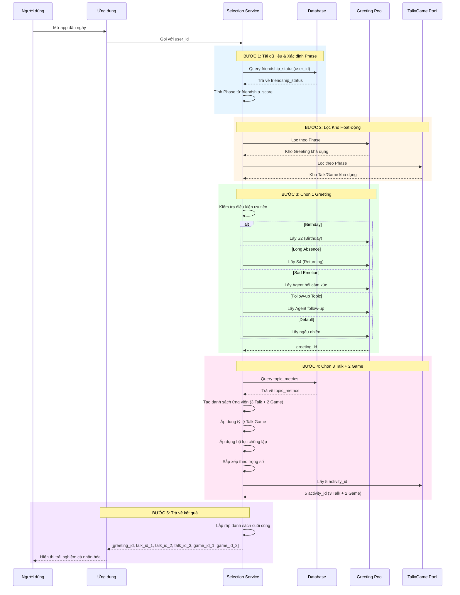
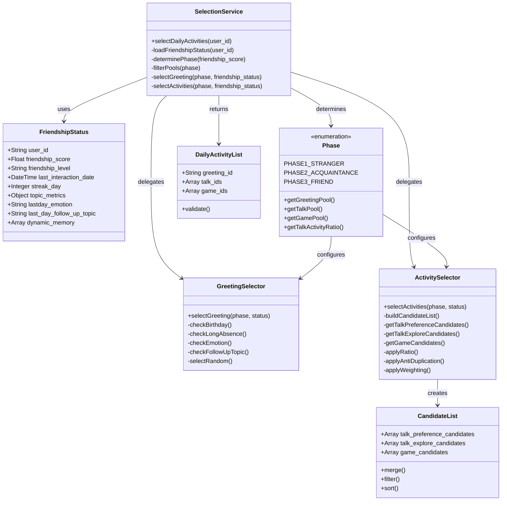
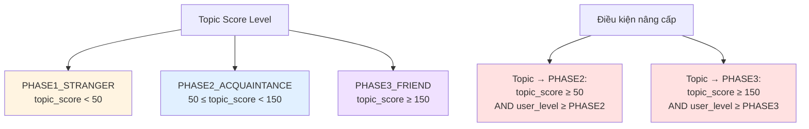

# Tài liệu Triển khai Kỹ thuật: Module Context Handling - Friendlyship Management


## 1. Tổng quan và Bối cảnh (Overview and Context)

Tài liệu này đặc tả chi tiết về mặt kỹ thuật cho việc xây dựng và tích hợp module **Context Handling**, với trọng tâm là quản lý trạng thái tình bạn (Friendship) và lựa chọn Agent (Talk/Game/Greeting) trong hệ sinh thái sản phẩm Pika. Module này là một phần của **Container 3: Context Handling** trong kiến trúc tổng thể, chịu trách nhiệm thu thập, xử lý, và duy trì tất cả dữ liệu liên quan đến người dùng và mối quan hệ của họ với Pika.

### 1.1. Mục tiêu Product

- **Tăng Retention và Engagement:** Tạo ra một mối quan hệ cá nhân hóa, sâu sắc và lâu dài giữa người dùng và Pika, khiến người dùng cảm thấy được thấu hiểu và quay trở lại thường xuyên.
- **Cá nhân hóa Trải nghiệm:** Chuyển đổi từ trải nghiệm "một cho tất cả" sang "một cho mỗi người", nơi các hoạt động, lời chào và chủ đề trò chuyện được điều chỉnh dựa trên lịch sử tương tác và mức độ thân thiết.
- **Tạo ra các khoảnh khắc "Aha!":** Khiến người dùng bất ngờ và thích thú khi Pika "nhớ" lại các chi tiết, sở thích, hoặc các sự kiện trong quá khứ, tạo ra một kết nối cảm xúc thực sự.

### 1.2. Thay đổi so với Thiết kế ban đầu

Dựa trên yêu cầu mới, luồng cập nhật điểm tình bạn (`friendship_score`) sẽ được thay đổi từ mô hình xử lý hàng loạt cuối ngày (batch processing) sang **mô hình xử lý theo thời gian thực (real-time processing)**.

> **Yêu cầu cốt lõi:** *"Sau khi kết thúc 1 cuộc hội thoại phía BE gửi user_id kèm log cho phía AI. Phía AI xử lý log luôn và tính điểm daily_score và code API phía BE để update điểm friendlyship_score."*

Điều này có nghĩa là `friendship_score` sẽ được cập nhật liên tục sau mỗi phiên tương tác, mang lại phản hồi tức thì về mức độ thân thiết và cho phép hệ thống điều phối (Orchestration) có được dữ liệu mới nhất để ra quyết định.

## 2. Thiết kế Kiến trúc Module

Để đáp ứng yêu cầu xử lý real-time, kiến trúc của module sẽ bao gồm ba thành phần chính: **Backend (BE) Service**, **AI Scoring Service**, và **Friendship Database**.



*Sơ đồ 1: Luồng cập nhật Friendship Score theo thời gian thực*

### Luồng hoạt động:

1. **Kết thúc hội thoại:** Người dùng hoàn thành một phiên trò chuyện.
2. **BE gửi yêu cầu:** Backend Service gửi một yêu cầu (POST) đến AI Scoring Service, đính kèm `user_id` và toàn bộ `conversation_log` của phiên vừa kết thúc.
3. **AI tính toán:** AI Scoring Service nhận log, phân tích và tính toán ra một "điểm thay đổi" (`friendship_score_change`) cùng các chỉ số liên quan khác (ví dụ: sự thay đổi của `topic_score`).
4. **AI gọi BE để cập nhật:** AI Service gọi một API do BE cung cấp để gửi "điểm thay đổi" này.
5. **BE cập nhật vào DB:** BE nhận điểm thay đổi, đọc bản ghi `friendship_status` hiện tại từ Database, tính toán các giá trị mới, và ghi đè bản ghi đã cập nhật trở lại vào Database.


## 3. Thiết kế DB

Bảng friendship of user : user_id, friendship_score, friendship_level, last_interaction_date, streak_day, topic_metrics

Bảng friendship map with agent (3 loại: Gretting, Talk, Game/ACtivitity, )

Database Schema (3 Bảng)

### 7.1. Bảng chính 1: `friendship_status`

Lưu trạng thái tình bạn của user.

```sql
  

--- friendship_status

  

CREATE TABLE friendship_status (

    user_id VARCHAR(255) PRIMARY KEY,

    friendship_score FLOAT DEFAULT 0.0 NOT NULL,

    friendship_level VARCHAR(50) DEFAULT 'PHASE1_STRANGER' NOT NULL,

    -- PHASE1_STRANGER (0-99), PHASE2_ACQUAINTANCE (100-499), PHASE3_FRIEND (500+)

    last_interaction_date TIMESTAMP WITH TIME ZONE,
    
    birthday TIMESTAMP() WITH TIME ZONE,

    streak_day INTEGER DEFAULT 0 NOT NULL,
    
    last_emotion VARCHAR(50) NOT NULL,
    
    last_followup_topic VARCHAR(200) NOT NULL,

    topic_metrics JSONB DEFAULT '{}' NOT NULL,

    -- {

    --   "agent_movie": { "score": 52.0, "turns": 65, "last_date": "..." },

    --   "agent_animal": { "score": 28.5, "turns": 32, "last_date": "..." }

    -- }

    created_at TIMESTAMP WITH TIME ZONE DEFAULT CURRENT_TIMESTAMP,

    updated_at TIMESTAMP WITH TIME ZONE DEFAULT CURRENT_TIMESTAMP

);

  

-- Indexes

CREATE INDEX idx_friendship_score ON friendship_status(friendship_score);

CREATE INDEX idx_friendship_level ON friendship_status(friendship_level);

CREATE INDEX idx_updated_at ON friendship_status(updated_at DESC);
```

| Cột                     | Kiểu         | Mô tả                                                 |
| :---------------------- | :----------- | :---------------------------------------------------- |
| `user_id`               | VARCHAR(255) | Primary key, định danh duy nhất của user              |
| `friendship_score`      | FLOAT        | Điểm tình bạn (cập nhật sau mỗi phiên)                |
| `friendship_level`      | VARCHAR(50)  | PHASE1_STRANGER / PHASE2_ACQUAINTANCE / PHASE3_FRIEND |
| `last_interaction_date` | TIMESTAMP    | Lần tương tác cuối cùng                               |
| `streak_day`            | INTEGER      | Số ngày tương tác liên tiếp                           |
| `topic_metrics`         | JSONB        | Điểm và lịch sử tương tác cho mỗi topic               |
| `created_at`            | TIMESTAMP    | Thời điểm tạo record                                  |
| `updated_at`            | TIMESTAMP    | Thời điểm cập nhật cuối cùng                          |

**Ví dụ dữ liệu:**

```json
{
  "user_id": "user_123",
  "friendship_score": 785.5,
  "friendship_level": "PHASE2_ACQUAINTANCE",
  "last_interaction_date": "2025-11-25T18:30:00Z",
  "streak_day": 6,
  "topic_metrics": {
    "agent_movie": {
      "score": 52.0,
      "turns": 65,
      "friendship_level": "ACQUAINTANCE",
      "last_date": "2025-11-25T18:25:00Z"
    },
    "agent_animal": {
      "score": 28.5,
      "turns": 32,
      "friendship_level": "ACQUAINTANCE",
      "last_date": "2025-11-24T14:10:00Z"
    }
  }
}
```

Dùng để: 

```
1️⃣ Mapping Level (User và Topic đều dùng chung phase)

USER LEVEL (friendship_level)

PHASE1_STRANGER: 0 – 499

PHASE2_ACQUAINTANCE: 500 – 2999

PHASE3_FRIEND: 3000+

TOPIC SCORE LEVEL

PHASE1_STRANGER: topic_score < 50

PHASE2_ACQUAINTANCE: 50 ≤ topic_score < 150

PHASE3_FRIEND: topic_score ≥ 150

2️⃣ Điều kiện lên level topic (chuẩn nhất):

✔ Topic lên PHASE2 nếu:

topic_score >= 50 AND user_level >= PHASE2

✔ Topic lên PHASE3 nếu:

topic_score >= 150 AND user_level >= PHASE3
```


### 7.2. Bảng chính 2 : `agenda_agent_prompting`

Mapping giữa `friendship_level` và các Agent theo loại.

```sql
  
CREATE TABLE agenda_agent_prompting (
    id SERIAL PRIMARY KEY,

    topic_id VARCHAR(100) NOT NULL,
    -- Ví dụ: 'toy', 'school', 'special_day'

    agent_id VARCHAR(255) NOT NULL,
    -- Nên map với agent_prompting.agent_id (nếu đã có bảng đó)

    friendship_level VARCHAR(50) NOT NULL
        CHECK (friendship_level IN ('STRANGER', 'ACQUAINTANCE', 'FRIEND')),
    -- Phase quan hệ: STRANGER, ACQUAINTANCE, FRIEND

    talking_agenda TEXT,
    -- Nội dung agenda / note cho cách nói chuyện, có thể để NULL

    agent_type VARCHAR(50) NOT NULL
        CHECK (agent_type IN ('TALK', 'GAME', 'GREETING')),
    -- Loại agent: TALK / GAME / GREETING

    created_at TIMESTAMPTZ DEFAULT CURRENT_TIMESTAMP,
    updated_at TIMESTAMPTZ DEFAULT CURRENT_TIMESTAMP
);

-- Indexes hỗ trợ query
CREATE INDEX idx_agenda_topic
ON agenda_agent_prompting(topic_id);

CREATE INDEX idx_agenda_phase_type
ON agenda_agent_prompting(friendship_level, agent_type);

CREATE INDEX idx_agenda_agent_id
ON agenda_agent_prompting(agent_id);


INSERT INTO agenda_agent_prompting (topic_id, agent_id, talking_agenda, friendship_level, agent_type)
VALUES
('toy', 'agent_toy_1', NULL, 'STRANGER', 'TALK'),
('toy', 'agent_toy_2', NULL, 'ACQUAINTANCE', 'TALK'),
('toy', 'agent_toy_3', NULL, 'FRIEND', 'TALK'),
('school', 'agent_school_1', NULL, 'ACQUAINTANCE', 'GAME'),
('special_day', 'greeting_special_day_1', NULL, 'ACQUAINTANCE', 'GREETING');
```
  


### 7.4 Bảng phụ 2: conversation_events - để hứng conversation from BE send to

```sql

CREATE TABLE conversation_events (

-- Primary Key

id SERIAL PRIMARY KEY,

-- Identifiers

conversation_id VARCHAR(255) NOT NULL UNIQUE,

user_id VARCHAR(255) NOT NULL,

-- Bot Information

bot_type VARCHAR(50) NOT NULL

bot_id VARCHAR(255) NOT NULL,

bot_name VARCHAR(255) NOT NULL,

-- Conversation Timing

start_time TIMESTAMP NOT NULL,

end_time TIMESTAMP NOT NULL,

duration_seconds INTEGER GENERATED ALWAYS AS (

EXTRACT(EPOCH FROM (end_time - start_time))::INTEGER

) STORED,

-- Processing results

friendship_score_change FLOAT,

new_friendship_level VARCHAR(50),

-- Add comment to document the structure
ADD COLUMN score_calculation_details JSONB NULL;

COMMENT ON COLUMN conversation_events.score_calculation_details IS

'JSONB storing detailed breakdown of friendship score cal.';

-- Conversation Data

conversation_log JSONB NOT NULL DEFAULT '[]',
raw_conversation_log JSONB NOT NULL DEFAULT '[]',

-- Status tracking

status VARCHAR(50) NOT NULL DEFAULT 'PENDING'

CHECK (status IN ('PENDING', 'PROCESSING', 'PROCESSED', 'FAILED', 'SKIPPED')),

attempt_count INTEGER NOT NULL DEFAULT 0,

-- Timing for processing

created_at TIMESTAMP NOT NULL DEFAULT CURRENT_TIMESTAMP,

next_attempt_at TIMESTAMP NOT NULL DEFAULT CURRENT_TIMESTAMP + INTERVAL '6 hours',

processed_at TIMESTAMP,

-- Error tracking (only when FAILED)

error_code VARCHAR(50),

error_details TEXT,


-- Timestamps

updated_at TIMESTAMP NOT NULL DEFAULT CURRENT_TIMESTAMP

);

  

-- Indexes for efficient querying

CREATE INDEX idx_conversation_events_status ON conversation_events(status);

CREATE INDEX idx_conversation_events_next_attempt ON conversation_events(next_attempt_at);

CREATE INDEX idx_conversation_events_user_id ON conversation_events(user_id);

CREATE INDEX idx_conversation_events_created_at ON conversation_events(created_at);

CREATE INDEX idx_conversation_events_bot_type ON conversation_events(bot_type);

CREATE INDEX idx_conversation_events_bot_id ON conversation_events(bot_id);

  

-- Composite index for common queries

CREATE INDEX idx_conversation_events_status_next_attempt

ON conversation_events(status, next_attempt_at);

  

-- GIN index for JSONB queries

CREATE INDEX idx_conversation_events_log_gin

ON conversation_events USING GIN (conversation_log);

  

```

##### Columns Chi Tiết

| Column                      | Type         | Mô Tả                                             | Ghi Chú                 |
| :-------------------------- | :----------- | :-------------------------------------------------- | :----------------------- |
| `id`                      | SERIAL       | Primary key                                         | Auto-increment           |
| `conversation_id`         | VARCHAR(255) | ID conversation                                     | UNIQUE, required         |
| `user_id`                 | VARCHAR(255) | ID user                                             | Required, indexed        |
| `bot_type`                | VARCHAR(50)  | GREETING / TALK / GAME_ACTIVITY                     | Required, checked        |
| `bot_id`                  | VARCHAR(255) | ID của bot                                         | Required                 |
| `bot_name`                | VARCHAR(255) | Tên của bot                                       | Required                 |
| `start_time`              | TIMESTAMP    | Thời điểm bắt đầu                             | Required                 |
| `end_time`                | TIMESTAMP    | Thời điểm kết thúc                             | Required                 |
| `duration_seconds`        | INTEGER      | Thời lượng (giây)                               | Generated, calculated    |
| `conversation_log`        | JSONB        | Toàn bộ log conversation                          | Required, default: []    |
| `status`                  | VARCHAR(50)  | PENDING / PROCESSING / PROCESSED / FAILED / SKIPPED | Default: PENDING         |
| `attempt_count`           | INTEGER      | Số lần đã xử lý                               | Default: 0, max: 5       |
| `created_at`              | TIMESTAMP    | Khi được lưu                                    | Auto                     |
| `next_attempt_at`         | TIMESTAMP    | Thời điểm xử lý tiếp theo                     | Default: created_at + 6h |
| `processed_at`            | TIMESTAMP    | Khi xử lý thành công                            | Null nếu chưa          |
| `error_code`              | VARCHAR(50)  | Code lỗi                                           | Null nếu thành công   |
| `error_details`           | TEXT         | Chi tiết lỗi                                      | Null nếu thành công   |
| `friendship_score_change` | FLOAT        | Điểm thay đổi                                   | Null nếu chưa xử lý  |
| `new_friendship_level`    | VARCHAR(50)  | Level mới                                          | Null nếu chưa xử lý  |
| `updated_at`              | TIMESTAMP    | Cập nhật lần cuối                               | Auto                     |

```
### Ví dụ 1: PENDING Status

```json
{
  "id": 1,
  "conversation_id": "conv_abc123xyz",
  "user_id": "user_123",
  "bot_type": "TALK",
  "bot_id": "talk_movie_preference",
  "bot_name": "Movie Preference",
  "start_time": "2025-11-25T18:00:00Z",
  "end_time": "2025-11-25T18:20:00Z",
  "duration_seconds": 1200,
  "conversation_log": [
    {
      "turn_id": 1,
      "speaker": "bot",
      "text": "What's your favorite movie genre?",
      "timestamp": "2025-11-25T18:00:05Z"
    },
    {
      "turn_id": 2,
      "speaker": "user",
      "text": "I love anime, especially Studio Ghibli",
      "timestamp": "2025-11-25T18:00:15Z"
    },
    {
      "turn_id": 3,
      "speaker": "bot",
      "text": "Oh, Studio Ghibli is amazing! Have you seen Spirited Away?",
      "timestamp": "2025-11-25T18:00:25Z"
    }
  ],
  "status": "PENDING",
  "attempt_count": 0,
  "created_at": "2025-11-25T18:30:00Z",
  "next_attempt_at": "2025-11-26T00:30:00Z",
  "processed_at": null,
  "error_code": null,
  "error_details": null,
  "friendship_score_change": null,
  "new_friendship_level": null,
  "updated_at": "2025-11-25T18:30:00Z"
}
```


Logic mới sẽ là: 
1. Dựa vào level của bảng: `friendship_status` + Check xem ngày hôm đó có gì đặc biệt không: => Vào bảng `agenda_agent_prompting` để lấy GREETING tương ứng. 
   
2. Sau đó vẫn giữ logic cũ : dựa vào check điểm trong bảng `friendship_status` => để tính toán các bài TALK, GAME như logic cũ 


## 4. Thiết kế API Endpoints

Sẽ có 2 API chính được định nghĩa để phục vụ cho module này.

### 4.1. API 1: Tính toán Friendship Score (BE -> AI)

> **a. Thu thập các chỉ số từ `daily_metrics`:**
>
> * `total_turns`: Tổng số lượt trò chuyện trong ngày.
> * `user_initiated_questions`: Số lần người dùng chủ động hỏi Pika.
> * `followup_topics_count`: Tên chủ đề mới do người dùng gợi ý.
> * `session_emotion`: Cảm xúc chủ đạo trong ngày ('interesting', 'boring', 'neutral', 'angry', 'happy','sad').
> * `new_memories_count`: Số ký ức mới được tạo.
> * `topic_details`: Chi tiết tương tác cho từng topic (số turn, số câu hỏi).

> Logic Mapping Friendship vs Kho

API này cho phép BE yêu cầu AI phân tích một cuộc hội thoại và trả về các điểm số cần cập nhật.

- **Endpoint:** `POST /v1/scoring/calculate-friendship`
- **Service:** AI Scoring Service
- **Mô tả:** Nhận log hội thoại, tính toán và trả về các thay đổi về điểm tình bạn và các chỉ số liên quan.
- **Request Body:**

  ```json
  {
    "user_id": "user_123",
    "conversation_log": [
      {"speaker": "user", "turn_id": 1, "text": "Hello Pika!"},
      {"speaker": "pika", "turn_id": 2, "text": "Hi there! How are you?"},
      // ... thêm các turn khác
    ],
    "session_metadata": {
        "emotion": "interesting", // Do AI tự phân tích hoặc BE gửi sang
        "new_memories_created": 2
    }
  }
  ```
- **Response Body (Success 200):**

  ```json
  {
    "friendship_score_change": 35.0,
    "topic_metrics_update": {
        "agent_movie": {
            "score_change": 7.0,
            "turns_increment": 15
        }
    },
    "new_memories": [
        {
          "content": "Thích xem phim của đạo diễn Hayao Miyazaki.",
          "related_topic": "agent_movie"
        }
    ]
  }
  ```

### 4.2. API 2: Cập nhật Friendship Status (AI -> BE)

API này cho phép AI gửi các điểm số đã tính toán để BE cập nhật vào cơ sở dữ liệu.

- **Endpoint:** `POST /v1/users/update-friendship`
- **Service:** Backend Service
- **Mô tả:** Nhận các thay đổi về điểm số và chỉ số từ AI, sau đó cập nhật vào bản ghi `friendship_status` của người dùng trong DB.
- **Path Parameter:** `user_id` (String, required)
- **Request Body:** (Giống hệt Response Body của API 1)
- **Response Body (Success 200):**

  ```json
  {
    "success": true,
    "message": "Friendship status updated successfully."
  }
  ```

### 4.3. API 3: Lấy danh sách Agent đề xuất (BE -> AI/Orchestration)

API này phục vụ cho việc lấy danh sách các hoạt động (Greeting, Talk, Game) được cá nhân hóa cho người dùng khi bắt đầu một phiên mới.

- **Endpoint:** `GET /v1/users/suggested-activities`
- **Service:** AI Orchestration Service (hoặc một service riêng cho việc lựa chọn)
- **Mô tả:** Dựa trên `friendship_status` của người dùng, chọn ra một danh sách các hoạt động phù hợp.
- **Query Parameters:**

  - truyền vào user_id
  - `type`: (String, optional) Loại agent cần lấy, ví dụ: `greeting`, `talk`, `game`. Nếu không có, trả về cả gói.
  - `count`: (Integer, optional) Số lượng cần lấy.
- **Response Body (Success 200):**

  ```json
  {
    "greeting_agent": {
        "agent_id": "greeting_streak_milestone_5_days",
        "type": "greeting"
    },
    "suggested_agents": [
        {"agent_id": "talk_agent_movie_preference", "type": "talk"},
        {"agent_id": "game_agent_drawing_challenge", "type": "game"},
        {"agent_id": "talk_agent_school_life", "type": "talk"},
        {"agent_id": "talk_agent_follow_up_pet_milu", "type": "talk"}
    ]
  }
  ```


## 10. API Implement

| API                                                            | Ai gọi | Khi nào                     | Mục đích chính                                       |
| -------------------------------------------------------------- | ------ | --------------------------- | ---------------------------------------------------- |
| `GET /v1/health`                                               | BE     | Khởi động, monitoring       | Kiểm tra service sống                                |
| `POST /v1/conversations/end`                                   | BE     | Kết thúc mỗi cuộc hội thoại | Gửi log để AI chấm điểm & cập nhật friendship        |
| `POST /v1/activities/suggest`                                  | BE     | Bắt đầu phiên mới           | Lấy danh sách agent (Greeting/Talk/Game) cá nhân hoá |
| `GET /v1/conversations/{id}`                                   | Dev/QA | Debug                       | Xem log hội thoại                                    |
| `POST /v1/friendship_status/calculate-score/{conversation_id}` | Dev/QA | Debug                       | Tính thử score 1 cuộc hội thoại                      |
| `POST /v1/friendship_status/calculate-score-and-update`        | Dev/QA | Debug/manual                | Tính & update friendship cho 1 user + conversation   |

### 1. Health check

```
curl -X 'GET' \
  'http://localhost:30020/v1/health' \
  -H 'accept: application/json'
```


### 2. From conversation_id -> calculate score -> update friendship_status:

```
###### 2.1 Test GET conversation
curl -X GET "http://localhost:8000/v1/conversations/conv_id_2003doanngoccuong" \
  -H "Content-Type: application/json"

###### 2.2 Test POST calculate score
curl -X POST "http://localhost:8000/v1/friendship_status/calculate-score/conv_id_2003doanngoccuong" \
  -H "Content-Type: application/json"

###### 2.3 Test POST update friendship_status
curl -X POST "http://localhost:8000/v1/friendship_status/calculate-score-and-update" \
  -H "Content-Type: application/json" \
  -d '{
    "user_id": "user_doanngoccuong",
    "conversation_id": "conv_id_2003doanngoccuong"
  }'
```

### 3. From user_id -> get suggested activities:

```
curl -X POST "http://localhost:8000/v1/activities/suggest" \
  -H "Content-Type: application/json" \
  -d '{
    "user_id": "user_doanngoccuong"
  }'
```

```
{
  "success": true,
  "data": {
    "user_id": "user_doanngoccuong",
    "friendship_level": "PHASE1_STRANGER",
    "greeting_agent": {
      "agent_id": "general_greeting",
      "agent_name": "General Greeting",
      "agent_type": "GREETING",
      "agent_description": "{{CURRENT_EVENT}}",
      "final_prompt": "",
      "reason": "Phase default greeting",
      "metadata": {
        "topic_id": "general_greeting"
      }
    },
    "talk_agents": [
      {
        "agent_id": "agent_daily_routine",
        "agent_name": "Agent Daily Routine",
        "agent_type": "TALK",
        "agent_description": "\"4. OPENING GUIDE (DAILY ROUTINE)",
        "final_prompt": "",
        "reason": "Phase fallback",
        "metadata": {
          "topic_id": "Daily_Routine "
        }
      },
      {
        "agent_id": "agent_game",
        "agent_name": "Agent Game",
        "agent_type": "TALK",
        "agent_description": "4. OPENING GUIDE (HOBBY)",
        "final_prompt": "",
        "reason": "Phase fallback",
        "metadata": {
          "topic_id": "Game"
        }
      },
      {
        "agent_id": "agent_hobby_general ",
        "agent_name": "Agent Hobby General ",
        "agent_type": "TALK",
        "agent_description": "4. OPENING GUIDE (HOBBY)",
        "final_prompt": "",
        "reason": "Phase fallback",
        "metadata": {
          "topic_id": "Hobby General"
        }
      }
    ],
    "game_agents": [
      {
        "agent_id": "agent_story_telling",
        "agent_name": "Agent Story Telling",
        "agent_type": "GAME",
        "agent_description": "4. LỘ TRÌNH TRÒ CHUYỆN HÔM NAY (TODAY'S TALKING AGENDA): GAME \"CÙNG NHAU SÁNG TẠO CÂU CHUYỆN\"",
        "final_prompt": "",
        "reason": "Phase activity",
        "metadata": {
          "topic_id": "story"
        }
      },
      {
        "agent_id": "agent_play_game",
        "agent_name": "Agent Play Game",
        "agent_type": "GAME",
        "agent_description": "4. TODAY'S TALKING AGENDA): GAME \"ĐỐ BIẾT TỪ GÌ\"",
        "final_prompt": "",
        "reason": "Phase activity",
        "metadata": {
          "topic_id": "trò đố từ"
        }
      }
    ]
  },
  "message": "Activities suggested successfully"
}
```
### 4. Trigger conversation_events:

```bash
curl --location 'http://localhost:30080/v1/conversations/end' \
--header 'accept: application/json' \
--header 'Content-Type: application/json' \
--data '{
  "conversation_id": "convc_1cxxcc23__",
  "user_id": "user_doanngoccuong",      
  "bot_id": "agent_pet",
  "bot_name": "Movie Preference Talk",
  "bot_type": "dd",
  "conversation_logs": [
    {
      "character": "BOT_RESPONSE_CONVERSATION",
      "content": ""
    },
    {
      "character": "BOT_RESPONSE_CONVERSATION",
      "content": "BEEP BEEP! Đã đến Trái Đất!"
    },
    {
      "character": "BOT_RESPONSE_CONVERSATION",
      "content": ""
    },
    {
      "character": "BOT_RESPONSE_CONVERSATION",
      "content": "Quả là một hành trình thú vị từ sao Hỏa."
    }
  ],
  "end_time": "2025-11-26T10:20:00Z",
  "start_time": "2025-11-26T10:00:00Z",
  "status": "PENDING"
}'
```

```bash
{

    "success": true,

    "message": "Conversation event accepted for processing",

    "data": {

        "id": 117,

        "conversation_id": "convc_1cxxcc23__",

        "user_id": "user_doanngoccuong",

        "bot_type": "dd",

        "bot_id": "agent_pet",

        "bot_name": "Movie Preference Talk",

        "start_time": "2025-11-26T10:00:00",

        "end_time": "2025-11-26T10:20:00",

        "duration_seconds": 1200,

        "conversation_log": [

            {

                "text": "BEEP BEEP! Đã đến Trái Đất!",

                "speaker": "pika",

                "turn_id": 1,

                "timestamp": "2025-11-26T10:05:00+00:00Z"

            },

            {

                "text": "Quả là một hành trình thú vị từ sao Hỏa.",

                "speaker": "pika",

                "turn_id": 2,

                "timestamp": "2025-11-26T10:15:00+00:00Z"

            }

        ],

        "raw_conversation_log": [

            {

                "content": "",

                "character": "BOT_RESPONSE_CONVERSATION"

            },

            {

                "content": "BEEP BEEP! Đã đến Trái Đất!",

                "character": "BOT_RESPONSE_CONVERSATION"

            },

            {

                "content": "",

                "character": "BOT_RESPONSE_CONVERSATION"

            },

            {

                "content": "Quả là một hành trình thú vị từ sao Hỏa.",

                "character": "BOT_RESPONSE_CONVERSATION"

            }

        ],

        "status": "PROCESSED",

        "attempt_count": 1,

        "created_at": "2025-11-27T17:22:15.224609",

        "next_attempt_at": "2025-11-27T17:22:17.488880",

        "processed_at": "2025-11-27T17:22:17.488880",

        "error_code": null,

        "error_details": null,

        "friendship_score_change": 0.5,

        "new_friendship_level": "PHASE1_STRANGER",

        "updated_at": "2025-11-27T17:22:17.488880"

    }

}
```
## 5. Logic Xử lý Scoring và Selection

### 5.1. Logic tính điểm (Scoring Logic - Real-time)

Logic này được thực thi trong **AI Scoring Service** sau mỗi cuộc hội thoại, dựa trên `Tài liệu 2` nhưng được điều chỉnh cho phù hợp.

1. **Thu thập chỉ số từ `conversation_log`:**

   * `total_turns`: Tổng số lượt trò chuyện trong phiên. = Logic đếm tổng số turn của user và pika / 2 => `base_score = total_turns * 0.5`
   * Dùng 2 llms + 1 API extract memory có sẵn => chạy 3 cái song song để tính : 
	   * `user_initiated_questions`: Số lần người dùng chủ động hỏi Pika. =>  `engagement_bonus = (user_initiated_questions * 3)`  => * `emotion_bonus`: +15 cho 'interesting', -15 cho 'boring'.
	   * `session_emotion`: Cảm xúc chủ đạo của phiên (ví dụ: 'interesting', 'boring').
	   * `new_memories_count`: Số ký ức mới được tạo trong phiên. =>    * `memory_bonus = new_memories_count * 5`  
   Sử dụng API extract từ phía Memory Mem0 
   	     

=>   * **`friendship_score_change`** = `base_score + engagement_bonus + emotion_bonus + memory_bonus`

   * `topic_details`: Chi tiết tương tác cho từng topic (số turn, số câu hỏi). 
=> check xem agent_id đang sử dụng thuộc topic nào => sử dụng chỉ số total_turns và score vừa tính được để cộng cho topic_total_turns và topic_score của topic đó. 

```
friendship_score_change = 
    base_score 
    + (total_turns * 0.5)
    + (user_initiated_questions * 3)
    + emotion_bonus  // +15 for 'interesting', -15 for 'boring'
    + (new_memories_count * 5)
```

```
Conversation logs:
- 4 BOT_RESPONSE (pika)
- 3 USER_RESPONSE (user)
- Total content length: 250 characters
- Bot type: TALK
- Emotion: interesting

Tính toán:
- Base score: 15
- Turn bonus (4 × 0.5): 2
- User questions bonus (3 × 3): 9
- Emotion bonus: 15
- Length bonus (250 / 100): 2.5
- Total: 15 + 2 + 9 + 15 + 2.5 = 43.5 điểm
```

API extract memory 
```
curl --location 'http://103.253.20.30:6699/extract_facts' \
--header 'accept: application/json' \
--header 'Content-Type: application/json' \
--data '{
  "user_id": "user_test_1",
  "conversation_id": "1",
  "conversation": [
  {
    "role": "assistant",
    "content": "Chàooo cậu! Pika nhớ cậu lắm đó! Cậu giới thiệu về bản thân đi"
  },
  {
    "role": "user",
    "content": "Tên tôi là Đào Minh Đức và hiện tôi đang học lớp 4. Tôi rất thích chơi bóng đá, thường chơi trong một đội có nhiều bạn bè, và tôi cũng cực kỳ thích những chuyến đi dài. Về phim ảnh, hãy nhớ rằng tôi là fan của Kung Fu Panda và đặc biệt thích nhân vật Po.Về các trải nghiệm và hoạt động, tôi đã từng đi du lịch Nha Trang, từng chơi một trò chơi khó đến nỗi suýt nản, và có một trải nghiệm là không thể nhìn thấy cá. Hiện tại, tôi đang tham gia một hoạt động học tập và đang lên kế hoạch tổ chức một buổi tiệc nướng BBQ với gia đình. Ngoài ra, hãy lưu ý các kiến thức mà tôi quan tâm: tôi biết rằng thiên hà Andromeda đang lao vào dải Ngân Hà và thiên hà lớn nhất là IC 1101. Hãy lưu lại tất cả những điều này vào bộ nhớ giúp tôi."
  }
]}'
```

```
{

    "status": "ok",

    "count": 3,

    "facts": [

        {

            "id": "f7acc070-9069-4dae-8277-976ce323d461",

            "user_id": "user_test_1",

            "source": "conversation",

            "fact_type": null,

            "fact_value": "Đào Minh Đức loves playing football",

            "metadata": {},

            "operation": "ADD",

            "score": 0.0

        },

        {

            "id": "f680f7ed-0542-40ae-841f-2837dd2b882d",

            "user_id": "user_test_1",

            "source": "conversation",

            "fact_type": null,

            "fact_value": "Đào Minh Đức is a fan of Kung Fu Panda and especially likes the character Po.",

            "metadata": {},

            "operation": "ADD",

            "score": 0.0

        },

        {

            "id": "32690682-049d-4e67-bf48-fb4d02effe84",

            "user_id": "user_test_1",

            "source": "conversation",

            "fact_type": null,

            "fact_value": "Đào Minh Đức knows that the Andromeda galaxy is moving towards the Milky Way and that the largest galaxy is IC 1101.",

            "metadata": {},

            "operation": "ADD",

            "score": 0.0

        }

    ]

}
```

##### 5.1.4: Sau khi tính điểm => Xác Định Topic Của Bot

**Logic:**

```python
def get_topic_from_bot_id(bot_id):
    """
    Query bảng agenda_agent_prompting
    để tìm topic_id của bot_id
    """
    
    # Query
    agent = db.query(AgendaAgentPrompting).filter(
        AgendaAgentPrompting.agent_id == bot_id
    ).first()
    
    if agent:
        return agent.topic_id
    else:
        return None
```

**Ví dụ:**
```
bot_id: "talk_movie_preference"

Query bảng agenda_agent_prompting:
├─ agent_id: "talk_movie_preference"
├─ topic_id: "movie"
├─ talking_agenda: "..."
└─ friendship_phase: "PHASE1_STRANGER"

Kết quả: topic_id = "movie"
```

---

##### 5.1.5: => Sau đó Cập Nhật Topic Metrics - Bảng friendship_status

**Bảng: friendship_status**

```sql
CREATE TABLE friendship_status (
    user_id VARCHAR(255) PRIMARY KEY,
    friendship_score FLOAT DEFAULT 0.0 NOT NULL,
    friendship_level VARCHAR(50) DEFAULT 'PHASE1_STRANGER' NOT NULL
        CHECK (friendship_level IN ('PHASE1_STRANGER', 'PHASE2_ACQUAINTANCE', 'PHASE3_FRIEND')),
    
    last_interaction_date TIMESTAMP WITH TIME ZONE,
    streak_day INTEGER DEFAULT 0 NOT NULL,
    
    -- JSONB: topic_metrics
    topic_metrics JSONB DEFAULT '{}' NOT NULL,
    
    created_at TIMESTAMP WITH TIME ZONE DEFAULT CURRENT_TIMESTAMP,
    updated_at TIMESTAMP WITH TIME ZONE DEFAULT CURRENT_TIMESTAMP
);

-- Indexes
CREATE INDEX idx_friendship_score ON friendship_status(friendship_score);
CREATE INDEX idx_friendship_level ON friendship_status(friendship_level);
CREATE INDEX idx_updated_at ON friendship_status(updated_at DESC);
```

**Logic cập nhật:**

```python
def update_topic_metrics(user_id, topic_id, score_change, bot_id):
    """
    Cập nhật topic_metrics trong bảng friendship_status
    """
    
    # Lấy friendship_status hiện tại
    friendship = db.query(FriendshipStatus).filter(
        FriendshipStatus.user_id == user_id
    ).first()
    
    # Lấy topic_metric JSONB
    topic_metrics = friendship.topic_metric or {}
    
    # Nếu topic chưa tồn tại, tạo mới
    if topic_id not in topic_metrics:
        topic_metrics[topic_id] = {
            "score": 0,
            "turns": 0,
            "friendship_level": "PHASE1_STRANGER",
            "last_date": None,
            "agents_used": []
        }
    
    # Cập nhật score và turns
    topic_metrics[topic_id]["score"] += score_change
    topic_metrics[topic_id]["turns"] += 1
    topic_metrics[topic_id]["last_date"] = datetime.utcnow().isoformat()
    topic_metrics[topic_id]["agents_used"].append(bot_id)
    
    # Cập nhật friendship_score chung
    friendship.friendship_score += score_change
    friendship.topic_metric = topic_metrics
    friendship.updated_at = datetime.utcnow()
    friendship.last_interaction_date = datetime.utcnow()
    
    db.commit()
    
    return topic_metrics[topic_id]
```

**Ví dụ:**

**Trước cập nhật:**
```json
{
  "user_id": "user_1234",
  "friendship_score": 20.0,
  "friendship_level": "PHASE1_STRANGER",
  "topic_metrics": {
    "movie": {
      "score": 120.0,
      "turns": 150,
      "friendship_level": "PHASE2_ACQUAINTANCE",
      "last_date": "2025-11-25T18:00:00Z",
      "agents_used": ["talk_movie_preference"]
    }
  }
}
```

**Cập nhật:**
- `bot_id`: "talk_movie_preference"
- `topic_id`: "movie"
- `score_change`: 43.5
- `turns_change`: 1

**Sau cập nhật:**
```json
{
  "user_id": "user_1234",
  "friendship_score": 63.5,  // 20.0 + 43.5
  "friendship_level": "PHASE1_STRANGER",  // Chưa thay đổi
  "topic_metrics": {
    "movie": {
      "score": 163.5,  // 120.0 + 43.5
      "turns": 151,  // 150 + 1
      "friendship_level": "PHASE2_ACQUAINTANCE",  // Chưa thay đổi
      "last_date": "2025-11-26T10:20:00Z",  // Cập nhật
      "agents_used": ["talk_movie_preference", "talk_movie_preference"]
    }
  }
}
```

###### 5.1.6 Logic nâng cấp Level 

```
1️⃣ Mapping Level (User và Topic đều dùng chung phase)

USER LEVEL (friendship_level)

PHASE1_STRANGER: score: 0 – 499

PHASE2_ACQUAINTANCE: score: 500 – 2999

PHASE3_FRIEND: score: 3000+

TOPIC SCORE LEVEL

PHASE1_STRANGER: topic_score < 50

PHASE2_ACQUAINTANCE: 50 ≤ topic_score < 150

PHASE3_FRIEND: topic_score ≥ 150

2️⃣ Điều kiện lên level topic (chuẩn nhất):

✔ Topic lên PHASE2 nếu:

topic_score >= 50 AND user_level >= PHASE2

✔ Topic lên PHASE3 nếu:

topic_score >= 150 AND user_level >= PHASE3
```


| Tiêu chí                                 | User Friendship Level        | Topic Level                                         |
| ------------------------------------------ | ---------------------------- | --------------------------------------------------- |
| Dựa trên                                 | `friendship_score` (tổng) | `topic_score` + `user_friendship_level`         |
| Threshold PHASE2                           | `score >= 500`             | `topic_score >= 50` và `user_level >= PHASE2`  |
| Threshold PHASE3                           | `score >= 3000`            | `topic_score >= 150` và `user_level >= PHASE3` |
| Số điều kiện                           | 1 (chỉ score)               | 2 (score + user level)                              |
| Có thể lên PHASE2 khi user còn PHASE1? | Có (nếu score >= 500)      | Không (cần user >= PHASE2)                        |
| Có thể lên PHASE3 khi user còn PHASE2? | Có (nếu score >= 3000)     | Không (cần user >= PHASE3)                        |


---


##### 5.1.6 => Và cập nhật cả - Bảng friendship_status ở last_emotion, last_....


### 5.2. Logic lựa chọn Agent (Selection Logic)

Logic này được thực thi trong **AI Orchestration Service** (API 3) và tuân thủ chặt chẽ theo `Tài liệu 3`.

1. **Tải dữ liệu và Xác định Phase:** Lấy `friendship_status` mới nhất của user, xác định `Phase` (Stranger, Acquaintance, Friend) từ `friendship_score`.
2. **Lọc Kho Hoạt động:** Giới hạn các kho Greeting, Talk, Game dựa trên `Phase`.
3. **Chọn Greeting:** Dựa trên các quy tắc ưu tiên (sinh nhật, quay lại sau thời gian dài, cảm xúc phiên trước, v.v.).
4. **Chọn 3 Talk - 2Game:** 
5. **Trả về kết quả:** Gửi danh sách `agent_id` đã được lựa chọn.


6.  **Bước 1: Tải dữ liệu và Xác định Phase**
    *   Tải bản ghi `friendship_status` mới nhất của người dùng.
    *   Xác định `Phase` dựa trên `friendship_score`:
        *   **Phase 1 (Stranger):** `friendship_score` < 500
        *   **Phase 2 (Acquaintance):** 500 ≤ `friendship_score` ≤ 3000
        *   **Phase 3 (Friend):** `friendship_score` > 3000
-      - và XÁC ĐỊNH topic_phase dựa trên cột: topic_metrics của friendship_status
         => 
         
6.  **Bước 2: Lọc các Kho Hoạt động (Pool Filtering)**
    *   Dựa vào `Phase` đã xác định, hệ thống sẽ giới hạn các kho được phép truy cập:
        *   **Kho Greeting:** V1 (Phase 1), V1+V2 (Phase 2), V1+V2+V3 (Phase 3).
        *   **Kho Talk (Agent):** Các agent "Bề mặt" (Phase 1), mở khóa agent "Trường học", "Bạn bè" (Phase 2), mở khóa agent "Gia đình", "Lịch sử chung" (Phase 3).
        *   **Kho Game/Activity:** Các game đơn giản (Phase 1), game cá nhân hóa (Phase 2), game dự án chung (Phase 3).

7.  **Bước 3: Chọn 1 Greeting (Priority-Based Selection)**
    *   Hệ thống kiểm tra các điều kiện đặc biệt theo thứ tự ưu tiên nghiêm ngặt, tùy thuộc vào `Phase`.
    *   **Ví dụ cho Phase 3 (Bạn Thân):**
        1.  Kiểm tra `user.birthday` == hôm nay -> **Chọn `S2 (Birthday)`**.
        2.  Kiểm tra `last_interaction_date` cách đây > 7 ngày -> **Chọn `S4 (Returning After Long Absence)`**.
        3.  Kiểm tra `lastday_emotion` -> Nếu có cảm xúc sad sẽ dùng Agent greeting hỏi cảm xúc.
        4.  Kiểm tra `last_day_follow_up_topic` -> Nếu có sẽ chọn Agent greeting follow up topic hôm trước.
    *   Nếu không có điều kiện nào thỏa mãn, chọn ngẫu nhiên một Greeting từ kho Greeting của `Phase` đó (ưu tiên những Greeting chưa được sử dụng gần đây).

8.  **Bước 4: Chọn 3 Talk - 2 Game: 
        *   Talk sở thích:** Lấy 2 topic có `topic_score` cao nhất từ `topic_metrics`. Sau đó check level hiện tại của topic và mapping để lấy bài agent_id tương ứng. (Nếu ko có thì random lấy 2 topic)
        *   **Talk khám phá:** Lấy 1 topic có `total_turns` thấp nhất. Sau đó check level hiện tại của topic và mapping với nó. (Nếu ko có random 1 topic)
        *   ** Game: Lấy 1 topic có topic_score cao nhất, 1 topic có total_turns thấp nhất. (nếu ko có thì random )
        => Output 5 topic khác nhau!
		 =>  Sau đó check topic_level để mapping tương ứng với agent_id. 
  Note: Trường hợp: topic chưa được học => auto dùng PHASE1_STRANGER
		 
        

Chú ý cơ chế topic_level và user_level đã được define bên trên 


| Tiêu chí                               | User Friendship Level     | Topic Level                                    |
| -------------------------------------- | ------------------------- | ---------------------------------------------- |
| Dựa trên                               | `friendship_score` (tổng) | `topic_score` + `user_friendship_level`        |
| Threshold PHASE2                       | `score >= 500`            | `topic_score >= 50` và `user_level >= PHASE2`  |
| Threshold PHASE3                       | `score >= 3000`           | `topic_score >= 150` và `user_level >= PHASE3` |
| Số điều kiện                           | 1 (chỉ score)             | 2 (score + user level)                         |
| Có thể lên PHASE2 khi user còn PHASE1? | Có (nếu score >= 500)     | Không (cần user >= PHASE2)                     |
| Có thể lên PHASE3 khi user còn PHASE2? | Có (nếu score >= 3000)    | Không (cần user >= PHASE3)                     |


### 5.3 Visulize Logic Chọn lựa Agent

#### Mermaid Diagrams: Logic Chọn Talk/Game-Agent Đầu Ngày


###### 1️⃣ Flowchart Tổng Quan - Quy Trình Lựa Chọn Hoàn Chỉnh

```mermaid
flowchart TD
    Start([Người dùng mở app đầu ngày]) --> Input[Input: user_id]
    Input --> Step1[Bước 1: Tải dữ liệu<br/>& Xác định Phase]
  
    Step1 --> LoadData[Tải friendship_status<br/>từ DB]
    LoadData --> DeterminePhase{Xác định Phase<br/>dựa trên friendship_score}
  
    DeterminePhase -->|score < 500| Phase1[Phase 1: PHASE1_STRANGER]
    DeterminePhase -->|500 ≤ score ≤ 3000| Phase2[Phase 2: PHASE2_ACQUAINTANCE]
    DeterminePhase -->|score > 3000| Phase3[Phase 3: PHASE3_FRIEND]
  
    Phase1 --> Step2[Bước 2: Lọc Kho Hoạt Động]
    Phase2 --> Step2
    Phase3 --> Step2
  
    Step2 --> FilterPools[Giới hạn kho theo Phase:<br/>- Greeting Pool<br/>- Talk Agent Pool<br/>- Game/Activity Pool]
  
    FilterPools --> Step3[Bước 3: Chọn 1 Greeting]
    Step3 --> GreetingLogic[Priority-Based Selection<br/>Birthday → Long Absence → Emotion → Follow-up → Random]
    GreetingLogic --> GreetingSelected[greeting_id được chọn]
  
    GreetingSelected --> Step4[Bước 4: Chọn 3 Talk + 2 Game]
    Step4 --> BuildCandidates[4a. Tạo danh sách ứng viên]
  
    BuildCandidates --> Pref[Ứng viên sở thích<br/>2 Talk: topic_score cao nhất]
    BuildCandidates --> Explore[Ứng viên khám phá<br/>1 Talk: total_turns thấp nhất]
    BuildCandidates --> Game[Ứng viên Game<br/>1 Game: topic_score cao nhất<br/>1 Game: total_turns thấp nhất]
  
    Pref --> Assemble[4b. Lắp ráp danh sách cuối cùng]
    Explore --> Assemble
    Game --> Assemble
  
    Assemble --> ApplyRatio[Áp dụng tỷ lệ Talk:Game<br/>60:40 (3 Talk + 2 Game)]
    ApplyRatio --> AntiDup[Áp dụng bộ lọc chống lặp]
    AntiDup --> WeightPriority[Ưu tiên theo trọng số]
  
    WeightPriority --> Select5[Chọn 5 activity_id<br/>3 Talk + 2 Game]
  
    Select5 --> Step5[Bước 5: Trả về kết quả]
    Step5 --> Output[Output: 1 greeting_id<br/>+ 3 talk_id<br/>+ 2 game_id<br/>Tổng: 6 agents]
    Output --> End([Kết thúc])
  
    style Start fill:#e1f5e1
    style End fill:#ffe1e1
    style Phase1 fill:#fff4e1
    style Phase2 fill:#e1f0ff
    style Phase3 fill:#f0e1ff
    style Output fill:#e1ffe1
```

---

###### 2️⃣ Flowchart Chi Tiết - Xác Định Phase



---

###### 3️⃣ Flowchart Chi Tiết - Chọn Greeting (Priority-Based)



---

###### 4️⃣ Flowchart Chi Tiết - Tạo Danh Sách Ứng Viên



---


###### 6️⃣ Sequence Diagram - Toàn Bộ Quy Trình



---


---

###### 8️⃣ Class Diagram - Cấu Trúc Dữ Liệu



---

###### 📊 TOPIC LEVEL MAPPING



---

## 6. Integration Flow và Workflow

Sự tích hợp của module này vào hệ thống lớn được thể hiện qua hai luồng chính.

### 6.1. Luồng Cập nhật Trạng thái (Status Update Flow)

Đây là luồng chạy ngầm sau mỗi tương tác của người dùng, đảm bảo dữ liệu `friendship_status` luôn được cập nhật.

1. **Trigger:** `Conversation_End` event.
2. **BE:** Gói `user_id` và `log`.
3. **BE -> AI:** Gọi `POST /v1/scoring/calculate-friendship`.
4. **AI:** Xử lý và tính toán điểm thay đổi.
5. **AI -> BE:** Gọi `POST /v1/users/{user_id}/update-friendship`.
6. **BE:** Cập nhật `friendship_status` trong **Friendship Database**.

### 6.2. Luồng Lựa chọn Hoạt động (Activity Selection Flow)

Đây là luồng được kích hoạt khi người dùng bắt đầu một phiên mới, quyết định "hôm nay Pika sẽ nói gì?"

1. **Trigger:** `Session_Start` event (người dùng mở app).
2. **BE:** Nhận diện `user_id`.
3. **BE -> AI Orchestration:** Gọi `GET /v1/users/{user_id}/suggested-activities`.
4. **AI Orchestration:**
   a. Đọc `friendship_status` từ **Friendship Database**.
   b. Thực thi **Selection Logic**.
   c. Trả về danh sách `agent_id`.
5. **BE:** Nhận danh sách, lấy nội dung chi tiết của các Agent từ kho và hiển thị cho người dùng, bắt đầu với Greeting Agent.

## 8. Define Folder Structure SOLID (Đơn giản nhưng Mạnh)

### 8.1. Cấu trúc Tổng thể

```
context-handling-service/
│
├── README.md                                    # Tài liệu chính của project
├── .env.example                                 # Template environment variables
├── .gitignore                                   # Git ignore file
├── requirements.txt                             # Python dependencies
├── pyproject.toml                               # Project configuration
├── Dockerfile                                   # Docker image definition
├── docker-compose.yml                           # Docker compose for local dev
│
├── app/                                         # Main application package
│   ├── __init__.py
│   │
│   ├── core/                                    # Core configuration & constants
│   │   ├── __init__.py
│   │   ├── config_settings.py                   # ✅ Settings & environment variables
│   │   ├── constants_enums.py                   # ✅ Constants & enums (FriendshipLevel, AgentType, etc.)
│   │   ├── exceptions_custom.py                 # ✅ Custom exceptions (FriendshipNotFoundError, etc.)
│   │   └── status_codes.py                      # ✅ HTTP status codes & error messages
│   │
│   ├── models/                                  # SQLAlchemy ORM models
│   │   ├── __init__.py
│   │   ├── base_model.py                        # ✅ Base model class with common fields
│   │   ├── friendship_status_model.py           # ✅ FriendshipStatus table model
│   │   ├── friendship_agent_mapping_model.py    # ✅ FriendshipAgentMapping table model
│   │   └── conversation_model.py                # ✅ Conversation table model (if needed)
│   │
│   ├── schemas/                                 # Pydantic request/response schemas
│   │   ├── __init__.py
│   │   ├── friendship_status_schemas.py         # ✅ FriendshipStatus request/response
│   │   ├── friendship_agent_mapping_schemas.py  # ✅ AgentMapping request/response
│   │   ├── activity_suggestion_schemas.py       # ✅ Activity suggestion request/response
│   │   ├── conversation_end_schemas.py          # ✅ Conversation end event schema
│   │   └── common_schemas.py                    # ✅ Common schemas (error responses, etc.)
│   │
│   ├── db/                                      # Database layer
│   │   ├── __init__.py
│   │   ├── database_connection.py               # ✅ Database connection & SessionLocal
│   │   ├── base_repository.py                   # ✅ Base repository class (generic CRUD)
│   │   └── database_migrations.py               # ✅ Migration utilities
│   │
│   ├── repositories/                            # Data access layer (Repository pattern)
│   │   ├── __init__.py
│   │   ├── friendship_status_repository.py      # ✅ FriendshipStatus CRUD operations
│   │   ├── friendship_agent_mapping_repository.py # ✅ AgentMapping CRUD operations
│   │   └── conversation_repository.py           # ✅ Conversation lookup operations
│   │
│   ├── services/                                # Business logic layer
│   │   ├── __init__.py
│   │   ├── friendship_score_calculation_service.py  # ✅ Calculate friendship score change
│   │   ├── friendship_status_update_service.py      # ✅ Update friendship status in DB
│   │   ├── topic_metrics_update_service.py          # ✅ Update topic metrics
│   │   ├── agent_selection_algorithm_service.py     # ✅ Select agents (greeting, talk, game)
│   │   ├── activity_suggestion_service.py           # ✅ Suggest activities for user
│   │   └── conversation_data_fetch_service.py       # ✅ Fetch conversation data by ID
│   │
│   ├── tasks/                                   # Background tasks & async jobs
│   │   ├── __init__.py
│   │   ├── process_conversation_end_task.py     # ✅ Background task: process conversation end
│   │   ├── batch_recompute_candidates_task.py   # ✅ Scheduled task: batch recompute (6h)
│   │   └── retry_failed_processing_task.py      # ✅ Retry mechanism for failed tasks
│   │
│   ├── cache/                                   # Caching layer
│   │   ├── __init__.py
│   │   ├── redis_cache_manager.py               # ✅ Redis cache operations
│   │   ├── cache_keys_builder.py                # ✅ Build cache keys (candidates:{user_id})
│   │   └── cache_invalidation_handler.py        # ✅ Invalidate cache when needed
│   │
│   ├── api/                                     # API routes & endpoints
│   │   ├── __init__.py
│   │   ├── dependency_injection.py              # ✅ Dependency injection setup
│   │   │
│   │   └── v1/                                  # API v1
│   │       ├── __init__.py
│   │       ├── router_v1_main.py                # ✅ Main router for v1
│   │       │
│   │       └── endpoints/
│   │           ├── __init__.py
│   │           ├── endpoint_conversations_end.py        # ✅ POST /conversations/end
│   │           ├── endpoint_conversations_get.py        # ✅ GET /conversations/{id}
│   │           ├── endpoint_friendship_status.py        # ✅ POST /friendship/status
│   │           ├── endpoint_friendship_update.py        # ✅ POST /friendship/update
│   │           ├── endpoint_activities_suggest.py       # ✅ POST /activities/suggest
│   │           ├── endpoint_agent_mappings_list.py      # ✅ GET /agent-mappings
│   │           ├── endpoint_agent_mappings_create.py    # ✅ POST /agent-mappings
│   │           ├── endpoint_agent_mappings_update.py    # ✅ PUT /agent-mappings/{id}
│   │           ├── endpoint_agent_mappings_delete.py    # ✅ DELETE /agent-mappings/{id}
│   │           └── endpoint_health_check.py             # ✅ GET /health
│   │
│   ├── utils/                                   # Utility functions & helpers
│   │   ├── __init__.py
│   │   ├── logger_setup.py                      # ✅ Logging configuration & setup
│   │   ├── input_validators.py                  # ✅ Input validation functions
│   │   ├── helper_functions.py                  # ✅ General helper functions
│   │   ├── weighted_random_selection.py         # ✅ Weighted random selection algorithm
│   │   └── datetime_utilities.py                # ✅ DateTime utilities
│   │
│   └── main_app.py                              # ✅ FastAPI app entry point
│
├── migrations/                                  # Alembic database migrations
│   ├── env.py                                   # ✅ Alembic environment config
│   ├── script.py.mako                           # ✅ Migration template
│   │
│   └── versions/
│       ├── __init__.py
│       ├── 001_create_friendship_status_table.py        # ✅ Migration: Create friendship_status
│       ├── 002_create_friendship_agent_mapping_table.py # ✅ Migration: Create agent_mapping
│       └── 003_add_indexes_and_constraints.py           # ✅ Migration: Add indexes
│
├── scripts/                                     # Utility scripts
│   ├── __init__.py
│   ├── script_seed_agent_data.py                # ✅ Seed initial agent data
│   ├── script_initialize_database.py            # ✅ Initialize database (create tables, seed)
│   ├── script_reset_database.py                 # ✅ Reset database (drop all tables)
│   └── script_generate_sample_data.py           # ✅ Generate sample data for testing
│
├── tests/                                       # Test suite
│   ├── __init__.py
│   ├── conftest_pytest_config.py                # ✅ Pytest configuration & fixtures
│   │
│   ├── unit/                                    # Unit tests
│   │   ├── __init__.py
│   │   ├── test_friendship_score_calculation.py # ✅ Test score calculation algorithm
│   │   ├── test_topic_metrics_update.py         # ✅ Test topic metrics update
│   │   ├── test_agent_selection_algorithm.py    # ✅ Test agent selection algorithm
│   │   ├── test_friendship_status_repository.py # ✅ Test repository methods
│   │   └── test_input_validators.py             # ✅ Test input validation
│   │
│   ├── integration/                             # Integration tests
│   │   ├── __init__.py
│   │   ├── test_api_conversations_end.py        # ✅ Test POST /conversations/end
│   │   ├── test_api_friendship_status.py        # ✅ Test POST /friendship/status
│   │   ├── test_api_activities_suggest.py       # ✅ Test POST /activities/suggest
│   │   ├── test_api_agent_mappings_crud.py      # ✅ Test agent mappings CRUD
│   │   └── test_end_to_end_flow.py              # ✅ Test complete flow
│   │
│   └── fixtures/                                # Test fixtures & sample data
│       ├── __init__.py
│       ├── fixture_friendship_data.py           # ✅ Friendship test data
│       ├── fixture_agent_data.py                # ✅ Agent test data
│       └── fixture_conversation_data.py         # ✅ Conversation test data
│
├── logs/                                        # Application logs
│   └── .gitkeep
│
├── docs/                                        # Documentation
│   ├── API_SPECIFICATION.md                     # ✅ API specification
│   ├── DATABASE_SCHEMA.md                       # ✅ Database schema documentation
│   ├── ARCHITECTURE.md                          # ✅ Architecture documentation
│   ├── SETUP_GUIDE.md                           # ✅ Setup & installation guide
│   └── DEPLOYMENT_GUIDE.md                      # ✅ Deployment guide
│
└── config/                                      # Configuration files
    ├── logging_config.yaml                      # ✅ Logging configuration
    ├── database_config.yaml                     # ✅ Database configuration
    └── cache_config.yaml                        # ✅ Cache configuration

```

### 8.2. Giải thích Chi tiết

#### **`app/core/`** - Cấu hình & Constants

Tập trung tất cả cấu hình, constants, exceptions.

```python
# app/core/config.py
from pydantic_settings import BaseSettings

class Settings(BaseSettings):
    DATABASE_URL: str
    API_HOST: str = "0.0.0.0"
    API_PORT: int = 8000
    ENVIRONMENT: str = "development"
    LOG_LEVEL: str = "INFO"
  
    class Config:
        env_file = ".env"

settings = Settings()
```

```python
# app/core/constants.py
from enum import Enum

class FriendshipLevel(str, Enum):
    PHASE1_STRANGER = "PHASE1_STRANGER"
    PHASE2_ACQUAINTANCE = "PHASE2_ACQUAINTANCE"
    PHASE3_FRIEND = "PHASE3_FRIEND"

class AgentType(str, Enum):
    GREETING = "GREETING"
    TALK = "TALK"
    GAME_ACTIVITY = "GAME_ACTIVITY"

# Score thresholds
PHASE3_FRIENDSHIP_SCORE_THRESHOLDS = {
    FriendshipLevel.PHASE1_STRANGER: (0, 100),
    FriendshipLevel.PHASE2_ACQUAINTANCE: (100, 500),
    FriendshipLevel.PHASE3_FRIEND: (500, float('inf'))
}
```

```python
# app/core/exceptions.py
class AppException(Exception):
    """Base exception"""
    pass

class FriendshipNotFoundError(AppException):
    """Raised when friendship status not found"""
    pass

class InvalidScoreError(AppException):
    """Raised when score calculation fails"""
    pass

class AgentSelectionError(AppException):
    """Raised when agent selection fails"""
    pass
```

#### **`app/models/`** - ORM Models

Tách models thành các file nhỏ theo domain.

```python
# app/models/base.py
from sqlalchemy.ext.declarative import declarative_base
from sqlalchemy import Column, DateTime
from datetime import datetime

Base = declarative_base()

class BaseModel(Base):
    """Base model with common fields"""
    __abstract__ = True
    created_at = Column(DateTime, default=datetime.utcnow)
    updated_at = Column(DateTime, default=datetime.utcnow, onupdate=datetime.utcnow)
```

```python
# app/models/friendship.py
from sqlalchemy import Column, String, Float, Integer, DateTime, JSONB
from app.models.base import BaseModel

class FriendshipStatus(BaseModel):
    __tablename__ = "friendship_status"
    user_id = Column(String, primary_key=True)
    friendship_score = Column(Float, default=0.0, nullable=False)
    friendship_level = Column(String, default="PHASE1_STRANGER", nullable=False)
    last_interaction_date = Column(DateTime, nullable=True)
    streak_day = Column(Integer, default=0, nullable=False)
    topic_metrics = Column(JSONB, default={}, nullable=False)
```

#### **`app/schemas/`** - Pydantic Schemas

Tách schemas theo domain.

```python
# app/schemas/friendship.py
from pydantic import BaseModel
from typing import Optional, Dict
from datetime import datetime

class FriendshipStatusResponse(BaseModel):
    user_id: str
    friendship_score: float
    friendship_level: str
    last_interaction_date: Optional[datetime]
    streak_day: int
    topic_metrics: Dict

    class Config:
        from_attributes = True
```

#### **`app/repositories/`** - Data Access Layer

Repository pattern cho data access.

```python
# app/repositories/base_repository.py
from sqlalchemy.orm import Session
from typing import TypeVar, Generic, Type

T = TypeVar('T')

class BaseRepository(Generic[T]):
    def __init__(self, db: Session, model: Type[T]):
        self.db = db
        self.model = model
  
    def get_by_id(self, id: any):
        return self.db.query(self.model).filter(self.model.id == id).first()
  
    def create(self, obj_in):
        db_obj = self.model(**obj_in.dict())
        self.db.add(db_obj)
        self.db.commit()
        self.db.refresh(db_obj)
        return db_obj
```

```python
# app/repositories/friendship_repository.py
from sqlalchemy.orm import Session
from app.models import FriendshipStatus
from app.repositories.base_repository import BaseRepository

class FriendshipRepository(BaseRepository[FriendshipStatus]):
    def __init__(self, db: Session):
        super().__init__(db, FriendshipStatus)
  
    def get_by_user_id(self, user_id: str):
        return self.db.query(FriendshipStatus).filter(
            FriendshipStatus.user_id == user_id
        ).first()
  
    def update_score(self, user_id: str, score_change: float):
        status = self.get_by_user_id(user_id)
        if status:
            status.friendship_score += score_change
            self.db.commit()
            self.db.refresh(status)
        return status
```

#### **`app/services/`** - Business Logic

Service layer chứa business logic.

```python
# app/services/friendship_service.py
from sqlalchemy.orm import Session
from app.repositories import FriendshipRepository
from app.schemas import CalculateFriendshipResponse
from app.core.exceptions import FriendshipNotFoundError

class FriendshipService:
    def __init__(self, db: Session):
        self.repository = FriendshipRepository(db)
  
    def calculate_score(self, request) -> CalculateFriendshipResponse:
        """Tính toán điểm từ log"""
        total_turns = len(request.conversation_log)
        user_initiated = sum(1 for msg in request.conversation_log if msg.speaker == "user")
    
        base_score = total_turns * 0.5
        engagement_bonus = user_initiated * 3
    
        return CalculateFriendshipResponse(
            friendship_score_change=base_score + engagement_bonus
        )
  
    def update_status(self, user_id: str, score_change: float):
        """Cập nhật trạng thái"""
        status = self.repository.update_score(user_id, score_change)
        if not status:
            raise FriendshipNotFoundError(f"User {user_id} not found")
        return status
```

#### **`app/api/v1/endpoints/`** - API Routes

Tách routes theo domain.

```python
# app/api/v1/endpoints/friendship.py
from fastapi import APIRouter, Depends
from sqlalchemy.orm import Session
from app.api.deps import get_db
from app.schemas import CalculateFriendshipRequest, CalculateFriendshipResponse
from app.services import FriendshipService

router = APIRouter(prefix="/scoring", tags=["friendship"])

@router.post("/calculate-friendship", response_model=CalculateFriendshipResponse)
def calculate_friendship(
    request: CalculateFriendshipRequest,
    db: Session = Depends(get_db)
):
    """Tính toán điểm tình bạn"""
    service = FriendshipService(db)
    return service.calculate_score(request)
```

#### **`app/api/deps.py`** - Dependency Injection

Centralized dependency injection.

```python
# app/api/deps.py
from sqlalchemy.orm import Session
from app.db.database import SessionLocal

def get_db():
    db = SessionLocal()
    try:
        yield db
    finally:
        db.close()
```

#### **`app/utils/logger.py`** - Logging

Structured logging setup.

```python
# app/utils/logger.py
import logging
import json
from app.core.config import settings

def get_logger(name: str):
    logger = logging.getLogger(name)
    handler = logging.StreamHandler()
  
    if settings.ENVIRONMENT == "production":
        formatter = logging.Formatter(
            '{"timestamp": "%(asctime)s", "level": "%(levelname)s", "message": "%(message)s"}'
        )
    else:
        formatter = logging.Formatter(
            '%(asctime)s - %(name)s - %(levelname)s - %(message)s'
        )
  
    handler.setFormatter(formatter)
    logger.addHandler(handler)
    logger.setLevel(settings.LOG_LEVEL)
  
    return logger
```

---

### 8.3. SOLID Principles Áp dụng

| Principle                           | Cách Áp dụng                                                                   | Lợi ích                                      |
| :---------------------------------- | :-------------------------------------------------------------------------------- | :--------------------------------------------- |
| **S - Single Responsibility** | Mỗi file có 1 trách nhiệm duy nhất (models, schemas, services, repositories) | Dễ test, dễ bảo trì                        |
| **O - Open/Closed**           | Dùng BaseRepository, BaseModel → dễ extend                                     | Dễ thêm feature mới                         |
| **L - Liskov Substitution**   | Repository, Service có interface rõ ràng                                       | Dễ mock, dễ test                             |
| **I - Interface Segregation** | Tách schemas, models theo domain                                                 | Không phụ thuộc vào những gì không cần |
| **D - Dependency Inversion**  | Dùng dependency injection (get_db, services)                                     | Loose coupling, dễ test                       |

---

## 9. Chi tiết luồng đi của API

1. [Luồng Dữ liệu Tổng thể (v3)](#luồng-dữ-liệu-tổng-thể-v3)
2. [Health Check](#health-check)
3. [API 1: Notify Conversation End (BE → AI)](#api-1-notify-conversation-end-be--ai)
4. [API 2: Get Conversation Data (AI → BE)](#api-2-get-conversation-data-ai--be)
5. [API 3: Get Friendship Status (BE → Context Service)](#api-3-get-friendship-status-be--context-service)
6. [API 4: Get Suggested Activities (BE → Context Service)](#api-4-get-suggested-activities-be--context-service)
7. [API 5-8: Agent Mapping Management](#api-5-8-agent-mapping-management)
8. [Async Processing &amp; Scheduling](#async-processing--scheduling)
9. [Error Handling](#error-handling)

---

### Luồng Dữ liệu Tổng thể (v3)

#### Architecture Diagram

```
┌─────────────────────────────────────────────────────────────────────────────┐
│                          EVENT-DRIVEN ARCHITECTURE                          │
└─────────────────────────────────────────────────────────────────────────────┘

PHASE 1: REAL-TIME NOTIFICATION
═════════════════════════════════════════════════════════════════════════════

1. Frontend/Main App
   └─> User kết thúc cuộc trò chuyện
   
2. Backend Service
   └─> API 1: POST /conversations/end
       (Body: user_id + conversation_id)
       (Response: 202 Accepted - không cần đợi)
   
3. Message Queue (RabbitMQ / Kafka)
   └─> Enqueue event: "conversation.ended"
   └─> Payload: {user_id, conversation_id}


PHASE 2: ASYNC PROCESSING (AI Service)
═════════════════════════════════════════════════════════════════════════════

4. AI Scoring Service (Background Worker)
   └─> 
   
5. AI Service
   └─> Mổ xẻ conversation log
   └─> Tính toán: friendship_score_change, topic_metrics_update
   └─> Tính toán: new_memories, emotion analysis
   
6. AI Service
   └─> API 3: POST /friendship/update
       (Update friendship_status vào DB)
       (Update: friendship_score, friendship_level, streak_day, topic_metrics)
   
7. AI Service
   └─> API 4: POST /candidates/compute
       (Tính toán & cache candidates cho user)
       (Greeting, Talk, Game agents phù hợp nhất)
       (Có thể batch mỗi 6h hoặc real-time)


PHASE 3: SERVING CACHED DATA (BE Service)
═════════════════════════════════════════════════════════════════════════════

8. Backend Service (Lần tiếp theo user mở app)
   └─> API 5: POST /friendship/status
       (Lấy friendship_status - từ cache/DB)
   
9. Backend Service
   └─> API 6: POST /activities/suggest
       (Lấy pre-computed candidates - từ cache)
       (Response: Greeting + Talk + Game agents)
       (Không cần đợi, dữ liệu đã sẵn!)
   
10. Frontend/Main App
    └─> Hiển thị greeting + 4 agents cho user


PHASE 4: BATCH RECOMPUTATION (Optional - mỗi 6h)
═════════════════════════════════════════════════════════════════════════════

11. Scheduler (AI Service)
    └─> Mỗi 6 giờ, trigger batch job
    └─> Duyệt tất cả active users
    └─> Recompute candidates dựa trên friendship_level hiện tại
    └─> Update cache
```

---

### Health Check

#### Endpoint

```
GET /health
```

#### Description

Kiểm tra trạng thái của service và database connection.

#### cURL Example

```bash
curl -X GET http://localhost:8000/v1/health
```

#### Response (200 OK)

```json
{
  "status": "ok",
  "timestamp": "2025-11-25T18:30:00Z",
  "database": "connected",
  "cache": "connected",
  "queue": "connected"
}
```

---

### API 1: Notify Conversation End (BE → AI)

#### Endpoint

```
POST /conversations/end
```

#### Description

**Gọi bởi:** Backend Service
**Gọi tới:** AI Scoring Service (via Message Queue)
**Mục đích:** Thông báo rằng một cuộc hội thoại đã kết thúc

Backend chỉ gửi `conversation_id` (và `user_id` để tracking). AI Service sẽ consume event từ queue và tự động xử lý.

**Đặc điểm:**

- **Non-blocking:** Response 202 Accepted ngay, không cần đợi AI xử lý
- **Asynchronous:** AI xử lý ở background
- **Reliable:** Message được queue, đảm bảo không mất dữ liệu

#### Request Headers

```
Content-Type: application/json
```

#### Request Body

```json
{
  "user_id": "user_123",
  "conversation_id": "conv_abc123xyz",
  "session_metadata": {
    "duration_seconds": 1200,
    "agent_type": "talk"
  }
}
```

#### Request Fields

| Field                | Type   | Required | Description                                      |
| :------------------- | :----- | :------- | :----------------------------------------------- |
| `user_id`          | String | Yes      | ID duy nhất của user                           |
| `conversation_id`  | String | Yes      | ID duy nhất của cuộc hội thoại              |
| `session_metadata` | Object | No       | Metadata về phiên (duration, agent_type, v.v.) |

#### cURL Example

```bash
curl -X POST http://localhost:8000/v1/conversations/end \
  -H "Content-Type: application/json" \
  -d '{
    "user_id": "user_123",
    "conversation_id": "conv_abc123xyz",
    "session_metadata": {
      "duration_seconds": 1200,
      "agent_type": "talk"
    }
  }'
```

#### Response (202 Accepted)

```json
{
  "status": "accepted",
  "message": "Conversation end event received and queued for processing",
  "user_id": "user_123",
  "conversation_id": "conv_abc123xyz",
  "processing_id": "proc_xyz789abc"
}
```

#### Response Fields

| Field               | Type   | Description                           |
| :------------------ | :----- | :------------------------------------ |
| `status`          | String | "accepted" - event đã được queue |
| `message`         | String | Thông báo                           |
| `user_id`         | String | ID của user (echo lại)              |
| `conversation_id` | String | ID của conversation (echo lại)      |
| `processing_id`   | String | ID để tracking quá trình xử lý  |

---

### API 2: Get Conversation Data (AI → BE)

#### Endpoint

```
GET /conversations/{conversation_id}
```

#### Description

**Gọi bởi:** AI Scoring Service
**Gọi tới:** Backend Service
**Mục đích:** Lấy toàn bộ conversation data dựa trên conversation_id

AI Service gọi API này để lấy conversation log, metadata, v.v. để phân tích và tính điểm.

**Đặc điểm:**

- **Gọi bởi AI:** Chỉ AI Service gọi API này, không phải BE
- **Caching:** Kết quả có thể cache để tránh gọi lại
- **Timeout:** Nên có timeout hợp lý (ví dụ: 30s)

#### Path Parameters

| Parameter           | Type   | Required | Description                         |
| :------------------ | :----- | :------- | :---------------------------------- |
| `conversation_id` | String | Yes      | ID duy nhất của cuộc hội thoại |

#### cURL Example

```bash
curl -X GET http://localhost:8000/v1/conversations/conv_abc123xyz
```

#### Response (200 OK)

```json
{
  "conversation_id": "conv_abc123xyz",
  "user_id": "user_123",
  "agent_id": "talk_movie_preference",
  "agent_type": "talk",
  "start_time": "2025-11-25T18:00:00Z",
  "end_time": "2025-11-25T18:20:00Z",
  "duration_seconds": 1200,
  "conversation_log": [
    {
      "speaker": "pika",
      "turn_id": 1,
      "text": "Hi! What's your favorite movie genre?",
      "timestamp": "2025-11-25T18:00:00Z"
    },
    {
      "speaker": "user",
      "turn_id": 2,
      "text": "I love animated movies, especially Miyazaki films!",
      "timestamp": "2025-11-25T18:00:15Z"
    },
    {
      "speaker": "pika",
      "turn_id": 3,
      "text": "Miyazaki is amazing! Which is your favorite?",
      "timestamp": "2025-11-25T18:00:30Z"
    },
    {
      "speaker": "user",
      "turn_id": 4,
      "text": "Spirited Away! The animation is incredible.",
      "timestamp": "2025-11-25T18:00:45Z"
    },
    {
      "speaker": "pika",
      "turn_id": 5,
      "text": "Spirited Away is a masterpiece! Have you watched Howl's Moving Castle?",
      "timestamp": "2025-11-25T18:01:00Z"
    },
    {
      "speaker": "user",
      "turn_id": 6,
      "text": "Yes! That's my second favorite. The music is beautiful.",
      "timestamp": "2025-11-25T18:01:15Z"
    }
  ],
  "metadata": {
    "emotion": "interesting",
    "user_initiated_questions": 2,
    "pika_initiated_topics": 2,
    "new_memories_created": 1
  }
}
```

#### Response Fields

| Field                | Type     | Description                                |
| :------------------- | :------- | :----------------------------------------- |
| `conversation_id`  | String   | ID của conversation                       |
| `user_id`          | String   | ID của user                               |
| `agent_id`         | String   | ID của agent được sử dụng            |
| `agent_type`       | String   | Loại agent: GREETING, TALK, GAME_ACTIVITY |
| `start_time`       | DateTime | Thời điểm bắt đầu                    |
| `end_time`         | DateTime | Thời điểm kết thúc                    |
| `duration_seconds` | Integer  | Thời lượng (giây)                      |
| `conversation_log` | Array    | Danh sách các lượt nói                |
| `metadata`         | Object   | Metadata về phiên                        |

### API Update Score: ngoài việc cho con rjob chạy ngầm, thì thêm 1 API để update friendship level of user_id

---

### API 3: Get Friendship Status (BE → Context Service)

#### Endpoint

```
POST /friendship/status
```

#### Description

**Gọi bởi:** Backend Service
**Gọi tới:** Context Handling Service
**Mục đích:** Lấy trạng thái tình bạn hiện tại của user

Khi user mở app hoặc cần lấy thông tin tình bạn, Backend gọi API này. Dữ liệu được lưu trong cache/DB, response nhanh.

#### Request Headers

```
Content-Type: application/json
```

#### Request Body

```json
{
  "user_id": "user_123"
}
```

#### Request Fields

| Field       | Type   | Required | Description            |
| :---------- | :----- | :------- | :--------------------- |
| `user_id` | String | Yes      | ID duy nhất của user |

#### cURL Example

```bash
curl -X POST http://localhost:8000/v1/friendship/status \
  -H "Content-Type: application/json" \
  -d '{
    "user_id": "user_123"
  }'
```

#### Response (200 OK)

```json
{
  "user_id": "user_123",
  "friendship_score": 835.5,
  "friendship_level": "PHASE2_ACQUAINTANCE",
  "last_interaction_date": "2025-11-25T18:30:00Z",
  "streak_day": 6,
  "total_turns": 67,
  "topic_metrics": {
    "agent_movie": {
      "score": 59.0,
      "total_turns": 12,
      "last_date": "2025-11-25T18:30:00Z"
    },
    "agent_animal": {
      "score": 28.5,
      "total_turns": 8,
      "last_date": "2025-11-24T14:10:00Z"
    },
    "agent_school": {
      "score": 15.0,
      "total_turns": 5,
      "last_date": "2025-11-23T09:15:00Z"
    }
  }
}
```

#### Response (404 Not Found)

```json
{
  "error": "User not found",
  "user_id": "user_123"
}
```

---

### API 4: Get Suggested Activities (BE → Context Service)

#### Endpoint

```
POST /activities/suggest
```

#### Description

**Gọi bởi:** Backend Service
**Gọi tới:** Context Handling Service
**Mục đích:** Lấy danh sách Agent được đề xuất (pre-computed)

**Đặc điểm quan trọng:**

- **Pre-computed:** Dữ liệu đã được tính toán sẵn bởi AI Service (real-time hoặc batch)
- **Cached:** Response từ cache, rất nhanh (< 100ms)
- **No Waiting:** BE không cần đợi AI xử lý, dữ liệu đã sẵn

#### Request Headers

```
Content-Type: application/json
```

#### Request Body

```json
{
  "user_id": "user_123"
}
```

#### Request Fields

| Field       | Type   | Required | Description            |
| :---------- | :----- | :------- | :--------------------- |
| `user_id` | String | Yes      | ID duy nhất của user |

#### cURL Example

```bash
curl -X POST http://localhost:8000/v1/activities/suggest \
  -H "Content-Type: application/json" \
  -d '{
    "user_id": "user_123"
  }'
```

#### Response (200 OK) - User ở PHASE2_ACQUAINTANCE Level

```json
{
  "success": true,
  "data": {
    "user_id": "user_123",
    "friendship_level": "PHASE2_ACQUAINTANCE",
    "greeting_agent": {
      "agent_id": "greeting_memory_recall",
      "agent_name": "Memory Recall",
      "agent_type": "GREETING",
      "agent_description": "Nhắc lại ký ức chung với user",
      "final_prompt": "You are Pika, a buddy who REMEMBERS shared memories with the child.\n\nGoal:\n- Start the session by recalling a recent shared memory\n- Make the child feel \"Wow, Pika remembers me!\"\n- Keep it light and positive\n\nContext:\n- user_name: {{user_name}}\n- last_memory_content: {{last_memory_content}}\n- last_interaction_days_ago: {{last_interaction_days_ago}}\n\nInstruction:\nCreate a greeting that:\n1) Says hello to the user by name.\n2) Briefly recalls {{last_memory_content}} in a natural way.\n3) Adds one motivating sentence to start today's session.",
      "reason": "High streak - Streak >= 5 days"
    },
    "talk_agents": [
      {
        "agent_id": "talk_movie_preference",
        "agent_name": "Movie Preference",
        "agent_type": "TALK",
        "agent_description": "Nói về phim yêu thích",
        "final_prompt": "You are Pika, talking with a child about movies they like.\n\nGoal:\n- Let the child share their favorite movies or characters\n- Ask 1–3 short questions\n- Optionally connect to a previous memory about movies\n\nContext:\n- user_name: {{user_name}}\n- last_movie_memory: {{last_movie_memory}}\n- user_level: {{user_level}}\n\nInstruction:\nCreate a short dialogue turn:\n- Start with 1 friendly sentence.\n- If last_movie_memory exists, mention it briefly (\"Last time you told me about ...\").\n- Ask 1–2 simple questions about movies or characters the child likes.\nKeep it fun and light, CEFR level {{user_level}}.",
        "reason": "Topic preference",
        "metadata": {
          "topic_score": 59.0,
          "total_turns": 12,
          "selection_score": 45.5
        }
      },
      {
        "agent_id": "talk_dreams",
        "agent_name": "Dreams Talk",
        "agent_type": "TALK",
        "agent_description": "Nói về ước mơ",
        "final_prompt": null,
        "reason": "Exploration candidate",
        "metadata": {
          "topic_score": 8.5,
          "total_turns": 2,
          "selection_score": 28.5
        }
      }
    ],
    "game_agents": [
      {
        "agent_id": "game_20questions",
        "agent_name": "20 Questions",
        "agent_type": "GAME_ACTIVITY",
        "agent_description": "Trò chơi 20 câu hỏi",
        "final_prompt": null,
        "reason": "Weighted random selection"
      },
      {
        "agent_id": "game_story_building",
        "agent_name": "Story Building",
        "agent_type": "GAME_ACTIVITY",
        "agent_description": "Xây dựng câu chuyện chung",
        "final_prompt": null,
        "reason": "Weighted random selection"
      }
    ]
  },
  "message": "Activities suggested successfully"
}
```

#### Response Fields

**Top-level fields:**

| Field                | Type     | Description                                    |
| :------------------- | :------- | :--------------------------------------------- |
| `success`          | Boolean  | Trạng thái thành công (true/false)            |
| `data`             | Object   | Payload chứa danh sách agents được suggest   |
| `message`          | String   | Thông báo response                             |

**Fields trong `data` object:**

| Field                | Type     | Description                                    |
| :------------------- | :------- | :--------------------------------------------- |
| `user_id`          | String   | ID của user                                   |
| `friendship_level` | String   | PHASE1_STRANGER / PHASE2_ACQUAINTANCE / PHASE3_FRIEND              |
| `greeting_agent`   | Object   | 1 greeting agent được chọn (xem chi tiết bên dưới) |
| `talk_agents`      | Array    | Danh sách talk agents (thường 2 agents)      |
| `game_agents`      | Array    | Danh sách game agents (thường 2 agents)      |

**Fields trong mỗi agent object (greeting_agent, talk_agents[], game_agents[]):**

| Field                | Type     | Required | Description                                    |
| :------------------- | :------- | :------- | :--------------------------------------------- |
| `agent_id`         | String   | Yes      | ID duy nhất của agent                        |
| `agent_name`       | String   | Yes      | Tên hiển thị của agent                       |
| `agent_type`       | String   | Yes      | Loại agent: GREETING, TALK, GAME_ACTIVITY    |
| `agent_description` | String   | No       | Mô tả agent từ bảng friendship_agent_mapping (có thể null) |
| `final_prompt`     | String   | No       | Final prompt từ bảng agent_prompting (có thể null nếu chưa có) |
| `reason`           | String   | No       | Lý do agent này được chọn                     |
| `metadata`         | Object   | No       | Metadata bổ sung (chỉ có trong talk_agents)   |

**Fields trong `metadata` object (chỉ có trong talk_agents):**

| Field                | Type     | Description                                    |
| :------------------- | :------- | :--------------------------------------------- |
| `topic_score`      | Float    | Điểm topic của agent (từ topic_metrics)      |
| `total_turns`      | Integer  | Tổng số lượt tương tác với topic này         |
| `selection_score`  | Float    | Điểm selection được tính toán (topic_score * 0.7 + exploration * 0.3) |

---

### API 5-8: Agent Mapping Management

#### API 5: List Agent Mappings

###### Endpoint

```
GET /agent-mappings
```

###### Query Parameters

| Parameter            | Type   | Required | Description                                     |
| :------------------- | :----- | :------- | :---------------------------------------------- |
| `friendship_level` | String | No       | Lọc theo level: PHASE1_STRANGER, PHASE2_ACQUAINTANCE, PHASE3_FRIEND |
| `agent_type`       | String | No       | Lọc theo loại: GREETING, TALK, GAME_ACTIVITY  |

###### cURL Examples

```bash
# Lấy tất cả mappings
curl -X GET http://localhost:8000/v1/agent-mappings

# Lấy mappings cho PHASE1_STRANGER level
curl -X GET "http://localhost:8000/v1/agent-mappings?friendship_level=PHASE1_STRANGER"

# Lấy Greeting agents cho PHASE2_ACQUAINTANCE level
curl -X GET "http://localhost:8000/v1/agent-mappings?friendship_level=PHASE2_ACQUAINTANCE&agent_type=GREETING"
```

###### Response (200 OK)

```json
[
  {
    "id": 1,
    "friendship_level": "PHASE1_STRANGER",
    "agent_type": "GREETING",
    "agent_id": "greeting_welcome",
    "agent_name": "Welcome Greeting",
    "agent_description": "Chào mừng người dùng mới",
    "weight": 1.0,
    "is_active": true
  },
  {
    "id": 2,
    "friendship_level": "PHASE1_STRANGER",
    "agent_type": "GREETING",
    "agent_id": "greeting_intro",
    "agent_name": "Introduce Pika",
    "agent_description": "Giới thiệu về Pika",
    "weight": 1.5,
    "is_active": true
  }
]
```

---

#### API 6: Create Agent Mapping

###### Endpoint

```
POST /agent-mappings
```

###### Request Body

```json
{
  "friendship_level": "PHASE3_FRIEND",
  "agent_type": "GREETING",
  "agent_id": "greeting_special_moment",
  "agent_name": "Special Moment",
  "agent_description": "Khoảnh khắc đặc biệt",
  "weight": 2.0
}
```

###### cURL Example

```bash
curl -X POST http://localhost:8000/v1/agent-mappings \
  -H "Content-Type: application/json" \
  -d '{
    "friendship_level": "PHASE3_FRIEND",
    "agent_type": "GREETING",
    "agent_id": "greeting_special_moment",
    "agent_name": "Special Moment",
    "agent_description": "Khoảnh khắc đặc biệt",
    "weight": 2.0
  }'
```

###### Response (201 Created)

```json
{
  "id": 20,
  "friendship_level": "PHASE3_FRIEND",
  "agent_type": "GREETING",
  "agent_id": "greeting_special_moment",
  "agent_name": "Special Moment",
  "agent_description": "Khoảnh khắc đặc biệt",
  "weight": 2.0,
  "is_active": true
}
```

---

#### API 7: Update Agent Mapping

###### Endpoint

```
PUT /agent-mappings/{mapping_id}
```

###### Path Parameters

| Parameter      | Type    | Required | Description           |
| :------------- | :------ | :------- | :-------------------- |
| `mapping_id` | Integer | Yes      | ID của agent mapping |

###### Request Body

```json
{
  "weight": 2.5,
  "is_active": true
}
```

###### cURL Example

```bash
curl -X PUT http://localhost:8000/v1/agent-mappings/20 \
  -H "Content-Type: application/json" \
  -d '{
    "weight": 2.5,
    "is_active": true
  }'
```

###### Response (200 OK)

```json
{
  "id": 20,
  "friendship_level": "PHASE3_FRIEND",
  "agent_type": "GREETING",
  "agent_id": "greeting_special_moment",
  "agent_name": "Special Moment",
  "agent_description": "Khoảnh khắc đặc biệt",
  "weight": 2.5,
  "is_active": true
}
```

---

#### API 8: Delete Agent Mapping

###### Endpoint

```
DELETE /agent-mappings/{mapping_id}
```

###### Path Parameters

| Parameter      | Type    | Required | Description           |
| :------------- | :------ | :------- | :-------------------- |
| `mapping_id` | Integer | Yes      | ID của agent mapping |

###### cURL Example

```bash
curl -X DELETE http://localhost:8000/v1/agent-mappings/20
```

###### Response (200 OK)

```json
{
  "success": true,
  "message": "Agent mapping deleted successfully"
}
```

---

---

**Kết luận:** Tài liệu này cung cấp một kế hoạch triển khai kỹ thuật toàn diện cho module **Context Handling - Friendlyship Management**, chuyển đổi hệ thống sang mô hình cập nhật thời gian thực để tạo ra một trải nghiệm người dùng linh hoạt và cá nhân hóa hơn. Các API và cấu trúc dữ liệu được định nghĩa rõ ràng để đảm bảo sự phối hợp nhịp nhàng giữa Backend, AI và Database.