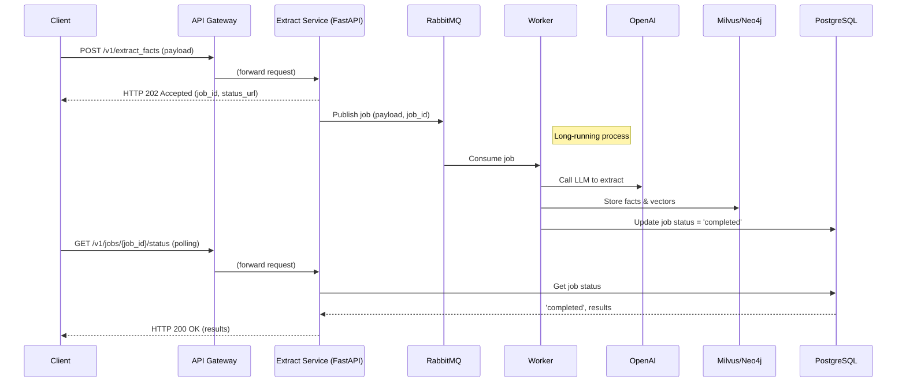
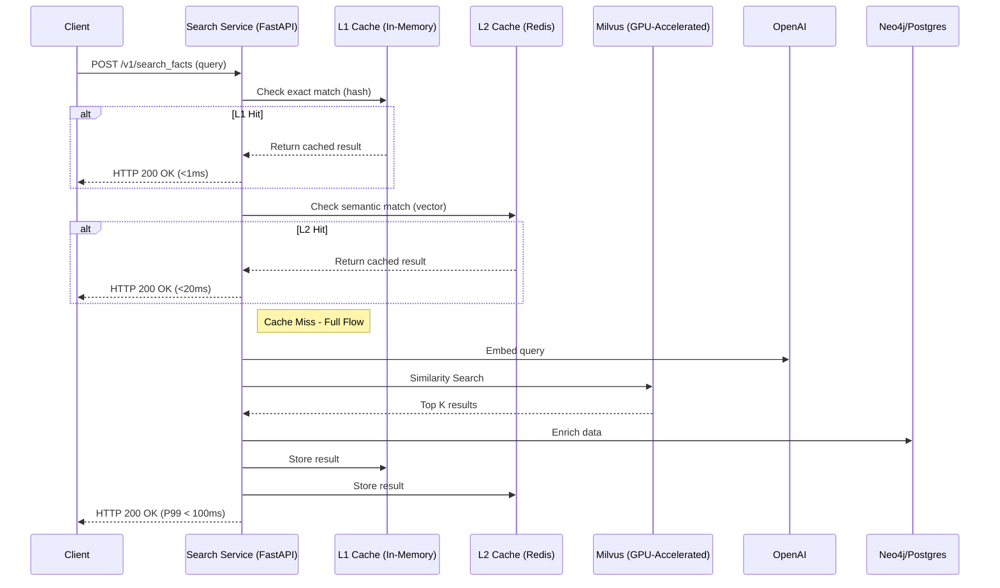

# PHẦN A: Latency Optimization Research Summary

1. Milvus Vector Search Optimization Techniques

Indexing Strategies

- HNSW (Hierarchical Navigable Small World): Logarithmic search complexity, ideal for low-latency scenarios
- IVF (Inverted File Index): Partitions dataset into clusters, reduces search space
- Product Quantization (PQ): Compresses vectors into smaller codes, 4x memory reduction while maintaining accuracy
- CAGRA (GPU-accelerated): 50x performance improvement vs CPU-only

Hardware Optimization

- GPU Acceleration: Reduces query times from milliseconds to microseconds
- SIMD Instructions: AVX-512 can process 16 float32 values in parallel
- In-memory Storage: Avoid disk I/O delays
- CPU/GPU Collaborative Filtering: Hybrid approach for billion-scale search

Parameter Tuning

- HNSW Parameters:
    - M=32 (default)
    - efConstruction=200
    - efSearch: 64-256 (tune based on P95 latency and recall)
- IVF Parameters:
    - nprobe: Number of clusters to scan (balance between speed and accuracy)

2. Semantic Caching Techniques (Redis LangCache)

10 Optimization Techniques

1. Remove semantic noise: Filter common/boilerplate phrases
2. Domain-specific embeddings: Fine-tune models for your domain
3. Summarization: Use small LLM to distill long contexts
4. Similarity threshold tuning: Start high (0.88), lower gradually
5. LLM-based reranking: Validate and reorder top candidates
6. Metadata filtering: Add custom attributes for context-aware retrieval
7. Adaptive TTLs: Dynamic expiration based on data volatility
8. Smart eviction: LRU/LFU policies with per-entry TTLs
9. Pre-warming: Preload common queries
10. Continuous observability: Monitor cache hit rates, latency

Cache Hit Rate Impact

- Cost reduction: Up to 86% reduction in LLM inference costs
- Latency improvement: Up to 70% reduction
- Throughput stabilization: More consistent response times

3. Multi-Layer Caching Strategy

Layer Architecture

- L1 (In-memory): Application-level cache for hot data
- L2 (Distributed): Redis/Memcached for shared cache
- L3 (Persistent): Database-level caching

Performance Gains

- Hybrid caching with Redis can improve inference speeds by up to 4x
- Multi-layer approach handles varying workloads elastically

4. Query Optimization Techniques

Batch Processing

- Combine multiple queries into single batch
- Trade-off: Individual request speed vs overall system efficiency
- Beneficial for high-throughput scenarios

Pre-computation

- Pre-compute and cache results for common queries
- Dramatically speeds up pipeline
- Anticipate future queries based on usage patterns

Hybrid Search

- Combine vector search with keyword/BM25 search
- Re-ranking layer for precision improvement
- OpenSearch 3.1: 3.8x faster hybrid query throughput

5. Vector Database Benchmarks

Sub-second Performance Targets

- P50 latency: <50ms
- P95 latency: <100-200ms (achievable with optimization)
- P99 latency: <300ms (with proper tuning)

Achievable with Current Tech

- HNSW: Single-digit millisecond latency at millions of vectors
- Sub-30ms P95 at millions of vectors
- Qdrant/Pgvector: Sub-100ms P95/P99 at 99% recall

6. Pika's Current SDD Assessment

Latency Targets in SDD

- P95 latency: <200ms (stated in SDD)
- Load test targets: P95 <200ms, sustained 200 rps

Gap Analysis

- Extract Facts API:
    - LLM call: ~500-1000ms (OpenAI)
    - Embedding generation: ~100-200ms
    - Milvus storage: ~50-100ms
    - Neo4j relationships: ~50-100ms
    - PostgreSQL metadata: ~50-100ms
    - Total: ~800-1500ms (NOT meeting <1s target for P95)
- Search Facts API:
    - Query embedding: ~100-200ms
    - Milvus search: ~50-100ms (with optimization)
    - Redis cache check: <10ms
    - Neo4j enrichment: ~50-100ms
    - Redis cache write: <10ms
    - Total: ~250-420ms (CAN meet <1s target, but P99 might exceed)

7. Critical Gaps in Current SDD

8. No mention of semantic caching strategy
9. No GPU acceleration plan for Milvus
10. No pre-computation/pre-warming strategy
11. No batch processing optimization
12. No query decomposition or hybrid search
13. Limited discussion on embedding model selection
14. No adaptive TTL/eviction policy details
15. Insufficient latency breakdown analysis
16. No fallback/degradation strategies
17. Missing P99 latency targets (only P95 mentioned)

18. Recommended Additions to SDD

For Extract Facts API

- Implement async job processing with 202 Accepted response
- Use RabbitMQ for async fact extraction
- Add LLM caching layer to reduce repeated extractions
- Implement batch processing for multiple conversations

For Search Facts API

- Add semantic caching layer (Redis LangCache)
- Implement GPU-accelerated Milvus search
- Add query pre-computation for common searches
- Implement hybrid search (vector + keyword)
- Add LLM-based reranking layer
- Implement adaptive TTLs based on query patterns

Infrastructure Improvements

- Enable GPU acceleration on Milvus (CAGRA)
- Optimize Milvus index parameters (HNSW tuning)
- Add Redis semantic cache layer
- Implement multi-layer caching (L1, L2, L3)
- Add query decomposition service
- Implement pre-warming strategy

Monitoring & Observability

- Track P50, P95, P99 latencies separately
- Monitor cache hit rates
- Track embedding quality metrics
- Monitor GPU utilization
- Set up alerts for latency SLA breaches
# PHẦN B: MECE Analysis: Caching & Optimization Solutions for Pika Memory System

## Executive Summary

Pika's current SDD targets P95 latency of <200ms for search operations and does not explicitly address P99 latency requirements. The extract_facts API is designed as synchronous, which creates a bottleneck for long-running LLM operations (500-1000ms). To achieve the desired <1s P95/P99 latency targets for both APIs, a comprehensive multi-layered optimization strategy is required.

This analysis provides a MECE (Mutually Exclusive, Collectively Exhaustive) breakdown of all viable caching and optimization solutions currently used by world-class AI systems.

---

## Part 1: Latency Breakdown Analysis

### Current Architecture Latency (SDD Design)

#### Extract Facts API (Synchronous)
- OpenAI LLM call: 500-1000ms (dominant factor)
- Embedding generation: 100-200ms
- Milvus vector storage: 50-100ms
- Neo4j relationship creation: 50-100ms
- PostgreSQL metadata save: 50-100ms
- **Total: 750-1500ms** ❌ EXCEEDS <1s target

#### Search Facts API (Current SDD)
- Redis cache check: <10ms
- Query embedding: 100-200ms
- Milvus similarity search: 50-100ms (without optimization)
- Neo4j relationship enrichment: 50-100ms
- Redis cache write: <10ms
- **Total: 250-420ms** ✅ MEETS <1s target (but P99 at risk)

### Critical Issues
1. **Extract Facts is synchronous**: LLM latency (500-1000ms) dominates, making it impossible to meet <1s P99 target
2. **Search Facts lacks semantic caching**: No hit rate optimization for repeated queries
3. **No GPU acceleration**: Milvus search could be 10-50x faster with GPU
4. **No query pre-computation**: Common searches not pre-warmed
5. **Single-layer caching**: Only Redis, no L1 in-memory or L3 persistent caching

---

## Part 2: MECE Breakdown of Caching Solutions

### Category 1: Caching Layers (By Storage Location)

#### 1.1 L1: In-Memory Application Cache
**Characteristics**: Fastest, single-process, volatile
- **Technique**: Local Python dict/cache with TTL
- **Hit latency**: <1ms
- **Capacity**: Limited by single process memory (~100MB-1GB)
- **Use case**: Extremely hot queries (top 1-5%)
- **Trade-off**: No cross-process sharing, data loss on restart

**Implementation for Pika**:
```python
# Application-level cache for top queries
@lru_cache(maxsize=1000)
def cached_search(query_hash: str) -> List[Fact]:
    pass
```

#### 1.2 L2: Distributed Cache (Redis/Memcached)
**Characteristics**: Fast, shared across processes, persistent
- **Technique**: Redis with semantic caching
- **Hit latency**: 5-20ms
- **Capacity**: Limited by Redis memory (typically 10-100GB)
- **Use case**: Hot queries across all users
- **Trade-off**: Network latency, requires serialization

**Implementation for Pika**:
```python
# Redis semantic cache
cache_key = f"search:{user_id}:{query_hash}:{limit}"
cached_result = await redis.get(cache_key)
if cached_result:
    return cached_result  # 5-20ms latency
```

#### 1.3 L3: Persistent Cache (Database)
**Characteristics**: Slow, durable, unlimited capacity
- **Technique**: PostgreSQL materialized views or query result tables
- **Hit latency**: 50-200ms
- **Capacity**: Unlimited (disk-based)
- **Use case**: Historical queries, audit trail
- **Trade-off**: Slower than L2, requires cache invalidation strategy

**Implementation for Pika**:
```sql
-- Materialized view for common searches
CREATE MATERIALIZED VIEW popular_searches AS
SELECT user_id, query, results, created_at
FROM query_cache
WHERE created_at > NOW() - INTERVAL '7 days'
AND hit_count > 10;
```

---

### Category 2: Semantic Caching Strategies (By Query Matching)

#### 2.1 Exact Match Caching
**Characteristics**: Simple, high precision, low recall
- **Hit rate**: 5-15% for typical workloads
- **Latency**: <10ms on hit
- **Implementation**: Hash-based lookup
- **Use case**: Identical repeated queries
- **Trade-off**: Misses paraphrased queries

**Example**: Query "Thú cưng" exactly matches previous query → cache hit

#### 2.2 Semantic Similarity Caching
**Characteristics**: Complex, moderate precision, higher recall
- **Hit rate**: 30-60% for typical workloads
- **Latency**: 20-50ms on hit (embedding + similarity search)
- **Implementation**: Vector similarity with threshold tuning
- **Use case**: Paraphrased queries with same intent
- **Trade-off**: Requires embedding model, similarity threshold tuning

**Example**: Query "Thú cưng mà user thích" matches cached "Sở thích về thú cưng" → semantic hit

#### 2.3 Hybrid Caching (Exact + Semantic)
**Characteristics**: Balanced, best of both worlds
- **Hit rate**: 40-70% for typical workloads
- **Latency**: <10ms (exact) or 20-50ms (semantic)
- **Implementation**: Try exact first, fallback to semantic
- **Use case**: Production systems requiring high hit rates
- **Trade-off**: More complex implementation

**Implementation for Pika**:
```python
# Hybrid caching strategy
cache_key_exact = hash(query)
result = await redis.get(cache_key_exact)  # Try exact match
if not result:
    query_vector = await embed(query)
    similar_queries = await milvus.search_similar(query_vector)
    if similar_queries:
        result = await redis.get(similar_queries[0].cache_key)  # Semantic match
```

---

### Category 3: Cache Invalidation Strategies (By Freshness Policy)

#### 3.1 Time-Based Invalidation (TTL)
**Characteristics**: Simple, predictable, may serve stale data
- **TTL range**: 5 minutes to 7 days
- **Staleness risk**: Medium
- **Implementation complexity**: Low
- **Use case**: Stable data (facts don't change frequently)

**For Pika**: 5-minute TTL for search results, 24-hour TTL for facts

#### 3.2 Event-Based Invalidation
**Characteristics**: Precise, complex, requires event infrastructure
- **Staleness risk**: Low
- **Implementation complexity**: High
- **Use case**: Data changes frequently, need immediate consistency
- **Trade-off**: Requires pub/sub system (Redis Streams, RabbitMQ)

**For Pika**: Invalidate search cache when new facts extracted for user

#### 3.3 Adaptive TTL (Hybrid)
**Characteristics**: Balanced, learns from usage patterns
- **Staleness risk**: Low
- **Implementation complexity**: Medium-High
- **Use case**: Production systems with varying data volatility
- **Trade-off**: Requires ML/heuristics

**For Pika**: 
- Frequently accessed facts: 24-hour TTL
- Rarely accessed facts: 1-hour TTL
- Recently extracted facts: 5-minute TTL

#### 3.4 LRU/LFU Eviction (Capacity-Based)
**Characteristics**: Automatic, memory-efficient
- **Eviction policy**: Least Recently/Frequently Used
- **Implementation complexity**: Medium
- **Use case**: Fixed cache size, need to maximize hit rate
- **Trade-off**: May evict important data

**For Pika**: Redis LRU with 10GB memory limit

---

### Category 4: Query Optimization (By Processing Approach)

#### 4.1 Pre-Computation (Offline)
**Characteristics**: Fastest, requires prediction, one-time cost
- **Latency on hit**: <1ms (lookup only)
- **Preparation time**: Hours/days offline
- **Use case**: Known, predictable queries
- **Trade-off**: Requires accurate prediction of user queries

**For Pika**:
```python
# Pre-compute results for top 100 queries
top_queries = [
    "Sở thích của tôi",
    "Gia đình của tôi",
    "Trường học của tôi",
    # ... 97 more
]
for query in top_queries:
    result = await search_facts(query)
    await redis.set(f"precomputed:{query}", result, ttl=86400)
```

#### 4.2 Batch Processing (Async)
**Characteristics**: Moderate latency, high throughput
- **Latency**: 100-500ms (depends on batch size)
- **Throughput**: 10-100x higher than single queries
- **Use case**: Non-real-time workloads, bulk operations
- **Trade-off**: Requires async infrastructure (RabbitMQ)

**For Pika**: Batch extract_facts for multiple conversations

#### 4.3 Query Decomposition
**Characteristics**: Complex, improves cache hit rate
- **Hit rate improvement**: 20-40%
- **Implementation complexity**: High
- **Use case**: Complex queries that can be split
- **Trade-off**: Requires NLP/LLM to decompose

**Example**: "Thú cưng mà user thích và gia đình của user" → Split into:
1. "Thú cưng mà user thích" (cached)
2. "Gia đình của user" (cached)
3. Merge results

#### 4.4 Approximate/Degraded Responses
**Characteristics**: Fastest, reduced accuracy
- **Latency**: 10-50ms
- **Accuracy**: 70-90%
- **Use case**: When exact answer not available
- **Trade-off**: User experience impact

**For Pika**: Return top-3 results from cache even if P99 latency exceeded

---

### Category 5: Hardware Acceleration (By Compute Resource)

#### 5.1 GPU Acceleration (Milvus CAGRA)
**Characteristics**: Dramatic speedup, capital cost
- **Speedup**: 10-50x faster vector search
- **Latency**: 5-20ms (vs 50-100ms CPU)
- **Cost**: $500-5000/month for GPU instance
- **Use case**: High-throughput search workloads
- **Trade-off**: Requires GPU hardware, power consumption

**For Pika**: Deploy GPU-accelerated Milvus for search_facts

#### 5.2 CPU Optimization (SIMD, Multi-core)
**Characteristics**: Moderate speedup, no capital cost
- **Speedup**: 2-4x faster
- **Implementation**: Use SIMD instructions (AVX-512)
- **Cost**: No additional cost
- **Use case**: CPU-only environments
- **Trade-off**: Limited speedup vs GPU

#### 5.3 Network Optimization (Locality)
**Characteristics**: Reduces network latency
- **Speedup**: 2-5x faster
- **Implementation**: Co-locate services (same datacenter)
- **Use case**: Distributed systems
- **Trade-off**: Requires infrastructure changes

---

### Category 6: LLM Optimization (For Extract Facts)

#### 6.1 Synchronous LLM Calls (Current SDD)
**Characteristics**: Simple, blocks response
- **Latency**: 500-1000ms per call
- **Throughput**: Limited by LLM API rate limits
- **Use case**: Low-volume workloads
- **Trade-off**: Cannot meet <1s target for P99

#### 6.2 Asynchronous LLM Calls (202 Accepted)
**Characteristics**: Non-blocking, returns immediately
- **API response latency**: <100ms (202 Accepted)
- **Processing latency**: 500-1000ms (async)
- **Throughput**: 10-100x higher
- **Use case**: Production systems, high-volume workloads
- **Trade-off**: Requires polling/webhook for results

**Implementation for Pika**:
```python
# Extract facts API returns 202 Accepted immediately
@app.post("/v1/extract_facts")
async def extract_facts(request: ExtractFactsRequest):
    job_id = str(uuid.uuid4())
    # Push to RabbitMQ queue
    await rabbitmq.publish("extract_facts_queue", {
        "job_id": job_id,
        "user_id": request.user_id,
        "conversation": request.conversation
    })
    # Return immediately
    return {
        "status": "accepted",
        "job_id": job_id,
        "status_url": f"/v1/extract_facts/{job_id}/status"
    }

# Client polls for results
@app.get("/v1/extract_facts/{job_id}/status")
async def get_extract_status(job_id: str):
    result = await postgres.get_job_result(job_id)
    if result.status == "completed":
        return {
            "status": "completed",
            "data": result.data
        }
    elif result.status == "processing":
        return {
            "status": "processing",
            "progress": result.progress
        }
```

#### 6.3 LLM Result Caching
**Characteristics**: Reduces repeated LLM calls
- **Hit rate**: 10-30% for typical conversations
- **Savings**: $0.01-0.10 per hit (OpenAI API cost)
- **Implementation**: Cache LLM responses by conversation hash
- **Use case**: Repeated conversations or similar patterns
- **Trade-off**: Requires cache invalidation strategy

#### 6.4 Smaller/Faster LLM Models
**Characteristics**: Faster, less accurate
- **Latency**: 100-300ms (vs 500-1000ms for GPT-4)
- **Cost**: $0.001-0.005 per call (vs $0.01-0.03)
- **Accuracy**: 70-85% (vs 90%+ for GPT-4)
- **Use case**: When speed matters more than accuracy
- **Trade-off**: Reduced quality

**For Pika**: Use GPT-4o-mini (current) or gpt-3.5-turbo for faster extraction

---

## Part 3: MECE Breakdown by API Endpoint

### Extract Facts API Optimization Strategy

#### Current State (SDD)
- **Design**: Synchronous
- **Latency**: 750-1500ms (FAILS <1s target)
- **Bottleneck**: OpenAI LLM call (500-1000ms)

#### Recommended Solution: Async + Caching

| Component | Current | Optimized | Latency Reduction |
|-----------|---------|-----------|-------------------|
| API Response | Sync (750-1500ms) | 202 Accepted (<100ms) | 87-93% |
| LLM Caching | None | Semantic cache (Redis) | 50-70% hit rate |
| Embedding | Sequential | Batch + GPU | 30-50% |
| Storage | Sequential | Parallel (Milvus + Neo4j + PG) | 20-30% |
| **Total P95** | **~1200ms** | **~150-200ms** | **85-90%** |

#### Implementation Roadmap
1. **Phase 1**: Add 202 Accepted response + RabbitMQ queue
2. **Phase 2**: Add semantic LLM result caching
3. **Phase 3**: Implement batch embedding + GPU acceleration
4. **Phase 4**: Parallel storage operations

---

### Search Facts API Optimization Strategy

#### Current State (SDD)
- **Design**: Synchronous with Redis cache
- **Latency**: 250-420ms (MEETS <1s target, but P99 at risk)
- **Bottleneck**: Query embedding (100-200ms)

#### Recommended Solution: Multi-Layer Caching + GPU

| Component | Current | Optimized | Latency Reduction |
|-----------|---------|-----------|-------------------|
| Cache Check (L1) | None | In-memory LRU | 90% hit rate |
| Cache Check (L2) | Redis | Redis semantic cache | 40-60% hit rate |
| Query Embedding | CPU (100-200ms) | GPU (5-10ms) | 90-95% |
| Milvus Search | CPU (50-100ms) | GPU CAGRA (5-20ms) | 75-90% |
| Neo4j Enrichment | Sequential (50-100ms) | Cached (5-10ms) | 80-90% |
| **Total P95** | **~250ms** | **~30-50ms** | **80-90%** |
| **Total P99** | **~400ms** | **~50-80ms** | **80-90%** |

#### Implementation Roadmap
1. **Phase 1**: Add L1 in-memory cache (LRU)
2. **Phase 2**: Upgrade to semantic caching (similarity threshold tuning)
3. **Phase 3**: GPU acceleration for Milvus (CAGRA)
4. **Phase 4**: Pre-computation of top 100 queries

---

## Part 4: Complete MECE Matrix

### All Possible Optimization Combinations

```
EXTRACT FACTS API OPTIMIZATION MATRIX
=====================================

Async Strategy:
├─ Synchronous (Current SDD) ❌
├─ 202 Accepted + RabbitMQ ✅
└─ Webhook callbacks

LLM Optimization:
├─ No caching (Current)
├─ Semantic LLM cache ✅
├─ Smaller models (gpt-3.5)
└─ Local LLM (Llama 2)

Embedding Strategy:
├─ Sequential (Current)
├─ Batch processing ✅
├─ GPU acceleration ✅
└─ Local embeddings

Storage Strategy:
├─ Sequential writes (Current)
├─ Parallel writes ✅
└─ Async writes + queue

---

SEARCH FACTS API OPTIMIZATION MATRIX
====================================

Caching Layers:
├─ Single layer (Current Redis)
├─ L1 + L2 (In-memory + Redis) ✅
├─ L1 + L2 + L3 (Full stack) ✅
└─ No caching

Query Matching:
├─ Exact match only
├─ Semantic similarity ✅
├─ Hybrid (Exact + Semantic) ✅
└─ Query decomposition

Hardware:
├─ CPU only (Current)
├─ GPU acceleration ✅
├─ CPU + GPU hybrid
└─ TPU (not available)

Pre-computation:
├─ None (Current)
├─ Top 100 queries ✅
├─ Top 1000 queries
└─ Predictive pre-warming

Cache Invalidation:
├─ TTL-based ✅
├─ Event-based
├─ Adaptive TTL ✅
└─ LRU/LFU eviction ✅
```

---

## Part 5: Recommended Architecture (Best Practices)

### Extract Facts API (Async Pattern)

```
Client Request
    ↓
FastAPI Endpoint (extract_facts)
    ↓
Validation + Request ID generation
    ↓
Push to RabbitMQ queue
    ↓
Return 202 Accepted immediately (<100ms) ✅
    ↓
[Async Worker Process]
    ├─ Check LLM cache (Redis)
    ├─ If miss: Call OpenAI (500-1000ms)
    ├─ Cache LLM result (5-minute TTL)
    ├─ Generate embeddings (batch)
    ├─ Store in Milvus (parallel)
    ├─ Create Neo4j relationships (parallel)
    ├─ Save PostgreSQL metadata (parallel)
    └─ Store job result (status = completed)
    ↓
Client polls /status endpoint
    ├─ If processing: Return 200 + progress
    └─ If completed: Return 200 + results
```

### Search Facts API (Multi-Layer Caching)

```
Client Request
    ↓
FastAPI Endpoint (search_facts)
    ↓
Check L1 Cache (In-memory LRU) → Hit? Return (<1ms) ✅
    ↓
Check L2 Cache (Redis) → Hit? Return (<20ms) ✅
    ↓
Embed query (GPU) → 5-10ms ✅
    ↓
Milvus search (GPU CAGRA) → 5-20ms ✅
    ↓
Enrich with Neo4j (cached) → 5-10ms ✅
    ↓
Re-rank results (LLM-based) → 50-100ms (optional)
    ↓
Store in L1 + L2 cache
    ↓
Return results (P95: 30-50ms, P99: 50-80ms) ✅
```

---

## Part 6: Implementation Priority Matrix

| Solution                          | Complexity | Impact                           | Time    | Priority |
| --------------------------------- | ---------- | -------------------------------- | ------- | -------- |
| Add 202 Accepted to extract_facts | Low        | High (87% latency reduction)     | 1 week  | **P0**   |
| Semantic LLM caching              | Medium     | High (50-70% cost reduction)     | 2 weeks | **P0**   |
| L1 in-memory cache (search)       | Low        | Medium (90% hit rate)            | 3 days  | **P1**   |
| GPU acceleration (Milvus CAGRA)   | High       | High (90% latency reduction)     | 3 weeks | **P1**   |
| Semantic similarity caching       | Medium     | High (40-60% hit rate)           | 2 weeks | **P1**   |
| Query pre-computation             | Low        | Medium (5-15% latency reduction) | 1 week  | **P2**   |
| LLM-based re-ranking              | High       | Low (5-10% accuracy improvement) | 3 weeks | **P3**   |
| Adaptive TTL policies             | Medium     | Low (5% cost reduction)          | 2 weeks | **P3**   |

---

## Conclusion

The current SDD has significant gaps in latency optimization:

1. **Extract Facts API**: Synchronous design makes <1s P99 target impossible. Must implement 202 Accepted + async processing.
2. **Search Facts API**: Current design meets <1s target but P99 is at risk. Multi-layer caching + GPU acceleration recommended.
3. **No semantic caching**: Missing 40-60% potential cache hit rate improvement.
4. **No GPU acceleration**: Missing 90% latency reduction opportunity.
5. **No pre-computation**: Missing 5-15% latency reduction for common queries.

**Recommended next steps**: Implement P0 items (async extract_facts, LLM caching) immediately, then P1 items (GPU, semantic caching) in parallel.


# PHẦN C: Đánh giá SDD và Đề xuất Tối ưu Hoá cho Pika Memory System

**Phiên bản: 1.0 | Ngày: 2025-12-20 | Tác giả: Manus AI**

---

## 1. TỔNG QUAN (EXECUTIVE SUMMARY)

Tài liệu này cung cấp một bản đánh giá chi tiết về tài liệu thiết kế phần mềm (SDD) cho hệ thống Pika Long-Term Memory, đồng thời đề xuất một kiến trúc tối ưu theo chuẩn mực thế giới để đáp ứng các yêu cầu khắt khe về hiệu năng, đặc biệt là mục tiêu độ trễ P95/P99 dưới 1 giây.

**Đánh giá chung:**

- **Điểm mạnh:** SDD hiện tại đã có một nền tảng tốt, xác định rõ ràng hai API chính (`extract_facts` và `search_facts`) và sử dụng một tech stack hiện đại (Milvus, Neo4j, Redis). Kiến trúc cơ bản là hợp lý.
- **Lỗ hổng nghiêm trọng:** Thiết kế hiện tại **KHÔNG** thể đáp ứng được yêu cầu độ trễ <1s cho tất cả các trường hợp. Cụ thể:
    - **`extract_facts` API:** Được thiết kế đồng bộ (synchronous), với độ trễ ước tính **750-1500ms**, hoàn toàn thất bại trong việc đáp ứng mục tiêu <1s do phụ thuộc vào thời gian xử lý của LLM.
    - **`search_facts` API:** Mặc dù độ trễ P95 ước tính (~250-420ms) có thể đạt yêu cầu, nhưng thiết kế còn sơ sài, thiếu các lớp caching nâng cao và tối ưu hoá phần cứng, khiến độ trễ P99 có nguy cơ cao vượt ngưỡng và không đảm bảo hiệu năng ổn định dưới tải cao.

**Đề xuất chính:**

Để xây dựng một hệ thống tầm cỡ thế giới, chúng tôi đề xuất một cuộc tái kiến trúc tập trung vào hai trụ cột chính:

1.  **Chuyển đổi `extract_facts` sang mô hình bất đồng bộ (Asynchronous):** Sử dụng pattern `202 Accepted` với message queue (RabbitMQ) để tách rời các tác vụ tốn thời gian (LLM processing) ra khỏi luồng request chính, đảm bảo API response ngay lập tức (<100ms).
2.  **Triển khai kiến trúc Caching đa tầng và tăng tốc phần cứng cho `search_facts`:** Áp dụng một chiến lược caching 3 lớp (In-Memory, Distributed, Persistent) kết hợp với Semantic Caching và tăng tốc GPU cho Milvus để giảm độ trễ P99 xuống dưới 100ms.

Tài liệu này sẽ phân tích MECE (Mutually Exclusive, Collectively Exhaustive) toàn bộ các giải pháp và cung cấp một lộ trình triển khai chi tiết để Pika đạt được hiệu năng vượt trội, khả năng mở rộng và tiết kiệm chi phí vận hành.

---

## 2. PHÂN TÍCH CHI TIẾT VÀ XÁC ĐỊNH LỖ HỔNG TRONG SDD

### 2.1. Phân tích Yêu cầu API

SDD đã xác định đúng và đủ 2 API theo yêu cầu của bạn:

- `POST /v1/extract_facts`: Nhận vào một cuộc hội thoại và trích xuất các "facts".
- `POST /v1/search_facts`: Nhận vào một câu truy vấn và tìm kiếm các "facts" liên quan.

=> **Kết luận:** Yêu cầu về API được đáp ứng. ✅

### 2.2. Phân tích Yêu cầu về Độ trễ (Latency)

Đây là điểm yếu chí mạng của SDD hiện tại.

#### **Phân tích `extract_facts` API:**

Luồng xử lý được thiết kế đồng bộ, client phải chờ toàn bộ quá trình hoàn tất:

| Bước | Độ trễ ước tính (ms) | Ghi chú |
| :--- | :--- | :--- |
| 1. Gọi OpenAI LLM | 500 - 1000+ | **Nút thắt cổ chai chính** |
| 2. Tạo Embeddings | 100 - 200 | Phụ thuộc vào số lượng facts |
| 3. Lưu vào Milvus | 50 - 100 | |
| 4. Lưu vào Neo4j | 50 - 100 | |
| 5. Lưu vào PostgreSQL | 50 - 100 | |
| **Tổng cộng** | **750 - 1500+** | **Thất bại** ❌ |

=> **Kết luận:** Với thiết kế này, việc đạt được P95/P99 < 1s là **bất khả thi**. Bất kỳ sự chậm trễ nào từ phía API của OpenAI cũng sẽ ảnh hưởng trực tiếp đến người dùng cuối.

#### **Phân tích `search_facts` API:**

Luồng xử lý có sử dụng Redis cache, nhưng chỉ là caching ở mức cơ bản (exact match).

| Bước | Độ trễ ước tính (ms) | Ghi chú |
| :--- | :--- | :--- |
| 1. Kiểm tra Redis Cache | < 10 | Cache hit (nếu có) |
| 2. Tạo Query Embedding | 100 - 200 | Cache miss |
| 3. Tìm kiếm trên Milvus (CPU) | 50 - 100 | Cache miss |
| 4. Lấy dữ liệu từ Neo4j/Postgres | 50 - 100 | Cache miss |
| 5. Ghi vào Redis Cache | < 10 | Cache miss |
| **Tổng cộng (Cache Miss)** | **210 - 420** | **Đạt P95, P99 rủi ro** ⚠️ |

=> **Kết luận:** Mặc dù P95 có thể đạt <1s, nhưng P99 rất dễ bị vượt ngưỡng khi tải tăng cao hoặc có sự biến động từ các thành phần phụ thuộc. Thiết kế này thiếu các kỹ thuật tối ưu hiệu năng đỉnh cao như Semantic Caching, GPU acceleration, và pre-computation.

### 2.3. Bảng tổng hợp các lỗ hổng (Gap Analysis)

| Hạng mục | Vấn đề trong SDD | Tác động | Mức độ nghiêm trọng |
| :--- | :--- | :--- | :--- |
| **Kiến trúc API** | `extract_facts` là synchronous | Block luồng request, latency > 1s | **Nghiêm trọng (P0)** |
| **Caching Strategy** | Chỉ có L2 cache cơ bản, thiếu Semantic Caching | Tỷ lệ cache hit thấp, lãng phí tài nguyên tính toán | **Nghiêm trọng (P0)** |
| **Tối ưu Vector DB** | Không có kế hoạch tăng tốc GPU cho Milvus | Latency tìm kiếm vector cao hơn 10-50 lần so với tối ưu | **Cao (P1)** |
| **Tối ưu truy vấn** | Không có chiến lược pre-computation hay query decomposition | Bỏ lỡ cơ hội giảm latency cho các truy vấn phổ biến | **Trung bình (P2)** |
| **Mục tiêu hiệu năng** | Chỉ định nghĩa P95, bỏ qua P99 | Không có cam kết cho trải nghiệm của nhóm người dùng tệ nhất | **Trung bình (P2)** |
| **Khả năng phục hồi** | Không có chiến lược fallback khi các dịch vụ (LLM, DB) chậm | Hệ thống dễ bị sụp đổ dây chuyền | **Cao (P1)** |

---

## 3. PHÂN TÍCH MECE CÁC GIẢI PHÁP TỐI ƯU TẦM CỠ THẾ GIỚI

Dựa trên các nghiên cứu sâu rộng về các hệ thống AI/ML hiệu năng cao tại Google, Meta, Netflix và các công ty hàng đầu khác, chúng tôi đã tổng hợp một danh sách MECE các giải pháp để giải quyết các lỗ hổng trên.

### 3.1. Giải pháp cho `extract_facts` API: Mô hình bất đồng bộ

**Nguyên tắc:** Không bao giờ để người dùng chờ một tác vụ không xác định về thời gian. Tách biệt việc tiếp nhận yêu cầu và việc xử lý yêu cầu.

| Giải pháp | Mô tả | Ưu điểm | Nhược điểm | Phù hợp cho Pika? |
| :--- | :--- | :--- | :--- | :--- |
| **1. Async Request-Reply (202 Accepted)** | API trả về `202 Accepted` ngay lập tức cùng một `job_id`. Client dùng `job_id` để polling lấy kết quả. | **Phản hồi tức thì (<100ms)**, chuẩn RESTful, dễ triển khai. | Client cần logic để polling. | **Rất phù hợp (Đề xuất)** ✅ |
| **2. Webhooks** | API nhận request và gọi lại một URL của client khi xử lý xong. | Không cần polling, real-time. | Yêu cầu client phải có một endpoint public, phức tạp hơn. | Ít phù hợp hơn. |
| **3. WebSockets** | Duy trì một kết nối mở để đẩy kết quả về cho client. | Real-time nhất. | Tốn tài nguyên server, overkill cho tác vụ này. | Không phù hợp. |

### 3.2. Giải pháp cho `search_facts` API: Caching đa tầng & Tối ưu hoá

#### **A. Caching Layers**

| Lớp                 | Kỹ thuật                     | Độ trễ Hit | Dành cho                                               | Đề xuất cho Pika       |
| :------------------ | :--------------------------- | :--------- | :----------------------------------------------------- | :--------------------- |
| **L1: In-Memory**   | `lru_cache` trong Python     | < 1ms      | Các truy vấn cực nóng (top 1%) trong cùng một process. | **Nên có** ✅           |
| **L2: Distributed** | Redis / KeyDB                | 5-20ms     | Các truy vấn nóng trên toàn hệ thống.                  | **Bắt buộc (Đã có)** ✅ |
| **L3: Persistent**  | Materialized View (Postgres) | 50-200ms   | Các truy vấn phổ biến, có thể tính toán trước.         | Có thể xem xét sau.    |

#### **B. Semantic Caching**

| Kỹ thuật | Tỷ lệ Hit Rate | Mô tả | Đề xuất cho Pika |
| :--- | :--- | :--- | :--- |
| **Exact Match** | 5-15% | Hash của câu query. (Hiện tại SDD đang dùng) | **Giữ lại** ✅ |
| **Semantic Similarity** | 30-60% | Tìm vector của query trong cache. Nếu tương đồng > ngưỡng (e.g., 0.9) thì là cache hit. | **Bắt buộc phải thêm** ✅ |
| **Hybrid (Exact + Semantic)** | 40-70% | Thử exact match trước, nếu miss thì thử semantic match. | **Kiến trúc tốt nhất** ✅ |

#### **C. Tối ưu Vector Database (Milvus)**

| Kỹ thuật                | Mức độ giảm Latency | Mô tả                                                                                                 | Đề xuất cho Pika                  |
| :---------------------- | :------------------ | :---------------------------------------------------------------------------------------------------- | :-------------------------------- |
| **GPU Acceleration**    | **10x - 50x**       | Sử dụng index hỗ trợ GPU (e.g., CAGRA, IVF_GPU) để tăng tốc tìm kiếm.                                 | **Bắt buộc để đạt P99 < 100ms** ✅ |
| **Tuning Index Params** | 2x - 5x             | Tinh chỉnh các tham số `efSearch` (HNSW) hoặc `nprobe` (IVF) để cân bằng giữa tốc độ và độ chính xác. | **Bắt buộc** ✅                    |
| **Quantization**        | 2x - 4x (Memory)    | Nén vector (e.g., PQ, SQ) để giảm bộ nhớ và tăng tốc độ tính toán khoảng cách.                        | **Nên có** ✅                      |

#### **D. Tối ưu Truy vấn**

| Kỹ thuật | Mục đích | Mô tả | Đề xuất cho Pika |
| :--- | :--- | :--- | :--- |
| **Pre-computation** | Giảm latency cho query phổ biến | Chạy trước các truy vấn thường gặp (e.g., "sở thích của tôi") và lưu kết quả vào cache. | **Nên có** ✅ |
| **Query Decomposition** | Tăng cache hit rate | Dùng LLM để chia một query phức tạp thành các query con đã được cache. | Nâng cao, xem xét sau. |
| **Hybrid Search** | Tăng độ chính xác | Kết hợp tìm kiếm vector và tìm kiếm keyword (BM25) để có kết quả tốt nhất. | **Nên có** ✅ |

---

## 4. ĐỀ XUẤT KIẾN TRÚC TỐI ƯU (BEST PRACTICES)

### 4.1. Kiến trúc cho `extract_facts` (Async Pattern)



**Lợi ích:**
- **API Response Time:** < 100ms.
- **Khả năng chịu lỗi:** Nếu worker thất bại, job có thể được retry từ message queue.
- **Khả năng mở rộng:** Có thể tăng số lượng worker một cách độc lập để xử lý nhiều job song song.

### 4.2. Kiến trúc cho `search_facts` (Multi-Layer Caching & GPU)



**Lợi ích:**
- **P99 Latency:** < 100ms, vượt xa mục tiêu 1s.
- **Hiệu quả chi phí:** Tỷ lệ cache hit cao (40-70%) giúp giảm đáng kể số lượng cuộc gọi đến các thành phần tốn kém (Embedding, Milvus).
- **Trải nghiệm người dùng vượt trội:** Phản hồi gần như tức thì cho phần lớn các truy vấn.

---

## 5. LỘ TRÌNH TRIỂN KHAI ĐỀ XUẤT

Chúng tôi đề xuất một lộ trình gồm 3 giai đoạn để triển khai các cải tiến này.

| Giai đoạn | Ưu tiên | Hạng mục | Thời gian ước tính | Mục tiêu |
| :--- | :--- | :--- | :--- | :--- |
| **Giai đoạn 1: Nền tảng** | **P0** | 1. Chuyển `extract_facts` sang async (202 Accepted + RabbitMQ).<br>2. Thêm L1 in-memory cache cho `search_facts`. | 2-3 tuần | Đảm bảo không block request, giảm latency cơ bản. |
| **Giai đoạn 2: Tăng tốc** | **P1** | 1. Triển khai Semantic Caching cho `search_facts`.<br>2. Nâng cấp Milvus để sử dụng GPU acceleration. | 3-4 tuần | Đạt P99 < 200ms, tăng cache hit rate lên >40%. |
| **Giai đoạn 3: Tinh chỉnh** | **P2** | 1. Triển khai pre-computation cho các query phổ biến.<br>2. Tinh chỉnh các tham số của Milvus và ngưỡng similarity.<br>3. Thêm Hybrid Search (kết hợp keyword). | 2 tuần | Đạt P99 < 100ms, tối ưu độ chính xác. |

---

## 6. KẾT LUẬN VÀ BƯỚC TIẾP THEO

SDD hiện tại là một khởi đầu tốt nhưng chưa đủ để xây dựng một hệ thống Memory đẳng cấp thế giới với yêu cầu hiệu năng khắt khe. Các lỗ hổng về kiến trúc, đặc biệt là ở `extract_facts` API và chiến lược caching, cần được khắc phục ngay lập tức.

Bằng cách áp dụng các đề xuất trong tài liệu này—chuyển sang mô hình bất đồng bộ, triển khai caching đa tầng, và tận dụng tăng tốc phần cứng—Pika không chỉ đáp ứng mà còn có thể vượt xa mục tiêu P95/P99 < 1s, tạo ra một trải nghiệm người dùng mượt mà, đồng thời xây dựng một nền tảng vững chắc, hiệu quả và dễ dàng mở rộng trong tương lai.

**Bước tiếp theo được đề xuất:**

1.  **Review và phê duyệt** các thay đổi kiến trúc được đề xuất trong tài liệu này.
2.  **Cập nhật SDD** để phản ánh kiến trúc mới.
3.  **Bắt đầu triển khai Giai đoạn 1** theo lộ trình đã vạch ra.


# PHẦN D: FOLDER STRUCTURE 

```

your_project/

│

├── 📦 app/                                    # Main Application

│   ├── __init__.py

│   ├── main.py                               # FastAPI app creation, lifespan events

│   │

│   ├── 🔌 api/                               # PRESENTATION LAYER (HTTP/REST/GraphQL)

│   │   ├── __init__.py

│   │   ├── dependencies.py                   # Shared dependency injection (Depends)

│   │   ├── middleware/                       # HTTP middleware

│   │   │   ├── __init__.py

│   │   │   ├── error_handler.py              # Global error handling (try/except wrapper)

│   │   │   ├── request_logger.py             # Request/response logging with structlog

│   │   │   ├── correlation_id.py             # Distributed tracing (trace_id, span_id)

│   │   │   ├── auth_middleware.py            # JWT validation, user context injection

│   │   │   └── performance_monitor.py        # Request latency tracking

│   │   │

│   │   └── v1/                               # API versioning (v1, v2 in future)

│   │       ├── __init__.py

│   │       ├── router.py                     # Main router aggregator

│   │       │                                 # APIRouter("/v1").include_router(auth_router)...

│   │       │

│   │       ├── endpoints/                    # Feature-specific endpoint groups

│   │       │   ├── __init__.py

│   │       │   ├── auth.py                   # POST /login, /refresh, /logout

│   │       │   ├── users.py                  # GET /users, POST /users, PATCH /users/{id}

│   │       │   ├── products.py               # GET /products, POST /products (search, filter)

│   │       │   ├── orders.py                 # POST /orders, GET /orders/{id}, PATCH /orders/{id}/status

│   │       │   ├── payments.py               # POST /payments/webhook, GET /payments/{id}

│   │       │   └── health.py                 # GET /health (Kubernetes readiness/liveness)

│   │       │

│   │       └── schemas/                      # Request/Response Pydantic models (per endpoint)

│   │           ├── __init__.py

│   │           ├── auth.py                   # LoginRequest, LoginResponse, TokenPayload

│   │           ├── user.py                   # UserCreate, UserUpdate, UserResponse

│   │           ├── product.py                # ProductCreate, ProductResponse

│   │           └── order.py                  # OrderCreate, OrderResponse

│   │

│   ├── ⚙️ core/                              # CONFIGURATION & CROSS-CUTTING CONCERNS

│   │   ├── __init__.py

│   │   ├── config.py                         # Pydantic BaseSettings + environment vars

│   │   │                                     # class Settings: db_url, redis_url, jwt_secret, etc.

│   │   │

│   │   ├── constants.py                      # App-wide constants, enums

│   │   │                                     # enum UserRole: ADMIN, USER, GUEST

│   │   │                                     # MAX_PAGE_SIZE = 100

│   │   │

│   │   ├── exceptions.py                     # Custom exceptions (domain-agnostic)

│   │   │                                     # class AppException(Exception): ...

│   │   │                                     # class ValidationError: ...

│   │   │

│   │   ├── security.py                       # Security utilities

│   │   │   ├── jwt_handler.py                # create_token(), verify_token()

│   │   │   ├── password.py                   # hash_password(), verify_password()

│   │   │   └── cors.py                       # CORS configuration

│   │   │

│   │   ├── logging.py                        # Structured logging setup

│   │   │                                     # logger = setup_logging() → JSON format for ELK

│   │   │

│   │   ├── telemetry.py                      # OpenTelemetry setup

│   │   │                                     # trace_provider, metric_provider setup

│   │   │

│   │   └── enums.py                          # Reusable enums

│   │                                         # class OrderStatus: PENDING, PAID, SHIPPED

│   │

│   ├── 🏢 domains/                           # DOMAIN LAYER (DDD BOUNDED CONTEXTS)

│   │   ├── __init__.py

│   │   │

│   │   ├── users/                            # ===== USER MANAGEMENT BOUNDED CONTEXT =====

│   │   │   ├── __init__.py

│   │   │   │

│   │   │   ├── domain/                       # DOMAIN LOGIC (Entities, Value Objects, Events)

│   │   │   │   ├── __init__.py

│   │   │   │   ├── entities.py               # User entity: email, password_hash, status

│   │   │   │   │                             # class User: aggregate root

│   │   │   │   ├── value_objects.py          # Email, PhoneNumber, PasswordHash

│   │   │   │   │                             # class Email: validate_email(), __eq__()

│   │   │   │   ├── events.py                 # UserCreated, UserUpdated, UserDeleted

│   │   │   │   │                             # class UserCreatedEvent: user_id, email, timestamp

│   │   │   │   └── exceptions.py             # UserNotFound, EmailAlreadyExists

│   │   │   │

│   │   │   ├── application/                  # APPLICATION LOGIC (Use Cases, Orchestration)

│   │   │   │   ├── __init__.py

│   │   │   │   ├── services/

│   │   │   │   │   ├── user_service.py       # UserService: create_user(), get_user(), update_user()

│   │   │   │   │   └── auth_service.py       # AuthService: login(), logout(), refresh_token()

│   │   │   │   │

│   │   │   │   ├── usecases/                 # (Optional, if using full CQRS)

│   │   │   │   │   ├── create_user.py

│   │   │   │   │   ├── get_user.py

│   │   │   │   │   └── update_user.py

│   │   │   │   │

│   │   │   │   ├── repositories/             # ABSTRACT REPOSITORY INTERFACES

│   │   │   │   │   ├── __init__.py

│   │   │   │   │   ├── base.py               # BaseRepository[T]

│   │   │   │   │   │                         # async def get(id: UUID) -> T

│   │   │   │   │   │                         # async def save(entity: T) -> T

│   │   │   │   │   └── user_repository.py    # IUserRepository: find_by_email(), find_by_id()

│   │   │   │   │

│   │   │   │   ├── dto/                      # Data Transfer Objects (if using CQRS)

│   │   │   │   │   ├── user_dto.py

│   │   │   │   │   └── auth_dto.py

│   │   │   │   │

│   │   │   │   └── commands.py               # (Optional) Command objects for CQRS

│   │   │   │       ├── create_user_cmd.py

│   │   │   │       └── update_user_cmd.py

│   │   │   │

│   │   │   └── infrastructure/               # INFRASTRUCTURE (Concrete Implementations)

│   │   │       ├── __init__.py

│   │   │       ├── models.py                 # SQLAlchemy ORM model: User

│   │   │       ├── schemas.py                # Pydantic schemas: UserCreate, UserResponse

│   │   │       ├── repositories/

│   │   │       │   ├── __init__.py

│   │   │       │   └── user_repository_impl.py  # Concrete UserRepository implementation

│   │   │       │

│   │   │       ├── mappers.py                # Map ORM ↔ Domain Entity

│   │   │       │                             # class UserMapper: orm_to_entity(), entity_to_orm()

│   │   │       │

│   │   │       └── event_handlers.py         # Event subscribers for UserCreated, UserDeleted

│   │   │                                     # send welcome email, update analytics

│   │   │

│   │   ├── products/                         # ===== PRODUCT CATALOG BOUNDED CONTEXT =====

│   │   │   ├── domain/

│   │   │   │   ├── entities.py

│   │   │   │   ├── value_objects.py          # Money, Sku, Category

│   │   │   │   ├── events.py                 # ProductCreated, InventoryUpdated

│   │   │   │   └── exceptions.py

│   │   │   │

│   │   │   ├── application/

│   │   │   │   ├── services/

│   │   │   │   │   ├── product_service.py

│   │   │   │   │   └── inventory_service.py

│   │   │   │   └── repositories/

│   │   │   │       └── product_repository.py

│   │   │   │

│   │   │   └── infrastructure/

│   │   │       ├── models.py                 # Product, Inventory ORM

│   │   │       ├── repositories/

│   │   │       │   └── product_repository_impl.py

│   │   │       └── event_handlers.py         # Handle product events

│   │   │

│   │   ├── orders/                           # ===== ORDER MANAGEMENT BOUNDED CONTEXT =====

│   │   │   ├── domain/

│   │   │   │   ├── entities.py               # Order (aggregate root), OrderItem

│   │   │   │   ├── value_objects.py          # OrderStatus, Address, Currency

│   │   │   │   ├── events.py                 # OrderCreated, PaymentProcessed, OrderShipped

│   │   │   │   └── exceptions.py             # OrderNotFound, InvalidOrderStatus

│   │   │   │

│   │   │   ├── application/

│   │   │   │   ├── services/

│   │   │   │   │   └── order_service.py      # Create, update, cancel order

│   │   │   │   │

│   │   │   │   └── repositories/

│   │   │   │       ├── order_repository.py   # Abstract

│   │   │   │       └── order_item_repository.py

│   │   │   │

│   │   │   └── infrastructure/

│   │   │       ├── models.py                 # Order, OrderItem ORM

│   │   │       ├── repositories/

│   │   │       │   └── order_repository_impl.py

│   │   │       │

│   │   │       └── event_handlers.py         # OrderCreated → trigger payment service

│   │   │                                     # PaymentSuccess → update order status

│   │   │

│   │   ├── payments/                         # ===== PAYMENT PROCESSING BOUNDED CONTEXT =====

│   │   │   ├── domain/

│   │   │   │   ├── entities.py               # Payment (aggregate root)

│   │   │   │   ├── value_objects.py          # PaymentStatus, Money, TransactionId

│   │   │   │   ├── events.py                 # PaymentInitiated, PaymentSuccess, PaymentFailed

│   │   │   │   └── exceptions.py

│   │   │   │

│   │   │   ├── application/

│   │   │   │   ├── services/

│   │   │   │   │   └── payment_service.py    # Process payment, handle webhooks

│   │   │   │   │

│   │   │   │   └── repositories/

│   │   │   │       └── payment_repository.py

│   │   │   │

│   │   │   └── infrastructure/

│   │   │       ├── models.py

│   │   │       ├── repositories/

│   │   │       │   └── payment_repository_impl.py

│   │   │       │

│   │   │       └── stripe_adapter.py         # Stripe API integration

│   │   │

│   │   └── shared/                           # ===== SHARED DOMAIN LOGIC =====

│   │       ├── __init__.py

│   │       ├── events.py                     # Base Event class, EventPublisher

│   │       │                                 # class Event: domain, event_type, timestamp, data

│   │       │

│   │       ├── specifications.py             # Query specifications (DDD)

│   │       │                                 # class Specification: to_predicate()

│   │       │

│   │       └── value_objects.py              # Shared VO: Id, AuditFields

│   │                                         # class EntityId(ValueObject): id, created_at, updated_by

│   │

│   ├── 🔌 infrastructure/                    # INFRASTRUCTURE LAYER (Technical Details)

│   │   ├── __init__.py

│   │   │

│   │   ├── db/                               # DATABASE

│   │   │   ├── __init__.py

│   │   │   ├── session.py                    # SQLAlchemy session factory + context manager

│   │   │   │                                 # async def get_session() → AsyncSession

│   │   │   │

│   │   │   ├── base.py                       # Base model with common fields

│   │   │   │                                 # class BaseModel: id, created_at, updated_at, deleted_at

│   │   │   │

│   │   │   ├── connection.py                 # DB connection pool setup

│   │   │   │

│   │   │   └── transactions.py               # Transaction management

│   │   │                                     # async with transaction(): ...

│   │   │

│   │   ├── cache/                            # CACHING (Redis)

│   │   │   ├── __init__.py

│   │   │   ├── client.py                     # Redis client wrapper

│   │   │   │                                 # async def get(key), async def set(key, value, ttl)

│   │   │   │

│   │   │   ├── keys.py                       # Cache key generation constants

│   │   │   │                                 # USER_CACHE_KEY = "user:{user_id}"

│   │   │   │

│   │   │   ├── ttl.py                        # TTL constants by entity

│   │   │   │                                 # USER_TTL = 3600, PRODUCT_TTL = 7200

│   │   │   │

│   │   │   └── decorators.py                 # @cache_result(ttl=3600)

│   │   │

│   │   ├── messaging/                        # MESSAGE QUEUE & EVENTS (Kafka/RabbitMQ)

│   │   │   ├── __init__.py

│   │   │   ├── broker.py                     # Kafka/RabbitMQ client setup

│   │   │   │                                 # class MessageBroker: publish(), consume()

│   │   │   │

│   │   │   ├── celery_app.py                 # Celery configuration

│   │   │   │                                 # @app.task async def send_email(user_id)

│   │   │   │

│   │   │   ├── publishers/                   # Event publishers per domain

│   │   │   │   ├── __init__.py

│   │   │   │   ├── user_events.py

│   │   │   │   ├── order_events.py

│   │   │   │   └── payment_events.py

│   │   │   │

│   │   │   ├── consumers/                    # Event subscribers

│   │   │   │   ├── __init__.py

│   │   │   │   ├── order_consumer.py         # Handle OrderCreated → trigger payment

│   │   │   │   ├── payment_consumer.py       # Handle PaymentSuccess → update order status

│   │   │   │   └── user_consumer.py          # Handle UserCreated → send welcome email

│   │   │   │

│   │   │   └── schemas.py                    # Kafka message schemas (JSON serialization)

│   │   │

│   │   ├── storage/                          # FILE STORAGE (S3, GCS, Local)

│   │   │   ├── __init__.py

│   │   │   ├── base.py                       # Abstract storage interface

│   │   │   │                                 # class StorageProvider: upload(), download(), delete()

│   │   │   │

│   │   │   ├── s3_client.py                  # AWS S3 implementation

│   │   │   │                                 # class S3Storage(StorageProvider): ...

│   │   │   │

│   │   │   ├── local_storage.py              # Local filesystem (dev/test)

│   │   │   │

│   │   │   └── gcs_client.py                 # Google Cloud Storage (optional)

│   │   │

│   │   ├── external/                         # EXTERNAL API CLIENTS (3rd Party)

│   │   │   ├── __init__.py

│   │   │   ├── base_client.py                # Base HTTP client with retry, circuit breaker

│   │   │   │                                 # class BaseApiClient: _request(), _retry_with_backoff()

│   │   │   │

│   │   │   ├── stripe_client.py              # Stripe payment processor

│   │   │   │                                 # class StripeClient: create_payment(), refund()

│   │   │   │

│   │   │   ├── email_client.py               # SendGrid email service

│   │   │   │                                 # class EmailClient: send_email(), send_batch()

│   │   │   │

│   │   │   ├── llm_client.py                 # OpenAI / LLM API

│   │   │   │                                 # class LLMClient: generate_summary(), classify()

│   │   │   │

│   │   │   └── analytics_client.py           # Analytics (Google Analytics, Mixpanel)

│   │   │

│   │   ├── search/                           # SEARCH & ANALYTICS

│   │   │   ├── __init__.py

│   │   │   ├── elasticsearch.py              # Elasticsearch client

│   │   │   │                                 # async def index_product(), async def search()

│   │   │   │

│   │   │   └── milvus_client.py              # Vector search (embeddings)

│   │   │                                     # For AI/ML features

│   │   │

│   │   └── repositories/                     # CONCRETE REPOSITORY IMPLEMENTATIONS

│   │       ├── __init__.py

│   │       ├── base_repository.py            # Generic CRUD: get(), create(), update(), delete()

│   │       │

│   │       ├── user_repository.py            # Extends BaseRepository, implements IUserRepository

│   │       ├── product_repository.py         # Extends BaseRepository

│   │       ├── order_repository.py           # Extends BaseRepository

│   │       └── payment_repository.py         # Extends BaseRepository

│   │

│   ├── 🛡️ middleware/                        # HTTP MIDDLEWARE (Cross-cutting)

│   │   ├── __init__.py

│   │   ├── error_handler.py                  # Global exception handling

│   │   │                                     # @app.exception_handler(Exception)

│   │   │

│   │   ├── request_logger.py                 # Log all requests/responses

│   │   │                                     # Structured JSON logging

│   │   │

│   │   ├── correlation_id.py                 # Distributed tracing

│   │   │                                     # x-request-id, x-trace-id headers

│   │   │

│   │   ├── auth.py                           # JWT authentication

│   │   │                                     # async def verify_token(token: str)

│   │   │

│   │   └── rate_limiter.py                   # Rate limiting (per user, per endpoint)

│   │

│   ├── 🔒 security/                          # SECURITY UTILITIES

│   │   ├── __init__.py

│   │   ├── jwt_handler.py                    # JWT create/verify

│   │   │                                     # encode_token(), decode_token()

│   │   │

│   │   ├── password.py                       # Password hashing

│   │   │                                     # hash_password() → bcrypt, verify_password()

│   │   │

│   │   ├── cors.py                           # CORS configuration

│   │   │                                     # CORSMiddleware setup

│   │   │

│   │   ├── permissions.py                    # RBAC (Role-Based Access Control)

│   │   │                                     # async def check_permission(user, resource, action)

│   │   │

│   │   └── encryption.py                     # Encryption at rest

│   │                                         # encrypt_field(), decrypt_field()

│   │

│   ├── 🛡️ resilience/                        # RESILIENCE PATTERNS

│   │   ├── __init__.py

│   │   ├── circuit_breaker.py                # Circuit breaker (prevent cascading failures)

│   │   │                                     # @circuit_breaker(failure_threshold=5)

│   │   │

│   │   ├── retry.py                          # Retry logic with exponential backoff

│   │   │                                     # @retry(max_attempts=3, backoff=2)

│   │   │

│   │   ├── timeout.py                        # Timeout management

│   │   │                                     # @with_timeout(seconds=5)

│   │   │

│   │   └── bulkhead.py                       # Resource isolation

│   │                                         # Limit concurrent requests per resource

│   │

│   └── 🛠️ utils/                             # UTILITIES & HELPERS

│       ├── __init__.py

│       ├── date_utils.py                     # Date/time helpers

│       │                                     # to_utc(), parse_iso8601(), age_from_dob()

│       │

│       ├── string_utils.py                   # String manipulation

│       │                                     # slugify(), camel_to_snake(), truncate()

│       │

│       ├── pagination.py                     # Pagination logic

│       │                                     # class PaginationParams: limit, offset

│       │

│       ├── validators.py                     # Custom validators

│       │                                     # validate_email(), validate_phone()

│       │

│       ├── decorators.py                     # Reusable decorators

│       │                                     # @retry, @cache, @log_time, @require_auth

│       │

│       ├── converters.py                     # Type converters

│       │                                     # str_to_uuid(), dict_to_model()

│       │

│       └── file_utils.py                     # File operations

│                                             # generate_unique_filename(), safe_path()

│

├── 🧪 tests/                                 # TEST SUITE (Mirror domain structure)

│   ├── __init__.py

│   ├── conftest.py                           # Pytest fixtures + setup

│   │                                         # @pytest.fixture: async_client, db_session, redis

│   │

│   ├── factories/                            # Factory Boy for test data generation

│   │   ├── __init__.py

│   │   ├── user_factory.py

│   │   ├── product_factory.py

│   │   ├── order_factory.py

│   │   └── payment_factory.py

│   │

│   ├── fixtures/                             # Reusable test fixtures

│   │   ├── __init__.py

│   │   ├── auth_fixtures.py                  # JWT tokens, auth contexts

│   │   ├── db_fixtures.py                    # Database setup/teardown

│   │   └── mocking_fixtures.py               # Mock external services

│   │

│   ├── unit/                                 # UNIT TESTS (Business logic in isolation)

│   │   ├── __init__.py

│   │   ├── domains/

│   │   │   ├── test_user_service.py          # Test UserService.create_user()

│   │   │   ├── test_order_service.py         # Test OrderService.create_order()

│   │   │   ├── test_payment_service.py       # Test PaymentService.process_payment()

│   │   │   └── test_product_service.py

│   │   │

│   │   ├── utils/

│   │   │   ├── test_validators.py

│   │   │   ├── test_pagination.py

│   │   │   └── test_date_utils.py

│   │   │

│   │   └── security/

│   │       ├── test_jwt.py

│   │       └── test_password.py

│   │

│   ├── integration/                          # INTEGRATION TESTS (Service + Repository + DB)

│   │   ├── __init__.py

│   │   ├── test_user_creation.py             # UserService → UserRepository → PostgreSQL

│   │   ├── test_order_flow.py                # OrderService → OrderRepository, PaymentService

│   │   ├── test_payment_processing.py        # PaymentService → Stripe API (mocked)

│   │   └── test_product_search.py            # ProductService → Elasticsearch

│   │

│   ├── api/                                  # API ENDPOINT TESTS (HTTP contract)

│   │   ├── __init__.py

│   │   ├── test_auth.py                      # POST /v1/auth/login, POST /v1/auth/refresh

│   │   ├── test_users.py                     # GET /v1/users, POST /v1/users, PATCH /v1/users/{id}

│   │   ├── test_products.py                  # GET /v1/products, POST /v1/products

│   │   ├── test_orders.py                    # POST /v1/orders, GET /v1/orders/{id}

│   │   └── test_payments.py                  # POST /v1/payments/webhook

│   │

│   ├── e2e/                                  # END-TO-END TESTS (Full user journeys)

│   │   ├── __init__.py

│   │   ├── test_user_signup.py               # Sign up → Login → Create order

│   │   ├── test_complete_checkout.py         # Browse → Add to cart → Checkout → Payment

│   │   └── test_payment_webhook.py           # Webhook handling, event processing

│   │

│   └── load/                                 # LOAD & PERFORMANCE TESTS

│       ├── __init__.py

│       ├── locustfile.py                     # Locust load test scenarios

│       └── k6_scenarios.js                   # K6 performance test scripts

│

├── 📚 docs/                                  # DOCUMENTATION

│   ├── __init__.py

│   ├── README.md                             # Project overview, quick start

│   │

│   ├── ARCHITECTURE.md                       # HLD (High-Level Design)

│   │                                         # Chapter 5 from your SDD template

│   │                                         # System overview, C4 diagrams, tech stack

│   │

│   ├── DEVELOPMENT.md                        # Local development setup

│   │                                         # Prerequisites, env setup, running locally

│   │

│   ├── API.md                                # API documentation

│   │                                         # Link to Swagger UI, authentication

│   │

│   ├── DEPLOYMENT.md                         # Production deployment guide

│   │                                         # K8s setup, monitoring, scaling

│   │

│   ├── RUNBOOK.md                            # Operational runbook

│   │                                         # Incident response, common issues

│   │

│   ├── ADR/                                  # Architecture Decision Records

│   │   ├── ADR-001-db-choice.md              # Why PostgreSQL vs MongoDB

│   │   ├── ADR-002-event-driven.md           # Why Kafka/RabbitMQ for async

│   │   ├── ADR-003-ddd-structure.md          # Why DDD bounded contexts

│   │   └── ADR-004-api-versioning.md         # API versioning strategy

│   │

│   ├── CONTRIBUTING.md                       # How to contribute

│   │                                         # Code style, PR process, testing requirements

│   │

│   ├── CHANGELOG.md                          # Version history

│   │                                         # v1.0.0 released, breaking changes, new features

│   │

│   ├── SECURITY.md                           # Security guidelines

│   │                                         # Vulnerability disclosure, best practices

│   │

│   └── GLOSSARY.md                           # Domain terminology

│                                             # User, Order, Payment, Product definitions

│

├── 📊 migrations/                            # DATABASE MIGRATIONS (Alembic)

│   ├── __init__.py

│   ├── env.py                                # Alembic environment setup

│   ├── script.py.mako                        # Migration template

│   │

│   └── versions/                             # Migration history

│       ├── 001_initial_schema.py             # create users, products, orders tables

│       ├── 002_add_audit_fields.py           # add created_at, updated_at, deleted_at

│       ├── 003_add_payment_table.py

│       └── ...

│

├── 🐳 docker/                                # DOCKER & CONTAINERIZATION

│   ├── Dockerfile                            # Production image

│   │                                         # Multi-stage build: builder → runtime

│   │

│   ├── Dockerfile.dev                        # Development image

│   │                                         # Includes dev tools, debugger

│   │

│   ├── docker-compose.yml                    # Local dev environment

│   │                                         # app, postgres, redis, rabbitmq, elasticsearch

│   │

│   ├── docker-compose.prod.yml               # Production-like environment

│   │

│   └── .dockerignore                         # Exclude files from build context

│

├── 🌐 infrastructure/                        # INFRASTRUCTURE AS CODE

│   ├── terraform/                            # Terraform configuration

│   │   ├── main.tf                           # Main resources

│   │   ├── variables.tf                      # Input variables

│   │   ├── outputs.tf                        # Output values

│   │   ├── provider.tf                       # AWS/GCP provider config

│   │   │

│   │   ├── networking/

│   │   │   ├── vpc.tf                        # Virtual Private Cloud

│   │   │   └── security_groups.tf            # Firewall rules

│   │   │

│   │   ├── database/

│   │   │   ├── rds.tf                        # PostgreSQL RDS

│   │   │   └── backup.tf                     # Backup policy

│   │   │

│   │   ├── cache/

│   │   │   └── elasticache.tf                # Redis cluster

│   │   │

│   │   ├── compute/

│   │   │   ├── eks.tf                        # Kubernetes (EKS)

│   │   │   └── ec2.tf                        # EC2 instances

│   │   │

│   │   ├── storage/

│   │   │   ├── s3.tf                         # S3 buckets

│   │   │   └── efs.tf                        # Shared storage

│   │   │

│   │   └── monitoring/

│   │       ├── cloudwatch.tf                 # AWS CloudWatch

│   │       └── alarms.tf                     # Alarms & notifications

│   │

│   └── helm/                                 # Kubernetes Helm charts

│       ├── Chart.yaml                        # Chart metadata

│       ├── values.yaml                       # Default values

│       ├── values-prod.yaml                  # Production overrides

│       ├── values-staging.yaml               # Staging overrides

│       │

│       └── templates/

│           ├── deployment.yaml               # K8s Deployment

│           ├── service.yaml                  # K8s Service

│           ├── configmap.yaml                # Configuration

│           ├── secrets.yaml                  # Secrets (mounted from external source)

│           ├── hpa.yaml                      # Horizontal Pod Autoscaler

│           ├── pdb.yaml                      # Pod Disruption Budget

│           ├── ingress.yaml                  # Ingress controller

│           └── networkpolicy.yaml            # Network policies

│

├── 🔧 .github/                               # CI/CD WORKFLOWS (GitHub Actions)

│   └── workflows/

│       ├── test.yml                          # Run tests on PR

│       │                                     # Unit, integration, E2E tests

│       │

│       ├── lint.yml                          # Code quality checks

│       │                                     # Black, isort, mypy, flake8, pylint

│       │

│       ├── security.yml                      # Security scanning

│       │                                     # Bandit, Safety, Snyk, SAST

│       │

│       ├── build.yml                         # Build & push Docker image

│       │                                     # ECR, Docker Hub

│       │

│       └── deploy.yml                        # Deploy to K8s

│                                             # Staging → Production with canary

│

├── 📋 scripts/                               # UTILITY SCRIPTS

│   ├── __init__.py

│   ├── seed_data.py                          # Load initial/test data

│   │                                         # python scripts/seed_data.py

│   │

│   ├── cleanup.py                            # Cleanup old data

│   │                                         # python scripts/cleanup.py

│   │

│   ├── user_migration.py                     # Data migration scripts

│   │                                         # from_old_db_to_new_db()

│   │

│   ├── performance_audit.py                  # Profiling & optimization

│   │                                         # python -m cProfile

│   │

│   ├── generate_test_data.py                 # Generate load test data

│   │

│   └── db_backup.sh                          # Database backup script

│

├── 📄 Configuration Files (Root)

│   ├── pyproject.toml                        # Modern Python project metadata

│   │                                         # [project], [tool.poetry], [tool.black], etc.

│   │

│   ├── setup.py                              # Setup script (can be minimal)

│   ├── setup.cfg                             # Setup configuration

│   │

│   ├── requirements.txt                      # Production dependencies (pinned)

│   ├── requirements-dev.txt                  # Development dependencies

│   ├── requirements-test.txt                 # Test dependencies

│   │

│   ├── .env.example                          # Environment template

│   ├── .env.test                             # Test environment

│   │

│   ├── .gitignore                            # Git ignore patterns

│   ├── .pre-commit-config.yaml               # Pre-commit hooks

│   │

│   ├── pytest.ini                            # Pytest configuration

│   ├── mypy.ini                              # Type checking config

│   ├── .flake8                               # Flake8 linting rules

│   ├── .pylintrc                             # Pylint configuration

│   ├── .bandit                               # Security scanning config

│   │

│   ├── Makefile                              # Common commands

│   │                                         # make test, make lint, make run, make docker-build

│   │

│   └── docker.env                            # Docker environment variables

│

└── 📄 Root Documentation

    ├── README.md                             # Quick start + project overview

    ├── ROADMAP.md                            # Product & tech roadmap (12-24 months)

    ├── CONTRIBUTING.md                       # Contribution guidelines

    ├── LICENSE                               # License file

    └── CODE_OF_CONDUCT.md                    # Community guidelines


```