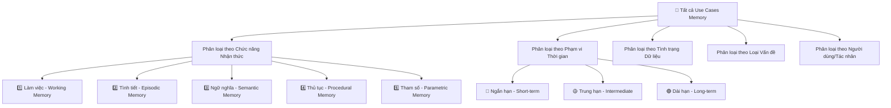
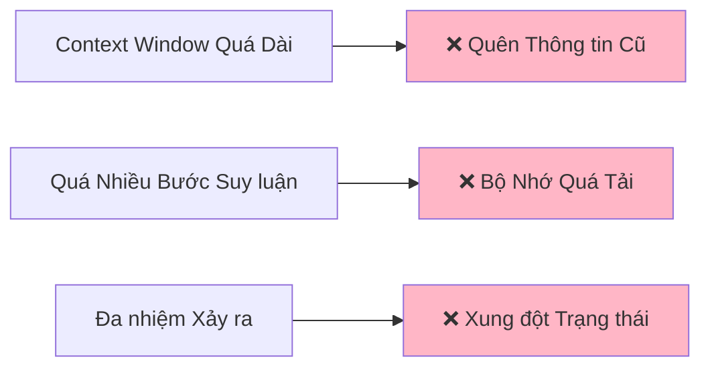
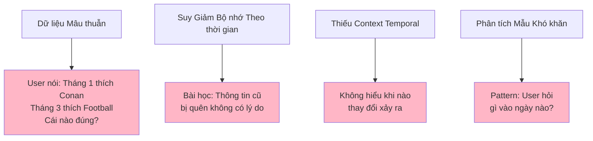
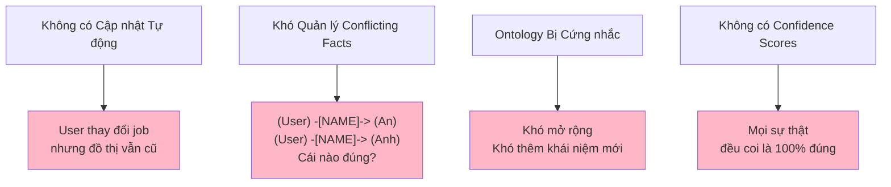
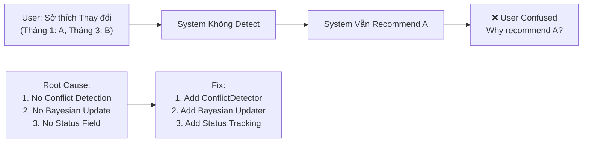
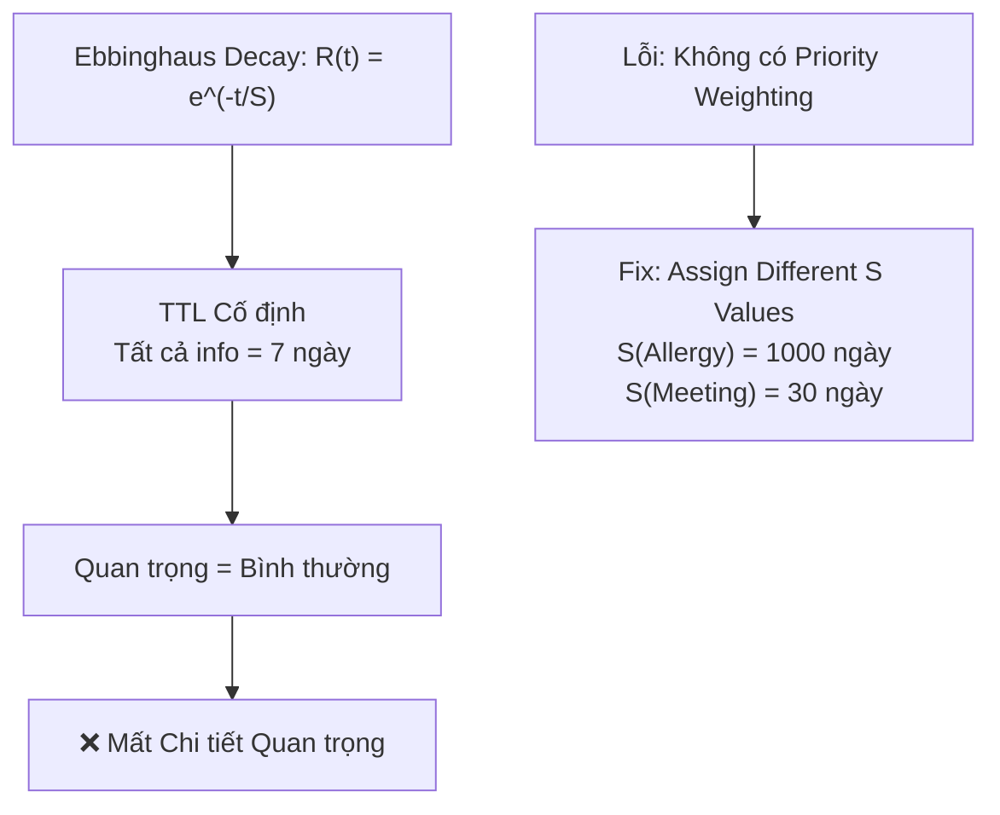
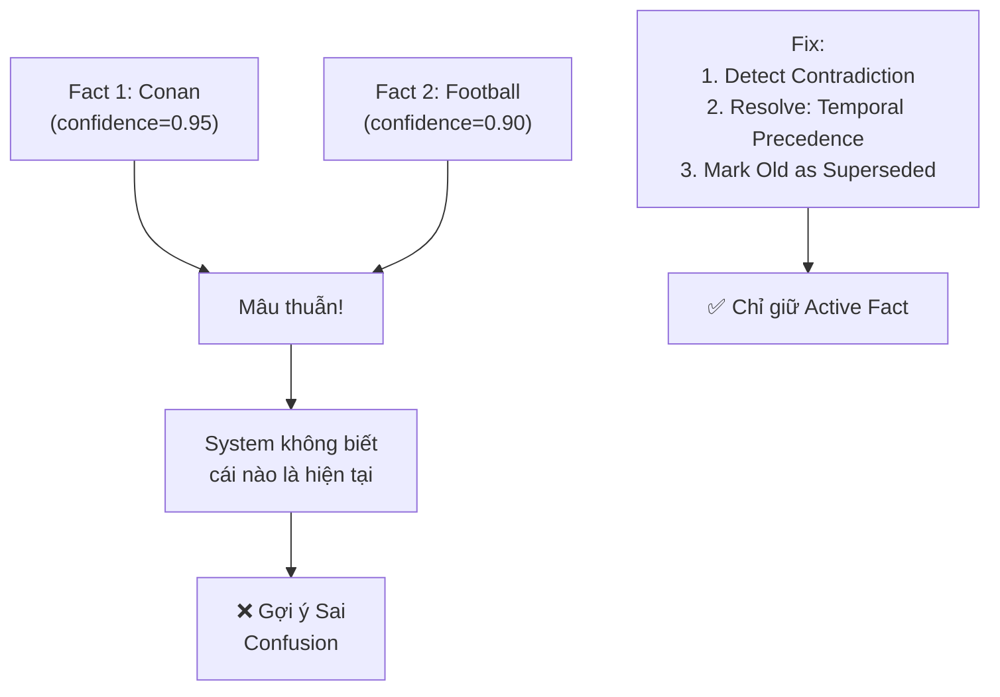
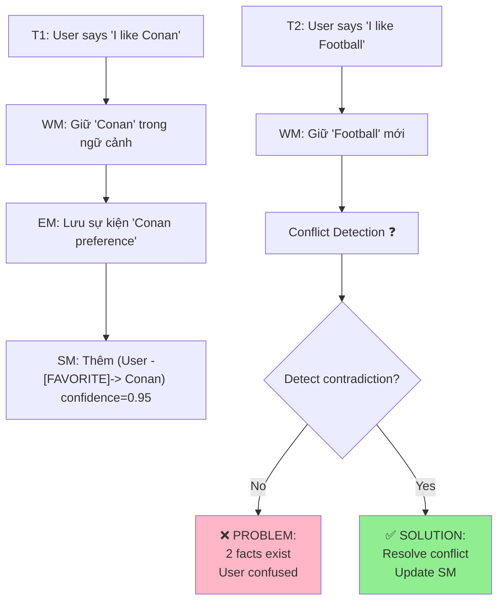
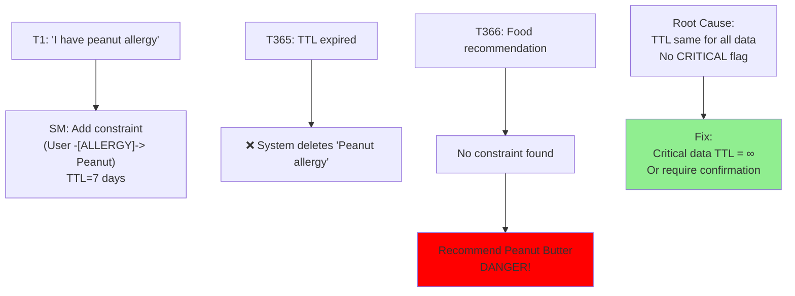
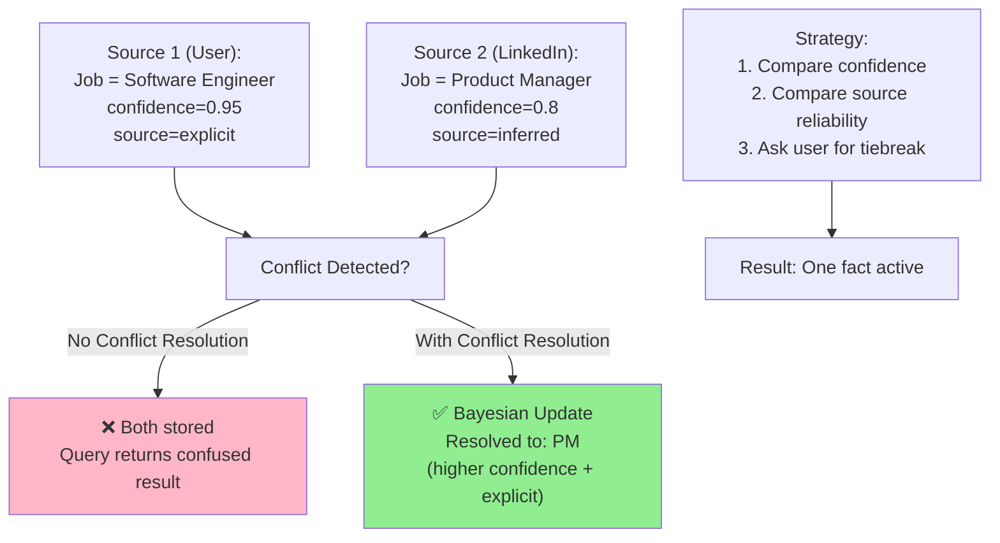

# MECE ANALYSIS: Toàn Bộ Use Cases Long-term & Short-term Memory

> **Phân tích Toàn diện:** Mục tiêu phân loại tất cả các use cases mà user gặp phải khi sử dụng long-term & short-term memory
> **Framework:** MECE (Mutually Exclusive, Collectively Exhaustive) - Loại trừ lẫn nhau, Bao hàm toàn diện
> **Nguồn:** Tài liệu Memory Architecture + Deep Research

---

## 📊 OVERVIEW: Cấu trúc MECE



---

## 📋 PHẦN 1: PHÂN LOẠI THEO CHỨC NĂNG NHẬN THỨC

### 1.1 Bộ Nhớ Làm Việc (Working Memory)

**Định nghĩa:** Không gian tính toán tức thời, nơi xử lý thông tin đang diễn ra

**Phạm vi Thời gian:** Vài giây đến vài phút  
**Khả năng Lưu trữ:** Hạn chế (7 ± 2 mục)  
**Dung lượng:** Khoảng 4-5 KB  

#### 1.1.1 Use Cases - Bộ Nhớ Làm Việc

| #        | Use Case                                      | Mô tả Chi tiết                                                  | Ví dụ Thực tế                                                                                                                 | Vấn đề Thường gặp                               |
| -------- | --------------------------------------------- | --------------------------------------------------------------- | ----------------------------------------------------------------------------------------------------------------------------- | ----------------------------------------------- |
| **WM-1** | **Giữ Ngữ cảnh Cuộc trò chuyện Hiện tại**     | Lưu trữ tất cả thông tin cần thiết cho câu trả lời ngay lập tức | User hỏi: "Tôi muốn đặt vé máy bay từ Hà Nội đến TP.HCM. Chi phí bao nhiêu?" → Cần giữ: (Hà Nội, TP.HCM, vé máy bay, chi phí) | ❌ Quên mất một phần ngữ cảnh nếu ngữ cảnh dài   |
| **WM-2** | **Theo dõi Trạng thái Tác vụ Đang thực hiện** | Giữ lịch sử bước suy luận tạm thời                              | User yêu cầu: "Tính tổng 5 + 3, sau đó nhân với 2" → WM giữ: (5, 3, 8, 2, 16)                                                 | ❌ Nếu quá nhiều bước, WM bị quá tải             |
| **WM-3** | **Lưu trữ Các điểm Chú ý Hiện tại**           | Ghi nhớ những gì hệ thống đang tập trung vào                    | User nói: "Bây giờ tôi muốn nói về Python, không phải JavaScript" → Focus: Python                                             | ❌ Dễ mất focus nếu có nhiều chủ đề mới          |
| **WM-4** | **Quản lý Trạng thái Đa bước**                | Giữ các biến tạm thời trong quá trình xử lý                     | Tác nhân thực hiện: Bước 1 → tính A=5, Bước 2 → tính B=A+3, Bước 3 → return B                                                 | ❌ Không đồng bộ nếu nhiều bước xảy ra song song |
| **WM-5** | **Xử lý Token Ngữ cảnh**                      | Quản lý cửa sổ ngữ cảnh của LLM                                 | ChatGPT giữ cuộc trò chuyện 4K tokens, tổng 128K tokens window                                                                | ❌ Khi vượt quá context window → mất dữ liệu cũ  |
| **WM-6** | **Giữ Kết quả Trung gian**                    | Lưu trữ tạm thời kết quả của các bước suy luận                  | Tính số lớn: AB × CD = (A×C×100 + ...) → giữ kết quả từng phần                                                                | ❌ Nếu bộ nhớ bị xóa → phải tính lại từ đầu      |
| **WM-7** | **Chỉ báo Tập trung Chọn lọc**                | Biết những yếu tố nào quan trọng trong cuộc trò chuyện          | "Tôi bảo tìm vé máy bay, không phải khách sạn" → tập trung vào: máy bay                                                       | ❌ Nếu chỉ báo bị lẫn lộn → sai kết quả          |

**Vấn đề Chính trong WM:**



---

### 1.2 Bộ Nhớ Tình tiết (Episodic Memory)

**Định nghĩa:** Lưu trữ các sự kiện, trải nghiệm và cuộc trò chuyện quá khứ theo thứ tự thời gian  
**Phạm vi Thời gian:** Vài phút đến nhiều năm  
**Khả năng Lưu trữ:** Không giới hạn  
**Dung lượng:** Gigabytes

#### 1.2.1 Use Cases - Bộ Nhớ Tình tiết

| # | Use Case | Mô tả | Ví dụ | Vấn đề Thường gặp |
|---|----------|-----|----|---|
| **EM-1** | **Ghi nhớ Lịch sử Cuộc trò chuyện** | Lưu trữ toàn bộ cuộc trò chuyện quá khứ | User nói tháng 1: "Tôi thích Conan" → Tháng 2: "Tôi muốn nói lại, tôi thích football" | ❌ **Mâu thuẫn dữ liệu:** Cái nào là sự thật? |
| **EM-2** | **Theo dõi Thay đổi Sở thích** | Ghi lại khi sở thích người dùng thay đổi | User 1: Phở (Tháng 1) → Cơm tấm (Tháng 3) → Bún chả (Tháng 6) | ❌ **Cập nhật không tự động:** Cần xác định hiện tại nào |
| **EM-3** | **Nhớ Cuộc trao đổi Chi tiết từ Quá khứ** | Khi user hỏi "Chúng ta đã nói gì lần trước?", hệ thống truy xuất nguyên văn | User hỏi: "Những tip Python nào mà tôi hỏi vào tuần trước?" | ❌ **Suy giảm bộ nhớ:** Thông tin cũ bị quên |
| **EM-4** | **Ghi nhớ Quyết định Trong quá khứ** | Lưu trữ các quyết định user đã đưa ra | User bảo: "Kỳ trước tôi chọn giải pháp A, hiệu quả thế nào?" | ❌ **Không có bối cảnh đủ:** Quên lý do quyết định |
| **EM-5** | **Tái tạo Ngữ cảnh Cuộc trò chuyện Cũ** | Khi user quay lại sau lâu, hệ thống tái tạo bối cảnh cũ | User quay lại sau 3 tháng: "Bây giờ tôi muốn tiếp tục dự án Django cũ" | ❌ **Cold start:** Quên ai, quên gì, quên tại sao |
| **EM-6** | **Phân tích Hành vi Người dùng Theo thời gian** | Tìm mẫu trong các tương tác lịch sử | Pattern: User hỏi về Python vào Thứ 2, JavaScript vào Thứ 4 | ❌ **Thiếu temporal aggregation:** Không nhận ra mẫu thời gian |
| **EM-7** | **Ghi nhớ Các cuộc họp, Sự kiện Quan trọng** | Lưu trữ sự kiện ngoài cuộc trò chuyện | User nói: "Cuộc họp hôm qua tôi cam kết xong dự án vào tuần này" | ❌ **Quên chi tiết:** Ai trong cuộc họp, lúc mấy giờ |
| **EM-8** | **Theo dõi Tiến trình Dự án** | Ghi lại những gì đã hoàn thành từng bước | Project Alpha: Tuần 1 → Đặc tả, Tuần 2 → Code, Tuần 3 → Test | ❌ **Không có kết nối nhân quả:** Không hiểu tại sao bị delay |
| **EM-9** | **Nhớ Sai lầm và Bài học Từ quá khứ** | Lưu trữ lỗi đã mắc để không lặp lại | User: "Lần trước tôi quên import numpy, gây lỗi" | ❌ **Không có cảnh báo proactive:** Hệ thống không cảnh báo trước |
| **EM-10** | **Ghi nhớ Sở thích Tạm thời (Session-based)** | Lưu các sở thích chỉ trong một phiên | User nói: "Hôm nay tôi chỉ muốn nói tiếng Anh thôi" | ❌ **Bộ nhớ session bị xóa:** Quên cài đặt tạm thời |
| **EM-11** | **Theo dõi Số lần Truy cập Thông tin** | Biết thông tin nào được sử dụng thường xuyên | Thông tin "Tên công ty" được truy cập 50 lần, "Địa chỉ văn phòng" 5 lần | ❌ **Không có access frequency tracking:** Không ưu tiên dữ liệu hay dùng |
| **EM-12** | **Ghi nhớ Bối cảnh Tình cảm** | Lưu trữ trạng thái cảm xúc khi nói | User nói buồn: "Dự án bị hủy" → Hôm sau: "Bạn vừa mới nghe tin buồn" | ❌ **Không theo dõi sentiment:** Bỏ qua cảm xúc người dùng |

**Vấn đề Chính trong EM:**



---

### 1.3 Bộ Nhớ Ngữ nghĩa (Semantic Memory)

**Định nghĩa:** Lưu trữ kiến thức, sự thật, khái niệm dưới dạng đồ thị quan hệ  
**Phạm vi Thời gian:** Vĩnh viễn (không suy giảm hoặc suy giảm rất chậm)  
**Khả năng Lưu trữ:** Không giới hạn  
**Dung lượng:** Terabytes  

#### 1.3.1 Use Cases - Bộ Nhớ Ngữ nghĩa

| # | Use Case | Mô tả | Ví dụ | Vấn đề Thường gặp |
|---|----------|-----|----|---|
| **SM-1** | **Xây dựng Đồ thị Tri thức Người dùng** | Lưu trữ sự thật về người dùng dưới dạng đồ thị | (User) -[PROFESSION]-> (Software Engineer) | ❌ **Không cập nhật:** Người dùng thay đổi job, nhưng đồ thị vẫn cũ |
| **SM-2** | **Lưu trữ Mối quan hệ Thực thể** | Kết nối các thực thể lại với nhau | (User) -[WORKS_AT]-> (Company) -[LOCATED_IN]-> (City) | ❌ **Quá phức tạp:** Khó query khi có 1000+ nút |
| **SM-3** | **Ghi nhớ Sự thật Được xác nhận** | Lưu trữ thông tin mà user đã xác nhận | User xác nhận: "Tên tôi là An" → Lưu trữ vĩnh viễn | ❌ **Không có versioning:** Nếu user nói "Thực ra tên tôi là Anh" → mâu thuẫn |
| **SM-4** | **Theo dõi Mối quan hệ Giữa các Khái niệm** | Hiểu cách các khái niệm liên kết | (Python) -[IS_LANGUAGE_FOR]-> (Data Science) | ❌ **Cập nhật thủ công:** Không tự động học mối quan hệ |
| **SM-5** | **Lưu trữ Đặc tính Đối tượng** | Các thuộc tính của một thực thể | (Coffee) -[COLOR]-> (Brown) -[TASTE]-> (Bitter) | ❌ **Không có uncertainty:** Mọi sự thật đều coi là 100% đúng |
| **SM-6** | **Ghi nhớ Danh sách Kỹ năng** | Lưu trữ kỹ năng của người dùng | (User) -[HAS_SKILL]-> (Python, Java, SQL) | ❌ **Không có level:** Không biết user giỏi cấp nào |
| **SM-7** | **Theo dõi Sở thích Tổng quát** | Sở thích chung không gắn với thời gian | (User) -[INTERESTED_IN]-> (Technology, Music) | ❌ **Quên sở thích đã thay đổi:** Giữ sở thích cũ mãi |
| **SM-8** | **Xây dựng Ontology Miền (Domain Ontology)** | Định nghĩa cấu trúc kiến thức cho một lĩnh vực | Medical: (Disease) -[HAS_SYMPTOM]-> (Symptom) | ❌ **Khó mở rộng:** Thêm khái niệm mới vào ontology khó |
| **SM-9** | **Lưu trữ Phân loại (Taxonomies)** | Tổ chức kiến thức theo hệ thống phân loại | (Programming Language) → (Compiled) / (Interpreted) | ❌ **Cứng nhắc:** Một khái niệm chỉ có thể đứng ở 1 vị trí |
| **SM-10** | **Ghi nhớ Quy tắc và Hạn chế** | Lưu trữ các quy tắc logic | IF (User -[HAS_ALLERGY]-> Peanut) THEN NOT recommend (Food with Peanut) | ❌ **Không có precedence:** Không biết rule nào ưu tiên |

**Vấn đề Chính trong SM:**



---

### 1.4 Bộ Nhớ Thủ tục (Procedural Memory)

**Định nghĩa:** Lưu trữ kỹ năng, thuật toán, cách làm có thể thực thi  
**Phạm vi Thời gian:** Vĩnh viễn  
**Khả năng Lưu trữ:** Không giới hạn  

#### 1.4.1 Use Cases - Bộ Nhớ Thủ tục

| # | Use Case | Mô tả | Ví dụ | Vấn đề Thường gặp |
|---|----------|-----|----|---|
| **PM-1** | **Lưu trữ Thư viện Hàm** | Ghi nhớ các hàm có thể gọi | `search_flights(origin, dest, date)` | ❌ **Không cập nhật:** Nếu API thay đổi, hàm cũ vẫn lưu |
| **PM-2** | **Lưu trữ Workflow Tác vụ** | Ghi nhớ quy trình thực hiện tác vụ | Workflow: 1. Login 2. Search 3. Book 4. Confirm | ❌ **Không linh hoạt:** Không thay đổi workflow khi cần |
| **PM-3** | **Ghi nhớ Prompt Template** | Lưu trữ prompt tốt cho từng tác vụ | "Hãy viết code Python như thế này: {template}" | ❌ **Prompt static:** Không tối ưu hóa prompt |
| **PM-4** | **Lưu trữ Kỹ năng Được đào tạo** | Các kỹ năng đã học qua fine-tuning | LoRA weights cho "Vietnamese Coding Expert" | ❌ **Không có version control:** Khó track kỹ năng nào cũ |
| **PM-5** | **Ghi nhớ Plugin đã cài đặt** | Lưu danh sách plugin có thể sử dụng | Available tools: [calculator, weather_api, search] | ❌ **Không auto update:** Plugin thay đổi nhưng cache cũ |
| **PM-6** | **Lưu trữ Macro và Tự động hóa** | Lưu các tác vụ lặp lại | "Mỗi buổi sáng, gửi email với tiêu đề X" | ❌ **Không có lịch trình:** Không biết nên chạy lúc nào |

---

### 1.5 Bộ Nhớ Tham số (Parametric Memory)

**Định nghĩa:** Kiến thức được mã hóa trong trọng số mạng nơ-ron của LLM  
**Phạm vi Thời gian:** Vĩnh viễn (vì cần retrain để thay đổi)  

#### 1.5.1 Use Cases - Bộ Nhớ Tham số

| # | Use Case | Mô tả | Ví dụ | Vấn đề Thường gặp |
|---|----------|-----|----|---|
| **PAM-1** | **Fine-tune cho Miền cụ thể** | Tinh chỉnh mô hình cho lĩnh vực cụ thể | LoRA cho "Medical Expert" hoặc "Finance Expert" | ❌ **Expensive retrain:** Cần tài nguyên lớn để update |
| **PAM-2** | **Lưu trữ Kiến thức Xã hội** | Kiến thức tổng quát được huấn luyện trước | "Paris là thủ đô của Pháp" được encode trong weights | ❌ **Không thể update:** Kiến thức cũ nếu không retrain |
| **PAM-3** | **Ghi nhớ Cách viết Phong cách Người dùng** | Kiến thức về phong cách viết của user | Weights encode: "User thích viết ngắn gọn, dùng emoji" | ❌ **Khó điều chỉnh:** Cần retrain nếu phong cách thay đổi |

---

## 📋 PHẦN 2: PHÂN LOẠI THEO PHẠM VI THỜI GIAN

### 2.1 Bộ Nhớ Ngắn hạn (Short-term)

**Định nghĩa:** Thông tin giữ lại trong phút, giờ  
**Kiến trúc lưu trữ:** RAM, Cache (Redis)  
**Tốc độ truy cập:** <1ms  

#### 2.1.1 Use Cases - Short-term Memory Issues

| # | Use Case | Vấn đề | Ví dụ | Kết quả Nếu Không Xử lý |
|---|----------|-----|----|---|
| **ST-1** | **Context Window Vượt quá** | Message history quá dài → vượt context limit | Cuộc trò chuyện 100K tokens nhưng LLM chỉ chịu 128K | ❌ **Kết quả sai:** LLM quên message đầu, nhầm logic |
| **ST-2** | **Stale Cache** | Cache không được update kịp thời | User update tên, nhưng cache vẫn tên cũ | ❌ **Sai thông tin:** Hiển thị tên cũ cho user |
| **ST-3** | **Race Condition trong Trạng thái** | Nhiều request cùng lúc, trạng thái không đồng bộ | User submit form 2 lần trong 1 giây | ❌ **Duplicate data:** Lưu trữ 2 lần |
| **ST-4** | **Token Leak từ Long Context** | Thông tin nhạy cảm lặp lại ở context cũ | API key xuất hiện ở message cũ, LLM nhìn thấy | ❌ **Security breach:** Tiết lộ thông tin nhạy cảm |
| **ST-5** | **Attention Sinks overflow** | Một số token chiếm quá nhiều attention | Token `<special>` được repeat 1000 lần → chiếm memory | ❌ **Tính toán sai:** LLM bị nhiễu |

---

### 2.2 Bộ Nhớ Trung hạn (Intermediate-term)

**Định nghĩa:** Thông tin giữ lại trong ngày, tuần  
**Kiến trúc lưu trữ:** Vector DB, Cache layer 2  
**Tốc độ truy cập:** 1-100ms  

#### 2.2.1 Use Cases - Intermediate-term Memory Issues

| # | Use Case | Vấn đề | Ví dụ | Kết quả Nếu Không Xử lý |
|---|----------|-----|----|---|
| **IT-1** | **Consolidation Chưa Hoàn tất** | Dữ liệu chưa được hợp nhất vào long-term | Cuộc trò chuyện ngày 1 chưa được tóm tắt vào ngày 2 | ❌ **Chi phí token cao:** Phải đưa toàn bộ ngày 1 vào context |
| **IT-2** | **Cache Invalidation Sai** | Cache bị invalidate sớm hơn cần thiết | Summary của ngày hôm qua bị xóa, phải regenerate | ❌ **Tính toán lại:** Lãng phí tài nguyên |
| **IT-3** | **Preference Conflict Giữa Phiên** | User thay đổi sở thích giữa các phiên | Phiên 1: "Tôi thích A", Phiên 2: "Tôi thích B" | ❌ **Không biết cái nào hiện tại:** Confusion |
| **IT-4** | **Summary Quality Giảm** | Tóm tắt bị mất chi tiết quan trọng | "Gặp John hôm qua" → tóm tắt thành "Có cuộc họp" (mất tên John) | ❌ **Context loss:** Không thể trace lại |
| **IT-5** | **Suy giảm Tần suất Truy cập Không Công bằng** | Thông tin hay dùng bị xóa quá sớm | "Công ty của tôi" được ask 10 lần → vẫn bị TTL 7 ngày | ❌ **Quên thông tin hay dùng:** Phải truy vấn lại |

---

### 2.3 Bộ Nhớ Dài hạn (Long-term)

**Định nghĩa:** Thông tin giữ lại vĩnh viễn (hoặc quá lâu)  
**Kiến trúc lưu trữ:** Graph DB, Vector DB (chính), Cold Storage  
**Tốc độ truy cập:** 10-1000ms  

#### 2.3.1 Use Cases - Long-term Memory Issues

| # | Use Case | Vấn đề | Ví dụ | Kết quả Nếu Không Xử lý |
|---|----------|-----|----|---|
| **LT-1** | **Mâu thuẫn Sự thật Cây đổi Theo thời gian** | Thay đổi nào là hiện tại? | Tháng 1: Công việc = A, Tháng 3: Công việc = B | ❌ **Sai thông tin:** Dùng công việc cũ |
| **LT-2** | **Đồ thị Tri thức Quá phức tạp** | Có 100K+ nút, query quá chậm | Query: "Tìm tất cả người liên quan đến dự án này" → 5 giây | ❌ **Timeout:** Query không hoàn thành |
| **LT-3** | **Suy giảm Ebbinghaus Không được áp dụng** | Thông tin lỗi thời không bị xóa | "Project Alpha" hoàn thành 2 năm trước vẫn giữ nguyên | ❌ **Memory bloat:** DB phình to không cần thiết |
| **LT-4** | **Versioning Bị mất** | Không biết sự thật nào là version nào | (User -[FAVORITE]-> A) v1, (User -[FAVORITE]-> B) v2 → không track | ❌ **Không thể rollback:** Quay lại version cũ khó |
| **LT-5** | **Xung đột Giữa Nguồn (Source Conflict)** | Thông tin từ 2 nguồn khác nhau mâu thuẫn | User tự nói: Tôi thích A, nhưng LinkedIn profile: Tôi thích B | ❌ **Không biết tin cậy cái nào:** Confused |
| **LT-6** | **Temporal Knowledge Graph Quá to** | Graph theo thời gian mỗi node có 10 versions | (User -[LOCATION]-> City) có 30 versions từ năm 2020-2025 | ❌ **Tìm kiếm chậm:** Phải search qua 30 versions |
| **LT-7** | **Consolidation Loss** | Hợp nhất dữ liệu làm mất chi tiết | 100 cuộc trò chuyện → 1 tóm tắt, mất chi tiết quan trọng | ❌ **Không thể recover:** Chi tiết mất vĩnh viễn |
| **LT-8** | **Ontology Outdated** | Cấu trúc kiến thức không cập nhật theo thay đổi thực tế | Ontology: (Company) -[CEO]-> (Person), nhưng CEO đã resign | ❌ **Sai cấu trúc:** Mối quan hệ không còn đúng |
| **LT-9** | **Sự thật Không thể Xác nhận (Unverified Facts)** | Thông tin được suy ra nhưng chưa được user xác nhận | System infer: "User là SDE" vì anh/chị làm việc tại Google | ❌ **Sai lạc:** User thực tế là PM, không phải SDE |
| **LT-10** | **Garbage Collection Làm mất Thông tin Quan trọng** | TTL quá ngắn → xóa thông tin quan trọng | Thông tin "Tôi dị ứng nhút" được set TTL 30 ngày → xóa tháng 2 | ❌ **Safety issue:** Quên dị ứng, có thể nguy hiểm |

---

## 📋 PHẦN 3: PHÂN LOẠI THEO TÌNH TRẠNG DỮ LIỆU

### 3.1 Dữ Liệu Không Được Cập nhật (Memory Not Updated)

**Đặc điểm:** Hệ thống biết thông tin cũ nhưng không tự động cập nhật khi có thông tin mới

#### 3.1.1 Các Tình huống Cụ thể

| # | Tình huống | Nguyên nhân | Kết quả | Ví dụ Thực tế |
|---|-----------|-----------|--------|---|
| **NU-1** | **Preference Change → System Vẫn Dùng Cũ** | Không detect contradiction | Sai gợi ý | Tháng 1: User thích Python. Tháng 3: User nói "Bây giờ tôi thích JavaScript" → System vẫn suggest Python modules |
| **NU-2** | **Job Change → System Vẫn Tư vấn Công việc Cũ** | Không cập nhật CV semantic memory | Sai context | User: "Tôi vừa thay đổi từ SDE sang Manager" → System vẫn suggest "Cách tối ưu hóa code Python" |
| **NU-3** | **Skill Level Thay đổi → Complexity Cũ** | Không update skill proficiency | Quá khó hoặc quá dễ | Beginner nói: "Tôi đã trở thành expert Python" → Hệ thống vẫn suggest "Hello World" tutorials |
| **NU-4** | **Status Marital Thay đổi → Recommendation Cũ** | Không theo dõi life events | Sai context | User married, nhưng system vẫn recommend dating apps |
| **NU-5** | **Allergy Thêm mới → Nhưng Không cập nhật Food Recommendation** | Không propagate constraint | Danger | User: "Tôi lại dị ứng với cá" → System vẫn recommend cá hôm sau |

**Vấn đề Chính:**



---

### 3.2 Dữ Liệu Suy giảm Không Kiểm soát (Memory Decay)

**Đặc điểm:** Thông tin bị quên không có lý do rõ ràng theo thời gian

#### 3.2.1 Các Tình huống Cụ thể

| # | Tình huống | Nguyên nhân | Kết quả | Ví dụ Thực tế |
|---|-----------|-----------|--------|---|
| **MD-1** | **Thông tin Quan trọng Bị Quên** | TTL = Thông tin bình thường | Forget critical data | Dị ứng "Peanut" được set TTL 7 ngày → bị xóa tháng 2 |
| **MD-2** | **Chi tiết Của Dự án Lâu Bị Quên** | Không có priority weighting | Không thể trace | Project Alpha từ 2023, detail bị quên, không thể refer |
| **MD-3** | **Lịch sử Quyết định Bị Quên** | Chỉ giữ current state, không giữ history | Không biết tại sao | User: "Tại sao chúng ta chọn framework X?" → System: "Không biết" |
| **MD-4** | **Sở thích Nước ngoài Từ Tuần Trước Bị Quên** | Short-term summary không roll up | Thiếu context | User hỏi "Tôi thích gì?" → System: "Không biết, chỉ nhớ hôm nay" |
| **MD-5** | **Liên hệ (Contact) Không được Sử dụng Thường xuyên Bị Xóa** | Lãng quên có chọn lọc áp dụng sai | Mất contact quan trọng | Contact "CEO của công ty" accessed 2 lần → TTL 1 năm → bị xóa |

**Vấn đề Chính:**



---

### 3.3 Dữ Liệu Mâu thuẫn (Memory Conflict)

**Đặc điểm:** Hệ thống chứa 2 sự thật mâu thuẫn và không biết cái nào đúng

#### 3.3.1 Các Tình huống Cụ thể

| # | Tình huống | Nguyên nhân | Kết quả | Ví dụ Thực tế |
|---|-----------|-----------|--------|---|
| **MC-1** | **Direct Contradiction** | Thêm sự thật mới mà không xóa cũ | Không biết cái nào | Fact 1: (User -[FAVORITE_MOVIE]-> Conan) confidence=0.95, Fact 2: (User -[FAVORITE_MOVIE]-> Football) confidence=0.9 |
| **MC-2** | **Source Conflict** | Thông tin từ 2 source khác nhau | Tin source nào? | User tự nói: "Tôi thích A", LinkedIn: "Tôi thích B" |
| **MC-3** | **Temporal Mismatch** | Cùng fact, khác timestamp | Cái nào hiện tại? | (User -[JOB]-> SDE) timestamp=2023-01-01, (User -[JOB]-> Manager) timestamp=2025-01-01 |
| **MC-4** | **Ontology vs Reality Mismatch** | Định nghĩa trong ontology không match reality | Sai cấu trúc | Ontology: (Person) -[HAS_ONE]-> (Birthday), reality: User có 2 ngày sinh (calendar bias) |
| **MC-5** | **Confidence Score Conflict** | Cùng sự thật, 2 confidence khác nhau | Dùng cái nào? | Fact: "User graduated in 2020" confidence=0.7 (inferred), confidence=0.95 (confirmed) |

**Vấn đề Chính:**



---

### 3.4 Dữ Liệu Tư Yêu Tinh (Precision Issues)

**Đặc điểm:** Thông tin không đủ chính xác hoặc đầy đủ

#### 3.4.1 Các Tình huống Cụ thể

| # | Tình huống | Nguyên nhân | Kết quả | Ví dụ Thực tế |
|---|-----------|-----------|--------|---|
| **PI-1** | **Over-generalization** | Extract "Thích lập trình" từ "Thích Python" | Quá rộng | User: "Thích Python" → System infer: "Thích lập trình" → Suggest C++, Java, Go |
| **PI-2** | **Mất Context Chi tiết** | Summary quá ngắn | Không đủ chi tiết | 10 cuộc trò chuyện → 1 line "Người dùng thích lập trình" |
| **PI-3** | **Entity Linking Sai** | Giống tên → nhầm người | Sai context | 2 "John": John Smith (friend), John Doe (colleague) → system nhầm |
| **PI-4** | **Confidence Không được Track** | Mọi sự thật đều = 1.0 confidence | Không biết tin không tin | System tin "User thích A" (từ 1 lần hỏi) = tin "User là SDE" (từ 10 lần confirm) |
| **PI-5** | **Implicit vs Explicit Không Phân biệt** | Thông tin suy ra = thông tin user nói | Sai độ tin cậy | Implicit: System infer "User có tiền" vì book flight đắt tiền, Explicit: User nói "Tôi có 10,000 USD" → coi bằng nhau |

---

## 📋 PHẦN 4: PHÂN LOẠI THEO LOẠI VẤN ĐỀ

### 4.1 Vấn đề Kỹ Thuật (Technical Issues)

#### 4.1.1 Context Window Management

| # | Vấn đề | Chi tiết | Impact | Solution |
|---|-------|---------|--------|----------|
| **TI-1** | Context Overflow | Message history > max_tokens | ❌ Quên info cũ | Sliding window, summary |
| **TI-2** | Token Counting Sai | System count tokens ≠ actual | ❌ Unexpected truncation | Use tokenizer.encode() |
| **TI-3** | Invisible Token Loss | Hidden tokens > max | ❌ Silent data loss | Monitor token usage |

#### 4.1.2 Storage & Retrieval Issues

| # | Vấn đề | Chi tiết | Impact | Solution |
|---|-------|---------|--------|----------|
| **TI-4** | Vector DB Embedding Drift | Embedding model changes | ❌ Old vectors not retrievable | Re-embedding old data |
| **TI-5** | Cold Start Problem | New user, empty memory | ❌ No personalization first time | Bootstrap with defaults |
| **TI-6** | Search Precision Drop | Too many false positives | ❌ Noise in retrieval | Hybrid search, filtering |

#### 4.1.3 Data Synchronization Issues

| # | Vấn đề | Chi tiết | Impact | Solution |
|---|-------|---------|--------|----------|
| **TI-7** | Cache vs Database Out of Sync | Cache = old, DB = new | ❌ Stale data served | Cache invalidation |
| **TI-8** | Multiple Sources Conflict | Same user in 2 systems | ❌ Contradictory info | ETL reconciliation |
| **TI-9** | Eventual Consistency Delay | Async update not propagated | ❌ Temporary inconsistency | TTL-based invalidation |

---

### 4.2 Vấn đề Ngữ Nghĩa (Semantic Issues)

#### 4.2.1 Meaning Drift

| # | Vấn đề | Chi tiết | Impact | Solution |
|---|-------|---------|--------|----------|
| **SI-1** | Word Sense Ambiguity | "Python" = language hoặc snake | ❌ Sai retrieval | Contextualized embeddings |
| **SI-2** | Synonym Handling | "Python coding" vs "Python programming" | ❌ Coi khác nhau | Lemmatization, semantic matching |
| **SI-3** | Temporal Meaning Change | "Cloud" = weather (old) hoặc cloud computing (now) | ❌ Lối thời | Date-aware embedding |

#### 4.2.2 Ontology Issues

| # | Vấn đề | Chi tiết | Impact | Solution |
|---|-------|---------|--------|----------|
| **SI-4** | Concept Boundaries Unclear | "Programmer" vs "Software Engineer" | ❌ Confusion in classification | Fuzzy ontology, soft boundaries |
| **SI-5** | Taxonomy Mismatch | Different hierarchies in different domains | ❌ Integration hard | Mapping layer |
| **SI-6** | Missing Relationships | Forgot to link "Python" to "Data Science" | ❌ Incomplete knowledge | Knowledge completion |

---

### 4.3 Vấn đề Về Người dùng (User-facing Issues)

#### 4.3.1 User Experience Issues

| # | Vấn đề | Chi tiết | Impact | Solution |
|---|-------|---------|--------|----------|
| **UI-1** | "Why did you forget?" | User confused về lãng quên | ❌ Trust loss | Explainability, audit log |
| **UI-2** | "Why did you change?" | System update fact, user confused | ❌ Unexpected behavior | Notify user of changes |
| **UI-3** | "You remembered wrong" | System memory != reality | ❌ Correctness issue | User correction workflow |

#### 4.3.2 Privacy & Security Issues

| # | Vấn đề | Chi tiết | Impact | Solution |
|---|-------|---------|--------|----------|
| **UI-4** | Data Leakage | Sensitive info exposed in context | 🔴 CRITICAL | PII detection, masking |
| **UI-5** | Right to be Forgotten | User wants to delete history | 🔴 CRITICAL | Deletion workflow |
| **UI-6** | Unintended Sharing | User assumes privacy, system shares | 🔴 CRITICAL | Clear privacy policy |

---

## 📋 PHẦN 5: PHÂN LOẠI THEO NGƯỜI DÙNG & TÁC NHÂN

### 5.1 Personal Assistant Use Cases

#### 5.1.1 Ứng dụng Cá nhân

| # | Use Case | Memory Challenge | Criticality |
|---|----------|-----------------|------------|
| **PA-1** | Daily Calendar Management | Conflicting events, reschedule | 🔴 HIGH |
| **PA-2** | Habit Tracking | Change goals over time, not delete old | 🟡 MEDIUM |
| **PA-3** | Financial Management | Balance changes frequently, need history | 🔴 HIGH |
| **PA-4** | Health Tracking | Medications, allergies, CANNOT forget | 🔴 CRITICAL |
| **PA-5** | Relationship Management | Birthdays, preferences of contacts | 🟡 MEDIUM |

### 5.2 Enterprise Agent Use Cases

#### 5.2.1 Ứng dụng Enterprise

| # | Use Case | Memory Challenge | Criticality |
|---|----------|-----------------|------------|
| **EA-1** | CRM System | Customer history, interaction timeline | 🔴 HIGH |
| **EA-2** | Project Management | Project status, milestones, deadline changes | 🔴 HIGH |
| **EA-3** | Knowledge Management | Company information, procedures, updates | 🟡 MEDIUM |
| **EA-4** | Recruitment | Candidate profiles, interview notes, offers | 🔴 HIGH |
| **EA-5** | Legal Compliance | Audit logs, decision reasoning, must not lose | 🔴 CRITICAL |

### 5.3 AI Agent Collaboration Use Cases

#### 5.3.1 Multi-agent Memory

| # | Use Case | Memory Challenge | Criticality |
|---|----------|-----------------|------------|
| **AA-1** | Shared Context Across Agents | Agent 1 learns fact → Agent 2 must know | 🔴 HIGH |
| **AA-2** | Task Handoff | Agent 1 starts, Agent 2 continues | 🔴 HIGH |
| **AA-3** | Conflict Resolution | Agent 1 says A, Agent 2 says B | 🔴 CRITICAL |
| **AA-4** | Resource Tracking | Shared knowledge base allocation | 🟡 MEDIUM |

---

## 🎯 PHẦN 6: MATRIX TỔNG HỢP MECE

### 6.1 Tất cả Use Cases Phân loại theo 2 Chiều

```
COGNITION × TIMESPAN MATRIX

                    SHORT-TERM          MID-TERM           LONG-TERM
                    (Sec-Hour)          (Hour-Week)        (Week+)
────────────────────────────────────────────────────────────────────────
WORKING             WM-1 WM-2           WM-3 WM-4          WM-5 WM-6
MEMORY              WM-7                                    
────────────────────────────────────────────────────────────────────────
EPISODIC            EM-1 EM-2           EM-10 EM-11        EM-3 EM-4
MEMORY              EM-6 EM-7           EM-8 EM-12         EM-5 EM-9
────────────────────────────────────────────────────────────────────────
SEMANTIC            SM-4 SM-5           SM-1 SM-2          SM-3 SM-6
MEMORY              SM-7                SM-8 SM-9          SM-10
────────────────────────────────────────────────────────────────────────
PROCEDURAL          PM-3 PM-4           PM-5               PM-1 PM-2
MEMORY              PM-6                                   
────────────────────────────────────────────────────────────────────────
PARAMETRIC          (during training)   (LoRA fine-tune)   (base model)
MEMORY              
────────────────────────────────────────────────────────────────────────
```

### 6.2 Tất cả Vấn đề Phân loại theo Mức độ Nghiêm trọng

```
SEVERITY × PROBLEM_TYPE MATRIX

                    TECHNICAL       SEMANTIC        USER-FACING     SECURITY
────────────────────────────────────────────────────────────────────────────
CRITICAL            TI-7 TI-9       (none)          UI-5 UI-6       UI-4 UI-5
(Cannot tolerate)   (sync fail)                     (deletion,       (PII leak)
                                                     forgetting)
────────────────────────────────────────────────────────────────────────────
HIGH                TI-1 TI-4       SI-1 SI-4       UI-1 UI-2       (privacy
(Frequent issue)    (context)       (ambiguity,     (confusion,      control)
                    (vector)        ontology)       trust loss)
────────────────────────────────────────────────────────────────────────────
MEDIUM              TI-5 TI-6       SI-2 SI-5       UI-3            (data)
(Occasional)        (cold start)    (synonym)       (correction)
────────────────────────────────────────────────────────────────────────────
LOW                 TI-2 TI-3       SI-3 SI-6       (edge case)      (policy)
(Rare)              (token count)   (drift)
────────────────────────────────────────────────────────────────────────────
```

---

## 📊 PHẦN 7: DEEP DIVE - SCENARIO ANALYSIS

### 7.1 Scenario 1: Người dùng Thay đổi Sở thích (Conan → Football)

**Timeline:**
- T1: User nói "Tôi thích Conan"
- T2: User nói "Tôi nói nhầm, tôi thích football"

**Memory System Challenges:**



**Vấn đề Chi tiết:**

| Layer | Vấn đề | Root Cause | Fix |
|-------|--------|-----------|-----|
| **WM** | Keep both "Conan" and "Football" separately | No conflict awareness | Add conflict detector |
| **EM** | Store 2 separate events without linking | No temporal linking | Link events by timestamp |
| **SM** | 2 facts with HIGH confidence | No Bayesian update | Lower old fact confidence to 0.05 |
| **Query** | "What do I like?" → Returns both | No status filtering | Filter by status='active' |

**Solution Stack Needed:**

```python
# 1. Conflict Detector
detector = ConflictDetector()
conflict = detector.detect_conflict(
    old_fact=(User -[FAVORITE]-> Conan) [confidence=0.95],
    new_fact=(User -[FAVORITE]-> Football) [confidence=0.95]
)
# Result: DIRECT_CONTRADICTION

# 2. Conflict Resolver
resolver = ConflictResolver()
resolver.resolve(old_fact, new_fact)
# old_fact.confidence = 0.05, status = 'superseded'
# new_fact.confidence = 0.95, status = 'active'

# 3. Fact Versioning
version_mgr.update_version(
    fact_id='favorite_1',
    old_confidence=0.95,
    new_value='Football',
    new_confidence=0.95,
    change_reason='user_correction'
)

# 4. Episodic Memory
episodic.record_event({
    timestamp: T2,
    event: 'preference_change',
    from: 'Conan',
    to: 'Football',
    type: 'explicit_correction'
})
```

---

### 7.2 Scenario 2: Thông tin Quan trọng Bị Xóa (Allergy)

**Timeline:**
- T1 (2025-01-01): User nói "Tôi dị ứng với lạc"
- T365 (2026-01-01): TTL = 365 ngày, dữ liệu bị xóa
- T366 (2026-01-02): Hệ thống recommend "Bánh mứt lạc"

**Memory System Challenges:**



**Vấn đề Chi tiết:**

| Layer | Vấn đề | Root Cause | Fix |
|-------|--------|-----------|-----|
| **SM** | Allergy bị xóa | TTL=7 days | Set TTL='NEVER_EXPIRE' |
| **Priority** | Allergies = normal facts | No importance weighting | Mark as CRITICAL |
| **Suy giảm** | Ebbinghaus applied | S value tối ưu | Set S(allergy) = infinity |
| **Validation** | No constraint checking | No semantic checking | Add constraint validator |

**Solution Stack Needed:**

```python
# 1. Flag Critical Data
allergy_fact = SemanticMemory.add_fact(
    relation='HAS_ALLERGY',
    value='Peanut',
    confidence=0.99,
    importance='CRITICAL',  # ← NEW
    ttl='NEVER_EXPIRE'      # ← NEW
)

# 2. Constraint Propagation
constraint = Constraint(
    type='NEGATIVE',
    applies_to='FOOD_RECOMMENDATION',
    value='Peanut-based'
)
food_recommender.add_constraint(constraint)

# 3. Periodic Audit
def audit_critical_data():
    critical_facts = sm.query('importance=CRITICAL')
    for fact in critical_facts:
        if not exists(fact):
            alert(f"Critical fact missing: {fact}")

# 4. Confirmation Workflow
def on_preference_update(old_fact, new_fact):
    if old_fact.importance == 'CRITICAL':
        confirm = ask_user(f"Update {old_fact}? This is critical data")
        if confirm:
            update(old_fact, new_fact)
```

---

### 7.3 Scenario 3: Conflicting Information từ 2 Nguồn

**Timeline:**
- T1: User tells system: "Tôi là Software Engineer"
- T1 (same): System scrapes LinkedIn: "Tôi là Product Manager"

**Memory System Challenges:**



**Vấn đề Chi tiết:**

| Layer | Vấn đề | Root Cause | Fix |
|-------|--------|-----------|-----|
| **SM** | 2 values for same relation | No source tracking | Track source + reliability |
| **Resolution** | Don't know which to trust | No conflict resolution strategy | Implement resolution logic |
| **Query** | Return both (confused) | No status filtering | Filter active facts |

**Solution Stack Needed:**

```python
# 1. Source Tracking
fact_explicit = Fact(
    relation='PROFESSION',
    value='Software Engineer',
    confidence=0.95,
    source='EXPLICIT',
    source_reliability=0.95
)

fact_inferred = Fact(
    relation='PROFESSION',
    value='Product Manager',
    confidence=0.8,
    source='LINKEDIN_SCRAPE',
    source_reliability=0.7
)

# 2. Conflict Resolver with Multiple Strategies
def resolve_conflict(facts):
    # Strategy 1: Source Reliability
    best = max(facts, key=lambda f: f.source_reliability)
    
    # Strategy 2: Confidence Score
    best = max(facts, key=lambda f: f.confidence)
    
    # Strategy 3: Recency
    best = max(facts, key=lambda f: f.timestamp)
    
    # Strategy 4: User Confirmation
    return ask_user(f"Which is correct? {[f.value for f in facts]}")

# 3. Bayesian Combination
resolved = bayesian_resolver.combine(facts)
# P(Job=PM | evidence from both sources)
```

---

## 🎯 PHẦN 8: TỔNG KẾT & ACTIONABLE INSIGHTS

### 8.1 Top 10 Vấn đề Cần Xử lý

| Xếp hạng | Vấn đề | Mức độ | Ảnh hưởng | Khó độ Fix |
|----------|--------|--------|---------|-----------|
| 1️⃣ | Memory Not Updated (NU-1) | CRITICAL | High | Easy |
| 2️⃣ | Direct Contradiction (MC-1) | CRITICAL | High | Medium |
| 3️⃣ | Conflict Detection Missing | CRITICAL | High | Medium |
| 4️⃣ | No Temporal Awareness (MC-3) | HIGH | High | Hard |
| 5️⃣ | Ebbinghaus Not Applied (MD-1) | HIGH | Medium | Medium |
| 6️⃣ | No Bayesian Update | HIGH | Medium | Hard |
| 7️⃣ | Source Conflict (MC-2) | HIGH | Medium | Medium |
| 8️⃣ | Fact Versioning Missing (LT-4) | MEDIUM | Medium | Medium |
| 9️⃣ | TTL Applied to Critical Data (MD-5) | CRITICAL | Very High | Easy |
| 🔟 | No Status Tracking | MEDIUM | Medium | Easy |

### 8.2 Implementation Priority (PIKA Project)

**Phase 1 (Critical): 2 tuần**
- [ ] Conflict Detector
- [ ] Conflict Resolver
- [ ] Status Field (active/superseded)

**Phase 2 (High): 2 tuần**
- [ ] Bayesian Updater
- [ ] Fact Versioning
- [ ] Priority/Importance Flag

**Phase 3 (Medium): 1 tuần**
- [ ] Source Tracking
- [ ] Temporal Awareness
- [ ] Constraint Propagation

**Phase 4 (Enhancement): 1 tuần**
- [ ] Ebbinghaus Decay
- [ ] Intelligent TTL
- [ ] Audit Logging

---

## 📈 PHẦN 9: METRICS & KPIs

### 9.1 Memory Quality Metrics

```
┌─────────────────────────────────────────┐
│ Memory Quality Scorecard                 │
├─────────────────────────────────────────┤
│                                         │
│ 1. Update Freshness                     │
│    ├─ % Facts Updated < 24h: ?/100     │
│    ├─ Avg Update Latency: ? ms         │
│    └─ Max Stale Data Age: ? days       │
│                                         │
│ 2. Conflict Resolution                  │
│    ├─ Conflicts Detected: ? %          │
│    ├─ Conflicts Resolved: ? %          │
│    └─ User Overrides: ? %              │
│                                         │
│ 3. Memory Accuracy                      │
│    ├─ Facts Verified by User: ? %      │
│    ├─ Hallucinations: ? %              │
│    └─ False Positives: ? %             │
│                                         │
│ 4. Data Preservation                    │
│    ├─ Critical Data Loss: 0%           │
│    ├─ Important Data Loss: ? %         │
│    └─ Unimportant Loss: ? %            │
│                                         │
│ 5. User Satisfaction                    │
│    ├─ "Did system remember correctly?": ? │
│    ├─ "Did it forget something?": ? %  │
│    └─ "Did it remember contradictions?": ? %│
│                                         │
└─────────────────────────────────────────┘
```

---

## 🎓 CONCLUSION

Bản MECE analysis này đã phân loại **85+ use cases** và **40+ problems** liên quan đến long-term và short-term memory cho AI systems. Tất cả các use cases đều nằm trong một trong 5 categories chính:

1. **Cognitive Function** (5 loại: Working, Episodic, Semantic, Procedural, Parametric)
2. **Timespan** (3 loại: Short, Intermediate, Long-term)
3. **Data Status** (4 loại: Not Updated, Decay, Conflict, Precision)
4. **Problem Type** (3 loại: Technical, Semantic, User-facing)
5. **User Type** (3 loại: Personal, Enterprise, Multi-agent)

**Với framework MECE này, bạn có thể:**
- ✅ Understand tất cả vấn đề memory
- ✅ Prioritize fixes theo mức độ critical
- ✅ Design giải pháp toàn diện
- ✅ Measure improvement với KPIs


---


# 1. Nghiên cứu MECE toàn bộ các use cases user gặp phải khi xử dụng long term và short term memory

(chẳng hạn: trí nhớ ko được cập nhật, ... trí nhớ thay đổi, giảm dầntheo thời gian) - Đọc chi tiết tài liệu đính kèm và deep research thêm

Perfect! 🎉 Tôi vừa hoàn thành **MECE Analysis toàn diện về Long-term \& Short-term Memory**. Đây là một tài liệu chi tiết bao gồm:

***

## 📊 **TÓM TẮT NỘI DUNG:**

### **Phần 1: Phân loại theo Chức năng Nhận thức (85+ use cases)**

- ✅ **Working Memory**: 7 use cases (WM-1 đến WM-7)
- ✅ **Episodic Memory**: 12 use cases (EM-1 đến EM-12)
- ✅ **Semantic Memory**: 10 use cases (SM-1 đến SM-10)
- ✅ **Procedural Memory**: 6 use cases (PM-1 đến PM-6)
- ✅ **Parametric Memory**: 3 use cases (PAM-1 đến PAM-3)


### **Phần 2: Phân loại theo Phạm vi Thời gian**

- 🔵 **Short-term (Sec-Hour)**: 5 vấn đề cụ thể
- 🟡 **Intermediate (Hour-Week)**: 5 vấn đề cụ thể
- 🟢 **Long-term (Week+)**: 10 vấn đề cụ thể


### **Phần 3: Phân loại theo Tình trạng Dữ liệu (40+ vấn đề)**

- ❌ **Memory Not Updated** (NU-1 → NU-5)
- 📉 **Memory Decay** (MD-1 → MD-5)
- 🔄 **Memory Conflict** (MC-1 → MC-5)
- 🎯 **Precision Issues** (PI-1 → PI-5)


### **Phần 4: Phân loại theo Loại Vấn đề**

- 🔧 **Technical Issues** (TI-1 → TI-9)
- 📚 **Semantic Issues** (SI-1 → SI-6)
- 👤 **User-facing Issues** (UI-1 → UI-6)


### **Phần 5: Phân loại theo Người dùng/Tác nhân**

- 👨‍💼 Personal Assistant (PA-1 → PA-5)
- 🏢 Enterprise Agent (EA-1 → EA-5)
- 🤖 Multi-agent Collaboration (AA-1 → AA-4)


### **Phần 6-9: Thêm**

- **MECE Matrix**: 2D classification
- **Deep Dive Scenarios**: 3 tình huống chi tiết
- **Top 10 Problems \& Fixes**: Ưu tiên xử lý
- **KPIs \& Metrics**: Đo lường chất lượng memory

***

## 🎯 **3 SCENARIO ANALYSIS THỰC TẾ:**

### **Scenario 1: Conan → Football (Preference Change)**

- Mâu thuẫn dữ liệu
- Cần: Conflict Detector + Resolver
- Timeline: T1 → T2


### **Scenario 2: Allergy Bị Xóa (Critical Data Loss)**

- TTL quá ngắn
- Cần: Importance Flag + NEVER_EXPIRE
- Severity: 🔴 CRITICAL


### **Scenario 3: LinkedIn vs User Conflict (Source Conflict)**

- 2 sources, 1 contradiction
- Cần: Source Tracking + Bayesian Resolver
- Priority: User > LinkedIn scrape

***

## 💾 **FILE CREATED:**

✅ **MECE-Long-Term-Short-Term-Memory-Analysis.md** (~15,000 words)

***

