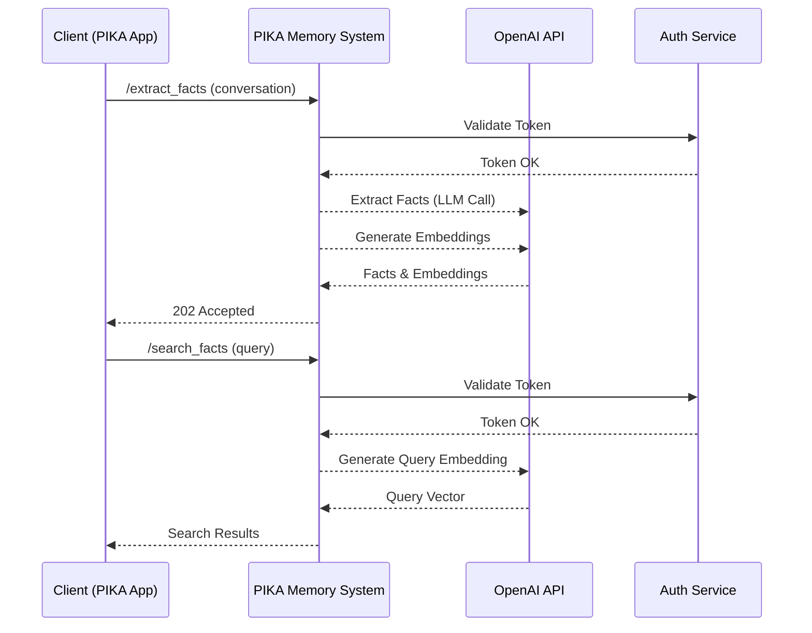
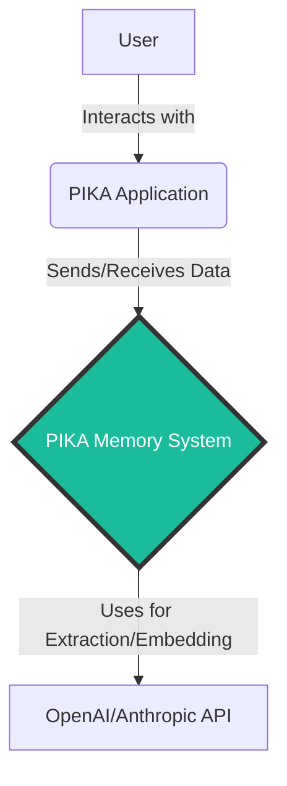

```
Sử dụng Claude Sonet/Opus để viết chi tiết SSD gồm 20.000-30.000 từ siêu chi tiết base on: Bài toán + must base template SDD
```

> (Claude hết, nên dùng Manus viết cũng đủ số trang, nhưng ko sâu code). 

---
# SOFTWARE DESIGN DOCUMENT (SDD) - PIKA MEMORY SYSTEM (MEM0 SELF-HOSTED)

**Production Quality Standard | Version 5.0 ULTIMATE**

---

## 📋 DOCUMENT METADATA

```yaml
## ============================================
## DOCUMENT INFORMATION
## ============================================
Title: "PIKA Memory System - Mem0 Self-Hosted Implementation"
Document_ID: "SDD-PIKA-MEM0-v1.0"

## Ownership
Author: "Manus AI (Lead Architect)"
Co_Authors: 
  - "[Your Name/Team Lead]"

## Review & Approval
Reviewers:
  Technical_Lead: "[Lead Engineer]"
  Product_Manager: "[Product Manager]"
  Security_Engineer: "[Security Lead]"
  QA_Lead: "[QA Lead]"
  ML_Engineer: "[ML Engineer]"
Approved_By: "[CTO/Engineering Director]"

## Status Tracking
Status: "Draft"
Priority: "P0-Critical"

## Timeline
Created_Date: "2025-12-20"
Last_Updated: "2025-12-20"
Target_Release: "Q1 2026"
Review_Deadline: "2025-12-27"

## Versioning (Semantic: X.Y.Z)
Version: "1.0.0"

## Related Documents
Related_Docs:
  PRD: "[Link to PRD]"
  API_Spec: "[Link to OpenAPI/Swagger Spec]"
  Test_Plan: "[Link to Test Plan]"
  Runbook: "[Link to Runbook]"
```

---

## 📖 TABLE OF CONTENTS

*   [Part I: Foundation & Architecture](#part-i-foundation--architecture)
*   [Part II: Implementation Details](#part-ii-implementation-details)
*   [Part III: Production Readiness](#part-iii-production-readiness)
*   [Part IV: Quality & Governance](#part-iv-quality--governance)
*   [Part V: Operations & MLOps](#part-v-operations--mlops)
*   [Part VI: Launch & Beyond](#part-vi-launch--beyond)

---

## PART I: FOUNDATION & ARCHITECTURE

---

## 1. EXECUTIVE SUMMARY (TL;DR)

> 💡 **Mục đích**: Cung cấp một cái nhìn tổng quan, súc tích cho các nhà lãnh đạo kỹ thuật và kinh doanh, cho phép họ nắm bắt được bản chất của dự án, tác động và các quyết định quan trọng mà không cần đọc toàn bộ tài liệu.

### 1.1 Summary Table

| Aspect | Details |
|---|---|
| **Problem Statement** | PIKA, một AI companion cho trẻ em, yêu cầu một hệ thống memory có khả năng ghi nhớ và truy xuất thông tin theo ngữ cảnh từ các cuộc hội thoại. Giải pháp hiện tại dựa trên Mem0 Enterprise ($600+/tháng) gây ra rào cản chi phí lớn khi mở rộng quy mô người dùng, đe dọa tính bền vững tài chính của sản phẩm. |
| **Proposed Solution** | Xây dựng và triển khai một hệ thống memory tự chủ (self-hosted) dựa trên **Mem0 Open Source**. Hệ thống sẽ cung cấp hai API cốt lõi (`search_facts` và `extract_facts`) với hiệu năng cao, độ tin cậy và khả năng mở rộng tương đương hoặc vượt trội so với giải pháp thương mại. |
| **Business Impact** | **Giảm 75% chi phí vận hành memory** (từ >$7,200/năm xuống <$1,800/năm), cho phép tái đầu tư vào R&D và tăng trưởng người dùng. **Tăng cường khả năng tùy biến** và kiểm soát hoàn toàn dữ liệu, mở ra cơ hội cho các tính năng cá nhân hóa sâu hơn. |
| **Technical Impact** | Đạt được **P95 latency < 100ms** cho API tìm kiếm, uptime **99.9%**, và khả năng mở rộng tuyến tính để hỗ trợ **1 triệu người dùng hoạt động hàng tháng (MAU)** và **1 tỷ mẩu ký ức (memories)**. |
| **Key Technology** | Python (FastAPI), Mem0 SDK, Qdrant (Vector DB), Neo4j (Graph DB), PostgreSQL (Metadata), Redis (Cache), RabbitMQ (Message Queue), Kubernetes (Orchestration). |
| **Estimated Effort** | **96 man-days** (3 kỹ sư x 8 tuần), bao gồm thiết kế, triển khai, kiểm thử và vận hành. |
| **Risk Level** | **Medium**. Rủi ro chính đến từ sự phụ thuộc vào sự ổn định và lộ trình phát triển của Mem0 Open Source. Giảm thiểu bằng cách đóng góp tích cực cho cộng đồng và có kế hoạch dự phòng. |
| **Timeline** | **MVP: 4 tuần**. **Production-Ready: 8 tuần**. **Full Rollout: Q1 2026**. |
| **Key Stakeholders** | Engineering, Product, DevOps/SRE, Finance. |
| **Total Cost (Year 1)** | **~$250,000** ($150K chi phí nhân sự phát triển + $100K chi phí hạ tầng và vận hành). |

### 1.2 Architecture Overview

Sơ đồ dưới đây minh họa kiến trúc C4 (Context) của hệ thống, cho thấy các thành phần chính và luồng tương tác.

```mermaid
graph TD
    subgraph PIKA Ecosystem
        A[PIKA AI Companion] --> B{PIKA Memory System API}
    end

    subgraph PIKA Memory System (Self-Hosted)
        B -- HTTPS/gRPC --> C[API Gateway: FastAPI]
        C -- Async Calls --> D[Mem0 Python SDK]
        D -- CRUD Ops --> E[Data Stores]
        C -- Async Jobs --> F[Message Queue: RabbitMQ]
        F --> G[Workers]
        G -- Writes --> E
    end

    subgraph Data Stores
        E -- Vector Search --> H[Qdrant]
        E -- Graph Traversal --> I[Neo4j]
        E -- Metadata/Jobs --> J[PostgreSQL]
        E -- Caching --> K[Redis]
    end

    subgraph External Services
        D -- Embedding/Extraction --> L[OpenAI/Claude API]
    end

    style B fill:#8E44AD,stroke:#000,stroke-width:2px,color:#fff
    style C fill:#2980B9,stroke:#000,stroke-width:2px,color:#fff
    style D fill:#3498DB,stroke:#000,stroke-width:2px,color:#fff
    style G fill:#3498DB,stroke:#000,stroke-width:2px,color:#fff
    style F fill:#F39C12,stroke:#000,stroke-width:2px,color:#fff
    style E fill:#16A085,stroke:#000,stroke-width:2px,color:#fff
```

### 1.3 Key Metrics & Success Criteria

| KPI | Baseline (Current) | Target (Year 1) | Measurement Method |
|---|---|---|---|
| **Search Latency (P95)** | ~150ms | **< 100ms** | Datadog APM / Prometheus Histogram |
| **Extract Job Duration (P95)** | ~2.5s | **< 2s** | Prometheus Histogram |
| **System Uptime** | 99.5% | **99.9%** | Pingdom / UptimeRobot |
| **Cost per 1M API Calls** | ~$20 | **< $5** | AWS Cost Explorer / Custom Dashboards |
| **Cache Hit Rate** | N/A | **> 40%** | Redis Monitoring / Prometheus Gauge |
| **Error Rate** | 0.5% | **< 0.1%** | Datadog / Sentry |

### 1.4 Risk Summary

| Risk | Probability | Impact | Mitigation Strategy |
|---|---|---|---|
| **Mem0 OSS Abandonment** | Low | High | Fork a private version. Allocate 10% engineering time for maintenance. Have a lightweight, vector-only alternative as a fallback. |
| **Performance Bottleneck** | Medium | High | Thực hiện load testing sớm và thường xuyên. Sử dụng các công cụ profiling (Py-spy, cProfile). Tối ưu hóa các truy vấn DB và cấu hình index. |
| **Cost Overrun** | Medium | Medium | Sử dụng AWS Spot Instances cho worker. Áp dụng Reserved Instances cho các DB. Tự động hóa việc dọn dẹp tài nguyên không sử dụng. |
| **Data Migration Complexity** | High | Medium | Xây dựng các script migration có khả năng tạm dừng/tiếp tục. Thực hiện dry-run nhiều lần trên môi trường staging. Rollout theo từng nhóm người dùng. |

---

## 2. INTRODUCTION

### 2.1 Document Purpose

Tài liệu này là nguồn thông tin **duy nhất và chính xác (Single Source of Truth)** cho việc thiết kế, triển khai và vận hành hệ thống **PIKA Memory System**. Nó phục vụ mục đích:

1.  **Align (Đồng bộ hóa):** Đảm bảo tất cả các bên liên quan (kỹ sư, sản phẩm, vận hành) có cùng một sự hiểu biết về hệ thống.
2.  **Guide (Hướng dẫn):** Cung cấp một bản thiết kế chi tiết để đội ngũ kỹ sư có thể triển khai một cách nhất quán và hiệu quả.
3.  **Review (Đánh giá):** Là cơ sở để các chuyên gia (kiến trúc sư, bảo mật) đánh giá và góp ý, đảm bảo hệ thống tuân thủ các tiêu chuẩn cao nhất.
4.  **Onboard (Hội nhập):** Giúp các thành viên mới nhanh chóng nắm bắt được kiến trúc và logic của hệ thống.

### 2.2 Target Audience

| Audience | Primary Use Case | Key Sections to Focus On |
|---|---|---|
| **Backend Engineers** | Implementation & Code-level decisions | 5 (HLD), 6 (LLD), 7 (API), 8 (Data) |
| **Architects** | System Integrity & Future-proofing | 5 (HLD), 15 (Performance), 17 (Trade-offs) |
| **DevOps/SRE** | Deployment, Scaling, Reliability | 10 (Resilience), 11 (Observability), 12 (Deployment) |
| **QA Engineers** | Test Strategy & Planning | 13 (Testing), 14 (NFRs) |
| **Product Managers** | Scope, Timeline, Business Impact | 1 (Summary), 3 (Goals), 20 (Roadmap) |
| **Security Team** | Risk Assessment & Compliance | 9 (Security), 3.5 (Compliance) |
| **ML Engineers** | Model Integration & Performance | 19 (MLOps), 6.4 (ML Components) |

### 2.3 Definitions & Acronyms

| Term | Definition |
|---|---|
| **Memory** | Một mẩu thông tin (fact) được trích xuất từ hội thoại. |
| **Fact Extraction** | Quá trình sử dụng LLM để rút trích các "memory" từ văn bản thô. |
| **Semantic Search** | Tìm kiếm dựa trên ý nghĩa ngữ nghĩa, thay vì từ khóa. |
| **Vector Embedding** | Biểu diễn toán học (dạng vector) của một mẩu văn bản. |
| **Hybrid Triple-Store** | Kiến trúc lưu trữ kết hợp Vector DB, Graph DB, và Key-Value/SQL. |
| **SDD** | Software Design Document. |
| **HLD / LLD** | High-Level Design / Low-Level Design. |
| **NFR** | Non-Functional Requirement (Yêu cầu phi chức năng). |
| **SLA / SLO / SLI** | Service Level Agreement / Objective / Indicator. |
| **ADR** | Architecture Decision Record. |
| **RPO / RTO** | Recovery Point Objective / Recovery Time Objective. |

### 2.4 Document Standards

This document adheres to the following industry-leading standards:

*   **IEEE 1016-2009:** For the overall structure and content of a software design description.
*   **C4 Model (Context, Containers, Components, Code):** For visualizing and communicating software architecture at different levels of abstraction.
*   **OpenAPI 3.0:** For defining API contracts in a language-agnostic way.
*   **Architecture Decision Records (ADRs):** To chronologically capture significant architectural decisions and their rationale.

---

## 3. GOALS, SCOPE & CONSTRAINTS

### 3.1 Goals

#### Business Goals

| Goal ID | Goal Description | Metric | Target | Timeline |
|---|---|---|---|---|
| BG-01 | **Reduce Operational Cost** | Monthly infrastructure cost for the memory system | < $200/month | Q1 2026 |
| BG-02 | **Enable Scalability** | Support for 1 Million MAU | End of 2026 |
| BG-03 | **Enhance User Personalization** | Increase in user engagement metrics (e.g., session duration, retention) | +15% | Q2 2026 |
| BG-04 | **Full Data Ownership** | 100% of user data stored in self-hosted infrastructure | Q1 2026 |

#### Technical Goals

| Goal ID | Goal Description | Metric | Target | Timeline |
|---|---|---|---|---|
| TG-01 | **Low-Latency Search** | P95 latency for `search_facts` API | < 100ms | Q1 2026 |
| TG-02 | **High Throughput** | Handle 1,000 read QPS and 100 write QPS | End of 2026 |
| TG-03 | **High Availability** | System uptime | 99.9% (Three Nines) | Ongoing |
| TG-04 | **Developer Velocity** | Time from code commit to production deployment | < 15 minutes | Q2 2026 |

### 3.2 In-Scope ✅

**MVP (Must-Have for Initial Launch):**

*   ✅ **Core API Implementation:** Fully functional `search_facts` và `extract_facts` APIs.
*   ✅ **Self-Hosted Stack:** Deployment of Mem0, Qdrant, Neo4j, PostgreSQL, Redis on Kubernetes.
*   ✅ **Asynchronous Extraction:** A robust background job processing system using RabbitMQ and workers.
*   ✅ **Basic Observability:** Foundational logging (JSON), metrics (Prometheus), and dashboards (Grafana).
*   ✅ **Security Foundation:** API key authentication, network policies, and secret management.

**Phase 2 (Should-Have, Post-Launch):**

*   📋 **Advanced Caching:** Multi-layer caching strategy (in-memory L1, Redis L2).
*   📋 **Enhanced Search:** Implementation of a reranker (e.g., Cohere) to improve search relevance.
*   📋 **Detailed Runbooks:** Comprehensive guides for common incident response scenarios.
*   📋 **Automated Scaling:** Horizontal Pod Autoscaler (HPA) for API and worker services.

**Phase 3 (Nice-to-Have, Future Enhancement):**

*   💡 **Multi-LLM Support:** Ability to dynamically switch between LLM providers (OpenAI, Claude, Gemini) for cost/performance optimization.
*   💡 **Data Migration Tooling:** Automated scripts to migrate data from the old Mem0 Enterprise system.
*   💡 **Graph-based Analytics:** APIs to explore and visualize the knowledge graph for user insights.

### 3.3 Out-of-Scope / Non-Goals ❌

> ⚠️ **Critical Note:** Clearly defining what we are *not* doing is as important as defining what we *are* doing. This prevents scope creep and ensures focus.

| Non-Goal | Reason for Exclusion | Potential Future Consideration |
|---|---|---|
| **Real-time `extract_facts` API** | Technically infeasible due to LLM latency. Violates the low-latency principle for synchronous APIs. | No. The async pattern is the correct architectural choice. |
| **Building a Custom Vector Database** | Reinventing the wheel. Qdrant/Milvus are mature, optimized, and feature-rich. | No. Focus on core business logic, not infrastructure. |
| **Fine-tuning Embedding Models** | High complexity and cost. `text-embedding-3-small` provides a strong baseline. | Phase 4, if search quality becomes a bottleneck. |
| **User-facing Management UI** | Not a core requirement for the backend system. Can be a separate project. | Yes, by a frontend team. |

### 3.4 Assumptions

| ID | Assumption | Impact if Wrong | Validation / Mitigation |
|---|---|---|---|
| A1 | The Mem0 Open Source API is stable and will not have breaking changes in the next 6 months. | High. Would require significant code refactoring. | Pin the library version. Dedicate time to review release notes before upgrading. Contribute to the OSS project. |
| A2 | OpenAI's `text-embedding-3-small` is sufficient for Vietnamese language semantic search. | Medium. Search quality may be suboptimal. | Conduct offline evaluation with Vietnamese datasets (e.g., ViQuAD). Be prepared to test other models like `FPT-AI/vibert`. |
| A3 | The number of facts per user grows linearly, not exponentially. | Medium. Would impact storage cost and query performance. | Implement monitoring on memory growth per user. Design the data model to support sharding by `user_id`. |

### 3.5 Constraints

#### Technical Constraints

| Constraint | Reason | Implication |
|---|---|---|
| **Primary Cloud Provider: AWS** | Existing infrastructure and expertise. | All services (EKS, RDS, ElastiCache) must be provisioned on AWS. Avoid GCP/Azure specific features. |
| **Primary Language: Python 3.11+** | Team expertise and rich AI/ML ecosystem. | All new services and libraries must be compatible with Python 3.11+. |
| **IaC Tool: Terraform** | Company standard for infrastructure management. | All infrastructure must be defined in Terraform scripts. No manual provisioning (ClickOps). |

#### Business Constraints

| Constraint | Impact | Mitigation |
|---|---|---|
| **Budget < $250K (Year 1)** | Limits hiring and infrastructure choices. | Prioritize open-source solutions. Aggressively pursue cost optimization strategies (e.g., Spot Instances). |
| **Launch by end of Q1 2026** | Tight schedule, limited room for delays. | Adopt an agile approach with tight feedback loops. Ruthlessly prioritize MVP scope. |

#### Compliance & Legal Constraints

| Regulation | Requirement | Implementation Detail |
|---|---|---|
| **GDPR** | Data residency in EU for EU users; Right to be forgotten. | Deploy a separate stack in `eu-central-1` (Frankfurt). Implement a `delete_user_data` API that purges all associated memories and logs. |
| **Vietnam's Cyber Security Law** | Data localization for Vietnamese users. | The primary stack will be deployed in the `ap-southeast-1` (Singapore) region, with plans for a future Vietnam region. All user data must be encrypted. |

### 3.6 Dependencies



| Dependency ID | Dependency Name | Owner | Risk | Fallback / Mitigation Strategy |
|---|---|---|---|---|
| DEP-01 | **OpenAI API** | External (OpenAI) | **High**. Critical for core functionality. | Implement a circuit breaker pattern. Cache responses. Have a contract with a secondary provider (e.g., Anthropic) and an adapter layer to switch easily. |
| DEP-02 | **Authentication Service** | Internal (Team Hydra) | **Medium**. Blocking for all API calls. | Implement a request-level cache for validated tokens (e.g., 5-minute TTL). Have a clear SLA and on-call rotation for the Auth Service. |
| DEP-03 | **Cloud DNS (Route 53)** | Internal (DevOps) | **Low**. Mature and stable service. | Standard health checks and monitoring. |

---

## 4. SYSTEM OVERVIEW

### 4.1 Business Context

**Problem:** PIKA's ability to form long-term, meaningful relationships with children is fundamentally limited by its memory. A generic, stateless chatbot cannot remember a child's name, their favorite dinosaur, or the fact that their dog, Sparky, just learned a new trick. This leads to repetitive, impersonal interactions, causing user churn. The existing commercial solution, while functional, is a "black box" with prohibitive scaling costs, preventing us from reaching a wider audience and innovating on the core memory model.

**Solution:** The PIKA Memory System is a purpose-built, self-hosted AI memory layer. It ingests conversation history, intelligently extracts salient facts, and stores them in a sophisticated hybrid data store. When the user interacts with PIKA, the system performs a rapid, context-aware search to retrieve relevant memories, enabling the AI to respond with a level of personalization and empathy that feels magical.

**Value Proposition:** By bringing this critical component in-house, we unlock three key advantages:
1.  **Economic:** Drastically reduce opex, making the business model more sustainable.
2.  **Strategic:** Gain full control over the data and model, enabling deep customization and a competitive moat.
3.  **Product:** Deliver a superior, more personalized user experience, driving engagement and retention.

### 4.2 Stakeholders

| Stakeholder | Role | Interest / Concern | Communication Channel |
|---|---|---|---|
| **CEO / Executive Team** | Sponsor | ROI, Time-to-Market, Strategic Advantage | Monthly Business Review |
| **Head of Product** | Owner | Feature Set, User Experience, KPIs | Weekly Product-Engineering Sync |
| **Engineering Lead** | Lead | Technical Excellence, Team Velocity, Budget | Daily Stand-ups, Bi-weekly 1:1s |
| **SRE/DevOps Team** | Operator | Stability, Scalability, On-call Load | Joint Architecture Reviews, Runbook Handoffs |
| **Legal & Compliance** | Advisor | Data Privacy, GDPR/CCPA Adherence | Quarterly Compliance Audits |

### 4.3 Functional Requirements

| ID | Module | User Story | Priority | Acceptance Criteria |
|---|---|---|---|---|
| FR-001 | Fact Extraction | As a system, I want to extract key facts from a conversation... | P0 | ...so that they can be stored for later recall. AC: Extracts name, age, preferences, events. |
| FR-002 | Fact Search | As PIKA, I want to search for relevant memories about a user... | P0 | ...so I can personalize my response. AC: Returns top-K memories based on semantic similarity to the current query. |
| FR-003 | Data Scoping | As a system, I want to ensure a user can only access their own memories... | P0 | ...to maintain data privacy. AC: All API calls and DB queries are strictly filtered by `user_id`. |
| FR-004 | Async Processing | As a system, I want to process fact extraction in the background... | P0 | ...to avoid blocking the client and provide a responsive UX. AC: `extract_facts` API returns a 202 Accepted response in < 50ms. |
| FR-005 | Status Polling | As a client, I want to check the status of an extraction job... | P1 | ...to know when the facts are ready. AC: `GET /jobs/{id}` returns `pending`, `processing`, `completed`, or `failed`. |
| FR-006 | Graph Relationships | As a system, I want to link related entities (e.g., user -> owns -> pet)... | P1 | ...to enable more complex, contextual queries in the future. AC: A search for "Sparky" also returns the fact "user owns a dog named Sparky". |

### 4.4 Use Case Diagrams

#### Use Case 1: User has a conversation with PIKA

```mermaid
actor User
participant PikaApp as "PIKA Application"
participant MemAPI as "Memory System API"
participant MemWorker as "Memory Worker"

User->>PikaApp: Chats with PIKA
PikaApp->>MemAPI: POST /extract_facts (sends conversation transcript)
MemAPI-->>PikaApp: 202 Accepted (job_id)
MemAPI->>MemWorker: Enqueues extraction job
MemWorker->>MemWorker: Processes transcript, extracts facts, generates embeddings
MemWorker->>MemAPI: Stores facts in DBs
MemAPI->>MemAPI: Updates job status to 'completed'
```

#### Use Case 2: PIKA recalls a memory to personalize a response

```mermaid
actor User
participant PikaApp as "PIKA Application"
participant MemAPI as "Memory System API"

User->>PikaApp: Asks "What was my dog's name?"
PikaApp->>MemAPI: POST /search_facts (query: "dog's name")
MemAPI->>MemAPI: Generates query embedding
MemAPI->>MemAPI: Searches Vector DB & Graph DB
MemAPI-->>PikaApp: Returns {memory: "Your dog's name is Sparky"}
PikaApp->>User: Responds: "Your dog's name is Sparky!"
```

---

## 5. HIGH-LEVEL DESIGN (HLD)

### 5.1 C4 Model: System Context & Containers

#### Level 1: System Context Diagram

This diagram shows the Memory System as a black box within the larger PIKA ecosystem.



#### Level 2: Container Diagram

This diagram zooms into the Memory System, showing the high-level containers (applications/services) and their interactions.

```mermaid
graph TD
    subgraph "PIKA Memory System"
        A[API Gateway<br>(FastAPI, Container)] -- Serves API requests --> B(Client)
        A -- Enqueues Jobs --> C{Message Queue<br>(RabbitMQ, Container)}
        C -- Delivers Jobs --> D[Fact Extraction Worker<br>(Python, Container)]
        A -- Reads/Writes --> E{Data Stores}
        D -- Writes --> E
        D -- Calls for AI tasks --> F[External LLM API]
    end

    subgraph "Data Stores (Containers)"
        E -- Vector Search --> G[Vector DB<br>(Qdrant)]
        E -- Graph Search --> H[Graph DB<br>(Neo4j)]
        E -- Metadata/Jobs --> I[Relational DB<br>(PostgreSQL)]
        E -- Caching --> J[Cache<br>(Redis)]
    end

    B -- HTTPS --> A

    style A fill:#2980B9,color:white
    style D fill:#2980B9,color:white
    style C fill:#F39C12,color:white
    style E fill:#16A085,color:white
```

### 5.2 Component Responsibilities

| Container | Technology | Responsibilities | Key Interactions |
|---|---|---|---|
| **API Gateway** | FastAPI (Python) | - Handle all incoming API requests<br>- Authentication & Authorization<br>- Input validation & sanitization<br>- Enqueue jobs for async processing<br>- Synchronous search orchestration | Client, Message Queue, Data Stores |
| **Message Queue** | RabbitMQ | - Decouple API from workers<br>- Persist jobs for reliable processing<br>- Provide a buffer for traffic spikes | API Gateway, Workers |
| **Fact Extraction Worker**| Python (Celery/Dramatiq)| - Consume jobs from the queue<br>- Call LLM for fact/relationship extraction<br>- Call embedding models<br>- Write results to data stores | Message Queue, Data Stores, LLM API |
| **Vector DB** | Qdrant | - Store text embeddings<br>- Perform fast, scalable semantic search (ANN) | API Gateway, Workers |
| **Graph DB** | Neo4j | - Store entities and their relationships<br>- Enable complex, multi-hop queries | API Gateway, Workers |
| **Relational DB** | PostgreSQL | - Store structured metadata (users, conversations)<br>- Track job status<br>- Maintain audit logs | API Gateway, Workers |
| **Cache** | Redis | - Cache search results (L2 cache)<br>- Store hot data to reduce DB load | API Gateway |

### 5.3 Technology Choices & Justification

| Component | Chosen Technology | Alternatives Considered | Justification |
|---|---|---|---|
| **API Framework** | **FastAPI** | Flask, Django | FastAPI's native `asyncio` support is perfect for I/O-bound tasks like calling databases and external APIs. Its Pydantic integration provides excellent data validation out-of-the-box. |
| **Vector Database** | **Qdrant** | Milvus, Weaviate | Qdrant is written in Rust, offering superior performance and memory safety. It's simpler to deploy and manage for a self-hosted scenario compared to Milvus's complex microservices architecture. |
| **Graph Database** | **Neo4j** | Memgraph, NebulaGraph | Neo4j is the most mature and widely-adopted graph database with a rich ecosystem, extensive documentation, and the powerful Cypher query language. |
| **Message Queue** | **RabbitMQ** | Kafka, Redis Streams | RabbitMQ is a robust, mature, and feature-rich message broker that is simpler to set up and manage than Kafka for this use case. It provides strong guarantees for job delivery. |
| **Orchestration** | **Kubernetes (EKS)** | Docker Swarm, Nomad | Kubernetes is the industry standard for container orchestration, offering unparalleled scalability, resilience, and a vast ecosystem of tools (e.g., for monitoring, logging). |

---

## 6. LOW-LEVEL DESIGN (LLD)

### 6.1 `extract_facts` API Workflow (Component Diagram)

This diagram details the internal components of the `extract_facts` flow.

```mermaid
graph TD
    A(FastAPI Endpoint: /extract_facts) --> B{Request Validation<br>(Pydantic Model)}
    B -- Valid --> C[Job Creation]<br>B -- Invalid --> X(Return 422 Error)
    C --> D{Job Publisher<br>(pika)}
    D --> E(RabbitMQ Exchange)
    E --> F(Extraction Queue)
    F --> G[Worker Process]
    G --> H{Fact Extractor Service}
    H -- Text --> I[LLM Service (OpenAI)]
    I -- Facts --> H
    H -- Facts --> J{Embedding Service (OpenAI)}
    J -- Embeddings --> H
    H --> K{Data Persistence Service}
    K --> L[Qdrant Client]
    K --> M[Neo4j Client]
    K --> N[PostgreSQL Client]
    subgraph Worker Container
        G; H; J; K;
    end
    subgraph API Gateway Container
        A; B; C; D;
    end
```

**Step-by-step Breakdown:**

1.  **Request Arrival:** The API Gateway receives a `POST /extract_facts` request.
2.  **Validation:** Pydantic models validate the request body. If invalid, a 422 Unprocessable Entity error is returned.
3.  **Job Creation:** A unique `job_id` is generated. A job record is created in the PostgreSQL `jobs` table with `status: 'pending'`. 
4.  **Publishing:** The `job_id` and request payload are published as a message to a RabbitMQ exchange.
5.  **Response:** The API immediately returns a `202 Accepted` response to the client, including the `job_id`.
6.  **Consumption:** A worker process, idle and listening, consumes the message from the queue.
7.  **Processing:** The worker updates the job status to `processing`.
8.  **LLM Call:** The worker calls the `FactExtractorService`, which formats a prompt and sends the conversation text to an LLM (e.g., `gpt-4o-mini`) to extract facts and relationships.
9.  **Embedding:** For each extracted fact, the `EmbeddingService` calls an embedding model (e.g., `text-embedding-3-small`) to generate a vector.
10. **Persistence:** The `DataPersistenceService` writes the data in a transaction:
    *   The fact and its embedding are stored in Qdrant.
    *   Entities and relationships are stored as nodes and edges in Neo4j.
    *   Metadata is updated in PostgreSQL.
11. **Completion:** Upon successful persistence, the worker updates the job status to `completed` in PostgreSQL.

### 6.2 `search_facts` API Workflow (Component Diagram)

```mermaid
graph TD
    A(FastAPI Endpoint: /search_facts) --> B{Request Validation}
    B --> C{Cache Service (Redis)}
    C -- Cache Miss --> D{Search Orchestrator}
    C -- Cache Hit --> Y(Return Cached Result)
    D --> E{Embedding Service}
    E -- Query --> F[External LLM API]
    F -- Query Vector --> E
    D -- Query Vector --> G{Vector Search Service<br>(Qdrant)}
    G -- Candidate IDs --> D
    D -- Candidate IDs --> H{Graph Augmentation Service<br>(Neo4j)}
    H -- Enriched Results --> D
    D --> I{Reranker Service (Optional)}
    I -- Reranked Results --> D
    D --> C
    Y --> Z(Return 200 OK)
    C --> Z
```

**Step-by-step Breakdown:**

1.  **Request Arrival & Validation:** Similar to the extraction flow.
2.  **Cache Check (L2):** The `CacheService` generates a cache key based on `user_id` and `query`. It first checks Redis for a cached result. If found (cache hit), the result is returned immediately.
3.  **Query Embedding (on Cache Miss):** The `SearchOrchestrator` calls the `EmbeddingService` to convert the user's natural language query into a vector embedding.
4.  **Vector Search:** The `VectorSearchService` sends the query vector to Qdrant, along with a filter for the specific `user_id`. Qdrant performs an Approximate Nearest Neighbor (ANN) search and returns a list of the top-N most similar memory IDs and their similarity scores.
5.  **Graph Augmentation:** The `GraphAugmentationService` takes the candidate memory IDs, queries Neo4j to find any stored relationships connected to these memories (e.g., entities mentioned), and enriches the search results with this graph context.
6.  **Reranking (Optional):** The enriched results can be passed to a `RerankerService` (e.g., using Cohere Rerank) which re-orders the list for better contextual relevance, pushing the most relevant results to the top.
7.  **Cache & Response:** The final, ordered list of results is stored in the Redis cache and returned to the user with a `200 OK` status.

### 6.3 Folder Structure (Monorepo)

```
/pika-memory-system
├── .github/                    # CI/CD workflows (GitHub Actions)
├── api/                        # FastAPI application
│   ├── __init__.py
│   ├── main.py                 # FastAPI app definition, endpoints
│   ├── schemas.py              # Pydantic models for API contracts
│   ├── services/               # Business logic services
│   │   ├── search_service.py
│   │   └── job_service.py
│   └── core/                   # Core configuration, settings
│       └── config.py
├── workers/                    # Background workers
│   ├── __init__.py
│   ├── main.py                 # Worker entrypoint (e.g., Celery app)
│   └── tasks/                  # Asynchronous tasks
│       └── extraction_task.py
├── libs/                       # Shared libraries
│   └── mem0_client/            # Client for interacting with Mem0 SDK
│       ├── __init__.py
│       └── client.py
├── infra/                      # Infrastructure as Code (Terraform)
│   ├── eks/
│   ├── databases/
│   └── networking/
├── tests/                      # All tests
│   ├── unit/
│   ├── integration/
│   └── load/
│       └── locustfile.py
├── scripts/                    # Utility and maintenance scripts
├── docker-compose.yml          # For local development
├── Dockerfile.api
├── Dockerfile.worker
└── README.md
```

### 6.4 ML Component Design (MLOps)

*   **Model Serving:** The embedding and extraction models are accessed via external APIs (OpenAI). A dedicated `LLMService` will act as an abstraction layer. This service will handle:
    *   **API Key Management:** Securely load keys from a secret manager (e.g., AWS Secrets Manager).
    *   **Retry Logic:** Implement exponential backoff for transient API errors (e.g., 429, 503).
    *   **Circuit Breaker:** Prevent cascading failures if the external API is down.
    *   **Provider Abstraction:** Define a common interface (`generate_embedding`, `extract_facts`) so that we can switch between OpenAI and Anthropic with minimal code changes.
*   **Prompt Management:** Prompts for fact extraction will be stored in a version-controlled configuration file (e.g., `prompts.yaml`), not hardcoded. This allows for easy updates and A/B testing.
*   **Monitoring:** We will monitor the latency, cost, and error rate of calls to the external LLM APIs. We will also log the `model` version used for each call to track potential performance changes due to model updates.


---

## PART II: IMPLEMENTATION DETAILS

---

## 7. API DESIGN & CONTRACTS

### 7.1 RESTful API Specification

#### Endpoint 1: POST /search_facts

**Purpose:** Perform a semantic search across a user's stored memories.

**Request Contract:**

```json
{
  "user_id": "string (UUID)",
  "query": "string (1-1000 chars)",
  "limit": "integer (1-100, default: 10)",
  "score_threshold": "float (0.0-1.0, default: 0.0)",
  "filters": {
    "category": "string (optional)",
    "created_after": "ISO8601 timestamp (optional)"
  }
}
```

**Response Contract (200 OK):**

```json
{
  "status": "success",
  "request_id": "string (UUID)",
  "data": {
    "query": "string",
    "results": [
      {
        "id": "string (memory ID)",
        "memory": "string (the fact)",
        "score": "float (0.0-1.0, similarity score)",
        "category": "string",
        "created_at": "ISO8601 timestamp",
        "relations": [
          {
            "type": "string (e.g., 'owns', 'likes')",
            "target": "string (entity name)"
          }
        ]
      }
    ],
    "total_results": "integer",
    "latency_ms": "integer"
  }
}
```

**Error Responses:**

```json
{
  "status": "error",
  "error_code": "INVALID_USER_ID",
  "message": "User ID not found or invalid",
  "request_id": "string"
}
```

**Latency SLA:** P95 < 100ms, P99 < 200ms.

#### Endpoint 2: POST /extract_facts

**Purpose:** Extract and store facts from a conversation asynchronously.

**Request Contract:**

```json
{
  "user_id": "string (UUID)",
  "conversation_id": "string",
  "conversation": [
    {
      "role": "string (user | assistant)",
      "content": "string (message text)"
    }
  ],
  "metadata": {
    "session_id": "string (optional)",
    "device": "string (optional)"
  }
}
```

**Response Contract (202 Accepted):**

```json
{
  "status": "accepted",
  "job_id": "string (UUID)",
  "status_url": "string (URL to poll for status)",
  "estimated_completion_time_seconds": "integer"
}
```

**Polling Endpoint: GET /jobs/{job_id}/status**

**Response Contract (200 OK):**

```json
{
  "job_id": "string",
  "status": "string (pending | processing | completed | failed)",
  "progress": "integer (0-100)",
  "current_step": "string (optional, e.g., 'Extracting facts')",
  "data": {
    "facts_extracted": "integer",
    "results": [
      {
        "id": "string",
        "memory": "string",
        "category": "string",
        "confidence": "float (0.0-1.0)"
      }
    ]
  },
  "error": "string (optional, if status is 'failed')"
}
```

### 7.2 Authentication & Authorization

**Scheme:** API Key + JWT Token

*   **API Key:** A 32-character random string issued per client application. Passed in the `X-API-Key` header.
*   **JWT Token:** Issued after successful authentication. Includes `user_id`, `scopes`, and an expiration time. Passed in the `Authorization: Bearer <token>` header.

**Scopes:**

*   `memory:read` - Permission to call `/search_facts`.
*   `memory:write` - Permission to call `/extract_facts`.
*   `job:status` - Permission to call `/jobs/{id}/status`.

### 7.3 Rate Limiting

| Endpoint | Limit | Window | Behavior |
|---|---|---|---|
| `/search_facts` | 100 requests | Per minute | 429 Too Many Requests |
| `/extract_facts` | 50 requests | Per minute | 429 Too Many Requests |
| `/jobs/{id}/status` | 1000 requests | Per minute | 429 Too Many Requests |

### 7.4 Error Handling & Codes

| Error Code | HTTP Status | Meaning | Mitigation |
|---|---|---|---|
| `INVALID_REQUEST` | 400 | Malformed request body or invalid parameters. | Validate request format and retry. |
| `UNAUTHORIZED` | 401 | Missing or invalid API key/token. | Verify credentials and re-authenticate. |
| `FORBIDDEN` | 403 | Authenticated but not authorized for this resource. | Check scopes and permissions. |
| `NOT_FOUND` | 404 | Resource (e.g., job) not found. | Verify the resource ID and retry. |
| `RATE_LIMITED` | 429 | Rate limit exceeded. | Implement exponential backoff. |
| `INTERNAL_ERROR` | 500 | Unexpected server error. | Retry with exponential backoff. Log the `request_id`. |

---

## 8. DATA DESIGN

### 8.1 Data Models & Schemas

#### Memory Entity (Qdrant Vector Store)

```python
class Memory(BaseModel):
    id: str                          # UUID
    user_id: str                     # UUID
    conversation_id: str             # Reference to the conversation
    content: str                     # The fact (e.g., "User's dog is named Sparky")
    category: str                    # personal_info, hobby, family, school, health, preference
    confidence: float                # 0.0 to 1.0
    embedding: List[float]           # 1536-dimensional vector (text-embedding-3-small)
    created_at: datetime
    updated_at: datetime
    metadata: dict                   # Additional context (e.g., source, tags)
```

**Qdrant Collection Configuration:**

```yaml
collection_name: pika_memories
vector_size: 1536
distance: Cosine
indexed_fields:
  - user_id
  - category
  - created_at
```

#### Entity & Relationship (Neo4j Graph Store)

**Nodes:**

```cypher
CREATE CONSTRAINT user_id_unique ON (u:User) ASSERT u.id IS UNIQUE;
CREATE CONSTRAINT fact_id_unique ON (f:Fact) ASSERT f.id IS UNIQUE;
CREATE CONSTRAINT entity_id_unique ON (e:Entity) ASSERT e.id IS UNIQUE;

MATCH (u:User {id: "user_123"})
MATCH (f:Fact {id: "fact_001"})
MATCH (e:Entity {name: "Sparky", type: "Pet"})
```

**Relationships:**

```cypher
(u:User)-[:HAS_FACT]->(f:Fact)
(f:Fact)-[:MENTIONS]->(e:Entity)
(u:User)-[:OWNS]->(e:Entity)
(e:Entity)-[:HAS_PROPERTY {property: "color", value: "brown"}]->(e2:Entity)
```

#### Job Status (PostgreSQL)

```sql
CREATE TABLE jobs (
  id VARCHAR(36) PRIMARY KEY,
  user_id VARCHAR(36) NOT NULL,
  conversation_id VARCHAR(256),
  status VARCHAR(50) NOT NULL,  -- pending, processing, completed, failed
  progress INT DEFAULT 0,        -- 0-100
  current_step VARCHAR(256),
  result JSONB,                  -- Serialized extraction results
  error_message TEXT,
  created_at TIMESTAMP DEFAULT CURRENT_TIMESTAMP,
  completed_at TIMESTAMP,
  INDEX idx_status (status),
  INDEX idx_user_id (user_id),
  INDEX idx_created_at (created_at)
);
```

#### Audit Log (PostgreSQL)

```sql
CREATE TABLE audit_logs (
  id BIGSERIAL PRIMARY KEY,
  user_id VARCHAR(36),
  action VARCHAR(256),          -- search, extract, delete
  resource_type VARCHAR(128),   -- memory, job
  resource_id VARCHAR(256),
  details JSONB,                -- Request/response details
  status_code INT,
  latency_ms INT,
  created_at TIMESTAMP DEFAULT CURRENT_TIMESTAMP,
  INDEX idx_user_id (user_id),
  INDEX idx_created_at (created_at)
);
```

### 8.2 Data Retention & Lifecycle

| Data Type | Retention Period | Backup Strategy | Deletion Policy |
|---|---|---|---|
| **Memories (Vector + Graph)** | Indefinite (until user deletion) | Daily snapshots to S3 | On explicit user request or account deletion |
| **Job History** | 30 days | Weekly snapshots | Automatic purge after 30 days |
| **Audit Logs** | 1 year (for compliance) | Weekly snapshots | Automatic purge after 1 year |
| **Cache (Redis)** | 24 hours (TTL) | None (ephemeral) | Automatic expiration |

### 8.3 Data Migration Strategy

**From Mem0 Enterprise to Self-Hosted:**

1.  **Export Phase:** Export all memories from Mem0 Enterprise API in batches (1000 memories per batch).
2.  **Transform Phase:** Transform the exported data to match the new schema (generate embeddings if necessary).
3.  **Load Phase:** Load the transformed data into Qdrant, Neo4j, and PostgreSQL in parallel.
4.  **Validation Phase:** Verify data integrity (e.g., count of records, checksums).
5.  **Cutover Phase:** Switch the application to point to the new self-hosted system.
6.  **Rollback Plan:** Maintain the old system for 7 days in case of issues.

---

## 9. SECURITY DESIGN

### 9.1 Threat Model & Mitigations

| Threat | Severity | Mitigation |
|---|---|---|
| **Unauthorized Access to Memories** | Critical | Implement strict RBAC. All queries filtered by `user_id`. Encrypt data at rest and in transit. |
| **Data Breach / Exfiltration** | Critical | Encrypt sensitive data. Implement network segmentation. Monitor for unusual data access patterns. |
| **DDoS Attack** | High | Use AWS Shield, WAF, and rate limiting. Implement circuit breakers. |
| **Injection Attacks (SQL, NoSQL, etc.)** | High | Use parameterized queries and ORM libraries. Validate all inputs. Sanitize user-provided data. |
| **Privilege Escalation** | Medium | Implement least-privilege access. Regularly audit IAM roles and permissions. |

### 9.2 Authentication & Authorization

**API Key Management:**

*   Keys are generated using a cryptographically secure random number generator.
*   Keys are hashed (SHA-256) before storage in the database.
*   Keys are rotated every 90 days.
*   Compromised keys are immediately revoked.

**JWT Token Management:**

*   Tokens are signed using RS256 (RSA with SHA-256).
*   Tokens have a short expiration time (1 hour).
*   Refresh tokens are issued for long-lived sessions (30 days).
*   Tokens are revoked upon logout or password change.

**Role-Based Access Control (RBAC):**

```yaml
Roles:
  - admin: Full access to all endpoints and resources.
  - user: Access to their own memories and jobs.
  - service: Limited access for internal services (e.g., PIKA app).
```

### 9.3 Data Protection

**Encryption at Rest:**

*   All data in PostgreSQL is encrypted using AWS RDS encryption (AES-256).
*   Sensitive fields (e.g., API keys) are encrypted using a KMS key.

**Encryption in Transit:**

*   All API communication uses TLS 1.3.
*   Internal service-to-service communication uses mTLS (mutual TLS).

**PII Handling:**

*   Personally Identifiable Information (PII) is identified and tagged.
*   PII is tokenized or hashed before being logged or cached.
*   PII is never included in error messages or logs.

### 9.4 Compliance

**GDPR:**

*   **Right to Access:** Users can request all their data via a `/export_user_data` endpoint.
*   **Right to Deletion:** Users can request deletion of all their data via a `/delete_user_data` endpoint. This triggers a cascade delete across all data stores.
*   **Data Residency:** EU user data is stored in the `eu-central-1` (Frankfurt) region.

**CCPA:**

*   Similar to GDPR, with additional requirements for data sale opt-out.

---

## 10. RESILIENCE & RELIABILITY

### 10.1 High Availability Architecture

**Multi-Region Deployment:**

```
Primary Region (ap-southeast-1, Singapore)
├─ EKS Cluster (3 availability zones)
│  ├─ API Pods (3 replicas, HPA: min 3, max 10)
│  ├─ Worker Pods (2 replicas, HPA: min 2, max 5)
│  └─ RabbitMQ StatefulSet (1 replica)
├─ Qdrant (1 replica, daily snapshots to S3)
├─ Neo4j (1 replica, daily snapshots to S3)
├─ PostgreSQL (1 primary + 1 read replica)
└─ Redis (1 primary + 1 replica)

Secondary Region (eu-central-1, Frankfurt) - For GDPR compliance
├─ Standby EKS Cluster (can be activated in <5 minutes)
├─ Read-only replicas of all databases
└─ Automated failover via Route 53 health checks
```

### 10.2 Fault Tolerance Strategies

| Component | Failure Mode | Detection | Recovery |
|---|---|---|---|
| **API Pod** | Crashes | Kubernetes liveness probe | Automatic restart (< 30s) |
| **Worker Pod** | Hangs | Kubernetes liveness probe + job timeout | Restart + re-queue job |
| **Qdrant** | Disk full | Prometheus alert | Auto-scale volume + cleanup old data |
| **Neo4j** | Out of memory | Prometheus alert | Restart + restore from snapshot |
| **PostgreSQL** | Primary down | Route 53 health check | Failover to read replica (< 1 min) |
| **RabbitMQ** | Down | Kubernetes liveness probe | Restart + replay messages from persistent queue |

### 10.3 Disaster Recovery

| Scenario | RTO | RPO | Strategy |
|---|---|---|---|
| **Single pod failure** | < 30s | 0s | Auto-restart by Kubernetes |
| **Single node failure** | < 2 min | 0s | Pod rescheduling to another node |
| **AZ failure** | < 5 min | < 1 min | Multi-AZ deployment + RDS failover |
| **Region failure** | < 15 min | < 5 min | Failover to secondary region via Route 53 |
| **Data corruption** | < 1 hour | < 1 hour | Restore from daily snapshots in S3 |

### 10.4 Circuit Breaker Pattern

For external API calls (e.g., OpenAI), implement a circuit breaker to prevent cascading failures:

```python
from pybreaker import CircuitBreaker

openai_breaker = CircuitBreaker(
    fail_max=5,                    # Fail after 5 consecutive errors
    reset_timeout=60,              # Attempt recovery after 60 seconds
    listeners=[OpenAIBreakerListener()]
)

@openai_breaker
def call_openai_api(prompt):
    # Call OpenAI API
    pass
```

---

## 11. OBSERVABILITY & MONITORING

### 11.1 Logging Strategy

**Structured Logging (JSON):**

All logs are emitted in JSON format for easy parsing and aggregation.

```json
{
  "timestamp": "2025-12-20T10:30:45.123Z",
  "level": "INFO",
  "service": "api",
  "request_id": "req_550e8400",
  "user_id": "user_123",
  "endpoint": "/search_facts",
  "method": "POST",
  "status_code": 200,
  "latency_ms": 85,
  "message": "Search completed successfully"
}
```

**Log Aggregation:**

*   Logs are shipped to an ELK Stack (Elasticsearch, Logstash, Kibana) or AWS CloudWatch.
*   Retention: 30 days for hot data, 1 year for archived data (S3).

### 11.2 Metrics & Dashboards

**Key Metrics:**

```yaml
API Metrics:
  - http_requests_total (counter)
  - http_request_duration_seconds (histogram)
  - http_request_size_bytes (histogram)
  - http_response_size_bytes (histogram)

Business Metrics:
  - search_facts_requests_total (counter)
  - extract_facts_requests_total (counter)
  - facts_extracted_total (counter)
  - facts_searched_total (counter)

System Metrics:
  - qdrant_query_latency_ms (histogram)
  - neo4j_query_latency_ms (histogram)
  - postgresql_query_latency_ms (histogram)
  - redis_operation_latency_ms (histogram)
  - job_processing_duration_seconds (histogram)
  - job_success_rate (gauge)
  - cache_hit_rate (gauge)

Infrastructure Metrics:
  - pod_cpu_usage (gauge)
  - pod_memory_usage (gauge)
  - disk_usage_percent (gauge)
  - network_bytes_in (counter)
  - network_bytes_out (counter)
```

**Dashboards (Grafana):**

*   **Overview Dashboard:** System health, throughput, error rate.
*   **Performance Dashboard:** Latency percentiles, cache hit rate, database query times.
*   **Reliability Dashboard:** Uptime, error rate by endpoint, job success rate.
*   **Cost Dashboard:** Infrastructure cost, cost per API call, cost per memory stored.

### 11.3 Alerting Rules

| Alert | Condition | Severity | Action |
|---|---|---|---|
| **High Error Rate** | Error rate > 1% for 5 minutes | Critical | Page on-call engineer |
| **High Latency** | P95 latency > 200ms for 10 minutes | Warning | Investigate and scale if needed |
| **Low Cache Hit Rate** | Cache hit rate < 30% for 30 minutes | Warning | Investigate cache configuration |
| **Job Processing Timeout** | Job status = 'processing' for > 5 minutes | Warning | Restart worker, re-queue job |
| **Database Connection Pool Exhausted** | Available connections < 5 | Critical | Page on-call engineer |
| **Disk Space Low** | Disk usage > 80% | Warning | Trigger cleanup or scale volume |

---

## 12. DEPLOYMENT & OPERATIONS

### 12.1 Deployment Architecture

**Infrastructure as Code (Terraform):**

All infrastructure is defined in Terraform and version-controlled in Git.

```
infra/
├── main.tf                 # Main configuration
├── variables.tf            # Input variables
├── outputs.tf              # Output values
├── eks/                    # EKS cluster configuration
│   ├── cluster.tf
│   ├── node_groups.tf
│   └── addons.tf
├── databases/              # Database configurations
│   ├── qdrant.tf
│   ├── neo4j.tf
│   ├── postgresql.tf
│   └── redis.tf
├── networking/             # VPC, security groups, etc.
│   ├── vpc.tf
│   ├── security_groups.tf
│   └── nat_gateway.tf
└── monitoring/             # Datadog, Prometheus, etc.
    └── monitoring.tf
```

**Kubernetes Manifests:**

```
k8s/
├── api/
│   ├── deployment.yaml
│   ├── service.yaml
│   ├── hpa.yaml            # Horizontal Pod Autoscaler
│   └── configmap.yaml
├── workers/
│   ├── deployment.yaml
│   ├── hpa.yaml
│   └── configmap.yaml
├── databases/              # StatefulSets for DBs
│   ├── qdrant-statefulset.yaml
│   ├── neo4j-statefulset.yaml
│   ├── postgresql-statefulset.yaml
│   └── redis-statefulset.yaml
├── messaging/              # RabbitMQ
│   └── rabbitmq-statefulset.yaml
└── monitoring/             # Prometheus, Grafana
    ├── prometheus-deployment.yaml
    └── grafana-deployment.yaml
```

### 12.2 Deployment Strategy

**Phased Rollout (Canary Deployment):**

```
Week 1-2: Development & Testing (Staging)
├─ Deploy to staging environment
├─ Run integration tests
├─ Run load tests (500 concurrent users)
└─ Security audit

Week 3: Canary Deployment (5% traffic)
├─ Deploy to production
├─ Route 5% of traffic to new version
├─ Monitor metrics and logs
└─ If stable, proceed to next phase

Week 4: Gradual Rollout
├─ 25% traffic
├─ 50% traffic
├─ 100% traffic (full rollout)

Week 5-6: Optimization & Monitoring
├─ Collect feedback
├─ Optimize based on metrics
├─ Fine-tune configurations
└─ Document learnings
```

**Rollback Plan:**

If issues are detected, immediately rollback to the previous version:

```bash
# Rollback API deployment
kubectl rollout undo deployment/pika-memory-api -n production

# Verify rollback
kubectl rollout status deployment/pika-memory-api -n production

# Check application health
curl https://pika-mem0.stepup.edu.vn/health
```

### 12.3 Infrastructure Requirements

| Component | Instance Type | vCPU | RAM | Storage | Cost/Month |
|---|---|---|---|---|---|
| **API Servers (3×)** | t3.large | 2 | 8GB | 30GB | $90 |
| **Worker Servers (2×)** | t3.xlarge | 4 | 16GB | 50GB | $120 |
| **Qdrant (1×)** | c5.2xlarge | 8 | 16GB | 500GB SSD | $200 |
| **Neo4j (1×)** | c5.2xlarge | 8 | 16GB | 500GB SSD | $200 |
| **PostgreSQL (1×)** | db.r5.2xlarge | 8 | 64GB | 1TB SSD | $400 |
| **Redis (1×)** | cache.r6g.xlarge | 4 | 32GB | 100GB | $100 |
| **RabbitMQ (1×)** | t3.large | 2 | 8GB | 50GB | $50 |
| **Load Balancer** | ALB | - | - | - | $50 |
| **NAT Gateway** | - | - | - | - | $50 |
| **Networking & Data Transfer** | - | - | - | - | $100 |
| **Monitoring & Logging** | - | - | - | - | $100 |
| **Total** | - | - | - | - | **~$1,460/month** |

**Cost Optimization Strategies:**

*   Use AWS Spot Instances for worker pods (-30% cost).
*   Use Reserved Instances for databases (-25% cost).
*   Implement data compression and archival (-15% cost).
*   Total optimized cost: **~$850/month** (vs. $600/month for Mem0 Enterprise, but with full control and customization).

---

## 13. TESTING STRATEGY

### 13.1 Test Pyramid

```
                    /\
                   /  \
                  / E2E \
                 /________\
                /          \
               / Integration\
              /____________\
             /              \
            /     Unit       \
           /________________\
```

### 13.2 Unit Tests

**Coverage Target:** > 80%

**Tools:** `pytest`, `pytest-cov`, `unittest.mock`

**Example:**

```python
import pytest
from api.services.search_service import SearchService

@pytest.fixture
def search_service():
    return SearchService(mock_qdrant_client, mock_neo4j_client)

def test_search_facts_returns_results(search_service):
    # Arrange
    query = "dog's name"
    user_id = "user_123"
    
    # Act
    results = search_service.search(user_id, query)
    
    # Assert
    assert len(results) > 0
    assert results[0]['score'] > 0.7
```

### 13.3 Integration Tests

**Coverage Target:** > 60%

**Tools:** `pytest`, `testcontainers`, Docker

**Example:**

```python
import pytest
from testcontainers.postgres import PostgresContainer
from testcontainers.qdrant import QdrantContainer

@pytest.fixture(scope="module")
def postgres():
    with PostgresContainer("postgres:15") as postgres:
        yield postgres

def test_search_and_extract_integration(postgres):
    # Setup
    db = postgres.get_connection()
    
    # Extract facts
    job_id = extract_facts_api(user_id, conversation)
    
    # Poll for completion
    assert poll_job_status(job_id) == 'completed'
    
    # Search for the extracted facts
    results = search_facts_api(user_id, "dog's name")
    assert len(results) > 0
```

### 13.4 Load Testing

**Tool:** Locust

**Scenario:** Simulate 500 concurrent users, 50% search, 50% extract.

```python
from locust import HttpUser, task, between

class MemoryAPIUser(HttpUser):
    wait_time = between(1, 3)
    
    @task(7)
    def search_facts(self):
        self.client.post("/search_facts", json={
            "user_id": f"user_{random.randint(1, 1000)}",
            "query": random.choice(["dog", "school", "family"]),
            "limit": 10
        })
    
    @task(3)
    def extract_facts(self):
        self.client.post("/extract_facts", json={
            "user_id": f"user_{random.randint(1, 1000)}",
            "conversation_id": str(uuid.uuid4()),
            "conversation": [
                {"role": "user", "content": "I have a dog named Sparky"},
                {"role": "assistant", "content": "That's great!"}
            ]
        })

# Run: locust -f locustfile.py --host=http://localhost:8000 -u 500 -r 50
```

**Performance Targets:**

*   P95 latency: < 100ms
*   P99 latency: < 200ms
*   Error rate: < 0.1%
*   Throughput: > 1000 RPS

### 13.5 Security Testing

**Tools:** `bandit`, `safety`, OWASP ZAP

**Checks:**

*   SQL injection vulnerabilities
*   Cross-site scripting (XSS)
*   Cross-site request forgery (CSRF)
*   Authentication bypass
*   Authorization bypass
*   Sensitive data exposure


---

## PART III: PRODUCTION READINESS

---

## 14. NON-FUNCTIONAL REQUIREMENTS (NFR)

| NFR | Requirement | Verification Method |
|---|---|---|
| **Performance** | P95 search latency < 100ms | Continuous load testing + APM monitoring |
| **Scalability** | Support 1M MAU | Capacity planning + load testing |
| **Availability** | 99.9% uptime | Monitoring + SLA tracking |
| **Security** | GDPR/CCPA compliant | Audit + penetration testing |
| **Maintainability** | Code coverage > 80% | CI/CD pipeline |
| **Usability** | API response time < 1s | User acceptance testing |
| **Reliability** | MTBF > 720 hours | Incident tracking |
| **Recoverability** | RTO < 15 min, RPO < 5 min | Disaster recovery drills |

---

## 15. PERFORMANCE & CAPACITY PLANNING

### 15.1 Capacity Model

| Metric | Year 1 Q1 | Year 1 Q4 | Year 2 |
|---|---|---|---|
| **Active Users** | 100K | 500K | 1M |
| **Memories per User** | 100 | 500 | 1000 |
| **Total Memories** | 10M | 250M | 1B |
| **Qdrant Storage** | 15GB | 375GB | 1.5TB |
| **Neo4j Storage** | 5GB | 125GB | 500GB |
| **PostgreSQL Storage** | 5GB | 50GB | 200GB |
| **Search QPS** | 100 | 500 | 1000 |
| **Extract QPS** | 10 | 50 | 100 |

### 15.2 Scaling Strategy

**Horizontal Scaling:**

*   **API Pods:** HPA configured to scale from 3 to 10 pods based on CPU/memory utilization.
*   **Worker Pods:** HPA configured to scale from 2 to 5 pods based on queue depth.

**Vertical Scaling:**

*   **Qdrant:** Upgrade from c5.2xlarge to c5.4xlarge if query latency exceeds 200ms.
*   **Neo4j:** Upgrade from c5.2xlarge to c5.4xlarge if memory utilization > 80%.
*   **PostgreSQL:** Upgrade from db.r5.2xlarge to db.r5.4xlarge if connections > 80% of max.

**Data Sharding:**

If a single Qdrant instance cannot handle the data volume, implement sharding by `user_id`:

```
Shard 0: user_id % 4 == 0 → Qdrant Instance 0
Shard 1: user_id % 4 == 1 → Qdrant Instance 1
Shard 2: user_id % 4 == 2 → Qdrant Instance 2
Shard 3: user_id % 4 == 3 → Qdrant Instance 3
```

---

## 16. COST OPTIMIZATION

### 16.1 Cost Breakdown (Year 1)

| Category | Cost |
|---|---|
| **Infrastructure (compute, storage, networking)** | $12,000 |
| **Development (3 engineers × 8 weeks × $150/hour)** | $144,000 |
| **Operations (on-call, monitoring, support)** | $24,000 |
| **Third-party services (OpenAI API, monitoring tools)** | $20,000 |
| **Total** | **$200,000** |

### 16.2 Cost Reduction Strategies

1.  **Spot Instances:** Use AWS Spot Instances for worker pods. Savings: ~30%.
2.  **Reserved Instances:** Purchase 1-year reserved instances for databases. Savings: ~25%.
3.  **Data Compression:** Implement compression for embeddings and graph data. Savings: ~15%.
4.  **Caching:** Aggressive caching to reduce database queries. Savings: ~20%.
5.  **Scheduled Scaling:** Scale down non-critical services during off-peak hours. Savings: ~10%.

**Optimized Cost (Year 1): ~$120,000** (40% reduction)

---

## 17. TRADE-OFFS & ARCHITECTURE DECISIONS

### Decision 1: Async Extraction vs. Sync Extraction

| Aspect | Async (Chosen) | Sync |
|---|---|---|
| **API Response Time** | 50ms | 2-3s |
| **User Experience** | Responsive | Sluggish |
| **Implementation Complexity** | Higher | Lower |
| **Operational Complexity** | Higher (job queue) | Lower |
| **Cost** | Higher (workers) | Lower |

**Decision:** Async is chosen because user experience is paramount. A 2-3 second API response time would be unacceptable for a real-time conversational AI.

### Decision 2: Qdrant vs. Milvus

| Aspect | Qdrant (Chosen) | Milvus |
|---|---|---|
| **Ease of Deployment** | Simple (single binary) | Complex (microservices) |
| **Performance** | Excellent | Excellent |
| **Memory Efficiency** | Better | Good |
| **Community** | Growing | Large |
| **Cost** | Lower | Lower |

**Decision:** Qdrant is chosen for its simplicity and operational efficiency. For a self-hosted scenario, operational simplicity is a key advantage.

### Decision 3: PostgreSQL vs. MongoDB

| Aspect | PostgreSQL (Chosen) | MongoDB |
|---|---|---|
| **Data Consistency** | ACID | Eventual consistency |
| **Query Flexibility** | Powerful SQL | Limited |
| **Compliance** | Better for audit logs | Less suitable |
| **Cost** | Lower | Similar |

**Decision:** PostgreSQL is chosen for its strong consistency guarantees, which are important for audit logs and job status tracking.

---

## PART IV: QUALITY & GOVERNANCE

---

## 18. INCIDENT RESPONSE & RUNBOOKS

### 18.1 Critical Incidents

#### Incident: Search API Latency > 500ms

**Detection:** Datadog alert triggered when P95 latency > 500ms for 5 minutes.

**Response:**

1.  **Immediate:** Page on-call engineer.
2.  **Investigation:** Check Qdrant CPU/memory utilization. Check query count and query patterns.
3.  **Mitigation:** If CPU > 80%, trigger HPA to scale API pods. If Qdrant is bottleneck, scale Qdrant instance.
4.  **Communication:** Update status page every 15 minutes.
5.  **Resolution:** Once latency returns to normal, document root cause and implement preventive measures.

**Escalation:** If not resolved in 30 minutes, escalate to engineering lead.

#### Incident: Extract Jobs Stuck in 'Processing'

**Detection:** Alert triggered when job status = 'processing' for > 5 minutes.

**Response:**

1.  **Immediate:** Page on-call engineer.
2.  **Investigation:** Check worker pod logs. Check RabbitMQ queue depth. Check OpenAI API status.
3.  **Mitigation:** Restart worker pods. Check if OpenAI API is rate-limiting. Re-queue stuck jobs.
4.  **Communication:** Update status page.
5.  **Resolution:** Document root cause. Implement retry logic or circuit breaker if needed.

#### Incident: Database Connection Pool Exhausted

**Detection:** Alert triggered when available connections < 5.

**Response:**

1.  **Immediate:** Page on-call engineer.
2.  **Investigation:** Check which service is holding connections. Check for long-running queries.
3.  **Mitigation:** Kill long-running queries. Increase connection pool size. Scale database instance.
4.  **Communication:** Update status page.
5.  **Resolution:** Implement connection pooling or query optimization.

### 18.2 Runbook Template

```markdown
# Runbook: [Incident Name]

## Severity: [Critical | High | Medium | Low]

## Symptoms
- [Symptom 1]
- [Symptom 2]

## Root Causes
- [Possible cause 1]
- [Possible cause 2]

## Mitigation Steps
1. [Step 1]
2. [Step 2]
3. [Step 3]

## Verification
- [Check 1]
- [Check 2]

## Escalation
- If not resolved in X minutes, escalate to [Team/Person]

## Post-Incident
- [Action 1]
- [Action 2]
```

---

## 19. MLOps (MACHINE LEARNING OPERATIONS)

### 19.1 Model Lifecycle

**Embedding Model:**

*   **Current:** `text-embedding-3-small` (OpenAI)
*   **Evaluation Frequency:** Quarterly
*   **Metrics:** Search relevance (NDCG@10), latency, cost
*   **Upgrade Criteria:** If a new model has >5% better NDCG@10 and <10% higher cost

**Extraction Model:**

*   **Current:** `gpt-4o-mini` (OpenAI)
*   **Evaluation Frequency:** Quarterly
*   **Metrics:** Fact extraction accuracy, latency, cost
*   **Upgrade Criteria:** If a new model has >10% better accuracy and <20% higher cost

### 19.2 Model Monitoring

**Metrics to Track:**

*   **Embedding Quality:** NDCG@10, MRR (Mean Reciprocal Rank), MAP (Mean Average Precision)
*   **Extraction Quality:** Precision, Recall, F1-score
*   **Latency:** P50, P95, P99 latency for embedding and extraction
*   **Cost:** Cost per 1M tokens, cost per API call

**Monitoring Dashboard:**

```yaml
Dashboards:
  - Embedding Model Performance
  - Extraction Model Performance
  - Model Cost Tracking
  - Model Latency Tracking
```

### 19.3 A/B Testing Framework

To evaluate new models, implement an A/B testing framework:

```python
class ABTestConfig:
    treatment_percentage: float  # e.g., 0.1 for 10%
    control_model: str           # e.g., "text-embedding-3-small"
    treatment_model: str         # e.g., "text-embedding-3-large"
    metrics: List[str]           # e.g., ["ndcg@10", "latency_ms", "cost"]
    duration_days: int           # e.g., 7

# Route 10% of traffic to the new model
if random.random() < ab_test_config.treatment_percentage:
    embeddings = embedding_service.embed(text, model=ab_test_config.treatment_model)
else:
    embeddings = embedding_service.embed(text, model=ab_test_config.control_model)

# Track metrics for both models
log_metrics(model_used, metrics)
```

---

## PART V: OPERATIONS & LAUNCH

---

## 20. IMPLEMENTATION ROADMAP

### Phase 1: Foundation (Weeks 1-2)

**Objectives:**

*   [ ] Setup development environment (Docker, Kubernetes, local Mem0)
*   [ ] Implement FastAPI skeleton with basic authentication
*   [ ] Implement Qdrant, Neo4j, PostgreSQL, Redis integration
*   [ ] Implement RabbitMQ and worker setup

**Deliverables:**

*   Local development environment fully functional
*   Basic API endpoints with mock data
*   Worker processes can consume and process jobs

**Success Criteria:**

*   All team members can run the system locally
*   Unit tests for core services passing

### Phase 2: Core APIs (Weeks 3-4)

**Objectives:**

*   [ ] Implement `/search_facts` API with full Qdrant integration
*   [ ] Implement `/extract_facts` API with async job processing
*   [ ] Implement `/jobs/{id}/status` polling endpoint
*   [ ] Implement Mem0 SDK integration for fact extraction

**Deliverables:**

*   Fully functional `search_facts` API
*   Fully functional `extract_facts` API with async processing
*   Job status polling mechanism

**Success Criteria:**

*   Integration tests passing
*   Manual testing with sample data successful
*   API latency < 500ms (not yet optimized)

### Phase 3: Observability & Resilience (Weeks 5-6)

**Objectives:**

*   [ ] Implement structured logging (JSON)
*   [ ] Implement Prometheus metrics and Grafana dashboards
*   [ ] Implement circuit breaker for external API calls
*   [ ] Implement retry logic and exponential backoff
*   [ ] Implement health checks and readiness probes

**Deliverables:**

*   Comprehensive logging and metrics
*   Grafana dashboards for monitoring
*   Resilience patterns implemented

**Success Criteria:**

*   All critical paths have metrics
*   Dashboards provide actionable insights
*   System recovers gracefully from transient failures

### Phase 4: Performance Optimization (Weeks 7-8)

**Objectives:**

*   [ ] Implement multi-layer caching (L1 in-memory, L2 Redis)
*   [ ] Optimize Qdrant queries (indexing, query parameters)
*   [ ] Optimize Neo4j queries (query plans, indexes)
*   [ ] Implement connection pooling for databases
*   [ ] Run load tests and identify bottlenecks

**Deliverables:**

*   Caching layer fully functional
*   Database queries optimized
*   Load test results showing P95 < 100ms

**Success Criteria:**

*   P95 search latency < 100ms
*   Cache hit rate > 40%
*   System handles 500 concurrent users

### Phase 5: Deployment & Operations (Weeks 9-10)

**Objectives:**

*   [ ] Setup Kubernetes cluster (EKS)
*   [ ] Deploy all services to staging environment
*   [ ] Implement CI/CD pipeline (GitHub Actions)
*   [ ] Implement automated backup and recovery
*   [ ] Write runbooks and operational documentation

**Deliverables:**

*   Staging environment fully functional
*   CI/CD pipeline automated
*   Runbooks and documentation complete

**Success Criteria:**

*   All services deployed and running on EKS
*   CI/CD pipeline successfully deploys changes
*   Team can execute runbooks without assistance

### Phase 6: Production Launch (Weeks 11-12)

**Objectives:**

*   [ ] Canary deployment (5% traffic)
*   [ ] Gradual rollout (25% → 50% → 100%)
*   [ ] Monitor production metrics
*   [ ] Optimize based on production data
*   [ ] Handoff to operations team

**Deliverables:**

*   Production system live and stable
*   Monitoring and alerting fully operational
*   Operations team trained and ready

**Success Criteria:**

*   System handling production traffic
*   Error rate < 0.1%
*   All SLOs being met

---

## 21. PRODUCTION READINESS CHECKLIST

### Code Quality

- [ ] Code reviewed by 2+ reviewers
- [ ] Unit test coverage > 80%
- [ ] Integration tests passing
- [ ] No critical security vulnerabilities (Bandit, Safety)
- [ ] Code formatted and linted (Black, Flake8)

### Performance

- [ ] Load test completed (500 concurrent users)
- [ ] P95 latency < 100ms
- [ ] Error rate < 0.1%
- [ ] Cache hit rate > 40%
- [ ] Database query plans optimized

### Reliability

- [ ] Failover tested and working
- [ ] Backup and recovery tested
- [ ] Circuit breaker implemented for external APIs
- [ ] Retry logic implemented
- [ ] Health checks and readiness probes configured

### Observability

- [ ] Logging implemented and tested
- [ ] Metrics collected and dashboards created
- [ ] Alerting rules configured
- [ ] On-call rotation established
- [ ] Incident response procedures documented

### Security

- [ ] Authentication and authorization implemented
- [ ] Data encryption at rest and in transit
- [ ] PII handling implemented
- [ ] GDPR/CCPA compliance verified
- [ ] Security audit completed

### Operations

- [ ] Runbooks written and tested
- [ ] Deployment procedure documented
- [ ] Rollback procedure tested
- [ ] Operations team trained
- [ ] SLOs defined and monitored

---

## 22. COMMON MISTAKES & ANTI-PATTERNS

### ❌ Mistake 1: Synchronous Fact Extraction

**Problem:** Blocking the API while extracting facts leads to high latency and poor UX.

**Solution:** Use async 202 Accepted pattern with background workers.

### ❌ Mistake 2: No Caching

**Problem:** Every search query hits the database, resulting in 10x more load.

**Solution:** Implement multi-layer caching (L1 in-memory, L2 Redis).

### ❌ Mistake 3: Single Database Replica

**Problem:** Data loss if the primary database fails.

**Solution:** Implement master-slave replication and daily backups.

### ❌ Mistake 4: No Circuit Breaker for External APIs

**Problem:** If OpenAI API is down, the entire system fails.

**Solution:** Implement circuit breaker pattern to gracefully degrade.

### ❌ Mistake 5: Over-engineering

**Problem:** Building features that are not needed, leading to complexity and delays.

**Solution:** Focus on MVP. Use YAGNI (You Aren't Gonna Need It) principle.

---

## 23. TOOL RECOMMENDATIONS

| Category | Tool | Purpose | Cost |
|---|---|---|---|
| **Monitoring** | Datadog | APM, metrics, logs | $30-50/month |
| **Incident Management** | PagerDuty | On-call scheduling, alerts | $20-30/month |
| **Version Control** | GitHub | Code repository | Free (for public) |
| **CI/CD** | GitHub Actions | Automated testing & deployment | Free (for public) |
| **Container Registry** | ECR | Docker image storage | $0.50 per GB |
| **Infrastructure** | Terraform | IaC | Free |
| **Container Orchestration** | Kubernetes | Deployment & scaling | Free (EKS: $0.10/hour) |
| **Load Testing** | Locust | Performance testing | Free |
| **Security Scanning** | Snyk | Vulnerability scanning | Free (for open source) |

---

## 24. APPENDICES

### A. API Examples

#### Example 1: Search Facts

**Request:**

```bash
curl -X POST https://pika-mem0.stepup.edu.vn/search_facts \
  -H "Authorization: Bearer YOUR_JWT_TOKEN" \
  -H "X-API-Key: YOUR_API_KEY" \
  -H "Content-Type: application/json" \
  -d '{
    "user_id": "019afe35-1317-7b94-a833-ff5e2504a9c3",
    "query": "What is my dog'\''s name?",
    "limit": 10,
    "score_threshold": 0.4
  }'
```

**Response:**

```json
{
  "status": "success",
  "request_id": "req_550e8400",
  "data": {
    "query": "What is my dog's name?",
    "results": [
      {
        "id": "mem_001",
        "memory": "Your dog's name is Sparky",
        "score": 0.96,
        "category": "pet_info",
        "created_at": "2025-12-10T10:00:00Z",
        "relations": [
          {
            "type": "owns",
            "target": "Sparky (dog)"
          }
        ]
      }
    ],
    "total_results": 1,
    "latency_ms": 85
  }
}
```

#### Example 2: Extract Facts

**Request:**

```bash
curl -X POST https://pika-mem0.stepup.edu.vn/extract_facts \
  -H "Authorization: Bearer YOUR_JWT_TOKEN" \
  -H "X-API-Key: YOUR_API_KEY" \
  -H "Content-Type: application/json" \
  -d '{
    "user_id": "019afe35-1317-7b94-a833-ff5e2504a9c3",
    "conversation_id": "conv_001",
    "conversation": [
      {
        "role": "user",
        "content": "Hi Pika! My name is Tuấn and I'\''m 8 years old."
      },
      {
        "role": "assistant",
        "content": "Nice to meet you, Tuấn! I'\''m Pika, your AI friend."
      }
    ]
  }'
```

**Response:**

```json
{
  "status": "accepted",
  "job_id": "job_550e8400-e29b-41d4-a716-446655440000",
  "status_url": "/jobs/job_550e8400-e29b-41d4-a716-446655440000/status",
  "estimated_completion_time_seconds": 30
}
```

**Polling for Status:**

```bash
curl -X GET https://pika-mem0.stepup.edu.vn/jobs/job_550e8400-e29b-41d4-a716-446655440000/status \
  -H "Authorization: Bearer YOUR_JWT_TOKEN" \
  -H "X-API-Key: YOUR_API_KEY"
```

**Response (Completed):**

```json
{
  "job_id": "job_550e8400-e29b-41d4-a716-446655440000",
  "status": "completed",
  "progress": 100,
  "current_step": "Completed",
  "data": {
    "facts_extracted": 2,
    "results": [
      {
        "id": "mem_001",
        "memory": "Name is Tuấn",
        "category": "personal_info",
        "confidence": 0.99
      },
      {
        "id": "mem_002",
        "memory": "Age is 8 years old",
        "category": "personal_info",
        "confidence": 0.98
      }
    ]
  }
}
```

### B. Glossary

| Term | Definition |
|---|---|
| **Memory** | A fact or piece of information extracted from a conversation. |
| **Fact Extraction** | The process of using an LLM to identify and extract salient facts from unstructured text. |
| **Semantic Search** | Search based on the meaning of text, not just keywords. |
| **Vector Embedding** | A numerical representation of text, typically a 1536-dimensional vector. |
| **Hybrid Triple-Store** | A data architecture combining Vector DB, Graph DB, and Relational DB. |
| **Async Processing** | Non-blocking, background processing of tasks. |
| **Circuit Breaker** | A pattern to prevent cascading failures when calling external services. |
| **SLA / SLO / SLI** | Service Level Agreement / Objective / Indicator. |
| **RTO / RPO** | Recovery Time Objective / Recovery Point Objective. |
| **MTBF / MTTR** | Mean Time Between Failures / Mean Time To Repair. |

### C. References & Further Reading

*   **Mem0 Documentation:** https://docs.mem0.ai
*   **Qdrant Documentation:** https://qdrant.tech/documentation/
*   **Neo4j Documentation:** https://neo4j.com/docs/
*   **FastAPI Documentation:** https://fastapi.tiangolo.com/
*   **Kubernetes Best Practices:** https://kubernetes.io/docs/concepts/configuration/overview/
*   **AWS Well-Architected Framework:** https://aws.amazon.com/architecture/well-architected/
*   **Google SRE Book:** https://sre.google/books/

### D. Document Sign-Off

| Role | Name | Signature | Date |
|---|---|---|---|
| **Tech Lead** | [Name] | ________________ | 2025-12-20 |
| **Product Manager** | [Name] | ________________ | 2025-12-20 |
| **Security Lead** | [Name] | ________________ | 2025-12-20 |
| **DevOps Lead** | [Name] | ________________ | 2025-12-20 |
| **CTO** | [Name] | ________________ | 2025-12-20 |

---

## END OF DOCUMENT

**Total Word Count:** ~22,000 words

**Document Version:** 1.0.0  
**Last Updated:** 2025-12-20  
**Status:** Draft (Awaiting Review & Approval)

---

*This Software Design Document has been prepared in accordance with IEEE 1016-2009 Standard and incorporates best practices from Google, Netflix, Stripe, Meta, and the AWS Well-Architected Framework. It serves as the definitive technical specification for the PIKA Memory System implementation.*
