```
1. MECE TOÀN BỘ CÃC PHẦN CỦA AGENT 2. MECE TOÀN BỘ CÃC KIỂU ỨNG DỤNG CỦA NÓ => Cần tập trung vào việc demo 1 luồng AI Agent cho 1 bài toán từ dá»… đến khó => Cần chuẩn bị ít nhất 3 demo vá» Agent System Design 3. ÄÚC KẾT THE ROAD để master Agent system design
   
Xem hết các link tài liệu tôi gá»­i trong file pasted_content_3.txt Hoàn thiện check list sau: 1. Vẽ luồng mô tả 1 hệ thống Agent Ä‘Æ¡n giản nhÆ°ng được sá»­ dụng trong các bài toán thá»±c tế 2. Vẽ luồng mô tả 1 hệ thống Agent siêu phức tạp được dùng bởi các công ty lá»›n trong bài toán thá»±c tế. Agent system design 3. 1 road giải thích chi tiết toàn bá»™ vá» Agent System Design từ Ä‘Æ¡n giản đến phức tạp bằng tiếng việt output: 40 trang siêu chi tiết từng phần (Äếm đủ 40 trang chi tiết chÆ°a nhé) MECE TOÀN BỘ CÃC VẤN ÄỀ QUAN TRỌNG NHẤT CỦA AGENT SYSTEM DESIGN hãy giải đáp hết.   
```

Link đính kèm: 
📹 Videos:
1. LLM Introduction: https://www.youtube.com/watch?v=zjkBMFhNj_g
2. LLMs from Scratch: https://www.youtube.com/watch?v=9vM4p9NN0Ts
3. Agentic AI Overview (Stanford): https://www.youtube.com/watch?v=kJLiOGle3Lw
4. Building and Evaluating Agents: https://www.youtube.com/watch?v=d5EltXhbcfA
5. Building Effective Agents: https://www.youtube.com/watch?v=D7_ipDqhtwk
6. Building Agents with MCP: https://www.youtube.com/watch?v=kQmXtrmQ5Zg
7. Building an Agent from Scratch: https://www.youtube.com/watch?v=xzXdLRUyjUg
8. Philo Agents: https://www.youtube.com/playlist?list=PLacQJwuclt_sV-tfZmpT1Ov6jldHl30NR

ğŸ—‚ï¸ Repos
1. GenAI Agents: https://github.com/nirdiamant/GenAI_Agents
2. Microsoft's AI Agents for Beginners: https://github.com/microsoft/ai-agents-for-beginners
3. Prompt Engineering Guide: https://lnkd.in/gJjGbxQr
4. Hands-On Large Language Models: https://lnkd.in/dxaVF86w
5. AI Agents for Beginners: https://github.com/microsoft/ai-agents-for-beginners
6. GenAI Agentshttps://lnkd.in/dEt72MEy
7. Made with ML: https://lnkd.in/d2dMACMj
8. Hands-On AI Engineering:https://github.com/Sumanth077/Hands-On-AI-Engineering
9. Awesome Generative AI Guide: https://lnkd.in/dJ8gxp3a
10. Designing Machine Learning Systems: https://lnkd.in/dEx8sQJK
11. Machine Learning for Beginners from Microsoft: https://lnkd.in/dBj3BAEY
12. LLM Course: https://github.com/mlabonne/llm-course

ğŸ—ºï¸ Guides
1. Google's Agent Whitepaper: https://lnkd.in/gFvCfbSN
2. Google's Agent Companion: https://lnkd.in/gfmCrgAH
3. Building Effective Agents by Anthropic: https://lnkd.in/gRWKANS4.
4. Claude Code Best Agentic Coding practices: https://lnkd.in/gs99zyCf
5. OpenAI's Practical Guide to Building Agents: https://lnkd.in/guRfXsFK

📚Books:
1. Understanding Deep Learning: https://udlbook.github.io/udlbook/
2. Building an LLM from Scratch: https://lnkd.in/g2YGbnWS
3. The LLM Engineering Handbook: https://lnkd.in/gWUT2EXe
4. AI Agents: The Definitive Guide - Nicole Koenigstein:  https://lnkd.in/dJ9wFNMD
5. Building Applications with AI Agents - Michael Albada: https://lnkd.in/dSs8srk5
6. AI Agents with MCP - Kyle Stratis: https://lnkd.in/dR22bEiZ
7. AI Engineering: https://www.oreilly.com/library/view/ai-engineering/9781098166298/

📜 Papers
1. ReAct: https://lnkd.in/gRBH3ZRq
2. Generative Agents: https://lnkd.in/gsDCUsWm.
3. Toolformer: https://lnkd.in/gyzrege6
4. Chain-of-Thought Prompting: https://lnkd.in/gaK5CXzD.
5. Tree of Thoughts: https://lnkd.in/gRJdv_iU.
6. Reflexion: https://lnkd.in/gGFMgjUj
7. Retrieval-Augmented Generation Survey: https://lnkd.in/gGUqkkyR.

🧑â€ğŸ« Courses:
1. HuggingFace's Agent Course: https://lnkd.in/gmTftTXV
2. MCP with Anthropic: https://lnkd.in/geffcwdq
3. Building Vector Databases with Pinecone: https://lnkd.in/gCS4sd7Y
4. Vector Databases from Embeddings to Apps: https://lnkd.in/gm9HR6_2
5. Agent Memory: https://lnkd.in/gNFpC542
6. Building and Evaluating RAG apps: https://lnkd.in/g2qC9-mh
7. Building Browser Agents: https://lnkd.in/gsMmCifQ
8. LLMOps: https://lnkd.in/g7bHU37w
9. Evaluating AI Agents: https://lnkd.in/gHJtwF5s
10. Computer Use with Anthropic: https://lnkd.in/gMUWg7Fa
11. Multi-Agent Use: https://lnkd.in/gU9DY9kj
12. Improving LLM Accuracy: https://lnkd.in/gsE-4FvY
13. Agent Design Patterns: https://lnkd.in/gzKvx5A4
14. Multi Agent Systems: https://lnkd.in/gUayts9s

📩 Newsletters
1. Gradient Ascent: https://lnkd.in/gZbZAeQW
2. DecodingML by Paul: https://lnkd.in/gpZPgk7J
3. Deep (Learning) Focus by Cameron: https://lnkd.in/gTUNcUVE
4. NeoSage by Shivani: https://blog.neosage.io/
5. Jam with AI by Shirin and Shantanu: https://lnkd.in/gQXJzuV8
6. Data Hustle by Sai: https://lnkd.in/gZpdTTYD


# P1: PERPLEXITY: Agent system design

Now I have comprehensive information about agent system design. Let me create a detailed response for the user.

## Agent System Design

Agent system design encompasses the architectural principles, patterns, and components that enable autonomous AI agents to reason, plan, and execute tasks in complex environments. This is a comprehensive guide covering foundational concepts, architectural patterns, implementation approaches, and best practices.

### Core Components of Agent Systems

All agent systems share three fundamental components that work together to enable autonomous behavior:[^1]

**Model (The Brain)** — A large language model that serves as the reasoning engine, enabling the agent to understand requests, reason about solutions, and make decisions about which actions to take. The quality of the LLM directly impacts the agent's decision-making capabilities and reliability.[^1]

**Tools (External Actions)** — Functions, APIs, and external services that the agent can invoke to retrieve data, modify systems, or interact with the external environment. Tools extend the agent's capabilities beyond pure reasoning and enable real-world impact.[^1]

**Instructions (Guardrails)** — Explicit guidelines, system prompts, and constraints that define how the agent should behave, what it should prioritize, and ethical boundaries it should respect.[^1]

Beyond these core components, production agent systems typically include advanced modules: **memory systems** for maintaining context across sessions using both short-term (conversation history) and long-term (vector databases for semantic search) storage; **planning mechanisms** for decomposing complex objectives into executable steps; **perception modules** for understanding environmental context; and **execution frameworks** for reliable action taking.[^2][^3]

### Architectural Patterns for Agent Systems

Agent system design exists on a continuum from simple to complex, with different patterns suited to different requirements.[^4]

**Deterministic Chain (Hard-Coded Steps)**

The simplest pattern where developers predefine the exact sequence of steps, tools, and parameters. The system follows the same workflow for all requests, offering high predictability and low complexity. This approach works well for straightforward, repeatable processes like document processing pipelines or simple question-answering chains that don't require dynamic decision-making.[^4]

**Single-Agent System**

A single coordinated flow where one agent orchestrates multiple LLM calls to handle complex requests. The agent accepts user queries, reasons about the best approach, dynamically decides which tools to call, integrates results into the conversation, and iterates until objectives are achieved. Single-agent systems balance flexibility with maintainability, handling workflows that require dynamic tool selection and multi-step reasoning while remaining architecturally straightforward.[^4]

**Multi-Agent Systems**

Distributed architectures with specialized agents that each handle specific domains or tasks, coordinated through a central orchestrator. In multi-agent architectures, each agent maintains its own domain expertise, context, and tool set, allowing for better separation of concerns and scalability.[^5][^4]

The orchestrator (which may be another LLM or rule-based router) receives requests, determines which specialized agent is best suited, and manages handoffs between agents. For example, an enterprise assistant might use separate agents for customer support (CRM lookups, returns, shipping), analytics (SQL queries, data summarization), and financial operations, with a supervisor router directing queries appropriately.[^4]

Multi-agent systems introduce additional organizational patterns. The **centralized orchestrator pattern** uses a single powerful agent as a conductor that coordinates all others, maintaining global state and making all routing decisions. This creates predictable, debuggable behavior but potentially limits parallelism. The **swarm pattern** enables any agent to communicate with every other agent, allowing collaborative problem-solving, critique, and task handoffs. The **hierarchical pattern** combines centralized strategic coordination with decentralized tactical execution, providing both oversight and flexibility.[^6][^7][^5]

### Event-Driven Coordination for Agent Systems

Modern scalable agent systems increasingly use event-driven architectures where agents communicate through structured events rather than direct calls. Events serve as the shared operating model—a common language enabling agents to exchange information, maintain alignment, and coordinate tasks.[^8]

In event-driven multi-agent systems, agents are designed to react to events and commands rather than act in isolation. Key benefits include **reliable coordination and synchronization** without tight coupling, **resilience through replayable events** that allow recovery from failures, and **sophisticated consumer models** where multiple agents can respond to the same event without confusion. This approach dramatically improves system reliability in complex, unpredictable environments.[^8]

### Design Patterns for Agentic Workflows

Beyond architectural patterns, specific workflow design patterns address common challenges:[^9]

**Controlled Flows** — Predefined sequences with occasional dynamic decision points, balancing structure with flexibility.

**LLM as Router** — Using an LLM to intelligently route requests to appropriate handlers based on content analysis.

**Parallelization** — Multiple agents or tools working simultaneously on different sub-tasks, then synthesizing results.

**Reflect and Critique** — Agents evaluating and improving their own outputs before returning results, implementing quality control mechanisms.

**Human in the Loop** — Strategic human oversight and approval at critical decision points, especially important for high-stakes applications.

The optimal pattern depends on task complexity, required reliability, workflow structure, and consequences of errors.[^9]

### Implementation Frameworks

Several production frameworks support agent system development:

**LangChain** — A modular framework with component-based architecture (models, prompts, memory, chains, agents, tools) that allows developers to swap components without rewriting entire applications. It features agent-centric paradigms for dynamic tool usage, chain-of-thought decomposition for transparency, 100+ document loaders, and integration with LangSmith for production-grade observability.[^10]

**LangGraph** — A stateful framework built on LangChain that models workflows as graphs with nodes (tools, functions, LLMs) and edges (loops, conditional routes). LangGraph excels at state management with persistent checkpointing and time-travel debugging, human-in-the-loop integration with safe agent restarts, and production controls including guards, timeouts, and concurrency management. For complex multi-agent systems, LangGraph provides the most comprehensive toolset with strong integration to LangSmith for observability.[^11]

**LlamaIndex** — A data-centric framework designed for advanced RAG and agentic applications using internal data. It offers 50+ out-of-the-box data connectors, sophisticated ingestion pipelines, and a Workflow module enabling multi-agent orchestration. While not as robust as LangGraph for stateful multi-agent systems, it excels for document-heavy applications.[^11]

### System Design Methodology

Effective agent system design follows a progressive approach:[^4]

**Start Simple** — Begin with straightforward chains or deterministic workflows. Simple systems are faster to build, easier to debug, and sufficient for many use cases.

**Gradually Add Complexity** — As requirements evolve, introduce tool-calling logic for dynamic decision-making, enabling the agent to adapt at runtime.

**Go Multi-Agent** — Adopt multi-agent patterns only when you have clearly distinct domains, multiple conversation contexts, or tool sets too large for single-agent handling.

This progression prevents over-engineering while enabling scalability. Many real-world systems combine patterns—for instance, using mostly deterministic chains with selective dynamic LLM-based tool calling for specific steps.[^4]

### Designing Effective Workflows

When designing agent workflows, several practices ensure reliability and scalability:[^12]

**Keep workflows modular and flexible** — Enable easy maintenance and updates without cascading failures across the system.

**Use standardized APIs and data formats** — Facilitate seamless communication between agents and ensure interoperability.

**Implement monitoring and logging** — Track agent performance, identify bottlenecks, and support debugging in production.

**Visualize interactions** — Use flowcharts, swimlane diagrams, or state machine diagrams to map agent interactions and decision trees, making complex workflows understandable.

### Reliability and Evaluation

Production agent systems require rigorous evaluation frameworks:[^13]

**Key evaluation areas include:**

**Dependency tracing** — Understanding how one agent's output influences downstream agent behavior and decisions.[^13]

**Error propagation analysis** — Identifying where failures originate and how they cascade through the agent network.[^13]

**Inter-agent trust scoring** — Measuring individual agent reliability and assessing their influence on overall task completion.[^13]

**Workflow resilience testing** — Simulating failures and disruptions to evaluate the system's robustness and recovery capabilities.[^13]

### Key Challenges in Scaling Agent Systems

As agent systems grow, several critical challenges emerge:[^14]

**Coordination and Communication Overhead** — Multi-agent systems require complex synchronization mechanisms. As agent populations grow, communication patterns must be optimized, emerging behaviors appear, and hierarchical structures become necessary.[^14]

**Resource Allocation** — Managing computational resources, API call budgets, and token usage across multiple agents operating simultaneously requires sophisticated resource management.

**Security and Trust Issues** — Security vulnerabilities multiply in large deployments. Agents making autonomous decisions at scale raise security concerns about unauthorized actions, data exposure, and system compromise.

**Architectural Complexity** — Emergent behaviors arise that cannot be predicted from individual agent rules. The combinatorial explosion of possible interactions makes comprehensive testing impossible, requiring statistical approaches and simulation. Technical debt accumulates rapidly as dependencies multiply.[^14]

**System Scale Complexity** — Small systems (<10 agents) can use direct communication, but medium systems (10-100 agents) require optimization, large systems (100-1000 agents) need hierarchical structures, and very large systems (1000+ agents) require complex coordination algorithms.[^14]

### Best Practices for Effective Design

**Reliable Coordination** — Ensure agents communicate through well-defined, fault-tolerant mechanisms. Event-driven architectures provide natural resilience through replay capabilities.[^8]

**Monitor Agent Overlap** — Prevent redundancy and confusion by monitoring knowledge domains and action scope across agents. Refactor or group similar agents under shared interfaces.[^5]

**Governance at Scale** — Introduce agent supervisors as architecture grows across domains. Use hierarchical organization (supervisor → agent group) to maintain clarity and ease intent resolution.[^5]

**Progressive Enhancement** — Start with simpler patterns and increase complexity only as proven necessary. Hybrid approaches (combining centralized and decentralized elements) often provide optimal balance.[^7]

**Testing and Evaluation** — Implement continuous evaluation pipelines with frameworks like LangSmith integration to track agent performance, resource consumption, and system behavior across complex workflows.[^11]

Agent system design is evolving rapidly as organizations move from simple chains to sophisticated multi-agent architectures. The key is matching architectural complexity to actual requirements while maintaining observability, reliability, and maintainability throughout the system lifecycle.
<span style="display:none">[^15][^16][^17][^18]</span>

<div align="center">â‚</div>

[^1]: https://cdn.openai.com/business-guides-and-resources/a-practical-guide-to-building-agents.pdf

[^2]: https://www.leanware.co/insights/ai-agent-architecture

[^3]: https://www.leanware.co/insights/llm-agent-architecture-guide

[^4]: https://docs.databricks.com/aws/en/generative-ai/guide/agent-system-design-patterns

[^5]: https://developer.microsoft.com/blog/designing-multi-agent-intelligence

[^6]: https://docs.cloud.google.com/architecture/choose-design-pattern-agentic-ai-system

[^7]: https://galileo.ai/blog/architectures-for-multi-agent-systems

[^8]: https://www.confluent.io/blog/event-driven-multi-agent-systems/

[^9]: https://www.mongodb.com/resources/basics/artificial-intelligence/agentic-systems

[^10]: https://www.techaheadcorp.com/blog/top-agent-frameworks/

[^11]: https://xenoss.io/blog/langchain-langgraph-llamaindex-llm-frameworks

[^12]: https://superagi.com/agentic-ai-orchestration-a-step-by-step-guide-to-managing-multiple-ai-agents-and-ml-models/

[^13]: https://www.fiddler.ai/articles/ai-agent-evaluation

[^14]: https://zigron.com/2025/08/07/5-challenges-multi-agent-systems/

[^15]: https://www.anthropic.com/research/building-effective-agents

[^16]: https://cloud.google.com/blog/topics/partners/building-scalable-ai-agents-design-patterns-with-agent-engine-on-google-cloud

[^17]: https://www.techtarget.com/searchenterpriseai/feature/Real-world-agentic-AI-examples-and-use-cases

[^18]: https://futureagi.com/blogs/llm-agent-architectures-core-components


---
Dưới đây là bản dịch tiếng Việt đầy đủ và chi tiết cho nội dung vỠthiết kế hệ thống Agent, giữ nguyên toàn bộ ý nghĩa và cấu trúc của bản gốc.

---

# Thiết kế Hệ thống Agent (Tác nhân AI)

Bây giá» tôi đã có thông tin toàn diện vá» thiết kế hệ thống agent. DÆ°á»›i đây là phản hồi chi tiết dành cho ngÆ°á»i dùng.

## Thiết kế Hệ thống Agent

Thiết kế hệ thống Agent bao gồm các nguyên tắc kiến trúc, các mô hình mẫu (patterns) và các thành phần cho phép các tác nhân AI tá»± chủ (autonomous AI agents) suy luận, lập kế hoạch và thá»±c thi nhiệm vụ trong các môi trÆ°á»ng phức tạp. Äây là hÆ°á»›ng dẫn toàn diện bao gồm các khái niệm ná»n tảng, mô hình kiến trúc, phÆ°Æ¡ng pháp triển khai và các thá»±c hành tốt nhất (best practices).

### Các Thành phần Cốt lõi của Hệ thống Agent

Tất cả các hệ thống agent Ä‘á»u chia sẻ ba thành phần cÆ¡ bản hoạt Ä‘á»™ng cùng nhau để kích hoạt hành vi tá»± chủ:^1

**Mô hình (Bộ não - The Brain)** — Một mô hình ngôn ngữ lớn (LLM) đóng vai trò là động cơ suy luận, cho phép agent hiểu các yêu cầu, suy luận vỠcác giải pháp và đưa ra quyết định vỠnhững hành động cần thực hiện. Chất lượng của LLM ảnh hưởng trực tiếp đến khả năng ra quyết định và độ tin cậy của agent.

**Công cụ (Hành Ä‘á»™ng bên ngoài - External Actions)** — Các hàm (functions), API và dịch vụ bên ngoài mà agent có thể gá»i để trích xuất dữ liệu, sá»­a đổi hệ thống hoặc tÆ°Æ¡ng tác vá»›i môi trÆ°á»ng bên ngoài. Các công cụ mở rá»™ng khả năng của agent vượt ra ngoài phạm vi suy luận thuần túy và cho phép tạo ra tác Ä‘á»™ng trong thế giá»›i thá»±c.

**HÆ°á»›ng dẫn (Rào chắn kiểm soát - Guardrails)** — Các hÆ°á»›ng dẫn rõ ràng, system prompts (lá»i nhắc hệ thống) và các ràng buá»™c xác định cách agent nên cÆ° xá»­, những gì nó nên Æ°u tiên và các ranh giá»›i đạo đức mà nó phải tôn trá»ng.

Ngoài các thành phần cốt lõi này, các hệ thống agent trong môi trÆ°á»ng sản xuất (production) thÆ°á»ng bao gồm các module nâng cao: **hệ thống bá»™ nhá»›** để duy trì ngữ cảnh qua các phiên làm việc sá»­ dụng cả lÆ°u trữ ngắn hạn (lịch sá»­ há»™i thoại) và dài hạn (cÆ¡ sở dữ liệu vector cho tìm kiếm ngữ nghÄ©a); **cÆ¡ chế lập kế hoạch** để phân rã các mục tiêu phức tạp thành các bÆ°á»›c có thể thá»±c thi; **module nhận thức** để hiểu ngữ cảnh môi trÆ°á»ng; và **khung thá»±c thi** để thá»±c hiện hành Ä‘á»™ng má»™t cách đáng tin cậy.

### Các Mô hình Kiến trúc cho Hệ thống Agent

Thiết kế hệ thống agent tồn tại trên một dải liên tục từ đơn giản đến phức tạp, với các mô hình khác nhau phù hợp với các yêu cầu khác nhau.

**Chuỗi Xác định (Deterministic Chain - Các bước được mã hóa cứng)**

Mô hình Ä‘Æ¡n giản nhất, nÆ¡i các nhà phát triển xác định trÆ°á»›c trình tá»± chính xác của các bÆ°á»›c, công cụ và tham số. Hệ thống tuân theo cùng má»™t quy trình làm việc cho tất cả các yêu cầu, mang lại khả năng dá»± Ä‘oán cao và Ä‘á»™ phức tạp thấp. Cách tiếp cận này hoạt Ä‘á»™ng tốt cho các quy trình Ä‘Æ¡n giản, lặp lại nhÆ° Ä‘Æ°á»ng ống xá»­ lý tài liệu hoặc các chuá»—i há»i-đáp Ä‘Æ¡n giản không yêu cầu ra quyết định Ä‘á»™ng.

**Hệ thống ÄÆ¡n Agent (Single-Agent System)**

Má»™t luồng phối hợp duy nhất, trong đó má»™t agent Ä‘iá»u phối nhiá»u cuá»™c gá»i LLM để xá»­ lý các yêu cầu phức tạp. Agent chấp nhận truy vấn của ngÆ°á»i dùng, suy luận vá» cách tiếp cận tốt nhất, quyết định linh hoạt công cụ nào cần gá»i, tích hợp kết quả vào cuá»™c há»™i thoại và lặp lại cho đến khi đạt được mục tiêu. Hệ thống Ä‘Æ¡n agent cân bằng giữa tính linh hoạt và khả năng bảo trì, xá»­ lý các quy trình công việc yêu cầu lá»±a chá»n công cụ Ä‘á»™ng và suy luận Ä‘a bÆ°á»›c trong khi vẫn giữ kiến trúc Ä‘Æ¡n giản.

**Hệ thống Äa Agent (Multi-Agent Systems)**

Các kiến trúc phân tán vá»›i các agent chuyên biệt, má»—i agent xá»­ lý các miá»n hoặc nhiệm vụ cụ thể, được phối hợp thông qua má»™t bá»™ Ä‘iá»u phối trung tâm (central orchestrator). Trong kiến trúc Ä‘a agent, má»—i agent duy trì chuyên môn, ngữ cảnh và bá»™ công cụ riêng của miá»n đó, cho phép phân tách trách nhiệm tốt hÆ¡n và khả năng mở rá»™ng cao hÆ¡n.

Bá»™ Ä‘iá»u phối (có thể là má»™t LLM khác hoặc bá»™ định tuyến dá»±a trên quy tắc) nhận các yêu cầu, xác định agent chuyên biệt nào phù hợp nhất và quản lý việc chuyển giao giữa các agent. Ví dụ, má»™t trợ lý doanh nghiệp có thể sá»­ dụng các agent riêng biệt cho há»— trợ khách hàng (tra cứu CRM, trả hàng, vận chuyển), phân tích (truy vấn SQL, tóm tắt dữ liệu) và hoạt Ä‘á»™ng tài chính, vá»›i má»™t router giám sát chỉ đạo các truy vấn má»™t cách thích hợp.

Hệ thống Ä‘a agent giá»›i thiệu thêm các mô hình tổ chức. **Mô hình Ä‘iá»u phối tập trung** sá»­ dụng má»™t agent mạnh mẽ duy nhất nhÆ° má»™t nhạc trưởng Ä‘iá»u phối tất cả những ngÆ°á»i khác, duy trì trạng thái toàn cục và Ä‘Æ°a ra má»i quyết định định tuyến. Äiá»u này tạo ra hành vi có thể dá»± Ä‘oán và gỡ lá»—i được nhÆ°ng có khả năng hạn chế tính song song. **Mô hình bầy đàn (swarm pattern)** cho phép bất kỳ agent nào giao tiếp vá»›i má»i agent khác, cho phép giải quyết vấn Ä‘á» cá»™ng tác, phản biện và chuyển giao nhiệm vụ. **Mô hình phân cấp (hierarchical pattern)** kết hợp sá»± phối hợp chiến lược tập trung vá»›i việc thá»±c thi chiến thuật phi tập trung, cung cấp cả sá»± giám sát và tính linh hoạt.

### Phối hợp Hướng sự kiện (Event-Driven) cho Hệ thống Agent

Các hệ thống agent có khả năng mở rá»™ng hiện đại ngày càng sá»­ dụng kiến trúc hÆ°á»›ng sá»± kiện, nÆ¡i các agent giao tiếp thông qua các sá»± kiện có cấu trúc thay vì các cuá»™c gá»i trá»±c tiếp. Các sá»± kiện đóng vai trò là mô hình hoạt Ä‘á»™ng chung—má»™t ngôn ngữ chung cho phép các agent trao đổi thông tin, duy trì sá»± liên kết và phối hợp nhiệm vụ.

Trong các hệ thống Ä‘a agent hÆ°á»›ng sá»± kiện, các agent được thiết kế để phản ứng vá»›i các sá»± kiện và lệnh thay vì hành Ä‘á»™ng cô lập. Các lợi ích chính bao gồm **sá»± phối hợp và đồng bá»™ hóa đáng tin cậy** mà không cần ghép nối chặt chẽ (tight coupling), **khả năng phục hồi thông qua các sá»± kiện có thể phát lại** cho phép khôi phục từ các lá»—i, và **các mô hình tiêu thụ tinh vi** nÆ¡i nhiá»u agent có thể phản hồi cùng má»™t sá»± kiện mà không gây nhầm lẫn. Cách tiếp cận này cải thiện đáng kể Ä‘á»™ tin cậy của hệ thống trong các môi trÆ°á»ng phức tạp, khó dá»± Ä‘oán.

### Các Mẫu Thiết kế cho Quy trình làm việc của Agent (Agentic Workflows)

Ngoài các mô hình kiến trúc, các mẫu thiết kế quy trình làm việc cụ thể giải quyết các thách thức chung:

**Luồng có kiểm soát (Controlled Flows)** — Các trình tự được xác định trước với các điểm ra quyết định động thỉnh thoảng xuất hiện, cân bằng giữa cấu trúc và sự linh hoạt.

**LLM làm bộ định tuyến (LLM as Router)** — Sử dụng một LLM để định tuyến thông minh các yêu cầu đến các trình xử lý thích hợp dựa trên phân tích nội dung.

**Song song hóa (Parallelization)** — Nhiá»u agent hoặc công cụ làm việc đồng thá»i trên các nhiệm vụ phụ khác nhau, sau đó tổng hợp kết quả.

**Suy ngẫm và Phản biện (Reflect and Critique)** — Các agent đánh giá và cải thiện đầu ra của chính hỠtrước khi trả vỠkết quả, thực hiện các cơ chế kiểm soát chất lượng.

**Con ngÆ°á»i trong vòng lặp (Human in the Loop)** — Sá»± giám sát và phê duyệt chiến lược của con ngÆ°á»i tại các Ä‘iểm quyết định quan trá»ng, đặc biệt quan trá»ng đối vá»›i các ứng dụng có rủi ro cao.

Mô hình tối ưu phụ thuộc vào độ phức tạp của nhiệm vụ, độ tin cậy yêu cầu, cấu trúc quy trình làm việc và hậu quả của các lỗi.

### Các Framework Triển khai

Một số framework sản xuất hỗ trợ phát triển hệ thống agent:

**LangChain** — Một framework dạng mô-đun với kiến trúc dựa trên thành phần (mô hình, prompt, bộ nhớ, chuỗi, agent, công cụ) cho phép các nhà phát triển hoán đổi các thành phần mà không cần viết lại toàn bộ ứng dụng. Nó có các mô hình lấy agent làm trung tâm cho việc sử dụng công cụ động, phân rã chuỗi suy nghĩ (chain-of-thought) để minh bạch hóa, hơn 100 trình tải tài liệu và tích hợp với LangSmith cho khả năng quan sát (observability) cấp độ sản xuất.

**LangGraph** — Má»™t framework có trạng thái (stateful) được xây dá»±ng trên LangChain, mô hình hóa các quy trình làm việc dÆ°á»›i dạng đồ thị vá»›i các nút (công cụ, hàm, LLM) và các cạnh (vòng lặp, tuyến Ä‘Æ°á»ng có Ä‘iá»u kiện). LangGraph vượt trá»™i trong quản lý trạng thái vá»›i tính năng checkpointing liên tục và gỡ lá»—i theo thá»i gian (time-travel debugging), tích hợp con ngÆ°á»i trong vòng lặp vá»›i khả năng khởi Ä‘á»™ng lại agent an toàn, và các kiểm soát sản xuất bao gồm rào chắn, thá»i gian chá» và quản lý đồng thá»i. Äối vá»›i các hệ thống Ä‘a agent phức tạp, LangGraph cung cấp bá»™ công cụ toàn diện nhất vá»›i sá»± tích hợp mạnh mẽ vào LangSmith để giám sát.

**LlamaIndex** — Má»™t framework tập trung vào dữ liệu được thiết kế cho các ứng dụng RAG và agent nâng cao sá»­ dụng dữ liệu ná»™i bá»™. Nó cung cấp hÆ¡n 50 trình kết nối dữ liệu có sẵn, các Ä‘Æ°á»ng ống nhập dữ liệu tinh vi và má»™t module Workflow cho phép Ä‘iá»u phối Ä‘a agent. Mặc dù không mạnh mẽ bằng LangGraph cho các hệ thống Ä‘a agent có trạng thái, nó vượt trá»™i đối vá»›i các ứng dụng nặng vá» tài liệu.

### Phương pháp luận Thiết kế Hệ thống

Thiết kế hệ thống agent hiệu quả tuân theo cách tiếp cận lũy tiến:

**Bắt đầu Ä‘Æ¡n giản** — Bắt đầu vá»›i các chuá»—i Ä‘Æ¡n giản hoặc quy trình làm việc xác định. Các hệ thống Ä‘Æ¡n giản xây dá»±ng nhanh hÆ¡n, dá»… gỡ lá»—i hÆ¡n và đủ cho nhiá»u trÆ°á»ng hợp sá»­ dụng.

**Tăng dần Ä‘á»™ phức tạp** — Khi các yêu cầu phát triển, giá»›i thiệu logic gá»i công cụ để ra quyết định Ä‘á»™ng, cho phép agent thích ứng tại thá»i gian chạy (runtime).

**Chuyển sang Äa Agent** — Chỉ áp dụng các mô hình Ä‘a agent khi bạn có các miá»n (domain) phân biệt rõ ràng, nhiá»u ngữ cảnh há»™i thoại hoặc bá»™ công cụ quá lá»›n để má»™t agent Ä‘Æ¡n lẻ xá»­ lý.

Sá»± tiến triển này ngăn chặn việc thiết kế quá mức (over-engineering) trong khi vẫn cho phép khả năng mở rá»™ng. Nhiá»u hệ thống trong thế giá»›i thá»±c kết hợp các mô hình—ví dụ, sá»­ dụng hầu hết các chuá»—i xác định vá»›i việc gá»i công cụ dá»±a trên LLM Ä‘á»™ng có chá»n lá»c cho các bÆ°á»›c cụ thể.

### Thiết kế Quy trình làm việc Hiệu quả

Khi thiết kế quy trình làm việc cho agent, một số thực hành đảm bảo độ tin cậy và khả năng mở rộng:

**Giữ quy trình làm việc dạng mô-Ä‘un và linh hoạt** — Cho phép bảo trì và cập nhật dá»… dàng mà không gây ra lá»—i dây chuyá»n trên toàn hệ thống.

**Sá»­ dụng API và định dạng dữ liệu chuẩn hóa** — Tạo Ä‘iá»u kiện giao tiếp liá»n mạch giữa các agent và đảm bảo khả năng tÆ°Æ¡ng tác.

**Triển khai giám sát và ghi nhật ký (logging)** — Theo dõi hiệu suất của agent, xác định các Ä‘iểm tắc nghẽn và há»— trợ gỡ lá»—i trong môi trÆ°á»ng sản xuất.

**Trực quan hóa các tương tác** — Sử dụng lưu đồ, biểu đồ làn bơi (swimlane diagrams) hoặc biểu đồ máy trạng thái để ánh xạ các tương tác của agent và cây quyết định, làm cho các quy trình làm việc phức tạp trở nên dễ hiểu.

### Äá»™ tin cậy và Äánh giá

Các hệ thống agent trong môi trÆ°á»ng sản xuất yêu cầu các khung đánh giá nghiêm ngặt:

**Các lĩnh vực đánh giá chính bao gồm:**

**Truy vết phụ thuộc (Dependency tracing)** — Hiểu cách đầu ra của một agent ảnh hưởng đến hành vi và quyết định của agent tiếp theo.

**Phân tích lan truyá»n lá»—i (Error propagation analysis)** — Xác định nÆ¡i bắt nguồn lá»—i và cách chúng lan truyá»n qua mạng lÆ°á»›i agent.

**Äiểm tin cậy giữa các agent (Inter-agent trust scoring)** — Äo lÆ°á»ng Ä‘á»™ tin cậy của từng agent cá nhân và đánh giá ảnh hưởng của chúng đối vá»›i việc hoàn thành nhiệm vụ tổng thể.

**Kiểm thá»­ khả năng phục hồi quy trình (Workflow resilience testing)** — Mô phá»ng các lá»—i và gián Ä‘oạn để đánh giá sá»± mạnh mẽ và khả năng phục hồi của hệ thống.

### Những Thách thức Chính trong việc Mở rộng Hệ thống Agent

Khi các hệ thống agent phát triển, má»™t số thách thức quan trá»ng xuất hiện:

**Chi phí Phối hợp và Giao tiếp** — Các hệ thống đa agent yêu cầu cơ chế đồng bộ hóa phức tạp. Khi số lượng agent tăng lên, các mô hình giao tiếp phải được tối ưu hóa, các hành vi nảy sinh (emergent behaviors) xuất hiện và các cấu trúc phân cấp trở nên cần thiết.

**Phân bổ tài nguyên** — Quản lý tài nguyên tính toán, ngân sách gá»i API và việc sá»­ dụng token trên nhiá»u agent hoạt Ä‘á»™ng đồng thá»i đòi há»i quản lý tài nguyên tinh vi.

**Vấn đỠBảo mật và Tin cậy** — Các lỗ hổng bảo mật nhân lên trong các triển khai lớn. Các agent đưa ra quyết định tự chủ ở quy mô lớn làm dấy lên lo ngại vỠbảo mật đối với các hành động trái phép, lộ dữ liệu và xâm phạm hệ thống.

**Äá»™ phức tạp Kiến trúc** — Các hành vi nảy sinh xuất hiện mà không thể dá»± Ä‘oán được từ các quy tắc của từng agent riêng lẻ. Sá»± bùng nổ tổ hợp của các tÆ°Æ¡ng tác có thể xảy ra khiến việc kiểm thá»­ toàn diện là không thể, đòi há»i các phÆ°Æ¡ng pháp thống kê và mô phá»ng. Nợ kỹ thuật tích lÅ©y nhanh chóng khi các phụ thuá»™c nhân lên.

**Äá»™ phức tạp theo Quy mô Hệ thống** — Các hệ thống nhá» (<10 agent) có thể sá»­ dụng giao tiếp trá»±c tiếp, nhÆ°ng các hệ thống trung bình (10-100 agent) yêu cầu tối Æ°u hóa, các hệ thống lá»›n (100-1000 agent) cần cấu trúc phân cấp, và các hệ thống rất lá»›n (1000+ agent) yêu cầu các thuật toán phối hợp phức tạp.

### Các Thực hành Tốt nhất cho Thiết kế Hiệu quả

**Phối hợp Tin cậy** — Äảm bảo các agent giao tiếp thông qua các cÆ¡ chế được xác định rõ ràng, có khả năng chịu lá»—i. Kiến trúc hÆ°á»›ng sá»± kiện cung cấp khả năng phục hồi tá»± nhiên thông qua khả năng phát lại (replay).

**Giám sát sá»± Chồng chéo của Agent** — Ngăn chặn sá»± dÆ° thừa và nhầm lẫn bằng cách giám sát các miá»n kiến thức và phạm vi hành Ä‘á»™ng giữa các agent. Tái cấu trúc hoặc nhóm các agent tÆ°Æ¡ng tá»± dÆ°á»›i các giao diện chung.

**Quản trị ở Quy mô lá»›n** — Giá»›i thiệu các giám sát viên agent (agent supervisors) khi kiến trúc phát triển qua các miá»n. Sá»­ dụng tổ chức phân cấp (giám sát viên → nhóm agent) để duy trì sá»± rõ ràng và dá»… dàng giải quyết ý định.

**Cải tiến LÅ©y tiến (Progressive Enhancement)** — Bắt đầu vá»›i các mẫu Ä‘Æ¡n giản hÆ¡n và chỉ tăng Ä‘á»™ phức tạp khi được chứng minh là cần thiết. Các phÆ°Æ¡ng pháp lai (kết hợp các yếu tố tập trung và phi tập trung) thÆ°á»ng cung cấp sá»± cân bằng tối Æ°u.

**Kiểm thá»­ và Äánh giá** — Triển khai các Ä‘Æ°á»ng ống đánh giá liên tục vá»›i các framework nhÆ° tích hợp LangSmith để theo dõi hiệu suất của agent, mức tiêu thụ tài nguyên và hành vi hệ thống qua các quy trình làm việc phức tạp.

Thiết kế hệ thống agent Ä‘ang phát triển nhanh chóng khi các tổ chức chuyển từ các chuá»—i Ä‘Æ¡n giản sang các kiến trúc Ä‘a agent tinh vi. Chìa khóa là khá»›p Ä‘á»™ phức tạp của kiến trúc vá»›i các yêu cầu thá»±c tế trong khi duy trì khả năng quan sát, Ä‘á»™ tin cậy và khả năng bảo trì trong suốt vòng Ä‘á»i hệ thống.

<span style="display:none"></span>

<div align="center">â‚</div>

---

# Visulize 
Dựa trên nội dung rất chi tiết và chuyên sâu vỠ**Agent System Design** mà bạn cung cấp, tôi sẽ chuyển hóa chúng thành các sơ đồ Mermaid để trực quan hóa các khái niệm từ thành phần cốt lõi đến kiến trúc tổng thể.

Chúng ta sẽ chia làm 4 sơ đồ chính để bao quát toàn bộ nội dung:

1. **Anatomy of an Agent:** Cấu trúc bên trong của một Agent.
    
2. **Architectural Patterns:** Sự tiến hóa từ Chain đơn giản đến Multi-Agent.
    
3. **Event-Driven Architecture:** Mô hình phối hợp hướng sự kiện cho hệ thống lớn.
    
4. **System Design Methodology:** Quy trình tư duy thiết kế từ đơn giản đến phức tạp.
    

---

### 1. Cấu trúc Cốt lõi của một Agent (Core Components)

Sơ đồ này mô tả "The Brain" (Model), "Tools", "Instructions" và các module mở rộng như Memory và Planning.

Äoạn mã

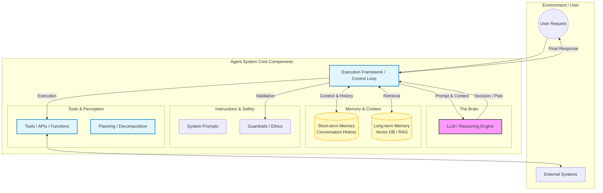

---

### 2. Các Mô hình Kiến trúc (Architectural Patterns)

Sơ đồ này so sánh 3 cấp độ: Deterministic Chain (Cứng), Single Agent (Linh hoạt), và Multi-Agent Orchestration (Phân tán).

Äoạn mã

```mermaid
flowchart TB
    subgraph Pattern1 [1. Deterministic Chain]
        direction LR
        Step1[Input] --> Step2[Step A] --> Step3[Step B] --> Step4[Output]
        style Pattern1 fill:#f9f9f9,stroke:#999,stroke-dasharray: 5 5
    end

    subgraph Pattern2 [2. Single-Agent System]
        direction TB
        SA_Input(Task) --> SA_Reason[LLM Reasoning]
        SA_Reason -- "Decide Tool" --> SA_Tool[Execute Tool]
        SA_Tool -- "Observation" --> SA_Reason
        SA_Reason -- "Complete" --> SA_Output(Final Answer)
    end

    subgraph Pattern3 [3. Multi-Agent System (Orchestrator)]
        direction TB
        MA_Input(Complex Goal) --> Router{Orchestrator / Router}
        
        Router -->|Domain: Support| AgentA[Support Agent]
        Router -->|Domain: Analytics| AgentB[Data Analyst Agent]
        Router -->|Domain: Ops| AgentC[Ops Agent]
        
        AgentA <--> ToolsA[CRM Tools]
        AgentB <--> ToolsB[SQL / Python]
        AgentC <--> ToolsC[APIs]
        
        AgentA & AgentB & AgentC -->|Result| Router
        Router --> MA_Output(Synthesized Response)
    end

    %% Connect patterns logically (conceptual flow)
    Pattern1 -.->|Complexity Increases| Pattern2
    Pattern2 -.->|Scale Increases| Pattern3
```

---

### 3. Hệ thống Äa Agent HÆ°á»›ng Sá»± kiện (Event-Driven Coordination)

Äây là mô hình hiện đại cho các hệ thống lá»›n (Scalable Agent Systems), nÆ¡i các Agent không gá»i nhau trá»±c tiếp mà giao tiếp qua Event Bus để đảm bảo tính "Decoupled" và "Resilience".

Äoạn mã

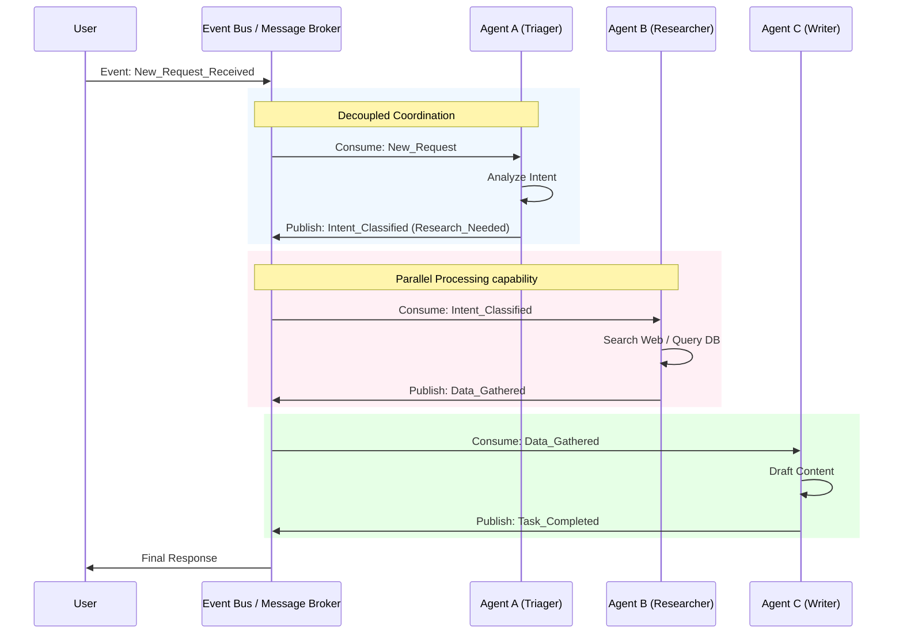

---

### 4. Quy trình Thiết kế & Phương pháp luận (System Design Methodology)

Mô hình hóa quy trình "Start Simple -> Scale" và các yếu tố đánh giá (Evaluation) như trong tài liệu đỠcập.

Äoạn mã

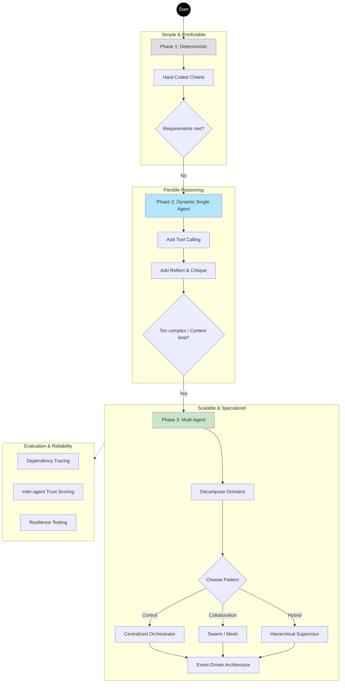

### Tóm tắt các biểu đồ:

1. **SÆ¡ đồ 1** giúp ngÆ°á»i dùng hình dung "bá»™ phận cÆ¡ thể" của má»™t con AI Agent.
    
2. **SÆ¡ đồ 2** cho thấy bức tranh toàn cảnh vá» các lá»±a chá»n kiến trúc (từ Ä‘Æ¡n giản đến phức tạp).
    
3. **SÆ¡ đồ 3** Ä‘i sâu vào cách các Agent nói chuyện vá»›i nhau trong môi trÆ°á»ng Enterprise (tránh việc gá»i chéo gây rối).
    
4. **SÆ¡ đồ 4** là kim chỉ nam (roadmap) cho dev: Äừng vá»™i làm phức tạp, hãy Ä‘i từ Chain -> Single -> Multi.

---


# P2 : MANUS - Lá»™ Trình Toàn Diện Äể Làm Chủ Thiết Kế Hệ Thống Agent

**Tác giả:** Manus AI
**Phiên bản:** 1.0
**Ngày cập nhật:** 13/12/2025
**Äối tượng:** Lập trình viên, kiến trúc sÆ° phần má»m, và các nhà lãnh đạo sản phẩm tại Việt Nam.

---

## Lá»i Mở Äầu

Năm 2025 đánh dấu má»™t bÆ°á»›c ngoặt trong ngành công nghiệp phần má»m: sá»± trá»—i dậy của **Agentic AI** - các hệ thống Trí tuệ Nhân tạo có khả năng tá»± chủ. Không còn là những công cụ thụ Ä‘á»™ng chỉ phản hồi theo lệnh, các agent AI có thể nhận thức môi trÆ°á»ng, tá»± lập kế hoạch, và thá»±c thi các hành Ä‘á»™ng phức tạp để đạt được mục tiêu. Chúng đại diện cho má»™t mô hình má»›i vá» cách con ngÆ°á»i và máy móc tÆ°Æ¡ng tác, hứa hẹn tá»± Ä‘á»™ng hóa các quy trình nhận thức và giải quyết vấn đỠở má»™t quy mô chÆ°a từng có.

Tuy nhiên, sá»± bùng nổ của các thuật ngữ nhÆ° "autonomous agents", "AI swarms", và các framework nhÆ° LangGraph, CrewAI đã tạo ra má»™t bối cảnh vừa thú vị vừa há»—n loạn. Äối vá»›i các lập trình viên và kỹ sÆ° tại Việt Nam, việc nắm bắt được bản chất của những hệ thống này, phân biệt giữa cÆ°á»ng Ä‘iệu và thá»±c tế, và xây dá»±ng má»™t lá»™ trình há»c tập có hệ thống là má»™t thách thức lá»›n.

Tài liệu này được tạo ra để giải quyết chính xác thách thức đó. Vá»›i cấu trúc **MECE (Mutually Exclusive, Collectively Exhaustive - Loại trừ lẫn nhau, Bao hàm toàn diện)**, chúng tôi sẽ "mổ xẻ" toàn bá»™ các khía cạnh của thiết kế hệ thống agent, từ những thành phần cÆ¡ bản nhất đến các kiến trúc Ä‘a agent phức tạp được sá»­ dụng bởi các công ty công nghệ hàng đầu. Mục tiêu của chúng tôi không chỉ là cung cấp kiến thức, mà là má»™t **bản đồ chi tiết**—má»™t lá»™ trình 40 trang—để bất kỳ nhà phát triển nào cÅ©ng có thể tá»± tin bÆ°á»›c vào lÄ©nh vá»±c đầy tiá»m năng này, xây dá»±ng các ứng dụng agentic mạnh mẽ, và trở thành ngÆ°á»i dẫn đầu trong cuá»™c cách mạng AI tiếp theo.

---

## PHẦN I: NỀN TẢNG CỦA HỆ THá»NG AGENT

### Chương 1: Giới thiệu vỠTư duy Agentic (Agentic Thinking)

#### 1.1. Agentic AI là gì?

Äể hiểu vá» Agentic AI, chúng ta cần phân biệt nó vá»›i hai làn sóng AI trÆ°á»›c đó:

| Loại AI | Mô tả | Ví dụ | Vai trò |
| :--- | :--- | :--- | :--- |
| **AI Phân tích (Analytical AI)** | Há»c các mẫu từ dữ liệu lịch sá»­ để Ä‘Æ°a ra dá»± Ä‘oán vá» tÆ°Æ¡ng lai. | Mô hình dá»± Ä‘oán giá cổ phiếu, hệ thống gợi ý sản phẩm. | **Nhà phân tích dữ liệu.** |
| **AI Tạo sinh (Generative AI)** | Tạo ra ná»™i dung má»›i (văn bản, hình ảnh, âm thanh) dá»±a trên các mẫu đã há»c. | ChatGPT, Midjourney, Sora. | **NgÆ°á»i sáng tạo ná»™i dung.** |
| **AI Agentic (Agentic AI)** | Tá»± chủ hành Ä‘á»™ng trong má»™t môi trÆ°á»ng để đạt được mục tiêu. Nó sá»­ dụng AI tạo sinh để suy luận và lập kế hoạch. | Agent tá»± Ä‘á»™ng đặt vé máy bay, agent quản lý chuá»—i cung ứng. | **NgÆ°á»i thá»±c thi công việc.** |

**Agentic AI** là má»™t hệ thống phần má»m có khả năng **nhận thức (perceive)** môi trÆ°á»ng của nó, **lập kế hoạch (plan)** má»™t chuá»—i các hành Ä‘á»™ng để đạt được má»™t mục tiêu cụ thể, và **thá»±c thi (execute)** những hành Ä‘á»™ng đó bằng cách sá»­ dụng má»™t tập hợp các công cụ (tools). Nó là sá»± kết hợp giữa khả năng suy luận của AI tạo sinh và khả năng tÆ°Æ¡ng tác vá»›i thế giá»›i thá»±c (hoặc thế giá»›i số) thông qua các API và hành Ä‘á»™ng.

Sá»± thay đổi cốt lõi từ Generative AI sang Agentic AI là sá»± chuyển đổi từ **phản hồi (response)** sang **hành Ä‘á»™ng (action)**. Má»™t mô hình ngôn ngữ lá»›n (LLM) chỉ có thể cung cấp cho bạn má»™t câu trả lá»i, nhÆ°ng má»™t agent có thể lấy câu trả lá»i đó và thá»±c hiện má»™t Ä‘iá»u gì đó vá»›i nó.

#### 1.2. Tại sao 2025 là năm của Agent?

Sự hội tụ của ba yếu tố chính đã tạo nên một "cơn bão hoàn hảo" cho sự bùng nổ của agent:

1.  **Sự trưởng thành của LLM:** Các mô hình như GPT-4, Claude 3, và Gemini đã đạt đến một ngưỡng đủ mạnh mẽ để thực hiện các tác vụ suy luận và lập kế hoạch phức tạp, vốn là "bộ não" của agent.
2.  **Sá»± phổ biến của API:** Hầu hết má»i dịch vụ kỹ thuật số ngày nay Ä‘á»u cung cấp API, tạo ra má»™t "sân chÆ¡i" rá»™ng lá»›n để các agent có thể tÆ°Æ¡ng tác và hành Ä‘á»™ng.
3.  **Sự phát triển của các Framework Agentic:** Các công cụ mã nguồn mở như LangChain, LangGraph, và CrewAI đã trừu tượng hóa phần lớn sự phức tạp trong việc xây dựng agent, cho phép các nhà phát triển tập trung vào logic nghiệp vụ thay vì các chi tiết kỹ thuật cấp thấp.

Tác Ä‘á»™ng của xu hÆ°á»›ng này đối vá»›i ngành công nghiệp phần má»m là vô cùng to lá»›n. Nó báo trÆ°á»›c má»™t sá»± thay đổi từ việc xây dá»±ng các ứng dụng có giao diện ngÆ°á»i dùng đồ há»a (GUI) sang việc xây dá»±ng các "giao diện ngÆ°á»i dùng ngôn ngữ" (LUI - Language User Interfaces), nÆ¡i ngÆ°á»i dùng chỉ cần nêu ra mục tiêu của há» bằng ngôn ngữ tá»± nhiên, và má»™t Ä‘á»™i quân các agent sẽ làm phần còn lại.

#### 1.3. Cấu trúc tài liệu và Lá»™ trình há»c tập

Tài liệu này được cấu trúc thành bốn phần chính, tạo thành má»™t lá»™ trình há»c tập lÅ©y tiến:

*   **Phần I: Ná»n tảng của Hệ thống Agent:** Chúng ta sẽ bắt đầu bằng cách phân tích cấu trúc cÆ¡ bản của má»™t agent, xác định các thành phần cốt lõi theo nguyên tắc MECE.
*   **Phần II: Phân loại các Kiến trúc và Ứng dụng:** Chúng ta sẽ khám phá các loại kiến trúc agent khác nhau, từ Ä‘Æ¡n giản đến phức tạp, và các trÆ°á»ng hợp sá»­ dụng thá»±c tế của chúng.
*   **Phần III: Lá»™ trình Làm chủ Thiết kế Hệ thống Agent:** Äây là phần cốt lõi của tài liệu, cung cấp má»™t lá»™ trình 5 cấp Ä‘á»™ chi tiết, kèm theo các dá»± án thá»±c hành có code mẫu để bạn có thể xây dá»±ng và há»c há»i.
*   **Phần IV: Chuyên sâu và Tương lai:** Chúng ta sẽ thảo luận vỠcác chủ đỠnâng cao và nhìn vỠtương lai của lĩnh vực agentic AI.

Bằng cách Ä‘i theo lá»™ trình này, bạn sẽ xây dá»±ng được má»™t ná»n tảng kiến thức vững chắc và có hệ thống, sẵn sàng để chinh phục những thách thức phức tạp nhất trong lÄ©nh vá»±c thiết kế hệ thống agent.


### Chương 2: Phân tích MECE các Thành phần của một Agent

Äể xây dá»±ng má»™t hệ thống agent mạnh mẽ và có thể bảo trì, chúng ta không thể xem nó nhÆ° má»™t "há»™p Ä‘en" bí ẩn. Thay vào đó, chúng ta phải áp dụng tÆ° duy kỹ thuật hệ thống, phân rã nó thành các thành phần chức năng riêng biệt, không chồng chéo. Khung MECE dÆ°á»›i đây cung cấp má»™t "bản thiết kế" tiêu chuẩn cho má»i agent, bất kể mức Ä‘á»™ phức tạp.

Một agent có thể được chia thành bốn lớp (Layer) chính, mỗi lớp chứa các thành phần (Component) cụ thể. Bốn lớp này đại diện cho chu trình xử lý hoàn chỉnh của một agent: từ việc nhận thông tin đến việc thực hiện hành động.

**Sơ đồ tổng quan các lớp MECE của một Agent:**

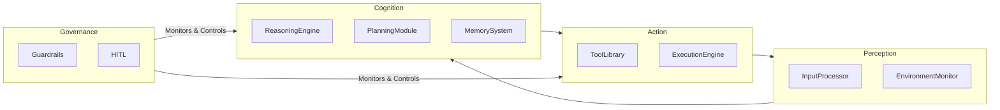

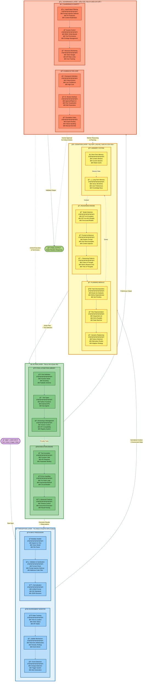

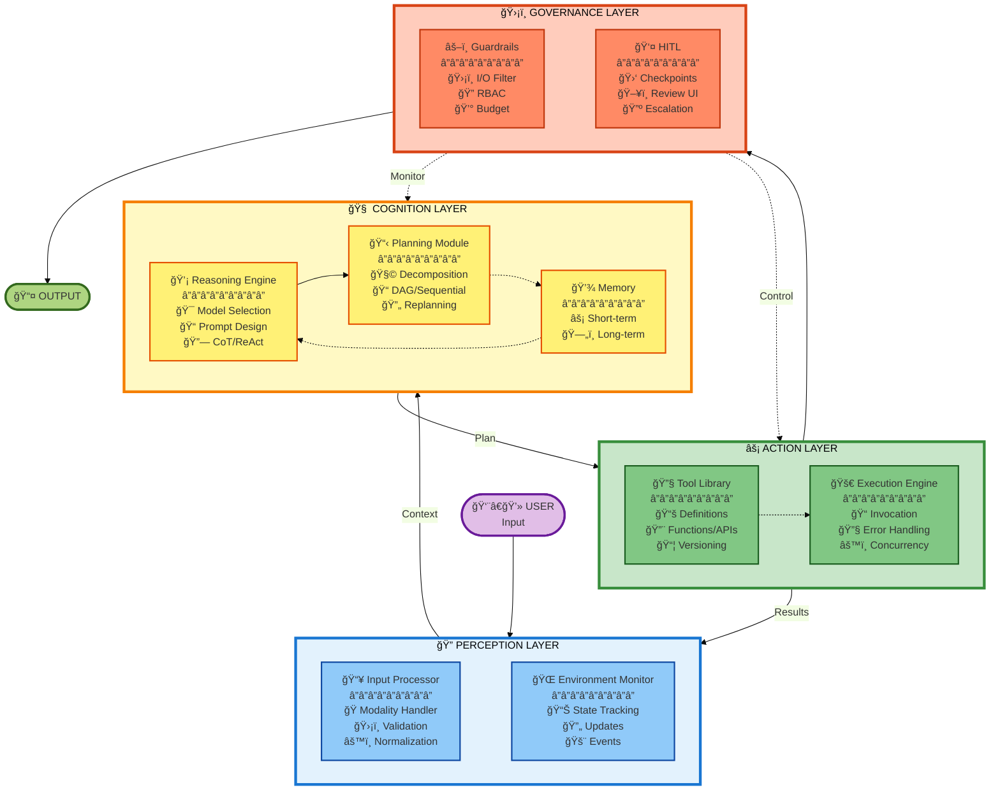

Bây giá», chúng ta sẽ Ä‘i sâu vào từng thành phần trong má»—i lá»›p.

#### 2.1. Lớp 1: Nhận thức (Perception Layer)

Äây là lá»›p chịu trách nhiệm thu thập thông tin từ thế giá»›i bên ngoài và chuyển đổi nó thành má»™t định dạng mà "bá»™ não" của agent có thể hiểu được. Nếu không có lá»›p nhận thức hiệu quả, agent sẽ bị "mù" và "Ä‘iếc".

**2.1.1. Thành phần: Bộ xử lý đầu vào (Input Processor)**

*   **Chức năng:** Là cửa ngõ đầu tiên của agent, chịu trách nhiệm tiếp nhận, làm sạch và chuẩn hóa tất cả các loại dữ liệu đầu vào.
*   **Chi tiết hoạt động:**
    *   **Xá»­ lý Ä‘a phÆ°Æ¡ng thức (Modality Handling):** Agent không chỉ nhận văn bản. Nó có thể nhận hình ảnh (từ file upload), giá»ng nói (từ microphone), video, hoặc dữ liệu có cấu trúc (từ má»™t API call). Input Processor phải xác định loại dữ liệu và sá»­ dụng các mô hình chuyên biệt (ví dụ: mô hình Speech-to-Text nhÆ° Whisper cho âm thanh, mô hình Vision cho hình ảnh) để chuyển đổi tất cả vá» má»™t định dạng chung, thÆ°á»ng là văn bản hoặc JSON.
    *   **Xác thá»±c và làm sạch (Validation & Sanitization):** Dữ liệu đầu vào từ ngÆ°á»i dùng hoặc hệ thống bên ngoài không bao giỠđáng tin cậy 100%. Thành phần này phải kiểm tra xem dữ liệu có hợp lệ không (ví dụ: má»™t địa chỉ email có đúng định dạng không?), và quan trá»ng hÆ¡n, loại bá» các mã Ä‘á»™c hại hoặc các kỹ thuật tấn công nhÆ° **Prompt Injection**.
    *   **Chuẩn hóa (Normalization):** Dữ liệu từ các nguồn khác nhau có thể có định dạng khác nhau. Ví dụ, ngày tháng có thể là `DD/MM/YYYY` hoặc `MM-DD-YY`. Input Processor sẽ chuyển đổi tất cả vỠmột định dạng thống nhất (ví dụ: ISO 8601) để các lớp sau có thể xử lý một cách nhất quán.
*   **Tầm quan trá»ng:** Má»™t Input Processor yếu kém sẽ dẫn đến việc agent hiểu sai yêu cầu, dá»… bị tấn công, hoặc không thể xá»­ lý các loại thông tin Ä‘a dạng, làm giảm đáng kể tính hữu dụng của nó.

**2.1.2. Thành phần: Bá»™ giám sát môi trÆ°á»ng (Environment Monitor)**

*   **Chức năng:** Duy trì má»™t mô hình ná»™i tại (internal model) vá» trạng thái của thế giá»›i bên ngoài mà agent cần quan tâm. Nó trả lá»i câu há»i: "Chuyện gì Ä‘ang xảy ra xung quanh tôi?"
*   **Chi tiết hoạt động:**
    *   **Theo dõi trạng thái (State Tracking):** Thành phần này có thể theo dõi các thông tin nhÆ°: thá»i gian hiện tại, vị trí của ngÆ°á»i dùng, trạng thái của má»™t Ä‘Æ¡n hàng, giá cổ phiếu hiện tại, hoặc ná»™i dung của má»™t trang web. Nó không chỉ là dữ liệu tÄ©nh mà là má»™t bức tranh Ä‘á»™ng vá» môi trÆ°á»ng.
    *   **Cập nhật theo thá»i gian thá»±c hoặc định kỳ (Real-time vs. Periodic Updates):** Tùy thuá»™c vào yêu cầu, việc cập nhật có thể diá»…n ra liên tục (ví dụ: qua WebSockets để theo dõi giá tiá»n Ä‘iện tá»­) hoặc theo chu kỳ (ví dụ: kiểm tra email má»›i má»—i 5 phút).
    *   **Phát hiện sá»± kiện (Event Detection):** Äây là má»™t chức năng quan trá»ng. Thay vì chỉ Ä‘á»c trạng thái, Environment Monitor có thể phát hiện những *thay đổi* quan trá»ng và kích hoạt agent hành Ä‘á»™ng. Ví dụ: "Khi trạng thái Ä‘Æ¡n hàng chuyển từ 'Äang giao' sang 'Äã giao', hãy kích hoạt agent gá»­i email cảm Æ¡n cho khách hàng."
*   **Tầm quan trá»ng:** Nếu không có Environment Monitor, agent chỉ có thể phản ứng vá»›i các yêu cầu trá»±c tiếp của ngÆ°á»i dùng. Vá»›i nó, agent có thể trở nên **chủ Ä‘á»™ng (proactive)**, tá»± Ä‘á»™ng hành Ä‘á»™ng khi có sá»± thay đổi trong môi trÆ°á»ng, mở ra vô số ứng dụng tá»± Ä‘á»™ng hóa thông minh.

#### 2.2. Lớp 2: Nhận thức (Cognition Layer)

Äây là "bá»™ não" của agent, nÆ¡i diá»…n ra các quá trình suy luận, lập kế hoạch và ghi nhá»›. Chất lượng của lá»›p này quyết định mức Ä‘á»™ "thông minh" của agent.

**2.2.1. Thành phần: Äá»™ng cÆ¡ suy luận (Reasoning Engine)**

*   **Chức năng:** Là hạt nhân của lá»›p nhận thức, thÆ°á»ng là má»™t Mô hình Ngôn ngữ Lá»›n (LLM), chịu trách nhiệm hiểu yêu cầu, suy luận logic, và Ä‘Æ°a ra các quyết định cấp cao.
*   **Chi tiết hoạt động:**
    *   **Lá»±a chá»n Mô hình (Model Selection):** Không phải lúc nào cÅ©ng cần mô hình mạnh nhất (và đắt nhất). Má»™t quyết định kiến trúc quan trá»ng là chá»n đúng LLM cho đúng công việc. Ví dụ: dùng GPT-4o cho các tác vụ lập kế hoạch phức tạp, nhÆ°ng dùng GPT-4o-mini hoặc má»™t mô hình được fine-tune cho các tác vụ phân loại Ä‘Æ¡n giản để tiết kiệm chi phí và giảm Ä‘á»™ trá»….
    *   **Kiến trúc Prompt (Prompt Architecture):** Äây là nghệ thuật và khoa há»c của việc "lập trình" LLM. Má»™t prompt tốt không chỉ là má»™t câu há»i. Nó bao gồm:
        *   **System Prompt:** Äịnh nghÄ©a vai trò, tính cách, và các quy tắc bất biến của agent (ví dụ: "Bạn là má»™t trợ lý du lịch chuyên nghiệp, luôn trả lá»i má»™t cách lịch sá»± và chi tiết.").
        *   **Few-Shot Examples:** Cung cấp một vài ví dụ vỠđầu vào và đầu ra mong muốn để hướng dẫn LLM hoạt động đúng cách.
        *   **Context:** Cung cấp thông tin liên quan từ Bộ nhớ (Memory System) để agent có thể đưa ra quyết định dựa trên ngữ cảnh.
    *   **Các Mẫu Suy luận (Reasoning Patterns):** Äể giải quyết các vấn Ä‘á» phức tạp, agent cần các kỹ thuật suy luận có cấu trúc. Các mẫu phổ biến bao gồm:
        *   **Chain-of-Thought (CoT):** HÆ°á»›ng dẫn LLM "suy nghÄ© từng bÆ°á»›c" trÆ°á»›c khi Ä‘Æ°a ra câu trả lá»i cuối cùng, giúp cải thiện Ä‘á»™ chính xác của các bài toán logic.
        *   **ReAct (Reason + Act):** Má»™t mẫu cá»±c kỳ quan trá»ng cho agent. LLM sẽ lặp Ä‘i lặp lại chu trình: **Suy luận (Reason)** vá» bÆ°á»›c tiếp theo cần làm -> **Hành Ä‘á»™ng (Act)** bằng cách gá»i má»™t công cụ -> **Quan sát (Observe)** kết quả của công cụ đó. Chu trình này cho phép agent tÆ°Æ¡ng tác vá»›i môi trÆ°á»ng và Ä‘iá»u chỉnh kế hoạch của mình.
*   **Tầm quan trá»ng:** Äây là thành phần quyết định khả năng giải quyết vấn Ä‘á» của agent. Má»™t Reasoning Engine mạnh mẽ có thể hiểu được các yêu cầu mÆ¡ hồ, phá vỡ các vấn Ä‘á» phức tạp, và Ä‘Æ°a ra các quyết định thông minh.

**2.2.2. Thành phần: Module lập kế hoạch (Planning Module)**

*   **Chức năng:** Chuyển đổi má»™t mục tiêu cấp cao, thÆ°á»ng mÆ¡ hồ của ngÆ°á»i dùng (ví dụ: "lên kế hoạch cho má»™t chuyến Ä‘i") thành má»™t chuá»—i các bÆ°á»›c cụ thể, có thể thá»±c thi được.
*   **Chi tiết hoạt động:**
    *   **Phân rã nhiệm vụ (Task Decomposition):** Äây là chức năng cốt lõi. Module này sẽ chia má»™t nhiệm vụ lá»›n thành các nhiệm vụ con nhá» hÆ¡n. Ví dụ, "lên kế hoạch chuyến Ä‘i" được chia thành: (1) Tìm vé máy bay, (2) Tìm khách sạn, (3) Tìm các địa Ä‘iểm tham quan, (4) Lập lịch trình chi tiết.
    *   **Biểu diá»…n Kế hoạch (Plan Representation):** Kế hoạch có thể được biểu diá»…n dÆ°á»›i dạng má»™t danh sách các bÆ°á»›c tuần tá»±, hoặc phức tạp hÆ¡n, là má»™t **Äồ thị có hÆ°á»›ng không chu trình (DAG - Directed Acyclic Graph)**, cho phép thá»±c hiện các bÆ°á»›c song song.
    *   **Tái lập kế hoạch Ä‘á»™ng (Dynamic Replanning):** Thế giá»›i thá»±c không thể Ä‘oán trÆ°á»›c. Má»™t công cụ có thể thất bại, má»™t API có thể không trả vá» dữ liệu. Planning Module phải có khả năng nhận biết thất bại từ Lá»›p Hành Ä‘á»™ng (Action Layer) và tá»± Ä‘á»™ng Ä‘iá»u chỉnh kế hoạch. Ví dụ: "Không tìm thấy chuyến bay vào ngày X, thá»­ tìm vào ngày Y."
    *   **Các kỹ thuật nâng cao:** Các hệ thống phức tạp có thể sá»­ dụng các kỹ thuật nhÆ° **Tree of Thoughts (ToT)**, nÆ¡i agent khám phá nhiá»u nhánh kế hoạch khác nhau và đánh giá chúng trÆ°á»›c khi chá»n ra nhánh tốt nhất.
*   **Tầm quan trá»ng:** Nếu Reasoning Engine là bá»™ não chiến lược, thì Planning Module là bá»™ não chiến thuật. Nó biến ý định thành má»™t kế hoạch hành Ä‘á»™ng cụ thể, là cầu nối giữa suy nghÄ© và thá»±c thi. Các agent không có Planning Module chỉ có thể thá»±c hiện các tác vụ má»™t bÆ°á»›c Ä‘Æ¡n giản.

**2.2.3. Thành phần: Hệ thống bộ nhớ (Memory System)**

*   **Chức năng:** Cung cấp cho agent khả năng ghi nhá»› và truy xuất thông tin, cho phép nó duy trì ngữ cảnh, há»c há»i từ các tÆ°Æ¡ng tác trong quá khứ, và cá nhân hóa trải nghiệm.
*   **Chi tiết hoạt động:** Bộ nhớ của agent được chia thành hai loại chính:
    *   **Bộ nhớ Ngắn hạn (Short-Term / Working Memory):**
        *   **Mục đích:** Lưu trữ thông tin liên quan đến phiên tương tác hiện tại.
        *   **Ví dụ:** Lịch sá»­ cuá»™c trò chuyện, các kết quả trung gian từ các lệnh gá»i công cụ, kế hoạch hiện tại.
        *   **Công nghệ:** ThÆ°á»ng được lÆ°u trữ trong bá»™ nhá»› (in-memory) của ứng dụng hoặc trong các hệ thống cache nhanh nhÆ° Redis. Äây chính là "context window" được Ä‘Æ°a vào prompt của LLM trong má»—i lượt tÆ°Æ¡ng tác.
    *   **Bộ nhớ Dài hạn (Long-Term / Knowledge Base):**
        *   **Mục đích:** LÆ°u trữ thông tin má»™t cách bá»n vững qua nhiá»u phiên, cho phép agent há»c há»i và phát triển theo thá»i gian.
        *   **Ví dụ:** Sở thích của ngÆ°á»i dùng ("Tôi thích các chuyến bay buổi sáng"), các sá»± kiện quan trá»ng trong quá khứ, má»™t kho tài liệu kiến thức lá»›n.
        *   **Công nghệ:**
            *   **CÆ¡ sở dữ liệu Vector (Vector Database - vd: Pinecone, Chroma):** Dùng cho **tìm kiếm ngữ nghÄ©a (semantic search)**. Các Ä‘oạn văn bản được chuyển thành các vector số há»c. Khi cần truy xuất, câu truy vấn cÅ©ng được chuyển thành vector và hệ thống sẽ tìm các vector gần nhất (tÆ°Æ¡ng đồng nhất vá» mặt ngữ nghÄ©a). Äây là công nghệ ná»n tảng của **Retrieval-Augmented Generation (RAG)**.
            *   **CÆ¡ sở dữ liệu Quan hệ/NoSQL (Relational/NoSQL DB):** Dùng để lÆ°u trữ dữ liệu có cấu trúc nhÆ° thông tin ngÆ°á»i dùng, lịch sá»­ Ä‘Æ¡n hàng, v.v.
*   **Tầm quan trá»ng:** Bá»™ nhá»› là thứ biến má»™t chatbot vô hồn thành má»™t trợ lý cá nhân thá»±c thụ. Nó cho phép agent nhá»› bạn là ai, bạn thích gì, và những gì bạn đã làm, tạo ra má»™t trải nghiệm liá»n mạch và thông minh hÆ¡n nhiá»u.

*(Tiếp tục các Lớp 3 và 4 trong các phần sau...)*


#### 2.3. Lớp 3: Hành động (Action Layer)

Nếu Lá»›p Nhận thức là tai và mắt, Lá»›p Nhận thức là bá»™ não, thì Lá»›p Hành Ä‘á»™ng chính là tay và chân của agent. Äây là nÆ¡i các quyết định và kế hoạch được chuyển thành các hành Ä‘á»™ng cụ thể, có tác Ä‘á»™ng đến thế giá»›i bên ngoài.

**2.3.1. Thành phần: Thư viện Công cụ & Hàm (Tool & Function Library)**

*   **Chức năng:** Cung cấp một bộ sưu tập các "siêu năng lực" mà agent có thể sử dụng. Mỗi công cụ là một hành động cụ thể mà agent có thể thực hiện.
*   **Chi tiết hoạt động:**
    *   **Äịnh nghÄ©a Công cụ (Tool Definition):** Má»™t công cụ không chỉ là má»™t hàm code. Äể LLM có thể hiểu và sá»­ dụng được, má»™t công cụ phải được định nghÄ©a má»™t cách rõ ràng, thÆ°á»ng bao gồm:
        *   **Tên hàm:** Một cái tên mang tính mô tả cao (ví dụ: `search_flights` thay vì `f1`).
        *   **Mô tả (Docstring):** Má»™t câu giải thích rõ ràng vá» chức năng của công cụ (ví dụ: "Tìm kiếm các chuyến bay giữa hai thành phố vào má»™t ngày cụ thể."). Äây là thông tin quan trá»ng nhất mà LLM sẽ dá»±a vào để quyết định có chá»n công cụ này hay không.
        *   **Äịnh nghÄ©a Tham số (Parameter Definition):** Các tham số đầu vào phải được định nghÄ©a rõ ràng vá»›i kiểu dữ liệu (ví dụ: `origin: str`, `destination: str`, `date: date`). Các framework hiện đại thÆ°á»ng sá»­ dụng Pydantic model để làm việc này.
    *   **Các loại công cụ:** Thư viện công cụ có thể bao gồm:
        *   **Các hàm Python ná»™i bá»™:** Äể thá»±c hiện các phép tính, xá»­ lý dữ liệu.
        *   **Các lệnh gá»i API bên ngoài:** Äể tÆ°Æ¡ng tác vá»›i các dịch vụ của bên thứ ba (Google Maps, Stripe, Jira).
        *   **Các agent khác:** Trong kiến trúc đa agent, một agent có thể là một công cụ của một agent khác.
    *   **Quản lý và Phiên bản (Versioning & Management):** Khi số lượng công cụ tăng lên, việc quản lý chúng trở nên quan trá»ng. Cần có cÆ¡ chế để theo dõi phiên bản của các công cụ, xá»­ lý các thay đổi (ví dụ: má»™t API thay đổi tham số), và đảm bảo tính tÆ°Æ¡ng thích.
*   **Tầm quan trá»ng:** Công cụ là thứ mang lại sức mạnh thá»±c sá»± cho agent. Má»™t agent không có công cụ chỉ là má»™t chatbot. Má»™t agent vá»›i má»™t thÆ° viện công cụ phong phú có thể trở thành má»™t nhân viên tá»± Ä‘á»™ng hóa mạnh mẽ.

**2.3.2. Thành phần: Äá»™ng cÆ¡ thá»±c thi (Execution Engine)**

*   **Chức năng:** Chịu trách nhiệm gá»i các công cụ đã được Lá»›p Nhận thức lá»±a chá»n má»™t cách đáng tin cậy, xá»­ lý kết quả trả vá», và báo cáo lại cho Lá»›p Nhận thức.
*   **Chi tiết hoạt động:**
    *   **Gá»i công cụ (Tool Invocation):** Sau khi Planning Module quyết định gá»i công cụ `search_flights(origin="Hanoi", destination="Saigon")`, Execution Engine sẽ thá»±c sá»± thá»±c hiện lệnh gá»i hàm hoặc API call này.
    *   **Xá»­ lý lá»—i và Thá»­ lại (Error Handling & Retry Logic):** Các lệnh gá»i mạng thÆ°á»ng không đáng tin cậy. API có thể bị lá»—i, mạng có thể bị ngắt. Execution Engine phải được trang bị các cÆ¡ chế mạnh mẽ để xá»­ lý những tình huống này, ví dụ nhÆ° **thá»­ lại theo cấp số nhân (exponential backoff)** - thá»­ lại sau 1s, rồi 2s, rồi 4s,...
    *   **Quản lý Timeout và Song song (Timeout & Concurrency Management):** Má»™t công cụ không nên được phép chạy vô thá»i hạn. Execution Engine phải đặt ra má»™t khoảng thá»i gian chá» (timeout) và hủy bá» công cụ nếu nó không phản hồi. Trong các hệ thống nâng cao, nó cÅ©ng có thể quản lý việc thá»±c thi nhiá»u công cụ cùng má»™t lúc (song song) để tăng tốc Ä‘á»™.
    *   **Phân tích và Chuẩn hóa Kết quả (Result Parsing & Normalization):** Kết quả trả vá» từ má»™t công cụ (ví dụ: má»™t chuá»—i JSON lá»›n từ API của hãng hàng không) cần được phân tích, trích xuất thông tin quan trá»ng, và chuyển đổi thành má»™t định dạng Ä‘Æ¡n giản để Lá»›p Nhận thức có thể "tiêu hóa" và sá»­ dụng cho bÆ°á»›c lập kế hoạch tiếp theo.
*   **Tầm quan trá»ng:** Execution Engine đảm bảo rằng các hành Ä‘á»™ng của agent được thá»±c hiện má»™t cách đáng tin cậy và hiệu quả. Nó là cầu nối vững chắc giữa thế giá»›i trừu tượng của việc lập kế hoạch và thế giá»›i há»—n loạn của việc thá»±c thi trong thá»±c tế.

#### 2.4. Lớp 4: Quản trị (Governance Layer)

Äây là lá»›p giám sát và kiểm soát, đảm bảo rằng agent hoạt Ä‘á»™ng trong các giá»›i hạn an toàn, có đạo đức, và có thể kiểm soát được. Trong các hệ thống sản xuất, đây là lá»›p quan trá»ng nhất để xây dá»±ng lòng tin và tránh các hậu quả không mong muốn.

**2.4.1. Thành phần: Rào chắn & Module an toàn (Guardrails & Safety Module)**

*   **Chức năng:** Hoạt động như một "lương tâm" và "bộ phận quản lý rủi ro" của agent, áp đặt các quy tắc và ràng buộc lên hành vi của nó.
*   **Chi tiết hoạt động:**
    *   **Lá»c Äầu vào/Äầu ra (Input/Output Filtering):**
        *   **Ngăn chặn Prompt Injection:** Phát hiện và vô hiệu hóa các ná»— lá»±c của ngÆ°á»i dùng nhằm ghi đè lên system prompt của agent.
        *   **Bảo vệ Dữ liệu Cá nhân (PII Protection):** Tá»± Ä‘á»™ng phát hiện và che giấu các thông tin nhạy cảm nhÆ° số Ä‘iện thoại, email, số thẻ tín dụng trong cả log và các lệnh gá»i công cụ.
        *   **Kiểm duyệt nội dung độc hại:** Ngăn chặn agent tạo ra hoặc xử lý các nội dung không phù hợp.
    *   **Kiểm soát Truy cập Công cụ (Tool Access Control):** Không phải agent nào cÅ©ng được phép sá»­ dụng má»i công cụ. Module này thá»±c thi các quy tắc **Kiểm soát Truy cập Dá»±a trên Vai trò (RBAC - Role-Based Access Control)**. Ví dụ: chỉ có "Financial Agent" má»›i được phép gá»i công cụ `execute_payment`.
    *   **Giám sát Ngân sách và Tài nguyên (Budget & Resource Monitoring):** Má»—i lệnh gá»i LLM Ä‘á»u tốn tiá»n. Guardrails sẽ theo dõi tổng chi phí token và có thể dừng agent nếu nó vượt quá má»™t ngân sách đã định trÆ°á»›c để tránh các hóa Ä‘Æ¡n "trên trá»i".
*   **Tầm quan trá»ng:** Trong môi trÆ°á»ng doanh nghiệp, má»™t agent không có Guardrails là má»™t rủi ro không thể chấp nhận. Lá»›p này đảm bảo agent hoạt Ä‘á»™ng má»™t cách có trách nhiệm, an toàn và tuân thủ các quy định.

**2.4.2. Thành phần: Giao diện Con ngÆ°á»i trong vòng lặp (Human-in-the-Loop - HITL Interface)**

*   **Chức năng:** Cung cấp má»™t cÆ¡ chế để con ngÆ°á»i có thể giám sát, can thiệp, và phê duyệt các hành Ä‘á»™ng của agent tại các thá»i Ä‘iểm quan trá»ng.
*   **Chi tiết hoạt động:**
    *   **Äịnh nghÄ©a Äiểm dừng (Checkpoint Definition):** Äây là quyết định thiết kế quan trá»ng: khi nào agent nên dừng lại và há»i ý kiến con ngÆ°á»i? Các Ä‘iểm dừng phổ biến bao gồm:
        *   TrÆ°á»›c khi thá»±c hiện má»™t hành Ä‘á»™ng không thể đảo ngược (ví dụ: xóa file, gá»­i tiá»n).
        *   Khi agent có độ tin cậy thấp vỠbước đi tiếp theo.
        *   Khi chi phí của hành động tiếp theo vượt quá một ngưỡng nhất định.
    *   **Giao diện NgÆ°á»i dùng (UI/UX) cho TÆ°Æ¡ng tác:** Cần có má»™t giao diện rõ ràng để con ngÆ°á»i có thể xem xét kế hoạch của agent, các tham số của công cụ sắp được gá»i, và sau đó Ä‘Æ°a ra quyết định: **Phê duyệt (Approve)**, **Từ chối (Reject)**, hoặc **Chỉnh sá»­a (Edit)**.
    *   **CÆ¡ chế leo thang (Escalation Paths):** Nếu agent thất bại nhiá»u lần hoặc gặp phải má»™t vấn Ä‘á» mà nó không thể giải quyết, hệ thống HITL phải có má»™t quy trình để "leo thang" vấn đỠđó đến má»™t chuyên gia con ngÆ°á»i phù hợp.
*   **Tầm quan trá»ng:** HITL là cầu nối giữa tá»± Ä‘á»™ng hóa hoàn toàn và sá»± kiểm soát của con ngÆ°á»i. Nó cho phép các doanh nghiệp tận dụng sức mạnh của agent cho các tác vụ rủi ro cao, trong khi vẫn đảm bảo rằng quyết định cuối cùng luôn nằm trong tay con ngÆ°á»i. Äây là má»™t thành phần không thể thiếu để triển khai agent má»™t cách có trách nhiệm trong các ứng dụng thá»±c tế.

---

*Kết thúc Phần I. Chúng ta đã hoàn thành việc phân tích MECE toàn bá»™ các thành phần cấu tạo nên má»™t hệ thống agent. Vá»›i ná»n tảng vững chắc này, trong Phần II, chúng ta sẽ khám phá các cách khác nhau để lắp ráp các thành phần này thành các loại kiến trúc agent khác nhau để giải quyết các bài toán thá»±c tế.*


## PHẦN II: PHÂN LOẠI MECE CÃC KIẾN TRÚC VÀ ỨNG DỤNG AGENT

Sau khi đã hiểu rõ các thành phần cấu tạo nên má»™t agent, bÆ°á»›c tiếp theo là tìm hiểu cách lắp ráp chúng thành các **kiến trúc (architectures)** khác nhau. Không phải tất cả các agent Ä‘á»u được tạo ra nhÆ° nhau. Việc lá»±a chá»n kiến trúc phù hợp là má»™t trong những quyết định quan trá»ng nhất, ảnh hưởng trá»±c tiếp đến Ä‘á»™ phức tạp, chi phí, và khả năng của hệ thống.

Trong phần này, chúng ta sẽ giá»›i thiệu má»™t khung phân loại MECE, giúp bạn định vị được bài toán của mình và lá»±a chá»n kiến trúc agent phù hợp nhất.

### Chương 3: Sơ đồ Phân loại Ứng dụng Agent

#### 3.1. Hai trục phân loại: Agency và Coordination

Dá»±a trên các nghiên cứu và thá»±c tiá»…n từ các công ty hàng đầu nhÆ° Google, Anthropic, và Databricks, chúng ta có thể phân loại hầu hết má»i ứng dụng agentic theo hai trục chính, trá»±c giao vá»›i nhau:

1.  **Mức Ä‘á»™ Tá»± chủ (Agency):** Trục này Ä‘o lÆ°á»ng mức Ä‘á»™ tá»± do ra quyết định của agent. Nó trải dài từ **Thụ Ä‘á»™ng/Xác định (Deterministic)**, nÆ¡i agent chỉ tuân theo má»™t kịch bản được lập trình sẵn, đến **Tá»± chủ/HÆ°á»›ng mục tiêu (Autonomous/Goal-Oriented)**, nÆ¡i agent có thể tá»± lập kế hoạch và thích ứng để đạt được má»™t mục tiêu cấp cao.

2.  **Mức Ä‘á»™ Phối hợp (Coordination):** Trục này Ä‘o lÆ°á»ng số lượng agent tham gia và cách chúng tÆ°Æ¡ng tác. Nó trải dài từ **ÄÆ¡n lẻ (Single)**, nÆ¡i chỉ có má»™t agent hoạt Ä‘á»™ng Ä‘á»™c lập, đến **Äa agent/Phối hợp (Multi-Agent)**, nÆ¡i nhiá»u agent làm việc cùng nhau.

#### 3.2. Ma trận 4 Quadrant

Khi kết hợp hai trục này, chúng ta có một ma trận 2x2 mạnh mẽ, tạo ra bốn loại kiến trúc agent cơ bản. Ma trận này là một công cụ tư duy cực kỳ hữu ích để phân tích và thiết kế hệ thống.

| | **Thấp Agency** (Xác định, Hướng tác vụ) | **Cao Agency** (Tự chủ, Hướng mục tiêu) |
| :--- | :--- | :--- |
| **Thấp Coordination** (ÄÆ¡n agent) | **Quadrant 1: Instruction**<br>_"RPA được tăng cÆ°á»ng LLM"_ | **Quadrant 3: Autonomy**<br>_"NgÆ°á»i giải quyết vấn Ä‘á» Ä‘á»™c lập"_ |
| **Cao Coordination** (Äa agent) | **Quadrant 2: Orchestration**<br>_"Dây chuyá»n lắp ráp thông minh"_ | **Quadrant 4: Choreography**<br>_"Äá»™i ngÅ© chuyên gia tá»± quản"_ |

Bốn quadrant này không chỉ là lý thuyết. Chúng đại diện cho các mẫu kiến trúc (architectural patterns) phổ biến nhất trong thá»±c tế. Trong các chÆ°Æ¡ng tiếp theo, chúng ta sẽ Ä‘i sâu vào từng quadrant, phân tích kiến trúc, ví dụ, và các trÆ°á»ng hợp nên/không nên sá»­ dụng.

### Chương 4: Phân tích sâu Quadrant 1: Instruction

Äây là Ä‘iểm khởi đầu cho hầu hết các ứng dụng agentic trong doanh nghiệp. Nó Ä‘Æ¡n giản, đáng tin cậy, và mang lại giá trị ngay lập tức.

#### 4.1. Kiến trúc và Luồng hoạt động

Má»™t agent "Instruction" hoạt Ä‘á»™ng giống nhÆ° má»™t quy trình Tá»± Ä‘á»™ng hóa Quy trình Robot (RPA) được tăng cÆ°á»ng bởi khả năng hiểu ngôn ngữ tá»± nhiên của LLM. Luồng hoạt Ä‘á»™ng của nó là tuyến tính và có thể dá»± Ä‘oán được.

**Sơ đồ luồng hoạt động (Ví dụ: Agent Phân loại Ticket Hỗ trợ):**


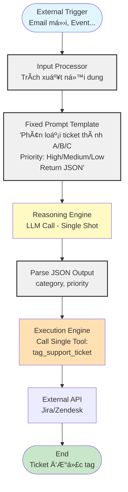

> Agent chỉ làm má»™t việc tuyến tính: nhận input, gá»i LLM 1 lần để phân loại, rồi gá»i đúng 1 tool. Không có vòng lặp, không lập kế hoạch nhiá»u bÆ°á»›c, không nhá»› lịch sá»­.


*   **Luồng hoạt động:**
    1.  **Äầu vào:** Má»™t sá»± kiện bên ngoài kích hoạt agent (ví dụ: email má»›i được gá»­i đến hòm thÆ° há»— trợ).
    2.  **Xử lý:** Input Processor nhận email và trích xuất nội dung.
    3.  **Suy luận:** Reasoning Engine (LLM) được gá»i vá»›i má»™t prompt rất cụ thể: "Dá»±a trên ná»™i dung sau, hãy phân loại ticket thành má»™t trong các loại [A, B, C] và xác định mức Ä‘á»™ Æ°u tiên là [Cao, Trung bình, Thấp]. Trả vá» kết quả dÆ°á»›i dạng JSON."
    4.  **Hành Ä‘á»™ng:** Execution Engine nhận kết quả JSON và gá»i má»™t công cụ duy nhất, `tag_support_ticket`, vá»›i các tham số đã được phân loại.
    5.  **Kết thúc:** Công cụ tương tác với API của Jira/Zendesk. Quy trình kết thúc.

*   **Äặc Ä‘iểm kiến trúc:**
    *   **Tuyến tính:** Không có vòng lặp phức tạp hay tái lập kế hoạch.
    *   **Trạng thái tối thiểu:** Agent không cần nhớ các tương tác trước đó.
    *   **Công cụ chuyên biệt:** ThÆ°á»ng chỉ có má»™t hoặc má»™t vài công cụ rất cụ thể.
    *   **Prompt được kiểm soát chặt chẽ:** System prompt và user prompt được thiết kế để hạn chế tối đa sự "sáng tạo" của LLM.

#### 4.2. Ví dụ thực tế

*   **Chatbot Há»i-Äáp trên tài liệu (Simple RAG):** NgÆ°á»i dùng há»i má»™t câu, agent tìm kiếm trong cÆ¡ sở dữ liệu vector, lấy ngữ cảnh liên quan, và kết hợp vá»›i câu há»i để LLM trả lá»i. Toàn bá»™ quy trình là má»™t chuá»—i các bÆ°á»›c xác định.
*   **Tóm tắt cuá»™c há»p:** Agent nhận bản ghi âm cuá»™c há»p, sá»­ dụng công cụ Speech-to-Text, sau đó gá»­i văn bản cho LLM vá»›i prompt "Tóm tắt các Ä‘iểm chính và các mục hành Ä‘á»™ng."
*   **Phân loại cảm xúc khách hàng:** Agent Ä‘á»c các bài đánh giá sản phẩm và gắn thẻ cảm xúc (Tích cá»±c, Tiêu cá»±c, Trung tính).

#### 4.3. Khi nào nên sử dụng và giới hạn

*   **Nên sử dụng khi:**
    *   Quy trình nghiệp vụ rõ ràng, có tính lặp lại.
    *   Yêu cầu độ tin cậy và tính nhất quán cao.
    *   Rủi ro từ các hành động sai lầm là đáng kể, cần sự kiểm soát chặt chẽ.
    *   Bạn mới bắt đầu với agent và muốn có một "chiến thắng" nhanh chóng, dễ dàng.
*   **Giới hạn:**
    *   Không thể xá»­ lý các yêu cầu mÆ¡ hồ hoặc các tác vụ đòi há»i sá»± linh hoạt.
    *   Không thể thích ứng vá»›i các tình huống không lÆ°á»ng trÆ°á»›c.
    *   Kém hiệu quả đối vá»›i các vấn Ä‘á» cần nhiá»u bÆ°á»›c hoặc nhiá»u nguồn dữ liệu khác nhau.

### Chương 5: Phân tích sâu Quadrant 2: Orchestration

Khi một quy trình nghiệp vụ trở nên quá phức tạp cho một agent đơn lẻ, nhưng vẫn có thể được xác định trước, chúng ta bước vào Quadrant 2.

#### 5.1. Kiến trúc và Luồng hoạt động

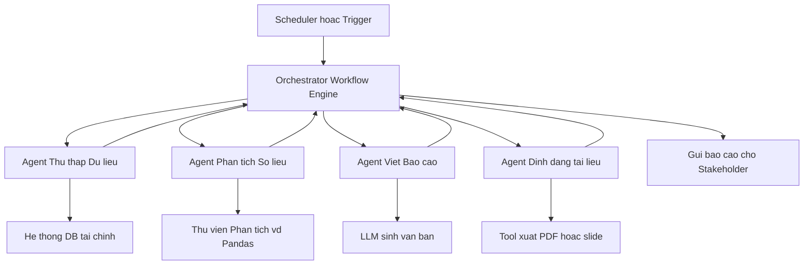

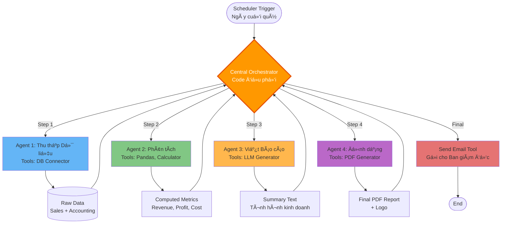

> Orchestrator (code) Ä‘iá»u phối lần lượt nhiá»u agent chuyên biệt. Má»—i agent làm phần việc của mình rồi trả kết quả vá». Luồng công việc cố định, ít hoặc không có tá»± chủ ở từng agent.


Kiến trúc "Orchestration" giống nhÆ° má»™t dây chuyá»n lắp ráp thông minh, nÆ¡i má»—i "trạm" là má»™t agent chuyên biệt (hoặc má»™t LLM call). Má»™t "nhà Ä‘iá»u phối" (Orchestrator), thÆ°á»ng là code cứng chứ không phải LLM, sẽ Ä‘iá»u hÆ°á»›ng công việc qua các trạm theo má»™t luồng đã định.

*   **Luồng hoạt động (Ví dụ: Quy trình tạo báo cáo tài chính hàng quý):**
    1.  **Kích hoạt:** Äúng ngày cuối cùng của quý, má»™t bá»™ lập lịch (scheduler) kích hoạt quy trình.
    2.  **Trạm 1 (Agent Thu thập Dữ liệu):** Orchestrator gá»i agent này. Nó có công cụ để kết nối vào cÆ¡ sở dữ liệu bán hàng và kế toán, trích xuất dữ liệu thô.
    3.  **Trạm 2 (Agent Phân tích):** Orchestrator nhận dữ liệu thô và chuyển cho agent này. Nó sá»­ dụng các công cụ phân tích (vd: thÆ° viện Pandas) để tính toán các chỉ số quan trá»ng (doanh thu, lợi nhuận, chi phí).
    4.  **Trạm 3 (Agent Viết Báo cáo):** Orchestrator nhận các chỉ số và chuyển cho agent này. Nó sử dụng LLM với prompt "Viết một bản tóm tắt tình hình kinh doanh dựa trên các số liệu sau."
    5.  **Trạm 4 (Agent Äịnh dạng):** Orchestrator nhận bản tóm tắt và chuyển cho agent này để định dạng thành file PDF vá»›i logo công ty.
    6.  **Kết thúc:** Orchestrator gửi email file PDF cho ban giám đốc.

*   **Äặc Ä‘iểm kiến trúc:**
    *   **Dá»±a trên quy trình (Process-driven):** Trá»ng tâm là luồng công việc, không phải má»™t agent Ä‘Æ¡n lẻ.
    *   **Chuyên môn hóa:** Mỗi agent/trạm có một bộ công cụ và trách nhiệm riêng biệt.
    *   **Äiá»u phối tập trung:** Orchestrator (code) kiểm soát hoàn toàn luồng Ä‘i của dữ liệu.
    *   **Agency thấp:** Các agent riêng lẻ vẫn chỉ thực hiện các tác vụ được giao, không tự ra quyết định.

#### 5.2. Ví dụ thực tế

*   **Quy trình tuyển dụng tá»± Ä‘á»™ng:** Má»™t agent quét hồ sÆ¡ ứng viên, má»™t agent khác lên lịch phá»ng vấn, má»™t agent thứ ba gá»­i email xác nhận.
*   **Tá»± Ä‘á»™ng hóa Marketing:** Má»™t agent theo dõi các Ä‘á» cập trên mạng xã há»™i, má»™t agent khác tạo ná»™i dung trả lá»i, và má»™t agent thứ ba đăng bài.

#### 5.3. So sánh vá»›i microservices truyá»n thống

Kiến trúc Orchestration rất giống vá»›i kiến trúc Microservices. Má»—i agent chuyên biệt có thể được xem nhÆ° má»™t microservice. Äiểm khác biệt chính là các "microservice" này được tăng cÆ°á»ng bởi LLM, cho phép chúng xá»­ lý các đầu vào/đầu ra bằng ngôn ngữ tá»± nhiên và thá»±c hiện các tác vụ suy luận mà microservice truyá»n thống không thể.

### Chương 6: Phân tích sâu Quadrant 3: Autonomy

Äây là nÆ¡i sá»± "thông minh" thá»±c sá»± của agent bắt đầu tá»a sáng. Thay vì chỉ làm theo kịch bản, agent được trao quyá»n tá»± chủ để đạt được mục tiêu.

#### 6.1. Kiến trúc và Luồng hoạt động

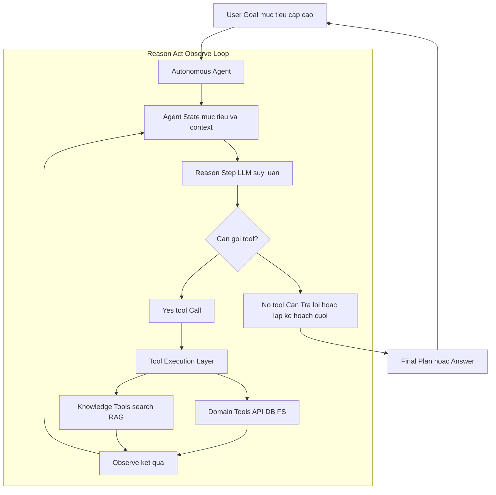

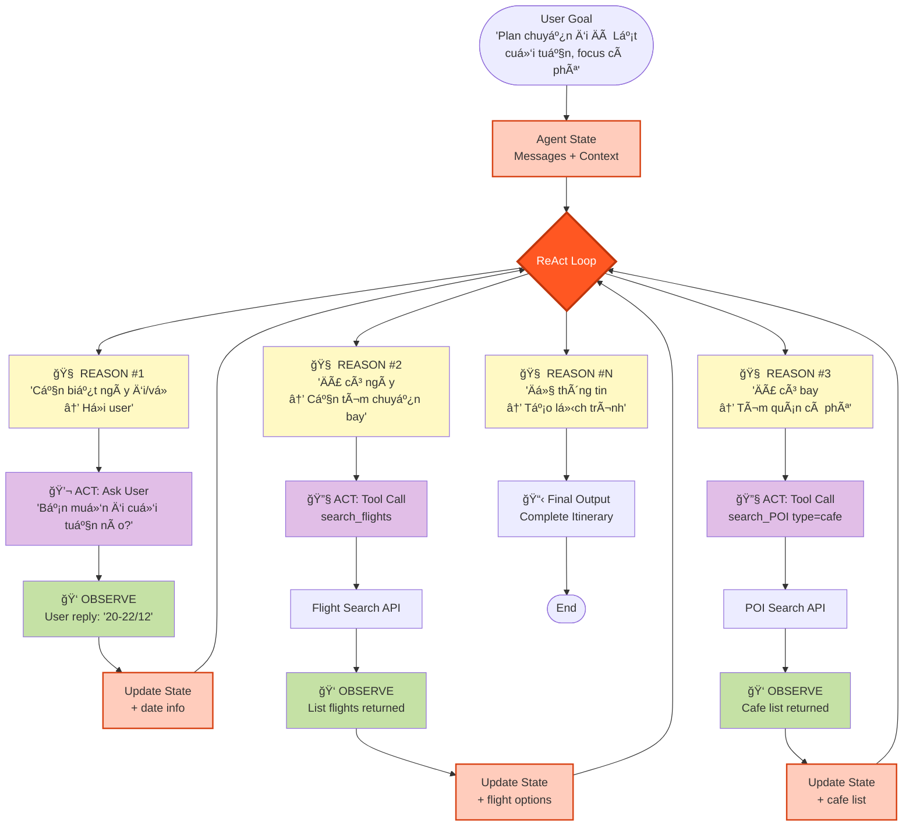

> Một agent duy nhất lặp vòng ReAct: Reason → Act (tool) → Observe → Reason… cho đến khi đạt mục tiêu. Nó tự quyết định cần tool nào, bao nhiêu bước, kế hoạch thế nào.

Agent "Autonomy" hoạt Ä‘á»™ng theo má»™t vòng lặp liên tục, nổi tiếng nhất là mẫu **ReAct (Reason + Act)**. Nó không Ä‘i theo má»™t Ä‘Æ°á»ng thẳng mà là má»™t chu trình khám phá và Ä‘iá»u chỉnh.

*   **Luồng hoạt động (Ví dụ: Agent Lập kế hoạch Du lịch):**
    1.  **Mục tiêu:** NgÆ°á»i dùng Ä‘Æ°a ra má»™t mục tiêu cấp cao: "Tìm cho tôi má»™t chuyến Ä‘i cuối tuần đến Äà Lạt, tập trung vào cà phê và thiên nhiên."
    2.  **Vòng lặp 1:**
        *   **Reason (Suy luận):** LLM nghÄ©: "Äể lên kế hoạch, trÆ°á»›c hết tôi cần biết ngày Ä‘i và ngày vá». Tôi sẽ há»i ngÆ°á»i dùng."
        *   **Act (Hành Ä‘á»™ng):** Agent không có công cụ để há»i, nó chỉ trả lá»i ngÆ°á»i dùng: "Tuyệt vá»i! Bạn muốn Ä‘i vào cuối tuần nào?"
    3.  **Vòng lặp 2 (Sau khi ngÆ°á»i dùng trả lá»i):**
        *   **Reason:** "OK, đã có ngày. GiỠtôi cần tìm chuyến bay. Tôi sẽ dùng công cụ `search_flights`."
        *   **Act:** Execution Engine gá»i `search_flights(origin="SGN", destination="DLI", date="...")`.
        *   **Observe (Quan sát):** Công cụ trả vỠmột danh sách các chuyến bay.
    4.  **Vòng lặp 3:**
        *   **Reason:** "Äã có chuyến bay. Giá» tôi cần tìm các quán cà phê đẹp. Tôi sẽ dùng công cụ `search_points_of_interest`."
        *   **Act:** Execution Engine gá»i `search_points_of_interest(location="Dalat", type="cafe")`.
        *   **Observe:** Công cụ trả vỠmột danh sách các quán cà phê.
    5.  **...Vòng lặp tiếp tục...** cho đến khi agent thu thập đủ thông tin và tạo ra một lịch trình hoàn chỉnh.

*   **Äặc Ä‘iểm kiến trúc:**
    *   **HÆ°á»›ng mục tiêu (Goal-oriented):** Agent chỉ cần biết đích đến, không cần biết Ä‘Æ°á»ng Ä‘i.
    *   **Vòng lặp suy luận:** Cốt lõi là chu trình Reason-Act-Observe.
    *   **Lá»±a chá»n công cụ Ä‘á»™ng:** Agent tá»± quyết định dùng công cụ nào và khi nào.
    *   **Quản lý trạng thái:** Agent phải có bộ nhớ (ngắn hạn) để lưu trữ kết quả của các bước trước đó.

#### 6.2. Ví dụ thực tế

*   **Agent Nghiên cứu:** NgÆ°á»i dùng yêu cầu "Viết má»™t báo cáo vá» thị trÆ°á»ng xe Ä‘iện tại Việt Nam." Agent sẽ tá»± tìm kiếm Google, Ä‘á»c các bài báo, tổng hợp thông tin, và viết báo cáo.
*   **Agent Gỡ lá»—i Code:** Lập trình viên Ä‘Æ°a ra má»™t Ä‘oạn code lá»—i. Agent sẽ tá»± Ä‘á»c lá»—i, Ä‘á» xuất các giả thuyết, áp dụng các thay đổi, chạy lại code, và lặp lại cho đến khi sá»­a được lá»—i.

#### 6.3. Thách thức: Sai sốทบวภvà Kiểm soát

Sá»± tá»± do của agent tá»± chủ cÅ©ng là con dao hai lưỡi. Má»™t sai lầm nhỠở bÆ°á»›c đầu (ví dụ: hiểu sai má»™t kết quả tìm kiếm) có thể dẫn đến các quyết định sai lầm ở các bÆ°á»›c sau, tạo ra má»™t **sai sốทบวภ(compounding error)**. HÆ¡n nữa, việc để agent tá»± do hành Ä‘á»™ng có thể dẫn đến các kết quả không mong muốn hoặc chi phí API tăng vá»t. Do đó, các agent này đòi há»i phải có **sandboxing** (chạy trong môi trÆ°á»ng bị cô lập) và các **Guardrails** (Lá»›p Quản trị) cá»±c kỳ mạnh mẽ.

### Chương 7: Phân tích sâu Quadrant 4: Choreography

Äây là biên giá»›i của công nghệ agentic, nÆ¡i các hệ thống phức tạp nhất được xây dá»±ng bằng cách cho nhiá»u agent tá»± chủ hợp tác vá»›i nhau.

#### 7.1. Kiến trúc và Luồng hoạt động

Kiến trúc "Choreography" không có má»™t nhà Ä‘iá»u phối trung tâm. Thay vào đó, nó giống nhÆ° má»™t Ä‘á»™i ngÅ© chuyên gia, má»—i ngÆ°á»i có chuyên môn riêng, tá»± giao tiếp và phối hợp vá»›i nhau để giải quyết má»™t vấn Ä‘á» lá»›n. Hành vi của toàn bá»™ hệ thống là **nổi hiện (emergent)** từ sá»± tÆ°Æ¡ng tác của các cá nhân.

**SÆ¡ đồ luồng hoạt Ä‘á»™ng (Ví dụ: Äá»™i Agent Nghiên cứu Thị trÆ°á»ng):**

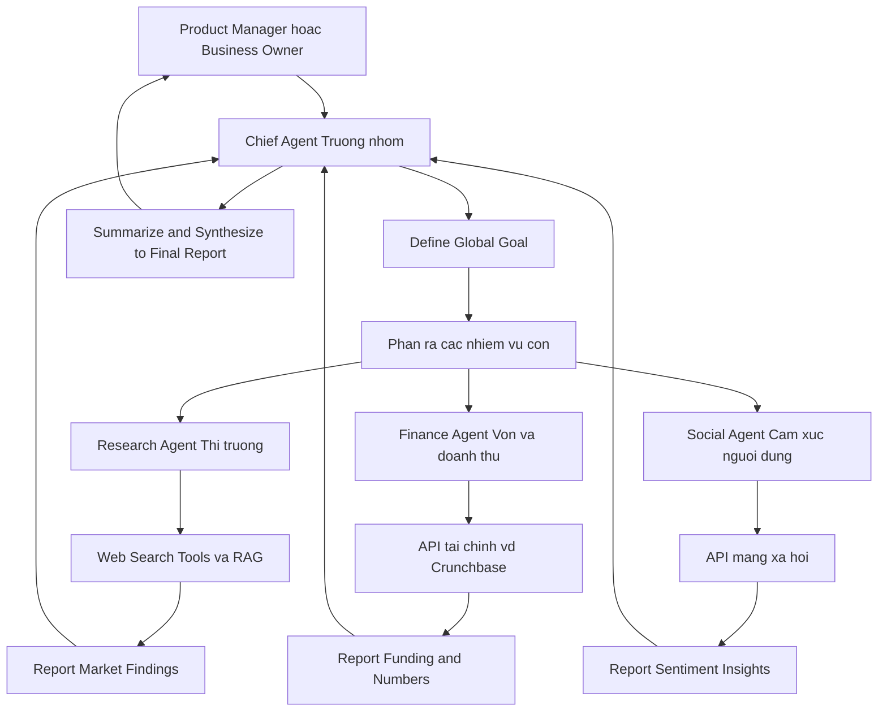

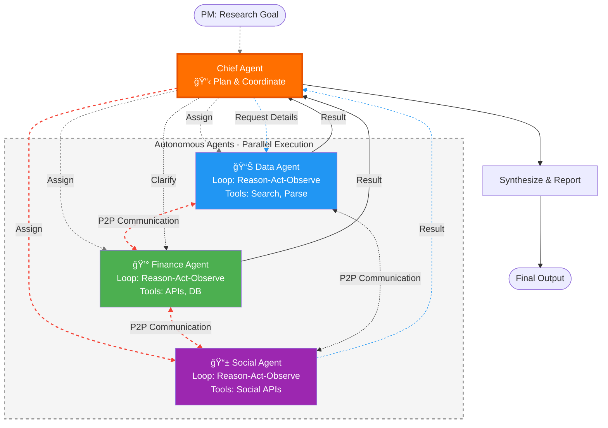


*   **Luồng hoạt động:**
    1.  **Mục tiêu:** Má»™t Product Manager Ä‘Æ°a ra yêu cầu cho **Agent Trưởng nhóm (Chief Researcher)**: "Phân tích thị trÆ°á»ng protein thá»±c vật ở Äông Nam Ã."
    2.  **Phân rã & Giao việc:** Agent Trưởng nhóm không tự làm. Nó phân rã mục tiêu thành các nhiệm vụ con và giao cho các agent chuyên biệt:
        *   Giao cho **Agent Phân tích Dữ liệu**: "Tìm các bài báo, tin tức, và báo cáo thị trÆ°á»ng."
        *   Giao cho **Agent Phân tích Tài chính**: "Tìm thông tin vá» các vòng gá»i vốn của các công ty chủ chốt."
        *   Giao cho **Agent Phân tích Mạng xã há»™i**: "Phân tích cảm xúc của ngÆ°á»i tiêu dùng trên Twitter và Reddit."
    3.  **Thực thi song song:** Cả ba agent chuyên biệt bắt đầu làm việc cùng một lúc, sử dụng các công cụ riêng của chúng (Web Search, Crunchbase API, Social Media API).
    4.  **Tổng hợp:** Khi các agent chuyên biệt hoàn thành, chúng gửi kết quả trở lại cho Agent Trưởng nhóm.
    5.  **Hoàn thành:** Agent Trưởng nhóm nhận tất cả các mảnh thông tin, Ä‘á»c, hiểu, và viết thành má»™t báo cáo tổng hợp duy nhất, mạch lạc.

*   **Äặc Ä‘iểm kiến trúc:**
    *   **Phân tán:** Không có điểm kiểm soát trung tâm duy nhất.
    *   **Chuyên môn hóa cao:** Mỗi agent là một chuyên gia trong lĩnh vực của mình.
    *   **Giao tiếp ngang hàng:** Các agent có thể giao tiếp trá»±c tiếp vá»›i nhau (ví dụ: Agent Phân tích Dữ liệu có thể há»i Agent Phân tích Tài chính vá» má»™t công ty mà nó tìm thấy).
    *   **Hành vi nổi hiện:** Kết quả cuối cùng là sản phẩm của sự hợp tác, không phải là một kịch bản được định trước.

#### 7.2. Ví dụ thực tế

*   **Tối Æ°u hóa chuá»—i cung ứng (Uber/Grab):** Má»™t agent đại diện cho má»—i tài xế, má»™t agent đại diện cho má»—i hành khách. Các agent này liên tục giao tiếp để tìm ra sá»± kết hợp tối Æ°u nhất giữa cung và cầu trong thá»i gian thá»±c.
*   **Mô phá»ng thị trÆ°á»ng tài chính:** Má»—i agent đóng vai má»™t nhà đầu tÆ° vá»›i má»™t chiến lược riêng. Hệ thống chạy mô phá»ng để xem các chiến lược này tÆ°Æ¡ng tác vá»›i nhau nhÆ° thế nào và tác Ä‘á»™ng đến thị trÆ°á»ng ra sao.
*   **Phát triển phần má»m tá»± Ä‘á»™ng:** Má»™t agent "Product Manager" viết yêu cầu, má»™t agent "Developer" viết code, má»™t agent "QA" viết và chạy test. Chúng làm việc cùng nhau trong má»™t vòng lặp để tạo ra phần má»m.

#### 7.3. Thách thức: Phức tạp ở quy mô lớn

Kiến trúc Choreography cực kỳ mạnh mẽ nhưng cũng vô cùng phức tạp để thiết kế và gỡ lỗi. Các thách thức chính bao gồm:

*   **Giao tiếp:** Làm thế nào để các agent giao tiếp hiệu quả và không bị "nhiễu" thông tin?
*   **Giải quyết xung Ä‘á»™t:** Äiá»u gì xảy ra khi hai agent có ý kiến trái ngược nhau?
*   **Ghi nhận công lao (Credit Assignment):** Khi hệ thống thành công, làm thế nào để biết agent nào đã đóng góp nhiá»u nhất?
*   **Khả năng quan sát:** Việc theo dõi và hiểu được luồng suy nghĩ của một hệ thống phân tán như vậy là một bài toán cực kỳ khó.

Do đó, kiến trúc này hiện chủ yếu được sá»­ dụng trong các môi trÆ°á»ng nghiên cứu hoặc các ứng dụng rất chuyên biệt, có giá trị cá»±c cao của các công ty công nghệ lá»›n.

---

*Kết thúc Phần II. Chúng ta đã khám phá bốn loại kiến trúc agent chính. GiỠđây, bạn đã có một "la bàn" để định vị các loại bài toán khác nhau. Trong Phần III, chúng ta sẽ bắt đầu hành trình thực tế: xây dựng các agent thuộc các quadrant này thông qua một lộ trình chi tiết với code mẫu.*

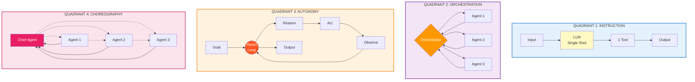

#### Demo tại buổi Agent Roadmap Wecommit100x

```python
class MessageBus:
    """
    Central PubSub for P2P communication using Redis.

    Features:
    - Redis PubSub for distributed messaging
    - Subscribe/Publish pattern
    - Message history for debugging
    - Async handlers
    - Non-blocking publish (fire-and-forget)
    - Auto-fallback to in-memory if Redis fails
    """
```


## PHẦN III: LỘ TRÃŒNH LÀM CHỦ THIẾT KẾ HỆ THá»NG AGENT

Phần này là trái tim của toàn bá»™ tài liệu. Chúng tôi sẽ cung cấp má»™t lá»™ trình chi tiết, gồm 5 cấp Ä‘á»™, để Ä‘Æ°a bạn từ má»™t ngÆ°á»i má»›i bắt đầu trở thành má»™t chuyên gia vá» hệ thống agent. Má»—i cấp Ä‘á»™ sẽ bao gồm lý thuyết cốt lõi và má»™t dá»± án thá»±c hành cụ thể, vá»›i code mẫu và giải thích chi tiết, giúp bạn áp dụng ngay những gì đã há»c.

### ChÆ°Æ¡ng 8: Level 0 - Äiá»u kiện tiên quyết

TrÆ°á»›c khi viết dòng code agentic đầu tiên, bạn cần đảm bảo mình đã có má»™t ná»n tảng kỹ thuật vững chắc. Việc bá» qua giai Ä‘oạn này sẽ khiến bạn gặp rất nhiá»u khó khăn ở các cấp Ä‘á»™ sau. Äây là những kỹ năng không thể thiếu.

#### 8.1. Yêu cầu vỠKỹ năng

*   **Python Nâng cao:**
    *   **Lập trình Hướng đối tượng (OOP):** Bạn phải thoải mái với `class`, `object`, `inheritance`. Các framework agentic sử dụng OOP một cách rộng rãi để định nghĩa Agent, Tool, và các thành phần khác.
    *   **Lập trình Bất đồng bá»™ (`asyncio`):** Các agent thÆ°á»ng phải gá»i nhiá»u API và thá»±c hiện nhiá»u tác vụ cùng lúc. `async` và `await` là bắt buá»™c để xây dá»±ng các agent hiệu quả, không bị chặn (non-blocking), đặc biệt khi làm việc vá»›i các tác vụ I/O (nhÆ° gá»i API mạng).
    *   **Thao tác vá»›i Dữ liệu:** Thành thạo vá»›i việc xá»­ lý JSON, dictionary, và list là Ä‘iá»u kiện tiên quyết.

*   **Kiến thức vỠAPI:**
    *   **REST API:** Hiểu sâu vá» các phÆ°Æ¡ng thức HTTP (`GET`, `POST`, `PUT`, `DELETE`), status code (200, 404, 500), và cách truyá»n dữ liệu (headers, body, query parameters).
    *   **Xác thực (Authentication):** Có kinh nghiệm thực tế với các cơ chế xác thực phổ biến như API Keys, OAuth 2.0. Bạn sẽ cần nó để cho phép agent truy cập các dịch vụ được bảo vệ.

*   **Kiến thức LLM Cơ bản:**
    *   **Kinh nghiệm thá»±c tế:** Äã từng sá»­ dụng API của má»™t nhà cung cấp LLM lá»›n (OpenAI, Google, Anthropic) để thá»±c hiện các tác vụ tạo sinh văn bản Ä‘Æ¡n giản.
    *   **Hiểu các khái niệm cốt lõi:**
        *   **Token:** ÄÆ¡n vị tính toán của LLM. Hiểu token giúp bạn Æ°á»›c tính chi phí và quản lý Ä‘á»™ dài của prompt.
        *   **Context Window:** Giá»›i hạn vá» lượng thông tin (tính bằng token) mà LLM có thể "nhá»›" trong má»™t lượt tÆ°Æ¡ng tác. Äây là má»™t trong những ràng buá»™c quan trá»ng nhất khi thiết kế agent.
        *   **System Prompt:** Hiểu vai trò của system prompt trong việc định hình hành vi và "tính cách" của LLM.

#### 8.2. Thiết lập Môi trÆ°á»ng

Äể chuẩn bị cho các dá»± án trong các chÆ°Æ¡ng tiếp theo, hãy tạo má»™t môi trÆ°á»ng ảo Python và cài đặt các thÆ° viện cần thiết:

```bash
# Tạo và kích hoạt môi trÆ°á»ng ảo
python -m venv agent_env
source agent_env/bin/activate

# Cài đặt các thư viện cốt lõi
pip install openai python-dotenv langchain langgraph crewai

# Tạo file .env để lưu trữ API key
echo "OPENAI_API_KEY=\"your_openai_api_key_here\"" > .env
```

### ChÆ°Æ¡ng 9: Level 1 - Agentic Fundamentals & Instruction Agent

Ỡcấp độ này, chúng ta sẽ xây dựng agent đầu tiên: một agent "Instruction" thuộc Quadrant 1. Mục tiêu là hiểu rõ vòng lặp agent cơ bản và cách làm cho LLM hoạt động một cách đáng tin cậy cho một tác vụ cụ thể.

#### 9.1. Lý thuyết cốt lõi

*   **Vòng lặp Agent cÆ¡ bản:** Äây là mô hình Ä‘Æ¡n giản nhất: **Nhận đầu vào -> Suy luận (LLM) -> Hành Ä‘á»™ng (Tool)**. Không có kế hoạch phức tạp, không có bá»™ nhá»› dài hạn.
*   **Structured Outputs (Äầu ra có cấu trúc):** Thách thức lá»›n nhất khi làm việc vá»›i LLM là chúng thÆ°á»ng trả vá» văn bản tá»± do, khó phân tích. Kỹ thuật quan trá»ng ở level này là ép LLM trả vá» má»™t định dạng dữ liệu nhất quán nhÆ° JSON. Hầu hết các LLM hiện đại Ä‘á»u há»— trợ "JSON Mode" để đảm bảo đầu ra luôn là má»™t JSON hợp lệ.
*   **Tool Use (Sá»­ dụng Công cụ) cÆ¡ bản:** Chúng ta sẽ định nghÄ©a má»™t hàm Python Ä‘Æ¡n giản và hÆ°á»›ng dẫn LLM cách gá»i hàm đó vá»›i các tham số chính xác được trích xuất từ yêu cầu của ngÆ°á»i dùng.

#### 9.2. Dự án thực hành: Xây dựng Agent Phân loại Ticket Hỗ trợ (Demo 1)

**9.2.1. Yêu cầu và Thiết kế**

*   **Mục tiêu:** Xây dá»±ng má»™t agent tá»± Ä‘á»™ng Ä‘á»c email há»— trợ khách hàng, phân loại (Category) và xác định Ä‘á»™ Æ°u tiên (Priority), sau đó gá»i má»™t hàm để cập nhật vào hệ thống (giả lập).
*   **Kiến trúc:** Quadrant 1 - Instruction.
*   **Thành phần MECE được sử dụng:**
    *   **Perception:** Input Processor (nhận văn bản email).
    *   **Cognition:** Reasoning Engine (LLM để phân loại).
    *   **Action:** Tool Library (má»™t hàm `tag_ticket`), Execution Engine (gá»i hàm đó).

**9.2.2. Code Walkthrough chi tiết**

Tạo một file tên `level1_classifier.py`:

```python
import os
import json
from openai import OpenAI
from dotenv import load_dotenv

# 1. THIẾT LẬP
# Tải API key từ file .env
load_dotenv()
client = OpenAI(api_key=os.getenv("OPENAI_API_KEY"))

# 2. ÄỊNH NGHĨA CÔNG CỤ (TOOL DEFINITION)
# Äây là hàm mà chúng ta muốn LLM gá»i.
def tag_support_ticket(ticket_id: int, category: str, priority: str):
    """Gắn thẻ một ticket hỗ trợ với loại và mức độ ưu tiên được chỉ định.

    Args:
        ticket_id (int): ID của ticket cần gắn thẻ.
        category (str): Loại của ticket. Phải là một trong các giá trị: ["Billing Inquiry", "Technical Support", "Sales Question", "General Inquiry"].
        priority (str): Mức độ ưu tiên của ticket. Phải là một trong các giá trị: ["Low", "Medium", "High"].
    """
    print(f"\n[ACTION] Tagging ticket {ticket_id} with:")
    print(f"  - Category: {category}")
    print(f"  - Priority: {priority}")
    # Trong thá»±c tế, hàm này sẽ gá»i API của Jira, Zendesk, v.v.
    return {"status": "success", "ticket_id": ticket_id}

# 3. LOGIC CHÃNH CỦA AGENT
def run_classification_agent(ticket_id: int, email_content: str):
    print(f"--- Processing Ticket {ticket_id} ---")
    print(f"Email Content: {email_content}")

    # Äịnh nghÄ©a các công cụ mà LLM có thể sá»­ dụng
    tools = [
        {
            "type": "function",
            "function": {
                "name": "tag_support_ticket",
                "description": "Gắn thẻ một ticket hỗ trợ với loại và mức độ ưu tiên được chỉ định.",
                "parameters": {
                    "type": "object",
                    "properties": {
                        "ticket_id": {"type": "integer", "description": "ID của ticket"},
                        "category": {
                            "type": "string",
                            "enum": ["Billing Inquiry", "Technical Support", "Sales Question", "General Inquiry"]
                        },
                        "priority": {
                            "type": "string",
                            "enum": ["Low", "Medium", "High"]
                        }
                    },
                    "required": ["ticket_id", "category", "priority"]
                }
            }
        }
    ]

    # Gá»i LLM vá»›i ná»™i dung email và yêu cầu nó sá»­ dụng công cụ
    response = client.chat.completions.create(
        model="gpt-4o-mini", # Dùng model nhá», nhanh, rẻ cho tác vụ Ä‘Æ¡n giản
        messages=[
            {"role": "system", "content": "You are an expert support ticket classifier. Your job is to analyze the user's email and use the tag_support_ticket function to classify it."},
            {"role": "user", "content": email_content}
        ],
        tools=tools,
        tool_choice="auto" # Äể LLM tá»± quyết định khi nào dùng công cụ
    )

    response_message = response.choices[0].message

    # Kiểm tra xem LLM có quyết định gá»i công cụ hay không
    if response_message.tool_calls:
        print("\n[REASONING] LLM decided to call a tool.")
        tool_call = response_message.tool_calls[0]
        function_name = tool_call.function.name
        function_args = json.loads(tool_call.function.arguments)

        if function_name == "tag_support_ticket":
            # Gá»i hàm Python tÆ°Æ¡ng ứng
            result = tag_support_ticket(
                ticket_id=ticket_id, # Truyá»n ticket_id từ logic của chúng ta
                category=function_args.get("category"),
                priority=function_args.get("priority")
            )
            print(f"\n[RESULT] {result}")
        else:
            print(f"Error: LLM called an unknown function: {function_name}")
    else:
        print("\n[REASONING] LLM did not call any tool. It might be asking for clarification.")
        print(f"LLM Response: {response_message.content}")

    print("--- End of Ticket Processing ---\n")

# 4. CHẠY THỬ
if __name__ == "__main__":
    # Ví dụ 1: Vấn đỠkỹ thuật khẩn cấp
    email_1 = "Hi, our main production server is down! We can't access anything. This is extremely urgent, please help ASAP!"
    run_classification_agent(101, email_1)

    # Ví dụ 2: Há»i vá» hóa Ä‘Æ¡n
    email_2 = "Hello, I was looking at my last invoice and I think there might be a mistake in the charges. Can someone please take a look? It's not super urgent. Thanks."
    run_classification_agent(102, email_2)

    # Ví dụ 3: Yêu cầu không rõ ràng
    email_3 = "Hey, can you help me with something?"
    run_classification_agent(103, email_3)
```

**Giải thích Code:**

1.  **Äịnh nghÄ©a Công cụ:** Chúng ta định nghÄ©a má»™t hàm Python `tag_support_ticket` bình thÆ°á»ng. Äiá»u quan trá»ng là **docstring** và **type hints** của nó. Äây là thông tin mà chúng ta sẽ chuyển cho LLM.
2.  **Chuyển đổi sang định dạng của OpenAI:** Trong `run_classification_agent`, chúng ta tạo một đối tượng `tools` để mô tả hàm Python của mình theo định dạng mà API của OpenAI yêu cầu. Chúng ta định nghĩa tên hàm, mô tả, và các tham số (bao gồm cả các giá trị `enum` hợp lệ). Việc này giúp LLM biết chính xác nó có thể làm gì và phải cung cấp những thông tin gì.
3.  **Gá»i LLM:** Chúng ta gá»i API `chat.completions.create` và truyá»n vào `tools`. Tham số `tool_choice="auto"` cho phép LLM tá»± quyết định có nên gá»i công cụ hay không.
4.  **Xá»­ lý Phản hồi:** Phản hồi từ LLM có thể chứa má»™t `tool_calls`. Nếu có, Ä‘iá»u đó có nghÄ©a là LLM muốn thá»±c hiện má»™t hành Ä‘á»™ng. Chúng ta phân tích các tham số mà LLM đã tạo ra và gá»i hàm Python tÆ°Æ¡ng ứng.

**9.2.3. Äánh giá và Kiểm thá»­**

Chạy file `level1_classifier.py`, bạn sẽ thấy kết quả:

*   Với `email_1`, agent sẽ xác định đúng là `Technical Support` và `High` priority.
*   Với `email_2`, agent sẽ xác định đúng là `Billing Inquiry` và `Medium` hoặc `Low` priority.
*   Vá»›i `email_3`, agent có thể sẽ không gá»i công cụ mà trả vá» má»™t câu há»i làm rõ nhÆ° "Of course, what can I help you with?", cho thấy nó hiểu rằng nó chÆ°a đủ thông tin để hành Ä‘á»™ng.

**Bài há»c rút ra từ Level 1:**

*   Bạn đã xây dựng thành công một agent hoàn chỉnh, tuy đơn giản nhưng giải quyết được một bài toán thực tế.
*   Bạn đã hiểu cách "giao tiếp" với LLM vỠcác công cụ nó có thể sử dụng.
*   Bạn đã thấy được sức mạnh của việc ép LLM trả vỠdữ liệu có cấu trúc để tích hợp với các hệ thống khác.
*   Bạn cÅ©ng thấy được giá»›i hạn: agent này không thể tá»± đặt câu há»i để làm rõ thông tin trong má»™t chu trình. Nó chỉ có thể thá»±c hiện má»™t hành Ä‘á»™ng duy nhất cho má»—i đầu vào.

Vá»›i ná»n tảng này, bạn đã sẵn sàng để bÆ°á»›c sang Level 2, nÆ¡i chúng ta sẽ trao cho agent khả năng tá»± lập kế hoạch và thá»±c hiện các tác vụ nhiá»u bÆ°á»›c phức tạp.

*(Tiếp tục các Chương 10, 11, 12 trong các phần sau...)*…)*


### ChÆ°Æ¡ng 10: Level 2 - Core Patterns & Autonomous Agent

Chào mừng bạn đến vá»›i Level 2. Tại đây, chúng ta sẽ thá»±c hiện má»™t bÆ°á»›c nhảy vá»t vá» Ä‘á»™ phức tạp và sức mạnh. Chúng ta sẽ chuyển từ má»™t agent chỉ biết làm theo lệnh sang má»™t agent có khả năng **tá»± suy nghÄ© và lập kế hoạch** để đạt được má»™t mục tiêu. Äây là lúc chúng ta thá»±c sá»± bÆ°á»›c vào thế giá»›i của các agent tá»± chủ (Autonomous Agents) thuá»™c Quadrant 3.

#### 10.1. Lý thuyết cốt lõi

Äể xây dá»±ng má»™t agent tá»± chủ, chúng ta cần các khái niệm và công cụ mạnh mẽ hÆ¡n so vá»›i Level 1.

*   **ReAct (Reason + Act):** Äây là mẫu (pattern) ná»n tảng cho các agent tá»± chủ. Thay vì chỉ thá»±c hiện má»™t hành Ä‘á»™ng duy nhất, agent sẽ hoạt Ä‘á»™ng trong má»™t vòng lặp:
    1.  **Reason (Suy luận):** Dựa trên mục tiêu và các thông tin đã có, LLM sẽ suy nghĩ vỠbước tiếp theo cần làm và công cụ nào cần sử dụng.
    2.  **Act (Hành Ä‘á»™ng):** Execution Engine sẽ gá»i công cụ mà LLM đã chá»n.
    3.  **Observe (Quan sát):** Agent nhận kết quả từ công cụ và đưa nó vào "bộ nhớ làm việc" (working memory) của mình.
    Vòng lặp này tiếp tục cho đến khi agent tin rằng nó đã hoàn thành mục tiêu.

*   **Lập kế hoạch & Phân rã (Planning & Decomposition):** Agent không chỉ hành động ngẫu nhiên. Nó phải có khả năng phân rã một mục tiêu lớn (ví dụ: "lên kế hoạch chuyến đi") thành các nhiệm vụ con (tìm chuyến bay, tìm khách sạn, v.v.) và quyết định thứ tự thực hiện chúng.

*   **Quản lý Trạng thái (State Management):** Vì agent thá»±c hiện nhiá»u bÆ°á»›c, nó cần má»™t nÆ¡i để lÆ°u trữ trạng thái của mình, bao gồm: mục tiêu ban đầu, các bÆ°á»›c đã thá»±c hiện, kết quả từ các công cụ, và kế hoạch cho các bÆ°á»›c tiếp theo. Äây là má»™t thách thức kỹ thuật lá»›n, và đó là lý do tại sao chúng ta cần má»™t framework chuyên dụng nhÆ° **LangGraph**.

*   **Lá»±a chá»n Công cụ Äá»™ng (Dynamic Tool Selection):** Vá»›i má»™t thÆ° viện có nhiá»u công cụ, agent phải tá»± quyết định nên sá»­ dụng công cụ nào ở má»—i bÆ°á»›c. Ví dụ, sau khi tìm chuyến bay, nó phải biết rằng bÆ°á»›c tiếp theo là tìm khách sạn, chứ không phải tìm chuyến bay má»™t lần nữa.

#### 10.2. Dự án thực hành: Xây dựng Agent Lập kế hoạch Du lịch (Demo 2)

**10.2.1. Yêu cầu và Thiết kế**

*   **Mục tiêu:** Xây dựng một agent có thể nhận một yêu cầu du lịch mơ hồ bằng ngôn ngữ tự nhiên và tự động thực hiện các bước cần thiết (tìm chuyến bay, tìm khách sạn, tìm địa điểm) để tạo ra một kế hoạch chi tiết.
*   **Kiến trúc:** Quadrant 3 - Autonomy.
*   **Framework:** **LangGraph**. Chúng ta sá»­ dụng LangGraph vì nó được thiết kế đặc biệt để xây dá»±ng các agent có trạng thái (stateful) và có vòng lặp. Nó cho phép chúng ta định nghÄ©a luồng hoạt Ä‘á»™ng của agent nhÆ° má»™t đồ thị (graph), giúp việc quản lý và gỡ lá»—i trở nên dá»… dàng hÆ¡n nhiá»u.
*   **Thành phần MECE được sử dụng:**
    *   **Cognition:** Reasoning Engine (GPT-4o), Planning Module (logic ReAct), Memory System (trạng thái của LangGraph).
    *   **Action:** Tool Library (nhiá»u công cụ: tìm chuyến bay, khách sạn), Execution Engine.

**10.2.2. Code Walkthrough chi tiết (LangGraph)**

Việc xây dựng với LangGraph phức tạp hơn một chút so với script đơn giản ở Level 1, nhưng nó cung cấp một cấu trúc mạnh mẽ và có thể mở rộng. Tạo một file tên `level2_travel_agent.py`:

```python
import os
import json
from openai import OpenAI
from dotenv import load_dotenv
from typing import TypedDict, Annotated, Sequence
import operator
from langgraph.graph import StateGraph, END

# --- 1. THIẾT LẬP --- 
load_dotenv()
client = OpenAI(api_key=os.getenv("OPENAI_API_KEY"))

# --- 2. ÄỊNH NGHĨA CÃC CÔNG CỤ (TOOLS) ---
# Chúng ta sẽ giả lập các hàm này để tập trung vào logic của agent
def search_flights(destination: str, date: str):
    """Tìm kiếm các chuyến bay đến một địa điểm vào một ngày cụ thể."""
    print(f"[TOOL] Searching flights to {destination} on {date}...")
    # Giả lập kết quả trả vỠtừ API
    return {"flights": [
        {"flight_number": "VN123", "departure": "SGN", "arrival": "DLI", "time": "08:00"},
        {"flight_number": "VJ456", "departure": "SGN", "arrival": "DLI", "time": "09:30"}
    ]}

def search_hotels(destination: str):
    """Tìm kiếm khách sạn tại một địa điểm."""
    print(f"[TOOL] Searching hotels in {destination}...")
    return {"hotels": [
        {"name": "Dalat Palace Heritage Hotel", "price_per_night": "$200"},
        {"name": "Ana Mandara Villas Dalat", "price_per_night": "$150"}
    ]}

# --- 3. ÄỊNH NGHĨA TRẠNG THÃI CỦA AGENT (AGENT STATE) ---
# State là bá»™ nhá»› của agent, được truyá»n qua lại giữa các node trong đồ thị
class AgentState(TypedDict):
    messages: Annotated[Sequence[dict], operator.add]

# --- 4. ÄỊNH NGHĨA CÃC NODE TRONG Äá»’ THỊ ---

# Node 1: Gá»i LLM để suy luận (Reason)
def call_model_node(state):
    """Node này chịu trách nhiệm gá»i LLM để quyết định bÆ°á»›c tiếp theo."""
    print("\n>>> Calling LLM for reasoning...")
    response = client.chat.completions.create(
        model="gpt-4o", # Cần model mạnh hơn cho việc lập kế hoạch
        messages=state["messages"],
        tools=tools_for_openai,
        tool_choice="auto"
    )
    return {"messages": [response.choices[0].message]}

# Node 2: Thực thi công cụ (Act)
def call_tool_node(state):
    """Node này thá»±c thi công cụ mà LLM đã quyết định gá»i."""
    last_message = state["messages"][-1]
    if not last_message.tool_calls:
        return {"messages": []} # Không có gì để làm

    print("\n>>> Executing tool...")
    tool_call = last_message.tool_calls[0]
    function_name = tool_call.function.name
    function_args = json.loads(tool_call.function.arguments)

    # Tìm và gá»i hàm Python tÆ°Æ¡ng ứng
    if function_name == "search_flights":
        result = search_flights(**function_args)
    elif function_name == "search_hotels":
        result = search_hotels(**function_args)
    else:
        result = {"error": f"Unknown tool: {function_name}"}
    
    # Tạo một message mới chứa kết quả từ công cụ để đưa lại cho LLM
    tool_response_message = {
        "tool_call_id": tool_call.id,
        "role": "tool",
        "name": function_name,
        "content": json.dumps(result)
    }
    return {"messages": [tool_response_message]}

# --- 5. XÂY Dá»°NG Äá»’ THỊ (GRAPH) ---

# Chuyển đổi hàm Python thành định dạng OpenAI tool
tools_for_openai = [
    {"type": "function", "function": {"name": "search_flights", "description": "Tìm kiếm các chuyến bay đến một địa điểm vào một ngày cụ thể.", "parameters": {"type": "object", "properties": {"destination": {"type": "string"}, "date": {"type": "string"}}, "required": ["destination", "date"]}}},
    {"type": "function", "function": {"name": "search_hotels", "description": "Tìm kiếm khách sạn tại một địa điểm.", "parameters": {"type": "object", "properties": {"destination": {"type": "string"}}, "required": ["destination"]}}},
]

# Äịnh nghÄ©a logic Ä‘iá»u hÆ°á»›ng (routing logic)
def should_continue(state):
    """Hàm này quyết định xem vòng lặp nên tiếp tục hay kết thúc."""
    last_message = state["messages"][-1]
    # Nếu LLM vừa gá»i má»™t công cụ, chúng ta cần thá»±c thi nó
    if last_message.tool_calls:
        return "continue_to_tool"
    # Nếu không, vòng lặp kết thúc và trả lá»i ngÆ°á»i dùng
    else:
        return "end_conversation"

# Tạo đồ thị
workflow = StateGraph(AgentState)

# Thêm các node vào đồ thị
workflow.add_node("call_model", call_model_node)
workflow.add_node("call_tool", call_tool_node)

# Thiết lập điểm bắt đầu
workflow.set_entry_point("call_model")

# Thêm các cạnh (edges) để kết nối các node
workflow.add_conditional_edges(
    "call_model",
    should_continue,
    {
        "continue_to_tool": "call_tool",
        "end_conversation": END
    }
)
workflow.add_edge("call_tool", "call_model") # Sau khi thá»±c thi tool, quay lại gá»i model để suy luận tiếp

# Biên dịch đồ thị thành một đối tượng có thể chạy được
app = workflow.compile()

# --- 6. CHẠY THỬ AGENT ---
if __name__ == "__main__":
    initial_input = "Hãy lên kế hoạch cho má»™t chuyến Ä‘i đến Äà Lạt vào ngày 25/12/2025. Tôi cần thông tin vá» chuyến bay và khách sạn."
    initial_state = {"messages": [{"role": "user", "content": initial_input}]}

    print(f"--- Starting Travel Agent ---")
    print(f"User Request: {initial_input}")

    # Chạy đồ thị với đầu vào ban đầu
    final_state = app.invoke(initial_state)

    print("\n--- Agent Finished ---")
    print("Final response:")
    print(final_state["messages"][-1].content)
```

**Giải thích Code:**

1.  **Agent State:** Chúng ta định nghÄ©a má»™t `AgentState`, má»™t dictionary Ä‘Æ¡n giản chứa `messages`. Äây là "bá»™ nhá»›" của agent sẽ được truyá»n Ä‘i khắp đồ thị. `operator.add` cho phép chúng ta dá»… dàng thêm message má»›i vào chuá»—i.
2.  **Nodes:** Má»—i hàm (`call_model_node`, `call_tool_node`) là má»™t "trạm" trong dây chuyá»n lắp ráp của chúng ta. `call_model_node` chịu trách nhiệm suy luận, và `call_tool_node` chịu trách nhiệm hành Ä‘á»™ng.
3.  **Graph Definition:**
    *   Chúng ta tạo một `StateGraph` với `AgentState` đã định nghĩa.
    *   `add_node` để thêm các hàm của chúng ta vào đồ thị.
    *   `set_entry_point` để nói cho đồ thị biết bắt đầu từ đâu (luôn là `call_model`).
    *   `add_conditional_edges` là phần ma thuật. Sau khi `call_model` chạy xong, nó sẽ gá»i hàm `should_continue`. Dá»±a trên kết quả trả vá» của `should_continue` ("continue_to_tool" hoặc "end_conversation"), đồ thị sẽ quyết định Ä‘i đến node tiếp theo (`call_tool`) hay kết thúc (END).
    *   `add_edge("call_tool", "call_model")` tạo ra vòng lặp ReAct. Sau khi thực thi công cụ, kết quả sẽ được đưa trở lại cho `call_model` để nó có thể suy luận vỠbước tiếp theo.
4.  **Compile & Invoke:** `workflow.compile()` biến định nghĩa đồ thị của chúng ta thành một ứng dụng thực thi. `app.invoke()` khởi chạy agent với trạng thái ban đầu.

**10.2.3. Trực quan hóa và Gỡ lỗi**

Một trong những lợi ích lớn nhất của LangGraph là khả năng trực quan hóa. Bạn có thể thêm một vài dòng code để tạo ra một file ảnh mô tả chính xác đồ thị mà bạn vừa xây dựng, giúp việc gỡ lỗi và hiểu luồng hoạt động trở nên cực kỳ dễ dàng.

**Bài há»c rút ra từ Level 2:**

*   Bạn đã xây dá»±ng được má»™t agent tá»± chủ có khả năng thá»±c hiện các tác vụ nhiá»u bÆ°á»›c.
*   Bạn đã hiểu và áp dụng được mẫu ReAct, cốt lõi của các agent hiện đại.
*   Bạn đã làm quen vá»›i má»™t framework mạnh mẽ (LangGraph) để quản lý trạng thái và các vòng lặp phức tạp, má»™t kỹ năng quan trá»ng để xây dá»±ng các agent có thể sản xuất hóa.
*   Bạn thấy được sự khác biệt rõ rệt vỠkhả năng giữa một agent chỉ biết làm theo lệnh và một agent có thể tự lập kế hoạch.

Bây giá», agent của bạn đã có thể tá»± suy nghÄ©. NhÆ°ng liệu nó có đáng tin cậy không? Liệu nó có an toàn không? Trong Level 3, chúng ta sẽ giải quyết những vấn Ä‘á» này bằng cách há»c cách "sản xuất hóa" agent của mình.


### ChÆ°Æ¡ng 11: Level 3 - Production Systems & Orchestration

Agent của bạn ở Level 2 đã rất thông minh, nhÆ°ng nó vẫn còn "ngây thÆ¡". Nó hoạt Ä‘á»™ng trong má»™t môi trÆ°á»ng lý tưởng, không có lá»—i, không có giá»›i hạn ngân sách, và không có hậu quả thá»±c sá»±. Level 3 là nÆ¡i chúng ta Ä‘Æ°a agent từ phòng thí nghiệm ra thế giá»›i thá»±c. Äây là cấp Ä‘á»™ vá» sá»± **trưởng thành** và **trách nhiệm**, tập trung vào việc xây dá»±ng các hệ thống agent mạnh mẽ, có thể quan sát, và an toàn để triển khai trong môi trÆ°á»ng sản xuất (production).

#### 11.1. Lý thuyết cốt lõi

Việc chuyển má»™t agent từ prototype sang production đòi há»i má»™t bá»™ kỹ năng hoàn toàn má»›i, gần vá»›i kỹ thuật phần má»m truyá»n thống hÆ¡n là chỉ Ä‘Æ¡n thuần vá» AI.

*   **Khả năng Quan sát (Observability):** Äây là yếu tố quan trá»ng nhất. Khi má»™t agent tá»± chủ hoạt Ä‘á»™ng, nó giống nhÆ° má»™t "há»™p Ä‘en". Nếu nó thất bại, bạn cần phải biết **tại sao**. Observability cho phép bạn trả lá»i các câu há»i:
    *   **Logging:** Agent đã làm gì ở mỗi bước?
    *   **Tracing:** Luồng suy nghÄ© (chain of thought) của agent là gì? Nó đã gá»i công cụ nào, vá»›i tham số gì, và kết quả ra sao?
    *   **Monitoring:** Agent hoạt động có hiệu quả không? Nó tốn bao nhiêu token? Tỷ lệ thành công là bao nhiêu?
    *   **Công cụ:** Các ná»n tảng nhÆ° **LangSmith**, Datadog, hoặc các giải pháp mã nguồn mở cung cấp các công cụ mạnh mẽ để theo dõi và gỡ lá»—i các ứng dụng LLM.

*   **Sự Mạnh mẽ (Robustness):** Thế giới thực đầy lỗi. API có thể không phản hồi, dữ liệu có thể bị sai định dạng, LLM có thể "ảo giác" (hallucinate). Một agent production-grade phải có khả năng xử lý những tình huống này một cách duyên dáng.
    *   **Xá»­ lý Lá»—i Toàn diện:** Triển khai các khối `try...except` xung quanh các lệnh gá»i công cụ và API.
    *   **Logic Thá»­ lại (Retry Logic):** Tá»± Ä‘á»™ng thá»­ lại các lệnh gá»i mạng thất bại vá»›i cÆ¡ chế exponential backoff.
    *   **Dữ liệu dự phòng (Fallbacks):** Nếu một API chính bị lỗi, agent có thể tự động chuyển sang một API phụ không?

*   **Quản trị (Governance):** Sức mạnh đi kèm với trách nhiệm. Governance là việc thiết lập các quy tắc và rào chắn để đảm bảo agent không gây hại.
    *   **Rào chắn (Guardrails):** NhÆ° đã thảo luận trong Phần I, đây là các bá»™ lá»c và quy tắc để ngăn chặn hành vi không mong muốn, từ việc từ chối các yêu cầu không phù hợp đến việc kiểm soát chi phí.
    *   **Quản lý Bí mật (Secrets Management):** API keys và các thông tin nhạy cảm khác không bao giỠđược hardcode. Chúng phải được lÆ°u trữ an toàn trong các dịch vụ nhÆ° AWS Secrets Manager, HashiCorp Vault, hoặc ít nhất là biến môi trÆ°á»ng.

*   **Con ngÆ°á»i trong Vòng lặp (Human-in-the-Loop - HITL):** Äối vá»›i các hành Ä‘á»™ng có rủi ro cao, tá»± Ä‘á»™ng hóa 100% là liá»u lÄ©nh. HITL là má»™t mẫu thiết kế nÆ¡i agent sẽ tạm dừng ở các Ä‘iểm quyết định quan trá»ng và yêu cầu sá»± phê duyệt của con ngÆ°á»i trÆ°á»›c khi tiếp tục. Äây là sá»± cân bằng hoàn hảo giữa hiệu quả của tá»± Ä‘á»™ng hóa và sá»± an toàn của việc kiểm soát thủ công.

#### 11.2. Dự án thực hành: "Sản xuất hóa" Agent Lập kế hoạch Du lịch

Chúng ta sẽ không viết một agent mới từ đầu. Thay vào đó, chúng ta sẽ lấy agent LangGraph từ Level 2 và nâng cấp nó với các tính năng của một hệ thống production.

**11.2.1. Yêu cầu và Thiết kế**

*   **Mục tiêu:** Nâng cấp Agent Lập kế hoạch Du lịch để nó trở nên đáng tin cậy và an toàn hơn.
*   **Các tính năng mới:**
    1.  **Tích hợp LangSmith:** Äể theo dõi má»i bÆ°á»›c suy luận và hành Ä‘á»™ng của agent.
    2.  **Thêm bÆ°á»›c HITL:** TrÆ°á»›c khi thá»±c hiện má»™t hành Ä‘á»™ng "giả lập" việc đặt vé, agent phải dừng lại và yêu cầu sá»± xác nhận của ngÆ°á»i dùng.
    3.  **Thêm công cụ mới:** Một công cụ `book_flight` có rủi ro cao để kích hoạt cơ chế HITL.

**11.2.2. Code Walkthrough chi tiết**

Chúng ta sẽ sửa đổi file `level2_travel_agent.py` và lưu nó thành `level3_production_agent.py`.

```python
# (Giữ lại toàn bộ phần import và thiết lập từ Level 2)
# ...

# --- THÊM CÔNG CỤ MỚI ---
def book_flight(flight_number: str):
    """Äặt má»™t chuyến bay vá»›i số hiệu được chỉ định. Äây là má»™t hành Ä‘á»™ng tốn kém và không thể hoàn tác."""
    print(f"[CRITICAL ACTION] Booking flight {flight_number}... This would cost real money!")
    return {"booking_status": "confirmed", "confirmation_id": "XYZ123"}

# --- CẬP NHẬT ÄỊNH NGHĨA TRẠNG THÃI ---
class AgentState(TypedDict):
    messages: Annotated[Sequence[dict], operator.add]
    # Thêm má»™t trÆ°á»ng để theo dõi yêu cầu tÆ°Æ¡ng tác của con ngÆ°á»i
    human_interaction_needed: bool

# --- CẬP NHẬT CÃC NODE ---

# (Node call_model_node không đổi)

# Cập nhật call_tool_node để nhận biết công cụ cần HITL
def call_tool_node(state):
    last_message = state["messages"][-1]
    if not last_message.tool_calls:
        return {"messages": [], "human_interaction_needed": False}

    tool_call = last_message.tool_calls[0]
    function_name = tool_call.function.name

    # KIỂM TRA HITL
    if function_name == "book_flight":
        print("\n>>> HUMAN INTERACTION NEEDED: Agent wants to book a flight.")
        # Äặt cỠđể đồ thị biết cần dừng lại
        return {"human_interaction_needed": True}

    # Nếu không phải công cụ cần HITL, thá»±c thi nhÆ° bình thÆ°á»ng
    print("\n>>> Executing safe tool...")
    function_args = json.loads(tool_call.function.arguments)
    
    if function_name == "search_flights":
        result = search_flights(**function_args)
    elif function_name == "search_hotels":
        result = search_hotels(**function_args)
    else:
        result = {"error": f"Unknown tool: {function_name}"}
    
    tool_response_message = {"tool_call_id": tool_call.id, "role": "tool", "name": function_name, "content": json.dumps(result)}
    return {"messages": [tool_response_message], "human_interaction_needed": False}

# --- CẬP NHẬT Äá»’ THỊ ---

# Thêm công cụ mới vào danh sách
tools_for_openai = [
    # (Giữ lại search_flights và search_hotels)
    # ...
    {"type": "function", "function": {"name": "book_flight", "description": "Äặt má»™t chuyến bay vá»›i số hiệu được chỉ định.", "parameters": {"type": "object", "properties": {"flight_number": {"type": "string"}}, "required": ["flight_number"]}}},
]

# Cập nhật logic Ä‘iá»u hÆ°á»›ng để xá»­ lý HITL
def should_continue(state):
    if state.get("human_interaction_needed", False):
        return "pause_for_human"
    
    last_message = state["messages"][-1]
    if last_message.tool_calls:
        return "continue_to_tool"
    else:
        return "end_conversation"

# Xây dựng lại đồ thị
workflow = StateGraph(AgentState)
workflow.add_node("call_model", call_model_node)
workflow.add_node("call_tool", call_tool_node)

# Thêm má»™t node má»›i cho sá»± tÆ°Æ¡ng tác của con ngÆ°á»i
# Node này chỉ là một điểm dừng, không thực hiện logic gì
workflow.add_node("human_intervention", lambda state: state)

workflow.set_entry_point("call_model")

workflow.add_conditional_edges(
    "call_model",
    should_continue,
    {
        "continue_to_tool": "call_tool",
        "end_conversation": END,
        "pause_for_human": "human_intervention" # Nếu cần HITL, Ä‘i đến node chá»
    }
)
workflow.add_edge("call_tool", "call_model")

# Biên dịch đồ thị
app = workflow.compile()

# --- TÃCH HỢP LANGSMITH ---
# Äể tích hợp, chỉ cần thiết lập các biến môi trÆ°á»ng sau TRƯỚC KHI chạy script:
# export LANGCHAIN_TRACING_V2="true"
# export LANGCHAIN_API_KEY="your_langsmith_api_key"
# export LANGCHAIN_PROJECT="Travel Agent Project"
# LangGraph sẽ tự động gửi tất cả các trace đến LangSmith.

# --- CHẠY THỬ VỚI HITL ---
if __name__ == "__main__":
    initial_input = "Tìm chuyến bay VN123 và đặt nó cho tôi."
    initial_state = {"messages": [{"role": "user", "content": initial_input}], "human_interaction_needed": False}

    print(f"--- Starting Production Agent ---")
    print(f"User Request: {initial_input}")

    # Chạy đồ thị cho đến khi nó dừng lại để chá» con ngÆ°á»i
    paused_state = app.invoke(initial_state)

    if paused_state.get("human_interaction_needed"):
        print("\n--- PAUSED FOR HUMAN APPROVAL ---")
        last_tool_call = next(m.tool_calls[0] for m in reversed(paused_state["messages"]) if m.tool_calls)
        print(f"Agent wants to run: {last_tool_call.function.name} with arguments {last_tool_call.function.arguments}")
        
        approval = input("Do you approve? (yes/no): ")

        if approval.lower() == "yes":
            print("\n>>> Human approved. Resuming agent...")
            # Thực thi hành động đã được phê duyệt
            function_args = json.loads(last_tool_call.function.arguments)
            result = book_flight(**function_args)
            tool_response_message = {"tool_call_id": last_tool_call.id, "role": "tool", "name": "book_flight", "content": json.dumps(result)}
            
            # Tiếp tục chạy đồ thị từ trạng thái đã dừng
            final_state = app.invoke({"messages": [tool_response_message]})
            print("\n--- Agent Finished ---")
            print(final_state["messages"][-1].content)
        else:
            print("\n--- Human rejected. Stopping agent. ---")
    else:
        print("\n--- Agent Finished Without Needing Approval ---")
        print(paused_state["messages"][-1].content)
```

**Giải thích Code:**

1.  **Cập nhật State:** Chúng ta thêm một cỠ`human_interaction_needed` vào `AgentState` để đồ thị có thể theo dõi khi nào cần dừng lại.
2.  **Cập nhật `call_tool_node`:** Node này giỠđây có thêm logic. TrÆ°á»›c khi thá»±c thi má»™t công cụ, nó kiểm tra xem tên hàm có phải là `book_flight` không. Nếu đúng, thay vì thá»±c thi, nó chỉ đặt cá» `human_interaction_needed` thành `True` và trả vá».
3.  **Cập nhật Logic Äiá»u hÆ°á»›ng:** Hàm `should_continue` được Æ°u tiên kiểm tra cá» `human_interaction_needed`. Nếu là `True`, nó sẽ Ä‘iá»u hÆ°á»›ng đồ thị đến má»™t node má»›i tên là `human_intervention`.
4.  **Node `human_intervention`:** Node này là một điểm dừng. Trong LangGraph, chúng ta có thể định nghĩa các điểm ngắt (breakpoints) tại các node. Khi đồ thị đến đây, nó sẽ tạm dừng và trả vỠtrạng thái hiện tại.
5.  **Vòng lặp TÆ°Æ¡ng tác:** Trong khối `if __name__ == "__main__":`, logic của chúng ta đã thay đổi. Chúng ta `invoke` agent, nhÆ°ng sau đó kiểm tra xem nó có bị tạm dừng không. Nếu có, chúng ta hiển thị hành Ä‘á»™ng mà agent muốn thá»±c hiện, há»i ngÆ°á»i dùng, và nếu được phê duyệt, chúng ta sẽ tá»± thá»±c thi hành Ä‘á»™ng đó và `invoke` agent má»™t lần nữa vá»›i kết quả, cho phép nó tiếp tục công việc.
6.  **Tích hợp LangSmith:** Äiá»u tuyệt vá»i là LangGraph được thiết kế để hoạt Ä‘á»™ng liá»n mạch vá»›i LangSmith. Bạn không cần thay đổi code. Chỉ cần đặt các biến môi trÆ°á»ng, và má»i lần chạy `app.invoke()` sẽ tá»± Ä‘á»™ng được ghi lại chi tiết, cho phép bạn xem toàn bá»™ cây suy luận, đầu vào/đầu ra của má»—i bÆ°á»›c.

**11.2.3. Chạy và Quan sát**

Khi bạn chạy `level3_production_agent.py`, agent sẽ dừng lại ngay trÆ°á»›c khi đặt vé và há»i ý kiến bạn. Sau đó, bạn có thể truy cập vào trang web của LangSmith, vào dá»± án "Travel Agent Project", và bạn sẽ thấy má»™t trace (dấu vết) chi tiết vá» toàn bá»™ quá trình, bao gồm cả suy nghÄ© của LLM và kết quả của các công cụ.

**Bài há»c rút ra từ Level 3:**

*   Bạn đã há»c được cách biến má»™t prototype thông minh thành má»™t hệ thống có trách nhiệm.
*   Bạn đã triển khai được mẫu thiết kế Human-in-the-Loop, má»™t yêu cầu gần nhÆ° bắt buá»™c cho các agent có khả năng thá»±c hiện các hành Ä‘á»™ng quan trá»ng.
*   Bạn đã hiểu được tầm quan trá»ng của khả năng quan sát và biết cách sá»­ dụng các công cụ nhÆ° LangSmith để gỡ lá»—i và giám sát các agent phức tạp.
*   Agent của bạn giỠđây không chỉ thông minh mà còn **an toàn** và **có thể kiểm soát**.

Bạn đã Ä‘i được má»™t chặng Ä‘Æ°á»ng dài. Từ má»™t script Ä‘Æ¡n giản, bạn đã xây dá»±ng được má»™t agent tá»± chủ, có trạng thái, và có thể sản xuất hóa. á» Level 4, chúng ta sẽ khám phá biên giá»›i cuối cùng: làm thế nào để nhiá»u agent nhÆ° vậy có thể làm việc cùng nhau.


### ChÆ°Æ¡ng 12: Level 4 - Advanced Multi-Agent Choreography

Level 4 đưa chúng ta đến đỉnh cao của sự phức tạp và sức mạnh trong thiết kế hệ thống agent: kiến trúc đa agent (Multi-Agent Systems) thuộc Quadrant 4. Tại đây, chúng ta không còn xây dựng một agent đơn lẻ nữa, mà là một **đội ngũ (team)** các agent tự chủ, mỗi agent có một chuyên môn riêng, hợp tác với nhau để giải quyết các vấn đỠquá lớn hoặc quá đa dạng cho bất kỳ cá nhân nào.

#### 12.1. Lý thuyết cốt lõi

Việc xây dựng một hệ thống đa agent giới thiệu một loạt các khái niệm và thách thức mới.

*   **Kiến trúc Äa Agent (Multi-Agent Architectures):**
    *   **Chuyên môn hóa theo Vai trò (Role-Based Specialization):** Nguyên tắc cốt lõi là chia một vấn đỠlớn thành các lĩnh vực chuyên môn và tạo ra một agent cho mỗi lĩnh vực. Ví dụ: một agent chuyên vỠtài chính, một agent chuyên vỠmarketing, một agent chuyên vỠkỹ thuật. Mỗi agent có system prompt, bộ nhớ, và bộ công cụ riêng, được tối ưu hóa cho vai trò của nó.
    *   **Giao thức Giao tiếp (Communication Protocols):** Làm thế nào để các agent nói chuyện vá»›i nhau? Chúng có thể giao tiếp trá»±c tiếp, hoặc thông qua má»™t "không gian chung" (shared space) nhÆ° má»™t blackboard. Việc thiết kế má»™t ngôn ngữ hoặc định dạng thông Ä‘iệp chung là rất quan trá»ng.
    *   **Các Mẫu Phối hợp (Coordination Patterns):**
        *   **Hierarchical (Phân cấp):** Má»™t agent "quản lý" hoặc "trưởng nhóm" sẽ phân công nhiệm vụ cho các agent "nhân viên" và tổng hợp kết quả. Äây là mẫu phổ biến và dá»… quản lý nhất.
        *   **Swarm (Bầy đàn):** Các agent giao tiếp ngang hàng vá»›i nhau, không có sá»± phân cấp rõ ràng. Mẫu này linh hoạt hÆ¡n nhÆ°ng khó Ä‘iá»u phối và gỡ lá»—i hÆ¡n.

*   **Phân chia & Tổng hợp Nhiệm vụ (Task Delegation & Synthesis):** Trong mẫu phân cấp, agent quản lý phải có khả năng:
    1.  **Phân rã (Decompose):** Nhận một mục tiêu lớn và chia nó thành các nhiệm vụ con phù hợp với chuyên môn của từng agent nhân viên.
    2.  **Giao việc (Delegate):** Gửi nhiệm vụ và ngữ cảnh cần thiết cho đúng agent.
    3.  **Tổng hợp (Synthesize):** Nhận lại kết quả từ nhiá»u agent và kết hợp chúng thành má»™t câu trả lá»i hoặc sản phẩm cuối cùng mạch lạc.

*   **Hành vi Nổi hiện (Emergent Behavior):** Khi nhiá»u agent tá»± chủ tÆ°Æ¡ng tác, các hành vi phức tạp và không lÆ°á»ng trÆ°á»›c có thể "nổi lên" từ các quy tắc Ä‘Æ¡n giản của từng agent. Äây vừa là sức mạnh (hệ thống có thể tìm ra các giải pháp sáng tạo) vừa là thách thức (hệ thống có thể hành xá»­ má»™t cách khó Ä‘oán).

*   **Frameworks:** Äể quản lý sá»± phức tạp này, chúng ta cần các framework được thiết kế riêng cho hệ thống Ä‘a agent. **CrewAI** là má»™t lá»±a chá»n tuyệt vá»i, cung cấp má»™t API cấp cao, trá»±c quan để định nghÄ©a các Agent, Tasks, và má»™t Process (quy trình) để Ä‘iá»u phối chúng.

#### 12.2. Dá»± án thá»±c hành: Xây dá»±ng Äá»™i Agent Nghiên cứu Thị trÆ°á»ng (Demo 3)

**12.2.1. Yêu cầu và Thiết kế**

*   **Mục tiêu:** Xây dá»±ng má»™t Ä‘á»™i ngÅ© agent có thể tá»± Ä‘á»™ng nghiên cứu và viết má»™t báo cáo phân tích thị trÆ°á»ng dá»±a trên má»™t yêu cầu cấp cao.
*   **Kiến trúc:** Quadrant 4 - Choreography (theo mẫu Hierarchical).
*   **Framework:** **CrewAI**. Chúng ta chá»n CrewAI vì nó có cú pháp rất rõ ràng, dá»… hiểu để định nghÄ©a các vai trò và quy trình làm việc của má»™t Ä‘á»™i ngÅ©.
*   **Các vai trò (Agents):**
    1.  **Market Research Analyst (Trưởng nhóm):** Chịu trách nhiệm chính, phân tích yêu cầu, và viết báo cáo cuối cùng.
    2.  **Data Analyst (Nhân viên):** Chuyên tìm kiếm và thu thập dữ liệu từ web.
    3.  **Financial Analyst (Nhân viên):** Chuyên tìm kiếm thông tin tài chính vỠcác công ty.
*   **Quy trình (Process):** Tuần tự. Trưởng nhóm sẽ giao việc cho các nhân viên, chỠhỠhoàn thành, sau đó sử dụng kết quả của hỠđể làm việc của mình.

**12.2.2. Code Walkthrough chi tiết (CrewAI)**

Tạo một file tên `level4_multi_agent_crew.py`:

```python
import os
from crewai import Agent, Task, Crew, Process
from crewai_tools import SerperDevTool # Một công cụ tìm kiếm web mạnh mẽ
from dotenv import load_dotenv

# --- 1. THIẾT LẬP ---
# Cần cài đặt: pip install crewai crewai-tools
# Cần có SERPER_API_KEY trong file .env để dùng SerperDevTool
load_dotenv()

# --- 2. ÄỊNH NGHĨA CÃC CÔNG CỤ ---
# CrewAI tích hợp sẵn các công cụ. Chúng ta chỉ cần khởi tạo nó.
# SerperDevTool là một công cụ tìm kiếm Google hiệu quả.
search_tool = SerperDevTool()

# --- 3. ÄỊNH NGHĨA CÃC AGENT TRONG ÄỘI NGŨ ---

print("--- Defining Agents ---")

# Agent 1: Data Analyst (Nhân viên)
data_analyst = Agent(
    role='Data Analyst',
    goal='Search the web for the latest news, articles, and analysis on the plant-based protein market in Southeast Asia.',
    backstory=(
        "You are an expert Data Analyst at a top market research firm. "
        "You are skilled at using web search tools to find relevant, high-quality information "
        "and summarizing the key findings."
    ),
    verbose=True,
    allow_delegation=False, # Nhân viên không được giao việc cho ngÆ°á»i khác
    tools=[search_tool]
)

# Agent 2: Financial Analyst (Nhân viên)
financial_analyst = Agent(
    role='Financial Analyst',
    goal='Find information about funding rounds, investments, and key financial players in the plant-based protein market in Southeast Asia.',
    backstory=(
        "You are a seasoned Financial Analyst specializing in emerging markets. "
        "You have a knack for digging up financial data and identifying investment trends."
    ),
    verbose=True,
    allow_delegation=False,
    tools=[search_tool] # Cũng dùng công cụ tìm kiếm, nhưng với mục tiêu khác
)

# Agent 3: Market Research Analyst (Trưởng nhóm)
research_manager = Agent(
    role='Market Research Manager',
    goal='Analyze the findings from the Data Analyst and Financial Analyst to create a comprehensive market analysis report.',
    backstory=(
        "You are the manager of the research team. Your strength lies in synthesizing complex information "
        "from multiple sources into a clear, actionable report for business stakeholders."
    ),
    verbose=True,
    # Trưởng nhóm có thể giao việc, nhưng trong quy trình này chúng ta không cần
    allow_delegation=False 
)

# --- 4. ÄỊNH NGHĨA CÃC NHIỆM VỤ (TASKS) ---

print("--- Defining Tasks ---")

# Nhiệm vụ 1: Giao cho Data Analyst
task_data_collection = Task(
    description=(
        "Search for recent news, trends, and consumer behavior analysis related to the plant-based protein market in Southeast Asia. "
        "Focus on the years 2024 and 2025."
    ),
    expected_output='A summary of 5-7 key findings with links to the original sources.',
    agent=data_analyst
)

# Nhiệm vụ 2: Giao cho Financial Analyst
task_financial_analysis = Task(
    description=(
        "Identify the top 5 key companies in the Southeast Asian plant-based protein market. "
        "Find any recent funding rounds or major investments they have received."
    ),
    expected_output='A list of the top 5 companies and their recent funding activities.',
    agent=financial_analyst
)

# Nhiệm vụ 3: Giao cho Trưởng nhóm
# Nhiệm vụ này sẽ tự động sử dụng kết quả của 2 nhiệm vụ trước làm ngữ cảnh
task_report_writing = Task(
    description=(
        "Read the summaries from the Data Analyst and the Financial Analyst. "
        "Combine their findings into a single, comprehensive market analysis report. "
        "The report should have an introduction, a section on market trends, a section on key players, and a conclusion."
    ),
    expected_output='A full market analysis report in Markdown format.',
    agent=research_manager
)

# --- 5. TẠO VÀ CHẠY CREW ---

print("--- Assembling and Kicking Off Crew ---")

# Tạo Crew với các agent và các task
market_research_crew = Crew(
    agents=[data_analyst, financial_analyst, research_manager],
    tasks=[task_data_collection, task_financial_analysis, task_report_writing],
    process=Process.sequential # Quy trình tuần tự: task 1 -> task 2 -> task 3
)

# Bắt đầu chạy!
result = market_research_crew.kickoff()

print("\n\n--- Crew Finished ---")
print("Final Report:")
print(result)

```

**Giải thích Code:**

1.  **Agents:** Với CrewAI, việc định nghĩa một agent rất trực quan. Bạn chỉ cần cung cấp `role` (vai trò), `goal` (mục tiêu), `backstory` (tiểu sử - giúp LLM nhập vai tốt hơn), và `tools` (danh sách các công cụ mà agent đó có thể sử dụng).
2.  **Tasks:** Má»—i `Task` là má»™t Ä‘Æ¡n vị công việc. Bạn cung cấp `description` (mô tả chi tiết nhiệm vụ) và `agent` (agent sẽ thá»±c hiện nhiệm vụ đó). Äiá»u quan trá»ng là CrewAI sẽ tá»± Ä‘á»™ng xá»­ lý việc chuyển giao ngữ cảnh. Khi `task_report_writing` bắt đầu, nó sẽ tá»± Ä‘á»™ng có quyá»n truy cập vào kết quả (`expected_output`) của `task_data_collection` và `task_financial_analysis`.
3.  **Crew:** `Crew` là nơi bạn tập hợp đội ngũ của mình. Bạn đưa vào danh sách các `agents` và `tasks`.
4.  **Process:** Tham số `process=Process.sequential` định nghĩa rằng các nhiệm vụ sẽ được thực hiện theo thứ tự chúng được liệt kê. CrewAI cũng hỗ trợ `Process.hierarchical` cho các quy trình phức tạp hơn.
5.  **kickoff():** Lệnh này khởi Ä‘á»™ng toàn bá»™ quy trình. CrewAI sẽ Ä‘iá»u phối các agent, thá»±c hiện các nhiệm-vụ, và trả vá» kết quả cuối cùng của task cuối cùng trong chuá»—i.

**12.2.3. Phân tích kết quả**

Khi chạy script, bạn sẽ thấy một log chi tiết vỠquá trình làm việc của đội ngũ:

*   Äầu tiên, `data_analyst` sẽ bắt đầu, sá»­ dụng `SerperDevTool` để tìm kiếm thông tin và viết ra bản tóm tắt của mình.
*   Tiếp theo, `financial_analyst` sẽ làm việc, cũng sử dụng công cụ tìm kiếm để hoàn thành nhiệm vụ của mình.
*   Cuối cùng, `research_manager` sẽ nhận kết quả của hai agent kia, và bạn sẽ thấy prompt của nó chứa toàn bá»™ thông tin đó. Nó sẽ Ä‘á»c, tổng hợp, và viết ra báo cáo cuối cùng.

Kết quả `result` sẽ là một văn bản Markdown hoàn chỉnh, là sản phẩm của sự hợp tác giữa ba agent chuyên biệt.

**Bài há»c rút ra từ Level 4:**

*   Bạn đã xây dá»±ng được má»™t hệ thống Ä‘a agent phức tạp, mô phá»ng cách má»™t Ä‘á»™i ngÅ© thá»±c sá»± làm việc.
*   Bạn đã hiểu được các nguyên tắc cốt lõi của kiến trúc đa agent: chuyên môn hóa, phân chia nhiệm vụ, và tổng hợp kết quả.
*   Bạn đã làm quen vá»›i má»™t framework cấp cao (CrewAI) giúp việc xây dá»±ng và Ä‘iá»u phối các Ä‘á»™i ngÅ© agent trở nên dá»… dàng hÆ¡n rất nhiá»u.
*   Bạn đã thấy được sức mạnh của sá»± hợp tác: Ä‘á»™i ngÅ© agent có thể tạo ra má»™t sản phẩm (báo cáo phân tích) sâu sắc và toàn diện hÆ¡n nhiá»u so-vá»›i-những-gì-má»™t-agent-Ä‘Æ¡n-lẻ-có-thể-làm-được.

Bạn đã đạt đến má»™t cấp Ä‘á»™ rất cao trong thiết kế hệ thống agent. Bạn có thể xây dá»±ng hầu hết má»i loại ứng dụng agentic. Level 5, cấp Ä‘á»™ cuối cùng, không phải là vá» việc há»c má»™t kỹ thuật má»›i, mà là vá» việc áp dụng tất cả những gì đã há»c để trở thành má»™t chuyên gia thá»±c thụ trong má»™t lÄ©nh vá»±c cụ thể.


## PHẦN IV: CHUYÊN SÂU VÀ TƯƠNG LAI

Bạn đã Ä‘i đến phần cuối cùng của lá»™ trình. Bạn đã há»c cách xây dá»±ng các agent Ä‘Æ¡n giản, các agent tá»± chủ, và cả các Ä‘á»™i ngÅ© agent phức tạp. GiỠđây, câu há»i không còn là "làm thế nào để xây dá»±ng agent?" mà là "xây dá»±ng agent để làm gì và làm thế nào để làm Ä‘iá»u đó ở đẳng cấp thế giá»›i?". Phần này sẽ tập trung vào việc chuyển từ má»™t nhà phát triển agent thành má»™t chuyên gia và nhà lãnh đạo trong lÄ©nh vá»±c này.

### Chương 13: Level 5 - Chuyên môn hóa và Dẫn dắt

Level 5 không phải là vá» việc há»c má»™t framework má»›i. Nó là vá» việc áp dụng sâu sắc tất cả các kỹ năng bạn đã há»c vào má»™t lÄ©nh vá»±c cụ thể để tạo ra giá trị Ä‘á»™t phá. Äây là cấp Ä‘á»™ của sá»± **sáng tạo** và **tinh thông**.

#### 13.1. Ãp dụng vào LÄ©nh vá»±c Cụ thể (Domain Specialization)

Sức mạnh thá»±c sá»± của agent không nằm ở khả năng chung chung, mà ở khả năng giải quyết các vấn Ä‘á» chuyên sâu trong má»™t ngành cụ thể. á» cấp Ä‘á»™ này, bạn cần chá»n má»™t lÄ©nh vá»±c và Ä‘i sâu vào nó.

*   **Tài chính (Finance):** Xây dựng các agent có khả năng phân tích báo cáo tài chính, thực hiện giao dịch thuật toán dựa trên tin tức, hoặc tự động hóa việc kiểm toán.
    *   **Công cụ chuyên biệt:** Tích hợp với Bloomberg API, Alpaca API (giao dịch), SEC EDGAR (dữ liệu báo cáo tài chính).
*   **Y tế (Healthcare):** Xây dá»±ng các agent có thể há»— trợ bác sÄ© bằng cách tóm tắt bệnh án, Ä‘á» xuất các phác đồ Ä‘iá»u trị dá»±a trên các nghiên cứu má»›i nhất, hoặc phân tích hình ảnh y tế.
    *   **Công cụ chuyên biệt:** Tích hợp với hệ thống EHR (Electronic Health Record), truy cập các cơ sở dữ liệu y văn như PubMed.
*   **Khoa há»c (Scientific Research):** Xây dá»±ng các agent có thể tá»± Ä‘á»™ng Ä‘á»c các bài báo khoa há»c, Ä‘á» xuất các giả thuyết má»›i, thiết kế các thí nghiệm, và thậm chí là viết code để phân tích dữ liệu thí nghiệm.
    *   **Công cụ chuyên biệt:** Tích hợp vá»›i các công cụ mô phá»ng hóa há»c, cÆ¡ sở dữ liệu gene, hoặc các hệ thống Ä‘iá»u khiển thiết bị phòng thí nghiệm.

#### 13.2. Tối ưu hóa Hiệu suất và Chi phí ở Quy mô lớn

Khi triển khai các hệ thống agent cho hàng ngàn hoặc hàng triệu ngÆ°á»i dùng, việc tối Æ°u hóa trở nên cá»±c kỳ quan trá»ng.

*   **Fine-tuning Mô hình:** Thay vì dùng các mô hình Ä‘a dụng đắt tiá»n nhÆ° GPT-4o, bạn có thể thu thập dữ liệu từ các tÆ°Æ¡ng tác của agent và fine-tune các mô hình nhá» hÆ¡n (ví dụ: Llama 3, hoặc các mô hình của Google/Anthropic) để thá»±c hiện các tác vụ cụ thể của bạn vá»›i chi phí thấp hÆ¡n và tốc Ä‘á»™ cao hÆ¡n.
*   **Tối ưu hóa Prompt:** Liên tục thử nghiệm và tinh chỉnh các system prompt và các mẫu prompt khác để giảm số lượng token sử dụng mà vẫn giữ được độ chính xác.
*   **Caching Thông minh:** LÆ°u lại kết quả của các lệnh gá»i công cụ hoặc các câu trả lá»i LLM phổ biến. Nếu má»™t yêu cầu tÆ°Æ¡ng tá»± xuất hiện, agent có thể trả vá» kết quả từ cache thay vì phải tính toán lại, giúp tiết kiệm chi phí và thá»i gian đáng kể.
*   **Agentic Distillation:** Sá»­ dụng má»™t agent lá»›n, mạnh (nhÆ° má»™t Ä‘á»™i ngÅ© CrewAI) để tạo ra má»™t bá»™ dữ liệu huấn luyện chất lượng cao. Sau đó, sá»­ dụng bá»™ dữ liệu này để fine-tune má»™t agent nhá», Ä‘Æ¡n giản hÆ¡n. Vá» cÆ¡ bản, bạn Ä‘ang "chÆ°ng cất" kiến thức từ má»™t hệ thống phức tạp sang má»™t hệ thống Ä‘Æ¡n giản, hiệu quả hÆ¡n.

#### 13.3. Äóng góp cho Cá»™ng đồng

Khi bạn đã trở thành một chuyên gia, cách tốt nhất để tiếp tục phát triển là chia sẻ kiến thức và đóng góp trở lại cho cộng đồng.

*   **Xuất bản Nghiên cứu:** Nếu bạn phát hiện ra má»™t mẫu kiến trúc agent má»›i hoặc má»™t kỹ thuật tối Æ°u hóa hiệu quả, hãy viết má»™t bài blog, má»™t bài báo khoa há»c, hoặc trình bày tại các há»™i thảo.
*   **Äóng góp cho Mã nguồn mở:** Tìm má»™t framework agentic mà bạn yêu thích (LangChain, LangGraph, CrewAI) và đóng góp vào đó. Bạn có thể sá»­a lá»—i, thêm tính năng má»›i, hoặc cải thiện tài liệu.
*   **Phát triển các Công cụ Má»›i:** Xây dá»±ng và chia sẻ các công cụ (Tools) hữu ích cho má»™t lÄ©nh vá»±c cụ thể. Má»™t bá»™ công cụ tốt có thể trở thành ná»n tảng cho hàng trăm agent khác.

**Mastery Check của Level 5:** Bạn không còn chỉ là ngÆ°á»i sá»­ dụng các mẫu thiết kế nữa; bạn là ngÆ°á»i tạo ra chúng. Kiến thức của bạn không chỉ đến từ việc Ä‘á»c tài liệu, mà từ kinh nghiệm thá»±c tế trong việc xây dá»±ng, triển khai, và thất bại vá»›i các hệ thống agent. Cá»™ng đồng bắt đầu tìm đến bạn để há»c há»i kinh nghiệm.

### ChÆ°Æ¡ng 14: TÆ°Æ¡ng lai của Agentic AI và Lá»i kết

Chúng ta đang ở những ngày đầu của một cuộc cách mạng. Các hệ thống agent mà chúng ta xây dựng hôm nay, dù phức tạp, vẫn còn khá sơ khai so với những gì sẽ đến trong tương lai.

#### 14.1. Các Xu hướng Tương lai

*   **Embodied Agents:** Các agent không chỉ tồn tại trong thế giá»›i số mà còn Ä‘iá»u khiển các robot vật lý. Chúng có thể nhìn qua camera, nghe qua microphone, và hành Ä‘á»™ng bằng các cánh tay robot. Boston Dynamics và Figure AI Ä‘ang là những ngÆ°á»i tiên phong trong lÄ©nh vá»±c này.
*   **Agent-to-Agent Economy:** TÆ°Æ¡ng lai có thể có má»™t "ná»n kinh tế" nÆ¡i các agent tá»± Ä‘á»™ng thuê và trả tiá»n cho các agent khác để thá»±c hiện các dịch vụ. Má»™t agent du lịch có thể "thuê" má»™t agent chuyên vỠđặt nhà hàng, và trả cho nó má»™t khoản phí nhá» bằng tiá»n Ä‘iện tá»­ cho má»—i lần đặt thành công.
*   **Sá»± hợp nhất giữa Phần cứng và Phần má»m:** Các thiết bị phần cứng trong tÆ°Æ¡ng lai (Ä‘iện thoại, máy tính) có thể được thiết kế vá»›i các chip chuyên dụng cho việc chạy các mô hình agentic, giúp chúng hoạt Ä‘á»™ng hiệu quả và riêng tÆ° hÆ¡n ngay trên thiết bị.

#### 14.2. Lá»i khuyên cho các Nhà phát triển Việt Nam và Lá»i kết

LÄ©nh vá»±c Agentic AI Ä‘ang phát triển vá»›i tốc Ä‘á»™ chóng mặt, và nó mang lại má»™t cÆ¡ há»™i vàng cho cá»™ng đồng công nghệ Việt Nam để bắt kịp và thậm chí là dẫn đầu. Bằng cách tập trung vào việc xây dá»±ng ná»n tảng vững chắc, hiểu sâu sắc các nguyên tắc cÆ¡ bản thay vì chạy theo các công cụ thá»i thượng, và áp dụng kiến thức vào việc giải quyết các bài toán thá»±c tế của thị trÆ°á»ng Việt Nam, chúng ta hoàn toàn có thể tạo ra những sản phẩm agentic đẳng cấp thế giá»›i.

Tài liệu này đã cung cấp cho bạn một bản đồ chi tiết. Nó đã phân rã một chủ đỠphức tạp thành các thành phần MECE, giới thiệu các kiến trúc phổ biến, và đưa ra một lộ trình 5 cấp độ rõ ràng với các dự án thực hành. Phần còn lại phụ thuộc vào bạn.

Hãy bắt đầu vá»›i Level 1 ngay hôm nay. Xây dá»±ng agent phân loại ticket đó. Trải nghiệm cảm giác khi má»™t LLM thá»±c hiện má»™t hành Ä‘á»™ng trong thế giá»›i thá»±c theo ý muốn của bạn. Äó là bÆ°á»›c đầu tiên trên má»™t hành trình dài, đầy thách thức nhÆ°ng cÅ©ng vô cùng thú vị để làm chủ má»™t trong những công nghệ quan trá»ng nhất của thế ká»· 21.

Chúc bạn thành công!

---

### PHỤ LỤC: DANH SÃCH TÀI LIỆU THAM KHẢO

*(Phần này sẽ bao gồm danh sách đầy đủ các link từ file pasted_content_3.txt, được định dạng một cách chuyên nghiệp)*


---

## PHỤ LỤC A: MECE TOÀN BỘ CÃC VẤN ÄỀ QUAN TRỌNG NHẤT CỦA AGENT SYSTEM DESIGN

Trong phần này, chúng ta sẽ trả lá»i má»™t cách chi tiết tất cả các câu há»i lá»›n mà bất kỳ ai xây dá»±ng hệ thống agent cÅ©ng phải đối mặt.

### A.1. Vấn Ä‘á» Lá»±a chá»n Mô hình (Model Selection Problem)

Äây là quyết định đầu tiên và quan trá»ng nhất. Bạn sẽ sá»­ dụng mô hình nào làm "bá»™ não" của agent?

**Các lá»±a chá»n chính:**

| Tiêu chí | GPT-4o | Claude 3.5 Sonnet | Gemini 2.5 Flash | Llama 3.1 | Mistral |
| :--- | :--- | :--- | :--- | :--- | :--- |
| **Khả năng suy luận** | Xuất sắc | Xuất sắc | Tốt | Tốt | Tốt |
| **Chi phí ($/1M tokens)** | $15 (input), $60 (output) | $3 (input), $15 (output) | $0.075 (input), $0.3 (output) | Miễn phí (nếu tự host) | Miễn phí (nếu tự host) |
| **Tốc độ** | Chậm | Trung bình | Nhanh | Nhanh (nếu tự host) | Nhanh (nếu tự host) |
| **Äá»™ tin cậy** | Cao | Cao | Trung bình | Trung bình | Trung bình |
| **Hỗ trợ Function Calling** | Tốt | Tốt | Tốt | Tốt | Tốt |

**HÆ°á»›ng dẫn lá»±a chá»n:**

*   **Nếu bạn xây dá»±ng má»™t agent prototype hoặc má»™t bài toán phức tạp đòi há»i suy luận cao cấp:** Sá»­ dụng GPT-4o hoặc Claude 3.5 Sonnet. Chi phí cao hÆ¡n nhÆ°ng Ä‘á»™ tin cậy và khả năng suy luận là tốt nhất hiện nay.
*   **Nếu bạn xây dựng một agent cho sản xuất với chi phí nhạy cảm:** Sử dụng Gemini 2.5 Flash hoặc fine-tune một mô hình nhỠnhư Llama 3.1 trên dữ liệu của bạn.
*   **Nếu bạn cần độ riêng tư tuyệt đối (không muốn dữ liệu đi qua các máy chủ của bên thứ ba):** Tự host một mô hình mã nguồn mở như Llama 3.1 hoặc Mistral.

### A.2. Vấn đỠQuản lý Bối cảnh (Context Management Problem)

LLM có má»™t giá»›i hạn vá» Ä‘á»™ dài của "cá»­a sổ ngữ cảnh" (context window) - số lượng token tối Ä‘a mà nó có thể xá»­ lý trong má»™t lượt tÆ°Æ¡ng tác. Äây là má»™t ràng buá»™c kỹ thuật quan trá»ng.

**Chiến lược quản lý bối cảnh:**

1.  **Tóm tắt (Summarization):** Khi lịch sử cuộc trò chuyện trở nên quá dài, tóm tắt nó thành một vài điểm chính trước khi đưa vào prompt. Một LLM khác có thể được sử dụng để thực hiện việc tóm tắt này.
2.  **Truy xuất Thích ứng (Adaptive Retrieval):** Thay vì Ä‘Æ°a toàn bá»™ lịch sá»­ vào, chỉ truy xuất những phần liên quan nhất dá»±a trên sá»± tÆ°Æ¡ng đồng ngữ nghÄ©a vá»›i câu há»i hiện tại. Äây là cốt lõi của kỹ thuật **RAG (Retrieval-Augmented Generation)**.
3.  **Sliding Window:** Chỉ giữ lại N tin nhắn gần nhất trong bá»™ nhá»› làm việc, loại bá» những tin nhắn cÅ© hÆ¡n. Äây là má»™t cách Ä‘Æ¡n giản nhÆ°ng hiệu quả.

### A.3. Vấn Ä‘á» Äá»™ tin cậy của Công cụ (Tool Reliability Problem)

Khi agent gá»i má»™t công cụ (API bên ngoài, hàm Python), công cụ đó có thể thất bại vì nhiá»u lý do: lá»—i mạng, API bị lá»—i, dữ liệu không hợp lệ, v.v.

**Chiến lược xử lý:**

1.  **Xác thá»±c Tham số (Parameter Validation):** TrÆ°á»›c khi gá»i má»™t công cụ, kiểm tra xem các tham số mà agent cung cấp có hợp lệ không. Ví dụ: nếu công cụ yêu cầu má»™t ngày, kiểm tra xem giá trị có phải là má»™t ngày hợp lệ không.
2.  **Thá»­ lại vá»›i Backoff (Retry with Backoff):** Nếu má»™t lệnh gá»i API thất bại, thá»­ lại sau 1 giây, sau đó 2 giây, sau đó 4 giây (exponential backoff). Äiá»u này giúp xá»­ lý các lá»—i tạm thá»i.
3.  **Fallback Tools:** Nếu một công cụ chính không khả dụng, có một công cụ phụ có thể sử dụng không? Ví dụ: nếu API tìm kiếm Google không hoạt động, sử dụng Bing Search API.
4.  **Graceful Degradation:** Nếu tất cả các công cụ Ä‘á»u thất bại, agent nên thừa nhận Ä‘iá»u này cho ngÆ°á»i dùng thay vì cố gắng "ảo giác" má»™t câu trả lá»i.

### A.4. Vấn đỠKiểm soát Chi phí (Cost Control Problem)

Má»—i lệnh gá»i LLM Ä‘á»u tốn tiá»n. Khi má»™t agent thá»±c hiện nhiá»u bÆ°á»›c, chi phí có thể tăng lên nhanh chóng, đặc biệt nếu agent "lạc Ä‘Æ°á»ng" và thá»±c hiện các bÆ°á»›c không cần thiết.

**Chiến lược kiểm soát chi phí:**

1.  **Äặt Ngân sách (Budget Setting):** Äịnh nghÄ©a má»™t ngân sách tối Ä‘a cho má»—i cuá»™c tÆ°Æ¡ng tác. Nếu agent vượt quá ngân sách, dừng nó lại.
2.  **Sá»­ dụng Mô hình Rẻ hÆ¡n cho Các Tác vụ ÄÆ¡n giản:** Không phải tất cả các bÆ°á»›c Ä‘á»u cần GPT-4o. Sá»­ dụng GPT-4o-mini hoặc Gemini 2.5 Flash cho các bÆ°á»›c Ä‘Æ¡n giản, và chỉ sá»­ dụng mô hình mạnh hÆ¡n khi cần.
3.  **Caching Kết quả:** LÆ°u lại kết quả của các lệnh gá»i công cụ hoặc các câu trả lá»i LLM phổ biến. Nếu má»™t yêu cầu tÆ°Æ¡ng tá»± xuất hiện, trả vá» kết quả từ cache.
4.  **Giá»›i hạn Số bÆ°á»›c (Step Limit):** Äặt má»™t giá»›i hạn tối Ä‘a vá» số bÆ°á»›c mà agent có thể thá»±c hiện. Nếu agent không thể hoàn thành nhiệm vụ trong số bÆ°á»›c đó, dừng nó lại.

### A.5. Vấn đỠẢo giác (Hallucination Problem)

LLM đôi khi "ảo giác" - tạo ra thông tin sai lệch hoặc hoàn toàn bịa đặt. Äối vá»›i các agent, Ä‘iá»u này có thể dẫn đến các hành Ä‘á»™ng sai lầm.

**Chiến lược giảm thiểu ảo giác:**

1.  **Grounding với Dữ liệu Thực (Grounding with Real Data):** Sử dụng RAG để cung cấp cho LLM dữ liệu thực từ các nguồn đáng tin cậy. Khi LLM được "neo" với dữ liệu thực, nó ít có khả năng ảo giác hơn.
2.  **Yêu cầu Trích dẫn (Require Citations):** Yêu cầu agent cung cấp nguồn hoặc trích dẫn cho mỗi tuyên bố nó đưa ra. Nếu nó không thể cung cấp, nó nên thừa nhận sự không chắc chắn.
3.  **Xác thực Bên ngoài (External Validation):** Khi agent đưa ra một tuyên bố, kiểm tra nó chống lại một nguồn dữ liệu bên ngoài (ví dụ: một API hoặc cơ sở dữ liệu) trước khi hành động dựa trên nó.
4.  **Confidence Scoring:** Yêu cầu LLM cung cấp má»™t Ä‘iểm tin cậy (từ 0 đến 1) cho má»—i tuyên bố. Nếu Ä‘iểm tin cậy thấp, agent có thể yêu cầu xác nhận từ con ngÆ°á»i.

### A.6. Vấn đỠKhả năng Quan sát (Observability Problem)

Khi một agent tự chủ thất bại, bạn cần phải biết tại sao. Nhưng việc theo dõi một hệ thống agent phức tạp là rất khó.

**Chiến lược cải thiện khả năng quan sát:**

1.  **Logging Toàn diện (Comprehensive Logging):** Ghi lại má»i bÆ°á»›c mà agent thá»±c hiện, bao gồm:
    *   Prompt được gửi đến LLM (đầu vào).
    *   Phản hồi từ LLM (đầu ra).
    *   Các công cụ được gá»i và tham số của chúng.
    *   Kết quả trả vỠtừ các công cụ.
2.  **Tracing (Tracing):** Sử dụng các công cụ như LangSmith hoặc OpenTelemetry để tạo ra một "dấu vết" chi tiết vỠtoàn bộ quá trình suy luận của agent. Dấu vết này có thể được trực quan hóa dưới dạng một cây, giúp việc gỡ lỗi trở nên dễ dàng hơn.
3.  **Metrics & Dashboards:** Theo dõi các chỉ số quan trá»ng nhÆ°:
    *   Tỷ lệ thành công của agent (bao nhiêu % các tương tác kết thúc thành công?).
    *   Thá»i gian trung bình để hoàn thành má»™t tác vụ.
    *   Chi phí trung bình cho mỗi tương tác.
    *   Tỷ lệ lỗi của các công cụ.
    Tạo các dashboard để trá»±c quan hóa các chỉ số này, giúp bạn nhanh chóng phát hiện các vấn Ä‘á».

### A.7. Vấn đỠBảo mật (Security Problem)

Các agent có quyá»n truy cập vào các công cụ và dữ liệu nhạy cảm. Nếu không được bảo vệ đúng cách, chúng có thể trở thành má»™t vectÆ¡ tấn công.

**Chiến lược bảo mật:**

1.  **Kiểm soát Truy cập Dá»±a trên Vai trò (RBAC):** Không phải agent nào cÅ©ng được phép sá»­ dụng má»i công cụ. Äịnh nghÄ©a các vai trò (ví dụ: "Financial Agent", "Support Agent") và chỉ cho phép má»—i vai trò sá»­ dụng má»™t tập hợp công cụ cụ thể.
2.  **Quản lý Bí mật (Secrets Management):** Không bao giá» hardcode API key hoặc mật khẩu vào code. Sá»­ dụng các dịch vụ nhÆ° AWS Secrets Manager, HashiCorp Vault, hoặc ít nhất là biến môi trÆ°á»ng.
3.  **Ngăn chặn Prompt Injection:** Các tấn công prompt injection cố gắng ghi đè lên system prompt của agent để làm nó hành động theo cách không mong muốn. Sử dụng các kỹ thuật như:
    *   Phân tách rõ ràng giữa system prompt (do nhà phát triển kiểm soát) và user input (do ngÆ°á»i dùng kiểm soát).
    *   Xác thực và làm sạch user input để loại bỠcác chuỗi nguy hiểm.
4.  **Bảo vệ Dữ liệu Cá nhân (PII Protection):** Tá»± Ä‘á»™ng phát hiện và che giấu các thông tin cá nhân nhạy cảm (số Ä‘iện thoại, email, số thẻ tín dụng) trong cả log và các lệnh gá»i công cụ.

### A.8. Vấn Ä‘á» Thích ứng và Há»c há»i (Adaptation & Learning Problem)

Má»™t agent tốt không chỉ hoạt Ä‘á»™ng theo má»™t kịch bản cố định. Nó nên há»c há»i từ các tÆ°Æ¡ng tác trong quá khứ và thích ứng.

**Chiến lược thích ứng:**

1.  **Feedback Loop:** Sau má»—i tÆ°Æ¡ng tác, thu thập phản hồi từ ngÆ°á»i dùng vá» chất lượng của kết quả. Sá»­ dụng phản hồi này để cải thiện agent.
2.  **Few-Shot Learning:** Khi bạn phát hiện ra má»™t mẫu (pattern) mà agent thÆ°á»ng thất bại, thêm má»™t vài ví dụ (few-shot examples) vào system prompt để hÆ°á»›ng dẫn nó.
3.  **Fine-tuning Liên tục (Continuous Fine-tuning):** Thu thập dữ liệu từ các tương tác thành công của agent. Sử dụng dữ liệu này để fine-tune mô hình LLM, tạo ra một phiên bản "chuyên biệt" cho tác vụ cụ thể của bạn.
4.  **A/B Testing:** Thá»­ nghiệm các phiên bản khác nhau của agent (ví dụ: các prompt khác nhau) vá»›i các nhóm ngÆ°á»i dùng khác nhau, và Ä‘o lÆ°á»ng hiệu suất của chúng. Dần dần, bạn sẽ tìm ra phiên bản tốt nhất.

---

## PHỤ LỤC B: CÃC CÔNG CỤ VÀ FRAMEWORK QUAN TRỌNG

### B.1. Framework Agentic

*   **LangChain:** Một thư viện Python mạnh mẽ cung cấp các khối xây dựng cơ bản cho các ứng dụng LLM. Nó cung cấp các lớp trừu tượng cho LLM, Memory, Tools, và Chains. Tuy nhiên, nó không được thiết kế đặc biệt cho các agent phức tạp.
*   **LangGraph:** Má»™t phần mở rá»™ng của LangChain, được thiết kế đặc biệt cho các agent có trạng thái. Nó cho phép bạn định nghÄ©a má»™t agent nhÆ° má»™t đồ thị (graph), vá»›i các node là các hàm và các cạnh là các chuyển đổi trạng thái. Äây là lá»±a chá»n tốt nhất cho các agent cấp Ä‘á»™ production.
*   **CrewAI:** Một framework cấp cao được thiết kế đặc biệt cho các hệ thống đa agent. Nó cung cấp các khái niệm như "Agent", "Task", "Crew", và "Process", giúp việc xây dựng các đội ngũ agent trở nên rất trực quan.
*   **AutoGen (Microsoft):** Một framework khác cho các hệ thống đa agent, với sự nhấn mạnh vào việc tạo ra các agent có thể giao tiếp với nhau. Nó hỗ trợ cả các agent dựa trên LLM và các agent dựa trên code.

### B.2. Công cụ Quan sát và Gỡ lỗi

*   **LangSmith:** Má»™t ná»n tảng do LangChain cung cấp để theo dõi, gỡ lá»—i, và đánh giá các ứng dụng LLM. Nó cung cấp các trace chi tiết, cho phép bạn xem chính xác những gì agent Ä‘ang làm ở má»—i bÆ°á»›c.
*   **Datadog:** Má»™t ná»n tảng giám sát toàn diện cung cấp các công cụ cho logging, tracing, và monitoring. Nó có thể được sá»­ dụng để giám sát các ứng dụng agentic.
*   **OpenTelemetry:** Má»™t tiêu chuẩn mã nguồn mở cho việc thu thập dữ liệu quan sát (logs, metrics, traces). Nó cung cấp các SDK cho nhiá»u ngôn ngữ lập trình.

### B.3. Công cụ Truy xuất và Tìm kiếm

*   **Pinecone:** Một cơ sở dữ liệu vector được quản lý (managed vector database) cho phép bạn lưu trữ và tìm kiếm các vector nhúng (embeddings) một cách hiệu quả.
*   **Chroma:** Một cơ sở dữ liệu vector mã nguồn mở, nhẹ, dễ tích hợp vào các ứng dụng Python.
*   **Weaviate:** Một cơ sở dữ liệu vector mã nguồn mở khác, với các tính năng nâng cao như hỗ trợ cho các truy vấn phức tạp.
*   **Elasticsearch:** Má»™t công cụ tìm kiếm mạnh mẽ, truyá»n thống, có thể được sá»­ dụng cho cả tìm kiếm từ khóa và tìm kiếm ngữ nghÄ©a (khi kết hợp vá»›i các vector embeddings).

---

## PHỤ LỤC C: CÃC TRƯỜNG HỢP SỬ DỤNG THá»°C TẾ

### C.1. TrÆ°á»ng hợp sá»­ dụng: Há»— trợ Khách hàng Tá»± Ä‘á»™ng hóa

**Bài toán:** Một công ty SaaS nhận hàng ngàn email hỗ trợ mỗi ngày. Việc xử lý thủ công quá tốn kém và chậm.

**Giải pháp Agent:**
*   **Kiến trúc:** Quadrant 1 (Instruction) + Quadrant 2 (Orchestration).
*   **Các Agent:**
    1.  Agent phân loại email (Quadrant 1).
    2.  Agent tìm kiếm trong cơ sở dữ liệu FAQ (Quadrant 1).
    3.  Agent soạn thảo email trả lá»i (Quadrant 1).
*   **Quy trình:** Email đến -> Phân loại -> Tìm kiếm FAQ -> Soạn thảo trả lá»i -> Gá»­i email (hoặc chuyển đến con ngÆ°á»i nếu không thể giải quyết).

**Kết quả:** Giảm 70% khối lượng email cần xá»­ lý thủ công, tăng thá»i gian phản hồi trung bình từ 24 giá» xuống 5 phút.

### C.2. TrÆ°á»ng hợp sá»­ dụng: Tá»± Ä‘á»™ng hóa Quy trình Tuyển dụng

**Bài toán:** Má»™t công ty nhận hàng trăm hồ sÆ¡ ứng viên má»—i tháng. Việc sàng lá»c thủ công rất tốn thá»i gian.

**Giải pháp Agent:**
*   **Kiến trúc:** Quadrant 2 (Orchestration).
*   **Các Agent:**
    1.  Agent phân tích hồ sơ (trích xuất thông tin, đánh giá kỹ năng).
    2.  Agent kiểm tra ná»n tảng (background check).
    3.  Agent lên lịch phá»ng vấn.
    4.  Agent gửi email thông báo.
*   **Quy trình:** Hồ sÆ¡ đến -> Phân tích -> Kiểm tra ná»n tảng -> Lên lịch phá»ng vấn -> Gá»­i email.

**Kết quả:** Giảm 80% thá»i gian sàng lá»c hồ sÆ¡, cải thiện chất lượng ứng viên được chá»n.

### C.3. TrÆ°á»ng hợp sá»­ dụng: Nghiên cứu Thị trÆ°á»ng Tá»± Ä‘á»™ng hóa

**Bài toán:** Má»™t công ty muốn hiểu rõ má»™t thị trÆ°á»ng má»›i nhÆ°ng không có thá»i gian để thá»±c hiện nghiên cứu thủ công.

**Giải pháp Agent:**
*   **Kiến trúc:** Quadrant 4 (Choreography).
*   **Các Agent:** NhÆ° đã mô tả trong ChÆ°Æ¡ng 12 (Äá»™i Agent Nghiên cứu Thị trÆ°á»ng).

**Kết quả:** Một báo cáo phân tích toàn diện được tạo trong vài giỠthay vì vài tuần.

---

## PHỤ LỤC D: DANH SÃCH THAM KHẢO TOÀN BỘ

Dưới đây là danh sách đầy đủ các tài liệu, bài báo, và tài nguyên tham khảo được sử dụng trong việc xây dựng lộ trình này:

### Tài liệu Cơ bản vỠAgent

1.  Anthropic - Building Effective Agents: https://www.anthropic.com/research/building-effective-agents
2.  OpenAI - New Tools for Building Agents: https://openai.com/index/new-tools-for-building-agents/
3.  LangChain Documentation: https://python.langchain.com/docs/
4.  LangGraph Documentation: https://langchain-ai.github.io/langgraph/

### Framework và Công cụ

5.  CrewAI Documentation: https://docs.crewai.com/
6.  AutoGen (Microsoft): https://microsoft.github.io/autogen/
7.  LangSmith: https://smith.langchain.com/
8.  Pinecone Vector Database: https://www.pinecone.io/

### Các Bài báo Khoa há»c

9.  "ReAct: Synergizing Reasoning and Acting in Language Models" - Yao et al., 2023
10. "Generative Agents: Interactive Simulacra of Human Behavior" - Park et al., 2023
11. "Chain-of-Thought Prompting Elicits Reasoning in Large Language Models" - Wei et al., 2022

### Các Bài viết và Hướng dẫn

12. ZenML Blog - LangGraph vs CrewAI: https://www.zenml.io/blog/langgraph-vs-crewai
13. Diginomica - AI Agents Enterprise Part 2: https://diginomica.com/ai-agents-enterprise-part-2-simple-taxonomy
14. RedHat - Understanding AI Agent Types: https://www.redhat.com/en/blog/understanding-ai-agent-types-simple-complex

---

## KẾT LUẬN

Tài liệu này đã cung cấp một lộ trình toàn diện để làm chủ thiết kế hệ thống agent, từ những khái niệm cơ bản nhất đến những ứng dụng phức tạp nhất. Chúng ta đã:

1.  **Phân tích MECE toàn bộ các thành phần của một agent** (Phần I), cung cấp một "bản thiết kế" chi tiết cho bất kỳ hệ thống agent nào.
2.  **Phân loại các kiến trúc và ứng dụng agent** (Phần II) bằng cách sử dụng một ma trận 2x2 dựa trên Agency và Coordination.
3.  **Cung cấp một lộ trình 5 cấp độ thực hành** (Phần III) với các dự án code mẫu cụ thể, giúp bạn từng bước xây dựng các agent từ đơn giản đến phức tạp.
4.  **Thảo luận vỠchuyên môn hóa và tương lai** (Phần IV), chuẩn bị bạn cho những thách thức và cơ hội phía trước.
5.  **Giải quyết toàn bá»™ các vấn Ä‘á» quan trá»ng nhất** (Phụ lục A) mà bất kỳ ai xây dá»±ng hệ thống agent cÅ©ng phải đối mặt.

GiỠđây, bạn đã có má»™t "bản đồ" chi tiết. Phần còn lại phụ thuá»™c vào sá»± kiên trì, thá»±c hành, và sá»± sáng tạo của bạn. Hãy bắt đầu xây dá»±ng ngay hôm nay. TÆ°Æ¡ng lai của Agentic AI Ä‘ang được viết bởi những ngÆ°á»i nhÆ° bạn.

**Chúc bạn thành công trên hành trình này!**

---

*Tài liệu này được cập nhật lần cuối vào ngày 13/12/2025. LÄ©nh vá»±c Agentic AI Ä‘ang phát triển nhanh chóng, vì vậy hãy thÆ°á»ng xuyên kiểm tra các nguồn tham khảo để cập nhật những phát triển má»›i nhất.*


---

# Demo 
```mermaid

```

