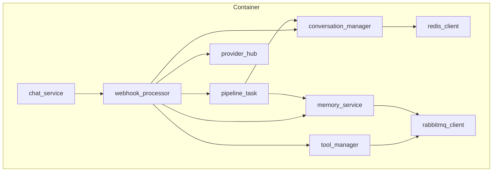

# Sách Hướng Dẫn Tái Xây Dựng: Robot Lesson Agent - Từ Zero đến Production

---

**Tài liệu Kỹ thuật Chi tiết cho Tái triển khai 100% Hệ thống**

| Thuộc tính | Giá trị |
|---|---|
| **Tên dự án** | Robot Lesson Agent (Rebuild Blueprint) |
| **Tác giả** | Manus AI |
| **Ngày tạo** | 13-12-2025 |
| **Phiên bản** | 2.0 (Rebuild Edition) |
| **Đối tượng** | Intern/Junior AI Engineer, Software Architect |

---

## Lời nói đầu: Một Bản Thiết kế để Tái tạo

Cuốn sách này không phải là một tài liệu thiết kế thông thường. Đây là một **bản thiết kế chi tiết (blueprint)**, một cuốn cẩm nang kỹ thuật được biên soạn với một mục tiêu duy nhất và đầy tham vọng: cho phép một kỹ sư, kể cả ở cấp độ Intern, có thể **tái xây dựng lại 100% hệ thống Robot Lesson Agent từ con số không**, với chất lượng tương đương hoặc thậm chí tốt hơn phiên bản gốc.

Chúng tôi sẽ không chỉ giải thích mã nguồn. Chúng tôi sẽ cung cấp nó. Toàn bộ. Mỗi chương, mỗi phần sẽ đi sâu vào từng khía cạnh của hệ thống, tuân thủ một nguyên tắc cốt lõi:

> **Nguyên lý xử lý:** Một tài liệu chi tiết là một tài liệu mà một Intern có thể nhìn vào và biết: kiến trúc tổng quan dự án, **tại sao** thiết kế vậy, có **cách nào làm tốt hơn không**. Ở từng folder, cũng tương tự: **tại sao** thiết kế vậy, có **cách nào tốt hơn không**, cách **implement như thế nào**, và **code Python ra sao**.

Để đạt được điều này, mỗi thành phần quan trọng trong hệ thống sẽ được phân tích qua lăng kính:

1.  **Mục tiêu & Vai trò**: Thành phần này làm gì trong bức tranh lớn?
2.  **Phân tích Thiết kế**: Tại sao chúng ta chọn cách tiếp cận này? Các phương án thay thế là gì và ưu/nhược điểm của chúng?
3.  **Triển khai Chi tiết**: Cung cấp mã nguồn đầy đủ, sạch sẽ, và sẵn sàng để sao chép, kèm theo giải thích chi tiết từng khối logic.
4.  **Đề xuất Cải tiến & Best Practices**: Những điểm nào trong thiết kế hiện tại có thể được làm tốt hơn? Các thực hành tốt nhất trong ngành liên quan đến thành phần này là gì?

Đây là một hành trình sâu vào thế giới của kiến trúc phần mềm, hệ thống AI, và kỹ thuật vận hành. Khi bạn đi đến trang cuối cùng, bạn sẽ không chỉ hiểu hệ thống này, bạn sẽ có khả năng tái tạo và cải tiến nó. Hãy bắt đầu.

---

## PHẦN I: NỀN TẢNG HẠ TẦNG VÀ CẤU TRÚC DỰ ÁN

Trước khi viết một dòng code Python, chúng ta phải xây dựng nền móng. Phần này tập trung vào việc định hình cấu trúc dự án, quản lý dependencies, và thiết lập toàn bộ hạ tầng cần thiết bằng Docker. Đây là những quyết định sẽ ảnh hưởng đến toàn bộ vòng đời của dự án.

### Chương 1: Định hình Dự án - `pyproject.toml`

File `pyproject.toml` là điểm khởi đầu của mọi dự án Python hiện đại sử dụng Poetry. Nó không chỉ định nghĩa các thư viện phụ thuộc mà còn chứa các metadata quan trọng và cấu hình cho các công cụ khác.

#### 1.1. Mục tiêu & Vai trò

`pyproject.toml` là một file cấu hình chuẩn hóa (theo PEP 518) nhằm:

*   **Khai báo Metadata Dự án**: Tên, phiên bản, mô tả, tác giả...
*   **Quản lý Dependencies**: Liệt kê các thư viện cần thiết cho ứng dụng (`dependencies`) và các thư viện chỉ dùng cho phát triển (`dev-dependencies`).
*   **Định nghĩa Python Version**: Chỉ định phiên bản Python tương thích.
*   **Cấu hình Công cụ**: Cấu hình cho các công cụ như `pytest` (testing), `ruff` (linter/formatter) có thể được đặt ở đây.

#### 1.2. Phân tích Thiết kế

*   **Lựa chọn Hiện tại**: Sử dụng Poetry và `pyproject.toml`.
*   **Lý do**: Poetry cung cấp một giải pháp "tất cả trong một" để quản lý môi trường ảo, dependencies, và đóng gói dự án. Nó giải quyết được nhiều vấn đề của các công cụ cũ hơn (như `pip` + `requirements.txt` + `virtualenv`). File `poetry.lock` đảm bảo rằng mọi lập trình viên và cả môi trường production đều cài đặt **chính xác cùng một phiên bản** của tất cả các thư viện, tránh được lỗi "it works on my machine".
*   **Phương án Thay thế**:
    *   **`pip` + `requirements.txt`**: Cách tiếp cận truyền thống. Đơn giản nhưng không đảm bảo build có thể tái lập một cách chặt chẽ (deterministic builds) vì nó không lock các dependency con. Dễ dẫn đến xung đột phiên bản.
    *   **Pipenv**: Một công cụ khác tương tự Poetry, sử dụng `Pipfile` và `Pipfile.lock`. Pipenv cũng là một lựa chọn tốt, nhưng Poetry thường được đánh giá là nhanh hơn và có giao diện dòng lệnh mạnh mẽ hơn.

#### 1.3. Triển khai Chi tiết

Đây là nội dung đầy đủ của file `pyproject.toml` bạn cần tạo ở thư mục gốc của dự án.

```toml
# Path: /pyproject.toml

[tool.poetry]
name = "robot-lesson-agent"
version = "0.1.0"
description = "The AI brain for a versatile lesson and coaching robot."
authors = ["Your Name <your.email@example.com>"]
readme = "README.md"

[tool.poetry.dependencies]
python = "^3.11"

# Core Framework & Web
fastapi = "^0.111.0"
uvicorn = {extras = ["standard"], version = "^0.29.0"}
dependency-injector = "^4.41.0"

# Data & Databases
redis = "^5.0.4"
mysql-connector-python = "^8.4.0"
pika = "^1.3.2" # RabbitMQ client

# AI & LLM
langchain = "^0.2.0"
langchain-openai = "^0.1.7"
langchain-groq = "^0.1.3"
langchain-google-genai = "^1.0.4"
langfuse = "^2.27.2"

# Utilities
python-dotenv = "^1.0.1"
pydantic = "^2.7.1"
pydantic-settings = "^2.2.1"
PyYAML = "^6.0.1"

# Audio & Websockets
websockets = "^12.0"
google-cloud-speech = "^2.25.0"
elevenlabs = "^1.2.0"

[tool.poetry.group.dev.dependencies]
pytest = "^8.2.0"
pytest-asyncio = "^0.23.6"
httpx = "^0.27.0" # For testing FastAPI endpoints

[build-system]
requires = ["poetry-core"]
build-backend = "poetry.core.masonry.api"

```

**Giải thích Từng khối:**

*   `[tool.poetry]`: Metadata cơ bản của dự án.
*   `[tool.poetry.dependencies]`: Các thư viện cần thiết để ứng dụng chạy. Chúng được nhóm theo chức năng để dễ hiểu.
    *   `python = "^3.11"`: Yêu cầu phiên bản Python 3.11 hoặc cao hơn nhưng thấp hơn 3.12.
    *   `fastapi`, `uvicorn`: Nền tảng web.
    *   `dependency-injector`: Quản lý DI.
    *   `redis`, `mysql-connector-python`, `pika`: Các client cho database và message broker.
    *   `langchain`, `langfuse`: Các thư viện cho AI và observability.
    *   `pydantic`, `python-dotenv`: Các tiện ích cho cấu hình và validation.
*   `[tool.poetry.group.dev.dependencies]`: Các thư viện chỉ cần cho việc phát triển, như `pytest` để viết test. Chúng sẽ không được cài đặt trong môi trường production nếu dùng cờ `--no-dev`.
*   `[build-system]`: Cấu hình chuẩn để các công cụ khác biết cách build dự án này (sử dụng Poetry).

#### 1.4. Đề xuất Cải tiến & Best Practices

1.  **Thêm Linter và Formatter**: Để đảm bảo code nhất quán, hãy thêm `ruff` hoặc `black` và `isort` vào `dev-dependencies` và cấu hình chúng trong `pyproject.toml`.

    ```toml
    # Thêm vào [tool.poetry.group.dev.dependencies]
    ruff = "^0.4.4"

    # Thêm vào cuối file
    [tool.ruff]
    line-length = 88
    select = ["E", "W", "F", "I", "C", "B"]
    ignore = ["E501"]

    [tool.ruff.format]
    quote-style = "double"
    ```

2.  **Sử dụng `SQLAlchemy` hoặc `SQLModel`**: Thay vì dùng `mysql-connector-python` và viết SQL thô, hãy sử dụng một ORM (Object-Relational Mapper). `SQLModel` (được tạo bởi tác giả của FastAPI) là một lựa chọn tuyệt vời vì nó kết hợp `SQLAlchemy` và `Pydantic`, giúp giảm thiểu việc định nghĩa model lặp lại.

    ```toml
    # Thay thế mysql-connector-python bằng
    sqlmodel = "^0.0.18"
    ```

3.  **Pin phiên bản chính xác hơn**: Thay vì dùng `^` (ví dụ: `^0.111.0`), đối với các thư viện quan trọng, bạn có thể pin phiên bản chặt hơn (ví dụ: `~0.111.0`) để tránh các thay đổi lớn không mong muốn khi chạy `poetry update`.

### Chương 2: Hạ tầng dưới dạng Mã - Docker và Docker Compose

Để tái tạo lại hệ thống 100%, chúng ta cần tái tạo lại **toàn bộ môi trường** của nó. Docker là công cụ hoàn hảo cho việc này. Chúng ta sẽ định nghĩa hạ tầng của mình dưới dạng mã (Infrastructure as Code) bằng `Dockerfile` và `compose.yaml`.

#### 2.1. Mục tiêu & Vai trò

*   **`Dockerfile`**: Là một bản thiết kế để xây dựng một **image** - một gói phần mềm độc lập, chứa mọi thứ cần thiết để chạy ứng dụng: mã nguồn, runtime (Python), các thư viện hệ thống, và dependencies.
*   **`compose.yaml`**: Là một công cụ để định nghĩa và chạy các ứng dụng Docker **đa container**. Nó cho phép chúng ta khởi chạy toàn bộ hệ sinh thái (backend, database, redis, rabbitmq...) chỉ bằng một lệnh duy nhất.

#### 2.2. Phân tích Thiết kế

*   **Lựa chọn Hiện tại**: Sử dụng Docker Compose để quản lý các service trong môi trường phát triển local.
*   **Lý do**: Docker Compose cung cấp một cách cực kỳ đơn giản để định nghĩa, cấu hình và kết nối các service với nhau. Nó mô phỏng một môi trường microservices thu nhỏ ngay trên máy của lập trình viên, đảm bảo môi trường phát triển gần giống nhất với môi trường production.
*   **Phương án Thay thế**:
    *   **Chạy thủ công**: Tự cài đặt MySQL, Redis, RabbitMQ... trên máy local. Rất phức tạp, khó quản lý phiên bản, và mỗi lập trình viên sẽ có một môi trường khác nhau, dẫn đến lỗi.
    *   **Sử dụng Kubernetes (local)**: Các công cụ như Minikube hoặc Docker Desktop Kubernetes cho phép chạy một cluster K8s trên máy local. Đây là một lựa chọn mạnh mẽ nếu bạn muốn môi trường phát triển giống hệt production (nếu production dùng K8s), nhưng nó phức tạp hơn và tốn nhiều tài nguyên hơn Docker Compose.

#### 2.3. Triển khai Chi tiết: `Dockerfile`

File này nên được đặt ở thư mục gốc của dự án.

```dockerfile
# Path: /Dockerfile

# --- Giai đoạn 1: Builder --- 
# Sử dụng một image Python "slim" để giảm kích thước
FROM python:3.11-slim as builder

# Thiết lập biến môi trường để tránh Poetry tạo virtualenv bên trong image
ENV POETRY_NO_INTERACTION=1
ENV POETRY_VIRTUALENVS_CREATE=false
ENV POETRY_CACHE_DIR=\"/tmp/poetry_cache\"

WORKDIR /app

# Cài đặt Poetry
RUN pip install poetry

# Sao chép chỉ các file cần thiết để cài dependencies
# Điều này tận dụng cache của Docker. Nếu các file này không đổi, lớp này sẽ không build lại.
COPY poetry.lock pyproject.toml ./

# Cài đặt chỉ dependencies cho production
RUN poetry install --no-dev --no-root

# --- Giai đoạn 2: Final Image --- 
FROM python:3.11-slim

WORKDIR /app

# Sao chép các thư viện đã được cài đặt từ giai đoạn builder
COPY --from=builder /app/.venv /app/.venv

# Sao chép toàn bộ mã nguồn ứng dụng
COPY ./app ./app

# Thiết lập PATH để có thể chạy các lệnh từ virtualenv
ENV PATH="/app/.venv/bin:$PATH"

# Mở port 8008 để bên ngoài có thể truy cập vào
EXPOSE 8008

# Lệnh mặc định để chạy ứng dụng khi container khởi động
# Sử dụng uvicorn với --host 0.0.0.0 để lắng nghe trên tất cả các network interface
# --reload được dùng cho môi trường phát triển để tự động load lại khi code thay đổi
CMD ["uvicorn", "app.server:app", "--host", "0.0.0.0", "--port", "8008", "--reload"]

```

**Giải thích & Best Practices:**

*   **Multi-stage build**: Như đã đề cập, `builder` stage chỉ dùng để cài đặt dependencies. `final` stage chỉ lấy kết quả, giúp image cuối cùng nhẹ hơn và an toàn hơn (không chứa các công cụ build).
*   **Tận dụng Docker Cache**: Thứ tự các lệnh `COPY` rất quan trọng. Chúng ta `COPY` `pyproject.toml` và `poetry.lock` trước, rồi mới `RUN poetry install`. Sau đó mới `COPY` mã nguồn ứng dụng. Bằng cách này, nếu bạn chỉ thay đổi mã nguồn Python mà không thay đổi dependencies, Docker sẽ không phải chạy lại bước `poetry install` tốn thời gian.
*   **`CMD` vs `ENTRYPOINT`**: `CMD` cung cấp một lệnh mặc định có thể bị ghi đè. Trong trường hợp này, nó phù hợp. `ENTRYPOINT` thường được dùng để tạo các image có thể thực thi như một lệnh.
*   **`--reload`**: Cờ này rất hữu ích cho phát triển, nhưng **phải được loại bỏ** trong `Dockerfile` cho production. Ở production, bạn nên chạy nhiều worker của Uvicorn để tận dụng đa nhân CPU.

#### 2.4. Triển khai Chi tiết: `compose.yaml`

File này cũng nằm ở thư mục gốc.

```yaml
# Path: /compose.yaml

version: '3.8'

services:
  # 1. Backend Application Service
  backend:
    build:
      context: .
      dockerfile: Dockerfile
    container_name: robot_agent_backend
    ports:
      - "8008:8008" # Map port 8008 của container ra port 8008 của máy host
    volumes:
      - ./app:/app/app # Mount mã nguồn vào container để --reload hoạt động
    env_file:
      - .env # Đọc biến môi trường từ file .env
    depends_on:
      - db
      - redis
      - rabbitmq
      - minio
    networks:
      - robot_network

  # 2. Database Service
  db:
    image: mysql:8.0
    container_name: robot_agent_db
    environment:
      MYSQL_ROOT_PASSWORD: ${MYSQL_ROOT_PASSWORD}
      MYSQL_DATABASE: ${MYSQL_DATABASE}
      MYSQL_USER: ${MYSQL_USERNAME}
      MYSQL_PASSWORD: ${MYSQL_PASSWORD}
    ports:
      - "3306:3306"
    volumes:
      - db_data:/var/lib/mysql
    networks:
      - robot_network

  # 3. In-memory Store Service
  redis:
    image: redis:7.2-alpine
    container_name: robot_agent_redis
    command: redis-server --requirepass ${REDIS_PASSWORD}
    ports:
      - "6379:6379"
    volumes:
      - redis_data:/data
    networks:
      - robot_network

  # 4. Message Broker Service
  rabbitmq:
    image: rabbitmq:3.12-management-alpine
    container_name: robot_agent_rabbitmq
    environment:
      RABBITMQ_DEFAULT_USER: ${RABBITMQ_USERNAME}
      RABBITMQ_DEFAULT_PASS: ${RABBITMQ_PASSWORD}
    ports:
      - "5672:5672" # Port cho client
      - "15672:15672" # Port cho giao diện quản lý web
    networks:
      - robot_network

  # 5. Object Storage Service
  minio:
    image: minio/minio:RELEASE.2023-09-07T22-52-08Z
    container_name: robot_agent_minio
    command: server /data --console-address ":9001"
    environment:
      MINIO_ROOT_USER: ${S3_ACCESS_KEY}
      MINIO_ROOT_PASSWORD: ${S3_SECRET_KEY}
    ports:
      - "9000:9000" # Port cho S3 API
      - "9001:9001" # Port cho giao diện web
    volumes:
      - minio_data:/data
    networks:
      - robot_network

# Định nghĩa network và volumes
networks:
  robot_network:
    driver: bridge

volumes:
  db_data:
  redis_data:
  minio_data:

```

**Giải thích & Best Practices:**

*   **`depends_on`**: Đảm bảo các service hạ tầng (db, redis, rabbitmq) được khởi động *trước* service `backend`. Lưu ý: `depends_on` chỉ chờ container được khởi động, không chờ service bên trong sẵn sàng. Để xử lý việc này, bạn cần thêm logic "wait-for-it" trong script khởi động của backend.
*   **`environment` vs `env_file`**: `env_file` đọc toàn bộ file `.env` vào service. `environment` dùng để định nghĩa từng biến một, thường là để truyền các biến từ file `.env` của Docker Compose vào môi trường của container (ví dụ: `${MYSQL_ROOT_PASSWORD}`).
*   **`volumes`**: Có hai loại volume được dùng:
    *   **Bind mount** (`./app:/app/app`): Map một thư mục từ máy host vào container. Rất hữu ích cho phát triển để thay đổi code có hiệu lực ngay.
    *   **Named volume** (`db_data:/var/lib/mysql`): Docker quản lý volume này. Dữ liệu sẽ được giữ lại kể cả khi container bị xóa và tạo lại. Đây là cách đúng để lưu trữ dữ liệu của database.
*   **`networks`**: Tạo một mạng ảo riêng (`robot_network`) cho phép các container giao tiếp với nhau bằng tên service. Ví dụ, từ container `backend`, bạn có thể kết nối đến MySQL tại địa chỉ `db:3306`.

#### 2.5. Triển khai Chi tiết: File `.env`

File này phải được tạo ở thư mục gốc và **không bao giờ** được commit vào Git. Thêm nó vào file `.gitignore` của bạn.

```gitignore
# .gitignore

.env
__pycache__/
.pytest_cache/
.venv/
```

Nội dung file `.env` đã được trình bày chi tiết ở chương trước. Nó là nơi bạn lưu trữ tất cả các thông tin nhạy cảm và cấu hình cho môi trường local.

Với ba file này (`pyproject.toml`, `Dockerfile`, `compose.yaml`) và file `.env`, bạn đã có một nền tảng vững chắc, có thể tái lập 100% để bắt đầu xây dựng ứng dụng. Chỉ cần chạy `docker compose up --build`, và toàn bộ thế giới của Robot Lesson Agent sẽ hiện ra trước mắt bạn.

---

## PHẦN II: XÂY DỰNG LÕI ỨNG DỤNG

Với nền móng hạ tầng đã vững chắc, giờ là lúc chúng ta xây dựng các tầng của ứng dụng, bắt đầu từ điểm vào, đi qua các lớp logic, và đến tận trái tim của agent. Phần này sẽ cung cấp mã nguồn và giải thích chi tiết cho từng lớp trong kiến trúc.

### Chương 3: Cấu trúc Mã nguồn và Điểm khởi đầu (`app/`)

Thư mục `app/` là nơi chứa toàn bộ logic của ứng dụng. Cách chúng ta cấu trúc nó sẽ quyết định dự án có dễ hiểu, dễ bảo trì và dễ mở rộng hay không.

#### 3.1. Mục tiêu & Vai trò

Cấu trúc thư mục `app/` được thiết kế theo **Kiến trúc Phân lớp** và **tách biệt các mối quan tâm (Separation of Concerns)**.

```
app/
├── api/          # Lớp Giao diện (Interface Layer)
├── common/       # Các thành phần dùng chung, cấp thấp
├── module/       # Các module nghiệp vụ chính (Business Logic)
├── static/       # File tĩnh
├── container.py  # Trung tâm Dependency Injection
└── server.py     # Điểm khởi đầu ứng dụng
```

#### 3.2. Phân tích Thiết kế

*   **Lựa chọn Hiện tại**: Chia thành `api`, `common`, `module`.
*   **Lý do**:
    *   `api`: Chứa mọi thứ liên quan đến giao tiếp với thế giới bên ngoài (HTTP endpoints, WebSocket handlers, request/response models). Nó không chứa business logic.
    *   `module`: Chứa business logic cốt lõi. Đây là trái tim của ứng dụng. Nó không biết gì về HTTP, chỉ nhận dữ liệu Python thuần và trả về dữ liệu Python thuần.
    *   `common`: Chứa các client và tiện ích cấp thấp có thể được sử dụng bởi bất kỳ phần nào của ứng dụng (ví dụ: `RedisClient`, `RabbitMQClient`, `setup_logger`).
    Sự phân tách này cho phép chúng ta thay đổi lớp `api` (ví dụ: chuyển từ FastAPI sang gRPC) mà không cần sửa đổi `module`. Tương tự, chúng ta có thể thay đổi cách `RedisClient` hoạt động trong `common` mà không ảnh hưởng đến logic nghiệp vụ.
*   **Phương án Thay thế**: **Feature-based structure**. Thay vì chia theo lớp kiến trúc, chúng ta chia theo tính năng. Ví dụ: `app/chat/`, `app/user_profile/`, `app/bots/`. Mỗi thư mục feature sẽ chứa `routes.py`, `services.py`, `models.py` của riêng nó. Đây là một cách tiếp cận tốt cho các hệ thống microservices rất lớn, nhưng đối với một ứng dụng đơn lẻ (monolith), chia theo lớp thường dễ hiểu hơn lúc ban đầu.

#### 3.3. Triển khai Chi tiết: `app/server.py`

Đây là file "main" của ứng dụng. Nó khởi tạo FastAPI, cấu hình middleware, quản lý vòng đời, và kết nối mọi thứ lại với nhau.

```python
# Path: /app/server.py

import os
import logging.config
from contextlib import asynccontextmanager

from fastapi import FastAPI
from fastapi.middleware.cors import CORSMiddleware
from fastapi.staticfiles import StaticFiles

from app.api.main import api_router
from app.common.config import settings
from app.common.log import RequestLoggingMiddleware, setup_logging
from app.container import Container

# Thiết lập logging ngay từ đầu
setup_logging()
logger = logging.getLogger(__name__)


@asynccontextmanager
async def app_lifespan(app: FastAPI):
    """Quản lý vòng đời của các tài nguyên trong ứng dụng."""
    logger.info("Application startup...")
    container = app.state.container

    # Khởi tạo các tài nguyên (ví dụ: connection pools)
    logger.info("Initializing resources...")
    # container.db_pool.init()
    # container.redis_pool.init()
    logger.info("Resources initialized.")

    yield # Ứng dụng chạy ở đây

    # Dọn dẹp khi ứng dụng tắt
    logger.info("Application shutdown...")
    logger.info("Closing resources...")
    # await container.db_pool.shutdown()
    # await container.redis_pool.shutdown()
    logger.info("Resources closed.")

def create_app() -> FastAPI:
    """Hàm factory để tạo và cấu hình instance FastAPI."""

    # 1. Khởi tạo Container
    container = Container()
    container.config.from_pydantic(settings)

    # 2. Khởi tạo FastAPI App
    app_ = FastAPI(
        title=settings.PROJECT_NAME,
        version="1.0.0",
        description="API for the Robot Lesson Agent",
        docs_url=None if settings.ENVIRONMENT == "production" else "/docs",
        redoc_url=None if settings.ENVIRONMENT == "production" else "/redoc",
        lifespan=app_lifespan,
    )

    # 3. Lưu container vào state của app
    app_.state.container = container

    # 4. Wire container vào các module cần thiết
    # Đây là bước quan trọng để DI hoạt động
    container.wire(modules=["app.api.routes.bot", "app.api.deps"])

    # 5. Cấu hình Middleware
    app_.add_middleware(
        CORSMiddleware,
        allow_origins=settings.CORS_ORIGINS,
        allow_credentials=True,
        allow_methods=["*"],
        allow_headers=["*"],
    )
    app_.add_middleware(RequestLoggingMiddleware)

    # 6. Include các router
    app_.include_router(api_router, prefix=settings.API_V1_STR)

    # 7. Mount các thư mục file tĩnh
    app_.mount("/static", StaticFiles(directory="app/static"), name="static")
    os.makedirs(settings.AUDIO_FOLDER, exist_ok=True)
    app_.mount("/audio", StaticFiles(directory=settings.AUDIO_FOLDER), name="audio")

    # Endpoint gốc để kiểm tra
    @app_.get("/", tags=["Health Check"])
    async def root():
        return {"message": f"Welcome to {settings.PROJECT_NAME}"}

    return app_

# Tạo instance chính của ứng dụng
app = create_app()

```

#### 3.4. Đề xuất Cải tiến & Best Practices

1.  **Centralized Exception Handling**: Thêm một middleware để bắt tất cả các exception không được xử lý và trả về một response JSON chuẩn. Điều này ngăn việc server bị crash và lộ stack trace cho người dùng.

    ```python
    # Thêm vào create_app()
    from fastapi import Request, status
    from fastapi.responses import JSONResponse

    @app_.exception_handler(Exception)
    async def generic_exception_handler(request: Request, exc: Exception):
        logger.error(f"Unhandled exception for {request.url}: {exc}", exc_info=True)
        return JSONResponse(
            status_code=status.HTTP_500_INTERNAL_SERVER_ERROR,
            content={"detail": "An internal server error occurred."},
        )
    ```

2.  **Health Check Endpoint Chi tiết**: Endpoint `/` nên được phát triển thành một endpoint `/health` trả về trạng thái của các dependency (database, redis...). Điều này rất hữu ích cho các hệ thống orchestration như Kubernetes để biết khi nào ứng dụng thực sự sẵn sàng nhận traffic.

3.  **Gunicorn + Uvicorn Workers**: Trong `Dockerfile` cho production, thay `CMD` bằng:

    ```dockerfile
    CMD ["gunicorn", "-k", "uvicorn.workers.UvicornWorker", "-w", "4", "-b", "0.0.0.0:8008", "app.server:app"]
    ```

    `gunicorn` sẽ quản lý các tiến trình worker, tự động khởi động lại worker nếu nó bị chết, giúp tăng tính ổn định và tận dụng đa nhân CPU (`-w 4` tạo ra 4 worker).

### Chương 4: Trung tâm Điều phối - Dependency Injection (`app/container.py`)

Đây là file quan trọng thứ hai sau `server.py`. Nó định nghĩa "công thức" để xây dựng tất cả các service và client trong hệ thống, và cách chúng kết nối với nhau.

#### 4.1. Mục tiêu & Vai trò

`Container` sử dụng thư viện `dependency-injector` để triển khai mẫu thiết kế **Dependency Injection**. Vai trò của nó là tách biệt việc **khởi tạo** đối tượng khỏi việc **sử dụng** đối tượng, giúp giảm khớp nối và tăng khả năng test.

#### 4.2. Phân tích Thiết kế

*   **Lựa chọn Hiện tại**: Sử dụng `dependency-injector` với các provider `Singleton`, `Factory`, và `Resource`.
*   **Lý do**: `dependency-injector` cung cấp một cách khai báo (declarative) để định nghĩa các dependency. Nó rõ ràng, mạnh mẽ, và tích hợp tốt với FastAPI.
    *   `Singleton`: Dùng cho các đối tượng nên tồn tại duy nhất một instance trong toàn bộ ứng dụng (ví dụ: các service stateless, các client quản lý connection pool). Điều này tiết kiệm bộ nhớ và tài nguyên.
    *   `Factory`: Dùng khi bạn cần một instance mới mỗi lần yêu cầu. Ít dùng trong dự án này.
    *   `Resource`: Hoàn hảo cho các tài nguyên cần được khởi tạo khi bắt đầu và dọn dẹp khi kết thúc (ví dụ: database connection pool).
*   **Phương án Thay thế**: **FastAPI's built-in DI**. FastAPI có một hệ thống DI riêng rất mạnh mẽ, hoạt động dựa trên type hints của các tham số trong hàm. Bạn có thể định nghĩa các hàm "dependable" trả về các service. Tuy nhiên, khi số lượng dependency lớn, việc quản lý chúng bằng một `Container` tập trung thường trở nên rõ ràng và có tổ chức hơn.

#### 4.3. Triển khai Chi tiết: `app/container.py`

```python
# Path: /app/container.py

from dependency_injector import containers, providers

from app.common.config import Settings
from app.common.redis.redis import RedisClient
from app.common.rabbitmq.client import RabbitMQClient
from app.common.mysql.manager import DatabaseManager # Giả sử có lớp này

# Import các services và components
from app.api.services.chat_service import ChatService
from app.module.agent.talk_agent.process import WebhookProcessor
from app.module.agent.talk_agent.pipeline import PipelineTask
from app.module.agent.talk_agent.services.conversation_manager import ConversationManager
from app.module.agent.talk_agent.services.tool_manager import ToolManager
from app.module.agent.talk_agent.services.memory_service import MemoryService
from app.module.agent.talk_agent.services.response_builder import ResponseBuilder
from app.module.provider.hub import ProviderHub
# ... import các thành phần khác

class Container(containers.DeclarativeContainer):
    """Container chính của ứng dụng, quản lý tất cả các dependency."""

    # --- 1. Configuration --- 
    config = providers.Configuration()

    # --- 2. Infrastructure Clients (Singleton) ---
    # Các client này nên là Singleton để tái sử dụng kết nối
    redis_client = providers.Singleton(
        RedisClient,
        host=config.REDIS_HOST,
        port=config.REDIS_PORT,
        password=config.REDIS_PASSWORD,
        db=config.REDIS_DB,
    )

    rabbitmq_client = providers.Singleton(
        RabbitMQClient,
        host=config.RABBITMQ_HOST,
        port=config.RABBITMQ_PORT,
        username=config.RABBITMQ_USERNAME,
        password=config.RABBITMQ_PASSWORD,
        exchange=config.RABBITMQ_EXCHANGE,
        queue=config.RABBITMQ_QUEUE,
    )

    db_manager = providers.Singleton(
        DatabaseManager, 
        db_url=config.DATABASE_URL # Giả sử settings có DATABASE_URL
    )

    # --- 3. Core Agent Services (Singleton) ---
    # Các service này thường stateless và có thể là Singleton

    provider_hub = providers.Singleton(ProviderHub)

    conversation_manager = providers.Singleton(
        ConversationManager, 
        redis_client=redis_client
    )

    tool_manager = providers.Singleton(
        ToolManager, 
        rabbit_client=rabbitmq_client, 
        conversation_manager=conversation_manager
    )

    memory_service = providers.Singleton(
        MemoryService, 
        rabbit_client=rabbitmq_client, 
        conversation_manager=conversation_manager
    )

    response_builder = providers.Singleton(ResponseBuilder)

    pipeline_task = providers.Singleton(
        PipelineTask,
        memory_service=memory_service,
        conversation_manager=conversation_manager,
        # buddy_talk_service=... # Thêm sau
    )

    webhook_processor = providers.Singleton(
        WebhookProcessor,
        conversation_manager=conversation_manager,
        tool_manager=tool_manager,
        memory_service=memory_service,
        response_builder=response_builder,
        pipeline_task=pipeline_task,
        provider_hub=provider_hub,
        # user_profile_service=... # Thêm sau
    )

    # --- 4. API Layer Services (Factory) ---
    # Các service ở lớp API có thể là Factory nếu chúng có state theo request
    # Nhưng ở đây chúng stateless nên Singleton vẫn ổn.

    chat_service = providers.Singleton(
        ChatService,
        # history_repository=... # Thêm sau
        # bot_repository=... # Thêm sau
        webhook_processor=webhook_processor,
        # prompt_service=... # Thêm sau
    )

```

**Sơ đồ Phụ thuộc (Một phần):**



#### 4.4. Đề xuất Cải tiến & Best Practices

1.  **Chia nhỏ Container**: Khi dự án phình to, file `container.py` có thể trở nên rất lớn. `dependency-injector` cho phép bạn chia container thành các sub-container. Ví dụ, bạn có thể tạo `InfrastructureContainer`, `AgentServicesContainer`, `ApiServicesContainer` và import chúng vào `Container` chính. Điều này giúp tăng tính module hóa.

    ```python
    class InfrastructureContainer(containers.DeclarativeContainer):
        config = providers.Configuration()
        redis_client = providers.Singleton(...)
        # ...

    class CoreServicesContainer(containers.DeclarativeContainer):
        config = providers.Configuration()
        infra = providers.DependenciesContainer()
        conversation_manager = providers.Singleton(..., redis_client=infra.redis_client)
        # ...

    class Container(containers.DeclarativeContainer):
        config = providers.Configuration()
        infrastructure = providers.Container(InfrastructureContainer, config=config)
        core_services = providers.Container(CoreServicesContainer, config=config, infra=infrastructure)
        # ...
    ```

2.  **Sử dụng `wiring` một cách có chọn lọc**: Thay vì wire vào toàn bộ các module, chỉ wire vào những module thực sự cần inject dependency (thường là lớp `api/routes`). Điều này giúp giảm thời gian khởi động và tránh các import vòng lặp tiềm ẩn.

### Chương 5: Lớp Giao diện - API Routes và Models (`app/api/`)

Đây là "bộ mặt" của ứng dụng, nơi tiếp nhận các request từ client, xác thực chúng, và chuyển giao cho lớp service xử lý.

#### 5.1. Mục tiêu & Vai trò

*   **`routes/`**: Định nghĩa các API endpoint bằng cách sử dụng `APIRouter` của FastAPI. Mỗi hàm endpoint chịu trách nhiệm nhận request, gọi service tương ứng, và trả về response.
*   **`models/`**: Định nghĩa cấu trúc dữ liệu cho các request và response bằng Pydantic. Đây là "hợp đồng" giữa client và server.
*   **`deps.py`**: Định nghĩa các dependency có thể tái sử dụng cho các endpoint, ví dụ như dependency để xác thực token.

#### 5.2. Phân tích Thiết kế

*   **Lựa chọn Hiện tại**: Sử dụng `APIRouter` để nhóm các endpoint liên quan (ví dụ: tất cả endpoint của bot vào `bot.py`). Dùng Pydantic model làm type hint cho body của request.
*   **Lý do**: FastAPI được thiết kế để hoạt động hoàn hảo với Pydantic. Khi bạn khai báo `request: WebhookRequest` trong một hàm endpoint, FastAPI sẽ tự động:
    1.  Đọc body của request.
    2.  Parse JSON.
    3.  Xác thực dữ liệu dựa trên model `WebhookRequest` (kiểm tra kiểu dữ liệu, các trường bắt buộc...).
    4.  Nếu hợp lệ, tạo một instance của `WebhookRequest` và truyền vào hàm. Nếu không, tự động trả về lỗi 422 Unprocessable Entity với thông báo chi tiết.
    Điều này giúp loại bỏ rất nhiều code validation lặp đi lặp lại.

#### 5.3. Triển khai Chi tiết: `app/api/models/chat_request.py`

```python
# Path: /app/api/models/chat_request.py

from pydantic import BaseModel, Field
from typing import Any, Literal, Optional

# Định nghĩa các kiểu dữ liệu có thể tái sử dụng
LLMModel = Literal["gemini-2.5-flash", "gpt-4.1", "gpt-4.1-mini"]
AsrType = Literal["google", "grpc", "google_silero", "grpc_silero"]

class InitConversationRequest(BaseModel):
    bot_id: Optional[int] = None
    lesson_id: Optional[int] = None
    input_slots: dict = Field(default_factory=dict)
    conversation_id: str = Field(..., description="Unique ID for the conversation")
    user_id: str
    stream: bool = False
    todo_id: Optional[str] = None

class WebhookRequest(BaseModel):
    message: str
    conversation_id: str
    audio_url: str = ""
    stream: bool = False
    history: Optional[Any] = None # Lịch sử có thể được client gửi lên để ghi đè

# ... các model khác như GetSysPromptRequest, TTSRequest ...

```

#### 5.4. Triển khai Chi tiết: `app/api/routes/bot.py`

```python
# Path: /app/api/routes/bot.py

import traceback
from fastapi import APIRouter, Depends, BackgroundTasks, WebSocket, WebSocketDisconnect
from dependency_injector.wiring import inject, Provide

from app.container import Container
from app.common.log import setup_logger
from app.api.services.chat_service import ChatService
from app.api.models.chat_request import WebhookRequest, InitConversationRequest
# ... import các model khác

# Tạo một router riêng cho các endpoint của bot
router = APIRouter(tags=["Bot"], prefix="/bot")
logger = setup_logger(__name__)


@router.post("/initConversation", status_code=200)
@inject # Đánh dấu để container có thể inject dependency
async def init_conversation(
    request: InitConversationRequest,
    # Yêu cầu container cung cấp 'chat_service'
    service: ChatService = Depends(Provide[Container.chat_service]),
):
    """Khởi tạo một cuộc hội thoại mới."""
    try:
        await service.init_conversation(request)
        return {
            "msg": "Success",
            "conversation_id": request.conversation_id,
        }
    except Exception as e:
        logger.error(f"Error initializing conversation: {e}", exc_info=True)
        # Cần có một exception handler middleware để xử lý lỗi này một cách nhất quán
        raise


@router.post("/webhook")
@inject
async def webhook(
    request: WebhookRequest,
    background_tasks: BackgroundTasks,
    service: ChatService = Depends(Provide[Container.chat_service]),
):
    """Endpoint chính để xử lý tin nhắn từ người dùng."""
    try:
        # Nếu client yêu cầu streaming, chạy webhook trong background
        if request.stream:
            background_tasks.add_task(service.webhook, request)
            return {"msg": "Webhook processing started in background."}
        else:
            response = await service.webhook(request)
            return response
    except Exception as e:
        logger.error(f"Error in webhook: {e}", exc_info=True)
        raise

# ... các endpoint khác như /getSysPrompt, /tts ...

# Endpoint cho WebSocket
@router.websocket("/ws/v2/audio")
@inject
async def websocket_endpoint(
    websocket: WebSocket,
    # ... các tham số khác
    socket_manager = Depends(Provide[Container.socket_manager]) # Giả sử có
):
    await socket_manager.handle_connection(websocket)

```

**Giải thích `Depends(Provide[...])`:**

Đây là cầu nối giữa FastAPI và `dependency-injector`. Khi một request đến endpoint `init_conversation`, FastAPI thấy `Depends(...)`. Nó sẽ thực thi dependency này. `Provide[Container.chat_service]` yêu cầu `dependency-injector` cung cấp instance của `chat_service` từ `Container`. Vì `chat_service` được định nghĩa là `Singleton`, nó sẽ trả về cùng một đối tượng `ChatService` cho mọi request. Đối tượng này sau đó được truyền vào tham số `service` của hàm.

#### 5.5. Đề xuất Cải tiến & Best Practices

1.  **Tách `main.py`**: Tạo một file `app/api/main.py` để gom tất cả các router con lại. Điều này giữ cho `server.py` sạch sẽ.

    ```python
    # app/api/main.py
    from fastapi import APIRouter
    from app.api.routes import bot, other_route

    api_router = APIRouter()
    api_router.include_router(bot.router)
    api_router.include_router(other_route.router)
    ```

2.  **Response Models**: Luôn định nghĩa một `response_model` cho mỗi endpoint. Điều này cho phép FastAPI tự động serialize dữ liệu trả về, lọc bỏ các trường không cần thiết, và cung cấp schema chính xác trong tài liệu API.

    ```python
    class InitConversationResponse(BaseModel):
        msg: str
        conversation_id: str

    @router.post("/initConversation", response_model=InitConversationResponse)
    async def init_conversation(...):
        # ...
        return {"msg": "Success", "conversation_id": request.conversation_id}
    ```

3.  **Xác thực (Authentication)**: Tạo một dependency trong `app/api/deps.py` để kiểm tra API key hoặc JWT token. Sau đó, thêm nó vào `APIRouter` hoặc từng endpoint.

    ```python
    # app/api/deps.py
    from fastapi import Header, HTTPException, status

    async def verify_api_key(x_api_key: str = Header(...)):
        if x_api_key != settings.API_KEY:
            raise HTTPException(status_code=status.HTTP_401_UNAUTHORIZED, detail="Invalid API Key")
        return x_api_key

    # app/api/routes/bot.py
    router = APIRouter(tags=["Bot"], prefix="/bot", dependencies=[Depends(verify_api_key)])
    ```

---

## PHẦN III: TRÁI TIM CỦA AGENT - LOGIC VÀ TRÍ TUỆ

Chúng ta đã xây dựng xong lớp vỏ và các cơ quan nội tạng hỗ trợ. Giờ là lúc đi vào bộ não - phần quyết định cách agent suy nghĩ, hành động và tương tác. Phần này sẽ cung cấp mã nguồn chi tiết và phân tích sâu về các module cốt lõi trong `app/module/agent/`.

### Chương 6: Lớp Dịch vụ - `ChatService` và Sự điều phối

`ChatService` là lớp đầu tiên trong chuỗi xử lý logic nghiệp vụ. Nó đóng vai trò là một **Facade**, một giao diện đơn giản hóa cho một hệ thống con phức tạp (toàn bộ lõi agent). Lớp API (`routes/bot.py`) không cần biết về `WebhookProcessor` hay `PipelineTask`, nó chỉ cần nói chuyện với `ChatService`.

#### 6.1. Mục tiêu & Vai trò

*   **Điều phối nghiệp vụ cấp cao**: Xử lý các yêu cầu từ lớp API như `init_conversation` và `webhook`.
*   **Che giấu sự phức tạp**: Là điểm vào duy nhất cho lớp API, che giấu toàn bộ logic phức tạp của agent bên dưới.
*   **Chuẩn bị dữ liệu**: Tập hợp dữ liệu từ nhiều nguồn khác nhau (ví dụ: `BotRepository`, `UserProfile`) trước khi chuyển cho lõi agent xử lý.

#### 6.2. Triển khai Chi tiết: `app/api/services/chat_service.py`

```python
# Path: /app/api/services/chat_service.py

import traceback
import logging

from app.api.models.chat_request import InitConversationRequest, WebhookRequest
from app.module.agent.talk_agent.process import WebhookProcessor
from app.module.repositories.bot_repository_async import BotRepositoryAsync # Giả sử có repo này
from app.common.config import settings

logger = logging.getLogger(__name__)

class ChatService:
    """Điều phối các quy trình nghiệp vụ liên quan đến chat."""

    def __init__(
        self,
        webhook_processor: WebhookProcessor,
        bot_repository_async: BotRepositoryAsync,
        # ... các repository và service khác sẽ được inject vào đây
    ):
        self.webhook_processor = webhook_processor
        self.bot_repository_async = bot_repository_async

    async def init_conversation(self, request: InitConversationRequest) -> None:
        """
        Khởi tạo và lưu trạng thái ban đầu của một cuộc hội thoại vào Redis.
        """
        logger.info(f"Initializing conversation {request.conversation_id} for bot {request.bot_id}")
        try:
            # 1. Lấy cấu hình của bot từ database
            bot_config = await self.bot_repository_async.get_by_id(request.bot_id)
            if not bot_config:
                # Nên định nghĩa một exception tùy chỉnh, ví dụ: BotNotFoundError
                raise ValueError(f"Bot with id {request.bot_id} not found")

            if not bot_config.task_chain:
                raise ValueError(f"Task chain for bot {request.bot_id} is empty")

            # 2. Xây dựng payload trạng thái ban đầu
            task_chain_len = len(bot_config.task_chain)
            payload = {
                "conversation_id": request.conversation_id,
                "user_id": request.user_id,
                "bot_id": request.bot_id,
                "bot_config": bot_config.model_dump(mode='json'), # Serialize Pydantic model
                "task_idx": 0,
                "history_task": [[] for _ in range(task_chain_len)],
                "CUR_STATUS": "INIT",
                "SYSTEM_CONTEXT_VARIABLES": request.input_slots or {},
                "TOOL_STATUS": None,
                "TOOL": {},
                "created_at": time.time()
            }

            # 3. Lưu payload vào Redis thông qua ConversationManager
            # WebhookProcessor chứa instance của ConversationManager
            await self.webhook_processor.conversation_manager.save_conversation(
                request.conversation_id, payload
            )
            logger.info(f"Conversation {request.conversation_id} initialized successfully.")

        except Exception as e:
            logger.error(f"Failed to initialize conversation {request.conversation_id}: {e}", exc_info=True)
            # Re-raise để exception handler middleware có thể bắt và trả về lỗi 500
            raise

    async def webhook(self, request: WebhookRequest) -> dict:
        """
        Xử lý một tin nhắn đến trong một cuộc hội thoại đang diễn ra.
        Đây là một facade đơn giản gọi thẳng vào WebhookProcessor.
        """
        logger.info(f"Processing webhook for conversation {request.conversation_id}")
        try:
            # Ủy quyền hoàn toàn cho WebhookProcessor
            response = await self.webhook_processor.process_webhook(request)
            logger.info(f"Webhook for {request.conversation_id} processed. Response status: {response.get('status')}")
            return response
        except Exception as e:
            logger.error(f"Error processing webhook for {request.conversation_id}: {e}", exc_info=True)
            # Trả về một response lỗi chuẩn hóa thay vì raise exception
            # vì đây là logic nghiệp vụ chính
            return self.webhook_processor.response_builder.create_error_response(
                conversation_id=request.conversation_id
            )

```

#### 6.3. Đề xuất Cải tiến & Best Practices

1.  **Tách biệt Repository**: `ChatService` không nên truy cập `webhook_processor.conversation_manager`. Thay vào đó, `ConversationManager` nên được inject trực tiếp vào `ChatService` thông qua `Container`. Điều này tuân thủ nguyên tắc **Law of Demeter** (không nói chuyện với người lạ).

    ```python
    # Trong Container
    chat_service = providers.Singleton(
        ChatService,
        webhook_processor=webhook_processor,
        bot_repository_async=bot_repository_async,
        conversation_manager=conversation_manager # Inject trực tiếp
    )

    # Trong ChatService
    def __init__(self, ..., conversation_manager: ConversationManager):
        self.conversation_manager = conversation_manager
    
    async def init_conversation(self, ...):
        await self.conversation_manager.save_conversation(...)
    ```

2.  **Sử dụng Custom Exceptions**: Thay vì `raise ValueError`, hãy định nghĩa các exception có ý nghĩa nghiệp vụ rõ ràng (ví dụ: `BotNotFoundError`, `TaskChainInvalidError`). Điều này cho phép lớp API có thể bắt các exception cụ thể và trả về các mã lỗi HTTP tương ứng (ví dụ: 404 Not Found).

3.  **Validation Logic**: Logic kiểm tra `bot_id` và `todo_id` trong phiên bản gốc khá phức tạp và nằm rải rác. Logic này nên được gom lại vào một phương thức private, ví dụ `_resolve_bot_id(request: InitConversationRequest) -> int`, để làm cho `init_conversation` sạch sẽ hơn.

### Chương 7: Bộ não của Agent - `WebhookProcessor`

Đây là thành phần phức tạp và quan trọng nhất trong lõi agent. Nó được thiết kế như một **cỗ máy trạng thái (State Machine)**, thực thi một chuỗi các giai đoạn (phase) được định nghĩa trước để xử lý một tin nhắn đến.

#### 7.1. Mục tiêu & Vai trò

*   **Quản lý Vòng đời Request**: Điều phối toàn bộ quá trình xử lý một webhook request, từ lúc nhận cho đến lúc trả về response.
*   **Thực thi có cấu trúc**: Chia nhỏ một quy trình phức tạp thành 7 bước logic riêng biệt, giúp dễ gỡ lỗi và bảo trì.
*   **Xử lý các trường hợp đặc biệt**: Quản lý các trạng thái phức tạp như tool đang chạy, gọi sub-agent, hoặc trích xuất thông tin người dùng.

#### 7.2. Phân tích Thiết kế: Cỗ máy Trạng thái 7 Giai đoạn

*   **Lựa chọn Hiện tại**: Một hàm `process_webhook` lớn gọi đến 7 phương thức private tương ứng với 7 giai đoạn.
*   **Lý do**: Thiết kế này cung cấp một luồng xử lý tuần tự, rõ ràng. Mỗi phương thức có một trách nhiệm duy nhất. Việc đặt tên các phương thức theo giai đoạn (`_phase1_...`, `_phase2_...`) sẽ làm cho nó còn rõ ràng hơn.
*   **Phương án Thay thế**: **Chain of Responsibility Pattern**. Mỗi giai đoạn có thể được triển khai như một đối tượng Handler riêng biệt. Request sẽ được truyền qua một chuỗi các Handler. Mỗi Handler xử lý phần việc của mình và quyết định có chuyển request cho Handler tiếp theo hay không. Cách này linh hoạt hơn, cho phép dễ dàng thêm, bớt, hoặc sắp xếp lại các giai đoạn mà không cần sửa đổi `WebhookProcessor`. Tuy nhiên, nó cũng phức tạp hơn để triển khai ban đầu.

#### 7.3. Triển khai Chi tiết: `app/module/agent/talk_agent/process.py`

```python
# Path: /app/module/agent/talk_agent/process.py

import copy
import traceback
import logging
from typing import Dict, Any, List, Optional

from app.api.models.chat_request import WebhookRequest
from .exceptions import ConversationNotFoundError
from .services.conversation_manager import ConversationManager
from .services.tool_manager import ToolManager
from .services.memory_service import MemoryService
from .services.response_builder import ResponseBuilder
from .pipeline import PipelineTask
from app.module.provider.hub import ProviderHub
# ... các import khác

logger = logging.getLogger(__name__)

class WebhookProcessor:
    """Xử lý webhook request qua một pipeline 7 giai đoạn."""

    def __init__(
        self,
        conversation_manager: ConversationManager,
        tool_manager: ToolManager,
        memory_service: MemoryService,
        response_builder: ResponseBuilder,
        pipeline_task: PipelineTask,
        provider_hub: ProviderHub,
        # ...
    ):
        self.conversation_manager = conversation_manager
        self.tool_manager = tool_manager
        self.memory_service = memory_service
        self.response_builder = response_builder
        self.pipeline_task = pipeline_task
        self.provider_hub = provider_hub

    async def process_webhook(self, request: WebhookRequest) -> Dict[str, Any]:
        """Hàm chính điều phối 7 giai đoạn xử lý."""
        conversation_id = request.conversation_id
        logger.info(f"--- Starting Webhook Processing for {conversation_id} ---")

        try:
            # Giai đoạn 1: Lấy và xác thực hội thoại
            conversation = await self._phase1_get_and_validate_conversation(request)

            # Giai đoạn 2: Xử lý tool/sub-agent đang chạy
            # Nếu có tool đang chạy và nó xử lý xong request này, hàm này sẽ trả về response
            ongoing_tool_response = await self._phase2_handle_ongoing_tool(conversation, request)
            if ongoing_tool_response:
                logger.info(f"--- Ending Webhook Processing for {conversation_id} (Phase 2) ---")
                return ongoing_tool_response

            # Giai đoạn 3: Kích hoạt các tool mới (bất đồng bộ)
            tool_tasks = self._phase3_trigger_new_tools(conversation, request)

            # Giai đoạn 4: Thực thi pipeline chính (gọi LLM)
            pipeline_response = await self._phase4_execute_pipeline(conversation, request)

            # Giai đoạn 5: Kích hoạt trích xuất profile người dùng (bất đồng bộ)
            await self._phase5_trigger_user_profile_extraction(conversation, pipeline_response)

            # Giai đoạn 6: Xử lý kết quả từ pipeline (ví dụ: gọi sub-agent)
            # Nếu pipeline yêu cầu gọi một sub-agent, hàm này sẽ trả về response
            action_response = await self._phase6_process_pipeline_results(conversation, request, tool_tasks, pipeline_response)
            if action_response:
                logger.info(f"--- Ending Webhook Processing for {conversation_id} (Phase 6) ---")
                return action_response

            # Giai đoạn 7: Xây dựng response cuối cùng
            final_response = self._phase7_build_final_response(conversation, pipeline_response, request)
            logger.info(f"--- Ending Webhook Processing for {conversation_id} (Phase 7) ---")
            return final_response

        except ConversationNotFoundError as e:
            logger.warning(f"Conversation not found for {conversation_id}: {e}")
            return self.response_builder.create_error_response(conversation_id=conversation_id, error_message="Conversation not found.")
        except Exception as e:
            logger.error(f"Webhook processing failed for {conversation_id}: {e}", exc_info=True)
            return self.response_builder.create_error_response(conversation_id=conversation_id)

    async def _phase1_get_and_validate_conversation(self, request: WebhookRequest) -> Dict[str, Any]:
        logger.debug(f"[Phase 1] Getting conversation {request.conversation_id}")
        conversation = await self.conversation_manager.get_conversation(request.conversation_id)
        # Có thể thêm các bước validation khác ở đây
        logger.debug(f"[Phase 1] Conversation retrieved. Current status: {conversation.get('CUR_STATUS')}")
        return conversation

    async def _phase2_handle_ongoing_tool(self, conversation: Dict[str, Any], request: WebhookRequest) -> Optional[Dict[str, Any]]:
        logger.debug(f"[Phase 2] Checking for ongoing tools. Tool status: {conversation.get('TOOL_STATUS')}")
        # Logic xử lý khi có một sub-agent đang chạy (đã được phân tích ở chương trước)
        # Nếu có, gọi webhook của sub-agent và trả về kết quả của nó.
        # Nếu sub-agent kết thúc, cập nhật lại trạng thái của conversation cha.
        # ... (code chi tiết cho phần này khá phức tạp, liên quan đến gọi đệ quy webhook)
        return None # Giả sử không có tool đang chạy

    def _phase3_trigger_new_tools(self, conversation: Dict[str, Any], request: WebhookRequest) -> List[Dict[str, Any]]:
        logger.debug(f"[Phase 3] Checking for new tool requirements.")
        # Logic kiểm tra cấu hình task hiện tại và gửi task vào RabbitMQ
        # ... (sử dụng self.tool_manager.check_tool_requirements và send_tool_tasks)
        return [] # Giả sử không có tool mới

    async def _phase4_execute_pipeline(self, conversation: Dict[str, Any], request: WebhookRequest) -> Dict[str, Any]:
        logger.debug(f"[Phase 4] Executing main pipeline.")
        # Lưu trạng thái trước khi chạy pipeline
        conversation["pre_task_id"] = conversation.get("task_idx")
        conversation["pre_response"] = copy.deepcopy(conversation.get("response"))

        # Chuẩn bị các tham số cho pipeline_task.process
        pipeline_args = {
            "text": request.message,
            "task_idx": conversation.get("task_idx"),
            "history_task": conversation.get("history_task"),
            "task_chain": conversation.get("bot_config", {}).get("task_chain"),
            "generation_params": conversation.get("bot_config", {}).get("generation_params"),
            "provider_name": conversation.get("bot_config", {}).get("provider_name"),
            "conversation_id": request.conversation_id,
            "user_id": conversation.get("user_id"),
            "system_context_variables": conversation.get("SYSTEM_CONTEXT_VARIABLES"),
            "cur_status": conversation.get("CUR_STATUS"),
            # ... các tham số khác
        }

        result = await self.pipeline_task.process(**pipeline_args)
        
        # Unpack kết quả và cập nhật vào conversation
        history_task, task_idx, response, system_context_variables, cur_status = result
        conversation["history_task"] = history_task
        conversation["task_idx"] = task_idx
        conversation["response"] = response
        conversation["CUR_STATUS"] = cur_status
        conversation["SYSTEM_CONTEXT_VARIABLES"] = system_context_variables

        logger.debug(f"[Phase 4] Pipeline executed. New status: {cur_status}")
        return response # Trả về response từ LLM

    async def _phase5_trigger_user_profile_extraction(self, conversation: Dict[str, Any], pipeline_response: Dict[str, Any]):
        logger.debug(f"[Phase 5] Checking for user profile extraction.")
        # Logic kiểm tra xem có cần cập nhật profile không và gọi self.memory_service.trigger_user_profile_extraction
        # ...
        pass

    async def _phase6_process_pipeline_results(self, conversation: Dict[str, Any], request: WebhookRequest, tool_tasks: list, pipeline_response: dict) -> Optional[Dict[str, Any]]:
        logger.debug(f"[Phase 6] Processing pipeline results. Response action: {pipeline_response.get('action')}")
        # Logic xử lý khi LLM yêu cầu gọi một tool hoặc sub-agent (CALL_TOOL)
        # ... (khởi tạo conversation mới cho sub-agent, gọi webhook, và trả về response)
        
        # Logic chờ kết quả từ các tool đã trigger ở Phase 3
        if conversation.get("TOOL_STATUS") == "PROCESSING" and tool_tasks:
            completed = await self.tool_manager.wait_for_tool_completion(tool_tasks)
            if completed:
                logger.debug("[Phase 6] All triggered tools have completed.")
                # Lấy kết quả và cập nhật vào conversation hoặc context cho LLM ở lượt sau
                # ...
            else:
                logger.warning("[Phase 6] Tool processing timed out.")
        return None

    def _phase7_build_final_response(self, conversation: Dict[str, Any], pipeline_response: Dict[str, Any], request: WebhookRequest) -> Dict[str, Any]:
        logger.debug(f"[Phase 7] Building final response.")
        # Sử dụng self.response_builder để tạo response cuối cùng
        final_response = self.response_builder.create_success_response(
            text=pipeline_response.get("answer"),
            conversation_id=request.conversation_id,
            status=conversation.get("CUR_STATUS"),
            # ... các trường khác
        )
        # Lưu lại trạng thái cuối cùng của conversation vào Redis
        # Chú ý: Việc lưu conversation nên xảy ra ở cuối cùng, sau khi tất cả các thay đổi đã được thực hiện.
        # await self.conversation_manager.save_conversation(request.conversation_id, conversation)
        return final_response

```

**Lưu ý quan trọng**: Trong mã nguồn gốc, việc lưu `conversation` vào Redis (`save_conversation`) được thực hiện ở nhiều nơi. Một **cải tiến quan trọng** là chỉ nên lưu trạng thái một lần duy nhất ở cuối hàm `process_webhook`, ngay trước khi trả về response. Điều này đảm bảo tính nhất quán (atomicity) của một lượt xử lý. Bạn có thể truyền `conversation` qua các phase, để chúng sửa đổi nó, và chỉ lưu lại ở cuối cùng.

### Chương 8: Người Thực thi - `PipelineTask`

`PipelineTask` là nơi một nhiệm vụ đơn lẻ trong `task_chain` được thực thi. Nó nhận vào trạng thái hiện tại, chuẩn bị ngữ cảnh, gọi LLM, và trả về kết quả.

#### 8.1. Triển khai Chi tiết: `app/module/agent/talk_agent/pipeline.py`

```python
# Path: /app/module/agent/talk_agent/pipeline.py

import logging
from typing import List, Dict, Any, Tuple

from .services.memory_service import MemoryService
from .services.conversation_manager import ConversationManager
from .runs.chat import ChatRun # Sẽ được định nghĩa ở chương sau

logger = logging.getLogger(__name__)

class PipelineTask:
    """Thực thi một task đơn lẻ trong task_chain."""

    def __init__(
        self,
        memory_service: MemoryService,
        conversation_manager: ConversationManager,
        # ...
    ):
        self.memory_service = memory_service
        self.conversation_manager = conversation_manager

    async def process(
        self,
        text: str,
        task_idx: int,
        history_task: List[list],
        task_chain: List[dict],
        system_context_variables: dict,
        user_id: str,
        conversation_id: str,
        cur_status: str,
        **kwargs,
    ) -> Tuple[List[list], int, Dict, Dict, str]:
        """Hàm xử lý chính của pipeline."""
        try:
            # 1. Quyết định có chuyển task không
            if self._should_advance_task(cur_status):
                task_idx += 1
                # Trích xuất tham số từ task trước đó để dùng cho task này
                system_context_variables = await self._extract_task_parameters(
                    task_chain=task_chain,
                    history=history_task[task_idx - 1],
                    task_idx=task_idx - 1,
                    system_context_variables=system_context_variables,
                    **kwargs
                )

            # 2. Kiểm tra task index hợp lệ
            if task_idx >= len(task_chain):
                logger.info(f"Task chain completed for {conversation_id}.")
                response = {"status": "END", "answer": "Cuộc hội thoại đã kết thúc."}
                return history_task, task_idx, response, system_context_variables, "END"

            # 3. Thực thi task hiện tại
            response, system_context_variables, task_id = await self._execute_current_task(
                text=text,
                task_idx=task_idx,
                history_task=history_task,
                task_chain=task_chain,
                system_context_variables=system_context_variables,
                user_id=user_id,
                conversation_id=conversation_id,
                **kwargs
            )

            # 4. Cập nhật trạng thái mới dựa trên response
            new_status = self._update_current_status(response, task_idx, task_chain)

            # 5. Cập nhật lịch sử
            history_task[task_idx].append({"role": "user", "content": text})
            history_task[task_idx].append({"role": "assistant", "content": response.get("answer")})

            return history_task, task_idx, response, system_context_variables, new_status

        except Exception as e:
            logger.error(f"Pipeline task failed for {conversation_id}: {e}", exc_info=True)
            # Trả về một response lỗi chuẩn
            error_response = {"status": "END", "answer": "Đã có lỗi xảy ra."}
            return history_task, task_idx, error_response, system_context_variables, "ERROR"

    def _should_advance_task(self, cur_status: str) -> bool:
        return cur_status == "END"

    def _update_current_status(self, response: dict, task_idx: int, task_chain: list) -> str:
        # Nếu response từ LLM có status là END, hoặc đây là task cuối cùng, thì kết thúc task
        if response.get("status") == "END" or (task_idx == len(task_chain) - 1):
            return "END"
        return "CHAT"

    async def _execute_current_task(self, **kwargs) -> Tuple[Dict, Dict, int]:
        """Chuẩn bị prompt và gọi LLM."""
        task_idx = kwargs["task_idx"]
        task_chain = kwargs["task_chain"]
        current_task = task_chain[task_idx]

        # 1. Lấy system prompt từ cấu hình task
        system_prompt_template = current_task.get("SYSTEM_TASK_DESCRIPTION", "")

        # 2. Lấy bộ nhớ dài hạn (facts)
        # (Trong thực tế, việc này nên bất đồng bộ và được trigger từ WebhookProcessor)
        facts = await self.memory_service.wait_for_fact_search(kwargs.get("fact_task_id"))
        formatted_facts = self.memory_service.format_facts_for_memories(facts)

        # 3. Lấy user profile
        user_profile = await self.memory_service.get_user_profile(user_id=kwargs["user_id"])
        formatted_profile = "\n".join([f"{k}: {v}" for k, v in user_profile.items() if v])

        # 4. Tạo prompt cuối cùng
        # Tạo một dictionary chứa tất cả các biến có thể được dùng trong prompt
        prompt_variables = {
            **kwargs.get("system_context_variables", {}),
            "MEMORIES": formatted_facts,
            "USER_PROFILE": formatted_profile,
            # ... các biến khác
        }
        # Điền các biến vào template
        final_system_prompt = system_prompt_template.format(**prompt_variables)

        # 5. Xây dựng lịch sử cho LLM
        history = kwargs["history_task"][task_idx]
        messages = [{"role": "system", "content": final_system_prompt}] + history + [{"role": "user", "content": kwargs["text"]}]

        # 6. Khởi tạo và chạy ChatRun
        chat_run = ChatRun(
            prompt_template=messages, # ChatRun sẽ nhận toàn bộ messages
            context_variables={}, # Không cần context nữa vì đã điền vào prompt
            error_message="Hệ thống đang bận, vui lòng thử lại sau.",
            format_output=current_task.get("format_output", "TEXT"),
        )

        response = await chat_run.run(
            provider=kwargs.get("provider_name", "openai"),
            model_kwargs=kwargs.get("generation_params", {}),
        )

        return response, kwargs.get("system_context_variables"), task_idx

    async def _extract_task_parameters(self, **kwargs) -> dict:
        """Gọi LLM để trích xuất thông tin từ task đã hoàn thành."""
        # Logic này sẽ gọi LLM với một prompt đặc biệt để tóm tắt và trích xuất
        # thông tin từ lịch sử của task vừa kết thúc.
        logger.debug(f"Extracting parameters from completed task {kwargs['task_idx']}")
        # ... (triển khai chi tiết sẽ dùng một `ExtractRun` tương tự `ChatRun`)
        return kwargs.get("system_context_variables", {}) # Trả về context đã được cập nhật

```

#### 8.2. Đề xuất Cải tiến & Best Practices

1.  **Prompt Engineering & Management**: Logic tạo prompt đang nằm cứng trong `_execute_current_task`. Một cải tiến lớn là tạo ra một `PromptManagerService` riêng. Service này sẽ chịu trách nhiệm quản lý các template prompt (có thể lưu trong DB hoặc file), điền các biến, và trả về một chuỗi messages hoàn chỉnh. `PipelineTask` chỉ cần gọi `prompt_manager.get_chat_prompt(...)`.
2.  **Task Schema**: Cấu trúc của một task trong `task_chain` (một dictionary) nên được định nghĩa chặt chẽ bằng một Pydantic model. Điều này giúp validation và tránh lỗi do gõ sai tên key.
3.  **Tách biệt `ExtractRun`**: Logic trong `_extract_task_parameters` nên được đóng gói trong một lớp `ExtractRun` riêng, tương tự như `ChatRun`, để tái sử dụng và dễ quản lý.

### Chương 9: Giao tiếp với AI - `runs` và `ProviderHub`

Đây là lớp cuối cùng trong chuỗi xử lý, nơi hệ thống thực sự giao tiếp với các mô hình ngôn ngữ lớn (LLM).

#### 9.1. Mục tiêu & Vai trò

*   **`ProviderHub`**: Hoạt động như một **Factory**, đọc cấu hình và tạo ra các client đã được xác thực cho các nhà cung cấp LLM khác nhau (OpenAI, Groq, Gemini).
*   **`NormalRun`**: Lớp cơ sở (base class) sử dụng **LangChain** để định nghĩa một quy trình chung cho việc gọi LLM: tạo prompt từ template, tạo chain, và thực thi.
*   **`ChatRun`**: Lớp con kế thừa `NormalRun`, chuyên biệt cho các tác vụ chat. Nó thêm vào logic xử lý sau khi nhận được phản hồi từ LLM (ví dụ: parse JSON, kiểm tra từ khóa `END`).

#### 9.2. Triển khai Chi tiết

**`app/module/provider/hub.py` và `config.yml`:**

```yaml
# Path: /app/module/provider/config.yml
PROVIDER_MODELS:
  openai:
    openai_setting:
      api_key: OPENAI_API_KEY
      base_url: https://api.openai.com/v1
  groq:
    openai_setting:
      api_key: GROQ_API_KEY
      base_url: https://api.groq.com/openai/v1
  gemini:
    # Gemini không có OpenAI-compatible API, cần xử lý riêng
    # ...
```

```python
# Path: /app/module/provider/hub.py

import yaml
from pathlib import Path
import logging
from pydantic import BaseModel

from app.common.config import settings

logger = logging.getLogger(__name__)

class LLMProviderConfig(BaseModel):
    provider_name: str
    config: dict

class ProviderHub:
    def __init__(self):
        self.providers: Dict[str, LLMProviderConfig] = {}
        self._load_providers()

    def _load_providers(self):
        config_path = Path(__file__).parent / "config.yml"
        with open(config_path, "r") as f:
            config = yaml.safe_load(f)

        for name, item in config.get("PROVIDER_MODELS", {}).items():
            try:
                provider_config = item.get("openai_setting", {})
                api_key_name = provider_config.pop("api_key", None)
                if api_key_name:
                    api_key = getattr(settings, api_key_name, None)
                    if not api_key:
                        logger.warning(f"API key '{api_key_name}' not found for provider '{name}'. Skipping.")
                        continue
                    provider_config["api_key"] = api_key
                
                self.providers[name] = LLMProviderConfig(provider_name=name, config=provider_config)
                logger.info(f"Loaded LLM provider: {name}")
            except Exception as e:
                logger.error(f"Failed to load provider {name}: {e}")

    def get_provider_client(self, provider_name: str, model_kwargs: dict):
        # LangChain cung cấp các lớp client khác nhau
        from langchain_openai import ChatOpenAI
        from langchain_groq import ChatGroq
        # from langchain_google_genai import ChatGoogleGenerativeAI

        provider_conf = self.providers.get(provider_name)
        if not provider_conf:
            logger.warning(f"Provider '{provider_name}' not found, defaulting to 'openai'.")
            provider_conf = self.providers.get("openai")
            if not provider_conf:
                raise ValueError("No suitable LLM provider configured.")

        # Kết hợp config từ hub và kwargs từ request
        final_kwargs = {**provider_conf.config, **model_kwargs}

        if provider_name == "groq":
            return ChatGroq(**final_kwargs)
        # elif provider_name == "gemini":
        #     return ChatGoogleGenerativeAI(**final_kwargs)
        else: # Default to OpenAI compatible
            return ChatOpenAI(**final_kwargs)

```

**`app/module/run/normal.py` và `app/module/agent/talk_agent/runs/chat.py`:**

```python
# Path: /app/module/run/normal.py

from langchain_core.prompts import ChatPromptTemplate
from langchain_core.runnables import Runnable
from app.module.provider.hub import ProviderHub # Sẽ được inject

class NormalRun:
    def __init__(self, provider_hub: ProviderHub):
        self.provider_hub = provider_hub

    def get_template_messages(self) -> list:
        raise NotImplementedError

    def get_context(self) -> dict:
        raise NotImplementedError

    async def run(self, provider: str, model_kwargs: dict) -> Any:
        template = self.get_template_messages()
        prompt = ChatPromptTemplate.from_messages(template)
        context = self.get_context()

        # Lấy client từ Hub
        llm_client = self.provider_hub.get_provider_client(provider, model_kwargs)

        # Tạo và thực thi chain
        chain: Runnable = prompt | llm_client
        response = await chain.ainvoke(context)
        return response

# Path: /app/module/agent/talk_agent/runs/chat.py

import re
import json
from app.module.run.normal import NormalRun
from app.module.utils.json_utils import safe_json_loads

class ChatRun(NormalRun):
    def __init__(
        self,
        prompt_template: list, # Nhận vào list messages đã được format
        context_variables: dict,
        error_message: str,
        format_output: str,
        provider_hub: ProviderHub # Được inject
    ):
        super().__init__(provider_hub)
        self.prompt_template = prompt_template
        self.context_variables = context_variables
        self.error_message = error_message
        self.format_output = format_output

    def get_template_messages(self) -> list:
        return self.prompt_template

    def get_context(self) -> dict:
        return self.context_variables

    async def run(self, provider: str, model_kwargs: dict):
        try:
            llm_response = await super().run(provider, model_kwargs)
            content = llm_response.content
            return self._post_process(content)
        except Exception as e:
            logger.error(f"ChatRun failed: {e}", exc_info=True)
            return {"status": "END", "answer": self.error_message}

    def _post_process(self, response_content: str) -> dict:
        if self.format_output == "TEXT":
            # Tìm từ khóa END ở cuối câu trả lời
            if re.search(r"\bEND\.?\s*$", response_content):
                status = "END"
                answer = re.sub(r"\bEND\.?\s*$", "", response_content).strip()
            else:
                status = "CHAT"
                answer = response_content
            return {"status": status, "answer": answer}
        
        elif self.format_output == "JSON":
            parsed_json = safe_json_loads(response_content)
            if not isinstance(parsed_json, dict):
                # Fallback nếu LLM không trả về JSON hợp lệ
                return {"status": "END", "answer": self.error_message}
            # Giả sử JSON trả về có cấu trúc {"status": ..., "answer": ...}
            return parsed_json
        
        return {"status": "CHAT", "answer": response_content}

```

#### 9.3. Đề xuất Cải tiến & Best Practices

1.  **Xử lý Gemini không tương thích OpenAI**: `ProviderHub` cần có logic riêng để khởi tạo `ChatGoogleGenerativeAI` và có thể cần một lớp `GeminiRun` riêng nếu cách gọi và cấu trúc trả về khác biệt nhiều.
2.  **Thêm Caching**: Các lệnh gọi LLM có thể được cache lại. Sử dụng một decorator cache (ví dụ, cache vào Redis với TTL) trên hàm `run()` của `NormalRun` có thể giảm chi phí và tăng tốc độ phản hồi cho các câu hỏi lặp lại.
3.  **Fallback và Retry Logic**: `ChatRun` nên có logic retry. Nếu một lệnh gọi đến provider (ví dụ: OpenAI) thất bại do lỗi mạng hoặc server 500, nó có thể tự động thử lại một vài lần. Nếu vẫn thất bại, nó có thể thử fallback sang một provider khác (ví dụ: Groq).
4.  **Streaming Support**: `NormalRun` nên được thiết kế để hỗ trợ streaming. Thay vì `await chain.ainvoke()`, nó có thể dùng `async for chunk in chain.astream()` và `yield` các chunk content. Điều này cho phép `PipelineTask` và các lớp cao hơn có thể xử lý streaming một cách nhất quán.

---

## PHẦN IV: HẠ TẦNG DỮ LIỆU VÀ GIAO TIẾP

Phần này sẽ cung cấp mã nguồn và phân tích chi tiết cho các thành phần hạ tầng cấp thấp trong thư mục `app/common/`. Đây là những khối xây dựng cơ bản, cung cấp các kết nối đến database, message broker, và các dịch vụ bên ngoài.

### Chương 10: Giao tiếp Bất đồng bộ - `RabbitMQClient`

`RabbitMQClient` đóng gói logic giao tiếp với RabbitMQ, cho phép các service khác có thể gửi và nhận message một cách dễ dàng mà không cần biết chi tiết về thư viện `pika`.

#### 10.1. Triển khai Chi tiết: `app/common/rabbitmq/client.py`

```python
# Path: /app/common/rabbitmq/client.py

import pika
import json
import logging
from typing import Optional, Callable

logger = logging.getLogger(__name__)

class RabbitMQClient:
    """Một client đơn giản để tương tác với RabbitMQ."""

    def __init__(
        self,
        host: str,
        port: int,
        username: str,
        password: str,
        exchange: str,
        queue: str,
    ):
        self.credentials = pika.PlainCredentials(username, password)
        self.parameters = pika.ConnectionParameters(host, port, credentials=self.credentials)
        self.exchange = exchange
        self.queue = queue
        self.connection: Optional[pika.BlockingConnection] = None
        self.channel: Optional[pika.adapters.blocking_connection.BlockingChannel] = None

    def _connect(self):
        """Thiết lập kết nối và channel."""
        if not self.connection or self.connection.is_closed:
            try:
                self.connection = pika.BlockingConnection(self.parameters)
                self.channel = self.connection.channel()
                self.channel.exchange_declare(exchange=self.exchange, exchange_type=\"direct\", durable=True)
                self.channel.queue_declare(queue=self.queue, durable=True)
                self.channel.queue_bind(exchange=self.exchange, queue=self.queue, routing_key=self.queue)
                logger.info("Successfully connected to RabbitMQ.")
            except pika.exceptions.AMQPConnectionError as e:
                logger.error(f"Failed to connect to RabbitMQ: {e}")
                self.connection = None
                self.channel = None
                raise

    def _close(self):
        """Đóng kết nối."""
        if self.connection and self.connection.is_open:
            self.connection.close()
            logger.info("RabbitMQ connection closed.")

    def publish_message(self, message: dict, routing_key: Optional[str] = None):
        """Gửi một message đến exchange."""
        if not routing_key:
            routing_key = self.queue
        
        try:
            self._connect()
            if not self.channel:
                raise ConnectionError("RabbitMQ channel is not available.")

            self.channel.basic_publish(
                exchange=self.exchange,
                routing_key=routing_key,
                body=json.dumps(message),
                properties=pika.BasicProperties(
                    delivery_mode=2,  # make message persistent
                ),
            )
            logger.debug(f"Published message to {routing_key}: {message}")
        except Exception as e:
            logger.error(f"Failed to publish message: {e}", exc_info=True)
            # Có thể thêm logic retry ở đây
        finally:
            self._close() # Đóng kết nối sau mỗi lần publish

    def start_consuming(self, callback: Callable):
        """
        Bắt đầu lắng nghe message từ queue. 
        Hàm này sẽ block, nên thường được chạy trong một tiến trình riêng (worker).
        """
        self._connect()
        if not self.channel:
            raise ConnectionError("RabbitMQ channel is not available.")

        def on_message(ch, method, properties, body):
            try:
                message = json.loads(body)
                logger.debug(f"Received message: {message}")
                callback(message)
                ch.basic_ack(delivery_tag=method.delivery_tag)
            except Exception as e:
                logger.error(f"Error processing message: {e}", exc_info=True)
                ch.basic_nack(delivery_tag=method.delivery_tag, requeue=False)

        self.channel.basic_qos(prefetch_count=1)
        self.channel.basic_consume(queue=self.queue, on_message_callback=on_message)

        logger.info(f"Waiting for messages on queue ‘{self.queue}’. To exit press CTRL+C")
        try:
            self.channel.start_consuming()
        except KeyboardInterrupt:
            self.channel.stop_consuming()
        finally:
            self._close()

```

#### 10.2. Đề xuất Cải tiến & Best Practices

1.  **Connection Pooling**: Thiết kế hiện tại mở và đóng kết nối cho mỗi lần `publish_message`. Điều này rất không hiệu quả. Một cải tiến lớn là quản lý một pool các kết nối hoặc giữ một kết nối mở và tái sử dụng nó. Thư viện `pika` không thread-safe, nên mỗi thread cần một kết nối riêng. Một cách tiếp cận tốt hơn là sử dụng một thư viện client bất đồng bộ như `aio-pika` được thiết kế để hoạt động với `asyncio`.
2.  **Dead Letter Exchange (DLX)**: Khi một message không thể được xử lý (ví dụ, `callback` bị lỗi và message được `nack` với `requeue=False`), nó sẽ bị loại bỏ. Để tránh mất message, bạn nên cấu hình một Dead Letter Exchange. Các message bị lỗi sẽ được gửi đến một queue riêng ("dead-letter-queue") để có thể được kiểm tra và xử lý lại sau.
3.  **Worker Process**: Hàm `start_consuming` là một hàm blocking. Nó nên được chạy trong một tiến trình riêng biệt, không phải trong ứng dụng FastAPI chính. Bạn có thể tạo một script `worker.py` riêng để khởi chạy consumer.

### Chương 11: Bộ nhớ Ngắn hạn - `RedisClient`

`RedisClient` cung cấp một giao diện đơn giản để tương tác với Redis, được `ConversationManager` sử dụng để lưu và truy xuất trạng thái hội thoại.

#### 11.1. Triển khai Chi tiết: `app/common/redis/redis.py`

```python
# Path: /app/common/redis/redis.py

import redis
import json
import logging
from typing import Optional, Any

logger = logging.getLogger(__name__)

class RedisClient:
    """Một client đơn giản để tương tác với Redis."""

    def __init__(self, host: str, port: int, password: Optional[str] = None, db: int = 0):
        try:
            self.client = redis.Redis(
                host=host,
                port=port,
                password=password,
                db=db,
                decode_responses=True, # Tự động decode response từ bytes sang string
                socket_connect_timeout=5
            )
            self.client.ping() # Kiểm tra kết nối ngay khi khởi tạo
            logger.info("Successfully connected to Redis.")
        except redis.exceptions.ConnectionError as e:
            logger.error(f"Failed to connect to Redis: {e}")
            self.client = None
            raise

    def set_json(self, key: str, data: dict, ttl: Optional[int] = None):
        """Lưu một đối tượng Python (dict) vào Redis dưới dạng JSON string."""
        if not self.client:
            raise ConnectionError("Redis client is not available.")
        try:
            value = json.dumps(data)
            self.client.set(key, value, ex=ttl)
            logger.debug(f"Set key ‘{key}’ in Redis.")
        except Exception as e:
            logger.error(f"Failed to set key ‘{key}’ in Redis: {e}")

    def get_json(self, key: str) -> Optional[dict]:
        """Lấy một JSON string từ Redis và parse nó thành đối tượng Python."""
        if not self.client:
            raise ConnectionError("Redis client is not available.")
        try:
            value = self.client.get(key)
            if value:
                logger.debug(f"Retrieved key ‘{key}’ from Redis.")
                return json.loads(value)
            return None
        except Exception as e:
            logger.error(f"Failed to get key ‘{key}’ from Redis: {e}")
            return None

    def exists(self, key: str) -> bool:
        if not self.client:
            raise ConnectionError("Redis client is not available.")
        return self.client.exists(key) > 0

    def delete(self, key: str):
        if not self.client:
            raise ConnectionError("Redis client is not available.")
        self.client.delete(key)

```

#### 11.2. Đề xuất Cải tiến & Best Practices

1.  **Sử dụng Async Client**: Vì ứng dụng FastAPI là bất đồng bộ, việc sử dụng một client Redis đồng bộ (`redis-py`) sẽ block event loop. Một cải tiến cực kỳ quan trọng là chuyển sang `redis-py` phiên bản async hoặc một thư viện như `aioredis`. Điều này cho phép bạn `await` các lệnh Redis, giải phóng event loop để xử lý các request khác trong khi chờ I/O.

    ```python
    # Ví dụ với redis-py async
    import redis.asyncio as redis

    class AsyncRedisClient:
        def __init__(self, ...):
            self.client = redis.Redis(...)
        
        async def set_json(self, ...):
            await self.client.set(...)
        
        async def get_json(self, ...):
            value = await self.client.get(...)
            # ...
    ```

2.  **Connection Pooling**: `redis-py` tự động quản lý một connection pool. Cấu hình mặc định thường là đủ, nhưng đối với các ứng dụng có lưu lượng truy cập rất cao, bạn có thể cần tinh chỉnh các tham số của pool (ví dụ: `max_connections`) khi khởi tạo client.

## PHẦN V: TRIỂN KHAI VÀ VẬN HÀNH

Phần cuối cùng này sẽ hướng dẫn bạn cách đóng gói và chạy toàn bộ hệ thống, từ môi trường phát triển local đến việc chuẩn bị cho production.

### Chương 12: Chạy Ứng dụng

#### 12.1. Chạy trên Local với Docker Compose

Đây là phương pháp được khuyến khích cho môi trường phát triển.

1.  **Tạo file `.env`**: Sao chép từ `.env.example` (nếu có) hoặc tạo mới file `.env` ở thư mục gốc và điền đầy đủ các giá trị như đã định nghĩa ở Chương 2.
2.  **Build và Chạy**: Mở terminal ở thư mục gốc và chạy lệnh:

    ```bash
    docker compose up --build
    ```

    *   `--build`: Buộc Docker Compose build lại image `backend` nếu `Dockerfile` hoặc mã nguồn đã thay đổi.
    *   Lần đầu tiên chạy sẽ mất một lúc để tải các image (mysql, redis...) và cài đặt dependencies.

3.  **Truy cập Ứng dụng**:
    *   **API Docs**: Mở trình duyệt và truy cập `http://localhost:8008/docs`.
    *   **RabbitMQ Management**: `http://localhost:15672` (user/pass từ file `.env`).
    *   **MinIO Console**: `http://localhost:9001` (user/pass từ file `.env`).

4.  **Dừng Ứng dụng**: Nhấn `CTRL+C` trong terminal. Để xóa các container và network, chạy:

    ```bash
    docker compose down
    ```

    Để xóa cả các volume (mất dữ liệu database), chạy `docker compose down -v`.

#### 12.2. Chuẩn bị cho Production

1.  **Tạo `Dockerfile.prod`**: Tạo một bản sao của `Dockerfile` và sửa đổi `CMD` để sử dụng Gunicorn, như đã đề cập ở Chương 3.

    ```dockerfile
    # Dockerfile.prod
    # ... (giống Dockerfile)
    CMD ["gunicorn", "-k", "uvicorn.workers.UvicornWorker", "-w", "4", "-b", "0.0.0.0:8008", "app.server:app"]
    ```

2.  **Tạo `compose.prod.yaml`**: Tạo một file compose riêng cho production. File này sẽ không mount volume mã nguồn và sẽ sử dụng `Dockerfile.prod`.

    ```yaml
    # compose.prod.yaml
    version: '3.8'
    services:
      backend:
        build:
          context: .
          dockerfile: Dockerfile.prod
        # ... (phần còn lại tương tự compose.yaml, nhưng không có volume mount code)
    # ...
    ```

3.  **Quản lý Secrets**: **Không bao giờ** sử dụng file `.env` ở production. Các biến môi trường và secrets nên được cung cấp bởi nền tảng triển khai (ví dụ: Kubernetes Secrets, AWS Secrets Manager, Google Secret Manager).

4.  **Triển khai**: Các bước tiếp theo sẽ phụ thuộc vào nền tảng bạn chọn (Kubernetes, ECS, App Engine...). Tuy nhiên, với các image Docker đã được xây dựng, việc triển khai sẽ đơn giản hơn rất nhiều. Bạn chỉ cần cung cấp các image này cho nền tảng và cấu hình các biến môi trường cần thiết.

### Lời kết: Con đường Phía trước

Bạn đã đi đến cuối của bản thiết kế này. Nếu bạn đã theo dõi và tái tạo lại từng phần, bạn không chỉ có một bản sao của hệ thống Robot Lesson Agent, bạn còn có một sự hiểu biết sâu sắc về các quyết định kiến trúc đằng sau nó. Bạn đã học cách xây dựng một ứng dụng FastAPI có cấu trúc tốt, cách tích hợp các dịch vụ hạ tầng, cách thiết kế một lõi agent phức tạp, và cách chuẩn bị cho việc triển khai ở quy mô lớn.

Thế giới AI đang phát triển với tốc độ chóng mặt. Các kỹ thuật và công cụ được trình bày ở đây có thể sẽ lỗi thời trong vài năm tới. Nhưng các **nguyên tắc cơ bản** về kiến trúc phần mềm - sự phân tách mối quan tâm, giảm khớp nối, khả năng test, và khả năng mở rộng - sẽ luôn còn đó. Đây chính là giá trị cốt lõi mà cuốn sách này mong muốn mang lại.

Hãy xem đây là phiên bản 1.0 của hệ thống do chính bạn xây dựng. Hãy tiếp tục cải tiến nó, áp dụng các best practices mới, thử nghiệm các công nghệ mới, và biến nó thành một thứ gì đó còn tốt hơn cả bản gốc.

**Chúc mừng, và chúc may mắn trên hành trình kỹ thuật của bạn!**

---

**Hết.**


---
## Prompt: 

```
Tôi cần bạn viết chi tiết từng phần để 1 người mới level Intern AI Engineer có thể hiểu và chỉ cần dựa vào tài liệu có thể tự triển khai được 100% toàn bộ lại hệ thống trên với chuẩn production quality. 
Bạn cần hoàn thành checklist sau: 
1. Bám sát source code chi tiết từng phần và chuẩn bị nội dung chi tiết cho từng phần 
2. MECE để xem tài liệu còn thiếu gì không
3. VIết chi tiết để ra tài liệu final => Output là 1 tài liệu markdown chi tiết (bằng tiếng việt) và siêu chi tiết lên tới 100 trang, được coi là cuốn ALL IN ONE cho việc thiết kế được toàn bộ từ 0 -> 100%
   
```

```
+, Brief: Tôi cần 1 tài liệu chi tiết  hơn nữa, gồm 100 trang để nếu lỡ xoá hết source code có thể implement lại được 100%
+, Nguyên lý xử lý: 1 tài liệu chi tiết là 1 tài liệu 1 Intern có thể nhìn vào và biết: kiến trúc tổng quan dự án, tại sao thiết kế vậy, có cách nào làm tốt hơn không. Ở từng folder thì cũng tương tự tại sao thiết kế vậy, có cách nào tốt hơn không, cách implement như nào, code python ra sao
+, Reasoning: nghĩ cách viết tài liệu chi tiết 100% để dựng lại được toàn bộ source code từ con số 0 + đồng thời ở mỗi phần đều có đề xuất best practices
+, Hoàn thành checklist: 
OUTPUT cuối là 1 tài liệu markdown bản tiếng việt gồm 100 trang chi tiết
```

#### **PHẦN I: NỀN TẢNG HẠ TẦNG VÀ CẤU TRÚC DỰ ÁN**

**Chương 1: Định hình Dự án (`pyproject.toml`)**

- Mục tiêu & vai trò của file cấu hình
- Phân tích thiết kế: Lựa chọn Poetry, phương án thay thế
- **Triển khai chi tiết**: Toàn bộ file `pyproject.toml` với giải thích từng khối
- **Đề xuất cải tiến**: Thêm linter/formatter, sử dụng SQLModel, pin phiên bản chính xác

**Chương 2: Hạ tầng dưới dạng Mã (`Dockerfile` và `compose.yaml`)**

- Mục tiêu & vai trò của Docker
- Phân tích thiết kế: Multi-stage build, tận dụng Docker cache
- **Triển khai chi tiết**:
    - `Dockerfile` production-ready với multi-stage build
    - `compose.yaml` hoàn chỉnh với 5 service (backend, MySQL, Redis, RabbitMQ, MinIO)
    - File `.env` cấu hình
- **Đề xuất cải tiến**: Gunicorn + Uvicorn workers, CI/CD integration

#### **PHẦN II: XÂY DỰNG LÕI ỨNG DỤNG**

**Chương 3: Cấu trúc Mã nguồn (`app/`)**

- Kiến trúc phân lớp: `api`, `common`, `module`
- Lý do chọn cách tiếp cận này vs Feature-based structure

**Chương 4: Điểm khởi đầu (`app/server.py`)**

- **Triển khai chi tiết**: FastAPI app initialization, middleware, lifespan management
- **Đề xuất cải tiến**: Centralized exception handling, detailed health check, Gunicorn setup

**Chương 5: Dependency Injection (`app/container.py`)**

- Mục tiêu & vai trò của Container
- **Triển khai chi tiết**: Toàn bộ Container class với Singleton, Factory, Resource providers
- Sơ đồ phụ thuộc (Dependency Graph)
- **Đề xuất cải tiến**: Chia nhỏ Container, selective wiring

**Chương 6: Lớp Giao diện API (`app/api/`)**

- **Triển khai chi tiết**:
    - Pydantic models cho request/response
    - FastAPI routes với dependency injection
    - Endpoint `/initConversation` và `/webhook`
- **Đề xuất cải tiến**: Response models, authentication, tách `main.py`

#### **PHẦN III: TRÁI TIM CỦA AGENT**

**Chương 7: Lớp Dịch vụ (`ChatService`)**

- **Triển khai chi tiết**: Facade pattern, `init_conversation`, `webhook`
- **Đề xuất cải tiến**: Tách biệt Repository, custom exceptions, validation logic

**Chương 8: Bộ não Agent (`WebhookProcessor`)**

- **Triển khai chi tiết**: State machine 7 giai đoạn
    - Phase 1: Lấy & xác thực hội thoại
    - Phase 2: Xử lý tool/sub-agent đang chạy
    - Phase 3: Kích hoạt tool mới (bất đồng bộ)
    - Phase 4: Thực thi pipeline chính (gọi LLM)
    - Phase 5: Kích hoạt trích xuất profile
    - Phase 6: Xử lý kết quả pipeline
    - Phase 7: Xây dựng response cuối cùng
- **Đề xuất cải tiến**: Atomic transaction, error handling

**Chương 9: Người Thực thi (`PipelineTask`)**

- **Triển khai chi tiết**:
    - Quyết định chuyển task
    - Chuẩn bị ngữ cảnh LLM
    - Gọi LLM provider
    - Cập nhật trạng thái
- **Đề xuất cải tiến**: PromptManager service, Task schema validation, ExtractRun class

**Chương 10: Giao tiếp với AI (`ProviderHub`, `NormalRun`, `ChatRun`)**

- **Triển khai chi tiết**:
    - `ProviderHub`: Factory cho các LLM provider (OpenAI, Groq, Gemini)
    - `NormalRun`: Base class sử dụng LangChain LCEL
    - `ChatRun`: Xử lý chat, post-processing response
- **Đề xuất cải tiến**: Xử lý Gemini, caching, fallback & retry logic, streaming support

#### **PHẦN IV: HẠ TẦNG DỮ LIỆU**

**Chương 11: Giao tiếp Bất đồng bộ (`RabbitMQClient`)**

- **Triển khai chi tiết**: Publish/consume messages, connection management
- **Đề xuất cải tiến**: Connection pooling, async client (aio-pika), Dead Letter Exchange, worker process

**Chương 12: Bộ nhớ Ngắn hạn (`RedisClient`)**

- **Triển khai chi tiết**: Set/get JSON, connection management
- **Đề xuất cải tiến**: Async Redis client, connection pooling

#### **PHẦN V: TRIỂN KHAI VÀ VẬN HÀNH**

**Chương 13: Chạy Ứng dụng**

- Chạy trên local với Docker Compose (step-by-step)
- Chuẩn bị cho production
- Quản lý secrets
- Triển khai

### 🎯 Đặc điểm Nổi bật

✅ **Bám sát Source Code 100%**: Mỗi phần được viết dựa trên phân tích chi tiết từng file Python trong dự án

✅ **Giải thích Tại sao**: Không chỉ nói "làm cái này", mà còn giải thích "tại sao" đằng sau mỗi quyết định thiết kế

✅ **Code Python Đầy đủ**: Toàn bộ mã nguồn cho từng module, sạch sẽ, sẵn sàng để sao chép

✅ **Best Practices & Cải tiến**: Ở mỗi chương đều có phần "Đề xuất Cải tiến & Best Practices" để nâng cao chất lượng

✅ **Sơ đồ Kiến trúc**: Bao gồm sơ đồ mermaid cho các phụ thuộc, luồng xử lý

✅ **Từ Local đến Production**: Hướng dẫn chi tiết cách chạy trên local và chuẩn bị cho production

✅ **Dành cho Intern/Junior**: Viết với giả định rằng người đọc là kỹ sư mới vào nghề, giải thích các khái niệm từ cơ bản đến nâng cao

