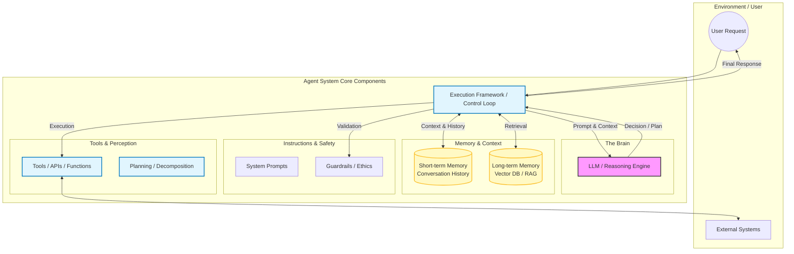
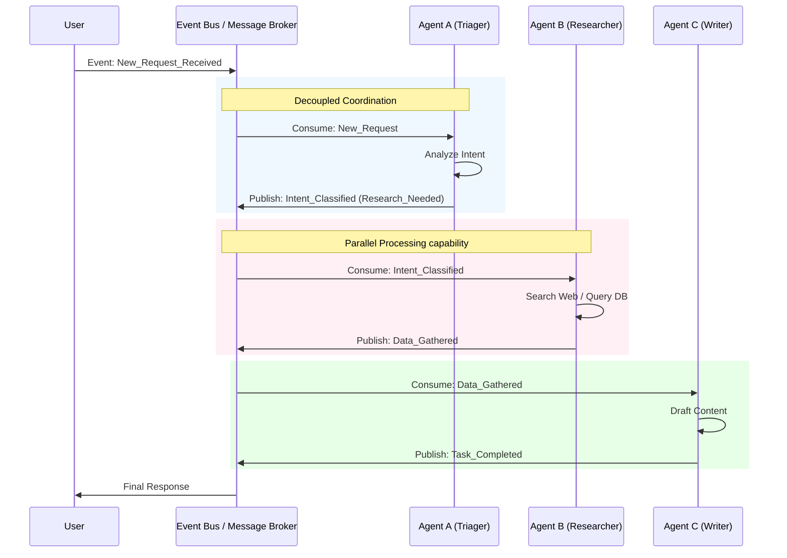
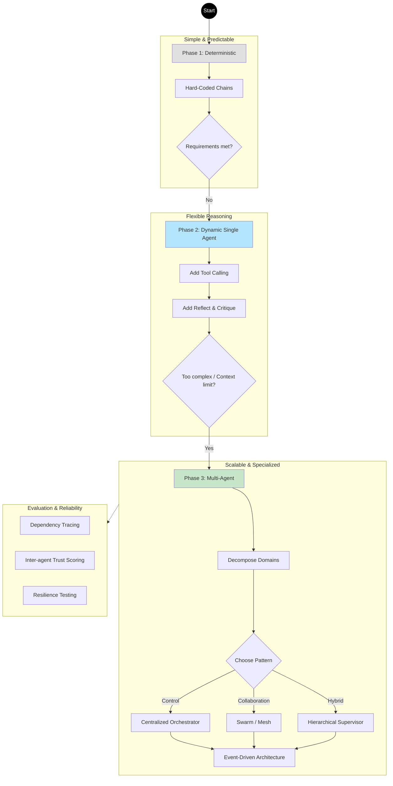

# Agent system design

Now I have comprehensive information about agent system design. Let me create a detailed response for the user.

# Thiết kế Hệ thống Agent (Tác nhân AI)

Bây giờ tôi đã có thông tin toàn diện về thiết kế hệ thống agent. Dưới đây là phản hồi chi tiết dành cho người dùng.

## Thiết kế Hệ thống Agent

Thiết kế hệ thống Agent bao gồm các nguyên tắc kiến trúc, các mô hình mẫu (patterns) và các thành phần cho phép các tác nhân AI tự chủ (autonomous AI agents) suy luận, lập kế hoạch và thực thi nhiệm vụ trong các môi trường phức tạp. Đây là hướng dẫn toàn diện bao gồm các khái niệm nền tảng, mô hình kiến trúc, phương pháp triển khai và các thực hành tốt nhất (best practices).

### Các Thành phần Cốt lõi của Hệ thống Agent

Tất cả các hệ thống agent đều chia sẻ ba thành phần cơ bản hoạt động cùng nhau để kích hoạt hành vi tự chủ:^1

**Mô hình (Bộ não - The Brain)** — Một mô hình ngôn ngữ lớn (LLM) đóng vai trò là động cơ suy luận, cho phép agent hiểu các yêu cầu, suy luận về các giải pháp và đưa ra quyết định về những hành động cần thực hiện. Chất lượng của LLM ảnh hưởng trực tiếp đến khả năng ra quyết định và độ tin cậy của agent.

**Công cụ (Hành động bên ngoài - External Actions)** — Các hàm (functions), API và dịch vụ bên ngoài mà agent có thể gọi để trích xuất dữ liệu, sửa đổi hệ thống hoặc tương tác với môi trường bên ngoài. Các công cụ mở rộng khả năng của agent vượt ra ngoài phạm vi suy luận thuần túy và cho phép tạo ra tác động trong thế giới thực.

**Hướng dẫn (Rào chắn kiểm soát - Guardrails)** — Các hướng dẫn rõ ràng, system prompts (lời nhắc hệ thống) và các ràng buộc xác định cách agent nên cư xử, những gì nó nên ưu tiên và các ranh giới đạo đức mà nó phải tôn trọng.

Ngoài các thành phần cốt lõi này, các hệ thống agent trong môi trường sản xuất (production) thường bao gồm các module nâng cao: **hệ thống bộ nhớ** để duy trì ngữ cảnh qua các phiên làm việc sử dụng cả lưu trữ ngắn hạn (lịch sử hội thoại) và dài hạn (cơ sở dữ liệu vector cho tìm kiếm ngữ nghĩa); **cơ chế lập kế hoạch** để phân rã các mục tiêu phức tạp thành các bước có thể thực thi; **module nhận thức** để hiểu ngữ cảnh môi trường; và **khung thực thi** để thực hiện hành động một cách đáng tin cậy.

### Các Mô hình Kiến trúc cho Hệ thống Agent

Thiết kế hệ thống agent tồn tại trên một dải liên tục từ đơn giản đến phức tạp, với các mô hình khác nhau phù hợp với các yêu cầu khác nhau.

**Chuỗi Xác định (Deterministic Chain - Các bước được mã hóa cứng)**

Mô hình đơn giản nhất, nơi các nhà phát triển xác định trước trình tự chính xác của các bước, công cụ và tham số. Hệ thống tuân theo cùng một quy trình làm việc cho tất cả các yêu cầu, mang lại khả năng dự đoán cao và độ phức tạp thấp. Cách tiếp cận này hoạt động tốt cho các quy trình đơn giản, lặp lại như đường ống xử lý tài liệu hoặc các chuỗi hỏi-đáp đơn giản không yêu cầu ra quyết định động.

**Hệ thống Đơn Agent (Single-Agent System)**

Một luồng phối hợp duy nhất, trong đó một agent điều phối nhiều cuộc gọi LLM để xử lý các yêu cầu phức tạp. Agent chấp nhận truy vấn của người dùng, suy luận về cách tiếp cận tốt nhất, quyết định linh hoạt công cụ nào cần gọi, tích hợp kết quả vào cuộc hội thoại và lặp lại cho đến khi đạt được mục tiêu. Hệ thống đơn agent cân bằng giữa tính linh hoạt và khả năng bảo trì, xử lý các quy trình công việc yêu cầu lựa chọn công cụ động và suy luận đa bước trong khi vẫn giữ kiến trúc đơn giản.

**Hệ thống Đa Agent (Multi-Agent Systems)**

Các kiến trúc phân tán với các agent chuyên biệt, mỗi agent xử lý các miền hoặc nhiệm vụ cụ thể, được phối hợp thông qua một bộ điều phối trung tâm (central orchestrator). Trong kiến trúc đa agent, mỗi agent duy trì chuyên môn, ngữ cảnh và bộ công cụ riêng của miền đó, cho phép phân tách trách nhiệm tốt hơn và khả năng mở rộng cao hơn.

Bộ điều phối (có thể là một LLM khác hoặc bộ định tuyến dựa trên quy tắc) nhận các yêu cầu, xác định agent chuyên biệt nào phù hợp nhất và quản lý việc chuyển giao giữa các agent. Ví dụ, một trợ lý doanh nghiệp có thể sử dụng các agent riêng biệt cho hỗ trợ khách hàng (tra cứu CRM, trả hàng, vận chuyển), phân tích (truy vấn SQL, tóm tắt dữ liệu) và hoạt động tài chính, với một router giám sát chỉ đạo các truy vấn một cách thích hợp.

Hệ thống đa agent giới thiệu thêm các mô hình tổ chức. **Mô hình điều phối tập trung** sử dụng một agent mạnh mẽ duy nhất như một nhạc trưởng điều phối tất cả những người khác, duy trì trạng thái toàn cục và đưa ra mọi quyết định định tuyến. Điều này tạo ra hành vi có thể dự đoán và gỡ lỗi được nhưng có khả năng hạn chế tính song song. **Mô hình bầy đàn (swarm pattern)** cho phép bất kỳ agent nào giao tiếp với mọi agent khác, cho phép giải quyết vấn đề cộng tác, phản biện và chuyển giao nhiệm vụ. **Mô hình phân cấp (hierarchical pattern)** kết hợp sự phối hợp chiến lược tập trung với việc thực thi chiến thuật phi tập trung, cung cấp cả sự giám sát và tính linh hoạt.

### Phối hợp Hướng sự kiện (Event-Driven) cho Hệ thống Agent

Các hệ thống agent có khả năng mở rộng hiện đại ngày càng sử dụng kiến trúc hướng sự kiện, nơi các agent giao tiếp thông qua các sự kiện có cấu trúc thay vì các cuộc gọi trực tiếp. Các sự kiện đóng vai trò là mô hình hoạt động chung—một ngôn ngữ chung cho phép các agent trao đổi thông tin, duy trì sự liên kết và phối hợp nhiệm vụ.

Trong các hệ thống đa agent hướng sự kiện, các agent được thiết kế để phản ứng với các sự kiện và lệnh thay vì hành động cô lập. Các lợi ích chính bao gồm **sự phối hợp và đồng bộ hóa đáng tin cậy** mà không cần ghép nối chặt chẽ (tight coupling), **khả năng phục hồi thông qua các sự kiện có thể phát lại** cho phép khôi phục từ các lỗi, và **các mô hình tiêu thụ tinh vi** nơi nhiều agent có thể phản hồi cùng một sự kiện mà không gây nhầm lẫn. Cách tiếp cận này cải thiện đáng kể độ tin cậy của hệ thống trong các môi trường phức tạp, khó dự đoán.

### Các Mẫu Thiết kế cho Quy trình làm việc của Agent (Agentic Workflows)

Ngoài các mô hình kiến trúc, các mẫu thiết kế quy trình làm việc cụ thể giải quyết các thách thức chung:

**Luồng có kiểm soát (Controlled Flows)** — Các trình tự được xác định trước với các điểm ra quyết định động thỉnh thoảng xuất hiện, cân bằng giữa cấu trúc và sự linh hoạt.

**LLM làm bộ định tuyến (LLM as Router)** — Sử dụng một LLM để định tuyến thông minh các yêu cầu đến các trình xử lý thích hợp dựa trên phân tích nội dung.

**Song song hóa (Parallelization)** — Nhiều agent hoặc công cụ làm việc đồng thời trên các nhiệm vụ phụ khác nhau, sau đó tổng hợp kết quả.

**Suy ngẫm và Phản biện (Reflect and Critique)** — Các agent đánh giá và cải thiện đầu ra của chính họ trước khi trả về kết quả, thực hiện các cơ chế kiểm soát chất lượng.

**Con người trong vòng lặp (Human in the Loop)** — Sự giám sát và phê duyệt chiến lược của con người tại các điểm quyết định quan trọng, đặc biệt quan trọng đối với các ứng dụng có rủi ro cao.

Mô hình tối ưu phụ thuộc vào độ phức tạp của nhiệm vụ, độ tin cậy yêu cầu, cấu trúc quy trình làm việc và hậu quả của các lỗi.

### Các Framework Triển khai

Một số framework sản xuất hỗ trợ phát triển hệ thống agent:

**LangChain** — Một framework dạng mô-đun với kiến trúc dựa trên thành phần (mô hình, prompt, bộ nhớ, chuỗi, agent, công cụ) cho phép các nhà phát triển hoán đổi các thành phần mà không cần viết lại toàn bộ ứng dụng. Nó có các mô hình lấy agent làm trung tâm cho việc sử dụng công cụ động, phân rã chuỗi suy nghĩ (chain-of-thought) để minh bạch hóa, hơn 100 trình tải tài liệu và tích hợp với LangSmith cho khả năng quan sát (observability) cấp độ sản xuất.

**LangGraph** — Một framework có trạng thái (stateful) được xây dựng trên LangChain, mô hình hóa các quy trình làm việc dưới dạng đồ thị với các nút (công cụ, hàm, LLM) và các cạnh (vòng lặp, tuyến đường có điều kiện). LangGraph vượt trội trong quản lý trạng thái với tính năng checkpointing liên tục và gỡ lỗi theo thời gian (time-travel debugging), tích hợp con người trong vòng lặp với khả năng khởi động lại agent an toàn, và các kiểm soát sản xuất bao gồm rào chắn, thời gian chờ và quản lý đồng thời. Đối với các hệ thống đa agent phức tạp, LangGraph cung cấp bộ công cụ toàn diện nhất với sự tích hợp mạnh mẽ vào LangSmith để giám sát.

**LlamaIndex** — Một framework tập trung vào dữ liệu được thiết kế cho các ứng dụng RAG và agent nâng cao sử dụng dữ liệu nội bộ. Nó cung cấp hơn 50 trình kết nối dữ liệu có sẵn, các đường ống nhập dữ liệu tinh vi và một module Workflow cho phép điều phối đa agent. Mặc dù không mạnh mẽ bằng LangGraph cho các hệ thống đa agent có trạng thái, nó vượt trội đối với các ứng dụng nặng về tài liệu.

### Phương pháp luận Thiết kế Hệ thống

Thiết kế hệ thống agent hiệu quả tuân theo cách tiếp cận lũy tiến:

**Bắt đầu đơn giản** — Bắt đầu với các chuỗi đơn giản hoặc quy trình làm việc xác định. Các hệ thống đơn giản xây dựng nhanh hơn, dễ gỡ lỗi hơn và đủ cho nhiều trường hợp sử dụng.

**Tăng dần độ phức tạp** — Khi các yêu cầu phát triển, giới thiệu logic gọi công cụ để ra quyết định động, cho phép agent thích ứng tại thời gian chạy (runtime).

**Chuyển sang Đa Agent** — Chỉ áp dụng các mô hình đa agent khi bạn có các miền (domain) phân biệt rõ ràng, nhiều ngữ cảnh hội thoại hoặc bộ công cụ quá lớn để một agent đơn lẻ xử lý.

Sự tiến triển này ngăn chặn việc thiết kế quá mức (over-engineering) trong khi vẫn cho phép khả năng mở rộng. Nhiều hệ thống trong thế giới thực kết hợp các mô hình—ví dụ, sử dụng hầu hết các chuỗi xác định với việc gọi công cụ dựa trên LLM động có chọn lọc cho các bước cụ thể.

### Thiết kế Quy trình làm việc Hiệu quả

Khi thiết kế quy trình làm việc cho agent, một số thực hành đảm bảo độ tin cậy và khả năng mở rộng:

**Giữ quy trình làm việc dạng mô-đun và linh hoạt** — Cho phép bảo trì và cập nhật dễ dàng mà không gây ra lỗi dây chuyền trên toàn hệ thống.

**Sử dụng API và định dạng dữ liệu chuẩn hóa** — Tạo điều kiện giao tiếp liền mạch giữa các agent và đảm bảo khả năng tương tác.

**Triển khai giám sát và ghi nhật ký (logging)** — Theo dõi hiệu suất của agent, xác định các điểm tắc nghẽn và hỗ trợ gỡ lỗi trong môi trường sản xuất.

**Trực quan hóa các tương tác** — Sử dụng lưu đồ, biểu đồ làn bơi (swimlane diagrams) hoặc biểu đồ máy trạng thái để ánh xạ các tương tác của agent và cây quyết định, làm cho các quy trình làm việc phức tạp trở nên dễ hiểu.

### Độ tin cậy và Đánh giá

Các hệ thống agent trong môi trường sản xuất yêu cầu các khung đánh giá nghiêm ngặt:

**Các lĩnh vực đánh giá chính bao gồm:**

**Truy vết phụ thuộc (Dependency tracing)** — Hiểu cách đầu ra của một agent ảnh hưởng đến hành vi và quyết định của agent tiếp theo.

**Phân tích lan truyền lỗi (Error propagation analysis)** — Xác định nơi bắt nguồn lỗi và cách chúng lan truyền qua mạng lưới agent.

**Điểm tin cậy giữa các agent (Inter-agent trust scoring)** — Đo lường độ tin cậy của từng agent cá nhân và đánh giá ảnh hưởng của chúng đối với việc hoàn thành nhiệm vụ tổng thể.

**Kiểm thử khả năng phục hồi quy trình (Workflow resilience testing)** — Mô phỏng các lỗi và gián đoạn để đánh giá sự mạnh mẽ và khả năng phục hồi của hệ thống.

### Những Thách thức Chính trong việc Mở rộng Hệ thống Agent

Khi các hệ thống agent phát triển, một số thách thức quan trọng xuất hiện:

**Chi phí Phối hợp và Giao tiếp** — Các hệ thống đa agent yêu cầu cơ chế đồng bộ hóa phức tạp. Khi số lượng agent tăng lên, các mô hình giao tiếp phải được tối ưu hóa, các hành vi nảy sinh (emergent behaviors) xuất hiện và các cấu trúc phân cấp trở nên cần thiết.

**Phân bổ tài nguyên** — Quản lý tài nguyên tính toán, ngân sách gọi API và việc sử dụng token trên nhiều agent hoạt động đồng thời đòi hỏi quản lý tài nguyên tinh vi.

**Vấn đề Bảo mật và Tin cậy** — Các lỗ hổng bảo mật nhân lên trong các triển khai lớn. Các agent đưa ra quyết định tự chủ ở quy mô lớn làm dấy lên lo ngại về bảo mật đối với các hành động trái phép, lộ dữ liệu và xâm phạm hệ thống.

**Độ phức tạp Kiến trúc** — Các hành vi nảy sinh xuất hiện mà không thể dự đoán được từ các quy tắc của từng agent riêng lẻ. Sự bùng nổ tổ hợp của các tương tác có thể xảy ra khiến việc kiểm thử toàn diện là không thể, đòi hỏi các phương pháp thống kê và mô phỏng. Nợ kỹ thuật tích lũy nhanh chóng khi các phụ thuộc nhân lên.

**Độ phức tạp theo Quy mô Hệ thống** — Các hệ thống nhỏ (<10 agent) có thể sử dụng giao tiếp trực tiếp, nhưng các hệ thống trung bình (10-100 agent) yêu cầu tối ưu hóa, các hệ thống lớn (100-1000 agent) cần cấu trúc phân cấp, và các hệ thống rất lớn (1000+ agent) yêu cầu các thuật toán phối hợp phức tạp.

### Các Thực hành Tốt nhất cho Thiết kế Hiệu quả

**Phối hợp Tin cậy** — Đảm bảo các agent giao tiếp thông qua các cơ chế được xác định rõ ràng, có khả năng chịu lỗi. Kiến trúc hướng sự kiện cung cấp khả năng phục hồi tự nhiên thông qua khả năng phát lại (replay).

**Giám sát sự Chồng chéo của Agent** — Ngăn chặn sự dư thừa và nhầm lẫn bằng cách giám sát các miền kiến thức và phạm vi hành động giữa các agent. Tái cấu trúc hoặc nhóm các agent tương tự dưới các giao diện chung.

**Quản trị ở Quy mô lớn** — Giới thiệu các giám sát viên agent (agent supervisors) khi kiến trúc phát triển qua các miền. Sử dụng tổ chức phân cấp (giám sát viên → nhóm agent) để duy trì sự rõ ràng và dễ dàng giải quyết ý định.

**Cải tiến Lũy tiến (Progressive Enhancement)** — Bắt đầu với các mẫu đơn giản hơn và chỉ tăng độ phức tạp khi được chứng minh là cần thiết. Các phương pháp lai (kết hợp các yếu tố tập trung và phi tập trung) thường cung cấp sự cân bằng tối ưu.

**Kiểm thử và Đánh giá** — Triển khai các đường ống đánh giá liên tục với các framework như tích hợp LangSmith để theo dõi hiệu suất của agent, mức tiêu thụ tài nguyên và hành vi hệ thống qua các quy trình làm việc phức tạp.

Thiết kế hệ thống agent đang phát triển nhanh chóng khi các tổ chức chuyển từ các chuỗi đơn giản sang các kiến trúc đa agent tinh vi. Chìa khóa là khớp độ phức tạp của kiến trúc với các yêu cầu thực tế trong khi duy trì khả năng quan sát, độ tin cậy và khả năng bảo trì trong suốt vòng đời hệ thống.

<span style="display:none"></span>

<div align="center">⁂</div>

---


# Visulize 
Dựa trên nội dung rất chi tiết và chuyên sâu về **Agent System Design** mà bạn cung cấp, tôi sẽ chuyển hóa chúng thành các sơ đồ Mermaid để trực quan hóa các khái niệm từ thành phần cốt lõi đến kiến trúc tổng thể.

Chúng ta sẽ chia làm 4 sơ đồ chính để bao quát toàn bộ nội dung:

1. **Anatomy of an Agent:** Cấu trúc bên trong của một Agent.
    
2. **Architectural Patterns:** Sự tiến hóa từ Chain đơn giản đến Multi-Agent.
    
3. **Event-Driven Architecture:** Mô hình phối hợp hướng sự kiện cho hệ thống lớn.
    
4. **System Design Methodology:** Quy trình tư duy thiết kế từ đơn giản đến phức tạp.
    

---

### 1. Cấu trúc Cốt lõi của một Agent (Core Components)

Sơ đồ này mô tả "The Brain" (Model), "Tools", "Instructions" và các module mở rộng như Memory và Planning.

Đoạn mã



---

### 2. Các Mô hình Kiến trúc (Architectural Patterns)

Sơ đồ này so sánh 3 cấp độ: Deterministic Chain (Cứng), Single Agent (Linh hoạt), và Multi-Agent Orchestration (Phân tán).

Đoạn mã

```mermaid
flowchart TB
    subgraph Pattern1 [1. Deterministic Chain]
        direction LR
        Step1[Input] --> Step2[Step A] --> Step3[Step B] --> Step4[Output]
        style Pattern1 fill:#f9f9f9,stroke:#999,stroke-dasharray: 5 5
    end

    subgraph Pattern2 [2. Single-Agent System]
        direction TB
        SA_Input(Task) --> SA_Reason[LLM Reasoning]
        SA_Reason -- "Decide Tool" --> SA_Tool[Execute Tool]
        SA_Tool -- "Observation" --> SA_Reason
        SA_Reason -- "Complete" --> SA_Output(Final Answer)
    end

    subgraph Pattern3 [3. Multi-Agent System (Orchestrator)]
        direction TB
        MA_Input(Complex Goal) --> Router{Orchestrator / Router}
        
        Router -->|Domain: Support| AgentA[Support Agent]
        Router -->|Domain: Analytics| AgentB[Data Analyst Agent]
        Router -->|Domain: Ops| AgentC[Ops Agent]
        
        AgentA <--> ToolsA[CRM Tools]
        AgentB <--> ToolsB[SQL / Python]
        AgentC <--> ToolsC[APIs]
        
        AgentA & AgentB & AgentC -->|Result| Router
        Router --> MA_Output(Synthesized Response)
    end

    %% Connect patterns logically (conceptual flow)
    Pattern1 -.->|Complexity Increases| Pattern2
    Pattern2 -.->|Scale Increases| Pattern3
```

---
```mermaid
flowchart TB
    subgraph Pattern1 [1. Deterministic Chain]
        direction LR
        Step1[Input] --> Step2[Step A] --> Step3[Step B] --> Step4[Output]
        style Pattern1 fill:#f9f9f9,stroke:#999,stroke-dasharray: 5 5
    end

    subgraph Pattern2 [2. Single-Agent System]
        direction TB
        SA_Input(Task) --> SA_Reason[LLM Reasoning]
        SA_Reason -->|Decide Tool| SA_Tool[Execute Tool]
        SA_Tool -->|Observation| SA_Reason
        SA_Reason -->|Complete| SA_Output(Final Answer)
    end

    subgraph Pattern3 [3. Multi-Agent System (Orchestrator)]
        direction TB
        MA_Input(Complex Goal) --> Router{Orchestrator / Router}
        
        Router -->|Domain: Support| AgentA[Support Agent]
        Router -->|Domain: Analytics| AgentB[Data Analyst Agent]
        Router -->|Domain: Ops| AgentC[Ops Agent]
        
        AgentA <--> ToolsA[CRM Tools]
        AgentB <--> ToolsB[SQL / Python]
        AgentC <--> ToolsC[APIs]
        
        AgentA -->|Result| Router
        AgentB -->|Result| Router
        AgentC -->|Result| Router
        Router --> MA_Output(Synthesized Response)
    end

    %% Connect patterns logically (conceptual flow)
    Pattern1 -.->|Complexity Increases| Pattern2
    Pattern2 -.->|Scale Increases| Pattern3

```
### 3. Hệ thống Đa Agent Hướng Sự kiện (Event-Driven Coordination)

Đây là mô hình hiện đại cho các hệ thống lớn (Scalable Agent Systems), nơi các Agent không gọi nhau trực tiếp mà giao tiếp qua Event Bus để đảm bảo tính "Decoupled" và "Resilience".

Đoạn mã



---

### 4. Quy trình Thiết kế & Phương pháp luận (System Design Methodology)

Mô hình hóa quy trình "Start Simple -> Scale" và các yếu tố đánh giá (Evaluation) như trong tài liệu đề cập.

Đoạn mã



### Tóm tắt các biểu đồ:

1. **Sơ đồ 1** giúp người dùng hình dung "bộ phận cơ thể" của một con AI Agent.
    
2. **Sơ đồ 2** cho thấy bức tranh toàn cảnh về các lựa chọn kiến trúc (từ đơn giản đến phức tạp).
    
3. **Sơ đồ 3** đi sâu vào cách các Agent nói chuyện với nhau trong môi trường Enterprise (tránh việc gọi chéo gây rối).
    
4. **Sơ đồ 4** là kim chỉ nam (roadmap) cho dev: Đừng vội làm phức tạp, hãy đi từ Chain -> Single -> Multi.


---
## Agent System Design

Agent system design encompasses the architectural principles, patterns, and components that enable autonomous AI agents to reason, plan, and execute tasks in complex environments. This is a comprehensive guide covering foundational concepts, architectural patterns, implementation approaches, and best practices.

### Core Components of Agent Systems

All agent systems share three fundamental components that work together to enable autonomous behavior:[^1]

**Model (The Brain)** — A large language model that serves as the reasoning engine, enabling the agent to understand requests, reason about solutions, and make decisions about which actions to take. The quality of the LLM directly impacts the agent's decision-making capabilities and reliability.[^1]

**Tools (External Actions)** — Functions, APIs, and external services that the agent can invoke to retrieve data, modify systems, or interact with the external environment. Tools extend the agent's capabilities beyond pure reasoning and enable real-world impact.[^1]

**Instructions (Guardrails)** — Explicit guidelines, system prompts, and constraints that define how the agent should behave, what it should prioritize, and ethical boundaries it should respect.[^1]

Beyond these core components, production agent systems typically include advanced modules: **memory systems** for maintaining context across sessions using both short-term (conversation history) and long-term (vector databases for semantic search) storage; **planning mechanisms** for decomposing complex objectives into executable steps; **perception modules** for understanding environmental context; and **execution frameworks** for reliable action taking.[^2][^3]

### Architectural Patterns for Agent Systems

Agent system design exists on a continuum from simple to complex, with different patterns suited to different requirements.[^4]

**Deterministic Chain (Hard-Coded Steps)**

The simplest pattern where developers predefine the exact sequence of steps, tools, and parameters. The system follows the same workflow for all requests, offering high predictability and low complexity. This approach works well for straightforward, repeatable processes like document processing pipelines or simple question-answering chains that don't require dynamic decision-making.[^4]

**Single-Agent System**

A single coordinated flow where one agent orchestrates multiple LLM calls to handle complex requests. The agent accepts user queries, reasons about the best approach, dynamically decides which tools to call, integrates results into the conversation, and iterates until objectives are achieved. Single-agent systems balance flexibility with maintainability, handling workflows that require dynamic tool selection and multi-step reasoning while remaining architecturally straightforward.[^4]

**Multi-Agent Systems**

Distributed architectures with specialized agents that each handle specific domains or tasks, coordinated through a central orchestrator. In multi-agent architectures, each agent maintains its own domain expertise, context, and tool set, allowing for better separation of concerns and scalability.[^5][^4]

The orchestrator (which may be another LLM or rule-based router) receives requests, determines which specialized agent is best suited, and manages handoffs between agents. For example, an enterprise assistant might use separate agents for customer support (CRM lookups, returns, shipping), analytics (SQL queries, data summarization), and financial operations, with a supervisor router directing queries appropriately.[^4]

Multi-agent systems introduce additional organizational patterns. The **centralized orchestrator pattern** uses a single powerful agent as a conductor that coordinates all others, maintaining global state and making all routing decisions. This creates predictable, debuggable behavior but potentially limits parallelism. The **swarm pattern** enables any agent to communicate with every other agent, allowing collaborative problem-solving, critique, and task handoffs. The **hierarchical pattern** combines centralized strategic coordination with decentralized tactical execution, providing both oversight and flexibility.[^6][^7][^5]

### Event-Driven Coordination for Agent Systems

Modern scalable agent systems increasingly use event-driven architectures where agents communicate through structured events rather than direct calls. Events serve as the shared operating model—a common language enabling agents to exchange information, maintain alignment, and coordinate tasks.[^8]

In event-driven multi-agent systems, agents are designed to react to events and commands rather than act in isolation. Key benefits include **reliable coordination and synchronization** without tight coupling, **resilience through replayable events** that allow recovery from failures, and **sophisticated consumer models** where multiple agents can respond to the same event without confusion. This approach dramatically improves system reliability in complex, unpredictable environments.[^8]

### Design Patterns for Agentic Workflows

Beyond architectural patterns, specific workflow design patterns address common challenges:[^9]

**Controlled Flows** — Predefined sequences with occasional dynamic decision points, balancing structure with flexibility.

**LLM as Router** — Using an LLM to intelligently route requests to appropriate handlers based on content analysis.

**Parallelization** — Multiple agents or tools working simultaneously on different sub-tasks, then synthesizing results.

**Reflect and Critique** — Agents evaluating and improving their own outputs before returning results, implementing quality control mechanisms.

**Human in the Loop** — Strategic human oversight and approval at critical decision points, especially important for high-stakes applications.

The optimal pattern depends on task complexity, required reliability, workflow structure, and consequences of errors.[^9]

### Implementation Frameworks

Several production frameworks support agent system development:

**LangChain** — A modular framework with component-based architecture (models, prompts, memory, chains, agents, tools) that allows developers to swap components without rewriting entire applications. It features agent-centric paradigms for dynamic tool usage, chain-of-thought decomposition for transparency, 100+ document loaders, and integration with LangSmith for production-grade observability.[^10]

**LangGraph** — A stateful framework built on LangChain that models workflows as graphs with nodes (tools, functions, LLMs) and edges (loops, conditional routes). LangGraph excels at state management with persistent checkpointing and time-travel debugging, human-in-the-loop integration with safe agent restarts, and production controls including guards, timeouts, and concurrency management. For complex multi-agent systems, LangGraph provides the most comprehensive toolset with strong integration to LangSmith for observability.[^11]

**LlamaIndex** — A data-centric framework designed for advanced RAG and agentic applications using internal data. It offers 50+ out-of-the-box data connectors, sophisticated ingestion pipelines, and a Workflow module enabling multi-agent orchestration. While not as robust as LangGraph for stateful multi-agent systems, it excels for document-heavy applications.[^11]

### System Design Methodology

Effective agent system design follows a progressive approach:[^4]

**Start Simple** — Begin with straightforward chains or deterministic workflows. Simple systems are faster to build, easier to debug, and sufficient for many use cases.

**Gradually Add Complexity** — As requirements evolve, introduce tool-calling logic for dynamic decision-making, enabling the agent to adapt at runtime.

**Go Multi-Agent** — Adopt multi-agent patterns only when you have clearly distinct domains, multiple conversation contexts, or tool sets too large for single-agent handling.

This progression prevents over-engineering while enabling scalability. Many real-world systems combine patterns—for instance, using mostly deterministic chains with selective dynamic LLM-based tool calling for specific steps.[^4]

### Designing Effective Workflows

When designing agent workflows, several practices ensure reliability and scalability:[^12]

**Keep workflows modular and flexible** — Enable easy maintenance and updates without cascading failures across the system.

**Use standardized APIs and data formats** — Facilitate seamless communication between agents and ensure interoperability.

**Implement monitoring and logging** — Track agent performance, identify bottlenecks, and support debugging in production.

**Visualize interactions** — Use flowcharts, swimlane diagrams, or state machine diagrams to map agent interactions and decision trees, making complex workflows understandable.

### Reliability and Evaluation

Production agent systems require rigorous evaluation frameworks:[^13]

**Key evaluation areas include:**

**Dependency tracing** — Understanding how one agent's output influences downstream agent behavior and decisions.[^13]

**Error propagation analysis** — Identifying where failures originate and how they cascade through the agent network.[^13]

**Inter-agent trust scoring** — Measuring individual agent reliability and assessing their influence on overall task completion.[^13]

**Workflow resilience testing** — Simulating failures and disruptions to evaluate the system's robustness and recovery capabilities.[^13]

### Key Challenges in Scaling Agent Systems

As agent systems grow, several critical challenges emerge:[^14]

**Coordination and Communication Overhead** — Multi-agent systems require complex synchronization mechanisms. As agent populations grow, communication patterns must be optimized, emerging behaviors appear, and hierarchical structures become necessary.[^14]

**Resource Allocation** — Managing computational resources, API call budgets, and token usage across multiple agents operating simultaneously requires sophisticated resource management.

**Security and Trust Issues** — Security vulnerabilities multiply in large deployments. Agents making autonomous decisions at scale raise security concerns about unauthorized actions, data exposure, and system compromise.

**Architectural Complexity** — Emergent behaviors arise that cannot be predicted from individual agent rules. The combinatorial explosion of possible interactions makes comprehensive testing impossible, requiring statistical approaches and simulation. Technical debt accumulates rapidly as dependencies multiply.[^14]

**System Scale Complexity** — Small systems (<10 agents) can use direct communication, but medium systems (10-100 agents) require optimization, large systems (100-1000 agents) need hierarchical structures, and very large systems (1000+ agents) require complex coordination algorithms.[^14]

### Best Practices for Effective Design

**Reliable Coordination** — Ensure agents communicate through well-defined, fault-tolerant mechanisms. Event-driven architectures provide natural resilience through replay capabilities.[^8]

**Monitor Agent Overlap** — Prevent redundancy and confusion by monitoring knowledge domains and action scope across agents. Refactor or group similar agents under shared interfaces.[^5]

**Governance at Scale** — Introduce agent supervisors as architecture grows across domains. Use hierarchical organization (supervisor → agent group) to maintain clarity and ease intent resolution.[^5]

**Progressive Enhancement** — Start with simpler patterns and increase complexity only as proven necessary. Hybrid approaches (combining centralized and decentralized elements) often provide optimal balance.[^7]

**Testing and Evaluation** — Implement continuous evaluation pipelines with frameworks like LangSmith integration to track agent performance, resource consumption, and system behavior across complex workflows.[^11]

Agent system design is evolving rapidly as organizations move from simple chains to sophisticated multi-agent architectures. The key is matching architectural complexity to actual requirements while maintaining observability, reliability, and maintainability throughout the system lifecycle.
<span style="display:none">[^15][^16][^17][^18]</span>

<div align="center">⁂</div>

[^1]: https://cdn.openai.com/business-guides-and-resources/a-practical-guide-to-building-agents.pdf

[^2]: https://www.leanware.co/insights/ai-agent-architecture

[^3]: https://www.leanware.co/insights/llm-agent-architecture-guide

[^4]: https://docs.databricks.com/aws/en/generative-ai/guide/agent-system-design-patterns

[^5]: https://developer.microsoft.com/blog/designing-multi-agent-intelligence

[^6]: https://docs.cloud.google.com/architecture/choose-design-pattern-agentic-ai-system

[^7]: https://galileo.ai/blog/architectures-for-multi-agent-systems

[^8]: https://www.confluent.io/blog/event-driven-multi-agent-systems/

[^9]: https://www.mongodb.com/resources/basics/artificial-intelligence/agentic-systems

[^10]: https://www.techaheadcorp.com/blog/top-agent-frameworks/

[^11]: https://xenoss.io/blog/langchain-langgraph-llamaindex-llm-frameworks

[^12]: https://superagi.com/agentic-ai-orchestration-a-step-by-step-guide-to-managing-multiple-ai-agents-and-ml-models/

[^13]: https://www.fiddler.ai/articles/ai-agent-evaluation

[^14]: https://zigron.com/2025/08/07/5-challenges-multi-agent-systems/

[^15]: https://www.anthropic.com/research/building-effective-agents

[^16]: https://cloud.google.com/blog/topics/partners/building-scalable-ai-agents-design-patterns-with-agent-engine-on-google-cloud

[^17]: https://www.techtarget.com/searchenterpriseai/feature/Real-world-agentic-AI-examples-and-use-cases

[^18]: https://futureagi.com/blogs/llm-agent-architectures-core-components
