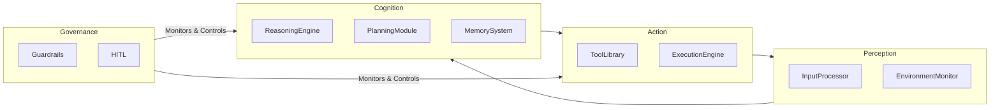

# Lộ Trình Toàn Diện Để Làm Chủ Thiết Kế Hệ Thống Agent

**Tác giả:** Manus AI
**Phiên bản:** 1.0
**Ngày cập nhật:** 13/12/2025
**Đối tượng:** Lập trình viên, kiến trúc sư phần mềm, và các nhà lãnh đạo sản phẩm tại Việt Nam.

---

## Lời Mở Đầu

Năm 2025 đánh dấu một bước ngoặt trong ngành công nghiệp phần mềm: sự trỗi dậy của **Agentic AI** - các hệ thống Trí tuệ Nhân tạo có khả năng tự chủ. Không còn là những công cụ thụ động chỉ phản hồi theo lệnh, các agent AI có thể nhận thức môi trường, tự lập kế hoạch, và thực thi các hành động phức tạp để đạt được mục tiêu. Chúng đại diện cho một mô hình mới về cách con người và máy móc tương tác, hứa hẹn tự động hóa các quy trình nhận thức và giải quyết vấn đề ở một quy mô chưa từng có.

Tuy nhiên, sự bùng nổ của các thuật ngữ như "autonomous agents", "AI swarms", và các framework như LangGraph, CrewAI đã tạo ra một bối cảnh vừa thú vị vừa hỗn loạn. Đối với các lập trình viên và kỹ sư tại Việt Nam, việc nắm bắt được bản chất của những hệ thống này, phân biệt giữa cường điệu và thực tế, và xây dựng một lộ trình học tập có hệ thống là một thách thức lớn.

Tài liệu này được tạo ra để giải quyết chính xác thách thức đó. Với cấu trúc **MECE (Mutually Exclusive, Collectively Exhaustive - Loại trừ lẫn nhau, Bao hàm toàn diện)**, chúng tôi sẽ "mổ xẻ" toàn bộ các khía cạnh của thiết kế hệ thống agent, từ những thành phần cơ bản nhất đến các kiến trúc đa agent phức tạp được sử dụng bởi các công ty công nghệ hàng đầu. Mục tiêu của chúng tôi không chỉ là cung cấp kiến thức, mà là một **bản đồ chi tiết**—một lộ trình 40 trang—để bất kỳ nhà phát triển nào cũng có thể tự tin bước vào lĩnh vực đầy tiềm năng này, xây dựng các ứng dụng agentic mạnh mẽ, và trở thành người dẫn đầu trong cuộc cách mạng AI tiếp theo.

---

## PHẦN I: NỀN TẢNG CỦA HỆ THỐNG AGENT

### Chương 1: Giới thiệu về Tư duy Agentic (Agentic Thinking)

#### 1.1. Agentic AI là gì?

Để hiểu về Agentic AI, chúng ta cần phân biệt nó với hai làn sóng AI trước đó:

| Loại AI | Mô tả | Ví dụ | Vai trò |
| :--- | :--- | :--- | :--- |
| **AI Phân tích (Analytical AI)** | Học các mẫu từ dữ liệu lịch sử để đưa ra dự đoán về tương lai. | Mô hình dự đoán giá cổ phiếu, hệ thống gợi ý sản phẩm. | **Nhà phân tích dữ liệu.** |
| **AI Tạo sinh (Generative AI)** | Tạo ra nội dung mới (văn bản, hình ảnh, âm thanh) dựa trên các mẫu đã học. | ChatGPT, Midjourney, Sora. | **Người sáng tạo nội dung.** |
| **AI Agentic (Agentic AI)** | Tự chủ hành động trong một môi trường để đạt được mục tiêu. Nó sử dụng AI tạo sinh để suy luận và lập kế hoạch. | Agent tự động đặt vé máy bay, agent quản lý chuỗi cung ứng. | **Người thực thi công việc.** |

**Agentic AI** là một hệ thống phần mềm có khả năng **nhận thức (perceive)** môi trường của nó, **lập kế hoạch (plan)** một chuỗi các hành động để đạt được một mục tiêu cụ thể, và **thực thi (execute)** những hành động đó bằng cách sử dụng một tập hợp các công cụ (tools). Nó là sự kết hợp giữa khả năng suy luận của AI tạo sinh và khả năng tương tác với thế giới thực (hoặc thế giới số) thông qua các API và hành động.

Sự thay đổi cốt lõi từ Generative AI sang Agentic AI là sự chuyển đổi từ **phản hồi (response)** sang **hành động (action)**. Một mô hình ngôn ngữ lớn (LLM) chỉ có thể cung cấp cho bạn một câu trả lời, nhưng một agent có thể lấy câu trả lời đó và thực hiện một điều gì đó với nó.

#### 1.2. Tại sao 2025 là năm của Agent?

Sự hội tụ của ba yếu tố chính đã tạo nên một "cơn bão hoàn hảo" cho sự bùng nổ của agent:

1.  **Sự trưởng thành của LLM:** Các mô hình như GPT-4, Claude 3, và Gemini đã đạt đến một ngưỡng đủ mạnh mẽ để thực hiện các tác vụ suy luận và lập kế hoạch phức tạp, vốn là "bộ não" của agent.
2.  **Sự phổ biến của API:** Hầu hết mọi dịch vụ kỹ thuật số ngày nay đều cung cấp API, tạo ra một "sân chơi" rộng lớn để các agent có thể tương tác và hành động.
3.  **Sự phát triển của các Framework Agentic:** Các công cụ mã nguồn mở như LangChain, LangGraph, và CrewAI đã trừu tượng hóa phần lớn sự phức tạp trong việc xây dựng agent, cho phép các nhà phát triển tập trung vào logic nghiệp vụ thay vì các chi tiết kỹ thuật cấp thấp.

Tác động của xu hướng này đối với ngành công nghiệp phần mềm là vô cùng to lớn. Nó báo trước một sự thay đổi từ việc xây dựng các ứng dụng có giao diện người dùng đồ họa (GUI) sang việc xây dựng các "giao diện người dùng ngôn ngữ" (LUI - Language User Interfaces), nơi người dùng chỉ cần nêu ra mục tiêu của họ bằng ngôn ngữ tự nhiên, và một đội quân các agent sẽ làm phần còn lại.

#### 1.3. Cấu trúc tài liệu và Lộ trình học tập

Tài liệu này được cấu trúc thành bốn phần chính, tạo thành một lộ trình học tập lũy tiến:

*   **Phần I: Nền tảng của Hệ thống Agent:** Chúng ta sẽ bắt đầu bằng cách phân tích cấu trúc cơ bản của một agent, xác định các thành phần cốt lõi theo nguyên tắc MECE.
*   **Phần II: Phân loại các Kiến trúc và Ứng dụng:** Chúng ta sẽ khám phá các loại kiến trúc agent khác nhau, từ đơn giản đến phức tạp, và các trường hợp sử dụng thực tế của chúng.
*   **Phần III: Lộ trình Làm chủ Thiết kế Hệ thống Agent:** Đây là phần cốt lõi của tài liệu, cung cấp một lộ trình 5 cấp độ chi tiết, kèm theo các dự án thực hành có code mẫu để bạn có thể xây dựng và học hỏi.
*   **Phần IV: Chuyên sâu và Tương lai:** Chúng ta sẽ thảo luận về các chủ đề nâng cao và nhìn về tương lai của lĩnh vực agentic AI.

Bằng cách đi theo lộ trình này, bạn sẽ xây dựng được một nền tảng kiến thức vững chắc và có hệ thống, sẵn sàng để chinh phục những thách thức phức tạp nhất trong lĩnh vực thiết kế hệ thống agent.


### Chương 2: Phân tích MECE các Thành phần của một Agent

Để xây dựng một hệ thống agent mạnh mẽ và có thể bảo trì, chúng ta không thể xem nó như một "hộp đen" bí ẩn. Thay vào đó, chúng ta phải áp dụng tư duy kỹ thuật hệ thống, phân rã nó thành các thành phần chức năng riêng biệt, không chồng chéo. Khung MECE dưới đây cung cấp một "bản thiết kế" tiêu chuẩn cho mọi agent, bất kể mức độ phức tạp.

Một agent có thể được chia thành bốn lớp (Layer) chính, mỗi lớp chứa các thành phần (Component) cụ thể. Bốn lớp này đại diện cho chu trình xử lý hoàn chỉnh của một agent: từ việc nhận thông tin đến việc thực hiện hành động.

**Sơ đồ tổng quan các lớp MECE của một Agent:**



Bây giờ, chúng ta sẽ đi sâu vào từng thành phần trong mỗi lớp.

#### 2.1. Lớp 1: Nhận thức (Perception Layer)

Đây là lớp chịu trách nhiệm thu thập thông tin từ thế giới bên ngoài và chuyển đổi nó thành một định dạng mà "bộ não" của agent có thể hiểu được. Nếu không có lớp nhận thức hiệu quả, agent sẽ bị "mù" và "điếc".

**2.1.1. Thành phần: Bộ xử lý đầu vào (Input Processor)**

*   **Chức năng:** Là cửa ngõ đầu tiên của agent, chịu trách nhiệm tiếp nhận, làm sạch và chuẩn hóa tất cả các loại dữ liệu đầu vào.
*   **Chi tiết hoạt động:**
    *   **Xử lý đa phương thức (Modality Handling):** Agent không chỉ nhận văn bản. Nó có thể nhận hình ảnh (từ file upload), giọng nói (từ microphone), video, hoặc dữ liệu có cấu trúc (từ một API call). Input Processor phải xác định loại dữ liệu và sử dụng các mô hình chuyên biệt (ví dụ: mô hình Speech-to-Text như Whisper cho âm thanh, mô hình Vision cho hình ảnh) để chuyển đổi tất cả về một định dạng chung, thường là văn bản hoặc JSON.
    *   **Xác thực và làm sạch (Validation & Sanitization):** Dữ liệu đầu vào từ người dùng hoặc hệ thống bên ngoài không bao giờ đáng tin cậy 100%. Thành phần này phải kiểm tra xem dữ liệu có hợp lệ không (ví dụ: một địa chỉ email có đúng định dạng không?), và quan trọng hơn, loại bỏ các mã độc hại hoặc các kỹ thuật tấn công như **Prompt Injection**.
    *   **Chuẩn hóa (Normalization):** Dữ liệu từ các nguồn khác nhau có thể có định dạng khác nhau. Ví dụ, ngày tháng có thể là `DD/MM/YYYY` hoặc `MM-DD-YY`. Input Processor sẽ chuyển đổi tất cả về một định dạng thống nhất (ví dụ: ISO 8601) để các lớp sau có thể xử lý một cách nhất quán.
*   **Tầm quan trọng:** Một Input Processor yếu kém sẽ dẫn đến việc agent hiểu sai yêu cầu, dễ bị tấn công, hoặc không thể xử lý các loại thông tin đa dạng, làm giảm đáng kể tính hữu dụng của nó.

**2.1.2. Thành phần: Bộ giám sát môi trường (Environment Monitor)**

*   **Chức năng:** Duy trì một mô hình nội tại (internal model) về trạng thái của thế giới bên ngoài mà agent cần quan tâm. Nó trả lời câu hỏi: "Chuyện gì đang xảy ra xung quanh tôi?"
*   **Chi tiết hoạt động:**
    *   **Theo dõi trạng thái (State Tracking):** Thành phần này có thể theo dõi các thông tin như: thời gian hiện tại, vị trí của người dùng, trạng thái của một đơn hàng, giá cổ phiếu hiện tại, hoặc nội dung của một trang web. Nó không chỉ là dữ liệu tĩnh mà là một bức tranh động về môi trường.
    *   **Cập nhật theo thời gian thực hoặc định kỳ (Real-time vs. Periodic Updates):** Tùy thuộc vào yêu cầu, việc cập nhật có thể diễn ra liên tục (ví dụ: qua WebSockets để theo dõi giá tiền điện tử) hoặc theo chu kỳ (ví dụ: kiểm tra email mới mỗi 5 phút).
    *   **Phát hiện sự kiện (Event Detection):** Đây là một chức năng quan trọng. Thay vì chỉ đọc trạng thái, Environment Monitor có thể phát hiện những *thay đổi* quan trọng và kích hoạt agent hành động. Ví dụ: "Khi trạng thái đơn hàng chuyển từ 'Đang giao' sang 'Đã giao', hãy kích hoạt agent gửi email cảm ơn cho khách hàng."
*   **Tầm quan trọng:** Nếu không có Environment Monitor, agent chỉ có thể phản ứng với các yêu cầu trực tiếp của người dùng. Với nó, agent có thể trở nên **chủ động (proactive)**, tự động hành động khi có sự thay đổi trong môi trường, mở ra vô số ứng dụng tự động hóa thông minh.

#### 2.2. Lớp 2: Nhận thức (Cognition Layer)

Đây là "bộ não" của agent, nơi diễn ra các quá trình suy luận, lập kế hoạch và ghi nhớ. Chất lượng của lớp này quyết định mức độ "thông minh" của agent.

**2.2.1. Thành phần: Động cơ suy luận (Reasoning Engine)**

*   **Chức năng:** Là hạt nhân của lớp nhận thức, thường là một Mô hình Ngôn ngữ Lớn (LLM), chịu trách nhiệm hiểu yêu cầu, suy luận logic, và đưa ra các quyết định cấp cao.
*   **Chi tiết hoạt động:**
    *   **Lựa chọn Mô hình (Model Selection):** Không phải lúc nào cũng cần mô hình mạnh nhất (và đắt nhất). Một quyết định kiến trúc quan trọng là chọn đúng LLM cho đúng công việc. Ví dụ: dùng GPT-4o cho các tác vụ lập kế hoạch phức tạp, nhưng dùng GPT-4o-mini hoặc một mô hình được fine-tune cho các tác vụ phân loại đơn giản để tiết kiệm chi phí và giảm độ trễ.
    *   **Kiến trúc Prompt (Prompt Architecture):** Đây là nghệ thuật và khoa học của việc "lập trình" LLM. Một prompt tốt không chỉ là một câu hỏi. Nó bao gồm:
        *   **System Prompt:** Định nghĩa vai trò, tính cách, và các quy tắc bất biến của agent (ví dụ: "Bạn là một trợ lý du lịch chuyên nghiệp, luôn trả lời một cách lịch sự và chi tiết.").
        *   **Few-Shot Examples:** Cung cấp một vài ví dụ về đầu vào và đầu ra mong muốn để hướng dẫn LLM hoạt động đúng cách.
        *   **Context:** Cung cấp thông tin liên quan từ Bộ nhớ (Memory System) để agent có thể đưa ra quyết định dựa trên ngữ cảnh.
    *   **Các Mẫu Suy luận (Reasoning Patterns):** Để giải quyết các vấn đề phức tạp, agent cần các kỹ thuật suy luận có cấu trúc. Các mẫu phổ biến bao gồm:
        *   **Chain-of-Thought (CoT):** Hướng dẫn LLM "suy nghĩ từng bước" trước khi đưa ra câu trả lời cuối cùng, giúp cải thiện độ chính xác của các bài toán logic.
        *   **ReAct (Reason + Act):** Một mẫu cực kỳ quan trọng cho agent. LLM sẽ lặp đi lặp lại chu trình: **Suy luận (Reason)** về bước tiếp theo cần làm -> **Hành động (Act)** bằng cách gọi một công cụ -> **Quan sát (Observe)** kết quả của công cụ đó. Chu trình này cho phép agent tương tác với môi trường và điều chỉnh kế hoạch của mình.
*   **Tầm quan trọng:** Đây là thành phần quyết định khả năng giải quyết vấn đề của agent. Một Reasoning Engine mạnh mẽ có thể hiểu được các yêu cầu mơ hồ, phá vỡ các vấn đề phức tạp, và đưa ra các quyết định thông minh.

**2.2.2. Thành phần: Module lập kế hoạch (Planning Module)**

*   **Chức năng:** Chuyển đổi một mục tiêu cấp cao, thường mơ hồ của người dùng (ví dụ: "lên kế hoạch cho một chuyến đi") thành một chuỗi các bước cụ thể, có thể thực thi được.
*   **Chi tiết hoạt động:**
    *   **Phân rã nhiệm vụ (Task Decomposition):** Đây là chức năng cốt lõi. Module này sẽ chia một nhiệm vụ lớn thành các nhiệm vụ con nhỏ hơn. Ví dụ, "lên kế hoạch chuyến đi" được chia thành: (1) Tìm vé máy bay, (2) Tìm khách sạn, (3) Tìm các địa điểm tham quan, (4) Lập lịch trình chi tiết.
    *   **Biểu diễn Kế hoạch (Plan Representation):** Kế hoạch có thể được biểu diễn dưới dạng một danh sách các bước tuần tự, hoặc phức tạp hơn, là một **Đồ thị có hướng không chu trình (DAG - Directed Acyclic Graph)**, cho phép thực hiện các bước song song.
    *   **Tái lập kế hoạch động (Dynamic Replanning):** Thế giới thực không thể đoán trước. Một công cụ có thể thất bại, một API có thể không trả về dữ liệu. Planning Module phải có khả năng nhận biết thất bại từ Lớp Hành động (Action Layer) và tự động điều chỉnh kế hoạch. Ví dụ: "Không tìm thấy chuyến bay vào ngày X, thử tìm vào ngày Y."
    *   **Các kỹ thuật nâng cao:** Các hệ thống phức tạp có thể sử dụng các kỹ thuật như **Tree of Thoughts (ToT)**, nơi agent khám phá nhiều nhánh kế hoạch khác nhau và đánh giá chúng trước khi chọn ra nhánh tốt nhất.
*   **Tầm quan trọng:** Nếu Reasoning Engine là bộ não chiến lược, thì Planning Module là bộ não chiến thuật. Nó biến ý định thành một kế hoạch hành động cụ thể, là cầu nối giữa suy nghĩ và thực thi. Các agent không có Planning Module chỉ có thể thực hiện các tác vụ một bước đơn giản.

**2.2.3. Thành phần: Hệ thống bộ nhớ (Memory System)**

*   **Chức năng:** Cung cấp cho agent khả năng ghi nhớ và truy xuất thông tin, cho phép nó duy trì ngữ cảnh, học hỏi từ các tương tác trong quá khứ, và cá nhân hóa trải nghiệm.
*   **Chi tiết hoạt động:** Bộ nhớ của agent được chia thành hai loại chính:
    *   **Bộ nhớ Ngắn hạn (Short-Term / Working Memory):**
        *   **Mục đích:** Lưu trữ thông tin liên quan đến phiên tương tác hiện tại.
        *   **Ví dụ:** Lịch sử cuộc trò chuyện, các kết quả trung gian từ các lệnh gọi công cụ, kế hoạch hiện tại.
        *   **Công nghệ:** Thường được lưu trữ trong bộ nhớ (in-memory) của ứng dụng hoặc trong các hệ thống cache nhanh như Redis. Đây chính là "context window" được đưa vào prompt của LLM trong mỗi lượt tương tác.
    *   **Bộ nhớ Dài hạn (Long-Term / Knowledge Base):**
        *   **Mục đích:** Lưu trữ thông tin một cách bền vững qua nhiều phiên, cho phép agent học hỏi và phát triển theo thời gian.
        *   **Ví dụ:** Sở thích của người dùng ("Tôi thích các chuyến bay buổi sáng"), các sự kiện quan trọng trong quá khứ, một kho tài liệu kiến thức lớn.
        *   **Công nghệ:**
            *   **Cơ sở dữ liệu Vector (Vector Database - vd: Pinecone, Chroma):** Dùng cho **tìm kiếm ngữ nghĩa (semantic search)**. Các đoạn văn bản được chuyển thành các vector số học. Khi cần truy xuất, câu truy vấn cũng được chuyển thành vector và hệ thống sẽ tìm các vector gần nhất (tương đồng nhất về mặt ngữ nghĩa). Đây là công nghệ nền tảng của **Retrieval-Augmented Generation (RAG)**.
            *   **Cơ sở dữ liệu Quan hệ/NoSQL (Relational/NoSQL DB):** Dùng để lưu trữ dữ liệu có cấu trúc như thông tin người dùng, lịch sử đơn hàng, v.v.
*   **Tầm quan trọng:** Bộ nhớ là thứ biến một chatbot vô hồn thành một trợ lý cá nhân thực thụ. Nó cho phép agent nhớ bạn là ai, bạn thích gì, và những gì bạn đã làm, tạo ra một trải nghiệm liền mạch và thông minh hơn nhiều.

*(Tiếp tục các Lớp 3 và 4 trong các phần sau...)*


#### 2.3. Lớp 3: Hành động (Action Layer)

Nếu Lớp Nhận thức là tai và mắt, Lớp Nhận thức là bộ não, thì Lớp Hành động chính là tay và chân của agent. Đây là nơi các quyết định và kế hoạch được chuyển thành các hành động cụ thể, có tác động đến thế giới bên ngoài.

**2.3.1. Thành phần: Thư viện Công cụ & Hàm (Tool & Function Library)**

*   **Chức năng:** Cung cấp một bộ sưu tập các "siêu năng lực" mà agent có thể sử dụng. Mỗi công cụ là một hành động cụ thể mà agent có thể thực hiện.
*   **Chi tiết hoạt động:**
    *   **Định nghĩa Công cụ (Tool Definition):** Một công cụ không chỉ là một hàm code. Để LLM có thể hiểu và sử dụng được, một công cụ phải được định nghĩa một cách rõ ràng, thường bao gồm:
        *   **Tên hàm:** Một cái tên mang tính mô tả cao (ví dụ: `search_flights` thay vì `f1`).
        *   **Mô tả (Docstring):** Một câu giải thích rõ ràng về chức năng của công cụ (ví dụ: "Tìm kiếm các chuyến bay giữa hai thành phố vào một ngày cụ thể."). Đây là thông tin quan trọng nhất mà LLM sẽ dựa vào để quyết định có chọn công cụ này hay không.
        *   **Định nghĩa Tham số (Parameter Definition):** Các tham số đầu vào phải được định nghĩa rõ ràng với kiểu dữ liệu (ví dụ: `origin: str`, `destination: str`, `date: date`). Các framework hiện đại thường sử dụng Pydantic model để làm việc này.
    *   **Các loại công cụ:** Thư viện công cụ có thể bao gồm:
        *   **Các hàm Python nội bộ:** Để thực hiện các phép tính, xử lý dữ liệu.
        *   **Các lệnh gọi API bên ngoài:** Để tương tác với các dịch vụ của bên thứ ba (Google Maps, Stripe, Jira).
        *   **Các agent khác:** Trong kiến trúc đa agent, một agent có thể là một công cụ của một agent khác.
    *   **Quản lý và Phiên bản (Versioning & Management):** Khi số lượng công cụ tăng lên, việc quản lý chúng trở nên quan trọng. Cần có cơ chế để theo dõi phiên bản của các công cụ, xử lý các thay đổi (ví dụ: một API thay đổi tham số), và đảm bảo tính tương thích.
*   **Tầm quan trọng:** Công cụ là thứ mang lại sức mạnh thực sự cho agent. Một agent không có công cụ chỉ là một chatbot. Một agent với một thư viện công cụ phong phú có thể trở thành một nhân viên tự động hóa mạnh mẽ.

**2.3.2. Thành phần: Động cơ thực thi (Execution Engine)**

*   **Chức năng:** Chịu trách nhiệm gọi các công cụ đã được Lớp Nhận thức lựa chọn một cách đáng tin cậy, xử lý kết quả trả về, và báo cáo lại cho Lớp Nhận thức.
*   **Chi tiết hoạt động:**
    *   **Gọi công cụ (Tool Invocation):** Sau khi Planning Module quyết định gọi công cụ `search_flights(origin="Hanoi", destination="Saigon")`, Execution Engine sẽ thực sự thực hiện lệnh gọi hàm hoặc API call này.
    *   **Xử lý lỗi và Thử lại (Error Handling & Retry Logic):** Các lệnh gọi mạng thường không đáng tin cậy. API có thể bị lỗi, mạng có thể bị ngắt. Execution Engine phải được trang bị các cơ chế mạnh mẽ để xử lý những tình huống này, ví dụ như **thử lại theo cấp số nhân (exponential backoff)** - thử lại sau 1s, rồi 2s, rồi 4s,...
    *   **Quản lý Timeout và Song song (Timeout & Concurrency Management):** Một công cụ không nên được phép chạy vô thời hạn. Execution Engine phải đặt ra một khoảng thời gian chờ (timeout) và hủy bỏ công cụ nếu nó không phản hồi. Trong các hệ thống nâng cao, nó cũng có thể quản lý việc thực thi nhiều công cụ cùng một lúc (song song) để tăng tốc độ.
    *   **Phân tích và Chuẩn hóa Kết quả (Result Parsing & Normalization):** Kết quả trả về từ một công cụ (ví dụ: một chuỗi JSON lớn từ API của hãng hàng không) cần được phân tích, trích xuất thông tin quan trọng, và chuyển đổi thành một định dạng đơn giản để Lớp Nhận thức có thể "tiêu hóa" và sử dụng cho bước lập kế hoạch tiếp theo.
*   **Tầm quan trọng:** Execution Engine đảm bảo rằng các hành động của agent được thực hiện một cách đáng tin cậy và hiệu quả. Nó là cầu nối vững chắc giữa thế giới trừu tượng của việc lập kế hoạch và thế giới hỗn loạn của việc thực thi trong thực tế.

#### 2.4. Lớp 4: Quản trị (Governance Layer)

Đây là lớp giám sát và kiểm soát, đảm bảo rằng agent hoạt động trong các giới hạn an toàn, có đạo đức, và có thể kiểm soát được. Trong các hệ thống sản xuất, đây là lớp quan trọng nhất để xây dựng lòng tin và tránh các hậu quả không mong muốn.

**2.4.1. Thành phần: Rào chắn & Module an toàn (Guardrails & Safety Module)**

*   **Chức năng:** Hoạt động như một "lương tâm" và "bộ phận quản lý rủi ro" của agent, áp đặt các quy tắc và ràng buộc lên hành vi của nó.
*   **Chi tiết hoạt động:**
    *   **Lọc Đầu vào/Đầu ra (Input/Output Filtering):**
        *   **Ngăn chặn Prompt Injection:** Phát hiện và vô hiệu hóa các nỗ lực của người dùng nhằm ghi đè lên system prompt của agent.
        *   **Bảo vệ Dữ liệu Cá nhân (PII Protection):** Tự động phát hiện và che giấu các thông tin nhạy cảm như số điện thoại, email, số thẻ tín dụng trong cả log và các lệnh gọi công cụ.
        *   **Kiểm duyệt nội dung độc hại:** Ngăn chặn agent tạo ra hoặc xử lý các nội dung không phù hợp.
    *   **Kiểm soát Truy cập Công cụ (Tool Access Control):** Không phải agent nào cũng được phép sử dụng mọi công cụ. Module này thực thi các quy tắc **Kiểm soát Truy cập Dựa trên Vai trò (RBAC - Role-Based Access Control)**. Ví dụ: chỉ có "Financial Agent" mới được phép gọi công cụ `execute_payment`.
    *   **Giám sát Ngân sách và Tài nguyên (Budget & Resource Monitoring):** Mỗi lệnh gọi LLM đều tốn tiền. Guardrails sẽ theo dõi tổng chi phí token và có thể dừng agent nếu nó vượt quá một ngân sách đã định trước để tránh các hóa đơn "trên trời".
*   **Tầm quan trọng:** Trong môi trường doanh nghiệp, một agent không có Guardrails là một rủi ro không thể chấp nhận. Lớp này đảm bảo agent hoạt động một cách có trách nhiệm, an toàn và tuân thủ các quy định.

**2.4.2. Thành phần: Giao diện Con người trong vòng lặp (Human-in-the-Loop - HITL Interface)**

*   **Chức năng:** Cung cấp một cơ chế để con người có thể giám sát, can thiệp, và phê duyệt các hành động của agent tại các thời điểm quan trọng.
*   **Chi tiết hoạt động:**
    *   **Định nghĩa Điểm dừng (Checkpoint Definition):** Đây là quyết định thiết kế quan trọng: khi nào agent nên dừng lại và hỏi ý kiến con người? Các điểm dừng phổ biến bao gồm:
        *   Trước khi thực hiện một hành động không thể đảo ngược (ví dụ: xóa file, gửi tiền).
        *   Khi agent có độ tin cậy thấp về bước đi tiếp theo.
        *   Khi chi phí của hành động tiếp theo vượt quá một ngưỡng nhất định.
    *   **Giao diện Người dùng (UI/UX) cho Tương tác:** Cần có một giao diện rõ ràng để con người có thể xem xét kế hoạch của agent, các tham số của công cụ sắp được gọi, và sau đó đưa ra quyết định: **Phê duyệt (Approve)**, **Từ chối (Reject)**, hoặc **Chỉnh sửa (Edit)**.
    *   **Cơ chế leo thang (Escalation Paths):** Nếu agent thất bại nhiều lần hoặc gặp phải một vấn đề mà nó không thể giải quyết, hệ thống HITL phải có một quy trình để "leo thang" vấn đề đó đến một chuyên gia con người phù hợp.
*   **Tầm quan trọng:** HITL là cầu nối giữa tự động hóa hoàn toàn và sự kiểm soát của con người. Nó cho phép các doanh nghiệp tận dụng sức mạnh của agent cho các tác vụ rủi ro cao, trong khi vẫn đảm bảo rằng quyết định cuối cùng luôn nằm trong tay con người. Đây là một thành phần không thể thiếu để triển khai agent một cách có trách nhiệm trong các ứng dụng thực tế.

---

*Kết thúc Phần I. Chúng ta đã hoàn thành việc phân tích MECE toàn bộ các thành phần cấu tạo nên một hệ thống agent. Với nền tảng vững chắc này, trong Phần II, chúng ta sẽ khám phá các cách khác nhau để lắp ráp các thành phần này thành các loại kiến trúc agent khác nhau để giải quyết các bài toán thực tế.*


## PHẦN II: PHÂN LOẠI MECE CÁC KIẾN TRÚC VÀ ỨNG DỤNG AGENT

Sau khi đã hiểu rõ các thành phần cấu tạo nên một agent, bước tiếp theo là tìm hiểu cách lắp ráp chúng thành các **kiến trúc (architectures)** khác nhau. Không phải tất cả các agent đều được tạo ra như nhau. Việc lựa chọn kiến trúc phù hợp là một trong những quyết định quan trọng nhất, ảnh hưởng trực tiếp đến độ phức tạp, chi phí, và khả năng của hệ thống.

Trong phần này, chúng ta sẽ giới thiệu một khung phân loại MECE, giúp bạn định vị được bài toán của mình và lựa chọn kiến trúc agent phù hợp nhất.

### Chương 3: Sơ đồ Phân loại Ứng dụng Agent

#### 3.1. Hai trục phân loại: Agency và Coordination

Dựa trên các nghiên cứu và thực tiễn từ các công ty hàng đầu như Google, Anthropic, và Databricks, chúng ta có thể phân loại hầu hết mọi ứng dụng agentic theo hai trục chính, trực giao với nhau:

1.  **Mức độ Tự chủ (Agency):** Trục này đo lường mức độ tự do ra quyết định của agent. Nó trải dài từ **Thụ động/Xác định (Deterministic)**, nơi agent chỉ tuân theo một kịch bản được lập trình sẵn, đến **Tự chủ/Hướng mục tiêu (Autonomous/Goal-Oriented)**, nơi agent có thể tự lập kế hoạch và thích ứng để đạt được một mục tiêu cấp cao.

2.  **Mức độ Phối hợp (Coordination):** Trục này đo lường số lượng agent tham gia và cách chúng tương tác. Nó trải dài từ **Đơn lẻ (Single)**, nơi chỉ có một agent hoạt động độc lập, đến **Đa agent/Phối hợp (Multi-Agent)**, nơi nhiều agent làm việc cùng nhau.

#### 3.2. Ma trận 4 Quadrant

Khi kết hợp hai trục này, chúng ta có một ma trận 2x2 mạnh mẽ, tạo ra bốn loại kiến trúc agent cơ bản. Ma trận này là một công cụ tư duy cực kỳ hữu ích để phân tích và thiết kế hệ thống.

| | **Thấp Agency** (Xác định, Hướng tác vụ) | **Cao Agency** (Tự chủ, Hướng mục tiêu) |
| :--- | :--- | :--- |
| **Thấp Coordination** (Đơn agent) | **Quadrant 1: Instruction**<br>_"RPA được tăng cường LLM"_ | **Quadrant 3: Autonomy**<br>_"Người giải quyết vấn đề độc lập"_ |
| **Cao Coordination** (Đa agent) | **Quadrant 2: Orchestration**<br>_"Dây chuyền lắp ráp thông minh"_ | **Quadrant 4: Choreography**<br>_"Đội ngũ chuyên gia tự quản"_ |

Bốn quadrant này không chỉ là lý thuyết. Chúng đại diện cho các mẫu kiến trúc (architectural patterns) phổ biến nhất trong thực tế. Trong các chương tiếp theo, chúng ta sẽ đi sâu vào từng quadrant, phân tích kiến trúc, ví dụ, và các trường hợp nên/không nên sử dụng.

### Chương 4: Phân tích sâu Quadrant 1: Instruction

Đây là điểm khởi đầu cho hầu hết các ứng dụng agentic trong doanh nghiệp. Nó đơn giản, đáng tin cậy, và mang lại giá trị ngay lập tức.

#### 4.1. Kiến trúc và Luồng hoạt động

Một agent "Instruction" hoạt động giống như một quy trình Tự động hóa Quy trình Robot (RPA) được tăng cường bởi khả năng hiểu ngôn ngữ tự nhiên của LLM. Luồng hoạt động của nó là tuyến tính và có thể dự đoán được.

**Sơ đồ luồng hoạt động (Ví dụ: Agent Phân loại Ticket Hỗ trợ):**


*   **Luồng hoạt động:**
    1.  **Đầu vào:** Một sự kiện bên ngoài kích hoạt agent (ví dụ: email mới được gửi đến hòm thư hỗ trợ).
    2.  **Xử lý:** Input Processor nhận email và trích xuất nội dung.
    3.  **Suy luận:** Reasoning Engine (LLM) được gọi với một prompt rất cụ thể: "Dựa trên nội dung sau, hãy phân loại ticket thành một trong các loại [A, B, C] và xác định mức độ ưu tiên là [Cao, Trung bình, Thấp]. Trả về kết quả dưới dạng JSON."
    4.  **Hành động:** Execution Engine nhận kết quả JSON và gọi một công cụ duy nhất, `tag_support_ticket`, với các tham số đã được phân loại.
    5.  **Kết thúc:** Công cụ tương tác với API của Jira/Zendesk. Quy trình kết thúc.

*   **Đặc điểm kiến trúc:**
    *   **Tuyến tính:** Không có vòng lặp phức tạp hay tái lập kế hoạch.
    *   **Trạng thái tối thiểu:** Agent không cần nhớ các tương tác trước đó.
    *   **Công cụ chuyên biệt:** Thường chỉ có một hoặc một vài công cụ rất cụ thể.
    *   **Prompt được kiểm soát chặt chẽ:** System prompt và user prompt được thiết kế để hạn chế tối đa sự "sáng tạo" của LLM.

#### 4.2. Ví dụ thực tế

*   **Chatbot Hỏi-Đáp trên tài liệu (Simple RAG):** Người dùng hỏi một câu, agent tìm kiếm trong cơ sở dữ liệu vector, lấy ngữ cảnh liên quan, và kết hợp với câu hỏi để LLM trả lời. Toàn bộ quy trình là một chuỗi các bước xác định.
*   **Tóm tắt cuộc họp:** Agent nhận bản ghi âm cuộc họp, sử dụng công cụ Speech-to-Text, sau đó gửi văn bản cho LLM với prompt "Tóm tắt các điểm chính và các mục hành động."
*   **Phân loại cảm xúc khách hàng:** Agent đọc các bài đánh giá sản phẩm và gắn thẻ cảm xúc (Tích cực, Tiêu cực, Trung tính).

#### 4.3. Khi nào nên sử dụng và giới hạn

*   **Nên sử dụng khi:**
    *   Quy trình nghiệp vụ rõ ràng, có tính lặp lại.
    *   Yêu cầu độ tin cậy và tính nhất quán cao.
    *   Rủi ro từ các hành động sai lầm là đáng kể, cần sự kiểm soát chặt chẽ.
    *   Bạn mới bắt đầu với agent và muốn có một "chiến thắng" nhanh chóng, dễ dàng.
*   **Giới hạn:**
    *   Không thể xử lý các yêu cầu mơ hồ hoặc các tác vụ đòi hỏi sự linh hoạt.
    *   Không thể thích ứng với các tình huống không lường trước.
    *   Kém hiệu quả đối với các vấn đề cần nhiều bước hoặc nhiều nguồn dữ liệu khác nhau.

### Chương 5: Phân tích sâu Quadrant 2: Orchestration

Khi một quy trình nghiệp vụ trở nên quá phức tạp cho một agent đơn lẻ, nhưng vẫn có thể được xác định trước, chúng ta bước vào Quadrant 2.

#### 5.1. Kiến trúc và Luồng hoạt động

Kiến trúc "Orchestration" giống như một dây chuyền lắp ráp thông minh, nơi mỗi "trạm" là một agent chuyên biệt (hoặc một LLM call). Một "nhà điều phối" (Orchestrator), thường là code cứng chứ không phải LLM, sẽ điều hướng công việc qua các trạm theo một luồng đã định.

*   **Luồng hoạt động (Ví dụ: Quy trình tạo báo cáo tài chính hàng quý):**
    1.  **Kích hoạt:** Đúng ngày cuối cùng của quý, một bộ lập lịch (scheduler) kích hoạt quy trình.
    2.  **Trạm 1 (Agent Thu thập Dữ liệu):** Orchestrator gọi agent này. Nó có công cụ để kết nối vào cơ sở dữ liệu bán hàng và kế toán, trích xuất dữ liệu thô.
    3.  **Trạm 2 (Agent Phân tích):** Orchestrator nhận dữ liệu thô và chuyển cho agent này. Nó sử dụng các công cụ phân tích (vd: thư viện Pandas) để tính toán các chỉ số quan trọng (doanh thu, lợi nhuận, chi phí).
    4.  **Trạm 3 (Agent Viết Báo cáo):** Orchestrator nhận các chỉ số và chuyển cho agent này. Nó sử dụng LLM với prompt "Viết một bản tóm tắt tình hình kinh doanh dựa trên các số liệu sau."
    5.  **Trạm 4 (Agent Định dạng):** Orchestrator nhận bản tóm tắt và chuyển cho agent này để định dạng thành file PDF với logo công ty.
    6.  **Kết thúc:** Orchestrator gửi email file PDF cho ban giám đốc.

*   **Đặc điểm kiến trúc:**
    *   **Dựa trên quy trình (Process-driven):** Trọng tâm là luồng công việc, không phải một agent đơn lẻ.
    *   **Chuyên môn hóa:** Mỗi agent/trạm có một bộ công cụ và trách nhiệm riêng biệt.
    *   **Điều phối tập trung:** Orchestrator (code) kiểm soát hoàn toàn luồng đi của dữ liệu.
    *   **Agency thấp:** Các agent riêng lẻ vẫn chỉ thực hiện các tác vụ được giao, không tự ra quyết định.

#### 5.2. Ví dụ thực tế

*   **Quy trình tuyển dụng tự động:** Một agent quét hồ sơ ứng viên, một agent khác lên lịch phỏng vấn, một agent thứ ba gửi email xác nhận.
*   **Tự động hóa Marketing:** Một agent theo dõi các đề cập trên mạng xã hội, một agent khác tạo nội dung trả lời, và một agent thứ ba đăng bài.

#### 5.3. So sánh với microservices truyền thống

Kiến trúc Orchestration rất giống với kiến trúc Microservices. Mỗi agent chuyên biệt có thể được xem như một microservice. Điểm khác biệt chính là các "microservice" này được tăng cường bởi LLM, cho phép chúng xử lý các đầu vào/đầu ra bằng ngôn ngữ tự nhiên và thực hiện các tác vụ suy luận mà microservice truyền thống không thể.

### Chương 6: Phân tích sâu Quadrant 3: Autonomy

Đây là nơi sự "thông minh" thực sự của agent bắt đầu tỏa sáng. Thay vì chỉ làm theo kịch bản, agent được trao quyền tự chủ để đạt được mục tiêu.

#### 6.1. Kiến trúc và Luồng hoạt động

Agent "Autonomy" hoạt động theo một vòng lặp liên tục, nổi tiếng nhất là mẫu **ReAct (Reason + Act)**. Nó không đi theo một đường thẳng mà là một chu trình khám phá và điều chỉnh.

*   **Luồng hoạt động (Ví dụ: Agent Lập kế hoạch Du lịch):**
    1.  **Mục tiêu:** Người dùng đưa ra một mục tiêu cấp cao: "Tìm cho tôi một chuyến đi cuối tuần đến Đà Lạt, tập trung vào cà phê và thiên nhiên."
    2.  **Vòng lặp 1:**
        *   **Reason (Suy luận):** LLM nghĩ: "Để lên kế hoạch, trước hết tôi cần biết ngày đi và ngày về. Tôi sẽ hỏi người dùng."
        *   **Act (Hành động):** Agent không có công cụ để hỏi, nó chỉ trả lời người dùng: "Tuyệt vời! Bạn muốn đi vào cuối tuần nào?"
    3.  **Vòng lặp 2 (Sau khi người dùng trả lời):**
        *   **Reason:** "OK, đã có ngày. Giờ tôi cần tìm chuyến bay. Tôi sẽ dùng công cụ `search_flights`."
        *   **Act:** Execution Engine gọi `search_flights(origin="SGN", destination="DLI", date="...")`.
        *   **Observe (Quan sát):** Công cụ trả về một danh sách các chuyến bay.
    4.  **Vòng lặp 3:**
        *   **Reason:** "Đã có chuyến bay. Giờ tôi cần tìm các quán cà phê đẹp. Tôi sẽ dùng công cụ `search_points_of_interest`."
        *   **Act:** Execution Engine gọi `search_points_of_interest(location="Dalat", type="cafe")`.
        *   **Observe:** Công cụ trả về một danh sách các quán cà phê.
    5.  **...Vòng lặp tiếp tục...** cho đến khi agent thu thập đủ thông tin và tạo ra một lịch trình hoàn chỉnh.

*   **Đặc điểm kiến trúc:**
    *   **Hướng mục tiêu (Goal-oriented):** Agent chỉ cần biết đích đến, không cần biết đường đi.
    *   **Vòng lặp suy luận:** Cốt lõi là chu trình Reason-Act-Observe.
    *   **Lựa chọn công cụ động:** Agent tự quyết định dùng công cụ nào và khi nào.
    *   **Quản lý trạng thái:** Agent phải có bộ nhớ (ngắn hạn) để lưu trữ kết quả của các bước trước đó.

#### 6.2. Ví dụ thực tế

*   **Agent Nghiên cứu:** Người dùng yêu cầu "Viết một báo cáo về thị trường xe điện tại Việt Nam." Agent sẽ tự tìm kiếm Google, đọc các bài báo, tổng hợp thông tin, và viết báo cáo.
*   **Agent Gỡ lỗi Code:** Lập trình viên đưa ra một đoạn code lỗi. Agent sẽ tự đọc lỗi, đề xuất các giả thuyết, áp dụng các thay đổi, chạy lại code, và lặp lại cho đến khi sửa được lỗi.

#### 6.3. Thách thức: Sai sốทบวก và Kiểm soát

Sự tự do của agent tự chủ cũng là con dao hai lưỡi. Một sai lầm nhỏ ở bước đầu (ví dụ: hiểu sai một kết quả tìm kiếm) có thể dẫn đến các quyết định sai lầm ở các bước sau, tạo ra một **sai sốทบวก (compounding error)**. Hơn nữa, việc để agent tự do hành động có thể dẫn đến các kết quả không mong muốn hoặc chi phí API tăng vọt. Do đó, các agent này đòi hỏi phải có **sandboxing** (chạy trong môi trường bị cô lập) và các **Guardrails** (Lớp Quản trị) cực kỳ mạnh mẽ.

### Chương 7: Phân tích sâu Quadrant 4: Choreography

Đây là biên giới của công nghệ agentic, nơi các hệ thống phức tạp nhất được xây dựng bằng cách cho nhiều agent tự chủ hợp tác với nhau.

#### 7.1. Kiến trúc và Luồng hoạt động

Kiến trúc "Choreography" không có một nhà điều phối trung tâm. Thay vào đó, nó giống như một đội ngũ chuyên gia, mỗi người có chuyên môn riêng, tự giao tiếp và phối hợp với nhau để giải quyết một vấn đề lớn. Hành vi của toàn bộ hệ thống là **nổi hiện (emergent)** từ sự tương tác của các cá nhân.

**Sơ đồ luồng hoạt động (Ví dụ: Đội Agent Nghiên cứu Thị trường):**


*   **Luồng hoạt động:**
    1.  **Mục tiêu:** Một Product Manager đưa ra yêu cầu cho **Agent Trưởng nhóm (Chief Researcher)**: "Phân tích thị trường protein thực vật ở Đông Nam Á."
    2.  **Phân rã & Giao việc:** Agent Trưởng nhóm không tự làm. Nó phân rã mục tiêu thành các nhiệm vụ con và giao cho các agent chuyên biệt:
        *   Giao cho **Agent Phân tích Dữ liệu**: "Tìm các bài báo, tin tức, và báo cáo thị trường."
        *   Giao cho **Agent Phân tích Tài chính**: "Tìm thông tin về các vòng gọi vốn của các công ty chủ chốt."
        *   Giao cho **Agent Phân tích Mạng xã hội**: "Phân tích cảm xúc của người tiêu dùng trên Twitter và Reddit."
    3.  **Thực thi song song:** Cả ba agent chuyên biệt bắt đầu làm việc cùng một lúc, sử dụng các công cụ riêng của chúng (Web Search, Crunchbase API, Social Media API).
    4.  **Tổng hợp:** Khi các agent chuyên biệt hoàn thành, chúng gửi kết quả trở lại cho Agent Trưởng nhóm.
    5.  **Hoàn thành:** Agent Trưởng nhóm nhận tất cả các mảnh thông tin, đọc, hiểu, và viết thành một báo cáo tổng hợp duy nhất, mạch lạc.

*   **Đặc điểm kiến trúc:**
    *   **Phân tán:** Không có điểm kiểm soát trung tâm duy nhất.
    *   **Chuyên môn hóa cao:** Mỗi agent là một chuyên gia trong lĩnh vực của mình.
    *   **Giao tiếp ngang hàng:** Các agent có thể giao tiếp trực tiếp với nhau (ví dụ: Agent Phân tích Dữ liệu có thể hỏi Agent Phân tích Tài chính về một công ty mà nó tìm thấy).
    *   **Hành vi nổi hiện:** Kết quả cuối cùng là sản phẩm của sự hợp tác, không phải là một kịch bản được định trước.

#### 7.2. Ví dụ thực tế

*   **Tối ưu hóa chuỗi cung ứng (Uber/Grab):** Một agent đại diện cho mỗi tài xế, một agent đại diện cho mỗi hành khách. Các agent này liên tục giao tiếp để tìm ra sự kết hợp tối ưu nhất giữa cung và cầu trong thời gian thực.
*   **Mô phỏng thị trường tài chính:** Mỗi agent đóng vai một nhà đầu tư với một chiến lược riêng. Hệ thống chạy mô phỏng để xem các chiến lược này tương tác với nhau như thế nào và tác động đến thị trường ra sao.
*   **Phát triển phần mềm tự động:** Một agent "Product Manager" viết yêu cầu, một agent "Developer" viết code, một agent "QA" viết và chạy test. Chúng làm việc cùng nhau trong một vòng lặp để tạo ra phần mềm.

#### 7.3. Thách thức: Phức tạp ở quy mô lớn

Kiến trúc Choreography cực kỳ mạnh mẽ nhưng cũng vô cùng phức tạp để thiết kế và gỡ lỗi. Các thách thức chính bao gồm:

*   **Giao tiếp:** Làm thế nào để các agent giao tiếp hiệu quả và không bị "nhiễu" thông tin?
*   **Giải quyết xung đột:** Điều gì xảy ra khi hai agent có ý kiến trái ngược nhau?
*   **Ghi nhận công lao (Credit Assignment):** Khi hệ thống thành công, làm thế nào để biết agent nào đã đóng góp nhiều nhất?
*   **Khả năng quan sát:** Việc theo dõi và hiểu được luồng suy nghĩ của một hệ thống phân tán như vậy là một bài toán cực kỳ khó.

Do đó, kiến trúc này hiện chủ yếu được sử dụng trong các môi trường nghiên cứu hoặc các ứng dụng rất chuyên biệt, có giá trị cực cao của các công ty công nghệ lớn.

---

*Kết thúc Phần II. Chúng ta đã khám phá bốn loại kiến trúc agent chính. Giờ đây, bạn đã có một "la bàn" để định vị các loại bài toán khác nhau. Trong Phần III, chúng ta sẽ bắt đầu hành trình thực tế: xây dựng các agent thuộc các quadrant này thông qua một lộ trình chi tiết với code mẫu.*


## PHẦN III: LỘ TRÌNH LÀM CHỦ THIẾT KẾ HỆ THỐNG AGENT

Phần này là trái tim của toàn bộ tài liệu. Chúng tôi sẽ cung cấp một lộ trình chi tiết, gồm 5 cấp độ, để đưa bạn từ một người mới bắt đầu trở thành một chuyên gia về hệ thống agent. Mỗi cấp độ sẽ bao gồm lý thuyết cốt lõi và một dự án thực hành cụ thể, với code mẫu và giải thích chi tiết, giúp bạn áp dụng ngay những gì đã học.

### Chương 8: Level 0 - Điều kiện tiên quyết

Trước khi viết dòng code agentic đầu tiên, bạn cần đảm bảo mình đã có một nền tảng kỹ thuật vững chắc. Việc bỏ qua giai đoạn này sẽ khiến bạn gặp rất nhiều khó khăn ở các cấp độ sau. Đây là những kỹ năng không thể thiếu.

#### 8.1. Yêu cầu về Kỹ năng

*   **Python Nâng cao:**
    *   **Lập trình Hướng đối tượng (OOP):** Bạn phải thoải mái với `class`, `object`, `inheritance`. Các framework agentic sử dụng OOP một cách rộng rãi để định nghĩa Agent, Tool, và các thành phần khác.
    *   **Lập trình Bất đồng bộ (`asyncio`):** Các agent thường phải gọi nhiều API và thực hiện nhiều tác vụ cùng lúc. `async` và `await` là bắt buộc để xây dựng các agent hiệu quả, không bị chặn (non-blocking), đặc biệt khi làm việc với các tác vụ I/O (như gọi API mạng).
    *   **Thao tác với Dữ liệu:** Thành thạo với việc xử lý JSON, dictionary, và list là điều kiện tiên quyết.

*   **Kiến thức về API:**
    *   **REST API:** Hiểu sâu về các phương thức HTTP (`GET`, `POST`, `PUT`, `DELETE`), status code (200, 404, 500), và cách truyền dữ liệu (headers, body, query parameters).
    *   **Xác thực (Authentication):** Có kinh nghiệm thực tế với các cơ chế xác thực phổ biến như API Keys, OAuth 2.0. Bạn sẽ cần nó để cho phép agent truy cập các dịch vụ được bảo vệ.

*   **Kiến thức LLM Cơ bản:**
    *   **Kinh nghiệm thực tế:** Đã từng sử dụng API của một nhà cung cấp LLM lớn (OpenAI, Google, Anthropic) để thực hiện các tác vụ tạo sinh văn bản đơn giản.
    *   **Hiểu các khái niệm cốt lõi:**
        *   **Token:** Đơn vị tính toán của LLM. Hiểu token giúp bạn ước tính chi phí và quản lý độ dài của prompt.
        *   **Context Window:** Giới hạn về lượng thông tin (tính bằng token) mà LLM có thể "nhớ" trong một lượt tương tác. Đây là một trong những ràng buộc quan trọng nhất khi thiết kế agent.
        *   **System Prompt:** Hiểu vai trò của system prompt trong việc định hình hành vi và "tính cách" của LLM.

#### 8.2. Thiết lập Môi trường

Để chuẩn bị cho các dự án trong các chương tiếp theo, hãy tạo một môi trường ảo Python và cài đặt các thư viện cần thiết:

```bash
# Tạo và kích hoạt môi trường ảo
python -m venv agent_env
source agent_env/bin/activate

# Cài đặt các thư viện cốt lõi
pip install openai python-dotenv langchain langgraph crewai

# Tạo file .env để lưu trữ API key
echo "OPENAI_API_KEY=\"your_openai_api_key_here\"" > .env
```

### Chương 9: Level 1 - Agentic Fundamentals & Instruction Agent

Ở cấp độ này, chúng ta sẽ xây dựng agent đầu tiên: một agent "Instruction" thuộc Quadrant 1. Mục tiêu là hiểu rõ vòng lặp agent cơ bản và cách làm cho LLM hoạt động một cách đáng tin cậy cho một tác vụ cụ thể.

#### 9.1. Lý thuyết cốt lõi

*   **Vòng lặp Agent cơ bản:** Đây là mô hình đơn giản nhất: **Nhận đầu vào -> Suy luận (LLM) -> Hành động (Tool)**. Không có kế hoạch phức tạp, không có bộ nhớ dài hạn.
*   **Structured Outputs (Đầu ra có cấu trúc):** Thách thức lớn nhất khi làm việc với LLM là chúng thường trả về văn bản tự do, khó phân tích. Kỹ thuật quan trọng ở level này là ép LLM trả về một định dạng dữ liệu nhất quán như JSON. Hầu hết các LLM hiện đại đều hỗ trợ "JSON Mode" để đảm bảo đầu ra luôn là một JSON hợp lệ.
*   **Tool Use (Sử dụng Công cụ) cơ bản:** Chúng ta sẽ định nghĩa một hàm Python đơn giản và hướng dẫn LLM cách gọi hàm đó với các tham số chính xác được trích xuất từ yêu cầu của người dùng.

#### 9.2. Dự án thực hành: Xây dựng Agent Phân loại Ticket Hỗ trợ (Demo 1)

**9.2.1. Yêu cầu và Thiết kế**

*   **Mục tiêu:** Xây dựng một agent tự động đọc email hỗ trợ khách hàng, phân loại (Category) và xác định độ ưu tiên (Priority), sau đó gọi một hàm để cập nhật vào hệ thống (giả lập).
*   **Kiến trúc:** Quadrant 1 - Instruction.
*   **Thành phần MECE được sử dụng:**
    *   **Perception:** Input Processor (nhận văn bản email).
    *   **Cognition:** Reasoning Engine (LLM để phân loại).
    *   **Action:** Tool Library (một hàm `tag_ticket`), Execution Engine (gọi hàm đó).

**9.2.2. Code Walkthrough chi tiết**

Tạo một file tên `level1_classifier.py`:

```python
import os
import json
from openai import OpenAI
from dotenv import load_dotenv

# 1. THIẾT LẬP
# Tải API key từ file .env
load_dotenv()
client = OpenAI(api_key=os.getenv("OPENAI_API_KEY"))

# 2. ĐỊNH NGHĨA CÔNG CỤ (TOOL DEFINITION)
# Đây là hàm mà chúng ta muốn LLM gọi.
def tag_support_ticket(ticket_id: int, category: str, priority: str):
    """Gắn thẻ một ticket hỗ trợ với loại và mức độ ưu tiên được chỉ định.

    Args:
        ticket_id (int): ID của ticket cần gắn thẻ.
        category (str): Loại của ticket. Phải là một trong các giá trị: ["Billing Inquiry", "Technical Support", "Sales Question", "General Inquiry"].
        priority (str): Mức độ ưu tiên của ticket. Phải là một trong các giá trị: ["Low", "Medium", "High"].
    """
    print(f"\n[ACTION] Tagging ticket {ticket_id} with:")
    print(f"  - Category: {category}")
    print(f"  - Priority: {priority}")
    # Trong thực tế, hàm này sẽ gọi API của Jira, Zendesk, v.v.
    return {"status": "success", "ticket_id": ticket_id}

# 3. LOGIC CHÍNH CỦA AGENT
def run_classification_agent(ticket_id: int, email_content: str):
    print(f"--- Processing Ticket {ticket_id} ---")
    print(f"Email Content: {email_content}")

    # Định nghĩa các công cụ mà LLM có thể sử dụng
    tools = [
        {
            "type": "function",
            "function": {
                "name": "tag_support_ticket",
                "description": "Gắn thẻ một ticket hỗ trợ với loại và mức độ ưu tiên được chỉ định.",
                "parameters": {
                    "type": "object",
                    "properties": {
                        "ticket_id": {"type": "integer", "description": "ID của ticket"},
                        "category": {
                            "type": "string",
                            "enum": ["Billing Inquiry", "Technical Support", "Sales Question", "General Inquiry"]
                        },
                        "priority": {
                            "type": "string",
                            "enum": ["Low", "Medium", "High"]
                        }
                    },
                    "required": ["ticket_id", "category", "priority"]
                }
            }
        }
    ]

    # Gọi LLM với nội dung email và yêu cầu nó sử dụng công cụ
    response = client.chat.completions.create(
        model="gpt-4o-mini", # Dùng model nhỏ, nhanh, rẻ cho tác vụ đơn giản
        messages=[
            {"role": "system", "content": "You are an expert support ticket classifier. Your job is to analyze the user's email and use the tag_support_ticket function to classify it."},
            {"role": "user", "content": email_content}
        ],
        tools=tools,
        tool_choice="auto" # Để LLM tự quyết định khi nào dùng công cụ
    )

    response_message = response.choices[0].message

    # Kiểm tra xem LLM có quyết định gọi công cụ hay không
    if response_message.tool_calls:
        print("\n[REASONING] LLM decided to call a tool.")
        tool_call = response_message.tool_calls[0]
        function_name = tool_call.function.name
        function_args = json.loads(tool_call.function.arguments)

        if function_name == "tag_support_ticket":
            # Gọi hàm Python tương ứng
            result = tag_support_ticket(
                ticket_id=ticket_id, # Truyền ticket_id từ logic của chúng ta
                category=function_args.get("category"),
                priority=function_args.get("priority")
            )
            print(f"\n[RESULT] {result}")
        else:
            print(f"Error: LLM called an unknown function: {function_name}")
    else:
        print("\n[REASONING] LLM did not call any tool. It might be asking for clarification.")
        print(f"LLM Response: {response_message.content}")

    print("--- End of Ticket Processing ---\n")

# 4. CHẠY THỬ
if __name__ == "__main__":
    # Ví dụ 1: Vấn đề kỹ thuật khẩn cấp
    email_1 = "Hi, our main production server is down! We can't access anything. This is extremely urgent, please help ASAP!"
    run_classification_agent(101, email_1)

    # Ví dụ 2: Hỏi về hóa đơn
    email_2 = "Hello, I was looking at my last invoice and I think there might be a mistake in the charges. Can someone please take a look? It's not super urgent. Thanks."
    run_classification_agent(102, email_2)

    # Ví dụ 3: Yêu cầu không rõ ràng
    email_3 = "Hey, can you help me with something?"
    run_classification_agent(103, email_3)
```

**Giải thích Code:**

1.  **Định nghĩa Công cụ:** Chúng ta định nghĩa một hàm Python `tag_support_ticket` bình thường. Điều quan trọng là **docstring** và **type hints** của nó. Đây là thông tin mà chúng ta sẽ chuyển cho LLM.
2.  **Chuyển đổi sang định dạng của OpenAI:** Trong `run_classification_agent`, chúng ta tạo một đối tượng `tools` để mô tả hàm Python của mình theo định dạng mà API của OpenAI yêu cầu. Chúng ta định nghĩa tên hàm, mô tả, và các tham số (bao gồm cả các giá trị `enum` hợp lệ). Việc này giúp LLM biết chính xác nó có thể làm gì và phải cung cấp những thông tin gì.
3.  **Gọi LLM:** Chúng ta gọi API `chat.completions.create` và truyền vào `tools`. Tham số `tool_choice="auto"` cho phép LLM tự quyết định có nên gọi công cụ hay không.
4.  **Xử lý Phản hồi:** Phản hồi từ LLM có thể chứa một `tool_calls`. Nếu có, điều đó có nghĩa là LLM muốn thực hiện một hành động. Chúng ta phân tích các tham số mà LLM đã tạo ra và gọi hàm Python tương ứng.

**9.2.3. Đánh giá và Kiểm thử**

Chạy file `level1_classifier.py`, bạn sẽ thấy kết quả:

*   Với `email_1`, agent sẽ xác định đúng là `Technical Support` và `High` priority.
*   Với `email_2`, agent sẽ xác định đúng là `Billing Inquiry` và `Medium` hoặc `Low` priority.
*   Với `email_3`, agent có thể sẽ không gọi công cụ mà trả về một câu hỏi làm rõ như "Of course, what can I help you with?", cho thấy nó hiểu rằng nó chưa đủ thông tin để hành động.

**Bài học rút ra từ Level 1:**

*   Bạn đã xây dựng thành công một agent hoàn chỉnh, tuy đơn giản nhưng giải quyết được một bài toán thực tế.
*   Bạn đã hiểu cách "giao tiếp" với LLM về các công cụ nó có thể sử dụng.
*   Bạn đã thấy được sức mạnh của việc ép LLM trả về dữ liệu có cấu trúc để tích hợp với các hệ thống khác.
*   Bạn cũng thấy được giới hạn: agent này không thể tự đặt câu hỏi để làm rõ thông tin trong một chu trình. Nó chỉ có thể thực hiện một hành động duy nhất cho mỗi đầu vào.

Với nền tảng này, bạn đã sẵn sàng để bước sang Level 2, nơi chúng ta sẽ trao cho agent khả năng tự lập kế hoạch và thực hiện các tác vụ nhiều bước phức tạp.

*(Tiếp tục các Chương 10, 11, 12 trong các phần sau...)*…)*


### Chương 10: Level 2 - Core Patterns & Autonomous Agent

Chào mừng bạn đến với Level 2. Tại đây, chúng ta sẽ thực hiện một bước nhảy vọt về độ phức tạp và sức mạnh. Chúng ta sẽ chuyển từ một agent chỉ biết làm theo lệnh sang một agent có khả năng **tự suy nghĩ và lập kế hoạch** để đạt được một mục tiêu. Đây là lúc chúng ta thực sự bước vào thế giới của các agent tự chủ (Autonomous Agents) thuộc Quadrant 3.

#### 10.1. Lý thuyết cốt lõi

Để xây dựng một agent tự chủ, chúng ta cần các khái niệm và công cụ mạnh mẽ hơn so với Level 1.

*   **ReAct (Reason + Act):** Đây là mẫu (pattern) nền tảng cho các agent tự chủ. Thay vì chỉ thực hiện một hành động duy nhất, agent sẽ hoạt động trong một vòng lặp:
    1.  **Reason (Suy luận):** Dựa trên mục tiêu và các thông tin đã có, LLM sẽ suy nghĩ về bước tiếp theo cần làm và công cụ nào cần sử dụng.
    2.  **Act (Hành động):** Execution Engine sẽ gọi công cụ mà LLM đã chọn.
    3.  **Observe (Quan sát):** Agent nhận kết quả từ công cụ và đưa nó vào "bộ nhớ làm việc" (working memory) của mình.
    Vòng lặp này tiếp tục cho đến khi agent tin rằng nó đã hoàn thành mục tiêu.

*   **Lập kế hoạch & Phân rã (Planning & Decomposition):** Agent không chỉ hành động ngẫu nhiên. Nó phải có khả năng phân rã một mục tiêu lớn (ví dụ: "lên kế hoạch chuyến đi") thành các nhiệm vụ con (tìm chuyến bay, tìm khách sạn, v.v.) và quyết định thứ tự thực hiện chúng.

*   **Quản lý Trạng thái (State Management):** Vì agent thực hiện nhiều bước, nó cần một nơi để lưu trữ trạng thái của mình, bao gồm: mục tiêu ban đầu, các bước đã thực hiện, kết quả từ các công cụ, và kế hoạch cho các bước tiếp theo. Đây là một thách thức kỹ thuật lớn, và đó là lý do tại sao chúng ta cần một framework chuyên dụng như **LangGraph**.

*   **Lựa chọn Công cụ Động (Dynamic Tool Selection):** Với một thư viện có nhiều công cụ, agent phải tự quyết định nên sử dụng công cụ nào ở mỗi bước. Ví dụ, sau khi tìm chuyến bay, nó phải biết rằng bước tiếp theo là tìm khách sạn, chứ không phải tìm chuyến bay một lần nữa.

#### 10.2. Dự án thực hành: Xây dựng Agent Lập kế hoạch Du lịch (Demo 2)

**10.2.1. Yêu cầu và Thiết kế**

*   **Mục tiêu:** Xây dựng một agent có thể nhận một yêu cầu du lịch mơ hồ bằng ngôn ngữ tự nhiên và tự động thực hiện các bước cần thiết (tìm chuyến bay, tìm khách sạn, tìm địa điểm) để tạo ra một kế hoạch chi tiết.
*   **Kiến trúc:** Quadrant 3 - Autonomy.
*   **Framework:** **LangGraph**. Chúng ta sử dụng LangGraph vì nó được thiết kế đặc biệt để xây dựng các agent có trạng thái (stateful) và có vòng lặp. Nó cho phép chúng ta định nghĩa luồng hoạt động của agent như một đồ thị (graph), giúp việc quản lý và gỡ lỗi trở nên dễ dàng hơn nhiều.
*   **Thành phần MECE được sử dụng:**
    *   **Cognition:** Reasoning Engine (GPT-4o), Planning Module (logic ReAct), Memory System (trạng thái của LangGraph).
    *   **Action:** Tool Library (nhiều công cụ: tìm chuyến bay, khách sạn), Execution Engine.

**10.2.2. Code Walkthrough chi tiết (LangGraph)**

Việc xây dựng với LangGraph phức tạp hơn một chút so với script đơn giản ở Level 1, nhưng nó cung cấp một cấu trúc mạnh mẽ và có thể mở rộng. Tạo một file tên `level2_travel_agent.py`:

```python
import os
import json
from openai import OpenAI
from dotenv import load_dotenv
from typing import TypedDict, Annotated, Sequence
import operator
from langgraph.graph import StateGraph, END

# --- 1. THIẾT LẬP --- 
load_dotenv()
client = OpenAI(api_key=os.getenv("OPENAI_API_KEY"))

# --- 2. ĐỊNH NGHĨA CÁC CÔNG CỤ (TOOLS) ---
# Chúng ta sẽ giả lập các hàm này để tập trung vào logic của agent
def search_flights(destination: str, date: str):
    """Tìm kiếm các chuyến bay đến một địa điểm vào một ngày cụ thể."""
    print(f"[TOOL] Searching flights to {destination} on {date}...")
    # Giả lập kết quả trả về từ API
    return {"flights": [
        {"flight_number": "VN123", "departure": "SGN", "arrival": "DLI", "time": "08:00"},
        {"flight_number": "VJ456", "departure": "SGN", "arrival": "DLI", "time": "09:30"}
    ]}

def search_hotels(destination: str):
    """Tìm kiếm khách sạn tại một địa điểm."""
    print(f"[TOOL] Searching hotels in {destination}...")
    return {"hotels": [
        {"name": "Dalat Palace Heritage Hotel", "price_per_night": "$200"},
        {"name": "Ana Mandara Villas Dalat", "price_per_night": "$150"}
    ]}

# --- 3. ĐỊNH NGHĨA TRẠNG THÁI CỦA AGENT (AGENT STATE) ---
# State là bộ nhớ của agent, được truyền qua lại giữa các node trong đồ thị
class AgentState(TypedDict):
    messages: Annotated[Sequence[dict], operator.add]

# --- 4. ĐỊNH NGHĨA CÁC NODE TRONG ĐỒ THỊ ---

# Node 1: Gọi LLM để suy luận (Reason)
def call_model_node(state):
    """Node này chịu trách nhiệm gọi LLM để quyết định bước tiếp theo."""
    print("\n>>> Calling LLM for reasoning...")
    response = client.chat.completions.create(
        model="gpt-4o", # Cần model mạnh hơn cho việc lập kế hoạch
        messages=state["messages"],
        tools=tools_for_openai,
        tool_choice="auto"
    )
    return {"messages": [response.choices[0].message]}

# Node 2: Thực thi công cụ (Act)
def call_tool_node(state):
    """Node này thực thi công cụ mà LLM đã quyết định gọi."""
    last_message = state["messages"][-1]
    if not last_message.tool_calls:
        return {"messages": []} # Không có gì để làm

    print("\n>>> Executing tool...")
    tool_call = last_message.tool_calls[0]
    function_name = tool_call.function.name
    function_args = json.loads(tool_call.function.arguments)

    # Tìm và gọi hàm Python tương ứng
    if function_name == "search_flights":
        result = search_flights(**function_args)
    elif function_name == "search_hotels":
        result = search_hotels(**function_args)
    else:
        result = {"error": f"Unknown tool: {function_name}"}
    
    # Tạo một message mới chứa kết quả từ công cụ để đưa lại cho LLM
    tool_response_message = {
        "tool_call_id": tool_call.id,
        "role": "tool",
        "name": function_name,
        "content": json.dumps(result)
    }
    return {"messages": [tool_response_message]}

# --- 5. XÂY DỰNG ĐỒ THỊ (GRAPH) ---

# Chuyển đổi hàm Python thành định dạng OpenAI tool
tools_for_openai = [
    {"type": "function", "function": {"name": "search_flights", "description": "Tìm kiếm các chuyến bay đến một địa điểm vào một ngày cụ thể.", "parameters": {"type": "object", "properties": {"destination": {"type": "string"}, "date": {"type": "string"}}, "required": ["destination", "date"]}}},
    {"type": "function", "function": {"name": "search_hotels", "description": "Tìm kiếm khách sạn tại một địa điểm.", "parameters": {"type": "object", "properties": {"destination": {"type": "string"}}, "required": ["destination"]}}},
]

# Định nghĩa logic điều hướng (routing logic)
def should_continue(state):
    """Hàm này quyết định xem vòng lặp nên tiếp tục hay kết thúc."""
    last_message = state["messages"][-1]
    # Nếu LLM vừa gọi một công cụ, chúng ta cần thực thi nó
    if last_message.tool_calls:
        return "continue_to_tool"
    # Nếu không, vòng lặp kết thúc và trả lời người dùng
    else:
        return "end_conversation"

# Tạo đồ thị
workflow = StateGraph(AgentState)

# Thêm các node vào đồ thị
workflow.add_node("call_model", call_model_node)
workflow.add_node("call_tool", call_tool_node)

# Thiết lập điểm bắt đầu
workflow.set_entry_point("call_model")

# Thêm các cạnh (edges) để kết nối các node
workflow.add_conditional_edges(
    "call_model",
    should_continue,
    {
        "continue_to_tool": "call_tool",
        "end_conversation": END
    }
)
workflow.add_edge("call_tool", "call_model") # Sau khi thực thi tool, quay lại gọi model để suy luận tiếp

# Biên dịch đồ thị thành một đối tượng có thể chạy được
app = workflow.compile()

# --- 6. CHẠY THỬ AGENT ---
if __name__ == "__main__":
    initial_input = "Hãy lên kế hoạch cho một chuyến đi đến Đà Lạt vào ngày 25/12/2025. Tôi cần thông tin về chuyến bay và khách sạn."
    initial_state = {"messages": [{"role": "user", "content": initial_input}]}

    print(f"--- Starting Travel Agent ---")
    print(f"User Request: {initial_input}")

    # Chạy đồ thị với đầu vào ban đầu
    final_state = app.invoke(initial_state)

    print("\n--- Agent Finished ---")
    print("Final response:")
    print(final_state["messages"][-1].content)
```

**Giải thích Code:**

1.  **Agent State:** Chúng ta định nghĩa một `AgentState`, một dictionary đơn giản chứa `messages`. Đây là "bộ nhớ" của agent sẽ được truyền đi khắp đồ thị. `operator.add` cho phép chúng ta dễ dàng thêm message mới vào chuỗi.
2.  **Nodes:** Mỗi hàm (`call_model_node`, `call_tool_node`) là một "trạm" trong dây chuyền lắp ráp của chúng ta. `call_model_node` chịu trách nhiệm suy luận, và `call_tool_node` chịu trách nhiệm hành động.
3.  **Graph Definition:**
    *   Chúng ta tạo một `StateGraph` với `AgentState` đã định nghĩa.
    *   `add_node` để thêm các hàm của chúng ta vào đồ thị.
    *   `set_entry_point` để nói cho đồ thị biết bắt đầu từ đâu (luôn là `call_model`).
    *   `add_conditional_edges` là phần ma thuật. Sau khi `call_model` chạy xong, nó sẽ gọi hàm `should_continue`. Dựa trên kết quả trả về của `should_continue` ("continue_to_tool" hoặc "end_conversation"), đồ thị sẽ quyết định đi đến node tiếp theo (`call_tool`) hay kết thúc (END).
    *   `add_edge("call_tool", "call_model")` tạo ra vòng lặp ReAct. Sau khi thực thi công cụ, kết quả sẽ được đưa trở lại cho `call_model` để nó có thể suy luận về bước tiếp theo.
4.  **Compile & Invoke:** `workflow.compile()` biến định nghĩa đồ thị của chúng ta thành một ứng dụng thực thi. `app.invoke()` khởi chạy agent với trạng thái ban đầu.

**10.2.3. Trực quan hóa và Gỡ lỗi**

Một trong những lợi ích lớn nhất của LangGraph là khả năng trực quan hóa. Bạn có thể thêm một vài dòng code để tạo ra một file ảnh mô tả chính xác đồ thị mà bạn vừa xây dựng, giúp việc gỡ lỗi và hiểu luồng hoạt động trở nên cực kỳ dễ dàng.

**Bài học rút ra từ Level 2:**

*   Bạn đã xây dựng được một agent tự chủ có khả năng thực hiện các tác vụ nhiều bước.
*   Bạn đã hiểu và áp dụng được mẫu ReAct, cốt lõi của các agent hiện đại.
*   Bạn đã làm quen với một framework mạnh mẽ (LangGraph) để quản lý trạng thái và các vòng lặp phức tạp, một kỹ năng quan trọng để xây dựng các agent có thể sản xuất hóa.
*   Bạn thấy được sự khác biệt rõ rệt về khả năng giữa một agent chỉ biết làm theo lệnh và một agent có thể tự lập kế hoạch.

Bây giờ, agent của bạn đã có thể tự suy nghĩ. Nhưng liệu nó có đáng tin cậy không? Liệu nó có an toàn không? Trong Level 3, chúng ta sẽ giải quyết những vấn đề này bằng cách học cách "sản xuất hóa" agent của mình.


### Chương 11: Level 3 - Production Systems & Orchestration

Agent của bạn ở Level 2 đã rất thông minh, nhưng nó vẫn còn "ngây thơ". Nó hoạt động trong một môi trường lý tưởng, không có lỗi, không có giới hạn ngân sách, và không có hậu quả thực sự. Level 3 là nơi chúng ta đưa agent từ phòng thí nghiệm ra thế giới thực. Đây là cấp độ về sự **trưởng thành** và **trách nhiệm**, tập trung vào việc xây dựng các hệ thống agent mạnh mẽ, có thể quan sát, và an toàn để triển khai trong môi trường sản xuất (production).

#### 11.1. Lý thuyết cốt lõi

Việc chuyển một agent từ prototype sang production đòi hỏi một bộ kỹ năng hoàn toàn mới, gần với kỹ thuật phần mềm truyền thống hơn là chỉ đơn thuần về AI.

*   **Khả năng Quan sát (Observability):** Đây là yếu tố quan trọng nhất. Khi một agent tự chủ hoạt động, nó giống như một "hộp đen". Nếu nó thất bại, bạn cần phải biết **tại sao**. Observability cho phép bạn trả lời các câu hỏi:
    *   **Logging:** Agent đã làm gì ở mỗi bước?
    *   **Tracing:** Luồng suy nghĩ (chain of thought) của agent là gì? Nó đã gọi công cụ nào, với tham số gì, và kết quả ra sao?
    *   **Monitoring:** Agent hoạt động có hiệu quả không? Nó tốn bao nhiêu token? Tỷ lệ thành công là bao nhiêu?
    *   **Công cụ:** Các nền tảng như **LangSmith**, Datadog, hoặc các giải pháp mã nguồn mở cung cấp các công cụ mạnh mẽ để theo dõi và gỡ lỗi các ứng dụng LLM.

*   **Sự Mạnh mẽ (Robustness):** Thế giới thực đầy lỗi. API có thể không phản hồi, dữ liệu có thể bị sai định dạng, LLM có thể "ảo giác" (hallucinate). Một agent production-grade phải có khả năng xử lý những tình huống này một cách duyên dáng.
    *   **Xử lý Lỗi Toàn diện:** Triển khai các khối `try...except` xung quanh các lệnh gọi công cụ và API.
    *   **Logic Thử lại (Retry Logic):** Tự động thử lại các lệnh gọi mạng thất bại với cơ chế exponential backoff.
    *   **Dữ liệu dự phòng (Fallbacks):** Nếu một API chính bị lỗi, agent có thể tự động chuyển sang một API phụ không?

*   **Quản trị (Governance):** Sức mạnh đi kèm với trách nhiệm. Governance là việc thiết lập các quy tắc và rào chắn để đảm bảo agent không gây hại.
    *   **Rào chắn (Guardrails):** Như đã thảo luận trong Phần I, đây là các bộ lọc và quy tắc để ngăn chặn hành vi không mong muốn, từ việc từ chối các yêu cầu không phù hợp đến việc kiểm soát chi phí.
    *   **Quản lý Bí mật (Secrets Management):** API keys và các thông tin nhạy cảm khác không bao giờ được hardcode. Chúng phải được lưu trữ an toàn trong các dịch vụ như AWS Secrets Manager, HashiCorp Vault, hoặc ít nhất là biến môi trường.

*   **Con người trong Vòng lặp (Human-in-the-Loop - HITL):** Đối với các hành động có rủi ro cao, tự động hóa 100% là liều lĩnh. HITL là một mẫu thiết kế nơi agent sẽ tạm dừng ở các điểm quyết định quan trọng và yêu cầu sự phê duyệt của con người trước khi tiếp tục. Đây là sự cân bằng hoàn hảo giữa hiệu quả của tự động hóa và sự an toàn của việc kiểm soát thủ công.

#### 11.2. Dự án thực hành: "Sản xuất hóa" Agent Lập kế hoạch Du lịch

Chúng ta sẽ không viết một agent mới từ đầu. Thay vào đó, chúng ta sẽ lấy agent LangGraph từ Level 2 và nâng cấp nó với các tính năng của một hệ thống production.

**11.2.1. Yêu cầu và Thiết kế**

*   **Mục tiêu:** Nâng cấp Agent Lập kế hoạch Du lịch để nó trở nên đáng tin cậy và an toàn hơn.
*   **Các tính năng mới:**
    1.  **Tích hợp LangSmith:** Để theo dõi mọi bước suy luận và hành động của agent.
    2.  **Thêm bước HITL:** Trước khi thực hiện một hành động "giả lập" việc đặt vé, agent phải dừng lại và yêu cầu sự xác nhận của người dùng.
    3.  **Thêm công cụ mới:** Một công cụ `book_flight` có rủi ro cao để kích hoạt cơ chế HITL.

**11.2.2. Code Walkthrough chi tiết**

Chúng ta sẽ sửa đổi file `level2_travel_agent.py` và lưu nó thành `level3_production_agent.py`.

```python
# (Giữ lại toàn bộ phần import và thiết lập từ Level 2)
# ...

# --- THÊM CÔNG CỤ MỚI ---
def book_flight(flight_number: str):
    """Đặt một chuyến bay với số hiệu được chỉ định. Đây là một hành động tốn kém và không thể hoàn tác."""
    print(f"[CRITICAL ACTION] Booking flight {flight_number}... This would cost real money!")
    return {"booking_status": "confirmed", "confirmation_id": "XYZ123"}

# --- CẬP NHẬT ĐỊNH NGHĨA TRẠNG THÁI ---
class AgentState(TypedDict):
    messages: Annotated[Sequence[dict], operator.add]
    # Thêm một trường để theo dõi yêu cầu tương tác của con người
    human_interaction_needed: bool

# --- CẬP NHẬT CÁC NODE ---

# (Node call_model_node không đổi)

# Cập nhật call_tool_node để nhận biết công cụ cần HITL
def call_tool_node(state):
    last_message = state["messages"][-1]
    if not last_message.tool_calls:
        return {"messages": [], "human_interaction_needed": False}

    tool_call = last_message.tool_calls[0]
    function_name = tool_call.function.name

    # KIỂM TRA HITL
    if function_name == "book_flight":
        print("\n>>> HUMAN INTERACTION NEEDED: Agent wants to book a flight.")
        # Đặt cờ để đồ thị biết cần dừng lại
        return {"human_interaction_needed": True}

    # Nếu không phải công cụ cần HITL, thực thi như bình thường
    print("\n>>> Executing safe tool...")
    function_args = json.loads(tool_call.function.arguments)
    
    if function_name == "search_flights":
        result = search_flights(**function_args)
    elif function_name == "search_hotels":
        result = search_hotels(**function_args)
    else:
        result = {"error": f"Unknown tool: {function_name}"}
    
    tool_response_message = {"tool_call_id": tool_call.id, "role": "tool", "name": function_name, "content": json.dumps(result)}
    return {"messages": [tool_response_message], "human_interaction_needed": False}

# --- CẬP NHẬT ĐỒ THỊ ---

# Thêm công cụ mới vào danh sách
tools_for_openai = [
    # (Giữ lại search_flights và search_hotels)
    # ...
    {"type": "function", "function": {"name": "book_flight", "description": "Đặt một chuyến bay với số hiệu được chỉ định.", "parameters": {"type": "object", "properties": {"flight_number": {"type": "string"}}, "required": ["flight_number"]}}},
]

# Cập nhật logic điều hướng để xử lý HITL
def should_continue(state):
    if state.get("human_interaction_needed", False):
        return "pause_for_human"
    
    last_message = state["messages"][-1]
    if last_message.tool_calls:
        return "continue_to_tool"
    else:
        return "end_conversation"

# Xây dựng lại đồ thị
workflow = StateGraph(AgentState)
workflow.add_node("call_model", call_model_node)
workflow.add_node("call_tool", call_tool_node)

# Thêm một node mới cho sự tương tác của con người
# Node này chỉ là một điểm dừng, không thực hiện logic gì
workflow.add_node("human_intervention", lambda state: state)

workflow.set_entry_point("call_model")

workflow.add_conditional_edges(
    "call_model",
    should_continue,
    {
        "continue_to_tool": "call_tool",
        "end_conversation": END,
        "pause_for_human": "human_intervention" # Nếu cần HITL, đi đến node chờ
    }
)
workflow.add_edge("call_tool", "call_model")

# Biên dịch đồ thị
app = workflow.compile()

# --- TÍCH HỢP LANGSMITH ---
# Để tích hợp, chỉ cần thiết lập các biến môi trường sau TRƯỚC KHI chạy script:
# export LANGCHAIN_TRACING_V2="true"
# export LANGCHAIN_API_KEY="your_langsmith_api_key"
# export LANGCHAIN_PROJECT="Travel Agent Project"
# LangGraph sẽ tự động gửi tất cả các trace đến LangSmith.

# --- CHẠY THỬ VỚI HITL ---
if __name__ == "__main__":
    initial_input = "Tìm chuyến bay VN123 và đặt nó cho tôi."
    initial_state = {"messages": [{"role": "user", "content": initial_input}], "human_interaction_needed": False}

    print(f"--- Starting Production Agent ---")
    print(f"User Request: {initial_input}")

    # Chạy đồ thị cho đến khi nó dừng lại để chờ con người
    paused_state = app.invoke(initial_state)

    if paused_state.get("human_interaction_needed"):
        print("\n--- PAUSED FOR HUMAN APPROVAL ---")
        last_tool_call = next(m.tool_calls[0] for m in reversed(paused_state["messages"]) if m.tool_calls)
        print(f"Agent wants to run: {last_tool_call.function.name} with arguments {last_tool_call.function.arguments}")
        
        approval = input("Do you approve? (yes/no): ")

        if approval.lower() == "yes":
            print("\n>>> Human approved. Resuming agent...")
            # Thực thi hành động đã được phê duyệt
            function_args = json.loads(last_tool_call.function.arguments)
            result = book_flight(**function_args)
            tool_response_message = {"tool_call_id": last_tool_call.id, "role": "tool", "name": "book_flight", "content": json.dumps(result)}
            
            # Tiếp tục chạy đồ thị từ trạng thái đã dừng
            final_state = app.invoke({"messages": [tool_response_message]})
            print("\n--- Agent Finished ---")
            print(final_state["messages"][-1].content)
        else:
            print("\n--- Human rejected. Stopping agent. ---")
    else:
        print("\n--- Agent Finished Without Needing Approval ---")
        print(paused_state["messages"][-1].content)
```

**Giải thích Code:**

1.  **Cập nhật State:** Chúng ta thêm một cờ `human_interaction_needed` vào `AgentState` để đồ thị có thể theo dõi khi nào cần dừng lại.
2.  **Cập nhật `call_tool_node`:** Node này giờ đây có thêm logic. Trước khi thực thi một công cụ, nó kiểm tra xem tên hàm có phải là `book_flight` không. Nếu đúng, thay vì thực thi, nó chỉ đặt cờ `human_interaction_needed` thành `True` và trả về.
3.  **Cập nhật Logic Điều hướng:** Hàm `should_continue` được ưu tiên kiểm tra cờ `human_interaction_needed`. Nếu là `True`, nó sẽ điều hướng đồ thị đến một node mới tên là `human_intervention`.
4.  **Node `human_intervention`:** Node này là một điểm dừng. Trong LangGraph, chúng ta có thể định nghĩa các điểm ngắt (breakpoints) tại các node. Khi đồ thị đến đây, nó sẽ tạm dừng và trả về trạng thái hiện tại.
5.  **Vòng lặp Tương tác:** Trong khối `if __name__ == "__main__":`, logic của chúng ta đã thay đổi. Chúng ta `invoke` agent, nhưng sau đó kiểm tra xem nó có bị tạm dừng không. Nếu có, chúng ta hiển thị hành động mà agent muốn thực hiện, hỏi người dùng, và nếu được phê duyệt, chúng ta sẽ tự thực thi hành động đó và `invoke` agent một lần nữa với kết quả, cho phép nó tiếp tục công việc.
6.  **Tích hợp LangSmith:** Điều tuyệt vời là LangGraph được thiết kế để hoạt động liền mạch với LangSmith. Bạn không cần thay đổi code. Chỉ cần đặt các biến môi trường, và mọi lần chạy `app.invoke()` sẽ tự động được ghi lại chi tiết, cho phép bạn xem toàn bộ cây suy luận, đầu vào/đầu ra của mỗi bước.

**11.2.3. Chạy và Quan sát**

Khi bạn chạy `level3_production_agent.py`, agent sẽ dừng lại ngay trước khi đặt vé và hỏi ý kiến bạn. Sau đó, bạn có thể truy cập vào trang web của LangSmith, vào dự án "Travel Agent Project", và bạn sẽ thấy một trace (dấu vết) chi tiết về toàn bộ quá trình, bao gồm cả suy nghĩ của LLM và kết quả của các công cụ.

**Bài học rút ra từ Level 3:**

*   Bạn đã học được cách biến một prototype thông minh thành một hệ thống có trách nhiệm.
*   Bạn đã triển khai được mẫu thiết kế Human-in-the-Loop, một yêu cầu gần như bắt buộc cho các agent có khả năng thực hiện các hành động quan trọng.
*   Bạn đã hiểu được tầm quan trọng của khả năng quan sát và biết cách sử dụng các công cụ như LangSmith để gỡ lỗi và giám sát các agent phức tạp.
*   Agent của bạn giờ đây không chỉ thông minh mà còn **an toàn** và **có thể kiểm soát**.

Bạn đã đi được một chặng đường dài. Từ một script đơn giản, bạn đã xây dựng được một agent tự chủ, có trạng thái, và có thể sản xuất hóa. Ở Level 4, chúng ta sẽ khám phá biên giới cuối cùng: làm thế nào để nhiều agent như vậy có thể làm việc cùng nhau.


### Chương 12: Level 4 - Advanced Multi-Agent Choreography

Level 4 đưa chúng ta đến đỉnh cao của sự phức tạp và sức mạnh trong thiết kế hệ thống agent: kiến trúc đa agent (Multi-Agent Systems) thuộc Quadrant 4. Tại đây, chúng ta không còn xây dựng một agent đơn lẻ nữa, mà là một **đội ngũ (team)** các agent tự chủ, mỗi agent có một chuyên môn riêng, hợp tác với nhau để giải quyết các vấn đề quá lớn hoặc quá đa dạng cho bất kỳ cá nhân nào.

#### 12.1. Lý thuyết cốt lõi

Việc xây dựng một hệ thống đa agent giới thiệu một loạt các khái niệm và thách thức mới.

*   **Kiến trúc Đa Agent (Multi-Agent Architectures):**
    *   **Chuyên môn hóa theo Vai trò (Role-Based Specialization):** Nguyên tắc cốt lõi là chia một vấn đề lớn thành các lĩnh vực chuyên môn và tạo ra một agent cho mỗi lĩnh vực. Ví dụ: một agent chuyên về tài chính, một agent chuyên về marketing, một agent chuyên về kỹ thuật. Mỗi agent có system prompt, bộ nhớ, và bộ công cụ riêng, được tối ưu hóa cho vai trò của nó.
    *   **Giao thức Giao tiếp (Communication Protocols):** Làm thế nào để các agent nói chuyện với nhau? Chúng có thể giao tiếp trực tiếp, hoặc thông qua một "không gian chung" (shared space) như một blackboard. Việc thiết kế một ngôn ngữ hoặc định dạng thông điệp chung là rất quan trọng.
    *   **Các Mẫu Phối hợp (Coordination Patterns):**
        *   **Hierarchical (Phân cấp):** Một agent "quản lý" hoặc "trưởng nhóm" sẽ phân công nhiệm vụ cho các agent "nhân viên" và tổng hợp kết quả. Đây là mẫu phổ biến và dễ quản lý nhất.
        *   **Swarm (Bầy đàn):** Các agent giao tiếp ngang hàng với nhau, không có sự phân cấp rõ ràng. Mẫu này linh hoạt hơn nhưng khó điều phối và gỡ lỗi hơn.

*   **Phân chia & Tổng hợp Nhiệm vụ (Task Delegation & Synthesis):** Trong mẫu phân cấp, agent quản lý phải có khả năng:
    1.  **Phân rã (Decompose):** Nhận một mục tiêu lớn và chia nó thành các nhiệm vụ con phù hợp với chuyên môn của từng agent nhân viên.
    2.  **Giao việc (Delegate):** Gửi nhiệm vụ và ngữ cảnh cần thiết cho đúng agent.
    3.  **Tổng hợp (Synthesize):** Nhận lại kết quả từ nhiều agent và kết hợp chúng thành một câu trả lời hoặc sản phẩm cuối cùng mạch lạc.

*   **Hành vi Nổi hiện (Emergent Behavior):** Khi nhiều agent tự chủ tương tác, các hành vi phức tạp và không lường trước có thể "nổi lên" từ các quy tắc đơn giản của từng agent. Đây vừa là sức mạnh (hệ thống có thể tìm ra các giải pháp sáng tạo) vừa là thách thức (hệ thống có thể hành xử một cách khó đoán).

*   **Frameworks:** Để quản lý sự phức tạp này, chúng ta cần các framework được thiết kế riêng cho hệ thống đa agent. **CrewAI** là một lựa chọn tuyệt vời, cung cấp một API cấp cao, trực quan để định nghĩa các Agent, Tasks, và một Process (quy trình) để điều phối chúng.

#### 12.2. Dự án thực hành: Xây dựng Đội Agent Nghiên cứu Thị trường (Demo 3)

**12.2.1. Yêu cầu và Thiết kế**

*   **Mục tiêu:** Xây dựng một đội ngũ agent có thể tự động nghiên cứu và viết một báo cáo phân tích thị trường dựa trên một yêu cầu cấp cao.
*   **Kiến trúc:** Quadrant 4 - Choreography (theo mẫu Hierarchical).
*   **Framework:** **CrewAI**. Chúng ta chọn CrewAI vì nó có cú pháp rất rõ ràng, dễ hiểu để định nghĩa các vai trò và quy trình làm việc của một đội ngũ.
*   **Các vai trò (Agents):**
    1.  **Market Research Analyst (Trưởng nhóm):** Chịu trách nhiệm chính, phân tích yêu cầu, và viết báo cáo cuối cùng.
    2.  **Data Analyst (Nhân viên):** Chuyên tìm kiếm và thu thập dữ liệu từ web.
    3.  **Financial Analyst (Nhân viên):** Chuyên tìm kiếm thông tin tài chính về các công ty.
*   **Quy trình (Process):** Tuần tự. Trưởng nhóm sẽ giao việc cho các nhân viên, chờ họ hoàn thành, sau đó sử dụng kết quả của họ để làm việc của mình.

**12.2.2. Code Walkthrough chi tiết (CrewAI)**

Tạo một file tên `level4_multi_agent_crew.py`:

```python
import os
from crewai import Agent, Task, Crew, Process
from crewai_tools import SerperDevTool # Một công cụ tìm kiếm web mạnh mẽ
from dotenv import load_dotenv

# --- 1. THIẾT LẬP ---
# Cần cài đặt: pip install crewai crewai-tools
# Cần có SERPER_API_KEY trong file .env để dùng SerperDevTool
load_dotenv()

# --- 2. ĐỊNH NGHĨA CÁC CÔNG CỤ ---
# CrewAI tích hợp sẵn các công cụ. Chúng ta chỉ cần khởi tạo nó.
# SerperDevTool là một công cụ tìm kiếm Google hiệu quả.
search_tool = SerperDevTool()

# --- 3. ĐỊNH NGHĨA CÁC AGENT TRONG ĐỘI NGŨ ---

print("--- Defining Agents ---")

# Agent 1: Data Analyst (Nhân viên)
data_analyst = Agent(
    role='Data Analyst',
    goal='Search the web for the latest news, articles, and analysis on the plant-based protein market in Southeast Asia.',
    backstory=(
        "You are an expert Data Analyst at a top market research firm. "
        "You are skilled at using web search tools to find relevant, high-quality information "
        "and summarizing the key findings."
    ),
    verbose=True,
    allow_delegation=False, # Nhân viên không được giao việc cho người khác
    tools=[search_tool]
)

# Agent 2: Financial Analyst (Nhân viên)
financial_analyst = Agent(
    role='Financial Analyst',
    goal='Find information about funding rounds, investments, and key financial players in the plant-based protein market in Southeast Asia.',
    backstory=(
        "You are a seasoned Financial Analyst specializing in emerging markets. "
        "You have a knack for digging up financial data and identifying investment trends."
    ),
    verbose=True,
    allow_delegation=False,
    tools=[search_tool] # Cũng dùng công cụ tìm kiếm, nhưng với mục tiêu khác
)

# Agent 3: Market Research Analyst (Trưởng nhóm)
research_manager = Agent(
    role='Market Research Manager',
    goal='Analyze the findings from the Data Analyst and Financial Analyst to create a comprehensive market analysis report.',
    backstory=(
        "You are the manager of the research team. Your strength lies in synthesizing complex information "
        "from multiple sources into a clear, actionable report for business stakeholders."
    ),
    verbose=True,
    # Trưởng nhóm có thể giao việc, nhưng trong quy trình này chúng ta không cần
    allow_delegation=False 
)

# --- 4. ĐỊNH NGHĨA CÁC NHIỆM VỤ (TASKS) ---

print("--- Defining Tasks ---")

# Nhiệm vụ 1: Giao cho Data Analyst
task_data_collection = Task(
    description=(
        "Search for recent news, trends, and consumer behavior analysis related to the plant-based protein market in Southeast Asia. "
        "Focus on the years 2024 and 2025."
    ),
    expected_output='A summary of 5-7 key findings with links to the original sources.',
    agent=data_analyst
)

# Nhiệm vụ 2: Giao cho Financial Analyst
task_financial_analysis = Task(
    description=(
        "Identify the top 5 key companies in the Southeast Asian plant-based protein market. "
        "Find any recent funding rounds or major investments they have received."
    ),
    expected_output='A list of the top 5 companies and their recent funding activities.',
    agent=financial_analyst
)

# Nhiệm vụ 3: Giao cho Trưởng nhóm
# Nhiệm vụ này sẽ tự động sử dụng kết quả của 2 nhiệm vụ trước làm ngữ cảnh
task_report_writing = Task(
    description=(
        "Read the summaries from the Data Analyst and the Financial Analyst. "
        "Combine their findings into a single, comprehensive market analysis report. "
        "The report should have an introduction, a section on market trends, a section on key players, and a conclusion."
    ),
    expected_output='A full market analysis report in Markdown format.',
    agent=research_manager
)

# --- 5. TẠO VÀ CHẠY CREW ---

print("--- Assembling and Kicking Off Crew ---")

# Tạo Crew với các agent và các task
market_research_crew = Crew(
    agents=[data_analyst, financial_analyst, research_manager],
    tasks=[task_data_collection, task_financial_analysis, task_report_writing],
    process=Process.sequential # Quy trình tuần tự: task 1 -> task 2 -> task 3
)

# Bắt đầu chạy!
result = market_research_crew.kickoff()

print("\n\n--- Crew Finished ---")
print("Final Report:")
print(result)

```

**Giải thích Code:**

1.  **Agents:** Với CrewAI, việc định nghĩa một agent rất trực quan. Bạn chỉ cần cung cấp `role` (vai trò), `goal` (mục tiêu), `backstory` (tiểu sử - giúp LLM nhập vai tốt hơn), và `tools` (danh sách các công cụ mà agent đó có thể sử dụng).
2.  **Tasks:** Mỗi `Task` là một đơn vị công việc. Bạn cung cấp `description` (mô tả chi tiết nhiệm vụ) và `agent` (agent sẽ thực hiện nhiệm vụ đó). Điều quan trọng là CrewAI sẽ tự động xử lý việc chuyển giao ngữ cảnh. Khi `task_report_writing` bắt đầu, nó sẽ tự động có quyền truy cập vào kết quả (`expected_output`) của `task_data_collection` và `task_financial_analysis`.
3.  **Crew:** `Crew` là nơi bạn tập hợp đội ngũ của mình. Bạn đưa vào danh sách các `agents` và `tasks`.
4.  **Process:** Tham số `process=Process.sequential` định nghĩa rằng các nhiệm vụ sẽ được thực hiện theo thứ tự chúng được liệt kê. CrewAI cũng hỗ trợ `Process.hierarchical` cho các quy trình phức tạp hơn.
5.  **kickoff():** Lệnh này khởi động toàn bộ quy trình. CrewAI sẽ điều phối các agent, thực hiện các nhiệm-vụ, và trả về kết quả cuối cùng của task cuối cùng trong chuỗi.

**12.2.3. Phân tích kết quả**

Khi chạy script, bạn sẽ thấy một log chi tiết về quá trình làm việc của đội ngũ:

*   Đầu tiên, `data_analyst` sẽ bắt đầu, sử dụng `SerperDevTool` để tìm kiếm thông tin và viết ra bản tóm tắt của mình.
*   Tiếp theo, `financial_analyst` sẽ làm việc, cũng sử dụng công cụ tìm kiếm để hoàn thành nhiệm vụ của mình.
*   Cuối cùng, `research_manager` sẽ nhận kết quả của hai agent kia, và bạn sẽ thấy prompt của nó chứa toàn bộ thông tin đó. Nó sẽ đọc, tổng hợp, và viết ra báo cáo cuối cùng.

Kết quả `result` sẽ là một văn bản Markdown hoàn chỉnh, là sản phẩm của sự hợp tác giữa ba agent chuyên biệt.

**Bài học rút ra từ Level 4:**

*   Bạn đã xây dựng được một hệ thống đa agent phức tạp, mô phỏng cách một đội ngũ thực sự làm việc.
*   Bạn đã hiểu được các nguyên tắc cốt lõi của kiến trúc đa agent: chuyên môn hóa, phân chia nhiệm vụ, và tổng hợp kết quả.
*   Bạn đã làm quen với một framework cấp cao (CrewAI) giúp việc xây dựng và điều phối các đội ngũ agent trở nên dễ dàng hơn rất nhiều.
*   Bạn đã thấy được sức mạnh của sự hợp tác: đội ngũ agent có thể tạo ra một sản phẩm (báo cáo phân tích) sâu sắc và toàn diện hơn nhiều so-với-những-gì-một-agent-đơn-lẻ-có-thể-làm-được.

Bạn đã đạt đến một cấp độ rất cao trong thiết kế hệ thống agent. Bạn có thể xây dựng hầu hết mọi loại ứng dụng agentic. Level 5, cấp độ cuối cùng, không phải là về việc học một kỹ thuật mới, mà là về việc áp dụng tất cả những gì đã học để trở thành một chuyên gia thực thụ trong một lĩnh vực cụ thể.


## PHẦN IV: CHUYÊN SÂU VÀ TƯƠNG LAI

Bạn đã đi đến phần cuối cùng của lộ trình. Bạn đã học cách xây dựng các agent đơn giản, các agent tự chủ, và cả các đội ngũ agent phức tạp. Giờ đây, câu hỏi không còn là "làm thế nào để xây dựng agent?" mà là "xây dựng agent để làm gì và làm thế nào để làm điều đó ở đẳng cấp thế giới?". Phần này sẽ tập trung vào việc chuyển từ một nhà phát triển agent thành một chuyên gia và nhà lãnh đạo trong lĩnh vực này.

### Chương 13: Level 5 - Chuyên môn hóa và Dẫn dắt

Level 5 không phải là về việc học một framework mới. Nó là về việc áp dụng sâu sắc tất cả các kỹ năng bạn đã học vào một lĩnh vực cụ thể để tạo ra giá trị đột phá. Đây là cấp độ của sự **sáng tạo** và **tinh thông**.

#### 13.1. Áp dụng vào Lĩnh vực Cụ thể (Domain Specialization)

Sức mạnh thực sự của agent không nằm ở khả năng chung chung, mà ở khả năng giải quyết các vấn đề chuyên sâu trong một ngành cụ thể. Ở cấp độ này, bạn cần chọn một lĩnh vực và đi sâu vào nó.

*   **Tài chính (Finance):** Xây dựng các agent có khả năng phân tích báo cáo tài chính, thực hiện giao dịch thuật toán dựa trên tin tức, hoặc tự động hóa việc kiểm toán.
    *   **Công cụ chuyên biệt:** Tích hợp với Bloomberg API, Alpaca API (giao dịch), SEC EDGAR (dữ liệu báo cáo tài chính).
*   **Y tế (Healthcare):** Xây dựng các agent có thể hỗ trợ bác sĩ bằng cách tóm tắt bệnh án, đề xuất các phác đồ điều trị dựa trên các nghiên cứu mới nhất, hoặc phân tích hình ảnh y tế.
    *   **Công cụ chuyên biệt:** Tích hợp với hệ thống EHR (Electronic Health Record), truy cập các cơ sở dữ liệu y văn như PubMed.
*   **Khoa học (Scientific Research):** Xây dựng các agent có thể tự động đọc các bài báo khoa học, đề xuất các giả thuyết mới, thiết kế các thí nghiệm, và thậm chí là viết code để phân tích dữ liệu thí nghiệm.
    *   **Công cụ chuyên biệt:** Tích hợp với các công cụ mô phỏng hóa học, cơ sở dữ liệu gene, hoặc các hệ thống điều khiển thiết bị phòng thí nghiệm.

#### 13.2. Tối ưu hóa Hiệu suất và Chi phí ở Quy mô lớn

Khi triển khai các hệ thống agent cho hàng ngàn hoặc hàng triệu người dùng, việc tối ưu hóa trở nên cực kỳ quan trọng.

*   **Fine-tuning Mô hình:** Thay vì dùng các mô hình đa dụng đắt tiền như GPT-4o, bạn có thể thu thập dữ liệu từ các tương tác của agent và fine-tune các mô hình nhỏ hơn (ví dụ: Llama 3, hoặc các mô hình của Google/Anthropic) để thực hiện các tác vụ cụ thể của bạn với chi phí thấp hơn và tốc độ cao hơn.
*   **Tối ưu hóa Prompt:** Liên tục thử nghiệm và tinh chỉnh các system prompt và các mẫu prompt khác để giảm số lượng token sử dụng mà vẫn giữ được độ chính xác.
*   **Caching Thông minh:** Lưu lại kết quả của các lệnh gọi công cụ hoặc các câu trả lời LLM phổ biến. Nếu một yêu cầu tương tự xuất hiện, agent có thể trả về kết quả từ cache thay vì phải tính toán lại, giúp tiết kiệm chi phí và thời gian đáng kể.
*   **Agentic Distillation:** Sử dụng một agent lớn, mạnh (như một đội ngũ CrewAI) để tạo ra một bộ dữ liệu huấn luyện chất lượng cao. Sau đó, sử dụng bộ dữ liệu này để fine-tune một agent nhỏ, đơn giản hơn. Về cơ bản, bạn đang "chưng cất" kiến thức từ một hệ thống phức tạp sang một hệ thống đơn giản, hiệu quả hơn.

#### 13.3. Đóng góp cho Cộng đồng

Khi bạn đã trở thành một chuyên gia, cách tốt nhất để tiếp tục phát triển là chia sẻ kiến thức và đóng góp trở lại cho cộng đồng.

*   **Xuất bản Nghiên cứu:** Nếu bạn phát hiện ra một mẫu kiến trúc agent mới hoặc một kỹ thuật tối ưu hóa hiệu quả, hãy viết một bài blog, một bài báo khoa học, hoặc trình bày tại các hội thảo.
*   **Đóng góp cho Mã nguồn mở:** Tìm một framework agentic mà bạn yêu thích (LangChain, LangGraph, CrewAI) và đóng góp vào đó. Bạn có thể sửa lỗi, thêm tính năng mới, hoặc cải thiện tài liệu.
*   **Phát triển các Công cụ Mới:** Xây dựng và chia sẻ các công cụ (Tools) hữu ích cho một lĩnh vực cụ thể. Một bộ công cụ tốt có thể trở thành nền tảng cho hàng trăm agent khác.

**Mastery Check của Level 5:** Bạn không còn chỉ là người sử dụng các mẫu thiết kế nữa; bạn là người tạo ra chúng. Kiến thức của bạn không chỉ đến từ việc đọc tài liệu, mà từ kinh nghiệm thực tế trong việc xây dựng, triển khai, và thất bại với các hệ thống agent. Cộng đồng bắt đầu tìm đến bạn để học hỏi kinh nghiệm.

### Chương 14: Tương lai của Agentic AI và Lời kết

Chúng ta đang ở những ngày đầu của một cuộc cách mạng. Các hệ thống agent mà chúng ta xây dựng hôm nay, dù phức tạp, vẫn còn khá sơ khai so với những gì sẽ đến trong tương lai.

#### 14.1. Các Xu hướng Tương lai

*   **Embodied Agents:** Các agent không chỉ tồn tại trong thế giới số mà còn điều khiển các robot vật lý. Chúng có thể nhìn qua camera, nghe qua microphone, và hành động bằng các cánh tay robot. Boston Dynamics và Figure AI đang là những người tiên phong trong lĩnh vực này.
*   **Agent-to-Agent Economy:** Tương lai có thể có một "nền kinh tế" nơi các agent tự động thuê và trả tiền cho các agent khác để thực hiện các dịch vụ. Một agent du lịch có thể "thuê" một agent chuyên về đặt nhà hàng, và trả cho nó một khoản phí nhỏ bằng tiền điện tử cho mỗi lần đặt thành công.
*   **Sự hợp nhất giữa Phần cứng và Phần mềm:** Các thiết bị phần cứng trong tương lai (điện thoại, máy tính) có thể được thiết kế với các chip chuyên dụng cho việc chạy các mô hình agentic, giúp chúng hoạt động hiệu quả và riêng tư hơn ngay trên thiết bị.

#### 14.2. Lời khuyên cho các Nhà phát triển Việt Nam và Lời kết

Lĩnh vực Agentic AI đang phát triển với tốc độ chóng mặt, và nó mang lại một cơ hội vàng cho cộng đồng công nghệ Việt Nam để bắt kịp và thậm chí là dẫn đầu. Bằng cách tập trung vào việc xây dựng nền tảng vững chắc, hiểu sâu sắc các nguyên tắc cơ bản thay vì chạy theo các công cụ thời thượng, và áp dụng kiến thức vào việc giải quyết các bài toán thực tế của thị trường Việt Nam, chúng ta hoàn toàn có thể tạo ra những sản phẩm agentic đẳng cấp thế giới.

Tài liệu này đã cung cấp cho bạn một bản đồ chi tiết. Nó đã phân rã một chủ đề phức tạp thành các thành phần MECE, giới thiệu các kiến trúc phổ biến, và đưa ra một lộ trình 5 cấp độ rõ ràng với các dự án thực hành. Phần còn lại phụ thuộc vào bạn.

Hãy bắt đầu với Level 1 ngay hôm nay. Xây dựng agent phân loại ticket đó. Trải nghiệm cảm giác khi một LLM thực hiện một hành động trong thế giới thực theo ý muốn của bạn. Đó là bước đầu tiên trên một hành trình dài, đầy thách thức nhưng cũng vô cùng thú vị để làm chủ một trong những công nghệ quan trọng nhất của thế kỷ 21.

Chúc bạn thành công!

---

### PHỤ LỤC: DANH SÁCH TÀI LIỆU THAM KHẢO

*(Phần này sẽ bao gồm danh sách đầy đủ các link từ file pasted_content_3.txt, được định dạng một cách chuyên nghiệp)*


---

## PHỤ LỤC A: MECE TOÀN BỘ CÁC VẤN ĐỀ QUAN TRỌNG NHẤT CỦA AGENT SYSTEM DESIGN

Trong phần này, chúng ta sẽ trả lời một cách chi tiết tất cả các câu hỏi lớn mà bất kỳ ai xây dựng hệ thống agent cũng phải đối mặt.

### A.1. Vấn đề Lựa chọn Mô hình (Model Selection Problem)

Đây là quyết định đầu tiên và quan trọng nhất. Bạn sẽ sử dụng mô hình nào làm "bộ não" của agent?

**Các lựa chọn chính:**

| Tiêu chí | GPT-4o | Claude 3.5 Sonnet | Gemini 2.5 Flash | Llama 3.1 | Mistral |
| :--- | :--- | :--- | :--- | :--- | :--- |
| **Khả năng suy luận** | Xuất sắc | Xuất sắc | Tốt | Tốt | Tốt |
| **Chi phí ($/1M tokens)** | $15 (input), $60 (output) | $3 (input), $15 (output) | $0.075 (input), $0.3 (output) | Miễn phí (nếu tự host) | Miễn phí (nếu tự host) |
| **Tốc độ** | Chậm | Trung bình | Nhanh | Nhanh (nếu tự host) | Nhanh (nếu tự host) |
| **Độ tin cậy** | Cao | Cao | Trung bình | Trung bình | Trung bình |
| **Hỗ trợ Function Calling** | Tốt | Tốt | Tốt | Tốt | Tốt |

**Hướng dẫn lựa chọn:**

*   **Nếu bạn xây dựng một agent prototype hoặc một bài toán phức tạp đòi hỏi suy luận cao cấp:** Sử dụng GPT-4o hoặc Claude 3.5 Sonnet. Chi phí cao hơn nhưng độ tin cậy và khả năng suy luận là tốt nhất hiện nay.
*   **Nếu bạn xây dựng một agent cho sản xuất với chi phí nhạy cảm:** Sử dụng Gemini 2.5 Flash hoặc fine-tune một mô hình nhỏ như Llama 3.1 trên dữ liệu của bạn.
*   **Nếu bạn cần độ riêng tư tuyệt đối (không muốn dữ liệu đi qua các máy chủ của bên thứ ba):** Tự host một mô hình mã nguồn mở như Llama 3.1 hoặc Mistral.

### A.2. Vấn đề Quản lý Bối cảnh (Context Management Problem)

LLM có một giới hạn về độ dài của "cửa sổ ngữ cảnh" (context window) - số lượng token tối đa mà nó có thể xử lý trong một lượt tương tác. Đây là một ràng buộc kỹ thuật quan trọng.

**Chiến lược quản lý bối cảnh:**

1.  **Tóm tắt (Summarization):** Khi lịch sử cuộc trò chuyện trở nên quá dài, tóm tắt nó thành một vài điểm chính trước khi đưa vào prompt. Một LLM khác có thể được sử dụng để thực hiện việc tóm tắt này.
2.  **Truy xuất Thích ứng (Adaptive Retrieval):** Thay vì đưa toàn bộ lịch sử vào, chỉ truy xuất những phần liên quan nhất dựa trên sự tương đồng ngữ nghĩa với câu hỏi hiện tại. Đây là cốt lõi của kỹ thuật **RAG (Retrieval-Augmented Generation)**.
3.  **Sliding Window:** Chỉ giữ lại N tin nhắn gần nhất trong bộ nhớ làm việc, loại bỏ những tin nhắn cũ hơn. Đây là một cách đơn giản nhưng hiệu quả.

### A.3. Vấn đề Độ tin cậy của Công cụ (Tool Reliability Problem)

Khi agent gọi một công cụ (API bên ngoài, hàm Python), công cụ đó có thể thất bại vì nhiều lý do: lỗi mạng, API bị lỗi, dữ liệu không hợp lệ, v.v.

**Chiến lược xử lý:**

1.  **Xác thực Tham số (Parameter Validation):** Trước khi gọi một công cụ, kiểm tra xem các tham số mà agent cung cấp có hợp lệ không. Ví dụ: nếu công cụ yêu cầu một ngày, kiểm tra xem giá trị có phải là một ngày hợp lệ không.
2.  **Thử lại với Backoff (Retry with Backoff):** Nếu một lệnh gọi API thất bại, thử lại sau 1 giây, sau đó 2 giây, sau đó 4 giây (exponential backoff). Điều này giúp xử lý các lỗi tạm thời.
3.  **Fallback Tools:** Nếu một công cụ chính không khả dụng, có một công cụ phụ có thể sử dụng không? Ví dụ: nếu API tìm kiếm Google không hoạt động, sử dụng Bing Search API.
4.  **Graceful Degradation:** Nếu tất cả các công cụ đều thất bại, agent nên thừa nhận điều này cho người dùng thay vì cố gắng "ảo giác" một câu trả lời.

### A.4. Vấn đề Kiểm soát Chi phí (Cost Control Problem)

Mỗi lệnh gọi LLM đều tốn tiền. Khi một agent thực hiện nhiều bước, chi phí có thể tăng lên nhanh chóng, đặc biệt nếu agent "lạc đường" và thực hiện các bước không cần thiết.

**Chiến lược kiểm soát chi phí:**

1.  **Đặt Ngân sách (Budget Setting):** Định nghĩa một ngân sách tối đa cho mỗi cuộc tương tác. Nếu agent vượt quá ngân sách, dừng nó lại.
2.  **Sử dụng Mô hình Rẻ hơn cho Các Tác vụ Đơn giản:** Không phải tất cả các bước đều cần GPT-4o. Sử dụng GPT-4o-mini hoặc Gemini 2.5 Flash cho các bước đơn giản, và chỉ sử dụng mô hình mạnh hơn khi cần.
3.  **Caching Kết quả:** Lưu lại kết quả của các lệnh gọi công cụ hoặc các câu trả lời LLM phổ biến. Nếu một yêu cầu tương tự xuất hiện, trả về kết quả từ cache.
4.  **Giới hạn Số bước (Step Limit):** Đặt một giới hạn tối đa về số bước mà agent có thể thực hiện. Nếu agent không thể hoàn thành nhiệm vụ trong số bước đó, dừng nó lại.

### A.5. Vấn đề Ảo giác (Hallucination Problem)

LLM đôi khi "ảo giác" - tạo ra thông tin sai lệch hoặc hoàn toàn bịa đặt. Đối với các agent, điều này có thể dẫn đến các hành động sai lầm.

**Chiến lược giảm thiểu ảo giác:**

1.  **Grounding với Dữ liệu Thực (Grounding with Real Data):** Sử dụng RAG để cung cấp cho LLM dữ liệu thực từ các nguồn đáng tin cậy. Khi LLM được "neo" với dữ liệu thực, nó ít có khả năng ảo giác hơn.
2.  **Yêu cầu Trích dẫn (Require Citations):** Yêu cầu agent cung cấp nguồn hoặc trích dẫn cho mỗi tuyên bố nó đưa ra. Nếu nó không thể cung cấp, nó nên thừa nhận sự không chắc chắn.
3.  **Xác thực Bên ngoài (External Validation):** Khi agent đưa ra một tuyên bố, kiểm tra nó chống lại một nguồn dữ liệu bên ngoài (ví dụ: một API hoặc cơ sở dữ liệu) trước khi hành động dựa trên nó.
4.  **Confidence Scoring:** Yêu cầu LLM cung cấp một điểm tin cậy (từ 0 đến 1) cho mỗi tuyên bố. Nếu điểm tin cậy thấp, agent có thể yêu cầu xác nhận từ con người.

### A.6. Vấn đề Khả năng Quan sát (Observability Problem)

Khi một agent tự chủ thất bại, bạn cần phải biết tại sao. Nhưng việc theo dõi một hệ thống agent phức tạp là rất khó.

**Chiến lược cải thiện khả năng quan sát:**

1.  **Logging Toàn diện (Comprehensive Logging):** Ghi lại mọi bước mà agent thực hiện, bao gồm:
    *   Prompt được gửi đến LLM (đầu vào).
    *   Phản hồi từ LLM (đầu ra).
    *   Các công cụ được gọi và tham số của chúng.
    *   Kết quả trả về từ các công cụ.
2.  **Tracing (Tracing):** Sử dụng các công cụ như LangSmith hoặc OpenTelemetry để tạo ra một "dấu vết" chi tiết về toàn bộ quá trình suy luận của agent. Dấu vết này có thể được trực quan hóa dưới dạng một cây, giúp việc gỡ lỗi trở nên dễ dàng hơn.
3.  **Metrics & Dashboards:** Theo dõi các chỉ số quan trọng như:
    *   Tỷ lệ thành công của agent (bao nhiêu % các tương tác kết thúc thành công?).
    *   Thời gian trung bình để hoàn thành một tác vụ.
    *   Chi phí trung bình cho mỗi tương tác.
    *   Tỷ lệ lỗi của các công cụ.
    Tạo các dashboard để trực quan hóa các chỉ số này, giúp bạn nhanh chóng phát hiện các vấn đề.

### A.7. Vấn đề Bảo mật (Security Problem)

Các agent có quyền truy cập vào các công cụ và dữ liệu nhạy cảm. Nếu không được bảo vệ đúng cách, chúng có thể trở thành một vectơ tấn công.

**Chiến lược bảo mật:**

1.  **Kiểm soát Truy cập Dựa trên Vai trò (RBAC):** Không phải agent nào cũng được phép sử dụng mọi công cụ. Định nghĩa các vai trò (ví dụ: "Financial Agent", "Support Agent") và chỉ cho phép mỗi vai trò sử dụng một tập hợp công cụ cụ thể.
2.  **Quản lý Bí mật (Secrets Management):** Không bao giờ hardcode API key hoặc mật khẩu vào code. Sử dụng các dịch vụ như AWS Secrets Manager, HashiCorp Vault, hoặc ít nhất là biến môi trường.
3.  **Ngăn chặn Prompt Injection:** Các tấn công prompt injection cố gắng ghi đè lên system prompt của agent để làm nó hành động theo cách không mong muốn. Sử dụng các kỹ thuật như:
    *   Phân tách rõ ràng giữa system prompt (do nhà phát triển kiểm soát) và user input (do người dùng kiểm soát).
    *   Xác thực và làm sạch user input để loại bỏ các chuỗi nguy hiểm.
4.  **Bảo vệ Dữ liệu Cá nhân (PII Protection):** Tự động phát hiện và che giấu các thông tin cá nhân nhạy cảm (số điện thoại, email, số thẻ tín dụng) trong cả log và các lệnh gọi công cụ.

### A.8. Vấn đề Thích ứng và Học hỏi (Adaptation & Learning Problem)

Một agent tốt không chỉ hoạt động theo một kịch bản cố định. Nó nên học hỏi từ các tương tác trong quá khứ và thích ứng.

**Chiến lược thích ứng:**

1.  **Feedback Loop:** Sau mỗi tương tác, thu thập phản hồi từ người dùng về chất lượng của kết quả. Sử dụng phản hồi này để cải thiện agent.
2.  **Few-Shot Learning:** Khi bạn phát hiện ra một mẫu (pattern) mà agent thường thất bại, thêm một vài ví dụ (few-shot examples) vào system prompt để hướng dẫn nó.
3.  **Fine-tuning Liên tục (Continuous Fine-tuning):** Thu thập dữ liệu từ các tương tác thành công của agent. Sử dụng dữ liệu này để fine-tune mô hình LLM, tạo ra một phiên bản "chuyên biệt" cho tác vụ cụ thể của bạn.
4.  **A/B Testing:** Thử nghiệm các phiên bản khác nhau của agent (ví dụ: các prompt khác nhau) với các nhóm người dùng khác nhau, và đo lường hiệu suất của chúng. Dần dần, bạn sẽ tìm ra phiên bản tốt nhất.

---

## PHỤ LỤC B: CÁC CÔNG CỤ VÀ FRAMEWORK QUAN TRỌNG

### B.1. Framework Agentic

*   **LangChain:** Một thư viện Python mạnh mẽ cung cấp các khối xây dựng cơ bản cho các ứng dụng LLM. Nó cung cấp các lớp trừu tượng cho LLM, Memory, Tools, và Chains. Tuy nhiên, nó không được thiết kế đặc biệt cho các agent phức tạp.
*   **LangGraph:** Một phần mở rộng của LangChain, được thiết kế đặc biệt cho các agent có trạng thái. Nó cho phép bạn định nghĩa một agent như một đồ thị (graph), với các node là các hàm và các cạnh là các chuyển đổi trạng thái. Đây là lựa chọn tốt nhất cho các agent cấp độ production.
*   **CrewAI:** Một framework cấp cao được thiết kế đặc biệt cho các hệ thống đa agent. Nó cung cấp các khái niệm như "Agent", "Task", "Crew", và "Process", giúp việc xây dựng các đội ngũ agent trở nên rất trực quan.
*   **AutoGen (Microsoft):** Một framework khác cho các hệ thống đa agent, với sự nhấn mạnh vào việc tạo ra các agent có thể giao tiếp với nhau. Nó hỗ trợ cả các agent dựa trên LLM và các agent dựa trên code.

### B.2. Công cụ Quan sát và Gỡ lỗi

*   **LangSmith:** Một nền tảng do LangChain cung cấp để theo dõi, gỡ lỗi, và đánh giá các ứng dụng LLM. Nó cung cấp các trace chi tiết, cho phép bạn xem chính xác những gì agent đang làm ở mỗi bước.
*   **Datadog:** Một nền tảng giám sát toàn diện cung cấp các công cụ cho logging, tracing, và monitoring. Nó có thể được sử dụng để giám sát các ứng dụng agentic.
*   **OpenTelemetry:** Một tiêu chuẩn mã nguồn mở cho việc thu thập dữ liệu quan sát (logs, metrics, traces). Nó cung cấp các SDK cho nhiều ngôn ngữ lập trình.

### B.3. Công cụ Truy xuất và Tìm kiếm

*   **Pinecone:** Một cơ sở dữ liệu vector được quản lý (managed vector database) cho phép bạn lưu trữ và tìm kiếm các vector nhúng (embeddings) một cách hiệu quả.
*   **Chroma:** Một cơ sở dữ liệu vector mã nguồn mở, nhẹ, dễ tích hợp vào các ứng dụng Python.
*   **Weaviate:** Một cơ sở dữ liệu vector mã nguồn mở khác, với các tính năng nâng cao như hỗ trợ cho các truy vấn phức tạp.
*   **Elasticsearch:** Một công cụ tìm kiếm mạnh mẽ, truyền thống, có thể được sử dụng cho cả tìm kiếm từ khóa và tìm kiếm ngữ nghĩa (khi kết hợp với các vector embeddings).

---

## PHỤ LỤC C: CÁC TRƯỜNG HỢP SỬ DỤNG THỰC TẾ

### C.1. Trường hợp sử dụng: Hỗ trợ Khách hàng Tự động hóa

**Bài toán:** Một công ty SaaS nhận hàng ngàn email hỗ trợ mỗi ngày. Việc xử lý thủ công quá tốn kém và chậm.

**Giải pháp Agent:**
*   **Kiến trúc:** Quadrant 1 (Instruction) + Quadrant 2 (Orchestration).
*   **Các Agent:**
    1.  Agent phân loại email (Quadrant 1).
    2.  Agent tìm kiếm trong cơ sở dữ liệu FAQ (Quadrant 1).
    3.  Agent soạn thảo email trả lời (Quadrant 1).
*   **Quy trình:** Email đến -> Phân loại -> Tìm kiếm FAQ -> Soạn thảo trả lời -> Gửi email (hoặc chuyển đến con người nếu không thể giải quyết).

**Kết quả:** Giảm 70% khối lượng email cần xử lý thủ công, tăng thời gian phản hồi trung bình từ 24 giờ xuống 5 phút.

### C.2. Trường hợp sử dụng: Tự động hóa Quy trình Tuyển dụng

**Bài toán:** Một công ty nhận hàng trăm hồ sơ ứng viên mỗi tháng. Việc sàng lọc thủ công rất tốn thời gian.

**Giải pháp Agent:**
*   **Kiến trúc:** Quadrant 2 (Orchestration).
*   **Các Agent:**
    1.  Agent phân tích hồ sơ (trích xuất thông tin, đánh giá kỹ năng).
    2.  Agent kiểm tra nền tảng (background check).
    3.  Agent lên lịch phỏng vấn.
    4.  Agent gửi email thông báo.
*   **Quy trình:** Hồ sơ đến -> Phân tích -> Kiểm tra nền tảng -> Lên lịch phỏng vấn -> Gửi email.

**Kết quả:** Giảm 80% thời gian sàng lọc hồ sơ, cải thiện chất lượng ứng viên được chọn.

### C.3. Trường hợp sử dụng: Nghiên cứu Thị trường Tự động hóa

**Bài toán:** Một công ty muốn hiểu rõ một thị trường mới nhưng không có thời gian để thực hiện nghiên cứu thủ công.

**Giải pháp Agent:**
*   **Kiến trúc:** Quadrant 4 (Choreography).
*   **Các Agent:** Như đã mô tả trong Chương 12 (Đội Agent Nghiên cứu Thị trường).

**Kết quả:** Một báo cáo phân tích toàn diện được tạo trong vài giờ thay vì vài tuần.

---

## PHỤ LỤC D: DANH SÁCH THAM KHẢO TOÀN BỘ

Dưới đây là danh sách đầy đủ các tài liệu, bài báo, và tài nguyên tham khảo được sử dụng trong việc xây dựng lộ trình này:

### Tài liệu Cơ bản về Agent

1.  Anthropic - Building Effective Agents: https://www.anthropic.com/research/building-effective-agents
2.  OpenAI - New Tools for Building Agents: https://openai.com/index/new-tools-for-building-agents/
3.  LangChain Documentation: https://python.langchain.com/docs/
4.  LangGraph Documentation: https://langchain-ai.github.io/langgraph/

### Framework và Công cụ

5.  CrewAI Documentation: https://docs.crewai.com/
6.  AutoGen (Microsoft): https://microsoft.github.io/autogen/
7.  LangSmith: https://smith.langchain.com/
8.  Pinecone Vector Database: https://www.pinecone.io/

### Các Bài báo Khoa học

9.  "ReAct: Synergizing Reasoning and Acting in Language Models" - Yao et al., 2023
10. "Generative Agents: Interactive Simulacra of Human Behavior" - Park et al., 2023
11. "Chain-of-Thought Prompting Elicits Reasoning in Large Language Models" - Wei et al., 2022

### Các Bài viết và Hướng dẫn

12. ZenML Blog - LangGraph vs CrewAI: https://www.zenml.io/blog/langgraph-vs-crewai
13. Diginomica - AI Agents Enterprise Part 2: https://diginomica.com/ai-agents-enterprise-part-2-simple-taxonomy
14. RedHat - Understanding AI Agent Types: https://www.redhat.com/en/blog/understanding-ai-agent-types-simple-complex

---

## KẾT LUẬN

Tài liệu này đã cung cấp một lộ trình toàn diện để làm chủ thiết kế hệ thống agent, từ những khái niệm cơ bản nhất đến những ứng dụng phức tạp nhất. Chúng ta đã:

1.  **Phân tích MECE toàn bộ các thành phần của một agent** (Phần I), cung cấp một "bản thiết kế" chi tiết cho bất kỳ hệ thống agent nào.
2.  **Phân loại các kiến trúc và ứng dụng agent** (Phần II) bằng cách sử dụng một ma trận 2x2 dựa trên Agency và Coordination.
3.  **Cung cấp một lộ trình 5 cấp độ thực hành** (Phần III) với các dự án code mẫu cụ thể, giúp bạn từng bước xây dựng các agent từ đơn giản đến phức tạp.
4.  **Thảo luận về chuyên môn hóa và tương lai** (Phần IV), chuẩn bị bạn cho những thách thức và cơ hội phía trước.
5.  **Giải quyết toàn bộ các vấn đề quan trọng nhất** (Phụ lục A) mà bất kỳ ai xây dựng hệ thống agent cũng phải đối mặt.

Giờ đây, bạn đã có một "bản đồ" chi tiết. Phần còn lại phụ thuộc vào sự kiên trì, thực hành, và sự sáng tạo của bạn. Hãy bắt đầu xây dựng ngay hôm nay. Tương lai của Agentic AI đang được viết bởi những người như bạn.

**Chúc bạn thành công trên hành trình này!**

---

*Tài liệu này được cập nhật lần cuối vào ngày 13/12/2025. Lĩnh vực Agentic AI đang phát triển nhanh chóng, vì vậy hãy thường xuyên kiểm tra các nguồn tham khảo để cập nhật những phát triển mới nhất.*
