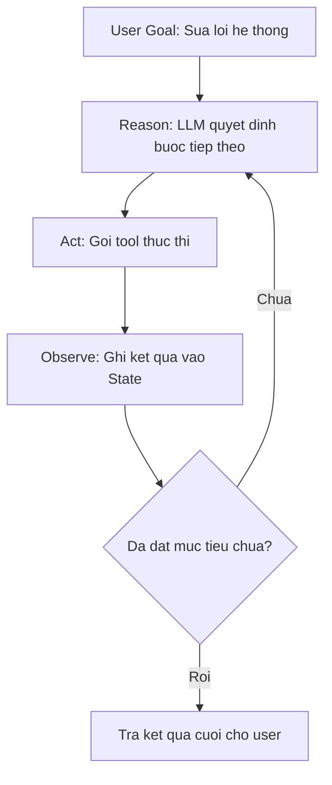
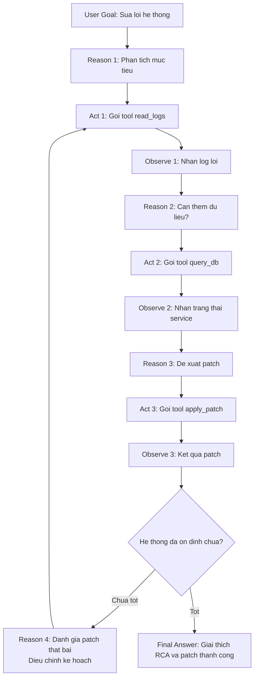

# 1. trong quá trình reasoning và lên plan, agent có được truyền vào các danh sách tools ko
# 2. làm sao quá trình reasoning và action có thể lặp lại


### Vẽ luồng và code, vfa giải thích quá trình lặp lại này



Ý tưởng:

- **State** (bộ nhớ ngắn hạn) giữ toàn bộ lịch sử: yêu cầu user, suy nghĩ của agent, tool đã gọi, kết quả tool.
- Mỗi vòng lặp:

1) Gọi LLM với `state` hiện tại → sinh “thought + tool_call hoặc final_answer”.
2) Nếu có `tool_call` → gọi tool, thêm kết quả vào `state` → lặp lại.
3) Nếu không còn tool_call → coi như đã xong kế hoạch → trả `final_answer`.

Dưới đây là một ví dụ code tối giản (Python + OpenAI Tools) minh họa rõ vòng lặp này:

```python
import os, json
from openai import OpenAI

client = OpenAI(api_key=os.getenv("OPENAI_API_KEY"))

### 1. Định nghĩa tools (ví dụ: đọc log & query DB)
tools = [
    {
        "type": "function",
        "function": {
            "name": "read_logs",
            "description": "Đọc log lỗi mới nhất từ hệ thống.",
            "parameters": {
                "type": "object",
                "properties": {},
                "required": []
            }
        }
    },
    {
        "type": "function",
        "function": {
            "name": "query_db",
            "description": "Query trạng thái một service trong DB.",
            "parameters": {
                "type": "object",
                "properties": {
                    "service_name": {"type": "string"}
                },
                "required": ["service_name"]
            }
        }
    }
]

### 2. Implement 2 tool giả lập
def read_logs():
    print("[TOOL] read_logs()")
    return "Error: Timeout while calling payment-service at 13:05 UTC"

def query_db(service_name: str):
    print(f"[TOOL] query_db(service_name={service_name})")
    return f"Service {service_name} has 5 failed requests in last 1 minute"

### 3. Vòng lặp Reason -> Act -> Observe
def run_debug_agent(user_goal: str, max_turns: int = 5):
    ### State: lịch sử messages
    messages = [
        {
            "role": "system",
            "content": (
                "Bạn là DevOps agent chuyên debug hệ thống.\n"
                "Luôn suy luận từng bước (Thought), sau đó nếu cần thì gọi tools.\n"
                "Khi đã đủ thông tin, hãy giải thích nguyên nhân và đề xuất hướng fix."
            ),
        },
        {
            "role": "user",
            "content": user_goal,
        },
    ]

    for turn in range(max_turns):
        print(f"\n===== TURN {turn+1} - REASON =====")

        ### Reason: gọi LLM với tools + toàn bộ state hiện tại
        response = client.chat.completions.create(
            model="gpt-4o-mini",
            messages=messages,
            tools=tools,
            tool_choice="auto",  ### cho LLM tự quyết định có dùng tool hay không
        )
        msg = response.choices[0].message
        messages.append({"role": msg.role, "content": msg.content or ""})
        print("MODEL:", msg.content)

        ### Kiểm tra xem model có muốn gọi tool không
        tool_calls = msg.tool_calls or []
        if not tool_calls:
            ### Không còn tool_call -> xem như đã kết luận
            print("\n===== FINISHED (NO MORE TOOL CALL) =====")
            break

        print("\n===== ACT & OBSERVE =====")
        ### Act: thực thi từng tool_call, rồi Observe: đẩy kết quả vào state
        for tc in tool_calls:
            name = tc.function.name
            args = json.loads(tc.function.arguments or "{}")

            if name == "read_logs":
                result = read_logs()
            elif name == "query_db":
                result = query_db(**args)
            else:
                result = f"Unknown tool: {name}"

            ### OBSERVE: đưa kết quả tool vào messages để vòng Reason sau dùng làm context
            messages.append(
                {
                    "role": "tool",
                    "name": name,
                    "tool_call_id": tc.id,
                    "content": result,
                }
            )
            print(f"[OBSERVE] {name} -> {result}")

    ### Sau vòng lặp, msg.content là câu trả lời cuối
    return msg.content

if __name__ == "__main__":
    final_answer = run_debug_agent("Hệ thống payment đang lỗi, hãy tìm hiểu nguyên nhân.")
    print("\n===== FINAL ANSWER =====")
    print(final_answer)
```

**Giải thích vòng lặp:**

- `messages`: chính là **working memory** cho vòng Reason–Act–Observe.
- Mỗi vòng `for`:
    - Gọi `client.chat.completions.create(...)` với:
        - `messages`: toàn bộ lịch sử (user, các thought trước đó, kết quả tools).
        - `tools`: danh sách tools khả dụng.
    - Model:
        - Sinh reasoning (`msg.content` – Thought).
        - Nếu cần hành động, sinh thêm `tool_calls`.
    - Nếu có `tool_calls`:
        - Code chạy tool tương ứng (Act) → lấy `result`.
        - Ghi `result` vào `messages` với `role="tool"` (Observe).
        - Vòng lặp quay lại đầu: model thấy context giàu hơn (có log, có dữ liệu DB) → suy luận sâu hơn, chọn tool khác hoặc kết luận.
    - Nếu **không còn `tool_calls`**:
        - Agent coi như đã đủ thông tin để trả lời → thoát vòng lặp.

Đây chính là cách **quá trình reasoning–action lặp lại**:

- Lặp ở level kiến trúc: ReAct pattern.
- Lặp ở level code: vòng `for` với state `messages` được update sau mỗi vòng.




Dưới đây là flow (Mermaid hợp lệ) với 3 tools và nhánh khi kết quả chưa tốt, agent phải lặp lại:


- Tools:
    
    - `read_logs`: lấy log lỗi mới nhất.
        
    - `query_db`: xem trạng thái service trong DB/metrics.
        
    - `apply_patch`: áp dụng bản sửa (hoặc chạy thử trong sandbox).
        
- Lặp lại khi “kết quả chưa tốt”:
    
    - Sau `apply_patch`, agent quan sát (`Observe 3`) rồi đánh giá ở nút `K`.
        
    - Nếu hệ thống **chưa ổn** (error vẫn còn, metrics vẫn xấu):
        
        - Đi nhánh “Chua tot” → `Reason 4`:
            
            - LLM phân tích vì sao patch thất bại.
                
            - Điều chỉnh kế hoạch: thử tool khác, rollback, hoặc thu thập thêm dữ liệu.
                
        - Sau đó quay lại `C`:
            
            - Có thể chạy lại `read_logs` (log mới sau patch),
                
            - Hoặc chọn tool khác (ví dụ: rollback, thay đổi config) tùy kiến trúc thực tế.
                
- Về bản chất:
    
    - Mỗi vòng Reason (B, E, H, L) đều nhìn toàn bộ history (log cũ, DB state, kết quả patch) rồi quyết định: gọi tool nào, có cần đổi chiến lược không.
        
    - Vòng này có thể lặp nhiều lần cho đến khi điều kiện dừng “hệ thống đã ổn định” được thỏa mãn, hoặc chạm giới hạn (max steps, max cost) rồi escalate sang human.