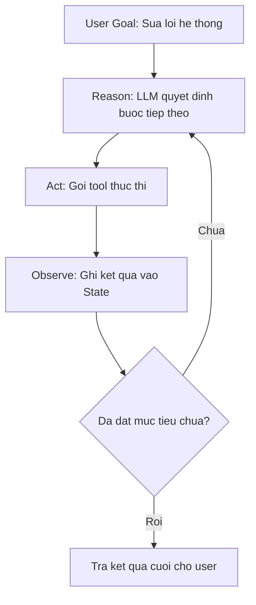
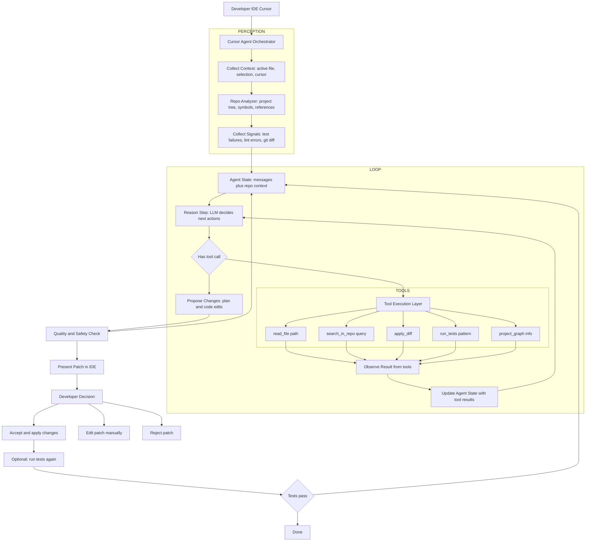
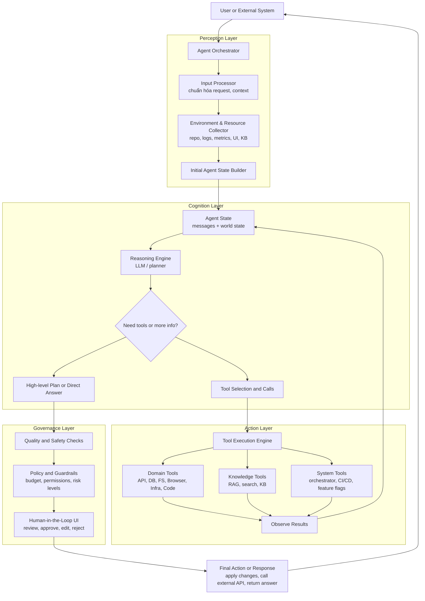

# 1. trong quá trình reasoning và lên plan, agent có được truyền vào các danh sách tools ko
# 2. làm sao quá trình reasoning và action có thể lặp lại


## 2.1 Vẽ luồng và code, và giải thích quá trình lặp lại này



Ý tưởng:

- **State** (bộ nhớ ngắn hạn) giữ toàn bộ lịch sử: yêu cầu user, suy nghĩ của agent, tool đã gọi, kết quả tool.
- Mỗi vòng lặp:

1) Gọi LLM với `state` hiện tại → sinh “thought + tool_call hoặc final_answer”.
2) Nếu có `tool_call` → gọi tool, thêm kết quả vào `state` → lặp lại.
3) Nếu không còn tool_call → coi như đã xong kế hoạch → trả `final_answer`.

Dưới đây là một ví dụ code tối giản (Python + OpenAI Tools) minh họa rõ vòng lặp này:

```python
import os, json
from openai import OpenAI

client = OpenAI(api_key=os.getenv("OPENAI_API_KEY"))

### 1. Định nghĩa tools (ví dụ: đọc log & query DB)
tools = [
    {
        "type": "function",
        "function": {
            "name": "read_logs",
            "description": "Đọc log lỗi mới nhất từ hệ thống.",
            "parameters": {
                "type": "object",
                "properties": {},
                "required": []
            }
        }
    },
    {
        "type": "function",
        "function": {
            "name": "query_db",
            "description": "Query trạng thái một service trong DB.",
            "parameters": {
                "type": "object",
                "properties": {
                    "service_name": {"type": "string"}
                },
                "required": ["service_name"]
            }
        }
    }
]

### 2. Implement 2 tool giả lập
def read_logs():
    print("[TOOL] read_logs()")
    return "Error: Timeout while calling payment-service at 13:05 UTC"

def query_db(service_name: str):
    print(f"[TOOL] query_db(service_name={service_name})")
    return f"Service {service_name} has 5 failed requests in last 1 minute"

### 3. Vòng lặp Reason -> Act -> Observe
def run_debug_agent(user_goal: str, max_turns: int = 5):
    ### State: lịch sử messages
    messages = [
        {
            "role": "system",
            "content": (
                "Bạn là DevOps agent chuyên debug hệ thống.\n"
                "Luôn suy luận từng bước (Thought), sau đó nếu cần thì gọi tools.\n"
                "Khi đã đủ thông tin, hãy giải thích nguyên nhân và đề xuất hướng fix."
            ),
        },
        {
            "role": "user",
            "content": user_goal,
        },
    ]

    for turn in range(max_turns):
        print(f"\n===== TURN {turn+1} - REASON =====")

        ### Reason: gọi LLM với tools + toàn bộ state hiện tại
        response = client.chat.completions.create(
            model="gpt-4o-mini",
            messages=messages,
            tools=tools,
            tool_choice="auto",  ### cho LLM tự quyết định có dùng tool hay không
        )
        msg = response.choices[0].message
        messages.append({"role": msg.role, "content": msg.content or ""})
        print("MODEL:", msg.content)

        ### Kiểm tra xem model có muốn gọi tool không
        tool_calls = msg.tool_calls or []
        if not tool_calls:
            ### Không còn tool_call -> xem như đã kết luận
            print("\n===== FINISHED (NO MORE TOOL CALL) =====")
            break

        print("\n===== ACT & OBSERVE =====")
        ### Act: thực thi từng tool_call, rồi Observe: đẩy kết quả vào state
        for tc in tool_calls:
            name = tc.function.name
            args = json.loads(tc.function.arguments or "{}")

            if name == "read_logs":
                result = read_logs()
            elif name == "query_db":
                result = query_db(**args)
            else:
                result = f"Unknown tool: {name}"

            ### OBSERVE: đưa kết quả tool vào messages để vòng Reason sau dùng làm context
            messages.append(
                {
                    "role": "tool",
                    "name": name,
                    "tool_call_id": tc.id,
                    "content": result,
                }
            )
            print(f"[OBSERVE] {name} -> {result}")

    ### Sau vòng lặp, msg.content là câu trả lời cuối
    return msg.content

if __name__ == "__main__":
    final_answer = run_debug_agent("Hệ thống payment đang lỗi, hãy tìm hiểu nguyên nhân.")
    print("\n===== FINAL ANSWER =====")
    print(final_answer)
```

**Giải thích vòng lặp:**

- `messages`: chính là **working memory** cho vòng Reason–Act–Observe.
- Mỗi vòng `for`:
    - Gọi `client.chat.completions.create(...)` với:
        - `messages`: toàn bộ lịch sử (user, các thought trước đó, kết quả tools).
        - `tools`: danh sách tools khả dụng.
    - Model:
        - Sinh reasoning (`msg.content` – Thought).
        - Nếu cần hành động, sinh thêm `tool_calls`.
    - Nếu có `tool_calls`:
        - Code chạy tool tương ứng (Act) → lấy `result`.
        - Ghi `result` vào `messages` với `role="tool"` (Observe).
        - Vòng lặp quay lại đầu: model thấy context giàu hơn (có log, có dữ liệu DB) → suy luận sâu hơn, chọn tool khác hoặc kết luận.
    - Nếu **không còn `tool_calls`**:
        - Agent coi như đã đủ thông tin để trả lời → thoát vòng lặp.

Đây chính là cách **quá trình reasoning–action lặp lại**:

- Lặp ở level kiến trúc: ReAct pattern.
- Lặp ở level code: vòng `for` với state `messages` được update sau mỗi vòng.

## 2.2 Cursor Demo: 




### 1. Luồng trên đã “chuẩn thực tế” chưa?

Ở mức **khái niệm kiến trúc (high‑level)**, luồng đó khá sát với cách một **coding agent kiểu Cursor** vận hành:

- Có **Orchestrator** ở giữa.
- Có bước **thu thập context** (file hiện tại, selection, repo info, test/log).
- Có vòng **Reason → Tool → Observe → Reason** (ReAct).
- Có lớp **tools**: đọc file, search repo, apply diff, chạy test, đọc project graph.
- Có lớp **Quality/Safety check** trước khi hiển thị kết quả.
- Có **Human‑in‑the‑loop**: dev xem diff → accept/edit/reject.
- Có tùy chọn **chạy test lại và lặp** nếu test fail.

Điểm cần lưu ý:

- Cursor thực tế có thể:
    - Thêm nhiều loại tool hơn (LLM chuyên code, model khác cho test, embedding index cho repo).
    - Có **multi‑turn planning** “ẩn” hơn (nhiều reasoning step bên trong một command).
    - Có thêm **telemetry, ranking, học từ history**, không thể hiện trong diagram.
- Nhưng với mục tiêu: **dùng như khung tham chiếu cho kiến trúc agent code/self‑healing của bạn**, thì luồng này **đủ đúng và hữu ích**.

Tóm lại:

- Không phải “spec nội bộ chính thức của Cursor”, nhưng **phù hợp với pattern SOTA của coding agent trong IDE** và có thể coi là **chuẩn thực tế ở mức kiến trúc** để dùng trong tài liệu.

***

### 2. Mô tả chi tiết luồng trên bằng lời

Đi theo từng khối trong diagram.

#### 2.1. Developer IDE Cursor → Orchestrator

- Developer đang ở trong IDE (Cursor) thực hiện một hành động:
    - Gõ lệnh trong command palette: “Fix this error”, “Refactor this function”, “Add logging”, “Explain this code”.
    - Hoặc chọn đoạn code rồi bấm một phím tắt (ví dụ: “Cmd+K”).
- IDE gửi yêu cầu đó (command + context cơ bản: file hiện tại, selection) tới **Cursor Agent Orchestrator**.


#### 2.2. Khối PERCEPTION – Thu thập và xây context

1) **Collect Context (B1)**
Orchestrator thu thập context trực tiếp từ IDE:
    - File hiện tại mà developer đang mở.
    - Đoạn code đang được chọn (selection), nếu có.
    - Vị trí con trỏ (cursor position).
    - Có thể kèm theo: ngôn ngữ, framework, v.v.
2) **Repo Analyzer (B2)**
Orchestrator sử dụng một lớp phân tích repo để:
    - Đọc **cây project**: thư mục, file, module.
    - Phân tích **symbols \& references**: hàm/class được gọi ở đâu, định nghĩa ở đâu.
    - Xác định các **file liên quan** đến đoạn code bug/feature (ví dụ: interface, implementation, test tương ứng).
3) **Collect Signals (B3)**
Orchestrator có thể gom thêm tín hiệu phụ:
    - Kết quả test/linter mới nhất (failures).
    - Lỗi compile vừa xảy ra.
    - Git diff (những thay đổi chưa commit).
    - Thông tin branch hiện tại.

Tất cả được gom thành **Agent State ban đầu** (C): một object chứa:

- messages khởi tạo (system message + user command + context).
- repo metadata (file, project graph, signals).


#### 2.3. Khối LOOP – Reason – Act – Observe

Đây là “trái tim” của Cursor‑style agent.

1) **Reason Step (D)**
    - Orchestrator gọi LLM với:
        - System prompt (vai trò: coding agent).
        - Messages (user command + context + history).
        - Danh sách tools khả dụng (read_file, search_in_repo, apply_diff, run_tests, project_graph).
    - LLM:
        - Hiểu mục tiêu của dev.
        - Suy nghĩ (thought) về nguyên nhân bug, vị trí cần xem.
        - Quyết định:
            - Có cần thêm thông tin từ repo không?
            - Có thể đề xuất patch ngay không?
        - Nếu cần tool → tạo `tool_calls`.
2) **Branch quyết định (E)**
    - Nếu **không có tool_call**:
        - Agent cho rằng đã đủ hiểu, có thể **đề xuất patch / giải pháp** ngay → sang F.
    - Nếu **có tool_call**:
        - Agent muốn **hành động**: đọc file khác, search, apply diff, chạy test → sang G.
3) **Tool Execution Layer (G + TOOLS)**
Orchestrator đọc danh sách tool_call và thực thi:
    - `read_file(path)`: lấy nội dung file trong repo (thường dùng nhiều để “mở rộng context” cho LLM).
    - `search_in_repo(query)`: tìm nơi function/class được dùng/định nghĩa; tìm pattern code; locate bug.
    - `apply_diff`: áp dụng một unified diff mà LLM đề xuất vào file (thường trong **buffer tạm/sandbox**, không commit ngay).
    - `run_tests(pattern)`: chạy test liên quan hoặc toàn bộ suite tùy config.
    - `project_graph`: lấy thông tin cấu trúc project, dependency, entrypoint.
4) **Observe Result (H)**
    - Mỗi tool trả về kết quả:
        - Nội dung file, snippet.
        - Vị trí tìm thấy, các match trong repo.
        - Kết quả test (pass/fail, error message).
        - Kết quả áp dụng diff (thành công hay xung đột).
    - Các kết quả này được encode thành **tool messages** và thêm vào Agent State.
5) **Update Agent State (I)**
    - Agent State được cập nhật:
        - Thêm messages kiểu `role=tool` chứa kết quả từ các tool.
        - Có thể cập nhật thêm metadata: test đã chạy, file đã chỉnh, vv.
    - Sau đó quay lại **Reason Step D**:
        - Lần gọi LLM tiếp theo sẽ “nhìn thấy” toàn bộ lịch sử:
            - Command ban đầu.
            - Thought trước.
            - Tool đã gọi.
            - Kết quả tool.
        - Dùng đó để:
            - Điều chỉnh “giả thuyết” bug.
            - Đề xuất patch mới hoặc đọc thêm file.
    - Vòng này lặp **nhiều lần** cho đến khi agent cảm thấy đủ để đề xuất solution.

#### 2.4. Khối F – Quality \& Safety Check

Khi branch ở E đi vào **F (Propose Changes)**:

- LLM sinh output ở dạng:
    - Mô tả plain‑text:
        - Nguyên nhân bug.
        - Chiến lược sửa.
    - Code edits / diff:
        - Có thể là patch một file.
        - Hoặc nhiều file liên quan.
- Trước khi hiển thị cho dev, Orchestrator chạy một **layer đánh giá**:
    - Patch có hợp lệ về syntax, compile được không? (option).
    - Patch có vượt quá scope (sửa quá nhiều file, thay đổi interface lớn) không?
    - Có vi phạm policy/guardrail (xóa file, chạm vào vùng nhạy cảm) không?

Nếu thấy cần refine, Orchestrator có thể:

- Thêm message kiểu “system/user feedback” vào state:
“Patch quá lớn, hãy đề xuất chỉnh nhỏ hơn, tập trung vào function X.”
- Quay lại **C (Agent State)** → vòng Reason–Act–Observe lặp thêm một/ vài lượt.

Nếu acceptable → sang K.

#### 2.5. Khối K – Present Patch in IDE

- Orchestrator gửi patch/diff + explanation về IDE (Cursor).
- IDE hiển thị:
    - Inline diff trong file.
    - Danh sách file thay đổi.
    - Cửa sổ giải thích (Agent Panel / Chat Panel).

Dev thấy được:

- Sự khác biệt trước/sau (diff).
- Lý do agent sửa như vậy.


#### 2.6. Human-in-the-loop – Developer Decision (L)

Developer có 3 lựa chọn chính:

1) **Accept (M)**
    - IDE áp dụng patch vào filesystem:
        - Ghi file mới.
        - Có thể stage vào git (tuỳ config).
    - Đây là điểm mà code thực sự được thay đổi.
2) **Edit patch (N)**
    - Dev tự chỉnh sửa patch theo ý.
    - Sau đó:
        - Có thể gọi lại agent để “tiếp tục” từ trạng thái mới.
        - Hoặc chạy test thủ công.
3) **Reject (O)**
    - Patch bị bỏ.
    - History agent vẫn được giữ (telemetry, log) để cải thiện model trong tương lai.

#### 2.7. Optional: chạy test lại và lặp (M → P → Q → C/S)

Nếu bật chế độ “auto test”:

- Sau khi patch được **accept**:
    - Orchestrator hoặc IDE kích hoạt tool `run_tests(pattern)` (P).
- Dựa vào kết quả test (Q):
    - Nếu **fail**:
        - Gửi error/test output trở lại Agent State (C).
        - Vòng Reason–Act–Observe lặp lại:
            - Agent phân tích vì sao patch fail,
            - Đề xuất chỉnh sửa tiếp.
    - Nếu **pass**:
        - Flow kết thúc ở **S (Done)**:
            - Bug được fix và test pass.

***

Nếu bạn muốn, bước tiếp theo có thể:

- Đưa luồng này vào tài liệu của bạn như **“Cursor-style Coding Agent Architecture”**.
- Rồi bên cạnh là **“Self-Healing Infra Agent Architecture”**, để so sánh hai loại agent code: một chạy trong IDE (Cursor), một chạy trong production (self-healing platform).


---


## 2.2 Cursor tiếp 


---

## 2.3 Cái này mở rộng ra để chuẩn 1 hệ thống agent gồm các thành phần ?

Có thể coi “Cursor Demo” ở trên là **instance cụ thể** của một kiến trúc agent chuẩn. Ta mở rộng và “trừu tượng hoá” nó thành một **Agent System Architecture chung** với đầy đủ thành phần, rồi chỉ ra Cursor là 1 case đặc biệt.

Dưới đây là phiên bản **tổng quát**:

***

## 1. Kiến trúc hệ thống Agent chuẩn (tổng quát hóa từ Cursor)




***

## 2. Mapping các thành phần “chuẩn” với Cursor Demo

### 2.1. Perception Layer

- **Input Processor (P1)**
    - Chuẩn hóa input:
        - Cursor: command + file + selection.
        - Hệ thống chung: có thể là email, incident, request từ API, event từ monitoring.
    - Loại bỏ noise, encode về dạng chuẩn (JSON, text, metadata).
- **Environment \& Resource Collector (P2)**
    - Tập hợp resource từ môi trường:
        - Cursor: repo tree, symbols, references, test/lint logs.
        - Self-healing: logs, metrics, traces, deploy history.
        - Browser agent: DOM/screenshot, URL hiện tại.
        - Knowledge agent: tài liệu KB, index embeddings.
- **Initial Agent State Builder (P3)**
    - Tạo state ban đầu (S):
        - System prompt.
        - User request.
        - Context (code, log, KB snippet, UI text…).


### 2.2. Cognition Layer

- **Reasoning Engine (C1)**
    - LLM chính:
        - Hiểu mục tiêu.
        - Suy luận, gán nhãn, phân tích nguyên nhân.
        - Lên kế hoạch sơ bộ.
- **Decision: need tools or not? (C2)**
    - Nếu **đã đủ thông tin**:
        - Đi thẳng sang C3: sinh đáp án cuối hoặc kế hoạch cuối.
    - Nếu **chưa đủ**:
        - Chọn tool để:
            - Lấy thêm dữ liệu (read_file, search, read_logs, query_db, search_kb, đọc DOM…)
            - Thực hiện hành động (apply_diff, roll_back, click_button,…).
- **High-level Plan or Direct Answer (C3)**
    - Trả về:
        - Với agent code: patch + giải thích.
        - Với infra agent: sequence các action (restart, rollback…).
        - Với browser agent: plan các bước UI.
        - Với research agent: cấu trúc báo cáo.
- **Tool Selection and Calls (C4)**
    - LLM quyết định:
        - Tool nào cần gọi?
        - Tham số gì?
    - Đây là nơi “lập kế hoạch + action” hòa quyện (ReAct, ToT…).


### 2.3. Action Layer

- **Tool Execution Engine (T)**
    - Nhận danh sách tool_call:
        - Gửi đến hàm Python, API HTTP, script CLI, module browser, v.v.
    - Xử lý:
        - Retry, timeout, logging.
- **Domain Tools (T1)**
    - Tùy bài toán:
        - Cursor: đọc/ghi file, chạy test, search code.
        - Infra: orchestrator, CI/CD, feature flags, metrics/logs API.
        - Browser: click, type, navigate, read DOM.
- **Knowledge Tools (T2)**
    - RAG, search, KB:
        - Tìm thông tin bổ trợ để reasoning (doc, code, bài báo, hướng dẫn).
- **System Tools (T3)**
    - Hành động hệ thống:
        - Run pipeline, deploy, rollback, scale.
- **Observe Results (O)**
    - Ghi lại:
        - Kết quả tool: success/fail, data, error.
    - Đưa vào lại **Agent State (S)**:
        - Messages `role=tool`.
        - Metadata (chạy test lần thứ mấy, status hiện tại…).

State S quay lại Cognition → tạo vòng Reason–Act–Observe lặp nhiều lần.

### 2.4. Governance Layer

- **Quality and Safety Checks (G1)**
    - Đánh giá:
        - Output có hợp lệ về kỹ thuật (syntax, compile, test pass) không?
        - Có đi quá scope (sửa quá nhiều, xóa dữ liệu) không?
- **Policy and Guardrails (G2)**
    - Áp quy tắc:
        - Budget: số lần gọi LLM/tool, chi phí token.
        - Quyền: agent nào được dùng tool nào (RBAC).
        - Ngăn hành động nguy hiểm: xóa DB, deploy chưa test…
- **Human-in-the-Loop UI (G3)**
    - Một UI (IDE, dashboard, web app) cho:
        - Dev/ops xem kế hoạch, patch, action.
        - Approve / reject / chỉnh sửa.
    - Đây chính là:
        - Cursor: dev accept/edit/reject patch.
        - Self-healing: SRE approve rollback/patch.
        - Browser agent: ops xác nhận thao tác UI quan trọng.
- **Final Action or Response (R)**
    - Nếu **được phê duyệt** hoặc thuộc class auto-safe:
        - Thực hiện action cuối (áp patch, rollback, gửi email…).
    - Đưa trả kết quả cho user/hệ thống gọi ban đầu.

***

## 3. Cursor chỉ là một “instantiation” của hệ thống chuẩn

Trong hệ thống chung:

- **Orchestrator**: Cursor Agent Orchestrator.
- **Perception**: collect context từ IDE + phân tích repo.
- **Cognition**: LLM + loop Reason–Tool–Observe.
- **Action**: tools đọc repo, apply diff, chạy test.
- **Governance**: quality check patch, dev accept/reject (HITL).

Khi mở rộng sang Self‑Healing / Browser Agent:

- Giữ nguyên khung trên.
- Đổi **Perception + Tools + Policy + UI** theo domain:
    - Infra: metrics/logs, orchestrator, CI/CD.
    - Browser: DOM/screenshot, browser actions.
    - Business: CRM, ERP, KB.

Nếu bạn muốn, bước tiếp theo mình có thể:

- Vẽ lại bản “Agent System chuẩn” này với labels trùng hẳn 4 layer MECE trong tài liệu `agent_system_design_roadmap_vi.md`, để bạn gắn trực tiếp vào sách là “Hình: Kiến trúc Agent tổng quát (chuẩn hóa từ Cursor, Self-Healing, Browser Agent)”.

---
## 2.3 Manus 

```mermaid
flowchart TD
    U[User Request\n\"Viet tai lieu / chuong / bao cao\"] --> A[Manus Orchestrator]

    subgraph PERCEPTION
        A --> P1[Input Processor\nlam sach, chuan hoa brief]
        P1 --> P2[Context Collector\nfiles dinh kem, history, constraints]
        P2 --> P3[Initial State Builder\nhe thong + user + goal messages]
    end

    P3 --> S[Agent State\nmessages + context]

    subgraph COGNITION
        S --> C1[Understand Task\nLLM phan tich muc tieu, doc gia, do dai]
        C1 --> C2{Need Research or References?}
        C2 --> C3[Outline Planner\nlap dan y, cau truc tai lieu]
        C2 --> C4[Research Planner\ntao cac query va steps]
    end

    subgraph RESEARCH
        C4 --> R1[Call Research Tools\nweb search, file search, RAG]
        R1 --> R2[Collect and Filter Sources]
        R2 --> R3[Summarize and Structure Notes]
        R3 --> S
    end

    C3 --> W1[Draft Writer\nLLM viet ban nhap theo dan y + notes]
    W1 --> W2{Need Refinement?}

    W2 --> W3[Refinement Loop\nclarity, style, structure, citations]
    W3 --> W2
    W2 --> W4[Assemble Final Draft]

    subgraph GOVERNANCE
        W4 --> G1[Quality Check\nstyle, constraints, length, coverage]
        G1 --> G2[Policy and Guardrails\nno leakage, no disallowed content]
        G2 --> G3[Human Review UI\nuser xem, comment, yeu cau sua]
    end

    G3 --> O[Apply Edits and Return Output]
    O --> U

```