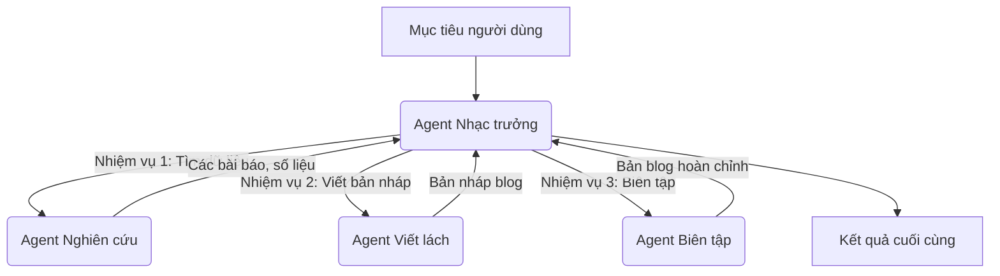
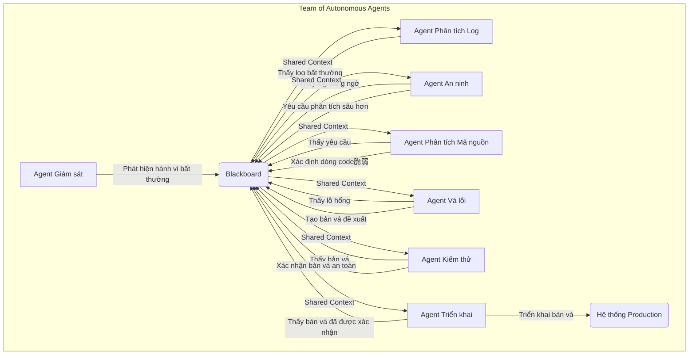

# Lớp học Chuyên sâu về Kiến trúc Hệ thống Agent

**Tác giả:** Một Chuyên gia về Kiến trúc Agent
**Phiên bản:** 1.0
**Ngày:** 15/12/2025

---

## Lời nói đầu: Một cuộc trò chuyện với AI Intern

Chào em, người đồng nghiệp tương lai của tôi. 

Tôi mời em ngồi xuống, không phải với tư cách là một cấp trên, mà là một người đi trước, một người đã dành cả sự nghiệp của mình để vật lộn với những hệ thống phức tạp nhất mà ngành công nghệ từng tạo ra. Hôm nay, chúng ta sẽ không nói về những dòng code hào nhoáng hay những bản demo ấn tượng trên sân khấu. Chúng ta sẽ nói về **nền móng**, về **bộ xương** của những hệ thống agentic đang định hình lại thế giới số.

Em đã thấy các agent tự sửa lỗi code trên GitHub, tự động đặt những chuyến du lịch phức tạp, hay thậm chí là điều hành các chiến dịch marketing. Nhưng câu hỏi thực sự không phải là "chúng làm được gì?", mà là **"chúng được thiết kế như thế nào để có thể làm được những điều đó một cách đáng tin cậy?"**

Trong 100 trang tiếp theo, tôi sẽ không chỉ đưa cho em một bản tóm tắt kiến thức. Tôi sẽ chia sẻ với em **tư duy thiết kế (design thinking)** đằng sau mỗi quyết định kiến trúc. Em sẽ học được:

*   **Tại sao** chúng ta lại chọn kiến trúc này thay vì kiến trúc khác?
*   Những **rủi ro (risks)** tiềm ẩn nào đang rình rập trong mỗi lựa chọn thiết kế?
*   Và quan trọng nhất, những **cách xử lý tối ưu** mà chúng tôi, những người trong ngành, đã phải trả giá bằng vô số đêm không ngủ và những lần hệ thống sập để đúc kết được.

Đây không phải là một tài liệu tham khảo khô khan. Hãy xem nó như một khóa học 1-1, một chuỗi các buổi "mentoring" mà tôi dành riêng cho em. Mục tiêu của tôi là sau khi đọc xong, em không chỉ có thể **xây dựng** một agent, mà còn có thể **bảo vệ** những lựa chọn thiết kế của mình trước những kỹ sư khắt khe nhất. 

Hãy bắt đầu.

---

## PHẦN I: GIẢI PHẪU AGENT - TỪ TƯ DUY ĐẾN HÀNH ĐỘNG

### Chương 1: Nền tảng Tư duy Agentic

Trước khi viết bất kỳ dòng code nào, chúng ta phải hiểu rõ triết lý đằng sau thứ mà chúng ta đang xây dựng. 

#### 1.1. Định nghĩa một Agent: Không chỉ là một Chatbot

Nhiều người lầm tưởng agent chỉ là một chatbot được gắn thêm vài công cụ. Đó là một sự hiểu lầm tai hại. Một chatbot chỉ **phản hồi (reacts)**. Một agent thì **hành động (acts)**.

> **Định nghĩa của chuyên gia:** Một agent là một hệ thống tính toán có khả năng **tự chủ (autonomous)**, hoạt động trong một môi trường, có khả năng **nhận thức (perceive)** môi trường đó, và thực hiện các **hành động (actions)** để theo đuổi các **mục tiêu (goals)** đã được định sẵn.

Sự khác biệt cốt lõi nằm ở hai chữ **"tự chủ"** và **"mục tiêu"**. Em không ra lệnh cho agent từng bước một. Em giao cho nó một mục tiêu, và nó tự tìm cách để hoàn thành. Đây là sự thay đổi mô hình cơ bản nhất.

#### 1.2. Tại sao lại thiết kế theo mô hình Agentic?

Chúng ta chọn thiết kế agentic không phải vì nó "thời thượng". Chúng ta chọn nó vì nó là cách duy nhất để giải quyết một lớp các bài toán mới: những bài toán **động, không xác định, và có độ phức tạp cao**.

*   **Môi trường tĩnh vs. động:** Một script Python truyền thống hoạt động tốt trong một môi trường tĩnh, nơi các quy tắc không thay đổi. Nhưng hãy nghĩ về việc đặt vé máy bay. Giá vé thay đổi từng giây, các chuyến bay có thể hết chỗ. Một script cứng nhắc sẽ thất bại. Một agent, với khả năng nhận thức và thích ứng liên tục, có thể xử lý sự biến động này.

*   **Rủi ro của việc không dùng Agent:** Nếu em cố gắng giải quyết một bài toán động bằng một kịch bản tĩnh, em sẽ tạo ra một hệ thống **giòn (brittle)**. Nó sẽ sập ngay khi có một thay đổi nhỏ nhất trong môi trường. Chi phí bảo trì sẽ tăng vọt, và hệ thống sẽ không đáng tin cậy.

*   **Cách xử lý tối ưu:** Bằng cách trừu tượng hóa mục tiêu và trao quyền tự chủ cho agent, chúng ta chuyển gánh nặng của việc xử lý sự thay đổi từ người lập trình sang cho chính hệ thống. Đây là một sự đánh đổi kiến trúc có chủ đích: chúng ta chấp nhận sự phức tạp ban đầu của việc xây dựng một agent để đổi lấy sự **kiên cường (resilience)** và **khả năng thích ứng (adaptability)** lâu dài.

---

### Chương 2: Giải phẫu một Agent theo nguyên tắc MECE

Bây giờ, chúng ta sẽ làm điều mà mọi kỹ sư giỏi đều làm: mổ xẻ hệ thống. Chúng ta sẽ không xem agent như một khối đen ma thuật. Chúng ta sẽ phân rã nó thành các thành phần chức năng, theo một nguyên tắc mà tôi muốn em khắc cốt ghi tâm: **MECE (Mutually Exclusive, Collectively Exhaustive)** - Loại trừ lẫn nhau, Bao hàm toàn diện. Điều này có nghĩa là các thành phần của chúng ta sẽ không chồng chéo chức năng và khi gộp lại, chúng sẽ bao quát toàn bộ hệ thống.

Đây là bản thiết kế tiêu chuẩn của một agent hiện đại. Hãy coi nó như bộ khung xương. Dù em xây dựng một agent đơn giản hay một hệ thống phức tạp cho Google, nó đều sẽ xoay quanh 4 lớp này.

```mermaid
graph TD
    subgraph Lớp 1: Nhận thức (Perception)
        A1[Input Processor]
        A2[Environment Monitor]
    end
    subgraph Lớp 2: Nhận thức & Suy luận (Cognition)
        B1[Reasoning Engine]
        B2[Planning Module]
        B3[Memory System]
    end
    subgraph Lớp 3: Hành động (Action)
        C1[Tool Library]
        C2[Execution Engine]
    end
    subgraph Lớp 4: Quản trị (Governance)
        D1[Guardrails]
        D2[Human-in-the-Loop]
    end

    A1 & A2 --> B1 & B2 & B3
    B1 & B2 & B3 --> C1 & C2
    C1 & C2 --> A2
    D1 & D2 -- Controls --> B1 & B2 & B3
    D1 & D2 -- Controls --> C1 & C2
```
*Sơ đồ 2.1: Bốn lớp MECE của một hệ thống Agent.* 

Bây giờ, hãy đi sâu vào từng lớp. Tôi sẽ giải thích tại sao chúng tồn tại và những sai lầm chết người mà các kỹ sư non kinh nghiệm thường mắc phải.

#### 2.1. Lớp 1: Nhận thức (Perception Layer)

Đây là các giác quan của agent. Nếu lớp này được thiết kế tồi, agent của em sẽ bị "mù" và "điếc", và mọi quyết định sau đó đều vô nghĩa.

*   **Thành phần 1: Bộ xử lý đầu vào (Input Processor)**
    *   **Nhiệm vụ:** Nhận mục tiêu ban đầu từ người dùng (ví dụ: "Hãy tìm cho tôi đôi giày chạy bộ tốt nhất dưới 2 triệu đồng") và chuẩn hóa nó thành một định dạng có cấu trúc mà máy có thể hiểu.
    *   **Tại sao lại cần nó?** Người dùng diễn đạt mục tiêu một cách mơ hồ. "Tốt nhất" nghĩa là gì? Bền nhất? Nhẹ nhất? Được đánh giá cao nhất? Input Processor phải phân tích câu nói này, có thể đặt câu hỏi làm rõ, và chuyển nó thành một đối tượng mục tiêu rõ ràng, ví dụ: `{ "product": "running shoes", "criteria": "best_rated", "price_max": 2000000 }`.
    *   **Rủi ro & Cách xử lý:**
        *   **Rủi ro:** Hiểu sai ý định của người dùng (Misinterpretation). Đây là rủi ro lớn nhất. Nếu agent hiểu sai mục tiêu ngay từ đầu, toàn bộ chuỗi hành động sau đó sẽ sai.
        *   **Cách xử lý tối ưu:** Đừng bao giờ giả định. Hãy triển khai một bước **xác nhận mục tiêu (goal confirmation)**. Sau khi phân tích, agent nên diễn giải lại mục tiêu theo cách hiểu của nó và hỏi người dùng: *"OK, tôi sẽ tìm những đôi giày chạy bộ được đánh giá cao nhất trên các trang thương mại điện tử, với giá dưới 2 triệu. Điều này có đúng không?"*. Một bước xác nhận đơn giản có thể tiết kiệm hàng giờ xử lý sai lầm.

*   **Thành phần 2: Bộ theo dõi môi trường (Environment Monitor)**
    *   **Nhiệm vụ:** Thu thập thông tin từ môi trường mà agent đang hoạt động sau mỗi hành động. Nếu agent đang duyệt web, đây là thành phần chụp ảnh màn hình và trích xuất mã HTML. Nếu agent đang quản lý hệ thống, đây là thành-phần đọc logs và metrics.
    *   **Tại sao lại cần nó?** Đây là mắt của agent. Nó cung cấp thông tin thực tế về trạng thái hiện tại của thế giới, tạo ra vòng lặp phản hồi (feedback loop) cho phép agent biết được hành động trước đó của nó có thành công hay không.
    *   **Rủi ro & Cách xử lý:**
        *   **Rủi ro 1: Thông tin quá tải (Information Overload).** Một trang web có thể có hàng megabyte HTML. Một hệ thống có thể tạo ra hàng gigabyte logs. Nếu đưa tất cả vào "bộ não" của agent (LLM), chi phí sẽ cực lớn và agent sẽ bị "nhiễu".
        *   **Cách xử lý tối ưu:** Triển khai các **bộ lọc và bộ trích xuất thông minh (Smart Filters & Extractors)**. Thay vì đưa toàn bộ HTML, hãy sử dụng các kỹ thuật như `Readability.js` hoặc các mô hình VLM (Vision-Language Model) để chỉ trích xuất những phần nội dung có liên quan đến nhiệm vụ. Đối với logs, hãy sử dụng các công cụ phân tích (parsing) để chỉ lấy ra các thông tin quan trọng như `timestamp`, `error_code`, `user_id`.
        *   **Rủi ro 2: Thông tin không đáng tin cậy (Unreliable Information).** Môi trường có thể chứa thông tin sai lệch hoặc cố tình đánh lừa (ví dụ: các trang web lừa đảo).
        *   **Cách xử lý tối ưu:** Xây dựng cơ chế **kiểm tra chéo (Cross-validation)**. Đừng bao giờ tin vào một nguồn duy nhất. Nếu agent đang tìm thông tin quan trọng, nó phải được thiết kế để tìm và so sánh thông tin từ ít nhất 2-3 nguồn khác nhau trước khi đưa ra kết luận.

#### 2.2. Lớp 2: Nhận thức & Suy luận (Cognition Layer)

Đây là bộ não của agent. Nơi tất cả các quyết định được đưa ra. Một bộ não được thiết kế tốt sẽ có khả năng lập luận, ghi nhớ và lập kế hoạch một cách hiệu quả.

*   **Thành phần 3: Bộ máy suy luận (Reasoning Engine)**
    *   **Nhiệm vụ:** Đây là cốt lõi của agent, thường là một LLM mạnh mẽ (như GPT-4, Claude 3.5). Nó nhận mục tiêu và thông tin từ Lớp Nhận thức, sau đó suy luận xem nên làm gì tiếp theo.
    *   **Tại sao lại cần nó?** Đây là nơi "phép màu" xảy ra. Khả năng suy luận ngôn ngữ tự nhiên của LLM cho phép agent hiểu các khái niệm phức tạp, xử lý sự không chắc chắn và đưa ra các quyết định giống như con người.
    *   **Rủi ro & Cách xử lý:**
        *   **Rủi ro 1: Ảo giác (Hallucination).** LLM có thể "bịa" ra thông tin hoặc đưa ra những suy luận sai lầm. Đây là rủi ro nguy hiểm nhất của lớp này.
        *   **Cách xử lý tối ưu:** Triển khai kiến trúc **ReAct (Reasoning + Acting)**. Thay vì chỉ suy nghĩ một lần và hành động, hãy buộc LLM phải suy nghĩ thành từng bước nhỏ, và sau mỗi bước, thực hiện một hành động để **kiểm chứng (grounding)** suy nghĩ đó với thực tế. Ví dụ: 
            1.  **Suy nghĩ:** *"Để tìm giày tốt nhất, tôi nên tìm kiếm trên Tiki."*
            2.  **Hành động:** `search_tiki("giày chạy bộ")`
            3.  **Quan sát:** (Nhận kết quả tìm kiếm từ Tiki)
            4.  **Suy nghĩ:** *"OK, kết quả trả về có 5 sản phẩm. Bây giờ tôi cần đọc đánh giá của từng sản phẩm."*
            Vòng lặp này buộc agent phải liên tục đối chiếu suy luận của mình với dữ liệu thực tế, giảm đáng kể ảo giác.
        *   **Rủi ro 2: Chi phí tính toán (Computational Cost).** Mỗi lần gọi đến một LLM mạnh đều tốn tiền và thời gian. Một agent được thiết kế tồi có thể gọi LLM hàng trăm lần cho một tác vụ đơn giản.
        *   **Cách xử lý tối ưu:** Sử dụng **mô hình LLM phân cấp (Cascading LLM Models)**. Không phải quyết định nào cũng cần đến GPT-4. Hãy sử dụng một mô hình nhỏ, nhanh và rẻ (như GPT-4.1-mini hoặc một mô hình được fine-tune) cho các quyết định đơn giản (ví dụ: trích xuất một thông tin từ văn bản). Chỉ khi gặp phải một vấn đề phức tạp đòi hỏi suy luận sâu, hệ thống mới "leo thang" lên mô hình lớn và đắt tiền hơn. Đây là cách các hệ thống production tối ưu hóa chi phí.

---

*   **Thành phần 4: Bộ lập kế hoạch (Planning Module)**
    *   **Nhiệm vụ:** Phân rã một mục tiêu lớn, phức tạp thành một chuỗi các bước nhỏ hơn, có thể quản lý được. Ví dụ, mục tiêu "Lên kế hoạch cho một chuyến đi đến Đà Lạt" sẽ được phân rã thành: [1] Tìm vé máy bay, [2] Tìm khách sạn, [3] Lên lịch trình các hoạt động, [4] Đặt vé và phòng.
    *   **Tại sao lại cần nó?** LLM, dù mạnh mẽ, vẫn gặp khó khăn với các tác vụ dài hơi (long-horizon tasks). Chúng có thể "quên" mục tiêu ban đầu hoặc đi lạc hướng. Bằng cách tạo ra một kế hoạch rõ ràng ngay từ đầu, chúng ta cung cấp cho agent một "kim chỉ nam", một lộ trình để bám theo. Điều này làm cho hành vi của agent trở nên dễ đoán và đáng tin cậy hơn.
    *   **Rủi ro & Cách xử lý:**
        *   **Rủi ro: Kế hoạch quá cứng nhắc (Overly Rigid Plan).** Một kế hoạch được tạo ra lúc đầu có thể trở nên lỗi thời khi môi trường thay đổi (ví dụ: chuyến bay dự định đặt đã hết vé). Nếu agent mù quáng bám theo kế hoạch, nó sẽ thất bại.
        *   **Cách xử lý tối ưu:** Triển khai **kế hoạch động và khả năng lập lại kế hoạch (Dynamic Planning and Re-planning)**. Kế hoạch không phải là một văn bản bất biến. Nó phải là một đối tượng động. Sau mỗi hành động, agent phải đánh giá lại xem kế hoạch hiện tại có còn hợp lệ hay không. Nếu một bước thất bại, Planning Module phải được kích hoạt lại để tạo ra một kế hoạch mới dựa trên tình hình thực tế. Các framework như LangGraph được xây dựng dựa trên chính ý tưởng này: coi agent như một biểu đồ trạng thái (state graph) cho phép các vòng lặp và việc lập lại kế hoạch một cách tự nhiên.

*   **Thành phần 5: Hệ thống bộ nhớ (Memory System)**
    *   **Nhiệm vụ:** Lưu trữ thông tin mà agent đã học được để sử dụng trong tương lai. Đây là một trong những thành phần quan trọng và phức tạp nhất.
    *   **Tại sao lại cần nó?** Nếu không có bộ nhớ, agent sẽ mắc chứng "mất trí nhớ ngắn hạn". Nó sẽ không thể nhớ được những gì nó đã làm, những gì nó đã học, hay thậm chí là sở thích của người dùng. Bộ nhớ là thứ biến một agent từ một công cụ dùng một lần thành một người trợ lý cá nhân thực thụ.
    *   **Rủi ro & Cách xử lý:**
        *   **Rủi ro 1: Bộ nhớ quá tải và không liên quan (Irrelevant and Overloaded Memory).** Cửa sổ ngữ cảnh (context window) của LLM là có hạn. Nếu em nhồi nhét tất cả mọi thứ agent từng thấy vào bộ nhớ, nó sẽ nhanh chóng đầy và những thông tin không liên quan sẽ làm nhiễu suy luận của LLM.
        *   **Cách xử lý tối ưu:** Thiết kế một **hệ thống bộ nhớ phân cấp (Hierarchical Memory System)**. Đừng chỉ dùng một loại bộ nhớ. Hãy suy nghĩ như bộ não con người:
            1.  **Bộ nhớ làm việc (Working Memory / Scratchpad):** Một không gian lưu trữ ngắn hạn, chứa thông tin về tác vụ hiện tại (ví dụ: các bước đã hoàn thành, kết quả của hành động gần nhất). Nó được xóa sau mỗi tác vụ.
            2.  **Bộ nhớ dài hạn (Long-term Memory):** Một cơ sở dữ liệu vector (vector database) lưu trữ các sự kiện, kiến thức, và các cuộc trò chuyện trong quá khứ. Khi agent cần thông tin, nó không đọc toàn bộ bộ nhớ, mà thực hiện một **tìm kiếm tương đồng (similarity search)** để chỉ lấy ra những mẩu thông tin có liên quan nhất đến tình huống hiện tại. Kỹ thuật này được gọi là **Retrieval-Augmented Generation (RAG)**.
            3.  **Bộ nhớ thực thể (Entity Memory):** Một biểu đồ tri thức (knowledge graph) lưu trữ thông tin về các thực thể cụ thể (con người, địa điểm, công ty) và mối quan hệ giữa chúng. Ví dụ: (User, has_preference, vegetarian), (Dalat, is_a, city). Loại bộ nhớ này cho phép agent có những hiểu biết sâu sắc và chính xác.
        *   **Rủi ro 2: Bộ nhớ lỗi thời (Stale Memory).** Thông tin trong bộ nhớ có thể trở nên sai lệch theo thời gian (ví dụ: người dùng đã chuyển nhà, một API đã thay đổi).
        *   **Cách xử lý tối ưu:** Xây dựng một **quy trình làm mới bộ nhớ (Memory Refresh Process)**. Gắn một "dấu thời gian" (timestamp) và một "điểm tin cậy" (confidence score) cho mỗi mẩu thông tin trong bộ nhớ. Agent nên có một quy trình nền (background process) định kỳ kiểm tra lại các thông tin cũ hoặc có điểm tin cậy thấp. Ví dụ, nó có thể định kỳ hỏi người dùng: *"Thông tin của tôi cho thấy địa chỉ của bạn là X. Điều này còn đúng không?"*

#### 2.3. Lớp 3: Hành động (Action Layer)

Đây là "đôi tay" của agent. Sau khi đã suy nghĩ và lập kế hoạch, agent cần phải thực sự làm một điều gì đó. Lớp này quyết định khả năng và hiệu quả thực thi của agent.

*   **Thành phần 6: Thư viện công cụ (Tool Library)**
    *   **Nhiệm vụ:** Một tập hợp các hàm (functions) hoặc API mà agent có thể gọi để tương tác với thế giới bên ngoài. Ví dụ: `search_google()`, `send_email()`, `get_stock_price()`.
    *   **Tại sao lại cần nó?** LLM vốn dĩ bị "nhốt" trong một hộp cát. Nó không thể truy cập internet, không thể đọc file, không thể gửi email. Thư viện công cụ là cây cầu nối LLM với thế giới thực. Việc thiết kế các công cụ này là một trong những khía cạnh sáng tạo và quan trọng nhất của việc xây dựng agent.
    *   **Rủi ro & Cách xử lý:**
        *   **Rủi ro: Công cụ không đáng tin cậy (Unreliable Tools).** Một công cụ có thể thất bại (ví dụ: API bị lỗi, trang web thay đổi cấu trúc). Nếu agent không lường trước được điều này, nó sẽ bị kẹt.
        *   **Cách xử lý tối ưu:** Thiết kế các **công cụ kiên cường (Resilient Tools)**. Mỗi công cụ trong thư viện của em phải được bọc trong các khối xử lý lỗi (try-catch blocks), có cơ chế thử lại tự động (automatic retries) với chiến lược backoff (ví dụ: thử lại sau 1s, 3s, 5s), và trả về các mã lỗi có ý nghĩa. Agent phải được huấn luyện để hiểu các mã lỗi này và có kế hoạch dự phòng. Ví dụ: *"Nếu `search_google()` thất bại, hãy thử `search_bing()`."*

*   **Thành phần 7: Bộ máy thực thi (Execution Engine)**
    *   **Nhiệm vụ:** Nhận tên công cụ và các tham số từ Bộ máy suy luận, sau đó thực sự gọi công cụ đó và trả kết quả về.
    *   **Tại sao lại cần nó?** Nó tách biệt giữa việc **quyết định** dùng công cụ nào (việc của LLM) và việc **thực thi** công cụ đó (việc của code). Sự tách biệt này rất quan trọng để đảm bảo an toàn và khả năng bảo trì.
    *   **Rủi ro & Cách xử lý:**
        *   **Rủi ro: Thực thi không an toàn (Unsafe Execution).** LLM có thể tạo ra các lệnh gọi công cụ nguy hiểm (ví dụ: `delete_file("/")`). Nếu em thực thi một cách mù quáng, hậu quả sẽ rất thảm khốc.
        *   **Cách xử lý tối ưu:** Triển khai một **môi trường thực thi được "sandbox" hóa (Sandboxed Execution Environment)**. Các hành động nguy hiểm, đặc biệt là các hành động liên quan đến file system hoặc shell commands, phải được thực thi trong một môi trường bị cô lập (như một Docker container). Hơn nữa, hãy xây dựng một **danh sách cho phép (allow-list)** các tham số an toàn. Ví dụ, hàm `delete_file` chỉ có thể xóa các file trong một thư mục tạm thời cụ thể, và không bao giờ được phép nhận các đường dẫn như `..` hoặc `/`.

#### 2.4. Lớp 4: Quản trị (Governance Layer)

Đây là lớp giám sát, đảm bảo agent hoạt động một cách an toàn, có trách nhiệm, và phù hợp với mong muốn của con người. Trong các hệ thống production, đây là lớp quan trọng nhất.

*   **Thành phần 8: Rào chắn an toàn (Guardrails)**
    *   **Nhiệm vụ:** Một tập hợp các quy tắc và ràng buộc cứng để ngăn agent thực hiện các hành vi nguy hiểm hoặc không mong muốn, bất kể "bộ não" của nó ra lệnh gì.
    *   **Tại sao lại cần nó?** Chúng ta không thể tin tưởng 100% vào LLM. Guardrails là chốt an toàn cuối cùng. Chúng hoạt động như một bộ lọc, kiểm tra mọi quyết định và hành động của agent trước khi chúng được thực thi.
    *   **Rủi ro & Cách xử lý:**
        *   **Rủi ro: Bỏ sót các trường hợp biên (Missing Edge Cases).** Em không thể lường trước được tất cả các hành vi nguy hiểm mà agent có thể cố gắng thực hiện.
        *   **Cách xử lý tối ưu:** Đừng chỉ dựa vào các quy tắc dựa trên chuỗi (string-based rules). Hãy sử dụng một **LLM thứ hai, nhỏ hơn, được fine-tune đặc biệt cho việc kiểm duyệt, làm "LLM giám sát"**. Trước mỗi hành động, hãy hỏi LLM giám sát này: *"Hành động [X] có vi phạm các chính sách an toàn của chúng ta không? (ví dụ: tiết lộ thông tin cá nhân, thực hiện hành vi bất hợp pháp, v.v.)"*. Mô hình này, được huấn luyện trên hàng triệu ví dụ về hành vi tốt và xấu, sẽ hiệu quả hơn nhiều so với một danh sách các quy tắc cứng nhắc.

*   **Thành phần 9: Sự can thiệp của con người (Human-in-the-Loop - HITL)**
    *   **Nhiệm vụ:** Cung cấp một cơ chế để con người có thể giám sát, can thiệp, và ghi đè lên các quyết định của agent.
    *   **Tại sao lại cần nó?** Đối với các tác vụ có rủi ro cao (ví dụ: chuyển một số tiền lớn, triển khai code lên production), sự giám sát của con người là không thể thiếu. HITL không chỉ là một tính năng an toàn, nó còn là một cách để xây dựng lòng tin nơi người dùng.
    *   **Rủi ro & Cách xử lý:**
        *   **Rủi ro: Sự mệt mỏi của người duyệt (Approver Fatigue).** Nếu em yêu cầu con người xác nhận mọi hành động nhỏ nhặt, họ sẽ nhanh chóng trở nên mệt mỏi và bắt đầu bấm "Chấp nhận" một cách máy móc, làm mất đi giá trị của việc giám sát.
        *   **Cách xử lý tối ưu:** Triển khai **cơ chế tự chủ theo cấp độ (Graduated Autonomy)**. Thay vì chỉ có hai trạng thái "hoàn toàn tự động" và "cần xác nhận", hãy tạo ra các cấp độ rủi ro. Agent có thể tự động thực hiện các hành động rủi ro thấp (ví dụ: đọc một trang web). Đối với các hành động rủi ro trung bình (ví dụ: gửi một email nội bộ), nó có thể gửi một thông báo cho người dùng và sẽ tự động tiếp tục nếu không có phản hồi sau 5 phút. Đối với các hành động rủi ro cao (ví dụ: thực hiện một giao dịch tài chính), nó phải dừng lại và chờ xác nhận rõ ràng. Hệ thống này tôn trọng thời gian của người dùng trong khi vẫn đảm bảo an toàn tuyệt đối cho các hoạt động quan trọng.

---

**Tóm tắt Chương 2:**

Em đã thấy đấy, một agent không phải là một khối đơn lẻ. Nó là một hệ thống được thiết kế cẩn thận với sự phân chia trách nhiệm rõ ràng. Bằng cách hiểu rõ vai trò, lý do tồn tại, và các rủi ro của từng thành phần trong 4 lớp MECE này, em đã có trong tay bản thiết kế để xây dựng các hệ thống agent mạnh mẽ, an toàn và đáng tin cậy. Trong chương tiếp theo, chúng ta sẽ xem các bản thiết kế này được áp dụng như thế nào để tạo ra các loại kiến trúc agent khác nhau trong thế giới thực.

---

## PHẦN II: CÁC KIẾN TRÚC AGENT - TỪ ĐƠN GIẢN ĐẾN PHỨC TẠP

Em đã hiểu rõ các thành phần tạo nên một agent. Bây giờ, chúng ta sẽ xem cách lắp ráp các thành phần đó để tạo ra các loại agent khác nhau. Trong ngành này, em sẽ nghe vô số thuật ngữ: ReAct, Plan-and-Execute, Hierarchical, Swarm... Rất dễ bị choáng ngợp.

Nhưng một lần nữa, hãy dùng tư duy MECE để mang lại trật tự cho sự hỗn loạn. Hầu hết mọi kiến trúc agent mà em gặp đều có thể được phân loại dựa trên hai trục chính:

1.  **Mức độ Tự chủ (Level of Agency):** Agent có bao nhiêu quyền tự quyết? Nó chỉ đơn thuần tuân theo một kịch bản có sẵn (Thấp) hay nó có thể tự đưa ra quyết định và chiến lược phức tạp (Cao)?
2.  **Mức độ Phối hợp (Level of Coordination):** Có bao nhiêu agent tham gia? Nó hoạt động một mình (Đơn lẻ) hay là một phần của một đội (Nhiều agent)?

Từ hai trục này, chúng ta có một ma trận 2x2, một công cụ tư duy cực kỳ mạnh mẽ để phân loại và hiểu rõ bất kỳ hệ thống agent nào.

| | **Mức độ Tự chủ THẤP** | **Mức độ Tự chủ CAO** |
| :--- | :--- | :--- |
| **Đơn lẻ** | **Quadrant 1: Người theo chỉ dẫn**<br>(The Instruction Follower) | **Quadrant 3: Người giải quyết vấn đề**<br>(The Autonomous Problem-Solver) |
| **Nhiều agent** | **Quadrant 2: Dàn nhạc Giao hưởng**<br>(The Orchestrated Swarm) | **Quadrant 4: Đội đặc nhiệm**<br>(The Choreographed Team) |

*Bảng 3.1: Ma trận MECE phân loại các kiến trúc Agent.* 

Trong các chương tiếp theo, chúng ta sẽ đi sâu vào từng Quadrant. Với mỗi loại, tôi sẽ giải thích: Nó là gì? Tại sao lại thiết kế như vậy? Rủi ro là gì? Và làm thế nào để xây dựng nó một cách đúng đắn.

---

### Chương 3: Quadrant 1 - Người theo chỉ dẫn (The Instruction Follower)

Đây là điểm khởi đầu, là cánh cửa đầu tiên để bước vào thế giới agent. Đừng coi thường sự đơn giản của nó. Rất nhiều giá trị kinh doanh thực tế đang được tạo ra từ chính kiến trúc này.

#### 3.1. Nó là gì? "Posh RPA"

Hãy tưởng tượng một kịch bản Tự động hóa Quy trình bằng Robot (RPA - Robotic Process Automation) truyền thống. Nó rất giỏi trong việc thực hiện các tác vụ lặp đi lặp lại, có cấu trúc. Nhưng nếu có một chút thay đổi nhỏ, nó sẽ sập. 

"Người theo chỉ dẫn" về cơ bản là một kịch bản RPA được "nâng cấp" bằng một LLM. Nó vẫn tuân theo một quy trình tương đối tuyến tính, nhưng nó sử dụng LLM để xử lý những phần **không có cấu trúc** trong quy trình đó. Tôi hay gọi nó là **"Posh RPA"** (RPA sang chảnh).

**Ví dụ kinh điển:** Một hệ thống tự động xử lý email hỗ trợ khách hàng.

```mermaid
graph TD
    A[Email mới đến] --> B(Python Script: Đọc email qua IMAP);
    B --> C{LLM Call: Phân loại email};
    C -- Phân loại: "Khẩn cấp", "Chủ đề: Thanh toán" --> D(Python Script: Tạo ticket trong Jira);
    D --> E(Python Script: Gửi thông báo cho team Tài chính qua Slack);
```
*Sơ đồ 3.1: Luồng hoạt động của một Agent "Người theo chỉ dẫn".* 

Như em thấy, luồng đi rất rõ ràng. Không có sự tự chủ phức tạp. Agent không tự quyết định "hôm nay mình nên làm gì". Nó chỉ thực hiện một quy trình đã được định sẵn. Nhưng nó thông minh hơn một script bình thường vì nó có thể **hiểu** được nội dung của một email.

#### 3.2. Tại sao lại thiết kế như vậy?

Chúng ta chọn kiến trúc này vì nó đạt được sự cân bằng hoàn hảo giữa **chi phí, độ phức tạp và giá trị tức thời**.

*   **Lý do 1: Giảm thiểu rủi ro.** Đây là kiến trúc có rủi ro thấp nhất. Vì agent không có nhiều quyền tự chủ, khả năng nó gây ra các hành vi không mong muốn là rất thấp. Nó chỉ hoạt động trong một phạm vi hẹp đã được xác định trước.

*   **Lý do 2: Dễ triển khai.** Em không cần các framework phức tạp hay các kỹ thuật lập kế hoạch động. Một script Python đơn giản kết hợp với các lệnh gọi API đến một LLM là đủ. Em có thể xây dựng và triển khai một agent loại này trong vài ngày, không phải vài tháng.

*   **Lý do 3: Giải quyết các bài toán "nằm ngay trên mặt đất".** Rất nhiều quy trình kinh doanh đang tồn tại là các quy trình tuyến tính bị "kẹt" ở một bước đòi hỏi sự can thiệp của con người chỉ để đọc và hiểu một đoạn văn bản. Kiến trúc này nhắm thẳng vào việc tự động hóa các "nút thắt cổ chai" đó, mang lại ROI ngay lập tức.

#### 3.3. Rủi ro và Cách xử lý tối ưu

Sự đơn giản của kiến trúc này cũng chính là nguồn gốc của những rủi ro lớn nhất nếu em áp dụng sai cách.

*   **Rủi ro 1: Lạm dụng kiến trúc (Architecture Misuse).** Đây là sai lầm phổ biến nhất. Các kỹ sư thấy kiến trúc này dễ xây dựng và cố gắng áp dụng nó cho các bài toán phức tạp hơn, các bài toán đòi hỏi sự thích ứng và lập kế hoạch động. Kết quả là một mớ hỗn độn các câu lệnh `if-else` và các kịch bản lồng vào nhau, tạo ra một hệ thống còn tệ hơn cả một script truyền thống.
    *   **Cách xử lý tối ưu:** Hãy **tàn nhẫn trong việc khoanh vùng phạm vi (Be ruthless with scoping)**. Trước khi bắt đầu, hãy tự hỏi: "Quy trình này có thực sự tuyến tính không? Có bao nhiêu điểm rẽ nhánh? Các nhánh đó có thể được xác định trước không?". Nếu câu trả lời là không, đừng dùng kiến trúc này. Hãy thừa nhận rằng em cần một kiến trúc mạnh hơn (chúng ta sẽ nói về chúng ở các chương sau).

*   **Rủi ro 2: Phụ thuộc quá mức vào LLM (LLM Over-reliance).** Một kỹ sư lười biếng sẽ cố gắng bắt LLM làm mọi thứ, từ việc trích xuất ngày tháng đến việc tính toán. Điều này dẫn đến chi phí cao, độ trễ lớn và kết quả không nhất quán.
    *   **Cách xử lý tối ưu:** Áp dụng **nguyên tắc "LLM là phương sách cuối cùng" (LLM as the Last Resort)**. Hãy luôn ưu tiên sử dụng code thông thường cho các tác vụ có cấu trúc. 
        *   Cần trích xuất một ngày tháng từ văn bản? Hãy thử dùng thư viện `dateparser` trước. Nếu nó thất bại, lúc đó mới gọi LLM.
        *   Cần lấy một thông tin từ JSON? Hãy dùng một bộ phân tích JSON. Đừng bao giờ yêu cầu LLM "đọc" JSON.
        *   **Quy tắc vàng:** Hãy để code làm những gì code giỏi nhất (xử lý logic, tính toán, tương tác với API). Chỉ sử dụng LLM cho những gì chỉ LLM mới làm được: **hiểu ý định, phân loại ngữ nghĩa, và xử lý sự mơ hồ của ngôn ngữ tự nhiên.**

*   **Rủi ro 3: Xử lý lỗi ngây thơ (Naive Error Handling).** Kịch bản của em có thể thất bại ở bất kỳ bước nào: LLM API có thể bị lỗi, hệ thống Jira có thể không truy cập được. Một agent được thiết kế tồi sẽ chỉ đơn giản là sập và im lặng.
    *   **Cách xử lý tối ưu:** Xây dựng một **hàng đợi công việc kiên cường (Resilient Job Queue)**. Thay vì thực thi quy trình một cách trực tiếp, hãy đặt các tác vụ vào một hàng đợi (như RabbitMQ hoặc Celery). Một "worker" sẽ lấy tác vụ từ hàng đợi và thực thi nó. 
        *   **Lợi ích 1 (Thử lại):** Nếu worker thất bại (ví dụ: API của LLM bị lỗi 503), nó có thể trả tác vụ về hàng đợi để một worker khác thử lại sau.
        *   **Lợi ích 2 (Quan sát):** Em có thể dễ dàng theo dõi trạng thái của các tác vụ, xem tác vụ nào đang bị kẹt, và có một "dead-letter queue" để chứa các tác vụ thất bại vĩnh viễn để con người có thể xem xét. Hệ thống này biến một script dễ sập thành một dây chuyền sản xuất đáng tin cậy.

**Tóm tắt Chương 3:**

Quadrant 1, "Người theo chỉ dẫn", là một công cụ mạnh mẽ để tự động hóa các quy trình bán cấu trúc. Chìa khóa thành công là **kỷ luật**: kỷ luật trong việc khoanh vùng phạm vi, kỷ luật trong việc chỉ sử dụng LLM khi thực sự cần thiết, và kỷ luật trong việc xây dựng các cơ chế xử lý lỗi mạnh mẽ. Nắm vững quadrant này, em đã có thể giải quyết được 80% các bài toán tự động hóa đơn giản trong doanh nghiệp. Trong chương tiếp theo, chúng ta sẽ nâng cấp, bước sang Quadrant 2 và bắt đầu khám phá thế giới của các hệ thống đa agent.

---

### Chương 4: Quadrant 2 - Dàn nhạc Giao hưởng (The Orchestrated Swarm)

Chúng ta đã làm chủ được agent đơn lẻ hoạt động theo chỉ dẫn. Bây giờ, hãy làm cho nó thú vị hơn. Điều gì sẽ xảy ra khi chúng ta không chỉ có một, mà là một đội các agent chuyên biệt cùng làm việc?

Chào mừng em đến với Quadrant 2, kiến trúc mà tôi gọi là "Dàn nhạc Giao hưởng".

#### 4.1. Nó là gì? Một đội ngũ chuyên gia dưới sự chỉ huy của một Nhạc trưởng

Trong một dàn nhạc, người nhạc trưởng không chơi bất kỳ nhạc cụ nào. Vai trò của ông là điều phối một nhóm các nghệ sĩ chuyên nghiệp—người chơi violin, người chơi cello, người chơi kèn—để tạo ra một bản giao hưởng hài hòa. 

Kiến trúc "Dàn nhạc Giao hưởng" hoạt động chính xác như vậy. Nó bao gồm:

*   **Một Agent Nhạc trưởng (Orchestrator Agent):** Agent này nhận một mục tiêu phức tạp từ người dùng. Nhiệm vụ duy nhất của nó là **phân rã** mục tiêu đó thành các nhiệm vụ con và **giao phó** chúng cho đúng chuyên gia.
*   **Một đội các Agent Chuyên gia (Specialist Agents):** Đây là những agent thuộc Quadrant 1 mà chúng ta đã thảo luận. Mỗi agent được thiết kế để làm cực kỳ tốt **một và chỉ một** việc. Ví dụ: một agent chuyên về tìm kiếm trên web, một agent chuyên về viết lách, một agent chuyên về phân tích dữ liệu.

**Ví dụ kinh điển:** Một hệ thống tự động tạo một bài blog hoàn chỉnh.

> **Mục tiêu người dùng:** "Viết một bài blog phân tích về tác động của AI đến ngành marketing, kèm theo số liệu và ví dụ thực tế."


*Sơ đồ 4.1: Luồng hoạt động của một "Dàn nhạc Giao hưởng".* 

Nhạc trưởng không tự mình làm gì cả. Nó chỉ điều phối luồng công việc, nhận kết quả từ agent này và chuyển nó làm đầu vào cho agent tiếp theo.

#### 4.2. Tại sao lại thiết kế như vậy?

Đây là bước tiến tự nhiên từ Quadrant 1, và chúng ta chọn nó vì những lý do kiến trúc rất rõ ràng, đặc biệt là khi đối mặt với các bài toán phức tạp.

*   **Lý do 1: Chuyên môn hóa và Nguyên tắc Tách biệt Trách nhiệm (Specialization & Separation of Concerns).** Đây là một trong những nguyên tắc nền tảng của kỹ thuật phần mềm. Thay vì xây dựng một agent "biết tuốt" (monolithic agent) — một con quái vật khó xây dựng, khó gỡ lỗi, và khó bảo trì — chúng ta xây dựng các agent nhỏ, đơn giản, và chuyên biệt. Agent Nghiên cứu không cần biết cách viết văn. Agent Viết lách không cần biết cách truy cập web. Mỗi agent có một trách nhiệm duy nhất, làm cho hệ thống trở nên module hóa và dễ quản lý hơn rất nhiều.

*   **Lý do 2: Tối ưu hóa Chi phí và Hiệu năng.** Đây là bí mật mà các hệ thống production áp dụng. Không phải nhiệm vụ nào cũng cần đến mô hình LLM đắt đỏ nhất. Với kiến trúc này, em có thể:
    *   Sử dụng một LLM **nhỏ, nhanh, và rẻ** cho Agent Nhạc trưởng, vì nó chỉ cần khả năng lập kế hoạch và điều phối đơn giản.
    *   Sử dụng một LLM **mạnh mẽ và đắt tiền** (như Claude 3.5 Sonnet) cho Agent Viết lách, nơi chất lượng sáng tạo là quan trọng nhất.
    *   Thậm chí **không cần LLM** cho một số agent. Agent Nghiên cứu có thể chỉ là một script Python thông thường sử dụng Google Search API.
    Cách tiếp cận này giúp em kiểm soát chi phí một cách chi tiết, một yếu tố sống còn khi triển khai ở quy mô lớn.

*   **Lý do 3: Khả năng Mở rộng và Bảo trì.** Hệ thống của em trở nên cực kỳ linh hoạt. Muốn thêm khả năng tạo ảnh cho bài blog? Đơn giản, chỉ cần tạo một `Agent Họa sĩ` mới và thêm một bước vào quy trình của Nhạc trưởng. Một agent nào đó hoạt động không tốt? Em có thể nâng cấp hoặc thay thế nó mà không ảnh hưởng đến phần còn lại của dàn nhạc. Đây là vẻ đẹp của kiến trúc module.

#### 4.3. Rủi ro và Cách xử lý tối ưu

Kiến trúc này mạnh mẽ, nhưng nó cũng giới thiệu những điểm phức tạp mới. Nếu không cẩn thận, dàn nhạc của em sẽ tạo ra một mớ âm thanh hỗn loạn thay vì một bản giao hưởng.

*   **Rủi ro 1: Nhạc trưởng trở thành Nút thắt cổ chai (Orchestrator as a Bottleneck).** Trong một thiết kế ngây thơ, Nhạc trưởng là một script chạy tuần tự, chờ từng agent hoàn thành trước khi giao việc cho agent tiếp theo. Nó phải quản lý tất cả trạng thái và giao tiếp. Nếu Nhạc trưởng sập, cả hệ thống sập. Nếu một tác vụ kéo dài, cả dàn nhạc phải chờ.
    *   **Cách xử lý tối ưu:** **Mô hình hóa quy trình như một Biểu đồ Trạng thái (State Machine) và thực thi bất đồng bộ.** Đừng xem Nhạc trưởng là một người quản lý vi mô. Hãy xem nó như một người ra quyết định dựa trên trạng thái. 
        1.  Tạo một **Đối tượng Trạng thái Toàn cục (Global State Object)** để lưu trữ tất cả thông tin: mục tiêu ban đầu, kết quả nghiên cứu, bản nháp, v.v.
        2.  Nhạc trưởng không gọi trực tiếp các agent. Thay vào đó, nó **nhìn vào trạng thái hiện tại và quyết định hành động tiếp theo**. Ví dụ: *"Trạng thái cho thấy `research_results` đã có, nhưng `draft` thì chưa. Vậy, hành động tiếp theo là kích hoạt Agent Viết lách."*
        3.  Các agent chuyên gia hoạt động độc lập và **bất đồng bộ**. Sau khi Agent Nghiên cứu hoàn thành, nó chỉ cần cập nhật kết quả của mình vào Đối tượng Trạng thái. Việc này sẽ kích hoạt Nhạc trưởng để xem xét trạng thái một lần nữa.
        Các framework hiện đại như **LangGraph** được xây dựng chính xác dựa trên khái niệm này. Nó cho phép em định nghĩa một quy trình làm việc phức tạp dưới dạng một biểu đồ, nơi các agent là các nút (nodes) và Nhạc trưởng quyết định các cạnh (edges) để đi tiếp. Đây là cách để xây dựng các hệ thống phối hợp mạnh mẽ và không bị tắc nghẽn.

*   **Rủi ro 2: Giao tiếp Thất bại (Communication Breakdown).** Làm thế nào để các agent "nói chuyện" với nhau? Nếu Agent Nghiên cứu chỉ trả về một chuỗi văn bản dài, Agent Viết lách sẽ rất khó để hiểu và sử dụng. Nó không biết đâu là nguồn, đâu là trích dẫn, đâu là số liệu quan trọng.
    *   **Cách xử lý tối ưu:** Định nghĩa các **Hợp đồng Dữ liệu (Data Contracts)** nghiêm ngặt. Hãy sử dụng các lớp dữ liệu có cấu trúc (như Pydantic models trong Python) cho đầu vào và đầu ra của mỗi agent. 
        *   Agent Nghiên cứu không trả về một `string`. Nó trả về một `List[ResearchFinding]`. 
        *   Mỗi đối tượng `ResearchFinding` có các trường được định nghĩa rõ ràng: `source_url: str`, `summary: str`, `key_quote: str`, `statistic: Optional[float]`. 
        Bằng cách này, Agent Viết lách biết chính xác nó đang nhận được gì và làm thế nào để sử dụng nó. Nhạc trưởng có trách nhiệm xác thực rằng dữ liệu được truyền giữa các agent tuân thủ các hợp đồng này. Điều này loại bỏ sự mơ hồ và làm cho hệ thống trở nên cực kỳ đáng tin cậy.

*   **Rủi ro 3: Lỗi Dây chuyền (Cascading Errors).** "Rác vào, Rác ra" (Garbage In, Garbage Out). Nếu Agent Nghiên cứu làm việc cẩu thả và đưa về thông tin sai lệch, Agent Viết lách sẽ viết một bài blog sai, và Agent Biên tập dù giỏi đến đâu cũng không thể sửa được các lỗi về mặt sự thật. Lỗi của một agent sẽ lan truyền và khuếch đại qua toàn bộ chuỗi.
    *   **Cách xử lý tối ưu:** Triển khai các **Vòng lặp Xác thực và Sửa chữa (Validation and Correction Loops)**. Đừng thiết kế một quy trình hoàn toàn tuyến tính. Hãy thêm các bước kiểm tra chất lượng.
        1.  Sau khi Agent Nghiên cứu hoàn thành, Nhạc trưởng có thể kích hoạt một `Agent Xác thực Dữ liệu` nhỏ, có nhiệm vụ kiểm tra chéo một vài số liệu quan trọng từ các nguồn khác.
        2.  Quan trọng hơn, hãy cho phép một **vòng lặp phản hồi**. Sau khi Agent Viết lách tạo ra bản nháp, Nhạc trưởng có thể hỏi lại chính nó (hoặc một `Agent Phê bình`): *"Bản nháp này đã đáp ứng đủ các yêu cầu ban đầu chưa? Nó đã sử dụng đủ số liệu chưa?"*. Nếu câu trả lời là chưa, Nhạc trưởng có thể gửi lại bản nháp cho Agent Viết lách với một chỉ dẫn cụ thể: *"Hãy viết lại đoạn 2 và thêm vào số liệu từ nguồn X."*
        Đây chính là sức mạnh của các kiến trúc dựa trên biểu đồ (graph-based): chúng cho phép các chu trình, không chỉ là các đường thẳng. Chính các chu trình này là nơi quá trình cải thiện và tự sửa chữa diễn ra.

**Tóm tắt Chương 4:**

Quadrant 2 là bước nhảy vọt về khả năng so với Quadrant 1. Bằng cách phối hợp một đội ngũ chuyên gia, chúng ta có thể giải quyết các bài toán phức tạp hơn, một cách hiệu quả và tiết kiệm chi phí hơn. Chìa khóa để thành công không nằm ở bản thân các agent chuyên gia, mà ở **thiết kế của Nhạc trưởng**. Một Nhạc trưởng giỏi sử dụng cơ chế trạng thái, thực thi bất đồng bộ, áp đặt các hợp đồng dữ liệu nghiêm ngặt, và tạo ra các vòng lặp để kiểm soát chất lượng. Nắm vững kiến trúc này, em đã sẵn sàng để xây dựng các dây chuyền tự động hóa nhận thức phức tạp. Tiếp theo, chúng ta sẽ bước vào nửa trên của ma trận, nơi sự tự chủ thực sự bắt đầu.

---

### Chương 5: Quadrant 3 - Người giải quyết vấn đề (The Autonomous Problem-Solver)

Bây giờ, chúng ta sẽ thực hiện một bước nhảy vọt. Hãy quên đi những quy trình được định sẵn và những kịch bản tuyến tính. Chúng ta sắp bước vào thế giới của sự tự chủ thực sự. Đây là nơi mà các agent không còn là những người làm theo chỉ dẫn, mà trở thành những người giải quyết vấn đề độc lập.

Chào mừng em đến với Quadrant 3, đỉnh cao của các hệ thống agent đơn lẻ.

#### 5.1. Nó là gì? Sự khác biệt giữa "Làm thế nào" và "Cái gì"

Trong các quadrant trước, chúng ta nói với agent **làm thế nào (how)** để thực hiện một công việc. Chúng ta định nghĩa một quy trình, một chuỗi các bước. Trong Quadrant 3, chúng ta chỉ nói với agent **cái gì (what)** cần phải đạt được. Chúng ta giao cho nó một mục tiêu, và nó phải tự mình tìm ra "làm thế nào".

> **Analogy của chuyên gia:** Hãy nghĩ về sự khác biệt giữa một người phụ bếp và một bếp trưởng.
> *   Với người phụ bếp (Quadrant 1/2), em đưa cho họ một công thức chi tiết: "Lấy 200g bột, 100ml sữa, trộn đều, nướng ở 180°C trong 20 phút."
> *   Với bếp trưởng (Quadrant 3), em chỉ nói: "Hãy tạo ra một món tráng miệng ấn tượng từ những nguyên liệu này." Bếp trưởng sẽ tự quyết định công thức, kỹ thuật, và cách trình bày.

Agent ở Quadrant 3 là một "bếp trưởng". Nó có khả năng tự lập kế hoạch, tự sửa lỗi, và tự điều chỉnh chiến lược của mình để đạt được một mục tiêu phức tạp trong một môi trường không xác định.

**Ví dụ kinh điển:** Một agent nghiên cứu thị trường tự chủ.

> **Mục tiêu người dùng:** "Tạo một báo cáo chi tiết về xu hướng thị trường xe điện tại Đông Nam Á vào năm 2030, bao gồm các đối thủ chính, chính sách chính phủ, và dự báo tăng trưởng."

Agent này không có một kịch bản nào để làm theo. Nó phải tự quyết định:
1.  Nên bắt đầu tìm kiếm từ khóa nào?
2.  Trong hàng triệu kết quả, trang web nào là đáng tin cậy?
3.  Khi đọc một bài báo, thông tin nào là quan trọng cần trích xuất?
4.  Nếu một hướng đi không có kết quả, nên thử hướng nào khác?
5.  Làm thế nào để tổng hợp tất cả thông tin đã thu thập thành một báo cáo mạch lạc?

Đây là một vòng lặp liên tục của **Tư duy -> Hành động -> Quan sát -> Tư duy lại**, một điệu nhảy phức tạp giữa suy luận và thực thi.

#### 5.2. Tại sao lại thiết kế như vậy?

Chúng ta không xây dựng kiến trúc phức tạp này chỉ để cho vui. Chúng ta buộc phải làm vậy khi đối mặt với một lớp các bài toán mà các kiến trúc trước đó hoàn toàn bất lực: các bài toán có **không gian trạng thái mở và không thể đoán trước**.

*   **Lý do 1: Để chinh phục cái không biết (To Conquer the Unknown).** Đây là lý do cốt lõi. Khi con đường đến mục tiêu không được định trước, em không thể viết một kịch bản cho nó. Hãy nghĩ về việc gỡ một lỗi phần mềm chưa từng thấy, lên kế hoạch cho một chiến dịch marketing sáng tạo, hay khám phá một lỗ hổng bảo mật. Trong những kịch bản này, chính quá trình khám phá mới là một phần của giải pháp. Agent cần khả năng "khám phá và khai thác" (explore and exploit) - thử các hướng đi mới và đào sâu vào những hướng đi có vẻ hứa hẹn. Chỉ có kiến trúc tự chủ mới làm được điều này.

*   **Lý do 2: Tự động hóa Lao động Nhận thức (Automating Cognitive Labor).** Mục tiêu cuối cùng của agentic AI là giảm tải gánh nặng nhận thức cho con người. Thay vì một nhà phân tích phải dành hàng tuần để đọc hàng trăm tài liệu, họ chỉ cần nêu ra mục tiêu nghiên cứu. Agent sẽ thực hiện công việc "nặng nhọc" của việc đọc, hiểu, và tổng hợp. Con người được giải phóng để tập trung vào phần giá trị nhất: đưa ra quyết định chiến lược dựa trên báo cáo mà agent cung cấp.

*   **Lý do 3: Khám phá các Giải pháp Đột phá (Discovering Emergent Solutions).** Khi em trao quyền tự chủ cho agent, đôi khi nó sẽ tìm ra những cách giải quyết vấn đề mà em, với tư cách là người lập trình, không bao giờ nghĩ tới. Bằng cách kết hợp thông tin từ những nguồn không ngờ tới hoặc thử một chuỗi hành động khác thường, nó có thể tạo ra những giải pháp hiệu quả hơn hoặc sáng tạo hơn. Đây là một dạng "trí thông minh nổi hiện" (emergent intelligence) mà các hệ thống cứng nhắc không bao giờ có được.

#### 5.3. Rủi ro và Cách xử lý tối ưu

Quyền tự chủ lớn đi kèm với những rủi ro cực lớn. Một agent tự chủ được thiết kế tồi không chỉ thất bại, nó có thể gây ra thảm họa: lãng phí tài nguyên khổng lồ, đưa ra thông tin sai lệch, hoặc thực hiện các hành động nguy hiểm. Dưới đây là những cạm bẫy chết người và cách các chuyên gia né tránh chúng.

*   **Rủi ro 1: Đi vào đường cụt hoặc lạc đề (The "Rabbit Hole" Problem).** Đây là thất bại số một của các agent tự chủ. Nó có thể bị kẹt trong một vòng lặp vô tận (ví dụ: tìm kiếm cùng một thứ lặp đi lặp lại) hoặc đi theo một chuỗi các liên kết không liên quan và "quên" mất mục tiêu ban đầu. Nó đi sâu vào một "hang thỏ" và không bao giờ thoát ra.
    *   **Cách xử lý tối ưu:** Xây dựng một **Bộ khung Lập kế hoạch và Quản lý Trạng thái Kiên cường (Robust Planning and State Management Scaffolding).**
        1.  **Theo dõi Trạng thái một cách tường minh:** Trạng thái của agent không chỉ là lịch sử các hành động. Nó phải bao gồm một danh sách các "trạng thái đã ghé thăm" (ví dụ: các URL đã truy cập, các truy vấn tìm kiếm đã thực hiện) để agent có thể nhận ra và tránh các vòng lặp.
        2.  **Sử dụng một "Cây Kế hoạch" (Plan Tree):** Thay vì chỉ có một kế hoạch tuyến tính, hãy để agent duy trì một cây các kế hoạch khả thi. Nếu nhánh hiện tại không hiệu quả, nó có thể "cắt tỉa" nhánh đó và quay lại để thử một nhánh khác. Điều này ngăn agent bị ám ảnh bởi một hướng đi sai lầm.
        3.  **"Nhắc nhở" Mục tiêu Liên tục:** Trong mỗi lần gọi đến LLM, hãy luôn đưa mục tiêu cấp cao ban đầu và kế hoạch tổng thể vào prompt. Việc này đóng vai trò như một mỏ neo, liên tục nhắc nhở agent về nhiệm vụ chính và giảm nguy cơ lạc đề. Prompt của em nên có cấu trúc như sau: `Mục tiêu chính: [GOAL]. Kế hoạch tổng thể: [PLAN]. Lịch sử gần đây: [HISTORY]. Trạng thái hiện tại: [STATE]. Dựa vào đây, hãy quyết định bước tiếp theo.`

*   **Rủi ro 2: Ảo giác được Khuếch đại (Amplified Hallucination).** Trong một agent đơn giản, một ảo giác có thể dẫn đến một câu trả lời sai. Trong một agent tự chủ, một ảo giác ban đầu có thể dẫn đến một chuỗi các hành động sai lầm, tạo ra một "hiệu ứng quả cầu tuyết" của sự sai lệch. Ví dụ, nếu agent "tưởng tượng" ra một API không tồn tại, nó có thể dành hàng chục bước tiếp theo để cố gắng gọi cái API ma đó.
    *   **Cách xử lý tối ưu:** **Grounding Mọi Suy luận bằng Hành động (Ground Every Inference with Action).** Đây là triết lý cốt lõi của kiến trúc ReAct, và nó còn quan trọng hơn ở Quadrant 3. Agent không bao giờ được phép đưa ra một chuỗi các suy luận dài mà không có sự kiểm chứng từ môi trường thực tế.
        *   **Quy tắc 1:1:** Lý tưởng nhất, mỗi bước suy nghĩ (thought) nên được theo sau bởi một hành động (action) để kiểm chứng nó. *"Tôi nghĩ rằng có một file tên là `config.json`"* phải được theo sau ngay lập tức bởi hành động `list_files()`.
        *   **Công cụ là Nguồn Chân lý Duy nhất:** Agent phải được dạy rằng "sự thật" không nằm trong "bộ não" của nó (LLM), mà nằm ở kết quả trả về từ các công cụ. Nếu kết quả của một công cụ mâu thuẫn với suy luận của agent, kết quả của công cụ luôn thắng. Agent phải có khả năng nhận ra sự mâu thuẫn này và tự sửa lỗi: *"Ồ, tôi đã nghĩ rằng file đó tồn tại, nhưng `list_files()` trả về một danh sách trống. Suy luận của tôi đã sai. Tôi cần phải tìm cách khác."*

*   **Rủi ro 3: Tiêu thụ Tài nguyên không kiểm soát (Uncontrolled Resource Consumption).** Một agent tự chủ, nếu không được giám sát, có thể chạy trong nhiều giờ, thực hiện hàng nghìn lệnh gọi API đắt đỏ, và cuối cùng không mang lại kết quả gì. Nó có thể trở thành một cái "hố đen" tài chính.
    *   **Cách xử lý tối ưu:** Triển khai một **Hệ thống Quản trị Tài nguyên Chi tiết (Granular Resource Governance System).**
        1.  **"Nhiên liệu" (Fuel):** Cung cấp cho agent một lượng "nhiên liệu" hữu hạn khi bắt đầu một tác vụ. Mỗi hành động (đặc biệt là mỗi lệnh gọi LLM) sẽ tiêu tốn một lượng nhiên liệu nhất định. Khi hết nhiên liệu, agent buộc phải dừng lại và báo cáo lại, dù đã hoàn thành mục tiêu hay chưa. Điều này đặt ra một giới hạn cứng cho chi phí.
        2.  **Ngắt mạch (Circuit Breakers):** Thiết lập các bộ ngắt mạch tự động. Nếu agent thực hiện quá nhiều hành động mà không đạt được tiến bộ đáng kể (ví dụ: không tạo ra được một "artifact" mới như một file tóm tắt), hệ thống sẽ tự động tạm dừng nó. "Tiến bộ" phải được định nghĩa một cách rõ ràng.
        3.  **Giám sát Chi phí theo Thời gian thực:** Xây dựng một dashboard để theo dõi chi phí của agent theo thời gian thực. Em phải biết được agent nào đang hoạt động, nó đã tiêu tốn bao nhiêu, và có thể can thiệp để dừng nó bất cứ lúc nào. Không có khả năng quan sát (observability), em đang vận hành một hệ thống một cách mù quáng.

**Tóm tắt Chương 5:**

Quadrant 3 là nơi tiềm năng thực sự của AI agentic bắt đầu được bộc lộ. Nó đòi hỏi một sự thay đổi trong tư duy thiết kế: từ việc viết kịch bản sang việc tạo ra các bộ khung cho phép sự tự chủ có kiểm soát. Thành công ở đây phụ thuộc vào khả năng của em trong việc xây dựng các hệ thống quản lý trạng thái, lập kế hoạch động, và quản trị tài nguyên một cách tinh vi. Đây là những thách thức kỹ thuật thực sự, nhưng phần thưởng là khả năng tự động hóa các công việc nhận thức phức tạp mà trước đây chúng ta nghĩ rằng chỉ con người mới có thể làm được. Trong chương cuối cùng của phần này, chúng ta sẽ khám phá biên giới cuối cùng: điều gì xảy ra khi nhiều agent tự chủ này bắt đầu làm việc cùng nhau.

---

### Chương 6: Quadrant 4 - Đội đặc nhiệm (The Choreographed Team)

Chúng ta đã đến biên giới cuối cùng, em ạ. Đây là nơi những hệ thống agent phức tạp, mạnh mẽ, và cũng nguy hiểm nhất đang được xây dựng. Đây là nơi mà khoa học viễn tưởng bắt đầu trở thành hiện thực kỹ thuật.

Chào mừng em đến với Quadrant 4, kiến trúc mà tôi gọi là "Đội đặc nhiệm".

#### 6.1. Nó là gì? Một tập thể các chuyên gia tự phối hợp

Hãy quên đi hình ảnh dàn nhạc với một nhạc trưởng duy nhất. Hãy tưởng tượng một đội đặc nhiệm Navy SEALs đang thực hiện một nhiệm vụ. Không có một người nào đứng ra chỉ huy từng hành động nhỏ. Mỗi thành viên là một chuyên gia hàng đầu trong lĩnh vực của họ (chuyên gia chất nổ, chuyên gia liên lạc, lính bắn tỉa), và họ giao tiếp với nhau một cách liên tục, thích ứng với tình hình chiến trường trong thời gian thực để hoàn thành nhiệm vụ. Họ có một mục tiêu chung, một bộ quy tắc giao tiếp, và sự tin tưởng tuyệt đối vào năng lực của đồng đội.

"Đội đặc nhiệm" agent hoạt động như vậy. Nó là một tập hợp các agent **tự chủ** (thuộc Quadrant 3), mỗi agent có một chuyên môn sâu, và chúng phối hợp với nhau một cách **phi tập trung (decentralized)** để giải quyết một vấn đề cực kỳ phức tạp. Không có một "agent sếp" nào cả. Quyền lực và trí thông minh được phân tán khắp mạng lưới.

**Ví dụ kinh điển:** Một hệ thống tự động phát hiện và vá một lỗ hổng bảo mật zero-day trong một hệ thống phần mềm lớn.

> **Mục tiêu hệ thống:** "Giám sát hệ thống và đảm bảo an toàn. Nếu phát hiện bất kỳ hành vi bất thường nào có thể là một cuộc tấn công, hãy xác định nguyên nhân, vá lỗ hổng, và triển khai bản vá mà không làm sập hệ thống."


*Sơ đồ 6.1: Luồng thông tin trong một "Đội đặc nhiệm" agent sử dụng Blackboard.* 

Trong mô hình này, tất cả các agent đều giao tiếp thông qua một không gian chung gọi là **Blackboard** (bảng đen). Chúng không nói chuyện trực tiếp với nhau. Chúng đăng những gì chúng biết lên bảng, và phản ứng với những thông tin mới mà các agent khác đăng lên. Sự phối hợp diễn ra một cách tự nhiên, nổi hiện từ các tương tác này.

#### 6.2. Tại sao lại thiết kế như vậy?

Chúng ta chỉ tìm đến kiến trúc cực kỳ phức tạp này khi đối mặt với những bài toán bất khả thi đối với bất kỳ kiến trúc nào khác. Đây là "vũ khí hạt nhân" trong kho vũ khí của một kiến trúc sư agent.

*   **Lý do 1: Để giải quyết các bài toán đòi hỏi nhiều chuyên môn sâu, đa ngành.** Một lỗ hổng bảo mật không thể được giải quyết chỉ bằng cách phân tích code. Nó đòi hỏi chuyên môn về phân tích log, kiến thức về các vector tấn công, khả năng viết code, và kỹ năng kiểm thử. Không một agent đơn lẻ nào có thể là chuyên gia hàng đầu trong tất cả các lĩnh vực này. Bằng cách tạo ra một đội ngũ chuyên gia, mỗi agent có thể tập trung vào việc trở nên giỏi nhất trong lĩnh vực hẹp của mình.

*   **Lý do 2: Khả năng phục hồi và chống chịu lỗi (Resilience and Fault Tolerance).** Trong một hệ thống có hàng chục agent hoạt động song song, sự thất bại của một agent không phải là một thảm họa. Nếu Agent Phân tích Log bị sập, Agent Giám sát vẫn có thể phát hiện sự bất thường thông qua các metrics hệ thống. Nếu một Agent Vá lỗi tạo ra một bản vá tồi, Agent Kiểm thử sẽ chặn nó lại. Hệ thống không có điểm yếu trung tâm (single point of failure), làm cho nó cực kỳ mạnh mẽ cho các nhiệm vụ quan trọng, chạy 24/7.

*   **Lý do 3: Khả năng giải quyết các vấn đề nổi hiện (Solving Emergent Problems).** Đây là sức mạnh thực sự của Quadrant 4. Các vấn đề phức tạp nhất không bao giờ có một nguyên nhân duy nhất. Chúng là kết quả của sự tương tác của nhiều yếu tố. Một đội đặc nhiệm có thể phát hiện ra các mối tương quan tinh vi mà một agent đơn lẻ sẽ bỏ lỡ. Agent Log có thể thấy một lỗi xác thực. Agent Metrics có thể thấy một sự tăng đột biến về độ trễ. Agent An ninh, bằng cách kết hợp hai thông tin tưởng chừng không liên quan này, có thể suy luận ra một kiểu tấn công mới. Trí thông minh của hệ thống thực sự **nổi hiện** từ sự tương tác của các thành viên.

#### 6.3. Rủi ro và Cách xử lý tối ưu

Đây là nơi mà hầu hết các dự án thất bại. Xây dựng một hệ thống đa agent tự chủ giống như xây dựng một xã hội thu nhỏ. Em sẽ phải đối mặt không chỉ với các vấn đề kỹ thuật, mà còn với các vấn đề gần giống như "khoa học chính trị" và "kinh tế học".

*   **Rủi ro 1: Hỗn loạn Giao tiếp (The "Tower of Babel" Problem).** Nếu không có một cấu trúc rõ ràng, các agent sẽ nói chuyện loạn xạ. Chúng sẽ làm phiền nhau bằng những thông tin không liên quan, yêu cầu trùng lặp, hoặc tệ hơn, rơi vào các vòng lặp tranh luận vô tận. Giao tiếp trở thành tiếng ồn, không phải tín hiệu.
    *   **Cách xử lý tối ưu:** Thiết kế một **Giao thức Giao tiếp có Cấu trúc và một Mô hình Thế giới Chung (Structured Communication Protocol and a Shared World Model).**
        1.  **Sử dụng một Bus Giao tiếp (Communication Bus) hoặc Blackboard:** Như đã mô tả, đây là nguyên tắc cốt lõi. Agent không giao tiếp trực tiếp. Chúng giao tiếp với một không gian chung. Điều này buộc giao tiếp phải trở nên bất đồng bộ và có chủ đích.
        2.  **Định nghĩa một Ngôn ngữ Giao tiếp Chung (Shared Language):** Tạo ra một schema tin nhắn nghiêm ngặt. Ví dụ, một tin nhắn đăng lên blackboard có thể là một đối tượng JSON với các trường bắt buộc: `message_type` (ví dụ: `FINDING`, `HYPOTHESIS`, `REQUEST_FOR_ACTION`), `author_agent_id`, `content`, `confidence_score`, `related_message_ids`. Điều này buộc các agent phải giao tiếp một cách rõ ràng và có cấu trúc.
        3.  **Cơ chế Đăng ký (Subscription Mechanism):** Mỗi agent không cần phải đọc toàn bộ blackboard. Nó có thể "đăng ký" để chỉ nhận thông báo về các loại tin nhắn hoặc các chủ đề mà nó quan tâm. Agent Kiểm thử chỉ quan tâm đến các tin nhắn có `message_type` là `PATCH_PROPOSED`.

*   **Rủi ro 2: Vấn đề Quy kết Trách nhiệm (The Credit Assignment Problem).** Khi đội đặc nhiệm thành công, làm sao em biết agent nào đã đóng góp nhiều nhất? Khi họ thất bại, làm sao em biết ai là người đã đưa ra thông tin sai lệch? Nếu không trả lời được câu hỏi này, em không thể cải thiện hệ thống. Các agent kém hiệu quả sẽ tiếp tục tồn tại và làm giảm hiệu suất chung của cả đội.
    *   **Cách xử lý tối ưu:** Xây dựng một **Hệ thống Theo dõi Đóng góp và Danh tiếng (Contribution Tracking and Reputation System).**
        1.  **Truy xuất nguồn gốc (Traceability):** Mỗi mẩu thông tin trên blackboard phải được gắn thẻ với ID của agent tác giả và một ID duy nhất cho chính thông tin đó. Khi một agent khác sử dụng thông tin này, nó phải trích dẫn ID của thông tin gốc. Điều này tạo ra một biểu đồ phụ thuộc, cho phép em truy ngược lại nguồn gốc của mọi quyết định.
        2.  **Cơ chế Đánh giá Ngang hàng (Peer Review Mechanism):** Cho phép các agent đánh giá đóng góp của nhau. Khi Agent Phân tích Mã nguồn sử dụng một `HYPOTHESIS` từ Agent An ninh để tìm ra lỗ hổng, nó có thể gửi một tin nhắn `CONFIRM_HYPOTHESIS` để "upvote" cho giả thuyết đó. Ngược lại, nếu một giả thuyết dẫn vào ngõ cụt, nó có thể gửi một tin nhắn `REJECT_HYPOTHESIS`.
        3.  **Điểm Danh tiếng Động (Dynamic Reputation Score):** Duy trì một điểm danh tiếng cho mỗi agent. Agent nào có nhiều đóng góp được xác nhận là hữu ích sẽ có điểm danh tiếng cao. Trong tương lai, khi có hai giả thuyết mâu thuẫn nhau, hệ thống có thể ưu tiên xem xét giả thuyết từ agent có danh tiếng cao hơn. Đây là cách để hệ thống tự động học cách tin tưởng vào những thành viên giỏi nhất của mình.

*   **Rủi ro 3: Sự Can thiệp Phá hoại và Cạnh tranh (Destructive Interference and Competition).** Điều gì xảy ra nếu Agent Vá lỗi và Agent Tối ưu hóa Hiệu năng cùng cố gắng sửa đổi một file cùng một lúc? Hoặc tệ hơn, Agent Vá lỗi sửa một bug, nhưng bản vá đó lại làm chậm hệ thống, khiến Agent Tối ưu hóa phải hoàn tác lại thay đổi đó, tạo ra một cuộc "chiến tranh sửa đổi" (edit war).
    *   **Cách xử lý tối ưu:** Áp dụng **Thiết kế Cơ chế và các Quy tắc Xã hội (Mechanism Design and Social Norms).**
        1.  **Cơ chế Khóa Tài nguyên (Resource Locking):** Đối với các tài nguyên quan trọng (như một file code), hãy triển khai một cơ chế khóa. Trước khi một agent có thể sửa đổi file, nó phải yêu cầu và nhận được một "khóa". Các agent khác sẽ phải chờ cho đến khi khóa được giải phóng. 
        2.  **Thiết kế Hàm thưởng (Reward Function Design):** Đây là phần tinh vi nhất. Đừng thưởng cho agent chỉ dựa trên thành công cá nhân. Hàm thưởng của mỗi agent phải bao gồm một thành phần dựa trên **thành công chung của cả đội**. Ví dụ, 70% phần thưởng của Agent Vá lỗi đến từ việc nó tạo ra một bản vá được chấp nhận, nhưng 30% còn lại đến từ việc hệ thống chung có duy trì được độ ổn định và hiệu năng hay không. Điều này buộc các agent phải suy nghĩ về tác động của hành động của chúng đối với toàn đội, khuyến khích sự hợp tác thay vì cạnh tranh ích kỷ.
        3.  **Nhúng các "Quy tắc Xã hội":** Xây dựng một bộ các quy tắc ứng xử cốt lõi, một dạng "Hiến pháp", cho tất cả các agent. Ví dụ: *"Quy tắc #1: Không bao giờ được hoàn tác hành động của một agent khác mà không đưa ra một đề xuất mới và đạt được sự đồng thuận."* Những quy tắc này có thể được đưa vào system prompt hoặc được fine-tune vào mô hình, hoạt động như những ràng buộc đạo đức cho hành vi của agent.

**Tóm tắt Chương 6:**

Quadrant 4 là đỉnh cao của sự phức tạp trong thiết kế hệ thống agent. Nó đòi hỏi em phải suy nghĩ như một nhà thiết kế xã hội, không chỉ là một kỹ sư phần mềm. Em phải xây dựng các cơ chế cho giao tiếp, danh tiếng, và giải quyết xung đột. Thách thức là rất lớn, nhưng phần thưởng là một hệ thống có khả năng giải quyết các vấn đề phức tạp nhất một cách tự chủ và kiên cường. Đây là tương lai của các hệ thống tự động hóa quy mô lớn, và bằng cách hiểu rõ các nguyên tắc này, em đang đứng ở vị trí tiên phong của ngành công nghiệp.

Trong phần tiếp theo, chúng ta sẽ chuyển từ lý thuyết kiến trúc sang thực hành. Chúng ta sẽ xây dựng một lộ trình 5 cấp độ để em có thể tự tay xây dựng các agent từ Quadrant 1 đến Quadrant 4, với các dự án và code mẫu cụ thể.

---

## PHẦN III: LỘ TRÌNH LÀM CHỦ - TỪ LÝ THUYẾT ĐẾN THỰC HÀNH

Em đã có trong tay bản đồ kiến trúc. Em hiểu rõ các loại agent, tại sao chúng được thiết kế như vậy, và những rủi ro đi kèm. Nhưng kiến thức sẽ chỉ là lý thuyết nếu không được áp dụng. Trong phần này, chúng ta sẽ xắn tay áo lên.

Đây là lộ trình 5 cấp độ mà tôi dùng để đào tạo các kỹ sư trong đội của mình. Nó sẽ đưa em từ một người mới bắt đầu đến một kiến trúc sư agent thực thụ. Mỗi cấp độ sẽ đi kèm một dự án thực hành cụ thể, với những lời khuyên và cạm bẫy mà em sẽ không tìm thấy trong bất kỳ tài liệu nào khác.

---

### Chương 7: Cấp độ 0 - Nền tảng Bắt buộc (The Prerequisites)

Trước khi em mơ về việc xây dựng các đội quân agent tự chủ, em phải chắc rằng móng nhà của mình vững chắc. Rất nhiều kỹ sư trẻ thất bại vì họ nhảy vào các framework phức tạp mà bỏ qua những điều cơ bản này.

*   **1. Thông thạo Python:** Đây là ngôn ngữ thống trị trong thế giới AI. Em không chỉ cần biết cú pháp. Em phải hiểu sâu về lập trình hướng đối tượng (OOP), lập trình bất đồng bộ (`asyncio`), và cách quản lý các dependency với `pip` và `venv`.
    *   **Tại sao?** Các hệ thống agent hiện đại là các ứng dụng bất đồng bộ, xử lý nhiều tác vụ song song. Nếu không hiểu `async/await`, em sẽ không thể xây dựng được các agent hiệu quả.

*   **2. Hiểu sâu về API:** Agent tương tác với thế giới qua API. Em phải biết cách đọc tài liệu API, hiểu về các phương thức HTTP (GET, POST), cách xử lý các mã trạng thái (200, 404, 500), và cách làm việc với JSON.
    *   **Rủi ro:** Một kỹ sư non tay sẽ chỉ code cho trường hợp thành công (mã 200). Hệ thống của họ sẽ sập ngay khi API trả về một lỗi. 
    *   **Cách xử lý:** Hãy tập thói quen đọc kỹ phần "Error Handling" trong tài liệu API và viết code để xử lý từng loại lỗi một cách tường minh.

*   **3. Kinh nghiệm trực tiếp với API của LLM:** Đừng chỉ dùng các framework. Hãy dành thời gian gọi trực tiếp API của OpenAI, Anthropic, hoặc Google. Em phải tự tay xây dựng các prompt, xử lý các response, và hiểu rõ các tham số như `temperature`, `top_p`, `max_tokens`.
    *   **Tại sao?** Các framework như LangChain rất hữu ích, nhưng chúng cũng là một lớp trừu tượng. Nếu em không hiểu những gì đang diễn ra bên dưới, em sẽ không thể gỡ lỗi hoặc tối ưu hóa hệ thống của mình. Em phải biết "thoát ly" khỏi framework khi cần thiết.

Chỉ khi em đã tự tin với ba nền tảng này, em mới sẵn sàng để bước vào Cấp độ 1.

---

### Chương 8: Cấp độ 1 - Xây dựng "Người theo chỉ dẫn"

**Mục tiêu:** Xây dựng agent đầu tiên của em, một agent thuộc Quadrant 1, để hiểu rõ vòng lặp cốt lõi của một hệ thống agentic.

**Dự án:** **Hệ thống Phân loại Email Hỗ trợ Thông minh** (Smart Helpdesk Classifier)

*   **Luồng hoạt động:**
    1.  Một script Python kiểm tra một hòm thư mỗi phút.
    2.  Nếu có email mới, nó sẽ lấy nội dung email.
    3.  Gọi API của một LLM (ví dụ: Claude 3.5 Sonnet) để phân loại email thành các loại (ví dụ: `THANH_TOAN`, `KY_THUAT`, `HOI_DAP_CHUNG`) và trích xuất mức độ khẩn cấp (`THAP`, `TRUNG_BINH`, `CAO`).
    4.  Dựa trên kết quả phân loại, tạo một ticket trong một hệ thống quản lý công việc (chúng ta có thể giả lập bằng cách in ra console hoặc ghi vào file).

**Tại sao lại là dự án này?**

Nó đơn giản nhưng chạm đến tất cả các thành phần cốt lõi: nhận thông tin từ môi trường (email), sử dụng LLM để suy luận, và thực hiện một hành động (tạo ticket). Nó cũng mang lại giá trị kinh doanh rõ ràng.

**Phân tích chuyên sâu & Cách xử lý tối ưu:**

*   **Thiết kế Prompt:** Một prompt ngây thơ sẽ là: `"Hãy phân loại email sau: [nội dung email]"`. Kết quả sẽ không nhất quán. 
    *   **Cách xử lý tối ưu:** Sử dụng **kỹ thuật "Few-Shot Prompting" và yêu cầu đầu ra có cấu trúc.** Prompt của em nên trông như thế này:

        ```
        Bạn là một chuyên gia phân loại email hỗ trợ. Hãy phân loại email sau vào một trong các loại: THANH_TOAN, KY_THUAT, HOI_DAP_CHUNG và xác định mức độ khẩn cấp: THAP, TRUNG_BINH, CAO. 

        Chỉ trả lời bằng một đối tượng JSON hợp lệ có dạng {"category": "...", "priority": "..."}.

        Ví dụ 1:
        Email: "Tôi không thể đăng nhập vào tài khoản của mình."
        JSON: {"category": "KY_THUAT", "priority": "CAO"}

        Ví dụ 2:
        Email: "Hóa đơn tháng này của tôi có vẻ không đúng."
        JSON: {"category": "THANH_TOAN", "priority": "TRUNG_BINH"}

        Bây giờ, hãy xử lý email sau:
        Email: "[nội dung email thật]"
        JSON:
        ```

        Bằng cách cung cấp ví dụ và định dạng đầu ra rõ ràng, em đã giảm đáng kể khả năng LLM trả về kết quả sai hoặc không nhất quán.

*   **Xử lý lỗi:** Điều gì xảy ra nếu API của LLM bị lỗi? Hoặc nếu LLM trả về một JSON không hợp lệ?
    *   **Cách xử lý tối ưu:** Bọc lệnh gọi API trong một khối `try...except` mạnh mẽ. Hãy bắt các lỗi cụ thể từ thư viện của nhà cung cấp LLM (ví dụ: `openai.RateLimitError`). Nếu JSON không hợp lệ, đừng sập. Hãy thử gọi lại LLM với một prompt bổ sung: `"Câu trả lời trước đó của bạn không phải là một JSON hợp lệ. Hãy sửa lại nó."`. Và quan trọng nhất, nếu tất cả đều thất bại, hãy đưa email đó vào một thư mục "Cần xử lý thủ công" thay vì để nó biến mất.

Hoàn thành cấp độ này, em đã xây dựng được một agent thực sự hữu ích và hiểu được các vấn đề thực tế trong việc tích hợp LLM vào một quy trình tự động.

---

### Chương 9: Cấp độ 2 - Xây dựng "Dàn nhạc Giao hưởng"

**Mục tiêu:** Học cách phân rã một vấn đề phức tạp và điều phối nhiều agent chuyên gia.

**Dự án:** **Hệ thống Tạo Bài Blog Tự động** (Automated Blog Post Generator)

*   **Luồng hoạt động:**
    1.  **Agent Nhạc trưởng** nhận một chủ đề (ví dụ: "Tác động của AI đến ngành marketing").
    2.  Nó giao nhiệm vụ "Nghiên cứu chủ đề" cho **Agent Nghiên cứu**.
    3.  Agent Nghiên cứu sử dụng các công cụ tìm kiếm để thu thập các bài báo, số liệu và lưu chúng vào một file văn bản.
    4.  Nhạc trưởng nhận kết quả, sau đó giao nhiệm vụ "Viết bản nháp" cho **Agent Viết lách**, cung cấp cho nó file kết quả nghiên cứu.
    5.  Agent Viết lách tạo ra một bản nháp blog.
    6.  Nhạc trưởng nhận bản nháp và giao cho **Agent Biên tập** để kiểm tra lỗi chính tả, ngữ pháp và định dạng lại.
    7.  Kết quả cuối cùng là một bài blog hoàn chỉnh.

**Tại sao lại là dự án này?**

Nó buộc em phải suy nghĩ về **luồng dữ liệu (data flow)** và **sự phụ thuộc giữa các tác vụ (task dependencies)**. Đây là bước đệm hoàn hảo để xây dựng các dây chuyền tự động hóa phức tạp.

**Phân tích chuyên sâu & Cách xử lý tối ưu:**

*   **Kiến trúc Điều phối:** Một thiết kế ngây thơ sẽ là một script Python dài với các câu lệnh `if/else` để điều phối. Nó sẽ nhanh chóng trở thành một mớ hỗn độn.
    *   **Cách xử lý tối ưu:** Áp dụng **mô hình Máy Trạng thái (State Machine).** Đây là một khái niệm cực kỳ quan trọng. Hãy định nghĩa một đối tượng trạng thái duy nhất cho toàn bộ quy trình:

        ```python
        class BlogWorkflowState:
            topic: str
            research_findings: Optional[str] = None
            draft_content: Optional[str] = None
            final_blog: Optional[str] = None
            is_complete: bool = False
        ```

        Nhạc trưởng của em không phải là một script, mà là một vòng lặp đơn giản. Trong mỗi vòng lặp, nó nhìn vào `state` và quyết định bước tiếp theo:

        ```python
        def orchestrator(state: BlogWorkflowState):
            if state.research_findings is None:
                # Kích hoạt Agent Nghiên cứu
                return "run_research_agent"
            elif state.draft_content is None:
                # Kích hoạt Agent Viết lách
                return "run_writing_agent"
            # ... và cứ thế
        ```

        Cách tiếp cận này làm cho logic điều phối trở nên sạch sẽ, dễ đọc và dễ mở rộng. Em chỉ cần thêm các thuộc tính mới vào `state` và các điều kiện mới vào `orchestrator`.

*   **Hợp đồng Dữ liệu:** Làm thế nào Agent Viết lách biết được kết quả của Agent Nghiên cứu có gì?
    *   **Cách xử lý tối ưu:** **Sử dụng Pydantic cho Hợp đồng Dữ liệu.** Đừng bao giờ truyền các chuỗi văn bản hoặc các dictionary không có cấu trúc giữa các agent. Hãy định nghĩa các mô hình dữ liệu rõ ràng.

        ```python
        from pydantic import BaseModel, HttpUrl
        from typing import List

        class ResearchFinding(BaseModel):
            source: HttpUrl
            summary: str

        class ResearchReport(BaseModel):
            findings: List[ResearchFinding]
        ```

        Agent Nghiên cứu phải trả về một đối tượng `ResearchReport`. Agent Viết lách nhận một đối tượng `ResearchReport`. Bằng cách này, không có sự mơ hồ nào cả. Nếu Agent Nghiên cứu trả về dữ liệu sai định dạng, hệ thống sẽ báo lỗi ngay lập tức, giúp em gỡ lỗi dễ dàng hơn rất nhiều. Đây là một trong những thực hành tốt nhất để xây dựng các hệ thống đa agent đáng tin cậy.

Hoàn thành cấp độ này, em không chỉ xây dựng được các agent, mà còn biết cách làm cho chúng làm việc cùng nhau một cách có hệ thống. Em đã sẵn sàng cho những thử thách thực sự.

---

### Chương 10: Cấp độ 3 - Xây dựng "Người giải quyết vấn đề"

**Mục tiêu:** Nắm vững nghệ thuật xây dựng các agent có khả năng tự lập kế hoạch và thích ứng trong một môi trường không xác định. Đây là bước nhảy vọt từ việc "làm theo" sang việc "tự tìm cách làm".

**Dự án:** **Agent Nghiên cứu Thị trường Tự chủ** (Autonomous Market Researcher)

*   **Mục tiêu:** Giao cho agent một câu hỏi nghiên cứu mở (ví dụ: "Phân tích và tóm tắt 5 xu hướng hàng đầu trong ngành công nghiệp xe điện năm nay, trích dẫn nguồn uy tín.").
*   **Hành vi mong muốn:** Agent phải tự mình:
    1.  Phân rã câu hỏi thành các truy vấn tìm kiếm.
    2.  Thực hiện tìm kiếm và đánh giá kết quả (URL nào đáng tin cậy?).
    3.  Truy cập các URL, đọc nội dung, và trích xuất các thông tin quan trọng.
    4.  Nhận ra khi một hướng tìm kiếm không hiệu quả và thử một hướng khác.
    5.  Tổng hợp tất cả các phát hiện vào một báo cáo cuối cùng.

**Tại sao lại là dự án này?**

Nó buộc em phải đối mặt với ba thách thức cốt lõi của sự tự chủ: **lập kế hoạch động (dynamic planning)**, **suy luận trong bất định (reasoning under uncertainty)**, và **quản lý trạng thái dài hạn (long-term state management)**.

**Phân tích chuyên sâu & Cách xử lý tối ưu:**

Đây là nơi các framework đơn giản bắt đầu bộc lộ giới hạn. Em không thể chỉ viết một script tuần tự nữa. Em cần một **vòng lặp suy luận (reasoning loop)**.

*   **Kiến trúc cốt lõi: Vòng lặp ReAct (Reason-Act Loop)**
    Kiến trúc của em sẽ xoay quanh một vòng lặp vô hạn (với điều kiện dừng) trông như thế này:

    ```python
    state = initialize_state(goal)
    while not state.is_complete():
        thought = reasoning_engine.generate_thought(state)
        action = parse_action(thought)
        observation = execution_engine.execute(action)
        state.update(thought, action, observation)
    ```

    Toàn bộ nghệ thuật nằm ở việc thiết kế `state` và `reasoning_engine`.

*   **Thiết kế Trạng thái (State Design): Bộ não thứ hai của Agent**
    Một thiết kế trạng thái ngây thơ chỉ lưu lại lịch sử chat. Một thiết kế chuyên nghiệp sẽ theo dõi nhiều thứ hơn.
    *   **Cách xử lý tối ưu:** Đối tượng `state` của em phải bao gồm:
        *   `goal: str`: Mục tiêu ban đầu, không bao giờ thay đổi.
        *   `plan: List[str]`: Một kế hoạch cấp cao, có thể được cập nhật. Ví dụ: `["1. Tìm kiếm các báo cáo tổng quan.", "2. Trích xuất các xu hướng chính.", "3. Tìm số liệu cho mỗi xu hướng.", "4. Viết báo cáo."]`
        *   `scratchpad: str`: Một chuỗi ghi lại vòng lặp Thought-Action-Observation gần nhất. Đây là bộ nhớ làm việc của agent.
        *   `visited_urls: Set[str]`: Một tập hợp các URL đã truy cập để tránh đi vào lại.
        *   `findings: List[Fact]`: Một danh sách có cấu trúc các sự thật đã được xác thực.

*   **Thiết kế Prompt Suy luận: Dạy Agent cách "Suy nghĩ"**
    Đây là phần quan trọng nhất. Prompt của em không chỉ hỏi "làm gì tiếp theo". Nó phải dạy cho LLM một quy trình tư duy.
    *   **Cách xử lý tối ưu:** Sử dụng một **meta-prompt (prompt về cách tạo prompt)** có cấu trúc chặt chẽ.

        ```
        Bạn là một nhà nghiên cứu thị trường tự chủ. Mục tiêu của bạn là: {goal}

        Kế hoạch hiện tại của bạn là:
        {plan}

        Đây là những gì bạn đã làm cho đến nay (Suy nghĩ, Hành động, Quan sát):
        {scratchpad}

        Đây là những sự thật bạn đã thu thập được:
        {findings}

        Dựa trên tất cả những điều trên, hãy suy nghĩ một cách cẩn thận về bước tiếp theo. Hãy tuân theo định dạng sau:

        **Suy nghĩ:** [Viết ra quá trình suy luận của bạn ở đây. Phân tích trạng thái hiện tại, xem xét kế hoạch, và quyết định một hành động cụ thể. Nếu bạn nghĩ rằng bạn đã hoàn thành, hãy giải thích tại sao.]
        **Hành động:** [Viết ra một hành động duy nhất, có thể thực thi được. Nó phải là một lệnh gọi hàm hợp lệ, ví dụ: `search("xu hướng xe điện 2024")`, `scrape_url("https://...")`, hoặc `finish("Báo cáo đã hoàn tất.")`.]
        ```

    Prompt này buộc LLM phải **tự phản ánh (self-reflect)** về những gì nó đã làm và những gì nó cần làm, giảm đáng kể việc đi lạc đề.

*   **Xử lý Rủi ro "Hang thỏ" (The Rabbit Hole Risk)**
    Agent có thể bị cuốn vào việc click hết link này đến link khác.
    *   **Cách xử lý tối ưu:** Giới hạn độ sâu và độ rộng của cuộc khám phá.
        1.  **Giới hạn Độ sâu (Depth Limit):** Trong đối tượng `state`, hãy theo dõi "độ sâu" của một chuỗi hành động (ví dụ: số lần `scrape_url` liên tiếp mà không thực hiện `search` mới). Nếu độ sâu vượt quá một ngưỡng (ví dụ: 3), hãy buộc agent phải quay lại và thử một hướng khác.
        2.  **Quản lý Hàng đợi URL:** Thay vì ngay lập tức truy cập một URL mới tìm thấy, hãy đưa nó vào một hàng đợi ưu tiên. Agent có thể sử dụng một LLM nhỏ hơn để đánh giá nhanh xem URL nào có vẻ hứa hẹn nhất để khám phá tiếp theo.

*   **Xử lý Rủi ro Tiêu thụ Tài nguyên**
    *   **Cách xử lý tối ưu:** Triển khai cơ chế **"Nhiên liệu" (Fuel)**. Trước khi bắt đầu vòng lặp, hãy đặt `state.fuel = 100`. Mỗi lệnh gọi LLM tốn 5 đơn vị, mỗi lần tìm kiếm tốn 1 đơn vị. Nếu `fuel` cạn, vòng lặp sẽ dừng lại. Điều này đảm bảo agent của em không bao giờ chạy vô hạn định.

Hoàn thành cấp độ này, em đã chạm đến trái tim của agentic AI. Em đã xây dựng được một hệ thống có thể tự mình suy luận và hành động trong một môi trường phức tạp. Em đã sẵn sàng để đối mặt với những thách thức khó khăn nhất.

---

### Chương 11: Cấp độ 4 - Xây dựng "Đội đặc nhiệm"

**Mục tiêu:** Đi sâu vào kiến trúc phi tập trung, học cách xây dựng một hệ thống gồm nhiều agent tự chủ có thể phối hợp với nhau để giải quyết các vấn đề vượt xa khả năng của bất kỳ agent đơn lẻ nào.

**Dự án:** **Hệ thống Phòng thủ An ninh Mạng Tự chủ** (Autonomous Cyber-Defense System)

*   **Mục tiêu:** Một hệ thống chạy 24/7 với mục tiêu duy nhất: "Giữ cho hệ thống an toàn." Nó không có một nhiệm vụ cụ thể, mà là một trạng thái mong muốn liên tục.
*   **Hành vi mong muốn:**
    1.  **Agent Giám sát** liên tục theo dõi logs và metrics hệ thống.
    2.  Khi phát hiện một sự bất thường (ví dụ: một chuỗi các lần đăng nhập thất bại từ một IP lạ), nó sẽ đăng một "Cảnh báo" lên một không gian chung.
    3.  **Agent An ninh**, đã đăng ký nhận các "Cảnh báo", sẽ thấy thông tin này. Nó sẽ bắt đầu điều tra, ví dụ bằng cách phân tích sâu hơn các logs liên quan đến IP đó.
    4.  Nó đưa ra một giả thuyết: "Đây có thể là một cuộc tấn công brute-force." và đăng giả thuyết này lên không gian chung.
    5.  **Agent Phản ứng** thấy giả thuyết này và thực hiện một hành động phòng thủ ngay lập tức: "Tạm thời chặn IP này ở mức tường lửa."
    6.  Trong khi đó, **Agent Phân tích Mã nguồn** có thể bắt đầu xem xét liệu có lỗ hổng nào trong code xác thực người dùng có thể bị khai thác hay không.

**Tại sao lại là dự án này?**

Nó buộc em phải từ bỏ hoàn toàn tư duy tuần tự. Không có "bước 1, bước 2, bước 3". Đây là một hệ thống sống, thở, nơi nhiều luồng suy nghĩ và hành động diễn ra song song, bất đồng bộ. Nó dạy em cách thiết kế cho sự hỗn loạn có trật tự.

**Phân tích chuyên sâu & Cách xử lý tối ưu:**

Em không thể điều phối việc này bằng một script. Em cần một kiến trúc được xây dựng cho giao tiếp phi tập trung.

*   **Kiến trúc cốt lõi: The Blackboard System**
    Hãy quên việc các agent gọi nhau. Hãy xây dựng một "cái chợ thông tin" trung tâm. Trong giới học thuật, nó được gọi là Blackboard. Về mặt kỹ thuật, nó có thể là một bảng trong cơ sở dữ liệu, một kênh Redis Pub/Sub, hoặc thậm chí là một file log có cấu trúc.

    *   **Cách hoạt động:**
        1.  **Không có giao tiếp trực tiếp:** Agent A không biết về sự tồn tại của Agent B. Nó chỉ biết về Blackboard.
        2.  **Đăng thông tin:** Khi Agent A có một phát hiện, nó sẽ "viết" một tin nhắn có cấu trúc lên Blackboard.
        3.  **Đăng ký chủ đề:** Agent B đã "đăng ký" nhận thông báo về các loại tin nhắn mà nó quan tâm. Khi tin nhắn của A xuất hiện, Blackboard sẽ thông báo cho B.
        4.  **Hành động dựa trên thông tin mới:** Agent B đọc tin nhắn và quyết định xem có nên hành động hay không.

    *   **Tại sao kiến trúc này lại tối ưu?** Nó **tách rời hoàn toàn (decouples)** các agent. Em có thể thêm hoặc bớt các agent mà không cần phải thay đổi code của các agent khác. Agent Giám sát không cần biết ai sẽ sử dụng cảnh báo của nó. Nó chỉ cần làm tốt công việc của mình là đăng cảnh báo chất lượng. Đây là đỉnh cao của thiết kế module.

*   **Thiết kế Tin nhắn: Ngôn ngữ chung của Đội**
    Một tin nhắn ngây thơ sẽ là một chuỗi văn bản. Điều này sẽ dẫn đến hỗn loạn. 
    *   **Cách xử lý tối ưu:** Định nghĩa một **Schema Tin nhắn Toàn cục** bằng Pydantic hoặc Protobuf. Mọi tin nhắn trong hệ thống phải tuân theo schema này.

        ```python
        class Message(BaseModel):
            id: UUID = Field(default_factory=uuid4)
            timestamp: datetime = Field(default_factory=datetime.utcnow)
            author_id: str # ID của agent tạo ra tin nhắn
            type: Literal["OBSERVATION", "HYPOTHESIS", "ACTION_PROPOSAL"]
            content: Union[ObservationData, HypothesisData, ActionProposalData]
            confidence: float # Điểm tin cậy từ 0.0 đến 1.0
            related_ids: List[UUID] = [] # ID của các tin nhắn đã dẫn đến tin nhắn này
        ```

        Schema này mang lại những lợi ích khổng lồ:
        *   **Rõ ràng:** Mọi agent đều biết chính xác cấu trúc của thông tin.
        *   **Truy xuất nguồn gốc:** Trường `related_ids` tạo ra một biểu đồ phụ thuộc, cho phép em truy ngược lại toàn bộ chuỗi suy luận đã dẫn đến một hành động.
        *   **Lọc thông minh:** Agent có thể dễ dàng đăng ký nhận tin nhắn, ví dụ: `type == "HYPOTHESIS" and confidence > 0.8`.

*   **Xử lý Xung đột: Vấn đề "Chính trị" của Agent**
    Điều gì xảy ra nếu Agent An ninh đưa ra giả thuyết A, nhưng Agent Phân tích Log lại đưa ra giả thuyết B mâu thuẫn?
    *   **Cách xử lý tối ưu:** Đừng cố gắng giải quyết bằng logic `if/else`. Hãy để hệ thống tự giải quyết thông qua một **Cơ chế Đồng thuận và Danh tiếng (Consensus and Reputation Mechanism)**.
        1.  **Hệ thống Bỏ phiếu:** Khi có một giả thuyết quan trọng, các agent khác có thể "bỏ phiếu" cho nó bằng cách đăng các tin nhắn xác nhận (`type="CONFIRMATION"`) hoặc bác bỏ (`type="REJECTION"`), kèm theo bằng chứng của chúng.
        2.  **Điểm Danh tiếng:** Mỗi agent có một điểm danh tiếng được cập nhật liên tục. Một agent có lịch sử đưa ra các giả thuyết được xác nhận bởi các agent khác sẽ có danh tiếng cao. Khi có sự mâu thuẫn, giả thuyết từ agent có danh tiếng cao hơn sẽ được ưu tiên xem xét.
        3.  **Agent Trọng tài:** Đối với những quyết định cực kỳ quan trọng, em có thể thiết kế một `Agent Trọng tài` chuyên biệt. Nhiệm vụ duy nhất của nó là xem xét các bằng chứng mâu thuẫn và đưa ra phán quyết cuối cùng. Hoặc, đây chính là điểm hoàn hảo để kích hoạt một quy trình **Human-in-the-Loop (HITL)**, báo cho một kỹ sư an ninh con người để họ đưa ra quyết định.

Hoàn thành cấp độ này, em không còn là một người xây dựng agent nữa. Em là một nhà thiết kế hệ thống phân tán, một nhà kiến tạo các xã hội số. Em đã hiểu được cách tạo ra trí thông minh nổi hiện từ sự tương tác của các thành phần đơn giản hơn. Đây là kỹ năng sẽ định hình thập kỷ tới của ngành công nghệ.

---

### Chương 12: Cấp độ 5 - Trở thành Kiến trúc sư (The Architect)

Chào mừng em đến với cấp độ cuối cùng. Ở đây, chúng ta không còn nói về việc xây dựng một dự án cụ thể nữa. Chúng ta nói về việc **thiết kế các hệ thống để xây dựng các hệ thống**.

Một kiến trúc sư agent không chỉ xây dựng agent. Họ xây dựng các **nền tảng (platforms)**, các **bộ khung (frameworks)**, và các **nguyên tắc (principles)** để hàng trăm hoặc hàng nghìn kỹ sư khác có thể xây dựng các agent một cách hiệu quả, an toàn và nhất quán.

**Mục tiêu:** Chuyển tư duy từ một người xây dựng sang một người kiến tạo hệ sinh thái.

**Các trách nhiệm của một Kiến trúc sư Agent:**

1.  **Thiết kế Nền tảng Agent Trung tâm (Central Agent Platform):**
    *   **Vấn đề:** Nếu mỗi đội tự xây dựng agent từ đầu, họ sẽ lặp lại cùng một sai lầm. Sẽ có một mớ hỗn độn các cách xử lý bộ nhớ, gọi LLM, và quản lý công cụ.
    *   **Giải pháp của Kiến trúc sư:** Em sẽ dẫn dắt việc xây dựng một nền tảng nội bộ cung cấp các dịch vụ dùng chung:
        *   **Dịch vụ Suy luận (Inference Service):** Một API trung tâm để truy cập các LLM khác nhau, với cơ chế định tuyến thông minh (smart routing) để tự động chọn mô hình phù hợp (và rẻ nhất) cho mỗi yêu cầu. Nó cũng xử lý việc caching và tối ưu hóa prompt.
        *   **Dịch vụ Công cụ (Tool Service):** Một registry trung tâm cho tất cả các công cụ. Các đội có thể đăng ký công cụ của họ ở đây. Dịch vụ này sẽ tự động tạo tài liệu, sandbox hóa việc thực thi, và quản lý phiên bản.
        *   **Dịch vụ Bộ nhớ (Memory Service):** Cung cấp các API dễ sử dụng để truy cập các loại bộ nhớ khác nhau (short-term, long-term, entity), giải phóng các nhà phát triển khỏi việc phải tự quản lý vector database.
        *   **Dịch vụ Quan sát (Observability Service):** Tự động ghi lại mọi Suy nghĩ, Hành động, và Quan sát của tất cả các agent trong công ty vào một nơi duy nhất (như LangSmith hoặc một hệ thống nội bộ), cung cấp một cái nhìn toàn cảnh về hoạt động của hệ sinh thái agent.

2.  **Thiết lập các Tiêu chuẩn và Thực hành Tốt nhất (Standards and Best Practices):**
    *   **Vấn đề:** Các đội khác nhau sẽ có các tiêu chuẩn khác nhau về chất lượng, bảo mật, và độ tin cậy.
    *   **Giải pháp của Kiến trúc sư:** Em sẽ là người viết ra "Kinh thánh" về phát triển agent cho toàn bộ công ty. Tài liệu này sẽ định nghĩa:
        *   **Mẫu Thiết kế (Design Patterns):** Khi nào nên dùng kiến trúc Quadrant 1, 2, 3, hay 4? Cung cấp các mẫu template code cho mỗi loại.
        *   **Yêu cầu Bảo mật:** Mọi agent phải vượt qua một checklist bảo mật trước khi được triển khai. Ví dụ: không được phép thực thi shell command, mọi truy cập file phải được giới hạn trong một thư mục cụ thể.
        *   **Hướng dẫn về Chi phí:** Các quy tắc về việc khi nào được phép sử dụng các mô hình LLM đắt tiền và cách để theo dõi, giới hạn chi phí.

3.  **Dẫn dắt về Tầm nhìn và Chiến lược:**
    *   **Vấn đề:** Công nghệ agent thay đổi hàng tuần. Công ty có thể dễ dàng bị tụt hậu hoặc chạy theo những xu hướng vô giá trị.
    *   **Giải pháp của Kiến trúc sư:** Em là người có tầm nhìn bao quát nhất. Em phải liên tục nghiên cứu các bài báo mới nhất, thử nghiệm các framework mã nguồn mở, và hiểu rõ đối thủ cạnh tranh đang làm gì. Dựa trên đó, em sẽ tư vấn cho ban lãnh đạo về việc nên đầu tư vào đâu, những rủi ro nào cần chú ý, và lộ trình phát triển agent của công ty trong 2-3 năm tới sẽ như thế nào.

Hoàn thành cấp độ này không có một dự án cụ thể. Nó là một sự thay đổi trong vai trò và trách nhiệm. Em đã trở thành người nhân rộng năng lực, người đặt nền móng cho sự thành công của hàng trăm người khác. Em đã trở thành một Kiến trúc sư thực thụ.

---

## Lời kết: Người Thợ Xây và Kiến trúc sư

Chúng ta đã đi một chặng đường dài, từ việc hiểu một agent là gì, đến việc thiết kế các xã hội agent phức tạp, và cuối cùng là trở thành người kiến tạo các hệ sinh thái đó.

Thế giới công nghệ luôn có hai loại người: người thợ xây và kiến trúc sư.

*   **Người thợ xây** tập trung vào việc xây dựng các bức tường. Họ thành thạo các công cụ, họ làm việc chăm chỉ, và họ xây nên những gì được yêu cầu.
*   **Kiến trúc sư** tập trung vào bản thiết kế của cả tòa nhà. Họ quyết định bức tường nào nên được xây, chúng nên được làm bằng vật liệu gì, và chúng kết nối với nhau như thế nào để tạo ra một công trình vững chãi, an toàn, và đẹp đẽ.

Lộ trình này được thiết kế để biến em từ một người thợ xây thành một kiến trúc sư. Đừng chỉ học cách sử dụng các framework. Hãy hiểu **tại sao** chúng được thiết kế như vậy. Đừng chỉ xây dựng các agent. Hãy hiểu những **sự đánh đổi (trade-offs)** đằng sau mỗi quyết định kiến trúc.

Ngành công nghiệp của chúng ta đang ở buổi bình minh của kỷ nguyên agentic. Những thách thức phía trước là vô cùng lớn, nhưng cơ hội còn lớn hơn gấp bội. Với tư duy kiến trúc mà em đã được trang bị, em không chỉ sẵn sàng để tham gia vào cuộc cách mạng này. Em đã sẵn sàng để dẫn dắt nó.

Chúc may mắn, người đồng nghiệp của tôi.

---

## PHẦN IV: ĐÀO SÂU KỸ THUẬT - CÁC CHỦ ĐỀ NÂNG CAO

Trong các phần trước, chúng ta đã đi qua bản đồ kiến trúc và lộ trình làm chủ. Bây giờ, là lúc của các chuyên gia. Chúng ta sẽ đào sâu vào những chủ đề phức tạp nhất, những nơi mà sự khác biệt giữa một hệ thống agent nghiệp dư và một hệ thống đẳng cấp thế giới được thể hiện rõ nhất. Đây là những chương dành cho những ai muốn đạt đến Cấp độ 5.

---

### Chương 13: Deep Dive vào Bộ nhớ của Agent (Agent Memory)

Nếu có một thành phần duy nhất quyết định "trí thông minh" và khả năng cá nhân hóa của một agent, thì đó chính là bộ nhớ. Một agent không có bộ nhớ chỉ là một công cụ thực thi lệnh. Một agent có bộ nhớ tốt sẽ trở thành một người đồng đội, một người trợ lý hiểu em.

Trong chương này, chúng ta sẽ mổ xẻ hệ thống bộ nhớ, vượt xa khái niệm "lưu trữ lịch sử chat".

#### 13.1. Tại sao Bộ nhớ lại Khó?

Cửa sổ ngữ cảnh (context window) của LLM, dù ngày càng lớn, vẫn là một tài nguyên hữu hạn và đắt đỏ. Em không thể nhồi nhét mọi thứ agent từng biết vào đó. Thách thức của việc thiết kế bộ nhớ là một bài toán về **truy xuất thông tin (information retrieval)**: làm thế nào để tìm ra đúng mẩu thông tin, vào đúng thời điểm, và đưa nó vào prompt một cách hiệu quả nhất?

Một hệ thống bộ nhớ chuyên nghiệp phải giải quyết được 3 vấn đề:
1.  **Lưu trữ (Storage):** Lưu trữ các loại thông tin khác nhau (sự kiện, cuộc trò chuyện, sở thích người dùng) một cách hiệu quả.
2.  **Truy xuất (Retrieval):** Khi agent đối mặt với một tình huống mới, làm thế nào để lấy ra những ký ức liên quan nhất từ kho lưu trữ khổng lồ?
3.  **Tổng hợp (Synthesis):** Làm thế nào để kết hợp các ký ức đã truy xuất với ngữ cảnh hiện tại để tạo thành một prompt mạch lạc cho LLM?

#### 13.2. Kiến trúc Bộ nhớ Phân cấp (The Hierarchical Memory Architecture)

Đừng bao giờ dựa vào một loại bộ nhớ duy nhất. Một kiến trúc sư giỏi sẽ xây dựng một hệ thống phân cấp, mô phỏng theo bộ não con người.

```mermaid
graph TD
    subgraph LLM Context Window
        A[Working Memory / Scratchpad]
    end
    subgraph External Storage
        B[Episodic Memory (Vector DB)]
        C[Semantic Memory (Vector DB)]
        D[Entity Memory (Knowledge Graph)]
    end

    E(Retrieval System) --> A
    B --> E
    C --> E
    D --> E
```
*Sơ đồ 13.1: Kiến trúc Bộ nhớ Phân cấp.* 

*   **1. Bộ nhớ Làm việc (Working Memory / Scratchpad):**
    *   **Nó là gì?** Một chuỗi văn bản hoặc một cấu trúc dữ liệu trong bộ nhớ, lưu lại quá trình suy nghĩ và hành động trong **tác vụ hiện tại**. Đây chính là biến `scratchpad` trong vòng lặp ReAct của chúng ta.
    *   **Đặc điểm:** Tốc độ truy cập cực nhanh (vì nó nằm ngay trong ngữ cảnh), nhưng **dễ bay hơi (volatile)**. Nó sẽ bị xóa hoặc lưu trữ vào bộ nhớ dài hạn sau khi tác vụ kết thúc.
    *   **Thiết kế tối ưu:** Đừng chỉ ghi lại một chuỗi. Hãy cấu trúc nó. Ví dụ, một danh sách các đối tượng `(thought, action, observation)`. Điều này giúp việc phân tích và gỡ lỗi dễ dàng hơn.

*   **2. Bộ nhớ Tình tiết (Episodic Memory): "Tôi đã làm gì?"**
    *   **Nó là gì?** Lưu trữ các sự kiện, các chuỗi hành động-quan sát theo trình tự thời gian. Về cơ bản, nó là một bản ghi chi tiết về "cuộc đời" của agent.
    *   **Công nghệ:** Thường được triển khai bằng một **Cơ sở dữ liệu Vector (Vector Database)** như Pinecone, Weaviate, hoặc ChromaDB. Mỗi sự kiện (ví dụ: một cặp `(action, observation)`) được chuyển thành một vector embedding và lưu trữ.
    *   **Truy xuất:** Khi agent gặp một tình huống mới, nó sẽ embedding câu hỏi hoặc trạng thái hiện tại và thực hiện một **tìm kiếm tương đồng (similarity search)** trên vector DB để tìm ra những tình huống tương tự trong quá khứ. Ví dụ: *"Lần trước khi tôi gặp lỗi 404 này, tôi đã làm gì để khắc phục?"*

*   **3. Bộ nhớ Ngữ nghĩa (Semantic Memory): "Tôi biết gì?"**
    *   **Nó là gì?** Lưu trữ các kiến thức, các sự thật đã được chắt lọc từ kinh nghiệm. Nó không quan tâm đến "khi nào" hay "ở đâu", mà chỉ quan tâm đến "cái gì". Ví dụ: "API của Google Maps yêu cầu một API key."
    *   **Công nghệ:** Cũng thường dùng Vector Database. Sự khác biệt nằm ở cách dữ liệu được xử lý. Thay vì lưu các sự kiện thô, em sẽ có một quy trình nền để trích xuất các "bài học" hoặc "sự thật" từ bộ nhớ tình tiết và lưu chúng vào đây.
    *   **Truy xuất:** Đây là nền tảng của kỹ thuật **Retrieval-Augmented Generation (RAG)**. Khi người dùng hỏi một câu hỏi, agent sẽ tìm kiếm trong bộ nhớ ngữ nghĩa này để lấy ra các kiến thức liên quan và đưa vào prompt, giúp LLM trả lời chính xác hơn và giảm ảo giác.

*   **4. Bộ nhớ Thực thể (Entity Memory): "Tôi biết ai?"**
    *   **Nó là gì?** Lưu trữ thông tin về các thực thể cụ thể (con người, công ty, sản phẩm) và mối quan hệ giữa chúng. 
    *   **Công nghệ:** Đây là nơi **Biểu đồ Tri thức (Knowledge Graph)** tỏa sáng. Ví dụ: Neo4j. Các thực thể là các nút (nodes) và mối quan hệ là các cạnh (edges).
        *   `(Node: User, {name: "Alice"})` -[:HAS_PREFERENCE]-> `(Node: Preference, {type: "communication", value: "email"})`
        *   `(Node: Project, {name: "Project X"})` -[:MANAGED_BY]-> `(Node: User, {name: "Bob"})`
    *   **Truy xuất:** Thay vì tìm kiếm tương đồng, em sử dụng các truy vấn có cấu trúc (ví dụ: Cypher trong Neo4j) để hỏi những câu hỏi rất cụ thể: *"Ai là người quản lý của Project X?"* hoặc *"Sở thích giao tiếp của Alice là gì?"*. Điều này mang lại độ chính xác 100%, điều mà tìm kiếm vector không thể đảm bảo.

#### 13.3. Kỹ thuật Truy xuất Nâng cao (Advanced Retrieval Techniques)

Chỉ lưu trữ thôi là chưa đủ. Ma thuật nằm ở việc truy xuất.

*   **1. Truy xuất Đa truy vấn (Multi-Query Retrieval):**
    *   **Vấn đề:** Một câu hỏi phức tạp của người dùng có thể chứa nhiều khía cạnh. Ví dụ: "So sánh LangGraph và CrewAI về khả năng xử lý lỗi và chi phí?"
    *   **Giải pháp:** Sử dụng một LLM để phân rã câu hỏi ban đầu thành nhiều câu hỏi con, đơn giản hơn: `["khả năng xử lý lỗi của LangGraph là gì?", "chi phí của LangGraph là gì?", "khả năng xử lý lỗi của CrewAI là gì?", ...]` . Thực hiện tìm kiếm riêng cho từng câu hỏi con và sau đó tổng hợp tất cả các kết quả. Kỹ thuật này tăng đáng kể độ bao phủ của việc truy xuất.

*   **2. Bộ truy xuất Tự truy vấn (Self-Querying Retriever):**
    *   **Vấn đề:** Người dùng thường hỏi những câu có chứa các bộ lọc siêu dữ liệu. Ví dụ: "Những bài báo nào về agent được xuất bản sau năm 2023?"
    *   **Giải pháp:** Sử dụng một LLM để chuyển đổi câu hỏi ngôn ngữ tự nhiên thành một truy vấn có cấu trúc. LLM sẽ được dạy để nhận ra các bộ lọc và tạo ra một đối tượng truy vấn, ví dụ: `{"query": "bài báo về agent", "filter": {"year": {"$gt": 2023}}}`. Bộ truy xuất sau đó sẽ sử dụng bộ lọc này để thực hiện một truy vấn chính xác trên metadata của vector DB, thay vì chỉ tìm kiếm tương đồng trên nội dung.

*   **3. Tái xếp hạng và Tổng hợp (Re-ranking and Synthesis):**
    *   **Vấn đề:** 10 kết quả hàng đầu từ tìm kiếm vector không phải lúc nào cũng là 10 kết quả tốt nhất. Một số có thể bị trùng lặp hoặc không thực sự liên quan.
    *   **Giải pháp:** Đừng đưa thẳng kết quả vào LLM. Hãy thêm một bước xử lý trung gian:
        1.  **Tái xếp hạng (Re-ranking):** Lấy 20-30 kết quả hàng đầu. Sau đó, sử dụng một mô hình nhỏ hơn, rẻ hơn (một cross-encoder) để tính toán điểm tương đồng chính xác hơn giữa câu hỏi và từng kết quả, và sắp xếp lại chúng.
        2.  **Tổng hợp (Synthesis):** Đưa các kết quả đã được tái xếp hạng vào một LLM và yêu cầu nó: `"Dựa trên các đoạn văn bản sau, hãy trả lời câu hỏi: [câu hỏi gốc]. Chỉ sử dụng thông tin được cung cấp."`. Bước này đảm bảo câu trả lời cuối cùng là mạch lạc và chỉ dựa trên các thông tin đã được truy xuất, giảm thiểu ảo giác.

**Tóm tắt Chương 13:**

Bộ nhớ không phải là một thành phần đơn lẻ, mà là một hệ thống con phức tạp. Một kiến trúc sư giỏi sẽ không chỉ ném mọi thứ vào một vector database. Họ sẽ thiết kế một hệ thống phân cấp, kết hợp sức mạnh của bộ nhớ tình tiết, ngữ nghĩa, và thực thể. Họ sẽ đầu tư vào các kỹ thuật truy xuất nâng cao để đảm bảo rằng đúng thông tin được tìm thấy vào đúng thời điểm. Nắm vững nghệ thuật thiết kế bộ nhớ là em đang nắm giữ chìa khóa để tạo ra các agent thực sự thông minh và hữu ích.

---

### Chương 14: Deep Dive vào Sử dụng Công cụ và Quản trị (Tool Use & Governance)

Em đã hiểu về bộ não (Cognition) và bộ nhớ (Memory). Bây giờ, chúng ta sẽ nói về "đôi tay" của agent - khả năng sử dụng công cụ. Đây là nơi agent ngừng là một mô hình ngôn ngữ và bắt đầu trở thành một tác nhân có khả năng thay đổi thế giới thực.

Một kỹ sư nghiệp dư nghĩ rằng công cụ chỉ là các hàm Python. Một kiến trúc sư hiểu rằng hệ thống công cụ là một trong những bề mặt tấn công lớn nhất, một nguồn gây ra sự không ổn định, và cũng là nguồn sức mạnh lớn nhất của agent. Trong chương này, tôi sẽ dạy em cách thiết kế một hệ thống công cụ cấp production.

#### 14.1. Triết lý Thiết kế Công cụ: "Sharp, Simple, and Safe"

Trước khi viết một dòng code, hãy ghi nhớ 3 chữ S:

*   **Sharp (Sắc bén):** Mỗi công cụ chỉ nên làm **một việc và làm thật tốt**. Đừng tạo ra một công cụ `handle_customer_request` làm tất cả mọi thứ. Hãy tạo ra các công cụ nhỏ hơn: `get_customer_details`, `check_order_status`, `issue_refund`. Tại sao? Vì nó làm cho việc lựa chọn công cụ của LLM trở nên dễ dàng và chính xác hơn nhiều. LLM giỏi hơn trong việc chọn từ một danh sách các công cụ cụ thể thay vì một công cụ mơ hồ.

*   **Simple (Đơn giản):** Giao diện của công cụ phải cực kỳ đơn giản. Sử dụng các kiểu dữ liệu cơ bản (string, number, boolean). Trả về các đối tượng JSON có cấu trúc rõ ràng, không phải các chuỗi văn bản dài dòng. Tên hàm và tên tham số phải tự giải thích. Ví dụ, `search_products(query: str, category: str)` tốt hơn một nghìn lần so với `execute_query(data: dict)`.

*   **Safe (An toàn):** Đây là điều quan trọng nhất. Hãy luôn giả định rằng LLM có thể cố gắng sử dụng công cụ của em theo những cách nguy hiểm nhất có thể. Mọi công cụ đều phải được thiết kế với tư duy "phòng thủ từ đầu".

#### 14.2. Cơ chế Lựa chọn Công cụ: Function Calling vs. ReAct

Làm thế nào agent quyết định dùng công cụ nào? Có hai trường phái chính:

*   **1. Function Calling (Gọi hàm có cấu trúc):**
    *   **Nó là gì?** Đây là cơ chế được tích hợp sẵn trong các API LLM hiện đại (OpenAI, Anthropic, Google). Em định nghĩa các công cụ của mình dưới dạng một schema JSON và đưa nó vào API call. Nếu LLM quyết định rằng nó cần gọi một hàm, nó sẽ không trả về văn bản, mà trả về một đối tượng JSON đặc biệt chứa tên hàm và các tham số.
    *   **Ưu điểm:**
        *   **Độ chính xác cao:** Vì mô hình đã được huấn luyện đặc biệt để tạo ra định dạng này, nó rất hiếm khi tạo ra các lệnh gọi hàm sai cú pháp.
        *   **Giảm thiểu ảo giác:** Mô hình ít có khả năng "bịa" ra các công cụ không tồn tại.
        *   **Bảo mật hơn:** Em không cần phải phân tích (parse) văn bản tự do, điều này làm giảm nguy cơ bị tấn công qua prompt injection.
    *   **Nhược điểm:**
        *   **Kém linh hoạt:** Nó phụ thuộc vào nhà cung cấp LLM. Em bị giới hạn bởi cách họ triển khai function calling.
        *   **"Hộp đen":** Em không hoàn toàn kiểm soát được quá trình suy luận đã dẫn đến quyết định gọi hàm đó.

*   **2. ReAct (Reason + Act) Style Parsing:**
    *   **Nó là gì?** Đây là phương pháp mà chúng ta đã thảo luận trong Cấp độ 3. Em yêu cầu LLM trả về một chuỗi văn bản có định dạng cụ thể, thường là `Suy nghĩ: ... Hành động: ...`.
    *   **Ưu điểm:**
        *   **Linh hoạt tối đa:** Nó hoạt động với bất kỳ LLM nào có khả năng làm theo chỉ dẫn. Em có toàn quyền kiểm soát định dạng.
        *   **Khả năng diễn giải (Interpretability):** Phần `Suy nghĩ` cho em một cửa sổ nhìn vào "tâm trí" của agent, giúp việc gỡ lỗi trở nên dễ dàng hơn rất nhiều.
    *   **Nhược điểm:**
        *   **Dễ vỡ (Brittle):** LLM có thể không tuân thủ định dạng một cách hoàn hảo, đòi hỏi em phải viết các bộ phân tích (parsers) phức tạp và kiên cường để xử lý các lỗi định dạng.
        *   **Rủi ro bảo mật:** Việc phân tích văn bản tự do có thể mở ra các lỗ hổng cho prompt injection.

**Lời khuyên của chuyên gia:**

> Bắt đầu với **Function Calling**. Nó an toàn hơn, đáng tin cậy hơn, và dễ triển khai hơn cho người mới bắt đầu. Chỉ khi em gặp phải một bài toán đòi hỏi sự linh hoạt tối đa hoặc cần khả năng diễn giải sâu sắc mà function calling không cung cấp, lúc đó hãy xem xét việc tự xây dựng một hệ thống dựa trên ReAct. Trong các hệ thống production, chúng tôi thường sử dụng một **cách tiếp cận lai (hybrid)**: sử dụng function calling cho các hành động chính, nhưng vẫn yêu cầu LLM tạo ra một trường `thought` riêng để ghi lại quá trình suy luận.

#### 14.3. Quản trị Công cụ: An toàn là trên hết

Đây là phần mà các kỹ sư non kinh nghiệm thường bỏ qua và phải trả giá đắt.

*   **1. Sandboxing (Thực thi trong Hộp cát):**
    *   **Vấn đề:** Một công cụ, đặc biệt là công cụ thực thi code (`python_repl`) hoặc lệnh shell (`bash`), có thể phá hủy toàn bộ hệ thống nếu bị lạm dụng.
    *   **Giải pháp tối ưu:** **Không bao giờ, không bao giờ** thực thi code do LLM tạo ra trực tiếp trên máy chủ của em. Hãy sử dụng các công nghệ container hóa.
        *   **Docker:** Đối với mỗi tác vụ, hãy khởi tạo một container Docker mới, chỉ có quyền truy cập tối thiểu cần thiết. Thực thi code bên trong đó. Sau khi hoàn thành, hãy hủy container đó đi. Điều này đảm bảo sự cô lập hoàn toàn.
        *   **gVisor / Firecracker:** Đối với các yêu cầu bảo mật cao hơn nữa, hãy sử dụng các công nghệ microVM như gVisor của Google hoặc Firecracker của Amazon. Chúng cung cấp một lớp cách ly ở cấp độ kernel, an toàn hơn cả Docker.

*   **2. Quản lý Quyền (Permissions Management):**
    *   **Vấn đề:** Không phải agent nào cũng nên có quyền truy cập vào tất cả các công cụ. Một agent hỗ trợ khách hàng không nên có quyền truy cập vào công cụ `deploy_to_production`.
    *   **Giải pháp tối ưu:** Xây dựng một **Hệ thống Phân quyền dựa trên Vai trò (Role-Based Access Control - RBAC)** cho các công cụ. Mỗi agent được gán một hoặc nhiều "vai trò" (ví dụ: `support_agent`, `developer_agent`). Mỗi công cụ yêu cầu một quyền cụ thể (`can_read_customer_data`, `can_execute_code`). Hệ thống sẽ chỉ cung cấp cho agent những công cụ mà vai trò của nó cho phép. Điều này tuân theo **Nguyên tắc Đặc quyền Tối thiểu (Principle of Least Privilege)**.

*   **3. Xử lý Thất bại của Công cụ (Tool Failure Handling):**
    *   **Vấn đề:** Công cụ sẽ thất bại. API sẽ hết hạn, mạng sẽ mất kết nối, file sẽ không tồn tại. Một agent được thiết kế tồi sẽ bị kẹt hoặc sập.
    *   **Giải pháp tối ưu:** Thiết kế cho sự thất bại.
        1.  **Mã lỗi có ý nghĩa:** Công cụ không nên chỉ trả về `False` hoặc `None`. Nó phải trả về một đối tượng lỗi có cấu trúc, ví dụ: `ToolError(type="API_UNAVAILABLE", message="The Google Search API returned a 503 error.")`.
        2.  **Dạy Agent cách xử lý lỗi:** Prompt của em phải bao gồm các hướng dẫn về cách phản ứng với lỗi. `"Nếu một công cụ thất bại, hãy phân tích lỗi và thử một cách tiếp cận khác. Ví dụ, nếu `search_google` thất bại, hãy thử `search_bing`. Đừng thử lại cùng một hành động thất bại quá 2 lần."`
        3.  **Công cụ Dự phòng (Fallback Tools):** Đối với các chức năng quan trọng, hãy luôn có một công cụ dự phòng. Nếu hệ thống thanh toán chính của em bị lỗi, agent nên tự động chuyển sang một nhà cung cấp dự phòng.

*   **4. Quản trị Chi phí và Giới hạn Tốc độ (Cost & Rate Limiting):**
    *   **Vấn đề:** Một số công cụ rất đắt (ví dụ: các API phân tích dữ liệu cao cấp). Một agent bị lỗi có thể gọi chúng hàng nghìn lần trong một phút, gây ra một hóa đơn khổng lồ.
    *   **Giải pháp tối ưu:** Tích hợp quản trị vào chính lớp thực thi công cụ.
        *   **Theo dõi Chi phí:** Gán một "chi phí" cho mỗi lần gọi công cụ. Trước khi thực thi, hãy kiểm tra xem agent có còn đủ "ngân sách" hay không.
        *   **Giới hạn Tốc độ (Rate Limiting):** Triển khai các bộ giới hạn tốc độ ở cấp độ agent hoặc cấp độ người dùng. Ví dụ, một agent không thể gọi công cụ `search` quá 30 lần mỗi phút.
        *   **Xác nhận cho các Hành động Tốn kém:** Đối với các công cụ cực kỳ đắt đỏ, hãy kích hoạt một quy trình HITL. Agent phải dừng lại và yêu cầu sự cho phép của con người trước khi tiếp tục.

**Tóm tắt Chương 14:**

Thiết kế hệ thống công cụ không phải là một công việc phụ. Nó là một lĩnh vực kỹ thuật cốt lõi, đòi hỏi sự cân bằng tinh tế giữa việc trao quyền và việc kiểm soát. Bằng cách thiết kế các công cụ sắc bén, đơn giản, an toàn và xây dựng một bộ khung quản trị mạnh mẽ xung quanh chúng, em tạo ra một môi trường nơi agent có thể phát huy hết tiềm năng của mình mà không gây nguy hiểm cho hệ thống. Đây là sự khác biệt giữa một bản demo thú vị và một ứng dụng agentic cấp production, đáng tin cậy.

---

### Chương 15: Deep Dive vào Khả năng Quan sát và Gỡ lỗi (Observability & Debugging)

Em đã xây dựng được một agent phức tạp. Nó hoạt động. Nhưng rồi một ngày, nó đưa ra một kết quả sai. Em sẽ làm gì? Em nhìn vào một mớ logs, nhưng chúng chỉ cho em biết các hàm nào đã được gọi, không cho em biết **tại sao**. Em đang nhìn vào một hộp đen.

Đây là nơi 90% các dự án agent thất bại. Không phải ở khâu thiết kế, mà ở khâu vận hành. Chào mừng em đến với lĩnh vực khó nhằn nhưng tối quan trọng: Khả năng quan sát (Observability).

Nếu bộ nhớ là tâm trí của agent, và công cụ là đôi tay, thì khả năng quan sát chính là hệ thần kinh. Nó cho phép em cảm nhận, hiểu, và chẩn đoán "sức khỏe" của agent. Không có nó, em đang lái một chiếc xe F1 trong bóng tối.

#### 15.1. Tại sao Logging Truyền thống là Vô dụng?

Một kỹ sư bình thường sẽ nghĩ: "Tôi chỉ cần thêm thật nhiều câu lệnh `print` hoặc `logging.info()`". Cách tiếp cận này hoàn toàn thất bại với các hệ thống agent vì hai lý do chính:

1.  **Hành vi Nổi hiện và Phi tuyến tính:** Luồng thực thi của một agent tự chủ không được định trước. Nó không đi từ A đến B. Nó có thể đi từ A đến C, quay lại D, rồi nhảy đến Z. Một chuỗi các logs tuần tự không thể nào tái hiện lại được quá trình suy luận phức tạp, đầy rẽ nhánh này.
2.  **"Lỗi" không phải là Exception:** Lỗi lớn nhất trong một hệ thống agent thường không phải là một `NullPointerException`. Lỗi lớn nhất là một chuỗi các quyết định hợp lệ về mặt cú pháp nhưng lại sai lầm về mặt logic. Agent đã chọn sai công cụ, diễn giải sai kết quả, hoặc đi vào một ngõ cụt. Logs truyền thống không thể nào bắt được loại "lỗi suy luận" này.

Chúng ta cần một bộ công cụ mới, một cách tư duy mới. Đó là 3 trụ cột của Observability cho Agent.

#### 15.2. Ba Trụ cột của Observability cho Agent

Một hệ thống quan sát đẳng cấp thế giới được xây dựng trên 3 trụ cột này. Hãy nghĩ về chúng như 3 góc nhìn khác nhau để chẩn đoán cùng một bệnh nhân.

```mermaid
graph TD
    subgraph Observability Stack
        A[Traces (Truy vết)]
        B[Logs (Nhật ký có cấu trúc)]
        C[Metrics (Số liệu)]
    end
    D(Raw Agent Activity) --> A & B & C
    A --"Why?"--> E(Debugging UI)
    B --"What?"--> E
    C --"How many?"--> E
```
*Sơ đồ 15.1: Ba Trụ cột của Observability cho Agent.* 

*   **1. Truy vết (Traces): Câu chuyện về "Tại sao?"**
    *   **Nó là gì?** Đây là trụ cột quan trọng nhất. Một "trace" là một bản ghi có cấu trúc,的可視化 của toàn bộ vòng đời một tác vụ, từ đầu đến cuối. Nó không chỉ ghi lại các hành động, mà còn ghi lại các **mối quan hệ cha-con** giữa chúng. Nó cho em thấy rằng `Hành động C` được sinh ra từ `Suy nghĩ B`, và `Suy nghĩ B` lại được sinh ra từ `Quan sát A`.
    *   **Thiết kế tối ưu:** Đừng tự phát minh lại bánh xe. Hãy sử dụng các tiêu chuẩn ngành như **OpenTelemetry**. Mỗi khi một tác vụ bắt đầu, em tạo ra một "span" cha. Mỗi bước trong tác vụ (một lệnh gọi LLM, một lệnh gọi công cụ) sẽ tạo ra một "span" con. Mỗi span chứa:
        *   Tên (ví dụ: `LLM Call`, `Tool: search_google`).
        *   Thời gian bắt đầu và kết thúc.
        *   **Attributes (Thuộc tính):** Đây là phần ma thuật. Em ghi lại tất cả ngữ cảnh quan trọng vào đây. Đối với một span LLM, attributes sẽ là: `model_name`, `prompt`, `response`, `token_count`. Đối với một span công cụ, nó sẽ là: `tool_name`, `input_params`, `output_result`.
    *   **Lợi ích:** Khi có lỗi, em không đọc một file log. Em mở một giao diện người dùng (như LangSmith, Helicone, hoặc một Jaeger/Zipkin tự host) và nhìn thấy một **biểu đồ thác nước (waterfall diagram)** hoàn chỉnh. Em có thể thấy chính xác prompt nào đã dẫn đến quyết định sai, mất bao nhiêu thời gian ở mỗi bước, và dữ liệu đã biến đổi như thế nào qua từng giai đoạn. Em đang gỡ lỗi một câu chuyện, không phải một file văn bản.

*   **2. Nhật ký có cấu trúc (Structured Logs): Câu chuyện về "Cái gì?"**
    *   **Nó là gì?** Đây không phải là những câu lệnh `print`. Mỗi dòng log là một đối tượng JSON. Nó vẫn hữu ích để ghi lại các sự kiện cụ thể, rời rạc.
    *   **Thiết kế tối ưu:**
        1.  **Sử dụng một thư viện logging có cấu trúc:** Ví dụ: `structlog` trong Python.
        2.  **Thêm Ngữ cảnh Tự động:** Mỗi dòng log phải tự động được gắn thêm các ID quan trọng: `trace_id`, `user_id`, `agent_id`. Điều này cho phép em, khi đang xem một trace, có thể dễ dàng nhảy sang tất cả các logs liên quan đến trace đó.
        3.  **Log những gì Trace không có:** Trace rất tốt cho luồng thực thi, nhưng log lại tốt hơn cho việc ghi lại trạng thái của các đối tượng dữ liệu tại một thời điểm. Ví dụ, em có thể log toàn bộ đối tượng `state` của agent trước mỗi vòng lặp suy luận.

*   **3. Số liệu (Metrics): Câu chuyện về "Bao nhiêu?"**
    *   **Nó là gì?** Đây là các con số tổng hợp, cho em cái nhìn toàn cảnh về sức khỏe của toàn bộ hệ sinh thái agent. Chúng không cho em biết tại sao một tác vụ thất bại, nhưng chúng sẽ là thứ đầu tiên báo cho em biết **rằng có điều gì đó không ổn**.
    *   **Thiết kế tối ưu:** Theo dõi những số liệu dành riêng cho agent:
        *   **Số liệu về Hiệu suất:**
            *   `agent_task_duration_seconds` (histogram): Phân phối thời gian hoàn thành một tác vụ. Em có thể thấy nếu agent đột nhiên chạy chậm hơn.
            *   `llm_calls_per_task` (counter): Số lệnh gọi LLM cho mỗi tác vụ. Nếu con số này tăng đột biến, có thể agent đang bị kẹt trong vòng lặp.
            *   `tool_calls_per_task` (counter): Tương tự cho các lệnh gọi công cụ.
        *   **Số liệu về Chi phí:**
            *   `total_tokens_per_task` (counter): Tổng số token đã sử dụng.
            *   `estimated_cost_per_task` (gauge): Chi phí ước tính cho mỗi tác vụ.
        *   **Số liệu về Lỗi:**
            *   `tool_errors_total` (counter, với các label cho `tool_name` và `error_type`): Đếm số lần mỗi công cụ thất bại. Nếu một công cụ đột nhiên có tỷ lệ lỗi cao, em biết ngay vấn đề nằm ở đâu.
            *   `validation_errors_total` (counter, với label cho `validation_type`): Đếm số lần LLM trả về output không hợp lệ (ví dụ: JSON sai cú pháp).
    *   **Công nghệ:** Sử dụng các tiêu chuẩn như **Prometheus** để thu thập và lưu trữ các số liệu này. Sử dụng **Grafana** để xây dựng các dashboard trực quan. Một kiến trúc sư giỏi sẽ có một màn hình TV lớn trong văn phòng hiển thị các dashboard này 24/7.

#### 15.3. Gỡ lỗi Suy luận (Debugging the Reasoning)

Đây là thách thức khó nhất. Làm thế nào để gỡ lỗi một "suy nghĩ"?

*   **1. So sánh Trace (Trace Comparison):**
    *   **Vấn đề:** Một tác vụ thành công hôm qua nhưng thất bại hôm nay với cùng một input. Tại sao?
    *   **Giải pháp:** Giao diện observability của em phải có tính năng "diff" hai trace. Nó sẽ làm nổi bật sự khác biệt: prompt có khác không? LLM có trả về một suy nghĩ khác không? Công cụ có trả về một kết quả khác không? Thường thì nguyên nhân nằm ở sự không tất định (non-determinism) của LLM hoặc sự thay đổi của môi trường (một trang web đã thay đổi cấu trúc). Tính năng này giúp em xác định nguyên nhân gốc rễ trong vài giây.

*   **2. Sân chơi Tương tác (Interactive Playground / REPL):**
    *   **Vấn đề:** Em nghĩ rằng mình đã tìm ra lỗi trong prompt. Làm thế nào để kiểm tra nhanh?
    *   **Giải pháp:** Xây dựng một "sân chơi" nội bộ. Nó cho phép em tải lên một trace đã thất bại, sửa đổi prompt hoặc các phần khác của trạng thái, và **chạy lại (replay)** tác vụ từ chính điểm đó. Em có thể thử nghiệm các giả thuyết của mình một cách nhanh chóng mà không cần phải chạy lại toàn bộ ứng dụng. Đây là công cụ gỡ lỗi mạnh mẽ nhất cho các hệ thống agent.

*   **3. Đánh giá Tự động (Automated Evaluation):**
    *   **Vấn đề:** Em đã sửa lỗi. Làm thế nào để chắc chắn rằng bản sửa lỗi của em không phá vỡ 100 trường hợp khác đang hoạt động tốt?
    *   **Giải pháp:** Xây dựng một bộ **bài kiểm tra hồi quy (regression test suite)** cho agent. Thu thập hàng trăm hoặc hàng nghìn ví dụ về các tác vụ thành công và thất bại trong quá khứ. Sau mỗi lần thay đổi code hoặc prompt, hãy tự động chạy agent trên toàn bộ bộ dữ liệu này và so sánh kết quả. Sử dụng một LLM khác làm "giám khảo" để đánh giá xem câu trả lời mới có tốt hơn, tệ hơn, hay tương đương với câu trả lời cũ. Quá trình này, được gọi là **LLM-as-Judge**, là tiêu chuẩn vàng để đánh giá các hệ thống agent một cách có hệ thống.

**Tóm tắt Chương 15:**

Khả năng quan sát không phải là một thứ em thêm vào sau khi đã xây dựng xong. Nó phải được thiết kế vào chính nền tảng của hệ thống agent của em. Bằng cách áp dụng 3 trụ cột - Truy vết, Nhật ký, và Số liệu - và xây dựng các công cụ chuyên biệt để gỡ lỗi suy luận, em biến một hộp đen khó đoán thành một hệ thống kính trong suốt. Em có thể hiểu tại sao nó hoạt động, chẩn đoán tại sao nó thất bại, và tự tin cải thiện nó theo thời gian. Đây là kỷ luật mang lại sự khác biệt giữa một nguyên mẫu nghiên cứu và một hệ thống cấp production, đáng tin cậy.

---
