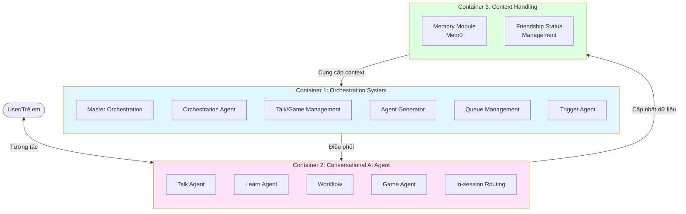
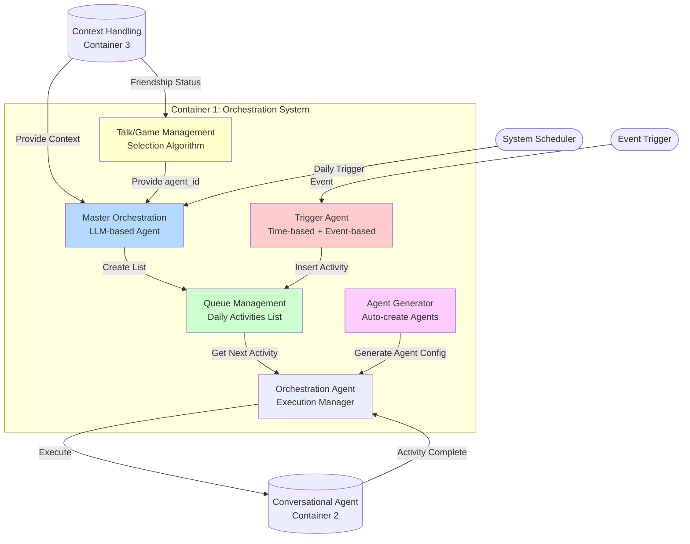
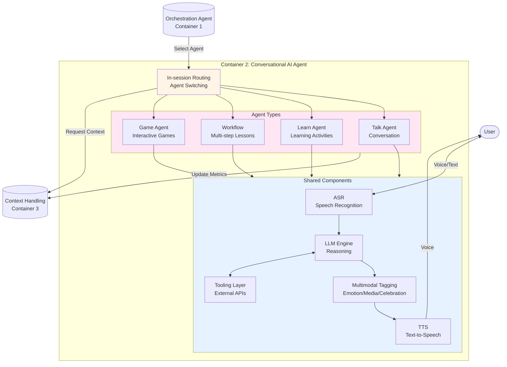
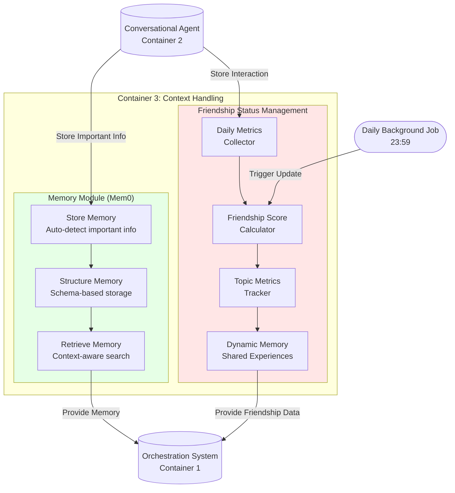

# ĐẶC TẢ KIẾ N TRÚC AI PLATFORM: HƯỚNG DẪN CHI TIẾT CHO PRODUCT TEAM (Tái Cấu Trúc V3)

**Version:** 3.0 **Date:** 24/11/2025

---

## 1\. Tóm Tắt Điều Hành và Bối Cảnh Chiến Lược (Context)

### 1.1. Tóm Tắt Điều Hành (Executive Summary)

Tài liệu này là bản đặc tả chi tiết về kiến trúc **AI Platform** của Pika, được tái cấu trúc theo mô hình 3 lớp chức năng rõ ràng: **Orchestration**, **Conversation**, và **Context Handling**. Kiến trúc này được thiết kế để hướng dẫn Product Team trong việc phát triển và vận hành sản phẩm, đảm bảo tính nhất quán, khả năng mở rộng, và tập trung vào việc tạo ra một trải nghiệm học tiếng Anh giao tiếp được cá nhân hóa sâu sắc cho trẻ em.

### 1.2. Bối Cảnh Chiến Lược (Context)

| Khía Cạnh | Mô Tả Chi Tiết | Ý Nghĩa Chiến Lược cho Product Team |
| :---- | :---- | :---- |
| **Mục Tiêu Cấp Cao** | Tăng **Retention** và **Engagement** của trẻ em thông qua trải nghiệm học tiếng Anh giao tiếp được cá nhân hóa. | Mọi tính năng mới phải được đo lường dựa trên tác động của nó đến hai chỉ số này trong bối cảnh giáo dục. |
| **Lợi Thế Cạnh Tranh** | Kiến trúc 3 lớp tách biệt rõ ràng giữa **hoạch định (Orchestration)**, **thực thi (Conversation)**, và **dữ liệu (Context)**, cho phép phát triển độc lập, tối ưu hóa chuyên sâu từng mảng, và tăng tốc độ ra mắt tính năng mới. | Cho phép Product Team tập trung vào **chiến lược điều phối** và **trải nghiệm hội thoại** mà không bị ràng buộc bởi các chi tiết kỹ thuật của việc quản lý dữ liệu. |
| **Đối Tượng Người Dùng** | Trẻ em (từ 6-12 tuổi) học tiếng Anh giao tiếp. | Yêu cầu cao về **Safety (An toàn)**, **Engagement (Hấp dẫn)**, và **Personalization (Cá nhân hóa)** theo độ tuổi. |

### 1.3. Tổng Quan Kiến Trúc 3 Lớp

Kiến trúc được chia thành 3 Container (Lớp) chính, mỗi lớp chịu trách nhiệm cho một mảng chức năng riêng biệt và tương tác với nhau thông qua các API được định nghĩa rõ ràng.

| Container | Chức Năng Cốt Lõi | Ví Dụ Hoạt Động |
| :---- | :---- | :---- |
| **1\. Orchestration System** | **Hoạch định và Điều phối:** Quyết định "Hôm nay trẻ nên làm gì?" và điều chỉnh kế hoạch đó dựa trên các sự kiện. | Xây dựng Daily Activities List, chèn một GameAgent vào hàng đợi khi trẻ học quá lâu. |
| **2\. Conversational AI Agent** | **Thực thi và Tương tác:** Giao tiếp trực tiếp với người dùng trong từng hoạt động cụ thể. | Thực hiện một bài học về phát âm, trò chuyện về chủ đề khủng long, chơi một game đố vui. |
| **3\. Context Handling** | **Quản lý và Cập nhật Dữ liệu:** Thu thập, xử lý, và duy trì tất cả dữ liệu về người dùng và mối quan hệ. | Cập nhật điểm tình bạn cuối ngày, lưu một "ký ức chung" mới vào Mem0. |

## 2\. Container 1: Orchestration System (Hệ Thống Điều Phối)

### 2.1. Tổng Quan và Sơ Đồ Tương Tác

**Chức năng cốt lõi:** Orchestration System là "bộ não" của Pika, chịu trách nhiệm **hoạch định chiến lược** và **điều phối** toàn bộ trải nghiệm của người dùng. Nó quyết định trẻ sẽ làm gì, khi nào, và linh hoạt điều chỉnh kế hoạch đó dựa trên các sự kiện phát sinh, ngay cả khi trẻ không ở trong ứng dụng.

**Luồng hoạt động chính:**

1. **Master Orchestration** được kích hoạt hàng ngày, nhận dữ liệu từ **Container 3 (Context Handling)** để xây dựng một **Daily Activities List** (kế hoạch hoạt động trong ngày).  
2. Kế hoạch này được lưu vào **Queue Management** dưới dạng một hàng đợi ưu tiên.  
3. Khi người dùng bắt đầu phiên học, **Orchestration Agent** sẽ lấy hoạt động có độ ưu tiên cao nhất từ hàng đợi và yêu cầu **Container 2 (Conversational AI Agent)** thực thi.  
4. Trong khi đó, **Trigger Agent** liên tục lắng nghe các sự kiện (ví dụ: trẻ học quá 15 phút, hoặc 3 ngày không vào học). Khi một sự kiện xảy ra, nó sẽ chèn một hoạt động mới vào hàng đợi, làm thay đổi kế hoạch ban đầu.  
5. **Talk/Game Management** và **Agent Generator** là các module hỗ trợ, cung cấp các agent phù hợp và tạo ra các agent mới khi cần.

### 2.2. Master Orchestration

**Chức năng:** Là bộ não hoạch định chiến lược, sử dụng LLM để xây dựng một kế hoạch hoạt động hàng ngày (Daily Activities List) được cá nhân hóa sâu sắc cho mỗi người dùng.

| Khía Cạnh | Mô Tả Chi Tiết |
| :---- | :---- |
| **Input** | \- **`user_id`** để xác định người dùng. \- \*\*Context JSON:\*\* Một đối tượng JSON toàn diện từ Context Provider, bao gồm \`learning\_status\`, \`friendship\_status\`, và \`user\_profile\`. |
| **Logic Xử Lý** | 1\.  **Prompt Construction:** Xây dựng một prompt chi tiết cho LLM, bao gồm Context JSON và **10 Nguyên Tắc Vàng** (Guiding Principles) về sư phạm. 2\. \*\*LLM Inference:\*\* Gửi prompt đến LLM để nhận về một kế hoạch chiến lược (danh sách hoạt động và lý do). 3\. \*\*List Building (V1):\*\* Chuyển đổi kế hoạch chiến lược thành một danh sách 10 hoạt động có thể thực thi với \`activity\_id\` và \`priority\` cụ thể. Logic V1 là cố định (rule-based) theo thứ tự sau: 1\. \*\*GreetingAgent:\*\* Lựa chọn theo events hoặc ôn bài cũ. 2\. \*\*Learn:\*\* Bài học tiếp theo trong lộ trình. 3\. \*\*Talk:\*\* Lấy từ Talk/Game Management. 4\. \*\*Learn:\*\* Bài học tiếp theo trong lộ trình. 5\. \*\*Game:\*\* Lấy từ Talk/Game Management. 6\. \*\*Talk:\*\* Lấy từ Talk/Game Management. 7\. \*\*Learn:\*\* Bài học tiếp theo trong lộ trình. 8\. \*\*Game:\*\* Lấy từ Talk/Game Management. 9\. \*\*Talk:\*\* Lấy từ Talk/Game Management. 10\. \*\*Learn:\*\* Bài học tiếp theo trong lộ trình. |
| **Output** | **Daily Activities List:** Một mảng JSON chứa các hoạt động cho ngày hôm đó, được sắp xếp theo thứ tự ưu tiên. |

### 2.3. Orchestration Agent

**Chức năng:** Là người quản lý và thực thi, chịu trách nhiệm lấy các hoạt động từ Queue Management và điều phối việc thực thi chúng trong phiên học.

| Khía Cạnh | Mô Tả Chi Tiết |
| :---- | :---- |
| **Input** | \- **`user_id`** khi bắt đầu phiên học. \- Tín hiệu "hoàn thành" từ hoạt động hiện tại. |
| **Logic Xử Lý** | 1\.  Khi phiên học bắt đầu, gọi **Queue Management** để lấy hoạt động có `priority` cao nhất. 2\. Yêu cầu \*\*In-session Routing (Container 2)\*\* thực thi \`activity\_id\` tương ứng. 3\. Chờ nhận tín hiệu "hoàn thành" (activity\_completed). 4\. Lặp lại bước 1 để lấy hoạt động tiếp theo. |
| **Output** | \- Yêu cầu thực thi đến **In-session Routing**. \- Tín hiệu kết thúc phiên học khi hàng đợi trống hoặc người dùng thoát. |

### 2.4. Talk/Game Management

**Chức năng:** Hoạt động như một chuyên gia về sở thích, chịu trách nhiệm chọn ra một `agent_id` (Talk hoặc Game) phù hợp nhất khi được Master Orchestration hoặc Trigger Agent yêu cầu.

| Khía Cạnh | Mô Tả Chi Tiết |
| :---- | :---- |
| **Input** | \- **`user_id`** để truy cập `friendship_status`. \- \*\*Context:\*\* Gợi ý từ LLM (ví dụ: \`{topic: "dinosaurs"}\`). |
| **Logic Xử Lý** | 1\.  **Xác định Phase:** Dựa trên `friendship_score` để xác định giai đoạn tình bạn (Stranger, Acquaintance, Friend). 2\. \*\*Lọc Kho Hoạt động:\*\* Giới hạn các kho Talk/Game được phép truy cập dựa trên Phase. 3\. \*\*Tạo Danh sách Ứng viên:\*\* Tạo một danh sách các agent tiềm năng dựa trên context, sở thích (\`topic\_metrics\`), và ký ức chung (\`dynamic\_memory\`). 4\. \*\*Chọn Ứng viên Tốt nhất:\*\* Ưu tiên các ứng viên và áp dụng bộ lọc chống lặp để chọn ra agent phù hợp nhất. |
| **Output** | Một `agent_id` duy nhất. |

### 2.5. Agent Generator

**Chức năng:** Tự động sinh ra các agent mới (chủ yếu là Learn Agent và Talk Agent) dựa trên một mẫu (template) và dữ liệu đầu vào, giúp giảm tải công việc thủ công và tăng khả năng cá nhân hóa.

| Khía Cạnh | Mô Tả Chi Tiết |
| :---- | :---- |
| **Input** | \- **`user_profile`**: Để hiểu về điểm mạnh, điểm yếu của trẻ. \- \*\*\`agent\_template\`\*\*: Một cấu trúc định sẵn cho một loại agent (ví dụ: template cho một Learn Agent sửa lỗi ngữ pháp). |
| **Logic Xử Lý** | 1\.  Nhận yêu cầu tạo agent (ví dụ: từ Trigger Agent sau khi phát hiện trẻ sai ngữ pháp nhiều). 2\. Chọn \`agent\_template\` phù hợp (ví dụ: \`template\_grammar\_review\`). 3\. Điền các thông tin cụ thể vào template từ \`user\_profile\` (ví dụ: \`error\_type: "simple\_past\_tense"\`). 4\. Lưu cấu hình agent mới vào cơ sở dữ liệu và trả về \`agent\_id\` mới. |
| **Output** | Một `agent_id` mới, sẵn sàng để được chèn vào hàng đợi. |

### 2.6. Queue Management (Daily Activities List)

**Chức năng:** Hoạt động như một hàng đợi ưu tiên (Priority Queue), lưu trữ và quản lý kế hoạch hoạt động hàng ngày.

| Khía Cạnh | Mô Tả Chi Tiết |
| :---- | :---- |
| **Cấu Trúc Dữ Liệu** | Một danh sách (list/array) các đối tượng, mỗi đối tượng đại diện cho một hoạt động và có các trường: `activity_id`, `activity_type`, và `priority`. |
| **Logic Hoạt Động** | \- **Thêm (Enqueue):** Khi một hoạt động mới được thêm vào, danh sách sẽ tự động được sắp xếp lại dựa trên `priority` (số càng cao, ưu tiên càng lớn). \- \*\*Lấy (Dequeue):\*\* Luôn trả về và xóa hoạt động ở đầu danh sách (có \`priority\` cao nhất). |
| **Đặc Điểm** | \- **Linh hoạt:** Cho phép các hoạt động có độ ưu tiên cao (ví dụ: từ Trigger Agent) "chen ngang" vào kế hoạch đã định sẵn. \- \*\*Minh bạch:\*\* Cung cấp một cái nhìn rõ ràng về những gì người dùng sẽ làm tiếp theo. |

### 2.7. Trigger Agent (Out-of-session Orchestration)

**Chức năng:** Hoạt động như một hệ thống giám sát ngầm, lắng nghe các sự kiện xảy ra cả trong và ngoài phiên học để điều chỉnh kế hoạch một cách linh hoạt.

| Khía Cạnh | Mô Tả Chi Tiết |
| :---- | :---- |
| **Input** | \- **Time-based Events:** Các sự kiện dựa trên thời gian (ví dụ: đã 3 ngày trôi qua kể từ lần học cuối). \- \*\*Event-based Events:\*\* Các sự kiện dựa trên hành động (ví dụ: trẻ vừa hoàn thành một bài học với điểm số thấp, hoặc vừa học liên tục 15 phút). |
| **Logic Xử Lý** | 1\.  Lắng nghe các sự kiện từ hệ thống. 2\. Khi một sự kiện khớp với một quy tắc đã định (trigger rule), thực hiện hành động tương ứng. 3\. Hành động phổ biến nhất là yêu cầu \*\*Agent Generator\*\* tạo một agent mới và/hoặc chèn trực tiếp một \`activity\_id\` vào \*\*Queue Management\*\* với độ ưu tiên cao. |
| **Output** | Một yêu cầu cập nhật đến **Queue Management**. |
| **Ví dụ** | \- **Sự kiện:** `long_learning_session` (học \> 15 phút). \- \*\*Hành động:\*\* Yêu cầu \*\*Talk/Game Management\*\* chọn một GameAgent yêu thích và chèn vào hàng đợi với \`priority: 8\` để giảm căng thẳng. |

## 3\. Container 2: Conversational AI Agent (Agent Tương Tác)

### 3.1. Tổng Quan và Sơ Đồ Tương Tác

**Chức năng cốt lõi:** Conversational AI Agent là "bộ mặt" và "giọng nói" của Pika. Container này chịu trách nhiệm **thực thi** các hoạt động được giao bởi Orchestration System và **tương tác trực tiếp** với người dùng. Đây là nơi các cuộc hội thoại, bài học, và trò chơi thực sự diễn ra.

**Luồng hoạt động chính:**

1. **In-session Routing** nhận một `activity_id` từ **Orchestration Agent (Container 1\)**.  
2. Nó xác định loại agent cần thực thi (Talk, Learn, Game, Workflow) và tải agent đó lên.  
3. Agent được tải sẽ sử dụng một bộ các **Shared Components** (Thành phần dùng chung) để tương tác với người dùng.  
4. Người dùng nói, **ASR** chuyển thành văn bản.  
5. Văn bản được đưa vào **LLM Engine** cùng với prompt của agent để xử lý và tạo ra phản hồi.  
6. LLM có thể sử dụng **Tooling Layer** để truy cập thông tin bên ngoài hoặc sử dụng **Multimodal Tagging Layer** để làm giàu phản hồi.  
7. Phản hồi cuối cùng được chuyển đến **TTS** để tạo ra giọng nói của Pika và gửi đến người dùng.  
8. Trong suốt quá trình, agent liên tục gửi các chỉ số tương tác đến **Container 3 (Context Handling)** để cập nhật.

### 3.2. Shared Components (Thành phần dùng chung)

Đây là các công nghệ nền tảng được tất cả các agent trong container này sử dụng để đảm bảo một trải nghiệm tương tác mượt mà và nhất quán.

| Component | Chức Năng | Phạm Vi Tác Động của PM |
| :---- | :---- | :---- |
| **ASR (Automatic Speech Recognition)** | Chuyển đổi giọng nói của trẻ thành văn bản với độ chính xác cao. | \- Lựa chọn và tinh chỉnh model ASR cho phù hợp với giọng nói trẻ em. \- Thiết kế UI/UX cho trạng thái lắng nghe và xử lý. |
| **LLM Engine** | Là bộ não xử lý ngôn ngữ, tạo ra các phản hồi thông minh, phù hợp với ngữ cảnh. | \- Lựa chọn model LLM (ví dụ: GPT-4, Gemini). \- Thiết kế và tối ưu hóa cấu trúc của \*\*System Prompt\*\*. \- Định nghĩa các quy tắc an toàn (Safety Guardrails). |
| **TTS (Text-to-Speech)** | Chuyển đổi văn bản do LLM tạo ra thành giọng nói tự nhiên, có cảm xúc của Pika. | \- Lựa chọn và tinh chỉnh giọng nói của Pika. \- Thiết kế cách Pika thể hiện cảm xúc qua giọng nói. |
| **Tooling Layer** | Cung cấp cho LLM khả năng truy cập các công cụ bên ngoài (ví dụ: gọi API thời tiết, tra cứu từ điển). | \- Xác định các công cụ cần thiết cho các kịch bản tương tác. \- Thiết kế cách LLM yêu cầu và xử lý kết quả từ công cụ. |
| **Multimodal Tagging Layer** | Cho phép LLM gợi ý các hành vi (emotion), media, và hiệu ứng (celebration) thông qua một hệ thống tag đơn giản. | \- Định nghĩa danh sách các tag được hỗ trợ (ví dụ: `[EMOTION:happy]`, `[CELEBRATE]`). \- Thiết kế cách các tag này được ánh xạ sang các hiệu ứng hình ảnh và âm thanh cụ thể. |

### 3.3. System Prompt Template (Cấu Trúc Mới)

System Prompt là bản chỉ dẫn cốt lõi được gửi đến LLM cho mọi lượt tương tác. Nó quyết định "tính cách" và "năng lực" của Pika. Cấu trúc mới được chia thành 7 phần rõ ràng để tối ưu hóa khả năng điều khiển và tính nhất quán.

| Phần | Tên | Nội Dung Chi Tiết |
| :---- | :---- | :---- |
| **1** | **Context** | \- **Identity Pika:** "Bạn là Pika, một người bạn AI..." \- \*\*User Profile:\*\* Thông tin về trẻ (tên, tuổi, sở thích). \- \*\*Mission:\*\* Nhiệm vụ của Pika (giúp trẻ học tiếng Anh, xây dựng tình bạn). \- \*\*Personality:\*\* Tính cách của Pika (tò mò, thân thiện, kiên nhẫn). |
| **2** | **Universal Style Guide** | \- **Language:** Ngôn ngữ sử dụng (ví dụ: American English). \- \*\*Question Rule:\*\* Quy tắc đặt câu hỏi (ví dụ: không hỏi quá 2 câu liên tiếp). \- \*\*Engagement:\*\* Các kỹ thuật để tăng tương tác (ví dụ: dùng câu cảm thán, khen ngợi). |
| **3** | **Interaction Rules** | Các quy tắc tương tác cụ thể cho từng loại agent (ví dụ: trong Learn Agent, phải có đánh giá đúng/sai). |
| **4** | **Opening Guide, Goal & Trigger & Action** | \- **Opening Guide:** Cách bắt đầu cuộc trò chuyện. \- \*\*Goal:\*\* Mục tiêu của agent hiện tại (ví dụ: "Giúp trẻ học 5 từ vựng về động vật"). \- \*\*Trigger & Action:\*\* Các kịch bản "Nếu... thì..." (ví dụ: "Nếu trẻ trả lời sai 2 lần, hãy đưa ra gợi ý"). |
| **5** | **User Memory** | Dữ liệu từ Mem0 và Friendship Status, bao gồm các ký ức chung và sở thích của trẻ. |
| **6** | **Technical & Safety** | \- **`current_datetime`**: Ngày giờ hiện tại. \- \*\*Scoring & Emotion\*\*: Cách đánh giá và ghi nhận cảm xúc. \- \*\*Format Rules Logic\*\*: Quy tắc về định dạng output (ví dụ: phải là JSON). \- \*\*Tools\*\*: Danh sách các công cụ LLM có thể sử dụng. \- \*\*Policies\*\*: Các chính sách an toàn và bảo mật. |
| **7** | **Language \+ Level** | Ngôn ngữ và cấp độ phù hợp với người dùng (ví dụ: "English \- A2 Level"). |

### 3.4. Talk Agent

**Chức năng:** Tập trung vào việc xây dựng và nuôi dưỡng mối quan hệ tình bạn giữa trẻ và Pika thông qua các cuộc trò chuyện tự nhiên, không có mục tiêu học tập rõ ràng.

- **Đặc điểm:** Linh hoạt, không theo kịch bản cứng, có khả năng gợi mở và đào sâu vào các chủ đề mà trẻ quan tâm.  
- **Ví dụ:** `agent_daily_chat_sports_topic`, `agent_encouragement_chat`.

### 3.5. Learn Agent

**Chức năng:** Tập trung vào một mục tiêu học tập cụ thể, chẳng hạn như luyện một kỹ năng phát âm, học một bộ từ vựng, hoặc sửa một lỗi ngữ pháp.

- **Đặc điểm:** Có cấu trúc rõ ràng, có cơ chế đánh giá đúng/sai, và thường đi kèm với các hoạt động tương tác (ví dụ: lặp lại một câu, trả lời câu hỏi).  
- **Ví dụ:** `lesson_review_pronunciation_th`, `learn_agent_irregular_verbs`.

### 3.6. Workflow

**Chức năng:** Là một chuỗi các hoạt động được kết nối với nhau để tạo thành một bài học hoàn chỉnh, thường bao gồm nhiều bước và có thể kết hợp cả Learn Agent và Talk Agent.

- **Đặc điểm:** Có tính tuần tự, mỗi bước phụ thuộc vào kết quả của bước trước. Thường được sử dụng cho các bài học chính trong lộ trình học tập.  
- **Ví dụ:** Một workflow học về "simple past tense" có thể bao gồm: (1) Giới thiệu lý thuyết, (2) Luyện tập với câu đơn, (3) Trò chuyện ngắn sử dụng thì quá khứ đơn.

### 3.7. Game Agent

**Chức năng:** Cung cấp các trò chơi tương tác để củng cố kiến thức, tăng cường sự hứng thú, và giảm căng thẳng sau các hoạt động học tập.

- **Đặc điểm:** Có luật chơi rõ ràng, có tính điểm hoặc phần thưởng, và tập trung vào sự vui vẻ.  
- **Ví dụ:** `game_dino_quiz_4`, `game_animal_sounds_3`.

### 3.8. In-session Routing

**Chức năng:** Hoạt động như một "bộ điều phối cấp thấp" bên trong phiên học. Nó nhận yêu cầu từ Orchestration Agent và đảm bảo agent tương ứng được tải và thực thi.

| Khía Cạnh | Mô Tả Chi Tiết |
| :---- | :---- |
| **Input** | Một `activity_id` từ **Orchestration Agent**. |
| **Logic Xử Lý** | 1\.  Phân tích `activity_id` để xác định loại agent (ví dụ: `game_` \-\> GameAgent, `lesson_` \-\> LearnAgent). 2\. Tải cấu hình của agent từ cơ sở dữ liệu. 3\. Xây dựng \*\*System Prompt\*\* cụ thể cho agent đó. 4\. Khởi tạo agent và bắt đầu phiên tương tác với người dùng. |
| **Output** | Một agent đang hoạt động, sẵn sàng để tương tác. |

## 4\. Container 3: Context Handling (Quản Lý Ngữ Cảnh)

### 4.1. Tổng Quan và Sơ Đồ Tương Tác

**Chức năng cốt lõi:** Context Handling là "bộ nhớ" của Pika. Container này chịu trách nhiệm **thu thập, xử lý, và duy trì** tất cả dữ liệu về người dùng và mối quan hệ của họ với Pika. Nó cung cấp "nguyên liệu" đầu vào cho Orchestration System để đưa ra các quyết định thông minh và đảm bảo tính liên tục, cá nhân hóa cho trải nghiệm người dùng.

**Luồng hoạt động chính:**

1. Trong suốt quá trình tương tác, **Conversational AI Agent (Container 2\)** liên tục gửi các dữ liệu thô (ví dụ: số lượt trò chuyện, cảm xúc, thông tin quan trọng) đến **Context Handling**.  
2. **Daily Metrics Collector** thu thập và lưu trữ tạm thời các chỉ số tương tác trong ngày.  
3. **Memory Module (Mem0)** tự động phát hiện và lưu trữ các thông tin quan trọng, đáng nhớ dưới dạng có cấu trúc.  
4. Vào cuối ngày (23:59), một **Daily Background Job** sẽ kích hoạt **Friendship Score Calculator**.  
5. Calculator đọc dữ liệu từ **Daily Metrics**, tính toán sự thay đổi, và cập nhật vào các thành phần dài hạn như **Friendship Score**, **Topic Metrics**, và **Dynamic Memory**.  
6. Khi **Orchestration System (Container 1\)** cần đưa ra quyết định, nó sẽ gọi đến **Context Handling** để lấy dữ liệu `friendship_status` và `memory` mới nhất.

### 4.2. Memory Module (Mem0)

**Chức năng:** Hoạt động như một bộ nhớ dài hạn, tự động ghi lại các thông tin quan trọng về người dùng (sở thích, sự kiện trong đời, điểm mạnh/yếu) để Pika có thể "nhớ" và nhắc lại trong các cuộc trò chuyện sau này.

| Component | Chức Năng | Ví Dụ |
| :---- | :---- | :---- |
| **Store Memory** | Tự động phát hiện các thông tin quan trọng từ cuộc hội thoại. | LLM phát hiện câu nói "My dog's name is Milu" và gắn cờ đây là một thông tin cần lưu. |
| **Structure Memory** | Lưu trữ thông tin dưới dạng có cấu trúc (schema-based) để dễ dàng truy vấn. | Lưu dưới dạng `{type: "pet_info", name: "Milu", species: "dog"}`. |
| **Retrieve Memory** | Cung cấp các thông tin liên quan khi được các agent khác yêu cầu. | Khi trò chuyện về chủ đề "động vật", agent có thể truy vấn Mem0 để hỏi "How is Milu today?". |

### 4.3. Friendship Status Management

**Chức năng:** Quản lý toàn bộ trạng thái mối quan hệ giữa trẻ và Pika. Đây là trái tim của việc cá nhân hóa trải nghiệm, quyết định cách Pika tương tác và lựa chọn hoạt động.

| Component | Chức Năng | Cấu Trúc Dữ Liệu (Ví dụ) |
| :---- | :---- | :---- |
| **Daily Metrics Collector** | Thu thập các chỉ số tương tác thô trong một ngày. Dữ liệu này sẽ được xử lý và xóa sau khi cập nhật cuối ngày. | `{"total_turns": 25, "user_initiated_questions": 3, "session_emotion": "interesting"}` |
| **Friendship Score Calculator** | Tính toán sự thay đổi của điểm tình bạn dựa trên các chỉ số trong ngày. | `daily_change_score = (total_turns * 0.5) + (user_questions * 3) + (emotion_bonus)` |
| **Topic Metrics Tracker** | Theo dõi mức độ quan tâm của trẻ đối với từng chủ đề trò chuyện. | `{"agent_movie": {"topic_score": 45.0, "total_turns": 50}, "agent_animal": {"topic_score": 22.5}}` |
| **Dynamic Memory Manager** | Lưu trữ các "ký ức chung" cụ thể, những khoảnh khắc đáng nhớ giữa trẻ và Pika. | `[{"memory_id": "mem_01", "content": "Hứa sẽ cùng nhau xem phim Vùng Đất Linh Hồn."}]` |

### 4.4. Daily Update Logic (Logic Cập Nhật Cuối Ngày)

Đây là một quy trình tự động (background job) chạy vào cuối mỗi ngày để đảm bảo dữ liệu `friendship_status` luôn được cập nhật, phản ánh đúng các tương tác trong ngày.

**Quy trình thực thi:**

1. **Trigger:** Tác vụ được kích hoạt tự động vào 23:59 mỗi ngày.  
2. **Query:** Lấy tất cả các bản ghi người dùng có `daily_metrics` không rỗng.  
3. **Calculate:** Với mỗi người dùng, gọi **Friendship Score Calculator** để tính toán `daily_change_score`.  
4. **Update:**  
   - Cập nhật `friendship_score` và `friendship_level`.  
   - Cập nhật `topic_score` và `total_turns` trong `topic_metrics`.  
   - Cập nhật `streak_day` và `last_interaction_date`.  
5. **Cleanup:** Reset `daily_metrics` về rỗng để chuẩn bị cho ngày hôm sau.

## 5\. Phạm Vi Tác Động của Product Team và Kỹ Thuật

Bảng dưới đây phân định rõ trách nhiệm giữa Product Team (PM) và Kỹ Thuật (Engineering) trong việc phát triển và vận hành AI Platform.

| Container | Trách Nhiệm của Product Team (PM) | Trách Nhiệm của Kỹ Thuật (Engineering) |
| :---- | :---- | :---- |
| **1\. Orchestration System** | \- **Định nghĩa Guiding Principles** cho Master Orchestration. \- \*\*Thiết kế Trigger Rules\*\* (ví dụ: khi nào chèn game, khi nào chèn bài ôn tập). \- \*\*Xác định Priority Levels\*\* cho các loại hoạt động. \- \*\*Thiết kế logic lựa chọn\*\* cho Talk/Game Management. | \- Xây dựng và tối ưu hóa pipeline của Master Orchestration. \- Triển khai cơ chế lắng nghe sự kiện của Trigger Agent. \- Xây dựng API cho Talk/Game Management. \- Đảm bảo Queue Management hoạt động ổn định. |
| **2\. Conversational AI Agent** | \- **Thiết kế Persona** và giọng văn của Pika. \- \*\*Viết và tối ưu hóa System Prompt\*\* cho các loại agent. \- \*\*Định nghĩa các Tools\*\* cần thiết cho Tooling Layer. \- \*\*Thiết kế danh sách Multimodal Tags\*\* và trải nghiệm đi kèm. \- \*\*Thiết kế nội dung\*\* cho các Learn Agent và Workflow. | \- Tinh chỉnh và triển khai các model ASR, LLM, TTS. \- Xây dựng Tooling Layer và các API kết nối. \- Xây dựng AI Wrapper để xử lý Multimodal Tags. \- Xây dựng bộ khung (framework) để chạy các loại agent khác nhau. |
| **3\. Context Handling** | \- **Định nghĩa cấu trúc dữ liệu** của Mem0 và Friendship Status. \- \*\*Thiết kế công thức tính Friendship Score\*\* và các chỉ số liên quan. \- \*\*Xác định các loại thông tin\*\* cần được lưu vào Mem0. \- \*\*Thiết kế các cấp độ tình bạn\*\* (Friendship Levels) và ý nghĩa của chúng. | \- Xây dựng và vận hành cơ sở dữ liệu NoSQL. \- Triển khai logic tự động phát hiện và lưu trữ của Mem0. \- Xây dựng background job để chạy Daily Update Logic. \- Đảm bảo tính toàn vẹn và bảo mật của dữ liệu người dùng. |

## 6\. Quy Trình Triển Khai Ý Tưởng Sản Phẩm

1. **Ý tưởng (Idea):** PM có một ý tưởng mới, ví dụ: "Pika nên có một hoạt động ôn tập từ vựng hàng tuần".  
2. **Phân loại (Categorize):** PM xác định ý tưởng này thuộc về container nào. Trong ví dụ này, nó thuộc về **Orchestration System** (vì liên quan đến việc chèn một hoạt động mới vào kế hoạch).  
3. **Đặc tả (Specification):** PM viết đặc tả chi tiết cho ý tưởng:  
   - **Trigger:** Time-based, kích hoạt vào mỗi Chủ Nhật hàng tuần.  
   - **Action:** Chèn một `WeeklyVocabularyReviewAgent` vào Daily Activities List với `priority: 9`.  
   - **Agent:** `WeeklyVocabularyReviewAgent` sẽ lấy 10 từ vựng mà trẻ hay sai nhất trong tuần từ `learning_status` để ôn tập.  
4. **Triển khai (Implementation):**  
   - **Team Kỹ thuật (Orchestration):** Thêm một quy tắc mới vào **Trigger Agent**.  
   - **Team Kỹ thuật (Conversation):** Xây dựng `WeeklyVocabularyReviewAgent` theo đặc tả.  
5. **Kiểm thử và Ra mắt (Test & Launch):** Tính năng được kiểm thử và triển khai.

## 7\. Câu Hỏi Thường Gặp (Q\&A)

**Q1: Tại sao lại tách thành 3 container riêng biệt?**

**A:** Việc tách thành 3 container (Orchestration, Conversation, Context) giúp chúng ta: (1) **Phát triển độc lập:** Mỗi team có thể tập trung vào một mảng mà không ảnh hưởng đến các team khác. (2) **Tối ưu hóa chuyên sâu:** Có thể lựa chọn công nghệ tốt nhất cho từng nhiệm vụ (ví dụ: dùng LLM cho hoạch định, dùng model nhỏ hơn cho conversation). (3) **Dễ dàng mở rộng:** Có thể thay thế hoặc nâng cấp một container mà không cần xây dựng lại toàn bộ hệ thống.

**Q2: Master Orchestration và Orchestration Agent khác nhau như thế nào?**

**A:** Hãy tưởng tượng Master Orchestration là một **nhà chiến lược quân sự**, người ngồi trong phòng và vạch ra kế hoạch tác chiến cho cả một ngày. Orchestration Agent là một **sĩ quan chỉ huy ngoài mặt trận**, người nhận kế hoạch đó và ra lệnh cho từng đơn vị (Talk Agent, Learn Agent) thực hiện nhiệm vụ của mình theo đúng thứ tự.

**Q3: Trigger Agent có thể làm gián đoạn phiên học của trẻ không?**

**A:** Không. Trigger Agent không trực tiếp làm gián đoạn. Nó chỉ **chèn một hoạt động mới** vào hàng đợi (Queue Management). Hoạt động đó chỉ được thực thi **sau khi** trẻ hoàn thành hoạt động hiện tại. Điều này đảm bảo luồng học tập của trẻ không bị cắt ngang một cách đột ngột.

**Q4: Dữ liệu trong Context Handling được cập nhật khi nào?**

**A:** Có hai luồng cập nhật: (1) **Cập nhật thời gian thực:** Các chỉ số cơ bản như `total_turns` được cập nhật ngay trong phiên học. (2) **Cập nhật cuối ngày:** Các chỉ số quan trọng như `friendship_score` và `topic_metrics` được tính toán và cập nhật một lần vào cuối ngày thông qua một background job. Điều này giúp giảm tải cho hệ thống và đảm bảo tính nhất quán của dữ liệu.

**Q5: Làm thế nào để thêm một Game mới vào hệ thống?**

**A:** Quy trình bao gồm: (1) **Team Game:** Xây dựng Game Agent mới. (2) **Team Kỹ thuật (Conversation):** Tích hợp Game Agent vào framework. (3) **PM:** Cập nhật kho hoạt động của **Talk/Game Management** để module này có thể lựa chọn game mới dựa trên các quy tắc đã định. Master Orchestration không cần thay đổi gì.  
