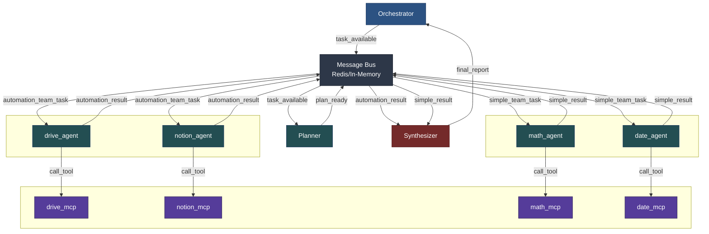

```
dùng agent_team thay cho agent_pool dùng agent_name thay cho agent_type

Và vẽ full kiến trúc (agent_team: automation_team, simple_team), agent_name: drive_agent, notion_agent, ..., simple_agent có math_agent, date_agent (call đến MCP: ...)

Các agent này call đến MCP

-- vẫn giữ kiến trúc message bus

```


### Architecture Pattern được Khuyến Nghị

```
┌─────────────────────────────────────────────────────────────┐
│                    YOUR AGENT PLATFORM                      │
│                                                             │
│  ┌──────────────┐         ┌─────────────────┐             │
│  │  FastAPI     │────────▶│  Session Store  │             │
│  │  Backend     │◀────────│  (Redis/DB)     │             │
│  └──────────────┘         └─────────────────┘             │
│         │                          │                        │
│         │                          │ user_id → token       │
│         ▼                          ▼                        │
│  ┌──────────────────────────────────────────┐             │
│  │     MCP Server Manager                   │             │
│  │  - Spawn per-user MCP servers            │             │
│  │  - Track active servers                  │             │
│  │  - Cleanup on logout/timeout             │             │
│  └──────────────────────────────────────────┘             │
│         │                                                   │
└─────────┼───────────────────────────────────────────────────┘
          │
          ▼
┌─────────────────────────────────────────────────────────────┐
│              PER-USER MCP SERVERS (Isolated)                │
│                                                             │
│  ┌─────────────────┐    ┌─────────────────┐               │
│  │ MCP Server      │    │ MCP Server      │               │
│  │ (User A)        │    │ (User B)        │               │
│  │                 │    │                 │               │
│  │ OAuth Token A   │    │ OAuth Token B   │               │
│  │ Port: 8001      │    │ Port: 8002      │               │
│  └─────────────────┘    └─────────────────┘               │
│         │                       │                          │
│         ▼                       ▼                          │
│  ┌─────────────────┐    ┌─────────────────┐               │
│  │ Google Drive A  │    │ Google Drive B  │               │
│  └─────────────────┘    └─────────────────┘               │
└─────────────────────────────────────────────────────────────┘
```

## 2. Implementation Chi Tiết


```bash

1. Orchestrator (Entry Point)
   ├─ Khởi tạo MessageBus + tất cả agents
   ├─ Init MCP adapter (nếu có)
   └─ Start run_loop cho tất cả agents

2. Planner Agent (Planning)
   ├─ Subscribe "task_available"
   ├─ Phân tích query (LLM hoặc heuristic)
   ├─ Tạo plan: list[PlanStep] với agent_pool, agent_type, arguments
   └─ Publish trực tiếp từng step đến special agents:
      ├─ "math_task" (nếu có math step)
      ├─ "date_task" (nếu có date step)
      ├─ "web_browsertask" (nếu có youtube step)
      └─ "{pool}_task" (cho các pool khác)

3. Agent Teams (Execution)
   ├─ Math Team: DemoMathAgentSum, DemoMathAgentSubtract
   │  ├─ Subscribe "math_task"
   │  ├─ Match agent_type (sum/subtract)
   │  ├─ Call MCP tool (mcp_sum/mcp_subtract)
   │  └─ Publish "math_result" → MessageBus
   │
   ├─ Date Team: DateAgentToday
   │  ├─ Subscribe "date_task"
   │  └─ Publish "date_result" → MessageBus
   │
   └─ Automation Team: SheetAgent/DriveAgent/NotionAgent...
      ├─ Subscribe ""
      └─ Publish "" → MessageBus

4. Tester Agent (Aggregation)
   ├─ Subscribe: "", "", ""
   ├─ Collect tất cả results
   ├─ Generate final report (format markdown)
   └─ Publish "final_report" → MessageBus


```





# Hướng Dẫn Chi Tiết: Triển Khai Hệ Thống AI Agent Multi-Tenant với Drive MCP

Dựa trên nghiên cứu từ các nguồn chuyên sâu, đây là architecture guide đầy đủ để xây dựng hệ thống cho phép nhiều người dùng truy cập Drive riêng của họ thông qua AI agent.

## 1. Tổng Quan Kiến Trúc

### Architecture Pattern được Khuyến Nghị

```
┌─────────────────────────────────────────────────────────────┐
│                    YOUR AGENT PLATFORM                      │
│                                                             │
│  ┌──────────────┐         ┌─────────────────┐             │
│  │  FastAPI     │────────▶│  Session Store  │             │
│  │  Backend     │◀────────│  (Redis/DB)     │             │
│  └──────────────┘         └─────────────────┘             │
│         │                          │                        │
│         │                          │ user_id → token       │
│         ▼                          ▼                        │
│  ┌──────────────────────────────────────────┐             │
│  │     MCP Server Manager                   │             │
│  │  - Spawn per-user MCP servers            │             │
│  │  - Track active servers                  │             │
│  │  - Cleanup on logout/timeout             │             │
│  └──────────────────────────────────────────┘             │
│         │                                                   │
└─────────┼───────────────────────────────────────────────────┘
          │
          ▼
┌─────────────────────────────────────────────────────────────┐
│              PER-USER MCP SERVERS (Isolated)                │
│                                                             │
│  ┌─────────────────┐    ┌─────────────────┐               │
│  │ MCP Server      │    │ MCP Server      │               │
│  │ (User A)        │    │ (User B)        │               │
│  │                 │    │                 │               │
│  │ OAuth Token A   │    │ OAuth Token B   │               │
│  │ Port: 8001      │    │ Port: 8002      │               │
│  └─────────────────┘    └─────────────────┘               │
│         │                       │                          │
│         ▼                       ▼                          │
│  ┌─────────────────┐    ┌─────────────────┐               │
│  │ Google Drive A  │    │ Google Drive B  │               │
│  └─────────────────┘    └─────────────────┘               │
└─────────────────────────────────────────────────────────────┘
```


---

