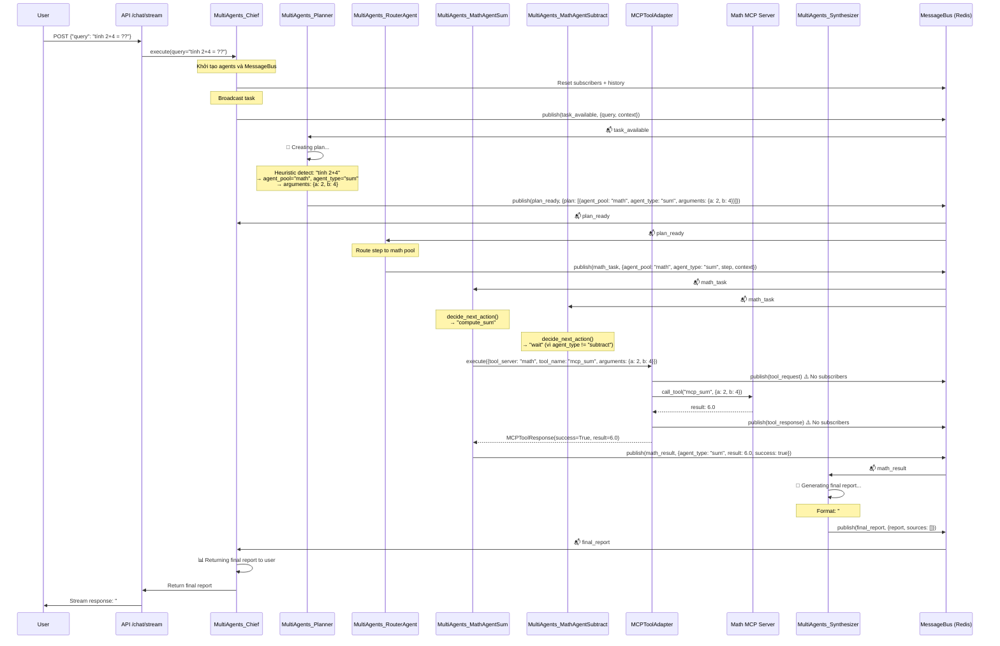
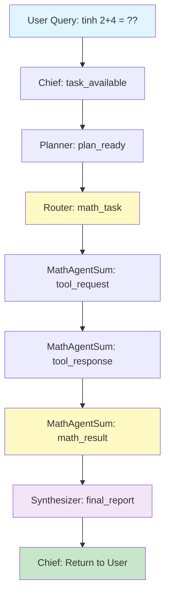

# Multi Agents Flow Diagram - "Tính 2+4"

## Sequence Diagram



## Message Flow (Topics)



## Agent Responsibilities

### 1. **MultiAgents_Chief**

- Nhận query từ API
- Broadcast `task_available`
- Subscribe: `plan_ready`, `final_report`
- Trả kết quả cuối cùng cho user

### 2. **MultiAgents_Planner**

- Subscribe: `task_available`
- Detect math query: "tính 2+4" → heuristic plan
- Tạo plan: `{agent_pool: "math", agent_type: "sum", arguments: {a: 2, b: 4}}`
- Publish: `plan_ready`

### 3. **MultiAgents_RouterAgent**

- Subscribe: `plan_ready`
- Route step dựa trên `agent_pool`:
  - `agent_pool="math"` → publish `math_task`
  - `agent_pool="date"` → publish `date_task`
  - `agent_pool="web"` → để ActionExecutor xử lý

### 4. **MultiAgents_MathAgentSum**

- Subscribe: `math_task`
- Filter: chỉ xử lý khi `agent_type == "sum"`
- Gọi MCP tool: `mcp_sum` với arguments `{a: 2, b: 4}`
- Publish: `math_result` với `result: 6.0`

### 5. **MultiAgents_MathAgentSubtract**

- Subscribe: `math_task`
- Filter: chỉ xử lý khi `agent_type == "subtract"`
- Trong case này: không xử lý (vì `agent_type="sum"`)

### 6. **MCPToolAdapter**

- Bridge giữa Agents và MCP Servers
- Execute tool: `mcp_sum` → Math MCP Server
- Publish events: `tool_request`, `tool_response` (optional, không có subscribers)

### 7. **Math MCP Server**

- Tool: `mcp_sum(a, b)` → return `a + b`
- Tool: `mcp_subtract(a, b)` → return `a - b`

### 8. **MultiAgents_Synthesizer**

- Subscribe: `math_result`, `date_result`, `verification_done`
- Collect results từ các pools
- Generate final report markdown
- Publish: `final_report`

## Key Points

1. **Message Bus Pattern**: Tất cả agents giao tiếp qua Redis MessageBus với topics
2. **Agent Pools**: Router phân loại tasks vào đúng pool (math, date, web)
3. **MCP Tools**: Math agents sử dụng MCP protocol để gọi tools
4. **Broadcast vs Direct**: Messages thường broadcast (`to_agent="broadcast"`), tất cả subscribers nhận
5. **Filtering**: Mỗi agent filter messages dựa trên `agent_type` hoặc `topic`
6. **Synthesizer**: Tổng hợp kết quả từ nhiều pools thành final report

## Log Analysis (dòng 948-1020)

```
948: Chief broadcast task "tính 2+4 = ??"
949: MessageBus publish task_available
958: Planner nhận task_available
960: Planner tạo plan (1 step)
962: Planner publish plan_ready
963-965: Chief và Router nhận plan_ready
968: Router route 1 step → math_task
969: Router publish math_task
971-973: MathAgentSum và MathAgentSubtract đều nhận math_task
975: MathAgentSum publish tool_request (no subscribers - warning)
979: MathAgentSum publish tool_response (no subscribers - warning)
981: MathAgentSum publish math_result với result=6.0
982: Synthesizer nhận math_result
984: Synthesizer generate final report
986: Synthesizer publish final_report
987: Chief nhận final_report
989: Chief return final report cho user
990-992: Final Report: "## Math Results:\n- **sum**: 6.0"
994: Task completed, agents stopped
```

## Improvements Needed

1. **Tool Request/Response Events**: Hiện tại không có subscribers cho `tool_request` và `tool_response` → có thể bỏ hoặc thêm monitoring agent
2. **MathAgentSubtract**: Nhận message nhưng không xử lý → có thể optimize filter sớm hơn
3. **Error Handling**: Cần thêm error handling cho các edge cases
4. **Parallel Execution**: Có thể chạy nhiều math operations song song nếu cần