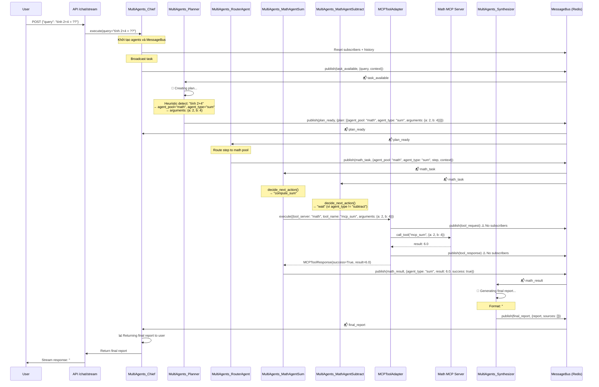
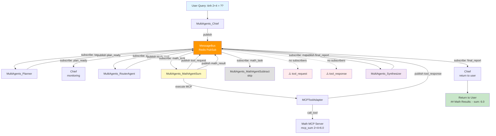
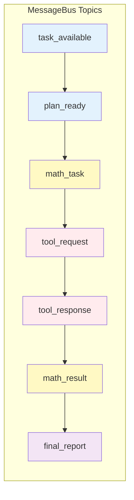

# Multi Agents Flow Diagram - "Tính 2+4"

## Sequence Diagram



## Message Flow với MessageBus (Redis) - Current Implementation



### MessageBus Topics Flow



## MessageBus Architecture

### Subscribe/Publish Pattern

Tất cả agents giao tiếp qua **MessageBus (Redis PubSub)** với pattern:

1. **Subscribe**: Agents đăng ký lắng nghe các topics

   ```python
   # Ví dụ: Planner subscribe task_available
   bus.subscribe("task_available", callback_handler)
   ```
2. **Publish**: Agents gửi messages vào topics

   ```python
   # Ví dụ: Chief publish task_available
   await bus.publish(Message(
       from_agent="MultiAgents_Chief",
       to_agent="broadcast",
       topic="task_available",
       payload={...}
   ))
   ```
3. **Broadcast**: `to_agent="broadcast"` → tất cả subscribers nhận message

### Agent Subscriptions

| Agent                       | Subscribed Topics                                                             |
| --------------------------- | ----------------------------------------------------------------------------- |
| **Chief**             | `plan_ready`, `final_report`, `verification_done`, `navigation_error` |
| **Planner**           | `task_available`, `renavigate_request`, `navigation_error`              |
| **Router**            | `plan_ready`                                                                |
| **MathAgentSum**      | `math_task`                                                                 |
| **MathAgentSubtract** | `math_task`                                                                 |
| **Synthesizer**       | `math_result`, `date_result`, `verification_done`                       |

### Message Topics Flow

```
task_available → plan_ready → math_task → tool_request → tool_response → math_result → final_report
```

### Flow Details (Based on Current Code)

**Step-by-step flow với MessageBus topics:**

1. **User Query** → `A`

   - User gửi: `"tinh 2+4 = ??"`
   - API nhận và gọi `agent.execute(query)`
2. **Chief: task_available** → `B`

   - Chief broadcast `task_available` với payload:
     ```json
     {
       "financial_query": {"query": "tinh 2+4 = ??"},
       "context": {...}
     }
     ```
3. **Planner: plan_ready** → `C`

   - Planner nhận `task_available`
   - Heuristic detect: "tính 2+4" → math query
   - Extract operands: `a=2, b=4, op=+`
   - Tạo plan step: `{agent_pool: "math", agent_type: "sum", arguments: {a: 2, b: 4}}`
   - Publish `plan_ready` với plan
4. **Router: math_task** → `D`

   - Router nhận `plan_ready`
   - Route step → publish `math_task` với payload:
     ```json
     {
       "step": {...},
       "agent_pool": "math",
       "agent_type": "sum",
       "tool_server": "math",
       "tool_name": "mcp_sum",
       "arguments": {"a": 2, "b": 4}
     }
     ```
5. **MathAgentSum: tool_request** → `E`

   - MathAgentSum nhận `math_task` (MathAgentSubtract cũng nhận nhưng skip)
   - Filter: `agent_type == "sum"` → match
   - Gọi MCPToolAdapter.execute()
   - MCPToolAdapter publish `tool_request` (⚠️ no subscribers)
6. **MathAgentSum: tool_response** → `F`

   - MCPToolAdapter execute `mcp_sum(2, 4)` → result: `6.0`
   - Publish `tool_response` (⚠️ no subscribers)
7. **MathAgentSum: math_result** → `G`

   - MathAgentSum publish `math_result` với payload:
     ```json
     {
       "agent_type": "sum",
       "success": true,
       "result": 6.0,
       "step": {...}
     }
     ```
8. **Synthesizer: final_report** → `H`

   - Synthesizer nhận `math_result`
   - Collect result vào `collected_results["math_results"]`
   - Generate final report: `"## Math Results:\n- **sum**: 6.0"`
   - Publish `final_report`
9. **Chief: Return to User** → `I`

   - Chief nhận `final_report`
   - Return report cho user qua API stream
   - Task completed, agents stopped

## Agent Responsibilities

### 1. **MultiAgents_Chief**

- Nhận query từ API
- Broadcast `task_available`
- Subscribe: `plan_ready`, `final_report`
- Trả kết quả cuối cùng cho user

### 2. **MultiAgents_Planner**

- Subscribe: `task_available`
- Detect math query: "tính 2+4" → heuristic plan
- Tạo plan: `{agent_pool: "math", agent_type: "sum", arguments: {a: 2, b: 4}}`
- Publish: `plan_ready`

### 3. **MultiAgents_RouterAgent**

- Subscribe: `plan_ready`
- Route step dựa trên `agent_pool`:
  - `agent_pool="math"` → publish `math_task`
  - `agent_pool="date"` → publish `date_task`
  - `agent_pool="web"` → để ActionExecutor xử lý

### 4. **MultiAgents_MathAgentSum**

- Subscribe: `math_task`
- Filter: chỉ xử lý khi `agent_type == "sum"`
- Gọi MCP tool: `mcp_sum` với arguments `{a: 2, b: 4}`
- Publish: `math_result` với `result: 6.0`

### 5. **MultiAgents_MathAgentSubtract**

- Subscribe: `math_task`
- Filter: chỉ xử lý khi `agent_type == "subtract"`
- Trong case này: không xử lý (vì `agent_type="sum"`)

### 6. **MCPToolAdapter**

- Bridge giữa Agents và MCP Servers
- Execute tool: `mcp_sum` → Math MCP Server
- Publish events: `tool_request`, `tool_response` (optional, không có subscribers)

### 7. **Math MCP Server**

- Tool: `mcp_sum(a, b)` → return `a + b`
- Tool: `mcp_subtract(a, b)` → return `a - b`

### 8. **MultiAgents_Synthesizer**

- Subscribe: `math_result`, `date_result`, `verification_done`
- Collect results từ các pools
- Generate final report markdown
- Publish: `final_report`

## Key Points

1. **Message Bus Pattern**: Tất cả agents giao tiếp qua Redis MessageBus với topics
2. **Agent Pools**: Router phân loại tasks vào đúng pool (math, date, web)
3. **MCP Tools**: Math agents sử dụng MCP protocol để gọi tools
4. **Broadcast vs Direct**: Messages thường broadcast (`to_agent="broadcast"`), tất cả subscribers nhận
5. **Filtering**: Mỗi agent filter messages dựa trên `agent_type` hoặc `topic`
6. **Synthesizer**: Tổng hợp kết quả từ nhiều pools thành final report

## Log Analysis (dòng 948-1020)

```
948: Chief broadcast task "tính 2+4 = ??"
949: MessageBus publish task_available
958: Planner nhận task_available
960: Planner tạo plan (1 step)
962: Planner publish plan_ready
963-965: Chief và Router nhận plan_ready
968: Router route 1 step → math_task
969: Router publish math_task
971-973: MathAgentSum và MathAgentSubtract đều nhận math_task
975: MathAgentSum publish tool_request (no subscribers - warning)
979: MathAgentSum publish tool_response (no subscribers - warning)
981: MathAgentSum publish math_result với result=6.0
982: Synthesizer nhận math_result
984: Synthesizer generate final report
986: Synthesizer publish final_report
987: Chief nhận final_report
989: Chief return final report cho user
990-992: Final Report: "## Math Results:\n- **sum**: 6.0"
994: Task completed, agents stopped
```

## Improvements Needed

1. **Tool Request/Response Events**: Hiện tại không có subscribers cho `tool_request` và `tool_response` → có thể bỏ hoặc thêm monitoring agent
2. **MathAgentSubtract**: Nhận message nhưng không xử lý → có thể optimize filter sớm hơn
3. **Error Handling**: Cần thêm error handling cho các edge cases
4. **Parallel Execution**: Có thể chạy nhiều math operations song song nếu cần

<style>#mermaid-1766585512060{font-family:sans-serif;font-size:16px;fill:#333;}#mermaid-1766585512060 .error-icon{fill:#552222;}#mermaid-1766585512060 .error-text{fill:#552222;stroke:#552222;}#mermaid-1766585512060 .edge-thickness-normal{stroke-width:2px;}#mermaid-1766585512060 .edge-thickness-thick{stroke-width:3.5px;}#mermaid-1766585512060 .edge-pattern-solid{stroke-dasharray:0;}#mermaid-1766585512060 .edge-pattern-dashed{stroke-dasharray:3;}#mermaid-1766585512060 .edge-pattern-dotted{stroke-dasharray:2;}#mermaid-1766585512060 .marker{fill:#333333;}#mermaid-1766585512060 .marker.cross{stroke:#333333;}#mermaid-1766585512060 svg{font-family:sans-serif;font-size:16px;}#mermaid-1766585512060 .label{font-family:sans-serif;color:#333;}#mermaid-1766585512060 .label text{fill:#333;}#mermaid-1766585512060 .node rect,#mermaid-1766585512060 .node circle,#mermaid-1766585512060 .node ellipse,#mermaid-1766585512060 .node polygon,#mermaid-1766585512060 .node path{fill:#ECECFF;stroke:#9370DB;stroke-width:1px;}#mermaid-1766585512060 .node .label{text-align:center;}#mermaid-1766585512060 .node.clickable{cursor:pointer;}#mermaid-1766585512060 .arrowheadPath{fill:#333333;}#mermaid-1766585512060 .edgePath .path{stroke:#333333;stroke-width:1.5px;}#mermaid-1766585512060 .flowchart-link{stroke:#333333;fill:none;}#mermaid-1766585512060 .edgeLabel{background-color:#e8e8e8;text-align:center;}#mermaid-1766585512060 .edgeLabel rect{opacity:0.5;background-color:#e8e8e8;fill:#e8e8e8;}#mermaid-1766585512060 .cluster rect{fill:#ffffde;stroke:#aaaa33;stroke-width:1px;}#mermaid-1766585512060 .cluster text{fill:#333;}#mermaid-1766585512060 div.mermaidTooltip{position:absolute;text-align:center;max-width:200px;padding:2px;font-family:sans-serif;font-size:12px;background:hsl(80,100%,96.2745098039%);border:1px solid #aaaa33;border-radius:2px;pointer-events:none;z-index:100;}#mermaid-1766585512060:root{--mermaid-font-family:sans-serif;}#mermaid-1766585512060:root{--mermaid-alt-font-family:sans-serif;}#mermaid-1766585512060 flowchart{fill:apa;}</style>