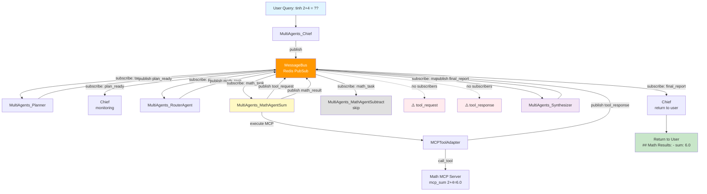

1. Orchestrator
   ├─ Init MessageBus, MCP, Agents
   ├─ Broadcast "task_available" (trực tiếp, không qua Chief)
   └─ Đợi "final_report"

2. Planner
   ├─ Subscribe "task_available"
   ├─ Tạo plan
   └─ Publish "math_task", "date_task", etc. (trực tiếp)

3. Agent Pools
   ├─ Subscribe "{pool}_task"
   └─ Publish "{pool}_result"

4. Synthesizer
   ├─ Subscribe "{pool}_result"
   └─ Publish "final_report"

5. Orchestrator
   └─ Nhận "final_report" → Return


---




---

```
1. Orchestrator (Entry Point)
   ├─ Khởi tạo MessageBus + tất cả agents
   ├─ Init MCP adapter (nếu có)
   └─ Start run_loop cho tất cả agents

2. Chief Agent (Coordinator)
   ├─ Nhận query từ Orchestrator
   └─ Broadcast "task_available" → MessageBus

3. Planner Agent (Planning)
   ├─ Subscribe "task_available"
   ├─ Phân tích query (LLM hoặc heuristic)
   ├─ Tạo plan: list[PlanStep] với agent_pool, agent_type, arguments
   └─ Publish "plan_ready" → MessageBus
   ├─ Với mỗi step trong plan:
   │  ├─ Xác định agent_pool (math/date/youtube/web)
   │  ├─ Tra catalog để lấy tool_server, tool_name
   │  └─ Publish "{pool}_task" → MessageBus
   └─ Ví dụ: math_task, date_task, youtube_task

5. Agent Pools (Execution)
   ├─ Khoa Hoc Cong Nghe Pool (kho toán): MathAgent, Hoá Agent
   │  ├─ Subscribe "math_task"
   │  ├─ Match agent_type (sum/subtract)
   │  ├─ Call MCP tool (mcp_sum/mcp_subtract)
   │  └─ Publish "math_result" → MessageBus
   │
   ├─ Date Pool (kho date): DateAgentToday
   │  ├─ Subscribe "date_task"
   │  └─ Publish "date_result" → MessageBus
   │
   └─ YouTube Pool (kho youtube): YouTubeAgentOpen/Search/Play/Info
      ├─ Subscribe "youtube_task"
      └─ Publish "youtube_result" → MessageBus

6. Synthesizer Agent (Aggregation)
   ├─ Subscribe: "math_result", "date_result", "youtube_result"
   ├─ Collect tất cả results
   ├─ Generate final report (format markdown)
   └─ Publish "final_report" → MessageBus

7. Chief Agent (Return)
   ├─ Subscribe "final_report"
   ├─ Nhận final report từ Synthesizer
   └─ Return về Orchestrator

8. Orchestrator (Exit)
   ├─ Nhận final_report từ MessageBus
   ├─ Stop tất cả agents
   └─ Return kết quả cho user


```